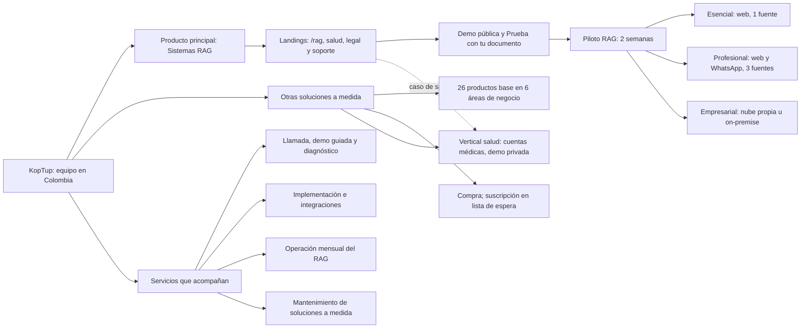

# Visión de producto

> Qué es KopTup, qué vende primero, a quién, con qué promesa y bajo qué principios. Es el marco de todas las demás páginas: la experiencia de cada pantalla, las landings, el catálogo y el roadmap salen de aquí.
>
> **Decisión del dueño (vigente al 8 de octubre de 2026):** el producto principal de KopTup son los **sistemas RAG**. Prevalece sobre cualquier versión anterior del plan que presentara a KopTup como agencia genérica de software a medida o que pusiera otra demo en el centro.
>
> Páginas relacionadas: [Diagnóstico](01-Diagnostico.md) (de dónde se parte), [Sistemas RAG](Producto-chatbot-rag-ia.md) (el producto principal en detalle), [Reposicionamiento RAG](13-Reposicionamiento-RAG.md) (los cambios del sitio, hechos en la rama `rag-reposicionamiento` y pendientes de merge), [Flujo del cliente](03-Flujo-del-Cliente.md), [Sistema de demos](04-Sistema-de-Demos.md), [Catálogo de productos](08-Catalogo-de-Productos.md), [Comercial, marketing y legal](11-Comercial-Marketing-y-Legal.md) y [Roadmap](12-Roadmap.md).

---

## En una mirada

- **KopTup es una empresa colombiana** (Bogotá) con equipo en Colombia, que atiende a empresas de Colombia primero y de Latinoamérica hispana después.
- **Producto principal: sistemas RAG.** Una IA que responde con los documentos de cada empresa (manuales, contratos, políticas, protocolos, normas) y **cita la fuente**. Si la respuesta no está en los documentos, dice "No encontré esa información" en lugar de inventarla.
- **Línea secundaria: "Otras soluciones a medida".** 26 productos base con demo navegable (CRM, ERP, POS, LMS, facturación electrónica y más) que se adaptan al proceso de cada cliente.
- **Cómo se compra el RAG:** demo pública sin registro → "Prueba con tu documento" → **Piloto RAG de 2 semanas** → plan **Esencial**, **Profesional** o **Empresarial**.
- **Cómo se compran las otras soluciones:** como proyecto (pago único de implementación y mantenimiento opcional). Su suscripción queda en **lista de espera** hasta que exista la base para operarla y cobrarla (DECISIÓN 7).
- **Tres principios no negociables:** honestidad (sin cifras, clientes ni certificaciones inventadas), demo con IA real y datos del cliente protegidos.
- **Qué se deja atrás:** el sitio que hoy se presenta como "Transformamos tus ideas en soluciones tecnológicas", con 27 productos del mismo peso y cifras sin respaldo ([Diagnóstico](01-Diagnostico.md)).

---

## Qué es KopTup

**Mensaje principal:** "IA que responde con los documentos de tu empresa". Es el H1 del inicio en la rama `rag-reposicionamiento` y el titular de la pauta.

### Dos líneas de negocio, en este orden

| Línea | Qué es | Promesa al cliente | Dónde vive en el sitio | Peso en el esfuerzo |
|---|---|---|---|---|
| **Sistemas RAG** (producto principal) | IA que responde con los documentos de cada empresa, cita la fuente y dice cuándo no encuentra la respuesta. Por web y, desde el plan Profesional, por WhatsApp | "Respuestas con la fuente citada. Pruébalo sin registro y valídalo en un Piloto de 2 semanas" | Inicio, `/rag`, `/rag/salud`, `/rag/legal`, `/rag/soporte`, `/chatbots-ia`, `/services#planes-rag`, `/demo/chatbot` | Primero en todo: pauta, contenido, demo, roadmap y primer producto con mensualidad real |
| **Otras soluciones a medida** | Estudio de software a medida que parte de **productos base con demo navegable**: 26 productos en 6 áreas de negocio | "Ves el producto funcionando antes de comprarlo. Pagas la adaptación a tu proceso, no un desarrollo desde cero" | `/services#otras-soluciones`, `/productos/<slug>`, `/demo` | Segunda línea: llega por SEO, LinkedIn, referidos y el sistema de solicitud de demos. No debe frenar el embudo RAG |

Las dos líneas comparten marca (**KopTup**, siempre con esa grafía), equipo, portal del cliente y panel de administración.

### Qué no es KopTup

- **No es una agencia genérica.** "Transformamos tus ideas en soluciones tecnológicas" no dice qué se vende ni a quién; se reemplaza.
- **No vende chatbots de reglas ni "chatbot gratis".** Un chatbot de flujos responde preguntas cerradas; el RAG responde preguntas abiertas sobre documentos largos y puede combinarse con flujos cuando hace falta.
- **La auditoría de cuentas médicas no es el producto principal.** Es un vertical de salud con demo **privada**, que se presenta como **"Sistema experto para salud"** porque su código usa reglas y búsqueda exacta, no búsqueda vectorial ([Auditoría de cuentas médicas](Demo-cuentas-medicas.md)). Se muestra desde `/rag/salud` como caso del sector.
- **El generador de contenido para LinkedIn no es un producto.** Es una herramienta interna de marketing ([Motor de contenido para LinkedIn](Demo-linkedin-ads.md)).
- **No vende lo que no puede operar o cobrar.** Nada de suscripciones sin cobro recurrente, integraciones sin código ni certificaciones sin auditoría.

---

## Diagrama de la propuesta

> [Ver diagrama como imagen](images/diagramas/02-Vision-de-Producto-1.png)

**Cómo leerlo:**

- **El producto principal tiene una escalera de compra corta:** demo gratis, Piloto pagado y barato, y plan con mensualidad. Cada paso descuenta riesgo al siguiente (el Piloto se abona al setup si el cliente contrata en 30 días).
- **Las otras soluciones son la segunda línea** y varias funcionan como **complemento** del RAG: la mesa de ayuda usa la base de conocimiento, el gestor documental comparte el núcleo de búsqueda con citas, el LMS puede tener un tutor sobre el material del curso y la telemedicina, guías clínicas con citas ([Sistemas RAG](Producto-chatbot-rag-ia.md), sección "Resumen").
- **Los servicios** no se venden sueltos: acompañan a un plan RAG (operación mensual) o a una solución a medida (implementación y mantenimiento).

---

## Para quién

### Cliente ideal

| Criterio | Sistemas RAG | Otras soluciones a medida |
|---|---|---|
| Tamaño | Empresas de 20 a 500 personas | Empresas de 20 a 500 personas |
| País | Colombia primero; Latinoamérica hispana con precios en USD | Colombia |
| Señales de compra | Mucho conocimiento en documentos internos, preguntas repetidas del equipo o de los clientes, áreas de soporte, jurídica o calidad, atención por WhatsApp | Procesos en hojas de cálculo, software que no se ajusta al proceso, crecimiento reciente, varias sedes |
| Condición para el Piloto | Al menos 100 documentos de consulta frecuente y una persona dueña del contenido que pueda validar las 50 preguntas del informe | Un responsable del proceso del lado del cliente |
| Capacidad de pago | Puede pagar el Piloto (COP 3.900.000) y el primer año del plan Esencial | Puede pagar el plan Básico del producto |

Detalle por segmento, personas compradoras y mensajes en [Comercial, marketing y legal](11-Comercial-Marketing-y-Legal.md), sección 2.

### Sectores del RAG

| Sector | Documentos típicos | Landing | Pauta en los primeros 90 días |
|---|---|---|---|
| **Salud** (IPS, clínicas, laboratorios, aseguradoras, operadores administrativos) | Protocolos clínicos, normativa del sector, manuales tarifarios, contratos | `/rag/salud` | Sí (P1). El Piloto se hace con documentos administrativos, sin datos de pacientes |
| **Legal** (áreas jurídicas, firmas) | Contratos, conceptos jurídicos internos, normativa | `/rag/legal` | Sí (P1) |
| **Soporte y atención al cliente** | Manuales de producto, políticas, base de conocimiento para agentes | `/rag/soporte` y `/chatbots-ia` | Sí (P1) |
| Recursos humanos, educación, cooperativas y financiero, retail | Reglamentos, beneficios, requisitos, PQRS, garantías | `/rag` (landings propias en la Fase 5 si hay demanda) | No: SEO, LinkedIn y referidos |

### Quién decide y quién evalúa

- **Decide:** gerencia general, gerencia de operaciones o de servicio, dirección jurídica o dirección médica.
- **Evalúa:** TI o seguridad de la información. Lee la sección de seguridad de `/rag` y pregunta cómo se integra y cómo se sale si no funciona.

### Fuera de perfil

- Personas naturales, estudiantes y búsquedas de "chatbot gratis".
- Proyectos que exigen cargar datos de pacientes en la demo o en el Piloto.
- Clones de plataformas grandes sin presupuesto, o proyectos sin un responsable del lado del cliente.

---

## Propuesta de valor

### Sistemas RAG

| Lo que le duele al cliente | Lo que hace KopTup | Cómo lo comprueba el cliente |
|---|---|---|
| El conocimiento vive en PDF, carpetas compartidas y correos; el equipo pregunta lo mismo una y otra vez | Una IA que consulta solo los documentos que la empresa decide cargar | Lo prueba en `/demo/chatbot` sin registro, y con su propio documento en "Prueba con tu documento" |
| Los asistentes de IA de uso general no conocen los documentos internos y pueden inventar | Cada respuesta trae la cita del documento; si no está, responde "No encontré esa información" | Ve la cita en cada respuesta. En la Fase 2, la cita incluye la página exacta |
| No sabe si la IA va a funcionar con sus documentos | Piloto de 2 semanas con una fuente, hasta 100 documentos e **informe de precisión con 50 preguntas** | Recibe el informe antes de comprometerse con un plan |
| Teme por la confidencialidad | Documentos usados solo para responder sus preguntas; en la demo, borrados a la hora; en el plan Empresarial, pueden quedar en su nube u on-premise | Política de datos, anexo de tratamiento y la sección de seguridad de `/rag`, que describe lo que el código hace hoy |
| No sabe cuánto cuesta | Planes publicados en COP y USD fijos, con el costo del primer año | Tabla de `/services#planes-rag` |
| Necesita a alguien que responda | Equipo en Colombia, en español, de lunes a viernes de 8:00 a 17:00 | Horario y canales publicados en `/contact` |

**Se actualiza cuando agregas o cambias documentos.** No hay que reentrenar ningún modelo. (Nunca se dice "aprende solo".)

### Otras soluciones a medida

| Lo que le duele al cliente | Lo que hace KopTup | Cómo lo comprueba el cliente |
|---|---|---|
| Un desarrollo desde cero es caro y lento | Parte de un producto base que ya funciona y lo adapta a su proceso | Abre la demo del producto (pública o por solicitud) antes de pedir propuesta |
| El software empaquetado no se ajusta a su proceso | Adaptación por plan (Básico, Profesional, Avanzado, Enterprise) con alcance escrito | Landing `/productos/<slug>` con planes, qué incluye y tiempos de implementación |
| Teme quedar atado al proveedor | Recibe el código de lo que se construye para él y una licencia de uso del producto base; los términos exactos van en el contrato | Contrato tipo ([Comercial, marketing y legal](11-Comercial-Marketing-y-Legal.md), sección 16) |

### Por qué el RAG es el producto principal

1. **Es lo único con IA real funcionando de punta a punta en el sitio,** con backend propio y respuestas con fuente.
2. **Resuelve una necesidad que existe en todos los sectores,** con una oferta de entrada barata (el Piloto) e **ingresos mensuales** (Esencial y Profesional).
3. **Es la base del primer producto SaaS real de KopTup** (Fase 4), y su núcleo lo reutilizan otras soluciones.

---

## Modalidades de compra

### Sistemas RAG: del Piloto a un plan

Precios en COP **más IVA si aplica** y USD fijos (no se convierten con TRM). Fuente única en el código de la rama: `apps/web/src/lib/rag-plans.ts`.

| Plan | Pago inicial | Mensualidad | Implementación | Qué incluye |
|---|---|---|---|---|
| **Piloto RAG** | COP 3.900.000 / USD 1.200 | — | 2 semanas | Una fuente, hasta 100 documentos, interfaz web con citas e informe de precisión con 50 preguntas de prueba |
| **Esencial** | Setup COP 9.900.000 / USD 2.990 | COP 1.490.000 / USD 450 | 3–4 semanas | Una fuente (Drive, SharePoint o carga manual), hasta 1.000 documentos, widget web y respuestas con cita. La mensualidad incluye hosting, IA hasta 3.000 preguntas al mes, actualización de documentos y soporte Lun–Vie |
| **Profesional** | Setup COP 24.900.000 / USD 7.490 | COP 2.990.000 / USD 890 | 6–8 semanas | Hasta 3 fuentes, hasta 10.000 documentos, web y WhatsApp, permisos por rol y panel de métricas. Incluye hasta 15.000 preguntas al mes, soporte prioritario y revisión mensual de calidad |
| **Empresarial** | Desde COP 59.900.000 / USD 17.900 | Según SLA | 10–14 semanas | Fuentes ilimitadas, despliegue en la nube del cliente u on-premise, SSO, auditoría y código fuente incluido |

- **Crédito del Piloto:** si el cliente contrata un plan en los 30 días siguientes, se le descuenta el 100 % del Piloto del setup.
- **Pregunta adicional sobre el tope del plan:** COP 250 / USD 0,08.
- **WhatsApp:** las tarifas de Meta por mensajes se cobran aparte, al costo.
- **La mensualidad es la única suscripción que KopTup vende hoy** (DECISIÓN 7). Mientras no exista la Fase 4, Esencial y Profesional se operan como instancias gestionadas por KopTup, con factura mensual y conteo de preguntas desde los registros.
- Condiciones de pago, descuentos y costo del primer año en [Comercial, marketing y legal](11-Comercial-Marketing-y-Legal.md), sección 13.

### Otras soluciones a medida: compra, y suscripción en lista de espera

| | Compra / a medida | Suscripción hospedada |
|---|---|---|
| Qué pagas | Setup único y, si lo quieres, mantenimiento mensual | Setup y una mensualidad |
| Código fuente | Se entrega (lo construido para ti y una licencia de uso del producto base) | Lo opera KopTup (en el plan Empresarial de RAG, el código se entrega) |
| Dónde corre | En tu nube o la que elijas; KopTup puede operarla con el mantenimiento | En la infraestructura de KopTup |
| Nube, IA y mensajería | Las paga tu empresa a cada proveedor | Incluidas hasta el tope del plan |
| Disponible hoy para | Las 26 soluciones a medida | **Sistemas RAG**. Las demás: **"Suscripción: lista de espera"** |

- **Precios:** "desde" en COP + IVA, con el plan Básico como referencia, y USD **de referencia** calculado con una sola constante, `TRM_REFERENCIA = 3300`. Cuatro planes por producto: Básico, Profesional, Avanzado y Enterprise ([Servicios y precios](Seccion-Servicios-y-Precios.md)).
- **Mantenimiento:** decisión pendiente del dueño (D2). La recomendación es un porcentaje anual del setup pagado en cuotas, con horas de ajustes incluidas ([Comercial, marketing y legal](11-Comercial-Marketing-y-Legal.md), sección 13). Mientras tanto, las landings dicen "+ mantenimiento según plan (se detalla en tu propuesta)".
- **Lista de espera de suscripción:** cada landing permite anotarse; esa demanda decide qué producto sigue al RAG en la Fase 4. Las páginas de producto señalan candidatos, como [Facturación electrónica](Producto-facturacion-electronica.md) y [Firma electrónica](Producto-firma-electronica.md).

### Cómo se cobra en cada fase

| Fase del roadmap | Cobro |
|---|---|
| Fase 1 y Fase 2 | Factura electrónica y transferencia, PSE o enlace de pago de la pasarela creado a mano. El equipo marca el pago en el panel |
| Fase 3 — Propuestas y conversión | Anticipo de la propuesta aceptada con la pasarela integrada y confirmación automática |
| Fase 4 — Productos SaaS reales | Cobro recurrente de la mensualidad con medio de pago guardado, empezando por los planes RAG |

**Pasarelas:** Wompi o PayU para COP y Stripe para USD (DECISIÓN 7). La viabilidad de Stripe para una empresa constituida en Colombia está por confirmar (decisión D4); mientras tanto, los clientes del exterior pagan por transferencia internacional ([Comercial, marketing y legal](11-Comercial-Marketing-y-Legal.md), sección 14).

### Servicios que acompañan

| Servicio | Para qué | Precio |
|---|---|---|
| Llamada "Conocer tu caso" (30 min) | Recomendar el plan o el producto correcto | Gratis |
| Demo guiada o acceso de 14 días a una demo | Ver el producto con datos de su sector | Gratis, con aprobación ([Sistema de demos](04-Sistema-de-Demos.md)) |
| Diagnóstico de procesos (2 h) | Alcance de una página con plan recomendado y rango de precio | Gratis para leads de grado A o B |
| Taller de alcance | Documento de alcance, arquitectura y cronograma para proyectos grandes | Lo fija el dueño; se descuenta del setup |
| Implementación e integraciones | Google Drive, SharePoint, WhatsApp, bases de datos y APIs | Incluidas en el setup según el plan |
| Operación mensual (RAG) | Hosting, IA hasta el tope, actualización de documentos y soporte | Mensualidad del plan |
| Mantenimiento y evolución (a medida) | Correcciones, actualizaciones y nuevas funciones | Según la decisión D2 |

---

## Principios

| # | Principio | Qué significa en la práctica | Cómo se verifica |
|---|---|---|---|
| 1 | **Honestidad: sin cifras ni clientes inventados** | No se publican cifras de proyectos o clientes, calificaciones, testimonios, porcentajes de mejora ni certificaciones que no se puedan demostrar. Un caso real solo se publica con autorización escrita del cliente. Las metas de esta wiki son **metas iniciales a validar**, no resultados | Lista de frases prohibidas y script `check-claims` en CI ([Comercial, marketing y legal](11-Comercial-Marketing-y-Legal.md), sección 1); cero `aggregateRating` sin reseñas reales en los datos estructurados |
| 2 | **Demo con IA real** | La demo del producto principal responde con IA real sobre un documento, sin registro. Las maquetas de las otras soluciones se rotulan como "datos simulados" y no muestran métricas simuladas como si fueran reales. Una demo rota no se lista | La demo del chatbot llama al backend real; prueba de humo de todas las demos en CI ([Seguridad y calidad](10-Seguridad-y-Calidad.md)); QA de publicación ([Catálogo de demos](Seccion-Catalogo-de-Demos.md)) |
| 3 | **Datos del cliente protegidos** | Autorización previa, expresa e informada (Ley 1581 de 2012) en cada formulario; solo se pide lo necesario; los documentos de la demo se borran a la hora; aviso "No subas información confidencial en la demo"; el Piloto de salud no usa datos de pacientes; KopTup actúa como encargado con anexo de tratamiento; la política explica la transmisión al proveedor de IA | Política en `/privacy` revisada por un abogado; registro de cada autorización; borrado comprobable ([Legal](Seccion-Legal.md)) |
| 4 | **Seguridad decidida en el servidor** | La autenticación, la autorización y el acceso a cada demo se deciden en el servidor, nunca solo en el navegador. La IA tiene topes de costo y límites de uso. Las credenciales se rotan y no viven en el repositorio | Criterios de salida de la Fase 0 ([Seguridad y calidad](10-Seguridad-y-Calidad.md)) |
| 5 | **Una sola fuente de verdad** | Cada precio, dato de la empresa y conteo de demos vive en un solo archivo del código y las páginas lo leen de ahí | `rag-plans.ts`, `services-catalog.ts`, `company.ts` y `demos.ts`; cero precios distintos para el mismo producto |
| 6 | **Claridad antes que amplitud** | El RAG va primero en el menú, la home, la pauta y el roadmap. Las otras soluciones no compiten por la atención del visitante del RAG | Ninguna página de destino de pauta enlaza primero a una solución a medida |
| 7 | **Español claro, con "tú"** | Sin voseo ni "usted", sin jerga técnica en los textos comerciales, sin superlativos sin prueba ("el mejor", "líder") | Revisión de textos y búsqueda de formas de voseo antes de cada publicación |
| 8 | **Medir con consentimiento** | La analítica y las etiquetas de anuncios cargan solo si el visitante acepta cookies; los eventos no llevan datos personales | Banner con "Aceptar" y "Rechazar"; rechazar no carga scripts ([Reposicionamiento RAG](13-Reposicionamiento-RAG.md)) |

---

## Qué significa "producto vendible y claro para cada cliente"

El objetivo del dueño es que KopTup sea un producto **adecuado, vendible y claro para cada cliente**. Para que no quede en una intención, se define con criterios que se pueden comprobar uno por uno. Cada página `Producto-<slug>.md` tiene una sección "Qué falta para que sea vendible" que se mide contra esta lista, y el estado consolidado va en [Catálogo de productos](08-Catalogo-de-Productos.md).

### Vendible: 12 criterios

| # | Criterio | Cómo se verifica |
|---|---|---|
| V1 | **Propuesta de valor en una frase**, con para quién es | El H1 y el subtítulo de la landing dicen qué hace y para quién, sin jerga técnica |
| V2 | **Landing propia e indexable**: `/rag` para el RAG, `/productos/<slug>` para cada solución, con capturas, video corto, planes, preguntas frecuentes y CTA | La URL responde 200, está en el sitemap y su título cumple el formato "<título> \| KopTup" de 60 caracteres como máximo |
| V3 | **Precio publicado y completo**: COP + IVA si aplica, USD, qué incluye, plazo de implementación y costo del primer año | El precio sale de la fuente única y no aparece otro precio distinto para el mismo producto en ninguna pantalla (sitio, registro, portal o panel) |
| V4 | **Demo que funciona en producción** | Abre sin errores visibles ni de consola; pasa la prueba de humo en CI; los datos de ejemplo están en español colombiano, con fechas vigentes y sin marcas de terceros |
| V5 | **La demo corresponde al producto** | El botón de demo lleva a la demo del mismo producto; si no hay demo propia, no hay botón |
| V6 | **Modo de acceso definido** (`publico`, `solicitud` o `privado`) | El producto tiene su `DemoCatalogItem` configurado en Admin › Catálogo de demos |
| V7 | **Siguiente paso claro** | Un CTA principal según el modo de acceso, más "Agendar llamada" con agenda real (no `mailto:`); el formulario conserva producto, plan y UTM |
| V8 | **Afirmaciones verificables** | Cero frases de la lista prohibida; ninguna certificación, cifra ni cliente sin respaldo |
| V9 | **Alcance entregable escrito** | La página del producto define qué se entrega en cada plan y en cuánto tiempo, y qué paga el cliente aparte |
| V10 | **Medición activa** | Los eventos del embudo (vista de landing, clic en CTA, uso de la demo, lead) llegan a la analítica con consentimiento |
| V11 | **Cumplimiento** | Autorización Ley 1581 en cada formulario del producto; términos o contrato tipo listos para firmar |
| V12 | **Textos coherentes** | Español con "tú"; el nombre comercial, la categoría y la descripción coinciden en catálogo, landing, demo y metadatos |

### Claro para cada cliente: 5 criterios

| # | Criterio | Cómo se verifica |
|---|---|---|
| C1 | **Prueba de 5 segundos** | Se muestra la landing 5 segundos a 5 personas del segmento; al menos 4 dicen qué vende, para quién es y cuál es el siguiente paso |
| C2 | **Cada segmento tiene su mensaje, su landing, su oferta de entrada y su demo** | Tabla de segmentos completa en [Comercial, marketing y legal](11-Comercial-Marketing-y-Legal.md), sección 2 |
| C3 | **El precio no se descubre al final** | La mensualidad, el IVA y lo que se paga aparte aparecen junto al precio, no en letra pequeña ni en la propuesta |
| C4 | **El visitante sabe qué es real y qué es simulado** | Las demos maqueta muestran "Demo con datos simulados"; la demo del RAG dice que usa IA real |
| C5 | **Una sola respuesta para cada pregunta frecuente** | Las preguntas sobre precio, plazos, datos y soporte responden lo mismo en todas las páginas (los datos estructurados `FAQPage` coinciden con el texto visible) |

### Niveles de madurez de un producto

| Nivel | Qué significa | Ejemplos y fase |
|---|---|---|
| **Vitrina** | Demo navegable que muestra capacidad, sin landing propia ni precio claro | La mayoría de las otras soluciones en producción hoy |
| **Vendible** | Cumple V1–V12 y C1–C5 | El RAG, al fusionar la rama `rag-reposicionamiento` y cerrar las tareas de la Fase 0 de su página; las soluciones a medida, por olas en la Fase 1 (landings) y la Fase 2 (demos) |
| **Entregable** | Además, el alcance de cada plan está construido y probado con al menos un cliente | El Piloto RAG con su kit (Fase 1); los planes Esencial y Profesional con widget, conectores y WhatsApp (Fase 2) |
| **SaaS** | Además, base multi-tenant, medición de uso y cobro recurrente | Los planes RAG en la Fase 4; después, el producto con más demanda en la lista de espera |

---

## Modelo de acceso a las demos (resumen)

Cada demo tiene un **modo de acceso** (`accessMode`) que se cambia desde **Admin › Catálogo de demos** sin desplegar. Especificación completa en [Sistema de demos](04-Sistema-de-Demos.md).

| Modo | Qué ve el visitante | Para qué se usa | Ejemplos |
|---|---|---|---|
| `publico` | Entra sin cuenta. Banner "Solicita tu demo guiada" y "Agendar llamada" | Captar prospectos y posicionar en buscadores | `/demo/chatbot` (fijo: siempre público), CRM con IA, facturación electrónica |
| `solicitud` | Landing y vista previa (capturas y video). Para la demo completa debe **solicitar acceso**; el comercial o el admin aprueba | Demos de alto valor que conviene acompañar | ERP, telemedicina, WMS |
| `privado` | No aparece como abierta. Solo por **invitación directa del admin** | Demos con backend real y datos de un sector sensible | Auditoría de cuentas médicas y motor de reglas (salud) |

- **El RAG no pasa por la solicitud.** Su demo es pública y "Prueba con tu documento" pide solo email y autorización de datos. El sistema de solicitud acompaña su venta (demo guiada, preparación del Piloto y, en la Fase 2, acceso ampliado).
- **Flujo de una solicitud:** formulario "Solicitar demo" → solicitud y Lead → aprobación en **Admin › Solicitudes de demo** (vigencia de 14 días por defecto) → email con **enlace mágico** de un solo uso (72 h) → **Portal › Mis demos** → uso medido → extender, revocar o convertir → propuesta → cliente.
- **El acceso se verifica en el servidor**, no con códigos en el navegador. El acceso con un código fijo igual para todos que existe hoy se elimina.
- **Roles:** `admin`, `sales` (comercial), `prospect` (tiene demos), `client` (tiene proyecto), más `manager` y `developer` para el equipo. Solo `admin` aprueba demos privadas.
- **Semilla inicial:** 20 demos públicas, 6 con solicitud y 2 privadas (las 28 rutas de demo). Las páginas de producto pueden recomendar otro modo.

---

## Decisiones que enmarcan esta visión

| Decisión | Contenido | Página que la desarrolla |
|---|---|---|
| Reposicionamiento RAG (actualización del dueño) | El producto principal son los sistemas RAG; el resto pasa a "Otras soluciones a medida" | [Reposicionamiento RAG](13-Reposicionamiento-RAG.md), [Sistemas RAG](Producto-chatbot-rag-ia.md) |
| DECISIÓN 1 — Modos de acceso | `publico`, `solicitud` y `privado`, configurables desde el panel | [Sistema de demos](04-Sistema-de-Demos.md) |
| DECISIÓN 2 — Landing por producto | `/productos/<slug>` con CTA principal "Solicitar demo"; el RAG usa `/rag` | [Landing de producto](Seccion-Landing-de-Producto.md) |
| DECISIONES 3 y 4 — Flujo y estados | Solicitud, aprobación, enlace mágico, Mis demos, vigencia, extensión, revocación y conversión | [Flujo del cliente](03-Flujo-del-Cliente.md), [Sistema de demos](04-Sistema-de-Demos.md) |
| DECISIÓN 5 — Roles | `admin`, `sales`, `prospect`, `client`, `manager`, `developer`; autorización siempre en el servidor | [Autenticación](Seccion-Autenticacion.md), [Panel de administración](05-Panel-de-Administracion.md) |
| DECISIÓN 6 — Modelos nuevos | `DemoCatalogItem`, `DemoRequest`, `DemoGrant`, `DemoEvent`, `Lead` y `Quote` ampliado | [Backend y API](09-Backend-y-API.md) |
| DECISIÓN 7 — Suscripción | Solo donde hay base real (hoy, el RAG); el resto se vende como compra con "lista de espera" | Esta página y [Servicios y precios](Seccion-Servicios-y-Precios.md) |
| DECISIÓN 8 — Fases | Fase 0 — Endurecimiento · Fase 1 — Funnel y solicitud de demos · Fase 2 — Demos vendibles · Fase 3 — Propuestas y conversión · Fase 4 — Productos SaaS reales · Fase 5 — Escala | [Roadmap](12-Roadmap.md) |
| DECISIÓN 9 — Esfuerzo y prioridad | Tallas S, M, L y XL; prioridades P0 a P3 | Todas las páginas con tareas |

Las decisiones de negocio que siguen abiertas (mantenimiento, pasarela, cobro en USD, entidad legal, autorización para publicar casos, entre otras) se registran con fecha y responsable en [Comercial, marketing y legal](11-Comercial-Marketing-y-Legal.md), sección 17.

---

## Métricas de la visión

Son **metas iniciales a validar** con datos reales después de 8 semanas de operación; no son resultados actuales.

| Indicador | Por qué importa | Meta inicial |
|---|---|---|
| Pilotos RAG vendidos | Es la oferta de entrada del producto principal | ≥ 3 en los primeros 90 días |
| Pilotos que pasan a un plan en 30 días | Valida el producto y el precio | ≥ 50 % |
| Ingreso mensual recurrente de los planes RAG | Mide si el producto principal sostiene el negocio | Se fija con el primer plan firmado |
| Leads con fuente identificada (UTM, canal o referido) | Sin esto no se sabe dónde invertir | ≥ 90 % |
| Afirmaciones sin respaldo en el sitio | Confianza y riesgo legal | 0 |
| Productos que cumplen la definición de "vendible" | Mide el avance del catálogo | El RAG al fusionar la rama y cerrar sus tareas de la Fase 0; las soluciones P1, en la Fase 2 |

---

## Riesgos de la visión

| Riesgo | Mitigación |
|---|---|
| Enviar tráfico pagado antes de endurecer la base (demo que recibe documentos, costo de IA) | La pauta arranca después de fusionar la rama y de cerrar las tareas de la Fase 0 del chatbot ([Sistemas RAG](Producto-chatbot-rag-ia.md), tareas 1–3) |
| Prometer integraciones que aún no tienen código (Drive, SharePoint, WhatsApp, widget) | Se construyen en la Fase 2, antes de entregar el primer plan Esencial o Profesional; el Piloto usa carga manual |
| Dispersión entre 26 soluciones | El RAG va primero en todo; las otras soluciones se trabajan por olas y por prioridad ([Catálogo de productos](08-Catalogo-de-Productos.md)) |
| Dependencia de un solo proveedor de IA | Pasarela de IA con modelos por variable de entorno y topes de costo ([Backend y API](09-Backend-y-API.md)); la política del proveedor se revisa y se refleja en `/rag` |
| Datos sensibles de salud | Piloto sin datos de pacientes, demos de salud privadas con datos sintéticos y, en producción, nube del cliente u on-premise |
| Pasarela en USD no disponible para una empresa colombiana | Transferencia internacional mientras se decide D4 |

---

## Páginas relacionadas

- [Diagnóstico](01-Diagnostico.md) · [Reposicionamiento RAG](13-Reposicionamiento-RAG.md) · [Sistemas RAG](Producto-chatbot-rag-ia.md)
- [Flujo del cliente](03-Flujo-del-Cliente.md) · [Sistema de demos](04-Sistema-de-Demos.md) · [Catálogo de productos](08-Catalogo-de-Productos.md)
- [Servicios y precios](Seccion-Servicios-y-Precios.md) · [Comercial, marketing y legal](11-Comercial-Marketing-y-Legal.md) · [Roadmap](12-Roadmap.md)
