# Cómo se mueve un cliente interesado

> Este es el recorrido completo de un prospecto, desde que descubre KopTup hasta que es cliente con un proyecto activo. Cubre los dos caminos de venta: los **sistemas RAG** (producto principal) y las **otras soluciones a medida**.
>
> La página empieza por el **embudo principal (Sistemas RAG)**, que no pasa por el formulario "Solicitar demo". Después describe el **flujo de solicitud y acceso a demos**, que es el camino de las otras soluciones a medida y de las demos privadas de salud.
>
> Páginas relacionadas: el producto está en [Sistemas RAG](Producto-chatbot-rag-ia.md) y los cambios del sitio en [Reposicionamiento RAG](13-Reposicionamiento-RAG.md). La especificación técnica del flujo de demos está en [Sistema de demos](04-Sistema-de-Demos.md), las pantallas internas en [Panel de administración](05-Panel-de-Administracion.md) y las pantallas del prospecto y del cliente en [Portal del cliente](06-Portal-del-Cliente.md).

---

## Embudo principal: Sistemas RAG

El producto principal de KopTup son los **sistemas RAG**: una IA que responde con los documentos de cada empresa y cita la fuente ([Sistemas RAG](Producto-chatbot-rag-ia.md)). Su embudo es corto: la demo es **pública**, la prueba con un documento propio pide solo el email y el siguiente paso es un **Piloto pagado de 2 semanas**. Lo que cambia en el sitio para soportarlo (landings, planes, demo y medición) está en [Reposicionamiento RAG](13-Reposicionamiento-RAG.md).

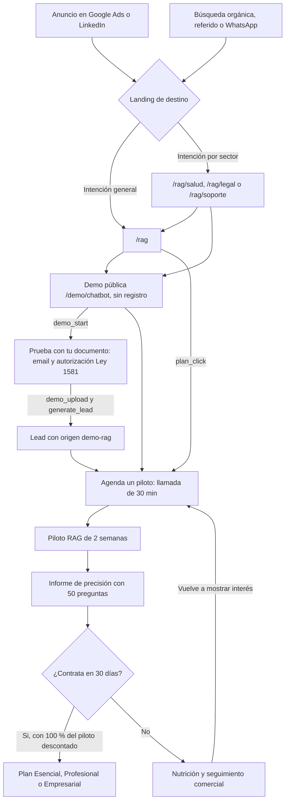
> [Ver diagrama como imagen](images/diagramas/03-Flujo-del-Cliente-1.png)

| Paso | Qué hace el prospecto | Qué hace KopTup | Medición |
|---|---|---|---|
| 1. Anuncio o búsqueda | Hace clic en un anuncio de Google o LinkedIn, o llega por búsqueda o referido | Pauta con UTM hacia `/rag` o la landing de su sector | Visitas por fuente (GA4, con consentimiento) |
| 2. Landing | Lee `/rag` o la landing de su sector y revisa los planes | Mensaje: "IA que responde con los documentos de tu empresa" | `plan_click` |
| 3. Demo pública | Pregunta en `/demo/chatbot` sobre el documento de ejemplo, sin registro | Cupo por visitante y tope mensual de gasto | `demo_start` |
| 4. "Prueba con tu documento" | Sube un PDF, DOCX o TXT (hasta 5 MB y 30 páginas) dando solo su email y la autorización Ley 1581; hace hasta 10 preguntas | El email entra como lead con origen `demo-rag` por el canal del formulario de contacto. El documento se borra a la hora. El comercial contacta al lead en 1 día hábil | `demo_upload`, `generate_lead` |
| 5. Agenda un piloto | Pide una llamada desde "Agenda un piloto" o desde el botón de un plan (formulario de contacto con el plan prellenado) | Llamada de 30 min, alcance y orden del Piloto | `generate_lead` |
| 6. Piloto RAG | Entrega una fuente con hasta 100 documentos y valida las 50 preguntas | Arma su asistente con citas en 2 semanas y entrega el informe de precisión | Pilotos vendidos |
| 7. Plan | Contrata Esencial, Profesional o Empresarial en los 30 días siguientes, con el 100 % del Piloto descontado del setup | Propuesta, implementación y operación mensual | Pilotos que pasan a un plan |

**Precios** (COP más IVA si aplica; USD fijos):

| Plan | Pago inicial | Mensualidad |
|---|---|---|
| Piloto RAG (2 semanas) | COP 3.900.000 / USD 1.200 | — |
| Esencial (3–4 semanas) | Setup COP 9.900.000 / USD 2.990 | COP 1.490.000 / USD 450 |
| Profesional (6–8 semanas) | Setup COP 24.900.000 / USD 7.490 | COP 2.990.000 / USD 890 |
| Empresarial (10–14 semanas) | Desde COP 59.900.000 / USD 17.900 | Según SLA |

Pregunta adicional sobre el tope del plan: COP 250 / USD 0,08. Las tarifas de Meta por mensajes de WhatsApp se cobran aparte, al costo.

**El flujo de solicitud de demos en el camino RAG** solo acompaña la venta: la demo guiada con un comercial, la preparación del Piloto y, en la Fase 2, un acceso ampliado con más cupo, la marca del prospecto y datos de su sector.

---

## Flujo de solicitud de demos: otras soluciones a medida y demos privadas

El resto de esta página describe el **flujo de solicitud y acceso a demos**. Es el camino de venta de las **"Otras soluciones a medida"** (ERP, CRM, POS, LMS y los demás productos del catálogo) y de las **demos privadas de salud** (auditoría de cuentas médicas y sistema experto). Las tablas y el diagrama principal incluyen el camino RAG para mostrar dónde se cruzan los dos.

## En una mirada

- **Hay dos puertas de entrada.**
  - **RAG:** `/rag`, las landings por sector y la demo pública del asistente, que no pide registro.
  - **Otras soluciones a medida:** `/services` y la landing `/productos/<slug>` de cada producto.
- **Una sola forma de pedir una demo.** El formulario **Solicitar demo** crea una solicitud (`DemoRequest`) y un **Lead**, y avisa al equipo.
- **Una persona decide.** Admin o comercial (`sales`) aprueba o rechaza desde **Admin › Solicitudes de demo**. El tiempo de respuesta se mide contra un SLA.
- **El acceso se activa con un clic.** La aprobación envía un **enlace mágico** (un solo uso, válido 72 h). El prospecto fija su contraseña y entra a **Mis demos**.
- **El acceso se verifica en el servidor.** Cada demo con acceso restringido se valida en el middleware de Next y en el backend. Ningún código de acceso queda en el navegador.
- **Todo se mide.** Se registra cuándo abre la demo, cuánto tiempo la usa y qué módulos ve. El comercial recibe avisos y el admin ve el embudo completo.
- **El cierre va por una propuesta formal.** Del uso de la demo se pasa a una propuesta, de ahí a contrato y anticipo, y luego a un proyecto en el portal de cliente que ya existe.

### Promesas al prospecto

| Promesa | Cómo se cumple |
|---|---|
| "Pruébalo ya, sin registro" | La demo del asistente RAG es pública (`accessMode = publico`), con documento de ejemplo |
| "Te respondemos en máximo 1 día hábil" | SLA por grado del lead. Alertas al 75 % del plazo y al vencer |
| "Entras con un clic" | Enlace mágico de 72 h, sin pedir datos de nuevo |
| "Tienes 14 días para evaluarlo con calma" | Vigencia por defecto de 14 días. Se puede extender con un clic desde el portal |
| "Precios claros" | Planes RAG publicados en `/services#planes-rag`. Propuesta con plan, modalidad y montos en COP o USD |

---

## Los dos caminos de venta

| Camino | Para quién | Puerta de entrada | Demo | Conversión típica |
|---|---|---|---|---|
| **RAG (principal)** | Empresas con muchos documentos: salud, legal, soporte, RR. HH. | `/rag`, `/rag/salud`, `/rag/legal`, `/rag/soporte`, `/chatbots-ia`, inicio | `/demo/chatbot`, pública. **"Prueba con tu documento"** pide solo email y autorización de datos | **Piloto RAG** de 2 semanas, que luego pasa a plan **Esencial**, **Profesional** o **Empresarial** |
| **Otras soluciones a medida** | Empresas que buscan ERP, CRM, POS, LMS, etc. | `/services` (sección "Otras soluciones a medida") y `/productos/<slug>` | Según el modo de la demo: pública, con solicitud o privada | Propuesta por plan (compra; SaaS solo donde haya base real, ver [Visión de producto](02-Vision-de-Producto.md)) |
| **Demos privadas de salud** | IPS y aseguradoras (auditoría de cuentas médicas, sistema experto) | `/rag/salud` e invitación del comercial | Privada: solo el admin da acceso | Demo guiada y propuesta a medida |

El **sistema de solicitud y acceso a demos** se usa sobre todo en el segundo y el tercer camino. En el camino RAG acompaña la venta: la demo guiada del asistente, la preparación del Piloto y, en la Fase 2, un acceso ampliado con más cupo y datos de su sector.

---

## Diagrama principal

Va de punta a punta: descubrimiento, demo, propuesta y cliente. Los rombos son decisiones. Las ramas de expiración, extensión, recuperación (nutrición) y pérdida están en la parte baja.

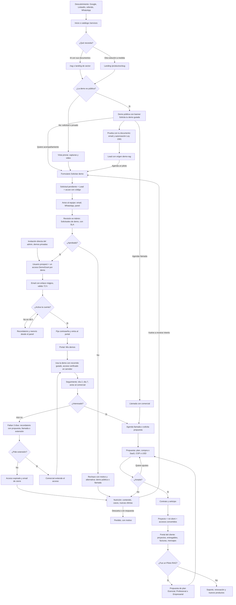
> [Ver diagrama como imagen](images/diagramas/03-Flujo-del-Cliente-2.png)

---

## Diagrama por carriles

Muestra quién hace qué en el camino feliz: solicitud, aprobación, uso y cierre.

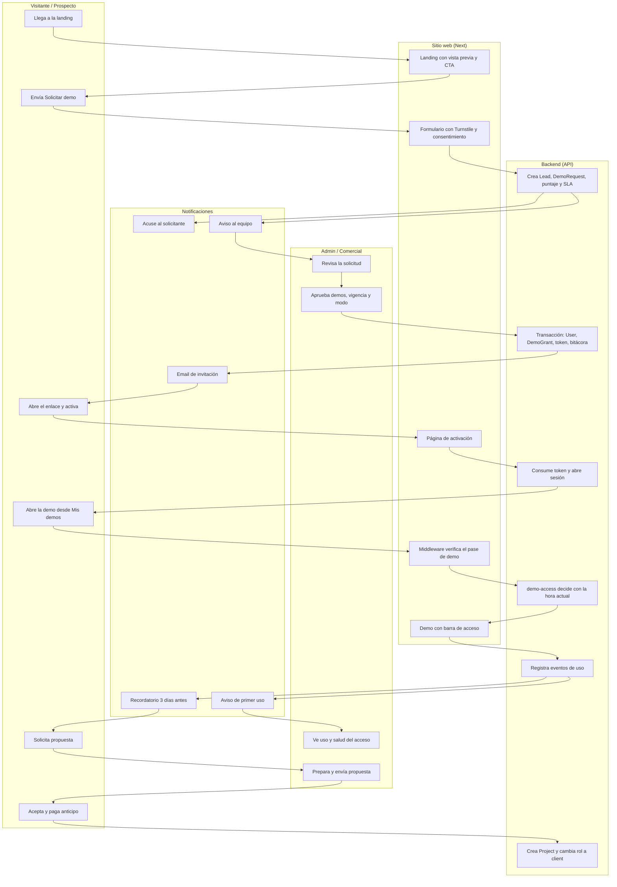
> [Ver diagrama como imagen](images/diagramas/03-Flujo-del-Cliente-3.png)

---

## Etapas, responsables y métricas

| # | Etapa | Objetivo | Pantalla o canal | Acción del cliente | Acción de KopTup | Métrica | SLA u objetivo de tiempo |
|---|---|---|---|---|---|---|---|
| 1 | Descubrimiento | Atraer al público correcto | Google Ads, LinkedIn, SEO, referidos, WhatsApp | Busca y hace clic | Pauta con UTM, contenido de `/rag`, landings por sector | Visitas por fuente, CTR (GA4 con consentimiento) | — |
| 2 | Landing | Explicar valor, precio y siguiente paso | `/rag`, `/rag/<sector>`, `/productos/<slug>` | Lee, ve el video, compara planes | CTA "Probar la demo" o "Solicitar demo" + "Agendar llamada" | % de clic en CTA (`cta_solicitar_demo_click`, `plan_click`) | Carga en menos de 2,5 s (LCP) |
| 3 | Demo pública | Probar sin fricción | `/demo/chatbot` y demás demos públicas | Pregunta o sube su documento | Banner "Solicita tu demo guiada", cupos, respuestas con cita | `demo_start`, `demo_upload`, leads `demo-rag` | Respuesta en segundos |
| 4 | Solicitud | Capturar un lead calificado | `/solicitar-demo` (2 pasos) | Llena el formulario | Acuse automático con código `DR-AAAA-NNNNNN` | Tasa de envío, abandono entre paso 1 y paso 2 | Acuse en menos de 1 min |
| 5 | Revisión | Calificar y decidir | **Admin › Solicitudes de demo** | Espera la respuesta | Revisa puntaje y duplicados; aprueba o rechaza | Mediana de primera respuesta, % dentro del SLA | Grado A ≤ 2 h hábiles · B ≤ 4 h · C y D ≤ 1 día hábil |
| 6 | Invitación | Dar acceso sin fricción | Email con enlace mágico | Activa la cuenta | Recordatorio a las 48 h y reenvío desde el panel | % de activación en 72 h | Enlace válido 72 h |
| 7 | Mis demos | Orientar el primer uso | `/dashboard/demos` | Abre la demo y sigue el recorrido | Recorrido guiado de hasta 5 pasos | % que abre la demo en 48 h | — |
| 8 | Uso | Demostrar valor | `/demo/<slug>` con barra de acceso | Usa los módulos clave | Mide uso; avisa al comercial en el primer acceso | Minutos de uso, pasos completados, salud del acceso | Aviso al comercial en minutos |
| 9 | Seguimiento | Llevar a una conversación | Email, WhatsApp (con autorización), llamada | Responde o agenda | Seguimiento el día 2 y el día 7; recordatorio 3 días antes de vencer | % que agenda o pide propuesta | Comercial contacta ≤ 1 día hábil tras el primer uso |
| 10 | Propuesta | Convertir interés en oferta | Propuesta (`Quote`) por enlace o PDF | Revisa, pregunta, acepta | Arma la propuesta con plan, modalidad y montos | % de propuestas aceptadas, ciclo de venta | Propuesta ≤ 2 días hábiles después de pedirla |
| 11 | Contrato y anticipo | Formalizar | Firma y pago (Fase 3) | Firma y paga el anticipo | Crea el proyecto y cambia el rol a `client` | Días de propuesta aceptada a anticipo | — |
| 12 | Cliente | Entregar y retener | Portal del cliente (`/dashboard`) | Sigue el proyecto, aprueba entregables, paga facturas | Entregas, mensajes; del Piloto pasa a un plan | Paso de Piloto a plan, renovaciones | Respuesta a mensajes ≤ 1 día hábil |

> Las metas numéricas (por ejemplo, "≥ 90 % dentro del SLA") son **metas iniciales a validar** con datos reales después de 8 semanas de operación. No son resultados actuales.

---

## Detalle de cada etapa

### 1. Descubrimiento

- **Fuentes:** anuncios de Google y LinkedIn (con las etiquetas de la rama `rag-reposicionamiento`), búsqueda orgánica, referidos y WhatsApp.
- **Trazabilidad:** todos los enlaces de pauta llevan UTM. El formulario las guarda en la solicitud (`source.utm`) para saber qué canal trae clientes y no solo visitas.
- **Mensaje:** "IA que responde con los documentos de tu empresa". Las cifras son verificables: demo con IA real sin registro, respuestas con fuente citada, piloto en 2 semanas, equipo en Colombia.

### 2. Landing del producto

- **Producto RAG:** su landing es `/rag`, con versiones por sector en `/rag/salud`, `/rag/legal` y `/rag/soporte`.
- **Demás productos:** cada uno tiene su `/productos/<slug>`, con propuesta de valor, para quién es, capturas, video corto, planes (compra o SaaS), FAQ y los dos CTA.
- **Botón principal según el modo de acceso de la demo:**
  - `publico`: **"Probar la demo"**, más el secundario "Solicitar demo guiada".
  - `solicitud`: **"Solicitar demo"**, con galería y video de vista previa.
  - `privado`: **"Solicitar demo personalizada"**.

Detalle de la plantilla en [Landing de producto](Seccion-Landing-de-Producto.md).

### 3. Demo pública y "Prueba con tu documento"

- **Demos públicas** (`publico`):
  - Se abren sin cuenta.
  - Tienen el banner "Solicita tu demo guiada" y la barra con "Agendar llamada".
  - Sirven para captar prospectos y para SEO.
- **Demo del asistente RAG** (`/demo/chatbot`). La opción **"Prueba con tu documento"** (implementación en la rama `rag-reposicionamiento`):
  - Pide solo el email y la autorización de tratamiento de datos.
  - Admite un PDF, DOCX o TXT de hasta 5 MB y 30 páginas.
  - Permite 10 preguntas por documento.
  - Permite 3 documentos por IP al día y tiene un tope de gasto mensual (`DEMO_MONTHLY_BUDGET_USD`). Al alcanzarlo, la subida se apaga y aparece "Agenda una demo con nosotros".
  - Borra el documento a la hora.
  - Muestra el aviso "No subas información confidencial en la demo".
  - El email entra como lead con origen **`demo-rag`** por el mismo canal del formulario de contacto (hoy llega como un contacto más). Con el sistema de demos se unifica como **Lead** (canal `demo_rag`) y el comercial lo ve en **Admin › Leads**.
  - Detalle de límites, variables y Ley 1581 en [Reposicionamiento RAG](13-Reposicionamiento-RAG.md).
- **Desde aquí el prospecto puede:**
  - pedir una demo guiada o un piloto (formulario de solicitud);
  - agendar una llamada (agenda real, que reemplaza el `mailto:` actual).

### 4. Solicitud de demo

El formulario **Solicitar demo** sirve para todo: es la página `/solicitar-demo` y también un modal en las landings y en las demos. Tiene 2 pasos.

- **Paso 1:** email corporativo, nombre, empresa y producto(s) de interés (precargados desde la landing).
- **Paso 2:**
  - cargo, teléfono o WhatsApp, país, tamaño de la empresa;
  - caso de uso, urgencia y preferencia (guiada o autoservicio);
  - **autorización Ley 1581** obligatoria y sin marcar, y autorización de comunicaciones comerciales (opcional);
  - captcha Turnstile.
- **Email personal:** un Gmail no bloquea la solicitud, porque en LATAM muchas pymes lo usan. Solo baja el puntaje.
- **Al enviar:** el prospecto ve la confirmación con su código, qué pasa ahora y el tiempo de respuesta. Se le ofrece agendar una llamada de inmediato.

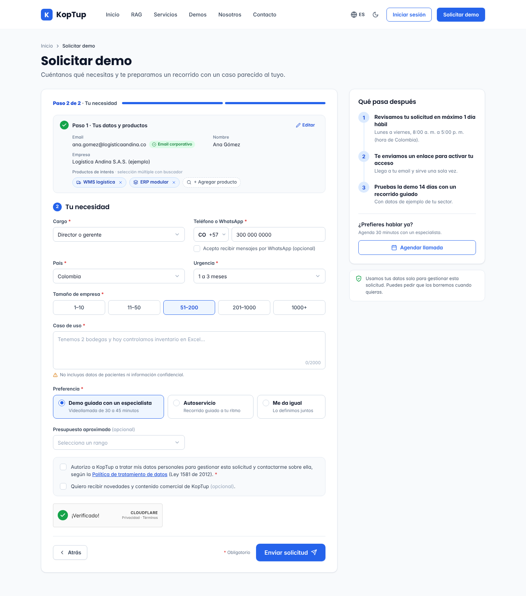

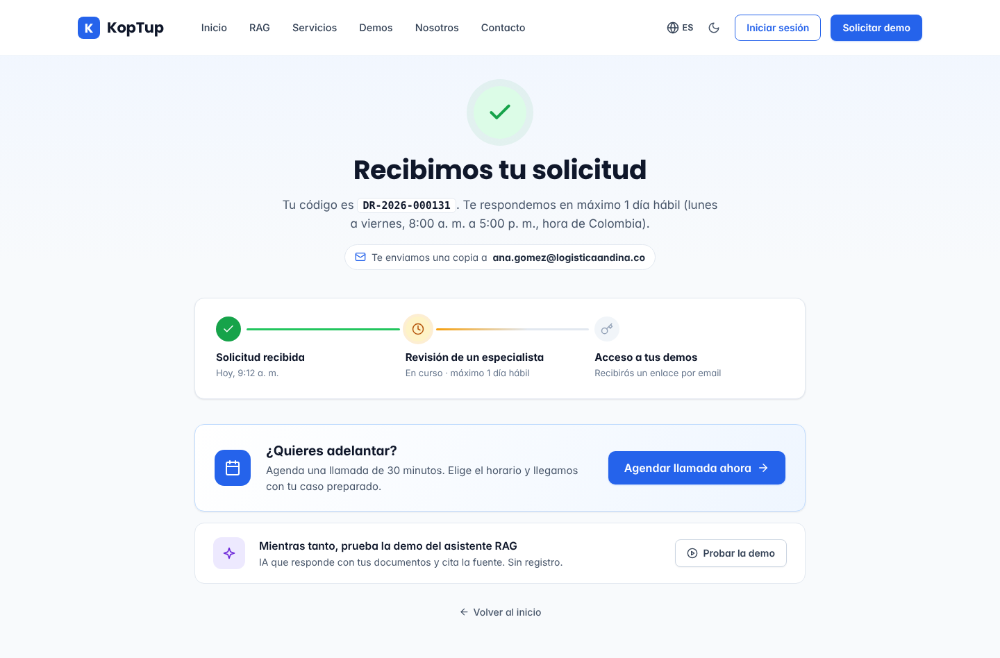

### 5. Revisión comercial

- **Avisos al equipo:** llegan por email y en el panel. Si el lead es grado A o B, también por WhatsApp.
- **Bandeja:**
  - Se ordena por el SLA más próximo y después por puntaje.
  - Indicador de SLA en verde, ámbar o rojo.
  - Vistas "Mis pendientes" y "SLA en riesgo".
- **En el detalle, el comercial:**
  - revisa la ficha del lead, el desglose del puntaje, los duplicados y si ya tiene un acceso activo;
  - **aprueba:** elige demos, vigencia (14 días por defecto), modo guiado o autoservicio, nota interna y mensaje al prospecto;
  - o **rechaza:** motivo y si se avisa o no al prospecto.
- **Demos `privado`:** solo el **admin** puede aprobarlas o dar invitación directa.

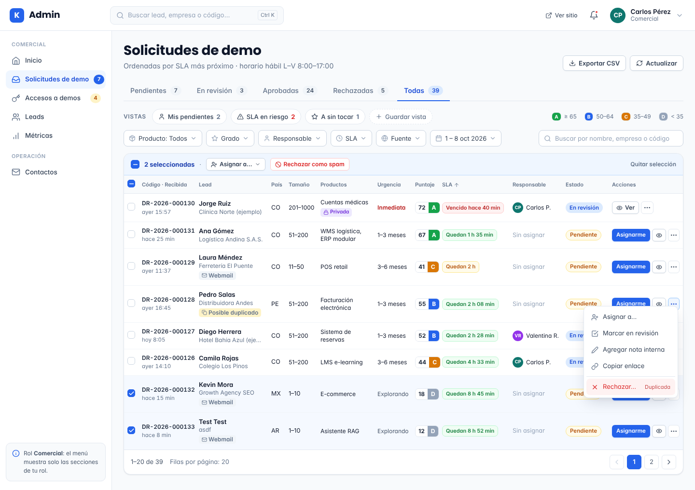

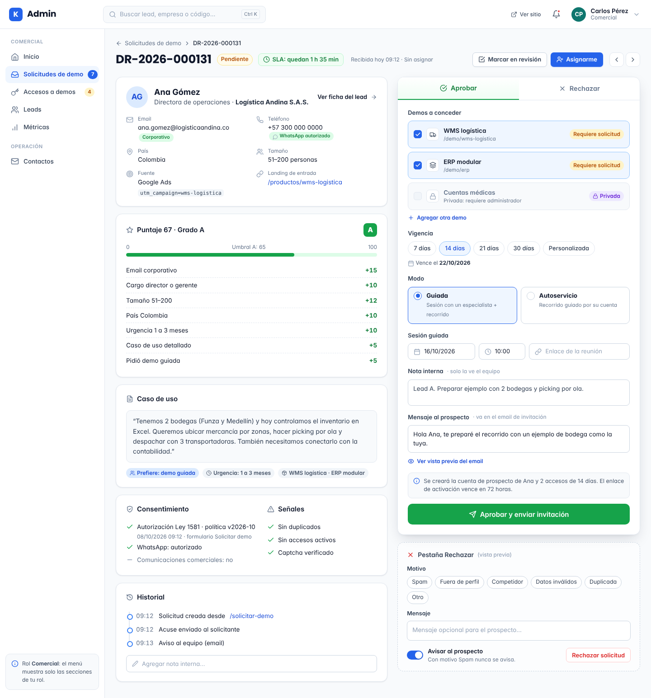

### 6. Invitación y activación

- **Al aprobar,** una sola operación atómica:
  - crea o vincula al usuario con rol `prospect`;
  - crea un acceso (`DemoGrant`) por cada demo;
  - genera el enlace mágico y deja programado el email.
- **Cuenta existente:** si el email ya tiene cuenta (por ejemplo, un cliente), no se le baja el rol ni se le envía enlace. Recibe el aviso "tienes nuevas demos" y entra con su sesión habitual.
- **Abrir el enlace no gasta el token.** El token se consume solo al pulsar **"Activar mi acceso"**, porque los filtros de correo abren los enlaces antes que la persona.
- **Si no activa en 48 h,** se envía un único recordatorio. El comercial también puede reenviar la invitación desde el panel.

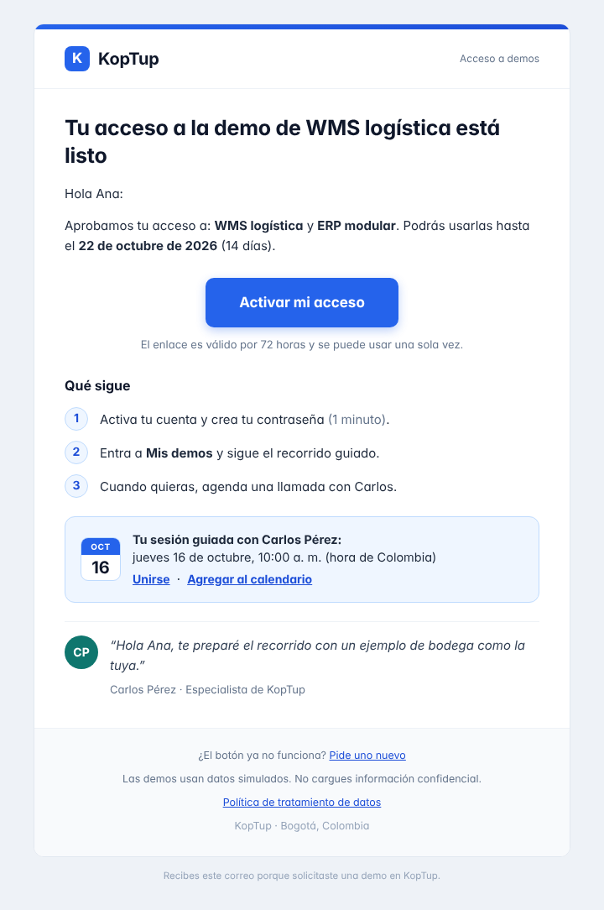

### 7. Mis demos y uso de la demo

**Mis demos** (`/dashboard/demos`) muestra una tarjeta por cada acceso, con:

- estado y días restantes;
- botón **Abrir demo**;
- progreso del recorrido guiado;
- datos del comercial asignado;
- **Solicitar propuesta**, **Agendar llamada** y **Pedir más tiempo**.

Al abrir una demo restringida:

- El middleware de Next pide al backend la decisión de acceso (`GET /api/demo-access/:demoSlug`). Si hay acceso, deja un **pase de demo** de corta vida en una cookie httpOnly.
- Dentro de la demo, una barra fija dice "Demo con datos simulados · te quedan N días" y lleva los CTA.
- Si el acceso se revoca o vence mientras la demo está abierta, la pantalla se bloquea en pocos minutos. Las demos con backend real lo bloquean en la siguiente llamada.

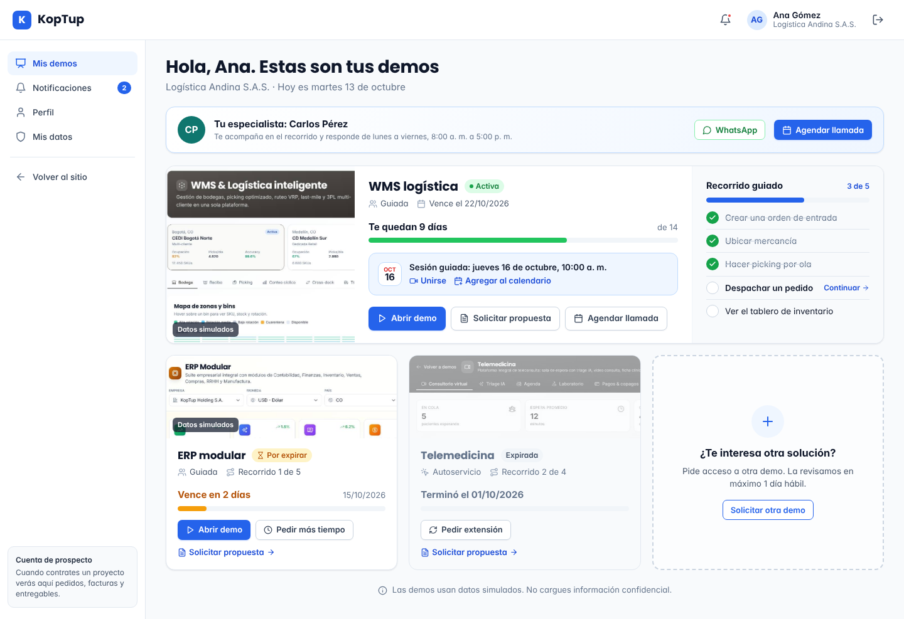

Si alguien abre una demo `solicitud` o `privado` sin acceso, ve una pantalla con vista previa y la acción que le corresponde:

- sin sesión: "Solicitar acceso" o "Iniciar sesión";
- acceso vencido: "Pedir extensión";
- demo privada: "Solicitar demo personalizada".

### 8. Seguimiento

- **Avisos al comercial:**
  - el primer acceso;
  - 20 minutos o más de uso;
  - cada acción clave;
  - cada vez que el prospecto pide propuesta, extensión o llamada.
- **Secuencia automática al prospecto:**
  - **Día 2:** si no activó, reenvío del enlace; si ya activó, "¿probaste…?".
  - **Día 7:** resumen de uso y CTA.
  - **3 días antes de vencer:** recordatorio.
  - **Al vencer:** cierre.
- **La secuencia se detiene** si el prospecto agenda, pide propuesta, se da de baja o el acceso se convierte o se revoca.
- **Panel:** en **Admin › Accesos** el comercial ve la salud de cada acceso (verde, amarillo o rojo), los minutos de uso y la última actividad. Desde ahí extiende, revoca o convierte.

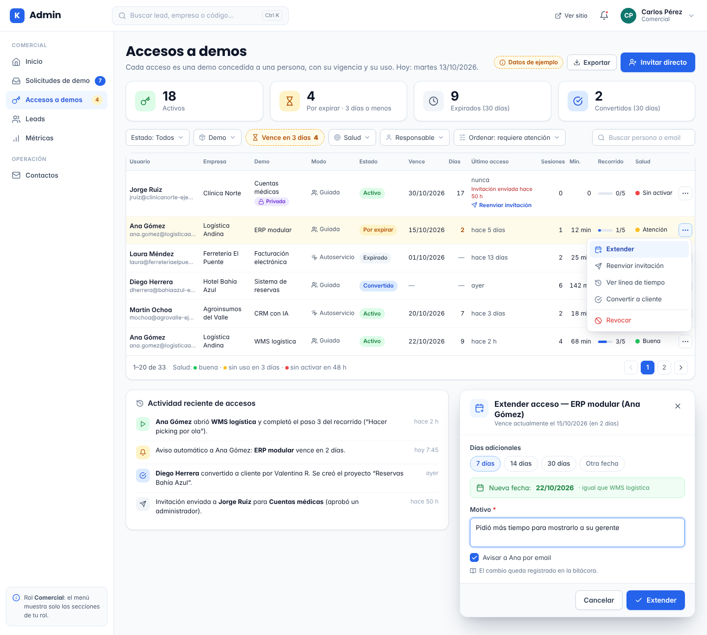

### 9. Propuesta y cierre

- **Al pulsar "Solicitar propuesta"** el Lead pasa a la etapa `propuesta` y se crea una tarea con plazo de 1 día hábil para el comercial.
- **Fase 1:** la propuesta se arma por fuera y se registra en el Lead.
- **Fase 3:** se arma en el panel como `Quote` ampliado. Lleva ítems por producto, plan y modalidad, y montos en COP o USD. Tiene enlace público con token, PDF, aceptación en línea y pago del anticipo. Ver [Roadmap](12-Roadmap.md).
- **Piloto RAG:** cuesta COP 3.900.000 / USD 1.200. Si el cliente contrata un plan dentro de los 30 días siguientes, se le descuenta el 100 %.

### 10. Cliente

- **Con la propuesta aceptada y el anticipo pagado:**
  - se crea el `Project` en estado `planning`;
  - el usuario pasa a `client`;
  - los accesos pasan a `convertido` y la demo queda disponible 90 días como referencia;
  - el Lead pasa a `ganado`.
- **Desde ahí** el cliente usa el portal que ya existe: proyectos, pedidos, facturas, entregables y mensajes. Ver [Portal del cliente](06-Portal-del-Cliente.md).
- **Si fue un Piloto RAG,** al terminar se le presenta la propuesta del plan Esencial, Profesional o Empresarial.

### 11. Medición

**Admin › Métricas** muestra:

- el embudo: visitas a landings → solicitudes → aprobadas → activadas → demo usada → propuesta → cliente;
- tiempos de respuesta;
- productos más pedidos;
- desgloses por fuente, país, grado y comercial.

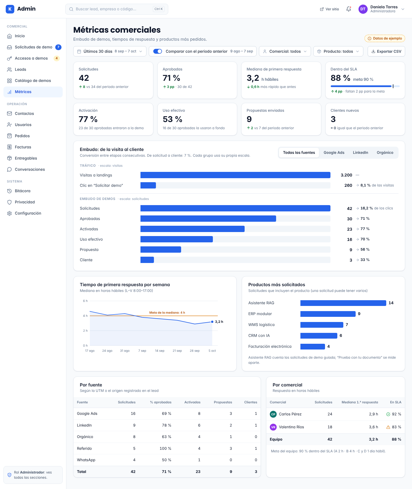

---

## Ramas alternativas

| Situación | Qué ve el prospecto | Qué hace KopTup | Estado resultante |
|---|---|---|---|
| **Rechazo** | Email amable y opcional, con alternativas: demo pública o llamada. Nunca se envía si el motivo es spam | El comercial elige el motivo: spam, fuera de perfil, competidor, datos inválidos, duplicada u otro | Solicitud `rechazada`. Lead en `perdido` o `nutricion`. Solo el admin puede reabrirla |
| **Invitación sin usar** | Recordatorio a las 48 h. Si vence, "Enlace vencido" con botón "Enviarme uno nuevo" | Reenvío automático una vez; después, desde el panel | El usuario sigue `invitado`. El acceso cuenta su vigencia desde la aprobación |
| **Acceso por vencer** | Email y aviso en el portal 3 días antes, con "Solicitar propuesta", "Agendar llamada" y "Pedir más tiempo" | Aviso en el panel al comercial | Acceso `por_expirar` |
| **Expiración** | "Tu acceso terminó", con resumen de uso y CTA. Al abrir la demo, pantalla de acceso vencido | Tarea "cerrar o nutrir" | Acceso `expirado` |
| **Extensión** | Email "Extendimos tu acceso hasta…" | Comercial extiende 7, 14 o 30 días, con motivo. Se puede hasta 30 días después del vencimiento; después hace falta una solicitud nueva | Acceso vuelve a `activo` |
| **Recuperación (nutrición)** | Contenido útil cada 2 a 4 semanas (casos, novedades RAG), solo con autorización de marketing | Lead en `nutricion`. Si vuelve a interactuar (abre, responde, pide demo), el comercial lo retoma | Lead `nutricion` → `calificado` |
| **Pérdida** | — | Se registra el motivo (precio, tiempo, eligió a otro, sin presupuesto, sin respuesta) para el análisis mensual | Lead `perdido` |
| **Revocación** | La demo se bloquea en minutos. Email neutral | Admin o comercial revoca con motivo (abuso, cuenta compartida, pedido del cliente) | Acceso `revocado`, estado final |
| **Solicitud duplicada** | Recibe el mismo acuse | Si el mismo email tiene una solicitud abierta de menos de 30 días, se le suman los productos | Una sola solicitud con historial |
| **Cliente existente pide otra demo** | La pide desde el portal, sin captcha y con sus datos ya llenos | Se asigna a su comercial | El rol no cambia. Se crea un nuevo acceso |

---

## Mapa de experiencia

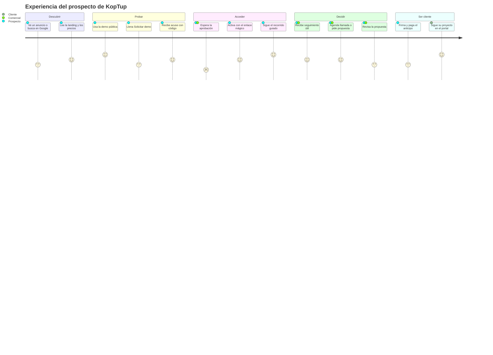
> [Ver diagrama como imagen](images/diagramas/03-Flujo-del-Cliente-4.png)

**Momentos de verdad** (donde más se pierde a un prospecto, y qué se hace):

1. **La espera de aprobación.** El acuse promete el tiempo de respuesta y ofrece agendar de inmediato. El SLA se vigila con alertas.
2. **La activación.** Un solo botón, sin pedir datos de nuevo, y un recordatorio a las 48 h.
3. **El primer uso.** Recorrido guiado de hasta 5 pasos con datos del sector, y aviso al comercial para que llame mientras el interés está fresco.
4. **El vencimiento.** Recordatorio 3 días antes y extensión con un clic. Si el prospecto ya está en negociación, el acceso no se corta.

---

## Qué cambia frente a hoy

| Hoy | Con este plan |
|---|---|
| "Agendar llamada" abre un `mailto:` | Agenda real (`NEXT_PUBLIC_BOOKING_URL`), con evento medido |
| La demo de cuentas médicas se presenta con un código de acceso fijo, igual para todos | Modo `privado`: acceso personal por invitación, verificado en el servidor. Se elimina el modal del código |
| Los CTA de las demos llevan a `/pricing` (que redirige) y a `/contact` | "Solicitar demo" (con la demo precargada) y "Agendar llamada". Precios en `/services#planes-rag` |
| El formulario de contacto pierde el servicio o plan preseleccionado | El formulario de solicitud conserva producto, plan y UTM |
| Los contactos llegan a una bandeja sin seguimiento | **Leads** con etapa, responsable, puntaje, SLA, notas y tareas |
| No existen roles comerciales ni de prospecto | Roles `sales`, `prospect` y `client`, con autorización en el servidor |
| No hay medición del embudo | Eventos de uso, avisos al comercial y tablero de métricas |

---

## Páginas relacionadas

- [Sistema de demos](04-Sistema-de-Demos.md): modelos, estados, API, control de acceso, notificaciones y plan de implementación.
- [Panel de administración](05-Panel-de-Administracion.md): pantallas de solicitudes, accesos, leads, catálogo y métricas.
- [Portal del cliente](06-Portal-del-Cliente.md): Mis demos, activación y portal de cliente.
- [Visión de producto](02-Vision-de-Producto.md) · [Comercial, marketing y legal](11-Comercial-Marketing-y-Legal.md) · [Roadmap](12-Roadmap.md)
