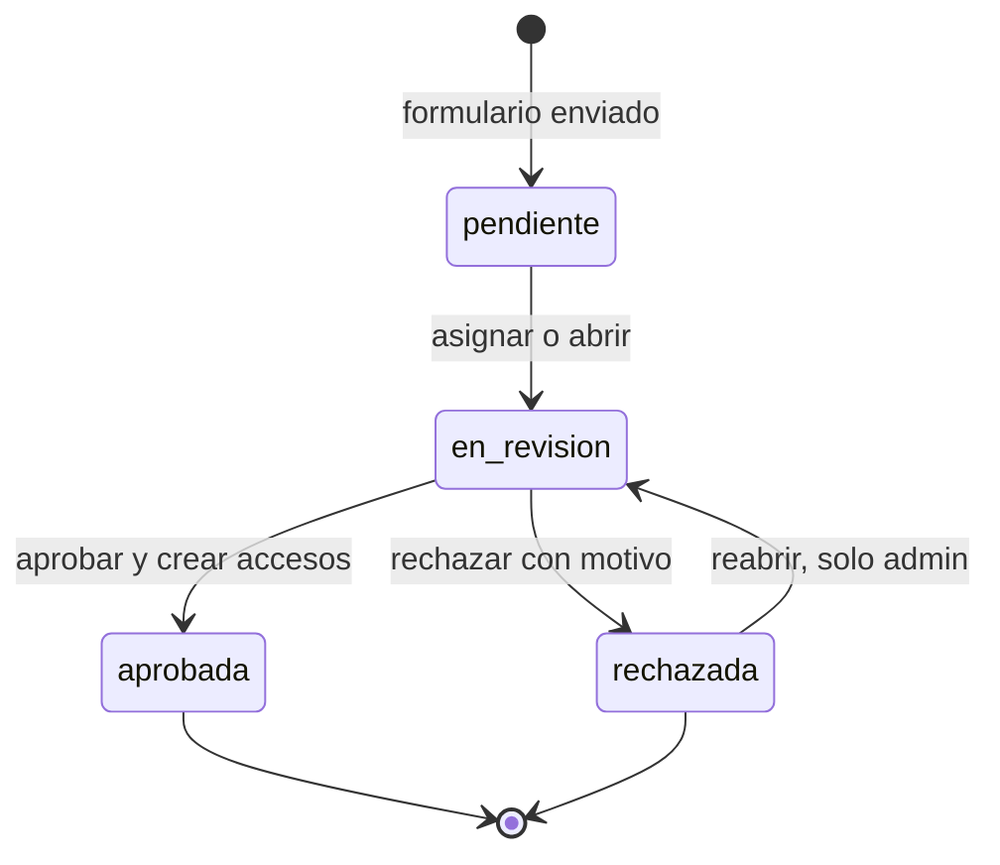
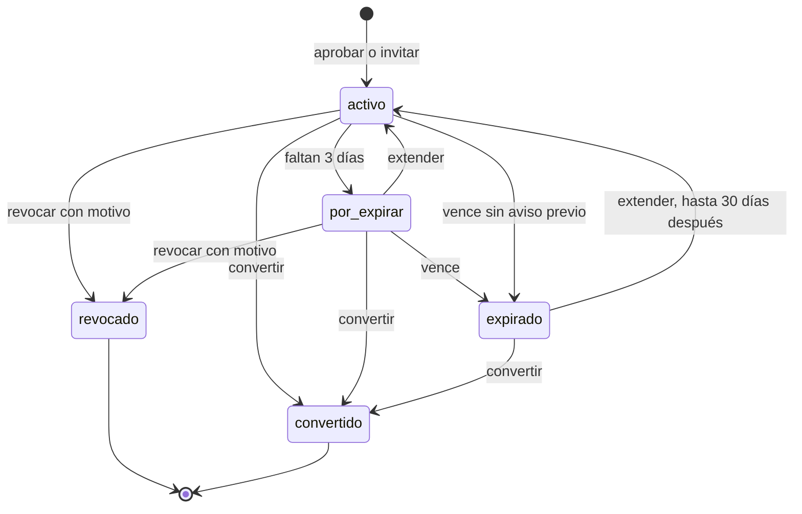
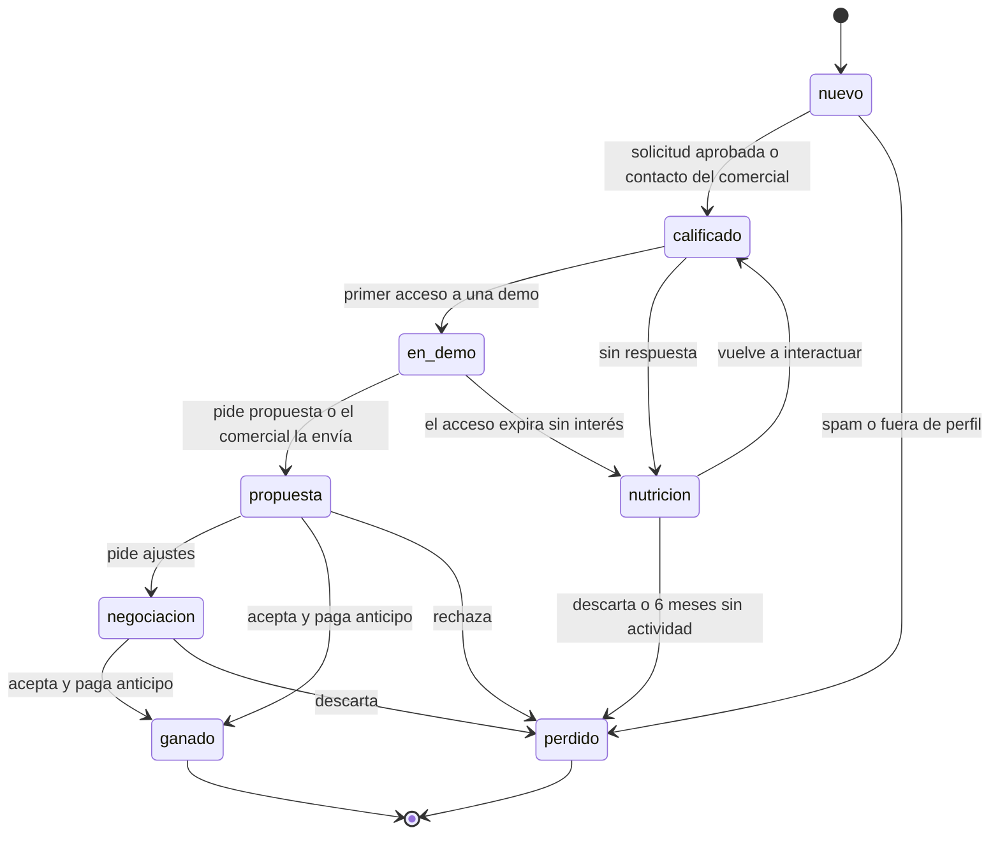
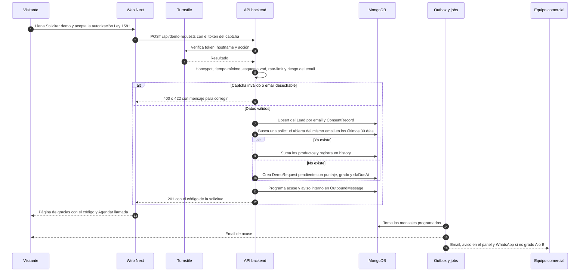
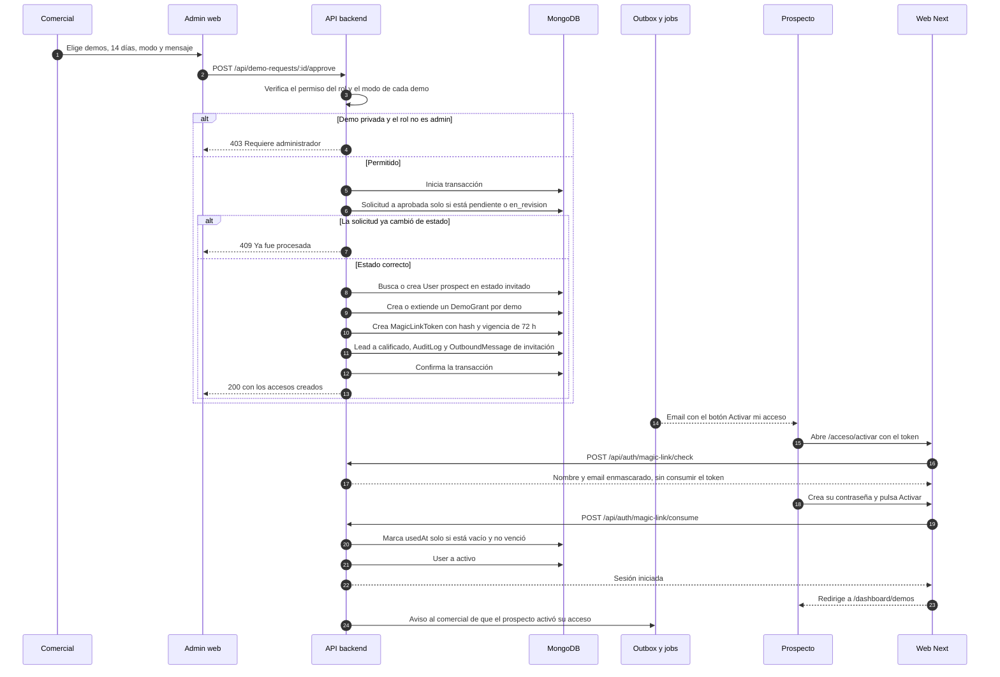
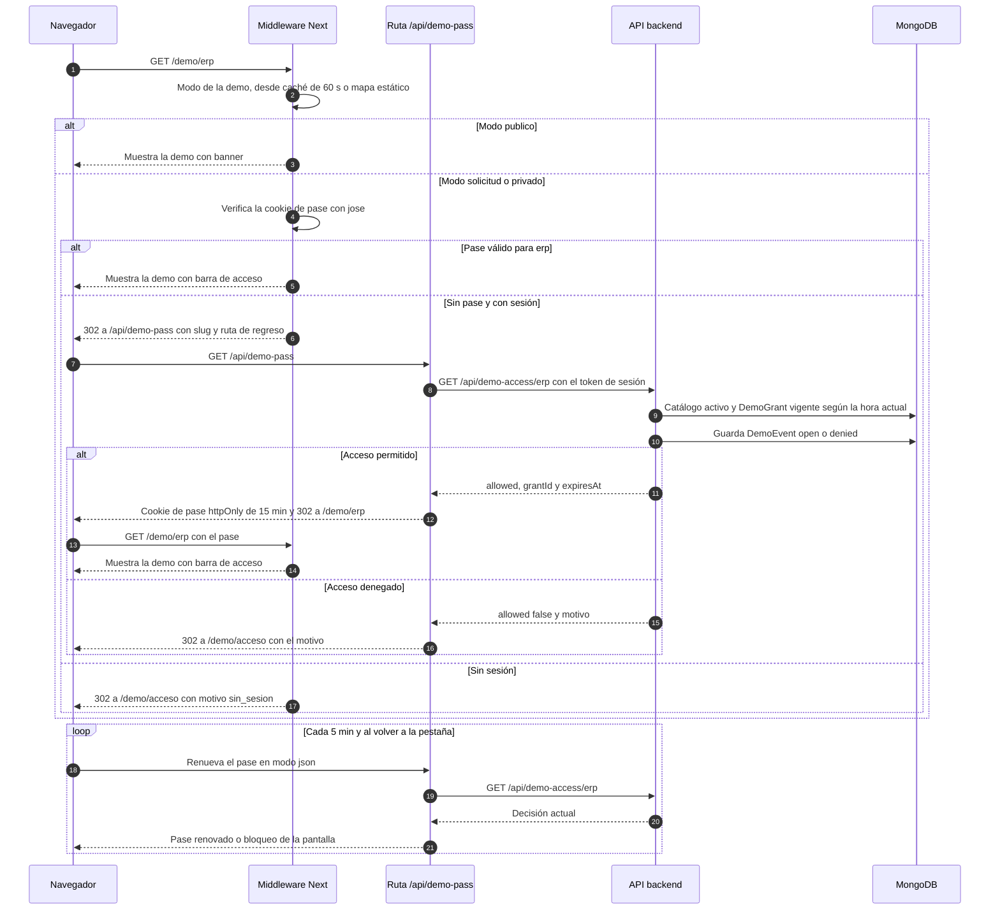
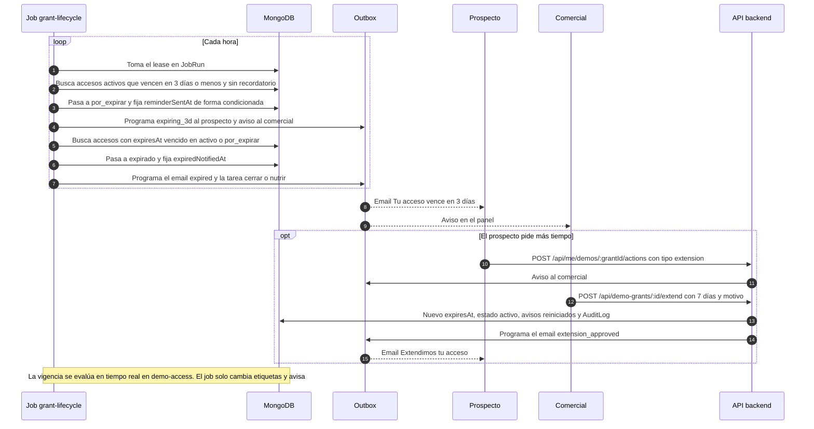
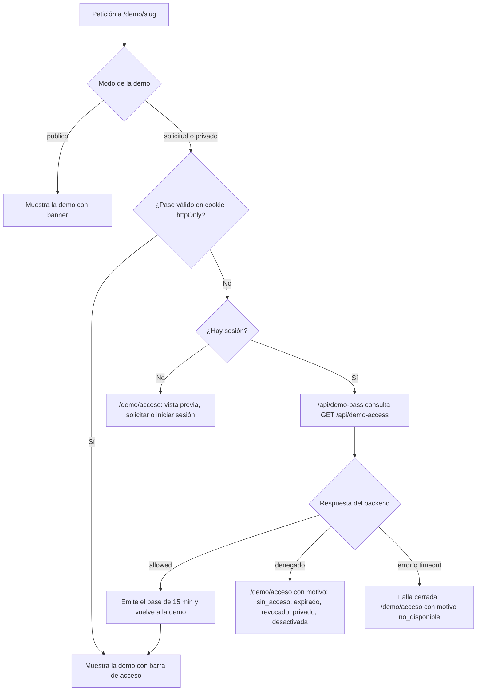

# Sistema de demos: solicitud, aprobación y acceso

> Especificación funcional y técnica de cómo un prospecto **solicita una demo**, cómo el equipo la **aprueba desde el panel de administración** y cómo se **controla y mide el acceso** a cada demo.
>
> Fases del roadmap: **Fase 1 — Funnel y solicitud de demos** (núcleo), con extensiones en la Fase 2 y la Fase 3.
>
> Páginas relacionadas:
> - El recorrido del cliente está en [Flujo del cliente](03-Flujo-del-Cliente.md).
> - Las pantallas en detalle están en [Panel de administración](05-Panel-de-Administracion.md) y [Portal del cliente](06-Portal-del-Cliente.md).
> - El backend en general está en [Backend y API](09-Backend-y-API.md).

---

## Índice

1. [Objetivo y alcance](#1-objetivo-y-alcance)
2. [Decisiones de diseño](#2-decisiones-de-diseño)
3. [Actores, roles y permisos](#3-actores-roles-y-permisos)
4. [Modos de acceso](#4-modos-de-acceso)
5. [Modelo de datos](#5-modelo-de-datos)
6. [Estados y transiciones](#6-estados-y-transiciones)
7. [Secuencias](#7-secuencias)
8. [API](#8-api)
9. [Rutas web](#9-rutas-web)
10. [Control de acceso a las demos](#10-control-de-acceso-a-las-demos)
11. [Notificaciones y plantillas](#11-notificaciones-y-plantillas)
12. [Jobs programados](#12-jobs-programados)
13. [Analítica](#13-analítica)
14. [Datos personales (Ley 1581 de 2012)](#14-datos-personales-ley-1581-de-2012)
15. [Controles anti-abuso](#15-controles-anti-abuso)
16. [Casos borde](#16-casos-borde)
17. [Plan de implementación](#17-plan-de-implementación)
18. [Plan de pruebas](#18-plan-de-pruebas)
19. [Riesgos y mitigaciones](#19-riesgos-y-mitigaciones)

---

## 1. Objetivo y alcance

**Objetivo:** convertir el interés en conversaciones comerciales medibles.

- Cualquier visitante puede pedir una demo en un minuto.
- El equipo decide en menos de 1 día hábil.
- El prospecto entra con un clic.
- KopTup sabe qué demo usó, cuánto tiempo y qué le interesó.
- El acceso **se decide siempre en el servidor**.

**Relación con el reposicionamiento RAG.** El producto principal son los sistemas RAG (ver [Visión de producto](02-Vision-de-Producto.md)), y en ese camino la demo del asistente es **pública**: no pide registro y tiene la opción "Prueba con tu documento". El sistema de demos:

- **Controla el acceso** a las "Otras soluciones a medida" que estén en modo `solicitud` y a las demos **privadas** de salud (cuentas médicas, sistema experto).
- **Acompaña la venta RAG:** demo guiada, preparación del Piloto y, en la Fase 2, un acceso ampliado con más cupo y datos del sector del cliente.
- **Unifica todos los leads** en un solo modelo, venga de donde venga: el formulario de contacto, "Prueba con tu documento" o una solicitud de demo.

| En alcance (Fase 1) | Fuera de alcance (fases siguientes) |
|---|---|
| Formulario "Solicitar demo", Lead, puntaje y SLA | Propuesta formal con PDF, firma y anticipo (Fase 3) |
| Bandeja de solicitudes, aprobación y rechazo | Personalización por cliente: logo, datos de su sector (Fase 2) |
| Accesos (`DemoGrant`) con vigencia, extensión, revocación y conversión | Cobro recurrente SaaS y aprovisionamiento (Fase 4) |
| Enlace mágico de activación y portal **Mis demos** | Plantillas editables desde el panel y autoaprobación (Fase 2) |
| Verificación de acceso en servidor (middleware Next + backend) | CRM completo con automatizaciones (Fase 5) |
| Eventos de uso, avisos al comercial y tablero de métricas | |
| Consentimiento Ley 1581, bitácora de auditoría y jobs | |

---

## 2. Decisiones de diseño

Se compararon tres diseños: uno mínimo, uno centrado en seguridad y uno centrado en la operación comercial. Esta tabla recoge lo que se eligió y por qué.

| # | Tema | Decisión | Motivo |
|---|---|---|---|
| 1 | Lead | **Modelo nuevo `Lead`**. `Contact` sigue guardando los mensajes y recibe `leadId` | Un Lead por email evita duplicados y lleva etapa, responsable, puntaje y consentimiento. `Contact` hoy es solo un buzón (`new / read / responded`) |
| 2 | Clave del catálogo | `DemoCatalogItem.slug` = `demoSlug` de la ruta (28 ítems). `offeringSlug` puede ser nulo | Lo que se protege es la ruta `/demo/<demoSlug>`. Cuentas médicas, sistema experto y LinkedIn Ads no son ofertas del catálogo. Los mapeos erróneos (QA automatizado y VPN apuntaban a demos de otros productos) se retiran en el reposicionamiento |
| 3 | Grants en demos públicas | Una aprobación crea un `DemoGrant` por demo, **cualquiera que sea su modo** | En una demo `publico` el grant no hace falta para entrar, pero da seguimiento, vigencia, recorrido guiado y, en la Fase 2, cupo ampliado o personalización |
| 4 | Verificación en Next | **Pase de demo**: cookie httpOnly firmada de 15 min que emite una ruta de Next tras consultar `GET /api/demo-access/:demoSlug` | El backend sigue siendo la única fuente de verdad sin llamarlo en cada navegación. La demo abierta vuelve a verificar cada 5 min y las APIs reales verifican en cada llamada |
| 5 | Si el backend no responde | **Falla cerrada** para `solicitud` y `privado`. Las demos `publico` siguen abiertas | Nunca se da acceso de más; el SEO y las demos abiertas no se afectan |
| 6 | Tokens de invitación | Colección `MagicLinkToken` en MongoDB: hash SHA-256, índice TTL, un solo uso. **Se consume con POST**, no al abrir el enlace | Sobrevive a fallos de Redis y queda auditado. Los filtros de correo abren los enlaces antes que la persona |
| 7 | Envío de mensajes | **Outbox** (`OutboundMessage`) con `idempotencyKey`, reintentos y despacho por job | La aprobación es transaccional: el email queda programado aunque el proveedor falle. Además permite las secuencias de seguimiento |
| 8 | Jobs | `node-cron` dentro del backend con *lease* en `JobRun` y la variable `JOBS_ENABLED`. Más adelante pueden pasar a un worker aparte (`src/worker.ts`) | No añade infraestructura hoy, evita ejecuciones dobles con varias instancias y se puede separar después |
| 9 | Vigencia | Se evalúa **en tiempo real** (`expiresAt` contra la hora actual). Los jobs solo cambian etiquetas y envían avisos | Si un job falla, nadie conserva acceso de más |
| 10 | Inicio de la vigencia | Desde la **aprobación**, no desde el primer acceso | Es predecible para ventas. Se compensa con la extensión y el recordatorio de activación |
| 11 | Permisos | `sales` aprueba demos `publico` y `solicitud`. Solo `admin` aprueba o invita a demos `privado`, configura el catálogo, cambia roles y reabre rechazadas. `manager` solo lee | Las demos privadas usan backend real y datos de un sector sensible (salud) |
| 12 | Email personal | Gmail, Hotmail y similares **no bloquean**, solo bajan el puntaje. Los dominios desechables sí se bloquean | En LATAM muchas pymes usan correo gratuito |
| 13 | Rol `user` actual | Migración: quien tiene `Project` u `Order` pasa a `client`, el resto a `prospect`. El registro nuevo crea `prospect`. `user` se acepta solo durante la migración | Deja los roles de la DECISIÓN 5 sin cuentas en un limbo |
| 14 | "Solicitar propuesta" en la Fase 1 | Crea una tarea (`LeadActivity`) con plazo y pasa el Lead a `propuesta`. El `Quote` ampliado llega en la Fase 3 | No se bloquea la Fase 1 por el módulo de propuestas |
| 15 | Acceso tras convertir | `convertido` mantiene la demo **90 días** como referencia | El cliente la muestra internamente mientras arranca el proyecto |
| 16 | Rutas de la API | Recursos de primer nivel (`/api/demo-requests`, `/api/demo-grants`, `/api/leads`…) con permisos por ruta | Así no heredan el `authorize('admin','manager')` que `admin.routes.ts` aplica a todo `/api/admin` |
| 17 | Pantalla sin acceso | Una sola página `/demo/acceso?demo=<slug>&motivo=<motivo>` | Las 28 demos son carpetas estáticas; una subruta por demo obligaría a tocar cada una |

---

## 3. Actores, roles y permisos

| Actor | Rol en `User.role` | Qué hace |
|---|---|---|
| Visitante | (sin cuenta) | Ve landings y demos públicas, envía "Solicitar demo" y "Prueba con tu documento" |
| Prospecto | `prospect` | Tiene uno o más accesos a demos. Usa **Mis demos**, pide extensión, propuesta o llamada |
| Cliente | `client` | Tiene proyecto. Usa el portal de cliente completo y puede pedir más demos |
| Comercial | `sales` | Gestiona solicitudes, leads y accesos de demos `publico` y `solicitud` |
| Administrador | `admin` | Todo lo anterior, más demos `privado`, catálogo, roles, bitácora y privacidad |
| Equipo interno | `manager`, `developer` | `manager` conserva el panel actual y lee lo comercial. `developer` puede abrir cualquier demo para probarla |

**Matriz de permisos.** Vive en `apps/backend/src/config/permissions.ts` y se aplica con `requirePermission('<permiso>')` en `middleware/auth.ts`. Siempre se verifica en el servidor; la interfaz solo oculta botones.

| Permiso | admin | sales | manager | developer | prospect | client |
|---|:-:|:-:|:-:|:-:|:-:|:-:|
| `demoRequests.read` (bandeja y detalle) | ✓ | ✓ | ✓ | – | – | – |
| `demoRequests.manage` (asignar, revisar, notas, rechazar) | ✓ | ✓ | – | – | – | – |
| `demoRequests.approve` (`publico` y `solicitud`) | ✓ | ✓ | – | – | – | – |
| `demoRequests.approvePrivate` / invitar a `privado` | ✓ | – | – | – | – | – |
| `demoRequests.reopen` | ✓ | – | – | – | – | – |
| `grants.read` | ✓ | ✓ | ✓ | – | – | – |
| `grants.manage` (extender, revocar, convertir, reenviar invitación) | ✓ | ✓ | – | – | – | – |
| `leads.read` | ✓ | ✓ | ✓ | – | – | – |
| `leads.manage` (etapa, responsable, notas, tareas) | ✓ | ✓ | – | – | – | – |
| `leads.anonymize` | ✓ | – | – | – | – | – |
| `catalog.manage` | ✓ | – | – | – | – | – |
| `metrics.read` | ✓ | ✓ | ✓ | – | – | – |
| `audit.read`, `privacy.manage` | ✓ | – | – | – | – | – |
| `users.setRole` (solo `admin` asigna `admin` o `sales`) | ✓ | – | – | – | – | – |
| Abrir cualquier demo (staff) | ✓ | ✓ | ✓ | ✓ | – | – |
| `me.demos` (Mis demos, acciones sobre sus accesos) | – | – | – | – | ✓ | ✓ |
| Portal de cliente completo (proyectos, facturas…) | – | – | – | – | – | ✓ |

---

## 4. Modos de acceso

El modo de cada demo (`accessMode`) vive en la base de datos y se cambia desde **Admin › Catálogo de demos** sin desplegar.

| Modo | Visitante sin sesión | Con sesión, sin acceso | Con acceso vigente | Staff | SEO |
|---|---|---|---|---|---|
| `publico` | Entra. Banner "Solicita tu demo guiada" y "Agendar llamada" | Igual que sin sesión | Entra con **barra de acceso** (días restantes, CTA) y su uso se registra con el `grantId` | Entra | Indexable y en el sitemap |
| `solicitud` | Va a `/demo/acceso`: vista previa (capturas y video), "Solicitar acceso", "Iniciar sesión" | `/demo/acceso` con "Solicitar esta demo" (o "Pedir extensión" si venció) | Entra con barra de acceso | Entra | `noindex` y fuera del sitemap. La landing `/productos/<slug>` sí se indexa |
| `privado` | `/demo/acceso` con "Solicitar demo personalizada". **No aparece como abierta en `/demo`** | Igual | Entra con barra de acceso | Entra | `noindex`, fuera del sitemap |
| Desactivada (`active = false`) | "Demo en mantenimiento" | Igual | Igual. El acceso no se toca y se puede extender al reactivar | Entra, para probar | `noindex` |

### Modos iniciales sugeridos (semilla)

Son valores de partida. La página de cada producto puede recomendar otro (ver [Catálogo de productos](08-Catalogo-de-Productos.md)).

| `demoSlug` | `offeringSlug` | Modo inicial | Backend real | Nota |
|---|---|---|---|---|
| `chatbot` | `chatbot-rag-ia` | `publico` | Sí (RAG) | Imán de prospectos principal, con "Prueba con tu documento". Un grant da cupo ampliado (Fase 2) |
| `crm-ia` | `crm-ia` | `publico` | No | Versión personalizada por solicitud (Fase 2) |
| `helpdesk-ia` | `helpdesk-ia` | `publico` | No | Ídem |
| `code-review-ia` | `code-review-ia` | `publico` | No | La revisión real de un diff propio va por `solicitud` |
| `ecommerce` | `ecommerce` | `publico` | No | Versión con productos y marca del prospecto por solicitud (Fase 2) |
| `facturacion-electronica` | `facturacion-electronica` | `publico` | No | Versión personalizada por solicitud (Fase 2) |
| `dashboard-ejecutivo` | `bi-dashboard` | `publico` | No | |
| `gestor-documentos` | `gestor-documental` | `publico` | No | |
| `sistema-reservas` | `sistema-reservas` | `publico` | No | |
| `gestor-contenido` | `cms-headless` | `publico` | No | |
| `control-proyectos` | `gestion-proyectos` | `publico` | No | |
| `lms` | `lms-elearning` | `publico` | No | |
| `pos` | `pos-retail` | `publico` | No | |
| `hrms` | `hrms` | `publico` | No | |
| `automatizacion` | `automatizacion-workflows` | `publico` | No | |
| `saas-boilerplate` | `saas-multi-tenant` | `publico` | No | Ya no lo usa la oferta de VPN |
| `firma-electronica` | `firma-electronica` | `publico` | No | |
| `scraping` | `scraping-extraccion` | `publico` | No | |
| `moderacion-contenido` | `moderacion-contenido` | `publico` | No | |
| `loyalty` | `loyalty-fidelizacion` | `publico` | No | |
| `erp` | `erp-modular` | `solicitud` | No | Demo de alto valor: capta leads calificados |
| `telemedicina` | `telemedicina` | `solicitud` | No | Ídem |
| `wms-logistica` | `wms-logistica` | `solicitud` | No | Ídem |
| `delivery` | `app-delivery` | `solicitud` | No | Ver [App de delivery](Producto-app-delivery.md) |
| `voice-ai` | `voice-ai-callcenter` | `solicitud` | No | La landing tiene audio y video públicos |
| `linkedin-ads` | — | `solicitud` | Sí (IA) | Tiene costo de IA. Ver [Demo LinkedIn Ads](Demo-linkedin-ads.md) |
| `cuentas-medicas` | — | `privado` | Sí | Caso de salud enlazado desde `/rag/salud`. Ver [Demo cuentas médicas](Demo-cuentas-medicas.md) |
| `sistema-experto` | — | `privado` | Sí | Ver [Demo sistema experto](Demo-sistema-experto.md) |

En total: 20 demos `publico`, 6 `solicitud` y 2 `privado`, es decir, las 28 rutas de `apps/web/src/app/demo/`.

**Notas sobre la semilla:**
- Las ofertas `qa-automatizado-ia` y `vpn-empresarial` hoy no tienen demo propia y no se les asigna ninguna. Si se construye la demo propuesta en su página (ver [QA automatizado con IA](Producto-qa-automatizado-ia.md)), se agrega a la semilla.
- La página del chatbot RAG proponía `solicitud`. Con el reposicionamiento RAG, la demo del asistente pasa a ser **pública** (sin registro) y el acceso por solicitud queda para el cupo ampliado.

---

## 5. Modelo de datos

Todos los modelos son colecciones Mongoose en `apps/backend/src/models/`. Los nombres de campo van en inglés (como el código actual) y los valores de estado en español (como fija la DECISIÓN 4).

```mermaid
erDiagram
  Lead ||--o{ Contact : "agrupa mensajes"
  Lead ||--o{ ConsentRecord : "otorga"
  Lead ||--o{ LeadActivity : "registra"
  Lead ||--o{ DemoRequest : "envía"
  Lead |o--o| User : "se vuelve cuenta"
  Lead ||--o{ OutboundMessage : "recibe"
  Lead ||--o{ Quote : "recibe"
  DemoRequest }o--|{ DemoCatalogItem : "pide"
  DemoRequest ||--o{ DemoGrant : "origina"
  DemoCatalogItem ||--o{ DemoGrant : "habilita"
  User ||--o{ DemoGrant : "tiene"
  DemoGrant ||--o{ DemoEvent : "genera"
  User ||--o{ MagicLinkToken : "recibe"
  User ||--o{ AuditLog : "realiza"
  DemoGrant }o--o| Quote : "cierra con"
  Quote |o--o| Project : "origina"
  User ||--o{ Project : "es cliente de"

  User {
    objectid id PK
    string email UK
    string role "admin sales manager developer prospect client"
    string accountStatus "invitado activo suspendido"
    number tokenVersion
    objectid leadId FK
  }
  Lead {
    objectid id PK
    string email UK
    string company
    string stage
    number score
    string grade "A B C D"
    objectid ownerId FK
    objectid userId FK
  }
  Contact {
    objectid id PK
    objectid leadId FK
    string source "contacto demo_rag"
    string message
    string status
  }
  ConsentRecord {
    objectid id PK
    objectid leadId FK
    string policyVersion
    string textHash
    boolean marketing
    date grantedAt
  }
  LeadActivity {
    objectid id PK
    objectid leadId FK
    string type
    date dueAt
    date doneAt
  }
  DemoCatalogItem {
    objectid id PK
    string slug UK
    string demoSlug
    string offeringSlug
    string accessMode "publico solicitud privado"
    boolean active
    number defaultDurationDays
  }
  DemoRequest {
    objectid id PK
    string code UK
    objectid leadId FK
    string status
    objectid assignedTo FK
    number scoreAtSubmit
    date slaDueAt
  }
  DemoGrant {
    objectid id PK
    objectid userId FK
    objectid demoRequestId FK
    string catalogSlug FK
    string mode "guiada autoservicio"
    string status
    date expiresAt
  }
  DemoEvent {
    objectid id PK
    objectid grantId FK
    string catalogSlug
    string sessionId
    string type
    date at
  }
  MagicLinkToken {
    objectid id PK
    string tokenHash UK
    objectid userId FK
    string purpose "invitacion acceso"
    date expiresAt
    date usedAt
  }
  AuditLog {
    objectid id PK
    objectid actorId FK
    string action
    string entityType
    objectid entityId
    date at
  }
  OutboundMessage {
    objectid id PK
    objectid leadId FK
    string channel
    string templateKey
    string status
    string idempotencyKey UK
  }
  Quote {
    objectid id PK
    string number UK
    objectid leadId FK
    string currency "COP USD"
    number total
    string status
  }
  Project {
    objectid id PK
    objectid client_id FK
    objectid quoteId FK
    string status
  }
```

### 5.1 Modelos nuevos

**`DemoCatalogItem`**: una entrada por cada ruta `/demo/<demoSlug>`, 28 en la semilla.

| Campo | Tipo | Descripción |
|---|---|---|
| `slug` | string, único | Identificador. En la semilla es igual a `demoSlug` |
| `demoSlug` | string, índice | Carpeta de la ruta en `apps/web/src/app/demo/` |
| `offeringSlug` | string o null | Oferta de `services-catalog.ts`. Nulo en cuentas médicas, sistema experto y LinkedIn Ads |
| `name` | `{ es, en }` | Nombre comercial |
| `accessMode` | `publico` · `solicitud` · `privado` | Ver sección 4 |
| `active` | boolean | Apagado de emergencia por demo |
| `defaultDurationDays` | number (14) | Vigencia propuesta al aprobar |
| `defaultMode` | `guiada` · `autoservicio` | Modo propuesto al aprobar |
| `selfServiceAllowed` | boolean | `false` obliga al modo guiado |
| `hasRealBackend` | boolean | Si es `true`, sus APIs exigen acceso (sección 10.4) |
| `previewVideoUrl`, `screenshots[{url, alt}]` | | Vista previa para `/demo/acceso` y las landings |
| `onboardingSteps[{key, title, description, path}]` | máx. 5 | Recorrido guiado que se muestra en **Mis demos** |
| `keyActions[{key, label}]` | | Acciones que cuentan como "uso efectivo" |
| `quotas.aiActionsPerDay` | number, opcional | Cupo de IA por acceso (demos con IA) |
| `sortOrder`, `updatedBy`, `timestamps` | | |

**`Lead`**: una persona interesada (deduplicada por email).

| Campo | Tipo | Descripción |
|---|---|---|
| `email` | string, único, minúsculas | Clave de deduplicación |
| `emailDomain`, `isCorporateEmail` | string, boolean | Para el puntaje (los correos gratuitos no bloquean) |
| `name`, `company`, `jobTitle`, `seniority` | string | `seniority`: `c_level`, `director`, `jefe`, `analista`, `estudiante`, `otro` |
| `phone`, `whatsappOptIn` | E.164, boolean | Solo se escribe por WhatsApp al prospecto si `whatsappOptIn` |
| `country`, `companySize` | ISO-2, `1-10` · `11-50` · `51-200` · `201-1000` · `1000+` | |
| `source` | `{ channel, utm, referrer, landingPath }` | `channel`: `demo_form`, `contacto`, `demo_rag`, `portal`, `invitacion`, `manual` |
| `stage` | `nuevo` · `calificado` · `en_demo` · `propuesta` · `negociacion` · `ganado` · `perdido` · `nutricion` | Ver sección 6.3 |
| `score`, `grade`, `scoreBreakdown[{rule, points}]` | 0–100, `A`–`D` | Sección 5.4 |
| `ownerId` | → User (`sales`) | Comercial responsable |
| `userId` | → User | Cuenta, si la tiene |
| `marketingOptIn`, `unsubscribedAt` | | Comunicaciones comerciales |
| `lostReason`, `nextActionAt`, `lastActivityAt`, `tags[]` | | |
| `isTest`, `anonymizedAt` | | Pruebas fuera de las métricas; anonimización Ley 1581 |

**`DemoRequest`**: cada envío del formulario, o pedido desde el portal.

| Campo | Tipo | Descripción |
|---|---|---|
| `code` | string, único | `DR-2026-000123`. Se muestra al prospecto |
| `leadId`, `userId?` | ObjectId | |
| `snapshot` | `{ name, company, jobTitle, email, phone, country, companySize }` | Los datos tal como llegaron |
| `items[]` | `{ catalogSlug, offeringSlug?, plan?, modality? }`, 1 a 5 | Demos pedidas, precargadas desde la landing (`?producto=&plan=&demo=`) |
| `useCase` | string, 20 a 2.000 caracteres | El formulario avisa: "no incluyas datos de pacientes ni información sensible" |
| `urgency` | `inmediata` · `1_3_meses` · `3_6_meses` · `explorando` | |
| `preferredMode` | `guiada` · `autoservicio` · `indiferente` | |
| `budgetRange?` | string | Opcional |
| `status` | `pendiente` · `en_revision` · `aprobada` · `rechazada` | DECISIÓN 4 |
| `assignedTo?` | → User | |
| `scoreAtSubmit`, `gradeAtSubmit`, `slaDueAt`, `firstResponseAt?`, `slaBreached` | | Sección 5.4 |
| `decision?` | `{ by, at, grantIds[], durationDays, mode, internalNote, messageToProspect, meeting{at, url}? }` | Aprobación |
| `rejection?` | `{ by, at, reason, message?, notify }` | `reason`: `spam`, `fuera_de_perfil`, `competidor`, `datos_invalidos`, `duplicada`, `otro` |
| `antiAbuse` | `{ captchaOk, ipHash, userAgent, emailRisk, fillSeconds }` | `emailRisk`: `ok`, `webmail`, `desechable`, `sin_mx` |
| `duplicateOf?`, `mergedCount` | | Fusión de duplicados |
| `consentRecordId` | → ConsentRecord | Prueba de la autorización |
| `source` | `{ page, utm, referrer }` | |
| `history[]` | `{ at, by?, action, from?, to?, note? }` | Cada transición y cada envío de mensaje |
| `isTest` | boolean | |

Índices: `{code}` único, `{status, slaDueAt}`, `{assignedTo, status}`, `{leadId}`.

**`DemoGrant`**: un acceso de un usuario a una demo.

| Campo | Tipo | Descripción |
|---|---|---|
| `userId`, `leadId`, `demoRequestId?` | ObjectId | `demoRequestId` es nulo en una invitación directa |
| `catalogSlug` | string | `DemoCatalogItem.slug` |
| `mode` | `guiada` · `autoservicio` | |
| `meeting?` | `{ at, url }` | Sesión guiada |
| `status` | `activo` · `por_expirar` · `expirado` · `revocado` · `convertido` | DECISIÓN 4 |
| `startsAt`, `expiresAt` | Date | `expiresAt` es la única verdad sobre la vigencia |
| `extensions[]` | `{ by, at, days, from, to, reason }` | |
| `revoked?` | `{ by, at, reason }` | |
| `convertedAt?`, `projectId?`, `quoteId?` | | |
| `grantedBy` | → User | |
| `notices` | `{ reminderSentAt?, expiredNotifiedAt?, firstAccessNotifiedAt? }` | Garantiza que cada aviso se envíe una sola vez |
| `usage` | `{ firstAccessAt, lastAccessAt, opens, sessions, activeSeconds, modulesViewed[], keyActionsDone[] }` | Se calcula a partir de `DemoEvent` |
| `health` | `verde` · `amarillo` · `rojo` | Verde: uso en los últimos 3 días. Amarillo: sin uso en 3 a 6 días. Rojo: nunca entró o lleva 7 días o más sin uso |
| `customization?` | `{ logoUrl, sector, datasetKey }` | Fase 2 |

Índices:
- **Único parcial** `{userId, catalogSlug}` cuando `status ∈ {activo, por_expirar}`: un solo acceso vigente por demo.
- `{status, expiresAt}`.

**`DemoEvent`**: eventos de uso, sin datos personales.

| Campo | Descripción |
|---|---|
| `grantId?`, `userId?`, `anonId?` | `anonId` solo en demos públicas y solo con consentimiento de analítica |
| `catalogSlug`, `sessionId`, `path` | `sessionId` es un uuid por pestaña |
| `type` | `open`, `heartbeat`, `module_view`, `key_action`, `cta_click`, `close`, `denied` |
| `module?`, `action?`, `cta?`, `durationMs?`, `at` | |

Retención: TTL de 13 meses; los eventos anónimos, 180 días.

**`MagicLinkToken`**

| Campo | Descripción |
|---|---|
| `tokenHash` (único) | SHA-256 del token. El token en claro solo viaja en el email |
| `userId`, `purpose` | `invitacion` (72 h) o `acceso` (inicio de sesión sin contraseña, 15 min) |
| `expiresAt` (TTL), `usedAt?`, `createdBy?`, `ipHash?` | Se consume con `findOneAndUpdate({tokenHash, usedAt: null, expiresAt > ahora})` |

**`AuditLog`**: solo se agregan registros; nunca se editan ni se borran. Retención de 5 años.

| Campo | Descripción |
|---|---|
| `actorId`, `actorRole` | |
| `action` | `demo_request.approve`, `demo_request.reject`, `grant.extend`, `grant.revoke`, `grant.convert`, `catalog.update`, `user.role_change`, `lead.anonymize`, `privacy.export`… |
| `entity` | `{ type, id }` |
| `changes?` | `{ before, after }`, solo con campos de una lista permitida |
| `reason?`, `ipHash`, `requestId`, `at` | |

**Modelos de soporte**

| Modelo | Campos clave | Para qué |
|---|---|---|
| `ConsentRecord` | `leadId?`, `userId?`, `email`, `purposes { gestionSolicitud, contactoComercial, marketing }`, `policyVersion`, `textHash`, `channel` (`form_demo`, `contacto`, `demo_rag`, `portal`), `ipHash`, `userAgent`, `grantedAt`, `revokedAt?` | Prueba de la autorización previa, expresa e informada |
| `LeadActivity` | `leadId`, `demoRequestId?`, `grantId?`, `type` (`nota`, `tarea`, `llamada`, `reunion`, `email`, `whatsapp`, `cambio_estado`, `sistema`), `title`, `body?`, `byUserId?`, `dueAt?`, `doneAt?`, `meta` | Línea de tiempo del Lead y tareas del comercial |
| `OutboundMessage` | `leadId?`, `userId?`, `grantId?`, `channel` (`email`, `whatsapp`, `inapp`, `slack`), `templateKey`, `to`, `vars`, `scheduledAt`, `sequenceKey?`, `stepKey?`, `condition?`, `status` (`programado`, `enviado`, `fallido`, `cancelado`, `omitido`), `attempts`, `lastError?`, `sentAt?`, `providerMessageId?`, `idempotencyKey` (único) | Cola de envíos con reintentos y secuencias |
| `JobRun` | `job`, `lockOwner`, `lockedUntil`, `lastRunAt`, `lastResult`, `durationMs` | *Lease* para que un job no corra dos veces; también sirve de salud |
| `PrivacyRequest` | `email`, `userId?`, `leadId?`, `type` (`conocer`, `actualizar`, `rectificar`, `suprimir`, `revocar`), `detail`, `status` (`recibida`, `en_tramite`, `resuelta`, `rechazada`), `dueAt`, `response?`, `handledBy?` | Derechos del titular con su plazo legal |

### 5.2 Cambios en modelos existentes

| Modelo | Archivo | Cambio |
|---|---|---|
| `User` | `models/User.ts`, `types/index.ts` | `role` agrega `sales`, `prospect` y `client` (`user` solo durante la migración). Campos nuevos: `accountStatus` (`invitado` · `activo` · `suspendido`, por defecto `activo`), `tokenVersion` (para invalidar sesiones al cambiar el rol o suspender), `leadId?`, `company?`, `phone?`, `emailVerifiedAt?`. `password` es obligatorio solo si `provider = 'local'` y `accountStatus = 'activo'` |
| `Contact` | `models/Contact.ts` | Campos nuevos: `leadId`, `source` (`contacto` · `demo_rag`), `offeringSlug?`, `plan?`. `service` deja de ser obligatorio cuando `source ≠ contacto` |
| `Notification` | `models/Notification.ts`, `utils/notifications.ts` | `type` agrega `demo`, `lead` y `quote`, con plantillas nuevas en `NotificationTemplates` |
| `Project` | `models/Project.ts` | Campos nuevos: `quoteId?` y `leadId?`, para la trazabilidad de la conversión |
| `Quote` | `models/Quote.ts` | **Fase 3:** se amplía a `number` (`KOP-2026-0001`), `leadId`, `userId?`, `demoRequestId?`, `ownerId`, `items[{offeringSlug, plan, modality (compra · saas), description, qty, setupCOP, monthlyCOP?, maintenanceCOP?, discountPct}]`, `currency` (COP · USD), `fxRate`, `subtotal`, `discount`, `tax`, `total`, `validUntil`, `status` (`borrador` · `enviada` · `aceptada` · `rechazada` · `vencida`), `publicTokenHash`, `sentAt`, `firstViewedAt`, `viewsCount`, `acceptedAt`, `acceptedBy{name, email, ipHash}`, `paymentTerms{advancePct}`, `projectId`. Se conservan `name`, `email`, `service` y `description` por compatibilidad; los estados viejos (`pending`, `contacted`, `completed`) se migran |

### 5.3 Semilla y migraciones

- `apps/backend/src/scripts/seed-demo-catalog.ts`
  - Lee `apps/backend/src/data/demo-catalog.seed.json` con los 28 ítems de la tabla de la sección 4.
  - Hace *upsert* por `slug`. No pisa los cambios hechos desde el panel, salvo con `--force`.
- `apps/backend/src/scripts/migrate-roles.ts`
  - Pasa `user` a `client` si la cuenta tiene `Project` u `Order`, y a `prospect` en los demás casos.
  - Crea un Lead para cada cuenta.
  - Es idempotente y tiene modo `--dry-run`.
- `apps/backend/src/scripts/backfill-leads.ts`
  - Crea los Lead a partir de los `Contact` históricos, deduplicados por email, con `source.channel = contacto`.
- El fallback estático `apps/web/src/lib/demo-access.ts` se genera desde la misma semilla, con un script en `apps/web/scripts/`, para que el middleware y el sitemap usen los mismos modos.

### 5.4 Puntaje y SLA

El puntaje lo calcula `services/lead-scoring.service.ts`. Es una función pura, sus pesos están en `config/scoring.ts` y guarda el desglose de cada regla.

| Señal | Puntos |
|---|---|
| Email corporativo / gratuito | +15 / 0 |
| Cargo: C-level / director / jefe / analista u otro / estudiante | +15 / +10 / +6 / +2 / −15 |
| Tamaño: 1–10 / 11–50 / 51–200 / 201 o más | +3 / +8 / +12 / +15 |
| País: Colombia / resto de LATAM o España / otro | +10 / +6 / +3 |
| Urgencia: menos de 1 mes / 1–3 meses / 3–6 meses / explorando | +15 / +10 / +4 / 0 |
| Caso de uso de 80 caracteres o más · pidió modo guiado · viene de plan avanzado o empresarial | +5 cada uno |
| Comportamiento, recalculado cada hora: activó (+5), 2 sesiones o más (+5), 20 min o más (+10), la mitad o más de las acciones clave (+10), pidió propuesta (+20), agendó (+5), 7 días sin actividad (−10) | |

Grados: **A** ≥ 65, **B** 45–64, **C** 25–44 y **D** menos de 25. Los pesos se revisan cada mes contra los cierres reales.

El **SLA de primera respuesta** lo calcula `services/sla.service.ts`. Cuenta horas hábiles en Bogotá: lunes a viernes de 8:00 a 17:00, sin festivos de Colombia.

| Grado | Primera respuesta humana | Alerta inmediata |
|---|---|---|
| A | ≤ 2 h hábiles | Email, aviso en el panel y WhatsApp al equipo |
| B | ≤ 4 h hábiles | Email y aviso en el panel |
| C y D | ≤ 1 día hábil (9 h hábiles) | Aviso en el panel y resumen diario |

**Qué cuenta como primera respuesta:** aprobar, rechazar o registrar un contacto manual (llamada o email). El acuse automático no cuenta.

**Alertas del plazo:**
- Al 75 % se avisa al responsable.
- Al vencer se marca `slaBreached`, se avisa al admin y la solicitud sube al inicio de la bandeja.

---

## 6. Estados y transiciones

Todas las transiciones pasan por un único servicio, `services/demo-state.service.ts`:
- Usa `findOneAndUpdate` condicionado al estado de origen; una transición no permitida responde **409**.
- Cada transición queda en `history` y en `AuditLog`.

### 6.1 `DemoRequest`

- **Aprobar o rechazar desde `pendiente`** también está permitido: el servicio registra un paso implícito por `en_revision` en `history`, así el flujo de la DECISIÓN 4 se mantiene.
- **Spam y duplicadas** son motivos de rechazo, no estados aparte.
- **Una solicitud `aprobada` no se reabre.** Para dar más demos se usa una invitación directa o una solicitud nueva.

### 6.2 `DemoGrant`

Reglas:

- **Vigencia.** `demo-access` permite entrar con `activo` o `por_expirar` mientras `ahora < expiresAt`. Con `convertido`, al convertir se fija `expiresAt = max(expiresAt, ahora + 90 días)`.
- **Extender** suma días a `max(expiresAt, ahora)` y reinicia `notices`.
- **Pasado el límite.** Un acceso que lleva más de 30 días en `expirado` no se extiende: hace falta una solicitud nueva.
- **Estados finales.** `revocado` y `convertido` son finales. Para volver a dar acceso se crea un grant nuevo; el índice único parcial lo permite.

### 6.3 Etapas del `Lead`

- Cada cambio de etapa crea un `LeadActivity` de tipo `cambio_estado`.
- Un Lead `perdido` puede volver a `nuevo` si envía una solicitud nueva.

---

## 7. Secuencias

### 7.1 Solicitud de demo

### 7.2 Aprobación y enlace mágico

### 7.3 Apertura de una demo con verificación en servidor

### 7.4 Recordatorio y expiración

---

## 8. API

### 8.1 Convenciones

- Rutas nuevas en `apps/backend/src/routes/`, con un controlador por recurso en `controllers/` y la lógica en `services/`. Se registran en `src/index.ts` igual que las rutas actuales.
- Validación con `zod` (ya es dependencia).
- Errores con el formato actual `{ success, message, code? }`:

  | Código | Cuándo |
  |---|---|
  | 400 | Validación |
  | 401 | Sin sesión |
  | 403 | Sin permiso |
  | 404 | No existe |
  | 409 | Transición no permitida o estado ya cambiado |
  | 422 | Regla de negocio (demo desactivada, email desechable, extensión fuera de plazo) |
  | 429 | Rate-limit |

- **Las llamadas servidor a servidor desde Next** (`/api/demo-pass` → `/api/demo-access`):
  - llevan una cabecera interna con un secreto compartido (`INTERNAL_API_KEY`);
  - se limitan **por usuario**, porque todas llegan desde las IP de Vercel.
- **Toda escritura del equipo** queda en `AuditLog`.

### 8.2 Públicas

| Método | Ruta | Rol | Descripción |
|---|---|---|---|
| GET | `/api/demo-catalog` | público | Demos activas que no son `privado`: slug, nombre, modo, `offeringSlug`, medios y recorrido. Con caché |
| GET | `/api/demo-catalog/modes` | público | Mapa `{demoSlug: {mode, active}}` para el middleware. Solo modos, sin otros datos. Caché de 60 s |
| POST | `/api/demo-requests` | público (Turnstile, honeypot, rate-limit) | Crea o fusiona la solicitud. Hace upsert del Lead, registra el consentimiento, calcula puntaje y SLA y programa los avisos. Responde `{code}` |
| POST | `/api/auth/magic-link/check` | público (token) | Valida el token **sin consumirlo**. Devuelve el nombre y el email enmascarado |
| POST | `/api/auth/magic-link/consume` | público (token + contraseña) | Consume el token de forma atómica, activa la cuenta y devuelve la sesión |
| POST | `/api/auth/magic-link/request` | público (rate-limit) | Pide un enlace nuevo: invitación de 72 h si no ha activado, o acceso de 15 min si ya activó. **Siempre responde 200** |
| GET | `/api/demo-access/:demoSlug` | sesión opcional | `{allowed, reason, mode, expiresAt, grantId, company}`. Registra `open` o `denied`. Es la fuente de verdad |
| POST | `/api/demo-events` | con acceso, o anónimo con consentimiento | Lote de hasta 20 eventos de tipos permitidos (`sendBeacon`) |
| GET | `/api/unsubscribe/:token` | público (token) | Baja de las comunicaciones comerciales |

### 8.3 Portal (prospecto y cliente)

| Método | Ruta | Rol | Descripción |
|---|---|---|---|
| GET | `/api/me/demos` | prospect, client | Accesos con datos del catálogo, días restantes, progreso del recorrido y comercial asignado |
| POST | `/api/me/demo-requests` | autenticado | Pedir otra demo sin captcha, con los datos ya llenos |
| POST | `/api/me/demos/:grantId/actions` | prospect, client (dueño del acceso) | `{type: extension · propuesta · llamada, message?}`. Crea una `LeadActivity` con plazo y avisa al comercial. `propuesta` pasa el Lead a esa etapa |
| GET | `/api/me/privacy/export` | autenticado | Exporta sus datos en JSON (queda auditado) |
| POST | `/api/me/privacy/requests` | autenticado | Ejercer un derecho del titular |
| PATCH | `/api/me/consents` | autenticado | Retirar la autorización de marketing |

### 8.4 Equipo

| Método | Ruta | Rol | Descripción |
|---|---|---|---|
| GET | `/api/demo-requests` | admin, sales, manager | Filtros: `status`, `grade`, `demo`, `assignedTo`, `sla` (`en_riesgo`, `vencido`), `source`, `q`, `page`. Incluye conteos por pestaña |
| GET | `/api/demo-requests/:id` | admin, sales, manager | Detalle: Lead, desglose del puntaje, duplicados, accesos vigentes del mismo email e historial |
| PATCH | `/api/demo-requests/:id` | admin, sales | Asignar, pasar a `en_revision` o agregar una nota interna |
| POST | `/api/demo-requests/:id/approve` | admin, sales (solo admin si alguna demo es `privado`) | `{demoSlugs[], durationDays, mode, internalNote, messageToProspect, meeting?}`. Transaccional e idempotente |
| POST | `/api/demo-requests/:id/reject` | admin, sales | `{reason, message?, notify}`. Si el motivo es spam, nunca se avisa |
| POST | `/api/demo-requests/:id/reopen` | admin | `rechazada → en_revision` |
| POST | `/api/demo-requests/bulk` | admin, sales | Asignar o rechazar spam en lote (Fase 2) |
| GET | `/api/demo-grants` | admin, sales, manager | Filtros: `status`, `demo`, `expiringInDays`, `health`, `owner`, `q` |
| POST | `/api/demo-grants` | admin (si es `privado`), sales (otros modos) | Invitación directa sin solicitud: `{email, name, company, demoSlugs[], durationDays, mode, message}` |
| GET | `/api/demo-grants/:id` | admin, sales, manager | Detalle con la línea de tiempo de eventos |
| POST | `/api/demo-grants/:id/extend` | admin, sales | `{days, reason}` |
| POST | `/api/demo-grants/:id/revoke` | admin, sales | `{reason}` |
| POST | `/api/demo-grants/:id/convert` | admin, sales | `{createProject?, projectName?, quoteId?}`. El acceso pasa a `convertido`, el usuario a `client` (con `tokenVersion++`), el `Project` se crea si se pide y el Lead pasa a `ganado` |
| POST | `/api/demo-grants/:id/resend-invite` | admin, sales | Invalida los tokens anteriores y emite uno nuevo de 72 h |
| GET | `/api/demo-catalog/all` | admin | El catálogo completo, incluidas las demos `privado` y las inactivas |
| PATCH | `/api/demo-catalog/:slug` | admin | Modo, activo, duración, modo por defecto, medios, recorrido y cupos |
| GET | `/api/leads` | admin, sales, manager | Lista con filtros de etapa, grado, responsable y fuente. Vista kanban |
| GET / PATCH | `/api/leads/:id` | admin, sales (manager solo lectura) | Ficha completa. Cambio de etapa, responsable o etiquetas |
| POST / PATCH | `/api/leads/:id/activities[/:activityId]` | admin, sales | Notas y tareas (cerrar una tarea con `doneAt`) |
| POST | `/api/leads/:id/anonymize` | admin | Anonimiza el Lead (Ley 1581) y revoca sus accesos |
| GET | `/api/metrics/demo-funnel` | admin, sales, manager | `?from&to&groupBy=producto,fuente,pais,grado,comercial`. Embudo, tiempos y cohortes |
| GET | `/api/audit-log` | admin | Filtros: `actor`, `action`, `entity`, `from` |
| GET / PATCH | `/api/privacy-requests[/:id]` | admin | Solicitudes de titulares con su fecha límite |
| GET | `/api/admin/jobs/health` | admin, manager | Última ejecución y resultado de cada job (dentro del router `/api/admin` actual) |

### 8.5 Propuestas (Fase 3)

| Método | Ruta | Rol | Descripción |
|---|---|---|---|
| GET / POST | `/api/quotes` | admin, sales | Lista y creación de propuestas. Reemplaza al `POST /api/quotes` público heredado, que la web ya no usa |
| GET / PATCH | `/api/quotes/:id` | admin, sales | Edición mientras esté en `borrador` |
| POST | `/api/quotes/:id/send` | admin, sales | Genera el enlace público con token y el PDF, y lo envía |
| GET | `/api/quotes/public/:token` | público (token) | Muestra la propuesta y registra la vista |
| POST | `/api/quotes/public/:token/accept` · `/reject` | público (token) | Aceptación con nombre, email e IP en hash. Dispara el anticipo |
| POST | `/api/quotes/:id/convert` | admin | Crea el `Project`, cambia el rol a `client` y pasa los accesos a `convertido` |

### 8.6 Cambios en endpoints existentes

| Endpoint | Cambio |
|---|---|
| `POST /api/auth/register` | Las cuentas nuevas se crean con `prospect` (después de la migración) |
| `POST /api/auth/login` | Rechaza `invitado` (con el mensaje "activa tu cuenta con el enlace que te enviamos") y `suspendido` |
| `POST /api/auth/refresh` | Ya lee el rol desde la base. Además compara `tokenVersion` y `accountStatus` |
| `PATCH /api/admin/users/:id/role` | Valida contra el enum. Solo `admin` asigna `admin` o `sales`. Incrementa `tokenVersion` y escribe en `AuditLog` |
| `GET /api/admin/contacts` | Pasa a permisos por ruta: lo pueden ver `sales` y `admin`. Muestra el origen y enlaza el Lead |
| `POST /api/contact` | Hace upsert del Lead (`source = contacto` o `demo_rag`) y conserva el producto y el plan preseleccionados |
| Rutas del backend de demos reales | Agregan `requireDemoGrant('<slug>')` (sección 10.4) |

---

## 9. Rutas web

| Ruta | Estado | Rol | Descripción |
|---|---|---|---|
| `/productos/[slug]` | Nueva | público | Landing de cada producto con el CTA según el modo. Detalle en [Landing de producto](Seccion-Landing-de-Producto.md) |
| `/rag`, `/rag/salud`, `/rag/legal`, `/rag/soporte` | Nuevas (rama `rag-reposicionamiento`) | público | Landings del producto principal. Su CTA secundario es "Solicitar demo guiada" |
| `/solicitar-demo` | Nueva | público | Formulario en 2 pasos (también en modal desde las landings y las demos) |
| `/solicitar-demo/gracias` | Nueva | público | Confirmación con código, qué pasa ahora y "Agendar llamada" |
| `/demo` | Modificada | público | Etiquetas por modo ("Abierta", "Requiere solicitud"). Las privadas no se listan. Se elimina el modal del código de acceso |
| `/demo/[demoSlug]` (28) | Modificada vía `app/demo/layout.tsx` | según modo | Envoltura `DemoAccessShell`: banner, barra de acceso, verificación periódica y eventos |
| `/demo/acceso` | Nueva | público | Pantalla sin acceso con vista previa y la acción según el motivo |
| `/acceso/activar` | Nueva | público (token) | Activación: saludo, crear contraseña (o Google si el email coincide) y botón **Activar** |
| `/acceso/enlace` | Nueva | público | "Enviarme un enlace nuevo" |
| `/baja` | Nueva | público (token) | Baja de las comunicaciones comerciales |
| `/privacy` | Modificada | público | Política de tratamiento Ley 1581 con versión. Ver [Legal](Seccion-Legal.md) |
| `/login`, `/auth/callback` | Modificadas | público | Redirección por rol: `prospect` → `/dashboard/demos`, staff → `/admin`. Se respeta `?redirect=` |
| `/dashboard` | Modificada | prospect, client | Para prospectos: próximos pasos, demos activas y CTA a llamada |
| `/dashboard/demos` | Nueva | prospect, client | **Mis demos** |
| `/dashboard/privacidad` | Nueva | autenticado | Mis datos: consentimientos, exportar y ejercer derechos |
| `/dashboard/propuestas` | Nueva (Fase 3) | prospect, client | Propuestas recibidas |
| `/propuesta/[token]` | Nueva (Fase 3) | público (token) | Propuesta en línea con aceptación |
| `/admin` | Modificada | admin, manager, sales | Indicadores reales: pendientes, SLA vencido, accesos por vencer, activos hoy |
| `/admin/solicitudes` | Nueva | admin, sales, manager | Bandeja de solicitudes |
| `/admin/solicitudes/[id]` | Nueva | admin, sales, manager | Detalle, aprobación y rechazo |
| `/admin/accesos`, `/admin/accesos/[id]` | Nuevas | admin, sales, manager | Accesos, uso y acciones |
| `/admin/leads`, `/admin/leads/[id]` | Nuevas | admin, sales, manager | Lista o kanban y ficha con notas y tareas |
| `/admin/catalogo-demos` | Nueva | admin | Modo, activo, duración, medios y recorrido de cada demo |
| `/admin/metricas` | Nueva | admin, sales, manager | Embudo, tiempos y productos |
| `/admin/bitacora` | Nueva | admin | Bitácora de auditoría |
| `/admin/privacidad` | Nueva | admin | Solicitudes de titulares |
| `/admin/propuestas` | Nueva (Fase 3) | admin, sales | Propuestas |
| `/admin/contacts`, `/admin/users` | Modificadas | según permiso | Origen y Lead en contactos; roles y estados nuevos en usuarios |
| `/api/demo-pass` (route handler de Next) | Nueva | sesión | Emite y renueva el pase de demo (sección 10) |

En [Panel de administración](05-Panel-de-Administracion.md) y [Portal del cliente](06-Portal-del-Cliente.md) está el detalle de columnas, filtros y estados vacíos de cada pantalla.

### Mockups

**Landing de producto** (`/productos/<slug>`). CTA principal "Solicitar demo" y secundario "Agendar llamada".

**Formulario Solicitar demo**. Campos de la DECISIÓN 3, selección múltiple de productos, consentimiento Ley 1581 y captcha.

**Confirmación** (`/solicitar-demo/gracias`).

**Demo sin acceso** (`/demo/acceso`).

**Email de invitación** con enlace mágico (640 px de ancho).

**Portal › Mis demos** (`/dashboard/demos`).

**Admin › Solicitudes de demo** (`/admin/solicitudes`).

**Admin › Detalle de solicitud** (`/admin/solicitudes/[id]`), con los paneles Aprobar y Rechazar.

**Admin › Accesos a demos** (`/admin/accesos`).

**Admin › Catálogo de demos** (`/admin/catalogo-demos`).

**Admin › Métricas** (`/admin/metricas`).

---

## 10. Control de acceso a las demos

### 10.1 Cómo se decide

**Reglas de `evaluateAccess`** (`services/demo-access.service.ts`), en este orden:

1. La demo no existe en el catálogo → `404 no_existe`.
2. El usuario es staff (`admin`, `sales`, `manager`, `developer`) → permitido (`staff`).
3. `active = false` → denegado (`desactivada`).
4. `accessMode = publico` → permitido (`publico`). Si hay un grant vigente, se devuelve su `grantId` para medir el uso.
5. Sin sesión → denegado (`sin_sesion`).
6. La cuenta está `invitado` o `suspendido` → denegado (`cuenta_inactiva`).
7. Hay un grant `activo`, `por_expirar` o `convertido` y `ahora < expiresAt` → permitido (`grant`).
8. Hay un grant `expirado` o con `expiresAt` vencido → denegado (`expirado`, con `puedeExtender` si no han pasado 30 días).
9. Hay un grant `revocado` → denegado (`revocado`).
10. En cualquier otro caso → denegado (`privado` o `sin_acceso`, según el modo).

### 10.2 Middleware de Next y pase de demo

**Archivos:** `apps/web/middleware.ts`, `apps/web/src/lib/demo-access.ts`, `apps/web/src/app/api/demo-pass/route.ts`. Dependencia nueva: `jose`.

| Elemento | Especificación |
|---|---|
| Middleware | Se conserva la lógica actual de `locale`. Para `/demo/<slug>` (sin contar `/demo` ni `/demo/acceso`), resuelve el modo: caché en memoria de 60 s de `GET /api/demo-catalog/modes`, con timeout de 300 ms. Si falla, usa el mapa estático de `lib/demo-access.ts`, que es conservador: ante la duda trata la demo como `privado` |
| Pase de demo | Cookie `kp_dp_<slug>`: `httpOnly`, `Secure`, `SameSite=Lax`, `Path=/demo/<slug>`. JWT HS256 firmado con `DEMO_PASS_SECRET` (solo existe en Vercel). Claims `sub`, `demoSlug`, `grantId`, `exp = min(expiresAt del grant, ahora + 15 min)` |
| `/api/demo-pass` | Route handler en runtime Node. Lee la sesión del usuario y, si el token de acceso venció, lo renueva con el refresh. Llama a `GET /api/demo-access/:slug` con la cabecera interna. Si hay acceso, fija el pase y responde 302 a la ruta de regreso; si no, 302 a `/demo/acceso?demo=<slug>&motivo=<motivo>`. Con `?formato=json` responde `{allowed, expiresAt}` para la renovación desde la demo |
| `DemoAccessShell` | En `app/demo/layout.tsx`, envuelve las 28 demos sin tocarlas. Para `publico`, muestra el banner; con grant, la barra de acceso ("Demo con datos simulados · Te quedan N días · {empresa}" + "Solicitar propuesta" y "Agendar llamada"), que reemplaza a `DemoCTA`. Renueva el pase cada 5 min y al volver a la pestaña; si se pierde el acceso, bloquea la pantalla con el motivo. Envía los eventos con el hook `useDemoTracking` |
| Sesión | Hoy la web guarda la sesión en cookies del dominio `www`, así que la ruta de Next puede leerla. Cuando la sesión pase a cookies **httpOnly** (tarea de la Fase 0, ver [Seguridad y calidad](10-Seguridad-y-Calidad.md)), solo cambia la forma de leerla; el diseño del pase sigue igual |
| SEO | Las demos `solicitud` y `privado` llevan `robots: noindex` y quedan fuera de `sitemap.ts`, que usa el mismo mapa estático |

### 10.3 Revocación en sesión abierta

| Tipo de demo | Tiempo máximo hasta el bloqueo |
|---|---|
| Maqueta (datos simulados en el navegador) | ≤ 5 min (verificación periódica), o ≤ 15 min si la pestaña está oculta |
| Demo con backend real | Inmediato: la siguiente llamada a la API responde 403 y la demo bloquea la pantalla |

Las maquetas cargan sus datos simulados en el bundle público. Por eso el control de una maqueta es **comercial**, no de confidencialidad, y no deben tener datos reales ni sensibles. Lo valioso (IA, datos y motores reales) vive detrás de APIs que exigen acceso.

### 10.4 APIs de demos con backend real

`requireDemoGrant('<slug>')` es un middleware Express nuevo (`middleware/requireDemoGrant.ts`) que reutiliza `evaluateAccess`:

- **Dónde se aplica:** en las rutas del backend que usan las demos `solicitud` y `privado` con backend real. Son:
  - cuentas médicas: `auditoria.routes.ts`, `documentoConocimientoConfig.routes.ts` y la búsqueda de `cups.routes.ts`, que son las rutas que consume `apps/web/src/app/demo/cuentas-medicas/api.ts`;
  - el sistema experto: `expert-system.routes.ts`;
  - la generación de LinkedIn Ads: `apps/web/src/app/api/linkedin-ads/generate/route.ts`, que verifica el pase o consulta `demo-access`;
  - `cuentas.routes.ts` y `liquidacion.routes.ts`, si se confirma que solo las usan estas demos.
- **Staff:** siempre pasa.
- **Antes de aplicarlo:** confirmar que ninguna función pública del sitio usa esas rutas.
- **El chatbot RAG es `publico`:** no exige grant. Mantiene sus cupos por IP y por documento y el tope de gasto mensual (`DEMO_MONTHLY_BUDGET_USD`) de la rama `rag-reposicionamiento`. Un grant solo **aumenta** el cupo (Fase 2).
- **Demos con IA:** cupo diario por acceso (`quotas.aiActionsPerDay`) y apagado de emergencia (`active = false`).

### 10.5 Migración del código de acceso actual

Hoy el catálogo `/demo` abre la demo de cuentas médicas con un código de acceso fijo. Ese mecanismo se retira **en la misma entrega** que activa el control nuevo:

1. Sembrar el catálogo con `cuentas-medicas` y `sistema-experto` en modo `privado`.
2. Desplegar el backend: `demo-access`, `requireDemoGrant` e invitación directa.
3. Desplegar la web: middleware, `/api/demo-pass`, `/demo/acceso` y `DemoAccessShell`. El cambio va detrás de la variable `DEMO_GATE_ENABLED` para poder revertirlo sin desplegar.
4. En `apps/web/src/app/demo/page.tsx`:
   - eliminar el estado del modal, la validación del código y el modal;
   - la tarjeta pasa a "Con invitación" y su botón a "Solicitar demo personalizada".
5. Eliminar las claves `demos.accessModal.*` de `apps/web/messages/es.json` y `en.json`.
6. Invitar por **invitación directa** (`POST /api/demo-grants`) a quienes hoy usan el código, para que cada uno reciba su acceso personal y medido.
7. Activar `DEMO_GATE_ENABLED=true` y verificar con la prueba e2e de la sección 18.

---

## 11. Notificaciones y plantillas

**Dónde viven:**
- Todo mensaje pasa por `OutboundMessage` y lo envía el job `outbox-dispatcher`.
- Las plantillas de la Fase 1 están en código, en `apps/backend/src/templates/demo/`, en español con "tú".
- En la Fase 2 se podrán editar desde el panel.

**Envío:**
- **Email:** con el transporte actual de `email.service.ts`, al que se agrega `sendTemplate`. Antes de lanzar se recomienda un proveedor transaccional con SPF, DKIM y DMARC del dominio.
- **WhatsApp:** usa `whatsapp.service.ts`.
  - Al **equipo**, mensajes libres y sin datos de contacto del prospecto.
  - Al **prospecto**, solo si autorizó WhatsApp y con plantillas aprobadas por Meta (P2).

**Reglas de envío:**
- Máximo 1 mensaje comercial por lead al día.
- Horario de 8:00 a 19:00 (hora de Bogotá).
- Las secuencias se detienen si el prospecto agenda, pide propuesta, se da de baja o el acceso se revoca o se convierte.

### 11.1 Eventos

| Evento | Prospecto | Equipo |
|---|---|---|
| Solicitud creada | Email `demo_request_received` | Email `demo_request_internal`, aviso en el panel y WhatsApp si es grado A o B |
| SLA al 75 % / vencido | — | Aviso al responsable / email y WhatsApp al admin |
| Aprobada | Email `demo_invite_autoservicio` o `demo_invite_guiada` (o `demo_new_access` si ya tiene cuenta) y aviso en el portal | Aviso en el panel |
| Rechazada (si se elige avisar y el motivo no es spam) | Email `demo_rejected` | — |
| Invitación sin usar a las 48 h | Email `invite_reminder` (una sola vez) | Tarea "llamar" si es grado A |
| Primer acceso, 20 min o más, acción clave | — | Aviso en el panel (y WhatsApp si es grado A) |
| Día 2 y día 7 | `followup_d2_activo` / `followup_d2_inactivo`, `followup_d7` | Tarea "rescatar" si no hay uso el día 7 |
| Por expirar (3 días antes) | Email `expiring_3d` y aviso en el portal | Aviso en el panel |
| Expirado | Email `expired` | Tarea "cerrar o nutrir" |
| Extendido / revocado | Email `extension_approved` / `grant_revoked` | — |
| Pide propuesta, extensión o llamada | Confirmación en el portal | Email, aviso en el panel y WhatsApp si es grado A |
| Resumen diario (L–V, 7:45) | — | `sales_digest`: nuevas, SLA en riesgo, por expirar, leads calientes |

### 11.2 Textos

Variables disponibles en todas las plantillas: `{{nombre}}`, `{{empresa}}`, `{{producto}}`, `{{demos}}`, `{{codigo}}`, `{{expiraEl}}`, `{{dias}}`, `{{comercial}}`, `{{agendaUrl}}`, `{{misDemosUrl}}`, `{{politicaUrl}}`, `{{bajaUrl}}`. Todo texto que venga del usuario se escapa.

**`demo_request_received`**: email al solicitante, inmediato.
> **Asunto:** Recibimos tu solicitud de demo ({{codigo}})
>
> Hola {{nombre}}:
>
> Recibimos tu solicitud para conocer {{productos}}. Un especialista de KopTup la revisará y te responderá en máximo 1 día hábil (lunes a viernes, de 8:00 a. m. a 5:00 p. m., hora de Colombia).
>
> Mientras tanto puedes:
> - Probar ya la demo pública del asistente RAG: {{demoPublicaUrl}}
> - Agendar una llamada de 30 minutos: {{agendaUrl}}
>
> Tu código de solicitud es **{{codigo}}**. Si no hiciste esta solicitud, ignora este mensaje.
>
> Equipo KopTup · Tratamos tus datos según nuestra política: {{politicaUrl}}

**`demo_request_internal`**: email y aviso en el panel para el equipo.
> **Asunto:** [{{grado}}] Nueva solicitud {{codigo}} · {{empresa}}
>
> {{nombre}} ({{cargo}}), {{empresa}}. {{pais}}, {{tamano}} personas.
> Productos: {{productos}} · Urgencia: {{urgencia}} · Prefiere: {{modoPreferido}}
> Caso de uso: {{casoDeUso}} (primeros 300 caracteres)
> Puntaje: {{puntaje}} ({{grado}}) · Responder antes de: {{slaDueAt}}
> Revisar: {{adminUrl}}

**WhatsApp al equipo** (sin email ni teléfono del prospecto):
> Nueva solicitud {{codigo}} ({{grado}}): {{empresa}}, {{productos}}. Responder antes de las {{slaHora}}. {{adminUrl}}

**`demo_invite_autoservicio`**: aprobación con enlace mágico.
> **Asunto:** Tu acceso a la demo de {{producto}} está listo
>
> Hola {{nombre}}:
>
> Aprobamos tu acceso a: {{demos}}. Podrás usarlas hasta el {{expiraEl}} ({{dias}} días).
>
> **[Activar mi acceso]** (enlace válido por 72 horas y de un solo uso)
>
> Qué sigue:
> 1. Activa tu cuenta y crea tu contraseña. Toma un minuto.
> 2. Entra a **Mis demos** y sigue el recorrido guiado.
> 3. Cuando quieras, agenda una llamada con {{comercial}}: {{agendaUrl}}
>
> {{mensajeProspecto}}
>
> ¿El botón ya no funciona? Pide uno nuevo aquí: {{enlaceNuevoUrl}}
> Las demos usan datos simulados. No cargues información confidencial.

**`demo_invite_guiada`**: igual que la anterior, más:
> Tu sesión guiada con {{comercial}} es el {{fechaSesion}} ({{duracion}} minutos): {{enlaceReunion}}. Agrégala a tu calendario: {{icsUrl}}

**`demo_new_access`**: para quien ya tiene cuenta.
> **Asunto:** Tienes nuevas demos en KopTup
>
> Hola {{nombre}}: habilitamos {{demos}} hasta el {{expiraEl}}. Entra con tu cuenta de siempre: {{misDemosUrl}}

**`demo_rejected`**: opcional; nunca se envía si el motivo es spam o competidor.
> **Asunto:** Sobre tu solicitud de demo en KopTup
>
> Hola {{nombre}}:
>
> Gracias por tu interés en {{producto}}. Por ahora no podemos habilitar esta demo para tu solicitud{{motivoAmable}}.
>
> Igual puedes:
> - Probar las demos abiertas: {{catalogoUrl}}
> - Contarnos más de tu proyecto en una llamada: {{agendaUrl}}
>
> Si tu situación cambia, responde este correo y retomamos.

`{{motivoAmable}}` según el motivo:
- `fuera_de_perfil`: ", porque está fuera del tipo de proyectos que hoy atendemos";
- `datos_invalidos`: ", porque no pudimos verificar tus datos de contacto";
- `otro`: el texto que escriba el comercial.

**`invite_reminder`**: 48 h sin activar.
> **Asunto:** Tu acceso a {{producto}} te espera
>
> Hola {{nombre}}: aún no activas tu acceso. Te enviamos un enlace nuevo, válido por 72 horas: **[Activar mi acceso]**. Si prefieres que te mostremos la demo en vivo, agenda aquí: {{agendaUrl}}

**`followup_d2_activo`**
> **Asunto:** ¿Ya probaste {{accionClave}}?
>
> Hola {{nombre}}: vimos que ya entraste a {{demo}}. Te recomendamos probar {{accionClave}}: es lo que más valoran empresas como la tuya. Si quieres, {{comercial}} te lo muestra en 20 minutos: {{agendaUrl}}

**`followup_d2_inactivo`**: reenvío del enlace, con el mismo texto de `invite_reminder` si no ha activado.

**`followup_d7`**
> **Asunto:** Tu semana con {{demo}}
>
> Hola {{nombre}}: llevas {{minutos}} minutos de uso y completaste {{pasos}} de {{totalPasos}} pasos del recorrido. ¿Hablamos de cómo se vería con tus datos? **[Solicitar propuesta]** · **[Agendar llamada]**

**`expiring_3d`**
> **Asunto:** Tu acceso a la demo de {{demo}} vence el {{expiraEl}}
>
> Hola {{nombre}}: te quedan 3 días de acceso. Hasta hoy usaste la demo {{minutos}} minutos y completaste {{pasos}} de {{totalPasos}} pasos del recorrido.
>
> ¿Cuál es tu siguiente paso?
> **[Solicitar propuesta]** · **[Agendar llamada]** · **[Necesito más tiempo]**

**`expired`**
> **Asunto:** Terminó tu acceso a la demo de {{demo}}
>
> Hola {{nombre}}: tu acceso terminó el {{expiraEl}}. Gracias por probar {{producto}}.
>
> Si quieres avanzar: **[Solicitar propuesta]** · **[Agendar llamada]**. ¿Te faltó tiempo? **[Pedir extensión]** (disponible durante 30 días).

**`extension_approved`**
> **Asunto:** Extendimos tu acceso a {{demo}}
>
> Hola {{nombre}}: {{comercial}} extendió tu acceso hasta el {{expiraEl}}. Entra desde Mis demos: {{misDemosUrl}}

**`grant_revoked`**
> **Asunto:** Actualización de tu acceso a {{demo}}
>
> Hola {{nombre}}: tu acceso a la demo de {{demo}} quedó cerrado. Si crees que es un error o quieres retomarlo, responde este correo o agenda una llamada: {{agendaUrl}}

**Avisos al comercial** (panel y WhatsApp interno):
- `first_access`: "{{nombre}} ({{empresa}}) abrió {{demo}} por primera vez. Buen momento para llamar."
- `prospect_action`: "{{nombre}} pidió {{accion}} en {{demo}}. Plazo: {{dueAt}}."
- `sla_warning`: "La solicitud {{codigo}} vence su SLA a las {{hora}}."

**WhatsApp al prospecto** (P2; solo con su autorización y con plantilla aprobada por Meta):
- `demo_listo`: "Hola {{1}}, tu acceso a la demo de {{2}} está listo. Te enviamos el enlace de activación a {{3}}. Equipo KopTup."
- `demo_por_vencer`: "Hola {{1}}, tu acceso a {{2}} vence el {{3}}. ¿Agendamos una llamada? {{4}}"

---

## 12. Jobs programados

**Dónde viven:** `apps/backend/src/jobs/`, con `node-cron`.

**Cómo arrancan:**
- Solo después de conectar a MongoDB y solo si `JOBS_ENABLED=true`.
- Antes de ejecutar, cada job toma un *lease* en `JobRun`, para que nunca corran dos copias.
- Todos son idempotentes: usan actualizaciones condicionadas y `idempotencyKey`.

**Salud:** se consulta en `GET /api/admin/jobs/health`. Si un job pasa más del doble de su intervalo sin correr, se alerta al admin.

| Job | Frecuencia | Acción | Prioridad |
|---|---|---|---|
| `outbox-dispatcher` | Cada minuto | Envía los mensajes programados. Reintenta 3 veces con espera creciente; después los marca `fallido` y alerta | P0 |
| `grant-lifecycle` | Cada hora | `activo → por_expirar` con recordatorio; `→ expirado` con aviso. Cancela los pasos de secuencia que ya no aplican | P0 |
| `invitations-reminder` | Cada 6 h | Invitación sin aceptar a las 48 h: reenvío único | P1 |
| `sla-monitor` | Cada 15 min, en horario hábil | Alertas al 75 % y al vencer | P1 |
| `usage-rollup` | Cada hora | Agrega `DemoEvent` en `DemoGrant.usage`, calcula `health` y recalcula el puntaje de comportamiento | P1 |
| `daily-digest` | L–V, 7:45 (Bogotá) | Resumen para comerciales | P1 |
| `privacy-retention` | Cada noche | Anonimiza según la tabla de retención (sección 14) y vence las solicitudes de titulares | P1 |
| `quote-expiry` | Diario (Fase 3) | Marca propuestas `vencida` | P1 |

---

## 13. Analítica

Hay tres capas.

| Capa | Dónde | Consentimiento | Para qué |
|---|---|---|---|
| Embudo público | GA4, Google Ads y LinkedIn Insight (rama `rag-reposicionamiento`) | Solo si el visitante acepta cookies | Atribución de pauta y conversión de las landings |
| Uso de las demos | `DemoEvent`, propio (`POST /api/demo-events`) | Con acceso: es parte del servicio y está informado en la autorización. Anónimo: solo con consentimiento de analítica | Salud del acceso, puntaje y avisos al comercial |
| Hitos del negocio | Se calculan desde la base (solicitudes, accesos, Leads, propuestas) | No aplica (no hay rastreo) | Tablero de métricas |

**Eventos del embudo público:**
- Ya definidos en la rama RAG: `generate_lead`, `demo_start`, `demo_upload`, `whatsapp_click`, `plan_click`.
- Nuevos:
  - `demo_request_open`: abre el formulario.
  - `demo_request_step1`: completa el paso 1.
  - `demo_request_submit`: envía el formulario; también se envía como `generate_lead` con `lead_source = demo_request`.
  - `schedule_call_click`: pulsa "Agendar llamada".
  - `demo_access_view`: llega a la pantalla sin acceso, con `motivo`.
- Propiedades: `product`, `plan`, `demo_slug`, `access_mode`, `source_page`. **Nunca** datos personales.

**Eventos de uso (`DemoEvent.type`):**

| Tipo | Cuándo | Propiedades |
|---|---|---|
| `open` | Al cargar la demo (lo registra `demo-access`) | `catalogSlug`, `grantId?`, `path` |
| `heartbeat` | Cada 60 s con la pestaña visible | `sessionId`, `durationMs` |
| `module_view` | Al entrar a un módulo de la demo | `module` |
| `key_action` | Al completar una acción clave del recorrido | `action` |
| `cta_click` | Clic en "Solicitar propuesta", "Agendar llamada" o "Pedir extensión" | `cta` |
| `close` | Al ocultar o cerrar la pestaña (`sendBeacon`) | `durationMs` |
| `denied` | Acceso denegado | `reason` |

**Métricas del tablero** (`GET /api/metrics/demo-funnel`):

| Métrica | Definición |
|---|---|
| Solicitudes | DemoRequest creadas en el periodo (excluye `isTest`) |
| % aprobadas | Aprobadas sobre decididas |
| Mediana de primera respuesta | `firstResponseAt − createdAt`, en horas hábiles |
| % dentro del SLA | Solicitudes con `slaBreached = false` sobre solicitudes con respuesta |
| Activación | Accesos con `usage.firstAccessAt` sobre accesos creados |
| Uso efectivo | Accesos con 20 min o más de uso, o con la mitad o más de las acciones clave |
| Propuestas | Leads que llegaron a `propuesta` |
| % de cierre | Leads `ganado` sobre Leads con propuesta |
| Ciclo de venta | Mediana de días entre la solicitud y `ganado` |
| Embudo | Visitas a landings (GA4) → solicitudes → aprobadas → activadas → uso efectivo → propuesta → cliente |
| Desgloses | Por producto, fuente o UTM, país, grado y comercial. Cohortes semanales |

---

## 14. Datos personales (Ley 1581 de 2012)

Este diseño cumple las exigencias de la ley así. Debe validarlo un asesor legal; el texto de la política vive en [Legal](Seccion-Legal.md) y en [Comercial, marketing y legal](11-Comercial-Marketing-y-Legal.md).

**Autorización previa, expresa e informada**
- Casilla **sin marcar**, separada por finalidad:
  - **obligatoria:** gestionar la solicitud y el contacto comercial sobre ella;
  - **opcional:** recibir comunicaciones comerciales y de marketing;
  - **opcional:** recibir mensajes por WhatsApp.
- La prueba se guarda en `ConsentRecord`: versión de la política, hash del texto mostrado, fecha, IP en hash, user agent y canal.

**Política de tratamiento**
- Publicada y versionada en `/privacy` (`apps/web/src/config/legal.ts`, `PRIVACY_POLICY_VERSION`).
- Incluye responsable, finalidades, derechos, canal de atención y la **transmisión internacional** a proveedores de nube, correo e IA.

**Derechos del titular**
- Conocer, actualizar, rectificar, suprimir y revocar.
- Se ejercen desde **Mis datos** (`/dashboard/privacidad`) o por el canal de la política.
- Plazos legales, que se calculan en `PrivacyRequest.dueAt` con alerta al admin:
  - **consultas:** 10 días hábiles, prorrogables 5;
  - **reclamos:** 15 días hábiles, prorrogables 8.

**Minimización**
- No se piden datos sensibles.
- El formulario y las demos de salud avisan "no incluyas datos de pacientes ni información confidencial".
- Ni los logs ni los eventos guardan datos personales.
- Las IP se guardan en hash.

**Retención propuesta**

| Dato | Plazo |
|---|---|
| Solicitud rechazada por spam | Se borra a los 90 días |
| Solicitud rechazada por otro motivo | Se anonimiza a los 12 meses |
| Lead sin conversión | Se anonimiza a los 24 meses de la última interacción |
| Prospecto inactivo sin accesos vigentes | Se anonimiza a los 12 meses, con aviso previo |
| `DemoEvent` | 13 meses (los anónimos, 180 días) |
| `AuditLog` y `ConsentRecord` | 5 años |

**Supresión**
- La acción **Anonimizar Lead** (solo admin) reemplaza los datos identificables y revoca los accesos (motivo `supresion`).
- Conserva solo lo necesario para demostrar la autorización y la atención de la solicitud.

**Registro Nacional de Bases de Datos**
- Evaluar con el asesor si KopTup está obligada a inscribirse ante la SIC.

---

## 15. Controles anti-abuso

Son controles genéricos que se configuran por variables de entorno.

- **Captcha Turnstile verificado en el servidor**, incluidos el hostname y la acción.
- **Honeypot** oculto y **tiempo mínimo de llenado**.
- **Rate-limit con almacén compartido**, para que funcione con varias instancias:
  - por IP y por email en las solicitudes;
  - por email en "Enviarme un enlace nuevo";
  - por usuario en `demo-access` y en los eventos.
- **Riesgo del email:** lista actualizable de dominios desechables y consulta de MX con timeout.
- **Respuestas uniformes** en los endpoints públicos relacionados con cuentas, para que no se pueda averiguar qué emails existen.
- **Aprobación humana** obligatoria en `solicitud` y `privado`. Es la barrera más fuerte.
- **Demos con IA:** cupo por acceso, tope global de gasto y apagado de emergencia por demo.
- **Cuentas compartidas:**
  - máximo 3 sesiones activas por prospecto;
  - alerta si un acceso se usa desde muchas redes distintas;
  - la barra muestra la empresa del prospecto, lo que desincentiva compartir la cuenta.
- **Texto libre** guardado como texto plano y escapado en el panel y en los emails.
- **Prerrequisito (Fase 0):** auditar y exigir autenticación y autorización en servidor en todas las rutas de la API, rotar credenciales y actualizar dependencias. Ver [Seguridad y calidad](10-Seguridad-y-Calidad.md).

---

## 16. Casos borde

| Caso | Comportamiento |
|---|---|
| **El email ya está registrado** | Al aprobar se **vincula** la cuenta: no se crea otra ni se baja el rol. Si está activa, recibe `demo_new_access` sin enlace mágico. Si sigue `invitado`, se reemite la invitación. Si el email es de alguien del equipo, el panel muestra una advertencia y no aprueba |
| **Solicitud duplicada** | Si el mismo email tiene una solicitud `pendiente` o `en_revision` de menos de 30 días, se le suman los productos y se registra en `history`. Si ya tiene un acceso vigente a la demo pedida, el detalle lo muestra y propone "Extender" en lugar de crear otro (el índice único parcial lo impide) |
| **Acceso expirado** | `/demo/acceso?motivo=expirado` con "Pedir extensión" (crea una tarea para el comercial). Se puede extender hasta 30 días después de vencer; luego hace falta una solicitud nueva, ya con los datos llenos desde el portal |
| **Revocado con la demo abierta** | En una maqueta, la pantalla se bloquea en la siguiente verificación (≤ 5 min o al volver a la pestaña). En una demo con backend real, la siguiente llamada responde 403 y la pantalla se bloquea de inmediato |
| **Cliente existente pide otra demo** | Desde el portal, sin captcha y con sus datos llenos. Se asigna a su comercial; el rol `client` no cambia; se crea un acceso nuevo |
| **Demo desactivada** | `active = false`: sale del catálogo y muestra "Demo en mantenimiento" a todos excepto al staff. Los accesos no cambian; al reactivar, el comercial puede extenderlos por el tiempo perdido |
| **Cambio de modo con accesos vigentes** | De `publico` a `solicitud`: los visitantes sin acceso dejan de entrar en ≤ 60 s (caché); los accesos existentes siguen funcionando. De `solicitud` a `publico`: entra cualquiera y los accesos siguen midiendo el uso |
| **Enlace mágico vencido o usado** | "Enlace vencido o ya usado" con el botón "Enviarme uno nuevo" (`POST /api/auth/magic-link/request`, que siempre responde 200) |
| **El filtro de correo abre el enlace** | No pasa nada: el GET solo muestra la página. El token se consume con el POST de **Activar** |
| **El prospecto reenvía el enlace a un colega** | El enlace es de un solo uso y el colega ve "solicita tu propio acceso". El comercial puede invitar al colega directamente; queda en el mismo Lead de empresa mediante una etiqueta |
| **Entra con Google** | Si el email de Google coincide con el invitado, se activa la cuenta y el token se marca como usado |
| **Sales intenta aprobar una demo privada** | El botón aparece deshabilitado con el aviso "requiere administrador" y la API responde 403. La solicitud se puede reasignar a un admin |
| **Doble clic en Aprobar** | La precondición de estado y el índice único hacen que el segundo intento responda 409 sin duplicar nada |
| **Backend caído** | Las demos `publico` siguen abiertas. Las demás muestran "No pudimos verificar tu acceso, intenta en unos minutos" (falla cerrada) |
| **Solicitud de prueba del equipo** | Se marca `isTest` y no cuenta en las métricas |
| **El titular pide suprimir sus datos** | Anonimizar Lead: se revocan los accesos y se conservan solo la prueba de la autorización y la atención de la solicitud |

---

## 17. Plan de implementación

Tallas para 1 dev senior: **S** ≤ 2 días · **M** 3–5 días · **L** 1–2 semanas · **XL** más de 2 semanas. Prioridad: **P0** bloquea la salida · **P1** alta · **P2** media.

**Prerrequisitos de la Fase 0** (ver [Seguridad y calidad](10-Seguridad-y-Calidad.md) y [Roadmap](12-Roadmap.md)):
- autorización en servidor en toda la API;
- rotación de credenciales;
- CI funcionando con Jest para TypeScript;
- dependencias actualizadas.

Pasar la sesión a cookies httpOnly es P1 y no bloquea este sistema.

| # | Tarea | Archivos a crear o modificar | Fase | Prioridad | Esfuerzo | Criterio de aceptación |
|---|---|---|---|---|---|---|
| 1 | Roles nuevos, estado de cuenta y migración | `backend/src/models/User.ts`, `types/index.ts`, `controllers/auth.controller.ts`, `controllers/admin.controller.ts`, `scripts/migrate-roles.ts` | 1 | P0 | S | El enum acepta `sales`, `prospect` y `client`. `--dry-run` reporta los cambios sin escribir. El login rechaza `invitado` y `suspendido`. Cambiar el rol incrementa `tokenVersion` y el refresh lo respeta |
| 2 | Matriz de permisos y middlewares | `config/permissions.ts`, `middleware/auth.ts` (`requirePermission`, `optionalAuthenticate`) | 1 | P0 | S | Una prueba tabla (rol × permiso) pasa para los 6 roles. `sales` recibe 403 al aprobar una demo `privado` |
| 3 | Bitácora de auditoría | `models/AuditLog.ts`, `services/audit.service.ts`, uso en `admin.controller.ts` | 1 | P0 | S | Toda escritura del equipo deja un registro con actor, acción, entidad y cambios permitidos. No existe endpoint para editar ni borrar |
| 4 | Lead, LeadActivity y consentimiento; integración con contacto y "Prueba con tu documento" | `models/{Lead,LeadActivity,ConsentRecord}.ts`, `models/Contact.ts`, `controllers/contact.controller.ts`, `scripts/backfill-leads.ts` | 1 | P0 | M | Un mismo email que llega por contacto, `demo-rag` y solicitud produce un solo Lead con 3 actividades. El backfill es idempotente |
| 5 | Catálogo de demos: modelo y semilla | `models/DemoCatalogItem.ts`, `data/demo-catalog.seed.json`, `scripts/seed-demo-catalog.ts` | 1 | P0 | S | 28 ítems con los modos de la sección 4. Volver a correr la semilla no pisa los cambios hechos en el panel |
| 6 | Modelos del flujo | `models/{DemoRequest,DemoGrant,DemoEvent,MagicLinkToken,OutboundMessage,JobRun}.ts` | 1 | P0 | S | Índices creados, incluido el único parcial de accesos vigentes y los TTL. Las pruebas de esquema pasan |
| 7 | Anti-abuso | `services/turnstile.service.ts`, `utils/email-risk.ts`, `middleware/rateLimiter.ts` (almacén compartido) | 1 | P0 | S | Un captcha inválido da 400 y un email desechable da 422. El límite por email funciona aunque cambie la IP |
| 8 | Puntaje y SLA | `services/lead-scoring.service.ts`, `services/sla.service.ts`, `config/scoring.ts` | 1 | P1 | S | Las pruebas unitarias cubren cada regla, los festivos de Colombia y los fines de semana. El desglose se guarda en el Lead |
| 9 | API pública: catálogo y solicitudes | `routes/{demo-catalog,demo-requests}.routes.ts`, `controllers/demo-requests.controller.ts`, `index.ts` | 1 | P0 | S | `POST /api/demo-requests` crea la solicitud, el Lead y el consentimiento, y programa 2 mensajes. Un duplicado se fusiona. Sin consentimiento responde 400 |
| 10 | Servicio de estados y accesos | `services/demo-state.service.ts`, `services/demo-access.service.ts` (`evaluateAccess`, `approve`, `reject`, `extend`, `revoke`, `convert`, `invite`) | 1 | P0 | M | `approve` corre en una transacción: un fallo a mitad no deja datos. Toda transición inválida da 409. `evaluateAccess` cumple las 10 reglas de la sección 10.1 |
| 11 | API del equipo | `routes/{demo-requests,demo-grants,leads,metrics,audit-log}.routes.ts`, controladores | 1 | P0 | M | Todas las rutas de la sección 8.4 responden según la matriz de permisos y escriben en `AuditLog` |
| 12 | Enlace mágico | `services/magic-link.service.ts`, `controllers/auth.controller.ts`, `routes/auth.routes.ts` | 1 | P0 | S | `check` no consume el token. `consume` funciona una sola vez: el segundo intento falla. Un token vencido falla. `request` responde 200 siempre |
| 13 | Decisión de acceso y protección de APIs reales | `routes/demo-access.routes.ts`, `middleware/requireDemoGrant.ts`, `routes/{auditoria,documentoConocimientoConfig,cups,expert-system}.routes.ts`, `web/src/app/api/linkedin-ads/generate/route.ts` | 1 | P0 | S | Sin acceso, las APIs reales responden 403; con acceso o siendo staff, funcionan. `demo-access` registra `open` y `denied` |
| 14 | Outbox, plantillas y avisos | `services/notification-dispatcher.service.ts`, `services/email.service.ts` (`sendTemplate`), `services/whatsapp.service.ts`, `templates/demo/*`, `utils/notifications.ts` | 1 | P0 | M | Las 14 plantillas de la sección 11 se renderizan con prueba de instantánea. Si el proveedor falla, se reintenta y la clave de idempotencia evita duplicados |
| 15 | Jobs base | `jobs/{index,lease,outbox-dispatcher,grant-lifecycle}.ts`, `package.json` (`node-cron`) | 1 | P0 | S | Dos instancias con `JOBS_ENABLED=true` no envían el mismo recordatorio dos veces. Al reiniciar no se pierde nada |
| 16 | Cliente de API en la web | `web/src/lib/api.ts`, `web/src/types/api.types.ts` | 1 | P0 | S | Métodos tipados para todas las rutas nuevas |
| 17 | Middleware de Next y pase de demo | `web/middleware.ts`, `web/src/lib/demo-access.ts`, `web/src/app/api/demo-pass/route.ts`, `package.json` (`jose`) | 1 | P0 | M | Una demo `solicitud` sin pase redirige. Con acceso, entra en ≤ 2 redirecciones. Con el backend caído, falla cerrada. La lógica de `locale` sigue funcionando |
| 18 | Envoltura de demos y pantalla sin acceso | `web/src/components/demo/{DemoAccessShell,DemoAccessBar}.tsx`, `web/src/hooks/useDemoTracking.ts`, `web/src/app/demo/layout.tsx`, `web/src/app/demo/acceso/page.tsx` | 1 | P0 | M | Un acceso revocado bloquea la pantalla en ≤ 5 min. Los eventos llegan en lotes. Cada motivo muestra su CTA. Funciona en móvil |
| 19 | Catálogo `/demo` y CTA; retiro del código actual | `web/src/app/demo/page.tsx`, `web/src/components/demo/DemoCTA.tsx`, `web/messages/{es,en}.json` | 1 | P0 | S | Etiquetas por modo. Las demos privadas no se listan. No queda ningún modal ni clave `accessModal`. Los CTA llevan a "Solicitar demo" y a la agenda |
| 20 | Formulario Solicitar demo y página de gracias | `web/src/components/demo-request/{DemoRequestForm,ConsentCheckboxes}.tsx`, `web/src/components/ui/Turnstile.tsx`, `web/src/app/solicitar-demo/{page,gracias/page}.tsx`, `messages/*` | 1 | P0 | M | 2 pasos que precargan `?producto&plan&demo`. Validación accesible. La página de gracias muestra el código. Se emiten los eventos `demo_request_*` |
| 21 | Activación, enlace nuevo y redirección por rol | `web/src/app/acceso/{activar,enlace}/page.tsx`, `web/src/app/login/page.tsx`, `web/src/app/auth/callback/page.tsx` | 1 | P0 | S | Token válido: activa la cuenta y lleva a Mis demos. Token vencido: ofrece uno nuevo. El token sale de la URL después de leerlo |
| 22 | Portal Mis demos | `web/src/components/dashboard/{DashboardLayout,DemoGrantCard}.tsx`, `web/src/app/dashboard/demos/page.tsx`, `web/src/app/dashboard/page.tsx` | 1 | P0 | M | El menú cambia según el rol. Cada tarjeta muestra estado, días restantes, recorrido y CTA. Las acciones crean una tarea para el comercial |
| 23 | Admin: menú por rol y bandeja de solicitudes | `web/src/components/admin/AdminLayout.tsx`, `web/src/app/admin/solicitudes/page.tsx`, `web/src/components/admin/demo-requests/{Table,Filters,ScoreBadge,SlaChip}.tsx` | 1 | P0 | M | `sales` entra al panel y solo ve sus secciones. Pestañas con conteos, orden por SLA, filtros y búsqueda |
| 24 | Admin: detalle y decisión | `web/src/app/admin/solicitudes/[id]/page.tsx`, `components/admin/demo-requests/{ApprovePanel,RejectPanel,LeadTimeline}.tsx` | 1 | P0 | M | Aprobar con vista previa del email; el acceso queda visible en Accesos. Rechazar con motivo. Las demos privadas aparecen bloqueadas para `sales` |
| 25 | Admin: accesos e invitación directa | `web/src/app/admin/accesos/{page,[id]/page}.tsx`, `components/admin/demos/{ExtendDialog,RevokeDialog,ConvertDialog,InviteDialog}.tsx` | 1 | P0 | M | Filtro "vence en 3 días", salud y uso. Cada acción pide motivo y queda en la bitácora |
| 26 | Política Ley 1581 y consentimiento versionado | `web/src/app/privacy/page.tsx`, `web/src/config/legal.ts`, `ConsentCheckboxes.tsx` | 1 | P0 | S | Cada solicitud guarda versión y hash del texto. El texto está revisado por el asesor legal |
| 27 | Pruebas de integración y e2e | `backend/src/__tests__/demos/*`, `web/e2e/demo-flow.spec.ts`, configuración de CI | 1 | P0 | L | El plan de la sección 18 corre en CI y está en verde |
| 28 | Puesta en marcha | Variables de entorno, semilla en producción, correo transaccional con SPF, DKIM y DMARC, `DEMO_GATE_ENABLED` | 1 | P0 | S | Una solicitud real recorre todo el flujo sin pasos manuales fuera del panel |
| 29 | Admin: leads y catálogo de demos | `web/src/app/admin/leads/{page,[id]/page}.tsx`, `web/src/app/admin/catalogo-demos/page.tsx` | 1 | P1 | M | Vista kanban por etapa, ficha con notas y tareas. Cambiar el modo de una demo se refleja en ≤ 60 s |
| 30 | Métricas comerciales e indicadores reales | `controllers/metrics.controller.ts`, `web/src/app/admin/metricas/page.tsx`, `web/src/app/admin/page.tsx` | 1 | P1 | M | El embudo y los tiempos coinciden con una consulta manual sobre datos de prueba. Desgloses por producto, fuente y comercial |
| 31 | Jobs comerciales y secuencias | `jobs/{invitations-reminder,sla-monitor,usage-rollup,daily-digest}.ts`, secuencias de seguimiento en `OutboundMessage` | 1 | P1 | M | Las secuencias se detienen con las condiciones de la sección 11. Se respeta el máximo de 1 mensaje al día por lead |
| 32 | Derechos del titular y retención | `models/PrivacyRequest.ts`, `controllers/privacy.controller.ts`, `jobs/privacy-retention.ts`, `web/src/app/dashboard/privacidad/page.tsx`, `web/src/app/admin/privacidad/page.tsx`, `web/src/app/baja/page.tsx` | 1 | P1 | M | El plazo legal se calcula y alerta. Anonimizar no deja datos identificables. La baja funciona con un clic |
| 33 | Recorrido guiado e instrumentación de módulos | `onboardingSteps` y `keyActions` en la semilla, llamadas a `useDemoTracking` en las 5 demos prioritarias | 1 | P1 | M | Mis demos muestra el progreso real. El evento `key_action` alimenta el puntaje |
| 34 | Personalización por cliente, cupo ampliado del RAG, plantillas editables, acciones en lote y autoaprobación opcional | `DemoGrant.customization`, `models/MessageTemplate.ts`, `web/src/app/admin/plantillas`, `/api/demo-requests/bulk` | 2 | P2 | L | La demo muestra el logo y el sector del grant. La autoaprobación viene apagada y solo aplica a `solicitud`, grado A o B y email corporativo |
| 35 | Propuestas y conversión | `models/Quote.ts`, `controllers/quote.controller.ts`, `services/conversion.service.ts`, `web/src/app/admin/propuestas/*`, `web/src/app/propuesta/[token]/page.tsx`, PDF, firma y anticipo | 3 | P1 | XL | Una propuesta aceptada con anticipo crea el `Project`, cambia el rol a `client` y pasa los accesos a `convertido` sin pasos manuales |

### Estimación

**Hito 1a** (tareas P0, de la 1 a la 28 salvo la 8): unos **60 días-dev**.

| Bloque | Tareas | Días-dev aproximados |
|---|---|---|
| Backend | 1–15 | ~30 |
| Frontend | 16–25 | ~24 |
| Pruebas y puesta en marcha | 26–28 | ~8 |

| Equipo | Calendario del hito 1a |
|---|---|
| 1 dev senior | ~12 semanas |
| **2 devs en paralelo** (back y front), **recomendado** | ~6–7 semanas. El front puede empezar cuando el contrato de la API (tareas 9–13) esté definido |

**Hito 1b** (tareas P1: 8 y 29–33): unas **4 semanas más** para 1 dev.

### Variables de entorno nuevas

| Variable | Dónde | Uso |
|---|---|---|
| `TURNSTILE_SECRET_KEY` / `NEXT_PUBLIC_TURNSTILE_SITE_KEY` | backend / web | Captcha |
| `DEMO_PASS_SECRET` | web | Firma del pase de demo |
| `INTERNAL_API_KEY` | web y backend | Llamadas servidor a servidor desde `/api/demo-pass` |
| `DEMO_GATE_ENABLED` | web | Activa el control de acceso nuevo |
| `JOBS_ENABLED` | backend | Arranca los jobs en esa instancia |
| `NEXT_PUBLIC_BOOKING_URL` | web | Agenda real para "Agendar llamada" |
| `SALES_NOTIFY_EMAILS`, `SALES_WHATSAPP_TO` | backend | Destinatarios de los avisos internos |
| `SLACK_WEBHOOK_URL` (opcional) | backend | Avisos al canal de ventas |
| `PRIVACY_POLICY_VERSION` | web y backend | Versión vigente de la política |

---

## 18. Plan de pruebas

**Requisito:** Jest con TypeScript funcionando en CI (Fase 0).

### Unitarias

| Qué | Casos |
|---|---|
| `lead-scoring.service` | Cada regla, límites de grado, desglose guardado |
| `sla.service` | Horario hábil, fines de semana, festivos de Colombia, solicitud que llega de noche o en viernes |
| `demo-state.service` | Todas las transiciones permitidas y prohibidas (409) de `DemoRequest`, `DemoGrant` y `Lead` |
| `evaluateAccess` | Matriz modo × estado del grant × rol × `active` × hora (antes y después de `expiresAt`, y 30 días después) |
| `magic-link.service` | Hash, vencimiento, un solo uso, invalidación al reenviar |
| `email-risk` | Corporativo, gratuito, desechable, sin MX, timeout |
| Plantillas | Variables completas, escape de HTML, enlaces correctos, sin datos de más en el WhatsApp interno |
| Web: `lib/demo-access.ts` | Firma y verificación del pase, expiración, slug equivocado, fallback conservador |

### Integración de la API

Con `supertest` y `mongodb-memory-server` en modo réplica, para que las transacciones funcionen.

- **`POST /api/demo-requests`**
  - Captcha simulado, honeypot, tiempo mínimo y rate-limit por IP y por email.
  - Sin consentimiento: 400.
  - Fusión de duplicados.
  - Programa exactamente 2 mensajes.
- **Aprobación**
  - Crea el usuario, los accesos, el token, el mensaje y la bitácora en una transacción.
  - Si se fuerza un fallo a mitad, no queda nada creado.
  - El doble clic da 409.
  - `sales` con una demo `privado` da 403.
  - Si el email ya existe, se vincula sin bajar el rol.
- **Enlace mágico**
  - `check` no consume el token.
  - `consume` funciona una vez; el segundo intento falla.
  - Un token vencido falla.
  - Reenviar el enlace invalida los anteriores.
- **`GET /api/demo-access`**: cada motivo de la sección 10.1, incluido el staff.
- **`requireDemoGrant`** en las rutas de demos reales: 403 sin acceso y 200 con acceso.
- **Matriz de permisos completa:** prueba tabla con los 6 roles contra todas las rutas del equipo.
- **Jobs**
  - Dos corridas seguidas envían un solo recordatorio.
  - El *lease* evita que dos instancias corran a la vez.
  - El outbox reintenta y marca `fallido`.

### End-to-end

Con Playwright, que ya es dependencia de `apps/web`. Archivo: `apps/web/e2e/demo-flow.spec.ts`.

| # | Escenario | Resultado esperado |
|---|---|---|
| 1 | El visitante abre una demo `publico`, ve el banner, pulsa "Solicitar demo" y envía el formulario | Página de gracias con el código. Solicitud `pendiente` en el panel |
| 2 | Un admin inicia sesión, abre la solicitud y aprueba una demo `solicitud` por 14 días | Acceso `activo`. Email capturado por el transporte de prueba |
| 3 | El prospecto abre el enlace, crea su contraseña y activa | Llega a Mis demos con la tarjeta y los días restantes |
| 4 | Abre la demo desde Mis demos | Entra con la barra de acceso. Se registra `open` |
| 5 | Otro usuario sin acceso abre la misma URL | Redirige a `/demo/acceso` con el motivo `sin_acceso` |
| 6 | El admin revoca el acceso con la demo abierta | La pantalla se bloquea en la siguiente verificación (con el reloj adelantado en la prueba) |
| 7 | Se adelanta el reloj y corre el job | El acceso pasa a `por_expirar` con recordatorio y luego a `expirado` |
| 8 | El catálogo `/demo` | Las demos `privado` no aparecen y no hay modal de código |
| 9 | Flujo 1 y 3 en viewport móvil | Formulario y Mis demos usables sin scroll horizontal |
| 10 | `sales` intenta aprobar una demo `privado` | Botón deshabilitado y 403 desde la API |

Para estas pruebas, Turnstile usa sus claves de prueba y el email se captura con un transporte de prueba que lee el outbox.

---

## 19. Riesgos y mitigaciones

| Riesgo | Mitigación |
|---|---|
| Spam o bots inflan la bandeja | Turnstile, honeypot, rate-limit, lista de dominios desechables, rechazo en lote |
| Los correos caen en spam y la invitación no llega | Proveedor transaccional con SPF, DKIM y DMARC; reintentos; reenvío con un clic; aviso por WhatsApp con autorización |
| SLA imposible con un solo comercial | Horario hábil, acuse automático que ofrece agendar, plazos por grado, autoaprobación opcional en la Fase 2 |
| Costo de IA en demos reales | Acceso obligatorio en `solicitud` y `privado`, cupos por acceso, tope global de gasto, apagado de emergencia |
| Las maquetas exponen su lógica en el bundle | Son datos simulados: el control es comercial. Lo valioso está detrás de APIs que exigen acceso |
| Revocación diferida en las maquetas | Pase de 15 min, verificación cada 5 min y al volver a la pestaña. Las APIs reales verifican en cada llamada |
| Latencia o caída del backend desde Edge | Caché de 60 s del modo, fallback estático conservador, falla cerrada solo donde hace falta |
| Puntaje sesgado | Pesos configurables con desglose visible y revisión mensual contra los cierres reales |
| Incumplir la Ley 1581 | Prueba del consentimiento, política versionada, plazos con alertas, retención automática, validación con asesor legal |
| Acceso que vence en plena negociación | Extensión con un clic. `convertido` conserva la demo 90 días |

---

## Páginas relacionadas

- [Flujo del cliente](03-Flujo-del-Cliente.md) · [Panel de administración](05-Panel-de-Administracion.md) · [Portal del cliente](06-Portal-del-Cliente.md)
- [Catálogo de demos](Seccion-Catalogo-de-Demos.md) · [Landing de producto](Seccion-Landing-de-Producto.md) · [Autenticación](Seccion-Autenticacion.md) · [Legal](Seccion-Legal.md)
- [Backend y API](09-Backend-y-API.md) · [Seguridad y calidad](10-Seguridad-y-Calidad.md) · [Comercial, marketing y legal](11-Comercial-Marketing-y-Legal.md) · [Roadmap](12-Roadmap.md)
