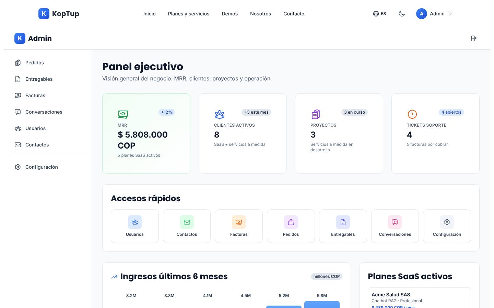
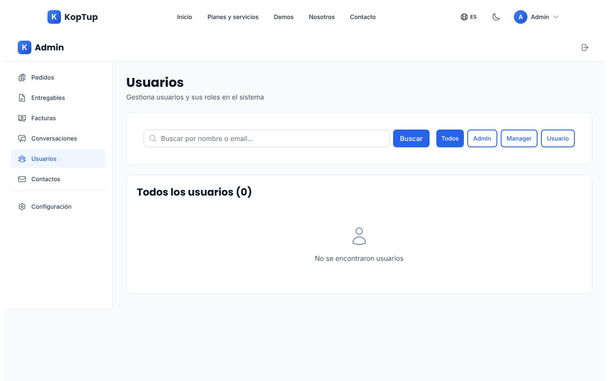
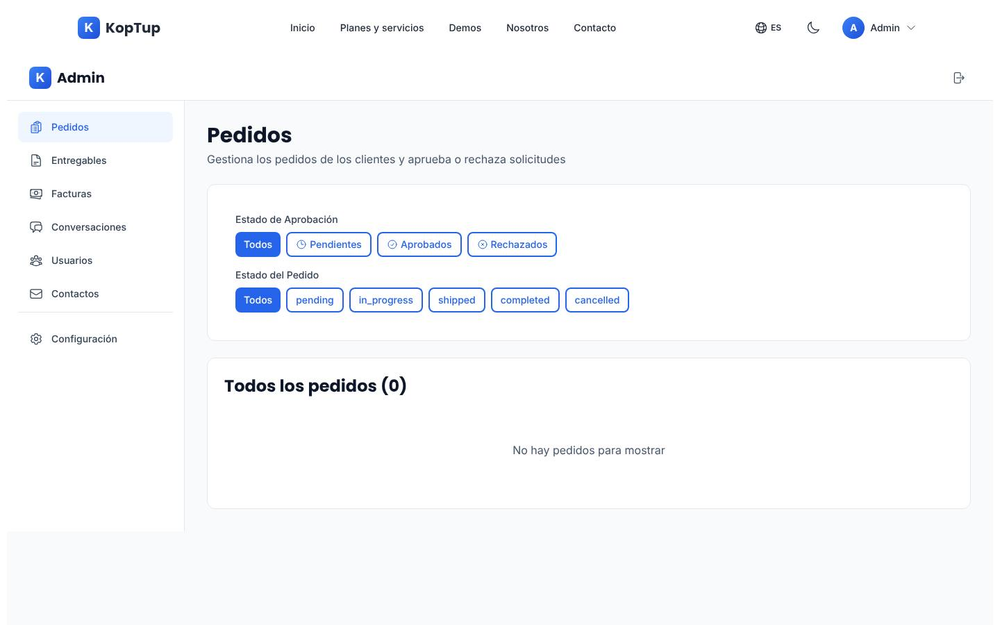
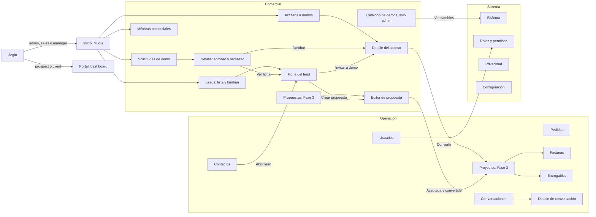
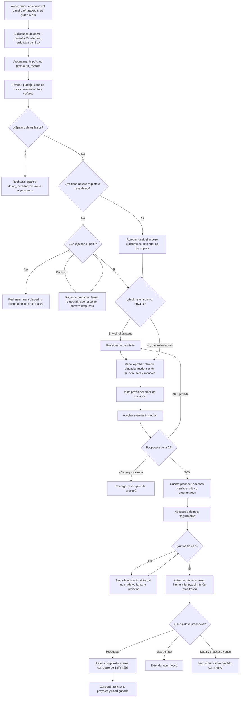

# Panel de administración

> Rutas: `/admin` y `/admin/**` · Archivos principales: `apps/web/src/components/admin/AdminLayout.tsx` (152 líneas), `apps/web/src/app/admin/**` (9 páginas, 2.376 líneas), `apps/web/src/components/layout/ConditionalLayout.tsx`, `apps/backend/src/routes/admin.routes.ts` (48 líneas), `apps/backend/src/controllers/admin.controller.ts` (535 líneas) y las rutas nuevas del equipo de [Sistema de demos](04-Sistema-de-Demos.md) (sección 8.4) · Prioridad: **P0** · Esfuerzo total: **XL** (≈ 22 días-dev P0 y ≈ 41 P1 en la Fase 1; ≈ 146 días-dev hasta la Fase 5; detalle en la [sección 24](#24-resumen-de-tareas-y-esfuerzo))

*Captura local con la base de datos vacía: todo lo que se ve en el inicio son datos escritos en el código.*

El panel de administración es donde KopTup **convierte el interés en clientes**. Aquí el equipo recibe las solicitudes de demo, decide en minutos, da acceso con un clic, ve quién usa cada demo, hace seguimiento y cierra. Además mantiene la operación de los clientes actuales: pedidos, facturas, entregables y conversaciones.

**Quién lo usa:**

| Rol | Persona típica | Para qué entra al panel |
|---|---|---|
| `admin` | El dueño | Todo: aprueba demos privadas, configura el catálogo, gestiona roles, revisa la bitácora y atiende las solicitudes de datos personales |
| `sales` (comercial) | Quien atiende prospectos | Solicitudes, accesos, leads, métricas y contactos |
| `manager` | Quien coordina la operación | Pedidos, facturas, entregables y conversaciones; lee lo comercial |

`developer`, `prospect` y `client` **no entran al panel**. El prospecto y el cliente usan el [Portal del cliente](06-Portal-del-Cliente.md).

**Páginas relacionadas:** [Flujo del cliente](03-Flujo-del-Cliente.md) (recorrido del prospecto) · [Sistema de demos](04-Sistema-de-Demos.md) (modelos, estados, API y reglas que este panel opera) · [Portal del cliente](06-Portal-del-Cliente.md) · [Backend y API](09-Backend-y-API.md) · [Seguridad y calidad](10-Seguridad-y-Calidad.md) · [Roadmap](12-Roadmap.md)

---

## Índice

1. [Objetivo](#1-objetivo)
2. [Estado actual](#2-estado-actual)
3. [Problemas detectados](#3-problemas-detectados)
4. [Diseño del panel](#4-diseño-del-panel): principios, navegación, permisos, flujo de trabajo, base común y cambios de API
5. [Inicio](#5-inicio)
6. [Solicitudes de demo](#6-solicitudes-de-demo)
7. [Accesos a demos](#7-accesos-a-demos)
8. [Leads y pipeline comercial](#8-leads-y-pipeline-comercial)
9. [Propuestas](#9-propuestas)
10. [Métricas comerciales](#10-métricas-comerciales)
11. [Catálogo de demos](#11-catálogo-de-demos)
12. [Contactos](#12-contactos)
13. [Usuarios](#13-usuarios)
14. [Roles y permisos](#14-roles-y-permisos)
15. [Pedidos](#15-pedidos)
16. [Facturas](#16-facturas)
17. [Entregables](#17-entregables)
18. [Conversaciones](#18-conversaciones)
19. [Bitácora de auditoría](#19-bitácora-de-auditoría)
20. [Privacidad (Ley 1581)](#20-privacidad-ley-1581)
21. [Configuración](#21-configuración)
22. [SEO · i18n · accesibilidad · rendimiento](#22-seo--i18n--accesibilidad--rendimiento)
23. [Pruebas del panel](#23-pruebas-del-panel)
24. [Resumen de tareas y esfuerzo](#24-resumen-de-tareas-y-esfuerzo)
25. [Métricas de éxito](#25-métricas-de-éxito)

---

## 1. Objetivo

Pasar de un **panel de operación con datos simulados** a un **centro de operación comercial** que cumpla lo que el sitio promete al prospecto (ver [Flujo del cliente](03-Flujo-del-Cliente.md)):

1. **Responder dentro del SLA.** Cada solicitud se decide en el plazo de su grado (A ≤ 2 h hábiles, B ≤ 4 h, C y D ≤ 1 día hábil) y el panel avisa antes de que venza.
2. **Dar acceso con un clic.** Aprobar crea la cuenta del prospecto, un acceso por demo y la invitación con enlace mágico, en una sola operación.
3. **Saber qué pasa con cada acceso.** Quién activó, quién usó la demo, cuánto tiempo y qué pasos del recorrido completó; quién está por vencer.
4. **No perder ningún lead.** Todo contacto, venga del formulario, de "Prueba con tu documento" o de una solicitud, termina en un **Lead** con responsable, etapa y próxima acción.
5. **Decidir con datos reales.** Embudo, tiempos de respuesta y productos más pedidos, sin cifras inventadas.
6. **Cumplir la Ley 1581.** Consentimiento visible, derechos de los titulares con su plazo legal y bitácora de cada acción del equipo.
7. **Ser seguro por diseño.** Cada rol ve solo lo suyo y cada permiso se verifica en el servidor; la interfaz solo oculta botones.

| Indicador de negocio | Por qué importa |
|---|---|
| % de solicitudes respondidas dentro del SLA | Es la promesa principal al prospecto |
| Mediana de primera respuesta (horas hábiles) | La velocidad de respuesta es la mayor palanca de conversión en B2B |
| % de accesos activados en 72 h | Un acceso sin activar es un lead que se enfría |
| % de accesos en rojo con acción en 48 h | Mide si el comercial rescata a tiempo |
| Leads con próxima acción definida | Ningún lead queda sin dueño ni siguiente paso |

---

## 2. Estado actual

Evidencia tomada de la rama `main`. La rama `rag-reposicionamiento` no toca el panel.

| Bloque | Qué hay hoy | Evidencia |
|---|---|---|
| Estructura | No existe `app/admin/layout.tsx`: cada una de las 9 páginas envuelve su contenido en `<AdminLayout>`, que se vuelve a montar (con su spinner de carga) en cada navegación | `apps/web/src/app/admin/*/page.tsx`; `AdminLayout.tsx` líneas 61–67 |
| Cabecera | `ConditionalLayout` solo oculta el menú y el pie públicos en `/dashboard`. En `/admin` se ven **dos cabeceras** (la del sitio y la del panel) y el pie de página público | `ConditionalLayout.tsx` líneas 11–16; capturas `admin-*.jpg` |
| Acceso a la interfaz | La interfaz decide si muestra el panel leyendo el usuario guardado en `localStorage` (roles `admin` y `manager`). Los datos los protege el backend | `AdminLayout.tsx` líneas 28–40 |
| Redirección tras el login | Solo el rol `admin` (y una cuenta concreta, identificada por su email en el código) va a `/admin`; un `manager` termina en el portal de cliente | `login/page.tsx` líneas 73–86; `dashboard/page.tsx` líneas 64–65 |
| Menú | 6 entradas (Pedidos, Entregables, Facturas, Conversaciones, Usuarios, Contactos) más Configuración. No hay entrada "Inicio" (solo el logo) ni nada comercial | `AdminLayout.tsx` líneas 48–55 y 130–139 |
| Inicio | "Panel ejecutivo" con **datos 100 % simulados**: MRR, planes SaaS, contactos, facturas e ingresos de 6 meses escritos en el código | `admin/page.tsx` líneas 27–68 |
| Backend | 13 endpoints bajo `/api/admin`, todos con `authorize('admin','manager')` aplicado al router completo | `admin.routes.ts` línea 21 |
| Robustez | Varios controladores responden un error pero **no salen de la función** (siguen ejecutando) | `admin.controller.ts` líneas 59–65, 241–243, 255–257, 349–351, 441–453, 509–521 |
| Roles | `User.role` admite `user`, `admin`, `manager` y `developer`. El cambio de rol no deja rastro ni cierra las sesiones de la persona | `models/User.ts` línea 38; `admin.controller.ts` líneas 435–468 |
| Textos e i18n | Solo Pedidos y Configuración usan `next-intl`. Existen claves `adminHome`, `adminUsers`, `adminContacts` y `adminConversations` en `messages/es.json` que ninguna página usa | `grep useTranslations apps/web/src/app/admin` |
| Diálogos | 16 llamadas a `alert`, `confirm` y `prompt` del navegador; no se usan los toasts que el proyecto ya tiene (`react-hot-toast`) | `orders`, `users`, `contacts`, `deliverables`, `conversations/[id]`, `settings` |
| Listas | Sin paginación ni orden en ninguna lista; búsqueda solo en Usuarios. Facturas y Entregables no muestran estado vacío (pantalla en blanco) | `invoices/page.tsx` líneas 55–78; `deliverables/page.tsx` líneas 65–91 |
| Funciones comerciales | **No existen.** No hay solicitudes de demo, accesos, leads, métricas, catálogo de demos, bitácora ni roles comerciales. No hay forma de dar acceso a una demo desde el panel | — |

**Capturas del estado actual** (entorno local sin datos):

| Usuarios | Contactos | Pedidos |
|---|---|---|
|  |  |  |

---

## 3. Problemas detectados

1. **No sirve para vender.** El flujo que pide el dueño ("que los clientes soliciten demos y desde el panel se les dé acceso") no tiene ninguna pantalla. Las solicitudes llegan como contactos sin producto ni plan, y la demo privada se abre con un código fijo, igual para todos (ver [Sistema de demos](04-Sistema-de-Demos.md), sección 10.5).
2. **Cifras inventadas que parecen reales.** El inicio muestra un MRR de $5.808.000, "+12 %", clientes con nombre y planes como "Chatbot RAG · Profesional" a $489.000/mes que no coinciden con los planes RAG publicados (Profesional: COP 2.990.000/mes). Bajo "Tickets soporte" aparece "5 facturas por cobrar", y no existe un módulo de tickets.
3. **No hay rol comercial.** Solo entran `admin` y `manager`; el login ni siquiera lleva al `manager` al panel.
4. **Se ve como parte del sitio público.** Doble cabecera, pie de página público y un spinner de pantalla completa en cada cambio de sección.
5. **Funciones rotas** (verificadas en el código):
   - **Conversaciones:** enviar un mensaje falla, porque la página llama a la ruta sin el prefijo `/api` (`conversations/[id]/page.tsx` línea 57, frente a `index.ts` línea 231 y `lib/backend-url.ts` línea 12).
   - **Facturas:** "Descargar" no funciona. Envía el número de factura donde el backend espera el identificador interno (`admin.controller.ts` línea 192 frente a `invoices.controller.ts` línea 205), lee la URL en el nivel equivocado de la respuesta (`invoices/page.tsx` línea 32) y el backend no genera ningún PDF: devuelve un enlace a sí mismo (`invoices.controller.ts` línea 211).
   - **Contactos:** al cambiar el estado, el panel de detalle no se actualiza, porque compara `_id` con un `id` (`contacts/page.tsx` línea 47 frente a `admin.controller.ts` línea 484).
6. **Estados en inglés y dinero mal formateado.** Pedidos muestra `pending`, `in_progress`, `shipped` (que no aplica a software); Facturas y Entregables, `draft`, `in_review`. Los montos salen como `$5000.00` con moneda USD por defecto, aunque la operación es en COP.
7. **El equipo aprueba entregables en lugar del cliente.** En Entregables el admin solo puede aprobar o rechazar (que es la acción del cliente) y no puede **subir** un entregable a un proyecto.
8. **Configuración que no configura nada.** Guarda en `localStorage` con una espera simulada de 1 segundo y muestra un texto fijo "Tienes acceso completo a todas las funcionalidades" (`settings/page.tsx` líneas 53–63 y 220–247).
9. **Sin trazabilidad.** No hay bitácora: no se sabe quién cambió un rol, aprobó un pedido o rechazó un entregable.
10. **Sin avisos.** No hay campana de notificaciones en el panel; el equipo se entera de un contacto nuevo solo por email o WhatsApp.
11. **Experiencia frágil.** Diálogos nativos del navegador, errores solo en la consola, listas que cargan todo sin paginar.

---

## 4. Diseño del panel

### 4.1 Principios

1. **Una pantalla, una decisión.** El detalle de una solicitud tiene todo lo necesario para aprobar o rechazar sin abrir otra pestaña.
2. **Lo urgente primero.** Listas ordenadas por SLA y por "requiere atención", no por fecha de creación.
3. **El servidor manda.** La interfaz oculta lo que el rol no puede hacer, pero cada acción se valida en el backend (matriz de permisos de [Sistema de demos](04-Sistema-de-Demos.md), sección 3).
4. **Toda acción sensible pide motivo y queda en la bitácora:** aprobar, rechazar, extender, revocar, convertir, cambiar rol o modo, anonimizar.
5. **Cero datos simulados en producción.** Si no hay datos, se muestra un estado vacío que explica qué va a aparecer ahí.
6. **Funciona en el celular.** Un comercial que recibe una alerta de WhatsApp puede abrir la solicitud y aprobarla desde el teléfono.
7. **Español claro, con "tú".** Estados, botones y mensajes en español; nada de claves en inglés en pantalla.

### 4.2 Navegación

El menú se agrupa en tres bloques, como en los mockups, y **cada rol ve solo sus entradas**. Los módulos existentes conservan sus rutas en inglés (`/admin/users`, `/admin/contacts`…) para no romper enlaces; los nuevos usan las rutas en español definidas en [Sistema de demos](04-Sistema-de-Demos.md), sección 9.

| Grupo | Entrada | Ruta | admin | sales | manager | Contador en el menú | Fase |
|---|---|---|:-:|:-:|:-:|---|---|
| Comercial | Inicio | `/admin` | ✓ | ✓ | ✓ | — | 1 |
| Comercial | Solicitudes de demo | `/admin/solicitudes` | ✓ | ✓ | ✓ | Pendientes | 1 |
| Comercial | Accesos a demos | `/admin/accesos` | ✓ | ✓ | ✓ | Por expirar | 1 |
| Comercial | Leads | `/admin/leads` | ✓ | ✓ | ✓ | Tareas vencidas | 1 |
| Comercial | Propuestas | `/admin/propuestas` | ✓ | ✓ | — | Vistas sin respuesta | 3 |
| Comercial | Catálogo de demos | `/admin/catalogo-demos` | ✓ | — | — | — | 1 |
| Comercial | Métricas | `/admin/metricas` | ✓ | ✓ | ✓ | — | 1 |
| Operación | Contactos | `/admin/contacts` | ✓ | ✓ | — | Nuevos | 1 |
| Operación | Usuarios | `/admin/users` | ✓ | — | ✓ | — | 1 |
| Operación | Proyectos | `/admin/proyectos` | ✓ | — | ✓ | — | 3 (propuesta de esta página) |
| Operación | Pedidos | `/admin/orders` | ✓ | — | ✓ | Por aprobar | 1 |
| Operación | Facturas | `/admin/invoices` | ✓ | — | ✓ | Vencidas | 1 |
| Operación | Entregables | `/admin/deliverables` | ✓ | — | ✓ | Con observaciones | 1 |
| Operación | Conversaciones | `/admin/conversations` | ✓ | — | ✓ | Sin leer | 1 |
| Sistema | Bitácora | `/admin/bitacora` | ✓ | — | — | — | 1 |
| Sistema | Roles y permisos | `/admin/roles` | ✓ | — | — | — | 1 (propuesta de esta página) |
| Sistema | Privacidad | `/admin/privacidad` | ✓ | — | — | Por vencer | 1 |
| Sistema | Configuración | `/admin/settings` | ✓ | — | ✓ | Jobs atrasados | 1 |

`sales` llega a "Mi cuenta" desde el menú de usuario de la barra superior. Al pie del menú lateral se muestra el texto del mockup: *"Rol Comercial: el menú muestra solo las secciones de tu rol."*

**Mapa de navegación**

### 4.3 Permisos por módulo

Leyenda: **✓** completo · **L** solo lectura (sin botones de acción) · **—** sin acceso. La matriz completa de permisos del servidor está en [Sistema de demos](04-Sistema-de-Demos.md), sección 3; esta tabla la traduce a pantallas.

| Módulo | admin | sales | manager | Permiso o regla en el servidor |
|---|:-:|:-:|:-:|---|
| Inicio | ✓ | ✓ | ✓ | El contenido cambia según el rol (sección 5) |
| Solicitudes de demo | ✓ | ✓ (sin demos `privado` ni reabrir) | L | `demoRequests.read`, `.manage`, `.approve`, `.approvePrivate`, `.reopen` |
| Accesos a demos | ✓ | ✓ (en demos `privado`: ver, reenviar invitación y revocar) | L | `grants.read`, `grants.manage`; invitar o extender en `privado` exige admin |
| Leads | ✓ | ✓ (sin anonimizar) | L | `leads.read`, `.manage`, `.anonymize` |
| Propuestas (Fase 3) | ✓ | ✓ (sin convertir) | — | Permisos nuevos `quotes.read`, `quotes.manage`, `quotes.convert` |
| Métricas | ✓ | ✓ | ✓ | `metrics.read` |
| Catálogo de demos | ✓ | — | — | `catalog.manage` |
| Contactos | ✓ | ✓ | — (lee los mensajes en la ficha del Lead) | Permisos por ruta: `admin` y `sales` |
| Usuarios | ✓ | — | L | `users.setRole` (solo admin) |
| Roles y permisos | ✓ | — | — | Lectura de la matriz |
| Proyectos, Pedidos, Facturas, Entregables, Conversaciones | ✓ | — | ✓ | `authorize('admin','manager')` actual, pasado a permisos por ruta |
| Bitácora | ✓ | — | — | `audit.read` |
| Privacidad | ✓ | — | — | `privacy.manage` |
| Configuración | ✓ | Solo "Mi cuenta" | "Mi cuenta" y salud del sistema (L) | `GET /api/admin/jobs/health`: admin y manager |

**Regla de demos privadas para accesos.** [Sistema de demos](04-Sistema-de-Demos.md) (DECISIÓN 11) reserva al admin aprobar e invitar a demos `privado`. Esta página precisa la regla para el resto de acciones: en un acceso a una demo `privado`, **extender y convertir** también exigen admin (dan más acceso a un backend real de salud), mientras que **revocar y reenviar la invitación** los puede hacer `sales` (no amplían el acceso). Agregar esta precisión a `config/permissions.ts`.

### 4.4 Flujo de trabajo: procesar una solicitud de demo

Así trabaja el comercial desde que llega una solicitud hasta que el prospecto usa la demo. Los rombos son decisiones del comercial o respuestas de la API.

### 4.5 Rutina diaria del comercial

El orden de trabajo que el **Inicio** propone cada mañana. Al terminar el día no debe quedar ninguna solicitud con SLA vencido ni ninguna tarea vencida.

```mermaid
flowchart LR
  D["7:45 Resumen diario por email"] --> I["Inicio: Mi día"]
  I --> R1["1. SLA vencido o en riesgo"]
  R1 --> R2["2. Pendientes sin asignar, grado A y B primero"]
  R2 --> R3["3. Invitaciones sin activar en 48 h"]
  R3 --> R4["4. Primer acceso o acción del prospecto: llamar"]
  R4 --> R5["5. Accesos por vencer: proponer, extender o cerrar"]
  R5 --> R6["6. Tareas vencidas y leads sin próxima acción"]
  R6 --> F["Cierre: cero SLA vencidos y cero tareas vencidas"]
```

### 4.6 Base común: estructura y componentes

**Estructura**

| Pieza | Archivo | Qué hace |
|---|---|---|
| Layout del panel | `apps/web/src/app/admin/layout.tsx` (nuevo, componente de servidor) | Exporta `metadata` con `robots: { index: false, follow: false }` y título `%s · Admin KopTup`. Renderiza `AdminShell`. Las páginas dejan de importar `AdminLayout` |
| Sin cabecera pública | `apps/web/src/components/layout/ConditionalLayout.tsx` | Excluye `/admin` igual que `/dashboard`: sin menú ni pie públicos |
| `AdminShell` | `apps/web/src/components/admin/shell/AdminShell.tsx` (reemplaza `AdminLayout.tsx`) | Pide el usuario al servidor con `GET /api/auth/profile` (no a `localStorage`). Sin sesión → `/login?redirect=<ruta>`. Rol que no es `admin`, `sales` ni `manager` → `/dashboard`. Muestra un esqueleto solo la primera vez |
| Barra superior | `shell/AdminTopbar.tsx` | Búsqueda global (Ctrl K) por lead, empresa o código `DR-…`; "Ver sitio"; campana de avisos (endpoints de notificaciones existentes); menú de usuario con nombre, rol, "Mi cuenta" y "Salir" |
| Menú lateral | `shell/AdminSidebar.tsx` | Grupos Comercial, Operación y Sistema filtrados por rol (sección 4.2), contadores y el texto del rol al pie. En móvil, panel deslizante con el foco controlado |
| Middleware | `apps/web/middleware.ts` | Para `/admin/*` sin cookie de sesión, redirige a `/login?redirect=`. Es una comodidad: la autorización real está en la API |
| Redirección tras el login | `login/page.tsx`, `auth/callback/page.tsx`, `dashboard/page.tsx` | Por rol, no por email: `admin`, `sales` y `manager` → `/admin`; `prospect` → `/dashboard/demos`. Se respeta `?redirect=` (tarea 21 de [Sistema de demos](04-Sistema-de-Demos.md)) |

**Kit de componentes** (`apps/web/src/components/admin/ui/`), usando lo que el proyecto ya tiene (`@headlessui/react`, `swr`, `react-hook-form`, `zod`, `react-hot-toast`, `date-fns`), sin librerías de gráficos nuevas:

| Componente | Uso |
|---|---|
| `DataTable` | Columnas declarativas, orden, paginación en servidor (20 filas), selección, fila clicable, versión en tarjetas por debajo de 768 px. El estado (pestaña, filtros, página) vive en la URL para poder compartir enlaces |
| `FilterBar`, `Tabs`, `SavedViews` | Filtros en chips, pestañas con conteo, vistas ("Mis pendientes", "SLA en riesgo") |
| `StatusBadge` + `lib/admin/labels.ts` | Diccionario único de estados en español para todos los enums (solicitud, acceso, Lead, pedido, factura, entregable, conversación, rol, estado de cuenta) |
| `SlaChip`, `ScoreBadge`, `HealthDot` | SLA con texto y color ("Quedan 1 h 35 min", "Vencido hace 40 min"); puntaje con grado y desglose en tooltip; salud del acceso |
| `ConfirmDialog`, `ReasonDialog`, `Drawer` | Reemplazan `alert`, `confirm` y `prompt`. `ReasonDialog` exige motivo para acciones auditadas |
| `EmptyState`, `ErrorState`, `Skeleton` | Estados vacíos con explicación, errores con reintento y el `requestId` para soporte |
| `KpiCard`, `BarList`, `LineChart` | Indicadores y gráficas simples en SVG, como las del mockup de métricas |
| `Timeline` | Línea de tiempo de solicitudes, accesos y leads |
| `useAdminList`, `useAdminMutation` | SWR con la URL como clave; mutaciones con toast de éxito o error y recarga |
| `formatMoney`, `formatDate` | `es-CO`, zona `America/Bogota`. COP sin decimales ("$ 2.990.000"); USD con 2 decimales ("USD 890,00") |
| `useCan`, `<Can>` | Ocultan o deshabilitan botones según la matriz de permisos |

**Matriz de permisos en la interfaz.** Igual que el mapa estático de modos de demo (ver [Sistema de demos](04-Sistema-de-Demos.md), sección 5.3), un script `apps/web/scripts/gen-permissions.mjs` copia la matriz de `apps/backend/src/config/permissions.ts` a `apps/web/src/lib/admin/permissions.generated.ts`. Una prueba en CI falla si las dos copias difieren. La interfaz la usa solo para mostrar u ocultar; el servidor sigue decidiendo.

**Mensajes de error comunes**

| Respuesta | Texto |
|---|---|
| 401 | "Tu sesión terminó. Inicia sesión de nuevo para continuar." (lleva a `/login?redirect=`) |
| 403 | "No tienes permiso para esta acción. Pídesela a un administrador." |
| 409 | "Esto ya cambió: {detalle}. Recargamos los datos." |
| 422 | El mensaje de la API (por ejemplo, "La extensión ya no es posible: pasaron más de 30 días desde el vencimiento.") |
| 5xx o sin red | "No pudimos completar la acción. Intenta de nuevo; si sigue fallando, avisa al administrador (código {requestId})." |

**Tareas de la base común**

| # | Tarea | Fase | Prioridad | Esfuerzo | Criterio de aceptación |
|---|---|---|---|---|---|
| 1 | Estructura del panel: `app/admin/layout.tsx` con `noindex`, `AdminShell` que consulta `GET /api/auth/profile`, exclusión de `/admin` en `ConditionalLayout`, menú por rol con grupos y contadores, redirección por rol tras el login | Fase 1 — Funnel y solicitud de demos | P0 | S | No hay doble cabecera ni pie público; cambiar de sección no muestra el spinner de pantalla completa; `sales` ve solo Inicio, Solicitudes, Accesos, Leads, Métricas y Contactos; un `manager` entra al panel después del login |
| 2 | Kit de componentes (`DataTable`, filtros, `StatusBadge` con `labels.ts`, `SlaChip`, `ScoreBadge`, diálogos, estados vacíos y de error, toasts, `formatMoney`, `formatDate`) y migración de las 9 páginas actuales al kit | Fase 1 — Funnel y solicitud de demos | P0 | M | `grep -rE "alert\(|confirm\(|prompt\(" apps/web/src/app/admin` no da resultados; ningún estado se muestra en inglés; toda lista tiene estado vacío y paginación |
| 3 | Permisos en la interfaz: `gen-permissions.mjs`, `permissions.generated.ts`, `useCan` y `<Can>`, con prueba de igualdad en CI | Fase 1 — Funnel y solicitud de demos | P0 | S | Cambiar un permiso en el backend sin regenerar hace fallar CI; con `sales`, el botón de aprobar una demo `privado` aparece deshabilitado con el aviso "Requiere administrador" |
| 4 | Robustez de `admin.controller.ts`: salir de la función después de cada error, validar entradas con `zod`, respuestas 400/404 uniformes y pruebas de cada endpoint | Fase 0 — Endurecimiento | P1 | S | Las pruebas de integración cubren los 13 endpoints con datos válidos, inválidos e inexistentes; ninguno produce "headers already sent" ni 500 por un id inexistente |
| 5 | Panel usable en móvil: tablas en tarjetas por debajo de 768 px, paneles de decisión a pantalla completa, botones de 44 px | Fase 1 — Funnel y solicitud de demos | P1 | S | Desde un viewport de 390 px se puede abrir una solicitud desde el enlace del WhatsApp interno y aprobarla sin scroll horizontal |
| 6 | Campana de avisos (tipos `demo`, `lead` y `quote` de `Notification`) y búsqueda global Ctrl K sobre `GET /api/leads?q=` y `GET /api/demo-requests?q=` | Fase 1 — Funnel y solicitud de demos | P2 | S | Una solicitud nueva aparece en la campana en ≤ 60 s; buscar "DR-2026-000131" abre ese detalle |
| 7 | Textos del panel en `messages/es.json` bajo `admin.*`, reutilizando las claves existentes sin uso (`adminUsers`, `adminContacts`, `adminConversations`, `adminHome`) | Fase 1 — Funnel y solicitud de demos | P2 | S | Las páginas del panel no tienen textos visibles escritos a mano; no quedan claves `admin*` sin uso |

### 4.7 Cambios de API que propone esta página

Esta página usa los endpoints de [Sistema de demos](04-Sistema-de-Demos.md) (sección 8) y **propone estos agregados**, que deben pasar a [Backend y API](09-Backend-y-API.md) y, si son rutas web, a la tabla de rutas de Sistema de demos:

| Cambio | Rol | Para qué | Fase |
|---|---|---|---|
| `GET /api/metrics/admin-home` | admin, sales, manager (el contenido depende del rol) | El inicio en una sola llamada: conteos, "Atiende primero", "Mis tareas", actividad reciente, operación y salud | 1 |
| `GET /api/admin/jobs/health` incluye conteos de `OutboundMessage` `programado` y `fallido` | admin, manager | Saber si las invitaciones están saliendo | 1 |
| `PATCH /api/admin/users/:id/status` (`{accountStatus, reason}`, incrementa `tokenVersion`) | admin | Suspender y reactivar cuentas: el estado `suspendido` existe en el modelo pero ningún endpoint lo fija | 1 |
| `POST /api/admin/invoices`, `PATCH /api/admin/invoices/:id/status` y `POST /api/admin/deliverables` | admin, manager | Crear y cobrar facturas y subir entregables desde rutas del equipo con permisos por ruta | 1 |
| `GET /api/demo-requests?format=csv` y `GET /api/demo-grants?format=csv` | admin (queda en la bitácora) | Exportar listas con datos personales | 2 |
| `User.notificationPrefs` y `PATCH /api/me/notification-prefs` | equipo | Preferencias de avisos por persona | 2 |
| Permisos `quotes.read`, `quotes.manage` y `quotes.convert` en `permissions.ts` | — | Propuestas | 3 |
| `GET /api/admin/projects` y `GET /api/admin/projects/:id` | admin, manager | Módulo Proyectos | 3 |
| Rutas web `/admin/roles` (Fase 1) y `/admin/proyectos` (Fase 3) | — | Módulos Roles y permisos y Proyectos | 1 y 3 |

---

## 5. Inicio

> Ruta: `/admin` · Archivos: `apps/web/src/app/admin/page.tsx` (352 líneas, se reescribe), `components/admin/home/*` (nuevos), `controllers/metrics.controller.ts` · Prioridad: P0 (retirar datos simulados) y P1 (datos reales) · Esfuerzo: M

### Objetivo

Que cada persona sepa en 10 segundos **qué tiene que hacer ahora**. Para el comercial es "Mi día"; para el admin, además, la salud del sistema; para el manager, la operación.

### Estado actual y problemas

- Todo el contenido es simulado: `ACTIVE_PLANS`, `RECENT_CONTACTS`, `UPCOMING_INVOICES`, `REVENUE_LAST_6` y `KPIS` (líneas 27–68). La insignia "+12 %" está fija (línea 120) y "Clientes activos" suma 3 a mano (línea 64).
- Los planes del ejemplo ("Chatbot RAG · Profesional" a $489.000/mes, "Agente IA Ventas · Growth") no existen en el catálogo ni coinciden con los planes RAG.
- La lista "Últimos contactos" muestra nombres y emails inventados.
- "Accesos rápidos" repite el menú lateral; no hay nada comercial.

### Plan detallado

**Encabezado:** "Hola, {nombre}" y debajo "Esto necesita tu atención hoy, {día} {fecha}."

**Bloques por rol**

| Bloque | admin | sales | manager | Contenido |
|---|:-:|:-:|:-:|---|
| Tarjetas | ✓ | ✓ | ✓ | **Pendientes** ("{n} asignadas a ti") · **SLA en riesgo** ("{n} vencidas", en rojo si hay) · **Accesos por vencer** ("en 3 días o menos") · **Prospectos activos hoy** ("abrieron una demo hoy"). Cada tarjeta lleva a la lista filtrada |
| Atiende primero | ✓ | ✓ | L | Las 5 solicitudes con el SLA más próximo (para `sales`: asignadas a él o sin asignar). Fila: código, lead y empresa, productos, puntaje, `SlaChip` y botón **Revisar** |
| Mis tareas | ✓ | ✓ | — | Tareas (`LeadActivity` de tipo `tarea`) vencidas y de hoy, con casilla **Hecha**. Ejemplo: "Llamar a Jorge Ruiz (Clínica Norte): no ha activado su acceso · vence hoy 11:00" |
| Actividad reciente | ✓ | ✓ | ✓ | Activaciones, primeros accesos, "pidió propuesta / más tiempo / llamada", accesos con 20 min o más. Cada fila con su acción ("Llamar", "Extender", "Abrir lead") |
| Leads calientes | ✓ | ✓ | ✓ | Grado A o B con uso en los últimos 3 días y sin propuesta |
| Operación | ✓ | — | ✓ | Pedidos por aprobar, entregables con observaciones del cliente, facturas vencidas |
| Salud del sistema | ✓ | — | ✓ | Jobs atrasados y mensajes fallidos (de `GET /api/admin/jobs/health`), con enlace a Configuración |
| Privacidad | ✓ | — | — | Solicitudes de titulares que vencen en 3 días hábiles o menos |

**Estados vacíos:** "Todo al día: no hay solicitudes pendientes ni accesos por vencer." · "No tienes tareas para hoy."

**Datos:** una sola llamada a `GET /api/metrics/admin-home` (sección 4.7), con caché de 30 s en el servidor y refresco cada 60 s mientras la pestaña está visible.

**Indicadores financieros:** no se muestra MRR ni ingresos hasta que existan facturas reales (Fase 3) y cobro recurrente (Fase 4). Entonces se agrega "Cobrado este mes (COP)" calculado desde las facturas pagadas.

### Integración con el sistema de demos

Los conteos salen de `DemoRequest` (pendientes, `slaDueAt`, `slaBreached`), `DemoGrant` (`por_expirar`, `usage.lastAccessAt`), `LeadActivity` (tareas) y `JobRun`. Las solicitudes y los Leads marcados `isTest` no cuentan.

### Tareas

| # | Tarea | Fase | Prioridad | Esfuerzo | Criterio de aceptación |
|---|---|---|---|---|---|
| 8 | Retirar todos los datos simulados del inicio y dejar un estado vacío honesto con enlaces a los módulos | Fase 1 — Funnel y solicitud de demos | P0 | S | `admin/page.tsx` no contiene arreglos de datos de ejemplo; con la base vacía el inicio no muestra ninguna cifra |
| 9 | Inicio por rol con datos reales y `GET /api/metrics/admin-home` | Fase 1 — Funnel y solicitud de demos | P1 | M | Con datos de prueba, cada tarjeta coincide con el conteo de su lista filtrada; `sales` no ve Operación ni Salud; completar una tarea desde el inicio la marca con `doneAt` |
| 10 | Tarjeta "Cobrado este mes" desde facturas pagadas | Fase 4 — Productos SaaS reales | P3 | S | La cifra coincide con la suma de las facturas `paid` del mes en COP |

### Métricas de éxito

- 0 datos simulados en producción.
- Mediana de tiempo entre abrir el panel y la primera acción ≤ 2 min (medido con un evento interno del panel).

---

## 6. Solicitudes de demo

> Rutas: `/admin/solicitudes` y `/admin/solicitudes/[id]` · Archivos: `app/admin/solicitudes/{page,[id]/page}.tsx`, `components/admin/demo-requests/{Table,Filters,ScoreBadge,SlaChip,ApprovePanel,RejectPanel,LeadTimeline}.tsx` (tareas 23 y 24 de [Sistema de demos](04-Sistema-de-Demos.md)) · Prioridad: P0 · Esfuerzo: M + M

### Objetivo

Decidir cada solicitud **dentro del SLA**, con toda la información en una sola pantalla y en **3 clics o menos**: abrir, revisar, aprobar.

### Estado actual y problemas

No existe. Hoy un interesado escribe por el formulario de contacto, que pierde el producto y el plan elegidos, y la solicitud termina en **Contactos** sin puntaje, sin responsable y sin plazo. No hay forma de dar acceso a una demo; la única demo restringida se abre con un código fijo.

### Plan detallado

**Bandeja (`/admin/solicitudes`)**

- **Pestañas con conteo:** Pendientes · En revisión · Aprobadas · Rechazadas · Todas.
- **Vistas:** "Mis pendientes", "SLA en riesgo", "Grado A sin tocar" y "Guardar vista" (Fase 2).
- **Filtros:** Producto, Grado, Responsable, SLA (en tiempo, en riesgo, vencido), Fuente (canal y UTM), rango de fechas; búsqueda por nombre, empresa, email o código.
- **Orden por defecto:** SLA más próximo y después puntaje. Las vencidas suben al inicio.
- **Paginación:** 20 filas. **Refresco:** cada 60 s mientras la pestaña está visible.
- **Leyenda de grados** junto a los filtros con los umbrales vigentes: **A ≥ 65 · B 45–64 · C 25–44 · D < 25** ([Sistema de demos](04-Sistema-de-Demos.md), sección 5.4). *La leyenda del mockup es ilustrativa y usa otros cortes; manda la sección 5.4.*

| Columna | Contenido | Notas |
|---|---|---|
| Código · Recibida | `DR-2026-000131` · "hace 25 min" o "ayer 15:57" | Enlace al detalle |
| Lead | Nombre y empresa, con chips **Webmail**, **Posible duplicado** y **Prueba** | Webmail si `emailRisk = webmail` |
| País · Tamaño | `CO` · `51–200` | |
| Productos | Demos pedidas; chip **Privada** en las `privado` | Máximo 2 visibles y "+N" |
| Urgencia | Inmediata · 1–3 meses · 3–6 meses · Explorando | "Inmediata" en rojo |
| Puntaje | `67 A` | Tooltip con el desglose |
| SLA | "Quedan 1 h 35 min" en verde; en ámbar desde el 75 % del plazo; "Vencido hace 40 min" en rojo | Solo en `pendiente` y `en_revision`. Horas hábiles L–V 8:00–17:00 |
| Responsable | Avatar y nombre, o "Sin asignar" | |
| Estado | Pendiente · En revisión · Aprobada · Rechazada | |
| Acciones | **Asignarme** (si no tiene responsable), **Ver** y menú ⋯: Asignar a…, Marcar en revisión, Agregar nota interna, Copiar enlace, Rechazar… | `manager` solo ve **Ver** |

**Acciones en lote** (Fase 2, `POST /api/demo-requests/bulk`): asignar y "Rechazar como spam".

**Estados vacíos:** Pendientes: "No hay solicitudes pendientes. Las nuevas llegan aquí y te avisamos por email." · Filtros sin resultados: "Ninguna solicitud coincide con estos filtros." + "Quitar filtros".

**Detalle (`/admin/solicitudes/[id]`)**

*Encabezado:* código, estado, `SlaChip`, "Recibida hoy 09:12 · Sin asignar", botones **Marcar en revisión** y **Asignarme**, y flechas para pasar a la solicitud anterior o siguiente de la lista.

*Columna izquierda:*

| Tarjeta | Contenido |
|---|---|
| Lead | Nombre, cargo y empresa; email (chip **Corporativo** o **Webmail**), teléfono (chip **WhatsApp autorizado** si aplica), país, tamaño, fuente con UTM y landing de entrada. Enlace "Ver ficha del lead" |
| Puntaje | Barra con el umbral del grado y cada regla con sus puntos (`scoreBreakdown`) |
| Caso de uso | Texto plano (escapado), con chips de preferencia (guiada o autoservicio), urgencia y productos |
| Consentimiento | Autorización Ley 1581 con versión de la política, fecha y canal; WhatsApp; comunicaciones comerciales (sí o no) |
| Señales | Duplicados, accesos vigentes del mismo email, captcha verificado, riesgo del email, tiempo de llenado |
| Historial | Cada transición y cada mensaje enviado (`history`), con campo "Agregar nota interna" |

*Columna derecha, pestaña **Aprobar**:*

| Campo | Valor inicial | Reglas |
|---|---|---|
| Demos a conceder | Las pedidas (`items`) | Las `privado` aparecen bloqueadas para `sales` con "Privada: requiere administrador". "Agregar otra demo" busca en el catálogo activo. Si ya hay un acceso vigente a esa demo: "Ya tiene acceso hasta el {fecha}: se extenderá" |
| Vigencia | `defaultDurationDays` de la demo (14) | Chips 7 · 14 · 21 · 30 días · Personalizada (1 a 90). Muestra "Vence el {fecha}" |
| Modo | `preferredMode` o `defaultMode` | Autoservicio deshabilitado si la demo tiene `selfServiceAllowed = false` |
| Sesión guiada | Vacía | Fecha, hora (Bogotá) y enlace de la reunión. Si se llena, el email es `demo_invite_guiada` |
| Nota interna | Vacía | Solo la ve el equipo; queda en el historial |
| Mensaje al prospecto | Vacío | Va en el email; texto plano, máximo 500 caracteres |
| Vista previa del email | — | Abre la plantilla con los datos reales (ver el mockup del email más abajo) |

Resumen antes del botón, según el caso:
- Cuenta nueva: "Se creará la cuenta de prospecto de {nombre} y {n} accesos de {d} días. El enlace de activación vence en 72 horas."
- Cuenta existente: "{nombre} ya tiene cuenta ({rol}). Recibirá el aviso «Tienes nuevas demos», sin enlace de activación."

Botón principal: **Aprobar y enviar invitación**. Éxito: toast "Solicitud aprobada. La invitación sale en menos de 1 minuto." y enlace "Ver accesos creados".

*Pestaña **Rechazar**:* motivo en chips (Spam · Fuera de perfil · Competidor · Datos inválidos · Duplicada · Otro), mensaje opcional (se inserta en `demo_rejected`), interruptor **Avisar al prospecto** (apagado y bloqueado con Spam y Competidor, con el texto "Con estos motivos nunca se avisa al prospecto") y botón **Rechazar solicitud**. En una solicitud rechazada, el admin ve **Reabrir**.

**Casos especiales**

| Caso | Qué muestra el panel | Qué hace la API |
|---|---|---|
| Demo `privado` y rol `sales` | Casilla bloqueada, aviso "Requiere administrador" y botón **Reasignar a un admin** | 403 si se fuerza |
| Doble clic u otro comercial ya decidió | Toast "Esta solicitud ya la procesó {nombre} a las {hora}. Recargamos los datos." | 409 (precondición de estado) |
| El email es de una cuenta del equipo | Banner rojo "Este email pertenece al equipo" y **Aprobar** deshabilitado | No aprueba |
| Ya tiene acceso vigente | Etiqueta "se extenderá hasta…" en esa demo | Extiende en lugar de crear otro acceso |
| Solicitud con envíos fusionados | Banner "Esta solicitud sumó {n} envíos del mismo email" y los productos agregados en el historial | Fusión de duplicados (sección 16 de Sistema de demos) |
| Solicitud de prueba del equipo | Chip **Prueba** y acción "Marcar como prueba" | `isTest = true`; no cuenta en métricas |
| Solicitud de un cliente desde el portal | Chip **Cliente** y su comercial ya asignado | Sin captcha; el rol `client` no cambia |

### Permisos

- **admin:** todo, incluidas las demos `privado` y **Reabrir**.
- **sales:** asignar, revisar, notas, aprobar demos `publico` y `solicitud`, rechazar.
- **manager:** lectura, sin botones de acción.

### Integración con el sistema de demos

`GET /api/demo-requests` (filtros y conteos por pestaña), `GET /api/demo-requests/:id`, `PATCH /api/demo-requests/:id` (asignar, `en_revision`, nota), `POST /api/demo-requests/:id/approve`, `/reject` y `/reopen`. Aprobar o rechazar cuenta como **primera respuesta** del SLA. Cada clic en **Aprobar** envía una clave de idempotencia para que un reintento de red no duplique accesos.

### Tareas

| # | Tarea | Fase | Prioridad | Esfuerzo | Criterio de aceptación |
|---|---|---|---|---|---|
| 11 | Bandeja: pestañas con conteo, vistas fijas, filtros, búsqueda, `SlaChip`, `ScoreBadge`, orden por SLA, paginación y refresco | Fase 1 — Funnel y solicitud de demos | P0 | S | Con 30 solicitudes de prueba, el orden coincide con `slaDueAt` ascendente; el filtro "SLA vencido" muestra solo `slaBreached`; la URL con filtros abre la misma vista en otra pestaña |
| 12 | Detalle con las tarjetas del lead y los paneles **Aprobar** (con vista previa del email) y **Rechazar**; **Reabrir** para admin; manejo de 403 y 409 | Fase 1 — Funnel y solicitud de demos | P0 | M | Aprobar crea los accesos y el detalle pasa a "Aprobada" con enlace a Accesos; un segundo clic responde 409 sin duplicar; `sales` no puede aprobar una demo `privado`; con motivo Spam no se programa ningún email |
| 13 | Acciones en lote (asignar, rechazar como spam) y vistas guardadas por persona | Fase 2 — Demos vendibles | P2 | S | Rechazar 10 solicitudes como spam deja 10 registros en la bitácora y ningún email programado |
| 14 | Exportar solicitudes y accesos a CSV (solo admin, registrado en la bitácora) | Fase 2 — Demos vendibles | P3 | S | `sales` no ve el botón y la API le responde 403; cada exportación deja un registro con filtros y número de filas |

La acción **Registrar contacto**, que también se usa desde este detalle, está en la tarea 20.

### Métricas de éxito

- ≥ 90 % de solicitudes con primera respuesta dentro del SLA (meta inicial a validar).
- Mediana de tiempo entre abrir el detalle y decidir ≤ 3 min.
- 0 accesos duplicados por doble clic.

---

## 7. Accesos a demos

> Rutas: `/admin/accesos` y `/admin/accesos/[id]` · Archivos: `app/admin/accesos/{page,[id]/page}.tsx`, `components/admin/demos/{GrantsTable,ExtendDialog,RevokeDialog,ConvertDialog,InviteDialog,UsageTimeline}.tsx` (tarea 25 de [Sistema de demos](04-Sistema-de-Demos.md)) · Prioridad: P0 · Esfuerzo: M + S

### Objetivo

Que **ningún acceso se pierda**: cada invitación se activa, cada demo se usa, cada vencimiento termina en una conversación y cada interesado llega a propuesta o a cliente.

### Estado actual y problemas

No existe. Hoy no hay accesos personales: la demo restringida se comparte con un código fijo, sin vigencia, sin medición y sin forma de retirarla a una sola persona.

### Plan detallado

**Lista (`/admin/accesos`)**

- **Indicadores:** Activos · Por expirar (3 días o menos) · Expirados (30 días) · Convertidos (30 días). Cada uno filtra la tabla.
- **Filtros:** Estado, Demo, **Vence en 3 días**, Salud, Responsable; orden **"Requiere atención"** (rojo primero, luego por vencer, luego sin activar); búsqueda por persona o email.
- **Botones de la página:** **Invitar directo** y Exportar (Fase 2, solo admin).

| Columna | Contenido |
|---|---|
| Usuario | Nombre y email |
| Empresa | Del Lead |
| Demo | Nombre; chip **Privada** |
| Modo | Guiada o Autoservicio |
| Estado | Activo · Por expirar · Expirado · Revocado · Convertido |
| Vence · Días | Fecha y días restantes (en rojo si quedan 3 o menos) |
| Último acceso | "hace 2 h", o "nunca" con "Invitación enviada hace 50 h" y el enlace **Reenviar invitación** |
| Sesiones · Min. | `usage.sessions` y minutos activos |
| Recorrido | Barra "3/5" de pasos completados |
| Salud | **Buena** (uso en los últimos 3 días) · **Atención** (sin uso en 3 a 6 días) · **Sin activar o 7+ días sin uso**. Siempre con texto, no solo color |
| Acciones | Menú ⋯: Extender, Reenviar invitación, Ver línea de tiempo, Convertir a cliente, Revocar |

Debajo, **Actividad reciente de accesos** (como en el mockup): "Ana Gómez abrió WMS logística y completó el paso 3 del recorrido", "Aviso automático: ERP modular vence en 2 días", "Diego Herrera convertido a cliente por Valentina R.".

**Acciones permitidas según el estado** (reglas de [Sistema de demos](04-Sistema-de-Demos.md), sección 6.2)

| Estado | Extender | Revocar | Convertir | Reenviar invitación |
|---|:-:|:-:|:-:|:-:|
| Activo / Por expirar | ✓ | ✓ | ✓ | ✓ si la cuenta sigue `invitado` |
| Expirado hace 30 días o menos | ✓ | — | ✓ | — |
| Expirado hace más de 30 días | — ("Crea una invitación nueva") | — | ✓ | — |
| Revocado / Convertido | — | — | — | — |

**Diálogos**

| Diálogo | Campos | Texto clave |
|---|---|---|
| **Extender** | 7 · 14 · 30 días · Otra fecha; motivo obligatorio; "Avisar a {nombre} por email" (marcado) | "Vence actualmente el {fecha} (en {n} días)." · "Nueva fecha: {fecha}." · "El cambio queda registrado en la bitácora." |
| **Revocar** | Motivo: Abuso · Cuenta compartida · Pedido del cliente · Supresión de datos · Otro; aviso neutral opcional | "La demo se bloqueará en máximo 5 minutos (de inmediato si usa backend real). No se puede deshacer: para volver a dar acceso, crea una invitación nueva." |
| **Convertir a cliente** | "Crear proyecto" (marcado) y nombre del proyecto; propuesta vinculada (Fase 3) | "{nombre} pasa a rol cliente, la demo queda disponible 90 días como referencia y el Lead pasa a ganado." |
| **Reenviar invitación** | — | "Se invalidan los enlaces anteriores y se envía uno nuevo, válido por 72 horas." |
| **Invitar directo** | Email, nombre, empresa, demos, vigencia, modo, sesión guiada y mensaje | Si el email ya tiene Lead o cuenta, el diálogo lo muestra y vincula. Las demos `privado` solo para admin. Se abre también desde la ficha del Lead y desde Contactos con los datos precargados |

**Detalle (`/admin/accesos/[id]`)**

- **Encabezado:** persona, empresa, demo, estado, vence, modo, comercial y las acciones permitidas.
- **Uso:** primer y último acceso, sesiones, minutos activos, módulos vistos y acciones clave completadas.
- **Recorrido guiado:** cada paso con su marca de completado.
- **Línea de tiempo:** eventos `DemoEvent` agrupados por sesión: abrió, vio un módulo, completó una acción clave, clic en un CTA, acceso denegado.
- **Extensiones:** quién, cuándo, cuántos días y motivo.
- **Avisos enviados:** invitación, recordatorio, seguimiento del día 2 y del día 7, por vencer y expirado, con su estado (enviado o fallido) desde `OutboundMessage`.
- **Sesión guiada:** fecha y enlace.

### Permisos

- **admin:** todo.
- **sales:** todo en demos `publico` y `solicitud`; en demos `privado`, ver, reenviar invitación y revocar (sección 4.3).
- **manager:** lectura.

### Integración con el sistema de demos

`GET /api/demo-grants` (filtros `status`, `demo`, `expiringInDays`, `health`, `owner`, `q`), `GET /api/demo-grants/:id`, `POST /api/demo-grants` (invitación directa) y `POST /api/demo-grants/:id/{extend,revoke,convert,resend-invite}`. La vigencia se evalúa en tiempo real: el panel muestra el estado que guarda la base, pero una fila con `expiresAt` vencido se pinta como **Expirado** aunque el job aún no haya corrido.

### Tareas

| # | Tarea | Fase | Prioridad | Esfuerzo | Criterio de aceptación |
|---|---|---|---|---|---|
| 15 | Lista con indicadores, filtros y orden "Requiere atención"; detalle con datos, extensiones y avisos; diálogos Extender, Revocar, Convertir y Reenviar invitación con sus reglas | Fase 1 — Funnel y solicitud de demos | P0 | M | Cada acción pide motivo y deja un registro en la bitácora; un acceso expirado hace 31 días no muestra **Extender**; los botones de un acceso `revocado` no aparecen |
| 16 | **Invitar directo** desde Accesos, la ficha del Lead y Contactos | Fase 1 — Funnel y solicitud de demos | P0 | S | Invitar a un email nuevo crea Lead, cuenta `invitado`, acceso y token; `sales` no puede elegir una demo `privado`; con un email existente no se crea un segundo Lead |
| 17 | Línea de tiempo de uso por sesión y gráfica de minutos por día en el detalle | Fase 1 — Funnel y solicitud de demos | P1 | S | Con eventos de prueba, los minutos de la gráfica suman `usage.activeSeconds`; los eventos `denied` se ven con su motivo |

### Métricas de éxito

- ≥ 70 % de accesos activados en 72 h (meta inicial).
- 100 % de los accesos en rojo con una acción registrada (llamada, reenvío, extensión o cierre) en 48 h.
- Mediana de extensiones por acceso ≤ 1.

---

## 8. Leads y pipeline comercial

> Rutas: `/admin/leads` y `/admin/leads/[id]` · Archivos: `app/admin/leads/{page,[id]/page}.tsx`, `components/admin/leads/{LeadsTable,LeadsKanban,LeadCard,LeadHeader,ActivityComposer,AnonymizeDialog}.tsx` (tarea 29 de [Sistema de demos](04-Sistema-de-Demos.md)) · Prioridad: P1 · Esfuerzo: M + M + S + S

### Objetivo

Un solo lugar con **todas las personas interesadas**, con responsable, etapa y próxima acción, vengan de donde vengan: solicitud de demo, formulario de contacto, "Prueba con tu documento" (el imán principal del camino RAG), portal o invitación directa.

### Estado actual y problemas

No existe. Los contactos viven en una bandeja con tres estados (nuevo, leído, respondido) sin dueño ni seguimiento; los emails de "Prueba con tu documento" de la rama `rag-reposicionamiento` llegan por el canal del formulario de contacto y se mezclarían con los mensajes.

### Plan detallado

**Lista (`/admin/leads`)**

| Columna | Contenido |
|---|---|
| Lead | Nombre y email |
| Empresa | Empresa y tamaño |
| Etapa | Nuevo · Calificado · En demo · Propuesta · Negociación · Ganado · Perdido · Nutrición |
| Grado | `ScoreBadge` |
| Origen | Solicitud de demo · Formulario de contacto · **Prueba con tu documento** · Portal · Invitación directa · Manual (`source.channel`) |
| Productos de interés | De sus solicitudes y contactos |
| Responsable | `ownerId` o "Sin responsable" |
| Accesos vigentes | Número, con enlace a Accesos filtrado |
| Última actividad | `lastActivityAt` |
| Próxima acción | `nextActionAt`, en rojo si está vencida |

- **Filtros:** etapa, grado, origen, responsable (incluye "Sin responsable"), producto, etiquetas, "Próxima acción vencida", "Sin próxima acción" y fecha de creación; búsqueda por nombre, email o empresa.
- **Vistas:** "Mis leads", "Calientes" (A o B con uso en 3 días), "Sin próxima acción", "Prueba con tu documento (7 días)".

**Kanban.** Una columna por etapa con el número de leads. Cada tarjeta muestra nombre, empresa, grado, productos, responsable, días en la etapa y próxima acción. Se mueve arrastrando o con el menú **Mover a…** (alternativa accesible con teclado).

| Mover a | Qué pide el panel |
|---|---|
| Perdido | Motivo obligatorio: Precio · Tiempo · Eligió a otro · Sin presupuesto · Sin respuesta · Otro (`lostReason`) |
| Ganado | Si tiene un acceso, abre **Convertir a cliente**; si no, pide una nota. En la Fase 3 se gana al convertir la propuesta |
| Nutrición | Aviso si no tiene autorización de marketing: "Sin autorización de marketing: no recibirá contenido, solo quedará en la lista." |
| Propuesta | Abre **Registrar propuesta enviada** (sección 9) |

`Ganado` y `Perdido` son finales en el tablero. Un Lead perdido vuelve a `nuevo` solo si envía una solicitud nueva (regla de [Sistema de demos](04-Sistema-de-Demos.md), sección 6.3).

**Ficha (`/admin/leads/[id]`)**

- **Encabezado:** nombre, cargo, empresa, grado, etapa y responsable. Acciones: Asignar responsable, Cambiar etapa, Etiquetas, **Invitar a demo**, **Registrar propuesta enviada**, Marcar como prueba y, solo admin, **Anonimizar**.
- **Columna izquierda, Datos y consentimiento:** email, teléfono, WhatsApp autorizado, país, tamaño, origen con UTM, autorizaciones (versión de la política, fecha, canal), comunicaciones comerciales y baja.
- **Centro, Actividad:** línea de tiempo única que mezcla `LeadActivity` (notas, tareas, llamadas, cambios de etapa), el historial de sus solicitudes, los hitos de uso de sus accesos (activó, primer acceso, acciones clave), los mensajes enviados (`OutboundMessage`) y los mensajes que escribió (`Contact`). Arriba, el compositor con tres pestañas: **Nota**, **Tarea** (tipo, fecha límite, descripción) y **Registrar contacto**.
- **Columna derecha:** Solicitudes, Accesos, Propuestas (Fase 3) y etiquetas.

**Registrar contacto.** Tipo (llamada, email, WhatsApp, reunión), resultado (contactado, sin respuesta, agendó reunión) y nota. Si el Lead tiene una solicitud abierta y el tipo es llamada o email, el backend fija `firstResponseAt` y el contacto **cuenta como primera respuesta** del SLA. Se usa desde la ficha y desde el detalle de la solicitud.

**Anonimizar** (solo admin, Ley 1581). El diálogo explica el efecto ("Se reemplazan los datos que identifican a la persona, se revocan sus accesos con motivo supresión y se conserva solo la prueba de la autorización y de la atención de la solicitud"), pide el motivo (solicitud del titular o retención) y que el admin escriba **ANONIMIZAR** para confirmar.

### Permisos

- **admin:** todo, incluido anonimizar.
- **sales:** todo excepto anonimizar.
- **manager:** lectura.

### Integración con el sistema de demos

`GET /api/leads` (lista y kanban), `GET` y `PATCH /api/leads/:id`, `POST` y `PATCH /api/leads/:id/activities[/:activityId]`, `POST /api/leads/:id/anonymize`. Cada cambio de etapa crea una `LeadActivity` de tipo `cambio_estado`. El paso a `en_demo` es automático con el primer acceso y el paso a `propuesta` lo dispara también el prospecto desde **Mis demos**.

### Tareas

| # | Tarea | Fase | Prioridad | Esfuerzo | Criterio de aceptación |
|---|---|---|---|---|---|
| 18 | Lista y kanban con filtros, vistas, arrastre y menú **Mover a…** con las reglas de cada etapa | Fase 1 — Funnel y solicitud de demos | P1 | M | Mover a Perdido sin motivo no es posible; cada movimiento deja una actividad `cambio_estado`; el kanban se puede operar solo con teclado |
| 19 | Ficha con línea de tiempo unificada, datos y consentimiento, solicitudes y accesos | Fase 1 — Funnel y solicitud de demos | P1 | M | Un mismo email que llegó por contacto, "Prueba con tu documento" y solicitud muestra una sola ficha con las 3 entradas en orden cronológico |
| 20 | Tareas del comercial y **Registrar contacto** (en la ficha y en el detalle de la solicitud), con "Mis tareas" en el inicio | Fase 1 — Funnel y solicitud de demos | P1 | S | Registrar una llamada en un Lead con solicitud abierta fija `firstResponseAt` y detiene la alerta de SLA; una tarea vencida aparece en rojo en el inicio |
| 21 | Diálogo **Anonimizar** con confirmación escrita | Fase 1 — Funnel y solicitud de demos | P1 | S | Tras anonimizar, la ficha no muestra datos identificables, los accesos quedan `revocado` con motivo supresión y la bitácora registra `lead.anonymize` |
| 22 | Automatizaciones comerciales: asignación por turnos, reglas de próxima acción y recordatorios configurables | Fase 5 — Escala | P3 | M | Un Lead nuevo sin responsable se asigna en ≤ 1 min según la regla activa; las reglas se pueden apagar desde Configuración |

### Métricas de éxito

- 100 % de los Leads en `calificado`, `en_demo`, `propuesta` o `negociacion` con responsable y próxima acción.
- 0 Leads de "Prueba con tu documento" sin contactar después de 1 día hábil.

---

## 9. Propuestas

> Rutas: `/admin/propuestas`, `/admin/propuestas/nueva`, `/admin/propuestas/[id]` y `/admin/proyectos` (Fase 3) · Archivos: `models/Quote.ts`, `controllers/quote.controller.ts`, `services/conversion.service.ts`, `app/admin/propuestas/*`, `app/propuesta/[token]/page.tsx` (tarea 35 de [Sistema de demos](04-Sistema-de-Demos.md)) · Prioridad: P1 · Esfuerzo: S en la Fase 1; L + L + M en la Fase 3

### Objetivo

Pasar del interés a una **oferta formal, clara y comparable**: productos, plan, modalidad (compra o SaaS), montos en COP o USD, validez y anticipo, con aceptación en línea y conversión automática a proyecto.

### Estado actual y problemas

- El modelo `Quote` actual solo guarda nombre, email, servicio, descripción y estado (`pending`, `contacted`, `completed`); es un formulario de cotización heredado, no una propuesta.
- No hay pantalla de propuestas en el panel. "Solicitar propuesta" no existe todavía para el prospecto.

### Plan detallado

**Fase 1 (sin módulo de propuestas).** Según la DECISIÓN 14 de [Sistema de demos](04-Sistema-de-Demos.md), "Solicitar propuesta" crea una tarea con plazo de 1 día hábil y pasa el Lead a `propuesta`. La propuesta se arma fuera del panel y se **registra en el Lead** con la acción **Registrar propuesta enviada**: plan o planes, modalidad, monto, moneda, enlace al documento y fecha de validez. Se guarda como una `LeadActivity` de tipo `email` con esos datos en `meta`, y así las métricas de propuestas funcionan desde el primer día.

**Fase 3: lista (`/admin/propuestas`).** Columnas: número (`KOP-2026-0001`), lead y empresa, productos, modalidad, total y moneda, estado (Borrador · Enviada · Aceptada · Rechazada · Vencida), enviada, vistas (primera vista y número), válida hasta y responsable. Filtros por estado, responsable y "vista sin respuesta en 3 días".

**Fase 3: editor (`/admin/propuestas/nueva`, `/admin/propuestas/[id]`).**

| Bloque | Detalle |
|---|---|
| Cliente | Lead (precargado desde la ficha), contacto que firma |
| Ítems | Producto (`offeringSlug`), plan, modalidad, descripción, cantidad, setup, mensualidad o mantenimiento, descuento. Los precios se precargan del catálogo |
| Planes RAG | Plantillas listas con los precios publicados: **Piloto RAG** (COP 3.900.000 / USD 1.200), **Esencial** (setup COP 9.900.000 / USD 2.990 + COP 1.490.000 / USD 450 al mes), **Profesional** (setup COP 24.900.000 / USD 7.490 + COP 2.990.000 / USD 890 al mes), **Empresarial** (desde COP 59.900.000 / USD 17.900). Si el Lead pagó un Piloto en los últimos 30 días, el editor ofrece la línea "Crédito del Piloto RAG (100 %)" |
| Modalidad SaaS | Solo en productos con base real (DECISIÓN 7). En los demás, la opción aparece como "SaaS: lista de espera" y no se puede cotizar |
| Moneda | COP o USD. Los planes RAG usan sus precios USD fijos; el resto convierte con `TRM_REFERENCIA = 3300` y guarda la tasa usada (`fxRate`) |
| Impuestos | IVA 19 % para COP cuando aplique; texto "Más IVA si aplica" en la propuesta |
| Condiciones | Validez (sugerido 30 días), porcentaje de anticipo (lo define el dueño), forma de pago, alcance y exclusiones |
| Vista previa | La misma página pública `/propuesta/[token]` y el PDF |

**Fase 3: envío y cierre.** **Enviar** genera el enlace público con token, el PDF (generado en el servidor; herramienta a definir en [Backend y API](09-Backend-y-API.md)) y el email. El panel muestra cuándo la abrió y cuántas veces, y avisa al responsable en la primera vista. La aceptación en línea guarda nombre, email, fecha e IP en hash, y dispara el cobro del anticipo (ver [Facturas](#16-facturas)). Con el anticipo pagado, el admin pulsa **Convertir**: se crea el `Project`, el rol pasa a `client`, los accesos pasan a `convertido` y el Lead a `ganado`. El job `quote-expiry` marca las vencidas.

**Fase 3: Proyectos (`/admin/proyectos`, propuesta de esta página).** Hoy el panel no tiene una lista de proyectos: solo el portal del cliente los muestra. La conversión crea proyectos, así que el equipo necesita verlos: cliente, estado (`planning`, `active`, `on_hold`, `completed`, `cancelled` en español), propuesta de origen, entregables, facturas y conversación, con enlaces a cada módulo.

### Permisos

- **admin:** todo, incluido **Convertir**.
- **sales:** crear, editar, enviar y ver propuestas; registrar propuestas externas.
- **manager:** sin acceso a propuestas; lectura en Proyectos.

### Integración con el sistema de demos

`GET` y `POST /api/quotes`, `GET` y `PATCH /api/quotes/:id`, `POST /api/quotes/:id/send`, `GET /api/quotes/public/:token`, `POST /api/quotes/public/:token/accept` y `/reject`, `POST /api/quotes/:id/convert`. El `POST /api/quotes` público heredado se retira. `DemoGrant.quoteId` vincula el acceso con la propuesta que lo cerró.

### Tareas

| # | Tarea | Fase | Prioridad | Esfuerzo | Criterio de aceptación |
|---|---|---|---|---|---|
| 23 | **Registrar propuesta enviada** en la ficha del Lead (plan, modalidad, monto, moneda, enlace, validez) | Fase 1 — Funnel y solicitud de demos | P1 | S | El Lead pasa a `propuesta`, la tarea "Preparar propuesta" se cierra y Métricas cuenta la propuesta en el periodo |
| 24 | Lista y editor de propuestas con plantillas de planes RAG, modalidad según DECISIÓN 7, COP o USD con tasa guardada, IVA y condiciones | Fase 3 — Propuestas y conversión | P1 | L | Una propuesta del plan Profesional en USD muestra USD 7.490 + USD 890/mes sin conversión; un producto sin base real no permite elegir SaaS |
| 25 | Envío con enlace, PDF y email; seguimiento de vistas; aceptación en línea; vencimiento y **Convertir** | Fase 3 — Propuestas y conversión | P1 | L | Una propuesta aceptada con anticipo pagado se convierte sin pasos manuales fuera del panel: `Project` creado, rol `client`, accesos `convertido`, Lead `ganado` |
| 26 | Módulo Proyectos en el panel (`/admin/proyectos`, `GET /api/admin/projects`) | Fase 3 — Propuestas y conversión | P2 | M | Cada proyecto muestra su propuesta de origen, entregables y facturas con enlaces; los estados se ven en español |

### Métricas de éxito

- Propuesta enviada ≤ 2 días hábiles después de pedirla (promesa del [Flujo del cliente](03-Flujo-del-Cliente.md)).
- % de propuestas aceptadas y ciclo de venta (mediana de días de solicitud a ganado), visibles en Métricas.

---

## 10. Métricas comerciales

> Ruta: `/admin/metricas` · Archivos: `controllers/metrics.controller.ts`, `app/admin/metricas/page.tsx`, `components/admin/metrics/*` (tarea 30 de [Sistema de demos](04-Sistema-de-Demos.md)) · Prioridad: P1 · Esfuerzo: M

### Objetivo

Que el dueño sepa **qué canal trae clientes, dónde se pierde la gente y si el equipo responde a tiempo**, con cifras reales y definiciones explícitas.

### Estado actual y problemas

No existe. La única "métrica" del panel es la gráfica de ingresos simulada del inicio. No hay analítica en el sitio (llega con la rama `rag-reposicionamiento`).

### Plan detallado

- **Controles:** periodo (últimos 7, 30 o 90 días, o personalizado), "Comparar con el periodo anterior", comercial, producto y **Exportar CSV** (solo datos agregados, sin datos personales).
- **Indicadores (8):** Solicitudes · % aprobadas · Mediana de primera respuesta (horas hábiles) · % dentro del SLA (con la meta) · Activación · Uso efectivo · Propuestas · Clientes nuevos. Cada uno con la variación frente al periodo anterior.
- **Embudo de demos:** Solicitudes → Aprobadas → Activadas → Uso efectivo → Propuesta → Cliente, con la conversión entre etapas y filtro por fuente.
- **Tráfico** (visitas a landings y clics en "Solicitar demo"): viene de GA4. En la Fase 1 el bloque muestra el enlace al informe de GA4; en la Fase 2 se trae con la API de datos de GA4 (como en el mockup).
- **Tiempo de primera respuesta por semana:** línea con la mediana y la meta.
- **Productos más solicitados.** Nota fija: "Asistente RAG cuenta las solicitudes de demo guiada; «Prueba con tu documento» se mide aparte" (en Leads con origen `demo_rag`).
- **Tablas:** por fuente (solicitudes, % aprobadas, activadas, propuestas, clientes), por comercial (solicitudes, mediana de primera respuesta, % en SLA), por país y por grado.
- **Motivos:** de rechazo y de pérdida, para la revisión mensual de precios y de perfil.
- **Cohortes semanales** (Fase 2): de cada semana de solicitudes, cuántas llegaron a cada etapa.
- **Definiciones:** cada indicador tiene un ícono "?" con la definición de [Sistema de demos](04-Sistema-de-Demos.md), sección 13. Las solicitudes y los Leads `isTest` nunca cuentan.

### Permisos

admin, sales y manager: lectura completa.

### Integración con el sistema de demos

`GET /api/metrics/demo-funnel?from&to&groupBy=producto,fuente,pais,grado,comercial`. Los hitos se calculan desde la base (solicitudes, accesos, Leads, propuestas); el uso sale de `DemoGrant.usage`, que agrega el job `usage-rollup`.

### Tareas

| # | Tarea | Fase | Prioridad | Esfuerzo | Criterio de aceptación |
|---|---|---|---|---|---|
| 27 | Tablero con indicadores, comparación, embudo, tiempos, productos, tablas por fuente, comercial, país y grado, motivos y exportación agregada | Fase 1 — Funnel y solicitud de demos | P1 | M | Sobre un conjunto de datos de prueba, cada cifra coincide con una consulta manual; las solicitudes `isTest` no cuentan; el CSV no contiene emails ni nombres |
| 28 | Tráfico desde la API de datos de GA4 y cohortes semanales | Fase 2 — Demos vendibles | P2 | M | Las visitas a landings del tablero difieren menos de 5 % del informe de GA4 para el mismo periodo |

### Métricas de éxito

- El dueño revisa el tablero al menos una vez por semana (eventos de vista del panel).
- Las metas iniciales del [Flujo del cliente](03-Flujo-del-Cliente.md) se validan o ajustan con 8 semanas de datos.

---

## 11. Catálogo de demos

> Ruta: `/admin/catalogo-demos` · Archivos: `app/admin/catalogo-demos/page.tsx`, `components/admin/catalog/{CatalogTable,CatalogEditor,StepsEditor,MediaEditor}.tsx`, `models/DemoCatalogItem.ts` (tarea 29 de [Sistema de demos](04-Sistema-de-Demos.md)) · Prioridad: P1 · Esfuerzo: M + S

### Objetivo

Que el admin decida **sin desplegar** qué demo es pública, cuál requiere solicitud y cuál es privada; apague una demo rota en segundos y mantenga su vista previa (video, capturas) y su recorrido guiado.

### Estado actual y problemas

No existe. Los modos no existen: las demos están abiertas, salvo la de cuentas médicas con su código fijo. El catálogo `/demo` se arma en el código y una demo rota en producción (por ejemplo, `gestor-documentos`) sigue listada (ver [Catálogo de demos](Seccion-Catalogo-de-Demos.md)).

### Plan detallado

**Tabla.** Pestañas: Todas (28) · Públicas (20) · Con solicitud (6) · Privadas (2) · Solo inactivas; búsqueda por demo o producto. Aviso fijo: "Los cambios de modo se aplican en máximo 60 segundos. Las demos privadas no aparecen en /demo."

| Columna | Contenido |
|---|---|
| Demo | Nombre y ruta (`/demo/erp`); chip **En mantenimiento** si está inactiva |
| Producto | `offeringSlug` o "—" (cuentas médicas, sistema experto, LinkedIn Ads) |
| Modo de acceso | Selector Pública · Con solicitud · Privada |
| Activa | Interruptor |
| Duración por defecto · Modo por defecto · Autoservicio permitido | |
| Video · Capturas · Recorrido | ✓ o **Falta**, número de capturas, número de pasos |
| Accesos vigentes | Activos y por expirar |
| Editar | Abre el editor en línea |

**Editor** (tres columnas, como el mockup):

| Bloque | Campos y reglas |
|---|---|
| Acceso | Modo; Activa; duración por defecto (1 a 90 días); modo por defecto; autoservicio permitido (si se apaga, el modo por defecto pasa a Guiada); cupo diario de IA (`quotas.aiActionsPerDay`, solo demos con IA) |
| Medios | URL del video (ruta propia `/media/demos/<demoSlug>/…` o un dominio de video permitido); capturas con texto alternativo obligatorio. Aviso si falta video: "Hoy falta el video. Al guardar, la landing y la pantalla sin acceso mostrarán el video de 1:30." |
| Recorrido guiado | Hasta 5 pasos con título, descripción y ruta (debe empezar por `/demo/<demoSlug>`), ordenables; acciones clave (`keyActions`) que cuentan como uso efectivo |

Pie del editor: "Al guardar, el cambio queda en la bitácora con tu usuario y la fecha." y el botón **Ver cambios en la bitácora** (filtrado por esta demo).

**Confirmaciones**

| Cambio | Texto del diálogo |
|---|---|
| Con solicitud → Pública | "Cualquier visitante podrá abrir {demo} sin cuenta en máximo 60 segundos. Los {n} accesos vigentes siguen midiendo el uso." |
| Pública → Con solicitud o Privada | "Los visitantes sin acceso dejarán de entrar en máximo 60 segundos. Los {n} accesos vigentes siguen funcionando." |
| Desactivar | "{demo} saldrá del catálogo y mostrará «Demo en mantenimiento» a todos menos al equipo. Los {n} accesos vigentes no cambian; al reactivarla podrás extenderlos." |

**SEO.** El sitemap y el `noindex` de las demos usan hoy el mapa estático que se genera desde la semilla, así que un cambio de modo en el panel se refleja en el SEO **en el siguiente despliegue**. El diálogo lo advierte ("El sitemap se actualizará en el próximo despliegue"). En la Fase 2, `sitemap.ts` y los metadatos de cada demo consultan `GET /api/demo-catalog/modes` con revalidación de 1 hora, con el mapa estático como respaldo.

**Medios.** En la Fase 1 las capturas y los videos viven en `apps/web/public/media/demos/<demoSlug>/` y el panel guarda sus rutas. La subida desde el panel llega en la Fase 2 con almacenamiento de objetos: el disco del backend en Railway es efímero y no sirve para archivos.

### Permisos

Solo **admin**. `sales` y `manager` no ven la entrada.

### Integración con el sistema de demos

`GET /api/demo-catalog/all` y `PATCH /api/demo-catalog/:slug`. La semilla (`seed-demo-catalog.ts`) no pisa lo que se cambia en el panel salvo con `--force`. El middleware de Next lee los modos con caché de 60 s.

### Tareas

| # | Tarea | Fase | Prioridad | Esfuerzo | Criterio de aceptación |
|---|---|---|---|---|---|
| 29 | Tabla con pestañas y editor del bloque Acceso, con confirmaciones y registro en la bitácora | Fase 1 — Funnel y solicitud de demos | P1 | M | Cambiar `erp` a Pública permite abrirla sin sesión en ≤ 60 s; desactivar una demo la saca de `/demo` en ≤ 60 s; cada cambio deja un registro `catalog.update` con antes y después |
| 30 | Editor de medios y recorrido guiado (≤ 5 pasos, ordenables, con validación de rutas y texto alternativo) | Fase 1 — Funnel y solicitud de demos | P1 | S | No se puede guardar una captura sin texto alternativo ni un paso con una ruta de otra demo; Mis demos muestra el recorrido guardado |
| 31 | Sitemap y `noindex` según el modo de la base (revalidación de 1 h y mapa estático de respaldo) | Fase 2 — Demos vendibles | P2 | S | Una demo cambiada a Con solicitud sale del sitemap en ≤ 1 h sin desplegar |
| 32 | Orden del catálogo (`sortOrder`) arrastrando y subida de capturas y videos a almacenamiento de objetos | Fase 2 — Demos vendibles | P2 | M | Reordenar en el panel cambia `/demo` en ≤ 60 s; una captura subida se sirve en WebP o AVIF de 80 KB o menos |

### Métricas de éxito

- 0 demos listadas con errores visibles (se desactivan en minutos).
- 100 % de las demos `solicitud` con video y al menos 3 capturas antes de lanzar su landing.

---

## 12. Contactos

> Ruta: `/admin/contacts` · Archivos: `app/admin/contacts/page.tsx` (338 líneas), `controllers/admin.controller.ts` (`adminGetContacts`, `adminUpdateContactStatus`), `models/Contact.ts` · Prioridad: P1 · Esfuerzo: S

### Objetivo

Leer y responder rápido los **mensajes** que llegan por el formulario de contacto y por "Prueba con tu documento", y llevarlos al **Lead** correspondiente para que nadie los atienda dos veces.

### Estado actual y problemas

- Lista y detalle con filtros por estado (Nuevo, Leído, Respondido) y tres botones para cambiarlo (líneas 95–124 y 288–320).
- "Todos ({n})" cuenta la lista ya filtrada, no el total (línea 101).
- Tras cambiar el estado, el detalle no se actualiza: compara `_id` cuando la API devuelve `id` (línea 47).
- No muestra de dónde vino el mensaje, ni el producto o plan (el formulario los pierde), ni su Lead. `service` es texto libre obligatorio (`models/Contact.ts` línea 20).
- Sin búsqueda, sin paginación, fechas en formato `es-ES`.
- Solo `admin` y `manager` pueden verlo; el comercial, que es quien debe responder, no.

### Plan detallado

- **Lista:** nombre, email, empresa, chip de **origen** (Formulario de contacto · Prueba con tu documento), producto y plan (`offeringSlug`, `plan`), **Lead** (etapa, grado y responsable, con enlace), estado y fecha. Filtros por estado, origen, producto y responsable; búsqueda; paginación.
- **Detalle:** mensaje en texto plano, datos de contacto y resumen del Lead. Acciones: **Abrir lead**, **Invitar a demo** (abre el diálogo de la tarea 16 con los datos precargados), **Registrar respuesta** (crea una actividad `email` en el Lead y marca el contacto como Respondido). Abrir un mensaje nuevo lo marca como Leído.
- **Estado vacío:** "No hay mensajes nuevos. Los del formulario de contacto y de «Prueba con tu documento» llegan aquí y a la ficha de cada Lead."

### Permisos

**admin** y **sales**. **manager** deja de ver la bandeja (decisión de [Sistema de demos](04-Sistema-de-Demos.md), sección 8.6) y lee los mensajes en la ficha del Lead.

### Integración con el sistema de demos

`POST /api/contact` hace upsert del Lead (`source = contacto` o `demo_rag`) y conserva producto y plan. `GET /api/admin/contacts` pasa a permisos por ruta y devuelve el origen y el Lead.

### Tareas

| # | Tarea | Fase | Prioridad | Esfuerzo | Criterio de aceptación |
|---|---|---|---|---|---|
| 33 | Contactos con origen, producto, plan y Lead; acciones Abrir lead, Invitar a demo y Registrar respuesta; corrección del refresco del detalle; acceso de `sales` | Fase 1 — Funnel y solicitud de demos | P1 | S | Un mensaje de "Prueba con tu documento" muestra el chip de origen y enlaza a su Lead; cambiar el estado actualiza el detalle sin recargar; `sales` ve la bandeja y `manager` recibe 403 de la API |

### Métricas de éxito

- Mediana de tiempo de mensaje nuevo a Respondido ≤ 1 día hábil.
- 100 % de los contactos con Lead vinculado.

---

## 13. Usuarios

> Ruta: `/admin/users` · Archivos: `app/admin/users/page.tsx` (271 líneas), `controllers/admin.controller.ts` (`adminGetUsers`, `adminUpdateUserRole`), `models/User.ts`, `scripts/migrate-roles.ts` · Prioridad: P0 · Esfuerzo: S + S

### Objetivo

Administrar las **cuentas y sus roles** con seguridad: crear comerciales, ver prospectos y clientes, suspender cuentas y saber qué accesos tiene cada persona.

### Estado actual y problemas

- Tabla con persona, email, rol, proveedor, último acceso y registro; búsqueda por nombre o email; filtros Todos, Admin, Manager y Usuario (sin Developer) (líneas 122–151).
- El selector de rol tiene 4 opciones y cambia el rol con un `confirm` del navegador; el resultado se informa con `alert` (líneas 52–63 y 244–254).
- El cambio de rol no pide motivo, no deja rastro ni cierra las sesiones de la persona.
- No existen los roles `sales`, `prospect` y `client`, ni el estado de cuenta (invitado, activo, suspendido).
- Sin paginación; la búsqueda debe escapar caracteres especiales en el servidor.

### Plan detallado

- **Columnas:** Persona (avatar y nombre), Email, Rol, **Estado de cuenta** (Invitado · Activo · Suspendido), Proveedor (Email · Google), **Lead** (enlace si existe), **Accesos vigentes** (número, con enlace a Accesos filtrado), Último acceso, Registro.
- **Filtros:** rol (Administrador, Comercial, Manager, Desarrollador, Prospecto, Cliente y "Usuario sin migrar" mientras dure la migración), estado de cuenta; búsqueda; paginación de 20.
- **Etiquetas de rol:** `admin` Administrador · `sales` Comercial · `manager` Manager · `developer` Desarrollador · `prospect` Prospecto · `client` Cliente · `user` Usuario (sin migrar).
- **Acciones (solo admin):**
  - **Cambiar rol:** diálogo con el nuevo rol y motivo obligatorio. Aviso: "{nombre} tendrá que iniciar sesión de nuevo." Reglas: solo un admin asigna `admin` o `sales`; nadie puede quitar el rol al último administrador activo; `user` no se puede elegir; pasar de Prospecto a Cliente muestra "Normalmente esto ocurre al convertir un acceso o una propuesta".
  - **Suspender / Reactivar** con motivo (Fase 1, P2).
  - **Ver accesos** y **Ver lead**.
- **Banner de migración** (P2): "Hay {n} cuentas con el rol antiguo «Usuario». Se migran con el script de roles." con el conteo por destino (Cliente o Prospecto).
- **Crear comerciales en la Fase 1:** la persona se registra o entra con Google y el admin le asigna el rol Comercial. La invitación directa de miembros del equipo con enlace mágico llega en la Fase 2.

### Permisos

- **admin:** todo.
- **manager:** lectura, sin acciones.
- **sales:** sin acceso.

### Integración con el sistema de demos

`PATCH /api/admin/users/:id/role` modificado (valida el rol, solo admin asigna `admin` o `sales`, incrementa `tokenVersion` y escribe en la bitácora). `PATCH /api/admin/users/:id/status` es un agregado de esta página (sección 4.7). La migración `migrate-roles.ts` deja `client` a quien tiene proyecto o pedido y `prospect` al resto.

### Tareas

| # | Tarea | Fase | Prioridad | Esfuerzo | Criterio de aceptación |
|---|---|---|---|---|---|
| 34 | Roles nuevos con etiquetas en español, estado de cuenta, filtros completos, paginación en servidor y diálogo **Cambiar rol** con motivo y reglas; `manager` en lectura | Fase 1 — Funnel y solicitud de demos | P0 | S | Un admin convierte una cuenta en Comercial y esa persona entra al panel con el menú de `sales` tras volver a iniciar sesión; no se puede quitar el rol al último admin; cada cambio queda en la bitácora |
| 35 | Suspender y reactivar (`PATCH /api/admin/users/:id/status`), enlaces a Lead y accesos, y banner de migración | Fase 1 — Funnel y solicitud de demos | P2 | S | Una cuenta suspendida no puede iniciar sesión ni refrescar su sesión; el banner desaparece cuando no quedan cuentas `user` |
| 36 | Invitar miembros del equipo con enlace mágico y rol preasignado | Fase 2 — Demos vendibles | P3 | S | La persona invitada fija su contraseña con el enlace y entra directo al panel con su rol |

### Métricas de éxito

- 0 cuentas con el rol `user` después de la migración.
- 100 % de los cambios de rol con motivo en la bitácora.

---

## 14. Roles y permisos

> Ruta: `/admin/roles` (propuesta de esta página) · Archivos: `app/admin/roles/page.tsx`, `lib/admin/permissions.generated.ts`, `apps/backend/src/config/permissions.ts` · Prioridad: P2 · Esfuerzo: S

### Objetivo

Que el dueño vea en una página **quién puede hacer qué** y cuántas personas tienen cada rol, sin leer código.

### Estado actual y problemas

No existe. Los permisos están repartidos: `authorize('admin','manager')` en todo `/api/admin`, comprobaciones sueltas en otros controladores y la interfaz decidiendo con `localStorage`.

### Plan detallado

- **Tarjetas de rol** con descripción y número de personas (enlace a Usuarios filtrado):
  - **Administrador:** todo, incluidas las demos privadas, el catálogo, los roles, la bitácora y la privacidad.
  - **Comercial:** solicitudes, accesos, leads, contactos, métricas y propuestas; no aprueba demos privadas.
  - **Manager:** operación de clientes (pedidos, facturas, entregables, conversaciones); lee lo comercial.
  - **Desarrollador:** no entra al panel; puede abrir cualquier demo para probarla.
  - **Prospecto:** Mis demos en el portal.
  - **Cliente:** portal completo.
- **Matriz de solo lectura** generada desde `permissions.generated.ts` (la misma de [Sistema de demos](04-Sistema-de-Demos.md), sección 3), con un buscador de permisos.
- **Reglas** en texto: "Solo un administrador asigna los roles Administrador y Comercial." · "Siempre queda al menos un administrador activo." · "Cambiar el rol de una persona cierra sus sesiones." · "La interfaz oculta botones, pero cada permiso se verifica en el servidor."
- La matriz **no se edita** desde el panel: cambiarla es un cambio de código revisado.

### Permisos

Solo **admin**.

### Tareas

| # | Tarea | Fase | Prioridad | Esfuerzo | Criterio de aceptación |
|---|---|---|---|---|---|
| 37 | Página **Roles y permisos** con tarjetas, conteos, matriz generada y reglas | Fase 1 — Funnel y solicitud de demos | P2 | S | La matriz de la página coincide con `permissions.ts` (la prueba de la tarea 3 lo garantiza); los conteos coinciden con Usuarios filtrado por rol |

### Métricas de éxito

- 0 diferencias entre la matriz mostrada y la del servidor.

---

## 15. Pedidos

> Ruta: `/admin/orders` · Archivos: `app/admin/orders/page.tsx` (505 líneas), `controllers/admin.controller.ts` (`adminGetOrders`, `adminUpdateOrderStatus`, `adminApproveOrder`, `adminRejectOrder`, `adminCreateInvoiceFromOrder`), `models/Order.ts` · Prioridad: P2 · Esfuerzo: S en la Fase 1, M en la Fase 3

### Objetivo

Gestionar lo que los **clientes con proyecto** piden desde su portal (trabajo nuevo, cambios, servicios adicionales), con aprobación, estado y facturación claros.

### Estado actual y problemas

- Lista con filtros de aprobación (Pendiente, Aprobado, Rechazado) y de estado; aprobar, rechazar con motivo (modal) y avanzar el estado (líneas 168–232, 381–445 y 468–500).
- Los estados se muestran como claves en inglés (`pending`, `in_progress`, `shipped`, `completed`, `cancelled`) (líneas 135–144 y 218–227); `shipped` no aplica a software.
- Montos con `$`, dos decimales y moneda USD por defecto (líneas 273–275).
- 8 diálogos nativos `confirm` y `alert`.
- El filtro de aprobación se aplica en el navegador después de traer todos los pedidos (líneas 37–40).
- El backend permite crear una factura desde un pedido, pero no hay botón; y esa factura sale siempre en USD con IVA del 19 % (`admin.controller.ts` líneas 259 y 273).
- En el portal, el cliente **fija él mismo los precios** de los ítems de su pedido (`dashboard/orders/new/page.tsx` líneas 26 y 73), algo que no tiene sentido comercial.

### Plan detallado

**Fase 1:**
- Etiquetas: `pending` Pendiente · `in_progress` En curso · `shipped` **Entregado** · `completed` Cerrado · `cancelled` Cancelado; aprobación: Por aprobar · Aprobado · Rechazado. Sin cambiar el enum ni migrar datos.
- Tabla con número, cliente, proyecto, descripción, monto con `formatMoney` en la moneda del pedido, aprobación, estado, fecha y conversación; filtros en el servidor; paginación.
- Diálogos del kit en lugar de `confirm` y `alert`; el rechazo usa `ReasonDialog`.
- Botón **Crear factura** en pedidos aprobados, usando la moneda del pedido.

**Fase 3:** el pedido pasa a ser una **solicitud de trabajo** del cliente, sin precios puestos por él. El equipo lo cotiza con una propuesta (sección 9) y, aceptada, queda vinculado al proyecto y a su factura.

### Permisos

**admin** y **manager**: completo. **sales**: sin acceso.

### Tareas

| # | Tarea | Fase | Prioridad | Esfuerzo | Criterio de aceptación |
|---|---|---|---|---|---|
| 38 | Pedidos con etiquetas en español, dinero en la moneda del pedido, filtros en el servidor, paginación, diálogos del kit y botón **Crear factura** | Fase 1 — Funnel y solicitud de demos | P2 | S | No se ve ninguna clave en inglés; un pedido en COP muestra "$ 2.990.000" sin decimales; la factura creada hereda la moneda del pedido |
| 39 | Pedido como solicitud de trabajo sin precios del cliente, cotizado con una propuesta y vinculado al proyecto | Fase 3 — Propuestas y conversión | P2 | M | El formulario del portal ya no pide precios; un pedido aprobado tiene su propuesta y su proyecto enlazados |

### Métricas de éxito

- Mediana de tiempo de pedido nuevo a Aprobado o Rechazado ≤ 1 día hábil.

---

## 16. Facturas

> Ruta: `/admin/invoices` · Archivos: `app/admin/invoices/page.tsx` (84 líneas), `controllers/admin.controller.ts` (`adminGetInvoices`), `controllers/invoices.controller.ts`, `models/Invoice.ts` · Prioridad: P2 en la Fase 1; P1 en la Fase 3 · Esfuerzo: M + L

### Objetivo

Saber **qué se ha cobrado y qué se debe**, enviar documentos de cobro correctos y, desde la Fase 3, cobrar el anticipo de las propuestas aceptadas.

### Estado actual y problemas

- Lista en tarjetas con número, cliente, estado (clave en inglés: `draft`, `pending`, `paid`, `overdue`, `cancelled`) y total con `$` y dos decimales (líneas 42–46 y 66).
- **Descargar no funciona** (detalle en la [sección 3](#3-problemas-detectados), punto 5).
- No hay estado vacío ni de carga fallida: si no hay facturas, la pantalla queda en blanco.
- No se puede crear una factura, marcarla como pagada ni anularla desde el panel.
- Moneda USD por defecto en el modelo (`models/Invoice.ts` líneas 129–132).
- **Riesgo legal:** en Colombia la factura válida es la **factura electrónica de la DIAN**. Un PDF generado por el portal no la reemplaza.

### Plan detallado

**Fase 1:**
- Tabla: número, cliente, proyecto, emitida, vence, estado (Borrador · Por cobrar · Pagada · Vencida · Anulada), total en su moneda y fecha de pago. Filtros, paginación y estado vacío ("Aún no hay facturas. Se crean desde un pedido aprobado o con «Nueva factura».").
- **Descargar** con el identificador correcto, y un PDF real del **documento de cobro**.
- Acciones: **Nueva factura** (desde un pedido o manual), **Marcar como pagada** (fecha, medio y referencia) y **Anular** (motivo), por rutas del equipo (sección 4.7) y con registro en la bitácora.
- Nombre en la interfaz: "Documento de cobro" mientras no esté integrada la facturación electrónica, con la nota "La factura electrónica DIAN se emite en el sistema contable".

**Fase 3:**
- Adjuntar el PDF y el XML de la **factura electrónica** emitida por el proveedor contable (o integrarlo por API).
- **Cobro del anticipo** de las propuestas aceptadas: Wompi o PayU en COP y Stripe en USD (DECISIÓN 7 y [Roadmap](12-Roadmap.md)); la factura pasa a Pagada con la confirmación del pago.
- Recordatorio de pago automático a los 3 días del vencimiento.

### Permisos

**admin** y **manager**: completo. **sales**: sin acceso en la Fase 1 (en la Fase 3, lectura de las facturas de sus cuentas, P3).

### Tareas

| # | Tarea | Fase | Prioridad | Esfuerzo | Criterio de aceptación |
|---|---|---|---|---|---|
| 40 | Facturas: tabla con etiquetas y moneda, estado vacío, descarga con PDF real del documento de cobro, y acciones Nueva, Marcar como pagada y Anular por rutas del equipo | Fase 1 — Funnel y solicitud de demos | P2 | M | **Descargar** abre un PDF con el número y el total correctos; marcar como pagada guarda fecha, medio y referencia y deja un registro en la bitácora |
| 41 | Factura electrónica DIAN adjunta o integrada y cobro del anticipo con pasarela (COP y USD) | Fase 3 — Propuestas y conversión | P1 | L | Una propuesta aceptada genera el cobro del anticipo; al confirmarse el pago, la factura queda Pagada con su factura electrónica adjunta |

### Métricas de éxito

- 0 descargas fallidas.
- Días promedio de cartera (de emitida a pagada) visibles y en descenso.

---

## 17. Entregables

> Ruta: `/admin/deliverables` · Archivos: `app/admin/deliverables/page.tsx` (97 líneas), `controllers/admin.controller.ts` (`adminGetDeliverables`), `controllers/deliverables.controller.ts`, `models/Deliverable.ts` · Prioridad: P2 · Esfuerzo: M

### Objetivo

Que el equipo **entregue** archivos al cliente por proyecto y vea qué aprobó el cliente y qué observaciones dejó.

### Estado actual y problemas

- Lista con título, usuario, estado (clave en inglés), nombre y tamaño del archivo **en bytes** (línea 76).
- El admin solo puede **aprobar o rechazar** (líneas 29–38 y 81–86), que es la acción del **cliente** en su portal; el rechazo pide el comentario con `prompt`.
- No hay forma de **subir** un entregable ni de agruparlos por proyecto.
- Los archivos subidos al disco del backend no sobreviven a un redespliegue en Railway (disco efímero; ver [Seguridad y calidad](10-Seguridad-y-Calidad.md)).

### Plan detallado

- **Lista por proyecto** con filtros (proyecto, estado, tipo) y estados desde la mirada del cliente: `pending` **Enviado al cliente** · `in_review` **En revisión del cliente** · `approved` **Aprobado por el cliente** · `rejected` **Con observaciones**. Tamaño legible (KB, MB) y comentarios del cliente visibles.
- **Subir entregable:** proyecto, título, descripción, tipo (diseño, código, documentación, prototipo, otro), versión y archivo. Se guarda en **almacenamiento de objetos** y avisa al cliente (notificación de tipo `deliverable`).
- **Aprobar o rechazar** desaparece del panel. Si hace falta registrar una aprobación recibida por otro canal: **Registrar aprobación del cliente**, con motivo y evidencia, que queda en la bitácora.

### Permisos

**admin** y **manager**: completo. **sales**: sin acceso.

### Tareas

| # | Tarea | Fase | Prioridad | Esfuerzo | Criterio de aceptación |
|---|---|---|---|---|---|
| 42 | Entregables por proyecto con subida a almacenamiento de objetos, estados desde la mirada del cliente, tamaños legibles y **Registrar aprobación del cliente** con motivo | Fase 1 — Funnel y solicitud de demos | P2 | M | Un entregable subido aparece en el portal del cliente y sigue disponible después de redesplegar el backend; el panel ya no tiene los botones Aprobar y Rechazar |

### Métricas de éxito

- Mediana de días de Enviado al cliente a Aprobado.
- 0 archivos perdidos por redespliegue.

---

## 18. Conversaciones

> Rutas: `/admin/conversations` y `/admin/conversations/[id]` · Archivos: `app/admin/conversations/page.tsx` (188 líneas), `app/admin/conversations/[id]/page.tsx` (281 líneas), `controllers/admin.controller.ts`, `routes/messages.routes.ts` · Prioridad: P1 (corrección) · Esfuerzo: S

### Objetivo

Hablar con los clientes sobre sus proyectos y pedidos dentro de la plataforma, con historial.

### Estado actual y problemas

- Lista con filtros (Todas, Activas, Archivadas, Cerradas), título, proyecto, último mensaje, participantes y no leídos; detalle con los mensajes y un campo para escribir.
- **Enviar un mensaje falla** desde el panel: la llamada no lleva el prefijo `/api` (`[id]/page.tsx` línea 57).
- Fechas en formato `es-ES`; sin búsqueda; sin enlace al proyecto, al pedido ni al Lead.

### Plan detallado

- **Fase 1:** corregir la ruta del envío; fechas `es-CO`; búsqueda por título o participante; filtro "Sin leer"; enlaces al proyecto y al pedido; marcar como leída al abrir.
- **Fase 3:** **Nueva conversación** con un cliente (y con un prospecto en negociación, vinculada a su Lead) y adjuntos guardados en almacenamiento de objetos.

### Permisos

**admin** y **manager**: completo. **sales**: sin acceso en la Fase 1.

### Tareas

| # | Tarea | Fase | Prioridad | Esfuerzo | Criterio de aceptación |
|---|---|---|---|---|---|
| 43 | Corregir el envío de mensajes, fechas `es-CO`, búsqueda, filtro "Sin leer" y enlaces al proyecto y al pedido | Fase 1 — Funnel y solicitud de demos | P1 | S | Un mensaje enviado desde el panel aparece en el portal del cliente; la prueba e2e del envío pasa |
| 44 | Nueva conversación desde el panel y adjuntos | Fase 3 — Propuestas y conversión | P3 | M | El admin inicia una conversación con un cliente y adjunta un PDF que el cliente descarga desde su portal |

### Métricas de éxito

- Mediana de respuesta a mensajes de clientes ≤ 1 día hábil (promesa del [Flujo del cliente](03-Flujo-del-Cliente.md)).

---

## 19. Bitácora de auditoría

> Ruta: `/admin/bitacora` · Archivos: `app/admin/bitacora/page.tsx`, `models/AuditLog.ts`, `services/audit.service.ts` (tarea 3 de [Sistema de demos](04-Sistema-de-Demos.md) para el backend) · Prioridad: P2 (pantalla; el registro en el backend es P0) · Esfuerzo: S

### Objetivo

Responder **quién hizo qué, cuándo y por qué** ante un error, una queja o una auditoría, sin consultar la base de datos.

### Estado actual y problemas

No existe. El modelo `ActivityLog` actual es solo para proyectos y nadie lo consulta desde el panel. Ninguna acción del equipo (cambiar un rol, aprobar un pedido, rechazar un entregable) deja rastro.

### Plan detallado

- **Tabla:** fecha y hora (Bogotá), actor (nombre y rol), acción en lenguaje claro ("Aprobó la solicitud", "Extendió el acceso 7 días", "Cambió el modo de ERP modular a Pública", "Cambió el rol de {persona} a Comercial", "Anonimizó un Lead", "Exportó datos"), entidad con enlace, motivo y **Ver cambios** (antes y después, solo los campos permitidos).
- **Filtros:** actor, acción, tipo de entidad, rango de fechas; atajos "Cambios de rol", "Revocaciones", "Catálogo" y "Privacidad". También se abre filtrada desde otros módulos ("Ver cambios en la bitácora").
- **Sin edición ni borrado.** No existe ningún botón ni endpoint para modificar registros. Retención de 5 años.
- **Exportar CSV**, que a su vez queda registrado (`audit.export`).

### Permisos

Solo **admin**.

### Tareas

| # | Tarea | Fase | Prioridad | Esfuerzo | Criterio de aceptación |
|---|---|---|---|---|---|
| 45 | Página de bitácora con acciones en lenguaje claro, filtros, enlaces a la entidad, vista de cambios y exportación registrada | Fase 1 — Funnel y solicitud de demos | P2 | S | Cada acción de las secciones 6, 7, 11 y 13 aparece en la bitácora con actor, motivo y cambios; `sales` y `manager` reciben 403 |

### Métricas de éxito

- 100 % de las acciones sensibles con registro y motivo.

---

## 20. Privacidad (Ley 1581)

> Ruta: `/admin/privacidad` · Archivos: `models/PrivacyRequest.ts`, `controllers/privacy.controller.ts`, `jobs/privacy-retention.ts`, `app/admin/privacidad/page.tsx` (tarea 32 de [Sistema de demos](04-Sistema-de-Demos.md)) · Prioridad: P1 · Esfuerzo: M

### Objetivo

Atender **dentro del plazo legal** las consultas y reclamos de los titulares de datos (conocer, actualizar, rectificar, suprimir, revocar) y demostrar cada autorización.

### Estado actual y problemas

No existe. No hay registro de autorizaciones ni canal para ejercer derechos; la política de privacidad actual no cumple la Ley 1581 (ver [Legal](Seccion-Legal.md)).

### Plan detallado

- **Lista:** recibida, titular (email), tipo (Conocer · Actualizar · Rectificar · Suprimir · Revocar), canal, estado (Recibida · En trámite · Resuelta · Rechazada), **vence** (días hábiles restantes, con color y texto) y responsable.
- **Plazos:** consultas 10 días hábiles (prorrogables 5); reclamos 15 días hábiles (prorrogables 8). Alerta al admin 3 días hábiles antes.
- **Detalle:** qué datos hay del titular (Lead, cuenta, autorizaciones con su versión y fecha, solicitudes y accesos) y acciones: **Exportar datos** (JSON, registrado), **Anonimizar** (lleva al diálogo de la sección 8), **Prorrogar** (con motivo, una vez), **Responder** (texto que se envía por email) y **Marcar como resuelta o rechazada**.
- **Autorizaciones:** buscador por email que muestra cada `ConsentRecord` (finalidades, versión de la política, fecha, canal y retiro).

### Permisos

Solo **admin**.

### Tareas

| # | Tarea | Fase | Prioridad | Esfuerzo | Criterio de aceptación |
|---|---|---|---|---|---|
| 46 | Página de privacidad con plazos en días hábiles, alertas, detalle del titular, exportar, prorrogar, responder y buscador de autorizaciones | Fase 1 — Funnel y solicitud de demos | P1 | M | Una solicitud de supresión recibida un viernes calcula el vencimiento sin contar fines de semana ni festivos de Colombia; responder envía el email y deja el registro en la bitácora |

### Métricas de éxito

- 100 % de las solicitudes de titulares resueltas dentro del plazo legal.

---

## 21. Configuración

> Ruta: `/admin/settings` · Archivos: `app/admin/settings/page.tsx` (260 líneas), `routes/admin.routes.ts` (salud de jobs), `config/scoring.ts`, `services/sla.service.ts` · Prioridad: P1 (salud del sistema) y P2 (resto) · Esfuerzo: S + S + M

### Objetivo

Ajustar las preferencias de cada persona y **ver que el sistema funciona**: que los jobs corren y que las invitaciones salen.

### Estado actual y problemas

- Interruptores de avisos por email, push y SMS que no hacen nada; idioma por cookie y tema.
- **Guardar** escribe en `localStorage` y espera 1 segundo simulado (líneas 53–63).
- Tarjeta fija "Tienes acceso completo a todas las funcionalidades del sistema" y una lista de módulos escrita a mano (líneas 220–247).

### Plan detallado

| Sección | Quién la ve | Contenido | Fase |
|---|---|---|---|
| Mi cuenta | Todos | Nombre, avatar, "Cambiar contraseña" (flujo de restablecimiento), idioma y tema (se conservan) | 1 |
| Salud del sistema | admin, manager (lectura) | Cada job (`outbox-dispatcher`, `grant-lifecycle`, `invitations-reminder`, `sla-monitor`, `usage-rollup`, `daily-digest`, `privacy-retention`): última ejecución, resultado y duración, con alerta si pasó más del doble de su intervalo. Mensajes programados y fallidos de las últimas 24 h | 1 |
| Reglas comerciales | admin | Horario hábil, SLA por grado, pesos del puntaje, vigencia por defecto y reglas de envío (1 mensaje comercial al día por lead, 8:00 a 19:00). Solo lectura en la Fase 1 | 1 (lectura) · 2 (edición) |
| Mis avisos | Equipo | Qué avisos recibir y por qué canal (panel, email, WhatsApp interno): nueva solicitud, SLA en riesgo, primer acceso, acciones del prospecto, resumen diario | 2 |
| Plantillas | admin | Edición de las plantillas de email (`/admin/plantillas`, tarea 34 de [Sistema de demos](04-Sistema-de-Demos.md)) | 2 |

Se eliminan la tarjeta fija de "Información del Administrador" y el guardado simulado.

### Permisos

Ver la tabla del plan.

### Tareas

| # | Tarea | Fase | Prioridad | Esfuerzo | Criterio de aceptación |
|---|---|---|---|---|---|
| 47 | **Salud del sistema** con `GET /api/admin/jobs/health` (más conteos de mensajes programados y fallidos) y su alerta en el inicio | Fase 1 — Funnel y solicitud de demos | P1 | S | Detener `JOBS_ENABLED` en la instancia hace que el panel muestre el job atrasado en ≤ 2 intervalos; un mensaje fallido aparece con su error |
| 48 | Rehacer Configuración: Mi cuenta, Reglas comerciales en lectura y retiro del guardado simulado y de la tarjeta fija | Fase 1 — Funnel y solicitud de demos | P2 | S | La página no escribe en `localStorage` salvo el tema; los valores de SLA y puntaje coinciden con `config/scoring.ts` y `sla.service.ts` |
| 49 | Reglas comerciales editables, preferencias de avisos por persona y plantillas editables | Fase 2 — Demos vendibles | P2 | M | Cambiar el SLA del grado B a 3 h se aplica a las solicitudes nuevas y queda en la bitácora; una persona que apaga el WhatsApp interno deja de recibirlo |

### Métricas de éxito

- 0 jobs atrasados más de 1 hora sin que el admin lo vea en el panel.

---

## 22. SEO · i18n · accesibilidad · rendimiento

**SEO**
- `app/admin/layout.tsx` exporta `robots: { index: false, follow: false }`; `robots.txt` ya excluye `/admin/*`.
- Títulos por página con la plantilla `%s · Admin KopTup` (hoy todas heredan el título genérico de la home).
- Ningún enlace público apunta al panel.

**Idioma**
- El panel es interno: **solo español** en la Fase 1, con "tú" y sin voseo. Los textos van a `messages/es.json` bajo `admin.*` (tarea 7), reutilizando las claves que hoy existen sin uso; el inglés queda opcional para la Fase 5.
- Fechas en `es-CO` y zona `America/Bogota`; números y moneda con `formatMoney`.
- Ninguna clave de estado en inglés en pantalla (`labels.ts`).

**Accesibilidad**
- Tablas con `<th scope>` y una descripción (`caption`) oculta visualmente; fila clicable con un enlace real en la primera celda.
- Menús, diálogos y listas desplegables de `@headlessui/react` (foco atrapado en diálogos, `Esc` para cerrar, retorno del foco).
- SLA, salud y grado con **texto además de color**; contraste AA.
- Toasts con `aria-live="polite"`; errores de formulario asociados al campo.
- Kanban operable con teclado (menú **Mover a…**).
- Enlace "Saltar al contenido" y orden de foco lógico en el menú lateral móvil.

**Rendimiento**
- Paginación en el servidor (20 filas) con los índices de [Sistema de demos](04-Sistema-de-Demos.md) (`{status, slaDueAt}`, `{assignedTo, status}`, `{status, expiresAt}`).
- SWR con deduplicación; refresco cada 60 s solo con la pestaña visible.
- Diálogos y editor del catálogo con carga diferida; gráficas en SVG sin librerías nuevas.
- El layout del panel se monta una sola vez: cambiar de sección no vuelve a pedir el perfil.
- Meta: respuesta p95 ≤ 500 ms en las listas del equipo con 10.000 solicitudes.

---

## 23. Pruebas del panel

Las pruebas de extremo a extremo del flujo completo (solicitud, aprobación, activación, uso, revocación y expiración) son la tarea 27 de [Sistema de demos](04-Sistema-de-Demos.md). Esta página agrega las pruebas específicas del panel:

| Prueba | Qué verifica |
|---|---|
| Menú por rol | `admin` ve todas las entradas; `sales`, las 6 de su rol; `manager`, sin Catálogo, Bitácora, Roles ni Privacidad |
| Lectura de `manager` | En Solicitudes, Accesos y Leads no hay botones de acción y la API responde 403 si se fuerza |
| Demos privadas | `sales` ve la casilla bloqueada y la API responde 403; extender un acceso `privado` como `sales` responde 403 |
| Diálogos | Toda acción auditada exige motivo; cancelar no llama a la API |
| Móvil | Aprobar una solicitud en un viewport de 390 px sin scroll horizontal |
| Accesibilidad | axe-core sin errores serios ni críticos en Inicio, Solicitudes, detalle, Accesos y Leads |
| Sin datos simulados | Con la base vacía, ninguna página muestra cifras ni nombres |

| # | Tarea | Fase | Prioridad | Esfuerzo | Criterio de aceptación |
|---|---|---|---|---|---|
| 50 | Pruebas Playwright del panel por rol, de diálogos con motivo, de móvil y de axe-core | Fase 1 — Funnel y solicitud de demos | P1 | S | Las pruebas corren en CI y fallan si `sales` ve la entrada Catálogo o si aparece un `alert` del navegador |

---

## 24. Resumen de tareas y esfuerzo

Tallas para 1 dev senior: **S** ≤ 2 días · **M** 3–5 días · **L** 1–2 semanas · **XL** más de 2 semanas. Días-dev aproximados con S ≈ 1,5–2, M ≈ 4, L ≈ 8.

| Fase | Prioridad | Tareas | Días-dev aprox. |
|---|---|---|---|
| Fase 0 — Endurecimiento | P1 | 4 | ~1,5 |
| Fase 1 — Funnel y solicitud de demos | **P0** | 1, 2, 3, 8, 11, 12, 15, 16, 34 | **~22** |
| Fase 1 — Funnel y solicitud de demos | P1 | 5, 9, 17, 18, 19, 20, 21, 23, 27, 29, 30, 33, 43, 46, 47, 50 | ~41 |
| Fase 1 — Funnel y solicitud de demos | P2 | 6, 7, 35, 37, 38, 40, 42, 45, 48 | ~20 |
| Fase 2 — Demos vendibles | P2–P3 | 13, 14, 28, 31, 32, 36, 49 | ~20 |
| Fase 3 — Propuestas y conversión | P1–P3 | 24, 25, 26, 39, 41, 44 | ~36 |
| Fase 4 — Productos SaaS reales | P3 | 10 | ~1 |
| Fase 5 — Escala | P3 | 22 | ~4 |
| **Total** | | **50 tareas** | **~146** |

**Secuencia recomendada para la Fase 1**

1. **Semanas 1–2:** base común (tareas 1, 2 y 3), retiro de datos simulados (8) y roles en Usuarios (34). Con esto, el comercial ya puede entrar al panel.
2. **Semanas 2–4:** Solicitudes (11, 12), Accesos e invitación directa (15, 16). Al cerrar este bloque, el hito 1a del panel está completo: se pueden aprobar demos y dar acceso.
3. **Semanas 5–12 (hito 1b):** Leads (18–21), Catálogo (29, 30), Métricas (27), Inicio real (9), Privacidad (46), Salud del sistema (47) y el resto de P1.
4. **En paralelo, cuando haya capacidad:** las P2 de operación (Pedidos, Facturas, Entregables, Bitácora).

**Nota para el [Roadmap](12-Roadmap.md).** Las tallas de esta página son más finas que las de [Sistema de demos](04-Sistema-de-Demos.md) y suman más:
- **P0 del panel:** ~22 días-dev, frente a ~15 de las tareas 23–25 de esa página. La diferencia (~1,5 semanas) es el kit de componentes, los roles en Usuarios y el retiro de los datos simulados. Con 2 devs, el hito 1a sube alrededor de 1 semana.
- **P1 del panel:** ~41 días-dev, frente a ~15 de la parte de interfaz de las tareas 29, 30 y 32. Allí no estaban el detalle de cada pantalla, la versión móvil, la salud del sistema ni las pruebas por rol. Con un dev de frontend dedicado al panel, el hito 1b pasa de ~4 a ~8 semanas; con 2 devs, ~5 semanas.

Se recomienda planificar con estas cifras.

---

## 25. Métricas de éxito

Metas iniciales a validar con 8 semanas de datos reales (ver la nota de [Flujo del cliente](03-Flujo-del-Cliente.md)).

| Métrica | Fuente | Meta inicial |
|---|---|---|
| Solicitudes con primera respuesta dentro del SLA | Métricas (`slaBreached`) | ≥ 90 % |
| Mediana de primera respuesta | Métricas | ≤ 4 h hábiles |
| Tiempo entre abrir el detalle de una solicitud y decidir | Evento interno del panel | Mediana ≤ 3 min |
| Accesos activados en 72 h | `DemoGrant.usage.firstAccessAt` | ≥ 70 % |
| Accesos en rojo con acción en 48 h | `LeadActivity` y bitácora | 100 % |
| Leads activos con responsable y próxima acción | `Lead.ownerId`, `nextActionAt` | 100 % |
| Solicitudes de titulares resueltas en plazo | `PrivacyRequest` | 100 % |
| Datos simulados, claves en inglés y diálogos nativos en producción | Pruebas del panel | 0 |
| Errores 5xx en las rutas del equipo | Logs del backend | < 0,5 % de las peticiones |

---

## Páginas relacionadas

- [Flujo del cliente](03-Flujo-del-Cliente.md) · [Sistema de demos](04-Sistema-de-Demos.md) · [Portal del cliente](06-Portal-del-Cliente.md)
- [Catálogo de demos](Seccion-Catalogo-de-Demos.md) · [Landing de producto](Seccion-Landing-de-Producto.md) · [Autenticación](Seccion-Autenticacion.md) · [Legal](Seccion-Legal.md)
- [Catálogo de productos](08-Catalogo-de-Productos.md) · [Backend y API](09-Backend-y-API.md) · [Seguridad y calidad](10-Seguridad-y-Calidad.md) · [Comercial, marketing y legal](11-Comercial-Marketing-y-Legal.md) · [Roadmap](12-Roadmap.md)
