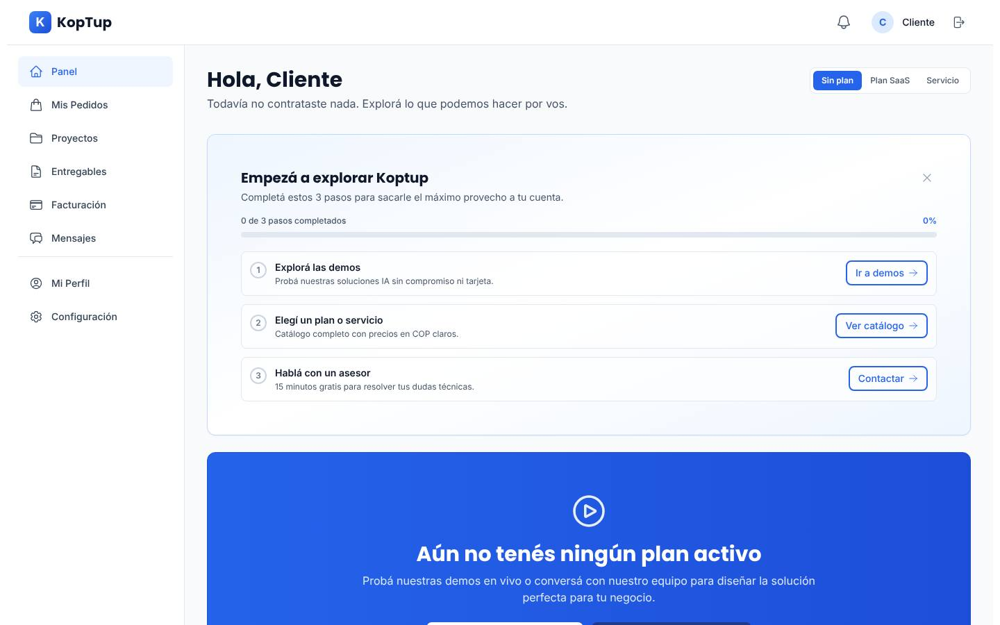
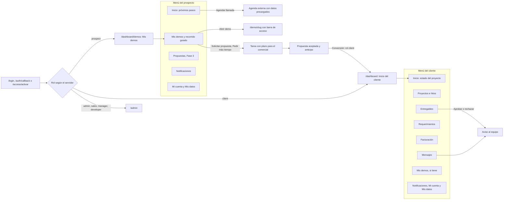
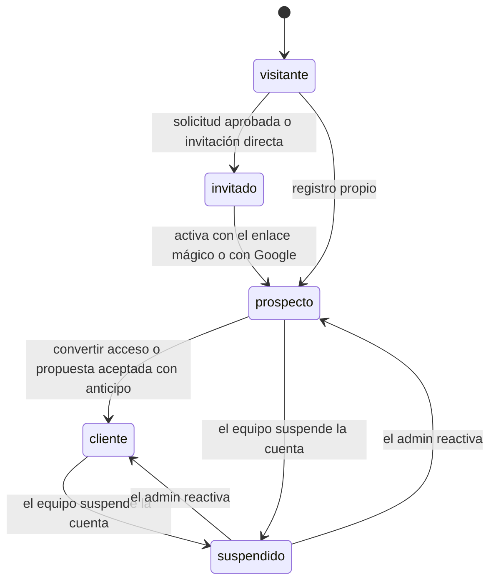
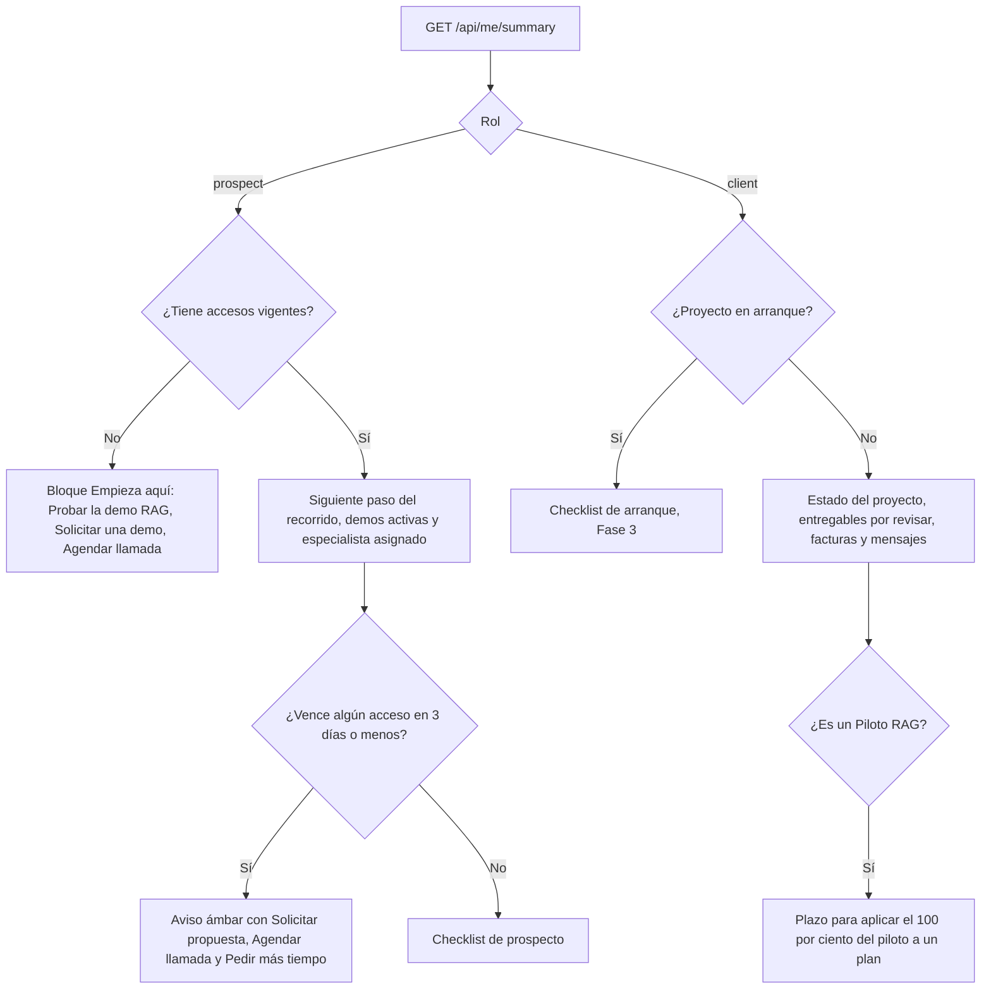
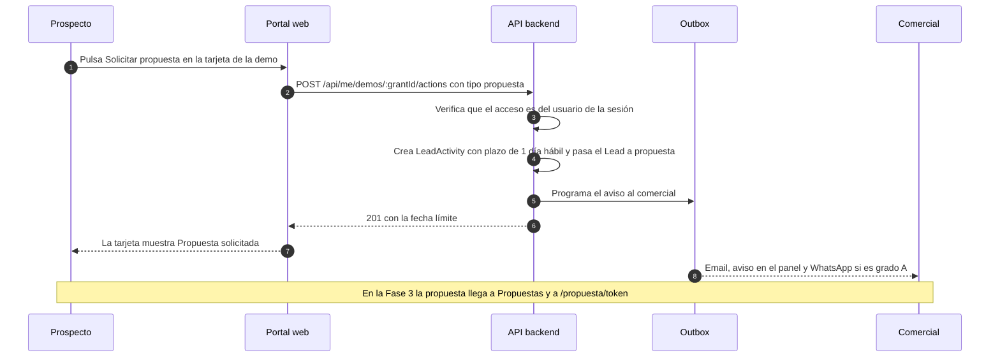
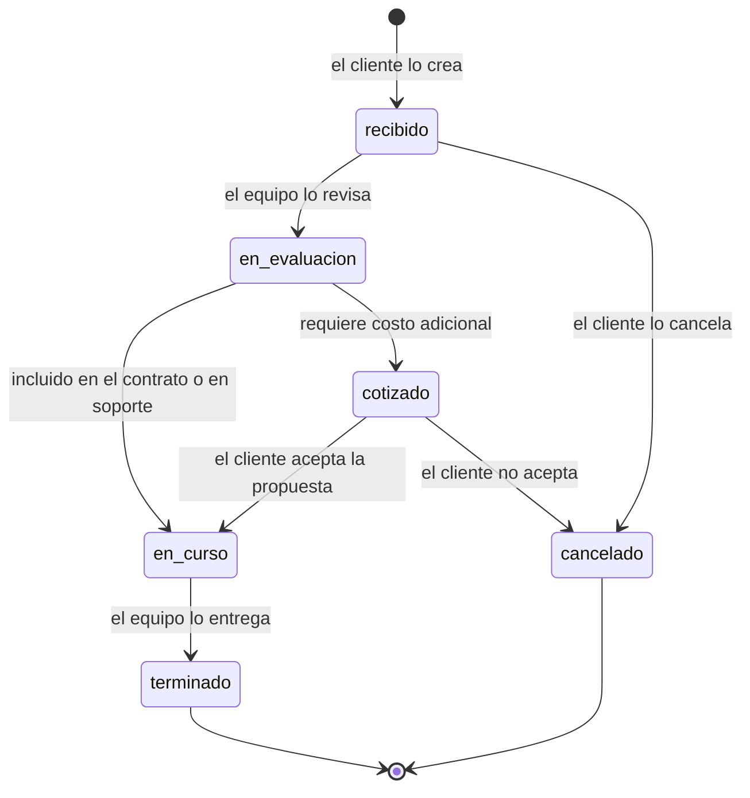
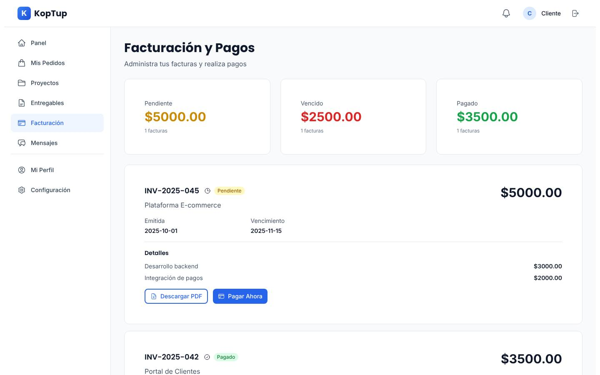
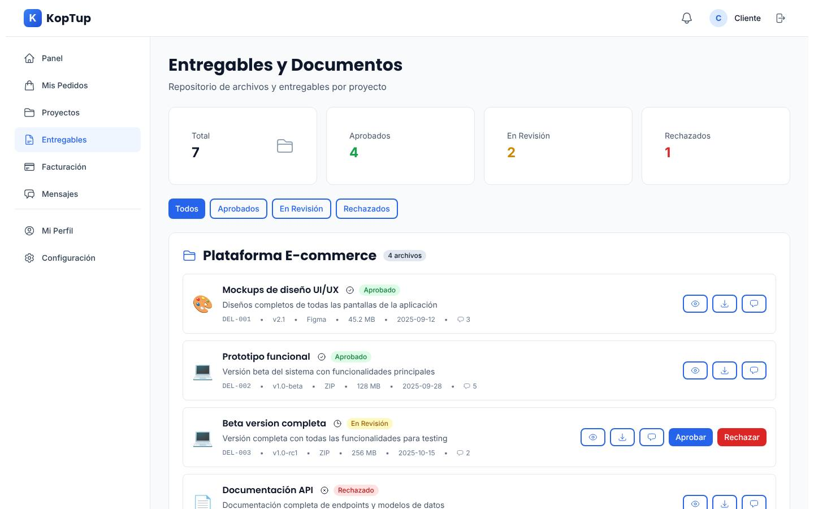

# Portal del prospecto y del cliente

> **Rutas:** `/dashboard` y sus secciones: `demos`, `propuestas`, `projects`, `orders`, `billing`, `deliverables`, `messages`, `notifications`, `profile`, `settings` y `privacidad`. Además, `/propuesta/[token]` (Fase 3).
>
> **Archivos principales:**
> - Web: `apps/web/src/app/dashboard/**` (11 páginas, unas 4.480 líneas), `apps/web/src/components/dashboard/DashboardLayout.tsx`, `apps/web/src/components/onboarding/{OnboardingChecklist,HowItWorks}.tsx` y `apps/web/src/lib/api.ts`.
> - Backend: `apps/backend/src/routes/{project,orders,invoices,deliverables,messages,notifications}.routes.ts`, sus controladores y los modelos `Project`, `Order`, `Invoice`, `Deliverable`, `Conversation`, `Message` y `Notification`.
>
> **Prioridad:** P0 · **Esfuerzo total:** XL, unos **87 días-dev**. De ellos, unos 47 son de la Fase 1, y de esos unos 21,5 son P0. La cifra no incluye las tareas 22 (Mis demos) y 33 (recorrido guiado) de [Sistema de demos](04-Sistema-de-Demos.md), que ya están contadas allá.



*Captura tomada en local con la rama `main`, con un usuario de prueba. Las capturas del portal no son de producción porque exigen sesión.*

**Páginas relacionadas:**
- El recorrido completo está en [Flujo del cliente](03-Flujo-del-Cliente.md).
- Modelos, API y control de acceso: [Sistema de demos](04-Sistema-de-Demos.md).
- La contraparte interna está en [Panel de administración](05-Panel-de-Administracion.md).
- Sesión, activación y barra por rol: [Autenticación](Seccion-Autenticacion.md).
- Para *Mis datos*, ver [Legal](Seccion-Legal.md).

---

## En una mirada

- **Hoy el portal es una maqueta con aspecto de producto.** La página de inicio muestra planes, KPIs, hitos y montos escritos en el código. Facturación y Entregables muestran **facturas y entregables inventados** cuando la API falla. Perfil y Configuración **simulan** que guardan los cambios.
- **El portal no distingue al prospecto del cliente.** El único rol del portal es `user`. La protección de las páginas solo existe en la interfaz (lee `localStorage`), y el menú es igual para todos.
- **Lo que cambia:** el portal tiene dos caras que dependen del rol, que siempre se resuelve en el servidor.
  - **Prospecto** (`prospect`): *Inicio* con los próximos pasos, **Mis demos** con el recorrido guiado, **Agendar llamada** y **Propuestas** (Fase 3).
  - **Cliente** (`client`): *Inicio* con el estado del proyecto, **Proyectos** con hitos reales, **Entregables**, **Requerimientos** (antes Pedidos), **Facturación**, **Mensajes** y, si las tiene, sus demos.
- **Pasar de prospecto a cliente es un solo evento.** Ocurre al convertir el acceso o al aceptar la propuesta con su anticipo. El menú se amplía, se crea el proyecto y su conversación, y las demos quedan 90 días como referencia.
- **Regla de oro:** el portal **nunca** muestra un dato que no venga de la base. Si algo falla, dice que falló, y si no hay datos, dice qué hacer.

---

## Índice

1. [Objetivo](#objetivo)
2. [Estado actual](#estado-actual)
3. [Problemas transversales](#problemas-transversales)
4. [Qué ve un prospecto y qué ve un cliente](#qué-ve-un-prospecto-y-qué-ve-un-cliente)
5. [Mapa de navegación](#mapa-de-navegación)
6. [Transición de prospecto a cliente](#transición-de-prospecto-a-cliente)
7. [Plan transversal](#plan-transversal)
8. Módulos:
   - [Inicio](#81-inicio-existente-se-rehace)
   - [Mis demos](#82-mis-demos-nuevo)
   - [Recorrido guiado](#83-recorrido-guiado-nuevo)
   - [Agendar llamada](#84-agendar-llamada-nuevo)
   - [Onboarding](#85-onboarding-nuevo)
   - [Propuestas](#86-propuestas-nuevo-fase-3)
   - [Proyectos](#87-proyectos-existente)
   - [Requerimientos (antes Pedidos)](#88-requerimientos-antes-pedidos-existente-se-rediseña)
   - [Facturación](#89-facturación-existente)
   - [Entregables](#810-entregables-existente)
   - [Mensajes](#811-mensajes-existente)
   - [Notificaciones](#812-notificaciones-existente)
   - [Mi cuenta (Perfil)](#813-mi-cuenta-perfil-existente)
   - [Configuración](#814-configuración-existente)
   - [Mi asistente RAG (Fase 4)](#815-mi-asistente-rag-nuevo-fase-4)
9. [API y modelos del portal](#api-y-modelos-del-portal)
10. [SEO, i18n, accesibilidad y rendimiento](#seo-i18n-accesibilidad-y-rendimiento-del-portal)
11. [Tareas del portal](#tareas-del-portal)
12. [Estimación](#estimación)
13. [Métricas de éxito del portal](#métricas-de-éxito-del-portal)

---

## Objetivo

**En el embudo**, el portal es el lugar donde el prospecto **convierte el interés en una conversación comercial**:
- entra con un clic (enlace mágico);
- encuentra sus demos y sabe qué probar primero;
- con un botón pide una propuesta, una llamada o más tiempo.

Cada acción llega al comercial como tarea con plazo (ver [Sistema de demos](04-Sistema-de-Demos.md), sección 8.3).

**En el negocio**, el portal es la cara de KopTup **después de la venta**:
- el cliente ve el avance real de su proyecto;
- revisa y aprueba entregables;
- consulta y paga sus facturas;
- conversa con el equipo.

Un portal honesto y útil sostiene el precio, reduce los correos de "¿cómo vamos?" y facilita la renovación o el paso del **Piloto RAG** a un plan.

**Resultados esperados:**

| Para | Resultado |
|---|---|
| Prospecto | En menos de 1 minuto sabe qué demos tiene, cuánto le queda y cuál es su siguiente paso |
| Comercial | Recibe las acciones del prospecto como tareas con plazo; no tiene que perseguirlo por correo |
| Cliente | Ve hitos, entregables por revisar, facturas y mensajes sin pedirlos |
| KopTup | Cero datos inventados frente a un cliente; medición del uso del portal por rol |

---

## Estado actual

Revisión del código en la rama `main`.

| Sección | Ruta | Archivo (líneas) | Fuente de los datos | Veredicto |
|---|---|---|---|---|
| Layout | todas | `components/dashboard/DashboardLayout.tsx` (223) | Usuario leído de `localStorage` (líneas 36–42). Contador de notificaciones con la API (44–54) | La protección es solo de interfaz. El menú es fijo (63–70) y sin rol. Notificaciones no aparece en el menú lateral, solo en la campana. No hay "Volver al sitio" |
| Inicio | `/dashboard` | `dashboard/page.tsx` (912) | **Escrito en el código** | Selector "Sin plan / Plan SaaS / Servicio" visible para el cliente (159–175). `PlanView` y `ServiceView` con valores fijos (209–437). Recomendaciones con productos que no existen en el catálogo (667–692) |
| Proyectos | `/dashboard/projects` | `projects/page.tsx` (421) | API `GET /api/projects` | Las fases se **inventan** a partir de `progress` (51–76). Hitos y entregables siempre vacíos (77–78). El presupuesto sale con `$`, sin moneda (252) |
| Pedidos | `/dashboard/orders` | `orders/page.tsx` (249) | API `GET /api/orders` | Estados de logística (`shipped`, "Enviado"), montos con `toFixed(2)` |
| Nuevo pedido | `/dashboard/orders/new` | `orders/new/page.tsx` (384) | `fetch` a una dirección fija de desarrollo (111) | **No funciona en producción.** Pide al cliente el "Precio unitario (USD)" (320). No usa `DashboardLayout` |
| Detalle de pedido | `/dashboard/orders/[id]` | `orders/[id]/page.tsx` (173) | API | No usa `DashboardLayout`: sin menú, sin cabecera |
| Facturación | `/dashboard/billing` | `billing/page.tsx` (276) | API, y **facturas de ejemplo si la API falla** (33–73) | Lee `amount` y `project`, pero la API entrega `total` y `projectName`. Montos en formato USD (`$5000.00`). "Pagar ahora" no pasa por ninguna pasarela (93–105) |
| Entregables | `/dashboard/deliverables` | `deliverables/page.tsx` (409) | API, y **7 entregables de ejemplo si falla** (37–141) | Lee `name` y `project`, pero la API entrega `title` y `projectName`. "Ver" y "Descargar" hacen lo mismo (379–382). El rechazo usa `window.prompt` (172) |
| Mensajes | `/dashboard/messages` | `messages/page.tsx` (427) | API | No se puede iniciar una conversación. El clip de adjuntar no hace nada (391–396). Sin refresco: los mensajes nuevos no llegan |
| Notificaciones | `/dashboard/notifications` | `notifications/page.tsx` (390) | API | Textos fijos en español, sin i18n (141–174). Faltan los tipos `deliverable` y `task` que el backend sí tiene |
| Perfil | `/dashboard/profile` | `profile/page.tsx` (612) | API, y **datos de ejemplo** ("Juan Pérez", "Empresa Demo S.A.S", un NIT de ejemplo) (96–143) | Guardar perfil, guardar empresa, **cambiar contraseña** y guardar preferencias se **simulan** con `setTimeout` y `alert` (146–202) |
| Configuración | `/dashboard/settings` | `settings/page.tsx` (230) | `localStorage` | Guardado simulado (53–63). Interruptores de SMS y push sin nada detrás |
| Onboarding | dentro de Inicio | `components/onboarding/OnboardingChecklist.tsx` (184) | Pasos escritos en `page.tsx` | Ningún paso se marca nunca como hecho (por ejemplo, `done: welcome ? false : false`, línea 699). El cierre se guarda en `localStorage` |

**Backend.** Las rutas existen y responden con datos del usuario de la sesión:

| Recurso | Rutas | Observación funcional |
|---|---|---|
| Proyectos | `GET/POST /api/projects`, `GET/PUT/DELETE /api/projects/:id`, miembros y tareas | `project.service.ts` busca los proyectos donde el usuario es cliente, gerente o miembro. No hay hitos en el modelo |
| Pedidos | `GET/POST /api/orders`, `GET/PUT /api/orders/:id`, `POST /api/orders/:id/cancel` | Al crear un pedido se abre una conversación automática y se avisa al admin por WhatsApp. La moneda queda fija en `USD`. Los adjuntos se guardan en el disco local del contenedor |
| Facturas | `GET/POST /api/invoices`, `GET /api/invoices/:id`, `/pay`, `/download` | "Descargar" no genera ningún PDF: responde con un enlace a la misma ruta |
| Entregables | `GET/POST /api/deliverables`, `GET/PUT /:id`, `/approve`, `/reject` | El archivo es un enlace externo (`fileUrl`); no hay almacenamiento propio |
| Mensajes | `GET/POST /api/messages/conversations`, `GET /:id`, `/read`, `POST /api/messages/send` | Participantes con roles `admin`, `client`, `support` y `project_manager` |
| Notificaciones | `GET/POST /api/notifications`, `/unread-count`, `/read`, `/read-all`, `DELETE /:id` | `utils/notifications.ts` define 15 plantillas (`deliverableUploaded`, `invoiceCreated`, `newMessage`…), pero **ningún controlador las usa**: nadie genera notificaciones cuando pasa algo |
| Perfil | `GET /api/auth/profile` | No hay endpoint para guardar el perfil ni para cambiar la contraseña. `User` no tiene `phone` ni `company` |

**Del lado del equipo** (detalle en [Panel de administración](05-Panel-de-Administracion.md)), hoy **no hay pantallas** para crear un proyecto, publicar un entregable ni emitir una factura con PDF. Sin eso, el portal del cliente no se puede alimentar sin tocar la base de datos.


---

## Problemas transversales

| # | Problema | Evidencia | Impacto |
|---|---|---|---|
| 1 | **Datos inventados frente al cliente** | Facturas (`billing/page.tsx` 33–73), entregables (`deliverables/page.tsx` 37–141), perfil (`profile/page.tsx` 96–143), plan SaaS, uptime de 99,98 %, satisfacción de 4,7 e hitos (`page.tsx` 209–437) | Un cliente real puede ver facturas que no existen. Daña la confianza y crea un riesgo legal |
| 2 | **Acciones simuladas** | Perfil, empresa, contraseña y preferencias (`profile/page.tsx` 146–202). Configuración (`settings/page.tsx` 53–63) | El usuario cree que cambió su contraseña y no la cambió |
| 3 | **Contrato roto entre web y API** | La web lee `amount`, `project` y `name`; la API entrega `total`, `projectName` y `title` | Con datos reales, Facturación y Entregables salen vacíos o fallan al calcular los totales |
| 4 | **Sin roles en el portal** | `DashboardLayout.tsx` 36–42 y 63–70. Redirección a `/admin` por el rol guardado en el navegador o por una regla de email fija (`page.tsx` 61–67) | No existe la vista de prospecto. El menú ofrece Facturación a quien solo tiene una demo |
| 5 | **Protección solo en la interfaz** | Guardas en el cliente y sin middleware para `/dashboard` (`apps/web/middleware.ts` solo maneja el idioma) | Ver la tarea genérica de autorización en servidor (P-04) y [Seguridad y calidad](10-Seguridad-y-Calidad.md) |
| 6 | **Moneda y formato** | `$5000.00` en Facturación, Pedidos y Proyectos. Pedidos en USD fijo | En Colombia se espera `COP 5.000.000`. Las propuestas pueden ser en COP o en USD |
| 7 | **Tono e idioma mezclados** | Voseo argentino en Inicio y Onboarding ("Completá", "Explorá", "tenés"). Notificaciones sin i18n. El namespace `dashboardPage` de `messages/es.json` casi no se usa | Choca con el "tú" del resto del funnel (plantillas de [Sistema de demos](04-Sistema-de-Demos.md), sección 11) |
| 8 | **CTA viejos** | "Hablar con un asesor" y "Soporte" llevan a `/contact`; "Nuevo proyecto" lleva a `/contact?type=new-project`, y el formulario pierde ese dato | Se pierde la intención del usuario y no hay seguimiento |
| 9 | **Precios y productos que no existen** | Recomendaciones `agente-ia-ventas` y `desarrollo-web`, "Chatbot RAG · profesional a COP 489.000/mes" (`page.tsx` 667–692) | Contradicen los planes RAG publicados (Esencial a COP 1.490.000/mes, ver [Visión de producto](02-Vision-de-Producto.md)) |
| 10 | **Sin layout compartido** | Cada página envuelve su contenido en `DashboardLayout`; no existe `app/dashboard/layout.tsx`. Tampoco hay `error.tsx`, `loading.tsx` ni metadata | El menú se vuelve a montar y relee la sesión en cada navegación. Sin `noindex` en las páginas |
| 11 | **Archivos en disco efímero** | Los adjuntos de pedidos van a `./uploads/orders/` (`middleware/upload.ts` 118–120) | Se pierden en cada despliegue. Ver Fase 0 en [Seguridad y calidad](10-Seguridad-y-Calidad.md) |
| 12 | **Pide credenciales por el portal** | El paso "Conectá tus integraciones: API keys de los servicios externos" (`page.tsx` 228–235) | Nunca se deben pedir llaves ni contraseñas por el portal ni por el chat. Las credenciales del cliente se reciben por un canal seguro que defina el equipo |

---

## Qué ve un prospecto y qué ve un cliente

El rol lo entrega el servidor en `GET /api/auth/profile` y se lee con `useSession()` (ver [Autenticación](Seccion-Autenticacion.md), sección 11). El menú y cada página dependen de él. **La interfaz solo oculta: la API vuelve a verificar cada permiso** (matriz de [Sistema de demos](04-Sistema-de-Demos.md), sección 3).

| Módulo | Ruta | `prospect` | `client` | Equipo (`admin`, `sales`, `manager`, `developer`) | Fase |
|---|---|:-:|:-:|---|---|
| Inicio | `/dashboard` | ✓ vista de prospecto | ✓ vista de cliente | Redirige a `/admin` | 1 |
| **Mis demos** | `/dashboard/demos` | ✓ (destino al entrar) | ✓ si tiene accesos | Redirige a `/admin/accesos` | 1 |
| Recorrido guiado | dentro de Mis demos y de la demo | ✓ | ✓ | — | 1 |
| Agendar llamada | botón en Inicio, Mis demos y cabecera | ✓ | ✓ (con su gerente de proyecto) | — | 1 |
| Onboarding | dentro de Inicio | ✓ checklist de prospecto | ✓ checklist de arranque (Fase 3) | — | 1 y 3 |
| **Propuestas** | `/dashboard/propuestas` | ✓ si tiene alguna | ✓ si tiene alguna | `/admin/propuestas` | 3 |
| Proyectos | `/dashboard/projects` | Oculto (estado "cuando contrates") | ✓ | — | 1 |
| Requerimientos (antes Pedidos) | `/dashboard/orders` | Oculto | ✓ | — | 1 |
| Facturación | `/dashboard/billing` | Oculto | ✓ | — | 1 y 3 |
| Entregables | `/dashboard/deliverables` | Oculto | ✓ | — | 1 y 3 |
| Mensajes | `/dashboard/messages` | Oculto en la Fase 1; con su comercial en la Fase 2 | ✓ | — | 1 y 2 |
| Notificaciones | `/dashboard/notifications` | ✓ | ✓ | — | 1 |
| Mi cuenta | `/dashboard/profile` | ✓ | ✓ más los datos de facturación | — | 1 |
| Configuración | `/dashboard/settings` | ✓ | ✓ | — | 1 |
| Mis datos | `/dashboard/privacidad` | ✓ | ✓ | — | 1 (tarea 32 de Sistema de demos) |
| Mi asistente RAG | `/dashboard/asistente` | — | ✓ solo con plan RAG SaaS | — | 4 |

**Menú del prospecto** (como en el mockup de Mis demos): Inicio · **Mis demos** · Propuestas (si hay) · Notificaciones · Mi cuenta · Mis datos · Volver al sitio. Al pie del menú va una caja fija:

> **Cuenta de prospecto.** Cuando contrates un proyecto, aquí verás tus entregables, facturas y mensajes con el equipo.

**Menú del cliente:** Inicio · Proyectos · Entregables · Requerimientos · Facturación · Mensajes · Mis demos (si tiene) · Propuestas (si hay) · Notificaciones · Mi cuenta · Mis datos · Volver al sitio.

**Si alguien abre una ruta que su rol no ve** (por ejemplo, un prospecto en `/dashboard/billing`), no hay error 404 ni pantalla en blanco. Ve un estado vacío amable: "Esta sección se activa cuando contratas con KopTup", con **Ver mis demos** y **Agendar llamada**.

**Cuentas del equipo:** al entrar a `/dashboard` se les redirige a `/admin` **según el rol del servidor**. Desaparece la regla de email fija. Una "vista previa como prospecto" para el equipo queda fuera de alcance (P3).

---

## Mapa de navegación



---

## Transición de prospecto a cliente

**Dónde ocurre.** El cambio de rol lo hace solo el backend, en dos puntos:

| Cuándo | Endpoint | Fase |
|---|---|---|
| El comercial convierte un acceso | `POST /api/demo-grants/:id/convert` | 1 |
| La propuesta se acepta y el anticipo se confirma | `POST /api/quotes/:id/convert`, disparado por la confirmación del pago | 3 |

El portal **no decide** nada: refleja el nuevo rol en el siguiente refresco de sesión, porque `tokenVersion++` obliga a renovar la sesión.



**Qué cambia en el portal al convertir**

| Elemento | Antes (`prospect`) | Después (`client`) |
|---|---|---|
| Rol y sesión | `prospect` | `client`. `tokenVersion++` y el siguiente refresco trae el menú nuevo |
| Menú | Inicio, Mis demos, Notificaciones, Mi cuenta, Mis datos | Se agregan Proyectos, Entregables, Requerimientos, Facturación y Mensajes |
| Inicio | Próximos pasos de la evaluación | Banner de bienvenida, una sola vez, y la vista del proyecto |
| Mis demos | Accesos `activo` o `por_expirar` | Accesos `convertido`, "Incluida en tu proyecto · disponible hasta {fecha}" (90 días) |
| Proyecto | — | `Project` en `planning`, con `quoteId` y `leadId` (si se pidió al convertir) |
| Mensajes | — | Conversación "{Proyecto} · equipo KopTup" creada con el gerente de proyecto y el comercial |
| Notificaciones | — | "Tu proyecto {nombre} fue creado" con enlace al proyecto |
| Email | — | Plantilla nueva `client_welcome`, propuesta aquí y descrita abajo |
| Lead | `en_demo`, `propuesta` o `negociacion` | `ganado` |

**Banner de bienvenida** (copy propuesto; se cierra para siempre con `preferences.dismissed.clientWelcome`):

> **¡Bienvenido a KopTup como cliente, {nombre}!** Ya creamos tu proyecto **{proyecto}**. Tu gerente de proyecto es {gerente}. El siguiente paso es la reunión de arranque: **[Agendar arranque]** · **[Ver mi proyecto]**

**Email `client_welcome`** (sale por el outbox de [Sistema de demos](04-Sistema-de-Demos.md), sección 11):

> **Asunto:** Tu proyecto {{proyecto}} con KopTup ya arrancó
>
> Hola {{nombre}}:
>
> Gracias por confiar en KopTup. Ya creamos tu proyecto **{{proyecto}}** en tu portal. Desde ahí podrás ver los hitos, revisar entregables, consultar tus facturas y escribirle al equipo.
>
> **[Entrar a mi portal]**
>
> Tu gerente de proyecto es {{gerente}}. Te escribirá en máximo 1 día hábil para agendar la reunión de arranque. Tus demos siguen disponibles hasta el {{expiraEl}} como referencia.

**Casos borde**

| Caso | Comportamiento |
|---|---|
| Un cliente pide otra demo | Lo hace desde el portal. El rol **no cambia** y se crea un acceso nuevo (ver P-09) |
| Un cliente con proyecto terminado | Sigue siendo `client`. Inicio muestra "Proyecto entregado", soporte y "¿Qué más necesitas?" |
| Termina un Piloto RAG | Es `client` desde el anticipo. Inicio muestra el plazo para aplicar el 100 % del piloto a un plan (ver [Inicio](#81-inicio-existente-se-rehace)) |

### Tareas

| # | Tarea | Fase | Prioridad | Esfuerzo | Criterio de aceptación |
|---|---|---|---|---|---|
| P-06 | Transición en el portal: el menú y el Inicio cambian con el rol; banner `clientWelcome`; plantilla `client_welcome`; conversación del proyecto creada al convertir; tarjetas `convertido`. Incluye las pruebas e2e del portal por rol (Playwright: prospecto, cliente, equipo y móvil) y los eventos `portal_view` | Fase 1 — Funnel y solicitud de demos | P0 | M | Después de `convert`, el siguiente refresco de sesión muestra el menú de cliente sin cerrar sesión. Existe la conversación del proyecto y llegó el email. La suite e2e del portal corre en CI y está en verde |

---

## Plan transversal

Esto aplica a todo el portal y va antes que los módulos.

### Layout compartido y sesión

- **`apps/web/src/app/dashboard/layout.tsx`** (nuevo): monta `DashboardLayout` **una sola vez**. Las páginas dejan de envolverse cada una. Exporta `metadata` con `robots: { index: false, follow: false }` y la plantilla de título `%s | Mi portal KopTup`.
- **`DashboardLayout`:**
  - usa `useSession()` (de [Autenticación](Seccion-Autenticacion.md)) en lugar de `localStorage`;
  - arma el menú con una función pura `getPortalNav(role, flags)`, con `flags` = `hasGrants`, `hasQuotes` y `hasRagPlan`, para poder probarla con una prueba tabla;
  - agrega "Notificaciones" al menú lateral con su contador, "Volver al sitio" y la caja de "Cuenta de prospecto";
  - el menú lateral ocupa toda la altura (se acaba el bloque gris de la captura);
  - usa el logo real del sitio, no la "K" dibujada.
- **Middleware de Next:** sin la cookie `kp_s`, `/dashboard/*` redirige a `/login?redirect=<ruta>`. Es solo comodidad; ver [Autenticación](Seccion-Autenticacion.md), sección 12.
- **`error.tsx` y `loading.tsx`** en `app/dashboard/`:
  - el error dice "No pudimos cargar esta sección. Intenta de nuevo en unos minutos. Si sigue fallando, escríbenos a soporte", con **Reintentar**;
  - la carga usa *skeletons* en lugar del spinner de pantalla completa.
- **`orders/new` y `orders/[id]`** quedan dentro del layout automáticamente.

### Estados honestos: vacío, error y cargando

Componente `PortalState` (`components/dashboard/PortalState.tsx`) con tres variantes:
- **`vacío`:** ilustración, texto y una sola acción principal;
- **`error`:** mensaje y "Reintentar";
- **`sin acceso por rol`:** "Esta sección se activa cuando contratas con KopTup".

**Prohibido** cualquier dato de ejemplo en `apps/web/src/app/dashboard/**`. Lo vigila una regla de lint o una prueba que busque arreglos `mock*` y `fallback` en esa carpeta.

### Contratos tipados y formato

- **`apps/web/src/types/portal.ts`:** tipos de respuesta (`PortalInvoice`, `PortalDeliverable`, `PortalOrder`, `PortalProject`, `PortalSummary`, `MyDemoGrant`).
- **Adaptadores** en `apps/web/src/lib/portal-adapters.ts`, uno por recurso, que traducen la respuesta de la API (`total` → `amount`, `title` → `name`, `projectName` → `project`). Más adelante el backend puede unificar los nombres sin romper la web.
- **`formatMoney(amount, currency)`** en `apps/web/src/lib/format.ts`:
  - `Intl.NumberFormat('es-CO', { style: 'currency', currency })` → `COP 5.000.000` / `USD 1.200`;
  - **COP por defecto** y sin decimales en COP;
  - `formatDate` con `es-CO` (por ejemplo, "15 nov 2026") y la hora de Bogotá.
- **Cliente de API:** todas las llamadas pasan por `lib/api.ts`; nada de `fetch` con URLs fijas.

### Tono y copy

- **Todo en "tú"**, en español neutro de Colombia: "Completa tu perfil", nunca "Completá". Las fechas se escriben con letras ("vence el 22 de octubre").
- **Cada pantalla responde tres preguntas:** qué es esto, qué tengo pendiente y cuál es mi siguiente paso.
- **Las promesas de tiempo son las del funnel:** "Te respondemos en máximo 1 día hábil (lunes a viernes, 8:00 a. m. a 5:00 p. m., hora de Colombia)".

### Tareas

| # | Tarea | Fase | Prioridad | Esfuerzo | Criterio de aceptación |
|---|---|---|---|---|---|
| P-01 | Layout compartido (`app/dashboard/layout.tsx`) con `useSession()`, menú por rol con `getPortalNav`, `noindex`, `error.tsx` y `loading.tsx`, y Notificaciones y "Volver al sitio" en el menú (complementa la tarea 22 de Sistema de demos) | Fase 1 — Funnel y solicitud de demos | P0 | M | Navegar entre 5 secciones no vuelve a montar el menú ni pide la sesión otra vez. La prueba tabla de `getPortalNav` cubre `prospect` y `client` con y sin accesos, propuestas y plan RAG. `curl` de cualquier página del portal trae `noindex` |
| P-02 | Retirar los datos de ejemplo y las vistas simuladas: `PlanView`, `ServiceView`, el selector de tipo, los arreglos de ejemplo de Facturación, Entregables y Perfil, y las recomendaciones fijas. Se reemplazan por `PortalState` | Fase 1 — Funnel y solicitud de demos | P0 | S | Con la API apagada, ninguna página muestra montos, nombres ni archivos: solo el estado de error. Una prueba falla si aparece `mock` o `fallback` en `app/dashboard/**` |
| P-03 | Tipos de `types/portal.ts`, adaptadores por recurso, `formatMoney` y `formatDate` en `lib/format.ts`, y `orders/new` pasa al cliente de API | Fase 1 — Funnel y solicitud de demos | P0 | M | Con datos reales de prueba, Facturación y Entregables muestran número, proyecto, total y título correctos. Los montos se ven como `COP 5.000.000` o `USD 1.200`. No queda ningún `fetch` con URL fija |
| P-04 | Auditar y exigir autorización en servidor en todas las rutas del portal (proyectos, pedidos, facturas, entregables, mensajes y notificaciones): separar lo que hace el cliente (leer, aprobar, comentar lo suyo) de lo que hace el equipo (crear, editar, emitir), con verificación de dueño del recurso. Es parte de la auditoría general de [Seguridad y calidad](10-Seguridad-y-Calidad.md) | Fase 0 — Endurecimiento | P0 | M | La prueba tabla rol × ruta del portal pasa para `prospect`, `client` y los 4 roles del equipo. Un usuario no puede leer ni modificar recursos de otro |
| P-05 | Copy en "tú" e i18n de todas las cadenas del portal en `messages/{es,en}.json`, con namespaces por página. Se eliminan las claves sin uso. El inglés completo llega en la Fase 2 | Fase 1 — Funnel y solicitud de demos | P1 | M | No quedan cadenas fijas en `app/dashboard/**` ni en `components/onboarding/**` (verificado con lint). Cero formas de voseo en `es.json`. En la Fase 2, la vista en inglés no muestra claves sin traducir |

---

## Módulos

### 8.1 Inicio (existente, se rehace)

> **Ruta:** `/dashboard` · **Archivos:** `app/dashboard/page.tsx` (se reescribe), `components/dashboard/{ProspectHome,ClientHome,NextStepCard,OwnerCard}.tsx` (nuevos), `components/onboarding/OnboardingChecklist.tsx` · **Roles:** `prospect`, `client` · **Prioridad:** P0 · **Esfuerzo:** M


#### Objetivo

Que cada persona sepa **en 5 segundos** cuál es su siguiente paso:
- el **prospecto**, cuál de sus demos abrir, cuánto le queda y cómo pedir una propuesta;
- el **cliente**, cómo va su proyecto y qué tiene pendiente: revisar un entregable, pagar una factura o responder un mensaje.

#### Estado actual

- `page.tsx` (912 líneas) tiene **tres vistas de ejemplo** (`PlanView`, `ServiceView` y `EmptyView`, líneas 209–785). El usuario elige cuál ver con un selector a la vista (159–175), que guarda la elección en `localStorage` (`koptup.clientType`).
- **`PlanView`** muestra "Growth — Chatbot RAG", 8.432 conversaciones, uptime de 99,98 %, satisfacción de 4,7 y próxima factura de COP 489.000, todo escrito en el código (209–217).
- **`ServiceView`** muestra "Chatbot RAG con IA · En desarrollo · 65 %" y seis hitos con fechas fijas de 2026 (414–437).
- **`EmptyView`** recomienda productos que no están en `services-catalog.ts` y manda a `/contact` (667–692 y 740).
- Solo `t('loading')` usa i18n; el resto del texto está escrito en la página.

#### Problemas detectados

- Datos inventados (problema transversal 1).
- La vista de cliente está a la vista y se puede cambiar.
- Los precios contradicen los planes RAG.
- El checklist nunca avanza.
- Los CTA no generan seguimiento.
- Voseo.

#### Plan detallado

**Datos.** Un solo endpoint nuevo, **`GET /api/me/summary`** (propuesto en esta página; agregarlo a [Backend y API](09-Backend-y-API.md)). Arma el resumen según el rol, con caché SWR de 60 s en la web:

```json
{
  "role": "prospect",
  "firstName": "Ana",
  "company": "Logística Andina S.A.S.",
  "owner": { "name": "Carlos Pérez", "bookingUrl": "<agenda del comercial>", "whatsapp": true },
  "onboarding": [
    { "key": "activar", "done": true },
    { "key": "verificar_correo", "done": true },
    { "key": "abrir_demo", "done": true },
    { "key": "recorrido", "done": false, "progress": "3/5" },
    { "key": "llamada", "done": false }
  ],
  "demos": { "active": 2, "expiringSoon": 1, "pendingRequests": 0,
             "nextStep": { "grantId": "…", "demo": "WMS logística", "step": "Despachar un pedido", "path": "/demo/wms-logistica?paso=despacho" } },
  "proposal": { "requestedAt": "2026-10-13", "dueAt": "2026-10-15" },
  "nextMeeting": null,
  "client": null
}
```

Para un cliente, `client` trae:
- `projects[{id, name, status, progress, nextMilestone}]`;
- `deliverablesToReview`;
- `invoicesDue{count, total, currency, nextDueAt}`;
- `unreadMessages`;
- `kickoffPending`;
- `pilot{endsAt, creditUntil}` si es un Piloto RAG.

**Qué se muestra según el caso:**



**Bloques del prospecto** (`ProspectHome`), con copy propuesto:

1. **Saludo.** "Hola, {nombre}". Debajo, una línea según el caso:
   - sin demos: "Empieza por aquí: prueba la demo del asistente RAG o pide una demo guiada de la solución que te interesa";
   - con demos: "Tienes {n} demos activas. Tu siguiente paso: **{paso}** en {demo}".
2. **`NextStepCard`:** el siguiente paso del recorrido, con **Continuar** (lleva directo al paso dentro de la demo).
3. **`OwnerCard`:** "Tu especialista: {comercial}. Te acompaña de lunes a viernes, de 8:00 a. m. a 5:00 p. m." · **Agendar llamada** · **WhatsApp** (solo si el comercial lo tiene configurado).
4. **Aviso de vencimiento** (si aplica): "Tu acceso a {demo} vence el {fecha}. ¿Cuál es tu siguiente paso?" · **Solicitar propuesta** · **Agendar llamada** · **Pedir más tiempo**.
5. **Propuesta solicitada** (si aplica): "Pediste una propuesta el {fecha}. {comercial} te la enviará a más tardar el {dueAt}".
6. **Checklist de prospecto** (ver [Onboarding](#85-onboarding-nuevo)).
7. **Sin demos:** tres tarjetas:
   - **Probar la demo RAG**: "Con IA real y sin registro" → `/demo/chatbot`;
   - **Solicitar una demo**: abre el modal de P-09;
   - **Ver planes RAG** → `/services#planes-rag`.

**Bloques del cliente** (`ClientHome`):

1. **Saludo.** "Hola, {nombre}. Así va **{proyecto}**". Debajo, el estado en español (Planeación, En curso, En pausa, Terminado), el avance y el **próximo hito** con su fecha.
2. **Pendientes**, en tarjetas con número y acción:
   - "{n} entregables por revisar" → Entregables;
   - "Factura {número} vence el {fecha}" → Facturación;
   - "{n} mensajes sin leer" → Mensajes.
3. **Piloto RAG** (si aplica): "Tu Piloto RAG termina el {fecha}. Si contratas un plan antes del {creditUntil}, te descontamos el 100 % del piloto (COP 3.900.000)" · **Ver planes** · **Hablar con {comercial}**.
4. **Próxima reunión** (Fase 2, con el webhook de la agenda).
5. **¿Necesitas algo más?** **Crear un requerimiento** · **Pedir otra demo**.

**Se elimina:**
- el selector de tipo de cliente;
- `PlanView` (su lugar en la Fase 4 lo ocupa [Mi asistente RAG](#815-mi-asistente-rag-nuevo-fase-4));
- `ServiceView`;
- las recomendaciones fijas;
- `HowItWorks` dentro del portal (queda en el sitio público);
- `CommonCards`.

#### Integración con el sistema de demos

- `demos` y `nextStep` salen de los `DemoGrant` del usuario (`usage.keyActionsDone` contra `DemoCatalogItem.onboardingSteps`).
- Los botones del aviso de vencimiento llaman a `POST /api/me/demos/:grantId/actions`.
- `owner` es el `Lead.ownerId`.

#### SEO · i18n · accesibilidad · rendimiento

- Una sola llamada (`summary`) en lugar de las 4 o 5 que harían falta. Se carga con *skeleton*.
- Cada tarjeta de pendiente es un enlace con texto completo, por ejemplo `aria-label="2 entregables por revisar"`.
- El avance usa `role="progressbar"` con `aria-valuenow`.

#### Tareas

| # | Tarea | Fase | Prioridad | Esfuerzo | Criterio de aceptación |
|---|---|---|---|---|---|
| P-07 | Inicio por rol: `GET /api/me/summary` (backend), `ProspectHome`, `ClientHome`, `NextStepCard` y `OwnerCard`, más el checklist de prospecto calculado en el servidor (reemplaza la versión con `localStorage`) | Fase 1 — Funnel y solicitud de demos | P0 | M | Un prospecto sin accesos ve "Empieza aquí". Con un acceso por vencer ve el aviso ámbar con sus 3 acciones. Un cliente ve su próximo hito y sus pendientes reales. El checklist marca "Abrir tu primera demo" en cuanto `demo-access` registra `open`. No hay datos fijos |

#### Métricas de éxito

- **Prospectos:** % que hace clic en una acción del Inicio en su primera visita. Meta inicial: ≥ 60 %.
- **Clientes:** % de entregables revisados desde el enlace del Inicio.
- **Tiempo hasta la primera acción:** mediana menor de 30 s.

---

### 8.2 Mis demos (nuevo)

> **Ruta:** `/dashboard/demos` · **Archivos:** `app/dashboard/demos/page.tsx`, `components/dashboard/{DemoGrantCard,DemoRequestRow,RequestDemoModal}.tsx` · **API:** `GET /api/me/demos`, `POST /api/me/demos/:grantId/actions`, `POST /api/me/demo-requests` · **Roles:** `prospect` y `client` · **Prioridad:** P0 · **Esfuerzo:** M (tarea 22 de [Sistema de demos](04-Sistema-de-Demos.md)) + S


#### Objetivo

Es la **pantalla de llegada del prospecto** después de activar su cuenta. Cada tarjeta lleva al uso de la demo y a una acción comercial medible: propuesta, llamada o extensión.

#### Estado actual

No existe. Hoy un prospecto no tiene dónde ver sus demos. Las demos se abren desde el catálogo público `/demo`, y la de cuentas médicas usa un código de acceso igual para todos (se retira; ver [Sistema de demos](04-Sistema-de-Demos.md), sección 10.5).

#### Problemas detectados

- No hay relación entre la cuenta y las demos.
- El prospecto no sabe cuánto le queda ni qué probar.
- El comercial no sabe si la usó.

#### Plan detallado

**Encabezado:**
- "Hola, {nombre}. Estas son tus demos";
- debajo, "{empresa} · Hoy es {fecha larga}";
- después, la `OwnerCard` (la misma del Inicio).

**`DemoGrantCard`.** Una por acceso, ordenadas: primero `por_expirar`, después `activo`, `convertido`, `expirado` y `revocado`.

| Elemento | Contenido |
|---|---|
| Miniatura | Primera captura de `DemoCatalogItem.screenshots`, con la etiqueta "Datos simulados" |
| Título y estado | Nombre comercial y chip con texto e ícono: **Activa** (verde) · **Por expirar** (ámbar) · **Expirada** (gris) · **Cerrada** (gris, para revocado) · **Incluida en tu proyecto** (azul, para convertido) |
| Modo | "Guiada" o "Autoservicio" |
| Vigencia | "Te quedan {n} días", con barra contra `durationDays`, y "Vence el {fecha}" |
| Sesión guiada | Si existe `meeting`: "Sesión guiada: jueves 16 de octubre, 10:00 a. m." · **Unirse** · **Agregar al calendario** (`.ics`) |
| Recorrido | "Recorrido guiado {hechos} de {total}" y la lista de pasos (ver [Recorrido guiado](#83-recorrido-guiado-nuevo)) |
| Acciones | **Abrir demo** (principal) · **Solicitar propuesta** · **Agendar llamada**. Con `por_expirar`: **Pedir más tiempo** |
| Estado de una acción pedida | "Propuesta solicitada el {fecha}" o "Extensión solicitada: {comercial} te responde en máximo 1 día hábil". Mientras esté abierta, el botón queda deshabilitado |

**Acciones por estado**

| Estado | Abrir demo | Acción principal | Otras |
|---|:-:|---|---|
| `activo` | ✓ | Abrir demo | Solicitar propuesta, Agendar llamada |
| `por_expirar` | ✓ | Abrir demo | Pedir más tiempo, Solicitar propuesta |
| `expirado` (30 días o menos) | — | **Pedir extensión** | Solicitar propuesta |
| `expirado` (más de 30 días) | — | **Solicitar de nuevo** (modal P-09 precargado) | — |
| `revocado` | — | — | Agendar llamada |
| `convertido` | ✓ hasta `expiresAt` | Abrir demo | Ver mi proyecto |

**Solicitudes en revisión.** Arriba de las tarjetas, una fila `DemoRequestRow` por cada solicitud `pendiente` o `en_revision`:

> Solicitud **DR-2026-000123** · {demos} · **En revisión** · Te respondemos en máximo 1 día hábil.

Los datos vienen de `GET /api/me/demos`, que se amplía con `requests[]` (propuesto aquí).

**Tarjeta "¿Te interesa otra solución?"** "Pide acceso a otra demo. La revisamos en máximo 1 día hábil" · **Solicitar otra demo** (abre `RequestDemoModal`).

**Estado vacío.**

> Aún no tienes demos activas. Pide acceso a la solución que te interesa y te respondemos en máximo 1 día hábil.
>
> **[Solicitar una demo]** · **[Probar la demo RAG, sin registro]**

**Aviso al pie:** "Las demos usan datos simulados. No cargues información confidencial".

**`RequestDemoModal`** (pedir otra demo desde el portal):
- Llama a `POST /api/me/demo-requests`, sin captcha y con los datos de la cuenta ya llenos.
- Campos:
  - demos (selección múltiple desde `GET /api/demo-catalog`, sin las privadas);
  - caso de uso (20 caracteres o más, con el aviso "no incluyas datos de pacientes ni información sensible");
  - urgencia;
  - preferencia (guiada o autoservicio).
- Si la API responde 403 `email_no_verificado`: "Confirma tu correo para pedir demos" · **Reenviar correo** (ver [Autenticación](Seccion-Autenticacion.md), sección 10).
- Al enviar: "Recibimos tu solicitud **{código}**. Te respondemos en máximo 1 día hábil". La fila aparece en "Solicitudes en revisión".

**Confirmaciones de las acciones** (toast):

| Acción | Texto |
|---|---|
| Propuesta | "Listo. {comercial} prepara tu propuesta y te la envía a más tardar el {fecha}" |
| Extensión | "Pedimos más tiempo para {demo}. Te avisamos por correo cuando se apruebe" |
| Llamada | Abre la agenda (ver [Agendar llamada](#84-agendar-llamada-nuevo)) |

**Secuencia de "Solicitar propuesta"**



#### Integración con el sistema de demos

Este módulo es el punto de contacto del prospecto con `DemoGrant`:
- `GET /api/me/demos` trae los accesos, los días restantes, el recorrido y el comercial;
- **Abrir demo** lleva a `/demo/<slug>`; el middleware emite el pase (sección 10.2 de [Sistema de demos](04-Sistema-de-Demos.md));
- cada clic de acción se registra como `DemoEvent` `cta_click`;
- después del login con `?redirect=`, el prospecto vuelve a la demo que intentaba abrir.

#### SEO · i18n · accesibilidad · rendimiento

- Las miniaturas usan `next/image` con `sizes` y carga diferida, salvo la primera.
- Los chips de estado llevan texto: nunca solo color.
- El modal atrapa el foco y se cierra con Escape.
- En móvil, las tarjetas van a una columna y los botones a ancho completo, sin scroll horizontal (escenario 9 de la prueba e2e de [Sistema de demos](04-Sistema-de-Demos.md)).

#### Tareas

| # | Tarea | Fase | Prioridad | Esfuerzo | Criterio de aceptación |
|---|---|---|---|---|---|
| P-08 | Mis demos: página, `DemoGrantCard` con los 5 estados y sus acciones, `DemoRequestRow`, estado vacío y `requests[]` en `GET /api/me/demos` (es la tarea 22 de [Sistema de demos](04-Sistema-de-Demos.md); no se vuelve a sumar) | Fase 1 — Funnel y solicitud de demos | P0 | M | Cada estado del acceso muestra los botones de la tabla. "Solicitar propuesta" crea la tarea y deshabilita el botón con su fecha límite. Una solicitud en revisión aparece con su código |
| P-09 | Pedir otra demo desde el portal: `RequestDemoModal` con `POST /api/me/demo-requests`, precarga desde "Solicitar de nuevo" y manejo de `email_no_verificado` | Fase 1 — Funnel y solicitud de demos | P1 | S | Un cliente pide una demo sin captcha y su rol sigue `client`. Un correo sin verificar ve el aviso con "Reenviar". La solicitud aparece de inmediato en la bandeja del panel |

#### Métricas de éxito

- % de prospectos que abren una demo en las 48 h siguientes a la activación. Meta inicial: ≥ 70 %.
- % de accesos con al menos una acción (propuesta, llamada o extensión).
- Tasa de "Solicitar propuesta" por acceso con uso efectivo.
- Solicitudes nuevas que nacen en el portal (`source.channel = portal`).

---

### 8.3 Recorrido guiado (nuevo)

> **Dónde se ve:** en la tarjeta de Mis demos y dentro de la demo, en la barra de acceso de `DemoAccessShell` · **Archivos:** `components/demo/{DemoAccessShell,GuidedTourPanel}.tsx`, `hooks/useDemoTracking.ts`, semilla `data/demo-catalog.seed.json` (`onboardingSteps` y `keyActions`) · **Roles:** `prospect`, `client` · **Prioridad:** P1 · **Esfuerzo:** M (tarea 33 de [Sistema de demos](04-Sistema-de-Demos.md))

#### Objetivo

Llevar al prospecto, en **5 pasos o menos**, al momento en que la demo demuestra su valor (el "ajá"). Con eso se convierte el uso en una señal de compra: un paso completado es una `key_action`, que suma al puntaje del Lead.

#### Estado actual

No existe. Varias demos traen su propio *tour* (por ejemplo, el del chatbot: "Bienvenido al playground RAG 1/4"), sin conexión con la cuenta ni medición.

#### Problemas detectados

- El prospecto entra a una maqueta grande sin saber qué mirar.
- El comercial no sabe hasta dónde llegó.

#### Plan detallado

- **Datos.**
  - `DemoCatalogItem.onboardingSteps[{key, title, description, path}]`, con un máximo de 5 pasos.
  - El avance sale de `DemoGrant.usage.keyActionsDone`.
  - `GET /api/me/demos` entrega `tour: { total, done, steps[{key, title, done, path}] }`.
- **En la tarjeta.**
  - Título "Recorrido guiado · {hechos} de {total}" con barra de avance.
  - Los pasos hechos aparecen tachados con ✓.
  - El primer paso pendiente lleva **Continuar →**, que abre `path` con `?paso=<key>`.
- **Dentro de la demo** (`GuidedTourPanel`, desplegable desde la barra de acceso):
  - "Paso {n} de {total}: {título}", con la descripción en una o dos líneas;
  - **Ya lo hice** (registra `key_action` con `source=manual` cuando la demo aún no está instrumentada);
  - **Siguiente paso**.
- **Al completar todos los pasos:** "¡Completaste el recorrido de {demo}! ¿Hablamos de cómo se vería con tus datos?" · **Solicitar propuesta** · **Agendar llamada**.
- **Instrumentación.** Las 5 demos prioritarias (ver [Catálogo de productos](08-Catalogo-de-Productos.md)) llaman a `useDemoTracking().keyAction('<key>')` al completar cada paso. Las demás usan "Ya lo hice".
- **Ejemplo** (WMS logística, como en el mockup):
  1. Crear una orden de entrada.
  2. Ubicar mercancía.
  3. Hacer picking por ola.
  4. Despachar un pedido.
  5. Ver el tablero de inventario.

#### Integración con el sistema de demos

`key_action` alimenta:
- `DemoGrant.usage`;
- la salud del acceso;
- el puntaje de comportamiento: "la mitad o más de las acciones clave" suma 10 puntos (sección 5.4 de [Sistema de demos](04-Sistema-de-Demos.md));
- el email `followup_d7` ("completaste {pasos} de {totalPasos}").

#### SEO · i18n · accesibilidad · rendimiento

- Los títulos de los pasos van en `{es, en}` en el catálogo.
- El panel es un `dialog` no modal, con foco gestionado. No tapa los controles principales de la demo en móvil: se abre como hoja inferior.

#### Tareas

| # | Tarea | Fase | Prioridad | Esfuerzo | Criterio de aceptación |
|---|---|---|---|---|---|
| P-10 | Recorrido guiado en la tarjeta y en `GuidedTourPanel`, con "Ya lo hice" para las demos sin instrumentar, `tour` en `GET /api/me/demos` e instrumentación de las 5 demos prioritarias (es la tarea 33 de [Sistema de demos](04-Sistema-de-Demos.md); no se vuelve a sumar) | Fase 1 — Funnel y solicitud de demos | P1 | M | Completar un paso en la demo lo marca en Mis demos en la siguiente carga. **Continuar** abre el paso correcto. Al terminar se muestra el CTA final. El evento llega al puntaje del Lead |

#### Métricas de éxito

- % de accesos con el recorrido completo. Meta inicial: ≥ 35 %.
- Mediana de pasos completados.
- Tasa de "Solicitar propuesta" entre quienes completan el recorrido y quienes no.

---

### 8.4 Agendar llamada (nuevo)

> **Dónde se ve:** botón en Inicio, Mis demos, la `OwnerCard`, la barra de acceso de la demo y el menú de usuario · **Archivos:** `components/common/ScheduleCallButton.tsx` (nuevo), `lib/booking.ts` · **Configuración:** `NEXT_PUBLIC_BOOKING_URL` y `User.bookingUrl` (agenda propia de cada comercial, campo nuevo propuesto aquí) · **Roles:** `prospect`, `client` · **Prioridad:** P0 · **Esfuerzo:** S + M (Fase 2)

#### Objetivo

Que pasar del interés a una conversación cueste **un clic**, con el comercial correcto y medido. Reemplaza el `mailto:` y el `/contact` que se usan hoy.

#### Estado actual

- En el sitio, "Agendar llamada" es un `mailto:` (ver [Flujo del cliente](03-Flujo-del-Cliente.md), "Qué cambia frente a hoy").
- En el portal, "Hablar con un asesor", "Soporte" y "Solicitar reunión" llevan a `/contact` o a Mensajes (`page.tsx` 740 y 871).

#### Problemas detectados

- Se pierde el contexto: quién es, qué demo vio y quién es su comercial.
- No hay evento ni tarea para el comercial.

#### Plan detallado

**`ScheduleCallButton`.** Props: `context` (`inicio`, `mis_demos`, `demo`, `proyecto`) y `grantId?`. Al hacer clic:

1. **Elige la agenda:**
   - la del comercial asignado (`owner.bookingUrl`);
   - si es cliente, la del gerente de proyecto;
   - si no hay ninguna, `NEXT_PUBLIC_BOOKING_URL`.
2. **Precarga** nombre y email (los parámetros que acepte la herramienta de agenda) y agrega `utm_source=portal&utm_content=<context>`. **Nunca** manda datos del caso de uso ni de la empresa en la URL. La política de privacidad nombra al proveedor de agenda como encargado (ver [Legal](Seccion-Legal.md)).
3. **Registra:**
   - el evento `schedule_call_click` (GA4, solo con consentimiento);
   - con `grantId`, `POST /api/me/demos/:grantId/actions {type: llamada}`, que crea la `LeadActivity` y avisa al comercial.
4. **Abre la agenda** en una pestaña nueva, con el texto "Se abrirá la agenda de {comercial} en una pestaña nueva".

**Botón de WhatsApp** (opcional): enlace al número comercial del responsable con el mensaje "Hola {comercial}, soy {nombre} de {empresa}. Estoy probando {demo}". Solo si el comercial lo tiene configurado.

**Fase 2: webhook de la agenda.**
- `POST /api/webhooks/booking`, propuesto aquí, protegido con la firma del proveedor.
- Al crearse o cancelarse una cita:
  - registra una `LeadActivity` de tipo `reunion`;
  - llena `DemoGrant.meeting` si la cita viene de una demo;
  - **detiene las secuencias de seguimiento** (regla de la sección 11 de [Sistema de demos](04-Sistema-de-Demos.md));
  - la muestra en el portal: "Próxima reunión: jueves 16 de octubre, 10:00 a. m. · **Unirse**".

#### Integración con el sistema de demos

- Usa las acciones `llamada` de `POST /api/me/demos/:grantId/actions`.
- La reunión confirmada alimenta el puntaje: "agendó" suma 5 puntos.

#### SEO · i18n · accesibilidad · rendimiento

- Es un enlace (`<a target="_blank" rel="noopener">`) con aviso de pestaña nueva para lectores de pantalla.
- No se incrusta el *widget* de la agenda en el portal, para no cargar scripts de terceros en cada página.

#### Tareas

| # | Tarea | Fase | Prioridad | Esfuerzo | Criterio de aceptación |
|---|---|---|---|---|---|
| P-12 | `ScheduleCallButton` con selección de agenda (comercial, gerente o global), precarga, UTM, evento y acción `llamada`. Reemplaza todos los `/contact` y `mailto:` del portal. Agrega `User.bookingUrl` al equipo | Fase 1 — Funnel y solicitud de demos | P0 | S | No queda ningún enlace a `/contact` ni `mailto:` en `app/dashboard/**`. Un clic desde una tarjeta crea la `LeadActivity` y el aviso al comercial. La URL de la agenda lleva nombre, email y UTM, y nada más |
| P-13 | Webhook de la agenda con firma verificada: reunión en `LeadActivity` y en `DemoGrant.meeting`, detiene las secuencias y muestra la próxima reunión en Inicio y en Mis demos | Fase 2 — Demos vendibles | P2 | M | Una cita creada en la agenda aparece en el portal en menos de 1 minuto y no se envía el siguiente seguimiento. Una llamada sin firma válida se rechaza |

#### Métricas de éxito

- Clics en "Agendar llamada" por cada 100 accesos.
- % de clics que terminan en una cita confirmada (con el webhook).
- Mediana de horas entre el primer acceso y la primera reunión.

---

### 8.5 Onboarding (nuevo)

> **Dónde se ve:** checklist dentro de Inicio · **Archivos:** `components/onboarding/OnboardingChecklist.tsx` (se adapta), `GET /api/me/summary` (`onboarding`), `models/Project.ts` (`kickoff`, Fase 3) · **Roles:** `prospect` (Fase 1), `client` (Fase 3) · **Prioridad:** P1 / P2 · **Esfuerzo:** incluido en P-07 + M


#### Objetivo

- **Prospecto:** llevarlo de "activé mi cuenta" a "usé la demo y hablé con el comercial".
- **Cliente:** arrancar el proyecto sin correos sueltos (datos de facturación, contactos, documentos, reunión de arranque). En un **Piloto RAG**, tener los documentos y las 50 preguntas de evaluación antes del día 3.

#### Estado actual

- `OnboardingChecklist` muestra 3 pasos fijos por vista.
- **Ningún paso se marca nunca como hecho**: los `done` son constantes (`page.tsx` 224, 699 y siguientes).
- Cerrar el checklist se guarda en `localStorage`.
- Uno de los pasos pide al cliente sus llaves de servicios externos (problema transversal 12).

#### Problemas detectados

- El avance es falso.
- El checklist es el mismo para un prospecto y para un cliente.
- Pide credenciales por el portal.
- Voseo ("Completá estos 3 pasos").

#### Plan detallado

**Checklist del prospecto** (Fase 1, dentro de P-07). Se calcula en el servidor y llega en `summary.onboarding`:

| Paso | Texto | Se marca cuando | Acción |
|---|---|---|---|
| 1 | Activa tu cuenta | `accountStatus = activo` (siempre hecho dentro del portal) | — |
| 2 | Confirma tu correo | `emailVerifiedAt` existe. Solo para el registro propio | **Reenviar correo** |
| 3 | Abre tu primera demo | Primer `DemoEvent` `open` con `grantId` | **Abrir demo** |
| 4 | Completa el recorrido guiado | Todas las `keyActions` de una demo | **Continuar** |
| 5 | Habla con tu especialista | `LeadActivity` de tipo `llamada` o `reunion` | **Agendar llamada** |

- **Encabezado:** "Tus primeros pasos en KopTup · {hechos} de {total}".
- **Cerrar** guarda `preferences.dismissed.prospectOnboarding` en el servidor, así no reaparece en otro dispositivo.

**Checklist de arranque del cliente** (Fase 3, P-14). Va en `Project.kickoff.items[{key, title, owner: cliente|koptup, status, dueAt, doneAt}]`, con una plantilla por tipo de proyecto:

| Plantilla | Ítems |
|---|---|
| General | Datos de facturación completos (Mi cuenta) · Contacto de negocio y contacto técnico · Reunión de arranque · Cronograma publicado (KopTup) y aprobado (cliente) · Accesos a sistemas externos **por el canal seguro que indique tu gerente, nunca por el chat** |
| Piloto RAG | Elegir la fuente (Drive, SharePoint o carga manual) · Entregar hasta 100 documentos por el enlace seguro de carga · Escribir 50 preguntas de evaluación con su respuesta esperada · Reunión de cierre con el informe de precisión (KopTup) |

- El cliente marca sus ítems y el equipo marca los suyos: `PATCH /api/projects/:id/kickoff/:itemKey`, propuesto aquí, con permiso por dueño del ítem.
- Mientras haya ítems pendientes, Inicio muestra "Arranque de {proyecto}: {hechos} de {total}" en primer lugar.

#### Integración con el sistema de demos

Los pasos 3 y 4 salen de `DemoEvent` y `DemoGrant.usage`; el paso 5, de `LeadActivity`. El email de invitación (`demo_invite_*`) es el paso 0 del onboarding.

#### SEO · i18n · accesibilidad · rendimiento

- La animación de "paso completado" respeta `prefers-reduced-motion`.
- La lista es un `<ol>` con el estado de cada paso en texto.

#### Tareas

| # | Tarea | Fase | Prioridad | Esfuerzo | Criterio de aceptación |
|---|---|---|---|---|---|
| P-14 | Checklist de arranque del cliente: `Project.kickoff`, plantillas General y Piloto RAG, `PATCH /api/projects/:id/kickoff/:itemKey`, bloque en Inicio y aviso al gerente cuando el cliente completa un ítem | Fase 3 — Propuestas y conversión | P2 | M | Al convertir, el proyecto nace con la plantilla que corresponde. El cliente solo puede marcar sus ítems. Ningún ítem pide contraseñas ni llaves en un campo de texto |

(El checklist del prospecto va dentro de P-07.)

#### Métricas de éxito

- **Prospectos:** % con los pasos 3 y 4 hechos en 7 días.
- **Clientes:** mediana de días desde la conversión hasta el arranque completo. Meta inicial: ≤ 5 días hábiles.
- **Piloto RAG:** % de pilotos con documentos y preguntas listos antes del día 3.

---

### 8.6 Propuestas (nuevo, Fase 3)

> **Rutas:** `/dashboard/propuestas` y `/propuesta/[token]` (pública con token) · **Archivos:** `app/dashboard/propuestas/page.tsx`, `app/propuesta/[token]/page.tsx`, `components/quotes/{QuoteView,QuoteAcceptForm,QuoteStatusChip}.tsx` · **API:** `GET /api/me/quotes` (propuesto aquí), `GET /api/quotes/public/:token`, `POST /api/quotes/public/:token/accept` y `/reject`, `POST /api/quotes/public/:token/request-changes` (propuesto aquí) · **Roles:** `prospect`, `client` · **Prioridad:** P1 · **Esfuerzo:** L

#### Objetivo

Que la propuesta sea **clara, comparable y aceptable en línea**: qué incluye, en qué modalidad (compra o SaaS), cuánto cuesta en COP o USD, la validez y el anticipo. Así se acorta el ciclo de venta y se registra la aceptación como prueba.

#### Estado actual

- No existe. El modelo `Quote` es un formulario de cotización simple (`name`, `email`, `service`, `description`, `status pending|contacted|completed`).
- En la Fase 1, "Solicitar propuesta" crea una tarea para el comercial y la propuesta se arma por fuera (decisión 14 de [Sistema de demos](04-Sistema-de-Demos.md)).

#### Problemas detectados

No hay dónde mostrar la propuesta ni cómo aceptarla. El anticipo y la conversión son manuales.

#### Plan detallado

**En la Fase 1** el módulo no aparece en el menú. Su lugar lo ocupa el estado "Propuesta solicitada" en la tarjeta de la demo y en el Inicio.

**En la Fase 3:**

- **Lista** (`/dashboard/propuestas`). Columnas:
  - número (`KOP-2026-0001`);
  - título;
  - total con moneda;
  - estado (`QuoteStatusChip`: Enviada, Vista, Aceptada, Rechazada, Vencida);
  - "Válida hasta {fecha}";
  - **Ver propuesta**.
- **Detalle** (`QuoteView`, el mismo componente en el portal y en `/propuesta/[token]`):
  1. **Encabezado:** KopTup, número, fecha, validez y comercial responsable.
  2. **Resumen** en una línea: "Asistente RAG, plan Profesional, modalidad SaaS: setup COP 24.900.000 y COP 2.990.000 al mes".
  3. **Ítems:** producto, plan, modalidad, descripción, cantidad, setup, mensualidad o mantenimiento y descuento.
  4. **Totales:** subtotal, descuento, IVA y total. En RAG, la línea "Crédito del Piloto RAG: −COP 3.900.000 (válido hasta {fecha})".
  5. **Condiciones:** anticipo (%), forma de pago, cronograma estimado y qué no incluye.
  6. **Acciones** (ver la tabla siguiente).

| Acción | Qué pide | Qué pasa |
|---|---|---|
| **Aceptar propuesta** | Nombre, cargo y la casilla "Acepto la propuesta y los términos" | Se guardan `acceptedBy`, la fecha y la IP en hash |
| **Pedir ajustes** | Un texto | Crea una `LeadActivity` y pasa el Lead a `negociacion` |
| **Rechazar** | Un motivo | Registra el motivo |

- **Después de aceptar:** "Gracias, {nombre}. El siguiente paso es el anticipo de {monto}" · **Pagar anticipo**.
  - Pasarela según la moneda: Wompi o PayU para COP, Stripe para USD (ver [Visión de producto](02-Vision-de-Producto.md)).
  - El pago confirmado por la pasarela dispara `POST /api/quotes/:id/convert` y la [transición a cliente](#transición-de-prospecto-a-cliente).
- **Vencida:** la propuesta se ve en modo lectura, con "Esta propuesta venció el {fecha}" · **Pedir una actualización**.

#### Integración con el sistema de demos

- Una propuesta aceptada pasa a `convertido` los accesos del Lead.
- La vista de la propuesta (`firstViewedAt`, `viewsCount`) avisa al comercial.

#### SEO · i18n · accesibilidad · rendimiento

- `/propuesta/[token]` lleva `noindex` y `Referrer-Policy: no-referrer`.
- El token sale de la URL visible después de cargar la página.
- La página se puede imprimir con estilos de impresión, además del PDF.
- El formulario de aceptación usa etiquetas y mensajes de error accesibles.

#### Tareas

| # | Tarea | Fase | Prioridad | Esfuerzo | Criterio de aceptación |
|---|---|---|---|---|---|
| P-11 | Propuestas en el portal: lista, `QuoteView` compartido con `/propuesta/[token]`, aceptar, pedir ajustes, rechazar, botón de anticipo y `GET /api/me/quotes`. El backend del `Quote` ampliado y la conversión son la tarea 35 de [Sistema de demos](04-Sistema-de-Demos.md); aquí va la experiencia del prospecto | Fase 3 — Propuestas y conversión | P1 | L | Un prospecto ve su propuesta en el portal y en el enlace del email con los mismos montos. Aceptar deja la prueba de aceptación. El anticipo confirmado lo convierte en cliente sin pasos manuales. Una propuesta vencida no se puede aceptar |

#### Métricas de éxito

- Mediana de horas entre el envío y la primera vista.
- % de propuestas aceptadas.
- Mediana de días entre la aceptación y el anticipo.
- % de "Pedir ajustes" que terminan en aceptación.

---

### 8.7 Proyectos (existente)

> **Ruta:** `/dashboard/projects` (y `/dashboard/projects/[id]`, nueva, para los enlaces directos) · **Archivos:** `app/dashboard/projects/page.tsx`, `models/Project.ts`, `services/project.service.ts` · **Roles:** `client` · **Prioridad:** P1 · **Esfuerzo:** M


#### Objetivo

Que el cliente vea el **avance real** de su proyecto (hitos con fecha, entregables asociados y quién lo lleva) sin tener que preguntar.

#### Estado actual

- `GET /api/projects` funciona: `project.service.ts` busca los proyectos donde el usuario es cliente, gerente o miembro.
- La página **inventa** cuatro fases (Planeación, Desarrollo, QA y Entrega) a partir de `progress` (51–76).
- Hitos y entregables son arreglos vacíos (77–78).
- "Presupuesto utilizado" se calcula con horas (`actual_hours / estimated_hours × budget`, línea 48) y se muestra con `$`.
- "Nuevo proyecto" lleva a `/contact?type=new-project`.

#### Problemas detectados

- Fases ficticias.
- Un "presupuesto gastado" calculado con horas no tiene sentido en un contrato de precio fijo y confunde al cliente.
- Sin moneda.
- Falta el estado `cancelled`.
- No hay detalle por URL: las notificaciones no pueden enlazar a un proyecto.

#### Plan detallado

- **Modelo:** `Project.milestones[{title, dueAt, status: pendiente|en_curso|hecho, deliverableIds[], doneAt}]`, que el equipo edita desde el panel; además `currency` y `contractValue`.
- **Lista:** tarjetas con nombre, estado en español (Planeación, En curso, En pausa, Terminado, Cancelado), avance y próximo hito.
- **Detalle `/dashboard/projects/[id]`:**
  - línea de tiempo de hitos con fecha y estado;
  - entregables del hito, enlazados;
  - gerente de proyecto con **Agendar llamada** y **Escribir**;
  - "Valor del contrato: COP …" y "Facturado / pagado", calculados desde `Invoice`, **en lugar del gasto por horas**.
- **Sin hitos todavía:** "El cronograma se publica después de la reunión de arranque".
- **Botón de la lista:** pasa a **Necesito otra solución**, que abre un menú con "Pedir otra demo" (P-09) o "Crear un requerimiento" (P-16).
- **Prospecto:** estado `PortalState` "sin acceso por rol".

#### Integración con el sistema de demos

El proyecto creado al convertir guarda `quoteId` y `leadId` (sección 5.2 de [Sistema de demos](04-Sistema-de-Demos.md)). Su detalle enlaza a la demo `convertido` como referencia mientras siga vigente.

#### SEO · i18n · accesibilidad · rendimiento

La línea de tiempo es una lista ordenada con fechas en `<time datetime>`, y el estado de cada hito va en texto.

#### Tareas

| # | Tarea | Fase | Prioridad | Esfuerzo | Criterio de aceptación |
|---|---|---|---|---|---|
| P-15 | Proyectos con datos reales: `Project.milestones`, `currency` y `contractValue`; detalle `/dashboard/projects/[id]`; sin fases inventadas ni gasto por horas; estado `cancelled`; botón "Necesito otra solución" | Fase 1 — Funnel y solicitud de demos | P1 | M | Un proyecto sin hitos muestra el texto del cronograma, no fases ficticias. Un hito marcado en el panel aparece en el portal. Los valores salen con moneda. `/dashboard/projects/<id>` de otro cliente responde "no encontrado" |

#### Métricas de éxito

- Mensajes del tipo "¿cómo vamos?" por proyecto al mes (debe bajar).
- % de hitos con fecha publicada.
- Visitas al detalle del proyecto por semana y por cliente.

---

### 8.8 Requerimientos (antes Pedidos; existente, se rediseña)

> **Rutas:** `/dashboard/orders`, `/dashboard/orders/new` y `/dashboard/orders/[id]` (se conservan; cambia la etiqueta del menú) · **Archivos:** `app/dashboard/orders/**`, `models/Order.ts`, `controllers/orders.controller.ts`, `middleware/upload.ts` · **Roles:** `client` · **Prioridad:** P1 · **Esfuerzo:** M

#### Objetivo

Darle al cliente un canal formal para pedir **cambios, nuevas funcionalidades o soporte** sobre lo que ya contrató. Cada pedido queda con número, estado y conversación. Si cuesta dinero, el equipo lo cotiza: **el cliente nunca pone precios**.

#### Estado actual

- "Pedidos" está pensado como una tienda:
  - el formulario pide ítems con "Precio unitario (USD)" (`orders/new/page.tsx` 320);
  - el backend fija `currency: 'USD'`;
  - los estados incluyen `shipped` ("Enviado").
- El envío usa una dirección fija de desarrollo (`orders/new/page.tsx` 111), así que en producción no funciona.
- Las páginas de nuevo y detalle no usan el layout.
- **Lo que sí sirve:** al crear el pedido se abre una conversación automática con el equipo y se avisa por WhatsApp al admin (`orders.controller.ts` 214–249).

#### Problemas detectados

- El modelo comercial está mal: precios del cliente y logística de envíos.
- La página no funciona en producción.
- Los adjuntos van a disco efímero.
- Las etiquetas de estado salen como claves en inglés en el panel (ver la captura `admin-pedidos.jpg` en [Panel de administración](05-Panel-de-Administracion.md)).

#### Plan detallado

**Menú y título:** "Requerimientos". Subtítulo: "Pide cambios, nuevas funcionalidades o soporte sobre tus proyectos".

**Formulario nuevo** (sin precios):

| Campo | Contenido |
|---|---|
| Tipo | Nueva funcionalidad · Cambio · Soporte o incidente · Otro producto |
| Proyecto relacionado | Selección entre sus proyectos |
| Título | Texto |
| Descripción | Texto |
| Prioridad | Baja · Normal · Urgente |
| Adjuntos | Hasta 5, de 10 MB cada uno, en almacenamiento persistente |

**Estados nuevos**, en español:



**Migración de los estados viejos:**

| Antes | Después |
|---|---|
| `pending` | `recibido` |
| `in_progress` | `en_curso` |
| `shipped` | `en_curso` |
| `completed` | `terminado` |
| `cancelled` | `cancelado` |

`approvalStatus` se mantiene para el panel. `amount` y `currency` los fija el equipo, en COP por defecto. En la Fase 3, `cotizado` enlaza a un `Quote`.

**Detalle** (`/dashboard/orders/[id]`):
- historial de estados;
- adjuntos;
- botón **Ver conversación**, porque el pedido ya trae `conversationId`;
- **Cancelar**, solo si está `recibido`.

**Promesa visible:** "Te respondemos en máximo 1 día hábil (lunes a viernes, 8:00 a. m. a 5:00 p. m.)". Para soporte del plan Profesional: "Soporte prioritario".

#### Integración con el sistema de demos

"Otro producto" como tipo de requerimiento ofrece primero **Pedir otra demo** (P-09) y, si el cliente sigue, crea el requerimiento con el `offeringSlug`.

#### SEO · i18n · accesibilidad · rendimiento

- Las etiquetas de estado salen de i18n (no más claves en inglés).
- El formulario valida en el cliente y en el servidor.
- La subida de archivos muestra el progreso con `aria-live`.

#### Tareas

| # | Tarea | Fase | Prioridad | Esfuerzo | Criterio de aceptación |
|---|---|---|---|---|---|
| P-16 | Rediseño de Pedidos como Requerimientos: formulario sin precios con tipo, proyecto, prioridad y adjuntos persistentes; nuevo enum de estados con migración; `currency` COP por defecto; detalle con historial y conversación; páginas dentro del layout | Fase 1 — Funnel y solicitud de demos | P1 | M | Un cliente crea un requerimiento en producción, recibe el número y ve la conversación creada. El formulario no tiene campos de precio. La migración convierte todos los estados viejos sin dejar `shipped`. Los adjuntos sobreviven a un redespliegue |

#### Métricas de éxito

- Mediana de horas hasta la primera respuesta del equipo (meta: ≤ 1 día hábil).
- % de requerimientos `cotizado` que pasan a `en_curso`.
- Requerimientos por cliente activo al mes (es una señal de expansión).

---

### 8.9 Facturación (existente)

> **Ruta:** `/dashboard/billing` · **Archivos:** `app/dashboard/billing/page.tsx`, `models/Invoice.ts`, `controllers/invoices.controller.ts` · **Roles:** `client` · **Prioridad:** P1 · **Esfuerzo:** S (Fase 1) + L (Fase 3)



#### Objetivo

Que el cliente sepa **qué debe, cuándo vence y cómo pagar**, con su factura legal a mano. En la Fase 3, que pague el anticipo y las facturas en línea.

#### Estado actual

- Si la API falla, se muestran **tres facturas inventadas** (33–73).
- La página lee `amount` y `project`, pero la API entrega `total`, `projectName` e `invoiceNumber`.
- Los montos salen como `$5000.00`, y el contador dice "1 facturas".
- **Descargar PDF** recibe un enlace a la misma ruta: no hay ningún PDF.
- **Pagar ahora** no está conectado a ninguna pasarela de pago (93–105).

#### Problemas detectados

- Riesgo de mostrar deudas falsas.
- Los montos reales no se verían.
- Formato y moneda equivocados.
- Dos botones que prometen algo que no ocurre.

#### Plan detallado

**Fase 1, versión honesta (P-17):**
- Se usan los campos reales (con los adaptadores de P-03): **número de factura**, proyecto, emisión, vencimiento, subtotal, IVA, total y moneda. Todo con `formatMoney`.
- **Resumen:**
  - "Por pagar: COP …" (incluye las vencidas);
  - "Vencidas: COP …";
  - "Pagadas en {año}: COP …".
- **Plural correcto:** "1 factura" o "{n} facturas".
- **Se oculta "Pagar ahora".** En su lugar, una caja "**Cómo pagar**": "Paga con el enlace o los datos bancarios que llegan con cada factura a tu correo. ¿Dudas? Escríbenos en Mensajes".
- **"Descargar PDF"** aparece solo si la factura tiene un archivo (`pdfKey`).
- **Estado vacío:** "Aún no tienes facturas. Cuando emitamos la primera, la verás aquí y te avisaremos por correo".

**Fase 3, pagos y documentos (P-18):**
- **Documento legal.** La factura electrónica la emite el proveedor de facturación electrónica de KopTup. El portal muestra el **PDF** y el **XML**, con el CUFE como dato de referencia, guardados en almacenamiento persistente y entregados con una URL firmada de corta duración.
- **Pago en línea:**
  - **Pagar** abre la pasarela según la moneda: Wompi o PayU para COP, Stripe para USD;
  - el estado "Pagada" **solo lo cambia la confirmación de la pasarela** (webhook verificado) o el equipo desde el panel;
  - al confirmarse, se envía el recibo y una notificación.
- **Anticipo:** el de la propuesta aceptada aparece como la primera factura del proyecto.
- **Datos de facturación:** si faltan (Mi cuenta, P-23), el portal los pide antes de mostrar "Pagar": "Completa tus datos de facturación para emitir tus facturas a nombre de tu empresa".
- **Fase 4:** las mensualidades SaaS se muestran como suscripción ("Plan Esencial · COP 1.490.000 al mes · próximo cobro el {fecha}") en [Mi asistente RAG](#815-mi-asistente-rag-nuevo-fase-4).

#### Integración con el sistema de demos

Indirecta: el anticipo de una propuesta aceptada es la factura que dispara la conversión.

#### SEO · i18n · accesibilidad · rendimiento

- Los montos llevan la moneda en texto (`COP`), no solo el símbolo `$`.
- Los estados usan texto e ícono.
- La tabla tiene encabezados (`<th scope>`) en escritorio y tarjetas en móvil.

#### Tareas

| # | Tarea | Fase | Prioridad | Esfuerzo | Criterio de aceptación |
|---|---|---|---|---|---|
| P-17 | Facturación honesta: campos reales, `formatMoney`, plurales, resumen por estado, sin "Pagar ahora", caja "Cómo pagar" y PDF solo si existe | Fase 1 — Funnel y solicitud de demos | P1 | S | Con una factura real de prueba en COP se ven el número, el proyecto y `COP 5.000.000`. Sin facturas se ve el estado vacío. No hay ningún botón de pago sin pasarela |
| P-18 | PDF y XML de la factura electrónica en almacenamiento persistente con URL firmada; pago en línea (Wompi o PayU en COP, Stripe en USD) con webhook verificado; el anticipo como primera factura; datos de facturación obligatorios antes de pagar | Fase 3 — Propuestas y conversión | P1 | L | Un pago de prueba en la pasarela marca la factura como pagada solo después del webhook. El recibo llega por correo. El PDF se descarga con un enlace que vence |

#### Métricas de éxito

- Días promedio entre la emisión y el pago.
- % de facturas pagadas a tiempo.
- % pagadas en línea (Fase 3).
- Consultas de facturación por Mensajes (debe bajar).

---

### 8.10 Entregables (existente)

> **Ruta:** `/dashboard/deliverables` · **Archivos:** `app/dashboard/deliverables/page.tsx`, `models/Deliverable.ts`, `controllers/deliverables.controller.ts` · **Roles:** `client` · **Prioridad:** P2 · **Esfuerzo:** M



#### Objetivo

Que el cliente **revise, apruebe o pida cambios** a cada entregable con trazabilidad (versión, fecha, quién y por qué). Esa aprobación es la evidencia del avance y la base para facturar hitos.

#### Estado actual

- Si la API falla, se muestran **7 entregables inventados** (37–141).
- La página lee `name` y `project`, pero la API entrega `title` y `projectName`, así que la agrupación por proyecto se rompe con datos reales.
- "Ver" y "Descargar" llaman a la misma función (379–382).
- Para rechazar se usa `window.prompt` (172).
- El archivo es un enlace externo (`fileUrl`).
- Textos mezclados en inglés ("Beta version completa").

#### Problemas detectados

- Datos falsos.
- Agrupación rota.
- Rechazar sin un motivo útil.
- No hay vista previa.
- Sin aviso al equipo.

#### Plan detallado

- **Agrupación:** por proyecto y por hito (`milestones[].deliverableIds`), con el contador "**{n} por revisar**" arriba.
- **Tarjeta:** título, tipo (Diseño, Código, Documento, Prototipo u Otro), versión, fecha, tamaño, quién lo subió y estado (Por revisar, Aprobado, Cambios solicitados).
- **Ver:** vista previa en un panel para PDF e imágenes. Para Figma, un repositorio o una URL de *staging*, enlace externo con aviso.
- **Descargar:** URL firmada de corta duración desde almacenamiento persistente, para los archivos que suba el equipo.
- **Aprobar:** con comentario opcional, en un modal con la casilla "Revisé este entregable".
- **Pedir cambios:** reemplaza "Rechazar" y `window.prompt`. Es un modal con un comentario obligatorio de 10 caracteres o más.
- **Historial de versiones:** con `history`, que ya existe en el modelo.
- **Avisos** al gerente del proyecto: notificación y email (P-22).
- **Si el contrato fija una aprobación tácita** (por ejemplo, 5 días hábiles), se muestra "Si no lo revisas antes del {fecha}, se considera aprobado según tu contrato". Solo si el contrato lo dice.

#### Integración con el sistema de demos

No aplica directamente.

#### SEO · i18n · accesibilidad · rendimiento

- La vista previa de PDF se carga solo al abrirla.
- Los modales tienen foco gestionado y títulos.
- El estado va en texto.

#### Tareas

| # | Tarea | Fase | Prioridad | Esfuerzo | Criterio de aceptación |
|---|---|---|---|---|---|
| P-19 | Entregables útiles: campos reales, agrupación por proyecto e hito, vista previa separada de la descarga, URL firmada, modal "Pedir cambios" con comentario obligatorio, historial de versiones y aviso al gerente | Fase 3 — Propuestas y conversión | P2 | M | "Ver" abre la vista previa y "Descargar" baja el archivo. Pedir cambios sin comentario no se puede. El gerente recibe la notificación en menos de 1 minuto. No queda `window.prompt` |

(Retirar los entregables de ejemplo va en P-02, en la Fase 1.)

#### Métricas de éxito

- Mediana de días entre la publicación y la revisión del cliente.
- % aprobados a la primera.
- Entregables sin revisar a más de 5 días hábiles.

---

### 8.11 Mensajes (existente)

> **Ruta:** `/dashboard/messages` · **Archivos:** `app/dashboard/messages/page.tsx`, `models/{Conversation,Message}.ts`, `controllers/messages.controller.ts` · **Roles:** `client` (Fase 1), `prospect` con su comercial (Fase 2) · **Prioridad:** P1 · **Esfuerzo:** M + S

#### Objetivo

Que el cliente tenga **un solo canal** con el equipo, ordenado por tema y con una promesa de respuesta. Que los acuerdos queden escritos y no se pierdan en WhatsApp personales.

#### Estado actual

- Se pueden leer y enviar mensajes con el patrón optimista (el mensaje aparece antes de que responda la API).
- **No se puede iniciar una conversación:** solo existen las que crea un pedido.
- El clip de adjuntar **no hace nada** (391–396).
- No hay refresco: un mensaje del equipo no aparece hasta recargar.
- "Es mío" se decide con banderas variadas o el valor `current-user`, no con el id de la sesión (`messages/page.tsx`, `transformApiMessage`).

#### Problemas detectados

- Sin canal propio cuando no hay pedido.
- Mensajes que no llegan en vivo.
- Un botón falso.
- Nadie avisa por correo de un mensaje nuevo, porque no se generan notificaciones (ver 8.12).

#### Plan detallado

- **Nueva conversación.** Botón **Nueva conversación** con tema (un proyecto, Facturación, Soporte u Otro) y primer mensaje. Usa `POST /api/messages/conversations`, que ya existe.
- **Conversación automática** por proyecto al convertir (P-06): "{Proyecto} · equipo KopTup".
- **Refresco:** cada 20–30 s mientras la pestaña está visible y al volver a ella (SWR con `refreshInterval`). Los WebSockets no hacen falta en la Fase 1.
- **Adjuntos reales** hasta 10 MB en almacenamiento persistente. Si el almacenamiento no está listo, **se oculta el clip**.
- **"Es mío"** comparando `senderId` con el id de la sesión.
- **Aviso por email** de un mensaje nuevo del equipo (`newMessage`), como máximo uno cada 30 min por conversación.
- **Encabezado de la conversación:** "Te respondemos en máximo 1 día hábil (lunes a viernes, 8:00 a. m. a 5:00 p. m.)".
- **Aviso fijo** sobre el campo de texto: "No compartas contraseñas ni datos de pacientes por este chat".
- **Fase 2, P-21:** el prospecto tiene una conversación "Tu especialista" con su comercial. `Conversation.participants.role` suma `sales` y `prospect`. La `OwnerCard` agrega **Escribir**.

#### Integración con el sistema de demos

- En la Fase 2, las acciones de Mis demos pueden dejar un mensaje en la conversación del especialista además de la tarea.
- El tiempo de respuesta del comercial entra en las métricas de [Panel de administración](05-Panel-de-Administracion.md).

#### SEO · i18n · accesibilidad · rendimiento

- La lista de mensajes es un `role="log"` con `aria-live="polite"` para los nuevos.
- Enter envía y Shift+Enter hace un salto de línea (se mantiene).
- El refresco se pausa con la pestaña oculta.

#### Tareas

| # | Tarea | Fase | Prioridad | Esfuerzo | Criterio de aceptación |
|---|---|---|---|---|---|
| P-20 | Mensajes útiles: nueva conversación por tema, refresco cada 20–30 s con la pestaña visible, adjuntos persistentes (o clip oculto), "es mío" con el id de la sesión, email por mensaje nuevo con límite y promesa de respuesta visible | Fase 1 — Funnel y solicitud de demos | P1 | M | Un cliente sin pedidos inicia una conversación y el equipo la ve en el panel. Un mensaje del equipo aparece sin recargar en ≤ 30 s. No hay botones que no hagan nada. Llega un solo email por ráfaga de mensajes |
| P-21 | Conversación del prospecto con su comercial: roles `sales` y `prospect` en `Conversation`, conversación creada al activar y **Escribir** en la `OwnerCard` | Fase 2 — Demos vendibles | P2 | S | Un prospecto activo escribe a su comercial y la respuesta le llega al portal y por correo. Un prospecto no ve conversaciones de proyectos |

#### Métricas de éxito

- Mediana de la primera respuesta del equipo (meta: ≤ 1 día hábil).
- % de conversaciones con respuesta dentro del plazo.
- Mensajes de clientes que llegan por fuera del portal (se estima con el equipo y debe bajar).

---

### 8.12 Notificaciones (existente)

> **Ruta:** `/dashboard/notifications` y la campana de la cabecera · **Archivos:** `app/dashboard/notifications/page.tsx`, `models/Notification.ts`, `utils/notifications.ts`, `controllers/*` (emisores) · **Roles:** `prospect`, `client` · **Prioridad:** P1 · **Esfuerzo:** M

#### Objetivo

Avisar **solo lo que requiere atención**, con un enlace directo a dónde actuar, en el portal y, según las preferencias, por email.

#### Estado actual

- La página y la API funcionan: listar, marcar como leída, marcar todas y borrar.
- Pero **nadie crea notificaciones**: las 15 plantillas de `utils/notifications.ts` no se usan en ningún controlador.
- La página no tiene i18n y le faltan los tipos `deliverable` y `task` (141–174).
- La campana cuenta las no leídas pidiendo la lista entera (`DashboardLayout.tsx` 44–54), aunque existe `GET /api/notifications/unread-count`.

#### Problemas detectados

- La campana siempre está en cero.
- Faltan los tipos de demo, lead y propuesta.
- Notificaciones y Configuración no están conectadas.

#### Plan detallado

**Emisión por eventos.** Todo pasa por el outbox con el canal `inapp` (sección 11 de [Sistema de demos](04-Sistema-de-Demos.md)), así una sola regla decide notificación y email según las preferencias.

| Evento | Quién lo recibe | Texto | Enlace |
|---|---|---|---|
| Acceso aprobado o nuevo acceso | prospect, client | "Tienes acceso a {demo} hasta el {fecha}" | Mis demos |
| Acceso por vencer (3 días) | prospect, client | "Tu acceso a {demo} vence el {fecha}" | Mis demos |
| Extensión aprobada | prospect, client | "Extendimos tu acceso a {demo} hasta el {fecha}" | Mis demos |
| Solicitud de demo aprobada o rechazada | prospect, client | "Tu solicitud {código} fue revisada" | Mis demos |
| Propuesta enviada (Fase 3) | prospect, client | "Recibiste la propuesta {número}" | Propuestas |
| Proyecto creado o hito completado | client | "{Proyecto}: se completó {hito}" | Proyecto |
| Entregable publicado | client | "Nuevo entregable para revisar: {título}" | Entregables |
| Factura emitida o por vencer | client | "Factura {número} por COP … vence el {fecha}" | Facturación |
| Pago confirmado (Fase 3) | client | "Recibimos tu pago de la factura {número}" | Facturación |
| Mensaje nuevo | client (prospect en Fase 2) | "{Nombre} te escribió en {tema}" | Conversación |
| Requerimiento actualizado | client | "Tu requerimiento {número} pasó a {estado}" | Requerimiento |

**Modelo.** `Notification.type` suma `demo`, `lead` y `quote` (sección 5.2 de [Sistema de demos](04-Sistema-de-Demos.md)). Además `actionUrl` siempre apunta a una ruta del portal.

**Interfaz:**
- filtros: Todas, Demos, Propuestas, Proyectos, Entregables, Facturación, Mensajes y Requerimientos;
- clic → marca leída y navega a `actionUrl`;
- **Marcar todas como leídas**;
- contador en la campana y en el menú con `unread-count`, refrescado cada 60 s;
- estado vacío: "No tienes notificaciones. Te avisaremos aquí cuando haya algo que revisar".

#### Integración con el sistema de demos

Las notificaciones de demo son la versión dentro del portal de los emails `demo_new_access`, `expiring_3d`, `extension_approved` y `grant_revoked`.

#### SEO · i18n · accesibilidad · rendimiento

- La campana lleva `aria-label="{n} notificaciones sin leer"`.
- Los textos salen de i18n con variables.
- El contador usa el endpoint liviano, no la lista entera.

#### Tareas

| # | Tarea | Fase | Prioridad | Esfuerzo | Criterio de aceptación |
|---|---|---|---|---|---|
| P-22 | Notificaciones por eventos: emisores en los controladores y servicios (vía el outbox `inapp`) para los 11 eventos de la tabla, tipos `demo`, `lead` y `quote`, filtros nuevos, i18n, `actionUrl` a rutas del portal y contador con `unread-count` | Fase 1 — Funnel y solicitud de demos | P1 | M | Publicar un entregable, emitir una factura o aprobar un acceso crea la notificación con un enlace que funciona. La campana muestra el número correcto sin pedir la lista. Cada tipo aparece en su filtro |

#### Métricas de éxito

- % de notificaciones abiertas.
- Mediana de minutos entre la notificación y la acción (por ejemplo, revisar el entregable).
- Notificaciones por usuario a la semana (vigilar el exceso).

---

### 8.13 Mi cuenta (Perfil) (existente)

> **Ruta:** `/dashboard/profile` · **Archivos:** `app/dashboard/profile/page.tsx`, `models/User.ts` · **API:** `GET /api/auth/profile`, `PATCH /api/me/profile`, `POST /api/auth/change-password`, `POST /api/auth/logout-all` (las tres nuevas, propuestas en [Autenticación](Seccion-Autenticacion.md)) · **Roles:** `prospect`, `client` · **Prioridad:** P0 · **Esfuerzo:** S

#### Objetivo

Que los datos de la persona y de su empresa estén **correctos y guardados de verdad**. Son los que usan las propuestas, las facturas y el comercial. Que cambiar la contraseña sea real.

#### Estado actual

- Al cargar, si la API falla o faltan datos, se muestran "Juan Pérez", "Empresa Demo S.A.S", un NIT y una dirección de ejemplo (96–143).
- **Guardar perfil** solo escribe en `localStorage`.
- **Guardar empresa** y **guardar preferencias** no hacen nada.
- **Cambiar contraseña** muestra "Contraseña actualizada" **sin llamar a ninguna API** (146–202).
- `User` no tiene `phone` ni `company`.

#### Problemas detectados

- El usuario cree que guardó o que cambió su contraseña, y no fue así.
- Los datos de ejemplo se confunden con datos reales.
- Las preferencias están duplicadas con Configuración.

#### Plan detallado

**Bloques de la página:**

| Bloque | Contenido |
|---|---|
| Datos personales | Nombre, cargo, teléfono en formato E.164 (con +57 por defecto). El email se muestra en modo lectura con "Para cambiar tu correo, escríbenos" |
| Empresa | Nombre de la empresa (`User.company`, de [Sistema de demos](04-Sistema-de-Demos.md)), tamaño y país |
| Datos de facturación (solo `client`) | `User.billingProfile` (propuesto aquí): razón social, tipo y número de documento (NIT con dígito de verificación, o cédula), dirección, ciudad, país y email de facturación. Se validan el formato del NIT y el dígito de verificación |
| Seguridad | Cambiar contraseña (actual y nueva, mínimo 10 caracteres, como define [Autenticación](Seccion-Autenticacion.md)) con "Cerrar mis otras sesiones". Con Google: "Tu cuenta entra con Google" y sin formulario |

**Guardado:**
- `PATCH /api/me/profile`, con mensajes de éxito y error reales (toast, no `alert`);
- el formulario no se cierra si falla;
- **sin datos de ejemplo:** los campos vacíos muestran *placeholders* grises ("Ej.: 900123456-7") que nunca se guardan.

**Se retiran:**
- las preferencias de notificación (pasan a Configuración);
- "Rol en la empresa: owner";
- "Cambiar foto", hasta que exista almacenamiento (se usa la foto de Google si la hay).

#### Integración con el sistema de demos

`company` y `phone` se sincronizan con el `Lead` (mismo email). Cambiar el teléfono en el portal actualiza el Lead y queda en `LeadActivity` como `sistema`.

#### SEO · i18n · accesibilidad · rendimiento

- Cada campo tiene su etiqueta y un mensaje de error asociado (`aria-describedby`).
- Los campos de contraseña tienen el botón "mostrar" accesible.
- El autocompletado usa los `autocomplete` correctos (`organization`, `tel`, `new-password`).

#### Tareas

| # | Tarea | Fase | Prioridad | Esfuerzo | Criterio de aceptación |
|---|---|---|---|---|---|
| P-23 | Mi cuenta real: datos personales y de empresa con `PATCH /api/me/profile`, `User.billingProfile` para clientes con validación de NIT, cambio de contraseña con `POST /api/auth/change-password` y cierre de otras sesiones, y ningún dato de ejemplo. Los endpoints son parte de [Autenticación](Seccion-Autenticacion.md); aquí va la pantalla | Fase 1 — Funnel y solicitud de demos | P0 | S | Cambiar la contraseña obliga a usar la nueva en el siguiente inicio de sesión y llega el email `password_changed`. Recargar la página muestra los datos guardados. Con la API caída no aparece ningún nombre ni NIT de ejemplo |

#### Métricas de éxito

- % de clientes con datos de facturación completos antes de la primera factura (meta: 100 %).
- Cero tickets del tipo "cambié mi contraseña y no funciona".

---

### 8.14 Configuración (existente)

> **Ruta:** `/dashboard/settings` · **Archivos:** `app/dashboard/settings/page.tsx`, `models/User.ts` (`preferences`) · **Roles:** `prospect`, `client` · **Prioridad:** P2 · **Esfuerzo:** S

#### Objetivo

Que cada persona elija **cómo y cuándo** le escribimos (canales y tipos de aviso), además del idioma y el tema. Que esas preferencias se respeten de verdad en el outbox.

#### Estado actual

- Interruptores de email, push y SMS que solo se guardan en `localStorage`, con una espera falsa de 1 s y un `alert` (53–63).
- No hay push ni SMS en el backend.
- El idioma se guarda en una cookie y recarga la página.

#### Problemas detectados

- Las preferencias no llegan al servidor, así que no se pueden respetar.
- Ofrece canales que no existen.
- No se relaciona con la autorización de marketing de Ley 1581.

#### Plan detallado

**Notificaciones por email** (`User.preferences.email`), por tipo:

| Tipo | Valor por defecto |
|---|---|
| Demos y accesos | Activo |
| Proyectos y entregables | Activo |
| Facturas y pagos | Activo y **no se puede apagar** ("es necesario para tu servicio") |
| Mensajes del equipo | Activo |
| Resumen semanal | Apagado |

**WhatsApp:** un solo interruptor, visible solo si la persona autorizó WhatsApp (`Lead.whatsappOptIn`).

**Comunicaciones comerciales:** no se manejan aquí. Se muestra el enlace "Gestiona tus autorizaciones de marketing en **Mis datos**" (`/dashboard/privacidad`), para que la autorización de Ley 1581 tenga un solo lugar.

**Idioma y tema:**
- idioma guardado en `User.preferences.locale`, además de la cookie, para que los emails salgan en el idioma elegido;
- tema claro, oscuro o automático (se mantiene).

**Guardado:** con `PATCH /api/me/profile {preferences}` y un toast real. **Se retiran** push y SMS.

**El outbox respeta `preferences`** antes de enviar. Los mensajes transaccionales obligatorios (activación, seguridad y facturas) no se pueden desactivar.

#### Integración con el sistema de demos

Las secuencias de seguimiento de demos son comerciales: dependen de la autorización de marketing (Mis datos) y de `preferences.email.demos`.

#### SEO · i18n · accesibilidad · rendimiento

- Los interruptores son `role="switch"` con `aria-checked` y etiqueta visible.
- Cambiar el idioma ya no fuerza una recarga completa: `router.refresh()` basta con la cookie y el servidor.

#### Tareas

| # | Tarea | Fase | Prioridad | Esfuerzo | Criterio de aceptación |
|---|---|---|---|---|---|
| P-24 | Preferencias en el servidor (`User.preferences`) con tipos de email, WhatsApp condicionado, idioma y tema; enlace a Mis datos para el marketing; sin push ni SMS; el outbox las respeta | Fase 1 — Funnel y solicitud de demos | P2 | S | Apagar "Mensajes del equipo" evita ese email y mantiene la notificación en el portal. La preferencia se conserva al entrar desde otro dispositivo. "Facturas y pagos" no se puede apagar |

#### Métricas de éxito

- % de usuarios que cambian alguna preferencia.
- Bajas de comunicaciones por cada 100 emails (debe ser baja si los avisos son útiles).

---

### 8.15 Mi asistente RAG (nuevo, Fase 4)

> **Ruta:** `/dashboard/asistente` · **Roles:** `client` con un plan RAG SaaS activo · **Prioridad:** P2 · **Esfuerzo:** L

#### Objetivo

Dar a los clientes de los planes **Esencial** y **Profesional** (ver [Visión de producto](02-Vision-de-Producto.md)) una consola para ver el **uso y la calidad** de su asistente:
- preguntas del mes contra su tope (3.000 en Esencial y 15.000 en Profesional);
- documentos indexados contra su límite (1.000 y 10.000);
- fuentes conectadas;
- respuestas con cita y preguntas sin respuesta;
- costo de las preguntas sobre el tope (COP 250 cada una).

Es la versión **real** de lo que hoy simula `PlanView` (problema transversal 1).

#### Estado actual

No existe. `PlanView` muestra cifras inventadas (`page.tsx` 209–217).

#### Plan detallado

Depende del núcleo multi-tenant y de la medición de uso de la **Fase 4 — Productos SaaS reales**, empezando por el chatbot RAG (ver [Roadmap](12-Roadmap.md)).

| Bloque | Contenido |
|---|---|
| Uso del plan | Barra de preguntas del mes con el tope y aviso al 80 %: "Llevas 2.430 de 3.000 preguntas. Desde la 3.001 cada pregunta cuesta COP 250" |
| Documentos | Estado de indexación: en cola, indexado o con error. **Actualizar documentos** |
| Calidad | % de respuestas con cita, preguntas sin respuesta (para alimentar la base) y el último informe mensual (solo en Profesional) |
| Plan y facturación | Plan, mensualidad, próximo cobro e historial (enlaza a Facturación) |

**Hasta la Fase 4 este módulo no aparece**, y ninguna cifra de uso se muestra en el portal.

#### Tareas

| # | Tarea | Fase | Prioridad | Esfuerzo | Criterio de aceptación |
|---|---|---|---|---|---|
| P-25 | Consola Mi asistente RAG: uso del plan contra el tope, documentos, calidad y plan, con datos de la medición real del núcleo multi-tenant | Fase 4 — Productos SaaS reales | P2 | L | Las cifras coinciden con la medición del backend en una cuenta de prueba. El aviso del 80 % sale por notificación y email. Un cliente sin plan RAG no ve el módulo |

#### Métricas de éxito

- % de clientes SaaS que entran al menos 1 vez al mes.
- Paso de Esencial a Profesional después de los avisos de tope.
- Cancelaciones (*churn*) mensuales.

---

## API y modelos del portal

### Endpoints que usa el portal

| Origen | Endpoints |
|---|---|
| **Existentes** (se conservan, con la autorización de P-04) | `GET /api/projects` y `/:id` · `GET/POST /api/orders`, `GET /api/orders/:id`, `POST /api/orders/:id/cancel` · `GET /api/invoices`, `/:id`, `/:id/download` · `GET /api/deliverables`, `/:id`, `POST /:id/approve`, `POST /:id/reject` · `GET/POST /api/messages/conversations`, `GET /:id`, `/read`, `POST /api/messages/send` · `GET /api/notifications`, `/unread-count`, `/read`, `/read-all`, `DELETE /:id` · `GET /api/auth/profile` |
| **De [Sistema de demos](04-Sistema-de-Demos.md)** | `GET /api/me/demos` · `POST /api/me/demo-requests` · `POST /api/me/demos/:grantId/actions` · `GET /api/me/privacy/export` · `POST /api/me/privacy/requests` · `PATCH /api/me/consents` · `GET /api/quotes/public/:token`, `POST /accept`, `POST /reject` (Fase 3) |
| **De [Autenticación](Seccion-Autenticacion.md)** | `PATCH /api/me/profile` · `POST /api/auth/change-password` · `POST /api/auth/logout-all` · `POST /api/auth/verify-email/request` |
| **Propuestos en esta página** (agregar a [Backend y API](09-Backend-y-API.md)) | Ver la tabla siguiente |

| Método | Ruta | Rol | Descripción | Fase |
|---|---|---|---|---|
| GET | `/api/me/summary` | prospect, client | Resumen del Inicio por rol: demos, siguiente paso, propuesta pedida, onboarding, comercial y pendientes del cliente | 1 |
| GET (ampliado) | `/api/me/demos` | prospect, client | Agrega `requests[]` (solicitudes `pendiente` y `en_revision`) y `tour` por acceso | 1 |
| GET | `/api/me/quotes` | prospect, client | Propuestas del usuario con estado, total y validez | 3 |
| POST | `/api/quotes/public/:token/request-changes` | público (token) | Pide ajustes con un texto; crea una `LeadActivity` y pasa el Lead a `negociacion` | 3 |
| PATCH | `/api/projects/:id/kickoff/:itemKey` | client (sus ítems), equipo (todos) | Marca un ítem del checklist de arranque | 3 |
| GET | `/api/deliverables/:id/file` | client (dueño), equipo | URL firmada de corta duración para ver o descargar | 3 |
| POST | `/api/messages/attachments` | client, equipo | Sube un adjunto a almacenamiento persistente y devuelve su referencia | 1 |
| POST | `/api/webhooks/booking` | proveedor de agenda (firma) | Cita creada o cancelada → `LeadActivity` y `DemoGrant.meeting` | 2 |

### Cambios en modelos (propuestos aquí)

| Modelo | Cambio | Fase |
|---|---|---|
| `User` | `preferences { locale, theme, email{demos, proyectos, mensajes, resumenSemanal}, whatsapp, dismissed{...} }`; `billingProfile { legalName, docType, docNumber, dv, address, city, country, billingEmail }` (solo clientes); `bookingUrl` (solo equipo) | 1 |
| `Project` | `milestones[{title, dueAt, status, deliverableIds, doneAt}]`, `currency`, `contractValue`; en la Fase 3, `kickoff.items[{key, title, owner, status, dueAt, doneAt}]` | 1 y 3 |
| `Order` | `type` (`funcionalidad`, `cambio`, `soporte`, `producto`), `priority`, `projectId` obligatorio para clientes; `status` en español con migración; `currency` COP por defecto, fijada por el equipo; adjuntos con clave de almacenamiento | 1 |
| `Invoice` | `pdfKey`, `xmlKey`, `cufe?`, `paymentLink?`, `paymentProvider?`, `providerPaymentId?` | 3 |
| `Deliverable` | `storageKey?` además de `fileUrl`, `milestoneId?` | 3 |
| `Conversation` | `participants.role` agrega `sales` y `prospect`; `topic` (`proyecto`, `facturacion`, `soporte`, `especialista`, `otro`) | 1 y 2 |
| `Notification` | Tipos `demo`, `lead` y `quote` (ya definidos en [Sistema de demos](04-Sistema-de-Demos.md)) | 1 |

---

## SEO, i18n, accesibilidad y rendimiento del portal

**SEO**
- Todo el portal lleva `noindex, nofollow` desde `app/dashboard/layout.tsx`. No basta con `robots.txt`, que hoy bloquea `/dashboard/*` pero no `/dashboard`.
- `/propuesta/[token]` y `/acceso/*` también son `noindex`.
- Títulos con la plantilla `%s | Mi portal KopTup` ("Mis demos | Mi portal KopTup").

**i18n**
- Namespaces por página (`portal.home`, `portal.demos`, `portal.billing`…) cargados solo en la ruta que los usa. Así se ataca el problema de los ~440 KB de traducciones en cada página (ver [Diagnóstico](01-Diagnostico.md)).
- Español con "tú" en la Fase 1 (P-05). El inglés completo, en la Fase 2.
- Las fechas, montos y plurales usan `Intl` y el formato ICU de next-intl ("{count, plural, one {# factura} other {# facturas}}").

**Accesibilidad** (objetivo: WCAG 2.1 AA)
- **Menú lateral:**
  - `nav` con `aria-label="Portal"` y `aria-current="page"`;
  - el cajón móvil atrapa el foco, se cierra con Escape y devuelve el foco al botón.
- **Estados:** siempre con texto e ícono, nunca solo con color. Contraste de los chips ámbar y verde revisado.
- **Barras de avance:** `role="progressbar"` con `aria-valuenow`, `aria-valuemin` y `aria-valuemax`.
- **Modales:** `dialog` con título. Ningún `window.prompt`, `alert` ni `confirm`.
- **Toasts:** `role="status"` y `aria-live`.
- **Táctil:** objetivos de 44 × 44 px o más en móvil.

**Rendimiento**
- **Un solo layout:** el menú y la sesión no se vuelven a montar.
- **SWR** (o React Query) con caché por recurso; `summary` con 60 s; el refresco de mensajes se pausa con la pestaña oculta.
- **Skeletons** en lugar de spinners de pantalla completa. `next/image` para las miniaturas de las demos.
- **División del código por ruta:** Mensajes y Propuestas no se cargan en el Inicio.
- **Metas iniciales** (móvil, 4G): LCP < 2,5 s en Inicio y Mis demos; INP < 200 ms.

**Medición** (sin datos personales en las propiedades)

| Evento | Propiedades | Dónde |
|---|---|---|
| `portal_view` | `role`, `section` | Primera parte |
| `portal_action` | `action` (`abrir_demo`, `solicitar_propuesta`, `pedir_extension`, `agendar_llamada`, `nuevo_requerimiento`, `aprobar_entregable`, `pedir_cambios`) | Primera parte |
| `schedule_call_click` | `context` | GA4, solo con consentimiento |
| `onboarding_step_done` | `step` | Primera parte |
| `cta_click` | Igual que en [Sistema de demos](04-Sistema-de-Demos.md) | `DemoEvent`, para las acciones sobre un acceso |

---

## Tareas del portal

Tabla consolidada; el detalle está en cada módulo. Las tareas P-08 y P-10 son las tareas 22 y 33 de [Sistema de demos](04-Sistema-de-Demos.md) y **no se vuelven a sumar** en la estimación.

| # | Tarea | Fase | Prioridad | Esfuerzo | Criterio de aceptación |
|---|---|---|---|---|---|
| P-01 | Layout compartido con `useSession()`, menú por rol (`getPortalNav`), `noindex`, `error.tsx` y `loading.tsx` | Fase 1 — Funnel y solicitud de demos | P0 | M | Sin nuevo montaje del menú al navegar; prueba tabla del menú; `noindex` en todo el portal |
| P-02 | Retirar datos de ejemplo y vistas simuladas; `PortalState` | Fase 1 — Funnel y solicitud de demos | P0 | S | Con la API caída no aparece ningún dato; la prueba anti-`mock` está en verde |
| P-03 | Tipos, adaptadores, `formatMoney` y `formatDate`; sin `fetch` con URL fija | Fase 1 — Funnel y solicitud de demos | P0 | M | Facturas y entregables reales se ven completos y con moneda |
| P-04 | Autorización en servidor por rol y dueño en todas las rutas del portal | Fase 0 — Endurecimiento | P0 | M | Prueba tabla rol × ruta en verde; sin acceso a recursos de otro usuario |
| P-05 | Copy en "tú" e i18n por namespaces (inglés en la Fase 2) | Fase 1 — Funnel y solicitud de demos | P1 | M | Cero cadenas fijas ni voseo en el portal |
| P-06 | Transición prospecto → cliente en el portal, e2e por rol y eventos `portal_view` | Fase 1 — Funnel y solicitud de demos | P0 | M | Menú de cliente sin cerrar sesión; conversación y email creados; e2e en verde |
| P-07 | Inicio por rol con `GET /api/me/summary` y checklist de prospecto en el servidor | Fase 1 — Funnel y solicitud de demos | P0 | M | Vistas correctas para las 4 situaciones del diagrama; sin datos fijos |
| P-08 | Mis demos (= tarea 22 de Sistema de demos) | Fase 1 — Funnel y solicitud de demos | P0 | M | Botones por estado según la tabla; las acciones crean una tarea |
| P-09 | Pedir otra demo desde el portal | Fase 1 — Funnel y solicitud de demos | P1 | S | Sin captcha, el rol no cambia y se maneja `email_no_verificado` |
| P-10 | Recorrido guiado (= tarea 33 de Sistema de demos) | Fase 1 — Funnel y solicitud de demos | P1 | M | El paso hecho en la demo se refleja en Mis demos y en el puntaje |
| P-11 | Propuestas en el portal y `/propuesta/[token]` | Fase 3 — Propuestas y conversión | P1 | L | Aceptación con prueba; el anticipo convierte sin pasos manuales |
| P-12 | `ScheduleCallButton` y `User.bookingUrl` | Fase 1 — Funnel y solicitud de demos | P0 | S | Sin `/contact` ni `mailto:` en el portal; `LeadActivity` creada |
| P-13 | Webhook de la agenda | Fase 2 — Demos vendibles | P2 | M | La cita aparece en ≤ 1 min y detiene los seguimientos |
| P-14 | Checklist de arranque del cliente y del Piloto RAG | Fase 3 — Propuestas y conversión | P2 | M | Plantilla correcta al convertir; permisos por dueño del ítem |
| P-15 | Proyectos con hitos reales y detalle por URL | Fase 1 — Funnel y solicitud de demos | P1 | M | Sin fases inventadas; hitos del panel visibles |
| P-16 | Requerimientos (antes Pedidos) sin precios del cliente | Fase 1 — Funnel y solicitud de demos | P1 | M | Funciona en producción; estados migrados; adjuntos persistentes |
| P-17 | Facturación honesta | Fase 1 — Funnel y solicitud de demos | P1 | S | Campos y moneda correctos; sin botón de pago sin pasarela |
| P-18 | PDF y XML de la factura y pagos en línea con webhook | Fase 3 — Propuestas y conversión | P1 | L | "Pagada" solo tras el webhook; PDF con enlace que vence |
| P-19 | Entregables con vista previa, pedir cambios y versiones | Fase 3 — Propuestas y conversión | P2 | M | Ver ≠ Descargar; comentario obligatorio; aviso al gerente |
| P-20 | Mensajes útiles | Fase 1 — Funnel y solicitud de demos | P1 | M | Nueva conversación; refresco ≤ 30 s; sin botones falsos |
| P-21 | Mensajes del prospecto con su comercial | Fase 2 — Demos vendibles | P2 | S | Ida y vuelta de mensajes con el comercial; sin ver proyectos |
| P-22 | Notificaciones por eventos | Fase 1 — Funnel y solicitud de demos | P1 | M | 11 eventos con enlace; contador correcto |
| P-23 | Mi cuenta real (pantalla) | Fase 1 — Funnel y solicitud de demos | P0 | S | Contraseña cambiada de verdad; sin datos de ejemplo |
| P-24 | Preferencias en el servidor | Fase 1 — Funnel y solicitud de demos | P2 | S | El outbox respeta las preferencias; las facturas no se pueden apagar |
| P-25 | Consola Mi asistente RAG | Fase 4 — Productos SaaS reales | P2 | L | Cifras iguales a la medición real |

---

## Estimación

Tallas para 1 dev senior: S ≤ 2 días · M 3–5 días · L 1–2 semanas · XL más de 2 semanas. Se usan valores medios.

| Fase | Tareas | Días-dev aproximados |
|---|---|---|
| Fase 0 — Endurecimiento | P-04 (dentro de la auditoría general de [Seguridad y calidad](10-Seguridad-y-Calidad.md)) | ~4 |
| Fase 1 — Funnel y solicitud de demos, **P0** | P-01, P-02, P-03, P-06, P-07, P-12, P-23 | ~21,5 |
| Fase 1 — Funnel y solicitud de demos, P1 y P2 | P-05, P-09, P-15, P-16, P-17, P-20, P-22, P-24 | ~25,5 |
| Fase 2 — Demos vendibles | P-13, P-21 | ~5 |
| Fase 3 — Propuestas y conversión | P-11, P-14, P-18, P-19 | ~23 |
| Fase 4 — Productos SaaS reales | P-25 | ~8 |
| **Total** | 23 tareas propias (más P-08 y P-10, que se cuentan en Sistema de demos) | **~87** |

**Cómo encaja con el hito 1a de [Sistema de demos](04-Sistema-de-Demos.md):**
- El núcleo P0 del portal (unos 21,5 días) se suma al bloque de front de ese hito (unos 24 días).
- Con 2 devs (back y front), el back puede tomar `GET /api/me/summary`, las notificaciones y los modelos. Eso agrega unas **3–4 semanas** al calendario del front.
- **Lo más urgente, y barato, es P-02** (retirar los datos de ejemplo, unos 2 días). Conviene hacerlo **ya**, antes que el resto, porque hoy un cliente real podría ver facturas inventadas.

---

## Métricas de éxito del portal

Son metas iniciales, a validar después de 8 semanas de operación con datos reales (mismo criterio que [Flujo del cliente](03-Flujo-del-Cliente.md)).

| Métrica | Definición | Meta inicial |
|---|---|---|
| Datos inventados en producción | Cadenas o arreglos de ejemplo en `app/dashboard/**` | **0** desde la primera entrega de la Fase 1 |
| Activación → primera demo | % de prospectos que abren una demo en las 48 h siguientes a activar | ≥ 70 % |
| Acción comercial desde el portal | % de accesos con propuesta, llamada o extensión pedida desde Mis demos | ≥ 30 % |
| Recorrido completo | % de accesos con todos los pasos | ≥ 35 % |
| Uso del portal por clientes | % de clientes activos que entran al menos 1 vez por semana | ≥ 60 % |
| Revisión de entregables | Mediana de días entre la publicación y la revisión | ≤ 3 días hábiles |
| Respuesta a mensajes | Mediana de la primera respuesta del equipo | ≤ 1 día hábil |
| Errores del portal | Sesiones con un error de `error.tsx` sobre el total | < 1 % |
| Satisfacción con el portal | Encuesta de 1 pregunta al cerrar un hito ("¿Te fue fácil seguir tu proyecto?") | ≥ 4 de 5 |

---

## Páginas relacionadas

- [Flujo del cliente](03-Flujo-del-Cliente.md) · [Sistema de demos](04-Sistema-de-Demos.md) · [Panel de administración](05-Panel-de-Administracion.md)
- [Autenticación](Seccion-Autenticacion.md) · [Legal](Seccion-Legal.md) · [Catálogo de demos](Seccion-Catalogo-de-Demos.md)
- [Visión de producto](02-Vision-de-Producto.md) · [Catálogo de productos](08-Catalogo-de-Productos.md) · [Backend y API](09-Backend-y-API.md)
- [Seguridad y calidad](10-Seguridad-y-Calidad.md) · [Roadmap](12-Roadmap.md)
