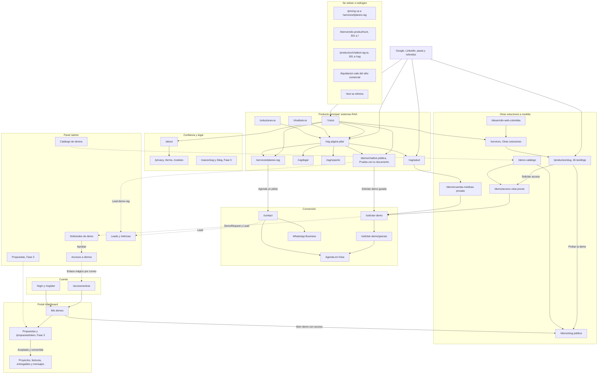

# Plan por sección

> Índice de las páginas que planifican cada **sección del sitio** y cada **módulo transversal** (panel, portal, backend, seguridad y comercial), con un resumen, su prioridad y su esfuerzo. Incluye el **mapa del sitio objetivo** y los **componentes globales** que comparten todas las páginas (barra de navegación, footer, banner de cookies, botón Solicitar demo y WhatsApp).
>
> El producto principal son los **sistemas RAG** ([Reposicionamiento RAG](13-Reposicionamiento-RAG.md)); cada sección se planificó para llevar primero a ese camino y, en segundo lugar, a las otras soluciones a medida ([Catálogo de productos](08-Catalogo-de-Productos.md)). El orden y las fechas están en el [Roadmap](12-Roadmap.md).

---

## En una mirada

- **9 páginas de sección** (lo que ve el visitante) y **5 de módulo** (lo que sostiene el funnel). Las 14 tienen la misma estructura: objetivo, estado actual, problemas, plan detallado, integración con el sistema de demos, SEO · i18n · accesibilidad · rendimiento, tareas y métricas.
- **Casi todas son P0.** Las secciones son la vitrina del reposicionamiento RAG y el sistema de demos depende de los módulos. Solo Nosotros es P1, con 5 tareas P0 de honestidad.
- **Una parte ya está hecha en la rama `rag-reposicionamiento`**, sin fusionar: inicio, `/rag` y sectores, planes en `/services#planes-rag`, `/chatbots-ia`, `/soluciones-ia`, SEO técnico, y "RAG" en el menú y el footer. Fusionarla es el primer entregable de la Fase 1 (paquete 1 del [Roadmap](12-Roadmap.md)).
- **Lo nuevo que más pesa:** las landings `/productos/<slug>`, el formulario **Solicitar demo**, **Mis demos** en el portal y las bandejas de **Solicitudes** y **Accesos** en el panel.

---

## Mapa del sitio objetivo

Las líneas continuas son la navegación principal. Las punteadas son lo que pasa por detrás: un lead o una solicitud que llega al panel, o la invitación por correo.

> [Ver diagrama como imagen](images/diagramas/07-Plan-por-Seccion-1.png)

**Estado de cada ruta.** "Rama" quiere decir hecho en `rag-reposicionamiento`, pendiente de fusionar.

| Ruta | Hoy en producción | Objetivo | Fase | Página |
|---|---|---|---|---|
| `/` | Agencia genérica de "software a medida" con cifras sin fuente | Inicio RAG: H1, "Probar la demo", "Ver planes" y cifras verificables (rama), más cómo funciona, sectores y planes | 1 | [Home](Seccion-Home.md) |
| `/rag`, `/rag/salud`, `/rag/legal`, `/rag/soporte` | No existen | Página pilar y landings por sector (rama), con "Solicitar demo guiada" y medición | 1 | [Landings SEO](Seccion-Landings-SEO.md) · [Reposicionamiento RAG](13-Reposicionamiento-RAG.md) |
| `/chatbots-ia` | Chatbots genéricos, "desde $499 USD" y cifras sin fuente | "Chatbots RAG para WhatsApp y web" (rama) | 1 | [Landings SEO](Seccion-Landings-SEO.md) |
| `/soluciones-ia` | Hub de IA con cifras sin fuente | Hub con RAG primero (rama) | 1 | [Landings SEO](Seccion-Landings-SEO.md) |
| `/desarrollo-web-colombia` | Cifras sin fuente y garantías absolutas | Puerta de las otras soluciones, con datos reales | 1 | [Landings SEO](Seccion-Landings-SEO.md) |
| `/services` | 27 tarjetas iguales con modal y TRM en vivo | `#planes-rag` arriba (rama) y "Otras soluciones a medida" que enlazan a su landing | 1 | [Servicios y precios](Seccion-Servicios-y-Precios.md) |
| `/pricing` | Redirige a `/services` | Los botones van directo a `/services#planes-rag` (rama) | 1 | [Servicios y precios](Seccion-Servicios-y-Precios.md) |
| `/productos/[slug]` | No existe | 26 landings: ola 1 en la Fase 1 y ola 2 en la Fase 2 | 1–2 | [Landing de producto](Seccion-Landing-de-Producto.md) |
| `/demo` | 26 tarjetas, sin distinguir IA real de maqueta, con acceso por código a una demo | Catálogo honesto por modo de acceso, con el RAG destacado | 1 | [Catálogo de demos](Seccion-Catalogo-de-Demos.md) |
| `/demo/chatbot` | Demo RAG genérica, en inglés, con métricas simuladas | Pública, con "Prueba con tu documento" (rama) y plantillas por sector (Fase 2) | 1–2 | [Sistemas RAG](Producto-chatbot-rag-ia.md) |
| `/demo/<slug>` (27 rutas más) | Todas abiertas | Según el modo: `publico`, `solicitud` o `privado`, verificado en el servidor | 1 | [Sistema de demos](04-Sistema-de-Demos.md) |
| `/demo/acceso` | No existe | Vista previa y "Solicitar acceso" cuando no hay acceso | 1 | [Sistema de demos](04-Sistema-de-Demos.md) |
| `/solicitar-demo` y `/gracias` | No existen | Formulario en 2 pasos (también en modal) | 1 | [Sistema de demos](04-Sistema-de-Demos.md) · [Contacto](Seccion-Contacto.md) |
| `/contact` | Formulario que pierde el producto elegido y "Agendar llamada" por `mailto:` | Selector de motivo, formulario con contexto y autorización, agenda real y WhatsApp | 1 | [Contacto](Seccion-Contacto.md) |
| `/about` | La página más honesta, con algunas exageraciones | Historia verificable desde `lib/company.ts` | 1 | [Nosotros](Seccion-Nosotros.md) |
| `/privacy`, `/terms`, `/cookies` | Sin la Ley 1581 completa y sin banner | Política de tratamiento, términos y banner de consentimiento | 1 | [Legal](Seccion-Legal.md) |
| `/login`, `/register`, `/acceso/*` | Registro abierto, sesión por revisar | Activación por enlace mágico, sesión segura y redirección por rol | 0–1 | [Autenticación](Seccion-Autenticacion.md) |
| `/dashboard/**` | Portal con datos de ejemplo | Portal por rol: Mis demos (Fase 1), Propuestas (Fase 3), Mi asistente RAG (Fase 4) | 1–4 | [Portal del cliente](06-Portal-del-Cliente.md) |
| `/admin/**` | 9 páginas con indicadores simulados | Panel por rol: Solicitudes, Accesos, Leads, Métricas, Catálogo; Propuestas en la Fase 3 | 1–3 | [Panel de administración](05-Panel-de-Administracion.md) |
| `/propuesta/[token]` | No existe | Propuesta en línea con aceptación, firma y anticipo | 3 | [Portal del cliente](06-Portal-del-Cliente.md) |
| `/casos/[slug]`, `/blog`, `/en/*` | No existen | Casos con autorización, contenido y versión en inglés indexable | 5 | [Comercial, marketing y legal](11-Comercial-Marketing-y-Legal.md) |
| `/bienvenido-producthunt` | Oferta vencida y cifras sin fuente | Redirección 301 a `/` con UTM | 1 | [Landings SEO](Seccion-Landings-SEO.md) |
| `/liquidacion` | Herramienta operativa dentro del sitio comercial | Módulo de la demo privada de salud o del panel | 0 | [Landings SEO](Seccion-Landings-SEO.md) |
| `/test` | Página interna de pruebas | Se elimina del repositorio | 0 | [Landings SEO](Seccion-Landings-SEO.md) |

---

## Índice de las secciones del sitio

**Tareas** = P0 / P1 / P2 / P3 de la tabla de tareas de cada página. **Días-dev** = suma de tallas con S = 1,5, M = 4, L = 7,5 y XL = 15 días, sin las tareas que ya se cuentan en otra página. Es una estimación: cada página trae además su propia cifra, calculada con tallas más finas.

| Página | Rutas | Resumen | Prioridad | Esfuerzo (página) | Tareas | Días-dev por fase |
|---|---|---|:-:|---|:-:|---|
| [Home](Seccion-Home.md) | `/` | Reposiciona el inicio en sistemas RAG: H1 "IA que responde con los documentos de tu empresa", "Probar la demo" y "Ver planes", y 4 frases verificables en lugar de "100+ proyectos". Suma cómo funciona, casos por sector, resumen de planes, prueba social real y un bloque secundario de otras soluciones | P0 | XL (≈ 18 días en la Fase 1) | 3 / 11 / 10 / 1 | 50 (F1 33,5 · F2 8,5 · F5 8) |
| [Servicios y precios](Seccion-Servicios-y-Precios.md) | `/services`, `/pricing` | Planes RAG primero (`#planes-rag`) con precio exacto en COP y USD; compra frente a suscripción (solo RAG; el resto en lista de espera); cada producto lleva a su landing; reglas de IVA, TRM de referencia y mantenimiento | P0 | XL (≈ 30 días) | 5 / 13 / 4 / 2 | 49,5 (F1 36 · F2 4 · F3 4 · F4 1,5 · F5 4) |
| [Catálogo de demos](Seccion-Catalogo-de-Demos.md) | `/demo` y el envoltorio de cada demo | Vitrina honesta: el RAG destacado, insignias "IA real" o "Datos de ejemplo", tarjetas según el modo de acceso, retiro del acceso por código, QA antes de listar una demo y eventos de uso | P0 | XL (≈ 22 días en la Fase 1) | 7 / 9 / 4 / 1 | 55 (F1 42 · F2 9 · F5 4) |
| [Landing de producto](Seccion-Landing-de-Producto.md) | `/productos/[slug]` | 26 landings (la del RAG redirige a `/rag`) con propuesta de valor, para quién es, capturas y video, planes de compra, preguntas frecuentes y CTA según el modo; estados borrador y publicada, en dos olas | P0 | XL (≈ 25 días de plantilla y ≈ 12 de contenido) | 8 / 9 / 5 / 3 | 94 (F1 54 · F2 24,5 · F5 15,5) |
| [Contacto](Seccion-Contacto.md) | `/contact`, agenda y WhatsApp | Selector "¿En qué te ayudamos?"; formulario que conserva producto, plan y UTM y crea un Lead con autorización; agenda real en lugar de `mailto:`; WhatsApp Business; gestión en el panel | P0 (núcleo) y P1 | XL (≈ 27 días) | 5 / 9 / 6 / 0 | 38,5 (F0 1,5 · F1 34 · F2 3) |
| [Nosotros](Seccion-Nosotros.md) | `/about` | Historia verificable desde `lib/company.ts`: fundador real, casos reales etiquetados, la apuesta por una IA que no inventa, manejo de los datos y CTA de vuelta al embudo; retira cifras y fotos de banco | P1 (con 5 P0 de honestidad) | L (≈ 10 días más datos del dueño) | 5 / 9 / 5 / 1 | 37,5 (F1 24 · F2 5,5 · F5 8) |
| [Landings SEO y de campaña](Seccion-Landings-SEO.md) | `/chatbots-ia`, `/soluciones-ia`, `/desarrollo-web-colombia`, `/bienvenido-producthunt`, `/liquidacion`, `/test` y su relación con `/rag` | Clúster con `/rag` como pilar: chatbots RAG, hub de IA, puerta de software a medida; retiro de Product Hunt, `/liquidacion` y `/test`; reglas de pauta, UTM y palabras clave | P0 | XL (≈ 20–25 días) | 5 / 12 / 7 / 1 | 58,5 (F0 5,5 · F1 34,5 · F2 7 · F5 11,5) |
| [Legal](Seccion-Legal.md) | `/privacy`, `/terms`, `/cookies`, banner, `/dashboard/privacidad`, `/baja` | Ley 1581: política de tratamiento, aviso y autorizaciones con prueba, derechos de los titulares, términos de demos, Piloto y planes, banner con Consent Mode y reglas para los documentos de clientes | P0 | XL (≈ 25 días más un asesor externo) | 11 / 7 / 3 / 1 | 42,5 (F1 39,5 · F2 3) |
| [Autenticación](Seccion-Autenticacion.md) | `/login`, `/register`, recuperación, `/auth/callback`, `/acceso/*` | Una identidad que pasa de invitado a prospecto y a cliente; activación por enlace mágico; sesión en cookies httpOnly; barra por rol; autorización en el servidor | P0 | XL (≈ 43 días, ≈ 5 ya contados en Sistema de demos) | 7 / 9 / 7 / 0 | 48,5 (F0 13 · F1 31,5 · F2 4) |

---

## Índice de los módulos transversales

| Página | Alcance | Resumen | Prioridad | Esfuerzo (página) | Tareas | Días-dev por fase |
|---|---|---|:-:|---|:-:|---|
| [Panel de administración](05-Panel-de-Administracion.md) | `/admin/**` | Panel por rol (`admin`, `sales`, `manager`) con bandeja de solicitudes, accesos, leads, propuestas, métricas reales, catálogo de demos, bitácora y privacidad; retira los indicadores simulados | P0 | XL (≈ 22 días P0 y ≈ 41 P1 en la Fase 1; ≈ 146 hasta la Fase 5) | 9 / 20 / 16 / 5 | 138 (F0 1,5 · F1 78,5 · F2 18 · F3 34,5 · F4 1,5 · F5 4) |
| [Portal del cliente](06-Portal-del-Cliente.md) | `/dashboard/**`, `/propuesta/[token]` | Portal del prospecto (Mis demos, recorrido guiado, agendar llamada) y del cliente (proyectos, requerimientos, facturación, entregables, mensajes), con la transición de prospecto a cliente y "Mi asistente RAG" en la Fase 4 | P0 | XL (≈ 87 días) | 9 / 10 / 6 / 0 | 81 (F1 45 · F2 5,5 · F3 23 · F4 7,5) |
| [Backend y API](09-Backend-y-API.md) | `apps/backend` y los route handlers de la web | Decisión por módulo (mantener, refactorizar, mover o eliminar); modelos y rutas del sistema de demos; mensajería unificada; jobs y worker; almacenamiento de objetos; núcleo RAG compartido; módulo de salud | P0 | XL (≈ 36 semanas-dev de backend) | 13 / 11 / 1 / 0 | 119,5 (F0 34 · F1 25,5 · F2 30 · F3 15 · F4 15) |
| [Seguridad y calidad](10-Seguridad-y-Calidad.md) | Todo el monorepo, CI, Vercel y Railway | La puerta de la Fase 0: autorización en el servidor, topes de IA, rotación de credenciales, CI real con pruebas y E2E, dependencias, observabilidad, copias y staging; además, rendimiento y accesibilidad | P0 | XL (≈ 56 días de Fase 0 y 8 de Fase 2) | 10 / 11 / 3 / 1 | 61 (F0 53,5 · F2 7,5) |
| [Comercial, marketing y legal](11-Comercial-Marketing-y-Legal.md) | Transversal: `/`, `/rag`, landings, `/services`, `/contact`, panel | Posicionamiento RAG, cliente ideal, ofertas de entrada (Piloto), embudo y metas, pipeline, WhatsApp y correo, prueba social honesta, analítica, canales, SEO, política de precios, cobros y pasarelas, facturación DIAN de KopTup y contratos | P0 | XL (≈ 45 días-dev y ≈ 25 días del dueño) | 11 / 11 / 3 / 0 | 49 (F1 26 · F2 4 · F3 4 · F5 15) |

Las páginas base de todo lo anterior son [Flujo del cliente](03-Flujo-del-Cliente.md) (recorrido completo del prospecto) y [Sistema de demos](04-Sistema-de-Demos.md) (modelos, estados, API y control de acceso; 27 tareas P0, ≈ 103 días-dev).

**Por qué las cifras no coinciden del todo.** La talla fija de esta wiki (S = 1,5 días) sobreestima las tareas pequeñas de texto y la talla XL (15 días) es un piso que subestima las grandes. Por eso Backend y API suma menos aquí (≈ 119,5 días) que en su propia estimación (≈ 180), y Home suma algo más. Para planificar se usa el [Roadmap](12-Roadmap.md), que aplica una sola regla para todas las páginas.

---

## Componentes globales

No pertenecen a una sola página, pero cambian lo que se ve en todas. Aquí está el detalle; las tareas viven en la página indicada.

| Componente | Hoy | Cambio | Fase | Tareas |
|---|---|---|:-:|---|
| **Barra de navegación** (`components/layout/Navbar.tsx`) | Inicio, Planes y servicios, Demos, Nosotros y Contacto; botones "Probar demos", "Iniciar sesión" y "Quiero esto" (a `/pricing`) | "RAG" en el menú y "Quiero esto" a `/services#planes-rag` (rama). Después: **Iniciar sesión** y **Solicitar demo** sin sesión; **Mis demos** (con contador) para `prospect`; **Mi portal** para `client`; **Panel** con solicitudes pendientes para el equipo. La sesión se lee del servidor y la barra no parpadea | 1 | [Home](Seccion-Home.md) 13 · [Autenticación](Seccion-Autenticacion.md) 5 |
| **Footer** (`components/layout/Footer.tsx`) | Enlaces a anclas de `/services` que no existen; datos de empresa repetidos | Columna RAG (`/rag` y los 3 sectores, en la rama); productos hacia `/productos/<slug>`; datos desde `lib/company.ts`; enlace "Preferencias de cookies" | 1 | [Landings SEO](Seccion-Landings-SEO.md) 14 · [Nosotros](Seccion-Nosotros.md) 2 · [Legal](Seccion-Legal.md) 14 |
| **Banner de consentimiento** | No existe; `/cookies` guarda preferencias que nadie lee | Banner con aceptar y rechazar y panel por categoría; GA4, Google Ads y LinkedIn solo después de aceptar (Consent Mode v2, etapa E7 de la rama). En móvil no tapa los botones del hero | 1 | [Legal](Seccion-Legal.md) 14 · [Comercial](11-Comercial-Marketing-y-Legal.md) 13 |
| **Modal "Solicitar demo"** | No existe; los CTA van a `/contact` sin contexto | Un solo formulario (página y modal) que precarga producto, plan y demo, y guarda la página de origen y las UTM. Se abre desde la barra, las landings, el catálogo, el envoltorio de demos y el portal | 1 | [Sistema de demos](04-Sistema-de-Demos.md) 20 · [Home](Seccion-Home.md) 9 · [Landing de producto](Seccion-Landing-de-Producto.md) 6 · [Catálogo de demos](Seccion-Catalogo-de-Demos.md) 6 |
| **Agendar llamada** | `mailto:` | `NEXT_PUBLIC_BOOKING_URL` y botón compartido (`ScheduleCallButton`) con datos precargados en el portal | 1 | [Contacto](Seccion-Contacto.md) · [Portal del cliente](06-Portal-del-Cliente.md) P-12 |
| **WhatsApp** | Enlace en `/contact` | `WhatsAppButton` con número de empresa en `lib/company.ts`, mensaje prellenado sin datos personales y evento `whatsapp_click`; flotante solo en landings móviles; nunca en el portal ni en el panel | 1 | [Contacto](Seccion-Contacto.md), sección 6 |
| **Envoltorio de las demos** (`app/demo/layout.tsx`, `DemoCTA`) | CTA genérico a `/contact` y `/pricing` | `DemoAccessShell`: banner "Solicita tu demo guiada" en las públicas, barra de acceso con días restantes para quien tiene acceso, pantalla `/demo/acceso` sin acceso y `DemoFooterCta` contextual | 1 | [Sistema de demos](04-Sistema-de-Demos.md) 18 · [Catálogo de demos](Seccion-Catalogo-de-Demos.md) 7 |
| **Diseño por zona** (`ConditionalLayout`) | El panel muestra también el menú público | Sin navegación pública en `/admin`; cabecera mínima en `/acceso/*`; portal con su propio layout | 1 | [Panel](05-Panel-de-Administracion.md) 1 · [Autenticación](Seccion-Autenticacion.md) 16 · [Portal](06-Portal-del-Cliente.md) P-01 |
| **Errores y carga** | No hay `error.tsx` | `global-error.tsx`, `error.tsx` por zona, `loading.tsx` con esqueletos y `not-found` con `noindex` | 0 | [Seguridad y calidad](10-Seguridad-y-Calidad.md) 24 |
| **Datos de empresa** | Año, cifras y contacto distintos según la página | `lib/company.ts` como fuente única (año, ciudad, contacto, casos con `authorized`), usada por el footer, `/about`, `/contact`, legal y el JSON-LD | 1 | [Nosotros](Seccion-Nosotros.md) 2 · [Contacto](Seccion-Contacto.md) 1 |
| **Idioma** | Inglés solo por cookie (no indexable); textos con voseo | Español con "tú" en todo el sitio (rama, etapa E5); inglés indexable en `/en/*` en la Fase 5 | 1 y 5 | [Seguridad y calidad](10-Seguridad-y-Calidad.md) 20 · [Comercial](11-Comercial-Marketing-y-Legal.md) |

---

## Orden de trabajo recomendado

1. **Fase 0, en paralelo con la fusión de la rama RAG:** seguridad crítica, topes de IA, persistencia del chatbot, observabilidad ([Seguridad y calidad](10-Seguridad-y-Calidad.md) y [Backend y API](09-Backend-y-API.md)).
2. **Fase 1, secciones del camino RAG:** Home, Landings SEO (`/rag` y sectores), Servicios y precios (`#planes-rag`), Legal (política y banner), Contacto y Nosotros. Con esto se puede pautar.
3. **Fase 1, sistema de demos:** Autenticación, Catálogo de demos, Panel (Solicitudes y Accesos), Portal (Mis demos).
4. **Fase 1, después:** Landing de producto (ola 1), Leads y Métricas del panel.
5. **Fases 2 a 5:** según el [Roadmap](12-Roadmap.md).

---

## Páginas relacionadas

- [Flujo del cliente](03-Flujo-del-Cliente.md) · [Sistema de demos](04-Sistema-de-Demos.md) · [Catálogo de productos](08-Catalogo-de-Productos.md) · [Roadmap](12-Roadmap.md) · [Reposicionamiento RAG](13-Reposicionamiento-RAG.md)
