# Backend y API

> Ruta(s): `apps/backend` (API Express + TypeScript + Mongoose, desplegada en Railway) y los route handlers de `apps/web/src/app/api` · Archivos principales: `src/index.ts`, `src/routes/`, `src/controllers/`, `src/services/`, `src/models/`, `src/middleware/`, `src/config/` · Prioridad: **P0** · Esfuerzo total: **XL** (≈ 36 semanas-dev de backend entre la Fase 0 y la Fase 4, de las cuales ≈ 19 corresponden a las Fases 0 y 1; detalle en [Tareas](#tareas))

Esta página es el plan técnico del backend. Para cada módulo dice qué hace hoy, en qué estado está y qué se decide: **mantener**, **refactorizar**, **mover a un servicio aparte** o **eliminar**. También describe los componentes nuevos que necesita el [Sistema de demos](04-Sistema-de-Demos.md): modelos, rutas, mensajería unificada, jobs, almacenamiento y configuración.

- La especificación funcional de solicitudes, accesos, estados y permisos está en [Sistema de demos](04-Sistema-de-Demos.md). Esta página no la repite: explica cómo se construye y cómo se opera.
- Las pantallas que consumen esta API están en [Panel de administración](05-Panel-de-Administracion.md) y [Portal del cliente](06-Portal-del-Cliente.md).
- La wiki es pública. La seguridad se trata solo como tareas genéricas (sección 16 del plan y [Seguridad y calidad](10-Seguridad-y-Calidad.md)).

---

## Índice

- [En una mirada](#en-una-mirada)
- [Objetivo](#objetivo)
- [Estado actual](#estado-actual)
- [Problemas detectados](#problemas-detectados)
- [Plan detallado](#plan-detallado)
  1. Arquitectura objetivo · 2. Decisiones de arquitectura · 3. Plan por módulo · 4. Componentes nuevos del sistema de demos · 5. Mensajería unificada · 6. Jobs y worker · 7. Persistencia y almacenamiento · 8. Redis · 9. Variables de entorno con zod · 10. Estructura de carpetas · 11. Convenciones de la API · 12. Swagger / OpenAPI · 13. Observabilidad, despliegue y entornos · 14. Inventario de la API objetivo · 15. Limpieza de código muerto · 16. Seguridad
- [Integración con el sistema de demos](#integración-con-el-sistema-de-demos)
- [SEO · i18n · accesibilidad · rendimiento](#seo--i18n--accesibilidad--rendimiento)
- [Tareas](#tareas)
- [Métricas de éxito](#métricas-de-éxito)

---

## En una mirada

| Tema | Hoy | Objetivo |
|---|---|---|
| Procesos | Un solo proceso Express en Railway. Además de atender la API, procesa PDFs con IA durante hasta 15 minutos por petición | Servicio `api` y, desde la Fase 2, un servicio `worker` con colas para el trabajo pesado |
| Tamaño | 22 archivos de rutas con **179 endpoints** montados. ≈ 34.300 líneas alcanzables desde `index.ts`, y ≈ 65 % de ellas son del vertical de salud | Plataforma (cuentas, leads, demos, portal) organizada en capas. Cada producto (RAG, documentos, salud) en un módulo aislado |
| Estado | Archivos subidos, estado del chatbot, decisiones de la IA y logs en el **disco efímero** de Railway: se pierden en cada despliegue | MongoDB con réplica y almacenamiento de objetos privado. En el disco solo quedan temporales |
| Sesiones | Token de refresco en Redis, con una sola sesión por usuario | `AuthSession` en MongoDB y cookies httpOnly. Redis pasa a ser opcional |
| Permisos | Roles `user`, `admin`, `manager`, `developer` y un filtro por rol para todo `/api/admin` | Matriz de permisos con `admin`, `sales`, `manager`, `developer`, `prospect` y `client`, aplicada siempre en el servidor |
| IA | 6 modelos de OpenAI y Anthropic escritos en el código, sin medir el costo | Pasarela de IA: modelos por variable de entorno, cupos, tope mensual y registro de uso (`AiUsage`) |
| Mensajes | Email y WhatsApp disparados desde los controladores, sin reintentos ni registro | Outbox `OutboundMessage` con reintentos, plantillas y reglas de envío |
| Configuración | Variables leídas en cualquier archivo y valores por defecto en el código | `config/env.ts` validado con zod al arrancar; el servidor no arranca si falta algo |
| Documentación | Swagger con anotaciones en 9 de los 22 archivos de rutas | OpenAPI generado desde los esquemas zod en CI y cliente tipado para la web |
| Pruebas | 14 archivos de prueba, todos dentro de código que no se monta. No corren | Jest + supertest + MongoDB en memoria con réplica, todo en CI |
| Código muerto | ≈ 5.300 líneas sin uso: 18 módulos en memoria, copias `.bak`, SQL de PostgreSQL, un chat de eco… | Eliminado en la Fase 0 |

### Decisión por módulo

| Módulo | Montaje actual | Endpoints | Líneas aprox. | Lo usa hoy | Decisión | Fase |
|---|---|---|---|---|---|---|
| Autenticación | `/api/auth` | 9 | 870 | `/login`, `/register`, Google, recuperar contraseña | **Refactorizar** | 0–1 |
| Usuarios y administración | `/api/admin` | 13 | 580 | Panel `/admin` | **Refactorizar** | 0–1 |
| Contacto → Leads | `/api/contact` | 3 (2 de prueba) | 160 | `/contact` | **Refactorizar** (pasa a ser el canal de Leads) | 1 |
| Sistema de demos y Leads | — | ≈ 45 nuevos | — | — | **Nuevo** | 1 |
| Mensajería (email, WhatsApp, avisos internos) | servicios | — | 890 | Contacto, pedidos, restablecer contraseña | **Refactorizar** hacia el outbox unificado | 1 |
| Chatbot RAG: constructor y playground | `/api/chatbot/bots/*`, `/models` | 12 | ≈ 950 | `/demo/chatbot` | **Refactorizar** (MongoDB, S3 y núcleo RAG) | 0–2 |
| Chatbot heredado "por sesión" | `/api/chatbot/session`, `/upload`, `/message`… | 7 | ≈ 700 | Solo la página huérfana `/demo/chatbot/preview` | **Eliminar** | 2 |
| Documentos | `/api/documents` | 11 | 1.220 | `/demo/gestor-documentos` | **Refactorizar** (modo muestra, grant y núcleo RAG) | 1–2 |
| Portal: proyectos, pedidos, facturas, entregables, mensajes, notificaciones | 6 routers | 37 | 3.850 | `/dashboard` y `/admin` | **Mantener y refactorizar** | 1–3 |
| Propuestas (`Quote`) | `/api/quotes` | 1 | 70 | Ninguno | **Eliminar** el POST público; se reconstruye en la Fase 3 | 0 y 3 |
| Chat heredado | `/api/chat` | 3 | 200 | Ninguno (responde con un eco) | **Eliminar** | 0 |
| Salud: cuentas médicas, auditoría, Ley 100, CUPS, liquidación, glosas, reglas | 6 routers (uno montado en la raíz `/api`) | 70 | ≈ 20.000 | `/demo/cuentas-medicas`, páginas internas `/liquidacion` y `/test` | **Mover a un servicio aparte**, por etapas: módulo aislado (Fase 2) desplegable como instancia dedicada por cliente | 1–3 |
| Sistema experto | `/api/expert` | 6 | 2.060 | `/demo/sistema-experto` | **Mover** al módulo de salud como "Motor de reglas" | 1–2 |
| Gestor de contenido con IA | `/api/content` | 5 | 630 | `/demo/gestor-contenido` | **Mantener** detrás de la pasarela de IA; módulo `content-ai` en la Fase 2 | 0–2 |
| Módulos en memoria (`src/modules/`) | no montados | 126 | 3.440 | Ninguno | **Eliminar** | 0 |
| Rutas de prueba | `routes/test.routes.ts` y las rutas de prueba de `contact.routes.ts` | 4 | 160 | Ninguno | **Eliminar** de producción | 0 |

---

## Objetivo

El backend tiene que sostener el negocio que describen [Visión de producto](02-Vision-de-Producto.md) y [Flujo del cliente](03-Flujo-del-Cliente.md):

1. **Sostener el funnel de la Fase 1** de punta a punta: solicitud de demo → aprobación → acceso verificado en el servidor → uso medido → propuesta. Ningún paso puede depender de un archivo en disco ni de un paso manual fuera del panel.
2. **Controlar el costo de la IA.** Las demos públicas (asistente RAG, "Prueba con tu documento", contenido) llaman a modelos de pago. Toda llamada pasa por cupos y por un tope mensual.
3. **Poder vender por partes.**
   - El chatbot RAG es el primer producto que pasa a SaaS real (Fase 4).
   - El vertical de salud se ofrece como instancia dedicada por cliente ([Demo cuentas médicas](Demo-cuentas-medicas.md)).
   - El resto de soluciones a medida se demuestra con maquetas.
4. **Ser operable por un equipo pequeño:**
   - desplegar sin perder datos;
   - salud visible de jobs y mensajes;
   - alertas;
   - documentación generada;
   - pruebas en CI.
5. **Cumplir la Ley 1581:** prueba del consentimiento, retención, supresión, transmisión a proveedores declarada y registros técnicos sin datos personales.

---

## Estado actual

### Topología

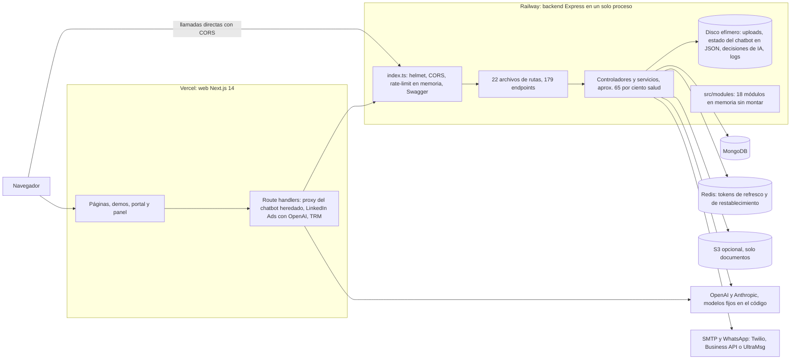
> [Ver diagrama como imagen](images/diagramas/09-Backend-y-API-1.png)

- La web llama al backend **directamente desde el navegador**, a la URL pública de Railway (`apps/web/src/lib/backend-url.ts`). Solo el chatbot heredado pasa por un proxy de Next.
- La generación de LinkedIn Ads llama a OpenAI **desde Vercel** (`apps/web/src/app/api/linkedin-ads/generate/route.ts`), por fuera del backend.

### Arranque (`apps/backend/src/index.ts`)

| Líneas | Qué hace | Observación |
|---|---|---|
| 21–30 | `uncaughtException` y `unhandledRejection` terminan el proceso | Correcto como red de seguridad, pero no hay reporte de errores (Sentry) |
| 36–70 | `helmet` y CORS con lista de orígenes (producción + `CORS_ORIGIN`) | Falta `trust proxy`: detrás del proxy de Railway, el rate-limit y los logs no ven la IP real del visitante |
| 76–84 | Rate-limit general (100 por 15 min) y del chatbot (60 por minuto) | En memoria: cada instancia cuenta por separado |
| 91–100 | Swagger con `swagger-jsdoc` sobre `./src/routes/*.ts`, servido por el mismo backend | Solo 9 de 22 archivos de rutas tienen anotaciones |
| 110–128 | Crea 8 carpetas bajo `./uploads` | Todo lo que se guarda ahí se pierde al redesplegar |
| 143–157 | Al arrancar, asegura el rol `admin` de una cuenta configurada | Un arranque no debería modificar datos. Se reemplaza por el script `scripts/set-admin.ts`, que ya existe |
| 172–243 | Importa y monta los 22 routers. `cuentas.routes` se monta en la raíz `/api` (línea 232) | Rutas genéricas como `/api/process` o `/api/export` ocupan nombres que la plataforma necesitará |
| 264–269 | `server.timeout` de 15 minutos "para análisis IA extenso" | El trabajo pesado debe ir a una cola, no a la petición HTTP |

### Inventario por dominio

| Dominio | Archivos principales | Persistencia | IA | Consumidor web |
|---|---|---|---|---|
| Autenticación | `routes/auth.routes.ts`, `controllers/auth.controller.ts` (337 líneas), `config/passport.ts`, `middleware/auth.ts` | `User` en MongoDB. Refresco y restablecimiento en Redis (`auth.controller.ts` líneas 100, 136, 243) | — | Login, registro, Google, recuperar |
| Administración | `routes/admin.routes.ts` (todo el router con `authorize('admin','manager')`, línea 21), `controllers/admin.controller.ts` (535 líneas: pedidos, facturas, entregables, conversaciones, usuarios y contactos en un solo archivo) | MongoDB | — | `/admin/*` |
| Contacto | `routes/contact.routes.ts`, `controllers/contact.controller.ts` | `Contact` (`new · read · responded`) | — | `/contact` |
| Chatbot (2 APIs) | `routes/chatbot.routes.ts` (943 líneas), `controllers/chatbot.controller.ts`, `services/chatbot.service.ts`, `models/Chatbot.ts`, `data/chatbot-store.ts` | Constructor: 4 `Map` en memoria (líneas 107–110) volcados a `data/chatbots/state.json`. Heredado: modelo `Chatbot` en MongoDB y archivos en `uploads/chatbot` | OpenAI opcional (líneas 601–720). Sin clave, responde en modo extractivo BM25 (línea 247). PDF y DOCX no se interpretan en la ruta de bots (línea 155) | `/demo/chatbot` (constructor) y `/demo/chatbot/preview` (heredado, huérfana) |
| Documentos | `routes/document.routes.ts`, `controllers/document.controller.ts` (633 líneas), `services/document-ai.service.ts`, `services/storage.service.ts` | `Document` con su embedding dentro del documento. Archivo en S3 solo si hay credenciales; si no, en disco (`document.controller.ts` líneas 74–85) | Análisis y embeddings con `text-embedding-ada-002`. Similitud coseno calculada en memoria | `/demo/gestor-documentos` (`hooks/useDocuments.ts`) |
| Portal | `routes/{project,orders,invoices,deliverables,messages,notifications}.routes.ts`, `services/project.service.ts` (594 líneas) | MongoDB. Adjuntos de pedidos en `uploads/orders` | — | `/dashboard/*`, `/admin/*` |
| Propuestas | `routes/quote.routes.ts`, `models/Quote.ts` (`pending · contacted · completed`) | MongoDB | — | Ninguno: `requestQuote` de `lib/api.ts` no se llama desde ninguna página |
| Chat heredado | `routes/chat.routes.ts`, `controllers/chat.controller.ts` | `ChatSession`, `ChatMessage` | Ninguna: responde `Echo: <mensaje>` | Ninguno |
| Salud | `routes/{auditoria,cuentas,cups,liquidacion,reglas-facturacion,documentoConocimientoConfig}.routes.ts`, 11 controladores, 28 servicios, 24 modelos | MongoDB, PDFs y Excel en `uploads/`, decisiones de IA en `data/decisiones-ia/*.json` (`sistema-aprendizaje.service.ts` línea 78) | `gpt-4o`, `gpt-4o-mini`, `gpt-4-turbo`, visión, `text-embedding-3-small` y un modelo de Anthropic de 2024 para reglas | `/demo/cuentas-medicas` (`/auditoria/*`, `/documentos-conocimiento/*`), `/liquidacion` y `/test` (internas) |
| Sistema experto | `routes/expert-system.routes.ts`, `services/expert-system.service.ts`, `expert-rules.service.ts`, `excel-expert.service.ts` | MongoDB | Embeddings de CUPS | `/demo/sistema-experto` (vía `components/DashboardAuditoria.tsx` y `BusquedaSemanticaCUPS.tsx`: `/expert/estadisticas`, `/cups/estadisticas`, `/cups/estadisticas-vectorizacion`, `/cups/buscar-semantica`) |
| Contenido con IA | `routes/content-manager.routes.ts`, `services/content-manager.service.ts` | — | `gpt-4o-mini` (o `OPENAI_MODEL`) | `/demo/gestor-contenido` (`services/contentManagerService.ts`) |
| Módulos en memoria | `src/modules/*` (18 carpetas, 125 archivos) | Arreglos en memoria | — | Ninguno: `index.ts` no los importa |
| Mensajería | `services/email.service.ts` (SMTP), `services/whatsapp.service.ts` (3 proveedores), `utils/notifications.ts` (avisos dentro de la app) | `Notification` | — | Contacto, pedidos, restablecer contraseña |

### Persistencia y estado

| Qué | Dónde vive hoy | Qué pasa al redesplegar |
|---|---|---|
| Archivos subidos (documentos sin S3, pedidos, chatbot, cuentas médicas, Ley 100) | `./uploads/*` (`middleware/upload.ts` líneas 106–121, `routes/cuentas.routes.ts` líneas 38–67, `routes/liquidacion.routes.ts` línea 20, `controllers/auditoria.controller.ts` línea 18, `routes/chatbot.routes.ts` línea 19) | Se pierden; los registros de MongoDB quedan apuntando a archivos que ya no existen |
| Exportes de Excel | `./uploads/exports` (`excel.service.ts`, `liquidacion-automatizada.service.ts` línea 417, `process.controller.ts` línea 177) | Se pierden |
| Bots, documentos, fragmentos y conversaciones del constructor | `Map` en memoria + `data/chatbots/state.json` (`data/chatbot-store.ts` líneas 19–20) | Se pierden. Con 2 instancias, cada una tendría su propio estado |
| Decisiones y retroalimentación de la IA de auditoría | `data/decisiones-ia/*.json` (además hay 30 archivos de ejemplo versionados en git) | Se pierden los nuevos |
| Logs | Consola + 4 archivos en `logs/` (`utils/logger.ts` líneas 49–70) | Se pierden los archivos (la consola sí la guarda Railway) |
| Sesiones y restablecimiento de contraseña | Redis (`config/redis.ts`: si Redis falla, el envoltorio devuelve `null` en silencio) | Sobreviven, pero si Redis no está, no se puede renovar la sesión |
| Rate-limit | Memoria del proceso | Se reinicia con cada despliegue |

### Configuración, dependencias y calidad

- **Variables de entorno:** se leen en 40 archivos con `process.env.X || 'valor'`. `.env.example` no lista varias que el código usa (`JWT_REFRESH_SECRET`, `SMTP_*`, `TWILIO_*`, `FRONTEND_URL`, `ANTHROPIC_API_KEY`) y sí lista otras sin uso (`MONGO_URI`).
- **Dependencias declaradas sin uso:**
  - `zod`: 0 importaciones, aunque [Sistema de demos](04-Sistema-de-Demos.md) lo adopta como estándar de validación;
  - `@pinecone-database/pinecone`: solo lo usa `services/embedding.service.ts`, que nadie importa;
  - `pdf-poppler`: sin uso.
- **Tres implementaciones de embeddings** con dos modelos distintos:
  - `document-ai.service.ts` usa `ada-002`;
  - `embeddings.service.ts` usa `3-small`;
  - `embedding.service.ts` también usa `ada-002` y está muerto.
- **Duplicación en salud:**
  - 3 controladores de auditoría (`auditoria`, `auditoria-medica`, `auditoria-modular`);
  - 4 generadores de Excel;
  - 5 extractores de PDF (`extraccion-dual` tiene 1.017 líneas).
- **TypeScript:** `tsconfig.json` con `strict: false`.
- **Pruebas:** `npm test` corre Jest sin configuración para TypeScript, y los 14 archivos de prueba del backend están en `src/modules/*/__tests__`, que no se montan. El CI (`.github/workflows/ci.yml`) levanta PostgreSQL y no corre (ver [Diagnóstico](01-Diagnostico.md)).
- **Servidores y scripts sueltos:** `src/index-minimal.ts`, `test-db.js`, `test-simple.js`, `test-startup.js`, `src/test-pdf-processing.ts`, `src/verify-excel.ts`.
- **Restos de PostgreSQL:** `src/db/migrations/*.sql`, `src/db/seeds/001_sample_projects.sql`, `packages/database/init.sql` y `src/config/database.ts`.

### Síntomas visibles en producción

Las tres demos que dependen de APIs reales del backend se ven vacías o con error en producción:

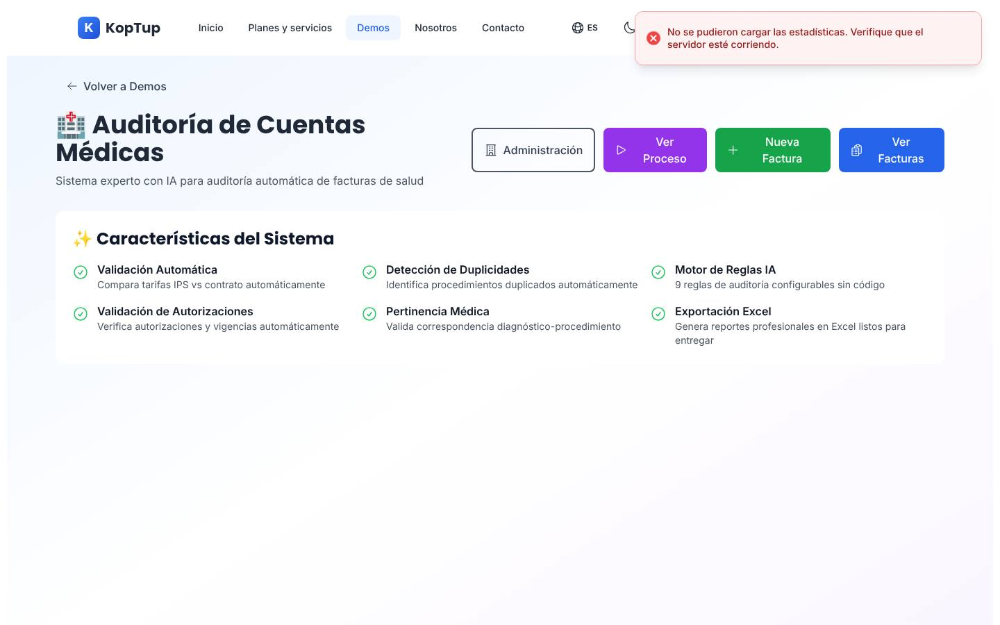

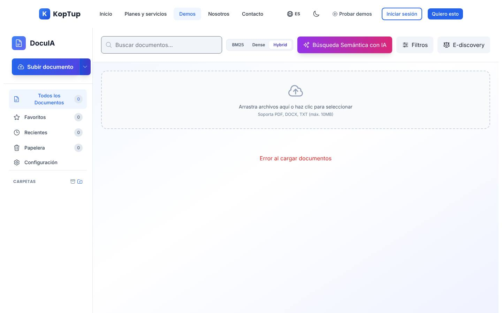

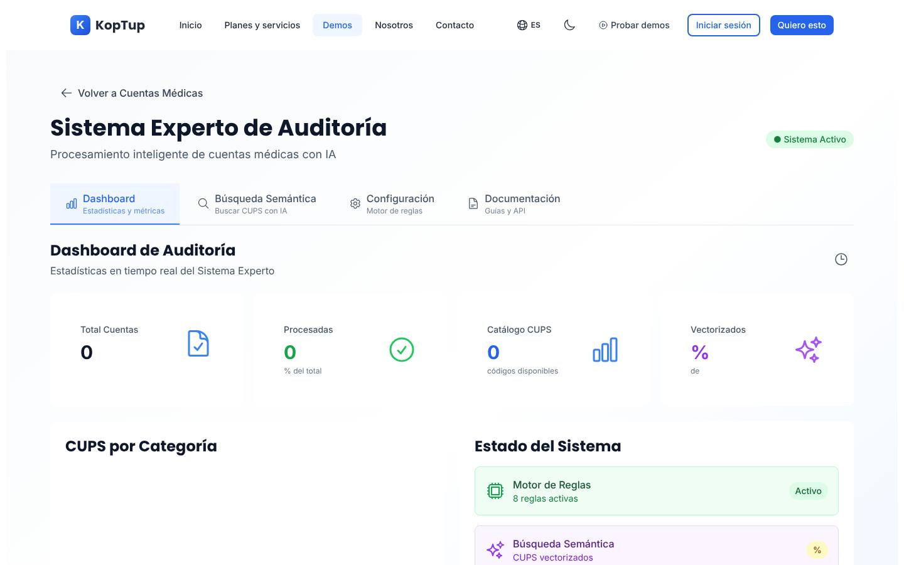

---

## Problemas detectados

1. **El estado vive en un disco que se borra.**
   - Archivos de clientes y prospectos, bots del chatbot, decisiones de la IA, exportes y logs se pierden en cada despliegue.
   - Por la misma razón, no se pueden correr dos instancias.
2. **Las sesiones dependen de Redis y admiten un solo dispositivo.**
   - Una clave de refresco por usuario: entrar desde el celular cierra la sesión del portátil.
   - Si Redis falla, nadie puede renovar su sesión.
3. **Los permisos son gruesos.**
   - Un solo filtro `admin`/`manager` para todo `/api/admin`.
   - No existen los roles `sales`, `prospect` ni `client`.
   - La verificación de pertenencia (que un recurso sea del usuario que lo pide) es irregular.
   - La autorización de todas las rutas se audita en la Fase 0 (sección 16).
4. **La IA no tiene control de costo.**
   - Los nombres de modelo aparecen escritos en 19 archivos.
   - El gasto no se mide por función, visitante ni acceso, así que no se ve en ningún panel.
   - Los límites de uso y de costo están repartidos y deben centralizarse (sección 16).
   - La ruta de LinkedIn Ads gasta desde Vercel, por fuera del backend.
5. **El trabajo pesado corre dentro de la petición HTTP.**
   - El servidor amplía los tiempos de espera a 15 minutos.
   - Un despliegue o un reinicio a mitad del proceso pierde el trabajo.
   - El navegador puede cortar la conexión antes de que termine.
6. **La plataforma y el vertical de salud están mezclados.**
   - Salud es ≈ 65 % del código y tiene rutas montadas en la raíz `/api`.
   - Muchos servicios están duplicados.
   - Hay referencias a un pagador real en el código (ver [Demo cuentas médicas](Demo-cuentas-medicas.md)).
7. **Hay dos APIs de chatbot y tres de embeddings.** El reposicionamiento RAG necesita **un** núcleo de ingesta, búsqueda y citas.
8. **No existe el dominio comercial.**
   - `Contact` es un buzón.
   - `Quote` es un formulario sin uso.
   - No hay Lead, solicitud, acceso, bitácora ni outbox. Todo eso lo especifica [Sistema de demos](04-Sistema-de-Demos.md).
9. **Los mensajes se envían "y ojalá lleguen".**
   - El controlador dispara email y WhatsApp sin esperar ni reintentar.
   - No queda registro del envío.
   - Hay 3 proveedores de WhatsApp a medio configurar.
   - Los registros técnicos incluyen datos personales del formulario.
10. **La configuración no se valida.**
    - Faltan variables en `.env.example`.
    - Hay valores por defecto con datos de entorno dentro del código.
    - Si falta una variable, el servidor arranca igual y falla después.
11. **No hay red de seguridad de calidad:** sin pruebas que corran, sin CI válido, sin `strict` y con dependencias desactualizadas.
12. **La documentación de la API es parcial.** Además, el cliente de la web (`lib/api.ts`, `types/api.types.ts`) está escrito a mano y se desalinea del backend.
13. **Hay código muerto que confunde.**
    - 18 módulos con 126 endpoints parecen un backend para las demos, pero no están montados.
    - Además: copias `.bak`, SQL, un chat de eco, rutas de prueba y servidores alternativos.
14. **Las demos con backend real fallan en producción** (capturas de arriba). No hay verificación de salud (`/ready`), ni prueba de humo, ni alerta.

---

## Plan detallado

### 1. Arquitectura objetivo

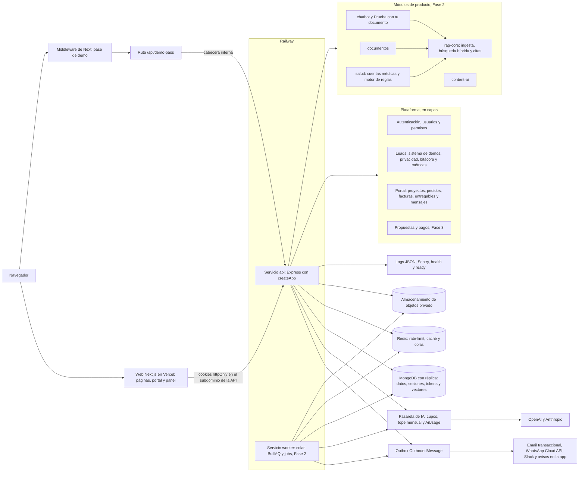
> [Ver diagrama como imagen](images/diagramas/09-Backend-y-API-2.png)

**Principios:**

1. **El servidor decide.** Toda regla de acceso, permiso, cupo y vigencia se evalúa en la API. La web solo oculta botones.
2. **Nada importante en disco.** MongoDB guarda datos y estado; el almacenamiento de objetos, los archivos; el disco, solo temporales del trabajo en curso.
3. **Plataforma en capas, productos en módulos.**
   - La plataforma comercial sigue la convención de [Sistema de demos](04-Sistema-de-Demos.md): `models/`, `routes/`, `controllers/`, `services/`.
   - Cada producto vive en `src/modules/<producto>/`, con sus rutas, modelos, esquemas y pruebas, y se puede apagar con una variable.
4. **Trabajo pesado fuera de la petición.**
   - Fase 1: jobs programados con `node-cron` dentro de la API.
   - Fase 2: colas en un worker aparte.
5. **Toda llamada a IA pasa por la pasarela.** Así hay un solo lugar para cupos, topes, modelos y registro de costo.
6. **Todo mensaje sale por el outbox.** Así hay un solo lugar para reintentos, idempotencia, horarios y bajas.
7. **El contrato se genera.** Los esquemas zod validan las entradas, generan el OpenAPI y, de ahí, los tipos de la web.

### 2. Decisiones de arquitectura

| # | Tema | Decisión | Motivo |
|---|---|---|---|
| 1 | Forma del sistema | **Monolito modular**: un repositorio y una imagen, con dos servicios (`api` y `worker`) desde la Fase 2 | Equipo pequeño. Separar en microservicios multiplicaría despliegues sin beneficio. El módulo de salud queda listo para desplegarse aparte cuando un cliente lo pida |
| 2 | Base de datos | **MongoDB con réplica**. Recomendado MongoDB Atlas en la misma región que la API | Las transacciones de `approve` (Sistema de demos, sección 7.2) exigen réplica. Atlas aporta copias con restauración a un punto en el tiempo y Vector Search para el RAG sin sumar otra base |
| 3 | Archivos | **Almacenamiento de objetos compatible con S3**: privado, cifrado, con URLs firmadas y ciclo de vida por prefijo. Se reutiliza `@aws-sdk/client-s3`, ya instalado | El disco de Railway es efímero. Con `S3_ENDPOINT` opcional sirve también un proveedor compatible |
| 4 | Sesiones y tokens | `AuthSession` y `MagicLinkToken` en MongoDB. Redis **no** participa del inicio de sesión | Decisión ya tomada en [Autenticación](Seccion-Autenticacion.md) (tareas 8 y 9) y en Sistema de demos (decisión 6) |
| 5 | Redis | Opcional en las Fases 0 y 1 (rate-limit compartido y caché); obligatorio desde la Fase 2 (colas) | Si Redis cae, la API sigue funcionando: el rate-limit pasa a memoria |
| 6 | Jobs | Fase 1: `node-cron` + *lease* en `JobRun` + `JOBS_ENABLED` (decisión 8 de Sistema de demos). Fase 2: **BullMQ** para trabajo pesado y un `worker.ts` que también corre los jobs programados | No se suma infraestructura antes de tiempo. Las colas llegan cuando hay ingesta RAG y lotes de salud |
| 7 | Mensajes | Outbox `OutboundMessage` (decisión 7 de Sistema de demos) con adaptadores por canal | Reintentos, idempotencia, secuencias y registro de cada envío |
| 8 | Email | Proveedor transaccional con API y webhooks de rebote, más SPF, DKIM y DMARC del dominio. SMTP solo en desarrollo | Las invitaciones con enlace mágico tienen que llegar a la bandeja de entrada |
| 9 | WhatsApp | **WhatsApp Business Cloud API** (Meta) como proveedor único en producción. Twilio queda como adaptador alternativo y UltraMsg se elimina | Las plantillas aprobadas por Meta son obligatorias para escribir fuera de la ventana de 24 h, incluso al equipo |
| 10 | IA | **Pasarela de IA** propia (`services/ai-gateway.service.ts`): modelos por variable, medición de tokens y costo en `AiUsage`, cupos por visitante, usuario y grant, tope mensual global y por función, y apagado por función | Las demos públicas usan modelos de pago: el costo necesita un solo punto de control y debe verse en el panel |
| 11 | Validación | **zod** en todas las rutas nuevas y en las que se toquen; `express-validator` se retira por etapas | Un solo lenguaje para validar, tipar y documentar (OpenAPI) |
| 12 | Documentación | OpenAPI generado desde zod (`@asteasolutions/zod-to-openapi`) y servido solo al equipo | La especificación deja de depender de comentarios a mano |
| 13 | Núcleo RAG | `modules/rag-core/`: ingesta (PDF, DOCX, TXT, URL), fragmentos con página, **un** modelo de embeddings, búsqueda híbrida (BM25 + vectorial) y citas | Lo usan el chatbot, "Prueba con tu documento", el gestor documental y la consulta normativa de salud |
| 14 | Salud | Módulo aislado `modules/salud/` (Fase 2), montado bajo `/api/salud/*`, con `SALUD_ENABLED`. Para clientes: **instancia dedicada** (API, worker, base y bucket propios) desde la misma imagen | Datos de salud separados de la plataforma comercial. Es lo que propone [Demo cuentas médicas](Demo-cuentas-medicas.md) |
| 15 | Código en memoria | Se eliminan los 18 módulos de `src/modules/`. Quedan en una etiqueta de git (`archivo/modulos-en-memoria`) | Las demos usan datos simulados del frontend. Los productos reales se construirán sobre el núcleo multi-tenant de la Fase 4 |
| 16 | Arranque | `src/app.ts` exporta `createApp()` y `src/server.ts` escucha el puerto. El arranque no modifica datos | supertest necesita la app sin abrir puerto. Los cambios de datos van a scripts y migraciones |
| 17 | Versionado | Se mantiene `/api` sin versión. Los cambios incompatibles conviven una versión con cabeceras `Deprecation` y `Sunset` | La web y la API se despliegan juntas; no hay terceros consumiendo la API todavía |

### 3. Plan por módulo

Cada subsección dice qué hace el módulo, su estado, la decisión y los cambios. Las tareas citadas son las de la [tabla de tareas](#tareas) de esta página, salvo que se diga otra página.

#### 3.1 Autenticación y sesiones

> `/api/auth` · `routes/auth.routes.ts`, `controllers/auth.controller.ts`, `config/passport.ts`, `middleware/auth.ts` · 9 endpoints

- **Qué hace:** registro local, inicio de sesión, refresco, cierre de sesión, perfil, inicio con Google, recuperar y restablecer la contraseña.
- **Estado:**
  - JWT de acceso de 15 min, con el rol dentro del token (`middleware/auth.ts` líneas 35–42).
  - Refresco JWT de 7 días guardado en Redis bajo una sola clave por usuario.
  - El restablecimiento está bien resuelto (token aleatorio en hash, 1 h, un solo uso), pero también depende de Redis.
  - Google crea las cuentas con rol `user` (`config/passport.ts` líneas 60–64).
- **Decisión: refactorizar.** Los endpoints se mantienen; cambian el almacenamiento de la sesión, los roles y la forma de entregar las credenciales.
- **Cambios:**
  1. Roles `sales`, `prospect` y `client`, más `accountStatus`, `tokenVersion` y la migración `migrate-roles.ts`. Es la tarea 1 de Sistema de demos.
  2. `AuthSession` en MongoDB, con rotación del refresco, detección de reutilización y máximo de sesiones por rol. Es la tarea 9 de [Autenticación](Seccion-Autenticacion.md).
  3. Cookies httpOnly y la API en un subdominio propio del dominio principal (tarea 8 de Autenticación).
     - `authenticate` lee la cookie.
     - `Authorization: Bearer` se acepta solo en llamadas de servidor a servidor con `INTERNAL_API_KEY`.
  4. `MagicLinkToken` con los propósitos `invitacion`, `acceso`, `verificacion` y `reset`. Reemplaza las claves de Redis.
  5. Middlewares nuevos en `middleware/auth.ts`: `optionalAuthenticate` y `requirePermission('<permiso>')` sobre `config/permissions.ts`. `authorize(...roles)` queda como alias mientras se migran las rutas.
  6. Endpoints nuevos: `POST /api/auth/logout-all`, `POST /api/auth/change-password`, `PATCH /api/me/profile` y los de enlace mágico (sección 14).
  7. El callback de Google fija las cookies, sin credenciales en la URL, y activa a los invitados cuyo email coincide (tarea 10 de Autenticación).
  8. Validación con zod, respuestas uniformes para no revelar qué cuentas existen y logs sin emails en claro.

#### 3.2 Usuarios y administración

> `/api/admin` · `routes/admin.routes.ts`, `controllers/admin.controller.ts` (535 líneas) · 13 endpoints

- **Qué hace:** pedidos (listar, cambiar estado, aprobar, rechazar, facturar), facturas, entregables, conversaciones, usuarios (listar y cambiar rol) y contactos.
- **Estado:**
  - Un solo controlador mezcla 6 recursos.
  - Todo el router usa el mismo filtro de roles, así que `sales` no podría ver contactos aunque se creara el rol.
- **Decisión: refactorizar.**
- **Cambios:**
  1. Partir `admin.controller.ts` en `admin-orders`, `admin-billing`, `admin-users` y `admin-contacts`. Cada ruta con su propio `requirePermission`.
  2. Los recursos comerciales nuevos van en rutas de primer nivel (`/api/demo-requests`, `/api/leads`…), no bajo `/api/admin` (decisión 16 de Sistema de demos).
  3. Agregados que pide [Panel de administración](05-Panel-de-Administracion.md) (sección 4.7):
     - `PATCH /api/admin/users/:id/status`;
     - `POST /api/admin/invoices` y `PATCH /api/admin/invoices/:id/status`;
     - `POST /api/admin/deliverables`;
     - `GET /api/metrics/admin-home`;
     - conteos del outbox y del gasto de IA en `GET /api/admin/jobs/health`;
     - exportes CSV (Fase 2);
     - `GET /api/admin/projects` (Fase 3).
  4. `PATCH /api/admin/users/:id/role` valida contra el enum, incrementa `tokenVersion` y escribe en `AuditLog`.
  5. Validación zod, 400/404 uniformes y una sola respuesta por petición (tarea 4 de Panel de administración).
  6. La promoción a administrador sale del arranque (`index.ts` líneas 143–157) y queda solo en `scripts/set-admin.ts`, que deja registro en `AuditLog`.

#### 3.3 Contacto y Leads

> `/api/contact` · `routes/contact.routes.ts`, `controllers/contact.controller.ts`, `models/Contact.ts` · 3 endpoints (1 real y 2 de prueba)

- **Qué hace:** guarda el mensaje del formulario y avisa al equipo por WhatsApp y por email.
- **Estado:**
  - En `main`, `service` es obligatorio, así que "Prueba con tu documento" no encaja. La rama `rag-reposicionamiento` (hecho, pendiente de merge) lo resuelve con `services/lead.service.ts` (`registerLead`), que comparten el formulario y la demo.
  - Los avisos se disparan sin esperar y sin reintento.
  - El log escribe nombre, email y teléfono.
  - Hay dos rutas de prueba en el mismo router.
- **Decisión: refactorizar.** `POST /api/contact` pasa a ser **el canal único de Leads** fuera del formulario de demo.
- **Cambios:**
  1. Upsert del `Lead` por email, `ConsentRecord` y `Contact` con `leadId`, `source` (`contacto` o `demo_rag`), `offeringSlug` y `plan`. Es la tarea 4 de Sistema de demos. Hecho en la rama `rag-reposicionamiento` (pendiente de merge): `Contact.source` con los valores `contact-form` y `demo-rag`; la migración del Lead los normaliza a `contacto` y `demo_rag`.
  2. Turnstile, honeypot y tiempo mínimo de llenado (sección 15 de Sistema de demos).
  3. "Prueba con tu documento" no pasa por `POST /api/contact` ni usa ticket: la API `/api/demo-rag` recibe el email y la autorización junto con el archivo y registra el lead con el mismo servicio (sección 3.7).
  4. Los avisos al equipo salen por el outbox, con plantillas y sin datos de contacto del prospecto en WhatsApp.
  5. Se eliminan las rutas de prueba de email y WhatsApp de este router (sección 15).
  6. Los logs registran solo el id del Lead, nunca el email.

#### 3.4 Sistema de demos (nuevo)

Es el bloque principal de la Fase 1 y está especificado en [Sistema de demos](04-Sistema-de-Demos.md):

- modelos: sección 5;
- estados: sección 6;
- API: sección 8;
- control de acceso: sección 10;
- tareas de backend: 1 a 15.

La sección 4 de esta página resume dónde vive cada pieza en el código y qué agrega el backend: pasarela de IA, almacenamiento y salud de los jobs.

#### 3.5 Mensajería: email, WhatsApp y avisos en la app

> `services/email.service.ts` (293 líneas), `services/whatsapp.service.ts` (376 líneas), `utils/notifications.ts` (221 líneas), `models/Notification.ts`

- **Qué hace:**
  - avisos de contacto y de pedidos;
  - email de restablecimiento de contraseña;
  - avisos dentro de la app (`Notification` con 7 tipos).
- **Estado:**
  - SMTP con valores por defecto en el código.
  - WhatsApp con 3 proveedores posibles (Twilio, Business API y UltraMsg).
  - Cada controlador llama directamente al servicio.
- **Decisión: refactorizar** hacia la mensajería unificada de la sección 5.

#### 3.6 Jobs programados

No existen hoy. Se crean con el sistema de demos (sección 12 de Sistema de demos) y se amplían en la sección 6 de esta página.

#### 3.7 Chatbot RAG

> `/api/chatbot` · `routes/chatbot.routes.ts` (943 líneas), `data/chatbot-store.ts`, `controllers/chatbot.controller.ts`, `services/chatbot.service.ts`, `models/Chatbot.ts` · 19 endpoints en dos APIs

- **Qué hace:**
  - **API de bots** (constructor y playground de `/demo/chatbot`): crear y configurar bots, subir documentos en base64, indexar URLs, preguntar y ver conversaciones.
    - Recupera fragmentos con BM25 simplificado.
    - Si hay clave de OpenAI, genera la respuesta con cita; si no, responde en modo extractivo.
  - **API heredada "por sesión"** (`/session`, `/upload`, `/message`, `/info`, `/config`, `/messages`, `/documents`): la usa solo la página huérfana `/demo/chatbot/preview`, a través de los proxies `apps/web/src/app/api/chatbot/*`.
- **Estado:**
  - Estado en memoria más un archivo JSON en disco.
  - PDF y DOCX no se interpretan en la API de bots: se tratan como texto.
  - Los límites de uso y de costo de la IA se rediseñan con la pasarela de IA de la Fase 0. Mientras tanto, el Builder y las preguntas libres del Playground no tienen tope de costo.
  - La rama `rag-reposicionamiento` (hecho, pendiente de merge) agregó las reglas de respuesta con fuente (`GROUNDING_RULES`) y la API `/api/demo-rag` de "Prueba con tu documento", con el pipeline compartido en `services/rag-pipeline.ts`.
  - Los modelos están en una constante del archivo.
  - Es el producto principal del reposicionamiento ([Sistemas RAG](Producto-chatbot-rag-ia.md), [Reposicionamiento RAG](13-Reposicionamiento-RAG.md)).
- **Decisión: refactorizar** la API de bots y **eliminar** la heredada.
- **Cambios:**
  1. **Persistencia (Fase 0, tarea 10).** Modelos `Bot`, `BotDocument`, `BotChunk` y `BotMessage` en MongoDB, y archivos en el almacenamiento de objetos.
     - Migración idempotente desde `state.json`.
     - Los bots de demo anónimos llevan `expiresAt`.
  2. **Pasarela de IA (Fase 0, tarea 5).** Cupos por visitante (IP en hash y `sessionId`), por grant y tope mensual de la demo (`DEMO_MONTHLY_BUDGET_USD`). El modelo se elige por variable de entorno.
  3. **"Prueba con tu documento" (Fase 1, tarea 15).** Hecho en la rama `rag-reposicionamiento` (pendiente de merge) como API propia en `/api/demo-rag`. Contrato del backend, más abajo.
  4. **Núcleo RAG (Fase 2, tarea 16).**
     - Ingesta real de PDF y DOCX con `pdf-parse` y `mammoth`, que ya son dependencias.
     - Fragmentos con número de página.
     - Un solo modelo de embeddings.
     - Búsqueda híbrida con Atlas Vector Search.
     - Citas con página y fragmento.
     - Ingesta de URLs con límites de tamaño, tiempo y tipo de contenido, y lista de dominios permitidos.
  5. **Grants (Fase 2).** Un `DemoGrant` del chatbot amplía el cupo y crea un bot personalizado con el logo y el sector del prospecto (`DemoGrant.customization`).
  6. **Retiro de la API heredada (Fase 2).** Se eliminan las 7 rutas, `chatbot.controller.ts`, `chatbot.service.ts`, `models/Chatbot.ts`, los proxies de Next y la página `/preview`. Es la tarea 18 de [Sistemas RAG](Producto-chatbot-rag-ia.md).
  7. **SaaS real (Fase 4, tarea 25).** `Organization` y `tenantId` en todas las consultas, medición de conversaciones y cobro recurrente.

**Modelo de datos del chatbot (Fase 0, ampliado en la Fase 2):**

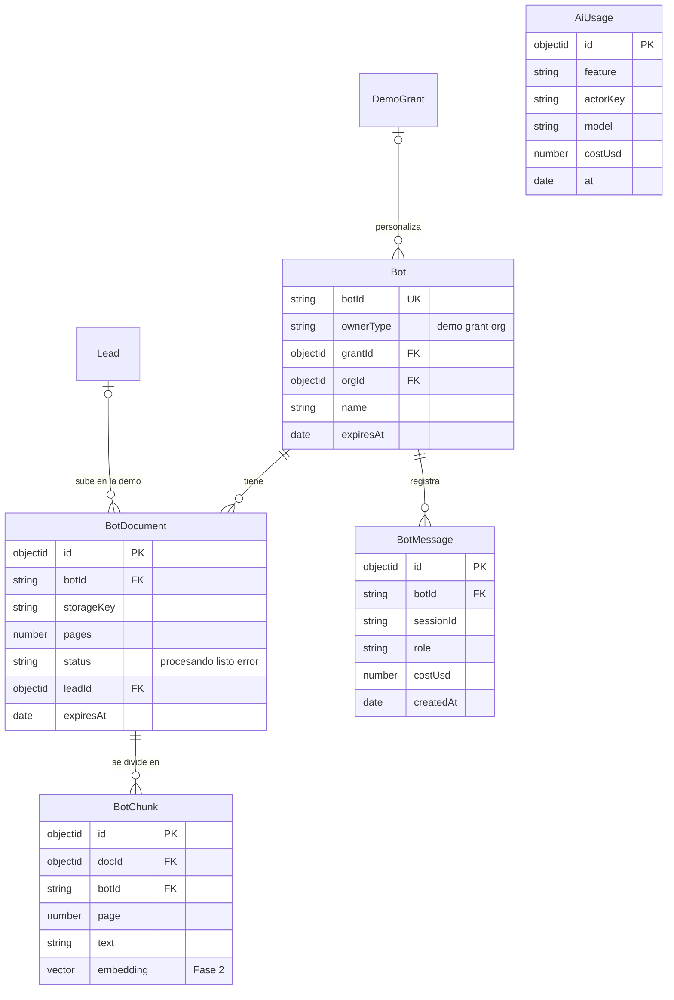
> [Ver diagrama como imagen](images/diagramas/09-Backend-y-API-3.png)

**Contrato de "Prueba con tu documento".**

El comportamiento lo define el dueño: PDF, DOCX o TXT de hasta 5 MB y 30 páginas; solo email y autorización Ley 1581; 10 preguntas por documento; 3 documentos por IP al día; borrado a la hora; tope mensual; respuestas con cita.

Está hecho en la rama `rag-reposicionamiento` (pendiente de merge) como una API propia montada en **`/api/demo-rag`** (`routes/demo-rag.routes.ts` y `services/demo-rag.service.ts`), con el pipeline del chatbot movido a `services/rag-pipeline.ts`. **No usa ticket, cuenta ni `POST /api/contact`:** el email y la autorización viajan con el archivo, y el lead se registra con `services/lead.service.ts`, el mismo servicio del formulario de contacto (`Contact.source = demo-rag`). La misma rama agregó a `chatbot.routes.ts` las reglas para responder solo con los documentos y citar (`GROUNDING_RULES`).

- **Encendido (falla cerrada):** solo funciona con `DEMO_UPLOAD_ENABLED=true`, `OPENAI_API_KEY` y Redis conectado. Si falta algo, o si el gasto del mes llegó a `DEMO_MONTHLY_BUDGET_USD`, la subida y las preguntas responden 503 y la web muestra "Agenda una demo con nosotros".
- **Almacenamiento:** el archivo se recibe en memoria y nunca va a disco. El documento, sus fragmentos y su índice viven en un mapa en memoria con TTL de 1 hora y un barrido periódico; nada va a MongoDB ni al almacenamiento de objetos. Redis guarda solo el cupo diario por IP (con hash) y el gasto del mes.
- **Modelo y costo:** `gpt-4o-mini` fijo. El costo de cada respuesta se calcula con el uso que informa OpenAI y se suma al gasto del mes (mes UTC).
- **Límites extra:** además del cupo diario, hay un límite de solicitudes por IP cada 10 minutos en la subida y en las preguntas. La IP real depende de `TRUST_PROXY_HOPS`.

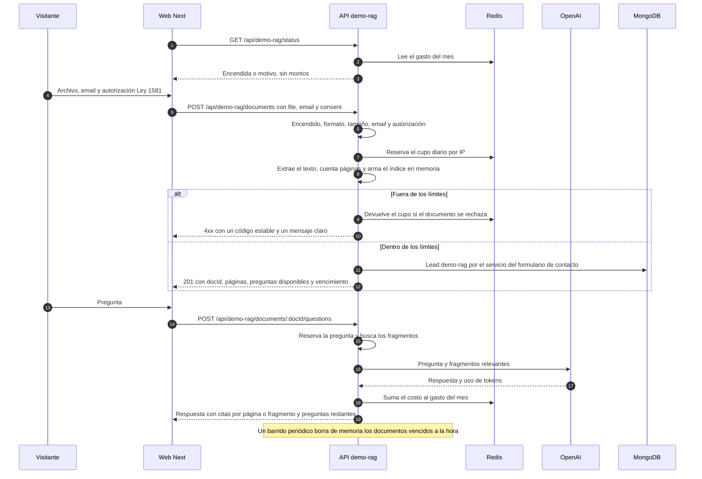
> [Ver diagrama como imagen](images/diagramas/09-Backend-y-API-4.png)

| Endpoint | Acceso | Reglas |
|---|---|---|
| `GET /api/demo-rag/status` | público | Responde si la demo está encendida, el motivo si no lo está (`disabled`, `unavailable` o `budget_exhausted`) y los límites públicos. Nunca expone montos ni se guarda en caché |
| `POST /api/demo-rag/documents` | público, sin ticket | `multipart` con `file`, `email` y `consent=true`. Valida extensión, tipo y contenido real del archivo, ≤ 5 MB y ≤ 30 páginas, email válido y autorización. Cupo de 3 documentos por IP al día. Responde 201 con el documento (`docId`, tipo, unidad de cita, páginas, preguntas usadas y restantes, vencimiento) y registra el lead `demo-rag` sin bloquear la respuesta |
| `GET /api/demo-rag/documents/:docId` | público | Estado del documento (preguntas usadas y vencimiento). 404 si ya se borró |
| `POST /api/demo-rag/documents/:docId/questions` | público | `{question}` de hasta 500 caracteres. Máximo 10 preguntas por documento; una pregunta que falla no se descuenta. Responde `{answer, citations[{page o fragment, excerpt}], notFound, questionsUsed, questionsRemaining}`. Si no hay evidencia, responde "No encontré esa información en el documento." |
| `DELETE /api/demo-rag/documents/:docId` | público | Borra el documento de memoria antes de la hora. La web lo usa cuando el visitante sube otro documento |

Los errores responden `{success: false, code, message}` con códigos estables que la web traduce (por ejemplo `invalid_format`, `file_too_large`, `too_many_pages`, `daily_limit`, `question_limit`, `budget_exhausted` y `demo_disabled`).

Los eventos `demo_upload` y `demo_start` los emite la web con GA4, solo con consentimiento. **Con la Fase 0**, la pasarela de IA registra además el uso en `AiUsage` (`feature = demo_doc`) y el rate-limit pasa al almacén compartido; **con la Fase 2**, la demo usa el núcleo RAG (embeddings y búsqueda híbrida). El documento sigue sin guardarse fuera de la memoria.

#### 3.8 Documentos (gestor documental)

> `/api/documents` · `routes/document.routes.ts`, `controllers/document.controller.ts` (633 líneas), `services/document-ai.service.ts`, `services/storage.service.ts`, `models/Document.ts` · 11 endpoints

- **Qué hace:**
  - subir documentos, con análisis de IA (resumen, etiquetas, entidades) y embedding;
  - listar, buscar por similitud, explicar, carpetas, favoritos, papelera y estadísticas.
- **Estado:**
  - S3 es opcional y, sin credenciales, el archivo queda en disco.
  - La similitud se calcula en memoria sobre todos los documentos.
  - Usa `ada-002`, un modelo distinto del de CUPS.
  - En producción la demo muestra "Error al cargar documentos".
- **Decisión: refactorizar.** Sigue [Gestor documental](Producto-gestor-documental.md), tareas 1–4 y 8.
- **Cambios:**
  1. Separar por **espacio** (`ownerType`: `muestra`, `grant`, `usuario`) y verificar la pertenencia en cada consulta (Fase 0).
  2. **Modo muestra público**, de solo lectura, sobre un corpus sembrado con análisis y embeddings precalculados. Subir, OCR y "explicar" exigen un `DemoGrant` y respetan cupos (Fase 1).
  3. Almacenamiento de objetos obligatorio (Fase 0). Los documentos de un grant revocado o vencido se borran en ≤ 1 h con el job `grant-cleanup`.
  4. La búsqueda pasa al núcleo RAG con un solo modelo de embeddings (Fase 2). `tenantId` y la escala de 50.000 documentos por cliente llegan en la Fase 4 (tarea 15 de Gestor documental).
  5. En la semilla del catálogo, `gestor-documentos` debe llevar `hasRealBackend = true` (sección de integración).

#### 3.9 Portal: proyectos, pedidos, facturas, entregables, mensajes y notificaciones

> `/api/projects`, `/api/orders`, `/api/invoices`, `/api/deliverables`, `/api/messages`, `/api/notifications` · 37 endpoints · `services/project.service.ts` (594 líneas) y 10 modelos

- **Qué hace:** es el portal del cliente que ya existe:
  - proyectos con miembros, tareas y actividad (`ActivityLog`);
  - pedidos con adjuntos y aprobación;
  - facturas con descarga y registro de pago;
  - entregables con aprobación y rechazo;
  - conversaciones y avisos.
- **Estado:**
  - Todas las rutas exigen sesión.
  - La regla de pertenencia por rol (cliente, equipo) no está centralizada.
  - Los adjuntos de pedidos van a `uploads/orders`.
  - El estado `shipped` de `Order` no aplica a software.
  - El pago de facturas no tiene pasarela detrás.
- **Decisión: mantener y refactorizar.**
- **Cambios:**
  1. Política de pertenencia común: `client` ve lo suyo, el equipo según su permiso. Con prueba de integración por recurso (Fase 1, tarea 22).
  2. Adjuntos y entregables en el almacenamiento de objetos, con descarga por URL firmada de 5 minutos.
  3. Campos `Project.quoteId` y `Project.leadId` para trazar la conversión (sección 5.2 de Sistema de demos). `Notification.type` suma `demo`, `lead` y `quote`.
  4. Hasta la Fase 3, el estado de pago de una factura lo registra el equipo (`PATCH /api/admin/invoices/:id/status`).
  5. Fase 3: adaptador de pagos (Wompi o PayU en COP, Stripe en USD) con webhooks firmados (tarea 24).
  6. Migración de `Order.status`: `shipped` pasa a `completed`, y se quita del enum.
  7. Quién crea proyectos y qué ve un `prospect` en el portal se define en [Portal del cliente](06-Portal-del-Cliente.md). El backend lo aplica con permisos.

#### 3.10 Propuestas (`Quote`)

> `/api/quotes` · `routes/quote.routes.ts`, `controllers/quote.controller.ts`, `models/Quote.ts` · 1 endpoint

- **Qué hace:** un POST público que guarda nombre, email, servicio y descripción.
- **Estado:** ninguna página lo usa. El modelo no sirve para una propuesta real: no tiene ítems, montos, moneda ni vigencia.
- **Decisión:**
  - **Fase 0, eliminar** el POST público. Antes se confirma con 30 días de logs que nadie lo llama. La colección se conserva para la migración.
  - **Fase 3, reconstruir** como módulo de propuestas: `Quote` ampliado, rutas de equipo y enlace público con token (sección 8.5 de Sistema de demos), PDF, aceptación y anticipo (tarea 24).
  - En la Fase 1, "Solicitar propuesta" solo crea una tarea (decisión 14 de Sistema de demos).

#### 3.11 Salud: cuentas médicas, auditoría, Ley 100, CUPS, liquidación, glosas y reglas de facturación

> `/api/auditoria` (21), `/api` raíz con `/cuentas`, `/ley100`, `/process`, `/export` (20), `/api/cups` (9), `/api/liquidacion` (8), `/api/reglas-facturacion` (8), `/api/documentos-conocimiento` (4) · 70 endpoints · ≈ 20.000 líneas

- **Qué hace:** auditoría de cuentas médicas.
  - Ingesta de PDF, extracción con IA (texto y visión), validaciones, motor de reglas y cálculo de glosas.
  - Auditoría paso a paso, decisión asistida por un modelo grande y retroalimentación para el aprendizaje.
  - Consulta de catálogos (CUPS, CIE-10, medicamentos, tarifarios).
  - Liquidación de radicados y exportes en Excel.
- **Estado:**
  - Es el mayor activo técnico, pero:
    - está fragmentado (3 controladores de auditoría, 5 extractores, 4 generadores de Excel);
    - procesa dentro de la petición;
    - guarda archivos en disco;
    - tiene referencias a un pagador real;
    - no tiene pruebas.
  - La demo `/demo/cuentas-medicas` solo usa `/auditoria/*` y `/documentos-conocimiento/*`.
  - `/cuentas`, `/ley100`, `/process` y `/export` solo las llaman páginas internas (`/test`).
  - `/liquidacion` y `/reglas-facturacion` solo las llaman las páginas huérfanas `/liquidacion`.
  - Hay seeds (≈ 2.600 líneas en `db/seeds/`) y *scrapers* de catálogos oficiales (≈ 2.100 líneas) que ningún script de `package.json` ejecuta.
- **Decisión: mover a un servicio aparte, por etapas.** Se mantiene como producto vertical ([Demo cuentas médicas](Demo-cuentas-medicas.md)).
- **Cambios por fase:**

| Fase | Cambio |
|---|---|
| 0 | Autenticación y autorización en todas las rutas del dominio; topes de IA (tarea 4 de esta página y tarea 1 de Demo cuentas médicas). Archivos y exportes al almacenamiento de objetos. Decisiones de IA en la colección `AiDecision` (con retención) en lugar de `data/decisiones-ia/` |
| 1 | `requireDemoGrant('cuentas-medicas')` en `/auditoria/*` y `/documentos-conocimiento/*`. Las rutas sin consumidor en el catálogo (`/cuentas`, `/ley100`, `/process`, `/export`, `/liquidacion`, `/reglas-facturacion`) quedan **solo para el equipo** (permiso `salud.interno`) hasta consolidarse. Verificación de salud y estados vacíos amables (tarea 4 de Demo cuentas médicas) |
| 2 | Consolidar en `src/modules/salud/`, con un solo flujo: ingesta → cola → extracción → validación → reglas → propuesta de glosa → revisión del auditor → reporte (tarea 8 de Demo cuentas médicas). Detalle: <br>• montaje bajo `/api/salud/*`, con alias de las rutas viejas por una versión y cabecera `Deprecation`; <br>• procesamiento en el worker, de modo que la API responde `202` con un `jobId`; <br>• un solo generador de Excel; <br>• convenios y tarifarios configurables (`ConvenioTarifa`, `Tarifario`); <br>• la consulta de Ley 100 (`rag.service.ts`) pasa a ser la "Consulta normativa con citas" sobre el núcleo RAG; <br>• `SALUD_ENABLED` decide si el módulo se carga |
| 3 y siguientes | **Instancia dedicada por cliente**: la misma imagen desplegada con `SALUD_ENABLED=true`, con su propia base de datos, bucket y credenciales. La API comercial de KopTup no guarda datos de pacientes de clientes |

Además:
- Seeds y *scrapers* pasan a `apps/backend/tools/salud/` (fuera del build), con `npm run seed:salud` documentado.
- `models/CUPSEquivalencia.ts` (sin uso) se elimina.
- Los modelos maestros que hoy solo usan las seeds (`EPSMaestro`, `IPSMaestro`, `ConvenioTarifa`, `CuotaModeradora`, `Autorizacion`) se conservan para la tarea 7 de Demo cuentas médicas.

#### 3.12 Sistema experto (motor de reglas)

> `/api/expert` · `routes/expert-system.routes.ts`, `controllers/expert-system.controller.ts`, `services/expert-system.service.ts` (596), `expert-rules.service.ts` (450), `excel-expert.service.ts` (393) · 6 endpoints

- **Qué hace:** procesa facturas con reglas, genera Excel, lee y actualiza la configuración del motor y da estadísticas. Su demo también usa la búsqueda semántica de CUPS.
- **Estado:**
  - La configuración no se guarda por espacio.
  - Las reglas están repartidas entre el código, `ReglaAuditoria` y `ReglaFacturacion`.
  - En producción la demo muestra todo en 0.
- **Decisión: mover** al módulo de salud como pestaña "Motor de reglas" ([Demo sistema experto](Demo-sistema-experto.md), tareas 4–6).
- **Cambios:**
  - **Fase 1:** `requireDemoGrant('sistema-experto')` en `/api/expert/*` y en `/api/cups/estadisticas`, `/estadisticas-vectorizacion` y `/buscar-semantica`.
  - **Fase 2:** catálogo único de reglas versionado, configuración persistente por espacio con historial, y migración de los accesos a `cuentas-medicas`.
  - Las rutas de importación y vectorización de CUPS (`/importar-*`, `/vectorizar`, `/revectorizar`) son tareas de operación: solo `admin`.

#### 3.13 Gestor de contenido con IA

> `/api/content` · `routes/content-manager.routes.ts`, `services/content-manager.service.ts` · 5 endpoints (`improve`, `change-tone`, `adjust-length`, `generate-versions`, `generate`)

- **Qué hace:** mejora, cambia el tono, ajusta la longitud y genera textos y versiones para la demo `/demo/gestor-contenido`, oferta `cms-headless` (ver [CMS headless](Producto-cms-headless.md)).
- **Estado:** valida con `express-validator`. El modelo se elige por variable o queda `gpt-4o-mini`. Sus límites de uso pasan a la pasarela de IA.
- **Decisión: mantener**, detrás de la pasarela de IA.
- **Cambios:**
  - **Fase 0:** pasarela de IA con cupo anónimo por IP (por defecto 10 acciones al día, configurable), cupo por grant (`quotas.aiActionsPerDay`) y tope mensual por función (tarea 5).
  - **Fase 1:** zod, límite de longitud de entrada y `hasRealBackend = true` en la semilla del catálogo (tarea 18).
  - **Fase 2:** mover a `src/modules/content-ai/`.

#### 3.14 Módulos en memoria (`src/modules/`)

> 18 carpetas: `automation`, `code-review`, `crm`, `delivery`, `e-invoicing`, `e-signature`, `erp`, `helpdesk`, `hrms`, `lms`, `loyalty`, `moderation`, `pos`, `saas-platform`, `scraping`, `telemedicine`, `voice-ai`, `wms` · 125 archivos · ≈ 3.440 líneas · 126 endpoints · 14 pruebas

- **Qué hace:** CRUD sobre arreglos en memoria con datos de ejemplo (`_shared/crud.ts`).
- **Estado:**
  - Ninguno está montado en `index.ts`, y ninguna demo los llama: todas usan datos simulados en el frontend.
  - Sus 14 pruebas no corren.
- **Decisión: eliminar** en la Fase 0.
  - Se crea la etiqueta `archivo/modulos-en-memoria` antes de borrar.
  - Cuando una de esas soluciones se vuelva producto real (Fase 4 o por proyecto), se construye sobre el núcleo multi-tenant y no sobre estos arreglos.
  - La carpeta `src/modules/` queda libre para los módulos de producto de la Fase 2.

#### 3.15 Rutas de prueba y chat heredado

| Elemento | Qué es | Decisión |
|---|---|---|
| `routes/test.routes.ts` | Pruebas de mensajería | **Eliminar** de producción. Se reemplaza por el script `scripts/notify-smoke.ts`, que se corre desde la consola de Railway |
| Rutas de prueba de `contact.routes.ts` | Pruebas de proveedor | **Eliminar** |
| `/api/chat` (`chat.routes.ts`, `chat.controller.ts`, `ChatSession`, `ChatMessage`) | Chat anónimo que responde un eco | **Eliminar**, junto con `sendChatMessage` y `createChatSession` de `apps/web/src/lib/api.ts` |
| Página web `/test` | Página interna que llama a APIs | **Eliminar** de la web de producción (ver [Seguridad y calidad](10-Seguridad-y-Calidad.md)) |

#### 3.16 Privacidad, bitácora y métricas (nuevos)

Son parte de la Fase 1 (Sistema de demos, secciones 5, 13 y 14). En el backend agregan:

- `AuditLog` y `services/audit.service.ts`. Solo se agregan registros; ningún endpoint los edita ni los borra.
- `PrivacyRequest`, `controllers/privacy.controller.ts` y el job `privacy-retention`.
- `controllers/metrics.controller.ts`, con `GET /api/metrics/demo-funnel` y `GET /api/metrics/admin-home`.
  - Las consultas de agregación usan índices.
  - El inicio del panel guarda una caché de 30 s en Redis o, si no hay Redis, en memoria.

### 4. Componentes nuevos del sistema de demos en el backend

Dónde vive cada pieza. Los nombres y archivos son los de [Sistema de demos](04-Sistema-de-Demos.md), sección 17.

| Capa | Archivos | Notas de esta página |
|---|---|---|
| Modelos | `models/{Lead,LeadActivity,ConsentRecord,DemoCatalogItem,DemoRequest,DemoGrant,DemoEvent,MagicLinkToken,AuditLog,OutboundMessage,JobRun,PrivacyRequest}.ts` | Más los de esta página: `AuthSession`, `AiUsage`, `AiDecision`, `WebhookEvent`, `Migration`, y `Bot`, `BotDocument`, `BotChunk`, `BotMessage` |
| Configuración | `config/permissions.ts`, `config/scoring.ts`, `config/env.ts`, `config/openapi.ts` | `permissions.ts` también genera `permissions.generated.ts` para la web (tarea 3 de Panel de administración) |
| Middlewares | `middleware/auth.ts` (`authenticate`, `optionalAuthenticate`, `requirePermission`), `middleware/requireDemoGrant.ts`, `middleware/rateLimiter.ts` (almacén compartido), `middleware/validate.ts` (zod), `middleware/requestId.ts`, `middleware/internalApiKey.ts` | `requireDemoGrant` acepta uno o varios slugs (por ejemplo, CUPS compartido entre dos demos) |
| Servicios | `demo-state`, `demo-access`, `lead-scoring`, `sla`, `magic-link`, `audit`, `turnstile`, `notification-dispatcher`, `email`, `whatsapp`, `storage`, `ai-gateway` | `ai-gateway` y `storage` son nuevos de esta página |
| Rutas | `routes/{demo-catalog,demo-requests,demo-grants,demo-access,demo-events,leads,metrics,audit-log,privacy,me,webhooks}.routes.ts` | Se registran en `app.ts` en el mismo orden de la tabla de la sección 14 |
| Jobs | `jobs/{index,lease,outbox-dispatcher,grant-lifecycle,invitations-reminder,sla-monitor,usage-rollup,daily-digest,privacy-retention}.ts` | Esta página agrega `grant-cleanup`, `exports-cleanup` y `ai-budget-watch` (sección 6) |
| Plantillas | `templates/demo/*`, `templates/cuenta/*` | Las de cuenta vienen de [Autenticación](Seccion-Autenticacion.md), tarea 19 |
| Scripts | `scripts/{seed-demo-catalog,migrate-roles,backfill-leads,set-admin}.ts` | Corren como migraciones registradas (sección 13) |

**Pasarela de IA (`services/ai-gateway.service.ts`).**

- **Interfaz:** `ai.complete({feature, actor, model?, messages, maxTokens})`, `ai.embed({feature, actor, texts})` y `ai.vision(...)`.
  - `feature` puede ser `chatbot`, `demo_doc`, `content`, `documents`, `salud`, `linkedin` o `rules`.
  - `actor` es `{userId?, grantId?, ipHash?}`.
- **Antes de llamar al proveedor:**
  - Verifica el cupo del actor, el tope mensual de la función y el global, y el interruptor de la función.
  - Si algo no alcanza, lanza `AppError(429, 'presupuesto_agotado')` o `limite_excedido`.
- **Después de llamar:** registra `AiUsage` con los tokens, el costo en USD (tabla de precios en `config/ai-pricing.ts`), el modelo y la latencia.
- **Modelos por variable de entorno:**
  - `AI_MODEL_FAST` (respuestas de demo, contenido);
  - `AI_MODEL_SMART` (auditoría, reglas);
  - `AI_MODEL_VISION`;
  - `AI_EMBEDDING_MODEL` (uno solo para todo).
- **Alertas:** el job `ai-budget-watch` avisa al admin al 80 % y al 100 % del tope. `GET /api/admin/jobs/health` muestra el gasto del mes por función.
- **Ruta de LinkedIn Ads:** se queda en Next con el pase de demo ([Demo LinkedIn Ads](Demo-linkedin-ads.md), tarea 1), pero reporta su consumo con `POST /api/internal/ai-usage`, con la cabecera interna. Así el tope mensual es uno solo.

### 5. Mensajería unificada (email, WhatsApp, Slack y avisos en la app)

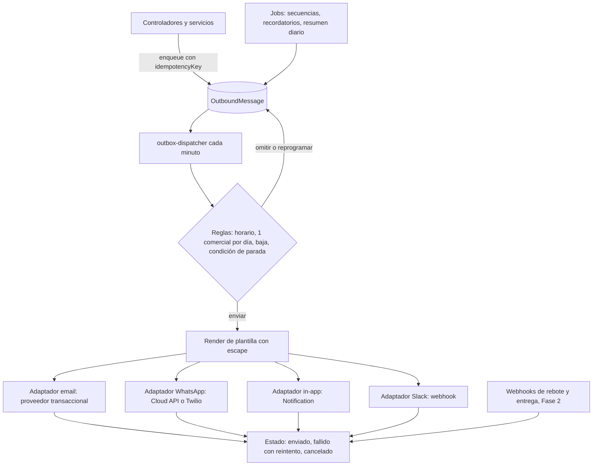
> [Ver diagrama como imagen](images/diagramas/09-Backend-y-API-5.png)

- **Una sola entrada.** `notify.enqueue({channel, templateKey, to, vars, leadId?, userId?, grantId?, scheduledAt?, idempotencyKey})`.
  - Ningún controlador vuelve a llamar a `emailService` o `whatsappService` directamente.
  - Se migran los envíos actuales: contacto, pedidos y restablecimiento de contraseña.
- **Adaptadores** en `services/channels/`, con la misma interfaz `send(message) → {providerMessageId}`. Son intercambiables por variable de entorno (`EMAIL_PROVIDER`, `WHATSAPP_PROVIDER`).
- **Reglas** (sección 11 de Sistema de demos):
  - horario de 8:00 a 19:00, hora de Bogotá;
  - máximo un mensaje comercial por Lead al día;
  - condiciones de parada de las secuencias;
  - lista de supresión: bajas y correos rebotados.
- **Datos personales:**
  - El WhatsApp al equipo nunca lleva el email ni el teléfono del prospecto.
  - El WhatsApp al prospecto solo sale con su autorización (`whatsappOptIn`) y con una plantilla aprobada.
- **Webhooks de proveedores** (Fase 2): `POST /api/webhooks/email` y `POST /api/webhooks/whatsapp`, con firma verificada. Marcan rebotes y entregas, y suprimen direcciones inválidas.
- **Salud:** conteos de `programado`, `fallido` y `enviado` en las últimas 24 h, en `GET /api/admin/jobs/health`, con alerta si hay más de 5 fallidos en una hora.
- **Plantillas en el código**, en español con "tú" e inglés cuando el Lead tenga `locale = en`. En la Fase 2 se pueden editar desde el panel (`MessageTemplate`).

### 6. Jobs y worker

**Fase 1: dentro de la API.**
- `node-cron` arranca después de conectar a MongoDB y solo si `JOBS_ENABLED=true`.
- Cada job toma un *lease* en `JobRun`, así que es seguro con varias instancias.
- Son los 8 jobs de la sección 12 de Sistema de demos, más estos:

| Job | Frecuencia | Acción | Prioridad |
|---|---|---|---|
| `grant-cleanup` | Cada hora | Borra los datos y archivos de los espacios de demo (documentos, bots personalizados, lotes de salud) de grants `revocado`, o `expirado` hace más de 30 días | P1 |
| `exports-cleanup` | Diario | Respaldo del ciclo de vida del bucket: borra los exportes de más de 7 días y sus referencias | P2 |
| `ai-budget-watch` | Cada hora | Suma `AiUsage` del mes por función y avisa al 80 % y al 100 % del tope | P0 |

**Fase 2: worker aparte con colas.**

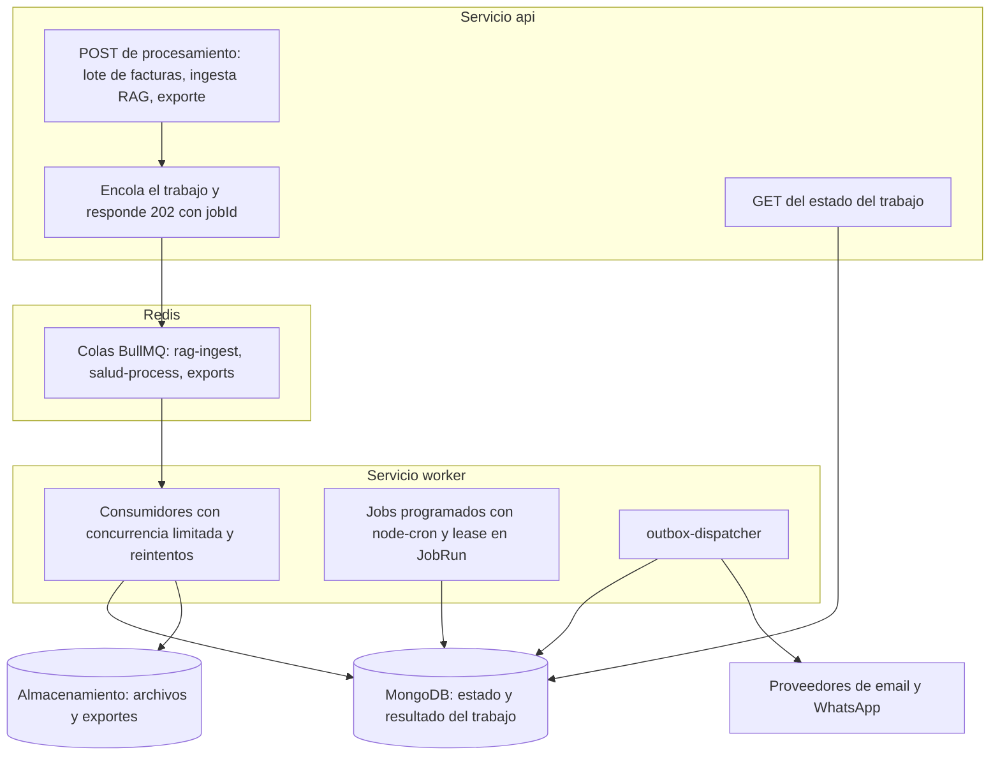
> [Ver diagrama como imagen](images/diagramas/09-Backend-y-API-6.png)

- **Arranque.** `src/worker.ts` comparte modelos y servicios con la API. En Railway es un segundo servicio desde la misma imagen (`node dist/worker.js`), con `JOBS_ENABLED=true`. La API pasa a `JOBS_ENABLED=false`.
- **Colas:**
  - `rag-ingest`: documentos de bots y del gestor documental;
  - `salud-process`: lotes de facturas;
  - `exports`: Excel y PDF.
- **Comportamiento:** cada trabajo guarda su estado en `ProcessingJob` (`encolado`, `procesando`, `listo`, `fallido`, más progreso y resultado). Se reintenta 3 veces con espera creciente y tiene un tiempo máximo por tipo.
- **Efecto en la API:** al terminar la migración, `server.timeout` vuelve a los valores por defecto (`index.ts` líneas 264–269). Ninguna petición HTTP dura más de 30 s.

### 7. Persistencia y almacenamiento

**MongoDB.**

- **Réplica obligatoria** para las transacciones. En desarrollo, `docker-compose.dev.yml` levanta `mongo:7` con `--replSet rs0` y un script de inicio.
- **Copias de seguridad diarias** y restauración a un punto en el tiempo. La restauración se prueba una vez por trimestre y queda documentada en la página de operación.
- **Un usuario de base por entorno**, con permisos mínimos.
- **Índices** de Sistema de demos (sección 5), más:
  - `AuthSession {userId, revokedAt}` y TTL en `expiresAt`;
  - `AiUsage {feature, at}` y `{actorKey, at}`, con TTL de 13 meses;
  - `BotChunk {botId}` e índice vectorial de Atlas sobre `embedding` (Fase 2);
  - `Document {ownerType, ownerId, is_deleted}`;
  - `WebhookEvent {provider, eventId}` único.
- **Retenciones con TTL**, alineadas con la sección 14 de Sistema de demos: `DemoEvent` 13 meses, `BotMessage` de demo 90 días y `AiDecision` 24 meses. Los documentos de "Prueba con tu documento" no llegan a MongoDB: viven solo en memoria 1 hora (sección 3.7).
- **Migraciones:**
  - archivos `scripts/migrations/NNN-nombre.ts`, registrados en la colección `Migration`;
  - se ejecutan con `npm run migrate` como comando previo al despliegue en Railway;
  - todas idempotentes y con `--dry-run`.

**Almacenamiento de objetos** (`services/storage.service.ts` ampliado).

- **Bucket privado:**
  - acceso público bloqueado;
  - cifrado del lado del servidor;
  - versión desactivada para los prefijos temporales.
- **API del servicio:** `put({prefix, key, body, contentType, expiresAt?})`, `getSignedUrl(key, 300)`, `delete(key)` y `deletePrefix(prefix)`.
- **Validaciones de los archivos subidos:**
  - extensión **y** firma real del contenido;
  - tamaño máximo por ruta;
  - nombre generado por el servidor, nunca el del usuario.
- **Variables:** se conservan las variables `AWS_*` actuales, más `S3_ENDPOINT` (opcional) para un proveedor compatible.
- **Datos de salud de clientes reales:** bucket dedicado por cliente (instancia dedicada).

| Prefijo | Contenido | Ciclo de vida | Antes en |
|---|---|---|---|
| `documents/{ownerType}/{ownerId}/` | Gestor documental | Hasta que se borre; los de grants vencidos se borran con `grant-cleanup` | `uploads/` o S3 opcional |
| `orders/{orderId}/` | Adjuntos de pedidos | Indefinido | `uploads/orders` |
| `deliverables/{projectId}/` | Entregables | Indefinido | — |
| `chatbot/{botId}/` | Documentos de bots | Hasta que se borre el bot; los bots de demo vencen | Base64 en memoria y `uploads/chatbot` |
| `salud/{spaceId}/` | Lotes de facturas, soportes y documentos de conocimiento | Según el grant o el contrato | `uploads/cuentas-medicas`, `uploads/ley100` |
| `exports/` | Excel y PDF generados | 7 días | `uploads/exports` |
| `quotes/` | PDF de propuestas (Fase 3) | Indefinido | — |

**Qué sale del disco:**

| Hoy | Destino | Fase |
|---|---|---|
| `uploads/*` | Almacenamiento de objetos. Los temporales del procesamiento van a `os.tmpdir()` y se borran al terminar cada trabajo | 0 |
| `data/chatbots/state.json` | `Bot`, `BotDocument`, `BotChunk` y `BotMessage` | 0 |
| `data/decisiones-ia/*.json` | `AiDecision`. Los 30 archivos versionados se quitan del repositorio y `data/` entra al `.gitignore` | 0 |
| `logs/*.log` | Salida estándar en JSON, que recoge Railway, más un destino de logs externo con retención | 0 |
| Refresco y restablecimiento en Redis | `AuthSession` y `MagicLinkToken` en MongoDB | 0 (P1) |
| Rate-limit en memoria | Redis, con memoria como respaldo | 0 |

### 8. Redis

| Uso | Fase | Si Redis no está disponible |
|---|---|---|
| Almacén del rate-limit (`rate-limit-redis`) por IP, email y usuario | 0 | Cae a memoria por instancia y deja una advertencia en el log. La API sigue respondiendo |
| Cupo diario por IP y gasto del mes de "Prueba con tu documento" (hecho en la rama `rag-reposicionamiento`, pendiente de merge, con el cliente actual `config/redis.ts`) | 1 | La subida y las preguntas quedan apagadas (falla cerrada); la demo con el documento de ejemplo sigue funcionando |
| Caché: modos del catálogo (60 s), inicio del panel (30 s), tabla de precios de IA | 1 | Se calcula en cada petición |
| Colas BullMQ | 2 | El worker no procesa; la API responde `503 cola_no_disponible` en los endpoints que encolan. Alerta inmediata |
| Sesiones, tokens de un solo uso | **Nunca** | — (viven en MongoDB) |

- **En Railway:** el plugin de Redis en la misma red privada, con una contraseña que solo conoce el entorno.
- **En desarrollo:** el `redis:7-alpine` de `docker-compose.dev.yml`.
- **Cliente:** `config/redis.ts` se reescribe para que no esconda los errores en silencio.
  - Expone `isAvailable()`.
  - Usa la conexión de `ioredis` que comparte BullMQ.
  - Cada uso declara su respaldo.

### 9. Configuración y variables de entorno (zod)

`src/config/env.ts` es el **único** lugar donde se lee `process.env`. Hay una regla de ESLint (`no-restricted-properties`) que impide usarlo en otros archivos. En producción, el servidor no arranca si falta una variable obligatoria o si una variable tiene un formato inválido. El mensaje de error nombra la variable, nunca su valor.

```ts
// apps/backend/src/config/env.ts (esqueleto)
import { z } from 'zod';

const list = z.string().default('').transform((s) => s.split(',').map((x) => x.trim()).filter(Boolean));
const flag = z.enum(['true', 'false']).default('false').transform((v) => v === 'true');

const EnvSchema = z.object({
  NODE_ENV: z.enum(['development', 'test', 'production']).default('development'),
  PORT: z.coerce.number().int().default(3001),
  API_URL: z.string().url(),
  FRONTEND_URL: z.string().url(),
  CORS_ORIGIN: list,
  TRUST_PROXY: z.coerce.number().int().default(1),
  MONGODB_URI: z.string().min(1),
  REDIS_URL: z.string().optional(),
  JWT_SECRET: z.string().min(32),
  COOKIE_DOMAIN: z.string().optional(),
  INTERNAL_API_KEY: z.string().min(32),
  TURNSTILE_SECRET_KEY: z.string().min(1),
  OPENAI_API_KEY: z.string().optional(),
  ANTHROPIC_API_KEY: z.string().optional(),
  AI_MODEL_FAST: z.string().min(1),
  AI_MODEL_SMART: z.string().min(1),
  AI_EMBEDDING_MODEL: z.string().min(1),
  AI_MONTHLY_BUDGET_USD: z.coerce.number().positive(),
  DEMO_MONTHLY_BUDGET_USD: z.coerce.number().positive(),
  JOBS_ENABLED: flag,
  SALUD_ENABLED: flag,
  API_DOCS_ENABLED: flag,
  // ... almacenamiento, email, WhatsApp, avisos comerciales y observabilidad (tabla de abajo)
});

export type Env = z.infer<typeof EnvSchema>;

export function loadEnv(source: NodeJS.ProcessEnv = process.env): Env {
  const parsed = EnvSchema.safeParse(source);
  if (!parsed.success) {
    const names = parsed.error.issues.map((i) => i.path.join('.')).join(', ');
    throw new Error(`Configuración inválida o incompleta: ${names}`);
  }
  return parsed.data;
}

export const env = loadEnv();
```

**Además:**
- `npm run env:example` genera `.env.example` desde el esquema, solo con nombres y descripciones.
- CI falla si el archivo no coincide con el esquema.
- Las variables de la web (`DEMO_PASS_SECRET`, `DEMO_GATE_ENABLED`, `NEXT_PUBLIC_BOOKING_URL`, `NEXT_PUBLIC_TURNSTILE_SITE_KEY`) tienen su propio esquema en `apps/web/src/config/env.ts`.

| Grupo | Variables | Obligatoria en producción | Cambio |
|---|---|---|---|
| Núcleo | `NODE_ENV`, `PORT`, `API_URL`, `FRONTEND_URL`, `CORS_ORIGIN`, `TRUST_PROXY`, `LOG_LEVEL` | Sí (salvo `LOG_LEVEL`) | `TRUST_PROXY` y `LOG_LEVEL` son nuevas. La rama `rag-reposicionamiento` ya usa `TRUST_PROXY_HOPS` con el mismo fin (ver la nota de abajo) |
| Base de datos | `MONGODB_URI` | Sí | Se elimina `MONGO_URI` (duplicada) |
| Redis | `REDIS_URL` | Desde la Fase 1 para "Prueba con tu documento" (sin Redis queda apagada); para las colas, desde la Fase 2 | — |
| Autenticación | `JWT_SECRET`, `JWT_EXPIRES_IN`, `COOKIE_DOMAIN`, `GOOGLE_CLIENT_ID`, `GOOGLE_CLIENT_SECRET`, `GOOGLE_CALLBACK_URL`, `INTERNAL_API_KEY` | Sí (Google, si se usa) | `JWT_REFRESH_SECRET` y `JWT_REFRESH_EXPIRES_IN` se retiran cuando el refresco sea opaco en `AuthSession` |
| Anti-abuso | `TURNSTILE_SECRET_KEY`, `RATE_LIMIT_WINDOW_MS`, `RATE_LIMIT_MAX_REQUESTS` | Sí | `TURNSTILE_SECRET_KEY` es nueva |
| IA | `OPENAI_API_KEY`, `ANTHROPIC_API_KEY`, `AI_MODEL_FAST`, `AI_MODEL_SMART`, `AI_MODEL_VISION`, `AI_EMBEDDING_MODEL`, `AI_MONTHLY_BUDGET_USD`, `DEMO_MONTHLY_BUDGET_USD`, `AI_DISABLED_FEATURES` | Los topes y los modelos, sí | `OPENAI_MODEL` se reemplaza por `AI_MODEL_FAST`. Se eliminan `PINECONE_*` |
| Almacenamiento | `AWS_S3_BUCKET`, `AWS_REGION`, `AWS_ACCESS_KEY_ID`, `AWS_SECRET_ACCESS_KEY`, `S3_ENDPOINT`, `MAX_FILE_SIZE` | Sí (salvo `S3_ENDPOINT`) | Pasa de opcional a obligatorio. `ALLOWED_FILE_TYPES` se reemplaza por una lista por ruta en el código |
| Email | `EMAIL_PROVIDER`, `EMAIL_FROM`, `EMAIL_API_KEY` o `SMTP_HOST`, `SMTP_PORT`, `SMTP_USER`, `SMTP_PASS`, `SMTP_SECURE` | Sí | `EMAIL_PROVIDER` y `EMAIL_API_KEY` son nuevas. Sin valores por defecto en el código |
| WhatsApp | `WHATSAPP_PROVIDER`, `WHATSAPP_API_TOKEN`, `WHATSAPP_PHONE_NUMBER_ID`, `TWILIO_ACCOUNT_SID`, `TWILIO_AUTH_TOKEN`, `TWILIO_WHATSAPP_NUMBER` | Si `WHATSAPP_PROVIDER` está definido | Se eliminan `ULTRAMSG_*`. `ADMIN_WHATSAPP_NUMBER` pasa a ser `SALES_WHATSAPP_TO` |
| Comercial y demos | `SALES_NOTIFY_EMAILS`, `SALES_WHATSAPP_TO`, `SLACK_WEBHOOK_URL`, `PRIVACY_POLICY_VERSION`, `JOBS_ENABLED`, `BOOKING_WEBHOOK_SECRET` | Las dos primeras y `PRIVACY_POLICY_VERSION` | `ADMIN_EMAIL` se elimina: los destinatarios van en `SALES_NOTIFY_EMAILS` y el rol admin se asigna con `set-admin.ts` |
| Pagos (Fase 3) | `WOMPI_*` o `PAYU_*`, `STRIPE_SECRET_KEY`, `STRIPE_WEBHOOK_SECRET` | En la Fase 3 | Nuevas |
| Observabilidad | `SENTRY_DSN`, `SENTRY_ENVIRONMENT` | Sí | Nuevas |
| Módulos | `SALUD_ENABLED`, `API_DOCS_ENABLED` | No | Nuevas |
| Solo scripts | `SEED_ADMIN_PASSWORD`, `SEED_CLIENT_PASSWORD` | No | Salen del esquema del servidor; las lee solo el script de semilla de desarrollo |

Las variables que la rama `rag-reposicionamiento` (hecho, pendiente de merge) agrega al backend (`DEMO_UPLOAD_ENABLED`, `DEMO_MONTHLY_BUDGET_USD`, `TRUST_PROXY_HOPS` y `DEMO_RAG_TTL_SECONDS`, esta última solo para pruebas locales) y dónde se configura cada una están en [Reposicionamiento RAG](13-Reposicionamiento-RAG.md#variables-de-entorno). El esquema zod las incorpora; como `TRUST_PROXY_HOPS` cumple la función de `TRUST_PROXY`, se deja un solo nombre.

### 10. Estructura de carpetas objetivo

```text
apps/backend/
├── src/
│   ├── app.ts                  # createApp(): middlewares, rutas, 404 y errores (sin listen)
│   ├── server.ts               # conecta MongoDB, escucha el puerto y arranca jobs si JOBS_ENABLED
│   ├── worker.ts               # Fase 2: consumidores BullMQ y jobs programados
│   ├── config/                 # env.ts, permissions.ts, scoring.ts, ai-pricing.ts, openapi.ts, cors.ts
│   ├── middleware/             # auth, requireDemoGrant, rateLimiter, validate, requestId, internalApiKey, upload, errorHandler
│   ├── schemas/                # esquemas zod por recurso; fuente de la validación y del OpenAPI
│   ├── models/                 # plataforma: User, AuthSession, Lead, DemoRequest, DemoGrant, Project, Order...
│   ├── routes/                 # un archivo por recurso de plataforma (demo-requests, leads, me, webhooks...)
│   ├── controllers/            # un controlador por recurso; sin lógica de negocio
│   ├── services/               # demo-access, demo-state, magic-link, audit, ai-gateway, storage, notification-dispatcher...
│   │   └── channels/           # adaptadores email, whatsapp, inapp, slack
│   ├── jobs/                   # outbox-dispatcher, grant-lifecycle, grant-cleanup, ai-budget-watch...
│   ├── templates/              # demo/ y cuenta/ (ES y EN)
│   ├── modules/                # Fase 2: productos autocontenidos
│   │   ├── rag-core/           # ingesta, fragmentos, embeddings, búsqueda híbrida, citas
│   │   ├── chatbot/            # bots, demo-rag, conversaciones
│   │   ├── documents/          # gestor documental
│   │   ├── content-ai/         # asistente de contenido
│   │   └── salud/              # cuentas médicas, auditoría, CUPS, Ley 100, liquidación, reglas, motor de reglas
│   ├── scripts/                # set-admin, seed-demo-catalog, notify-smoke, migrations/NNN-*.ts
│   ├── utils/                  # business-hours (festivos CO), email-risk, hash, money
│   └── __tests__/              # integración con supertest, factories y fixtures
├── tools/                      # fuera del build: scrapers de catálogos oficiales y seeds de salud
├── openapi.json                # generado en CI
└── jest.config.ts
```

**Reglas:**
- Cada módulo de `modules/` expone un `register(app, deps)` que monta sus rutas.
- Un módulo no importa los internos de otro; solo su `index.ts`.
- Los controladores no tocan modelos: llaman a servicios.
- Las pruebas viven junto al código (`*.test.ts`) o en `__tests__/`.
- `tsconfig.json` pasa a `strict: true` para `routes/`, `controllers/`, `services/`, `schemas/` y `modules/`. Para el código heredado de salud se usa un `tsconfig.legacy.json` hasta su consolidación.

### 11. Convenciones de la API

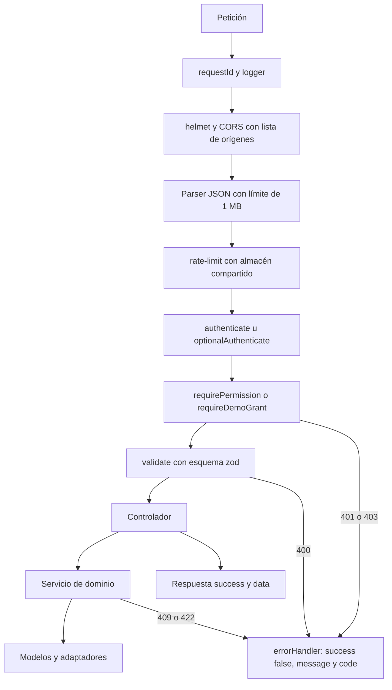
> [Ver diagrama como imagen](images/diagramas/09-Backend-y-API-7.png)

| Tema | Convención |
|---|---|
| Respuestas | `{ success: true, data }` o `{ success: false, message, code, errors? }`, que es el formato actual |
| Códigos de error estables | `validacion`, `sin_sesion`, `sin_permiso`, `no_existe`, `transicion_invalida`, `regla_negocio`, `limite_excedido`, `presupuesto_agotado`, `cuenta_inactiva`, `email_no_verificado`, `demo_desactivada`, `cola_no_disponible`. La web traduce por `code` (ES y EN); `message` es solo para logs y depuración |
| HTTP | 400 validación · 401 sin sesión · 403 sin permiso · 404 no existe · 409 transición o estado ya cambiado · 413 archivo grande · 422 regla de negocio · 429 límite o presupuesto · 503 dependencia caída |
| Paginación | `?page=1&limit=25` (máximo 100) y respuesta `data: { items, total, page, limit }`. Orden con `?sort=campo` o `-campo`, solo sobre campos permitidos |
| Fechas y dinero | ISO 8601 en UTC. Los plazos hábiles se calculan en `America/Bogota`. El dinero va en enteros: COP en pesos, USD en centavos, siempre con `currency` |
| Idempotencia | Las transiciones usan una precondición de estado (409 si ya cambió). Los `POST` de creación desde la web aceptan la cabecera `Idempotency-Key`, que se guarda 24 h |
| Llamadas externas | Siempre con tiempo máximo: Turnstile 3 s, consulta de MX 2 s, email 10 s, IA 60 s en la API (más en el worker) |
| Registros técnicos | Sin emails, teléfonos ni contenido de documentos. Se registran ids, `requestId` y la IP en hash |
| Cabeceras | Respuestas con `X-Request-Id`. Las rutas obsoletas devuelven `Deprecation` y `Sunset`. El dominio de la API envía `X-Robots-Tag: noindex` |

### 12. Swagger / OpenAPI

- **Hoy:** `swagger-jsdoc` lee comentarios de `src/routes/*.ts` y `swagger-ui-express` los sirve desde el mismo backend. Solo 9 de 22 archivos tienen anotaciones, sin los esquemas de respuesta. El cliente de la web se escribe a mano.
- **Objetivo:**
  1. **Esquemas zod en `src/schemas/`.** Cada ruta nueva declara `body`, `query`, `params` y la respuesta. El middleware `validate(schema)` los usa para validar.
  2. **Registro OpenAPI** (`config/openapi.ts`, con `@asteasolutions/zod-to-openapi`).
     - Cada esquema se registra con su ruta, método, permiso requerido (extensión `x-permission`) y ejemplos.
     - Esquemas de seguridad: cookie de sesión y cabecera interna.
  3. **`npm run openapi`** escribe `openapi.json`.
     - CI lo regenera y falla si hay diferencias sin confirmar.
     - CI también falla si una ruta montada no tiene esquema (`scripts/check-routes.ts` compara el inventario de Express con el OpenAPI).
  4. **Documentación interactiva** en `/api/docs`, solo si `API_DOCS_ENABLED=true` (desarrollo y staging). En producción la puede ver solo el equipo, con sesión de `admin` o `developer`.
  5. **Cliente tipado para la web:**
     - `openapi-typescript` genera `apps/web/src/types/api.generated.ts`.
     - `lib/api.ts` usa esos tipos y `types/api.types.ts` se retira por etapas.
     - Empieza por las rutas del sistema de demos (Fase 1).
  6. **Retiro de `swagger-jsdoc`** cuando todas las rutas vivas tengan esquema (Fase 2). Las rutas de salud se documentan al consolidarse en `modules/salud`.

### 13. Observabilidad, despliegue y entornos

**Logs.**
- `winston` con formato JSON a la salida estándar; se eliminan los 4 archivos de `logs/`.
- `morgan` se reemplaza por un middleware de registro que guarda `requestId`, método, ruta (patrón, no la URL con datos), estado, duración, `userId` en hash y `feature`.
- Destino externo con 30 días de retención, configurado como *log drain* de Railway.

**Errores.** `@sentry/node` en la API y en el worker, con `requestId`, sin cuerpos de petición y con `beforeSend` que limpia los datos personales.

**Salud del servicio.**

| Endpoint | Qué revisa |
|---|---|
| `GET /health` (vida) | Responde 200 si el proceso atiende |
| `GET /ready` (preparado) | Ping a MongoDB, a Redis si está configurado, y acceso al bucket (con caché de 60 s). Responde 503 si algo obligatorio falla |
| `GET /api/admin/jobs/health` | Jobs, outbox, colas y gasto de IA |

- Railway usa `/ready` como `healthcheckPath` en `railway.json`.
- Un monitor externo revisa `/ready` cada minuto.

**Alertas** (email y Slack del equipo):
- más de 2 % de respuestas 5xx en 5 minutos;
- `/ready` caído durante 2 minutos;
- un job atrasado el doble de su intervalo;
- más de 5 mensajes fallidos en una hora;
- gasto de IA al 80 %.

**Despliegue.**
- Node.js LTS activo (24) en el CI, en Railway (`engines` y `.nvmrc`) y en Docker. Hoy el CI declara 18, que ya no recibe soporte.
- Build: `tsc` y `npm run openapi`. Antes de desplegar se corre `npm run migrate`.
- Dos servicios desde la misma imagen: `api` con `node dist/server.js` y `worker` con `node dist/worker.js` (Fase 2).
- Reversión: si `/ready` falla después de desplegar, Railway vuelve a la versión anterior.

**Entornos.**

| Entorno | Web | API | Datos |
|---|---|---|---|
| Desarrollo | `localhost:3000` | `localhost:3001` | `docker-compose.dev.yml` (MongoDB con réplica y Redis), seeds |
| Staging | Vista previa de Vercel apuntando a la API de staging | Entorno `staging` de Railway | Base y bucket propios, solo con datos de semilla. **Nunca** se copian datos personales de producción |
| Producción | Dominio principal | Subdominio propio de la API (tarea 8 de Autenticación) | MongoDB con réplica y copias, bucket privado |

### 14. Inventario de la API objetivo

Estado: **Nuevo**, **Modificado**, **Se mantiene** o **Se elimina**. El detalle de cuerpos, permisos y reglas de los endpoints del sistema de demos está en [Sistema de demos](04-Sistema-de-Demos.md) (sección 8). La página que propone cada agregado aparece en la última columna.

**Públicos**

| Endpoint | Rol | Estado | Fase · origen |
|---|---|---|---|
| `GET /api/demo-catalog` | público | Nuevo: demos activas no privadas, con modo, medios y recorrido | 1 · Sistema de demos |
| `GET /api/demo-catalog/modes` | público | Nuevo: mapa `{demoSlug: {mode, active}}` para el middleware (caché de 60 s) | 1 · Sistema de demos |
| `POST /api/demo-requests` | público (Turnstile, honeypot, rate-limit) | Nuevo: crea o fusiona la solicitud; upsert del Lead, `ConsentRecord`, puntaje, SLA y avisos; responde `{code}` | 1 · Sistema de demos |
| `POST /api/auth/magic-link/check` | público (token) | Nuevo: valida sin consumir; devuelve el nombre y el email enmascarado | 1 · Sistema de demos |
| `POST /api/auth/magic-link/consume` | público (token + contraseña) | Nuevo: consume de forma atómica, activa la cuenta y abre la sesión | 1 · Sistema de demos |
| `POST /api/auth/magic-link/request` | público (rate-limit) | Nuevo: enlace de invitación (72 h) o de acceso (15 min); siempre 200 | 1 · Sistema de demos |
| `GET /api/demo-access/:demoSlug` | sesión opcional o cabecera interna | Nuevo: `{allowed, reason, mode, expiresAt, grantId, company}`; registra `open` o `denied`. Fuente de verdad | 1 · Sistema de demos |
| `POST /api/demo-events` | con grant, o anónimo con consentimiento | Nuevo: lote de hasta 20 eventos | 1 · Sistema de demos |
| `GET /api/unsubscribe/:token` | público (token) | Nuevo: baja de comunicaciones comerciales | 1 · Sistema de demos |
| `POST /api/contact` | público | Modificado: upsert del Lead (`contacto` o `demo_rag`), conserva producto y plan, Turnstile. Comparte `services/lead.service.ts` con `/api/demo-rag` (hecho en la rama `rag-reposicionamiento`, pendiente de merge) | 1 · Sistema de demos y esta página |
| `GET /api/demo-rag/status`, `POST /api/demo-rag/documents`, `GET /api/demo-rag/documents/:docId`, `POST /api/demo-rag/documents/:docId/questions`, `DELETE /api/demo-rag/documents/:docId` | público, sin ticket | Nuevo: "Prueba con tu documento" (sección 3.7). Hecho en la rama `rag-reposicionamiento` (pendiente de merge) | 1 · esta página |
| `POST /api/chatbot/bots`, `GET/PATCH/DELETE /api/chatbot/bots/:botId`, `POST /api/chatbot/bots/:botId/chat`… (12 rutas) | público con cupo; dueño o grant para editar | Modificado: persistencia en MongoDB, pasarela de IA, pertenencia por `sessionId` o grant | 0–2 · Chatbot RAG |
| `GET /api/content/*` y `POST /api/content/*` (5 rutas) | público con cupo; grant amplía | Modificado: pasarela de IA y zod | 0–1 · esta página |
| `GET /api/documents` y lectura del corpus de muestra | público (solo lectura) | Modificado: modo muestra | 1 · Gestor documental |
| `POST /api/webhooks/booking` | proveedor de agenda (firma) | Nuevo: `LeadActivity` de tipo `reunion` y parada de secuencias | 1 · [Contacto](Seccion-Contacto.md) |
| `POST /api/webhooks/email`, `POST /api/webhooks/whatsapp` | proveedor (firma) | Nuevo: rebotes, entregas y supresión | 2 · esta página |
| `POST /api/webhooks/payments` | pasarela de pagos (firma) | Nuevo: confirma el anticipo y dispara la conversión | 3 · esta página |
| `GET /api/quotes/public/:token`, `POST .../accept`, `POST .../reject` | público (token) | Nuevo: propuesta en línea | 3 · Sistema de demos |
| `POST /api/quotes` (público heredado) | público | **Se elimina** (sin consumidor) | 0 |
| `/api/chat/*` (3 rutas) | público | **Se elimina** (eco sin consumidor) | 0 |
| Rutas de prueba (`routes/test.routes.ts` y las de prueba de `contact.routes.ts`) | — | **Se eliminan** de producción | 0 |

**Autenticación y cuenta**

| Endpoint | Rol | Estado | Fase · origen |
|---|---|---|---|
| `POST /api/auth/register` | público | Modificado: crea `prospect` (después de la migración); Lead con canal `portal`; Turnstile | 1 |
| `POST /api/auth/login` | público | Modificado: rechaza `invitado` y `suspendido`; fija cookies | 0–1 |
| `POST /api/auth/refresh` | sesión | Modificado: `AuthSession` con rotación; compara `tokenVersion` y `accountStatus` | 0 |
| `POST /api/auth/logout` | sesión | Modificado: revoca la `AuthSession` y borra las cookies | 0 |
| `POST /api/auth/logout-all` | sesión | Nuevo | 0 · Autenticación |
| `POST /api/auth/change-password` | sesión | Nuevo | 1 · Autenticación |
| `GET /api/auth/profile` | sesión | Modificado: rol, estado, permisos efectivos, `leadId` y verificación del email | 1 · Autenticación |
| `GET /api/auth/google`, `GET /api/auth/google/callback` | público | Modificado: cookies, `state` firmado, activación de invitados | 1 · Autenticación |
| `POST /api/auth/forgot-password`, `POST /api/auth/reset-password` | público | Modificado: `MagicLinkToken` con propósito `reset`, por el outbox; `tokenVersion++` | 1 · Autenticación |

**Portal (prospecto y cliente)**

| Endpoint | Rol | Estado | Fase · origen |
|---|---|---|---|
| `GET /api/me/demos` | prospect, client | Nuevo: accesos con días restantes, recorrido y comercial | 1 · Sistema de demos |
| `POST /api/me/demo-requests` | autenticado y verificado | Nuevo: pedir otra demo sin captcha | 1 · Sistema de demos |
| `POST /api/me/demos/:grantId/actions` | prospect, client (dueño) | Nuevo: `{type: extension · propuesta · llamada}`; crea una tarea y avisa al comercial | 1 · Sistema de demos |
| `GET /api/me/privacy/export` | autenticado | Nuevo: exportar mis datos (auditado) | 1 · Sistema de demos |
| `POST /api/me/privacy/requests` | autenticado | Nuevo: ejercer derechos (Ley 1581) | 1 · Sistema de demos |
| `PATCH /api/me/consents` | autenticado | Nuevo: retirar la autorización de marketing | 1 · Sistema de demos |
| `PATCH /api/me/profile` | autenticado | Nuevo | 1 · Autenticación |
| `PATCH /api/me/notification-prefs` | equipo | Nuevo | 2 · Panel de administración |
| `/api/projects/*` (10), `/api/orders/*` (5), `/api/invoices/*` (5), `/api/deliverables/*` (6), `/api/messages/*` (5), `/api/notifications/*` (6) | client y equipo según permiso | Se mantienen con pertenencia centralizada; adjuntos al almacenamiento; el pago de facturas lo registra el equipo hasta la Fase 3 | 1 |
| `GET /api/me/quotes` | prospect, client | Nuevo: propuestas recibidas (`/dashboard/propuestas`) | 3 |

**Equipo**

| Endpoint | Rol | Estado | Fase · origen |
|---|---|---|---|
| `GET /api/demo-requests` | admin, sales, manager | Nuevo: bandeja con filtros (`status`, `grade`, `demo`, `assignedTo`, `sla`, `source`, `q`) y conteos | 1 · Sistema de demos |
| `GET /api/demo-requests/:id` | admin, sales, manager | Nuevo: detalle con Lead, desglose del puntaje, duplicados, accesos e historial | 1 |
| `PATCH /api/demo-requests/:id` | admin, sales | Nuevo: asignar, pasar a `en_revision`, nota interna | 1 |
| `POST /api/demo-requests/:id/approve` | admin, sales (`privado` solo admin) | Nuevo: transaccional e idempotente | 1 |
| `POST /api/demo-requests/:id/reject` | admin, sales | Nuevo: nunca avisa si el motivo es spam | 1 |
| `POST /api/demo-requests/:id/reopen` | admin | Nuevo | 1 |
| `POST /api/demo-requests/bulk` | admin, sales | Nuevo: asignar o rechazar spam en lote | 2 |
| `GET /api/demo-requests?format=csv`, `GET /api/demo-grants?format=csv` | admin (auditado) | Nuevo | 2 · Panel de administración |
| `GET /api/demo-grants`, `POST /api/demo-grants` | admin, sales, manager / admin (privado), sales | Nuevo: lista con filtros e invitación directa | 1 |
| `GET /api/demo-grants/:id` | admin, sales, manager | Nuevo: detalle con línea de tiempo | 1 |
| `POST /api/demo-grants/:id/extend`, `/revoke`, `/convert`, `/resend-invite` | admin, sales | Nuevo | 1 |
| `GET /api/demo-catalog/all`, `PATCH /api/demo-catalog/:slug` | admin | Nuevo: catálogo completo y edición | 1 |
| `GET /api/leads`, `GET /api/leads/:id`, `PATCH /api/leads/:id` | admin, sales (manager lee) | Nuevo | 1 |
| `POST /api/leads/:id/activities`, `PATCH /api/leads/:id/activities/:activityId` | admin, sales | Nuevo | 1 |
| `POST /api/leads/:id/anonymize` | admin | Nuevo: anonimiza y revoca accesos | 1 |
| `GET /api/metrics/demo-funnel` | admin, sales, manager | Nuevo | 1 |
| `GET /api/metrics/admin-home` | admin, sales, manager | Nuevo: inicio del panel en una llamada | 1 · Panel de administración |
| `GET /api/audit-log` | admin | Nuevo | 1 |
| `GET /api/privacy-requests`, `PATCH /api/privacy-requests/:id` | admin | Nuevo | 1 |
| `GET /api/admin/jobs/health` | admin, manager | Nuevo: jobs, outbox, colas y gasto de IA | 1 |
| `PATCH /api/admin/users/:id/role` | admin | Modificado: valida el enum, solo admin asigna `admin` o `sales`, `tokenVersion++`, `AuditLog` | 1 |
| `PATCH /api/admin/users/:id/status` | admin | Nuevo: suspender y reactivar | 1 · Panel de administración |
| `GET /api/admin/contacts`, `PATCH /api/admin/contacts/:id/status` | admin, sales | Modificado: permisos por ruta, origen y Lead | 1 |
| `GET /api/admin/users`, `/orders/*`, `/invoices`, `/deliverables`, `/conversations/*` | según permiso | Modificado: controladores por recurso, zod, bitácora | 0–1 |
| `POST /api/admin/invoices`, `PATCH /api/admin/invoices/:id/status`, `POST /api/admin/deliverables` | admin, manager | Nuevo | 1 · Panel de administración |
| `GET /api/admin/projects`, `GET /api/admin/projects/:id` | admin, manager | Nuevo | 3 · Panel de administración |
| `GET /api/quotes`, `POST /api/quotes`, `PATCH /api/quotes/:id`, `POST /api/quotes/:id/send`, `POST /api/quotes/:id/convert` | admin, sales (`convert` solo admin) | Nuevo: el `POST` reemplaza al público heredado | 3 · Sistema de demos |
| `POST /api/internal/ai-usage` | cabecera interna | Nuevo: la ruta de LinkedIn Ads de Next reporta su consumo | 1 · esta página |
| `/api/auditoria/*`, `/api/documentos-conocimiento/*` | staff o grant `cuentas-medicas` | Modificado: `requireDemoGrant`; pasan a `/api/salud/*` en la Fase 2 | 1–2 |
| `/api/expert/*`, `/api/cups/{estadisticas,estadisticas-vectorizacion,buscar-semantica}` | staff o grant `sistema-experto` | Modificado: `requireDemoGrant`; importación y vectorización solo admin | 1–2 |
| `/api/cuentas/*`, `/api/ley100*`, `/api/process`, `/api/export`, `/api/liquidacion/*`, `/api/reglas-facturacion/*` | staff (`salud.interno`) | Modificado: solo equipo hasta consolidar en `/api/salud/*` | 1–2 |

**En Next (`apps/web/src/app/api`)**

| Route handler | Estado | Fase |
|---|---|---|
| `GET /api/demo-pass` | Nuevo: emite y renueva la cookie del pase de demo (15 min) después de consultar `demo-access` con la cabecera interna | 1 · Sistema de demos |
| `POST /api/linkedin-ads/generate` | Modificado: exige el pase o rol de staff, cupo y tope; reporta el uso a `POST /api/internal/ai-usage` | 0–1 · Demo LinkedIn Ads |
| `/api/chatbot/{config,info,message,messages,upload}` | **Se eliminan** junto con la API heredada | 2 · Chatbot RAG |
| `/api/trm` | **Se elimina**: hecho en la rama `rag-reposicionamiento` (pendiente de merge), con TRM de referencia fija | 1 |

### 15. Limpieza de código muerto

Antes de borrar, se crea la etiqueta `archivo/antes-de-limpieza`. Después se comprueba que `tsc`, las pruebas y el build pasan, y que el inventario de rutas no perdió ninguna con consumidor.

| Elemento | Qué es | Evidencia | Acción | Fase |
|---|---|---|---|---|
| `src/modules/` (18 módulos, 125 archivos, ≈ 3.440 líneas, 126 endpoints, 14 pruebas) | CRUD en memoria con datos de ejemplo | `index.ts` no los importa; ninguna demo los llama | Eliminar (con etiqueta de archivo) | 0 |
| `src/routes/*.ts.bak` (5 archivos, 271 líneas) | Copias de rutas | No se compilan ni se importan | Eliminar | 0 |
| `src/db/migrations/*.sql`, `src/db/seeds/001_sample_projects.sql`, `packages/database/init.sql`, `src/config/database.ts` | Restos de PostgreSQL (≈ 450 líneas) | El backend usa solo MongoDB; `database.ts` exporta `null` | Eliminar. Quitar el servicio PostgreSQL del CI | 0 |
| `src/index-minimal.ts`, `test-db.js`, `test-simple.js`, `test-startup.js` | Servidores y pruebas de conexión sueltas | No los usa `package.json` | Eliminar | 0 |
| `src/test-pdf-processing.ts`, `src/verify-excel.ts` | Scripts de prueba manual dentro de `src/` (se compilan) | Nadie los importa | Mover a `tools/dev/` o eliminar | 0 |
| `src/services/embedding.service.ts` y la dependencia `@pinecone-database/pinecone` | Embeddings con Pinecone | Nadie importa el servicio | Eliminar ambos y las variables `PINECONE_*` | 0 |
| Dependencia `pdf-poppler` | Conversión de PDF | 0 importaciones | Eliminar | 0 |
| `src/models/CUPSEquivalencia.ts` | Modelo | 0 importaciones | Eliminar | 0 |
| `/api/chat` (`chat.routes.ts`, `chat.controller.ts`, `ChatSession`, `ChatMessage`) y sus métodos en `apps/web/src/lib/api.ts` | Chat que responde un eco | Ninguna página llama a `sendChatMessage` | Eliminar | 0 |
| `POST /api/quotes` (`quote.routes.ts`, `submitQuote`) y `requestQuote` en `lib/api.ts` | Formulario de cotización | Ninguna página llama a `requestQuote` | Desmontar (se conserva el modelo para migrar en la Fase 3) | 0 |
| `routes/test.routes.ts` y las rutas de prueba de contacto | Rutas de prueba | Sin consumidor | Eliminar; usar `scripts/notify-smoke.ts` | 0 |
| Promoción de rol en el arranque (`index.ts` líneas 143–157) | Efecto lateral del arranque | — | Eliminar; usar `scripts/set-admin.ts` con bitácora | 0 |
| `ADMIN_SETUP.md` | Guía de operación | — | Reemplazar por la página de operación de la wiki (procedimiento con `set-admin.ts`) | 0 |
| `data/chatbots/`, `data/decisiones-ia/` (30 archivos versionados) y `src/data/chatbot-store.ts` | Estado en disco | Sección 7 | Migrar a MongoDB, quitar del repositorio y agregar `data/` al `.gitignore` | 0 |
| Transportes de archivo de `utils/logger.ts` | Logs en disco | Sección 13 | Eliminar | 0 |
| API heredada del chatbot (7 rutas), `chatbot.controller.ts`, `chatbot.service.ts`, `models/Chatbot.ts`, proxies de Next y `/demo/chatbot/preview` | Segunda API de chatbot (≈ 700 líneas en el backend) | Solo la usa una página huérfana | Eliminar | 2 |
| `services/document-ai.service.ts` (embeddings), `services/embeddings.service.ts` | Dos implementaciones con modelos distintos | Sección "Configuración, dependencias y calidad" | Reemplazar por `rag-core` con un solo modelo | 2 |
| 3 controladores de auditoría, 5 extractores, 4 generadores de Excel | Duplicación en salud | [Demo cuentas médicas](Demo-cuentas-medicas.md) | Consolidar en `modules/salud` | 2 |
| `scripts/scrapers/*`, `scripts/run-all-scrapers.ts`, `db/seeds/*.seed.ts`, `db/seedMongoDB.ts` | Herramientas offline (≈ 5.000 líneas) que hoy se compilan con la API | No las ejecuta ningún script de `package.json` | Mover a `tools/` (fuera del build) con scripts `npm run` documentados | 2 |
| `src/controllers/README-AUDITORIA-CONTROLLERS.md`, `src/services/README-*.md`, `src/scripts/scrapers/README.md` | Documentación interna dentro del código | — | Mover a `docs/` o a la wiki y actualizarla | 1 |
| `express-validator` | Validación | 8 archivos | Reemplazar por zod en cada ruta que se toque; retirar al final | 2 |
| `swagger-jsdoc` y comentarios `@swagger` | Documentación a mano | Sección 12 | Retirar cuando todo tenga esquema zod | 2 |

**Resultado esperado:** ≈ 5.300 líneas menos en la Fase 0. En la Fase 2, ≈ 30 % menos de código en salud por consolidación, y ninguna herramienta offline dentro del build.

### 16. Seguridad (tareas genéricas)

La revisión detallada no se publica porque la wiki es pública. Estas son las tareas del backend. El plan completo está en [Seguridad y calidad](10-Seguridad-y-Calidad.md).

- **Auditar y exigir autenticación y autorización en el servidor en todas las rutas de la API:**
  - matriz de permisos;
  - verificación de pertenencia;
  - prueba de tabla rol × ruta en CI (tarea 4).
- **Límites de costo y rate-limit en todos los endpoints de IA**, con la pasarela de IA y un almacén compartido (tareas 5 y 6).
- **Rotar credenciales.** Ningún secreto ni dato personal en el código, en la documentación ni en el historial que se publique. Los secretos viven solo en las variables de cada entorno (tarea 7).
- **Actualizar dependencias** y quitar las que no se usan. Auditoría de dependencias en CI (tarea 7).
- **Proteger webhooks y retirar las rutas de prueba en producción.** Webhooks con firma verificada e idempotencia (tareas 7 y 23).
- **Archivos subidos:**
  - tipo verificado por contenido;
  - tamaño máximo por ruta;
  - nombres generados por el servidor;
  - descarga solo por URL firmada (tarea 9).
- **Sesiones y origen:**
  - cookies httpOnly;
  - verificación de `Origin` en las escrituras;
  - lista de orígenes CORS desde la configuración;
  - `trust proxy` correcto (tarea 1 y Autenticación, tarea 8).
- **Registros técnicos sin datos personales;** errores sin detalles internos hacia el cliente (tarea 11).
- **Documentación interactiva** solo para el equipo (sección 12).
- **Ingesta de URLs y documentos** con límites de tamaño, tiempo, tipo y destino (sección 3.7).

---

## Integración con el sistema de demos

**Qué protege cada guardia del backend.** Estas son las rutas reales que consume cada demo, verificadas en el código de `apps/web`:

| Demo (`demoSlug`) | Modo (semilla) | Rutas del backend que usa | Guardia objetivo |
|---|---|---|---|
| `cuentas-medicas` | `privado` | `/api/auditoria/*`, `/api/documentos-conocimiento/*` (desde `demo/cuentas-medicas/api.ts` y `page.tsx`) | `requireDemoGrant('cuentas-medicas')`. El staff pasa siempre |
| `sistema-experto` | `privado` | `/api/expert/estadisticas`, `/api/cups/estadisticas`, `/api/cups/estadisticas-vectorizacion`, `/api/cups/buscar-semantica` (desde `components/DashboardAuditoria.tsx` y `BusquedaSemanticaCUPS.tsx`) | `requireDemoGrant(['sistema-experto', 'cuentas-medicas'])` |
| `linkedin-ads` | `solicitud` | Route handler de Next `/api/linkedin-ads/generate` | Pase de demo o `demo-access`, cupo y reporte a `POST /api/internal/ai-usage` |
| `chatbot` | `publico` | `/api/chatbot/bots/*`, `/api/chatbot/models`, `/api/demo-rag/*` | Sin grant: cupos por visitante y por documento, más el tope mensual. Un grant amplía el cupo y personaliza (Fase 2) |
| `gestor-documentos` | `publico` | `/api/documents/*` | Lectura del corpus de muestra sin grant. Subir, OCR y explicar, con grant y cupos |
| `gestor-contenido` | `publico` | `/api/content/*` | Cupo anónimo por IP; un grant lo amplía (`quotas.aiActionsPerDay`) |
| Páginas internas `/liquidacion` y `/test` (fuera del catálogo) | — | `/api/liquidacion/*`, `/api/reglas-facturacion/*`, `/api/cuentas/*`, `/api/ley100*` | Solo staff (`salud.interno`) hasta consolidarse o eliminarse (Fase 2) |
| Las otras 22 demos | según la semilla | Ninguna: datos simulados en el frontend | No hace falta guardia de API; el control es comercial (sección 10.3 de Sistema de demos) |

**Precisiones sobre [Sistema de demos](04-Sistema-de-Demos.md):**

1. **Sección 10.4.** La búsqueda de CUPS la consume la demo del **sistema experto**, no la de cuentas médicas: esta usa un catálogo estático en el bundle (`contenido-cups-completo.ts`). Por eso la guardia de CUPS acepta los dos slugs.
2. **`cuentas.routes.ts` y `liquidacion.routes.ts`.** Se confirmó que ninguna demo del catálogo las usa. Quedan solo para el equipo, que es lo que la sección 10.4 dejaba pendiente de confirmar.
3. **Semilla del catálogo.**
   - `gestor-documentos` y `gestor-contenido` deben llevar `hasRealBackend = true`, porque llaman a `/api/documents` y `/api/content`.
   - `quotas.aiActionsPerDay` debe definirse también para `gestor-contenido` y `chatbot`.
   - El modo de acceso no cambia: siguen siendo `publico`.

**Cómo se comunica la web con el backend en el control de acceso:**

- `GET /api/demo-access/:demoSlug` acepta la sesión del usuario (cookie) o, desde `/api/demo-pass`, el token del usuario más la cabecera `INTERNAL_API_KEY`.
  - Con la cabecera interna, el rate-limit se aplica **por usuario**, no por IP, porque todas las llamadas llegan desde Vercel.
  - La respuesta es la misma en los dos casos.
- `GET /api/demo-catalog/modes` responde con `Cache-Control: public, max-age=60`, que coincide con la caché del middleware.
  - Si el backend no responde en 300 ms, la web usa el mapa estático de `lib/demo-access.ts`, generado desde la misma semilla.
  - Para `solicitud` y `privado`, falla cerrada.
- `requireDemoGrant` reutiliza `evaluateAccess` (sección 10.1 de Sistema de demos).
  - Para staff, permite el paso sin registrar el evento.
  - Para prospectos, registra `key_action` cuando la ruta está marcada como acción clave del catálogo.
- `PATCH /api/demo-catalog/:slug` invalida la caché de modos en Redis. En ≤ 60 s el cambio llega a todas las instancias de la API y al middleware.

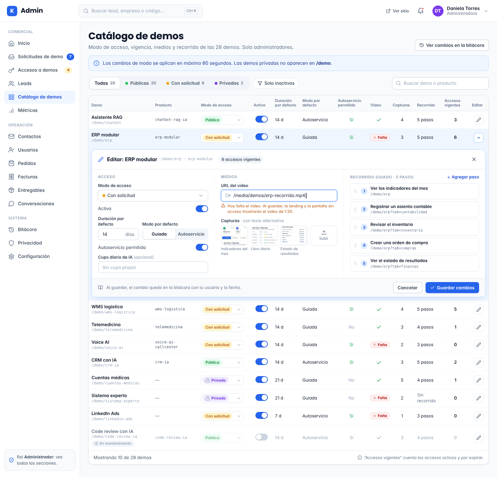

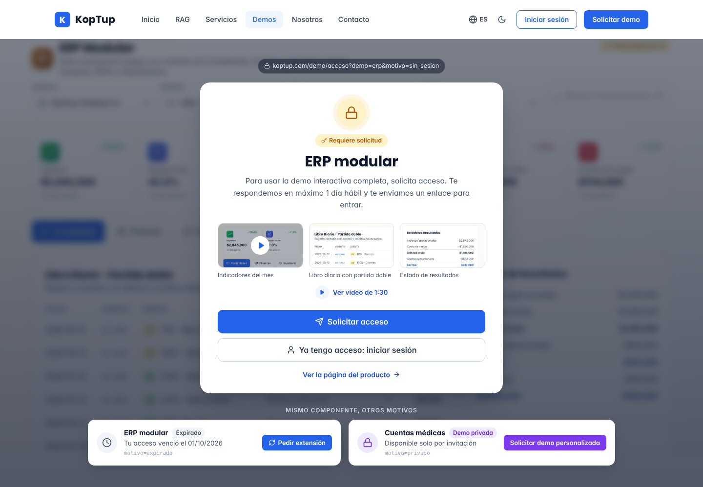

---

## SEO · i18n · accesibilidad · rendimiento

- **SEO:**
  - el dominio de la API envía `X-Robots-Tag: noindex`;
  - `GET /api/demo-catalog/modes` alimenta el `sitemap.ts` de la web: las demos `solicitud` y `privado` quedan fuera;
  - `/health`, `/ready` y `/api/docs` nunca aparecen en el sitemap.
- **i18n:**
  - La API responde **códigos estables** (sección 11) y la web los traduce a ES y EN.
  - Las plantillas de mensajes existen en español (con "tú") y en inglés.
  - El idioma se toma de `User.locale` o `Lead.locale`, con español por defecto.
  - Fechas en UTC en la API y formateadas por la web. Plazos hábiles con festivos de Colombia (`utils/business-hours.ts`).
- **Accesibilidad (emails):**
  - cada plantilla tiene versión en texto plano;
  - botones con texto descriptivo ("Activar mi acceso", nunca "clic aquí");
  - imágenes con `alt`;
  - contraste suficiente.
- **Rendimiento:**
  - **Metas** (p95, medidas con los logs de duración):
    - lecturas del panel < 300 ms;
    - `GET /api/demo-access` < 150 ms;
    - `POST /api/demo-requests` < 800 ms (incluye Turnstile y MX con tiempo máximo);
    - respuesta de "Prueba con tu documento" < 6 s.
  - **Técnicas:**
    - consultas con `.lean()` y proyección;
    - índices de la sección 7;
    - paginación con máximo 100;
    - caché de modos y del inicio del panel;
    - JSON limitado a 1 MB (hoy 10 MB) y archivos solo por `multipart`;
    - compresión activa;
    - pool de conexiones de MongoDB según el número de instancias;
    - nada pesado dentro de la petición desde la Fase 2.

---

## Tareas

Tallas para 1 dev senior: **S** ≤ 2 días · **M** 3–5 días · **L** 1–2 semanas · **XL** más de 2 semanas. Las tareas de backend del sistema de demos ya están detalladas en [Sistema de demos](04-Sistema-de-Demos.md) (tareas 1–15) y aquí aparecen agrupadas en la tarea 13.

| # | Tarea | Fase | Prioridad | Esfuerzo | Criterio de aceptación |
|---|---|---|---|---|---|
| 1 | Configuración validada: `config/env.ts` con zod como único lector de `process.env` (regla de ESLint), `.env.example` generado desde el esquema, sin valores por defecto con datos de entorno o personales en el código, `trust proxy` y CORS desde la configuración | Fase 0 — Endurecimiento | P0 | S | Arrancar en modo producción sin `MONGODB_URI` o con un `JWT_SECRET` corto termina con un mensaje que nombra la variable (sin su valor). CI falla si `.env.example` no coincide con el esquema. Una búsqueda de `process.env` fuera de `config/` no da resultados |
| 2 | Separar `src/app.ts` (`createApp()`) de `src/server.ts`; arranque sin efectos sobre los datos (la promoción a admin solo por `set-admin.ts`, con bitácora); `/health` y `/ready`; `healthcheckPath` en `railway.json` | Fase 0 — Endurecimiento | P0 | S | supertest importa la app sin abrir el puerto. `/ready` responde 503 con MongoDB caído. Arrancar el servidor no modifica ningún documento de `users` |
| 3 | Base de pruebas y CI del backend: Jest con `ts-jest`, supertest, `mongodb-memory-server` en modo réplica, factories; el workflow corre lint, verificación de tipos, pruebas y build con Node LTS; `strict: true` en el código nuevo | Fase 0 — Endurecimiento | P0 | M | Un PR con una prueba fallida queda en rojo. La transacción de una prueba de ejemplo se confirma y se revierte en memoria. El CI tarda menos de 10 minutos |
| 4 | Auditar y exigir autenticación y autorización en el servidor en todas las rutas: `requirePermission`, `optionalAuthenticate`, verificación de pertenencia y `scripts/check-routes.ts` que lista cada ruta montada con su política | Fase 0 — Endurecimiento | P0 | L | El inventario generado no tiene ninguna ruta sin política declarada. La prueba de tabla (6 roles + anónimo × rutas) pasa en CI. Un cliente no puede leer recursos de otro en ninguna de las 37 rutas del portal |
| 5 | Pasarela de IA (`services/ai-gateway.service.ts`): modelos por variable de entorno, `AiUsage` con tokens y costo, cupos por visitante, usuario y grant, tope mensual global y por función, apagado por función, job `ai-budget-watch`; migrar las llamadas de chatbot, contenido, documentos y salud | Fase 0 — Endurecimiento | P0 | M | Con un tope de prueba agotado, todos los endpoints de IA responden `429 presupuesto_agotado` sin llamar al proveedor (comprobado con un doble del proveedor). Ningún nombre de modelo queda escrito fuera de `config/`. El gasto del mes aparece en `jobs/health` |
| 6 | Rate-limit con almacén compartido (Redis) por IP, email y usuario, con respaldo en memoria y límites por ruta (autenticación, formularios, IA, eventos) | Fase 0 — Endurecimiento | P0 | S | Con 2 instancias, el límite por email se respeta aunque cambie la IP. Con Redis apagado, la API sigue respondiendo y registra la advertencia |
| 7 | Rotar credenciales, actualizar dependencias (Express, Mongoose, multer, SDKs), quitar las que no se usan y retirar de producción las rutas y páginas de prueba | Fase 0 — Endurecimiento | P0 | S | `npm audit --omit=dev` sin vulnerabilidades altas ni críticas. El inventario de producción no contiene rutas de prueba. Lista de credenciales rotadas firmada en el checklist de operación (sin valores) |
| 8 | Limpieza de código muerto de la Fase 0 (sección 15): `src/modules/`, `.bak`, SQL, `/api/chat`, `embedding.service.ts`, servidores sueltos, POST público de `quotes`; etiqueta de archivo previa | Fase 0 — Endurecimiento | P1 | S | `tsc`, las pruebas y el build pasan. El build no contiene `modules/` heredados. El inventario baja de 179 a 171 rutas, sin perder ninguna con consumidor (verificado contra las llamadas de `apps/web`) |
| 9 | Almacenamiento de objetos obligatorio: `storage.service` ampliado (privado, cifrado, URLs firmadas, prefijos con ciclo de vida, validación por contenido); migrar documentos, pedidos, entregables, chatbot, salud y exportes; temporales en `os.tmpdir()` | Fase 0 — Endurecimiento | P0 | M | Después de redesplegar, todos los archivos de prueba siguen disponibles. Ningún `multer.diskStorage` apunta a `./uploads`. Un exporte de 8 días ya no existe. Un archivo con extensión `.pdf` que no es PDF se rechaza |
| 10 | Persistir el chatbot (`Bot`, `BotDocument`, `BotChunk`, `BotMessage`) y las decisiones de IA (`AiDecision`) en MongoDB; migración idempotente desde `state.json`; quitar `data/` del repositorio | Fase 0 — Endurecimiento | P0 | M | Reiniciar el backend no pierde bots, documentos ni conversaciones (prueba de integración). `git ls-files apps/backend/data` no devuelve archivos. Correr la migración dos veces no duplica nada |
| 11 | Observabilidad: logs JSON a la salida estándar con `requestId` y sin datos personales, Sentry en la API (y en el worker en la Fase 2), monitor externo de `/ready` y alertas de la sección 13 | Fase 0 — Endurecimiento | P1 | S | Un error 500 provocado aparece en Sentry con su `requestId`. Los logs de un envío de contacto no contienen el email. Apagar MongoDB en staging dispara la alerta en ≤ 3 min |
| 12 | MongoDB con réplica (Atlas recomendado): transacciones, copias de seguridad con restauración probada, usuario por entorno, índices y TTL de la sección 7, `docker-compose.dev.yml` con réplica, entorno de staging | Fase 0 — Endurecimiento | P0 | S | `approve` en staging corre dentro de una transacción real. Restauración probada y documentada (objetivo de pérdida de datos ≤ 24 h). Staging no contiene datos personales de producción |
| 13 | Backend del sistema de demos: modelos, permisos, bitácora, Leads, catálogo, solicitudes, estados, API pública, de portal y de equipo, enlace mágico, `demo-access`, `requireDemoGrant`, outbox y jobs base (= tareas 1–15 de [Sistema de demos](04-Sistema-de-Demos.md)) | Fase 1 — Funnel y solicitud de demos | P0 | XL | Se cumplen los criterios de las tareas 1–15 de Sistema de demos y las pruebas de integración de su sección 18 pasan en CI |
| 14 | Mensajería unificada, segunda parte: adaptadores en `services/channels/` (email transaccional con SPF, DKIM y DMARC, WhatsApp Cloud API, in-app, Slack) y migración de los envíos existentes (contacto, pedidos, restablecimiento) al outbox | Fase 1 — Funnel y solicitud de demos | P0 | M | Ningún controlador llama directo a `emailService` ni a `whatsappService`. Un fallo simulado del proveedor se reintenta sin duplicar. Un correo de prueba llega con DKIM válido |
| 15 | **Hecho en la rama `rag-reposicionamiento` (pendiente de merge).** "Prueba con tu documento": API `/api/demo-rag` sin ticket (estado, subida, consulta, preguntas y borrado), lead `demo-rag` con `services/lead.service.ts`, límites (5 MB, 30 páginas, 10 preguntas, 3 documentos por IP al día), documento solo en memoria con borrado a la hora, tope `DEMO_MONTHLY_BUDGET_USD`, encendido con `DEMO_UPLOAD_ENABLED` y citas por página o fragmento | Fase 1 — Funnel y solicitud de demos | P0 | M | Un PDF de 30 páginas queda listo en < 20 s y la respuesta cita la página correcta. A la hora, el documento y sus fragmentos ya no existen. La pregunta 11 responde 429 con un mensaje claro. Con el tope agotado, no se llama al proveedor. Falta probarlo con la clave real en Railway |
| 16 | Núcleo RAG compartido (`modules/rag-core/`): ingesta de PDF, DOCX, TXT y URL con límites, fragmentos con página, un solo modelo de embeddings, búsqueda híbrida BM25 + vectorial con Atlas Vector Search y citas; lo usan el chatbot, "Prueba con tu documento", documentos y la consulta normativa de salud | Fase 2 — Demos vendibles | P1 | L | Las 3 implementaciones de embeddings quedan reemplazadas. Un set de evaluación de 50 preguntas con respuesta conocida da ≥ 90 % de citas correctas y corre en CI |
| 17 | Documentos por espacio: corpus de muestra público de solo lectura, escritura con grant y cupos, pertenencia por usuario o grant, borrado de los documentos de grants vencidos (`grant-cleanup`) | Fase 1 — Funnel y solicitud de demos | P1 | M | Sin grant se lista el corpus de muestra y "Subir" pide acceso. Con grant, al superar el cupo se ve "cupo agotado". Un grant revocado deja 0 documentos en ≤ 1 h |
| 18 | Gestor de contenido detrás de la pasarela de IA, con cupo anónimo por IP y cupo por grant, validación zod, límite de entrada y corrección de `hasRealBackend` en la semilla | Fase 1 — Funnel y solicitud de demos | P1 | S | Un visitante anónimo agota su cupo diario y recibe un mensaje claro. El gasto del módulo aparece en `AiUsage` con `feature = content` |
| 19 | Módulo `salud` aislado: consolidar auditoría, cuentas, CUPS, Ley 100, liquidación, reglas y motor de reglas en `src/modules/salud/` bajo `/api/salud/*`, con alias de las rutas viejas, `SALUD_ENABLED` y herramientas offline en `tools/salud/` (coordinado con la tarea 8 de [Demo cuentas médicas](Demo-cuentas-medicas.md)) | Fase 2 — Demos vendibles | P1 | XL | La demo usa un solo flujo y un solo generador de Excel. Las rutas viejas responden con `Deprecation` durante una versión. Con `SALUD_ENABLED=false` el backend arranca sin cargar el módulo y sin errores |
| 20 | Servicio `worker` (`src/worker.ts`) con BullMQ: colas `rag-ingest`, `salud-process` y `exports`, `ProcessingJob` con progreso, jobs programados movidos al worker y `server.timeout` en valores por defecto | Fase 2 — Demos vendibles | P1 | L | Encolar un lote de 20 facturas responde 202 en < 1 s y el lote termina en el worker. Reiniciar la API no interrumpe el trabajo. Ninguna petición HTTP dura más de 30 s |
| 21 | OpenAPI desde zod: `config/openapi.ts`, `npm run openapi` en CI con verificación de diferencias, `/api/docs` solo para el equipo, cliente tipado `api.generated.ts` en la web para las rutas del sistema de demos | Fase 1 — Funnel y solicitud de demos | P1 | M | CI falla si una ruta montada no tiene esquema o si `openapi.json` está desactualizado. La web compila usando los tipos generados en `lib/api.ts` para las rutas nuevas |
| 22 | Portal en el backend: política de pertenencia centralizada en proyectos, pedidos, facturas, entregables y mensajes; adjuntos con URL firmada; `Project.quoteId` y `Project.leadId`; tipos de aviso `demo`, `lead` y `quote`; endpoints de equipo de [Panel de administración](05-Panel-de-Administracion.md) (sección 4.7) | Fase 1 — Funnel y solicitud de demos | P1 | M | Las pruebas de integración confirman que un cliente no ve ni modifica recursos de otro. La descarga de un adjunto exige URL firmada, que vence a los 5 minutos. `shipped` ya no existe en `Order` |
| 23 | Webhooks entrantes con firma e idempotencia (`WebhookEvent`): agenda (Fase 1), estado de email y WhatsApp (Fase 2) y pagos (Fase 3) | Fase 1 — Funnel y solicitud de demos | P2 | M | Un webhook repetido no duplica efectos. Una firma inválida responde 401. Una reserva de prueba aparece en la ficha del Lead en < 1 minuto |
| 24 | Propuestas y anticipo: `Quote` ampliado y migración de los estados viejos, API de la sección 8.5 de Sistema de demos, PDF en el almacenamiento, adaptador de pagos (Wompi o PayU en COP, Stripe en USD) con webhooks y `services/conversion.service.ts` | Fase 3 — Propuestas y conversión | P1 | XL | En el entorno de pruebas del proveedor, una propuesta aceptada con anticipo pagado crea el `Project`, cambia el rol a `client` y pasa los accesos a `convertido` sin pasos manuales |
| 25 | Núcleo multi-tenant para el chatbot RAG: `Organization`, `tenantId` en todas sus consultas, medición de conversaciones y documentos contra el plan, cobro recurrente y aprovisionamiento | Fase 4 — Productos SaaS reales | P1 | XL | Las pruebas de aislamiento entre 2 organizaciones pasan. Un cliente nuevo crea su cuenta, paga y publica su bot sin intervención de KopTup. La factura mensual coincide con el uso medido |

### Esfuerzo y secuencia

| Fase | Tareas | Días-dev aprox. | Nota |
|---|---|---|---|
| Fase 0 — Endurecimiento | 1–12 | ≈ 38 (≈ 8 semanas con 1 dev) | Las P0 de la Fase 0 (1–7, 9, 10 y 12) deben estar listas **antes** de activar el control de acceso en producción. El desarrollo de la Fase 1 puede empezar en paralelo con un segundo dev |
| Fase 1 — Funnel y solicitud de demos | 13–15, 17, 18, 21–23 | ≈ 56 (≈ 30 de ellos son las tareas 1–15 de Sistema de demos) | El frontend de Sistema de demos (≈ 24 días-dev) va aparte |
| Fase 2 — Demos vendibles | 16, 19, 20 | ≈ 35 | La tarea 19 depende de la 20 (colas) y de la 16 (consulta normativa) |
| Fase 3 — Propuestas y conversión | 24 | ≈ 20 | Requiere la decisión de pasarela de pagos ([Comercial, marketing y legal](11-Comercial-Marketing-y-Legal.md)) |
| Fase 4 — Productos SaaS reales | 25 | ≈ 30 o más | Empieza por el chatbot RAG ([Roadmap](12-Roadmap.md)) |

**Total:** ≈ 180 días-dev de backend (≈ 36 semanas con 1 dev). Con 2 devs, las Fases 0 y 1 caben en ≈ 10–11 semanas de calendario.

---

## Métricas de éxito

| Métrica | Meta inicial (a validar con 8 semanas de operación) |
|---|---|
| Pérdida de datos por despliegue | 0 archivos, bots o conversaciones perdidos (prueba de redespliegue en cada versión) |
| Disponibilidad de la API (`/ready`) | ≥ 99,5 % mensual |
| Latencia p95 | Lecturas del panel < 300 ms · `GET /api/demo-access` < 150 ms · respuesta de "Prueba con tu documento" < 6 s |
| Rutas con política de permiso y prueba | 100 % de las rutas montadas |
| Gasto de IA | Nunca por encima del tope mensual; alerta al 80 % atendida en ≤ 1 día hábil; costo por Lead de `demo_rag` visible en el panel |
| Mensajes | ≥ 99 % de los mensajes programados enviados en < 2 min; 0 duplicados; tasa de rebote < 2 % |
| Calidad | Cobertura ≥ 70 % en `services/` del sistema de demos y de la pasarela de IA; CI en verde en `main` ≥ 95 % de los días; CI < 10 min |
| Dependencias | 0 vulnerabilidades altas o críticas en producción |
| Código | ≈ 5.300 líneas menos en la Fase 0; 0 herramientas offline dentro del build en la Fase 2 |
| Recuperación | Reversión de un despliegue fallido en < 15 min; restauración de la base probada cada trimestre |
| Demos con backend real | 0 pantallas de error técnico en producción (prueba de humo diaria de `cuentas-medicas`, `sistema-experto`, `gestor-documentos`, `gestor-contenido` y `chatbot`) |

---

## Páginas relacionadas

- [Sistema de demos](04-Sistema-de-Demos.md) · [Flujo del cliente](03-Flujo-del-Cliente.md) · [Panel de administración](05-Panel-de-Administracion.md) · [Portal del cliente](06-Portal-del-Cliente.md)
- [Autenticación](Seccion-Autenticacion.md) · [Contacto](Seccion-Contacto.md) · [Legal](Seccion-Legal.md)
- [Sistemas RAG](Producto-chatbot-rag-ia.md) · [Gestor documental](Producto-gestor-documental.md) · [CMS headless](Producto-cms-headless.md) · [Demo cuentas médicas](Demo-cuentas-medicas.md) · [Demo sistema experto](Demo-sistema-experto.md) · [Demo LinkedIn Ads](Demo-linkedin-ads.md)
- [Diagnóstico](01-Diagnostico.md) · [Visión de producto](02-Vision-de-Producto.md) · [Catálogo de productos](08-Catalogo-de-Productos.md) · [Seguridad y calidad](10-Seguridad-y-Calidad.md) · [Comercial, marketing y legal](11-Comercial-Marketing-y-Legal.md) · [Roadmap](12-Roadmap.md)
