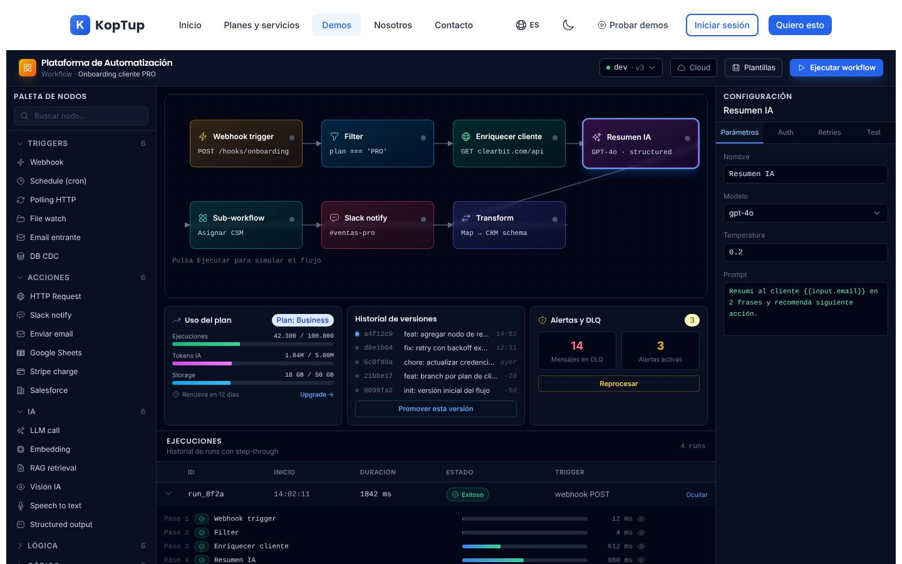
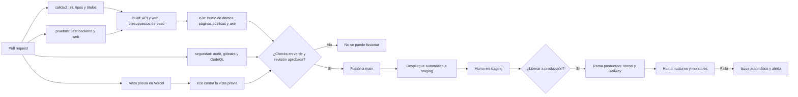
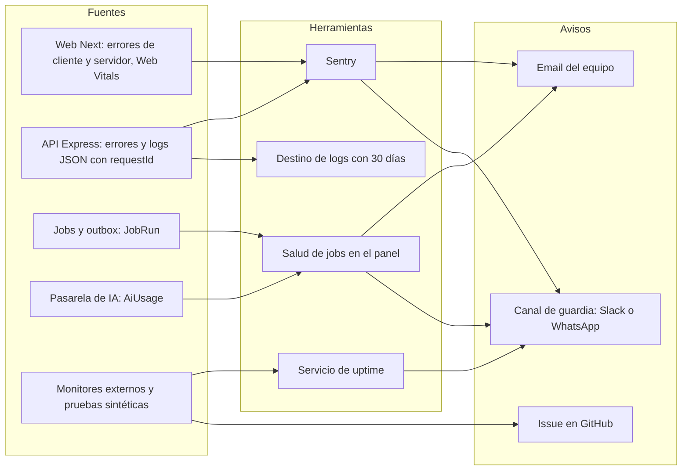
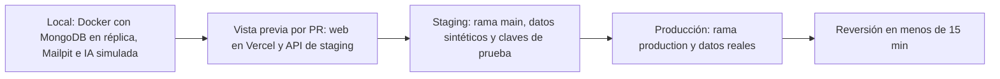
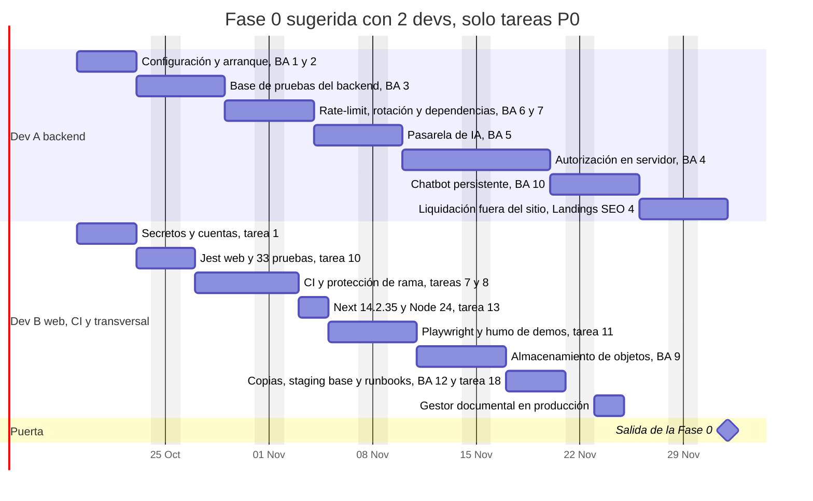

# Seguridad y calidad

> Ruta(s): todo el monorepo (`apps/web`, `apps/backend`, `.github/workflows`) y la configuración de Vercel y Railway · Archivos principales: `.github/workflows/ci.yml`, `turbo.json`, `apps/{web,backend}/package.json`, `apps/web/next.config.js`, `apps/web/middleware.ts`, `apps/web/src/app/layout.tsx`, `apps/backend/src/index.ts`, `apps/backend/src/utils/logger.ts` · Prioridad: **P0** (es la puerta de la Fase 0) · Esfuerzo total: **XL**. Esta página suma ≈ 56 días-dev de Fase 0 (≈ 20 de ellos P0) y 8 de la Fase 2. Además coordina las tareas de Fase 0 de [Backend y API](09-Backend-y-API.md) y [Autenticación](Seccion-Autenticacion.md). Detalle en [Tareas](#tareas).


*Una demo pública del catálogo está rota en producción y ningún sistema avisó. Es el síntoma de lo que ataca esta página: no corren pruebas, no hay monitoreo ni alertas, y la base no está endurecida.*

Esta página es el plan de la **Fase 0 — Endurecimiento**. Cubre seguridad, CI/CD, pruebas, dependencias, observabilidad, copias de seguridad, entornos, rendimiento, accesibilidad y manejo de errores, y cierra con la **definición de hecho** y los **criterios de salida** de la fase.

> **Regla de wiki pública.** El repositorio y esta wiki son públicos. La revisión detallada de seguridad **no se publica**: aquí solo hay tareas genéricas, nombres de archivos que cambian por funcionalidad y criterios verificables. Si encuentras un problema de seguridad concreto, repórtalo por el canal de `SECURITY.md` (tarea 1) y nunca en un issue público.

---

## En una mirada

| Tema | Hoy | Al cerrar la Fase 0 |
|---|---|---|
| CI | `ci.yml` es inválido: **no corre ningún job** | Cada PR pasa por lint, tipos, pruebas, build, e2e de humo y seguridad. `main` está protegida |
| Pruebas | 33 archivos de prueba; **0 se ejecutan** (no hay configuración de Jest para TypeScript) | Las 33 corren en verde. Hay base de integración en el backend, Playwright y prueba de humo de las 28 demos |
| Dependencias | Next 14.0.3, Node 18 y 108 avisos de `npm audit` (4 críticos, 65 altos) | Next 14.2.35, Node 24 LTS, 0 avisos altos o críticos en dependencias de producción y Dependabot activo |
| Seguridad | Autorización por revisar en ≈ 180 rutas, configuración sin validar, IA sin tope y sesión legible desde JavaScript | Política declarada y probada por ruta, credenciales rotadas, pasarela de IA con topes, CSP más estricta y cookies httpOnly (P1) |
| Observabilidad | Sin Sentry ni monitores. Logs con formato de consola y en disco efímero. `/health` responde 200 aunque no haya base de datos | Sentry en web y API, logs JSON, `/ready`, monitores externos, pruebas sintéticas y alertas de costo de IA |
| Continuidad | Sin evidencia de copias de MongoDB ni de restauraciones probadas | Copias diarias (o PITR), simulacro de restauración y runbooks |
| Entornos | Local y producción | Local, vista previa por PR, **staging** y producción, con flujo de liberación y reversión |
| Rendimiento | 73 de 73 páginas se renderizan en cada visita (`no-store`) y cada HTML pesa ≈ 430 KB por los textos de i18n | Páginas de marketing estáticas, textos por namespace y presupuestos de peso en CI |
| Errores y accesibilidad | Sin `error.tsx`, `global-error.tsx` ni `loading.tsx`. Sin enlace para saltar al contenido | Límites de error con texto útil, esqueletos de carga y base WCAG 2.2 AA con axe en CI |

---

## Objetivo

KopTup vende software. Un prospecto que entra a una demo y la ve rota, o un cliente que pregunta "¿cómo protegen mis datos?", decide la venta en ese momento. La Fase 0 debe lograr cinco cosas:

1. **Que nada llegue a producción sin pasar por pruebas.** CI válido, pruebas que corren y despliegues condicionados a los checks.
2. **Que el sistema de demos tenga una base segura.** [Sistema de demos](04-Sistema-de-Demos.md) decide el acceso **en el servidor**. Eso exige autorización auditada en toda la API, credenciales rotadas, dependencias al día (en especial el middleware de Next) y control de costo de IA (sección 17 de esa página, "Prerrequisitos de la Fase 0").
3. **Que KopTup se entere antes que el cliente.** Errores, caídas, demos rotas y gasto de IA deben generar una alerta en minutos.
4. **Que un incidente no sea fatal.** Copias probadas, reversión en menos de 15 minutos y runbooks.
5. **Que el sitio cargue rápido y sea usable por todos.** Las landings de la Fase 1 ([Landing de producto](Seccion-Landing-de-Producto.md)) se diseñaron como páginas estáticas con revalidación, y hoy eso no es posible.

En el funnel, esta fase protege los **momentos de verdad** de [Flujo del cliente](03-Flujo-del-Cliente.md): el primer uso de la demo, la activación y la confianza al pedir una propuesta.

---

## Estado actual

Medido sobre la rama `main` el 8 de octubre de 2026: se ejecutaron Jest, ESLint, `tsc`, `npm audit` y un `next build` local.

### CI/CD

| Hallazgo | Evidencia | Efecto |
|---|---|---|
| Condiciones `if` **a nivel de job** que usan el contexto `secrets` | `.github/workflows/ci.yml` líneas 128 y 166 | GitHub rechaza el archivo completo: **no corre ningún job**, ni siquiera lint o pruebas |
| Servicio PostgreSQL y variable `DATABASE_URL` | líneas 36–49 y 76 | La aplicación usa MongoDB. Son restos de una versión anterior (ver [Backend y API](09-Backend-y-API.md), sección 15) |
| Construcción de imagen Docker del backend | línea 156 (`./apps/backend/Dockerfile`) | El archivo no existe. Railway construye con Nixpacks (`apps/backend/railway.json`) |
| Node 18 y acciones `@v3` | líneas 10, 18 y 21; `apps/web/Dockerfile` líneas 4 y 14 | Node 18 ya no recibe soporte. Las acciones v3 son obsoletas |
| Rama `develop` | líneas 5 y 7 | No existe |
| Despliegue a Vercel con una acción de terceros | líneas 162–179 | Duplica la integración Git de Vercel, que ya despliega cada push |
| `turbo.json` con la clave `pipeline` (Turbo 1) | `turbo.json` | No hay tareas `typecheck` ni `e2e` |
| Archivos de proceso | raíz del repositorio | No hay `dependabot.yml`, `SECURITY.md`, `.nvmrc` ni `CODEOWNERS` |

El único workflow que funciona es `wiki-sync.yml`, que publica esta wiki.

### Pruebas

| Qué | Evidencia | Resultado al ejecutarlas |
|---|---|---|
| 14 pruebas del backend | `apps/backend/src/modules/*/__tests__/*.test.ts`. Prueban los módulos en memoria que `index.ts` no monta | 14 de 14 suites fallan con `SyntaxError: Cannot use import statement outside a module` |
| 19 pruebas de la web | `apps/web/src/app/demo/*/__tests__/page.test.tsx` y `src/test-utils/smoke.tsx` | 19 de 19 fallan con el mismo error |
| Configuración | No existe `jest.config.*` en ningún workspace. No están instalados `ts-jest` ni `jest-environment-jsdom`. El `tsconfig.json` del backend limita los tipos a `["node"]` y excluye `__tests__` | Jest no transforma TypeScript ni JSX. Aunque lo hiciera, el render fallaría sin los proveedores de `next-intl` |
| `--passWithNoTests` | `apps/web/package.json` línea 12 y `apps/backend/package.json` línea 11 | Oculta que no hay pruebas |
| Playwright | `@playwright/test` 1.56.1 instalado y script `test:e2e` (`apps/web/package.json` línea 13) | No hay `playwright.config.ts` ni especificaciones |
| Documentación | `CONTRIBUTING.md` línea 120 pide `apps/web/tests/e2e/demo-<slug>.spec.ts`. El README promete "Jest · Playwright" y "TypeScript strict" | La carpeta no existe y el backend usa `strict: false` |
| Lint y tipos | `next lint` y el ESLint del backend dan 0 errores (solo avisos de `react-hooks/exhaustive-deps` en la web y 28 avisos en el backend). `tsc --noEmit` pasa en los dos | **La base compila: el arreglo es de configuración.** El backend se revisa con la configuración de Next de la raíz porque no tiene la suya |



*La demo de automatización se ve correcta, pero la consola del navegador registra errores de hidratación de React (#418, #423 y #425). Pasa en al menos 10 demos ([Catálogo de demos](Seccion-Catalogo-de-Demos.md)). Una revisión visual no los detecta; una prueba de humo automatizada sí.*

### Dependencias

`npm audit` del monorepo reporta **108 avisos**: 4 críticos, 65 altos, 37 moderados y 2 bajos. Una parte está en herramientas de desarrollo (la cadena de Jest 29), pero varios están en paquetes que llegan a producción.

| Paquete | Workspace | Versión instalada | Situación |
|---|---|---|---|
| `next` y `eslint-config-next` | web | 14.0.3 | Avisos críticos y altos publicados. Se corrigen dentro de la rama 14 (14.2.35) |
| `jspdf` | web | 3.0.4 | Avisos críticos. La corrección es la versión mayor 4 |
| `next-intl` | web | 3.26.5 | Aviso moderado. Se corrige en la versión mayor 4 |
| `js-cookie` | web | 3.0.5 | Aviso alto. Se retira con la sesión httpOnly |
| `xlsx` | backend | 0.18.5 | Avisos altos **sin corrección publicada en npm**. Se usa en 3 archivos: 2 servicios de salud y 1 script. `exceljs` ya está instalado |
| `multer` | backend | 1.4.5-lts.2 | La rama 1.x no recibe mantenimiento. Hay 7 configuraciones en uso |
| `mongoose`, `axios`, `express`, `nodemailer`, `sharp` | backend | 8.20, 1.13, 4.21, 7.0, 0.34 | Avisos altos. Mongoose, Axios y Express se corrigen con parches o versiones menores; Nodemailer y Sharp, con versión mayor |
| `framer-motion`, `swr`, `react-dropzone` | web | declaradas | 0 importaciones en `src` (a confirmar con `depcheck`) |
| Node | CI y Docker | 18 | Sin soporte. En local se usa 22 |

### Seguridad (resumen genérico)

| Área | Estado | Dónde se resuelve |
|---|---|---|
| Autorización | 22 archivos de rutas con 179 endpoints montados. La protección de `/admin` y `/dashboard` en la web vive en el navegador (`components/admin/AdminLayout.tsx`). `apps/web/middleware.ts` solo maneja el idioma | Auditoría en el servidor: [Backend y API](09-Backend-y-API.md), tarea 4 |
| Sesión | Los tokens y el usuario se pueden leer desde JavaScript (`lib/api.ts` usa `js-cookie`) | [Autenticación](Seccion-Autenticacion.md), tareas 8 y 9 |
| Abuso y costo | Rate-limit en la memoria de cada instancia y sin `trust proxy`. La IA no tiene tope de gasto | Backend y API, tareas 1, 5 y 6 |
| Configuración y secretos | `process.env` se lee en 40 archivos, con valores por defecto en el código. **El repositorio es público:** toda credencial que haya estado alguna vez en el árbol o en el historial se trata como expuesta | Tarea 1 de esta página y Backend y API, tareas 1 y 7 |
| Cabeceras de la web | HSTS, `nosniff`, `X-Frame-Options`, `Referrer-Policy` y `Permissions-Policy` están bien (`next.config.js` líneas 49–80). La CSP (línea 79) permite `'unsafe-eval'` e incluye un origen de desarrollo y un comodín en `connect-src`. `images.domains` (línea 37, obsoleto) incluye `localhost` | Tarea 5 |
| Rutas de prueba y documentación interactiva | Existen en web y backend y deben quedar fuera de producción o solo para el equipo | Backend y API, sección 15 y tarea 7; [Landings SEO](Seccion-Landings-SEO.md), tareas 4 y 18 |

### Observabilidad y operación

| Hallazgo | Evidencia |
|---|---|
| Los logs salen por consola con colores (no JSON) y además se escriben en 4 archivos de `logs/`, que se pierden en cada despliegue | `apps/backend/src/utils/logger.ts` líneas 26 y 45–70 |
| `morgan('combined')` registra la IP y el user agent completos de cada petición | `apps/backend/src/index.ts` línea 74 |
| `/health` responde 200 sin revisar MongoDB, y el arranque continúa aunque la base no conecte | `index.ts` líneas 87–89 y 139–141 |
| No hay Sentry, monitor externo ni alertas. Tres demos con backend real están rotas en producción sin que nadie se entere | Capturas de [Backend y API](09-Backend-y-API.md#síntomas-visibles-en-producción) |
| El repositorio no muestra evidencia de copias de MongoDB ni de restauraciones probadas. Archivos, estado del chatbot y logs viven en disco efímero | [Backend y API](09-Backend-y-API.md), sección "Persistencia y estado" |
| Solo existen dos entornos: local y producción. Las funciones de Vercel corren en `iad1` | `apps/web/vercel.json` línea 7 |

### Rendimiento (build local de producción)

| Medida | Valor |
|---|---|
| Rutas dinámicas (λ) | 79 de 83. **Las 73 páginas** se renderizan en cada visita; solo `/api/trm`, `/icon` y `/sitemap.xml` son estáticas |
| Causa | `cookies()` en el layout raíz para leer el idioma (`app/layout.tsx` líneas 3 y 120) |
| `Cache-Control` de las páginas | `private, no-cache, no-store, max-age=0`: el CDN no guarda nada |
| Peso del HTML | `/` 435 KB (122 KB con gzip) · `/privacy` 428 KB (122 KB) · `/services` 502 KB (126 KB) · `/demo/erp` 440 KB (123 KB) |
| Causa del peso | Los mensajes completos de i18n van serializados en cada página (`app/layout.tsx` líneas 124 y 156). En español son 129.760 + 233.872 + 79.443 bytes ≈ **443 KB** |
| JS compartido | 84,3 KB |
| JS de primera carga por demo | De 107 a 252 KB. La más pesada es `dashboard-ejecutivo` (252 KB), que importa `jspdf` de forma estática (`page.tsx` línea 4) aunque solo lo usa al exportar. Le siguen `cuentas-medicas` (147 KB) y `gestor-documentos` (142 KB) |
| Código de las demos | 28 demos con ≈ 57.000 líneas. Las más grandes son `cuentas-medicas` (6.174), `chatbot` (5.458) y `linkedin-ads` (3.241). 70 de los 72 `page.tsx` del sitio son client components completos |
| Script en línea en cada página | El layout desregistra service workers antiguos en cada visita (`app/layout.tsx` línea 134) |

**Lectura:** el problema principal no es el JavaScript, que es moderado salvo en un par de demos. El problema es el **HTML**: cada página, incluida la política de privacidad, lleva ≈ 430 KB de textos que no usa, y ninguna se puede servir desde el CDN.

### Manejo de errores y accesibilidad

- Solo existe `app/not-found.tsx`, y es un client component. **No hay `error.tsx`, `global-error.tsx` ni `loading.tsx` en ninguna ruta.** Un error de render deja la pantalla genérica de Next ("Application error").
- No hay enlace para saltar al contenido.
- Hay 25 elementos `<div onClick>` (no son accesibles con teclado).
- No se respeta `prefers-reduced-motion`.
- Varias demos no tienen H1 (`code-review-ia`, `dashboard-ejecutivo`, `gestor-documentos`) y otras repiten el encabezado (`pos`).
- En `pos` y `helpdesk-ia`, la flecha de algunos selectores tapa el texto.

---

## Problemas detectados

1. **No hay red de seguridad.** El CI no corre y las pruebas no se ejecutan, así que cada cambio llega a producción sin verificación. `--passWithNoTests` y un CI roto hacen que nadie lo note.
2. **Las pruebas existentes miden poco.** Las 14 del backend prueban código que no se monta. Las 19 de la web son de humo (renderizar sin fallar) y ni siquiera arrancan.
3. **No hay pruebas de extremo a extremo** ni de humo sobre las demos. Por eso hay demos rotas y errores de hidratación en producción.
4. **Dependencias con avisos críticos.** La versión de Next tiene avisos que afectan, entre otras cosas, al middleware, y el [Sistema de demos](04-Sistema-de-Demos.md) pondrá ahí parte del control de acceso. Node 18 ya no tiene soporte.
5. **La base de seguridad no está auditada.** Falta revisar la autorización en servidor de todas las rutas, rotar credenciales, poner topes a la IA y usar un rate-limit que funcione detrás del proxy y con varias instancias. Además, la sesión se puede leer desde JavaScript y la CSP es permisiva.
6. **KopTup no ve lo que pasa en producción.** No hay reporte de errores, monitores ni alertas de costo, y los logs se pierden o no se pueden consultar.
7. **No hay plan de continuidad.** No hay copias verificadas, restauración probada ni runbooks, y hay estado del negocio en disco efímero.
8. **No hay staging.** Todo lo que no se prueba en local se prueba en producción, con datos y claves reales.
9. **El sitio es más lento de lo necesario.** Todo es dinámico y cada página carga ≈ 430 KB de textos. Esto también bloquea el diseño estático de las landings de la Fase 1.
10. **Los errores se ven feos o en blanco.** No hay límites de error ni estados de carga, y en algunos módulos se muestran datos simulados cuando la API falla (ver [Portal del cliente](06-Portal-del-Cliente.md), P-02).
11. **La accesibilidad no se mide.** Faltan el enlace de salto, el foco en elementos clicables y los H1 únicos, y no hay pruebas automáticas.
12. **La documentación promete lo que no hay.** El README habla de TypeScript estricto y pruebas, `CONTRIBUTING.md` apunta a carpetas que no existen y [Nosotros](Seccion-Nosotros.md) promete "CI/CD desde el día 1".

---

## Plan detallado

### 1. Seguridad

#### 1.1 Principios (aplican a todo el código nuevo y al que se toque)

1. **Negar por defecto.** Ninguna ruta de la API ni route handler de Next responde sin una política declarada: pública, autenticada o con permiso.
2. **La autorización vive en el servidor.** El middleware de Next y los layouts solo mejoran la experiencia (redirigen); nunca son la única barrera.
3. **Mínimo privilegio** en roles, credenciales de servicios, usuarios de base de datos y tokens de CI.
4. **Secretos solo en las variables de cada entorno** (Vercel, Railway y GitHub Environments). Nunca en código, documentación, wiki, capturas ni historial.
5. **Sin datos personales en logs ni en eventos.** IP y email en hash cuando hagan falta para correlacionar (Ley 1581; ver [Legal](Seccion-Legal.md)).
6. **Falla cerrada** en lo que protege acceso o costo: si la verificación no responde, se niega. Las demos `publico` siguen abiertas (decisión 5 de [Sistema de demos](04-Sistema-de-Demos.md)).
7. **Todo cambio del equipo queda en la bitácora** (`AuditLog`).

#### 1.2 Autorización en servidor

El detalle técnico es la **tarea 4 de [Backend y API](09-Backend-y-API.md)**: matriz de permisos (sección 3 de Sistema de demos), `requirePermission`, `optionalAuthenticate`, verificación de pertenencia y `scripts/check-routes.ts`, que lista cada ruta montada con su política. Esta página fija los criterios transversales:

- **Inventario completo:** los 22 archivos de rutas del backend, los route handlers de `apps/web/src/app/api/*` y las páginas internas de la web (`/liquidacion`, `/test`).
- **Prueba de tabla en CI:** 6 roles más anónimo, contra todas las rutas. CI falla si aparece una ruta sin política.
- **Pertenencia:** un cliente o prospecto nunca lee ni modifica recursos de otro. Incluye la tarea P-04 de [Portal del cliente](06-Portal-del-Cliente.md).
- **Herramientas internas** (salud, liquidación, reglas): solo para staff hasta que se consoliden ([Backend y API](09-Backend-y-API.md), sección "Integración con el sistema de demos").
- **Roles:** ningún proceso automático (arranque, semillas, scripts) cambia roles. Los cambios de rol pasan por `PATCH /api/admin/users/:id/role` o por `scripts/set-admin.ts`, y siempre dejan registro en `AuditLog`.
- **Webhooks:** firma verificada e idempotencia (`WebhookEvent`, tarea 23 de Backend y API).

#### 1.3 Secretos, credenciales y cuentas (tarea 1)

**Inventario** (solo nombres; los valores nunca se escriben en ningún documento):

| Grupo | Variables | Dónde viven | Cómo se rota |
|---|---|---|---|
| Base de datos | `MONGODB_URI` | Railway (por entorno) | Usuario nuevo por entorno con permisos mínimos → actualizar la variable → verificar → borrar el usuario anterior |
| Firma de sesiones | `JWT_SECRET` (y `JWT_REFRESH_SECRET` mientras exista) | Railway | Rotar avisando que se cierran las sesiones. Con `AuthSession` (Autenticación, tarea 9) se puede hacer con ventana de transición |
| IA | `OPENAI_API_KEY`, `ANTHROPIC_API_KEY` | Railway y Vercel | **Una clave por entorno y por función** (chatbot, contenido, salud, LinkedIn Ads), para poder cortar una sin afectar las demás |
| Almacenamiento | `AWS_ACCESS_KEY_ID`, `AWS_SECRET_ACCESS_KEY` | Railway | Usuario IAM con permisos solo sobre su bucket |
| OAuth | `GOOGLE_CLIENT_SECRET` | Railway | Regenerar el secreto del cliente OAuth |
| Mensajería | `SMTP_*`, `TWILIO_*`, `WHATSAPP_API_TOKEN`, `ULTRAMSG_*` | Railway | Regenerar. Revocar los de proveedores que se retiran |
| Heredadas | `PINECONE_*`, claves internas antiguas, `SEED_*_PASSWORD` | Railway | Revocar: sus usos se eliminan ([Backend y API](09-Backend-y-API.md), sección 15) |
| Nuevas (Fase 1) | `DEMO_PASS_SECRET`, `INTERNAL_API_KEY`, `TURNSTILE_SECRET_KEY`, `SENTRY_DSN` | Vercel y Railway | Nacen distintas por entorno y nunca pasan por el repositorio |
| CI/CD | Token de subida de Sentry, token de omisión de la protección de Vercel para e2e | GitHub (secretos de entorno) | Permisos mínimos y caducidad |

**Procedimiento:**

1. Asignar un responsable por plataforma y completar el inventario en el checklist de operación, sin valores.
2. Rotar primero lo de mayor impacto: base de datos, IA, almacenamiento y firma de sesiones. Verificar en staging y después en producción.
3. Revocar las credenciales anteriores en cada proveedor.
4. **Después** de rotar, limpiar el historial con `git filter-repo`. Hay que coordinar el *force push* y pedir que se vuelva a clonar. Las copias y forks antiguos conservan el historial: **la protección real es la rotación**, no la limpieza.
5. Activar el escaneo de secretos y la protección de *push* de GitHub (gratis en repositorios públicos), `gitleaks` en CI y un *hook* de pre-commit opcional.
6. Dejar en el repositorio solo `.env.example` generados desde el esquema (Backend y API, tarea 1), con nombres y descripciones. Revisar también los documentos `.md`, los ejemplos y los archivos de configuración de herramientas locales.
7. Registrar la fecha de rotación de cada grupo y repetir cada 12 meses, o de inmediato si sale alguien del equipo.

**Cuentas de plataforma:**
- **2FA obligatorio** en GitHub, Vercel, Railway, MongoDB Atlas, OpenAI, Anthropic, AWS, Google Cloud, Twilio/Meta, el proveedor de email, Sentry y el registrador del dominio y DNS.
- Una cuenta por persona: nunca compartida.
- Un procedimiento de alta y baja de miembros del equipo en el runbook.

**`SECURITY.md`** (texto propuesto, resumido):
> Si encuentras una vulnerabilidad en KopTup, escríbenos al buzón de seguridad del dominio (un buzón de rol, no personal). Confirmamos la recepción en 3 días hábiles y te mantenemos al tanto hasta resolverla. Por favor, no publiques el detalle ni hagas pruebas que afecten datos o disponibilidad de otros usuarios. Agradecemos públicamente los reportes responsables, si así lo quieres.

#### 1.4 Costo y abuso de IA

Lo implementa la **tarea 5 de [Backend y API](09-Backend-y-API.md)**: pasarela `services/ai-gateway.service.ts`, `AiUsage`, cupos por visitante, usuario y grant, `AI_MONTHLY_BUDGET_USD`, `DEMO_MONTHLY_BUDGET_USD`, `AI_DISABLED_FEATURES` y el job `ai-budget-watch`. Esta página agrega las capas externas y las reglas de operación:

| Capa | Regla |
|---|---|
| Dentro de la app | Toda llamada a un modelo pasa por la pasarela, **también la ruta de LinkedIn Ads en Vercel** (reporta el uso; ver [Demo LinkedIn Ads](Demo-linkedin-ads.md), tarea 1). Hay límites de tamaño de entrada, `max_tokens`, tiempo máximo y apagado por función |
| Proveedor | Presupuesto mensual y alertas en el panel de cada proveedor, ≈ 20 % por encima del tope interno, como corte de respaldo. Claves separadas por entorno y por función |
| Alertas | 50 % aviso, 80 % alerta y 100 % corte de la función. Además, una alerta de anomalía si el gasto diario supera 3 veces la media de los últimos 7 días (sección 5.4) |
| Modelos | Sin nombres de modelo en el código: van por variables de entorno (`AI_MODEL_FAST`, `AI_MODEL_SMART`…). Se retiran los modelos heredados o retirados por el proveedor que hoy están escritos en servicios de salud y de embeddings |
| Pruebas | En CI se usa un proveedor falso. Ninguna prueba automática gasta en un proveedor real, salvo el sintético de producción (sección 5.3), que tiene su propio cupo |

#### 1.5 Plataforma HTTP del backend

Resumen de las tareas 1, 2 y 6 de [Backend y API](09-Backend-y-API.md):

- `trust proxy` según la cantidad de saltos de Railway (`TRUST_PROXY`), configurado **antes** del rate-limit.
- Rate-limit con almacén compartido, por IP, email y usuario, con límites por ruta. Es también la tarea 6 de [Autenticación](Seccion-Autenticacion.md).
- Cuerpo JSON de 1 MB como máximo; los archivos solo por `multipart` y con límite por ruta.
- Tiempos máximos por ruta. El trabajo pesado pasa a colas en la Fase 2.
- CORS desde la configuración.
- `/health` (el proceso vive) y `/ready` (dependencias).
- Documentación interactiva de la API solo para el equipo (`API_DOCS_ENABLED`).
- El arranque no modifica datos.

#### 1.6 Sesión y cookies

Está especificado en [Autenticación](Seccion-Autenticacion.md), sección 4, tareas 8 y 9: cookies `kp_at`, `kp_rt` y `kp_s` httpOnly, `AuthSession` con rotación del refresco, verificación de `Origin` en las escrituras y retiro de `js-cookie` y `localStorage.user`. Es **P1 de la Fase 0**: no bloquea el sistema de demos, pero debe estar antes de abrir el portal a clientes con proyectos reales.

#### 1.7 Cabeceras y CSP de la web (tarea 5)

| Directiva o cabecera | Hoy (`next.config.js`) | Propuesta para producción |
|---|---|---|
| `script-src` | `'self' 'unsafe-inline' 'unsafe-eval'` | `'self' 'unsafe-inline'` más los dominios aprobados de cada integración: Turnstile (`challenges.cloudflare.com`) y, **solo tras el consentimiento**, GA4. Sin `'unsafe-eval'` (solo hace falta en desarrollo) |
| `connect-src` | Incluye un origen de desarrollo y un comodín del proveedor de nube del backend | `'self'`, el dominio propio de la API (Autenticación, tarea 8), Sentry por túnel propio y GA4 tras el consentimiento. Sin orígenes de desarrollo ni comodines |
| `frame-src` | `'self'` y Google | `'self'`, Turnstile y la agenda (Cal.com, [Contacto](Seccion-Contacto.md), tarea 10) |
| `object-src` | No está definida (hereda `default-src`) | `'none'` |
| `upgrade-insecure-requests` | — | Activa |
| Reportes | — | `report-uri` y `report-to` hacia Sentry |
| `X-Robots-Tag` | — | `noindex` en `/admin`, `/dashboard`, `/acceso` y en **todo** staging y vista previa |
| `Cache-Control` | — | `no-store` en `/admin`, `/dashboard` y `/acceso` |
| `images` | `domains` (obsoleto) con `localhost` | `remotePatterns` solo con los orígenes reales |

**Cómo se despliega:**
1. Una semana en `Content-Security-Policy-Report-Only`, revisando los reportes en Sentry.
2. Después se aplica.
3. La CSP de vista previa y staging es igual a la de producción, para detectar violaciones antes de liberar.

**Por qué se mantiene `'unsafe-inline'`:** el App Router de Next inserta scripts en línea. La alternativa con *nonce* obliga a renderizar en cada visita, lo que choca con el objetivo de páginas estáticas (sección "Rendimiento"). Se revisa en la migración mayor de Next (tarea 14), que trae integridad por hash (SRI). Mientras tanto, se puede usar *nonce* solo en `/admin` y `/dashboard`, que ya son dinámicas (P2).

Cuando exista el widget embebible del chatbot (Fase 4), su ruta tendrá su propia `frame-ancestors`. El resto del sitio sigue con `'self'`.

#### 1.8 Entradas no confiables (tarea 6)

- **Archivos:** tipo verificado por contenido, tamaño por ruta, nombres generados por el servidor, almacenamiento privado y descarga solo por URL firmada ([Backend y API](09-Backend-y-API.md), tarea 9).
- **HTML y Markdown en la web:**
  - inventariar los usos de `dangerouslySetInnerHTML` y `rehype-raw`; la mayoría son bloques JSON-LD;
  - el Markdown que viene de la IA, de mensajes o de documentos se muestra sin HTML en bruto, o con `rehype-sanitize` y una lista de etiquetas permitidas;
  - el JSON-LD se serializa escapando `<`;
  - `react/no-danger` queda como aviso, con excepciones revisadas.
- **Enlaces externos** con `rel="noopener noreferrer"`.
- **Backend:** validación con `zod` en cada ruta que se toque, filtros de consulta saneados y escapado del texto libre en las plantillas de email (tarea 8 de [Contacto](Seccion-Contacto.md)).

#### 1.9 Rutas de prueba y código muerto

- Las rutas de prueba y de diagnóstico se eliminan o, si se necesitan, quedan solo en entornos que no son de producción ([Backend y API](09-Backend-y-API.md), sección 15 y tarea 7; [Contacto](Seccion-Contacto.md), tarea 9).
- La página `/test` de la web se elimina ([Landings SEO](Seccion-Landings-SEO.md), tarea 18) y `/liquidacion` sale del sitio comercial (tarea 4 de esa página).
- La limpieza de código muerto (≈ 5.300 líneas) es la tarea 8 de Backend y API, con la etiqueta `archivo/antes-de-limpieza`.

#### 1.10 Proceso de seguridad

- **Revisión de seguridad en cada PR** que toque autenticación, permisos, archivos, IA o datos personales (casilla en la plantilla de PR; ver sección 9).
- **Respuesta a incidentes:**
  1. contener (apagar la función o revocar la credencial);
  2. evaluar el alcance;
  3. comunicar a los afectados;
  4. corregir;
  5. hacer un postmortem sin culpables.
- **Incidentes con datos personales:** evaluar con el asesor legal la obligación de reportar ante la SIC (para los responsables inscritos en el Registro Nacional de Bases de Datos, el plazo es de 15 días hábiles desde la detección). Ver [Comercial, marketing y legal](11-Comercial-Marketing-y-Legal.md).
- **Revisión externa:** una revisión de seguridad por terceros antes de la Fase 4 (SaaS multi-tenant), cuando clientes externos alojen datos en KopTup.

---

### 2. CI/CD

#### 2.1 Pipeline propuesto


> [Ver diagrama como imagen](images/diagramas/10-Seguridad-y-Calidad-1.png)

#### 2.2 Workflows

| Archivo | Disparador | Jobs | ¿Bloquea la fusión? |
|---|---|---|---|
| `ci.yml` (reemplaza al actual) | `pull_request` y `push` a `main` | `calidad`, `pruebas` (matriz backend y web), `build`, `e2e`, `seguridad` | Sí |
| `e2e-preview.yml` | `deployment_status` exitoso de Vercel en vista previa | Humo y páginas públicas contra la URL de la vista previa, con el token de omisión de protección | Sí (check requerido) |
| `release.yml` | Manual (`workflow_dispatch`) | Verifica que el humo de staging pasó en ese commit y avanza la rama `production` (solo *fast-forward*) | — |
| `nocturno.yml` | Programado, 4:00 hora de Colombia | Humo de las 28 demos contra producción y staging, `npm audit` completo y verificación de la última copia de seguridad. Si algo falla, abre un issue | — |
| `codeql.yml` (o la configuración por defecto de GitHub) | PR y semanal | Análisis estático de JavaScript y TypeScript | Solo los hallazgos altos |
| `dependabot.yml` | Semanal | PR agrupados de versiones menores y parches | — |
| `wiki-sync.yml` | Se mantiene | Publica `docs/wiki/` | — |

#### 2.3 `ci.yml` propuesto (esqueleto)

Reglas que corrigen el archivo actual:
- El contexto `secrets` **nunca** se usa en el `if` de un job. Si un paso depende de un secreto, se pasa a `env` del job y se evalúa `env.X != ''` en el `if` del paso.
- Sin servicios externos: el backend prueba con `mongodb-memory-server` en modo réplica.
- Sin Docker ni despliegues desde Actions: despliegan las integraciones de Vercel y Railway.

```yaml
name: CI
on:
  pull_request:
  push:
    branches: [main]
permissions:
  contents: read
concurrency:
  group: ci-${{ github.ref }}
  cancel-in-progress: true
env:
  NODE_VERSION: '24'

jobs:
  calidad:
    runs-on: ubuntu-latest
    steps:
      - uses: actions/checkout@v4
      - uses: actions/setup-node@v4
        with:
          node-version: ${{ env.NODE_VERSION }}
          cache: npm
      - run: npm ci
      - run: npm run lint
      - run: npm run typecheck
      - run: npm run check-titles --workspace=apps/web

  pruebas:
    runs-on: ubuntu-latest
    strategy:
      matrix:
        app: [backend, web]
    steps:
      - uses: actions/checkout@v4
      - uses: actions/setup-node@v4
        with:
          node-version: ${{ env.NODE_VERSION }}
          cache: npm
      - run: npm ci
      - run: npm test --workspace=apps/${{ matrix.app }} -- --ci --coverage

  build:
    runs-on: ubuntu-latest
    steps:
      - uses: actions/checkout@v4
      - uses: actions/setup-node@v4
        with:
          node-version: ${{ env.NODE_VERSION }}
          cache: npm
      - run: npm ci
      - run: npm run build --workspace=apps/backend
      - run: npm run build --workspace=apps/web
        env:
          NEXT_PUBLIC_API_URL: http://localhost:3001
      - run: node apps/web/scripts/check-budgets.mjs
      - uses: actions/upload-artifact@v4
        with:
          name: builds
          include-hidden-files: true
          path: |
            apps/web/.next
            apps/backend/dist

  e2e:
    needs: build
    runs-on: ubuntu-latest
    steps:
      - uses: actions/checkout@v4
      - uses: actions/setup-node@v4
        with:
          node-version: ${{ env.NODE_VERSION }}
          cache: npm
      - run: npm ci
      - uses: actions/download-artifact@v4
        with:
          name: builds
          path: apps
      - run: npx playwright install --with-deps chromium
      - run: npm run test:e2e --workspace=apps/web
      - uses: actions/upload-artifact@v4
        if: failure()
        with:
          name: playwright-report
          path: apps/web/playwright-report

  seguridad:
    runs-on: ubuntu-latest
    steps:
      - uses: actions/checkout@v4
        with:
          fetch-depth: 0
      - uses: actions/setup-node@v4
        with:
          node-version: ${{ env.NODE_VERSION }}
          cache: npm
      - run: npm ci
      - run: npm audit --omit=dev --audit-level=high
      - uses: gitleaks/gitleaks-action@v2
        env:
          GITHUB_TOKEN: ${{ secrets.GITHUB_TOKEN }}
```

Notas:
- **Scripts nuevos:**
  - `typecheck` (`tsc --noEmit`) en los dos workspaces y en `turbo.json`;
  - `check-titles` (ya existe en la rama `rag-reposicionamiento`);
  - `check-budgets.mjs` (sección "Rendimiento");
  - `e2e:server` en el backend (sección 3.4).
- **Lint del backend:** se crea su propia configuración de ESLint (`@typescript-eslint/recommended`), en lugar de heredar la de Next de la raíz.
- **Puerta de `npm audit`:** se activa como bloqueante cuando se retire `xlsx` (tarea 7 de Backend y API). Mientras tanto, corre en modo informativo.
- **`gitleaks-action`** no pide licencia en cuentas personales. Si el repositorio pasa a una organización, se usa la CLI de `gitleaks` directamente.
- **Duración objetivo:** menos de 12 minutos de punta a punta, con caché de npm y de los navegadores de Playwright.

#### 2.4 Protección de rama, despliegue y reversión (tarea 8)

- **`main` protegida:**
  - checks requeridos: `calidad`, `pruebas (backend)`, `pruebas (web)`, `build`, `e2e` y `seguridad`;
  - al menos una revisión aprobada (cuando haya 2 personas en el equipo; mientras tanto, la auto-revisión con la plantilla de PR);
  - historial lineal;
  - sin *force push*.
- **`CODEOWNERS`:**
  - `apps/backend/src/middleware/`, `config/permissions.ts` y `config/env.ts` requieren revisión del responsable técnico;
  - `docs/wiki/` requiere revisión del dueño del producto.
- **Despliegue:**
  - Vercel: la rama de producción pasa a ser `production`, y `main` despliega al dominio de staging;
  - Railway: el entorno `staging` sigue a `main`, el entorno `production` sigue a `production`, y se activa la opción de esperar a los checks de GitHub antes de desplegar.
- **Reversión (objetivo: menos de 15 minutos):**
  - web: *instant rollback* de Vercel;
  - API: volver a desplegar la versión anterior en Railway;
  - las migraciones de datos siguen el patrón "expandir y luego contraer", para que la versión anterior siga funcionando.
- **Desacoplar despliegue y liberación con banderas por entorno:** `DEMO_GATE_ENABLED`, `JOBS_ENABLED` y `AI_DISABLED_FEATURES` se pueden cambiar sin desplegar.
- **Plantilla de PR:** se reemplaza el checklist por la definición de hecho (sección 9).

---

### 3. Pruebas

#### 3.1 Alcance por nivel

| Nivel | Herramienta | Dónde | Qué cubre | Cuándo corre |
|---|---|---|---|---|
| Unitarias del backend | Jest + `ts-jest` | `apps/backend/src/**/__tests__` | Servicios puros: puntaje, SLA, estados, `evaluateAccess`, enlace mágico, pasarela de IA | Cada PR |
| Integración del backend | Jest + supertest + `mongodb-memory-server` (réplica) | `apps/backend/src/__tests__/` | Rutas, permisos (prueba de tabla), transacciones y jobs ([Sistema de demos](04-Sistema-de-Demos.md), sección 18) | Cada PR |
| Componentes de la web | Jest + `next/jest` + Testing Library | `apps/web/src/**/__tests__` | Humo de demos, formularios, `DemoAccessShell`, utilidades de `lib/` | Cada PR |
| End-to-end | Playwright | `apps/web/e2e/` | Humo de las 28 demos, páginas públicas, flujo de solicitud de demo (Fase 1), autenticación (Fase 1) | Cada PR, vista previa y cada noche |
| Accesibilidad | `@axe-core/playwright` | `apps/web/e2e/a11y.spec.ts` | 8 páginas clave | Cada PR |
| Sintéticas en producción | Playwright programado o el servicio de uptime | `nocturno.yml` y monitores | Que el asistente RAG responda, que las demos con backend real carguen | Cada 15 min o cada hora (sección 5.3) |

#### 3.2 Jest del backend (`ts-jest`)

La configuración es parte de la **tarea 3 de [Backend y API](09-Backend-y-API.md)**. Puntos clave:

```js
// apps/backend/jest.config.js
/** @type {import('jest').Config} */
module.exports = {
  testEnvironment: 'node',
  roots: ['<rootDir>/src'],
  testMatch: ['**/__tests__/**/*.test.ts'],
  transform: { '^.+\\.ts$': ['ts-jest', { tsconfig: '<rootDir>/tsconfig.test.json' }] },
  moduleNameMapper: { '^@/(.*)$': '<rootDir>/src/$1' },
  setupFiles: ['<rootDir>/src/test/setup-env.ts'],
  collectCoverageFrom: ['src/**/*.ts', '!src/**/__tests__/**', '!src/scripts/**', '!src/db/seeds/**'],
};
```

- `tsconfig.test.json` extiende el `tsconfig.json` con `"types": ["node", "jest"]`. Sin esto, `describe` e `it` no existen para TypeScript, porque el `tsconfig.json` actual limita los tipos a `node`.
- `setup-env.ts` carga variables de prueba válidas para el esquema de `config/env.ts` (sin secretos reales).
- Dependencias nuevas de desarrollo: `ts-jest`, `supertest`, `@types/supertest` y `mongodb-memory-server`.
- **Las 14 pruebas actuales** deben correr en verde con esta configuración: es la prueba de que funciona. Después se eliminan junto con `src/modules/` en la limpieza (tarea 8 de Backend y API) y quedan guardadas en la etiqueta `archivo/antes-de-limpieza`.

#### 3.3 Jest de la web (`next/jest`) (tarea 10)

```js
// apps/web/jest.config.js
const nextJest = require('next/jest');
const createJestConfig = nextJest({ dir: './' });

/** @type {import('jest').Config} */
module.exports = createJestConfig({
  testEnvironment: 'jsdom',
  setupFilesAfterEnv: ['<rootDir>/jest.setup.ts'],
  moduleNameMapper: { '^@/(.*)$': '<rootDir>/src/$1' },
  testPathIgnorePatterns: ['<rootDir>/e2e/', '<rootDir>/.next/'],
  collectCoverageFrom: ['src/**/*.{ts,tsx}', '!src/**/__tests__/**'],
});
```

- **`jest.setup.ts`:**
  - `@testing-library/jest-dom`;
  - simulaciones de `ResizeObserver`, `IntersectionObserver`, `matchMedia`, `scrollIntoView` y `canvas.getContext` (para gráficas);
  - simulación de `next/navigation` (`useRouter`, `usePathname`, `useSearchParams`);
  - `fetch` simulado que **falla si una prueba intenta salir a la red**.
- **`src/test-utils/render.tsx`:** `renderWithProviders(ui, { locale })` envuelve con `NextIntlClientProvider` y los mensajes reales (`messages/es.json` más los agregados de demos y ofertas). `smoke.tsx` pasa a usarlo.
- **Script `pretest`:** `node scripts/merge-messages.mjs`, igual que `prebuild`, para que existan los mensajes agregados.
- **Dependencia nueva:** `jest-environment-jsdom` (misma versión mayor que Jest).
- **Se quita `--passWithNoTests`** en los dos workspaces.
- **Criterio:** las 19 pruebas de humo corren en verde. Las tareas "smoke test en CI y división de `page.tsx`" de cada página de producto (por ejemplo, [ERP modular](Producto-erp-modular.md), tarea 12) se apoyan en esta configuración.

#### 3.4 Playwright (tarea 11)

```ts
// apps/web/playwright.config.ts (esqueleto)
import { defineConfig, devices } from '@playwright/test';

const baseURL = process.env.E2E_BASE_URL ?? 'http://localhost:3000';

export default defineConfig({
  testDir: './e2e',
  fullyParallel: true,
  retries: process.env.CI ? 1 : 0,
  reporter: process.env.CI ? [['github'], ['html', { open: 'never' }]] : 'list',
  use: { baseURL, trace: 'on-first-retry', screenshot: 'only-on-failure' },
  projects: [
    { name: 'escritorio', use: { ...devices['Desktop Chrome'], viewport: { width: 1440, height: 900 } } },
    { name: 'movil', use: { ...devices['Pixel 7'], viewport: { width: 390, height: 844 } } },
  ],
  webServer: process.env.E2E_BASE_URL
    ? undefined
    : [
        { command: 'npm run e2e:server --workspace=apps/backend', port: 3001, reuseExistingServer: !process.env.CI },
        { command: 'npm run start', port: 3000, reuseExistingServer: !process.env.CI },
      ],
});
```

**`e2e:server`** (backend) arranca `createApp()` (tarea 2 de Backend y API) con:
- MongoDB en memoria en modo réplica;
- semilla del catálogo de demos y usuarios de prueba por rol;
- `JOBS_ENABLED=false`;
- proveedor de IA falso;
- transporte de email que guarda los mensajes del outbox para que la prueba los lea.

| Especificación | Qué verifica | Cuándo |
|---|---|---|
| `e2e/smoke/demos.spec.ts` | Por cada una de las **28 demos** (lista generada desde la semilla `demo-catalog.seed.json`; mientras no exista, desde las carpetas de `src/app/demo`): respuesta 200; ningún `pageerror`; ningún texto de error visible ("Error al cargar", "No se pudieron cargar", "Verifique que el servidor", "Application error"); ningún error de consola fuera de la lista de problemas conocidos. Guarda una captura como artefacto | PR, vista previa y cada noche |
| `e2e/smoke/publicas.spec.ts` | Inicio, `/services`, `/demo`, `/contact`, `/about`, `/login`, `/register`, legales y landings SEO: 200, un solo H1, título propio y sin errores de consola | PR, vista previa y cada noche |
| `e2e/a11y.spec.ts` | axe sin violaciones serias ni críticas en 8 páginas clave (sección "Accesibilidad") | PR |
| `e2e/demo-flow.spec.ts` | Los 10 escenarios de [Sistema de demos](04-Sistema-de-Demos.md), sección 18 | Desde la Fase 1 (tarea 27 de esa página) |
| `e2e/auth.spec.ts` | Invitación → activación → Mis demos; demo sin acceso → login → demo | Desde la Fase 1 ([Autenticación](Seccion-Autenticacion.md), tarea 21) |

**Lista de problemas conocidos (`e2e/known-issues.json`):**
- Registra cada problema actual (por ejemplo, `{ "demo": "automatizacion", "tipo": "hidratacion", "fase": "Fase 2" }`) para no bloquear el CI desde el primer día.
- La prueba **falla si aparece un problema nuevo**, y también si uno de la lista ya no ocurre: así la lista solo se achica.
- La prueba de humo de publicación de [Catálogo de demos](Seccion-Catalogo-de-Demos.md) (tarea 14, Fase 1) la vuelve estricta para las demos listadas. La corrección de la hidratación es la tarea 19 de esa misma página (Fase 2).

#### 3.5 E2E del flujo de solicitud de demo (Fase 1)

El flujo todavía no existe, así que la especificación se escribe junto con él (tarea 27 de [Sistema de demos](04-Sistema-de-Demos.md)). La Fase 0 deja lista la infraestructura:
- **Turnstile** con las claves de prueba que siempre pasan;
- **email capturado** desde el outbox de `e2e:server` (y Mailpit en local y staging), para abrir el enlace mágico;
- **reloj controlable** (`page.clock` de Playwright en el navegador y una variable de "ahora" inyectable en los jobs), para probar el vencimiento a 3 días y la expiración;
- **usuarios semilla** por rol (`admin`, `sales`, `manager` y `prospect`), para el escenario "sales intenta aprobar una demo privada".

#### 3.6 Cobertura

- **Meta:** ≥ 70 % de líneas en los servicios del sistema de demos, la pasarela de IA, la autenticación y `lib/` de la web (la misma meta de [Backend y API](09-Backend-y-API.md)).
- **Sin meta global al inicio:** se mide la línea base y el CI falla si la cobertura global baja más de 1 punto en un PR.
- **Pruebas inestables:** se marcan, se abre un issue y se corrigen en menos de una semana. El objetivo es menos de 2 % de reintentos.

---

### 4. Dependencias

#### 4.1 Plan de actualización

| Paquete | Workspace | Hoy | Objetivo | Notas | Tarea |
|---|---|---|---|---|---|
| `next`, `eslint-config-next` | web | 14.0.3 | **14.2.35** o un parche posterior de la rama 14 (la versión mínima que `npm audit` indica como corregida) | Corrige avisos publicados, incluidos los que afectan al middleware. Es requisito para usar el middleware en el control de acceso del [Sistema de demos](04-Sistema-de-Demos.md) | 13 (P0) |
| Node | CI, Vercel, Railway, Docker | 18 | **24 LTS** | `.nvmrc`, `engines` en los `package.json` y la versión en Vercel y Railway | 13 (P0) |
| `jspdf` | web | 3.0.4 | 4.x | Se usa en `demo/dashboard-ejecutivo/page.tsx` (importación estática) y `demo/gestor-contenido/page.tsx` (ya con `import()`). En las dos se carga con `import()` solo al exportar | 13 (P0) |
| `next-intl` | web | 3.26.5 | Último 3.x ahora; 4.x en la migración mayor | Aviso moderado | 13 y 14 |
| `js-cookie` | web | 3.0.5 | Retirar | Se va con la sesión httpOnly | Autenticación, tarea 8 |
| `framer-motion`, `swr`, `react-dropzone` | web | Declaradas | Retirar si `depcheck` confirma que no se usan | Menos superficie y builds más rápidos | 13 |
| `xlsx` | backend | 0.18.5 | Retirar y usar `exceljs` | Sin corrección en npm | Backend y API, tarea 7 |
| `multer` | backend | 1.4.5-lts.2 | 2.x | — | Backend y API, tarea 7 |
| `mongoose`, `axios`, `express` | backend | 8.20, 1.13, 4.21 | Último parche o versión menor | — | Backend y API, tarea 7 |
| `nodemailer`, `sharp` | backend | 7.0, 0.34 | Versión mayor indicada por `npm audit` | Probar el envío de email y el proceso de imágenes | Backend y API, tarea 7 |
| `@pinecone-database/pinecone`, `pdf-poppler` | backend | — | Retirar | Sin uso | Backend y API, tarea 8 |
| `@types/*`, `typescript` | backend | En `dependencies` | Pasar a `devDependencies` | Imagen de producción más liviana | 13 |
| Jest, `@typescript-eslint`, ESLint | ambos | 29, 6 y 8 | Jest 30, `@typescript-eslint` 8 y ESLint 9 (configuración plana) | ESLint 8 ya no tiene soporte. Los avisos son de herramientas de desarrollo | 14 (Fase 2) |
| Next mayor, React 19, `next-intl` 4 | web | — | Versión mayor con soporte activo | Cambios incompatibles: `cookies()` y `headers()` asíncronos, caché por defecto. Conviene hacerlo después del render estático | 14 (Fase 2) |
| Turbo | raíz | 1.x | 2.x | `pipeline` pasa a `tasks` | 14 |

#### 4.2 Política (tarea 9)

- **Dependabot:** semanal (lunes, 6:00, hora de Colombia), con los PR de versiones menores y parches agrupados y como máximo 5 abiertos. Las versiones mayores de `next`, `react` y `react-dom` se ignoran hasta la tarea 14. Las actualizaciones de seguridad de Dependabot van activas aparte.
- **Puerta en CI:** `npm audit --omit=dev --audit-level=high` bloquea la fusión. Los avisos de herramientas de desarrollo se revisan cada mes, sin bloquear.
- **Ventana mensual de mantenimiento** (medio día): fusionar los PR de Dependabot, revisar los avisos y actualizar Node y las acciones.
- **Regla:** no se agrega una dependencia sin revisar su mantenimiento (última versión de menos de 12 meses), su licencia y su peso en el bundle.

---

### 5. Observabilidad

#### 5.1 Arquitectura


> [Ver diagrama como imagen](images/diagramas/10-Seguridad-y-Calidad-2.png)

#### 5.2 Errores (Sentry) (tarea 15)

| Elemento | Web (`@sentry/nextjs`) | API (`@sentry/node`, [Backend y API](09-Backend-y-API.md), tarea 11) |
|---|---|---|
| Inicialización | `instrumentation.ts` (en Next 14 se activa con `experimental.instrumentationHook`), configuración de cliente, servidor y edge, y `withSentryConfig` en `next.config.js` | Al inicio de `server.ts`, antes de `createApp()` |
| Versión y entorno | `release` = SHA del commit; `environment` = `development`, `preview`, `staging` o `production` | Igual |
| Mapas de código | Se suben en el build con un token que solo existe en Vercel y en CI | Se suben en el build |
| Datos personales | `sendDefaultPii: false`. `beforeSend` y `beforeBreadcrumb` quitan emails, teléfonos, tokens y cuerpos de formularios. Session Replay **apagado** (si algún día se activa, con `maskAllText`) | Sin cuerpos de petición; `requestId` y `userId` en hash |
| Bloqueadores de anuncios | `tunnelRoute: '/monitoring'`, que además mantiene `connect-src` en `'self'` | — |
| Etiquetas | `demoSlug`, `accessMode`, `rol` y `grantId` cuando apliquen. **Nunca** email ni nombre | `feature`, `rol` y `requestId` |
| Muestreo | Errores al 100 %; trazas al 10 % en producción | Igual |
| Reglas de alerta | Issue nuevo, regresión, pico de más de 20 eventos en 5 minutos y errores en `/demo/*` | Las mismas, y además una alerta si las respuestas 5xx superan el 2 % en 5 minutos |

#### 5.3 Logs, salud y monitores (tarea 16)

**Logs** (detalle en [Backend y API](09-Backend-y-API.md), sección 13):
- JSON a la salida estándar, sin archivos;
- un `requestId` por petición, que se devuelve en la cabecera `x-request-id` y que la web muestra como "código de referencia" en las pantallas de error;
- redacción de `authorization`, `cookie`, `password`, `email` y `phone`;
- *log drain* de Railway a un destino con 30 días de retención;
- en la web, se usa el registro de Vercel y los errores van a Sentry.

**Monitores externos** (servicio de uptime con plan gratuito o básico):

| Monitor | Tipo | Frecuencia | Alerta |
|---|---|---|---|
| Inicio del sitio | HTTP 200 y texto del H1 | 1 min | 2 fallos seguidos |
| `GET /ready` de la API | HTTP 200 | 1 min | Caído 2 min |
| `/demo/chatbot` | Sintético: abre la demo, hace una pregunta de ejemplo y espera una respuesta con cita | 15 min | 2 fallos seguidos |
| Demos con backend real (`gestor-documentos`, `gestor-contenido`, `cuentas-medicas` y `sistema-experto`) | Sintético. Las privadas entran con una cuenta de staff exclusiva para monitoreo, cuya credencial vive solo en el servicio de monitoreo | 1 h | 1 fallo |
| Formulario de solicitud (Fase 1) | Sintético en staging, de punta a punta | 1 h | 1 fallo |
| Humo de las 28 demos | `nocturno.yml` | Diario | Abre un issue |
| Certificados TLS y vencimiento del dominio | Monitor de certificados | Diario | 21 días antes |
| Copia de seguridad del día | `nocturno.yml` revisa la fecha de la última copia | Diario | Copia de más de 26 h |

#### 5.4 Alertas y guardia

| Alerta | Umbral | Canal | Responsable |
|---|---|---|---|
| Sitio o API caídos | 2 min | Guardia (Slack o WhatsApp) y email | Responsable técnico |
| Errores 5xx | Más de 2 % en 5 min | Guardia | Responsable técnico |
| Error nuevo o regresión en Sentry | Primer evento | Email | Autor del último cambio |
| Demo rota (sintético o humo) | 1 fallo | Issue y guardia | Responsable de la demo |
| Gasto de IA del mes | 50 % aviso, 80 % alerta, 100 % corte por función | Email y guardia | Dueño del producto |
| Anomalía de gasto de IA | Gasto diario mayor a 3 veces la media de 7 días | Guardia | Responsable técnico |
| Job atrasado u outbox con fallos | El doble del intervalo; más de 5 fallidos por hora ([Sistema de demos](04-Sistema-de-Demos.md), sección 12) | Email | Responsable técnico |
| Violaciones de CSP | Más de 10 por hora con la política aplicada | Email | Responsable técnico |
| Copia de seguridad faltante | Más de 26 h | Guardia | Responsable técnico |

La guardia es simple: horario hábil de lunes a viernes y, fuera de horario, solo las alertas de caída total y de gasto. Los avisos van a un canal compartido, nunca al teléfono personal de un solo integrante.

---

### 6. Copias de seguridad y continuidad (tarea 18)

La puesta en marcha de MongoDB con réplica y copias es la tarea 12 de [Backend y API](09-Backend-y-API.md). Esta tarea define la política, el procedimiento y los simulacros.

| Dato | Mecanismo | Frecuencia | Retención | Pérdida máxima (RPO) |
|---|---|---|---|---|
| MongoDB (Atlas en un plan con copias) | Copia continua con restauración a un punto en el tiempo, más instantáneas | Continua; diaria | 7 días de restauración puntual, 30 copias diarias y 12 mensuales | ≤ 1 h |
| MongoDB (si el plan no incluye copias) | `mongodump --archive --gzip` programado (`nocturno.yml` o cron de Railway) hacia un bucket privado, versionado y cifrado, con una credencial **solo de escritura** | Diaria | 30 diarias y 12 mensuales | ≤ 24 h |
| Archivos (bucket de [Backend y API](09-Backend-y-API.md), tarea 9) | Versionado y ciclo de vida | Continua | 30 días de versiones anteriores | — |
| Configuración | `.env.example` (solo nombres) en el repositorio; valores en el gestor de contraseñas del equipo | Con cada cambio | — | — |
| Código, wiki e infraestructura | GitHub (`railway.json`, `vercel.json` y workflows) | — | — | — |

**Objetivo de recuperación (RTO):** ≤ 4 h.

**Simulacro:** uno antes de cerrar la Fase 0 y después uno cada trimestre.
- Se restaura en una base **temporal y aislada**, nunca en staging, porque staging no debe contener datos personales de producción.
- Se comparan conteos por colección y una muestra de documentos.
- Se mide el tiempo y se borra la base temporal.

**Runbook de restauración** (`docs/runbooks/restaurar-mongodb.md` y una página de operación en la wiki):
1. Declarar el incidente y avisar al equipo.
2. Activar el modo mantenimiento (bandera por entorno) para congelar las escrituras.
3. Restaurar en un clúster o base nuevos, al punto en el tiempo anterior al incidente.
4. Verificar los conteos y hacer las pruebas de humo contra la base restaurada.
5. Cambiar `MONGODB_URI` en Railway y volver a desplegar.
6. **Volver a aplicar las supresiones de datos** registradas después del punto restaurado (`PrivacyRequest` y `AuditLog`), para no revivir datos que un titular pidió borrar (Ley 1581).
7. Desactivar el modo mantenimiento, monitorear y escribir el postmortem.

**Otros runbooks de la Fase 0:**
- reversión de un despliegue;
- rotación de una credencial;
- corte de una función de IA;
- alta y baja de un miembro del equipo;
- incidente de seguridad (sección 1.10).

Las copias contienen datos personales: cifrado en reposo, acceso solo para el responsable técnico y retención alineada con la sección 14 de [Sistema de demos](04-Sistema-de-Demos.md).

---

### 7. Entornos (tarea 19)


> [Ver diagrama como imagen](images/diagramas/10-Seguridad-y-Calidad-3.png)

| Aspecto | Local | Vista previa (por PR) | Staging | Producción |
|---|---|---|---|---|
| Web | `localhost:3000` | Vercel Preview | Subdominio de staging en Vercel (rama `main`) | Dominio principal (rama `production`) |
| API | `localhost:3001` | La de staging | Entorno `staging` de Railway | Entorno `production` de Railway |
| Base de datos | `docker-compose.dev.yml` con réplica | La de staging | Base propia, solo con datos de semilla | Atlas, con réplica y copias |
| IA | Proveedor falso o clave de desarrollo con tope bajo | Clave de staging con tope bajo (por ejemplo, USD 20 al mes) | Igual | Claves por función |
| Email | Mailpit | Modo de prueba del proveedor | Mailpit o modo de prueba | Proveedor transaccional con SPF, DKIM y DMARC |
| WhatsApp | Apagado | Apagado | Apagado o número de prueba | Activo |
| Turnstile | Claves de prueba | Claves de prueba | Claves de prueba | Claves reales |
| `JOBS_ENABLED` | `false` | — | `true` | `true` |
| `DEMO_GATE_ENABLED` | `true` | Igual que staging | `true` | Según el plan de salida (sección 10.5 de Sistema de demos) |
| Indexación | — | `X-Robots-Tag: noindex` y protección de Vercel | `noindex` y protección por contraseña | Indexable |
| Analítica | Apagada | Apagada | Apagada | GA4 con consentimiento |
| Sentry `environment` | `development` | `preview` | `staging` | `production` |

**Reglas:**
- **Nunca** se copian datos personales de producción a staging o local. Las semillas son sintéticas: Lead, solicitudes y accesos de ejemplo por cada estado de [Sistema de demos](04-Sistema-de-Demos.md).
- Cada entorno tiene sus propias credenciales (sección 1.3).
- La configuración de la web también se valida con un esquema (`apps/web/src/config/env.ts`, [Backend y API](09-Backend-y-API.md), sección 9) y el build falla si falta una variable.

---

### 8. Manejo de errores y estados de carga (tarea 24)

| Archivo | Alcance | Texto propuesto | Acciones |
|---|---|---|---|
| `app/global-error.tsx` | Fallo del layout raíz (renderiza su propio `<html>` y `<body>`, sin proveedores) | **"Algo salió mal."** "Tuvimos un problema al cargar KopTup. Ya recibimos el aviso y lo estamos revisando." Debajo, una línea en inglés | "Reintentar" y "Ir al inicio" |
| `app/error.tsx` (después, `app/[locale]/error.tsx`) | Cualquier página del sitio | **"No pudimos mostrar esta página."** "Puedes intentarlo de nuevo o escribirnos y te ayudamos." | "Reintentar", "Volver al inicio" y "Escríbenos por WhatsApp" |
| `app/demo/error.tsx` | Las 28 demos | **"Esta demo tuvo un problema."** "Puedes reintentar o pedir que te la mostremos en una llamada." | "Reintentar", "Solicitar demo guiada" (modal con la demo precargada) y "Ver otras demos". Etiqueta `demoSlug` en Sentry |
| `app/dashboard/error.tsx` y `app/admin/error.tsx` | Portal y panel | **"No pudimos cargar esta sección."** "Código de referencia: {digest}. Compártelo con soporte si el problema sigue." | "Reintentar" |
| `app/demo/[demo]/loading.tsx` o `app/demo/loading.tsx` | Mientras carga una demo | Esqueleto del marco de la demo y el texto "Cargando la demo…" (`aria-busy`) | — |
| `app/dashboard/loading.tsx` y `app/admin/loading.tsx` | Cambio de sección | Esqueleto del contenido. **Nunca** un spinner de pantalla completa (ver [Panel de administración](05-Panel-de-Administracion.md), tarea 1) | — |
| `app/not-found.tsx` | 404 | Mantiene el diseño actual, pero pasa a server component con `robots: noindex` y textos con `getTranslations` | "Ir al inicio" y "Ver demos" |

**Reglas:**
- Todos los límites de error reportan a Sentry con el `digest`.
- Ninguna pantalla muestra datos simulados cuando la API falla: muestra el estado de error con "Reintentar" ([Portal del cliente](06-Portal-del-Cliente.md), P-02).
- Los errores de la API tienen formato uniforme y códigos estables, que la web traduce ([Backend y API](09-Backend-y-API.md), sección 11).

---

### 9. Definición de hecho

Se copia en `.github/PULL_REQUEST_TEMPLATE.md` y en `CONTRIBUTING.md`. Ese archivo también se corrige: las pruebas e2e van en `apps/web/e2e/`.

**Para cada cambio (PR):**

- [ ] CI en verde: lint, tipos, pruebas, build, e2e de humo y seguridad.
- [ ] Hay pruebas para la lógica nueva (unitarias o de integración). Si cambia un paso del funnel, también e2e.
- [ ] Cada ruta nueva de la API o route handler de Next declara su política (pública, autenticada o con permiso) y valida su entrada con `zod`.
- [ ] Toda escritura del equipo queda en `AuditLog`.
- [ ] No hay secretos ni datos personales en el código, los logs, los fixtures, las capturas, la wiki ni los mensajes de commit.
- [ ] Las llamadas a IA pasan por la pasarela, con `feature` y cupo.
- [ ] Las variables nuevas están en el esquema de `config/env.ts` y en `.env.example` (solo el nombre), y se configuraron en staging antes que en producción.
- [ ] Los textos están en i18n, en español con "tú" (y en inglés cuando aplique). No hay textos visibles escritos a mano.
- [ ] Accesible: se usa con teclado, el foco es visible, los campos tienen etiquetas, el contraste es suficiente y axe no reporta violaciones serias.
- [ ] Hay estados de carga, vacío y error. Nada simulado se presenta como real.
- [ ] Respeta los presupuestos de peso (JS y HTML). Las imágenes van con `next/image`.
- [ ] Los errores llegan a Sentry con contexto y sin datos personales.
- [ ] Se revisó en la vista previa, en escritorio y a 390 px. Si cambia la interfaz, el PR lleva capturas.
- [ ] La documentación está al día (wiki, README, runbook) y las banderas por entorno quedaron definidas.
- [ ] Si toca autenticación, permisos, archivos, IA o datos personales, tiene la casilla de revisión de seguridad marcada.

### 10. Criterios de salida de la Fase 0

Es la puerta para activar el control de acceso del [Sistema de demos](04-Sistema-de-Demos.md) en producción (`DEMO_GATE_ENABLED=true`) y para lanzar la Fase 1 al público:

- [ ] `ci.yml` corre en cada PR. `main` está protegida con los checks requeridos (tareas 7 y 8).
- [ ] Las 33 pruebas existentes corrieron en verde en CI (tarea 10 y Backend y API, tarea 3). Hay base de integración del backend con supertest y MongoDB en memoria.
- [ ] El humo de las 28 demos y de las páginas públicas corre en cada PR y cada noche (tarea 11).
- [ ] El 100 % de las rutas montadas tiene una política declarada y la prueba de tabla pasa (Backend y API, tarea 4).
- [ ] Las credenciales están rotadas, el escaneo de secretos y la protección de *push* están activos y todas las cuentas de plataforma tienen 2FA (tarea 1).
- [ ] No hay avisos altos ni críticos en dependencias de producción. La web está en Next 14.2.35 o posterior y todo corre en Node 24 (tarea 13 y Backend y API, tarea 7).
- [ ] La pasarela de IA tiene topes activos y una alerta al 80 % probada (Backend y API, tarea 5).
- [ ] El rate-limit usa almacén compartido y `trust proxy` está configurado (Backend y API, tareas 1 y 6).
- [ ] Nada del negocio vive en disco efímero (Backend y API, tareas 9 y 10).
- [ ] Hay copias diarias verificadas y una restauración probada con su tiempo medido (tarea 18 y Backend y API, tarea 12).
- [ ] Staging funciona con sus propias credenciales y datos sintéticos (tarea 19 y Backend y API, tarea 12).
- [ ] Las rutas de prueba están fuera de producción.
- [ ] El gestor documental ya no muestra el error en producción ([Gestor documental](Producto-gestor-documental.md), tarea 4).

Las tareas P1 (Sentry, monitores, CSP, sesión httpOnly, render estático, límites de error y accesibilidad) se pueden terminar en paralelo con la Fase 1. Sentry, los monitores y los límites de error deben estar **antes de lanzar las landings** al público.

---

## Integración con el sistema de demos

| Requisito del [Sistema de demos](04-Sistema-de-Demos.md) | Por qué | Lo resuelve |
|---|---|---|
| Next con los avisos de seguridad del middleware corregidos | El middleware decide la redirección y verifica el pase de demo (sección 10.2) | Tarea 13 (Next 14.2.35) |
| Autorización en servidor en toda la API | `requireDemoGrant`, matriz de permisos y "solo admin aprueba demos privadas" (sección 3) | Backend y API, tarea 4 |
| Rate-limit compartido y por usuario | `/api/demo-pass` llama a `demo-access` desde las IP de Vercel (sección 8.1) | Backend y API, tarea 6 |
| Pasarela de IA | `quotas.aiActionsPerDay` y el apagado de emergencia de las demos con IA (sección 10.4) | Backend y API, tarea 5 |
| Jest con TypeScript y Playwright en CI | Plan de pruebas de la sección 18 | Tareas 7, 10 y 11, y Backend y API, tarea 3 |
| Staging con correo capturado y Turnstile de prueba | Probar invitación, enlace mágico y vencimientos sin tocar producción | Tarea 19 y sección 3.5 |
| Banderas por entorno | `DEMO_GATE_ENABLED` permite revertir sin desplegar (sección 10.5) | Tarea 8 |
| Sentry con `demoSlug`, `accessMode` y `grantId` (sin email) | Diagnosticar en minutos un "no puedo entrar a mi demo" | Tarea 15 |
| Alertas de jobs y del outbox | Los recordatorios y las invitaciones dependen de `outbox-dispatcher` y `grant-lifecycle` (sección 12) | Tarea 16 y Backend y API, tarea 11 |
| Copias probadas | `ConsentRecord` y `AuditLog` se conservan 5 años por obligación legal (sección 14) | Tarea 18 |
| Render estático compatible con el control de acceso | En Vercel, el middleware se ejecuta **antes** de la caché del CDN: las demos pueden ser estáticas y seguir protegidas | Tarea 20 |

Cuando el backend no responde, las demos `solicitud` y `privado` **fallan cerradas** y muestran la pantalla de acceso con el motivo `no_disponible`. Un pico de ese motivo en `DemoEvent` (más de 10 en 5 minutos) es una alerta de disponibilidad, no un problema comercial.


---

## SEO · i18n · accesibilidad · rendimiento

### Rendimiento

**1. Render estático (tarea 20).** El objetivo es quitar `cookies()` del layout raíz sin cambiar las URL y manteniendo el inglés por cookie hasta la Fase 5 (como piden [Landing de producto](Seccion-Landing-de-Producto.md) y [Catálogo de demos](Seccion-Catalogo-de-Demos.md)):

1. Configurar el enrutamiento de `next-intl` con `localePrefix: 'never'`. El middleware lee la cookie de idioma (se conserva la cookie actual `locale` o se migra con una ventana de transición) y **reescribe internamente** a `/<locale>/…`. La URL que ve el visitante no cambia.
2. Mover las páginas a `app/[locale]/…`. Quedan en la raíz `app/api`, `sitemap.ts`, `icon.tsx` y `opengraph-image.tsx`.
3. Agregar `generateStaticParams` (`es` y `en`) y `setRequestLocale` en los layouts y páginas estáticas. Poner `<html lang>` en `app/[locale]/layout.tsx`.
4. Componer el middleware: primero el control de demos ([Sistema de demos](04-Sistema-de-Demos.md), sección 10.2) y después el de `next-intl`.
5. Resultado esperado: inicio, `/services`, `/demo`, las demos, `/productos/[slug]`, landings y páginas legales salen como estáticas (○ o ● en el build) con revalidación. Siguen dinámicas `/admin`, `/dashboard`, `/acceso` y `/api`.
6. **En la Fase 5** se cambia a `localePrefix: 'as-needed'` para tener `/en/...` indexable con `hreflang`, sin otra reestructura.

**Secuencia:** esta tarea mueve casi todos los archivos de `app/`. Se hace **justo después de fusionar la rama `rag-reposicionamiento`** (primer entregable de la Fase 1, ver [Roadmap](12-Roadmap.md)) para no crear conflictos en sus ≈ 60 archivos.

**2. Mensajes por namespace (tarea 21).**
- El layout pasa al proveedor del cliente solo los namespaces comunes (navegación, pie, banner de cookies, errores y formularios compartidos), con una meta de ≤ 30 KB.
- Cada segmento agrega los suyos con `pick(messages, [...])`. Por ejemplo, cada demo agrega solo `demos.<slug>`.
- Los server components usan `getTranslations`, que no envía nada al navegador.
- Es la tarea transversal que mencionan [Home](Seccion-Home.md) y [Contacto](Seccion-Contacto.md).

**3. Demos más livianas (tarea 22).** Patrón común:
- `page.tsx` como server component (metadata y datos estáticos) con una isla cliente;
- cada pestaña o vista con `next/dynamic`;
- librerías pesadas (`jspdf`, `html-to-image`, gráficas) cargadas con `import()` al usarlas;
- datos de ejemplo en JSON fuera del componente.

En la Fase 0 se aplica a `dashboard-ejecutivo`, `cuentas-medicas` y `chatbot`. El resto se hace en las tareas "dividir `page.tsx`" de cada página de producto.

**4. Fuentes, imágenes y restos (tarea 23):**
- Poppins pasa de 5 pesos a 3 (500, 600 y 700) o se usa solo Inter variable;
- `images.remotePatterns`;
- el script en línea que desregistra service workers se retira cuando las métricas confirmen que ya no quedan registros.
- **Región de las funciones de Vercel:** se alinea con la región del backend en Railway, porque la latencia entre los dos pesa más que la distancia al visitante (las páginas estáticas salen del CDN).

**Presupuestos** (los verifica `apps/web/scripts/check-budgets.mjs` en CI, con el manifiesto del build y la descarga del HTML de 6 páginas desde `next start`):

| Métrica | Hoy | Presupuesto |
|---|---|---|
| Páginas de marketing estáticas | 0 de 73 páginas | 100 % de las de marketing, demos y landings |
| HTML de `/privacy` (sin comprimir) | 428 KB | ≤ 60 KB |
| HTML del inicio (gzip) | 122 KB | ≤ 25 KB |
| JS compartido | 84,3 KB | ≤ 90 KB |
| JS de primera carga, páginas de marketing | 104–149 KB | ≤ 130 KB |
| JS de primera carga, demos | 107–252 KB | ≤ 150 KB (excepciones con fecha en `budgets.json`) |
| LCP p75 en móvil (datos reales) | Sin medir | ≤ 2,5 s |
| INP p75 | Sin medir | ≤ 200 ms |
| CLS p75 | Sin medir | ≤ 0,1 |

**Medición real (tarea 17):**
- Vercel Speed Insights, o `useReportWebVitals` hacia GA4 solo con consentimiento;
- Lighthouse CI en cada PR sobre 5 URL (inicio, `/services`, `/rag`, una landing de producto y `/demo/chatbot`), con un umbral de rendimiento ≥ 85 en móvil al inicio, que sube a 90 en la Fase 2.

### Accesibilidad (tarea 25)

**Objetivo:** WCAG 2.2 nivel AA en el funnel (landings, demos públicas, formulario de solicitud, activación, Mis demos y portal).

- **Componentes base:**
  - `SkipToContent` en el layout ("Saltar al contenido", visible al recibir el foco) con `id="contenido"` en `<main>`;
  - estilo `:focus-visible` global;
  - `@media (prefers-reduced-motion: reduce)` para transiciones y animaciones.
- **Correcciones:**
  - los 25 `<div onClick>` pasan a `<button>` o a enlaces;
  - un solo H1 por página (la prueba de humo lo verifica);
  - etiquetas y errores asociados en los formularios (`aria-describedby`);
  - avisos con `role="status"`;
  - selectores con espacio para la flecha (`pos` y `helpdesk-ia`).
- **Reglas:** `eslint-plugin-jsx-a11y` en `recommended`, como **error** para el código nuevo y como aviso para el existente, con una lista que se va reduciendo.
- **Pruebas:**
  - axe en CI sobre 8 páginas: inicio, `/services`, `/demo`, `/demo/chatbot`, `/contact`, `/login`, `/solicitar-demo` y `/dashboard/demos` (las dos últimas desde la Fase 1);
  - antes de lanzar la Fase 1, una revisión manual con teclado y lector de pantalla (NVDA o VoiceOver) del funnel completo.

### SEO

- Staging y las vistas previas nunca se indexan: `X-Robots-Tag: noindex` en todo el entorno, más la protección de Vercel o por contraseña.
- El render estático mejora el tiempo de respuesta y el rastreo. Las URL, los canónicos y el sitemap no cambian.
- `check-titles` (rama `rag-reposicionamiento`) corre en el job `calidad`.
- Las páginas de `/admin`, `/dashboard` y `/acceso` llevan `noindex` por cabecera, además de la metadata.

### i18n

- **Textos de error y de carga:** todos en i18n (namespace `errors`), salvo `global-error.tsx`, que no tiene proveedores y lleva un texto fijo en español con una línea en inglés.
- **Prueba de humo:** corre en español. En la Fase 2, cuando las demos tengan inglés completo, se agrega una pasada con la cookie en `en`.
- **Fechas y números deterministas:** `Intl` con locale y zona horaria fijos (`es-CO` y `America/Bogota`). Así se evitan las diferencias entre servidor y navegador que causan los errores de hidratación (corrección completa en [Catálogo de demos](Seccion-Catalogo-de-Demos.md), tarea 19).

---

## Tareas

Tallas para 1 dev senior: **S** ≤ 2 días · **M** 3–5 días · **L** 1–2 semanas · **XL** más de 2 semanas. Las filas marcadas con **(ref.)** son tareas de otras páginas que se listan por ser parte del plan de seguridad y calidad. **No se suman** en la estimación de esta página.

| # | Tarea | Fase | Prioridad | Esfuerzo | Criterio de aceptación |
|---|---|---|---|---|---|
| 1 | Programa de secretos y cuentas: inventario por plataforma (sin valores), rotación coordinada (la ejecución en el backend es la tarea 7 de [Backend y API](09-Backend-y-API.md)), limpieza del historial después de rotar, escaneo de secretos y protección de *push* de GitHub, `gitleaks` en CI, 2FA en todas las cuentas de plataforma y `SECURITY.md` | Fase 0 — Endurecimiento | P0 | M | El checklist de operación lista cada grupo de credenciales con su fecha de rotación (sin valores). `gitleaks` no encuentra nada en el árbol ni en el historial publicado. Un *push* de prueba con un secreto ficticio queda bloqueado. Las 12 plataformas de la sección 1.3 tienen 2FA en todas sus cuentas |
| 2 | (ref.) Autorización en servidor en todas las rutas: políticas declaradas, pertenencia y prueba de tabla. Incluye P-04 de [Portal del cliente](06-Portal-del-Cliente.md) = tarea 4 de [Backend y API](09-Backend-y-API.md) | Fase 0 — Endurecimiento | P0 | L | Los de la tarea 4 de Backend y API |
| 3 | (ref.) Pasarela de IA con topes y rate-limit compartido = tareas 5 y 6 de [Backend y API](09-Backend-y-API.md) | Fase 0 — Endurecimiento | P0 | M | Los de esas tareas, más presupuestos configurados en el panel de cada proveedor y claves separadas por función |
| 4 | (ref.) Sesión en cookies httpOnly y `AuthSession` = tareas 8 y 9 de [Autenticación](Seccion-Autenticacion.md) | Fase 0 — Endurecimiento | P1 | L | Los de esas tareas |
| 5 | CSP y cabeceras de la web: `Report-Only` durante una semana y después aplicada, sin `'unsafe-eval'`, sin orígenes de desarrollo ni comodines, `object-src 'none'`, reportes a Sentry, `X-Robots-Tag` y `no-store` en las secciones privadas y `images.remotePatterns` | Fase 0 — Endurecimiento | P1 | S | Las cabeceras de producción coinciden con la tabla de la sección 1.7. La prueba e2e no registra violaciones de CSP en las 28 demos ni en las páginas públicas. `curl -I` de `/dashboard` devuelve `noindex` y `no-store` |
| 6 | Contenido no confiable en la web: inventario de `dangerouslySetInnerHTML` y `rehype-raw`, `rehype-sanitize` en el Markdown de IA, mensajes y documentos, JSON-LD escapado, `rel="noopener noreferrer"` y la regla `react/no-danger` | Fase 0 — Endurecimiento | P1 | S | Una respuesta de prueba con etiquetas `<script>` e `` se muestra como texto en el chat y en los mensajes. ESLint no reporta usos nuevos sin una excepción revisada |
| 7 | CI del monorepo: `ci.yml` nuevo (calidad, pruebas en matriz, build, e2e y seguridad), Node 24, scripts `typecheck`, configuración de ESLint propia del backend y Turbo con las tareas nuevas. Se eliminan Postgres, Docker y el despliegue desde Actions | Fase 0 — Endurecimiento | P0 | M | Un PR con una prueba fallida, un error de tipos o una vulnerabilidad alta en producción queda en rojo. Un PR correcto pasa en menos de 12 minutos. El workflow no usa `secrets` en ningún `if` de job |
| 8 | Protección de rama y liberación: checks requeridos en `main`, `CODEOWNERS`, rama `production` con `release.yml`, Railway esperando a los checks, *instant rollback* documentado, banderas por entorno y plantilla de PR con la definición de hecho | Fase 0 — Endurecimiento | P0 | S | No se puede fusionar con checks en rojo. Una liberación de prueba avanza `production` solo si el humo de staging pasó en ese commit. Una reversión simulada de la web y la API se completa en menos de 15 minutos |
| 9 | Seguridad continua en CI: `npm audit --omit=dev --audit-level=high` como bloqueante, CodeQL, Dependabot (semanal y agrupado), `depcheck` mensual y `nocturno.yml` con audit completo | Fase 0 — Endurecimiento | P1 | S | Dependabot abre su primer PR agrupado. CodeQL corre en los PR. El primer informe nocturno queda publicado. Un aviso alto nuevo en producción bloquea la fusión |
| 10 | Jest de la web con `next/jest`: `jsdom`, `jest.setup.ts` con simulaciones, `renderWithProviders` con mensajes reales, `pretest` con `merge-messages`, sin `--passWithNoTests`. Junto con la configuración del backend (tarea 3 de Backend y API), las **33 pruebas existentes** corren en verde | Fase 0 — Endurecimiento | P0 | S | CI muestra 33 suites en verde (19 de la web y 14 del backend) en el primer PR. Una prueba que intenta salir a la red falla. La cobertura de `lib/` queda registrada como línea base |
| 11 | Playwright: configuración con proyectos de escritorio y de 390 px, `e2e:server` del backend (MongoDB en memoria, IA falsa y correo capturado), humo de las 28 demos con `known-issues.json`, humo de las páginas públicas, artefactos y ejecución nocturna contra producción y staging | Fase 0 — Endurecimiento | P0 | M | El humo detecta el error del gestor documental en producción (prueba de que funciona) y abre un issue. Un problema nuevo que no está en la lista hace fallar el PR. Un problema de la lista que desaparece obliga a sacarlo de la lista |
| 12 | (ref.) E2E del flujo de solicitud de demo con los 10 escenarios de la sección 18 de [Sistema de demos](04-Sistema-de-Demos.md) = tarea 27 de esa página | Fase 1 — Funnel y solicitud de demos | P0 | L | Los de la tarea 27 de Sistema de demos, sobre la infraestructura de la sección 3.5 |
| 13 | Dependencias de la web y de la plataforma: Next y `eslint-config-next` 14.2.35, Node 24 (`.nvmrc`, `engines`, Vercel y Railway), `jspdf` 4 con carga diferida, último 3.x de `next-intl`, retiro de dependencias sin uso y `@types` a desarrollo | Fase 0 — Endurecimiento | P0 | S | `next build` muestra 14.2.35. `npm audit --omit=dev` no reporta avisos altos ni críticos de la web. La exportación a PDF de las 2 demos funciona. `depcheck` no reporta dependencias sin uso |
| 14 | Migración mayor: Next con soporte activo, React 19, `next-intl` 4, ESLint 9 con configuración plana, Jest 30 y Turbo 2 | Fase 2 — Demos vendibles | P2 | L | El build, las pruebas y el e2e pasan. `cookies()` y `headers()` se usan de forma asíncrona. No quedan avisos de herramientas de desarrollo altos ni críticos |
| 15 | Sentry en la web (cliente, servidor y edge): versión por commit, mapas de código, `tunnelRoute`, limpieza de datos personales, etiquetas de demo y reglas de alerta (la API es la tarea 11 de Backend y API) | Fase 0 — Endurecimiento | P1 | S | Un error provocado en una demo de staging aparece en Sentry con `demoSlug`, `release` y la línea original, y sin email ni cuerpos de formulario. La alerta de "issue nuevo" llega al email del equipo |
| 16 | Monitores y alertas: uptime del sitio y de `/ready`, sintéticos del asistente RAG y de las demos con backend real (cuenta de monitoreo exclusiva), certificados y dominio, alertas de costo de IA en el proveedor, canal de guardia y tabla de alertas de la sección 5.4 | Fase 0 — Endurecimiento | P1 | S | Un simulacro (apagar la API de staging) dispara la alerta en ≤ 3 minutos. Un gasto de IA forzado al 80 % en staging avisa por email y por el canal de guardia. El sintético del chatbot falla si la respuesta no trae una cita |
| 17 | Web Vitals reales (Speed Insights o `useReportWebVitals` hacia GA4 con consentimiento) y Lighthouse CI en 5 URL | Fase 0 — Endurecimiento | P2 | S | El panel muestra LCP, INP y CLS p75 por página. Un PR que baja el puntaje de rendimiento de una URL por debajo del umbral queda en rojo |
| 18 | Copias y continuidad: política de la sección 6, verificación diaria de la última copia, runbooks (restauración, reversión, rotación, corte de IA, alta y baja, incidente) y primer simulacro de restauración en una base aislada (complementa la tarea 12 de Backend y API) | Fase 0 — Endurecimiento | P0 | S | Existe una copia de menos de 26 h y `nocturno.yml` lo verifica. El simulacro restaura en una base temporal en ≤ 4 h, con conteos iguales por colección, y queda documentado con su tiempo. Los runbooks están publicados |
| 19 | Entornos: staging completo (subdominio en Vercel sobre `main`, entorno de Railway, base con semillas sintéticas y claves propias con tope bajo de IA), vistas previas apuntando a staging, `noindex` y protección, Mailpit, Turnstile de prueba y banderas por entorno | Fase 0 — Endurecimiento | P1 | M | Un PR genera una vista previa que usa la API de staging. Staging no contiene ningún email real. Una búsqueda `site:` del subdominio de staging no devuelve resultados. La tabla de la sección 7 coincide con la configuración real |
| 20 | Render estático: enrutamiento de `next-intl` con `localePrefix: 'never'`, páginas en `app/[locale]`, `generateStaticParams` y `setRequestLocale`, sin `cookies()` en el layout raíz y middleware compuesto con el control de demos (después de fusionar `rag-reposicionamiento`) | Fase 0 — Endurecimiento | P1 | L | `next build` marca como estáticas el inicio, `/services`, `/demo`, las 28 demos y las páginas legales. La segunda petición al inicio en producción responde con `x-vercel-cache: HIT`. El inglés por cookie sigue funcionando y ninguna URL cambia |
| 21 | Mensajes por namespace: proveedor común de ≤ 30 KB, `pick` por segmento, `getTranslations` en los server components y verificación del peso del HTML en `check-budgets.mjs` | Fase 0 — Endurecimiento | P1 | M | El HTML de `/privacy` pesa ≤ 60 KB y el del inicio ≤ 25 KB con gzip. Ninguna página muestra claves de traducción crudas (la prueba de humo lo verifica) |
| 22 | Demos más livianas: patrón de server component con isla cliente, `next/dynamic` por vista y carga diferida de librerías, aplicado a `dashboard-ejecutivo`, `cuentas-medicas` y `chatbot`, y presupuesto de JS en CI con `budgets.json` | Fase 0 — Endurecimiento | P2 | M | `dashboard-ejecutivo` baja de 252 KB a ≤ 150 KB de JS de primera carga. CI falla si una demo supera su presupuesto sin una excepción con fecha |
| 23 | Fuentes, imágenes y restos: Poppins con 3 pesos o Inter variable, retiro del script en línea de los service workers después de verificar y región de las funciones de Vercel alineada con la del backend | Fase 0 — Endurecimiento | P3 | S | El inicio descarga como máximo 4 archivos de fuente. El HTML ya no trae el script en línea. La latencia p95 entre Vercel y la API, medida en los logs, baja o se mantiene |
| 24 | Límites de error y de carga: `global-error.tsx`, `error.tsx` (raíz, demos, portal y panel) con los textos de la sección 8, `loading.tsx` con esqueletos y `not-found` como server component con `noindex` | Fase 0 — Endurecimiento | P1 | S | Un error forzado en una demo muestra "Esta demo tuvo un problema" con "Solicitar demo guiada" y llega a Sentry con el `digest`. Cambiar de sección en el portal no muestra un spinner de pantalla completa. El 404 responde con `noindex` |
| 25 | Accesibilidad base: `SkipToContent`, `:focus-visible`, `prefers-reduced-motion`, `<div onClick>` reemplazados, un H1 por página, `jsx-a11y` como error en el código nuevo y axe en 8 páginas en CI | Fase 0 — Endurecimiento | P1 | M | axe no reporta violaciones serias ni críticas en las páginas disponibles. Una búsqueda de `<div onClick` en `apps/web/src` no da resultados. La navegación con teclado del inicio y de `/demo/chatbot` llega a todos los controles con el foco visible |

### Mapa de la Fase 0 (todas las páginas)

Para el [Roadmap](12-Roadmap.md). Agrupa las tareas de Fase 0 repartidas en la wiki.

| Área | Tarea | Página | Prioridad | Esfuerzo |
|---|---|---|---|---|
| Configuración | `config/env.ts`, `trust proxy` y CORS | [Backend y API](09-Backend-y-API.md), 1 | P0 | S |
| Arranque y salud | `app.ts` y `server.ts`, `/health` y `/ready`, arranque sin efectos sobre los datos | Backend y API, 2 | P0 | S |
| Pruebas del backend | `ts-jest`, supertest y MongoDB en memoria | Backend y API, 3 | P0 | M |
| Autorización | Políticas, pertenencia y prueba de tabla (incluye Portal P-04, Chatbot 2, Gestor documental 1 y Cuentas médicas 1) | Backend y API, 4 | P0 | L |
| IA | Pasarela, `AiUsage` y topes (incluye CMS headless 1, Gestor documental 2 y LinkedIn Ads 1) | Backend y API, 5 | P0 | M |
| Abuso | Rate-limit compartido | Backend y API, 6 = [Autenticación](Seccion-Autenticacion.md), 6 | P0 | S |
| Credenciales, dependencias del backend y rutas de prueba | Rotación, actualización y retiro (incluye [Contacto](Seccion-Contacto.md), 9) | Backend y API, 7 | P0 | S |
| Archivos | Almacenamiento de objetos (incluye Gestor documental 3 y Cuentas médicas 2) | Backend y API, 9 | P0 | M |
| Chatbot | Persistencia en MongoDB (= [Sistemas RAG](Producto-chatbot-rag-ia.md), 1) | Backend y API, 10 | P0 | M |
| Base de datos | Réplica, copias y staging | Backend y API, 12 | P0 | S |
| Herramienta interna | `/liquidacion` fuera del sitio comercial | [Landings SEO](Seccion-Landings-SEO.md), 4 | P0 | M |
| Demo rota | Error de carga en producción | [Gestor documental](Producto-gestor-documental.md), 4 | P0 | S |
| Transversal y web | Tareas 1, 7, 8, 10, 11, 13 y 18 | Esta página | P0 | — |
| Limpieza | Código muerto | Backend y API, 8 | P1 | S |
| Observabilidad de la API | Logs JSON, Sentry y monitor de `/ready` | Backend y API, 11 | P1 | S |
| Sesión | Cookies httpOnly y `AuthSession` | Autenticación, 8 y 9 | P1 | L y M |
| Logs sin datos personales | Autenticación y contacto | Autenticación, 7; Contacto, 8 | P1 | S y S |
| Panel | Robustez de `admin.controller.ts` | [Panel de administración](05-Panel-de-Administracion.md), 4 | P1 | S |
| Pruebas de salud | Reglas, glosas y set de evaluación | [Demo cuentas médicas](Demo-cuentas-medicas.md), 15; [Demo sistema experto](Demo-sistema-experto.md), 11 | P1 | M y M |
| Transversal y web | Tareas 5, 6, 9, 15, 16, 19, 20, 21, 24 y 25 | Esta página | P1 | — |
| Demos | Humo en CI y división de `page.tsx` (≈ 15 páginas de producto, por ejemplo [ERP modular](Producto-erp-modular.md), 12, y [HRMS](Producto-hrms.md), 13) | Producto-* | P2 | S cada una |
| Página de prueba | Eliminar `/test` | Landings SEO, 18 | P2 | S |
| Transversal y web | Tareas 17, 22 y 23 | Esta página | P2–P3 | — |

### Esfuerzo y secuencia

Se cuentan S ≈ 1,5–2 días, M ≈ 3–4 días y L ≈ 8 días.

| Bloque | Tareas | Días-dev aprox. |
|---|---|---|
| P0 de esta página | 1, 7, 8, 10, 11, 13, 18 | ≈ 20 |
| P0 de Backend y API | 1–7, 9, 10, 12 | ≈ 34 |
| Otras P0 | Landings SEO 4 y Gestor documental 4 | ≈ 6 |
| **Puerta de la Fase 0 (todo lo P0)** | | **≈ 60**: ≈ 12 semanas con 1 dev, **≈ 6–7 semanas con 2 devs** |
| P1 de esta página | 5, 6, 9, 15, 16, 19, 20, 21, 24, 25 | ≈ 30 |
| P1 de otras páginas | Backend y API 8 y 11; Autenticación 7, 8 y 9; Contacto 8; Panel 4; pruebas de salud | ≈ 29 |
| P2–P3 de esta página | 17, 22, 23 | ≈ 6 |
| Fase 2 (esta página) | 14 | ≈ 8 |

**Recomendación:**
- **No esperar a cerrar la Fase 0 para empezar a desarrollar la Fase 1.** La Fase 0 es la puerta para **activar en producción** el control de acceso y lanzar las landings, no para escribir código.
- Con 2 devs: uno en el backend (tareas de Backend y API) y otro en web, CI y lo transversal (esta página).
- Las P1 se terminan en paralelo con la Fase 1.


> [Ver diagrama como imagen](images/diagramas/10-Seguridad-y-Calidad-4.png)

---

## Métricas de éxito

Metas iniciales, a validar con 8 semanas de operación (ver la nota de [Flujo del cliente](03-Flujo-del-Cliente.md)).

| Área | Métrica | Meta |
|---|---|---|
| CI | PR con el pipeline completo | 100 % |
| CI | Duración p50 del pipeline | < 12 min |
| CI | Días con `main` en verde | ≥ 95 % |
| Pruebas | Pruebas existentes ejecutándose | 33 de 33 en la primera semana (después se reemplazan las de `modules/`) |
| Pruebas | Cobertura de los servicios críticos (demos, IA, autenticación, `lib/` de la web) | ≥ 70 % |
| Pruebas | Reintentos por pruebas inestables | < 2 % |
| Seguridad | Avisos altos o críticos en dependencias de producción | 0 (sostenido) |
| Seguridad | Secretos detectados en el árbol, el historial o los *push* | 0 |
| Seguridad | Rutas con política declarada y probada | 100 % |
| Seguridad | Cuentas de plataforma con 2FA | 100 % |
| Observabilidad | Tiempo hasta detectar una caída | ≤ 5 min |
| Observabilidad | Demos con error visible por más de 24 h sin issue abierto | 0 |
| Observabilidad | Sesiones sin errores (Sentry) | ≥ 99,5 % |
| Costo de IA | Meses por encima del tope | 0. Toda alerta del 80 % llega antes del corte |
| Continuidad | Copias diarias exitosas | 100 % |
| Continuidad | Simulacros de restauración | 1 por trimestre, RTO ≤ 4 h, RPO ≤ 24 h (≤ 1 h con restauración puntual) |
| Despliegue | Tiempo de reversión | < 15 min |
| Despliegue | Despliegues que requieren reversión | < 15 % |
| Rendimiento | Páginas de marketing estáticas | 100 % |
| Rendimiento | HTML de `/privacy` | ≤ 60 KB (hoy 428 KB) |
| Rendimiento | LCP p75 en móvil, INP p75 y CLS p75 (datos reales) | ≤ 2,5 s · ≤ 200 ms · ≤ 0,1 |
| Accesibilidad | Violaciones serias o críticas de axe en las páginas clave | 0 |
| Accesibilidad | Páginas con exactamente un H1 | 100 % |

---

## Páginas relacionadas

- [Backend y API](09-Backend-y-API.md): tareas de backend de la Fase 0 (configuración, autorización, IA, almacenamiento, observabilidad de la API y limpieza).
- [Autenticación](Seccion-Autenticacion.md): sesión httpOnly, `AuthSession` y rate-limit de acceso.
- [Sistema de demos](04-Sistema-de-Demos.md): prerrequisitos de la Fase 0 (sección 17) y plan de pruebas (sección 18).
- [Catálogo de demos](Seccion-Catalogo-de-Demos.md): humo de publicación y corrección de la hidratación.
- [Portal del cliente](06-Portal-del-Cliente.md) · [Panel de administración](05-Panel-de-Administracion.md) · [Landings SEO](Seccion-Landings-SEO.md) · [Contacto](Seccion-Contacto.md) · [Legal](Seccion-Legal.md)
- [Diagnóstico](01-Diagnostico.md) · [Comercial, marketing y legal](11-Comercial-Marketing-y-Legal.md) · [Roadmap](12-Roadmap.md)
