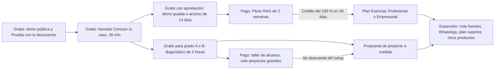
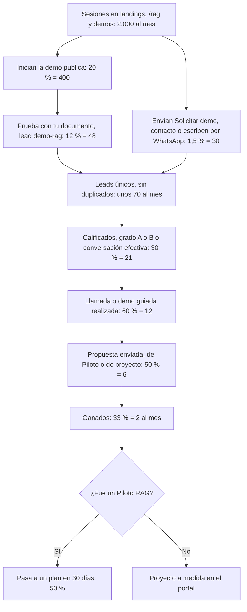
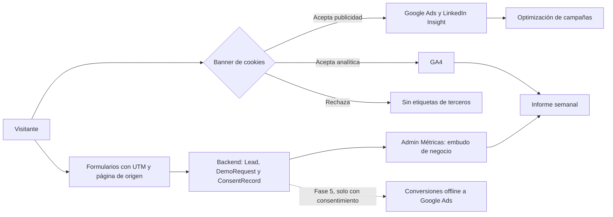
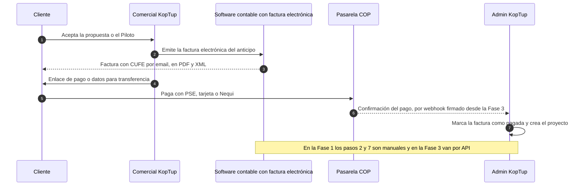
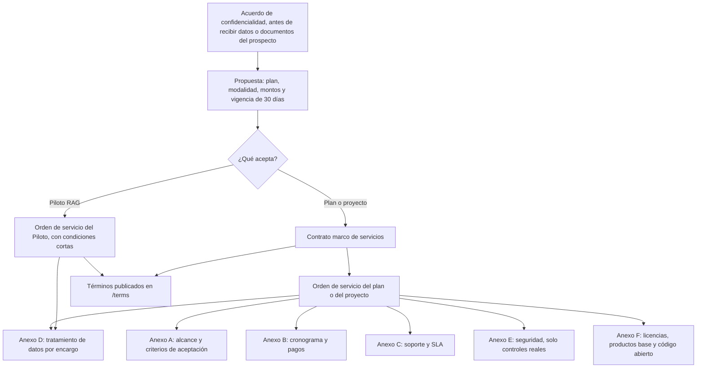
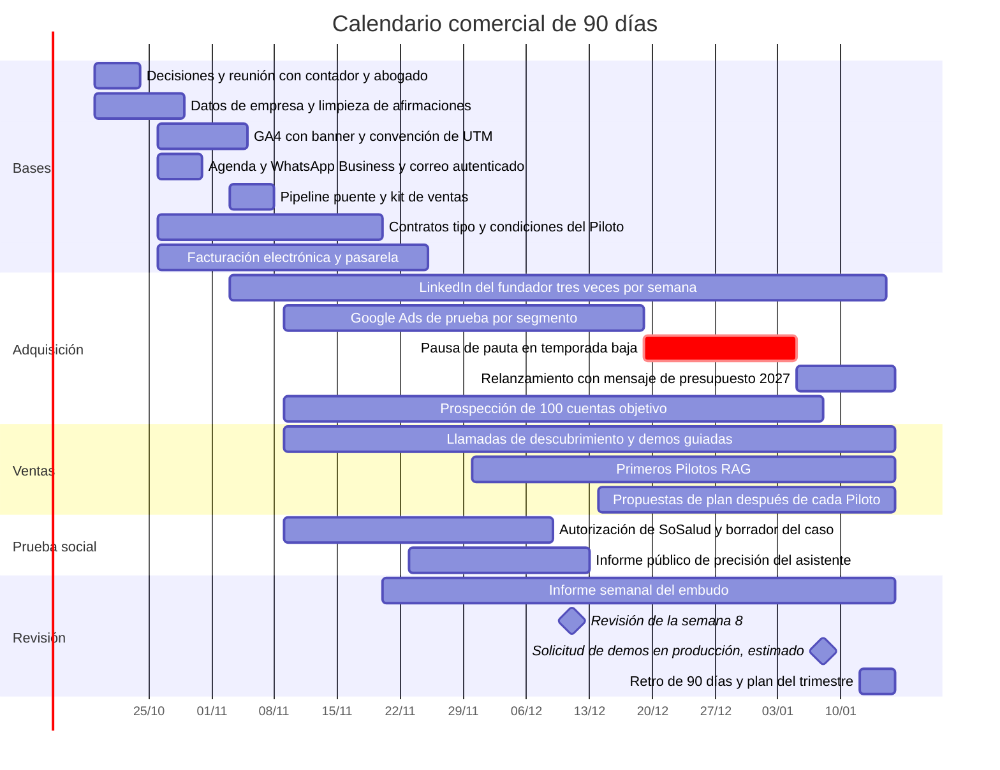

# Comercial, marketing y legal

> Ruta(s): transversal. Afecta a `/`, `/rag` y `/rag/<sector>`, `/productos/<slug>`, `/services`, `/contact`, `/solicitar-demo`, `/privacy` y `/terms`; en la Fase 5 suma `/casos/<slug>`, `/blog` y `/en/*`; en el panel, **Admin › Leads** y **Admin › Métricas** · Archivos principales: `apps/web/src/components/seo/StructuredData.tsx`, `apps/web/src/lib/seo-config.ts`, `apps/web/src/app/{layout.tsx,sitemap.ts}`, `apps/web/public/{robots.txt,llms.txt}`, `apps/web/middleware.ts`, `apps/web/next.config.js`, `apps/web/src/lib/services-catalog.ts`, `apps/web/src/lib/{site,rag-plans}.ts` (rama `rag-reposicionamiento`), `apps/web/src/lib/company.ts` (nuevo), `apps/backend/src/models/{Contact,Quote}.ts`, `apps/backend/src/services/{email,whatsapp}.service.ts` · Prioridad: **P0** · Esfuerzo total: **XL** (≈ 45 días-dev, de los cuales ≈ 24 van en la Fase 1; ≈ 25 días de trabajo del dueño; más un contador y un abogado externos)

> **Importante:** esta página es un plan de negocio. Los puntos tributarios y legales sirven para preparar la conversación con el contador y con un abogado, pero no reemplazan su concepto. Todo lo marcado como **"validar"** se cierra en el [registro de decisiones](#17-registro-de-decisiones), con fecha y responsable.


*Captura de producción (rama `main`), antes del reposicionamiento RAG. Las cifras del hero son el ejemplo más visible del problema de prueba social que resuelve esta página. Páginas relacionadas: [Flujo del cliente](03-Flujo-del-Cliente.md), [Sistema de demos](04-Sistema-de-Demos.md), [Panel de administración](05-Panel-de-Administracion.md), [Legal](Seccion-Legal.md), [Servicios y precios](Seccion-Servicios-y-Precios.md), [Landings SEO y de campaña](Seccion-Landings-SEO.md), [Contacto](Seccion-Contacto.md), [Nosotros](Seccion-Nosotros.md), [Roadmap](12-Roadmap.md).*

---

## Objetivo

Las demás páginas de la wiki describen **pantallas**. Esta describe **cómo se vende**: a quién, con qué mensaje y con qué prueba; cómo se mide cada lead desde el anuncio hasta el pago; cómo se le hace seguimiento; cómo se cobra y se factura de forma legal, y bajo qué contratos. Tiene que lograr cinco cosas:

1. **Un mensaje claro por segmento.** El producto principal son los **sistemas RAG**. Las **otras soluciones a medida** son la segunda línea. Nadie debe salir del sitio sin entender qué vende KopTup.
2. **Medir cada lead de punta a punta:** fuente → lead → llamada → propuesta → cliente → cobro. La medición respeta el consentimiento (Ley 1581 de 2012).
3. **Un proceso comercial repetible:** etapas del pipeline con definiciones, agenda real, WhatsApp Business, secuencias de email y una rutina semanal que el dueño pueda delegar a un comercial (`sales`).
4. **Poder cobrar y facturar sin riesgos:** facturación electrónica DIAN, pasarela de pagos, contratos tipo, SLA y política de datos.
5. **Prueba social honesta:** cero cifras sin fuente y casos reales con autorización escrita.

| Indicador de negocio | Por qué importa | Meta inicial a 90 días (a validar) |
|---|---|---|
| Pilotos RAG vendidos | Es la oferta de entrada del producto principal | ≥ 3 |
| Pilotos que pasan a un plan dentro de los 30 días | Valida el producto y el precio | ≥ 50 % |
| Leads con fuente identificada (UTM, canal o referido) | Sin esto no se sabe dónde invertir | ≥ 90 % |
| Afirmaciones sin fuente en el sitio | Confianza y riesgo legal (Ley 1480 de 2011) | 0 |
| Facturas electrónicas emitidas dentro de 1 día hábil del hito de cobro | Flujo de caja | 100 % |

---

## Estado actual

La evidencia es de la rama `main`. Cuando la rama `rag-reposicionamiento` ya corrige algo, se indica.

| Tema | Qué hay hoy | Evidencia |
|---|---|---|
| Posicionamiento | `main` vende "Desarrollo de Software a Medida". La rama RAG reposiciona el sitio en sistemas RAG, pero aún no se ha fusionado | `app/layout.tsx` líneas 20–24 (title y plantilla); `lib/site.ts` en la rama (`HOME_TITLE`) |
| Cifras de la home | "100+" proyectos, "50+" clientes, "24/7" y "5★", escritas en el código | `app/page.tsx` líneas 77–81 |
| Casos en `/about` | SoSalud (cliente real, con su monto publicado), más dos casos sin cliente identificable y con métricas sin fuente ("+3x leads cualificados", "-60 % tiempo de cierre mensual") | `app/about/page.tsx` líneas 242–270 |
| Contradicciones de datos | `/about` dice "2026, año de fundación" y "8+ años construyendo software". El JSON-LD dice `foundingDate: '2019'` y `numberOfEmployees: 5`. `llms.txt` dice "Año de fundación: 2019" y "opción reconocida" | `about/page.tsx` líneas 272–300; `components/seo/StructuredData.tsx` líneas 61–62; `public/llms.txt` líneas 12 y 17 (sigue igual en la rama) |
| Reseñas inventadas en datos estructurados | Tres bloques `aggregateRating` (4,9 con 67 reseñas y 4,8 con 50), más otro en la landing de desarrollo web con `priceRange: '$499 - $50,000 USD'`. KopTup no tiene reseñas publicadas | `StructuredData.tsx` líneas 96–102, 148–153 y 257–263; `app/desarrollo-web-colombia/layout.tsx` líneas 78–85. La rama quita los `aggregateRating`, pero conserva `foundingDate`, `numberOfEmployees` y el `priceRange` |
| Afirmaciones de cumplimiento | "Construimos software alineado con HIPAA/SOC 2/ISO 27001", en voseo | `messages/offerings/_page.es.json` línea 62 |
| Dominio canónico | El sitio vive en `www`, pero `metadataBase`, los canónicos, el sitemap y `robots.txt` usan el dominio sin `www` | `lib/seo-config.ts` línea 8; `app/layout.tsx` línea 20; `app/sitemap.ts` línea 4; `public/robots.txt` (última línea). **La rama lo corrige** con `SITE_URL` en `lib/site.ts` |
| Sitemap | Lista las 28 demos, incluidas las que pasarán a `solicitud` o `privado`. Usa una sola fecha fija para todo el sitio | `app/sitemap.ts` líneas 11 y 19 |
| Rastreadores de IA | `robots.txt` bloquea `GPTBot` y `CCBot`, sin una decisión explícita para los rastreadores de búsqueda con IA | `public/robots.txt`; [Landings SEO](Seccion-Landings-SEO.md) lo deja como decisión pendiente |
| Idioma | El inglés se elige por cookie y no hay rutas `/en`. Por eso no se declara `hreflang` y el inglés no se indexa | `middleware.ts` líneas 3–8; `app/layout.tsx` líneas 80–83 |
| Analítica | Ni GA4 ni ninguna otra herramienta. La rama RAG la especifica (GA4, Google Ads y LinkedIn Insight con banner), pero aún no está implementada. La CSP solo permite scripts propios | `apps/web/package.json` (no hay dependencias de analítica); `next.config.js` línea 79 |
| Agenda | "Agendar llamada" abre un `mailto:` | `app/contact/page.tsx` líneas 112–121 |
| WhatsApp | Se usa solo para avisos internos (Twilio, WhatsApp Business API o UltraMsg, según variables de entorno). No hay número comercial publicado ni reglas de atención | `backend/src/services/whatsapp.service.ts` líneas 1–24 |
| Email | Transporte SMTP con un buzón genérico por defecto. No hay proveedor transaccional, ni subdominio de envíos, ni baja de comunicaciones, ni secuencias | `backend/src/services/email.service.ts` línea 27 |
| CRM | No existe. `Contact` es un buzón con estados `new / read / responded`, sin fuente, sin UTM, sin consentimiento y sin responsable | `backend/src/models/Contact.ts` líneas 3–13 |
| Propuestas | `Quote` guarda nombre, email, servicio, descripción y `pending / contacted / completed`. No hay plantilla de propuesta | `backend/src/models/Quote.ts` líneas 3–10 |
| Precios | Catálogo en COP con `TRM_FALLBACK = 4000` y descuentos por ciclo (10 % semestral, 20 % anual) que no se pueden cobrar porque no hay cobro recurrente. Los planes RAG viven en `lib/rag-plans.ts` en la rama | `lib/services-catalog.ts` líneas 116 y 171–175 |
| Pagos | No hay pasarela. Las únicas menciones a pagos son textos de proyectos de ejemplo | Búsqueda de `stripe`, `wompi` y `payu` en `apps/backend/src`: solo aparecen en `db/seeds` |
| Facturación | El portal muestra "facturas" que no son facturas electrónicas DIAN; el modelo usa USD por defecto | [Panel de administración](05-Panel-de-Administracion.md), sección de facturas; [Portal del cliente](06-Portal-del-Cliente.md) |
| Términos | Anticipo del 50 % y saldo al final, pago a 15 días, mora del 1,5 % mensual. "Derechos de uso" del código al pagar, sin cesión explícita. KopTup puede usar cualquier proyecto en su portafolio salvo que haya un NDA | `messages/es.json` líneas 496–501 y 511–527 |
| Datos personales | La política no cumple la Ley 1581, ningún formulario pide autorización y no hay banner de cookies | [Legal](Seccion-Legal.md), sección "Estado actual" |


*Hoy el mismo producto tiene un precio en `/services`, otro en el panel admin y otro en la especificación RAG. La sección 13 fija la regla de una sola fuente de precios.*

---

## Problemas detectados

1. **El sitio dice dos cosas a la vez.** `main` vende "software a medida" en general y la rama RAG vende sistemas RAG. Hasta fusionar la rama, la pauta pagaría clics para un mensaje que el sitio no sostiene.
2. **La prueba social no se puede defender.** "100+ proyectos", "50+ clientes", "5★", reseñas en el JSON-LD sin reseñas reales, porcentajes de mejora sin fuente y un año de fundación contradictorio. Es un riesgo de publicidad engañosa (Ley 1480 de 2011, vigilada por la SIC) y le quita credibilidad al resto del sitio.
3. **No hay medición.** Sin analítica ni UTM no se sabe qué canal trae clientes. Además, la medición que viene en la rama debe cargarse **solo con consentimiento**.
4. **Cada lead se pierde entre canales.** El formulario de contacto, WhatsApp y el email no confluyen en un registro con etapa, responsable y próxima acción. El modelo `Lead` del [Sistema de demos](04-Sistema-de-Demos.md) lo resuelve, pero su pantalla llega en el hito 1b; hace falta una solución puente.
5. **"Agendar llamada" es un `mailto:`.** Es el CTA de mayor intención del sitio y no tiene agenda detrás.
6. **No hay seguimiento automático del lead principal.** El sistema de demos define secuencias para los accesos a demos, pero **no para "Prueba con tu documento"**, que es el imán principal del camino RAG.
7. **El email no está listo para enviar comunicaciones comerciales:** no hay proveedor transaccional, autenticación del dominio (SPF, DKIM y DMARC) ni baja con un clic.
8. **No se puede cobrar en línea.** No hay pasarela, la suscripción no tiene cobro recurrente y Stripe, previsto para USD, puede no estar disponible para una empresa constituida en Colombia (ver sección 14).
9. **La facturación electrónica de la propia KopTup no está resuelta en el producto.** El portal muestra documentos de cobro, no facturas electrónicas.
10. **Los contratos no protegen el modelo de "productos base".** En Colombia, en una obra por encargo se presume que los derechos patrimoniales pasan al cliente salvo pacto en contrario (validar). Si el contrato no reserva de forma explícita los productos base, KopTup podría perder el derecho a reutilizarlos.
11. **No hay SLA definido** para los planes RAG con mensualidad, aunque el plan Profesional promete "soporte prioritario".
12. **Faltan las decisiones del dueño** que bloquean a otras páginas: política de mantenimiento, pasarela, cobro en USD, entidad legal, rastreadores de IA y presupuesto de pauta.
13. **SEO técnico incompleto:** dominio canónico, sitemap con demos que pasarán a `noindex`, sin imagen OG por producto, sin contenido nuevo y sin inglés indexable.
14. **Tono y marca inconsistentes:** voseo en `/services` y en las landings, "usted" en las páginas legales, "Koptup" y "KopTup" mezclados.

---

## Plan detallado

### 1. Posicionamiento

Una sola marca, **KopTup**, con dos líneas de negocio en este orden (la actualización del dueño prevalece sobre cualquier versión anterior):

| Línea | Qué es | Promesa | Dónde vive |
|---|---|---|---|
| **Sistemas RAG** (principal) | IA que responde con los documentos de cada empresa y cita la fuente | "Respuestas con la fuente citada. Pruébalo sin registro y valídalo en un Piloto de 2 semanas" | Home, `/rag`, `/rag/salud`, `/rag/legal`, `/rag/soporte`, `/chatbots-ia`, `/services#planes-rag`, `/demo/chatbot` |
| **Otras soluciones a medida** | Estudio de software a medida que **parte de productos base listos**: 26 productos con demo navegable | "Ves el producto funcionando antes de comprarlo. Pagas la adaptación a tu proceso, no un desarrollo desde cero" | `/services#otras-soluciones`, `/productos/<slug>`, `/demo` |

**Declaraciones de posicionamiento** (texto interno; de aquí salen los titulares, los anuncios y el discurso de venta):

> **RAG.** Para empresas de Colombia y Latinoamérica que tienen su conocimiento repartido en manuales, contratos, políticas y normas, KopTup instala **sistemas RAG**: una IA que responde con los documentos de la empresa y muestra de qué documento y página sale cada respuesta. A diferencia de un asistente de uso general, está configurada para responder solo con tus documentos y decir "no lo encuentro" cuando la respuesta no está. Se valida en un Piloto de 2 semanas con un informe de precisión medido, y la opera un equipo en Colombia.

> **A medida.** Para empresas que necesitan un sistema propio (ERP, CRM, POS, LMS…) y no quieren pagar un desarrollo desde cero ni adaptarse a un software rígido, KopTup parte de un producto base con demo navegable y lo adapta a su proceso. Ves el producto antes de comprarlo, pagas la adaptación y recibes el código de lo que se construye para ti, más una licencia de uso del producto base.

**Pilares del mensaje.** Cada pilar tiene una prueba que el visitante puede verificar.

| Pilar | Qué decimos | Prueba verificable | Dónde se demuestra |
|---|---|---|---|
| Respuestas con fuente | "Cada respuesta cita el documento y la página" | La demo pública lo hace con el documento de ejemplo | `/demo/chatbot` |
| Pruébalo antes de comprar | "Demo sin registro, prueba con tu documento y Piloto de 2 semanas" | Demo pública, "Prueba con tu documento" y condiciones del Piloto publicadas | `/demo/chatbot`, `/services#planes-rag`, `/terms#piloto` |
| Tus datos protegidos | "Tus documentos se usan solo para responder tus preguntas. En la demo se borran a la hora. En el plan Empresarial, pueden quedar en tu nube" | Política de datos, anexo de tratamiento y controles reales | `/privacy`, `/rag#seguridad` |
| Precios claros | "Planes publicados en COP y USD, más IVA si aplica" | Tabla de planes | `/services#planes-rag` |
| Equipo en Colombia | "Te atendemos en español, de lunes a viernes de 8:00 a 17:00, hora de Colombia" | Horario y canales en un solo lugar (`lib/company.ts`) | `/contact` |

**Tono y estilo**

- **"Tú"** en todo el sitio, en los emails y en WhatsApp. Se elimina el voseo ("elegí", "querés", "suscribite") y el "usted" de las páginas legales.
- Español colombiano neutro. Anglicismos solo cuando no hay palabra mejor; "setup" se conserva porque el mercado lo usa, con la explicación "pago único de implementación".
- La marca se escribe **KopTup**, siempre. El dominio sigue en minúsculas.
- Precios: "COP 9.900.000" y "USD 2.990", como ya formatea `lib/rag-plans.ts`, con "+ IVA si aplica" junto a todo precio en COP.
- Sin superlativos sin prueba: nada de "el mejor", "líder" ni "reconocido".

**Alternativas con las que nos comparan**

| Alternativa | Cuándo es mejor para el cliente | Nuestro argumento |
|---|---|---|
| Asistentes de IA de uso general con licencia corporativa | Productividad personal sobre documentos que ya están en su suite de oficina | Respuestas solo con documentos aprobados, citas verificables, permisos por rol, canal de WhatsApp, informe de precisión y soporte local |
| Chatbots de reglas o flujos para WhatsApp | Preguntas cerradas y repetitivas (horarios, estados de pedido) | El RAG responde preguntas abiertas sobre documentos largos y se combina con flujos cuando hace falta |
| Desarrollo interno | La empresa tiene un equipo propio de datos e IA | El Piloto sale en 2 semanas sin contratar a nadie; el plan Empresarial incluye el código fuente |
| Software empaquetado (ERP o CRM por suscripción) | El proceso es estándar y el presupuesto es bajo | Adaptación al proceso, código propio y sin costo por usuario (línea a medida) |

**Lo que no decimos y qué decimos en su lugar**

| No decimos | Por qué | Decimos en su lugar |
|---|---|---|
| "100+ proyectos", "50+ clientes", "más de 100 proyectos entregados" | No hay respaldo y contradice `/about` | "Equipo en Colombia", y casos reales con autorización |
| "5★", "4,9 de 67 reseñas" (en el JSON-LD) | No hay reseñas publicadas | Nada, hasta tener reseñas reales en plataformas de terceros |
| "Soporte 24/7" | El equipo atiende de lunes a viernes de 8:00 a 17:00 | "El asistente responde a cualquier hora. El equipo te atiende de lunes a viernes de 8:00 a 17:00" |
| "Reduce costos 60 %", "10x", "+500 tareas al día", "80 %", "3x leads", "-60 % de tiempo de cierre" | Sin fuente | La métrica medida en un piloto, con su método y fecha |
| "Alineado con HIPAA, SOC 2 o ISO 27001" | No hay certificación ni auditoría | La lista de controles que el código tiene hoy |
| "Aprende solo", "aprende de cada conversación" | No es cierto en un RAG | "Se actualiza cuando agregas o cambias documentos" |
| "Garantizamos", "sin límites" | Promesas absolutas | Los topes y condiciones del plan |
| "Desde $499 USD" | No corresponde a ningún precio actual | El precio del Piloto y de los planes |
| "Fundada en 2019", "opción reconocida" | Contradice `/about` y no se puede verificar | El año real, tomado de `lib/company.ts` |

La lista vive en `apps/web/src/config/claims-blacklist.json`. La usan una prueba E2E de las landings ([Landings SEO](Seccion-Landings-SEO.md)) y un script nuevo, `apps/web/scripts/check-claims.mjs`, que revisa `src/`, `messages/` y `public/` en el CI y falla si encuentra una frase prohibida. Los datos simulados dentro de las demos quedan fuera del script, porque su limpieza va en la página de cada producto.

### 2. Cliente ideal, personas y mensajes por segmento

**Cliente ideal**

| Criterio | RAG | Otras soluciones a medida |
|---|---|---|
| Tamaño | 20 a 500 personas | 20 a 500 personas |
| País | Colombia primero; Latinoamérica hispana en USD | Colombia |
| Señales de compra | Muchos documentos internos, preguntas repetidas del equipo o de clientes, áreas de soporte, jurídica o calidad, atención por WhatsApp | Procesos en Excel, software que no se ajusta al proceso, crecimiento reciente, varias sedes |
| Capacidad de pago | Puede pagar el Piloto (COP 3,9 M) y el plan Esencial (≈ COP 27,8 M el primer año) | Puede pagar el plan Básico del producto |
| Quién decide | Gerente general, director de operaciones o de servicio, director jurídico. TI evalúa | Gerente general, director financiero o de operaciones |
| Fuera de perfil | Personas naturales, estudiantes, "chatbot gratis", proyectos que exigen cargar datos de pacientes en el Piloto | Clones de plataformas grandes sin presupuesto, proyectos sin dueño del lado del cliente |

**Personas compradoras**

| Persona | Qué le duele | Qué le importa | Qué va a preguntar | Qué le mostramos |
|---|---|---|---|---|
| Gerente general de una pyme | El equipo pierde horas buscando información y repite errores | Costo total y retorno | "¿Cuánto cuesta en total y en cuánto tiempo se ve?" | Costo del primer año (sección 13) y el Piloto con crédito |
| Director de operaciones o de servicio al cliente | Respuestas distintas para la misma pregunta; WhatsApp saturado | Consistencia, tiempos de respuesta | "¿Qué pasa si la IA responde mal?" | Citas, "no lo encuentro", paso a un agente e informe de precisión |
| Director jurídico | Encontrar cláusulas y conceptos en cientos de documentos | Confidencialidad y exactitud | "¿Dónde quedan mis contratos?" | Anexo de tratamiento, NDA previo y opción en su nube |
| Coordinador de calidad o auditoría en salud | Protocolos, guías y normas que cambian; glosas | Cumplimiento y trazabilidad | "¿Sirve con datos de pacientes?" | Piloto con documentos administrativos sin pacientes; demo privada de auditoría por invitación |
| Jefe de TI (evaluador) | Otro proveedor que integrar y vigilar | Seguridad, integración y salida | "¿Cómo se integra y cómo me voy si no funciona?" | Integraciones por plan, exportación de datos y anexo de seguridad |

**Mensajes por segmento.** Las landings de la rama RAG ya tienen sus titulares; esta tabla es la referencia para anuncios, LinkedIn, emails y la revisión de coherencia.

| Segmento | Prioridad | Dolor | Mensaje principal (titular) | Oferta de entrada | Demo o prueba | Landing | Objeción frecuente y respuesta |
|---|---|---|---|---|---|---|---|
| **Salud** (IPS, clínicas, operadores administrativos, pagadores) | P1, con pauta | Protocolos, guías, manuales tarifarios y normas dispersos; glosas por errores administrativos | "Tu equipo encuentra el protocolo, la norma o la tarifa correcta en segundos, con la página citada" | Piloto RAG con documentos administrativos (sin datos de pacientes) | `/demo/chatbot`; demo privada de auditoría de cuentas médicas por invitación | `/rag/salud` | "Son datos sensibles" → el Piloto no usa datos de pacientes; en producción, nube del cliente u *on-premise* (Empresarial), anexo de tratamiento y KopTup como encargado |
| **Legal** (firmas y áreas jurídicas) | P1, con pauta | Buscar cláusulas, conceptos y antecedentes en cientos de documentos | "Pregúntale a tus contratos: la respuesta trae la cláusula y el documento" | Piloto RAG con hasta 100 documentos | `/demo/chatbot` | `/rag/legal` | "Es confidencial" → NDA antes del Piloto, borrado al terminar y opción en su nube |
| **Soporte y atención al cliente** (transversal) | P1, con pauta | Agentes que responden distinto; base de conocimiento desactualizada; WhatsApp saturado | "Respuestas consistentes por web y WhatsApp, basadas en tus políticas, con paso a un agente" | Piloto que pasa al plan Profesional (web y WhatsApp) | `/demo/chatbot`, [Help desk con IA](Producto-helpdesk-ia.md) | `/rag/soporte`, `/chatbots-ia` | "¿Y si responde mal?" → solo responde con documentos, dice "no lo encuentro", deriva a un agente y se mide con el informe de precisión |
| **Servicios profesionales** (contables, consultoras, intermediarios de seguros) | P2 | Clientes en Excel, conocimiento en la cabeza de pocos | "Tus clientes y tu conocimiento en un solo lugar: CRM, automatizaciones y un asistente con tus documentos" | Diagnóstico de procesos de 2 h o Piloto RAG | [CRM con IA](Producto-crm-ia.md), [Automatización](Producto-automatizacion-workflows.md) | `/productos/crm-ia`, `/productos/automatizacion-workflows` | "Ya uso otro CRM o Excel" → integración o migración y automatizaciones concretas |
| **Retail** (cadenas, tiendas en línea, distribuidores) | P2 | Inventario, caja y fidelización en sistemas que no se hablan | "Vende en tienda y en línea con el mismo inventario, y fideliza con puntos" | Diagnóstico de procesos de 2 h | [POS](Producto-pos-retail.md), [E-commerce](Producto-ecommerce.md), [Fidelización](Producto-loyalty-fidelizacion.md) | `/productos/pos-retail`, `/productos/ecommerce` | "Ya tengo un POS" → migración por sede y facturación electrónica integrada |
| **Logística** (bodegas, operadores 3PL, distribución) | P2 | Inventario inexacto, errores de alistamiento, procedimientos en PDF | "Sabe qué hay en cada ubicación de tu bodega y despacha a tiempo" | Diagnóstico de bodega (visita de un día o videollamada con recorrido) | [WMS](Producto-wms-logistica.md), [Delivery](Producto-app-delivery.md) (demos con solicitud) | `/productos/wms-logistica` | "Implementarlo detiene la bodega" → salida por fases, empezando por una zona |
| **Educación** (colegios, universidades, centros de formación, capacitación corporativa) | P3 | Reglamentos dispersos; capacitación interna sin seguimiento | "Cursos con seguimiento real y un asistente que responde los reglamentos con la fuente" | Plan Esencial sobre reglamentos o demo del LMS | [LMS](Producto-lms-elearning.md) | `/productos/lms-elearning`, `/rag` | "El presupuesto va por periodos académicos" → arranque en el intersemestral |

En los primeros 90 días **la pauta paga solo los tres segmentos P1** (todos del camino RAG). Los segmentos P2 y P3 llegan por SEO, LinkedIn y referidos hasta que el sistema de solicitud de demos esté en producción.

### 3. Ofertas de entrada

Cada paso tiene un siguiente paso claro y lo que se paga en una oferta de entrada se descuenta de la siguiente.



| Oferta | Para quién | Precio | Duración | Qué recibe el cliente | Siguiente paso |
|---|---|---|---|---|---|
| Demo pública y "Prueba con tu documento" | Cualquiera | Gratis | Inmediata | Respuestas con cita sobre el documento de ejemplo o el suyo | Llamada o Piloto |
| Conocer tu caso | Leads de cualquier grado | Gratis | 30 min | Recomendación de plan o de producto | Demo guiada, Piloto o diagnóstico |
| Demo guiada o acceso a una demo | Leads aprobados ([Sistema de demos](04-Sistema-de-Demos.md)) | Gratis | 45 min o 14 días | Recorrido con datos de su sector | Propuesta |
| Diagnóstico de procesos o de bodega | Otras soluciones, grado A o B | Gratis | 2 h | Resumen de alcance de una página con el plan recomendado y un rango de precio | Propuesta |
| **Piloto RAG** | RAG | COP 3.900.000 / USD 1.200, + IVA si aplica | 2 semanas | Una fuente, hasta 100 documentos, interfaz web con citas e informe de precisión con 50 preguntas | Plan, con crédito del 100 % si contrata en 30 días |
| Taller de alcance | Proyectos grandes a medida (ERP, WMS, salud) | Lo define el dueño (sugerencia: el valor de 2 a 3 días de trabajo) | 2 a 3 días | Documento de alcance, arquitectura y cronograma | Propuesta; se descuenta del setup si contrata en 60 días |

Los pilotos de otros productos que proponen sus páginas (por ejemplo, el de [Voice AI](Producto-voice-ai-callcenter.md)) siguen esta misma regla: precio fijo definido por el dueño y abonable al setup.

### 4. Embudo y metas numéricas

Son **metas iniciales para el mes 3** (ritmo mensual), a validar con 8 semanas de datos reales, como fija [Flujo del cliente](03-Flujo-del-Cliente.md). No son resultados actuales.



| Etapa | Definición | Fuente del dato | Meta del mes 3 |
|---|---|---|---|
| Sesiones | Sesiones en `/`, `/rag/*`, `/productos/*`, `/services` y demos | GA4 (con consentimiento; se corrige por la tasa de aceptación del banner) | 2.000 |
| Inician la demo | Evento `demo_start` sobre sesiones | GA4 | 20 % |
| Leads de "Prueba con tu documento" | Leads con `source.channel = demo_rag` | Base de datos | 12 % de `demo_start` |
| Formularios y WhatsApp | Solicitudes, contactos y conversaciones registradas como Lead | Base de datos | 1,5 % de las sesiones |
| Calificados | Lead en `calificado` o más adelante | **Admin › Leads** | 30 % |
| Llamada realizada | Actividad `reunion` o `llamada` con resultado "contactado" | `LeadActivity` | 60 % de los calificados |
| Propuesta | Lead en `propuesta` | **Admin › Leads** | 50 % |
| Ganado | Lead en `ganado` | **Admin › Leads** | 33 % de las propuestas |
| Piloto → plan | Pilotos que firman un plan antes de que venza el crédito | Propuestas y facturas | 50 % |

**Acumulado a 90 días.** El mes 1 se va casi entero en preparar las bases (sección 18): unos 140 leads, 12 propuestas, al menos 3 Pilotos RAG y al menos 1 proyecto a medida en propuesta.

**Cuánto se puede pagar por un cliente.** Valor del primer año (sin IVA):

| Producto | Primer año (COP) | Primer año (USD) | Techo de costo de adquisición sugerido (20 %) |
|---|---|---|---|
| Piloto RAG solo | 3.900.000 | 1.200 | COP 780.000 |
| Plan Esencial (setup + 12 mensualidades) | 27.780.000 | 8.390 | COP 5.556.000 |
| Plan Profesional (setup + 12 mensualidades) | 60.780.000 | 18.170 | COP 12.156.000 |
| Piloto ganado, si el 50 % pasa a Esencial (con el crédito descontado) | ≈ 15.840.000 esperado | — | **≈ COP 3.200.000 por Piloto ganado** |

Con un presupuesto de pauta de prueba de COP 2.500.000 al mes y 2 clientes al mes, el costo de pauta por cliente queda por debajo del techo. La revisión de la semana 8 decide si se sube, se mantiene o se corta.

### 5. Pipeline comercial (CRM)

El CRM es **Admin › Leads**, sobre el modelo `Lead` del [Sistema de demos](04-Sistema-de-Demos.md). No se contrata un CRM externo, para no duplicar datos personales ni pagar licencias. Las etapas son las de la sección 6.3 de esa página; aquí se fijan sus **definiciones operativas**.

| Etapa (`Lead.stage`) | Entra cuando | Sale cuando | Acción obligatoria | Máximo sin actividad | Probabilidad para el pronóstico |
|---|---|---|---|---|---|
| `nuevo` | Llega por cualquier canal | Hay una primera respuesta humana | Responder dentro del SLA: grado A en 2 h hábiles, B en 4 h, C y D en 1 día hábil | 1 día hábil | 5 % |
| `calificado` | Solicitud aprobada, o conversación con al menos 3 de las 4 respuestas de calificación (abajo) | Primer acceso a una demo o demo guiada realizada | Próxima acción con fecha | 7 días | 15 % |
| `en_demo` | Primer acceso con un `DemoGrant` (automático) o demo guiada registrada | Pide propuesta o el comercial la envía | Seguimiento el día 2 y el día 7 | 7 días | 30 % |
| `propuesta` | Propuesta enviada y registrada | Acepta, pide ajustes o rechaza | Seguimiento el día 2, el día 5 y 3 días antes del vencimiento | 10 días | 50 % |
| `negociacion` | Pide cambios de alcance, precio o condiciones | Acepta o descarta | Nueva versión en ≤ 2 días hábiles | 14 días | 70 % |
| `ganado` | Acepta y paga el anticipo (o firma, si se pactó otro esquema) | — | Factura, arranque y proyecto en el portal | — | 100 % |
| `perdido` | Descarta; el motivo es obligatorio | Solo vuelve con una solicitud nueva | Motivo: precio, tiempo, eligió a otro, sin presupuesto, sin respuesta u otro | — | 0 % |
| `nutricion` | Sin respuesta después de la secuencia, o "más adelante" | Vuelve a interactuar | Contenido solo con autorización de marketing; revisión trimestral | 6 meses, luego `perdido` | 2 % |

**Las 4 preguntas de calificación** (se registran en la nota de la llamada):

1. **Necesidad:** ¿qué quiere resolver, con qué documentos o con qué proceso?
2. **Situación actual:** ¿dónde están hoy los documentos o qué sistema usa (Drive, SharePoint, carpetas, ERP)?
3. **Decisor:** ¿quién aprueba la compra y quién más participa?
4. **Plazo y presupuesto:** ¿para cuándo lo necesita y el rango del Piloto o del plan cabe en su presupuesto?

**Higiene del pipeline**

- Todo lead abierto tiene responsable y **próxima acción con fecha**. La vista "Sin próxima acción" de **Admin › Leads** debe estar vacía cada viernes.
- Nadie pasa a `perdido` sin motivo, ni a `propuesta` sin la propuesta registrada.
- Los duplicados se fusionan por email (regla del modelo `Lead`).
- Las solicitudes de prueba del equipo se marcan `isTest` y no cuentan en las métricas.

**Rutina comercial**

| Frecuencia | Qué | Quién | Herramienta |
|---|---|---|---|
| Diaria, 7:45 | Leer el resumen diario: solicitudes nuevas, SLA en riesgo, accesos por vencer, leads calientes | Comercial | Email `sales_digest` ([Sistema de demos](04-Sistema-de-Demos.md), sección 11) |
| Diaria | Responder dentro del SLA; registrar cada llamada y cada conversación de WhatsApp | Comercial | **Admin › Leads** |
| Lunes, 30 min | Revisión del pipeline: leads sin próxima acción, propuestas por vencer, pronóstico del mes | Dueño y comercial | Kanban de **Admin › Leads** |
| Viernes | Informe semanal del embudo (sección 10) | Comercial | **Admin › Métricas** y GA4 |
| Mensual | Análisis de ganados y perdidos; ajuste de los pesos del puntaje (`config/scoring.ts`) contra los cierres reales | Dueño | **Admin › Métricas** |
| Trimestral | Revisión de precios, ofertas de entrada y segmentos | Dueño | Esta página |

**Pronóstico.** Valor estimado × probabilidad de la etapa, sumado por mes. En la Fase 1 se calcula a mano desde el kanban. Se propone un campo nuevo, `Lead.estimatedValueCOP` (P2), que se agrega a la sección 5.1 de [Sistema de demos](04-Sistema-de-Demos.md) para que **Admin › Métricas** lo calcule solo.

**Solución puente** mientras **Admin › Leads** no esté en producción (es la tarea 29 de [Sistema de demos](04-Sistema-de-Demos.md), hito 1b):

- Una hoja de cálculo en la cuenta de la empresa, con acceso solo para el equipo comercial y las mismas columnas y etapas de la tabla anterior. Es una base de datos personales más: entra en el inventario de la política ([Legal](Seccion-Legal.md)).
- Al salir **Admin › Leads**, un script `apps/backend/src/scripts/import-leads-csv.ts` la importa (idempotente por email, con `--dry-run`) y la hoja se borra.

### 6. Agenda de llamadas

La herramienta (Cal.com), los componentes `BookingInline` y `BookingButton` y el webhook están definidos en [Contacto](Seccion-Contacto.md). Aquí va la **configuración operativa**:

| Ajuste | Valor |
|---|---|
| Tipos de evento | "Conocer tu caso" (30 min), "Demo guiada" (45 min), "Arranque del Piloto RAG" (60 min), según [Contacto](Seccion-Contacto.md) |
| Disponibilidad | Lunes a viernes de 8:00 a 17:00 (Bogotá), sin festivos de Colombia |
| Aviso mínimo y ventana | Mínimo 4 horas hábiles de anticipación; reservas hasta 3 semanas adelante |
| Espacio entre reuniones | 15 min |
| Ubicación | Videollamada con enlace automático |
| Preguntas | Nombre, email, empresa, producto de interés (precargado), "¿Qué quieres resolver?" y "¿Dónde están hoy tus documentos?" |
| Recordatorios | Email 24 h antes y 1 h antes |
| Inasistencia | Un solo email para reprogramar el mismo día; el comercial registra "sin respuesta" |
| Enlaces | Con UTM por canal (`utm_source=agenda` desde los emails, por ejemplo) |
| Medición | `schedule_call_click` al abrir la agenda y `schedule_call_booked` cuando el widget confirma la reserva (Cal.com expone ese evento en su código insertado). El webhook del servidor (P2) es la fuente de verdad |

### 7. WhatsApp Business

El botón `WhatsAppButton`, el número en `lib/company.ts` y los mensajes de bienvenida y ausencia están en [Contacto](Seccion-Contacto.md). Aquí va la **operación**:

- **Fase 1: aplicación WhatsApp Business** en un número de la empresa, nunca uno personal.
  - **Perfil:** descripción ("Sistemas RAG: IA que responde con los documentos de tu empresa"), horario, sitio web y buzón comercial de rol.
  - **Catálogo:** Piloto RAG, plan Esencial, plan Profesional y "Demo sin registro", cada uno con su enlace.
  - **Etiquetas iguales a las etapas del pipeline:** Nuevo, Calificado, En demo, Propuesta, Cliente y Perdido. Así el comercial ve el estado sin abrir el panel.
- **Respuestas rápidas** (copy propuesto):

| Atajo | Texto |
|---|---|
| `/piloto` | "El Piloto RAG dura 2 semanas y cuesta COP 3.900.000 (USD 1.200) + IVA si aplica. Trabajamos con una fuente y hasta 100 documentos, y te entregamos un informe de precisión con 50 preguntas. Si contratas un plan en los 30 días siguientes, te descontamos el 100 %. ¿Agendamos 30 minutos para ver tu caso? {agenda}" |
| `/precios` | "Nuestros planes están publicados aquí: {planes}. Los precios en pesos son + IVA si aplica." |
| `/demo` | "Puedes probar el asistente ahora mismo, sin registro: {demo}. Si quieres, sube un documento tuyo en 'Prueba con tu documento'." |
| `/agenda` | "Elige el horario que te sirva: {agenda}. La llamada dura 30 minutos." |
| `/datos` | "Tratamos tus datos según nuestra política: {privacy}. Puedes pedirnos que los borremos cuando quieras." |

- **Reglas:**
  - Si hay interés, el Lead se registra **el mismo día** en **Admin › Leads** (o en la hoja puente).
  - No se piden ni se reciben documentos con datos personales o de salud por WhatsApp: se envía el enlace de "Prueba con tu documento" o se acuerda un canal seguro para el Piloto.
  - Sin listas de difusión ni mensajes masivos.
  - KopTup escribe primero solo a quien autorizó WhatsApp (casilla del formulario).
- **Fase 5:** la API de WhatsApp Cloud, a través de un proveedor, crea el Lead automáticamente y envía las plantillas aprobadas por Meta. La integración actual por Twilio se queda para los avisos internos al equipo.

### 8. Email: entregabilidad y secuencias

**Infraestructura** (prerrequisito de toda secuencia):

| Pieza | Decisión |
|---|---|
| Proveedor | Un servicio de correo transaccional con API, webhooks de rebote y queja, y buena reputación (se elige en la decisión D13). Reemplaza al transporte SMTP actual |
| Dominios | Los avisos operativos (acuses, invitaciones, vencimientos) salen del dominio principal. Las secuencias comerciales y el boletín, de un **subdominio dedicado a envíos comerciales**, para aislar su reputación |
| Autenticación | SPF y DKIM alineados. DMARC empieza en `p=none` con reportes y pasa a `quarantine` después de 4 semanas sin fallas |
| Baja | Cabeceras `List-Unsubscribe` y `List-Unsubscribe-Post` (baja con un clic, RFC 8058) en todo correo comercial, además del enlace `/baja?token=` ([Sistema de demos](04-Sistema-de-Demos.md)). Es lo que exigen Gmail y Yahoo a los remitentes masivos, y se aplica aunque KopTup envíe poco |
| Remitente | Nombre de la persona del equipo con un buzón de rol (por ejemplo, "Ana de KopTup"), nunca un buzón personal |
| Medición | Sin píxel de apertura (es poco fiable y menos respetuoso). Los clics se miden con UTM: `utm_source=email`, `utm_medium=email`, `utm_campaign=<secuencia>` y `utm_content=<paso>` |
| Reglas de envío | Las de la sección 11 de [Sistema de demos](04-Sistema-de-Demos.md): máximo 1 correo comercial por lead al día, de 8:00 a 19:00 (Bogotá). Esta página propone agregar "ni domingos ni festivos" mientras el asesor decide sobre la Ley 2300 de 2023 (D9) |

**Catálogo de secuencias.** Todas usan `OutboundMessage` con `sequenceKey` y `stepKey`, y se detienen si el lead agenda, responde, pide propuesta, se da de baja o pasa a `ganado` o `perdido`.

| Secuencia (`sequenceKey`) | Disparador | Pasos | Base de la comunicación | Fase |
|---|---|---|---|---|
| Accesos a demos | Solicitud, aprobación, uso, vencimiento | Definida en la sección 11 de [Sistema de demos](04-Sistema-de-Demos.md) | Autorización del formulario | Fase 1 |
| `seq_demo_rag` | Lead de "Prueba con tu documento" | Día 0, 2, 5 y 10 (textos abajo) | Autorización de la prueba: "contactarme sobre sus productos" (validar el alcance con el asesor) | Fase 1 |
| `seq_post_call` | Llamada registrada | Día 0: resumen y próximos pasos (plantilla que el comercial completa) | Relación comercial en curso | Fase 1 (manual) |
| `seq_proposal` | Propuesta enviada | Día 2 ("¿dudas?"), día 5 ("agendemos 20 min"), 3 días antes del vencimiento | Relación comercial en curso | Fase 1 manual, Fase 3 automática |
| `seq_pilot` | Piloto pagado | Arranque, día 7 (avance), día 14 (informe y propuesta de plan), día 20 tras el informe (recordatorio del crédito), día 30 (vence el crédito) | Contrato | Fase 1 manual, Fase 3 automática |
| `seq_client` | Lead `ganado` | Bienvenida al portal, encuesta de 2 preguntas a los 30 días, aviso de renovación 30 días antes | Contrato | Fase 3 |
| `newsletter` | Mensual | Novedades RAG, un artículo y un caso | **Solo con autorización de marketing** | Fase 5 |
| `waitlist_saas` | Producto que pasa a `disponible` | Un aviso | Lista de espera (`saas_lista_espera:<slug>`, ver [Servicios y precios](Seccion-Servicios-y-Precios.md)) | Fase 4 |

**Textos de `seq_demo_rag`** (variables como en [Sistema de demos](04-Sistema-de-Demos.md)):

**Día 0**: se envía una hora después de la prueba, solo si el borrado del documento quedó registrado.
> **Asunto:** Tu prueba con el asistente de KopTup
>
> Hola:
>
> Gracias por probar el asistente con tu documento. Como te prometimos, ya lo borramos.
>
> Lo que viste es el mismo motor que instalamos en empresas: responde con sus documentos y cita la página de donde sale cada respuesta.
>
> ¿Quieres saber cómo respondería con todos los documentos de tu empresa?
> **[Agendar 30 minutos]** · **[Conocer el Piloto RAG]**

**Día 2**
> **Asunto:** ¿Qué tan bien respondería con todos tus documentos?
>
> En el Piloto RAG lo medimos antes de que inviertas en un plan: cargamos hasta 100 documentos de una fuente, preparamos contigo 50 preguntas reales y te entregamos un informe con cuántas respondió bien y con qué fuente.
>
> Dura 2 semanas y cuesta COP 3.900.000 (USD 1.200) + IVA si aplica. Si contratas un plan en los 30 días siguientes, te lo descontamos completo.
>
> **[Agendar llamada]**

**Día 5**
> **Asunto:** Dónde quedan tus documentos (y quién los ve)
>
> Tres respuestas cortas: dónde se guardan, quién puede verlos y qué pasa cuando terminamos. Si tu empresa es de salud o legal, también puedes tener el sistema en tu propia nube (plan Empresarial). Lee el detalle: {{seguridadUrl}}

**Día 10**
> **Asunto:** ¿Lo dejamos para más adelante?
>
> Si ahora no es el momento, no te escribiremos más sobre esta prueba. Si quieres recibir novedades una vez al mes, actívalo aquí: {{optInUrl}}. Y si sí es el momento: {{agendaUrl}}.

El enlace `{{optInUrl}}` registra un `ConsentRecord` con `marketing = true` y canal `demo_rag`. Sin ese clic, el lead pasa a `nutricion` sin recibir el boletín.

**Recordatorio del crédito del Piloto** (`seq_pilot`):
> **Asunto:** Te quedan 10 días para usar el crédito de tu Piloto
>
> Hola {{nombre}}: el {{fechaLimite}} vence el crédito de COP {{valor}} de tu Piloto RAG. Si contratas el plan {{planRecomendado}} antes de esa fecha, lo descontamos completo del setup. ¿Revisamos juntos el informe? {{agendaUrl}}


### 9. Prueba social honesta y casos de estudio

**Reglas**

1. **Ninguna cifra sin fuente.** Cada número dice de dónde sale: "medido en el informe de precisión del Piloto, 50 preguntas, marzo de 2027".
2. **Cada caso lleva una etiqueta:** **Cliente**, **Producto propio** o **Uso interno**, como en las tarjetas de [Home](Seccion-Home.md) y [Nosotros](Seccion-Nosotros.md).
3. **Nombre, logo, monto y cita solo con autorización escrita** del cliente. Sin ella, el caso es anónimo ("Operador administrativo del sector salud, Bogotá"). Las banderas `authorized` y `amountPublic` viven en `CASES` de `lib/company.ts`.
4. **No se paga por opiniones.** No se dan descuentos a cambio de una reseña o de un testimonio positivo.
5. **Nunca `aggregateRating` en los datos estructurados de la propia empresa.** Google no muestra reseñas propias de una organización, y publicarlas sin reseñas reales es engañoso.
6. **La cláusula de portafolio de los términos actuales** (KopTup puede usar cualquier proyecto salvo que haya un NDA) se reemplaza por una **referencia comercial opcional**: una casilla aparte en el contrato (sección 16).

**Inventario: qué se quita**

| Afirmación | Dónde está | Acción | Página que lo ejecuta |
|---|---|---|---|
| 100+, 50+, 24/7 y 5★ | `app/page.tsx` líneas 77–81 | Se reemplazan por las 4 frases verificables de la rama RAG | [Home](Seccion-Home.md) |
| Casos "+3x" y "-60 %" | `about/page.tsx` líneas 252–270 | Se eliminan | [Nosotros](Seccion-Nosotros.md) |
| `aggregateRating`, `foundingDate: 2019`, `numberOfEmployees` | `StructuredData.tsx`, `desarrollo-web-colombia/layout.tsx` | Se eliminan; los datos salen de `lib/company.ts` | Esta página (tarea 11) |
| "Alineado con HIPAA/SOC 2/ISO 27001" | `_page.es.json` línea 62 | Se reemplaza por los controles reales | [Servicios y precios](Seccion-Servicios-y-Precios.md) |
| 60 %, 10x, +500 tareas, 80 %, 3x | `/soluciones-ia`, `/chatbots-ia` | Se eliminan | [Landings SEO](Seccion-Landings-SEO.md) |
| "Fundada en 2019", "opción reconocida" | `public/llms.txt` | Se reescribe | Esta página (tarea 11) |
| Testimonios y métricas que inventa el generador de LinkedIn | `demo/linkedin-ads/components/` | Se eliminan | [Demo LinkedIn Ads](Demo-linkedin-ads.md) |

**Activos de prueba que se construyen**

| Activo | Etiqueta | Qué muestra | Condición | Fase | Dónde |
|---|---|---|---|---|---|
| SoSalud: VPN empresarial | Cliente | Contexto, solución y soporte | Autorización escrita para el nombre y el monto; sin ella, versión anónima | Borrador en la Fase 1; página en la Fase 5 | `/about`, después `/casos/sosalud-vpn` |
| **Informe público de precisión del asistente de KopTup** | Producto propio | 50 preguntas sobre documentos públicos de ejemplo: % de respuestas correctas con cita, % de "no lo encuentro" correctos y método | Reproducible, con fecha y versión del modelo | Fase 2 | `/rag#precision` y PDF descargable |
| Primer Piloto RAG | Cliente | Métrica del informe del Piloto y cita del cliente | Autorización escrita | Fase 5 (o antes, si se autoriza) | `/casos/<slug>` y home |
| Cómo usamos IA en nuestro marketing B2B | Uso interno | 90 días de datos reales del generador de LinkedIn | Solo métricas medidas | Fase 5 | `/casos/marketing-ia` ([Demo LinkedIn Ads](Demo-linkedin-ads.md)) |
| Motor de reglas explicable | Producto propio | Capturas del simulador | Sin datos de clientes | Fase 5 | [Demo sistema experto](Demo-sistema-experto.md) |

**Cómo se consigue un testimonio.** En la reunión de entrega del informe del Piloto, el comercial hace tres preguntas y pide permiso para usar la respuesta: "¿Cómo lo resolvían antes?", "¿Qué cambió con el asistente?" y "¿A quién se lo recomendarías?". La autorización se firma aparte, con el texto exacto que se publicará.

**Plantilla de caso de estudio** (la usan `/casos/<slug>` en la Fase 5, [Home](Seccion-Home.md) y [Nosotros](Seccion-Nosotros.md)):

```text
Título: Cómo {cliente o descripción anónima} {logró un resultado concreto}
Etiqueta: Cliente | Producto propio | Uso interno · Sector · Ciudad · Mes y año

Resumen (3 líneas): problema, solución y resultado medido.

1. Contexto: quién es (tamaño, sector) y cómo trabajaba antes.
2. Reto: el problema en palabras del cliente.
3. Solución: qué se hizo, plan o producto, duración, integraciones y diagrama simple.
4. Resultados: cada métrica con fuente, periodo y método
   ("78 % de 50 preguntas respondidas correctamente con cita, informe del Piloto, marzo de 2027").
   Antes y después medidos de la misma forma. Sin extrapolaciones.
5. Cita del cliente: nombre y cargo solo con autorización.
6. Qué sigue: próxima fase o plan.
7. Ficha: duración, plan, tecnologías y equipo.
CTA: Probar la demo · Solicitar demo · Agendar llamada.

Uso interno, no se publica: referencia del documento de autorización y fecha.
```

### 10. Analítica y atribución

**Herramienta: GA4** (ya decidida en la rama RAG), más el embudo de negocio calculado desde la base de datos, que no depende de cookies.

| Criterio | GA4 | Plausible |
|---|---|---|
| Conversiones para Google Ads | Nativas | No nativas |
| Costo | Gratis | De pago, o autoalojado |
| Cookies y consentimiento | Requiere banner (modo básico de Consent Mode v2) | Sin cookies; aun así hay que revisar el tratamiento con el asesor |
| Embudos y audiencias | Sí | Limitados |
| Privacidad | Datos en un tercero; se mitiga con el modo básico y sin Google Signals | Mejor |
| **Decisión** | **Se usa** | No en la Fase 1. Se reevalúa en la Fase 5 si menos del 40 % acepta la analítica y no alcanza para decidir |



**Diccionario de eventos.** Es la lista maestra: reúne los eventos de la rama RAG y de las demás páginas. Los nombres van en `snake_case` y **ningún parámetro lleva datos personales**.

| Evento | Cuándo | Parámetros | Evento clave en GA4 | Definido en |
|---|---|---|---|---|
| `generate_lead` | Cualquier lead nuevo: solicitud, contacto, "Prueba con tu documento" o lista de espera | `lead_source` (`demo_request`, `contacto`, `demo_rag`, `waitlist`), `product`, `plan` | **Sí** (conversión principal en Ads y LinkedIn) | Rama RAG |
| `schedule_call_booked` | El widget de la agenda confirma la reserva | `event_type`, `source_page` | **Sí** | Esta página |
| `demo_start` | Primera pregunta en la demo pública | `demo_slug` | No (se observa) | Rama RAG |
| `demo_upload` | Sube un documento en "Prueba con tu documento" | — | No (se observa) | Rama RAG |
| `plan_click` | Clic en un plan | `plan`, `source_page` | No | Rama RAG |
| `whatsapp_click` | Clic en WhatsApp | `source_page`, `product` | No | Rama RAG |
| `schedule_call_click` | Abre la agenda | `source_page`, `section` | No | [Sistema de demos](04-Sistema-de-Demos.md) |
| `cta_solicitar_demo_click`, `demo_request_open` | Clic en "Solicitar demo" y apertura del formulario | `source_page`, `section`, `product`, `plan` | No | [Flujo del cliente](03-Flujo-del-Cliente.md) |
| `demo_request_step1`, `demo_request_submit` | Pasos del formulario (el envío dispara además `generate_lead`) | `product`, `access_mode` | No (para no contar dos veces) | [Sistema de demos](04-Sistema-de-Demos.md) |
| `demo_access_view` | Pantalla de demo sin acceso | `demo_slug`, `motivo` | No | [Sistema de demos](04-Sistema-de-Demos.md) |
| `catalog_filter`, `catalog_card_click`, `currency_toggle`, `saas_waitlist_join` | Interacción con `/services` | Ver la página | No | [Servicios y precios](Seccion-Servicios-y-Precios.md) |
| `demo_hub_filter`, `demo_card_click`, `demo_banner_dismiss` | Interacción con `/demo` | Ver la página | No | [Catálogo de demos](Seccion-Catalogo-de-Demos.md) |
| `contact_form_start` | Empieza el formulario de contacto | `source_page` | No | [Contacto](Seccion-Contacto.md) |
| `case_study_view`, `blog_cta_click` | Lectura de un caso y clic en el CTA de un artículo | `slug`, `cta` | No | Esta página (Fase 5) |

**Configuración de GA4**

- Una propiedad con un flujo web para el dominio con `www`.
- Retención de datos de 14 meses. **Google Signals desactivado.**
- Dimensiones personalizadas de evento: `lead_source`, `product`, `plan`, `demo_slug`, `access_mode`, `source_page`, `section` y `cta`. Ninguna a nivel de usuario.
- **Tráfico interno:** el parámetro `traffic_type=internal` se envía cuando hay una sesión del equipo, más un filtro por IP si la oficina tiene una fija.
- Lista de referencias no deseadas: la pasarela de pagos y la agenda, para que no "roben" la fuente original.
- Sin etiquetas en `/acceso/*`, `/baja`, `/dashboard` ni `/admin`. Así ningún token ni dato de cuenta llega a un tercero.
- Vinculación con Google Ads y con Search Console.
- Sin Google Tag Manager en la Fase 1: las etiquetas se cargan desde `components/analytics/Analytics.tsx` (rama RAG) a través de `lib/consent.ts` ([Legal](Seccion-Legal.md)). La CSP de `next.config.js` (línea 79) se amplía solo con los dominios de las etiquetas aceptadas, de la agenda y del captcha.

**Atribución con UTM**

- **Convención** (la misma de [Landings SEO](Seccion-Landings-SEO.md)):
  - `utm_source`: `google`, `linkedin`, `email`, `whatsapp`, `referido`, `agenda`;
  - `utm_medium`: `cpc`, `paid_social`, `organic_social`, `email`, `referral`;
  - `utm_campaign`: `<línea>-<segmento>-<año>q<trimestre>`, por ejemplo `rag-salud-2026q4`;
  - `utm_content`: la variante del anuncio, la publicación o el paso de la secuencia.
- **Generador:** una hoja con el constructor de URL y la lista de campañas vigentes. Ningún enlace de pauta, LinkedIn o email sale sin UTM.
- **Persistencia:** el primer contacto (*first touch*) y el último (*last touch*) se guardan en `sessionStorage` (ya está en el inventario de cookies de [Legal](Seccion-Legal.md)). Viajan con el formulario a `Lead.source.utm` (primer contacto) y a `DemoRequest.source.utm` (último contacto).
- **Fase 5:** se guarda `gclid` solo si hay consentimiento de publicidad (`ad_user_data`) y se suben a Google Ads las conversiones "lead calificado" y "cliente ganado" como conversiones offline.

**Informe semanal** (viernes, una página):

| Bloque | Datos | Fuente |
|---|---|---|
| Tráfico | Sesiones por fuente y por landing; tasa de aceptación del banner | GA4 |
| Leads | Leads por canal y campaña, costo por lead (CPL) de cada campaña paga | **Admin › Métricas** + gasto de la plataforma |
| Calidad | % calificados, mediana de primera respuesta, % dentro del SLA | **Admin › Métricas** |
| Ventas | Llamadas realizadas, propuestas, ganados, valor del pipeline ponderado | **Admin › Leads** |
| Acciones | 3 decisiones para la semana siguiente | Comercial |


### 11. Canales de adquisición

| Canal | Papel | Acción concreta | Presupuesto sugerido | Métrica | Fase |
|---|---|---|---|---|---|
| SEO | Demanda que ya busca | Landings RAG, `/productos/<slug>`, datos estructurados honestos; blog en la Fase 5 | Tiempo del equipo | Sesiones orgánicas y leads con `utm_source` vacío y referente Google | Fase 1 y Fase 5 |
| Google Ads (búsqueda) | Validar el mensaje rápido | Una campaña por segmento P1 (salud, legal, soporte) y una de marca | COP 2.500.000 al mes durante 8 semanas, de prueba (decisión D16) | CPL, % de leads calificados y costo por llamada | Fase 1 |
| LinkedIn orgánico del fundador | Confianza y alcance B2B | 3 publicaciones por semana con la herramienta interna de [Demo LinkedIn Ads](Demo-linkedin-ads.md) y su lista de verificación de veracidad | Tiempo del dueño | Clics con UTM y leads con `utm_source=linkedin` | Fase 1 |
| Prospección selectiva | Cuentas grandes | Lista de 100 cuentas del perfil ideal en los segmentos P1; contacto por LinkedIn y referidos | Tiempo del comercial | Conversaciones iniciadas y llamadas agendadas | Fase 1 |
| LinkedIn Ads | Remarketing y cuentas objetivo | Solo después de validar Google Ads; el costo por clic suele ser varias veces mayor | A definir en la semana 8 | CPL frente a Google | Fase 5 |
| Referidos y alianzas | Confianza prestada | Consultoras de calidad en salud, firmas contables, integradores de suites de oficina. Comisión sugerida: 10 % del setup **cobrado**, con acuerdo escrito | Variable, sobre lo cobrado | Leads y ventas por aliado | Fase 5 |
| Taller en línea mensual | Educar y captar | "Cómo evaluar un asistente RAG antes de comprarlo", con la plantilla de 50 preguntas | Tiempo del dueño | Inscritos, asistentes y leads | Fase 5 |
| Directorios de proveedores de software | Presencia | Perfiles solo con datos reales; reseñas cuando existan clientes | Gratis | Visitas referidas | Fase 5 |

**Correo en frío a personas:** antes de usarlo hay que validar con el asesor su encaje en la Ley 1581 (decisión D9). Mientras tanto, la prospección va por LinkedIn, por referidos y por los canales generales de cada empresa.

**Google Ads: estructura inicial**

- **Campañas:** `rag-salud-2026q4`, `rag-legal-2026q4`, `rag-soporte-2026q4` y `marca`. Cada una apunta a su landing (`/rag/salud`, `/rag/legal`, `/rag/soporte`) con concordancia de frase y exacta.
- **Ejemplos de palabras clave:** "chatbot con inteligencia artificial para empresas", "inteligencia artificial para documentos", "asistente virtual con IA para empresas", "IA para abogados", "buscar en contratos con IA", "chatbot de atención al cliente WhatsApp", "base de conocimiento con IA".
- **Negativas:** gratis, curso, empleo, trabajo, descargar, plantilla, tesis, "qué es", "chatgpt gratis".
- **Anuncio de ejemplo** (titulares de máximo 30 caracteres; descripciones de máximo 90):
  - Titulares: "IA con tus documentos" · "Respuestas con la fuente" · "Piloto RAG en 2 semanas" · "Prueba la demo sin registro" · "Equipo en Colombia".
  - Descripciones: "Tu equipo pregunta y la IA responde con tus manuales y políticas, citando la página." · "Valídalo en 2 semanas con un informe de precisión. Precios publicados en COP."
- **Conversión principal:** `generate_lead` y `schedule_call_booked`. Puja manual o por clics durante las 4 primeras semanas, hasta tener al menos 15 conversiones.
- **Revisión semanal:** términos de búsqueda (agregar negativas), CPL por campaña y calidad de los leads según **Admin › Leads**, no solo el volumen.

### 12. SEO y contenido

**SEO técnico**

| Tema | Regla | Estado |
|---|---|---|
| Dominio canónico | Todo con `https://www.koptup.com` desde `SITE_URL`; el dominio sin `www` redirige con 301 | Resuelto en la rama RAG; falta fusionar y verificar |
| Sitemap | Incluye home, `/rag` y `/rag/*`, `/services`, las 26 `/productos/<slug>` publicadas, `/demo`, solo las demos `publico` (según el catálogo de demos), `/about`, `/contact` y las páginas legales. Excluye `/productos/chatbot-rag-ia`, las demos `solicitud` y `privado`, `/solicitar-demo/gracias`, `/acceso/*` y `/baja`. `lastModified` real por página | Por hacer (`app/sitemap.ts`) |
| `robots.txt` | Se conservan las exclusiones de áreas privadas y se agregan `/acceso` y `/baja`. Rastreadores de IA según la decisión D10 | Por hacer |
| `noindex` | Demos `solicitud` y `privado`, `/demo/acceso`, `/solicitar-demo/gracias` | Lo define [Sistema de demos](04-Sistema-de-Demos.md); aquí se verifica |
| Search Console y Bing | Propiedad de dominio verificada por DNS, sitemap enviado, alertas de cobertura y de Core Web Vitals. Ya existe un archivo de verificación en `public/` | Por hacer |
| `llms.txt` | Reescrito con el mensaje RAG, los planes y las landings; sin 2019, sin "opción reconocida" | Parcial en la rama RAG |

**Datos estructurados honestos**

| Esquema | Página | Qué lleva | Qué se quita |
|---|---|---|---|
| `Organization` | Global (home) | Nombre, URL con `www`, logo, año real de fundación, fundador, ciudad, `contactPoint` con buzón de rol y horario, `sameAs` solo con perfiles activos. Todo desde `lib/company.ts` | `aggregateRating`, `numberOfEmployees` (salvo dato real), países sin clientes en `areaServed`, `knowsAbout` inflado |
| `WebSite` | Home | Nombre y URL | — |
| `Service` + `Offer` | `/rag`, `/services#planes-rag` | Planes RAG con precio en COP y USD (`lib/rag-plans-jsonld.ts` de la rama) | — |
| `Service` | `/productos/<slug>` | Nombre, descripción, `provider` y `areaServed: CO`. Oferta "desde" solo si el setup está publicado | — |
| `FAQPage` | Donde haya FAQ visible | Las mismas preguntas que se ven | Preguntas que no se muestran |
| `BreadcrumbList` | Todas | — | — |
| `Article` | `/blog/*` y `/casos/*` (Fase 5) | Autor, fecha y fecha de revisión | — |
| `SoftwareApplication`, `LocalBusiness` | Home | Se eliminan; `LocalBusiness` vuelve solo si hay una dirección real con atención al público | `aggregateRating`, dirección sin confirmar, `priceRange: '$499 - $50,000 USD'` |

Validación: prueba de resultados enriquecidos de Google sin errores, y una prueba automática que falla si aparece `aggregateRating` en `apps/web/src`.

**Open Graph:** una imagen por landing de producto, sin precios (tarea 16 de [Landing de producto](Seccion-Landing-de-Producto.md)), por landing RAG de sector y, en la Fase 5, por caso y por artículo. La imagen general ya cambió al mensaje RAG en la rama.

**Inglés indexable (Fase 5)**

- Rutas `/en/*` con `next-intl` y `localePrefix: 'as-needed'`: el español queda sin prefijo y el inglés con `/en`. Hay que cambiar `middleware.ts`, que hoy lee solo la cookie (líneas 3–8).
- `hreflang` recíproco `es`, `en` y `x-default` (que apunta al español), canónico por idioma y `alternates.languages` en el sitemap.
- **Primer grupo de páginas:** home, `/rag`, planes RAG (en USD), `/demo/chatbot` y las 5 landings de producto más visitadas.
- Traducción revisada por una persona con dominio del inglés de negocios; nada se publica traducido solo a máquina.
- Hasta entonces se mantiene la regla actual: inglés por cookie y sin `hreflang`.

**Contenido (Fase 5; la página pilar `/rag` va en la Fase 1)**

- **Formato:** `/blog/<slug>` con archivos MDX en `apps/web/content/blog/`, `Article` en JSON-LD, RSS, autor (el fundador), fecha de publicación y de revisión, y fuentes citadas.
- **Ritmo:** 2 artículos al mes. Ningún texto generado con IA se publica sin revisión humana y sin verificar cada dato.
- **Primeros temas:**

| # | Tema | Búsqueda objetivo (ejemplo) | Intención | CTA |
|---|---|---|---|---|
| 1 | Qué es RAG y en qué se diferencia de un chatbot | "qué es RAG" | Informativa | Probar la demo |
| 2 | RAG o asistente de IA de uso general: cuándo conviene cada uno | "chatgpt para empresas" | Comparativa | Agendar llamada |
| 3 | Cómo evitamos que la IA invente respuestas | "alucinaciones IA empresas" | Informativa | Informe de precisión |
| 4 | Cómo medir la precisión de un asistente con 50 preguntas (con plantilla) | "evaluar chatbot IA" | Práctica | Piloto RAG |
| 5 | IA para IPS: protocolos, guías y normas en segundos | "inteligencia artificial IPS" | Sector | `/rag/salud` |
| 6 | IA para áreas jurídicas: buscar cláusulas en cientos de contratos | "IA para abogados Colombia" | Sector | `/rag/legal` |
| 7 | Base de conocimiento con IA para atender por WhatsApp | "chatbot whatsapp atención al cliente" | Sector | `/rag/soporte` |
| 8 | Ley 1581 e IA: qué revisar antes de cargar documentos a un asistente | "ley 1581 inteligencia artificial" | Informativa (no es asesoría legal) | `/rag#seguridad` |
| 9 | Cuánto cuesta un sistema RAG en Colombia y qué incluye | "precio chatbot IA Colombia" | Transaccional | `/services#planes-rag` |
| 10 | Cómo preparar tus documentos para un Piloto RAG | "preparar documentos IA" | Práctica | Piloto RAG |
| 11 | Software a medida o software empaquetado: cómo decidir | "software a medida Colombia" | Comparativa | `/services#otras-soluciones` |
| 12 | Caso: el primer Piloto RAG (con autorización) | Marca | Prueba social | Solicitar demo |

### 13. Precios y política comercial común

Las reglas de presentación (moneda, IVA, TRM, valores especiales y fuente única) están en la sección 7 de [Servicios y precios](Seccion-Servicios-y-Precios.md). Aquí va la **política comercial** que usan todas las páginas de producto.

**Principios**

1. **Precios publicados.** Los del Piloto y los planes RAG son exactos. Los de las otras soluciones son "desde", con el alcance de cada plan.
2. **Una sola fuente:** `lib/rag-plans.ts` y `lib/services-catalog.ts`; en la Fase 3, `packages/catalog` también para el backend.
3. **No se publican descuentos que no se pueden cobrar.** Se retiran los descuentos semestral y anual de `BILLING_CYCLES` (`services-catalog.ts` líneas 171–175) hasta la Fase 4.
4. **Sin "Más popular" ni "Más vendido"** mientras no haya ventas que lo respalden. Se usa "Ideal para…" con una condición concreta: "Ideal si atiendes por WhatsApp".

**Anclaje y claridad**

- Orden de los planes: Piloto → Esencial → Profesional → Empresarial ("desde"). El Empresarial visible ancla el valor y el Piloto baja el riesgo.
- Cada plan muestra el **costo del primer año**, para que nadie descubra la mensualidad al final:

| Plan | Setup | Mensualidad | Primer año (COP) | Primer año (USD) |
|---|---|---|---|---|
| Piloto RAG | COP 3.900.000 (pago único) | — | 3.900.000, descontable | 1.200 |
| Esencial | COP 9.900.000 | COP 1.490.000 | 27.780.000 | 8.390 |
| Profesional | COP 24.900.000 | COP 2.990.000 | 60.780.000 | 18.170 |
| Empresarial | Desde COP 59.900.000 | Según el SLA | A convenir | Desde 17.900 de setup |

Todos los valores en COP son + IVA si aplica. Las preguntas sobre el tope del plan cuestan COP 250 (USD 0,08) cada una y los mensajes de WhatsApp se cobran al costo de Meta.

**IVA, retenciones y moneda** (validar con el contador, decisión D7)

- **IVA:** "+ IVA si aplica" junto a cada precio en COP. Cada concepto se clasifica con el contador antes de la primera factura: desarrollo e implementación, mensualidad hospedada (puede tener un tratamiento distinto; el Estatuto Tributario, art. 476, num. 24, excluye algunos servicios de computación en la nube), Piloto, mantenimiento y exportación de servicios a clientes del exterior (art. 481).
- **Retenciones:** las empresas que compran practican retenciones (en la fuente, de IVA y de ICA según el caso). La propuesta dice: "Valores antes de retenciones. Las retenciones que practique tu empresa se descuentan del pago según la ley".
- **Moneda:**
  - Planes RAG en USD fijos.
  - Otras soluciones en USD de referencia (`TRM_REFERENCIA = 3300`).
  - Para clientes del exterior, la propuesta fija el precio en USD.
  - En la contabilidad, la TRM del día de la factura.

**Condiciones de pago**

| Oferta | Esquema | Plazo de pago |
|---|---|---|
| Piloto RAG | 100 % al aceptar | Antes del arranque |
| Plan RAG: setup | 50 % al firmar y 50 % al salir a producción | 15 días desde la factura |
| Plan RAG: mensualidad | Mes anticipado desde la salida a producción; factura el día 1 | 15 días |
| Preguntas adicionales y WhatsApp | Mes vencido, con el reporte de uso | 15 días |
| Proyecto a medida (compra) | 50 % de anticipo y 50 % al entregar; por hitos (al menos 3) si supera COP 50.000.000 | 15 días |
| Mantenimiento de la compra | Mensual anticipado, según la decisión D2 | 15 días |
| Mora | Tasa que no supere la máxima legal ([Legal](Seccion-Legal.md)); suspensión de un servicio con mensualidad a los 15 días de mora, con aviso previo | — |

**Descuentos**

| Tipo | Máximo | Quién aprueba | Condición |
|---|---|---|---|
| Comercial sobre el setup | 10 % | `sales` | Motivo registrado en la propuesta |
| Comercial sobre el setup | 11 % a 20 % | `admin` | Pago de contado del setup o contrato de 12 meses |
| Sobre la mensualidad | 0 % el primer año | — | Protege el ingreso recurrente. Con cobro recurrente (Fase 4), hasta 10 % por pago anual anticipado |
| Crédito del Piloto | 100 % del Piloto | Automático | Si contrata un plan en 30 días. Se acumula solo con descuentos de hasta 10 % |
| Crédito del taller de alcance | 100 % del taller | Automático | Si contrata en 60 días |

**Vigencia y cambios**

- Las propuestas valen **30 días**.
- Los precios publicados se revisan cada trimestre.
- A los clientes con mensualidad se les avisa cualquier cambio con 30 días de anticipación, y su precio se mantiene durante los primeros 12 meses del contrato.

**Mantenimiento de la compra (decisión pendiente D2).** Las opciones A (porcentaje anual del setup), B (bolsas de horas) y C (dejar el valor actual) están en la sección 7.3 de [Servicios y precios](Seccion-Servicios-y-Precios.md).

**Recomendación:** la **opción A**, con un 18 % anual del setup pagado en cuotas mensuales y las horas de ajustes del plan incluidas, más una bolsa de horas adicional con tarifa publicada. Es fácil de explicar, se compara bien con el mercado y deja de generar la objeción de que el mantenimiento cuesta más que el setup en un año. Mientras el dueño decide, las landings muestran "+ mantenimiento según plan (se detalla en tu propuesta)".

### 14. Modalidad SaaS, cobros y pasarelas

**Qué se vende como suscripción (DECISIÓN 7).** Solo los planes RAG, hospedados por KopTup. Las otras 26 soluciones se venden como compra a medida y muestran "Suscripción: lista de espera".

**Cómo se cobra en cada fase**

| Fase | Cobro | Conciliación |
|---|---|---|
| Fase 1 y Fase 2 | Factura electrónica + transferencia, PSE o **enlace de pago** de la pasarela creado a mano | El equipo marca el pago en **Admin › Facturas** (hoy "documento de cobro") |
| Fase 3 | Anticipo de la propuesta aceptada con la pasarela integrada y webhooks firmados ([Backend y API](09-Backend-y-API.md), tarea 24) | Automática: la factura pasa a pagada con el webhook |
| Fase 4 | Cobro recurrente de la mensualidad con medio de pago guardado (tokenizado) y reintentos | Automática, con recordatorio a los 3 días del vencimiento, aviso de suspensión a los 10 y suspensión a los 15, como dicen los términos |

**Pasarelas (decisiones D3 y D4).** Las condiciones y comisiones cambian, así que hay que verificarlas antes de contratar.

| Criterio | Wompi | PayU | Stripe | Transferencia internacional |
|---|---|---|---|---|
| Medios en Colombia | Tarjetas, PSE, Nequi y botón Bancolombia (verificar los vigentes) | Tarjetas, PSE y pago en efectivo | No aplica a Colombia | — |
| Enlaces de pago sin integración | Sí | Sí | — | — |
| Cobro recurrente | Permite tokenizar medios de pago (verificar condiciones) | Tiene tokenización y cobros recurrentes (verificar) | Muy completo | No |
| Webhooks con verificación | Sí | Sí | Sí | No |
| Clientes en USD | Tarjetas internacionales cobradas en COP | Tarjetas internacionales | Sí | Sí (factura de exportación) |
| Elegibilidad | Empresa colombiana | Empresa colombiana | Solo empresas constituidas en los países que soporta: Colombia no figuraba a la fecha de este documento (verificar) | Cuenta bancaria en Colombia y declaración de cambio |
| **Recomendación** | **Principal para COP** | Respaldo, o si se necesita efectivo | Solo si KopTup constituye una entidad en un país soportado (decisión del dueño) | **Principal para USD** en la Fase 3 |

DECISIÓN 7 nombra Stripe para USD. Esta página no la cambia: deja constancia de que su viabilidad depende de la decisión D4 y propone la transferencia internacional como camino mientras tanto.



### 15. Facturación electrónica DIAN de KopTup

Esto es la facturación **de la propia KopTup** a sus clientes. El producto [Facturación electrónica](Producto-facturacion-electronica.md) que KopTup vende a terceros es otra cosa.

**Obligaciones a revisar con el contador** (decisiones D5, D6 y D7)

| Obligación | Qué implica | Responsable |
|---|---|---|
| RUT actualizado | Actividades económicas acordes, por ejemplo CIIU 6201 (desarrollo de sistemas informáticos), 6202 (consultoría informática) y 6311 (procesamiento de datos y alojamiento); responsabilidades de IVA; régimen (ordinario o Régimen Simple de Tributación, según convenga) | Contador |
| Habilitación como facturador electrónico | Habilitación ante la DIAN (Resolución 000042 de 2020 y sus modificaciones), resolución de numeración y prefijos | Contador y dueño |
| Solución de facturación | Un proveedor tecnológico, a través de un **software contable con facturación electrónica y API** (por ejemplo Alegra o Siigo), o la solución gratuita de la DIAN. **Recomendación:** el software contable con API, porque permite integrar el panel en la Fase 3 y cubre nómina electrónica y documento soporte | Dueño y contador |
| Documento soporte en compras a no obligados a facturar | Para soportar como costo los servicios que se compran a proveedores que no facturan en Colombia (nube, IA, correo, agenda) | Contador |
| Notas crédito y débito | Anulaciones y ajustes posteriores a la factura | Contador |
| Aceptación de la factura (eventos RADIAN) | Los clientes grandes envían acuse y aceptación; es necesario si se quiere usar la factura como título valor (por ejemplo, para descontarla) | Contador |
| Exportación de servicios | Factura a clientes del exterior, requisitos del tratamiento de IVA y monetización de divisas | Contador |
| ICA | Declaración en el municipio donde se presta el servicio (Bogotá) | Contador |

**Qué se factura y cuándo**

| Concepto | Momento | Nota |
|---|---|---|
| Piloto RAG | Al aceptar (100 %) | — |
| Setup de un plan RAG | 50 % al firmar y 50 % al salir a producción | Si hay crédito del Piloto, aparece como **descuento en la factura del setup**, no como nota crédito de la factura del Piloto (validar) |
| Mensualidad | Día 1 de cada mes, anticipada | Puede tener un IVA distinto al del setup (D7) |
| Preguntas sobre el tope | Mes vencido, con el reporte de uso | — |
| WhatsApp (tarifas de Meta) | Mes vencido, al costo | Validar si se factura como reembolso o como ingreso recibido para terceros |
| Proyecto a medida | Anticipo e hitos de la propuesta | — |
| Mantenimiento | Mensual anticipado | Según la decisión D2 |

**Integración con la plataforma**

- **Fase 1:** la factura se emite a mano en el software contable. El PDF y el XML se adjuntan en **Admin › Facturas**, que muestra "La factura electrónica DIAN se emite en el sistema contable" ([Panel de administración](05-Panel-de-Administracion.md)).
- **Fase 3:** botón **Emitir factura electrónica** en el panel, que llama a la API del proveedor y guarda el CUFE, el PDF y el XML. El portal los muestra con una URL firmada ([Portal del cliente](06-Portal-del-Cliente.md), tarea P-18; [Panel de administración](05-Panel-de-Administracion.md), tarea 41).

### 16. Legal: datos personales, comunicaciones, contratos y SLA

#### 16.1 Datos personales (Ley 1581 de 2012)

El detalle (política, aviso, autorizaciones, derechos, cookies y retención) está en [Legal](Seccion-Legal.md) y en la sección 14 de [Sistema de demos](04-Sistema-de-Demos.md). Esta es la **lista operativa** del negocio:

| Punto | Qué hacer | Responsable | Frecuencia |
|---|---|---|---|
| Responsable del tratamiento | Razón social y NIT (o persona natural responsable) en `lib/company.ts` y en la política | Dueño | Una vez |
| Oficial de protección de datos | Un rol interno (sin nombre personal en el sitio) con buzón de privacidad | Dueño | Una vez |
| Inventario de bases de datos | Leads, contactos, usuarios, hoja puente del pipeline, agenda, WhatsApp, proveedor de correo, software contable | Dueño | Cada semestre |
| Registro Nacional de Bases de Datos | Obligatorio para sociedades con activos totales de más de 100.000 UVT (Decreto 090 de 2018). Decidir con el asesor y revisar cada año | Dueño y asesor | Anual (D8) |
| Autorización en todos los formularios | `ConsentRecord` con versión y hash del texto | Sistema | Siempre |
| Procedimiento de incidentes | Detectar, contener, evaluar, avisar a los afectados y a la SIC cuando corresponda | Dueño y dev | Revisión anual (D15) |
| Capacitación del equipo comercial | No usar canales personales; solo el panel y el número de la empresa | Dueño | Cada semestre |

#### 16.2 Comunicaciones comerciales

- **Ley 2300 de 2023:** fija horarios y límites de frecuencia para contactar a consumidores. Hay que validar con el asesor si aplica a contactos entre empresas (D9). Mientras tanto se usa la regla más estricta: lunes a viernes de 8:00 a 19:00, sin domingos ni festivos, máximo 1 mensaje comercial al día por lead, y canal y horario según lo que la persona autorizó.
- La baja de comunicaciones comerciales detiene todas las secuencias, pero no los avisos operativos de un acceso o de un contrato.
- WhatsApp saliente solo con autorización. Correo en frío a personas solo después de la validación del asesor.

#### 16.3 Publicidad y consumidor (Ley 1480 de 2011)

- La información de la publicidad debe ser veraz y comprobable: es la razón de la lista negra de la sección 1.
- Las condiciones del Piloto (alcance, crédito y plazo) se publican en `/terms#piloto` y se repiten en la propuesta.
- Las promociones llevan fecha de inicio y de fin visibles. La landing de Product Hunt, sin fecha, se retira ([Landings SEO](Seccion-Landings-SEO.md)).
- Si quien compra es un consumidor (persona natural para uso propio), aplican el Estatuto del Consumidor y el retracto en ventas a distancia cuando proceda ([Legal](Seccion-Legal.md), sección de términos).

#### 16.4 Contratos tipo



| Cláusula | Compra a medida | Planes RAG (suscripción) | Piloto RAG |
|---|---|---|---|
| Objeto y alcance | Anexo A con criterios de aceptación verificables | Plan, fuentes, topes de preguntas y canales | Una fuente, hasta 100 documentos, 50 preguntas de prueba |
| Precio y pagos | Anticipo e hitos (sección 13) | Setup 50/50 y mensualidad anticipada | 100 % al aceptar |
| Propiedad intelectual | El cliente recibe la **cesión de los derechos patrimoniales** sobre el desarrollo hecho para él, al pagar el total. KopTup **conserva los productos base** y los componentes previos, y le da una licencia de uso perpetua y no exclusiva | Licencia de uso mientras dure el plan; no hay cesión (salvo el código en el Empresarial) | Sin cesión |
| Datos personales | Anexo D si KopTup accede a datos del cliente | Anexo D siempre: KopTup es **encargado** de los documentos | Anexo D; el Piloto se hace sin datos sensibles |
| Confidencialidad | Mutua, 3 años después de terminar | Mutua mientras dure y 3 años después | Mutua |
| Garantía | Corrección sin costo de los defectos de lo entregado, de 30 a 90 días según el plan (el mismo valor en `/terms` y en las preguntas frecuentes de [Contacto](Seccion-Contacto.md)) | Incluida en el soporte del plan | — |
| Soporte y SLA | Según el mantenimiento contratado | Anexo C (16.6) | Durante las 2 semanas |
| Responsabilidad | Tope igual a lo pagado en los últimos 12 meses; sin daños indirectos | Igual | Tope igual al valor del Piloto |
| Terminación | Por incumplimiento, con plazo para corregir | Con 30 días de aviso; suspensión a los 15 días de mora, con aviso previo | Al entregar el informe |
| Salida y portabilidad | Entrega del código y la documentación | Copia de documentos y configuración si el cliente la pide, y borrado en 30 días salvo deber legal | Borrado de los documentos al terminar |
| Referencia comercial | **Casilla opcional** para usar el nombre y el logo; cifras y citas, solo con autorización aparte | Igual | Igual |
| Ley y controversias | Leyes de Colombia; Bogotá; notificaciones por email | Igual | Igual |

#### 16.5 Propiedad intelectual de los productos base

En Colombia, el software se protege como obra literaria. Además, en las obras creadas por encargo a través de un contrato de prestación de servicios **se presume que los derechos patrimoniales pasan a quien encarga, salvo pacto en contrario** (Ley 23 de 1982, art. 20, modificado por el art. 28 de la Ley 1450 de 2011; validar con el abogado). Por eso el contrato marco debe:

1. Listar en el Anexo F los **productos base y componentes previos** de KopTup que se usan en el proyecto, y dejar claro que no se ceden: se licencian.
2. Ceder de forma expresa, y solo al pagar el total, los derechos patrimoniales sobre lo desarrollado específicamente para el cliente.
3. Listar las licencias de código abierto y sus obligaciones.
4. Reemplazar el texto actual de los términos ("derechos de uso del software desarrollado"), que es ambiguo.

Sin esto, el modelo "estudio con productos base listos" pierde su ventaja: cada venta podría entregar el producto base.

#### 16.6 SLA y soporte de los planes RAG

| Concepto | Esencial | Profesional | Empresarial |
|---|---|---|---|
| Horario del equipo | Lunes a viernes de 8:00 a 17:00 (Bogotá), sin festivos | Igual | Según el SLA firmado (puede incluir horario extendido) |
| Canales | Email y portal | Email, portal y WhatsApp | Los anteriores más un responsable asignado |
| **S1:** el asistente no responde | Primera respuesta en 4 h hábiles | 2 h hábiles | Según el SLA |
| **S2:** una función importante falla (una fuente no se actualiza, WhatsApp caído) | 1 día hábil | 4 h hábiles | Según el SLA |
| **S3:** consultas, ajustes y mejoras | 2 días hábiles | 1 día hábil | Según el SLA |
| Disponibilidad | Objetivo, sin penalidades | Objetivo, sin penalidades | Compromiso con créditos de servicio |
| Revisión de calidad | — | Mensual | Mensual, con informe |

- El **porcentaje** del objetivo de disponibilidad se publica solo cuando exista un monitoreo externo que lo mida ([Seguridad y calidad](10-Seguridad-y-Calidad.md)). Se excluyen los mantenimientos programados (avisados con 48 h) y las caídas del proveedor de IA, que se informan en la página de estado.
- Los tiempos son de **primera respuesta**, no de solución.

#### 16.7 Firma y aceptación

- La firma electrónica es válida en Colombia si el método es confiable y apropiado (Ley 527 de 1999 y Decreto 2364 de 2012, compilado en el Decreto 1074 de 2015).
- **Fase 1:** firma electrónica con una herramienta del mercado para el contrato marco y la orden de servicio. La aceptación del Piloto puede ser por email desde el buzón corporativo del cliente, con la orden adjunta.
- **Fase 3:** aceptación en línea de la propuesta (`/propuesta/[token]`) con evidencia: identidad por enlace de un solo uso, fecha, IP en hash y versión del documento.
- La demo de [Firma electrónica](Producto-firma-electronica.md) es una maqueta: no se usa para los contratos propios mientras no sea un producto real.

#### 16.8 Venta a sectores regulados (salud)

Antes de la primera propuesta a una IPS o a un pagador (detalle en [Demo cuentas médicas](Demo-cuentas-medicas.md)):

- Evaluación de impacto de privacidad del caso de uso.
- Contrato de transmisión (Anexo D) con el cliente y con los subencargados (nube, proveedor de IA).
- Acuerdos de confidencialidad firmados por todo el equipo con acceso.
- Respuestas estándar al cuestionario de seguridad del comprador, solo con controles reales y sin afirmar certificaciones que no se tienen.
- Despliegue en la nube del cliente u *on-premise* (plan Empresarial) cuando haya historias clínicas.

#### 16.9 Marca

- Registrar la marca **KopTup** ante la SIC, previa búsqueda de antecedentes. Las clases a validar con el abogado son las de software, servicios tecnológicos y publicidad o gestión comercial (por ejemplo, las clases 9, 42 y 35 de Niza).
- Usar "KopTup" en todo el sitio, los emails, los contratos y el JSON-LD.

### 17. Registro de decisiones

Estas decisiones bloquean tareas de otras páginas. Se cierran con fecha y responsable, y esta tabla se actualiza en la wiki.

| # | Decisión | Opciones | Recomendación | Responsable | Estado |
|---|---|---|---|---|---|
| D1 | Posicionamiento | Agencia de software a medida · RAG como producto principal | RAG principal; "otras soluciones a medida" como segunda línea | Dueño | **Decidida** (actualización del dueño) |
| D2 | Mantenimiento de la compra | A · B · C ([Servicios y precios](Seccion-Servicios-y-Precios.md), 7.3) | A: 18 % anual del setup, en cuotas mensuales, más bolsa de horas | Dueño | Pendiente |
| D3 | Pasarela COP | Wompi · PayU | Wompi principal; PayU de respaldo | Dueño | Pendiente |
| D4 | Cobro en USD | Stripe · transferencia internacional · otra plataforma | Transferencia internacional; Stripe solo con una entidad en un país soportado | Dueño y contador | Pendiente |
| D5 | Entidad legal y régimen tributario | Sociedad (S.A.S.) · persona natural; régimen ordinario · Simple | Tener la sociedad constituida antes de firmar planes con mensualidad | Dueño y contador | Pendiente |
| D6 | Solución de facturación electrónica | Software contable con API · solución gratuita de la DIAN | Software contable con API | Dueño y contador | Pendiente |
| D7 | IVA por concepto y retenciones | Según el concepto | Clasificar cada concepto de la sección 15 por escrito | Contador | Pendiente |
| D8 | Registro Nacional de Bases de Datos | Inscribir · no inscribir | Decidir con el umbral de activos; revisar cada año | Dueño y asesor | Pendiente |
| D9 | Ley 2300 en contactos entre empresas y correo en frío | Aplica · no aplica | Mientras tanto, la regla más estricta (16.2) | Asesor | Pendiente |
| D10 | Rastreadores de IA en `robots.txt` | Bloquear todos · permitir los de búsqueda · permitir todos en páginas públicas | Permitir los de búsqueda con IA (por ejemplo, `OAI-SearchBot` y `PerplexityBot`); decidir aparte los de entrenamiento (`GPTBot`, `CCBot`, `Google-Extended`). Revisar cada semestre | Dueño | Pendiente |
| D11 | Herramienta de analítica | GA4 · Plausible | GA4 con el modo básico de Consent Mode v2 | Dueño | **Decidida** (rama RAG) |
| D12 | Agenda | Cal.com · Calendly | Cal.com | Dueño | Recomendada ([Contacto](Seccion-Contacto.md)) |
| D13 | Proveedor de correo transaccional | Según API, webhooks, reputación y precio | Uno con webhooks de rebote y queja, y subdominio comercial | Dev y dueño | Pendiente |
| D14 | Publicar el nombre de SoSalud | Con nombre · anónimo | Pedir la autorización escrita; si no llega, versión anónima | Dueño | Pendiente |
| D15 | Procedimiento de incidentes de seguridad | — | Documento interno de una página, revisado por el asesor | Dueño y dev | Pendiente |
| D16 | Presupuesto de pauta de prueba | — | COP 2.500.000 al mes durante 8 semanas, con revisión en la semana 8 | Dueño | Pendiente |
| D17 | Precio del taller de alcance y de los pilotos de otros productos | — | El valor de 2 a 3 días de trabajo, descontable del setup | Dueño | Pendiente |

### 18. Calendario de 90 días

Las fechas son un **ejemplo con inicio el lunes 19 de octubre de 2026**; si el arranque es otro día, todo se corre igual. El calendario tiene en cuenta los festivos de Colombia (2 y 16 de noviembre, 8 y 25 de diciembre, 1 y 11 de enero) y la temporada baja de fin de año: muchas empresas cierran el presupuesto de 2027 en enero, así que diciembre se usa para pilotos en curso, contenido y casos, y la pauta se reanuda en enero.

Supuestos:
- La rama `rag-reposicionamiento` se fusiona en las dos primeras semanas.
- El sistema de solicitud de demos (hito 1a) llega en la fecha que fije el [Roadmap](12-Roadmap.md). Hasta entonces, los leads de "otras soluciones" entran por contacto, WhatsApp y agenda.



| Semana | Fechas | Acciones | Resultado esperado |
|---|---|---|---|
| 1 | 19–23 oct | Registro de decisiones (sección 17); reunión con el contador y el abogado; datos de empresa en `lib/company.ts`; Search Console y Bing; empieza la limpieza de afirmaciones y del JSON-LD | D1, D11 y D12 cerradas; fechas comprometidas para D2 a D8 |
| 2 | 26–30 oct | GA4 con banner y Consent Mode; convención y generador de UTM; Cal.com configurada; WhatsApp Business con perfil, catálogo y respuestas rápidas; proveedor de correo con SPF, DKIM y DMARC | Eventos visibles en DebugView; primera reserva de prueba |
| 3 | 3–6 nov (el 2 es festivo) | Hoja puente del pipeline; guion de descubrimiento, objeciones y plantilla de propuesta; lista de 100 cuentas objetivo; arranca LinkedIn del fundador | Kit de ventas listo |
| 4 | 9–13 nov | Lanzamiento de Google Ads (salud, legal, soporte y marca); plantillas manuales de `seq_demo_rag`; solicitud de autorización a SoSalud | Primeros leads con UTM |
| 5 | 17–20 nov (el 16 es festivo) | Optimización de Ads (términos y negativas); prospección: 20 cuentas por semana; primeras llamadas de descubrimiento | ≥ 5 llamadas agendadas |
| 6 | 23–27 nov | Primer informe semanal; ajustes de las landings según los datos; contrato tipo y orden del Piloto aprobados por el abogado; arranca el informe público de precisión | Contratos listos para firmar |
| 7 | 30 nov–4 dic | Propuestas de Piloto; primera factura electrónica real; enlace de pago de la pasarela | **Primer Piloto firmado** (meta) |
| 8 | 7–11 dic (el 8 es festivo) | **Revisión de la semana 8:** embudo real contra las metas, CPL, calidad de los leads; se recalibran las metas de la sección 4 y se decide la pauta | Decisión de continuar, ajustar o cortar cada campaña |
| 9 | 14–18 dic | Pilotos en ejecución; borrador del caso SoSalud; propuestas con arranque en enero ("presupuesto 2027") | ≥ 2 propuestas con fecha de enero |
| 10 | 21–24 dic | Temporada baja: contenido, casos y mejoras; pauta pausada desde el 19 | Artículos y caso en borrador |
| 11 | 28 dic–1 ene | Baja actividad; contenido programado; preparación de la campaña de enero | Campaña lista |
| 12 | 4–8 ene | Pauta reactivada; seguimiento de propuestas; informe de cada Piloto con propuesta de plan | Primer Piloto → plan en negociación |
| 13 | 12–15 ene (el 11 es festivo) | **Retro de 90 días:** KPIs, ganados y perdidos, ajuste de precios y ofertas, plan del siguiente trimestre; publicación del caso si hay autorización | ≥ 3 Pilotos vendidos; plan del trimestre aprobado |

---

## Integración con el sistema de demos

| Punto | Comportamiento | Referencia |
|---|---|---|
| Un solo Lead por persona | Todo canal (solicitud, contacto, "Prueba con tu documento", WhatsApp registrado, agenda) termina en `Lead`, con `source.channel`, `source.utm` y `landingPath`. Así se atribuye cada venta a su campaña | [Sistema de demos](04-Sistema-de-Demos.md), 5.1 |
| Etapas | Las definiciones operativas de la sección 5 de esta página aplican sobre las etapas de `Lead.stage` (6.3 de esa página) | [Panel de administración](05-Panel-de-Administracion.md), sección 8 |
| Puntaje y SLA | Los pesos de `config/scoring.ts` se revisan cada mes contra los cierres reales (rutina de la sección 5); los SLA por grado son los de la sección 5.4 | [Sistema de demos](04-Sistema-de-Demos.md), 5.4 |
| Demo guiada | Para los leads A y B, el comercial aprueba en modo `guiada` y agenda el evento "Demo guiada" (`DemoGrant.meeting`) | [Contacto](Seccion-Contacto.md), sección 5 |
| Secuencias | Las de esta página (`seq_demo_rag`, `seq_proposal`, `seq_pilot`, `seq_client`) usan `OutboundMessage` con las mismas reglas de envío y parada que las de los accesos | [Sistema de demos](04-Sistema-de-Demos.md), 11 |
| Solicitar propuesta | Crea una tarea con plazo de 1 día hábil; la propuesta sale en ≤ 2 días hábiles con la plantilla de la Fase 1, y como `Quote` ampliado en la Fase 3 | [Flujo del cliente](03-Flujo-del-Cliente.md), etapa 10 |
| Conversión | Al ganar: factura electrónica del anticipo, `Project`, rol `client` y accesos `convertido` (90 días como referencia) | Secciones 14 y 15 de esta página |
| Consentimiento | Cada canal guarda su `ConsentRecord`; el boletín exige `marketing = true` | [Legal](Seccion-Legal.md), 4 |
| Lista de espera SaaS | Etiqueta `saas_lista_espera:<slug>`; cuando el producto pase a `disponible` (Fase 4), se envía `waitlist_saas` | [Servicios y precios](Seccion-Servicios-y-Precios.md), 7.4 |
| Demos privadas de salud | Se venden por `/rag/salud`, la llamada y la invitación directa del admin; nunca con pauta hacia la demo | [Demo cuentas médicas](Demo-cuentas-medicas.md) |
| Métricas | El embudo de negocio sale de la base (`GET /api/metrics/demo-funnel`) y el tráfico de GA4; el informe semanal los une | Sección 10 de esta página |

---

## SEO · i18n · accesibilidad · rendimiento

El plan de SEO está en la sección 12. Aquí van las reglas que afectan a todos los activos comerciales:

**i18n**
- Todo el copy comercial (emails, WhatsApp, propuestas, anuncios) va en español con "tú" y con "KopTup".
- En la Fase 1, las secuencias de email solo existen en español. Las versiones en inglés llegan con el sitio `/en` (Fase 5) y se eligen por el idioma del Lead.
- Las propuestas y los contratos rigen en español. La versión en inglés para clientes del exterior es de cortesía, salvo que el contrato diga otra cosa.

**Accesibilidad**
- Emails con versión en texto plano, `alt` en las imágenes, botones con texto descriptivo ("Agendar llamada", no "clic aquí") y contraste AA.
- El banner de cookies, la agenda y el botón de WhatsApp se pueden usar con teclado. El botón flotante lleva `aria-label="Escribir por WhatsApp"`.
- Los informes y casos en PDF también se publican en HTML.

**Rendimiento**
- Ninguna etiqueta de terceros se carga antes del consentimiento. Las aceptadas cargan después de la interacción (`afterInteractive` o `lazyOnload`).
- La agenda se carga al pulsar "Ver horarios" y los videos usan el dominio sin cookies del proveedor.
- Sin Google Tag Manager en la Fase 1.
- Meta: LCP móvil p75 < 2,5 s en las landings de pauta, medido en Search Console.

---

## Tareas

| # | Tarea | Fase | Prioridad | Esfuerzo | Criterio de aceptación |
|---|---|---|---|---|---|
| 1 | Cerrar el registro de decisiones D1 a D17 con fecha y responsable, y actualizar la tabla de la sección 17 | Fase 1 — Funnel y solicitud de demos | P0 | S (dueño) | Cada decisión tiene estado "decidida" con fecha o una fecha comprometida; las páginas bloqueadas ([Servicios y precios](Seccion-Servicios-y-Precios.md) tarea 11, [Backend y API](09-Backend-y-API.md) tarea 24, [Legal](Seccion-Legal.md) tarea 18) pueden avanzar |
| 2 | Entidad legal y datos fiscales con el contador: RUT y actividades, régimen, tratamiento de IVA y retenciones por concepto (sección 15) y solicitud de registro de la marca ante la SIC | Fase 1 — Funnel y solicitud de demos | P0 | M (externo) | Concepto escrito del contador por concepto facturable; razón social y NIT (si aplican) en `lib/company.ts`; solicitud de marca radicada |
| 3 | Facturación electrónica de KopTup: habilitación, numeración, software contable con API, documento soporte para compras al exterior y flujo de cada concepto (Piloto, setup, mensualidad, excedentes, WhatsApp, crédito del Piloto) | Fase 1 — Funnel y solicitud de demos | P0 | M (dueño y contador) | Una factura de prueba con CUFE validada por la DIAN; tabla "Qué se factura y cuándo" aprobada por el contador |
| 4 | Contratos tipo: NDA, contrato marco, orden de servicio y anexos A a F, con cesión expresa de lo desarrollado, reserva de los productos base y referencia comercial opcional | Fase 1 — Funnel y solicitud de demos | P0 | M (externo) | Plantillas aprobadas por escrito por el abogado; el Anexo F lista los productos base; el primer contrato firmado usa la plantilla |
| 5 | Kit del Piloto RAG: orden de servicio corta, plan de 2 semanas, plantilla del informe de precisión (50 preguntas) y mecánica del crédito de 30 días en la factura del setup | Fase 1 — Funnel y solicitud de demos | P0 | S | El primer Piloto se ejecuta con el kit; el informe muestra % de respuestas correctas con cita y % de "no lo encuentro" correctos; el crédito aparece como descuento en la factura del setup |
| 6 | SLA y soporte de los planes RAG (tabla 16.6) en el Anexo C y en `/terms#planes-rag`; el porcentaje de disponibilidad se publica solo con monitoreo externo activo | Fase 1 — Funnel y solicitud de demos | P1 | S | Los términos y el anexo dicen lo mismo; ningún texto del sitio promete "24/7"; el porcentaje no aparece hasta que el monitoreo lo mida |
| 7 | Política comercial común (sección 13) aplicada en la plantilla de propuesta, en `/terms` y en las landings: costo del primer año, condiciones de pago, descuentos, vigencia de 30 días y retiro de `BILLING_CYCLES` | Fase 1 — Funnel y solicitud de demos | P1 | S | Cada plan RAG muestra su costo del primer año; `BILLING_CYCLES` no se usa en ningún componente público; toda propuesta indica vigencia y "valores antes de retenciones" |
| 8 | Pagos: cuenta de la pasarela COP y enlaces de pago para el Piloto y los anticipos (Fase 1, manual); verificación escrita de la elegibilidad de Stripe y del canal de cobro en USD | Fase 1 — Funnel y solicitud de demos | P1 | S | Un Piloto de prueba se paga con PSE y con tarjeta por enlace; existe una instrucción de pago en USD válida para una propuesta del exterior |
| 9 | Guía de mensajes por segmento (sección 2) aplicada en `/rag/*`, la home, los anuncios y LinkedIn; revisión de tono ("tú", "KopTup") | Fase 1 — Funnel y solicitud de demos | P1 | S | Cada landing y anuncio P1 usa el titular y la prueba de su segmento; una búsqueda de voseo y de "Koptup" en `messages/` y `src/` no devuelve resultados fuera del dominio y de las demos |
| 10 | Lista negra de afirmaciones en `src/config/claims-blacklist.json` y `scripts/check-claims.mjs` en el CI, compartida con la prueba E2E de [Landings SEO](Seccion-Landings-SEO.md) | Fase 1 — Funnel y solicitud de demos | P0 | S | El script falla si encuentra cualquier frase de la lista en `src/`, `messages/` o `public/` (excepto los datos simulados de las demos); en `main` devuelve 0 resultados |
| 11 | JSON-LD honesto desde `lib/company.ts`: quitar `aggregateRating`, `SoftwareApplication`, `LocalBusiness` sin dirección confirmada, `foundingDate: 2019`, `numberOfEmployees` y `priceRange` de $499; `sameAs` solo con perfiles activos; reescribir `llms.txt` (comparte trabajo con la tarea 3 de [Home](Seccion-Home.md) y la tarea 2 de [Nosotros](Seccion-Nosotros.md)) | Fase 1 — Funnel y solicitud de demos | P0 | S | La prueba de resultados enriquecidos no muestra errores; una búsqueda de `aggregateRating` en `apps/web/src` da 0; el año de fundación es el mismo en `/about`, JSON-LD y `llms.txt` |
| 12 | SEO técnico: fusionar `SITE_URL` con `www`, sitemap según el modo de cada demo y con `lastModified` real, `robots.txt` según D10 (con `/acceso` y `/baja`), Search Console y Bing con sitemap enviado | Fase 1 — Funnel y solicitud de demos | P0 | S | Todos los canónicos usan `www`; el sitemap no lista demos `solicitud` ni `privado`; Search Console no reporta errores del sitemap |
| 13 | Plan de medición: GA4 con Consent Mode v2 en modo básico, Google Ads y LinkedIn Insight (Fase 7 de la rama RAG con el banner de [Legal](Seccion-Legal.md)), diccionario de eventos, dimensiones, eventos clave, filtro de tráfico interno, retención de 14 meses, sin etiquetas en `/acceso`, `/baja`, `/dashboard` ni `/admin`, y CSP ampliada solo con lo necesario | Fase 1 — Funnel y solicitud de demos | P0 | M | Con el banner rechazado no sale ninguna petición a terceros; con todo aceptado, los eventos de la tabla llegan a DebugView con sus parámetros; `generate_lead` y `schedule_call_booked` figuran como conversiones en Ads |
| 14 | Atribución con UTM: convención, generador, persistencia del primer y del último contacto en `sessionStorage` y envío a `Lead.source.utm` y `DemoRequest.source.utm` | Fase 1 — Funnel y solicitud de demos | P1 | S | Un lead que llega por un anuncio y vuelve después por búsqueda orgánica guarda los dos contactos; ≥ 90 % de los leads del mes tienen fuente identificada |
| 15 | Pipeline: definiciones de etapa, probabilidades y motivos de pérdida en **Admin › Leads**; hoja puente con acceso restringido mientras sale la pantalla; script `import-leads-csv.ts` idempotente con `--dry-run` | Fase 1 — Funnel y solicitud de demos | P0 | S | Cada lead abierto tiene responsable y próxima acción; la importación de la hoja no crea duplicados al correr dos veces; la hoja se borra después de importarla |
| 16 | Kit de ventas: guion de "Conocer tu caso" con las 4 preguntas de calificación, tabla de objeciones, plantilla de propuesta de la Fase 1 y plantilla de resumen de llamada | Fase 1 — Funnel y solicitud de demos | P1 | S (dueño) | Toda llamada registrada tiene las 4 respuestas; el 100 % de las propuestas sale en ≤ 2 días hábiles con la plantilla |
| 17 | Agenda operativa (sección 6): tipos de evento, disponibilidad con festivos, recordatorios, enlaces con UTM y evento `schedule_call_booked` desde el widget | Fase 1 — Funnel y solicitud de demos | P1 | S | Una reserva de prueba dispara `schedule_call_booked` en DebugView (con consentimiento); los recordatorios de 24 h y 1 h llegan; la tasa de asistencia se mide cada semana |
| 18 | WhatsApp Business operativo (sección 7): perfil, catálogo, respuestas rápidas, etiquetas iguales a las etapas, bienvenida y ausencia con el aviso de privacidad y registro del Lead el mismo día | Fase 1 — Funnel y solicitud de demos | P1 | S (dueño) | La primera respuesta en horario hábil toma < 1 h; el 100 % de las conversaciones con interés aparece como Lead con la etiqueta `whatsapp` |
| 19 | Entregabilidad del correo: proveedor transaccional (D13), subdominio comercial, SPF, DKIM y DMARC alineados, `List-Unsubscribe` con baja de un clic y plantilla base con versión en texto plano | Fase 1 — Funnel y solicitud de demos | P0 | S | Los correos de prueba pasan SPF, DKIM y DMARC; la baja de un clic funciona y detiene las secuencias en < 1 h; la tasa de rebote es < 2 % |
| 20 | Secuencia `seq_demo_rag` (4 correos en 10 días) en `OutboundMessage`, con el envío del día 0 condicionado al borrado del documento, el enlace de autorización de marketing y las condiciones de parada | Fase 1 — Funnel y solicitud de demos | P1 | M | Un lead de prueba recibe los 4 correos en los días 0, 2, 5 y 10 salvo que agende o se dé de baja; nunca recibe 2 correos comerciales el mismo día; el clic en `{{optInUrl}}` crea un `ConsentRecord` con `marketing = true` |
| 21 | Campaña de prueba en Google Ads (segmentos P1 y marca) y LinkedIn del fundador con la lista de verificación de veracidad | Fase 1 — Funnel y solicitud de demos | P1 | S (dueño) | En la semana 8 hay un informe con CPL, % de calificados y costo por llamada de cada campaña, y una decisión registrada |
| 22 | Secuencias de propuesta, Piloto y cliente (`seq_proposal`, `seq_pilot`, `seq_client`) automatizadas sobre el `Quote` ampliado | Fase 3 — Propuestas y conversión | P2 | M | Una propuesta de prueba recibe los recordatorios del día 2, el día 5 y 3 días antes del vencimiento; un Piloto recibe el recordatorio del crédito 20 días después del informe |
| 23 | Prueba social: formato de autorización escrita, caso SoSalud (con nombre o anónimo según D14) e informe público de precisión del asistente con su método | Fase 2 — Demos vendibles | P1 | M | El informe se puede reproducir con los documentos públicos indicados y tiene fecha y versión del modelo; ninguna tarjeta de caso sale con nombre sin `authorized = true` |
| 24 | Páginas `/casos/<slug>` con la plantilla de la sección 9, blog `/blog` en MDX con `Article` y RSS, y boletín mensual solo con autorización de marketing | Fase 5 — Escala | P2 | L | Hay 3 casos publicados con autorización archivada y 6 artículos con autor, fecha y fuentes; el boletín solo se envía a leads con `marketing = true` |
| 25 | Sitio en inglés indexable `/en/*` con `hreflang`, canónicos por idioma, sitemap con alternativas y precios en USD (comparte trabajo con la tarea 24 de [Landing de producto](Seccion-Landing-de-Producto.md)) | Fase 5 — Escala | P2 | L | Las páginas del primer grupo responden en `/en` con `hreflang` recíproco; Search Console indexa las versiones en inglés sin errores de `hreflang` |

---

## Métricas de éxito

Metas iniciales, a validar con 8 semanas de datos reales.

| Métrica | Fuente | Meta |
|---|---|---|
| Pilotos RAG vendidos en 90 días | **Admin › Leads** y facturas | ≥ 3 |
| Pilotos que pasan a un plan dentro del plazo del crédito | Propuestas y facturas | ≥ 50 % |
| Leads únicos al mes (mes 3) | **Admin › Métricas** | ≥ 70 |
| Leads con fuente identificada | `Lead.source` | ≥ 90 % |
| Leads calificados sobre leads | **Admin › Leads** | ≥ 30 % |
| Mediana de primera respuesta | `DemoRequest.firstResponseAt` y `LeadActivity` | ≤ 4 h hábiles (A y B: ≤ 2 h) |
| Asistencia a las llamadas agendadas | Agenda | ≥ 75 % |
| Propuestas enviadas en ≤ 2 días hábiles | `LeadActivity` | 100 % |
| Propuestas ganadas | **Admin › Leads** | ≥ 30 % |
| Costo de pauta por cliente ganado | Plataformas de anuncios + **Admin › Leads** | ≤ COP 3.200.000 por Piloto ganado (sección 4) |
| Afirmaciones prohibidas en el sitio | `check-claims.mjs` | 0 |
| Errores de datos estructurados | Search Console | 0 |
| Leads con prueba de autorización | `ConsentRecord` | 100 % |
| Correos comerciales: rebote / quejas de spam | Proveedor de correo | < 2 % / < 0,1 % |
| Facturas electrónicas emitidas ≤ 1 día hábil después del hito | Software contable | 100 % |
| Días promedio de cobro (cartera) | Software contable | ≤ 30 |
| Casos publicados con autorización escrita | `/casos` y `lib/company.ts` | ≥ 1 en la Fase 2 y ≥ 3 en la Fase 5 |

---

## Páginas relacionadas

- [Flujo del cliente](03-Flujo-del-Cliente.md) · [Sistema de demos](04-Sistema-de-Demos.md) · [Panel de administración](05-Panel-de-Administracion.md) · [Portal del cliente](06-Portal-del-Cliente.md)
- [Legal](Seccion-Legal.md) · [Servicios y precios](Seccion-Servicios-y-Precios.md) · [Landings SEO y de campaña](Seccion-Landings-SEO.md) · [Contacto](Seccion-Contacto.md) · [Nosotros](Seccion-Nosotros.md) · [Home](Seccion-Home.md) · [Landing de producto](Seccion-Landing-de-Producto.md)
- [Visión de producto](02-Vision-de-Producto.md) · [Catálogo de productos](08-Catalogo-de-Productos.md) · [Backend y API](09-Backend-y-API.md) · [Seguridad y calidad](10-Seguridad-y-Calidad.md) · [Roadmap](12-Roadmap.md)
