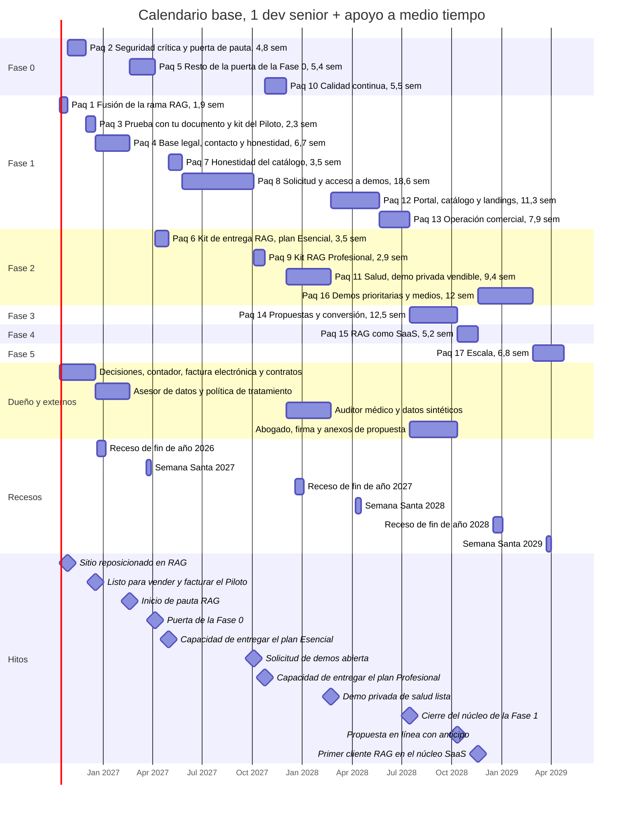

# Roadmap

> Plan de ejecución de toda la wiki en las seis fases de la DECISIÓN 8, con calendario desde el **12 de octubre de 2026** para **1 dev senior + apoyo**. Consolida las tareas P0 y P1 de todas las páginas, suma el esfuerzo por fase y lista los hitos comerciales y los riesgos.
>
> El producto principal son los **sistemas RAG** ([Reposicionamiento RAG](13-Reposicionamiento-RAG.md)). Por eso el **primer entregable de la Fase 1 es fusionar la rama `rag-reposicionamiento`**; el otro gran entregable de esa fase es el **sistema de solicitud de demos** ([Sistema de demos](04-Sistema-de-Demos.md)).
>
> Páginas relacionadas: [Plan por sección](07-Plan-por-Seccion.md) · [Catálogo de productos](08-Catalogo-de-Productos.md) · [Seguridad y calidad](10-Seguridad-y-Calidad.md) · [Comercial, marketing y legal](11-Comercial-Marketing-y-Legal.md)

---

## En una mirada

- **Las fases son temáticas y se solapan.** El orden real lo dan los **17 paquetes** del calendario: cada paquete agrupa tareas de una o varias páginas y se ejecuta por prioridad.
- **El trabajo descrito en la wiki es mucho más grande que la capacidad.** Suma 833 tareas y ≈ 2.472 días-dev netos, es decir, unos **11 años de 1 dev a tiempo completo**. El calendario programa 243 tareas (≈ 781 días-dev, **todas las P0** y las P1 que sostienen el camino RAG, el sistema de demos y la conversión). El resto queda en un **backlog priorizado** que se toma bajo demanda: cuando un prospecto calificado pide una de las otras soluciones, se adelanta el paquete de ese producto.
- **Fechas clave del calendario base** (6,5 días-dev por semana):
  - **26 oct 2026:** sitio reposicionado en RAG en producción.
  - **16 dic 2026:** listo para vender y facturar el Piloto RAG.
  - **17 feb 2027:** inicio de la pauta RAG, con "Prueba con tu documento" activa.
  - **5 abr 2027:** puerta de la Fase 0.
  - **30 abr 2027:** capacidad de entregar el plan Esencial (widget, ingesta de PDF y Word, citas por página).
  - **3 oct 2027:** solicitud de demos abierta al público (hito 1a).
  - **24 oct 2027:** capacidad de entregar el plan Profesional (Drive, SharePoint, WhatsApp, permisos y métricas).
  - **18 nov 2028:** primer cliente RAG en el núcleo SaaS (fin de la Fase 4).
- **Con un segundo dev a tiempo completo** (10,5 días-dev por semana), la solicitud de demos llega el **29 may 2027** y la Fase 4 termina el **8 feb 2028**. Se recomienda sumarlo cuando el primer plan con mensualidad esté facturando.

---

## Supuestos de capacidad

| Recurso | Dedicación | Días-dev efectivos por semana | Qué hace |
|---|---|:-:|---|
| Dev senior | Tiempo completo | 4 (de 5; 1 día se va en soporte de producción, revisiones de código y reuniones con clientes) | Backend, seguridad, arquitectura, revisión de todo lo que se fusiona |
| Apoyo técnico | Medio tiempo: un dev semi-senior, un freelance o agentes de IA supervisados por el senior | 2,5 | Frontend, textos técnicos, pruebas y QA |
| Dueño | ≈ 1 día por semana | No se cuenta como días-dev | Decisiones, textos comerciales, ventas, contador, abogado y auditor |
| Externos | Por horas | No se cuenta | Asesor de protección de datos, contador, abogado, auditor médico y producción de video |
| **Total del equipo técnico** | | **6,5** | |

**Reglas del cálculo:**
- Cada tarea se mide con la talla de su página: **S = 1,5 días, M = 4, L = 7,5 y XL = 15** (DECISIÓN 9). Es una estimación: la talla fija sobreestima las tareas pequeñas de texto y subestima las XL.
- Duración de un paquete = días-dev ÷ 6,5 por semana. Dentro de cada paquete, el senior y el apoyo trabajan en paralelo en tareas distintas; los paquetes van uno después de otro, por prioridad.
- Se descuentan **2 semanas de receso** a fin de año y la **Semana Santa**. Los festivos sueltos ya están dentro de los 4 días efectivos.
- **No incluye la entrega de proyectos vendidos** (pilotos e implementaciones). Cada semana dedicada a un cliente corre el calendario una semana, salvo que se sume capacidad.
- Se supone que la rama `rag-reposicionamiento` termina sus 7 etapas antes del 12 de octubre (hoy le faltan "Prueba con tu documento" y la medición). Si no, ese trabajo entra en los paquetes 1 y 3.
- La Fase 4 suma **34 días-dev** con tres tareas XL. Como XL es un piso (más de 2 semanas), es la estimación menos confiable: [Backend y API](09-Backend-y-API.md) habla de "≈ 30 días o más" solo para el núcleo multi-tenant. Se reestima al cerrar la Fase 3.

---

## Las fases

### Fase 0 — Endurecimiento

| | |
|---|---|
| **Objetivo** | Que el sitio y la API sean seguros, medibles y recuperables antes de pagar pauta y de abrir cuentas a prospectos |
| **Entregables** | Autenticación y autorización exigidas en el servidor en todas las rutas de la API · pasarela de IA con topes de costo y rate-limit compartido · credenciales rotadas y dependencias al día (Next 14.2.35 o posterior, Node 24) · chatbot y documentos fuera del disco temporal (MongoDB y almacenamiento de objetos) · CI que corre en cada PR con pruebas y humo de las 28 demos · Sentry, monitores y límites de error · copias verificadas y staging · herramientas internas y rutas de prueba fuera del sitio comercial · gestor documental sin error en producción |
| **Criterio de salida** | Los 13 criterios de la sección 10 de [Seguridad y calidad](10-Seguridad-y-Calidad.md#10-criterios-de-salida-de-la-fase-0) en verde. Es la puerta para encender el control de acceso de las demos en producción (`DEMO_GATE_ENABLED=true`). Antes, el **paquete 2** abre una puerta parcial para la pauta: topes de IA, rate-limit, persistencia del chatbot, observabilidad y límites de error |
| **Duración estimada** | 15,7 semanas de trabajo: paquete 2 (4,8 semanas, 26 oct 2026 – 29 nov 2026), paquete 5 (5,4 semanas, 17 feb 2027 – 5 abr 2027) y paquete 10 con las P1 restantes (5,5 semanas, 24 oct 2027 – 2 dic 2027) |
| **Dependencias** | Acceso del dueño a todas las plataformas (para rotar credenciales y activar 2FA) · elegir el proveedor de almacenamiento de objetos y MongoDB con réplica · ninguna dependencia de otras fases |

### Fase 1 — Funnel y solicitud de demos

| | |
|---|---|
| **Objetivo** | Que un visitante entienda que KopTup vende sistemas RAG, pruebe la demo y deje sus datos con autorización; y que quien busca otra solución pida una demo que el equipo aprueba desde el panel, con acceso verificado en el servidor y uso medido |
| **Entregables** | 1. **Reposicionamiento RAG** (rama `rag-reposicionamiento`), primer entregable: fusión (paquete 1) y "Prueba con tu documento", medición y kit del Piloto (paquete 3). 2. Base legal y honestidad: política de la Ley 1581, autorizaciones, banner, contacto con Lead, Nosotros, JSON-LD honesto y lista negra de afirmaciones (paquete 4), más la limpieza del catálogo (paquete 7). 3. **Sistema de solicitud de demos, hito 1a** (paquete 8): `DemoRequest`, `DemoGrant`, `Lead`, roles `sales` y `prospect`, enlace mágico, **Mis demos**, **Admin › Solicitudes** y **Accesos**, verificación en el servidor y retiro del acceso por código. 4. Hito 1b (paquete 12): portal por rol, catálogo `/demo` nuevo, landings `/productos/<slug>` (plantilla y ola 1), "Otras soluciones" en `/services`, mensajería y pipeline. 5. Hito 1c (paquete 13): Leads, Métricas y Catálogo de demos en el panel, jobs comerciales, derechos de los titulares y recorrido guiado |
| **Criterio de salida** | (a) El RAG está en producción, con medición sujeta a consentimiento y "Prueba con tu documento" activa con sus topes. (b) Un prospecto real pide una demo, el comercial la aprueba en menos de 1 día hábil, el prospecto entra con el enlace mágico y su uso queda registrado. (c) El E2E de los 10 escenarios de la sección 18 de [Sistema de demos](04-Sistema-de-Demos.md) pasa en el CI. (d) Ninguna página publica afirmaciones de la lista negra. (e) La ola 1 de landings está publicada |
| **Duración estimada** | 52,2 semanas de trabajo, repartidas entre el 12 oct 2026 y el 16 jul 2028: paquetes 1, 3 y 4 hasta el 17 feb 2027; paquete 7 del 30 abr 2027 al 25 may 2027; paquete 8 del 25 may 2027 al 3 oct 2027; paquetes 12 y 13 del 22 feb 2028 al 16 jul 2028 |
| **Dependencias** | Paquete 2 antes de activar "Prueba con tu documento" y la pauta · puerta de la Fase 0 antes de abrir la solicitud de demos en producción · del dueño: decisiones D1 a D17, contador (RUT, IVA y factura electrónica), contratos tipo y asesor de datos · claves de Turnstile, proveedor de correo con SPF, DKIM y DMARC, agenda en línea y número de WhatsApp Business |

### Fase 2 — Demos vendibles

| | |
|---|---|
| **Objetivo** | Que las demos que más venden se puedan mostrar sin pedir disculpas y con la marca del prospecto, empezando por el RAG |
| **Entregables** | **Kit de entrega RAG** para el plan Esencial (paquete 6): núcleo RAG compartido con ingesta de PDF y Word y citas por página, widget embebible y demo por sector sin datos simulados. **Kit RAG Profesional** (paquete 9): conectores de Drive y SharePoint, canal de WhatsApp, permisos por rol y panel de métricas. **Salud** (paquete 11): módulo de salud consolidado, worker con colas, datos 100 % sintéticos revisados por un auditor médico, convenios configurables, revisión humana obligatoria y motor de reglas integrado. **Demos prioritarias** (paquete 16): CRM, Helpdesk, Facturación electrónica y Gestor documental, con capturas y videos de la ola 1 y prueba social autorizada. El resto de los productos, bajo demanda |
| **Criterio de salida** | Las 5 demos prioritarias del [Catálogo de productos](08-Catalogo-de-Productos.md#demos-prioritarias) pasan el QA de publicación de [Catálogo de demos](Seccion-Catalogo-de-Demos.md): datos colombianos, ningún botón sin acción, recorrido de 5 pasos, capturas y video. El widget del plan Esencial funciona en un sitio externo y cita la página; una pregunta por WhatsApp recibe respuesta con fuente. La demo de salud funciona en modo `privado` con datos sintéticos |
| **Duración estimada** | 27,8 semanas de trabajo: paquete 6 (3,5 semanas, 5 abr 2027 – 30 abr 2027, adelantado porque habilita la venta del plan Esencial), paquete 9 (2,9 semanas, 3 oct 2027 – 24 oct 2027), paquete 11 (9,4 semanas, 2 dic 2027 – 22 feb 2028) y paquete 16 (12 semanas, 18 nov 2028 – 27 feb 2029). Si un cliente contrata el plan Profesional antes, el paquete 9 se adelanta y se financia con ese proyecto |
| **Dependencias** | Fase 0 (almacenamiento y persistencia) · hito 1a (`DemoGrant` para personalizar y dar cupo ampliado) · auditor médico · contador (cálculos de la demo de facturación) · producción de video |

### Fase 3 — Propuestas y conversión

| | |
|---|---|
| **Objetivo** | Pasar de la demo al contrato dentro de KopTup: propuesta en línea, aceptación con firma, anticipo pagado y proyecto creado |
| **Entregables** | `Quote` ampliado y editor de propuestas con plantillas (planes RAG y otras soluciones) · `/propuesta/[token]` con PDF, aceptación y firma electrónica simple · anticipo con pasarela y webhooks (Wompi o PayU en COP; transferencia o Stripe en USD) · factura electrónica adjunta · conversión de prospecto a cliente con proyecto · paquete legal de salud y Piloto de auditoría · anexo de tratamiento de datos · `packages/catalog` compartido por la web y el backend |
| **Criterio de salida** | Una propuesta real se envía, se acepta con firma en línea, el anticipo se confirma por webhook, la factura queda pagada y se crea el proyecto con rol `client`, sin pasos manuales |
| **Duración estimada** | Paquete 14: 12,5 semanas (16 jul 2028 – 12 oct 2028) |
| **Dependencias** | Decisiones D3 y D4 (pasarelas) · factura electrónica de KopTup con API · abogado (firma y anexos) · hito 1c. Mientras tanto, las propuestas salen en PDF desde plantillas, la factura desde el software contable y el cobro con un enlace de pago creado a mano ([Comercial](11-Comercial-Marketing-y-Legal.md), sección 14) |

### Fase 4 — Productos SaaS reales

| | |
|---|---|
| **Objetivo** | Que el asistente RAG funcione como SaaS: cada cliente en su organización aislada, con medición contra el tope del plan y cobro recurrente automático |
| **Entregables** | Núcleo multi-tenant (`Organization` y `tenantId` en todas las consultas del RAG) · medición de preguntas contra el tope del plan, alertas al 80 % y cobro de la pregunta adicional · cobro recurrente con medio de pago guardado, reintentos y suspensión, con factura electrónica · aprovisionamiento · pruebas de aislamiento entre clientes en el CI · "Mi asistente RAG" en el portal. El segundo candidato a SaaS (Helpdesk o Gestión de proyectos) se decide al cerrar esta fase |
| **Criterio de salida** | Un cliente nuevo crea su cuenta, paga y publica su asistente sin intervención de KopTup, y las pruebas de aislamiento pasan |
| **Duración estimada** | Paquete 15: 5,2 semanas (12 oct 2028 – 18 nov 2028). Reestimar al cerrar la Fase 3 |
| **Dependencias** | Fase 3 (pasarela con webhooks) · Fase 0 (autorización en el servidor) · kit de entrega RAG (paquete 6) |

### Fase 5 — Escala

| | |
|---|---|
| **Objetivo** | Crecer sin depender solo de la pauta: prueba social real, contenido, SEO en inglés y automatizaciones comerciales |
| **Entregables** | Casos de estudio `/casos/<slug>` con autorización escrita · blog · versión en inglés indexable (`/en/*`) · leads de WhatsApp creados por la API de WhatsApp Cloud y secuencias del CRM · prueba A/B del CTA principal · landings de campaña con vencimiento |
| **Criterio de salida** | Al menos un caso publicado con una métrica medida y autorización archivada; el inglés indexado en Search Console; los leads de WhatsApp entran sin carga manual |
| **Duración estimada** | Paquete 17: 6,8 semanas de desarrollo (27 feb 2029 – 25 abr 2029). El contenido (casos y blog) lo lleva el dueño desde que haya un piloto terminado y autorizado |
| **Dependencias** | Pilotos entregados con autorización del cliente · render estático por idioma (paquete 10) |

---

## Fase 1: el primer entregable es el reposicionamiento RAG

La rama `rag-reposicionamiento` ya implementa las etapas 1 a 5 de la especificación del dueño (SEO técnico, inicio, `/rag` y sectores, planes en `/services#planes-rag` y coherencia, incluido el paso del voseo a "tú"); la etapa 6 ("Prueba con tu documento") está en curso y la 7 (medición), pendiente. El estado por etapa está en el [Catálogo de productos](08-Catalogo-de-Productos.md#producto-principal-sistemas-rag) y el detalle en [Reposicionamiento RAG](13-Reposicionamiento-RAG.md).

**Cómo se lleva a producción:**
1. **Terminar la rama:** "Prueba con tu documento" apagada por defecto (`DEMO_UPLOAD_ENABLED=false`) y medición que no carga nada mientras no existan los IDs.
2. **Revisión del senior:** tipos, lint, build y `check-titles`; recorrido en una vista previa de Vercel; E2E mínimo del inicio y de `/rag`.
3. **Fusionar y desplegar (paquete 1):** sitemap con `www` enviado a Search Console y redirecciones verificadas.
4. **Encender por variables, en este orden:**
   - IDs de GA4, Google Ads y LinkedIn cuando el banner y la política de tratamiento estén publicados (paquetes 3 y 4).
   - `DEMO_UPLOAD_ENABLED=true` cuando la pasarela de IA con topes y el rate-limit compartido estén en producción (paquete 2) y la política esté publicada (paquete 4).
5. **Después de fusionar:** el render estático por idioma (paquete 10). Mueve casi todos los archivos de `app/` y por eso va después, para no generar conflictos con los ≈ 60 archivos de la rama.

Tareas: [Sistemas RAG](Producto-chatbot-rag-ia.md) 4 a 7 y 10 · [Home](Seccion-Home.md) 1 · [Landings SEO](Seccion-Landings-SEO.md) 1 · [Servicios y precios](Seccion-Servicios-y-Precios.md) 1 · [Comercial](11-Comercial-Marketing-y-Legal.md) 5, 12 y 13 · [Legal](Seccion-Legal.md) 14 · [Backend y API](09-Backend-y-API.md) 15.

**Mientras llega la solicitud de demos (hito 1a),** los prospectos de otras soluciones entran por `/contact`, WhatsApp y la agenda, y el comercial los registra en la hoja puente del pipeline ([Comercial](11-Comercial-Marketing-y-Legal.md), tarea 15). Las demos de salud se muestran solo en sesión guiada.

---

## Calendario

### Paquetes de trabajo

| Paq. | Paquete | Fase | Tareas | Días-dev (suma de tallas) | Semanas (6,5 días-dev/sem) | Inicio | Fin | Fin con 2 devs + apoyo |
|:-:|---|---|:-:|:-:|:-:|---|---|---|
| 1 | Fusión de la rama RAG | Fase 1 | 5 | 12,5 | 1,9 | 12 oct 2026 | 26 oct 2026 | 21 oct 2026 |
| 2 | Seguridad crítica y puerta de pauta | Fase 0 | 12 | 31,5 | 4,8 | 26 oct 2026 | 29 nov 2026 | 11 nov 2026 |
| 3 | Prueba con tu documento, medición y kit del Piloto | Fase 1 | 5 | 15 | 2,3 | 29 nov 2026 | 16 dic 2026 | 21 nov 2026 |
| 4 | Base legal, contacto y honestidad del funnel | Fase 1 | 25 | 43,5 | 6,7 | 16 dic 2026 | 17 feb 2027 | 5 ene 2027 |
| 5 | Resto de la puerta de la Fase 0 | Fase 0 | 15 | 35 | 5,4 | 17 feb 2027 | 5 abr 2027 | 29 ene 2027 |
| 6 | Kit de entrega RAG: plan Esencial | Fase 2 | 3 | 22,5 | 3,5 | 5 abr 2027 | 30 abr 2027 | 13 feb 2027 |
| 7 | Honestidad del catálogo | Fase 1 | 15 | 22,5 | 3,5 | 30 abr 2027 | 25 may 2027 | 28 feb 2027 |
| 8 | Solicitud y acceso a demos (hito 1a) | Fase 1 | 50 | 121 | 18,6 | 25 may 2027 | 3 oct 2027 | 29 may 2027 |
| 9 | Kit RAG Profesional: Drive, SharePoint, WhatsApp, permisos y métricas | Fase 2 | 3 | 19 | 2,9 | 3 oct 2027 | 24 oct 2027 | 11 jun 2027 |
| 10 | Calidad continua (P1 de la Fase 0) | Fase 0 | 9 | 35,5 | 5,5 | 24 oct 2027 | 2 dic 2027 | 5 jul 2027 |
| 11 | Salud: demo privada vendible | Fase 2 | 9 | 61 | 9,4 | 2 dic 2027 | 22 feb 2028 | 15 ago 2027 |
| 12 | Portal, catálogo y landings (hito 1b) | Fase 1 | 29 | 73,5 | 11,3 | 22 feb 2028 | 21 may 2028 | 3 oct 2027 |
| 13 | Operación comercial (hito 1c) | Fase 1 | 16 | 51,5 | 7,9 | 21 may 2028 | 16 jul 2028 | 7 nov 2027 |
| 14 | Propuestas y conversión | Fase 3 | 12 | 81 | 12,5 | 16 jul 2028 | 12 oct 2028 | 16 ene 2028 |
| 15 | RAG como SaaS | Fase 4 | 3 | 34 | 5,2 | 12 oct 2028 | 18 nov 2028 | 8 feb 2028 |
| 16 | Demos prioritarias y medios | Fase 2 | 23 | 78 | 12 | 18 nov 2028 | 27 feb 2029 | 31 mar 2028 |
| 17 | Escala | Fase 5 | 9 | 44 | 6,8 | 27 feb 2029 | 25 abr 2029 | 9 may 2028 |
| | **Total programado** | | **243** | **781** | **120,2** | **12 oct 2026** | **25 abr 2029** | **9 may 2028** |

### Diagrama

> [Ver diagrama como imagen](images/diagramas/12-Roadmap-1.png)

*Las barras de los recesos muestran semanas sin desarrollo; un paquete que las cruza se alarga en esas semanas. Las barras del dueño y de los externos van en paralelo y no consumen días-dev.*

---

## Hitos comerciales

Las fechas de venta son **objetivos, no compromisos**. Esta página no fija número de clientes; las metas del embudo están en [Comercial, marketing y legal](11-Comercial-Marketing-y-Legal.md) (sección 4).

| # | Hito | Fecha objetivo (base) | Con 2 devs + apoyo | Qué lo habilita | Cómo se verifica |
|:-:|---|---|---|---|---|
| 1 | Sitio reposicionado en RAG en producción | 26 oct 2026 | 21 oct 2026 | Paquete 1 | El H1 "IA que responde con los documentos de tu empresa" y los planes RAG se ven en www.koptup.com |
| 2 | Listo para vender y facturar el Piloto RAG | 16 dic 2026 | 21 nov 2026 | Paquete 3 (kit del Piloto) y carril del dueño: RUT e IVA con el contador, factura electrónica habilitada, orden de servicio corta | Se pueden emitir la orden de servicio y la factura electrónica del Piloto |
| 3 | Primer Piloto RAG vendido | Objetivo: primer trimestre de 2027 | Igual | Hito anterior, prospección directa del dueño desde noviembre y pauta desde el hito siguiente | Orden de servicio firmada y pago recibido |
| 4 | Inicio de pauta RAG con "Prueba con tu documento" activa | 17 feb 2027 | 5 ene 2027 | Paquetes 2, 3 y 4 (topes de IA, medición con consentimiento, política de tratamiento, contacto con Lead) | Campañas activas y conversiones `generate_lead` registradas solo con consentimiento |
| 5 | Primer informe de precisión entregado | Objetivo: 2 semanas después del primer Piloto vendido | Igual | Kit del Piloto (paquete 3) | Informe con las 50 preguntas de prueba y su resultado, aceptado por el cliente |
| 6 | Capacidad de entregar el plan Esencial | 30 abr 2027 | 13 feb 2027 | Paquete 6 (núcleo RAG, widget, ingesta de PDF y Word, citas por página) | El widget responde con citas de página en un sitio externo de prueba |
| 7 | Primer Piloto convertido a un plan con mensualidad | Objetivo: dentro de los 30 días del crédito del Piloto, después del hito anterior | Igual | Hitos 5 y 6 | Factura del setup y de la primera mensualidad |
| 8 | Solicitud de demos abierta al público (hito 1a) | 3 oct 2027 | 29 may 2027 | Paquete 8 y puerta de la Fase 0 (paquete 5) | Una solicitud real se aprueba desde Admin › Solicitudes y el prospecto entra con el enlace mágico |
| 9 | Capacidad de entregar el plan Profesional | 24 oct 2027 | 11 jun 2027 | Paquete 9 (Drive, SharePoint, WhatsApp, permisos y métricas) | Una pregunta por WhatsApp responde con fuente y un documento nuevo en la carpeta conectada se puede consultar |
| 10 | Primer caso de estudio RAG publicado | Objetivo: después del primer Piloto entregado | Igual | Autorización escrita del cliente (contenido del dueño; Fase 5) | Caso en `/casos/<slug>` con su autorización archivada y la métrica del informe de precisión |
| 11 | Demo privada de salud lista para sesiones guiadas | 22 feb 2028 | 15 ago 2027 | Paquete 11 y auditor médico | Sesión guiada completa con datos sintéticos; el Piloto de auditoría se contrata desde la Fase 3 |
| 12 | Funnel de otras soluciones completo (hito 1b) | 21 may 2028 | 3 oct 2027 | Paquete 12 | Ola 1 de landings publicada y cada CTA crea una solicitud con producto y UTM |
| 13 | Propuesta en línea con firma y anticipo | 12 oct 2028 | 16 ene 2028 | Paquete 14 | Una propuesta real se acepta y se paga sin pasos manuales |
| 14 | Primer cliente RAG en el núcleo SaaS | 18 nov 2028 | 8 feb 2028 | Paquete 15 | Alta, pago y publicación del asistente sin intervención de KopTup |

---

## Tareas P0 y P1 consolidadas por fase

Cada tarea se agrupa por la **fase que le asignó su página**. La columna **Paquete** dice en qué paquete del calendario se ejecuta: "Backlog" significa que no tiene fecha y se toma por valor o por demanda; "Contada en…" significa que la misma tarea ya está en otra página y no se vuelve a sumar. Las tareas resumidas conservan el número de su página de origen.

### Tareas de la Fase 0 — Endurecimiento

**33 tareas P0 y 22 P1**, ≈ 111,5 días-dev netos.

| Página | P0 | P1 | Días-dev netos | Paquetes del calendario |
|---|:-:|:-:|:-:|---|
| [Backend y API](09-Backend-y-API.md) | 10 | 2 | 34 | 2, 5 |
| [Seguridad y calidad](10-Seguridad-y-Calidad.md) | 9 | 11 | 46,5 | 2, 5, 10, contadas en otra página |
| [Gestor documental con IA](Producto-gestor-documental.md) | 4 | — | 1,5 | 5, contadas en otra página |
| [Sistemas RAG](Producto-chatbot-rag-ia.md) | 3 | — | 0 | contadas en otra página |
| [Demo cuentas médicas](Demo-cuentas-medicas.md) | 2 | 1 | 4 | 11, contadas en otra página |
| [Autenticación](Seccion-Autenticacion.md) | 1 | 3 | 13 | 5, 10, contadas en otra página |
| [Landings SEO](Seccion-Landings-SEO.md) | 1 | — | 4 | 5 |
| [Contacto](Seccion-Contacto.md) | 1 | 1 | 1,5 | 5, contadas en otra página |
| [Portal del cliente](06-Portal-del-Cliente.md) | 1 | — | 0 | contadas en otra página |
| [CMS headless](Producto-cms-headless.md) | 1 | — | 0 | contadas en otra página |
| [Demo sistema experto](Demo-sistema-experto.md) | — | 1 | 4 | 11 |
| [Panel de administración](05-Panel-de-Administracion.md) | — | 1 | 1,5 | 5 |
| [WMS y logística de bodegas](Producto-wms-logistica.md) | — | 1 | 1,5 | 7 |
| [Demo LinkedIn Ads](Demo-linkedin-ads.md) | — | 1 | 0 | contadas en otra página |

Ver las 55 tareas P0 y P1 de la Fase 0

| Página | # | Tarea (resumida) | Prioridad | Esfuerzo | Paquete |
|---|:-:|---|:-:|:-:|---|
| [Backend y API](09-Backend-y-API.md) | 1 | Configuración validada: `config/env.ts` con zod como único lector de `process.env`, `.env.example` generado desde el esquema, sin valores… | P0 | S | Paq. 2 |
| [Backend y API](09-Backend-y-API.md) | 2 | Separar `src/app.ts` de `src/server.ts`; arranque sin efectos sobre los datos; `/health` y `/ready`; `healthcheckPath` en `railway.json` | P0 | S | Paq. 2 |
| [Backend y API](09-Backend-y-API.md) | 4 | Auditar y exigir autenticación y autorización en el servidor en todas las rutas: `requirePermission`, `optionalAuthenticate`, verificación… | P0 | L | Paq. 2 |
| [Backend y API](09-Backend-y-API.md) | 5 | Pasarela de IA: modelos por variable de entorno, `AiUsage` con tokens y costo, cupos por visitante, usuario y grant, tope mensual global y… | P0 | M | Paq. 2 |
| [Backend y API](09-Backend-y-API.md) | 6 | Rate-limit con almacén compartido por IP, email y usuario, con respaldo en memoria y límites por ruta | P0 | S | Paq. 2 |
| [Backend y API](09-Backend-y-API.md) | 7 | Rotar credenciales, actualizar dependencias, quitar las que no se usan y retirar de producción las rutas y páginas de prueba | P0 | S | Paq. 2 |
| [Backend y API](09-Backend-y-API.md) | 10 | Persistir el chatbot y las decisiones de IA en MongoDB; migración idempotente desde `state.json`; quitar `data/` del repositorio | P0 | M | Paq. 2 |
| [Seguridad y calidad](10-Seguridad-y-Calidad.md) | 1 | Programa de secretos y cuentas: inventario por plataforma, rotación coordinada, limpieza del historial después de rotar, escaneo de… | P0 | M | Paq. 2 |
| [Backend y API](09-Backend-y-API.md) | 3 | Base de pruebas y CI del backend: Jest con `ts-jest`, supertest, `mongodb-memory-server` en modo réplica, factories; el workflow corre… | P0 | M | Paq. 5 |
| [Backend y API](09-Backend-y-API.md) | 9 | Almacenamiento de objetos obligatorio: `storage.service` ampliado; migrar documentos, pedidos, entregables, chatbot, salud y exportes… | P0 | M | Paq. 5 |
| [Backend y API](09-Backend-y-API.md) | 12 | MongoDB con réplica: transacciones, copias de seguridad con restauración probada, usuario por entorno, índices y TTL de la sección 7… | P0 | S | Paq. 5 |
| [Seguridad y calidad](10-Seguridad-y-Calidad.md) | 7 | CI del monorepo: `ci.yml` nuevo, Node 24, scripts `typecheck`, configuración de ESLint propia del backend y Turbo con las tareas nuevas. Se… | P0 | M | Paq. 5 |
| [Seguridad y calidad](10-Seguridad-y-Calidad.md) | 8 | Protección de rama y liberación: checks requeridos en `main`, `CODEOWNERS`, rama `production` con `release.yml`, Railway esperando a los… | P0 | S | Paq. 5 |
| [Seguridad y calidad](10-Seguridad-y-Calidad.md) | 10 | Jest de la web con `next/jest`: `jsdom`, `jest.setup.ts` con simulaciones, `renderWithProviders` con mensajes reales, `pretest` con… | P0 | S | Paq. 5 |
| [Seguridad y calidad](10-Seguridad-y-Calidad.md) | 11 | Playwright: configuración con proyectos de escritorio y de 390 px, `e2e:server` del backend, humo de las 28 demos con `known-issues.json`… | P0 | M | Paq. 5 |
| [Seguridad y calidad](10-Seguridad-y-Calidad.md) | 13 | Dependencias de la web y de la plataforma: Next y `eslint-config-next` 14.2.35, Node 24, `jspdf` 4 con carga diferida, último 3.x de… | P0 | S | Paq. 5 |
| [Seguridad y calidad](10-Seguridad-y-Calidad.md) | 18 | Copias y continuidad: política de la sección 6, verificación diaria de la última copia, runbooks y primer simulacro de restauración en una… | P0 | S | Paq. 5 |
| [Gestor documental con IA](Producto-gestor-documental.md) | 4 | Corregir el error de carga en producción; estado de error amigable con "Reintentar" y respaldo estático | P0 | S | Paq. 5 |
| [Landings SEO](Seccion-Landings-SEO.md) | 4 | `/liquidacion`: sacarla del sitio comercial e integrarla como módulo de la demo privada de cuentas médicas o del panel interno; incluir sus… | P0 | M | Paq. 5 |
| [Portal del cliente](06-Portal-del-Cliente.md) | P-04 | Autorización en servidor por rol y dueño en todas las rutas del portal | P0 | M | Contada en Backend y API 4 |
| [Seguridad y calidad](10-Seguridad-y-Calidad.md) | 2 | Autorización en servidor en todas las rutas: políticas declaradas, pertenencia y prueba de tabla. Incluye P-04 de Portal del cliente =… | P0 | L | Contada en Backend y API 4 |
| [Seguridad y calidad](10-Seguridad-y-Calidad.md) | 3 | Pasarela de IA con topes y rate-limit compartido = tareas 5 y 6 de Backend y API | P0 | M | Contada en Backend y API 5 y 6 |
| [Demo cuentas médicas](Demo-cuentas-medicas.md) | 1 | Endurecer el módulo: auditar y exigir autenticación y autorización en servidor en todas las rutas del módulo, aislamiento de datos por… | P0 | M | Contada en Backend y API 4 |
| [Demo cuentas médicas](Demo-cuentas-medicas.md) | 2 | Documentos fuera del disco efímero: almacenamiento de objetos cifrado, borrado programado por vencimiento del acceso o del contrato y… | P0 | M | Contada en Backend y API 9 |
| [Sistemas RAG](Producto-chatbot-rag-ia.md) | 1 | Persistir bots, documentos, fragmentos y conversaciones en MongoDB y los archivos en almacenamiento de objetos, con migración desde el… | P0 | M | Contada en Backend y API 10 |
| [Sistemas RAG](Producto-chatbot-rag-ia.md) | 2 | Exigir autenticación y autorización en servidor en todas las rutas del chatbot, con aislamiento de bots por cuenta, rate-limit con almacén… | P0 | M | Contada en Backend y API 4 y 5 |
| [Sistemas RAG](Producto-chatbot-rag-ia.md) | 3 | Rotar las credenciales de los servicios que usa el chatbot y actualizar sus dependencias | P0 | S | Contada en Backend y API 7 |
| [CMS headless](Producto-cms-headless.md) | 1 | Límites de costo y de uso en las funciones de IA de redacción, habilitadas solo con acceso aprobado o con tope diario global | P0 | S | Contada en Backend y API 5 |
| [Gestor documental con IA](Producto-gestor-documental.md) | 1 | Auditar y exigir autenticación y autorización en el servidor en el módulo de documentos, como en el resto de la API; separar los documentos… | P0 | M | Contada en Backend y API 4 |
| [Gestor documental con IA](Producto-gestor-documental.md) | 2 | Límites de costo y de uso en las funciones de IA de documentos, con tope diario configurable | P0 | S | Contada en Backend y API 5 |
| [Gestor documental con IA](Producto-gestor-documental.md) | 3 | Almacenamiento de objetos obligatorio en producción y borrado automático de los documentos de grants vencidos | P0 | S | Contada en Backend y API 9 |
| [Autenticación](Seccion-Autenticacion.md) | 6 | Rate-limit con almacén compartido en inicio de sesión, registro, recuperación y enlaces, y Turnstile después de 5 fallos | P0 | S | Contada en Backend y API 6 |
| [Contacto](Seccion-Contacto.md) | 9 | Proteger o retirar en producción las rutas de prueba de notificaciones | P0 | S | Contada en Backend y API 7 |
| [Backend y API](09-Backend-y-API.md) | 11 | Observabilidad: logs JSON a la salida estándar con `requestId` y sin datos personales, Sentry en la API, monitor externo de `/ready` y… | P1 | S | Paq. 2 |
| [Seguridad y calidad](10-Seguridad-y-Calidad.md) | 15 | Sentry en la web: versión por commit, mapas de código, `tunnelRoute`, limpieza de datos personales, etiquetas de demo y reglas de alerta | P1 | S | Paq. 2 |
| [Seguridad y calidad](10-Seguridad-y-Calidad.md) | 16 | Monitores y alertas: uptime del sitio y de `/ready`, sintéticos del asistente RAG y de las demos con backend real, certificados y dominio… | P1 | S | Paq. 2 |
| [Seguridad y calidad](10-Seguridad-y-Calidad.md) | 24 | Límites de error y de carga: `global-error.tsx`, `error.tsx` con los textos de la sección 8, `loading.tsx` con esqueletos y `not-found`… | P1 | S | Paq. 2 |
| [Panel de administración](05-Panel-de-Administracion.md) | 4 | Robustez de `admin.controller.ts`: salir de la función después de cada error, validar entradas con `zod`, respuestas 400/404 uniformes y… | P1 | S | Paq. 5 |
| [Backend y API](09-Backend-y-API.md) | 8 | Limpieza de código muerto de la Fase 0: `src/modules/`, `.bak`, SQL, `/api/chat`, `embedding.service.ts`, servidores sueltos, POST público… | P1 | S | Paq. 5 |
| [Autenticación](Seccion-Autenticacion.md) | 7 | Logs de autenticación sin correos en claro y alerta por intentos fallidos sobre cuentas del equipo | P1 | S | Paq. 5 |
| [Contacto](Seccion-Contacto.md) | 8 | Minimización: quitar nombre, email y teléfono de los logs de `contact.controller.ts`, y escapar todo texto libre en las plantillas de… | P1 | S | Paq. 5 |
| [WMS y logística de bodegas](Producto-wms-logistica.md) | 5 | Quitar el plugin `@tailwindcss/aspect-ratio` de `apps/web/tailwind.config.js` para que vuelvan a funcionar `aspect-square` y `aspect-video`… | P1 | S | Paq. 7 |
| [Seguridad y calidad](10-Seguridad-y-Calidad.md) | 5 | CSP y cabeceras de la web: `Report-Only` durante una semana y después aplicada, sin `'unsafe-eval'`, sin orígenes de desarrollo ni… | P1 | S | Paq. 10 |
| [Seguridad y calidad](10-Seguridad-y-Calidad.md) | 6 | Contenido no confiable en la web: inventario de `dangerouslySetInnerHTML` y `rehype-raw`, `rehype-sanitize` en el Markdown de IA, mensajes… | P1 | S | Paq. 10 |
| [Seguridad y calidad](10-Seguridad-y-Calidad.md) | 9 | Seguridad continua en CI: `npm audit --omit=dev --audit-level=high` como bloqueante, CodeQL, Dependabot, `depcheck` mensual y… | P1 | S | Paq. 10 |
| [Seguridad y calidad](10-Seguridad-y-Calidad.md) | 19 | Entornos: staging completo, vistas previas apuntando a staging, `noindex` y protección, Mailpit, Turnstile de prueba y banderas por entorno | P1 | M | Paq. 10 |
| [Seguridad y calidad](10-Seguridad-y-Calidad.md) | 20 | Render estático: enrutamiento de `next-intl` con `localePrefix: 'never'`, páginas en `app/[locale]`, `generateStaticParams` y… | P1 | L | Paq. 10 |
| [Seguridad y calidad](10-Seguridad-y-Calidad.md) | 21 | Mensajes por namespace: proveedor común de ≤ 30 KB, `pick` por segmento, `getTranslations` en los server components y verificación del peso… | P1 | M | Paq. 10 |
| [Seguridad y calidad](10-Seguridad-y-Calidad.md) | 25 | Accesibilidad base: `SkipToContent`, `:focus-visible`, `prefers-reduced-motion`, `
` reemplazados, un H1 por página, `jsx-a11y`… | P1 | M | Paq. 10 |
| [Autenticación](Seccion-Autenticacion.md) | 8 | Sesión en cookies httpOnly: subdominio propio para la API, cookies `kp_at`, `kp_rt` y `kp_s`, `authenticate` por cookie, verificación de… | P1 | L | Paq. 10 |
| [Autenticación](Seccion-Autenticacion.md) | 9 | `AuthSession` en MongoDB con rotación del refresco, detección de reutilización, máximo 3 sesiones por prospecto, "Recordarme" de 30 días y… | P1 | M | Paq. 10 |
| [Demo cuentas médicas](Demo-cuentas-medicas.md) | 15 | Pruebas: unitarias por regla y por cálculo de glosa, y set de evaluación con las respuestas esperadas del paquete sintético, ejecutándose… | P1 | M | Paq. 11 |
| [Demo sistema experto](Demo-sistema-experto.md) | 11 | Pruebas unitarias por regla e i18n ES/EN de todo el módulo, ejecutándose en CI | P1 | M | Paq. 11 |
| [Seguridad y calidad](10-Seguridad-y-Calidad.md) | 4 | Sesión en cookies httpOnly y `AuthSession` = tareas 8 y 9 de Autenticación | P1 | L | Contada en Autenticación 8 y 9 |
| [Demo LinkedIn Ads](Demo-linkedin-ads.md) | 1 | Control de acceso y costo en la ruta de generación: exigir pase de demo o rol de staff, validar tamaño y forma de la entrada, cupo por… | P1 | S | Contada en Backend y API 5 |

### Tareas de la Fase 1 — Funnel y solicitud de demos

**119 tareas P0 y 210 P1**, ≈ 700,5 días-dev netos.

| Página | P0 | P1 | Días-dev netos | Paquetes del calendario |
|---|:-:|:-:|:-:|---|
| [Sistema de demos](04-Sistema-de-Demos.md) | 27 | 6 | 95,5 | 8, 13 |
| [Legal](Seccion-Legal.md) | 11 | 6 | 36,5 | 3, 4, 8, backlog |
| [Comercial, marketing y legal](11-Comercial-Marketing-y-Legal.md) | 11 | 10 | 26 | 1, 3, 4, 8, 12, backlog |
| [Panel de administración](05-Panel-de-Administracion.md) | 9 | 16 | 60 | 8, 13, backlog |
| [Landing de producto](Seccion-Landing-de-Producto.md) | 8 | 8 | 51 | 12, backlog |
| [Portal del cliente](06-Portal-del-Cliente.md) | 8 | 8 | 43,5 | 4, 8, 12, backlog, contadas en otra página |
| [Catálogo de demos](Seccion-Catalogo-de-Demos.md) | 7 | 8 | 37,5 | 8, 12, backlog |
| [Autenticación](Seccion-Autenticacion.md) | 6 | 6 | 22,5 | 8, backlog, contadas en otra página |
| [Servicios y precios](Seccion-Servicios-y-Precios.md) | 5 | 12 | 31,5 | 1, 12, backlog, contadas en otra página |
| [Nosotros](Seccion-Nosotros.md) | 5 | 9 | 21 | 4, backlog |
| [Landings SEO](Seccion-Landings-SEO.md) | 4 | 12 | 31,5 | 1, 4, 12, backlog |
| [Contacto](Seccion-Contacto.md) | 4 | 8 | 25,5 | 4, backlog |
| [Sistemas RAG](Producto-chatbot-rag-ia.md) | 4 | 3 | 4,5 | 1, 3, 8, contadas en otra página |
| [Home](Seccion-Home.md) | 3 | 11 | 26 | 1, 4, 8, backlog |
| [Backend y API](09-Backend-y-API.md) | 3 | 4 | 21,5 | 3, 12, backlog, contadas en otra página |
| [Facturación electrónica](Producto-facturacion-electronica.md) | 1 | 4 | 10 | 7, backlog |
| [Demo cuentas médicas](Demo-cuentas-medicas.md) | 1 | 2 | 4,5 | 7, 8, backlog |
| [Demo sistema experto](Demo-sistema-experto.md) | 1 | 1 | 3 | 8, backlog |
| [Seguridad y calidad](10-Seguridad-y-Calidad.md) | 1 | — | 0 | contadas en otra página |
| [VPN empresarial](Producto-vpn-empresarial.md) | — | 5 | 12,5 | 7, backlog |
| [CRM con IA](Producto-crm-ia.md) | — | 4 | 11 | backlog |
| [Gestor documental con IA](Producto-gestor-documental.md) | — | 4 | 11 | backlog |
| [Dashboard ejecutivo con IA](Producto-bi-dashboard.md) | — | 4 | 8,5 | backlog |
| [ERP modular](Producto-erp-modular.md) | — | 4 | 8,5 | backlog |
| [Gestión de proyectos (con portal de cliente)](Producto-gestion-proyectos.md) | — | 4 | 8,5 | 7, backlog |
| [Helpdesk con IA (mesa de ayuda)](Producto-helpdesk-ia.md) | — | 4 | 8,5 | backlog |
| [POS retail](Producto-pos-retail.md) | — | 4 | 8,5 | backlog |
| [Sistema de reservas y agendamiento](Producto-sistema-reservas.md) | — | 4 | 8,5 | 7, backlog |
| [WMS y logística de bodegas](Producto-wms-logistica.md) | — | 4 | 8,5 | backlog |
| [Voice AI para call center (agente de voz con IA)](Producto-voice-ai-callcenter.md) | — | 3 | 7 | backlog |
| [Code review con IA](Producto-code-review-ia.md) | — | 3 | 4,5 | backlog |
| [Firma electrónica](Producto-firma-electronica.md) | — | 3 | 4,5 | 7, backlog |
| [QA automatizado con IA](Producto-qa-automatizado-ia.md) | — | 3 | 4,5 | backlog |
| [Extracción y monitoreo de datos](Producto-scraping-extraccion.md) | — | 3 | 4,5 | 7, backlog |
| [Demo LinkedIn Ads](Demo-linkedin-ads.md) | — | 2 | 3 | 7, backlog |
| [App de delivery (canal propio de domicilios)](Producto-app-delivery.md) | — | 2 | 3 | 7, backlog |
| [Automatización de procesos con IA](Producto-automatizacion-workflows.md) | — | 2 | 3 | backlog |
| [Tienda en línea (e-commerce)](Producto-ecommerce.md) | — | 2 | 3 | 7, backlog |
| [Gestión Humana y Nómina (HRMS)](Producto-hrms.md) | — | 2 | 3 | 7, backlog |
| [Plataforma de cursos virtuales (LMS)](Producto-lms-elearning.md) | — | 2 | 3 | 7, backlog |
| [Programa de fidelización](Producto-loyalty-fidelizacion.md) | — | 2 | 3 | backlog |
| [Moderación de contenido con IA](Producto-moderacion-contenido.md) | — | 2 | 3 | 7, backlog |
| [Plataforma de telemedicina para IPS](Producto-telemedicina.md) | — | 2 | 3 | 7, backlog |
| [CMS headless](Producto-cms-headless.md) | — | 1 | 1,5 | backlog |
| [Plataforma SaaS multi-tenant](Producto-saas-multi-tenant.md) | — | 1 | 1,5 | backlog |

Ver las 329 tareas P0 y P1 de la Fase 1

| Página | # | Tarea (resumida) | Prioridad | Esfuerzo | Paquete |
|---|:-:|---|:-:|:-:|---|
| [Comercial, marketing y legal](11-Comercial-Marketing-y-Legal.md) | 12 | SEO técnico: fusionar `SITE_URL` con `www`, sitemap según el modo de cada demo y con `lastModified` real, `robots.txt` según D10, Search… | P0 | S | Paq. 1 |
| [Home](Seccion-Home.md) | 1 | Fusionar en `main` la etapa E2 de la rama `rag-reposicionamiento` | P0 | S | Paq. 1 |
| [Landings SEO](Seccion-Landings-SEO.md) | 1 | Fusionar en `main` las etapas E1, E3 y E5 de la rama `rag-reposicionamiento` | P0 | M | Paq. 1 |
| [Servicios y precios](Seccion-Servicios-y-Precios.md) | 1 | Fusionar la etapa E4 de la rama `rag-reposicionamiento`: sección `#planes-rag`, quitar la tarjeta del chatbot, `TRM_REFERENCIA = 3300` y… | P0 | M | Paq. 1 |
| [Backend y API](09-Backend-y-API.md) | 15 | "Prueba con tu documento": ticket de carga desde `POST /api/contact`, `POST/DELETE /api/chatbot/demo-docs` y `/ask`, límites, borrado a la… | P0 | M | Paq. 3 |
| [Comercial, marketing y legal](11-Comercial-Marketing-y-Legal.md) | 5 | Kit del Piloto RAG: orden de servicio corta, plan de 2 semanas, plantilla del informe de precisión y mecánica del crédito de 30 días en la… | P0 | S | Paq. 3 |
| [Comercial, marketing y legal](11-Comercial-Marketing-y-Legal.md) | 13 | Plan de medición: GA4 con Consent Mode v2 en modo básico, Google Ads y LinkedIn Insight, diccionario de eventos, dimensiones, eventos… | P0 | M | Paq. 3 |
| [Sistemas RAG](Producto-chatbot-rag-ia.md) | 10 | Kit de entrega del Piloto RAG: espacio aislado por cliente, plan de 2 semanas, set de 50 preguntas con respuesta esperada y plantilla del… | P0 | S | Paq. 3 |
| [Legal](Seccion-Legal.md) | 14 | Banner de consentimiento con panel por categoría, Consent Mode v2 en modo básico, `kp_consent` versionado y enlace "Preferencias de… | P0 | M | Paq. 3 |
| [Portal del cliente](06-Portal-del-Cliente.md) | P-02 | Retirar datos de ejemplo y vistas simuladas; `PortalState` | P0 | S | Paq. 4 |
| [Comercial, marketing y legal](11-Comercial-Marketing-y-Legal.md) | 10 | Lista negra de afirmaciones en `src/config/claims-blacklist.json` y `scripts/check-claims.mjs` en el CI, compartida con la prueba E2E de… | P0 | S | Paq. 4 |
| [Comercial, marketing y legal](11-Comercial-Marketing-y-Legal.md) | 11 | JSON-LD honesto desde `lib/company.ts`: quitar `aggregateRating`, `SoftwareApplication`, `LocalBusiness` sin dirección confirmada… | P0 | S | Paq. 4 |
| [Contacto](Seccion-Contacto.md) | 1 | Crear o ampliar `lib/company.ts` con `salesEmail`, `privacyEmail`, `whatsappNumber`, `booking`, `supportHours` y `office`, y usarlo en… | P0 | S | Paq. 4 |
| [Contacto](Seccion-Contacto.md) | 2 | Conservar el contexto: `lib/contact-prefill.ts` lee `motivo`, `producto`, `plan`, `modalidad` y los parámetros heredados, y muestra el chip… | P0 | S | Paq. 4 |
| [Contacto](Seccion-Contacto.md) | 5 | Nuevo `ContactForm`: campos, chip de producto, presupuesto en COP, autorizaciones, aviso corto, advertencia de datos sensibles, Turnstile… | P0 | M | Paq. 4 |
| [Contacto](Seccion-Contacto.md) | 6 | Backend de `POST /api/contact`: `zod`, Turnstile, honeypot, rate-limit compartido, upsert de `Lead`, `ConsentRecord`, `Contact` ampliado… | P0 | M | Paq. 4 |
| [Home](Seccion-Home.md) | 2 | Quitar de la home los enlaces a demos que fallan o están desactualizadas hasta que pasen el QA de la Fase 2 | P0 | S | Paq. 4 |
| [Home](Seccion-Home.md) | 3 | Reescribir el JSON-LD de la home: quitar `FAQStructuredData` actual, `SoftwareApplication` y `LocalBusiness`; `Organization` con datos de… | P0 | S | Paq. 4 |
| [Landings SEO](Seccion-Landings-SEO.md) | 2 | Retirar de todas las landings las cifras sin fuente y las garantías absolutas | P0 | S | Paq. 4 |
| [Landings SEO](Seccion-Landings-SEO.md) | 3 | Unificar precios: quitar "desde $499 USD", "$2,000–$8,000 USD", los `AggregateOffer` y el `priceRange` inventados; leer de la constante de… | P0 | S | Paq. 4 |
| [Legal](Seccion-Legal.md) | 1 | Contratar a un asesor en protección de datos para revisar la política, el aviso, las autorizaciones, los términos, la política de cookies y… | P0 | M (externo) | Paq. 4 |
| [Legal](Seccion-Legal.md) | 2 | Datos del responsable en `lib/company.ts` y su uso en las páginas legales | P0 | S | Paq. 4 |
| [Legal](Seccion-Legal.md) | 3 | `config/legal.ts` con versiones, fechas de vigencia, `CONSENT_TEXTS` y hash por texto, más una prueba de que coincide con la versión del… | P0 | S | Paq. 4 |
| [Legal](Seccion-Legal.md) | 4 | Redactar la nueva Política de tratamiento de datos personales | P0 | M | Paq. 4 |
| [Legal](Seccion-Legal.md) | 6 | Componente `PrivacyNotice` en todos los formularios: solicitar demo, contacto, prueba con tu documento, registro, activación y completar… | P0 | S | Paq. 4 |
| [Legal](Seccion-Legal.md) | 7 | `ConsentCheckboxes` en `components/legal/` con casillas separadas sin marcar; en el registro se separan los términos de la autorización de… | P0 | S | Paq. 4 |
| [Legal](Seccion-Legal.md) | 8 | Lista de encargados y transmisiones, confirmada con los contratos y regiones reales y publicada en la política | P0 | S | Paq. 4 |
| [Legal](Seccion-Legal.md) | 13 | Inventario real de cookies en `lib/cookies-inventory.ts` y escaneo automático con Playwright | P0 | S | Paq. 4 |
| [Legal](Seccion-Legal.md) | 16 | Advertencia de datos sensibles en los campos de texto libre, en la carga de documentos y en las demos de salud | P0 | S | Paq. 4 |
| [Nosotros](Seccion-Nosotros.md) | 1 | Reunión con el dueño para confirmar los datos de empresa: año de constitución, razón social y NIT, años de experiencia del fundador… | P0 | S | Paq. 4 |
| [Nosotros](Seccion-Nosotros.md) | 2 | Crear `apps/web/src/lib/company.ts` y usarlo en `/about`, home, footer y `StructuredData.tsx`; actualizar `public/llms.txt` a mano | P0 | S | Paq. 4 |
| [Nosotros](Seccion-Nosotros.md) | 3 | Reemplazar la foto de banco del fundador por una foto real y los fondos de banco del hero y del CTA por imagen propia o gradiente de marca | P0 | S | Paq. 4 |
| [Nosotros](Seccion-Nosotros.md) | 4 | Retirar los casos "Chatbot WhatsApp" y "Dashboard ejecutivo" y mostrar los 3 casos reales con `CaseStudyCard` y su etiqueta | P0 | S | Paq. 4 |
| [Nosotros](Seccion-Nosotros.md) | 5 | Nuevo hero: H1, subtítulo RAG, botones "Probar la demo" y "Agendar llamada", 4 datos desde `lib/company.ts` y `DEMO_COUNT`; eliminar… | P0 | S | Paq. 4 |
| [Facturación electrónica](Producto-facturacion-electronica.md) | 1 | Retirar "certificada DIAN" de `seo-config.ts` y de cualquier texto; aviso "Simulación: nada se envía a la DIAN" en la demo | P0 | S | Paq. 7 |
| [Sistema de demos](04-Sistema-de-Demos.md) | 1 | Roles nuevos, estado de cuenta y migración | P0 | S | Paq. 8 |
| [Sistema de demos](04-Sistema-de-Demos.md) | 2 | Matriz de permisos y middlewares | P0 | S | Paq. 8 |
| [Sistema de demos](04-Sistema-de-Demos.md) | 3 | Bitácora de auditoría | P0 | S | Paq. 8 |
| [Sistema de demos](04-Sistema-de-Demos.md) | 4 | Lead, LeadActivity y consentimiento; integración con contacto y "Prueba con tu documento" | P0 | M | Paq. 8 |
| [Sistema de demos](04-Sistema-de-Demos.md) | 5 | Catálogo de demos: modelo y semilla | P0 | S | Paq. 8 |
| [Sistema de demos](04-Sistema-de-Demos.md) | 6 | Modelos del flujo | P0 | S | Paq. 8 |
| [Sistema de demos](04-Sistema-de-Demos.md) | 7 | Anti-abuso | P0 | S | Paq. 8 |
| [Sistema de demos](04-Sistema-de-Demos.md) | 9 | API pública: catálogo y solicitudes | P0 | S | Paq. 8 |
| [Sistema de demos](04-Sistema-de-Demos.md) | 10 | Servicio de estados y accesos | P0 | M | Paq. 8 |
| [Sistema de demos](04-Sistema-de-Demos.md) | 11 | API del equipo | P0 | M | Paq. 8 |
| [Sistema de demos](04-Sistema-de-Demos.md) | 12 | Enlace mágico | P0 | S | Paq. 8 |
| [Sistema de demos](04-Sistema-de-Demos.md) | 13 | Decisión de acceso y protección de APIs reales | P0 | S | Paq. 8 |
| [Sistema de demos](04-Sistema-de-Demos.md) | 14 | Outbox, plantillas y avisos | P0 | M | Paq. 8 |
| [Sistema de demos](04-Sistema-de-Demos.md) | 15 | Jobs base | P0 | S | Paq. 8 |
| [Sistema de demos](04-Sistema-de-Demos.md) | 16 | Cliente de API en la web | P0 | S | Paq. 8 |
| [Sistema de demos](04-Sistema-de-Demos.md) | 17 | Middleware de Next y pase de demo | P0 | M | Paq. 8 |
| [Sistema de demos](04-Sistema-de-Demos.md) | 18 | Envoltura de demos y pantalla sin acceso | P0 | M | Paq. 8 |
| [Sistema de demos](04-Sistema-de-Demos.md) | 19 | Catálogo `/demo` y CTA; retiro del código actual | P0 | S | Paq. 8 |
| [Sistema de demos](04-Sistema-de-Demos.md) | 20 | Formulario Solicitar demo y página de gracias | P0 | M | Paq. 8 |
| [Sistema de demos](04-Sistema-de-Demos.md) | 21 | Activación, enlace nuevo y redirección por rol | P0 | S | Paq. 8 |
| [Sistema de demos](04-Sistema-de-Demos.md) | 22 | Portal Mis demos | P0 | M | Paq. 8 |
| [Sistema de demos](04-Sistema-de-Demos.md) | 23 | Admin: menú por rol y bandeja de solicitudes | P0 | M | Paq. 8 |
| [Sistema de demos](04-Sistema-de-Demos.md) | 24 | Admin: detalle y decisión | P0 | M | Paq. 8 |
| [Sistema de demos](04-Sistema-de-Demos.md) | 25 | Admin: accesos e invitación directa | P0 | M | Paq. 8 |
| [Sistema de demos](04-Sistema-de-Demos.md) | 26 | Política Ley 1581 y consentimiento versionado | P0 | S | Paq. 8 |
| [Sistema de demos](04-Sistema-de-Demos.md) | 27 | Pruebas de integración y e2e | P0 | L | Paq. 8 |
| [Sistema de demos](04-Sistema-de-Demos.md) | 28 | Puesta en marcha | P0 | S | Paq. 8 |
| [Panel de administración](05-Panel-de-Administracion.md) | 1 | Estructura del panel: `app/admin/layout.tsx` con `noindex`, `AdminShell` que consulta `GET /api/auth/profile`, exclusión de `/admin` en… | P0 | S | Paq. 8 |
| [Panel de administración](05-Panel-de-Administracion.md) | 2 | Kit de componentes y migración de las 9 páginas actuales al kit | P0 | M | Paq. 8 |
| [Panel de administración](05-Panel-de-Administracion.md) | 3 | Permisos en la interfaz: `gen-permissions.mjs`, `permissions.generated.ts`, `useCan` y `<Can>`, con prueba de igualdad en CI | P0 | S | Paq. 8 |
| [Panel de administración](05-Panel-de-Administracion.md) | 8 | Retirar todos los datos simulados del inicio y dejar un estado vacío honesto con enlaces a los módulos | P0 | S | Paq. 8 |
| [Panel de administración](05-Panel-de-Administracion.md) | 11 | Bandeja: pestañas con conteo, vistas fijas, filtros, búsqueda, `SlaChip`, `ScoreBadge`, orden por SLA, paginación y refresco | P0 | S | Paq. 8 |
| [Panel de administración](05-Panel-de-Administracion.md) | 12 | Detalle con las tarjetas del lead y los paneles Aprobar y Rechazar; Reabrir para admin; manejo de 403 y 409 | P0 | M | Paq. 8 |
| [Panel de administración](05-Panel-de-Administracion.md) | 15 | Lista con indicadores, filtros y orden "Requiere atención"; detalle con datos, extensiones y avisos; diálogos Extender, Revocar, Convertir… | P0 | M | Paq. 8 |
| [Panel de administración](05-Panel-de-Administracion.md) | 16 | Invitar directo desde Accesos, la ficha del Lead y Contactos | P0 | S | Paq. 8 |
| [Panel de administración](05-Panel-de-Administracion.md) | 34 | Roles nuevos con etiquetas en español, estado de cuenta, filtros completos, paginación en servidor y diálogo Cambiar rol con motivo y… | P0 | S | Paq. 8 |
| [Portal del cliente](06-Portal-del-Cliente.md) | P-01 | Layout compartido con `useSession`, menú por rol, `noindex`, `error.tsx` y `loading.tsx` | P0 | M | Paq. 8 |
| [Comercial, marketing y legal](11-Comercial-Marketing-y-Legal.md) | 19 | Entregabilidad del correo: proveedor transaccional, subdominio comercial, SPF, DKIM y DMARC alineados, `List-Unsubscribe` con baja de un… | P0 | S | Paq. 8 |
| [Demo cuentas médicas](Demo-cuentas-medicas.md) | 3 | Registrar `DemoCatalogItem` `cuentas-medicas` en modo `privado`, `requireDemoGrant` en las APIs del módulo, `noindex`, fuera del sitemap y… | P0 | S | Paq. 8 |
| [Demo sistema experto](Demo-sistema-experto.md) | 1 | Registrar `DemoCatalogItem` `sistema-experto` en modo `privado`, `requireDemoGrant` en las APIs del motor y de búsqueda de CUPS, `noindex`… | P0 | S | Paq. 8 |
| [Autenticación](Seccion-Autenticacion.md) | 2 | El inicio de sesión rechaza `invitado` y `suspendido` con los mensajes de la sección 6, uniformes para no revelar qué cuentas existen | P0 | S | Paq. 8 |
| [Autenticación](Seccion-Autenticacion.md) | 3 | `lib/auth-redirect.ts` y `lib/safe-redirect.ts`, usados en el inicio de sesión, Google, la activación y el enlace de acceso; se elimina la… | P0 | S | Paq. 8 |
| [Autenticación](Seccion-Autenticacion.md) | 5 | Barra de navegación por estado y rol con `useSession` y `GET /api/auth/profile` ampliado; se quitan "Probar demos" y "Quiero esto" | P0 | S | Paq. 8 |
| [Autenticación](Seccion-Autenticacion.md) | 21 | Pruebas: unitarias, de integración y E2E | P0 | M | Paq. 8 |
| [Catálogo de demos](Seccion-Catalogo-de-Demos.md) | 1 | Retirar el acceso con código en la misma entrega que activa `DEMO_GATE_ENABLED`; agregar el bloque "Demos privadas para salud" y "¿Ya… | P0 | S | Paq. 8 |
| [Catálogo de demos](Seccion-Catalogo-de-Demos.md) | 2 | Sacar del catálogo las demos que no pasan el QA: hoy, quitándolas de la lista y de `DEMO_CATALOG_SLUGS`; con el catálogo en base de datos… | P0 | S | Paq. 8 |
| [Legal](Seccion-Legal.md) | 11 | Condiciones de uso de las demos con casilla en `/acceso/activar` y `User.termsAcceptance` | P0 | S | Paq. 8 |
| [Portal del cliente](06-Portal-del-Cliente.md) | P-03 | Tipos, adaptadores, `formatMoney` y `formatDate`; sin `fetch` con URL fija | P0 | M | Paq. 12 |
| [Portal del cliente](06-Portal-del-Cliente.md) | P-06 | Transición prospecto → cliente en el portal, e2e por rol y eventos `portal_view` | P0 | M | Paq. 12 |
| [Portal del cliente](06-Portal-del-Cliente.md) | P-07 | Inicio por rol con `GET /api/me/summary` y checklist de prospecto en el servidor | P0 | M | Paq. 12 |
| [Portal del cliente](06-Portal-del-Cliente.md) | P-12 | `ScheduleCallButton` y `User.bookingUrl` | P0 | S | Paq. 12 |
| [Portal del cliente](06-Portal-del-Cliente.md) | P-23 | Mi cuenta real | P0 | S | Paq. 12 |
| [Backend y API](09-Backend-y-API.md) | 14 | Mensajería unificada, segunda parte: adaptadores en `services/channels/` y migración de los envíos existentes al outbox | P0 | M | Paq. 12 |
| [Comercial, marketing y legal](11-Comercial-Marketing-y-Legal.md) | 1 | Cerrar el registro de decisiones D1 a D17 con fecha y responsable, y actualizar la tabla de la sección 17 | P0 | S (dueño) | Paq. 12 |
| [Comercial, marketing y legal](11-Comercial-Marketing-y-Legal.md) | 2 | Entidad legal y datos fiscales con el contador: RUT y actividades, régimen, tratamiento de IVA y retenciones por concepto y solicitud de… | P0 | M (externo) | Paq. 12 |
| [Comercial, marketing y legal](11-Comercial-Marketing-y-Legal.md) | 3 | Facturación electrónica de KopTup: habilitación, numeración, software contable con API, documento soporte para compras al exterior y flujo… | P0 | M (dueño y contador) | Paq. 12 |
| [Comercial, marketing y legal](11-Comercial-Marketing-y-Legal.md) | 4 | Contratos tipo: NDA, contrato marco, orden de servicio y anexos A a F, con cesión expresa de lo desarrollado, reserva de los productos base… | P0 | M (externo) | Paq. 12 |
| [Comercial, marketing y legal](11-Comercial-Marketing-y-Legal.md) | 15 | Pipeline: definiciones de etapa, probabilidades y motivos de pérdida en Admin › Leads; hoja puente con acceso restringido mientras sale la… | P0 | S | Paq. 12 |
| [Catálogo de demos](Seccion-Catalogo-de-Demos.md) | 3 | `page.tsx` como server component con datos de `GET /api/demo-catalog` y respaldo estático generado de la semilla; conteos calculados | P0 | M | Paq. 12 |
| [Catálogo de demos](Seccion-Catalogo-de-Demos.md) | 4 | Hero nuevo y demo destacada del asistente RAG | P0 | S | Paq. 12 |
| [Catálogo de demos](Seccion-Catalogo-de-Demos.md) | 5 | `DemoCard` compacta con miniatura, insignias de modo y de "IA real / Datos de ejemplo", y acciones según la tabla de estados | P0 | M | Paq. 12 |
| [Catálogo de demos](Seccion-Catalogo-de-Demos.md) | 6 | Todos los "Solicitar…" del catálogo y del envoltorio abren el modal con `demo` y `producto` precargados; "Agendar llamada" usa… | P0 | S | Paq. 12 |
| [Catálogo de demos](Seccion-Catalogo-de-Demos.md) | 7 | Textos del envoltorio: banner público con nombre del producto, "Ver precios" hacia la landing y `DemoFooterCta` contextual en lugar de… | P0 | S | Paq. 12 |
| [Landing de producto](Seccion-Landing-de-Producto.md) | 1 | Ruta `/productos/[slug]` y redirección 301 de `/productos/chatbot-rag-ia` a `/rag` | P0 | S | Paq. 12 |
| [Landing de producto](Seccion-Landing-de-Producto.md) | 2 | Esquema de contenido `messages/landings/<slug>.{es,en}.json`, carga en servidor y validación en `prebuild` con las reglas de la sección 5 | P0 | M | Paq. 12 |
| [Landing de producto](Seccion-Landing-de-Producto.md) | 3 | Componentes de bloques reutilizando `Card`, `Button` y `Badge` | P0 | L | Paq. 12 |
| [Landing de producto](Seccion-Landing-de-Producto.md) | 4 | `ProductCtaGroup` con la matriz de la sección 4, variante por modo en el servidor y variante "acceso vigente" en el cliente sin mover el… | P0 | M | Paq. 12 |
| [Landing de producto](Seccion-Landing-de-Producto.md) | 5 | `ProductPricing`: pestaña de compra con precios de `services-catalog.ts`, "+ IVA si aplica", USD de referencia, límites plegables y costos… | P0 | M | Paq. 12 |
| [Landing de producto](Seccion-Landing-de-Producto.md) | 6 | Modal Solicitar demo desde la landing: precarga `producto`, `plan` y `demo`; guarda `source.page`, `landingPath` y UTM; preguntas extra… | P0 | S | Paq. 12 |
| [Landing de producto](Seccion-Landing-de-Producto.md) | 7 | Landings en `borrador` autogeneradas para las 26 con `noindex` | P0 | S | Paq. 12 |
| [Landing de producto](Seccion-Landing-de-Producto.md) | 8 | SEO por producto: `generateMetadata`, canónico con `www`, robots según `status`; títulos de la ola 1 de la sección 8 | P0 | S | Paq. 12 |
| [Landings SEO](Seccion-Landings-SEO.md) | 5 | Reescribir `/chatbots-ia` como "Chatbots RAG para WhatsApp y web" con los CTA del sistema de demos, planes Esencial y Profesional y enlaces… | P0 | M | Paq. 12 |
| [Servicios y precios](Seccion-Servicios-y-Precios.md) | 2 | Fuente única de precios: borrar `PLAN_PREVIEW` de `register/page.tsx`, las recomendaciones con precio de `dashboard/page.tsx` y los montos… | P0 | S | Paq. 12 |
| [Servicios y precios](Seccion-Servicios-y-Precios.md) | 3 | Regla SaaS: campo `saasStatus`, ocultar las cuotas SaaS de las 26 soluciones, insignia "Suscripción: lista de espera" y formulario de lista… | P0 | M | Paq. 12 |
| [Servicios y precios](Seccion-Servicios-y-Precios.md) | 4 | `SolutionsCatalog` y `SolutionCard` como server component: "Desde" con el setup mínimo de compra, USD de referencia, insignias por modo… | P0 | M | Paq. 12 |
| [Servicios y precios](Seccion-Servicios-y-Precios.md) | 5 | Texto de IVA validado por el contador y etiqueta "+ IVA si aplica" junto a cada precio en COP | P0 | S | Paq. 12 |
| [Portal del cliente](06-Portal-del-Cliente.md) | P-08 | Mis demos | P0 | M | Contada en Sistema de demos 22 |
| [Backend y API](09-Backend-y-API.md) | 13 | Backend del sistema de demos: modelos, permisos, bitácora, Leads, catálogo, solicitudes, estados, API pública, de portal y de equipo… | P0 | XL | Contada en Sistema de demos 1–15 |
| [Seguridad y calidad](10-Seguridad-y-Calidad.md) | 12 | E2E del flujo de solicitud de demo con los 10 escenarios de la sección 18 de Sistema de demos = tarea 27 de esa página | P0 | L | Contada en Sistema de demos 27 |
| [Sistemas RAG](Producto-chatbot-rag-ia.md) | 4 | Revisar y fusionar en `main` la rama `rag-reposicionamiento` después de que pasen lint, build y `npm run check-titles` | P0 | M | Contada en Home 1, Landings SEO 1 y Servicios 1 |
| [Sistemas RAG](Producto-chatbot-rag-ia.md) | 5 | "Prueba con tu documento": PDF, DOCX o TXT ≤ 5 MB y ≤ 30 páginas; email + autorización Ley 1581; lead `demo-rag` por el canal de contacto… | P0 | M | Contada en Backend y API 15 |
| [Sistemas RAG](Producto-chatbot-rag-ia.md) | 6 | Medición: banner de consentimiento con aceptar y rechazar; GA4, Google Ads y LinkedIn Insight solo con su variable y después de aceptar… | P0 | S | Contada en Comercial 13 y Legal 14 |
| [Autenticación](Seccion-Autenticacion.md) | 1 | Roles `sales`, `prospect` y `client`, `accountStatus`, `tokenVersion`, `emailVerifiedAt`, `jobTitle` y `termsAcceptance` en `User`, más la… | P0 | S | Contada en Sistema de demos 1 |
| [Autenticación](Seccion-Autenticacion.md) | 4 | Pantallas `/acceso/activar` y `/acceso/enlace` con todos los estados de la sección 5, el token fuera de la URL y sin scripts de terceros.… | P0 | S | Contada en Sistema de demos 21 |
| [Sistemas RAG](Producto-chatbot-rag-ia.md) | 7 | Coherencia pendiente tras la etapa 5: title y description de `/demo/chatbot` que describan la demo RAG; restos de "$499"… | P1 | S | Paq. 1 |
| [Demo cuentas médicas](Demo-cuentas-medicas.md) | 5 | Retirar afirmaciones no respaldadas y marcas reales: "Reduce rechazos hasta 80 %", "Demo gratuito", "Base SISPRO 12.457", "Tarifario SOAT… | P1 | S | Paq. 7 |
| [Demo LinkedIn Ads](Demo-linkedin-ads.md) | 2 | Eliminar contenido engañoso: ángulo "testimonio" del generador local, `metricaImpactante` sin fuente, consejo de costo por clic sin fuente | P1 | S | Paq. 7 |
| [App de delivery (canal propio de domicilios)](Producto-app-delivery.md) | 1 | Corrección rápida del demo publicado: México → Bogotá, USD → COP y "KopUp" → marca neutra | P1 | S | Paq. 7 |
| [Tienda en línea (e-commerce)](Producto-ecommerce.md) | 1 | Quitar de la demo las afirmaciones no verificables y el hero y los productos con marcas registradas | P1 | S | Paq. 7 |
| [Firma electrónica](Producto-firma-electronica.md) | 1 | Retirar eIDAS, ESIGN, UETA, NOM 151, "Cualificada" y "blockchain" del demo, de la tarjeta de `/demo`, de `seo-config.ts` y del JSON de la… | P1 | S | Paq. 7 |
| [Gestión de proyectos (con portal de cliente)](Producto-gestion-proyectos.md) | 1 | Fechas vivas: generar las fechas de tareas, sprint y pronóstico desde hoy; parsear fechas en hora local en `CalendarView.tsx` y en "Vista… | P1 | S | Paq. 7 |
| [Gestión Humana y Nómina (HRMS)](Producto-hrms.md) | 1 | Reescribir el offering `hrms` en ES/EN, cambiar `category` a `operations` y quitar del hub "screening calls automáticas" y "payroll… | P1 | S | Paq. 7 |
| [Plataforma de cursos virtuales (LMS)](Producto-lms-elearning.md) | 1 | Reescribir el offering `lms-elearning` en ES/EN y quitar del hub las promesas que la demo no cumple | P1 | S | Paq. 7 |
| [Moderación de contenido con IA](Producto-moderacion-contenido.md) | 1 | Limpieza de afirmaciones: quitar modelos "koptup-" y sus métricas, distintivos de cumplimiento, el caso `q-1047`, el dominio y los SDK… | P1 | S | Paq. 7 |
| [Extracción y monitoreo de datos](Producto-scraping-extraccion.md) | 1 | Limpieza urgente: eliminar la pestaña Anti-bot y sus textos, reemplazar las tiendas reales por fuentes de ejemplo ficticias o de datos… | P1 | S | Paq. 7 |
| [Sistema de reservas y agendamiento](Producto-sistema-reservas.md) | 1 | Correcciones visibles: fecha según el mes y año navegados, días pasados bloqueados, "hoy" solo en el mes actual, reservas semilla con… | P1 | S | Paq. 7 |
| [Plataforma de telemedicina para IPS](Producto-telemedicina.md) | 1 | Retirar afirmaciones de cumplimiento no respaldadas y reescribir el offering `telemedicina` en ES/EN | P1 | S | Paq. 7 |
| [VPN empresarial](Producto-vpn-empresarial.md) | 2 | Obtener la autorización escrita de el cliente del caso real y registrar `authorized` y `amountPublic` en `lib/company.ts` | P1 | S | Paq. 7 |
| [Sistemas RAG](Producto-chatbot-rag-ia.md) | 9 | Registrar `/demo/chatbot` en el catálogo de demos como `publico` con el banner "Solicita tu demo guiada" que lleva a "Agenda un piloto" | P1 | S | Paq. 8 |
| [Home](Seccion-Home.md) | 9 | Enlace "Solicitar demo guiada" en hero, planes y CTA final, que abre el modal con `producto` y `plan` precargados y guarda `source.page` y… | P1 | S | Paq. 8 |
| [Home](Seccion-Home.md) | 13 | Botón Solicitar demo en la navbar en lugar de "Quiero esto" | P1 | S | Paq. 8 |
| [Sistema de demos](04-Sistema-de-Demos.md) | 8 | Puntaje y SLA | P1 | S | Paq. 13 |
| [Sistema de demos](04-Sistema-de-Demos.md) | 29 | Admin: leads y catálogo de demos | P1 | M | Paq. 13 |
| [Sistema de demos](04-Sistema-de-Demos.md) | 30 | Métricas comerciales e indicadores reales | P1 | M | Paq. 13 |
| [Sistema de demos](04-Sistema-de-Demos.md) | 31 | Jobs comerciales y secuencias | P1 | M | Paq. 13 |
| [Sistema de demos](04-Sistema-de-Demos.md) | 32 | Derechos del titular y retención | P1 | M | Paq. 13 |
| [Sistema de demos](04-Sistema-de-Demos.md) | 33 | Recorrido guiado e instrumentación de módulos | P1 | M | Paq. 13 |
| [Panel de administración](05-Panel-de-Administracion.md) | 9 | Inicio por rol con datos reales y `GET /api/metrics/admin-home` | P1 | M | Paq. 13 |
| [Panel de administración](05-Panel-de-Administracion.md) | 18 | Lista y kanban con filtros, vistas, arrastre y menú Mover a… con las reglas de cada etapa | P1 | M | Paq. 13 |
| [Panel de administración](05-Panel-de-Administracion.md) | 19 | Ficha con línea de tiempo unificada, datos y consentimiento, solicitudes y accesos | P1 | M | Paq. 13 |
| [Panel de administración](05-Panel-de-Administracion.md) | 20 | Tareas del comercial y Registrar contacto, con "Mis tareas" en el inicio | P1 | S | Paq. 13 |
| [Panel de administración](05-Panel-de-Administracion.md) | 21 | Diálogo Anonimizar con confirmación escrita | P1 | S | Paq. 13 |
| [Panel de administración](05-Panel-de-Administracion.md) | 27 | Tablero con indicadores, comparación, embudo, tiempos, productos, tablas por fuente, comercial, país y grado, motivos y exportación agregada | P1 | M | Paq. 13 |
| [Panel de administración](05-Panel-de-Administracion.md) | 29 | Tabla con pestañas y editor del bloque Acceso, con confirmaciones y registro en la bitácora | P1 | M | Paq. 13 |
| [Panel de administración](05-Panel-de-Administracion.md) | 30 | Editor de medios y recorrido guiado | P1 | S | Paq. 13 |
| [Panel de administración](05-Panel-de-Administracion.md) | 46 | Página de privacidad con plazos en días hábiles, alertas, detalle del titular, exportar, prorrogar, responder y buscador de autorizaciones | P1 | M | Paq. 13 |
| [Panel de administración](05-Panel-de-Administracion.md) | 47 | Salud del sistema con `GET /api/admin/jobs/health` y su alerta en el inicio | P1 | S | Paq. 13 |
| [Panel de administración](05-Panel-de-Administracion.md) | 5 | Panel usable en móvil: tablas en tarjetas por debajo de 768 px, paneles de decisión a pantalla completa, botones de 44 px | P1 | S | Backlog |
| [Panel de administración](05-Panel-de-Administracion.md) | 17 | Línea de tiempo de uso por sesión y gráfica de minutos por día en el detalle | P1 | S | Backlog |
| [Panel de administración](05-Panel-de-Administracion.md) | 23 | Registrar propuesta enviada en la ficha del Lead | P1 | S | Backlog |
| [Panel de administración](05-Panel-de-Administracion.md) | 33 | Contactos con origen, producto, plan y Lead; acciones Abrir lead, Invitar a demo y Registrar respuesta; corrección del refresco del… | P1 | S | Backlog |
| [Panel de administración](05-Panel-de-Administracion.md) | 43 | Corregir el envío de mensajes, fechas `es-CO`, búsqueda, filtro "Sin leer" y enlaces al proyecto y al pedido | P1 | S | Backlog |
| [Panel de administración](05-Panel-de-Administracion.md) | 50 | Pruebas Playwright del panel por rol, de diálogos con motivo, de móvil y de axe-core | P1 | S | Backlog |
| [Portal del cliente](06-Portal-del-Cliente.md) | P-05 | Copy en "tú" e i18n por namespaces | P1 | M | Backlog |
| [Portal del cliente](06-Portal-del-Cliente.md) | P-09 | Pedir otra demo desde el portal | P1 | S | Backlog |
| [Portal del cliente](06-Portal-del-Cliente.md) | P-10 | Recorrido guiado | P1 | M | Contada en Sistema de demos 33 |
| [Portal del cliente](06-Portal-del-Cliente.md) | P-15 | Proyectos con hitos reales y detalle por URL | P1 | M | Backlog |
| [Portal del cliente](06-Portal-del-Cliente.md) | P-16 | Requerimientos sin precios del cliente | P1 | M | Backlog |
| [Portal del cliente](06-Portal-del-Cliente.md) | P-17 | Facturación honesta | P1 | S | Backlog |
| [Portal del cliente](06-Portal-del-Cliente.md) | P-20 | Mensajes útiles | P1 | M | Backlog |
| [Portal del cliente](06-Portal-del-Cliente.md) | P-22 | Notificaciones por eventos | P1 | M | Backlog |
| [Backend y API](09-Backend-y-API.md) | 17 | Documentos por espacio: corpus de muestra público de solo lectura, escritura con grant y cupos, pertenencia por usuario o grant, borrado de… | P1 | M | Backlog |
| [Backend y API](09-Backend-y-API.md) | 18 | Gestor de contenido detrás de la pasarela de IA, con cupo anónimo por IP y cupo por grant, validación zod, límite de entrada y corrección… | P1 | S | Backlog |
| [Backend y API](09-Backend-y-API.md) | 21 | OpenAPI desde zod: `config/openapi.ts`, `npm run openapi` en CI con verificación de diferencias, `/api/docs` solo para el equipo, cliente… | P1 | M | Backlog |
| [Backend y API](09-Backend-y-API.md) | 22 | Portal en el backend: política de pertenencia centralizada en proyectos, pedidos, facturas, entregables y mensajes; adjuntos con URL… | P1 | M | Backlog |
| [Comercial, marketing y legal](11-Comercial-Marketing-y-Legal.md) | 6 | SLA y soporte de los planes RAG en el Anexo C y en `/terms#planes-rag`; el porcentaje de disponibilidad se publica solo con monitoreo… | P1 | S | Backlog |
| [Comercial, marketing y legal](11-Comercial-Marketing-y-Legal.md) | 7 | Política comercial común aplicada en la plantilla de propuesta, en `/terms` y en las landings: costo del primer año, condiciones de pago… | P1 | S | Backlog |
| [Comercial, marketing y legal](11-Comercial-Marketing-y-Legal.md) | 8 | Pagos: cuenta de la pasarela COP y enlaces de pago para el Piloto y los anticipos; verificación escrita de la elegibilidad de Stripe y del… | P1 | S | Backlog |
| [Comercial, marketing y legal](11-Comercial-Marketing-y-Legal.md) | 9 | Guía de mensajes por segmento aplicada en `/rag/`, la home, los anuncios y LinkedIn; revisión de tono | P1 | S | Backlog |
| [Comercial, marketing y legal](11-Comercial-Marketing-y-Legal.md) | 14 | Atribución con UTM: convención, generador, persistencia del primer y del último contacto en `sessionStorage` y envío a `Lead.source.utm` y… | P1 | S | Backlog |
| [Comercial, marketing y legal](11-Comercial-Marketing-y-Legal.md) | 16 | Kit de ventas: guion de "Conocer tu caso" con las 4 preguntas de calificación, tabla de objeciones, plantilla de propuesta de la Fase 1 y… | P1 | S (dueño) | Backlog |
| [Comercial, marketing y legal](11-Comercial-Marketing-y-Legal.md) | 17 | Agenda operativa: tipos de evento, disponibilidad con festivos, recordatorios, enlaces con UTM y evento `schedule_call_booked` desde el… | P1 | S | Backlog |
| [Comercial, marketing y legal](11-Comercial-Marketing-y-Legal.md) | 18 | WhatsApp Business operativo: perfil, catálogo, respuestas rápidas, etiquetas iguales a las etapas, bienvenida y ausencia con el aviso de… | P1 | S (dueño) | Backlog |
| [Comercial, marketing y legal](11-Comercial-Marketing-y-Legal.md) | 20 | Secuencia `seq_demo_rag` en `OutboundMessage`, con el envío del día 0 condicionado al borrado del documento, el enlace de autorización de… | P1 | M | Backlog |
| [Comercial, marketing y legal](11-Comercial-Marketing-y-Legal.md) | 21 | Campaña de prueba en Google Ads y LinkedIn del fundador con la lista de verificación de veracidad | P1 | S (dueño) | Backlog |
| [Demo cuentas médicas](Demo-cuentas-medicas.md) | 4 | Demo estable en producción: verificación de salud del servicio, catálogos oficiales cargados con fecha de versión, estados vacíos amables… | P1 | S | Backlog |
| [Demo LinkedIn Ads](Demo-linkedin-ads.md) | 3 | Registrar `DemoCatalogItem` `linkedin-ads` en modo `solicitud`, `noindex`, fuera del sitemap y metadata que la presente como herramienta… | P1 | S | Backlog |
| [Demo sistema experto](Demo-sistema-experto.md) | 2 | Corregir el estado en producción: catálogos cargados, estados vacíos explicativos, formato del indicador de vectorización y estado real del… | P1 | S | Backlog |
| [App de delivery (canal propio de domicilios)](Producto-app-delivery.md) | 2 | Reescribir `app-delivery.{es,en}.json` del catálogo: tuteo, `idealPara` y descripción reales, bullets sin duplicados ni promesas… | P1 | S | Backlog |
| [Automatización de procesos con IA](Producto-automatizacion-workflows.md) | 1 | Reescribir `automatizacion-workflows.{es,en}.json` y la tarjeta `demosExtra.automation` de `messages/demos/_catalog.{es,en}.json`… | P1 | S | Backlog |
| [Automatización de procesos con IA](Producto-automatizacion-workflows.md) | 2 | Registrar `DemoCatalogItem` `automatizacion` con `accessMode: publico`, banner "Solicita tu demo guiada" y SaaS como "lista de espera" | P1 | S | Backlog |
| [Dashboard ejecutivo con IA](Producto-bi-dashboard.md) | 2 | Reescribir los textos del offering `bi-dashboard` y cambiar la categoría a `data`, en ES y EN | P1 | S | Backlog |
| [Dashboard ejecutivo con IA](Producto-bi-dashboard.md) | 3 | Definir con el dueño el "Diagnóstico de datos" y el modelo de mantenimiento de la modalidad compra | P1 | S | Backlog |
| [Dashboard ejecutivo con IA](Producto-bi-dashboard.md) | 4 | Landing `/productos/bi-dashboard` con las 9 secciones de este plan | P1 | M | Backlog |
| [Dashboard ejecutivo con IA](Producto-bi-dashboard.md) | 5 | Registrar el `DemoCatalogItem` `dashboard-ejecutivo`, el banner, el CTA contextual y los eventos `DemoEvent` | P1 | S | Backlog |
| [Sistemas RAG](Producto-chatbot-rag-ia.md) | 8 | Lead unificado: el email de "Prueba con tu documento" crea o actualiza un `Lead` con su `ConsentRecord` y aparece en Admin › Leads con los… | P1 | S | Contada en Sistema de demos 4 |
| [CMS headless](Producto-cms-headless.md) | 2 | Corregir la metadata `demo-gestor-contenido` y unificar el nombre en oferta, home, hub `/demo`, título de la demo y breadcrumb | P1 | S | Backlog |
| [Code review con IA](Producto-code-review-ia.md) | 1 | Reescribir `code-review-ia.{es,en}.json` y la tarjeta `codeReview` de `_catalog.es.json`: propuesta de valor, sin duplicados, sin promesas… | P1 | S | Backlog |
| [Code review con IA](Producto-code-review-ia.md) | 2 | Registrar `DemoCatalogItem` `code-review-ia` con `accessMode: publico` y banner "Solicita tu demo guiada" | P1 | S | Backlog |
| [Code review con IA](Producto-code-review-ia.md) | 3 | Marcar el SaaS como "lista de espera" para este producto | P1 | S | Backlog |
| [CRM con IA](Producto-crm-ia.md) | 1 | Reescribir textos del offering `crm-ia` en ES y EN | P1 | S | Backlog |
| [CRM con IA](Producto-crm-ia.md) | 2 | Decidir el modelo de mantenimiento de la modalidad compra y mostrar qué incluye | P1 | S | Backlog |
| [CRM con IA](Producto-crm-ia.md) | 3 | Landing `/productos/crm-ia` con las 9 secciones de este plan | P1 | M | Backlog |
| [CRM con IA](Producto-crm-ia.md) | 4 | Registrar `DemoCatalogItem` `crm-ia`, banner "Solicita tu demo guiada", CTA contextual y eventos `DemoEvent` | P1 | M | Backlog |
| [Tienda en línea (e-commerce)](Producto-ecommerce.md) | 2 | Reescribir `ecommerce.{es,en}.json` del catálogo: tuteo, `idealPara` del Básico, pasarelas colombianas, `costoNote` corregido | P1 | S | Backlog |
| [ERP modular](Producto-erp-modular.md) | 1 | Reescribir textos del offering `erp-modular` en ES y EN, y textos del hub sin promesas que la demo no cumple | P1 | S | Backlog |
| [ERP modular](Producto-erp-modular.md) | 2 | Override de semanas de implementación por offering y nueva política de mantenimiento; SaaS como "Lista de espera" | P1 | S | Backlog |
| [ERP modular](Producto-erp-modular.md) | 3 | Landing `/productos/erp-modular` con las 9 secciones de este plan | P1 | M | Backlog |
| [ERP modular](Producto-erp-modular.md) | 4 | Registrar `DemoCatalogItem` `erp` en modo `solicitud`, redirección de `/demo/erp` sin acceso a la landing, `noindex` y CTA contextual | P1 | S | Backlog |
| [Facturación electrónica](Producto-facturacion-electronica.md) | 2 | Reescribir textos del offering y del hub: tuteo, posicionamiento "integrada a tu sistema", bullets sin duplicados, `costoNote` = USD… | P1 | S | Backlog |
| [Facturación electrónica](Producto-facturacion-electronica.md) | 3 | Decidir y publicar el re-empaquetado de planes | P1 | S | Backlog |
| [Facturación electrónica](Producto-facturacion-electronica.md) | 4 | Landing `/productos/facturacion-electronica` con las 10 secciones de este plan | P1 | M | Backlog |
| [Facturación electrónica](Producto-facturacion-electronica.md) | 5 | Registrar `DemoCatalogItem`, banner, CTA contextual y eventos `DemoEvent` | P1 | S | Backlog |
| [Firma electrónica](Producto-firma-electronica.md) | 2 | Escribir el glosario legal, hacerlo revisar por un abogado y usarlo en firma, gestor documental y telemedicina | P1 | S | Backlog |
| [Firma electrónica](Producto-firma-electronica.md) | 3 | Desmarcar por defecto la casilla de consentimiento en `SignerPanel` y deshabilitar "Firmar y continuar" hasta que se marque | P1 | S | Backlog |
| [Gestión de proyectos (con portal de cliente)](Producto-gestion-proyectos.md) | 2 | Un solo nombre comercial en catálogo, landing, demo, breadcrumb y metadata; textos del offering sin voseo, sin duplicados, con el portal… | P1 | S | Backlog |
| [Gestión de proyectos (con portal de cliente)](Producto-gestion-proyectos.md) | 3 | Landing `/productos/gestion-proyectos` con las 9 secciones y la tabla "Herramienta genérica vs Koptup" | P1 | M | Backlog |
| [Gestión de proyectos (con portal de cliente)](Producto-gestion-proyectos.md) | 4 | Registrar `DemoCatalogItem` `control-proyectos` en modo `publico` con banner "Solicita tu demo guiada" y CTA contextual; versión… | P1 | S | Backlog |
| [Gestor documental con IA](Producto-gestor-documental.md) | 5 | Unificar el nombre y corregir el SEO; reescribir los textos del offering | P1 | S | Backlog |
| [Gestor documental con IA](Producto-gestor-documental.md) | 6 | Decidir con el dueño el empaquetado frente al RAG y el modelo de mantenimiento | P1 | S | Backlog |
| [Gestor documental con IA](Producto-gestor-documental.md) | 7 | Landing `/productos/gestor-documental` con las 10 secciones de este plan y enlace cruzado desde `/rag` | P1 | M | Backlog |
| [Gestor documental con IA](Producto-gestor-documental.md) | 8 | `DemoCatalogItem` `gestor-documentos` en `publico`, subida y OCR habilitados solo con `DemoGrant` y cupos, eventos `DemoEvent`; corregir… | P1 | M | Backlog |
| [Helpdesk con IA (mesa de ayuda)](Producto-helpdesk-ia.md) | 1 | Reescribir textos del offering `helpdesk-ia` y unificar el nombre "Mesa de ayuda con IA" en demo, SEO y catálogo | P1 | S | Backlog |
| [Helpdesk con IA (mesa de ayuda)](Producto-helpdesk-ia.md) | 2 | Aplicar la decisión transversal del mantenimiento de compra | P1 | S | Backlog |
| [Helpdesk con IA (mesa de ayuda)](Producto-helpdesk-ia.md) | 3 | Landing `/productos/helpdesk-ia` con las 9 secciones | P1 | M | Backlog |
| [Helpdesk con IA (mesa de ayuda)](Producto-helpdesk-ia.md) | 4 | `DemoCatalogItem` `helpdesk-ia`, banner, CTA contextual y eventos `DemoEvent` | P1 | S | Backlog |
| [Gestión Humana y Nómina (HRMS)](Producto-hrms.md) | 2 | Registrar `DemoCatalogItem` `hrms` en modo `solicitud`, redirección de `/demo/hrms` sin acceso a la landing, `noindex` y campos extra del… | P1 | S | Backlog |
| [Plataforma de cursos virtuales (LMS)](Producto-lms-elearning.md) | 2 | Registrar `DemoCatalogItem` `lms` en modo `solicitud`, redirección a la landing sin acceso, `noindex` y campos extra del formulario | P1 | S | Backlog |
| [Programa de fidelización](Producto-loyalty-fidelizacion.md) | 1 | Reemplazar en la demo las marcas de terceros por recompensas propias del comercio y aliados ficticios | P1 | S | Backlog |
| [Programa de fidelización](Producto-loyalty-fidelizacion.md) | 2 | Reescribir `loyalty-fidelizacion.{es,en}.json` del catálogo: tuteo, descripción específica, bullets sin duplicados ni "tier", `costoNote`… | P1 | S | Backlog |
| [Moderación de contenido con IA](Producto-moderacion-contenido.md) | 2 | Reescribir `moderacion-contenido.{es,en}.json` y la tarjeta `demosExtra.moderation` | P1 | S | Backlog |
| [POS retail](Producto-pos-retail.md) | 1 | Reescribir textos del offering y del hub: nombre "POS para retail y restaurantes", tuteo, bullets sin duplicados, `costoNote` con rango… | P1 | S | Backlog |
| [POS retail](Producto-pos-retail.md) | 2 | Re-empaquetar planes por número de sedes, piloto en 1 sede, hardware fuera del costo mensual, soporte de emergencia y SaaS en lista de… | P1 | S | Backlog |
| [POS retail](Producto-pos-retail.md) | 3 | Landing `/productos/pos-retail` con las 9 secciones de este plan | P1 | M | Backlog |
| [POS retail](Producto-pos-retail.md) | 4 | Registrar `DemoCatalogItem` `pos`, banner, CTA contextual y eventos `DemoEvent` | P1 | S | Backlog |
| [QA automatizado con IA](Producto-qa-automatizado-ia.md) | 1 | Cambiar `demoSlug: 'chatbot'` por `''` en `qa-automatizado-ia` y mostrar "Demo guiada en vivo" | P1 | S | Backlog |
| [QA automatizado con IA](Producto-qa-automatizado-ia.md) | 2 | Reescribir `qa-automatizado-ia.{es,en}.json`: tagline, descripción, viñetas sin jerga ni duplicados, español neutro | P1 | S | Backlog |
| [QA automatizado con IA](Producto-qa-automatizado-ia.md) | 3 | Marcar el SaaS como "lista de espera" para este producto | P1 | S | Backlog |
| [Plataforma SaaS multi-tenant](Producto-saas-multi-tenant.md) | 4 | Registrar el `DemoCatalogItem` `saas-boilerplate` y dejar a `vpn-empresarial` sin este demo | P1 | S | Backlog |
| [Extracción y monitoreo de datos](Producto-scraping-extraccion.md) | 2 | Reescribir `scraping-extraccion.{es,en}.json` y renombrar a "Extracción y monitoreo de datos" | P1 | S | Backlog |
| [Extracción y monitoreo de datos](Producto-scraping-extraccion.md) | 3 | `DemoCatalogItem` `scraping`: `solicitud` hasta cerrar la tarea 1 y luego `publico` con banner; SaaS como "lista de espera" | P1 | S | Backlog |
| [Sistema de reservas y agendamiento](Producto-sistema-reservas.md) | 2 | Textos del offering en ES y EN; hub y SEO sin promesas que la demo no muestra; categoría unificada | P1 | S | Backlog |
| [Sistema de reservas y agendamiento](Producto-sistema-reservas.md) | 3 | Landing `/productos/sistema-reservas` con las 9 secciones y la tabla "Agenda genérica vs Koptup" | P1 | M | Backlog |
| [Sistema de reservas y agendamiento](Producto-sistema-reservas.md) | 4 | Registrar `DemoCatalogItem` `sistema-reservas` en modo `publico` con banner y la oferta "página de reservas de prueba" por solicitud | P1 | S | Backlog |
| [Plataforma de telemedicina para IPS](Producto-telemedicina.md) | 2 | Registrar `DemoCatalogItem` `telemedicina` en modo `solicitud`, redirección a la landing sin acceso, `noindex` y campos extra del formulario | P1 | S | Backlog |
| [Voice AI para call center (agente de voz con IA)](Producto-voice-ai-callcenter.md) | 1 | Reescribir textos del offering | P1 | S | Backlog |
| [Voice AI para call center (agente de voz con IA)](Producto-voice-ai-callcenter.md) | 2 | Landing `/productos/voice-ai-callcenter` con reproductor de 2–3 muestras de audio y video | P1 | M | Backlog |
| [Voice AI para call center (agente de voz con IA)](Producto-voice-ai-callcenter.md) | 3 | `DemoCatalogItem` `voice-ai` en modo `solicitud` con vista previa pública y verificación de acceso en servidor | P1 | S | Backlog |
| [VPN empresarial](Producto-vpn-empresarial.md) | 1 | Cambiar `demoSlug: 'saas-boilerplate'` por `''` en `vpn-empresarial` y mostrar "Ver caso" y "Solicitar diagnóstico" en la tarjeta | P1 | S | Backlog |
| [VPN empresarial](Producto-vpn-empresarial.md) | 3 | Reescribir `vpn-empresarial.{es,en}.json` como servicio: nombre "Acceso remoto seguro", paquetes, sin voseo ni duplicados y sin ZTNA, SIEM… | P1 | S | Backlog |
| [VPN empresarial](Producto-vpn-empresarial.md) | 4 | Recalibrar los precios con el dueño y mostrar "Implementación" y "Servicio administrado" en lugar de compra y SaaS | P1 | M | Backlog |
| [VPN empresarial](Producto-vpn-empresarial.md) | 5 | Landing `/productos/vpn-empresarial` con caso destacado, diagrama, qué incluye, cómo trabajamos, paquetes, FAQ y CTA "Solicitar diagnóstico" | P1 | M | Backlog |
| [WMS y logística de bodegas](Producto-wms-logistica.md) | 1 | Reescribir textos del offering `wms-logistica` en ES y EN, y el texto del hub `demosExtra.wms` sin inglés | P1 | S | Backlog |
| [WMS y logística de bodegas](Producto-wms-logistica.md) | 2 | Override por offering de semanas de implementación y de la etiqueta de límites; SaaS como "Lista de espera" | P1 | S | Backlog |
| [WMS y logística de bodegas](Producto-wms-logistica.md) | 3 | Landing `/productos/wms-logistica` con las 9 secciones de este plan y CTA "Pedir diagnóstico de bodega" | P1 | M | Backlog |
| [WMS y logística de bodegas](Producto-wms-logistica.md) | 4 | Registrar `DemoCatalogItem` `wms-logistica` en modo `solicitud`, redirección de `/demo/wms-logistica` sin acceso a la landing, `noindex` y… | P1 | S | Backlog |
| [Autenticación](Seccion-Autenticacion.md) | 10 | Google sin credenciales en la URL: el callback fija las cookies, `state` firmado con el redirect y la invitación, emails verificados… | P1 | M | Backlog |
| [Autenticación](Seccion-Autenticacion.md) | 11 | Quitar los botones de GitHub del inicio de sesión y del registro | P1 | S | Backlog |
| [Autenticación](Seccion-Autenticacion.md) | 12 | Registro rediseñado: campos, contraseña única de mínimo 10 caracteres, casillas separadas, Turnstile, Lead, `ConsentRecord`… | P1 | M | Backlog |
| [Autenticación](Seccion-Autenticacion.md) | 13 | Verificación del correo para los registros propios: `MagicLinkToken` con el propósito `verificacion`, `/acceso/verificar`, banner con… | P1 | S | Backlog |
| [Autenticación](Seccion-Autenticacion.md) | 15 | Cambio de contraseña real y perfil guardado con `PATCH /api/me/profile`; se retiran las simulaciones de `dashboard/profile/page.tsx` | P1 | S | Backlog |
| [Autenticación](Seccion-Autenticacion.md) | 17 | Middleware de Next que redirige `/dashboard` y `/admin` sin sesión a `/login?redirect=`, y layouts que usan `useSession` en lugar de… | P1 | S | Backlog |
| [Catálogo de demos](Seccion-Catalogo-de-Demos.md) | 8 | Normalizar `messages/demos/_catalog.{es,en}.json` en `demoCatalog.<demoSlug>` para las 28 demos; pasar LinkedIn Ads a i18n; quitar "captcha… | P1 | M | Backlog |
| [Catálogo de demos](Seccion-Catalogo-de-Demos.md) | 9 | Correcciones rápidas para poder listar: imagen del e-commerce, "KopUp" y dirección en delivery, saludo de loyalty, fechas de 2024 y títulos… | P1 | M | Backlog |
| [Catálogo de demos](Seccion-Catalogo-de-Demos.md) | 10 | Una captura por demo listada en `apps/web/public/media/demos/<demoSlug>/` y registrada en `screenshots` de la semilla | P1 | M | Backlog |
| [Catálogo de demos](Seccion-Catalogo-de-Demos.md) | 11 | Franja "Tus demos" y botón "Abrir mi demo · te quedan N días" en las tarjetas con acceso vigente | P1 | S | Backlog |
| [Catálogo de demos](Seccion-Catalogo-de-Demos.md) | 12 | SEO: título y descripción nuevos, `ItemList` + `FAQPage` + `BreadcrumbList`, H1 único y H3 en tarjetas; `noindex` y fuera del sitemap para… | P1 | S | Backlog |
| [Catálogo de demos](Seccion-Catalogo-de-Demos.md) | 13 | Eventos `demo_hub_filter`, `demo_card_click`, `demo_request_open`, `cta_solicitar_demo_click`, `schedule_call_click` y `demo_banner_dismiss` | P1 | S | Backlog |
| [Catálogo de demos](Seccion-Catalogo-de-Demos.md) | 14 | Prueba E2E de humo de publicación: abre cada demo listada y falla si hay mensaje de error visible, error de hidratación en consola o más de… | P1 | M | Backlog |
| [Catálogo de demos](Seccion-Catalogo-de-Demos.md) | 15 | Accesibilidad y móvil: tarjetas sin anidar, título enlazado y botones separados, foco visible, `prefers-reduced-motion`, contraste AA | P1 | S | Backlog |
| [Contacto](Seccion-Contacto.md) | 3 | Actualizar los enlaces que llegan a contacto: `OfferingsCatalog.tsx`, `DemoCTA.tsx`, "Nuevo proyecto" del portal y los CTA de las landings | P1 | S | Backlog |
| [Contacto](Seccion-Contacto.md) | 4 | Selector "¿En qué te ayudamos?" con las 5 opciones y sus destinos | P1 | S | Backlog |
| [Contacto](Seccion-Contacto.md) | 7 | Plantillas `contact_received` y `contact_internal`, y WhatsApp al equipo sin datos de contacto del prospecto | P1 | S | Backlog |
| [Contacto](Seccion-Contacto.md) | 10 | Agenda real con Cal.com: tipos de evento, `BookingInline` y `BookingButton` con carga al pulsar, prellenado y evento `schedule_call_click`… | P1 | S | Backlog |
| [Contacto](Seccion-Contacto.md) | 12 | `WhatsAppButton` con mensaje prellenado por página y producto, horario visible, evento `whatsapp_click` y mensajes automáticos de… | P1 | S | Backlog |
| [Contacto](Seccion-Contacto.md) | 16 | Panel de contactos: permisos por ruta, columnas de motivo, producto, origen, grado y plazo, y acciones Abrir Lead, Invitar a demo… | P1 | M | Backlog |
| [Contacto](Seccion-Contacto.md) | 18 | Medición: `contact_intent_select`, `contact_form_start`, `generate_lead`, `schedule_call_click` y `whatsapp_click`, solo con consentimiento | P1 | S | Backlog |
| [Contacto](Seccion-Contacto.md) | 19 | Pruebas: unitarias y E2E | P1 | S | Backlog |
| [Home](Seccion-Home.md) | 4 | Reemplazar "Soluciones para cada industria" y "Servicios tecnológicos" por `OtherSolutionsGrid` | P1 | M | Backlog |
| [Home](Seccion-Home.md) | 5 | Sección "Cómo funciona en 3 pasos" con enlace a `/rag` | P1 | S | Backlog |
| [Home](Seccion-Home.md) | 6 | Sección "Casos por sector" hacia `/rag/salud`, `/rag/legal` y `/rag/soporte` | P1 | S | Backlog |
| [Home](Seccion-Home.md) | 7 | Sección "Planes RAG" leyendo la misma constante que `/services#planes-rag`, con evento `plan_click` | P1 | S | Backlog |
| [Home](Seccion-Home.md) | 8 | Componente `CaseStudyCard` compartido con `/about` y sección "Lo que ya construimos" con etiquetas Cliente, Producto propio y Uso interno | P1 | M | Backlog |
| [Home](Seccion-Home.md) | 10 | "Agendar llamada" real con `NEXT_PUBLIC_BOOKING_URL` en el CTA final, con evento `schedule_call_click` | P1 | S | Backlog |
| [Home](Seccion-Home.md) | 11 | Medición de la home: `cta_solicitar_demo_click`, `demo_request_open`, `plan_click`, `schedule_call_click`, `whatsapp_click` y… | P1 | S | Backlog |
| [Home](Seccion-Home.md) | 12 | Prueba E2E de la home: H1, destinos de los botones y una lista negra de cifras | P1 | S | Backlog |
| [Home](Seccion-Home.md) | 14 | Bloque "Pruébalo ahora" con 3 o 4 preguntas de ejemplo y botón "Prueba con tu documento" | P1 | S | Backlog |
| [Landing de producto](Seccion-Landing-de-Producto.md) | 9 | Contenido completo de la ola 1 desde sus páginas de producto, revisado por el dueño | P1 | L | Backlog |
| [Landing de producto](Seccion-Landing-de-Producto.md) | 10 | Capturas de la ola 1 con la lista de reglas de la sección 6, registradas en la semilla del catálogo de demos | P1 | M | Backlog |
| [Landing de producto](Seccion-Landing-de-Producto.md) | 11 | `MediaGallery` con visor accesible y `VideoFacade` con `youtube-nocookie`; agregar el dominio a `frame-src` de la CSP | P1 | M | Backlog |
| [Landing de producto](Seccion-Landing-de-Producto.md) | 12 | JSON-LD por landing: `Product` + `AggregateOffer` de compra generado desde `services-catalog.ts`, `BreadcrumbList`, `FAQPage` y… | P1 | S | Backlog |
| [Landing de producto](Seccion-Landing-de-Producto.md) | 13 | Sitemap con las landings publicadas y `lastModified` desde `updatedAt` | P1 | S | Backlog |
| [Landing de producto](Seccion-Landing-de-Producto.md) | 14 | Enlazado interno: botones "Ver producto", "Ver precios" en las demos, "Ver el producto" en `/demo/acceso` y enlaces de vuelta desde la… | P1 | S | Backlog |
| [Landing de producto](Seccion-Landing-de-Producto.md) | 15 | Eventos de la landing | P1 | S | Backlog |
| [Landing de producto](Seccion-Landing-de-Producto.md) | 17 | Prueba E2E de la plantilla: 26 landings con 200, CTA correcto por modo, precios iguales al catálogo, un solo H1 y sin errores en consola | P1 | M | Backlog |
| [Landings SEO](Seccion-Landings-SEO.md) | 6 | Componente `FaqSection` en `/chatbots-ia`, `/soluciones-ia` y `/desarrollo-web-colombia`; eliminar los `FAQPage` de los `layout.tsx` | P1 | S | Backlog |
| [Landings SEO](Seccion-Landings-SEO.md) | 7 | Reordenar `/soluciones-ia`: RAG primero, las 6 soluciones con enlace, "Cómo empezamos sin riesgo" y tecnologías en dos grupos | P1 | S | Backlog |
| [Landings SEO](Seccion-Landings-SEO.md) | 8 | Reescribir `/desarrollo-web-colombia`: H1, subtítulo y alcance sin cifras, 4 frases verificables, servicios enlazados, banda RAG y FAQ con… | P1 | M | Backlog |
| [Landings SEO](Seccion-Landings-SEO.md) | 9 | Cambiar el destino de "Solicitar cotización" en `/desarrollo-web-colombia` a `/solicitar-demo` y agregar el ancla `#otras-soluciones` en… | P1 | S | Backlog |
| [Landings SEO](Seccion-Landings-SEO.md) | 10 | Retirar `/bienvenido-producthunt` con una redirección 301 a la home con UTM de Product Hunt y borrar la carpeta | P1 | S | Backlog |
| [Landings SEO](Seccion-Landings-SEO.md) | 11 | Agregar a `/rag` y a los 3 sectores el CTA "Solicitar demo guiada", y en `/rag/salud` la tarjeta de cuentas médicas con vista previa y… | P1 | S | Backlog |
| [Landings SEO](Seccion-Landings-SEO.md) | 12 | Redirigir `/productos/chatbot-rag-ia` a `/rag` y excluirla del sitemap | P1 | S | Backlog |
| [Landings SEO](Seccion-Landings-SEO.md) | 13 | JSON-LD por landing: `Service` + `Offer` de planes RAG desde la constante, `ProfessionalService` con datos de `lib/company.ts` en… | P1 | S | Backlog |
| [Landings SEO](Seccion-Landings-SEO.md) | 14 | Enlazado interno: cada landing enlaza a `/rag` en sus dos primeras secciones; `/rag` enlaza a `/chatbots-ia` y a los sectores; columna RAG… | P1 | S | Backlog |
| [Landings SEO](Seccion-Landings-SEO.md) | 15 | Convención de UTM documentada y desglose por `landingPath` y `utm_campaign` en Admin › Métricas | P1 | S | Backlog |
| [Landings SEO](Seccion-Landings-SEO.md) | 16 | Eventos de las landings con `source_page`, solo con consentimiento | P1 | S | Backlog |
| [Landings SEO](Seccion-Landings-SEO.md) | 17 | Prueba E2E de landings: H1, destinos de los CTA, lista negra de cifras y precios, y ausencia de enlaces a `/pricing` | P1 | S | Backlog |
| [Legal](Seccion-Legal.md) | 5 | Mover los textos legales de `messages` a `content/legal/`, `LegalDocument` como server component con índice y versión, e historial en… | P1 | M | Backlog |
| [Legal](Seccion-Legal.md) | 9 | Derechos del titular: sección en la política, canal por buzón, registro manual por admin y leyenda "reclamo en trámite". Comparte trabajo… | P1 | M | Backlog |
| [Legal](Seccion-Legal.md) | 10 | Reestructurar `/terms` en las secciones A a J, quitando la aceptación por uso continuado en cambios importantes | P1 | M | Backlog |
| [Legal](Seccion-Legal.md) | 12 | Términos del Piloto RAG y de los planes con mensualidad, leyendo los precios de la misma constante que `/services#planes-rag` | P1 | S | Backlog |
| [Legal](Seccion-Legal.md) | 15 | Contenido de terceros que carga al pulsar: mapa, videos y agenda | P1 | S | Backlog |
| [Legal](Seccion-Legal.md) | 22 | Pruebas automatizadas de cumplimiento: ninguna etiqueta de terceros antes del consentimiento, `ConsentRecord` con versión en cada canal y… | P1 | S | Backlog |
| [Nosotros](Seccion-Nosotros.md) | 6 | Unificar la marca "KopTup" en `/about` | P1 | S | Backlog |
| [Nosotros](Seccion-Nosotros.md) | 7 | Sección "Quiénes somos" con bio confirmada, foto real, enlace a LinkedIn y chips que no se desbordan | P1 | S | Backlog |
| [Nosotros](Seccion-Nosotros.md) | 8 | Reemplazar "Capacidades de IA en producción" por "Nuestra apuesta: IA que no inventa" con enlace a `/rag` | P1 | S | Backlog |
| [Nosotros](Seccion-Nosotros.md) | 9 | Reemplazar "Verticales donde tenemos experiencia real" por 3 sectores RAG con enlace a `/rag/<sector>` y a otras soluciones | P1 | S | Backlog |
| [Nosotros](Seccion-Nosotros.md) | 10 | Reescribir "Cómo trabajamos" en 4 pasos alineados con los planes RAG y el horario Lun–Vie 8–17; quitar "CI/CD desde día 1" y "tests en cada… | P1 | S | Backlog |
| [Nosotros](Seccion-Nosotros.md) | 11 | Bloque "Tus datos y la empresa" con datos legales desde `lib/company.ts` y enlaces a `/privacy` y `/rag` | P1 | S | Backlog |
| [Nosotros](Seccion-Nosotros.md) | 12 | Historia con fechas reales y "Próximo" tomado del roadmap; quitar "alianzas en México y Argentina" | P1 | S | Backlog |
| [Nosotros](Seccion-Nosotros.md) | 13 | CTA final con "Probar la demo", "Solicitar demo guiada" y "Agendar llamada" real | P1 | S | Backlog |
| [Nosotros](Seccion-Nosotros.md) | 14 | Verificar el "tú" de la página al fusionar la rama `rag-reposicionamiento` (que ya corrigió el voseo) y cambiar "acá" por "aquí" | P1 | S | Backlog |
| [Servicios y precios](Seccion-Servicios-y-Precios.md) | 6 | `/pricing`: redirección permanente en `next.config.js` a `/services#planes-rag`; borrar `page.tsx`, `page_new.tsx`, `layout.tsx` y… | P1 | S | Backlog |
| [Servicios y precios](Seccion-Servicios-y-Precios.md) | 7 | Reescribir el hero, la caja "Cómo escalamos" y el CTA final en tuteo; CTA final con "Solicitar demo guiada" y "Agendar llamada" | P1 | S | Backlog |
| [Servicios y precios](Seccion-Servicios-y-Precios.md) | 8 | Secciones "Cómo comprar" y "Compra o suscripción" | P1 | S | Backlog |
| [Servicios y precios](Seccion-Servicios-y-Precios.md) | 9 | Campo `area` con las 6 áreas de negocio y chips de filtro; reclasificar HRMS, BI y SaaS multi-tenant; el mismo campo lo usa el catálogo de… | P1 | S | Backlog |
| [Servicios y precios](Seccion-Servicios-y-Precios.md) | 10 | Formatos: "A convenir" en lugar de "Personalizado" y "Custom"; `formatUsdReference` con redondeo; quitar `useLiveTRM`, la etiqueta "TRM en vivo" y… | P1 | S | Backlog |
| [Servicios y precios](Seccion-Servicios-y-Precios.md) | 11 | Política de mantenimiento de la compra y su visualización; mientras tanto, "+ mantenimiento según plan" | P1 | S | Backlog |
| [Servicios y precios](Seccion-Servicios-y-Precios.md) | 12 | Limpiar los textos de las 26 ofertas: descripción propia, viñetas sin duplicados ni "tier", tuteo, `searchKeywords`; eliminar… | P1 | M | Contada en reescrituras de cada producto |
| [Servicios y precios](Seccion-Servicios-y-Precios.md) | 13 | Preguntas sobre precios con `FAQPage` generado del mismo arreglo | P1 | S | Backlog |
| [Servicios y precios](Seccion-Servicios-y-Precios.md) | 14 | SEO de `/services`: título y descripción nuevos, `ItemList` + `BreadcrumbList`, quitar el `ProfessionalService` con servicios inexistentes | P1 | S | Backlog |
| [Servicios y precios](Seccion-Servicios-y-Precios.md) | 15 | Botones según `accessMode` desde `GET /api/demo-catalog` y "Abrir mi demo" para prospectos con acceso vigente | P1 | S | Backlog |
| [Servicios y precios](Seccion-Servicios-y-Precios.md) | 16 | Eventos de la página | P1 | S | Backlog |
| [Servicios y precios](Seccion-Servicios-y-Precios.md) | 17 | Prueba E2E de `/services`: montos RAG iguales a la constante, ninguna tarjeta con "Personalizado", "Custom" o "Desde $6.900.000", enlaces a… | P1 | S | Backlog |

### Tareas de la Fase 2 — Demos vendibles

**2 tareas P0 y 96 P1**, ≈ 373 días-dev netos.

| Página | P0 | P1 | Días-dev netos | Paquetes del calendario |
|---|:-:|:-:|:-:|---|
| [Sistemas RAG](Producto-chatbot-rag-ia.md) | 2 | 4 | 34 | 6, 9, contadas en otra página |
| [Backend y API](09-Backend-y-API.md) | — | 3 | 30 | 6, 11 |
| [ERP modular](Producto-erp-modular.md) | — | 6 | 22,5 | backlog |
| [Sistema de reservas y agendamiento](Producto-sistema-reservas.md) | — | 6 | 21,5 | backlog |
| [Demo cuentas médicas](Demo-cuentas-medicas.md) | — | 4 | 19 | 11, contadas en otra página |
| [Gestión de proyectos (con portal de cliente)](Producto-gestion-proyectos.md) | — | 6 | 19 | backlog |
| [Helpdesk con IA (mesa de ayuda)](Producto-helpdesk-ia.md) | — | 6 | 19 | 16 |
| [App de delivery (canal propio de domicilios)](Producto-app-delivery.md) | — | 5 | 18,5 | backlog |
| [POS retail](Producto-pos-retail.md) | — | 5 | 18,5 | backlog |
| [Programa de fidelización](Producto-loyalty-fidelizacion.md) | — | 5 | 17,5 | backlog |
| [CRM con IA](Producto-crm-ia.md) | — | 6 | 16,5 | 16 |
| [Tienda en línea (e-commerce)](Producto-ecommerce.md) | — | 4 | 16 | backlog |
| [Dashboard ejecutivo con IA](Producto-bi-dashboard.md) | — | 5 | 15 | backlog |
| [Facturación electrónica](Producto-facturacion-electronica.md) | — | 5 | 15 | 16 |
| [Voice AI para call center (agente de voz con IA)](Producto-voice-ai-callcenter.md) | — | 6 | 14 | backlog |
| [Gestor documental con IA](Producto-gestor-documental.md) | — | 3 | 12 | 16 |
| [Demo sistema experto](Demo-sistema-experto.md) | — | 2 | 11,5 | 11 |
| [Automatización de procesos con IA](Producto-automatizacion-workflows.md) | — | 3 | 9,5 | backlog |
| [Code review con IA](Producto-code-review-ia.md) | — | 2 | 8 | backlog |
| [Moderación de contenido con IA](Producto-moderacion-contenido.md) | — | 2 | 8 | backlog |
| [Extracción y monitoreo de datos](Producto-scraping-extraccion.md) | — | 2 | 8 | backlog |
| [Catálogo de demos](Seccion-Catalogo-de-Demos.md) | — | 1 | 7,5 | 16 |
| [Comercial, marketing y legal](11-Comercial-Marketing-y-Legal.md) | — | 1 | 4 | 16 |
| [Landing de producto](Seccion-Landing-de-Producto.md) | — | 1 | 4 | 16 |
| [Plataforma de telemedicina para IPS](Producto-telemedicina.md) | — | 2 | 3 | backlog |
| [Plataforma de cursos virtuales (LMS)](Producto-lms-elearning.md) | — | 1 | 1,5 | backlog |

Ver las 98 tareas P0 y P1 de la Fase 2

| Página | # | Tarea (resumida) | Prioridad | Esfuerzo | Paquete |
|---|:-:|---|:-:|:-:|---|
| [Sistemas RAG](Producto-chatbot-rag-ia.md) | 12 | Widget embebible real: ruta `/embed/chatbot/[botId]`, script del widget con la marca del bot y lista de dominios permitidos… | P0 | L | Paq. 6 |
| [Sistemas RAG](Producto-chatbot-rag-ia.md) | 11 | Núcleo RAG compartido: ingesta de PDF, DOCX, TXT y URL con límites, fragmentos con página, un solo modelo de embeddings, búsqueda híbrida y… | P0 | L | Contada en Backend y API 16 |
| [Backend y API](09-Backend-y-API.md) | 16 | Núcleo RAG compartido: ingesta de PDF, DOCX, TXT y URL con límites, fragmentos con página, un solo modelo de embeddings, búsqueda híbrida… | P1 | L | Paq. 6 |
| [Sistemas RAG](Producto-chatbot-rag-ia.md) | 15 | Demo honesta y por sector: plantillas Salud, Legal, Soporte y RR. HH. en español; sin respuesta provisional por regex, sin métricas al azar… | P1 | L | Paq. 6 |
| [Sistemas RAG](Producto-chatbot-rag-ia.md) | 13 | Conectores de solo lectura para Google Drive y SharePoint con sincronización programada, y API de consulta con clave por cliente | P1 | L | Paq. 9 |
| [Sistemas RAG](Producto-chatbot-rag-ia.md) | 14 | Canal WhatsApp Business para el asistente: respuestas con fuente, paso a un humano por enlace o número, y costo de Meta medido por cliente… | P1 | L | Paq. 9 |
| [Sistemas RAG](Producto-chatbot-rag-ia.md) | 19 | Permisos por rol sobre documentos y panel de métricas del cliente para el plan Profesional | P1 | M | Paq. 9 |
| [Backend y API](09-Backend-y-API.md) | 19 | Módulo `salud` aislado: consolidar auditoría, cuentas, CUPS, Ley 100, liquidación, reglas y motor de reglas en `src/modules/salud/` bajo… | P1 | XL | Paq. 11 |
| [Backend y API](09-Backend-y-API.md) | 20 | Servicio `worker` con BullMQ: colas `rag-ingest`, `salud-process` y `exports`, `ProcessingJob` con progreso, jobs programados movidos al… | P1 | L | Paq. 11 |
| [Demo cuentas médicas](Demo-cuentas-medicas.md) | 6 | Paquete de datos sintéticos revisado por un auditor médico | P1 | L | Paq. 11 |
| [Demo cuentas médicas](Demo-cuentas-medicas.md) | 7 | Convenios y tarifarios configurables: reemplazar la tabla fija de 14 códigos y las 83 referencias a un pagador real por… | P1 | L | Paq. 11 |
| [Demo cuentas médicas](Demo-cuentas-medicas.md) | 9 | Revisión humana obligatoria: la IA propone con evidencia y el auditor decide, con trazabilidad y doble revisión por monto | P1 | M | Paq. 11 |
| [Demo sistema experto](Demo-sistema-experto.md) | 4 | Catálogo único de reglas: unificar las reglas en código, `ReglaAuditoria` y `ReglaFacturacion` en un modelo versionado con código oficial… | P1 | L | Paq. 11 |
| [Demo sistema experto](Demo-sistema-experto.md) | 5 | Configuración persistente por espacio y por convenio, con historial de cambios; "Guardar" llama al backend | P1 | M | Paq. 11 |
| [Comercial, marketing y legal](11-Comercial-Marketing-y-Legal.md) | 23 | Prueba social: formato de autorización escrita, caso el cliente del caso real e informe público de precisión del asistente con su método | P1 | M | Paq. 16 |
| [CRM con IA](Producto-crm-ia.md) | 5 | Datasets colombianos por sector en `fixtures/`, formateador COP, etapa "Perdido" y textos sin spanglish | P1 | M | Paq. 16 |
| [CRM con IA](Producto-crm-ia.md) | 6 | Corregir la coherencia de números | P1 | S | Paq. 16 |
| [CRM con IA](Producto-crm-ia.md) | 7 | Drag & drop en Pipeline y modal "Nuevo negocio" | P1 | M | Paq. 16 |
| [CRM con IA](Producto-crm-ia.md) | 8 | Eliminar botones muertos: darles respuesta simulada o retirarlos | P1 | S | Paq. 16 |
| [CRM con IA](Producto-crm-ia.md) | 10 | Tour guiado de 5 pasos y badges "Incluido desde plan X" | P1 | M | Paq. 16 |
| [CRM con IA](Producto-crm-ia.md) | 12 | 4 capturas y video de 60–90 s con locución en español y subtítulos | P1 | S | Paq. 16 |
| [Facturación electrónica](Producto-facturacion-electronica.md) | 6 | Corregir el cálculo fiscal y validarlo con un contador | P1 | S | Paq. 16 |
| [Facturación electrónica](Producto-facturacion-electronica.md) | 7 | Pestañas de emisión con flujo propio y "Emitir nota crédito" en lugar de "Anular" | P1 | M | Paq. 16 |
| [Facturación electrónica](Producto-facturacion-electronica.md) | 8 | NIT con dígito de verificación, CUFE de ejemplo SHA-384, QR real y descarga de PDF/XML de ejemplo | P1 | M | Paq. 16 |
| [Facturación electrónica](Producto-facturacion-electronica.md) | 9 | Métricas calculadas desde los documentos de la sesión y dataset con 90 % de aceptación y un rechazo explicado | P1 | S | Paq. 16 |
| [Facturación electrónica](Producto-facturacion-electronica.md) | 13 | Tour de 5 pasos, 5 capturas y video de 60–90 s; división de `page.tsx` y smoke test en CI | P1 | M | Paq. 16 |
| [Gestor documental con IA](Producto-gestor-documental.md) | 9 | Corpus de ejemplo para 5 sectores con análisis y embeddings precalculados | P1 | M | Paq. 16 |
| [Gestor documental con IA](Producto-gestor-documental.md) | 10 | Visor PDF real con fragmento resaltado; filtros funcionales; retirar el selector BM25/Dense/Hybrid de la vista principal | P1 | M | Paq. 16 |
| [Gestor documental con IA](Producto-gestor-documental.md) | 12 | Tour guiado de 5 pasos, botón "Preguntar a estos documentos" e insignias "Incluido desde plan X" | P1 | M | Paq. 16 |
| [Helpdesk con IA (mesa de ayuda)](Producto-helpdesk-ia.md) | 5 | Corregir el bug de la respuesta enviada que se muestra como "…" | P1 | S | Paq. 16 |
| [Helpdesk con IA (mesa de ayuda)](Producto-helpdesk-ia.md) | 6 | Conversación propia por ticket y localización | P1 | M | Paq. 16 |
| [Helpdesk con IA (mesa de ayuda)](Producto-helpdesk-ia.md) | 7 | "Escalar" y "Crear macro" funcionales; umbral de auto-respuesta que reclasifica el registro; "Simular ticket" con 5 variantes | P1 | M | Paq. 16 |
| [Helpdesk con IA (mesa de ayuda)](Producto-helpdesk-ia.md) | 9 | Vista PQRS con radicado, tipos y vencimiento en días hábiles con festivos de Colombia | P1 | M | Paq. 16 |
| [Helpdesk con IA (mesa de ayuda)](Producto-helpdesk-ia.md) | 10 | Tour guiado de 5 pasos y badges "Incluido desde plan X" por canal y módulo | P1 | M | Paq. 16 |
| [Helpdesk con IA (mesa de ayuda)](Producto-helpdesk-ia.md) | 13 | 4 capturas y video de 60–90 s | P1 | S | Paq. 16 |
| [Catálogo de demos](Seccion-Catalogo-de-Demos.md) | 19 | Corregir los errores de hidratación de las demos listadas | P1 | L | Paq. 16 |
| [Landing de producto](Seccion-Landing-de-Producto.md) | 19 | Videos de 60–90 s de la ola 1, con locución y subtítulos, según el guion de cada página de producto | P1 | M | Paq. 16 |
| [Demo cuentas médicas](Demo-cuentas-medicas.md) | 8 | Consolidar un solo flujo en `modules/cuentas-medicas/`, retirar los caminos y generadores de Excel duplicados y las páginas huérfanas de… | P1 | XL | Contada en Backend y API 19 |
| [App de delivery (canal propio de domicilios)](Producto-app-delivery.md) | 5 | `DeliveryProvider` compartido: el pedido del cliente llega al comercio, a operaciones y al repartidor, y la entrega lo cierra en las 4 apps | P1 | L | Backlog |
| [App de delivery (canal propio de domicilios)](Producto-app-delivery.md) | 7 | Cliente local: menú por sede, búsqueda y categorías funcionales, envío por sede, propina opcional en pesos, pagos… | P1 | M | Backlog |
| [App de delivery (canal propio de domicilios)](Producto-app-delivery.md) | 8 | Eliminar botones sin acción y escalar pedidos con temporizador vencido | P1 | S | Backlog |
| [App de delivery (canal propio de domicilios)](Producto-app-delivery.md) | 11 | Recorrido guiado de 5 pasos y badges "Incluido desde plan X" | P1 | M | Backlog |
| [App de delivery (canal propio de domicilios)](Producto-app-delivery.md) | 13 | Video de 60–90 s del pedido recorriendo las 4 apps y 4–6 capturas | P1 | S | Backlog |
| [Automatización de procesos con IA](Producto-automatizacion-workflows.md) | 4 | Corregir el lienzo y el inspector: aristas explícitas en `types.ts` y `WorkflowCanvas.tsx`, diseño de izquierda a derecha, capas móviles… | P1 | S | Backlog |
| [Automatización de procesos con IA](Producto-automatizacion-workflows.md) | 5 | Mover `INITIAL_NODES`, `INITIAL_RUNS`, `COMMITS`, `MOCK_PREVIEW` y `TEMPLATES` a un archivo de fixtures con los 3 procesos colombianos de… | P1 | M | Backlog |
| [Automatización de procesos con IA](Producto-automatizacion-workflows.md) | 6 | Simplificar la interfaz: paleta "Conectores disponibles" por negocio, quitar entornos, SDK y contadores de instalaciones; mover el editor… | P1 | M | Backlog |
| [Dashboard ejecutivo con IA](Producto-bi-dashboard.md) | 1 | Arreglos de credibilidad inmediatos: quitar "KopTup" como empresa analizada, fechas de 2024, notificaciones de mantenimiento y reunión, y… | P1 | S | Backlog |
| [Dashboard ejecutivo con IA](Producto-bi-dashboard.md) | 6 | Dataset único por sector para las 5 industrias | P1 | M | Backlog |
| [Dashboard ejecutivo con IA](Producto-bi-dashboard.md) | 7 | Gráficos con librería y selector de período funcional | P1 | M | Backlog |
| [Dashboard ejecutivo con IA](Producto-bi-dashboard.md) | 12 | Tour guiado de 5 pasos, insignias "Incluido desde plan X", personalización desde el `DemoGrant` y aislamiento del modo oscuro y del… | P1 | M | Backlog |
| [Dashboard ejecutivo con IA](Producto-bi-dashboard.md) | 13 | 4 capturas y video de 60–90 s con locución en español y subtítulos | P1 | S | Backlog |
| [Code review con IA](Producto-code-review-ia.md) | 5 | Datos por PR: mover `PRS`, `FILES`, `AI_COMMENTS` y los datos de `tabs.tsx` a un archivo de fixtures en español, con archivos y comentarios… | P1 | M | Backlog |
| [Code review con IA](Producto-code-review-ia.md) | 6 | Reducir a 5 pestañas y conectar o eliminar los 19 botones sin acción | P1 | M | Backlog |
| [Tienda en línea (e-commerce)](Producto-ecommerce.md) | 6 | Formateador COP, IVA incluido, envío en pesos y datasets por sector en `fixtures/` con fotos que correspondan a cada producto | P1 | M | Backlog |
| [Tienda en línea (e-commerce)](Producto-ecommerce.md) | 7 | Checkout local: campos editables y validados, departamento/ciudad, CC/NIT, contraentrega, pantalla de pasarela simulada y confirmación con… | P1 | M | Backlog |
| [Tienda en línea (e-commerce)](Producto-ecommerce.md) | 8 | `StoreProvider` compartido: el pedido pagado aparece en Panel, Logística y Gerencia; el producto creado aparece en la Tienda; las reglas de… | P1 | M | Backlog |
| [Tienda en línea (e-commerce)](Producto-ecommerce.md) | 11 | Recorrido guiado de 5 pasos y badges "Incluido desde plan X" | P1 | M | Backlog |
| [ERP modular](Producto-erp-modular.md) | 5 | Datasets colombianos por sector en `fixtures/`, COP con formato `es-CO`, PUC coherente, una sola empresa ficticia | P1 | M | Backlog |
| [ERP modular](Producto-erp-modular.md) | 6 | Barra superior funcional: Empresa y Período filtran, Moneda convierte con TRM visible, búsqueda global; KPIs con dirección y color separados | P1 | M | Backlog |
| [ERP modular](Producto-erp-modular.md) | 7 | Inventario: quitar LIFO, implementar promedio ponderado y PEPS que recalculan el valor, kardex y traslado | P1 | S | Backlog |
| [ERP modular](Producto-erp-modular.md) | 8 | Estado compartido entre módulos y flujo de punta a punta | P1 | L | Backlog |
| [ERP modular](Producto-erp-modular.md) | 9 | Eliminar botones muertos y corregir inconsistencias | P1 | S | Backlog |
| [ERP modular](Producto-erp-modular.md) | 10 | Tour guiado de 5 pasos, badges "Incluido desde plan X", 6 capturas y video de 90 s | P1 | M | Backlog |
| [Gestión de proyectos (con portal de cliente)](Producto-gestion-proyectos.md) | 5 | Proyectos de la barra lateral funcionales, ids únicos en tareas y proyectos | P1 | S | Backlog |
| [Gestión de proyectos (con portal de cliente)](Producto-gestion-proyectos.md) | 6 | Reducir a 5 vistas y retirar Tablero, Mapa mental, Carriles, Timeline, Wiki y pizarra | P1 | M | Backlog |
| [Gestión de proyectos (con portal de cliente)](Producto-gestion-proyectos.md) | 7 | IA honesta: quitar `getAiScore`/`getTaskMeta` de las tarjetas y el contenido fijo de `AIInsightsDrawer.tsx`; reemplazar por "Resumen de la… | P1 | S | Backlog |
| [Gestión de proyectos (con portal de cliente)](Producto-gestion-proyectos.md) | 8 | Presets por sector en `fixtures/` con estados, tareas y documentos propios | P1 | M | Backlog |
| [Gestión de proyectos (con portal de cliente)](Producto-gestion-proyectos.md) | 9 | Vista "Portal del cliente" e "Informe semanal" con vista previa de PDF y WhatsApp | P1 | M | Backlog |
| [Gestión de proyectos (con portal de cliente)](Producto-gestion-proyectos.md) | 11 | Recorrido guiado de 5 pasos, aviso "Datos de ejemplo", 6 capturas y video de 60–90 s | P1 | M | Backlog |
| [Plataforma de cursos virtuales (LMS)](Producto-lms-elearning.md) | 9 | Tutor IA con fuentes simulado: respuestas por curso con cita de lección y minuto | P1 | S | Backlog |
| [Programa de fidelización](Producto-loyalty-fidelizacion.md) | 5 | `LoyaltyProvider` con saldo y movimientos compartidos; el canje descuenta y la compra suma | P1 | M | Backlog |
| [Programa de fidelización](Producto-loyalty-fidelizacion.md) | 6 | Nueva pestaña Caja: buscar o inscribir con autorización Ley 1581, registrar compra con multiplicadores y canje en la misma venta | P1 | M | Backlog |
| [Programa de fidelización](Producto-loyalty-fidelizacion.md) | 7 | COP y escala real con datasets por sector en `fixtures/` y cifras coherentes entre pestañas | P1 | M | Backlog |
| [Programa de fidelización](Producto-loyalty-fidelizacion.md) | 9 | Eliminar botones sin acción y llenar el filtro "Productos" | P1 | S | Backlog |
| [Programa de fidelización](Producto-loyalty-fidelizacion.md) | 11 | Recorrido guiado de 5 pasos y badges "Incluido desde plan X" | P1 | M | Backlog |
| [Moderación de contenido con IA](Producto-moderacion-contenido.md) | 5 | Nuevos datos de ejemplo saneados por tipo de plataforma y categorías locales en `mockData.ts` | P1 | M | Backlog |
| [Moderación de contenido con IA](Producto-moderacion-contenido.md) | 6 | Acciones diferenciadas en la cola, registro en Auditoría, KPIs calculados y confirmación; apelaciones y exportación de la bitácora… | P1 | M | Backlog |
| [POS retail](Producto-pos-retail.md) | 5 | Presets Retail y Restaurante completos; Retail por defecto; retirar Self-checkout/Kiosko o marcarlos Enterprise | P1 | L | Backlog |
| [POS retail](Producto-pos-retail.md) | 6 | Multi-sucursal visible: el selector de sede cambia stock, precios y reportes; pestaña Consola central con ventas por sede y traslados | P1 | M | Backlog |
| [POS retail](Producto-pos-retail.md) | 7 | Modo sin internet funcional | P1 | S | Backlog |
| [POS retail](Producto-pos-retail.md) | 8 | Recibo con documento equivalente electrónico POS o factura con NIT; datos del negocio desde la personalización | P1 | S | Backlog |
| [POS retail](Producto-pos-retail.md) | 13 | Tour guiado de 5 pasos, badges "Incluido desde plan X", 6 capturas y video de 60–90 s grabado en tablet | P1 | M | Backlog |
| [Extracción y monitoreo de datos](Producto-scraping-extraccion.md) | 5 | Datos de ejemplo por fuente: mover `scrapers`, `fields`, `PROXIES`, `WORKERS`, `RUNS` y `DIFF` a fixtures con las 4 fuentes colombianas… | P1 | M | Backlog |
| [Extracción y monitoreo de datos](Producto-scraping-extraccion.md) | 7 | Reducir a 6 pestañas; quitar Proxies y Cluster; conectar o eliminar "Probar selector", "Guardar" y "+" | P1 | M | Backlog |
| [Sistema de reservas y agendamiento](Producto-sistema-reservas.md) | 6 | Motor de disponibilidad simulado y vista semanal real | P1 | M | Backlog |
| [Sistema de reservas y agendamiento](Producto-sistema-reservas.md) | 7 | Paso Pago simulado, autorización Ley 1581 con aviso de datos sensibles, política de cancelación, confirmación con fecha legible, archivo… | P1 | M | Backlog |
| [Sistema de reservas y agendamiento](Producto-sistema-reservas.md) | 8 | Panel del negocio: agenda día/semana por profesional, reprogramar arrastrando, "Llegó"/"No asistió", notas que se guardan, lista de espera… | P1 | M | Backlog |
| [Sistema de reservas y agendamiento](Producto-sistema-reservas.md) | 9 | Presets por sector en `fixtures/` con COP, nombres ficticios verificados y sin emojis | P1 | M | Backlog |
| [Sistema de reservas y agendamiento](Producto-sistema-reservas.md) | 10 | Personalización desde `DemoGrant` configurable desde el admin en < 15 min | P1 | M | Backlog |
| [Sistema de reservas y agendamiento](Producto-sistema-reservas.md) | 11 | Recorrido guiado de 5 pasos, aviso "Datos de ejemplo", 6 capturas y video de 60 s | P1 | S | Backlog |
| [Plataforma de telemedicina para IPS](Producto-telemedicina.md) | 4 | Revisión del guion clínico por un médico asesor: signos de alarma con derivación a urgencias y línea 123, recomendaciones del triage… | P1 | S | Backlog |
| [Plataforma de telemedicina para IPS](Producto-telemedicina.md) | 5 | Datos de ejemplo coherentes: laboratorios por paciente, EPS/IPS/farmacia ficticias, sumas de cobros exactas, KPIs calculados, fechas… | P1 | S | Backlog |
| [Voice AI para call center (agente de voz con IA)](Producto-voice-ai-callcenter.md) | 5 | Producir audio de 4 escenarios en español colombiano + transcripciones con tiempos | P1 | M | Backlog |
| [Voice AI para call center (agente de voz con IA)](Producto-voice-ai-callcenter.md) | 6 | Reproductor sincronizado: transcripción, intención, sentimiento y acciones siguen al audio; quitar `Math.random`; onda desde el audio | P1 | M | Backlog |
| [Voice AI para call center (agente de voz con IA)](Producto-voice-ai-callcenter.md) | 7 | Pantalla "Elige un escenario" y estados correctos | P1 | S | Backlog |
| [Voice AI para call center (agente de voz con IA)](Producto-voice-ai-callcenter.md) | 8 | Localización: `+57` enmascarados, COP, cédula enmascarada, "Español", sin cambio a inglés, nombres ficticios | P1 | S | Backlog |
| [Voice AI para call center (agente de voz con IA)](Producto-voice-ai-callcenter.md) | 9 | Cumplimiento Colombia: Ley 1581, Ley 2300, lista de exclusión | P1 | S | Backlog |
| [Voice AI para call center (agente de voz con IA)](Producto-voice-ai-callcenter.md) | 11 | Tour guiado de 5 pasos, glosario de siglas y badges "Incluido desde plan X" | P1 | S | Backlog |

### Tareas de la Fase 3 — Propuestas y conversión

**14 tareas P1** (ninguna P0), ≈ 81 días-dev netos.

| Página | P0 | P1 | Días-dev netos | Paquetes del calendario |
|---|:-:|:-:|:-:|---|
| [Panel de administración](05-Panel-de-Administracion.md) | — | 3 | 22,5 | 14 |
| [Portal del cliente](06-Portal-del-Cliente.md) | — | 2 | 15 | 14 |
| [Backend y API](09-Backend-y-API.md) | — | 1 | 15 | 14 |
| [Firma electrónica](Producto-firma-electronica.md) | — | 1 | 15 | 14 |
| [Demo cuentas médicas](Demo-cuentas-medicas.md) | — | 1 | 4 | 14 |
| [Facturación electrónica](Producto-facturacion-electronica.md) | — | 1 | 4 | 14 |
| [Servicios y precios](Seccion-Servicios-y-Precios.md) | — | 1 | 4 | 14 |
| [Plataforma de telemedicina para IPS](Producto-telemedicina.md) | — | 1 | 1,5 | 14 |
| [Sistema de demos](04-Sistema-de-Demos.md) | — | 1 | 0 | contadas en otra página |
| [Sistemas RAG](Producto-chatbot-rag-ia.md) | — | 1 | 0 | contadas en otra página |
| [Legal](Seccion-Legal.md) | — | 1 | 0 | 14 |

Ver las 14 tareas P0 y P1 de la Fase 3

| Página | # | Tarea (resumida) | Prioridad | Esfuerzo | Paquete |
|---|:-:|---|:-:|:-:|---|
| [Panel de administración](05-Panel-de-Administracion.md) | 24 | Lista y editor de propuestas con plantillas de planes RAG, modalidad según DECISIÓN 7, COP o USD con tasa guardada, IVA y condiciones | P1 | L | Paq. 14 |
| [Panel de administración](05-Panel-de-Administracion.md) | 25 | Envío con enlace, PDF y email; seguimiento de vistas; aceptación en línea; vencimiento y Convertir | P1 | L | Paq. 14 |
| [Panel de administración](05-Panel-de-Administracion.md) | 41 | Factura electrónica DIAN adjunta o integrada y cobro del anticipo con pasarela | P1 | L | Paq. 14 |
| [Portal del cliente](06-Portal-del-Cliente.md) | P-11 | Propuestas en el portal y `/propuesta/[token]` | P1 | L | Paq. 14 |
| [Portal del cliente](06-Portal-del-Cliente.md) | P-18 | PDF y XML de la factura y pagos en línea con webhook | P1 | L | Paq. 14 |
| [Backend y API](09-Backend-y-API.md) | 24 | Propuestas y anticipo: `Quote` ampliado y migración de los estados viejos, API de la sección 8.5 de Sistema de demos, PDF en el… | P1 | XL | Paq. 14 |
| [Demo cuentas médicas](Demo-cuentas-medicas.md) | 13 | Paquete legal: matriz normativa validada por abogado, contrato de transmisión de datos, acuerdo de confidencialidad, política de retención… | P1 | M | Paq. 14 |
| [Facturación electrónica](Producto-facturacion-electronica.md) | 14 | Elegir proveedor tecnológico aliado y plantilla de propuesta de integración | P1 | M | Paq. 14 |
| [Firma electrónica](Producto-firma-electronica.md) | 12 | Módulo real de firma electrónica simple para aceptar propuestas: código por email, hash, evidencia, PDF sellado y persistencia en MongoDB… | P1 | XL | Paq. 14 |
| [Plataforma de telemedicina para IPS](Producto-telemedicina.md) | 15 | Matriz normativa del producto real y textos de consentimiento revisados por un asesor jurídico de salud; definición del "Piloto de… | P1 | S | Paq. 14 |
| [Legal](Seccion-Legal.md) | 17 | Anexo de tratamiento de datos para clientes de RAG y SaaS, adjunto a la propuesta | P1 | M (externo) | Paq. 14 |
| [Servicios y precios](Seccion-Servicios-y-Precios.md) | 22 | Paquete compartido `packages/catalog` con `OFFERINGS`, `RAG_PLANS` y los formatos, usado por la web y por el `Quote` ampliado del backend | P1 | M | Paq. 14 |
| [Sistema de demos](04-Sistema-de-Demos.md) | 35 | Propuestas y conversión | P1 | XL | Contada en Panel 24, 25 y 41, Portal P-11 y P-18 y Backend y API 24 |
| [Sistemas RAG](Producto-chatbot-rag-ia.md) | 20 | Plantillas de propuesta de los 4 planes RAG con alcance, plazos, USD fijos y la línea "Crédito del Piloto RAG" | P1 | S | Contada en Panel 24 |

### Tareas de la Fase 4 — Productos SaaS reales

**4 tareas P1** (ninguna P0), ≈ 34 días-dev netos.

| Página | P0 | P1 | Días-dev netos | Paquetes del calendario |
|---|:-:|:-:|:-:|---|
| [Backend y API](09-Backend-y-API.md) | — | 1 | 15 | 15 |
| [Sistemas RAG](Producto-chatbot-rag-ia.md) | — | 2 | 15 | 15, contadas en otra página |
| [Plataforma SaaS multi-tenant](Producto-saas-multi-tenant.md) | — | 1 | 4 | 15 |

Ver las 4 tareas P0 y P1 de la Fase 4

| Página | # | Tarea (resumida) | Prioridad | Esfuerzo | Paquete |
|---|:-:|---|:-:|:-:|---|
| [Backend y API](09-Backend-y-API.md) | 25 | Núcleo multi-tenant para el chatbot RAG: `Organization`, `tenantId` en todas sus consultas, medición de conversaciones y documentos contra… | P1 | XL | Paq. 15 |
| [Sistemas RAG](Producto-chatbot-rag-ia.md) | 22 | Medición de preguntas contra el tope del plan, alertas al 80 %, cobro de la pregunta adicional y cobro recurrente con factura electrónica | P1 | XL | Paq. 15 |
| [Plataforma SaaS multi-tenant](Producto-saas-multi-tenant.md) | 13 | Pruebas automáticas de aislamiento entre tenants en el core | P1 | M | Paq. 15 |
| [Sistemas RAG](Producto-chatbot-rag-ia.md) | 21 | Núcleo multi-tenant del RAG: `Organization`, `tenantId` en todas sus consultas y aprovisionamiento de un cliente nuevo | P1 | XL | Contada en Backend y API 25 |

### Tareas de la Fase 5 — Escala

No tiene tareas P0 ni P1: todo su trabajo es P2 o P3 (ver la [tabla de esfuerzo](#esfuerzo-total-por-fase)).

---

## Esfuerzo total por fase

**Es una estimación.** Suma las tallas de todas las tablas de tareas de la wiki con S = 1,5 días, M = 4, L = 7,5 y XL = 15 (días-dev de 1 dev senior). Las columnas P0 a P3 son brutas; **"contadas dos veces"** resta las tareas que una página declara como incluidas en otra; las tareas del dueño o de externos se cuentan en "Tareas" pero no en los días.

| Fase | Tareas | S | M | L | XL | Días P0 | Días P1 | Días P2 | Días P3 | **Total bruto** | Contadas dos veces | **Total neto** | Programado en el calendario | Backlog sin fecha | Semanas-dev netas (÷ 5) |
|---|:-:|:-:|:-:|:-:|:-:|:-:|:-:|:-:|:-:|:-:|:-:|:-:|:-:|:-:|:-:|
| Fase 0 — Endurecimiento | 75 | 46 | 24 | 5 | 0 | 99 | 66 | 34,5 | 3 | **202,5** | 53,5 | **149** | 111,5 | 37,5 | 29,8 |
| Fase 1 — Funnel y solicitud de demos | 404 (8 del dueño o externos) | 280 | 111 | 4 | 1 | 300 | 449 | 156 | 4 | **909** | 48,5 | **860,5** | 338 | 522,5 | 172,1 |
| Fase 2 — Demos vendibles | 252 | 88 | 139 | 22 | 3 | 15 | 380,5 | 430,5 | 72 | **898** | 22,5 | **875,5** | 172,5 | 703 | 175,1 |
| Fase 3 — Propuestas y conversión | 47 (1 del dueño o externos) | 19 | 14 | 10 | 3 | 0 | 97,5 | 62,5 | 44,5 | **204,5** | 16,5 | **188** | 81 | 107 | 37,6 |
| Fase 4 — Productos SaaS reales | 29 | 2 | 5 | 5 | 17 | 0 | 49 | 128 | 138,5 | **315,5** | 15 | **300,5** | 34 | 266,5 | 60,1 |
| Fase 5 — Escala | 26 | 9 | 12 | 5 | 0 | 0 | 0 | 44 | 55 | **99** | 0 | **99** | 44 | 55 | 19,8 |
| **Total** | **833** | 444 | 305 | 51 | 24 | 414 | 1.042 | 855,5 | 317 | **2.628,5** | 156 | **2.472,5** | 781 | 1.691,5 | 494,5 |

**Cómo leerla:**
- **≈ 2.472 días-dev netos** son ≈ 494 semanas-dev, unos **11 años de 1 dev** a tiempo completo, o ≈ 8,3 años con la capacidad base de 6,5 días-dev por semana.
- **El calendario programa ≈ 781 días-dev** (32 % del total neto): todas las P0 y las P1 que sostienen el camino RAG, el sistema de demos, la salud, la conversión y el SaaS del RAG.
- **El backlog sin fecha** concentra las P1 de las otras soluciones (sus landings, textos y demos de la Fase 2) y casi todas las P2 y P3.
- **Las tallas fijas tienen sesgos:** sobreestiman las tareas S de texto (muchas toman medio día) y subestiman las XL (15 días es un piso). Las páginas de módulo traen sus propias cifras, con tallas más finas y con 2 devs; por eso no coinciden exactamente con esta tabla.

---

## Riesgos y mitigaciones

| # | Riesgo | Probabilidad | Impacto | Mitigación |
|---|---|:-:|:-:|---|
| 1 | La capacidad no alcanza: el backlog equivale a unos 11 años de 1 dev | Alta | Alto | Programar solo el núcleo; revisar el orden cada 2 semanas; regla "bajo demanda" para las otras soluciones; sumar un segundo dev cuando el primer plan con mensualidad esté facturando |
| 2 | La entrega de pilotos y proyectos vendidos compite con el roadmap | Alta | Medio | Reservar capacidad por cliente en cada revisión y cobrar las implementaciones con un margen que pague horas del apoyo |
| 3 | Vender un plan antes de poder entregarlo (widget, Drive o SharePoint, WhatsApp) | Media | Alto | Vender Piloto; Esencial con carga manual desde el paquete 6; Profesional desde el paquete 9 o con su construcción incluida en la propuesta; Empresarial siempre con alcance y fechas propias ([Catálogo de productos](08-Catalogo-de-Productos.md#producto-principal-sistemas-rag)) |
| 4 | Problemas de autenticación y autorización en la API y credenciales por rotar | Alta hasta cerrar el paquete 2 | Alto | El paquete 2 va primero: auditar y exigir autenticación y autorización en el servidor en todas las rutas, rotar credenciales, actualizar dependencias y proteger o retirar las rutas de prueba en producción |
| 5 | Costo de IA descontrolado o abuso de la demo pública | Media | Alto | Pasarela de IA con topes por visitante, grant y mes; rate-limit compartido; `DEMO_MONTHLY_BUDGET_USD`; "Prueba con tu documento" apagada hasta tener todo eso |
| 6 | Incumplir la Ley 1581 con los leads o con los documentos de los clientes | Media | Alto | Política, autorizaciones y banner antes de la pauta (paquete 4); revisión de un asesor externo; borrado a la hora en la demo; anexo de tratamiento en las propuestas |
| 7 | Pérdida de datos por el disco temporal de Railway | Alta hoy | Alto | Persistencia del chatbot (paquete 2), almacenamiento de objetos, MongoDB con réplica y restauración probada (paquete 5) |
| 8 | Conflictos de código al fusionar la rama RAG con otros cambios | Media | Medio | Fusionarla primero; congelar refactors grandes (render estático, mensajes por namespace) hasta después del paquete 1 |
| 9 | Publicar cifras, clientes o certificaciones sin respaldo | Media | Alto (confianza y pauta) | Lista negra de afirmaciones en el CI (paquete 4), casos solo con autorización escrita, revisión del dueño antes de publicar cada landing |
| 10 | Dependencia de un solo proveedor de IA y de sus precios | Media | Medio | Modelo por variable de entorno en la pasarela de IA; costo por pregunta medido; precio de la pregunta adicional revisado cada trimestre |
| 11 | La pasarela para USD no está disponible para una empresa colombiana | Media | Medio | Wompi o PayU para COP y transferencia internacional para USD; Stripe solo si se constituye una entidad en un país soportado (decisiones D3 y D4) |
| 12 | Datos de salud reales en la demo de cuentas médicas | Media | Alto | Modo `privado`, datos 100 % sintéticos revisados por un auditor médico, documentos cifrados y borrado programado |
| 13 | La pauta trae visitas pero no leads | Media | Medio | Medición con consentimiento desde el primer día, tope de presupuesto por campaña, landings por sector y revisión semanal de `generate_lead` y `demo_start` |
| 14 | Todo el conocimiento técnico depende de una persona | Alta | Alto | CI, runbooks, staging, esta wiki actualizada al cerrar cada paquete y revisiones de código del apoyo |
| 15 | Cambios en el SEO por el dominio con `www` y las redirecciones | Baja | Medio | Search Console desde el día de la fusión, sitemap enviado y seguimiento de errores de cobertura durante 4 semanas |

---

## Cómo se mantiene este roadmap

- **Cada 2 semanas:** revisar el avance del paquete en curso, los pilotos vendidos y el backlog. Si entra un cliente de otra solución, adelantar su paquete de la Fase 2 y cobrarlo en su propuesta.
- **Al cerrar un paquete:** marcar sus tareas en la página de origen y actualizar las fechas de esta página.
- **Al cerrar cada fase:** reestimar la siguiente con lo aprendido. La primera reestimación importante es la de la Fase 4, al cerrar la Fase 3.
- **Señal para sumar capacidad:** el primer plan con mensualidad facturando, o más de 4 semanas de entregas comprometidas con clientes.

---

## Páginas relacionadas

- [Reposicionamiento RAG](13-Reposicionamiento-RAG.md) · [Catálogo de productos](08-Catalogo-de-Productos.md) · [Plan por sección](07-Plan-por-Seccion.md)
- [Flujo del cliente](03-Flujo-del-Cliente.md) · [Sistema de demos](04-Sistema-de-Demos.md) · [Panel de administración](05-Panel-de-Administracion.md) · [Portal del cliente](06-Portal-del-Cliente.md)
- [Backend y API](09-Backend-y-API.md) · [Seguridad y calidad](10-Seguridad-y-Calidad.md) · [Comercial, marketing y legal](11-Comercial-Marketing-y-Legal.md)
