# Reposicionamiento RAG

> Qué cambió en el sitio para que KopTup se presente como lo que vende primero: **sistemas RAG**, una IA que responde con los documentos de cada empresa y cita la fuente. Resume la especificación del dueño, las páginas nuevas y modificadas, los planes, la demo "Prueba con tu documento", la medición para anuncios, las decisiones técnicas y lo que falta para publicar.
>
> El trabajo está **terminado** en la rama **`rag-reposicionamiento`** (13 commits sobre `main`, ya subidos a `origin`): las 7 etapas están hechas y pasaron la auditoría final. **No está fusionada ni publicada**: producción sigue mostrando el sitio anterior hasta que el dueño apruebe el merge. Estado al **8 de octubre de 2026**.
>
> Páginas relacionadas: [Sistemas RAG](Producto-chatbot-rag-ia.md) (página del producto), [Flujo del cliente](03-Flujo-del-Cliente.md), [Sistema de demos](04-Sistema-de-Demos.md), [Backend y API](09-Backend-y-API.md), [Servicios y precios](Seccion-Servicios-y-Precios.md), [Landings SEO](Seccion-Landings-SEO.md), [Comercial, marketing y legal](11-Comercial-Marketing-y-Legal.md) y [Roadmap](12-Roadmap.md).

---

## En una mirada

- **Estado:** implementado en la rama, pendiente de merge. Las 7 etapas (E1 a E7) están hechas; build, typecheck, lint y `npm run check-titles` de web y backend pasan sin errores.
- **Mensaje nuevo:** "IA que responde con los documentos de tu empresa". El sitio deja de presentarse como agencia genérica de software a medida.
- **Páginas nuevas:** `/rag` y tres landings por sector (`/rag/salud`, `/rag/legal`, `/rag/soporte`), con "RAG" en el menú y en el footer.
- **Precios publicados:** cuatro planes RAG arriba de `/services` (Piloto, Esencial, Profesional y Empresarial) en COP y USD fijos. El resto del catálogo queda debajo como **"Otras soluciones a medida"**.
- **Demo que capta leads sin fricción:** la demo del chatbot RAG sigue sin registro; "Prueba con tu documento" pide solo email y autorización de datos, y ese email entra como lead `demo-rag`. Queda **apagada por defecto** hasta que se configure en Railway.
- **Listo para pauta:** SEO técnico corregido, banner de cookies propio, GA4, Google Ads y LinkedIn Insight solo con consentimiento, y 5 eventos de conversión.
- **Honestidad:** fuera las cifras sin respaldo ("100+ proyectos", "50+ clientes", "5★", "24/7", "80 %", "3x", "60 %", "desde $499 USD") y las reseñas inventadas del JSON-LD.
- **En el roadmap**, todo esto es parte de la **Fase 1 — Funnel y solicitud de demos**. Depende de la Fase 0 para la persistencia y la seguridad del chatbot, y abre la Fase 2 (widget embebible y conectores) y la Fase 4 (SaaS multi-tenant con cobro).

---

## Por qué se cambia

| Problema hoy (producción) | Consecuencia | Qué hace el reposicionamiento |
|---|---|---|
| La home dice "Transformamos tus ideas en soluciones tecnológicas" y el catálogo muestra 27 productos con el mismo peso | Nadie sale del sitio sabiendo qué vende KopTup primero; un anuncio no tiene una página de destino clara | Home, `/rag` y landings por sector con un solo mensaje |
| El chatbot RAG es el único producto con IA real, pero es una tarjeta más | Lo más convincente del sitio queda escondido | La demo del chatbot es la primera demo destacada y el destino de todos los CTA |
| Precios contradictorios ("desde $499 USD" en `/chatbots-ia`, otros en `/services`) | Desconfianza y llamadas de prospectos fuera de presupuesto | Una sola fuente de precios (`rag-plans.ts`) que usan `/services`, `/rag`, `/chatbots-ia`, la home, `/register` y el JSON-LD |
| Cifras sin respaldo y reseñas inventadas en datos estructurados | Riesgo de reputación y de penalización en buscadores | Se eliminan y se reemplazan por 4 datos verificables |
| Canonical sin `www`, títulos con la marca repetida, meta keywords | SEO técnico débil justo antes de invertir en pauta | Dominio canónico `https://www.koptup.com`, plantilla "<título> \| KopTup" y sin meta keywords |
| Sin analítica ni banner de cookies | Imposible saber qué anuncio trae clientes | GA4, Google Ads y LinkedIn Insight solo con consentimiento, y eventos de conversión |

---

## El nuevo embudo RAG

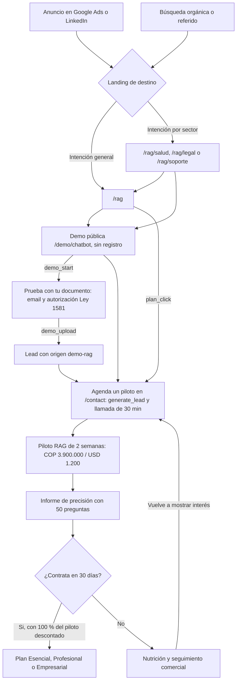
> [Ver diagrama como imagen](images/diagramas/13-Reposicionamiento-RAG-1.png)

El **sistema de solicitud de demos** ([Sistema de demos](04-Sistema-de-Demos.md)) no es la puerta de este embudo. Se usa para las "Otras soluciones a medida", para las demos privadas de salud y para acompañar la venta RAG (demo guiada, acceso ampliado). Ver [Flujo del cliente](03-Flujo-del-Cliente.md).

---

## Antes: el sitio en producción

Capturas actuales de `www.koptup.com` (rama `main`), tomadas antes del reposicionamiento.

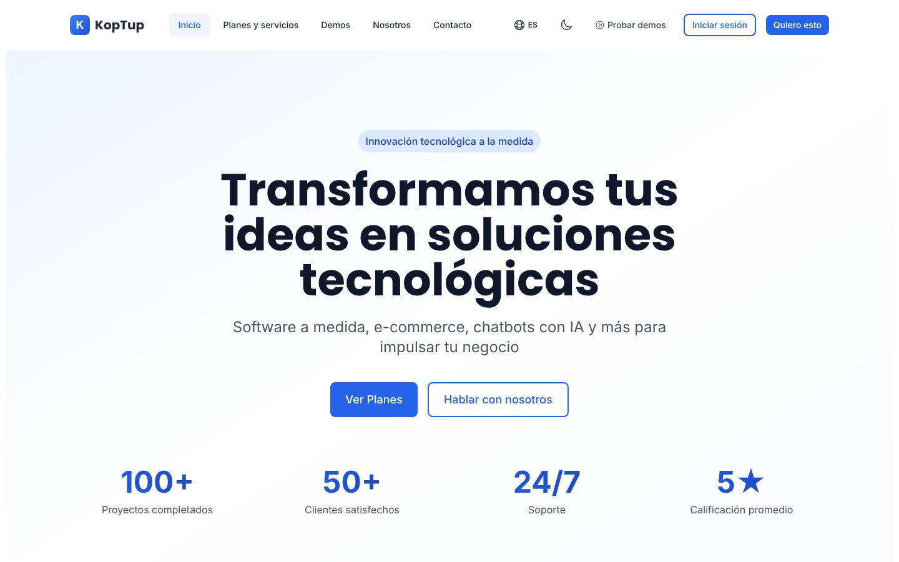

*Home: mensaje genérico de agencia y cuatro cifras sin respaldo. El reposicionamiento cambia el H1 a "IA que responde con los documentos de tu empresa", pone los botones "Probar la demo" y "Ver planes", y reemplaza las cifras por "Demo con IA real, sin registro", "Respuestas con fuente citada", "Piloto en 2 semanas" y "Equipo en Colombia".*

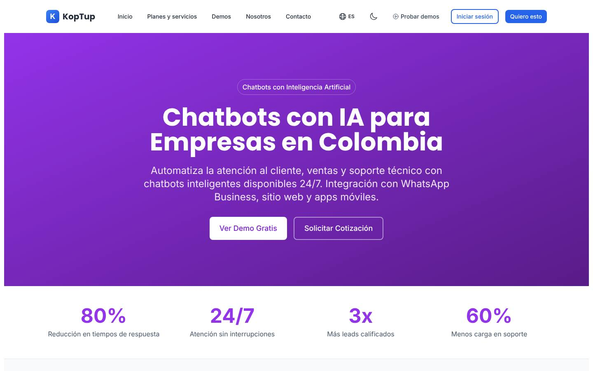

*`/chatbots-ia`: chatbots genéricos "24/7", cifras sin fuente y, más abajo, "desde $499 USD". Se reescribe como "Chatbots RAG para WhatsApp y web".*

*`/services`: el producto principal es una tarjeta entre 27, con voseo ("Elegí cómo querés trabajar…") y conversión con TRM en vivo. Los planes RAG pasan arriba de todo y el resto del catálogo queda como "Otras soluciones a medida".*

*`/demo/chatbot`: la demo con IA real, con textos técnicos, datos de ejemplo en inglés y voseo. El reposicionamiento le agrega el enlace a `/rag` y "Prueba con tu documento"; el rediseño por sector es de la Fase 2 ([Sistemas RAG](Producto-chatbot-rag-ia.md)).*

## Después: la rama terminada

Capturas reales de un build de la rama `rag-reposicionamiento` en su estado final. Todavía no están en producción.

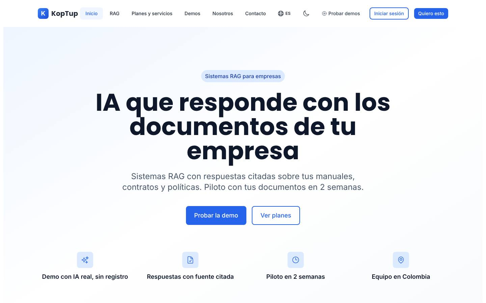

*Inicio: H1 nuevo, botones "Probar la demo" y "Ver planes", "RAG" en el menú y los 4 datos verificables en lugar de las cifras sin respaldo.*

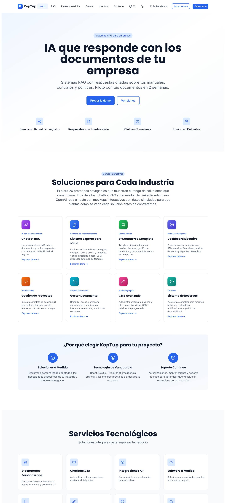

*Inicio completo: el texto usa el conteo real de 26 demos y pone el chatbot RAG y el "Sistema experto para salud" como primeras tarjetas.*

*`/rag`: H1 "Sistemas RAG para empresas en Colombia", con "Prueba con tu documento" y "Agenda un piloto" como CTA.*

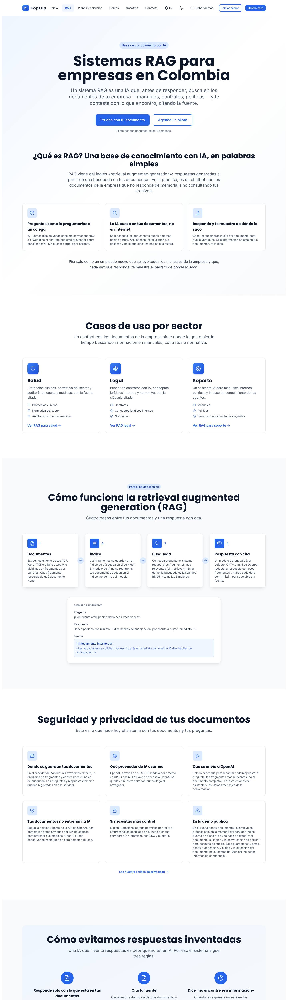

*`/rag` completa: qué es RAG, casos por sector, cómo funciona en 4 pasos, seguridad según el código real y cómo se evitan respuestas inventadas.*

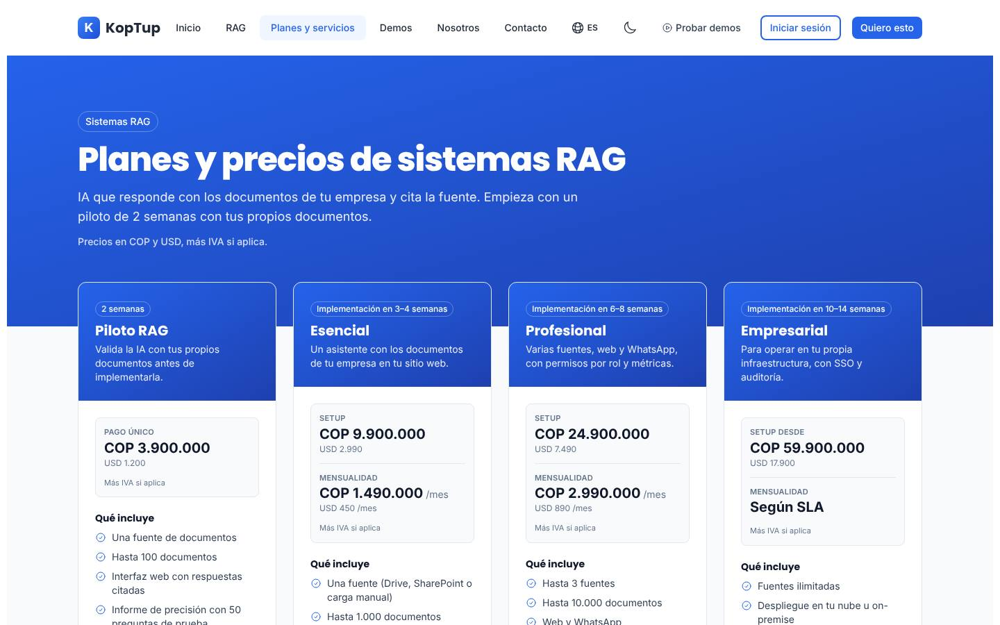

*`/services#planes-rag`: los 4 planes arriba de todo, con COP y USD fijos y "Más IVA si aplica".*

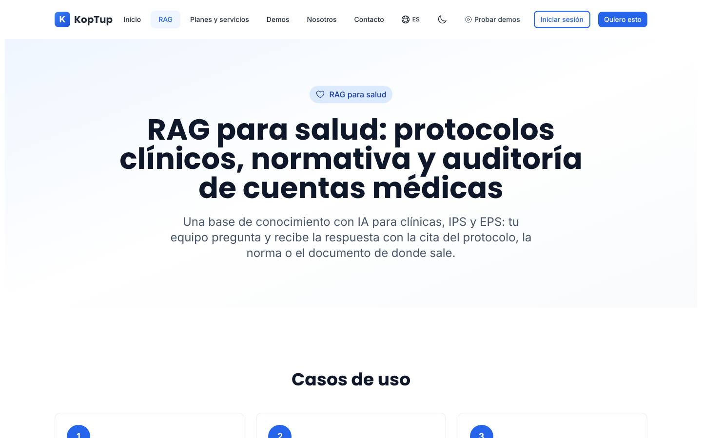

*`/rag/salud`: landing corta del sector salud con su H1, 3 casos de uso, enlace a `/rag` y CTA.*

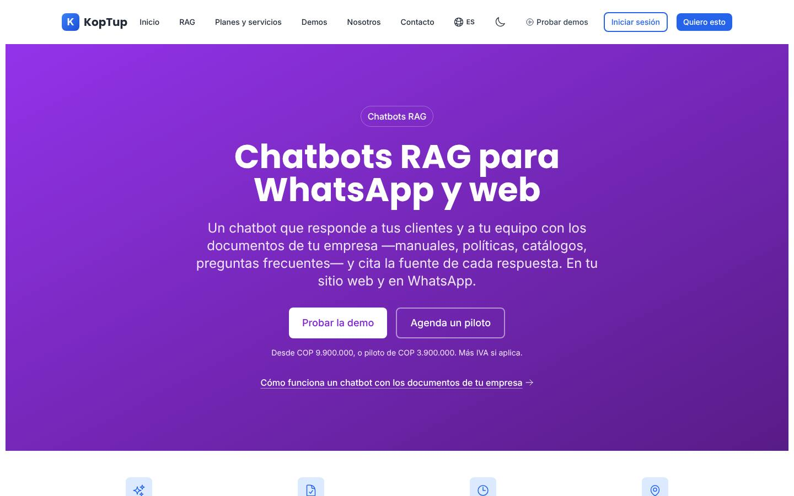

*`/chatbots-ia`: reescrita como "Chatbots RAG para WhatsApp y web", con el precio de los planes RAG y sin cifras sin respaldo.*

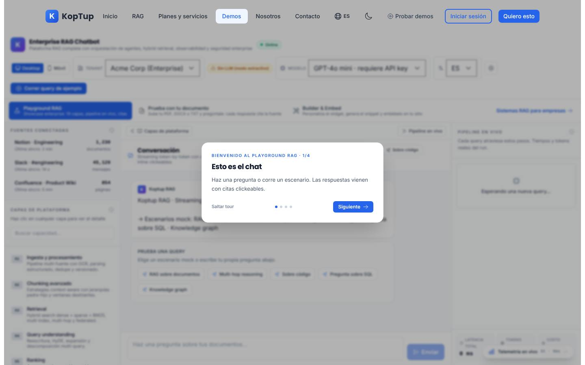

*`/demo/chatbot`: recorrido de bienvenida en español con "tú" y los tres modos (Playground RAG, Prueba con tu documento y Builder & Embed).*

*"Prueba con tu documento" apagada (`DEMO_UPLOAD_ENABLED` sin activar): así debe fallar, con "Agenda una demo con nosotros" y la demo de ejemplo disponible.*

---

## Las 7 etapas de la especificación

La especificación del dueño divide el trabajo en 7 fases. En esta wiki se llaman **etapas E1 a E7** para no confundirlas con las fases del roadmap (Fase 0 a Fase 5). Las 7 etapas pertenecen a la **Fase 1** del roadmap.

| Etapa | Qué cambia, en lenguaje claro | Por qué | Estado en la rama |
|---|---|---|---|
| **E1. SEO técnico** | Todas las direcciones oficiales usan `https://www.koptup.com`. `robots.txt` apunta al sitemap con `www`. Los títulos quedan como "<título> \| KopTup", de 60 caracteres como máximo. Se elimina la etiqueta meta keywords. Los botones que iban a `/pricing` van directo a `/services#planes-rag`. El sitemap incluye las páginas nuevas | Que Google indexe una sola versión del sitio y muestre títulos limpios | Hecha |
| **E2. Inicio** | Title "KopTup \| IA que responde con los documentos de tu empresa", H1 y subtítulo nuevos, botones "Probar la demo" y "Ver planes", el chatbot RAG como primera demo destacada y 4 datos verificables en lugar de cifras sin respaldo. El número de demos que se menciona es el real (26) | La home es la primera impresión y debe decir qué vende KopTup | Hecha |
| **E3. Página `/rag` y landings por sector** | Una página completa sobre RAG (qué es, casos por sector, cómo funciona, seguridad según el código actual, cómo se evitan respuestas inventadas, integraciones, planes, FAQ y CTA) y tres landings cortas para salud, legal y soporte. "RAG" en el menú y en el footer | Cada anuncio necesita una página de destino que hable de su problema | Hecha |
| **E4. Precios en `/services`** | Sección "planes-rag" arriba de todo con los 4 planes. Se quita la tarjeta "Chatbot RAG con IA" y la conversión con TRM en vivo. El resto del catálogo queda como "Otras soluciones a medida", con sus mismos precios en COP y el USD calculado con `TRM_REFERENCIA = 3300` | Un precio claro filtra a los prospectos y evita contradicciones | Hecha |
| **E5. Coherencia** | `/chatbots-ia` reescrita como "Chatbots RAG para WhatsApp y web"; `/soluciones-ia` sin cifras sin respaldo y con RAG primero; `/demo/cuentas-medicas` presentada según su código (resultó "Sistema experto para salud"); todo el sitio en español con "tú"; sin botones de demo que llevaban a otros productos | Que ninguna página contradiga a las demás | Hecha |
| **E6. "Prueba con tu documento"** | En `/demo/chatbot` el visitante sube su propio PDF, DOCX o TXT y pregunta sobre él, dando solo su email y la autorización de datos. Con límites, borrado a la hora y tope de gasto. API propia en `/api/demo-rag` | Es el momento que más convence y convierte el interés en un lead con email | Hecha (apagada por defecto hasta configurar Railway) |
| **E7. Medición para anuncios** | Banner de cookies propio. GA4, Google Ads y LinkedIn Insight solo con su variable configurada y después de aceptar cookies. Eventos `generate_lead`, `demo_start`, `demo_upload`, `whatsapp_click` y `plan_click`. Variables documentadas en el README | Saber qué anuncio trae leads y pilotos, y optimizar la pauta | Hecha (sin IDs reales configurados todavía) |

---

## Páginas nuevas y modificadas

Todas están hechas en la rama `rag-reposicionamiento` y pendientes de merge.

| Ruta o pieza | Tipo | Qué cambia | Etapa |
|---|---|---|---|
| `/rag` | Nueva | Página principal del producto con 9 secciones, JSON-LD `Service` (cada plan como `Offer`) y `FAQPage` con 8 preguntas | E3 |
| `/rag/salud`, `/rag/legal`, `/rag/soporte` | Nuevas | H1, 3 casos de uso, enlace a `/rag` y CTA. `/rag/salud` enlaza la demo de cuentas médicas | E3 |
| `/services` (sección `#planes-rag`) | Modificada | Planes RAG arriba; catálogo debajo como "Otras soluciones a medida"; sin la tarjeta del chatbot; sin botón de demo en "QA automatizado con IA" y "VPN empresarial" | E4, E5 |
| `/` (inicio) | Modificada | Title, description, H1, subtítulo, botones, chatbot RAG y cuentas médicas como demos destacadas, 4 datos verificables, imagen para redes y JSON-LD alineados | E2 |
| `/chatbots-ia` | Modificada | Reescrita como "Chatbots RAG para WhatsApp y web", con precio desde el plan Esencial o el Piloto y tiempos de los planes | E5 |
| `/soluciones-ia` | Modificada | RAG como primera solución con enlace a `/rag`; sin cifras sin respaldo; FAQ visible igual a su JSON-LD | E5 |
| `/demo/cuentas-medicas` | Modificada | Se presenta como "Sistema experto para salud" (su código no usa búsqueda vectorial), sin "Reduce rechazos hasta 80 %", enlazada desde el inicio y `/rag/salud` | E5 |
| `/demo/chatbot` | Modificada | Enlace a `/rag`, tercer modo "Prueba con tu documento", aviso de información confidencial, eventos `demo_start` y `demo_upload` y title "Demo RAG: prueba con tu documento" | E3, E6, E7 |
| `/contact` | Modificada | Opción "Sistema RAG", plan prellenado desde los CTA de los planes (`?service=sistema-rag&plan=<plan>`) y eventos `generate_lead` y `whatsapp_click` | E4, E7 |
| `/register` | Modificada | Muestra la tarjeta del plan RAG elegido en lugar de precios viejos | E4 |
| `/pricing` | Modificada | Redirige a `/services#planes-rag` | E1 |
| `/about`, `/demo`, `/desarrollo-web-colombia`, `/bienvenido-producthunt` | Modificadas | Número real de demos, sin cifras sin respaldo y sin "desde $499 USD" (las dos últimas remiten a los precios publicados) | E2, E5 |
| `/cookies` y política de privacidad | Modificadas | Nueva categoría de cookies de marketing y textos de analítica y anuncios | E7 |
| Menú y footer | Modificados | "RAG" en el menú principal (escritorio y móvil) y "Sistemas RAG" en el footer | E3 |
| `sitemap.xml`, `robots.txt`, `llms.txt`, `manifest.json`, imágenes para redes | Modificados | Dominio `www`, páginas nuevas y mensaje RAG. Las páginas destino de anuncios usan la imagen dinámica con el mensaje RAG | E1–E5 |
| Banner de consentimiento de cookies | Nuevo | "Aceptar" y "Rechazar"; la analítica y las etiquetas de anuncios solo cargan al aceptar. Solo aparece si hay al menos una etiqueta configurada | E7 |
| Backend del chatbot (`chatbot.routes.ts`) | Modificado | Reglas fijas para responder solo con los documentos, citar y decir "No encontré esa información" | E3 |
| Backend de la demo (`routes/demo-rag.routes.ts`, `services/demo-rag.service.ts`, `services/rag-pipeline.ts`, `services/lead.service.ts`) | Nuevo | API `/api/demo-rag` de "Prueba con tu documento" y registro de leads compartido con el formulario de contacto | E6 |
| README | Modificado | Variables de entorno de Vercel y Railway, y eventos de medición | E6, E7 |

**Fuentes únicas en el código de la rama:** `src/lib/site.ts` (dominio y plantilla de títulos), `src/lib/rag-plans.ts` (precios), `src/lib/rag-page.ts` (rutas y sectores de `/rag`), `src/lib/demos.ts` (conteo de demos), `src/lib/cookie-consent.ts` (categorías de consentimiento) y `scripts/check-titles.mjs` (`npm run check-titles` valida formato y longitud de todos los títulos).

---

## Planes y precios

Precios en COP **más IVA si aplica** y USD fijos (no se convierten con TRM).

| Plan | Pago inicial | Mensualidad | Plazo | Qué incluye |
|---|---|---|---|---|
| **Piloto RAG** | COP 3.900.000 / USD 1.200 | — | 2 semanas | Una fuente, hasta 100 documentos, interfaz web con citas e informe de precisión con 50 preguntas de prueba |
| **Esencial** | Setup COP 9.900.000 / USD 2.990 | COP 1.490.000 / USD 450 | 3–4 semanas | Una fuente (Drive, SharePoint o carga manual), hasta 1.000 documentos, widget web y respuestas con cita. La mensualidad incluye hosting, IA hasta 3.000 preguntas al mes, actualización de documentos y soporte Lun–Vie |
| **Profesional** | Setup COP 24.900.000 / USD 7.490 | COP 2.990.000 / USD 890 | 6–8 semanas | Hasta 3 fuentes, hasta 10.000 documentos, web y WhatsApp, permisos por rol y panel de métricas. Incluye hasta 15.000 preguntas al mes, soporte prioritario y revisión mensual de calidad |
| **Empresarial** | Desde COP 59.900.000 / USD 17.900 | Según SLA | 10–14 semanas | Fuentes ilimitadas, despliegue en la nube del cliente u on-premise, SSO, auditoría y código fuente incluido |

- **Pregunta adicional sobre el tope:** COP 250 / USD 0,08.
- **WhatsApp:** las tarifas de Meta por mensajes se cobran aparte, al costo.
- **Descuento del Piloto:** si el cliente contrata un plan en los 30 días siguientes, se le descuenta el 100 % del Piloto del setup.
- **Otras soluciones a medida:** el resto del catálogo conserva sus precios en COP; su valor en USD es una referencia calculada con `TRM_REFERENCIA = 3300`.

Detalle comercial, definiciones pendientes ("pregunta", "fuente", "soporte prioritario") y tareas de entrega en [Sistemas RAG](Producto-chatbot-rag-ia.md).

---

## Demo "Prueba con tu documento"

**Qué ve el visitante en `/demo/chatbot`:** la demo con un documento de ejemplo sigue abierta y sin registro. Junto a ella está la pestaña **"Prueba con tu documento"**. Si la función está apagada o se agotó el presupuesto del mes, la pestaña muestra "Agenda una demo con nosotros" y el botón para volver a la demo de ejemplo (captura `rag-demo-subida.jpg` de la galería).

| Regla | Valor en la rama |
|---|---|
| Formatos | PDF, DOCX o TXT. Se valida la extensión, el tipo y el contenido real del archivo |
| Tamaño máximo | 5 MB y 30 páginas (en DOCX y TXT las páginas se estiman por cantidad de texto) |
| Datos que se piden | Solo el email y una casilla de autorización de tratamiento de datos (Ley 1581 de 2012) con enlace a `/privacy` |
| Lead | El email se registra como lead con origen **`demo-rag`** por el mismo canal del formulario de contacto (`services/lead.service.ts`). No se guarda el nombre ni el contenido del archivo. Si falla el registro, la demo sigue funcionando |
| Preguntas | 10 por documento, de hasta 500 caracteres. Una pregunta que falla no se descuenta |
| Documentos | 3 por IP al día (día de Colombia). El cupo se devuelve si el documento se rechaza |
| Retención | El documento y su índice viven solo en la memoria del servidor y se borran a la hora (TTL de 1 hora). Nada va a disco, base de datos ni almacenamiento de objetos. Si el visitante sube otro documento, el anterior se borra en ese momento |
| Modelo | `gpt-4o-mini` fijo, con el mismo pipeline del chatbot (`services/rag-pipeline.ts`) |
| Tope de gasto | `DEMO_MONTHLY_BUDGET_USD` (por defecto 50, mes UTC). Al alcanzarlo se desactivan la subida y las preguntas, y aparece "Agenda una demo con nosotros" → `/contact` |
| Citas | Por página en PDF y por fragmento en DOCX y TXT. Si la respuesta no está, dice "No encontré esa información en el documento." |
| Aviso visible | "No subas información confidencial en la demo" |
| Encendido | Falla cerrada: solo funciona con `DEMO_UPLOAD_ENABLED=true`, Redis conectado (`REDIS_URL`) y `OPENAI_API_KEY`. Si falta algo, queda apagada |
| API | `/api/demo-rag`, sin ticket ni cuenta. Contrato en [Backend y API](09-Backend-y-API.md), sección 3.7 |

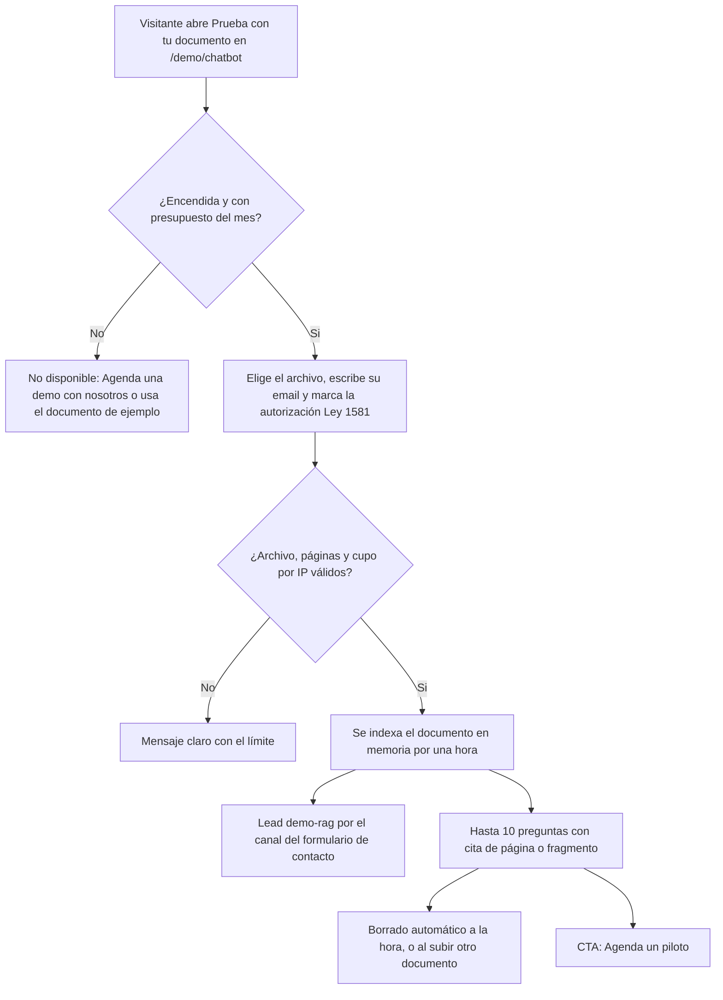
> [Ver diagrama como imagen](images/diagramas/13-Reposicionamiento-RAG-2.png)

**Cumplimiento de la Ley 1581 de 2012** (a validar con el asesor legal; ver [Legal](Seccion-Legal.md)):

- **Autorización previa, expresa e informada:** casilla sin marcar, separada del botón de subir, con el texto de la finalidad (responder sobre el documento y contactar al visitante por su interés en el producto) y enlace a la política en `/privacy`. El backend rechaza la subida sin autorización.
- **Política de tratamiento:** la rama actualizó las políticas de cookies y de privacidad para la analítica y los anuncios. La finalidad de la demo, la **transmisión internacional** al proveedor de IA (OpenAI, vía API) y el borrado a la hora se explican en la sección de seguridad de `/rag`; falta validar con el asesor que la política de tratamiento también los cubra.
- **Minimización:** solo email; el documento no se guarda más de una hora; los eventos de analítica no llevan datos personales.
- **Prueba de la autorización:** hoy la fecha de la autorización queda en el mensaje del lead `demo-rag`. Con el sistema de demos se guarda un `ConsentRecord` (versión de la política, fecha, canal `demo_rag`) asociado al Lead ([Sistema de demos](04-Sistema-de-Demos.md), sección 14).
- **Datos sensibles:** el aviso "No subas información confidencial en la demo" es obligatorio, y más en `/rag/salud`.

---

## Medición para anuncios

### Variables de entorno

Lista final de la auditoría. Solo nombres: los valores se configuran en el panel de cada plataforma (Vercel → *Settings* → *Environment Variables*; Railway → servicio del backend → *Variables*) y nunca se escriben en el repositorio ni en esta wiki. El detalle de formatos está en el README de la rama.

| Variable | Dónde | Obligatoria | Qué hace |
|---|---|---|---|
| `NEXT_PUBLIC_GA_ID` | Vercel | No | ID de medición de GA4. Carga GA4 solo si el visitante acepta las cookies de analítica y abre en la CSP los dominios de Google. Se fija al compilar: hay que redesplegar después de crearla o cambiarla |
| `NEXT_PUBLIC_GOOGLE_ADS_ID` | Vercel | No | ID de la etiqueta de Google Ads. Carga la etiqueta (vinculador de conversiones y remarketing) solo si el visitante acepta las cookies de marketing. Redesplegar después de cambiarla |
| `NEXT_PUBLIC_LINKEDIN_PARTNER_ID` | Vercel | No | Partner ID del LinkedIn Insight Tag. Se carga solo si el visitante acepta las cookies de marketing. Redesplegar después de cambiarla |
| `NEXT_PUBLIC_API_URL` | Vercel | Sí | URL del backend en Railway. La usan "Prueba con tu documento", el chatbot y la CSP. Hoy está en `apps/web/.env.production`; si falta, el código usa la URL por defecto del backend de producción (`src/lib/backend-url.ts`) |
| `OPENAI_API_KEY` (web) | Vercel | No | Solo para la demo del generador de LinkedIn Ads (`/api/linkedin-ads/generate`); ya existía. `OPENAI_MODEL` es opcional en la web |
| `DEMO_UPLOAD_ENABLED` | Railway | Sí | En `true` enciende la subida de documentos (`/api/demo-rag`); por defecto está apagada. También necesita Redis y `OPENAI_API_KEY`. Si falta algo, el sitio muestra "Agenda una demo con nosotros" |
| `DEMO_MONTHLY_BUDGET_USD` | Railway | No | Tope de gasto mensual en OpenAI de la demo (USD, mes UTC; por defecto 50). Al alcanzarlo se desactivan la subida y las preguntas. Un valor inválido o negativo la deja desactivada |
| `OPENAI_API_KEY` | Railway | Sí | Clave de OpenAI del backend: demo RAG (`gpt-4o-mini` fijo), chatbot y otros módulos. El backend no arranca sin ella |
| `OPENAI_MODEL` | Railway | No | Modelo por defecto del chatbot y otros módulos (`gpt-4o-mini` si no se define). "Prueba con tu documento" no la lee |
| `REDIS_URL` | Railway | Sí | Redis del proyecto (plugin de Railway, con el cliente existente `config/redis.ts`). Guarda el cupo de 3 documentos por IP al día y el contador de gasto. Sin Redis la subida queda apagada |
| `MONGODB_URI` | Railway | Sí | Base de datos de los leads del formulario de contacto y de la demo (origen `demo-rag`), además del resto de datos del backend. Si falla al guardar un lead de la demo, la demo sigue funcionando |
| `TRUST_PROXY_HOPS` | Railway | No | Cantidad de proxies delante del backend (por defecto 1). Define la IP real del visitante para los límites por IP; hay que verificarla en producción |
| `SMTP_HOST`, `SMTP_PORT`, `SMTP_SECURE`, `SMTP_USER`, `SMTP_PASS`, `EMAIL_FROM`, `ADMIN_EMAIL` | Railway | No | Avisos por email de cada lead (formulario de contacto y demo RAG). Son las mismas que ya usaba el formulario |
| `WHATSAPP_PROVIDER`, `ADMIN_WHATSAPP_NUMBER` y las del proveedor (`TWILIO_ACCOUNT_SID`, `TWILIO_AUTH_TOKEN`, `TWILIO_WHATSAPP_NUMBER`, o `ULTRAMSG_INSTANCE_ID`, `ULTRAMSG_TOKEN`, o `WHATSAPP_API_TOKEN`, `WHATSAPP_PHONE_NUMBER_ID`) | Railway | No | Avisos por WhatsApp de cada lead, por el mismo canal que el formulario de contacto. Ya existían |
| `CORS_ORIGIN` | Railway | No | Orígenes extra permitidos, separados por coma. `https://www.koptup.com` y `https://koptup.com` ya están permitidos en el código |
| `DEMO_RAG_TTL_SECONDS` | Railway | No: **no definirla** | Solo sirve en pruebas locales para bajar el TTL de 1 hora. Se ignora con `NODE_ENV=production` |

### Consentimiento

- La rama agrega un **banner propio con "Aceptar" y "Rechazar"** (y enlace a `/cookies`) sobre la misma clave de preferencias que ya usaba `/cookies`, más una categoría nueva de **marketing**. Las preferencias guardadas antes no habilitan marketing.
- GA4 depende de la categoría de analítica; Google Ads y LinkedIn Insight, de la de marketing. Usa el modo de consentimiento de Google. Si el visitante retira el consentimiento en `/cookies`, la página se recarga.
- El banner solo aparece si hay al menos una etiqueta configurada; sin variables no hay banner, ni scripts, ni dominios nuevos en la política de seguridad de contenido (`apps/web/next.config.js`).

### Eventos

| Evento | Cuándo se dispara | Parámetros | Uso en pauta |
|---|---|---|---|
| `generate_lead` | Se envía con éxito el formulario de `/contact` | `lead_source`, `service`, `plan_id` si viene de un plan RAG | Conversión principal en Google Ads y LinkedIn |
| `demo_start` | Primera pregunta en `/demo/chatbot` en cada carga de la página | `demo_mode` (`sample` o `upload`) | Micro-conversión para optimizar audiencias |
| `demo_upload` | Documento subido con éxito en "Prueba con tu documento" | `file_type`, `pages` | Conversión secundaria (lead con email) |
| `whatsapp_click` | Clic en el botón de WhatsApp de `/contact` (el único del sitio) | `link_location` | Conversión secundaria |
| `plan_click` | Clic en el CTA de un plan RAG o de una tarjeta de "Otras soluciones a medida" | `plan_name`, `plan_id`, `plan_group`, `cta` | Interés por plan; audiencias de remarketing |

- Los eventos nunca llevan datos personales (ni email ni nombre del documento). Para agrupar por plan sin importar el idioma se usa `plan_id`. Las subidas del modo Builder no cuentan como `demo_upload`.
- **Conversiones:** el código no trae IDs de conversión. En Google Ads se importan desde GA4 (marcando como eventos clave, por ejemplo, `generate_lead` y `demo_upload`); en LinkedIn se crean en Campaign Manager.
- Los enlaces de los anuncios llevan parámetros UTM.

---

## Estado de implementación

Commits de la rama `rag-reposicionamiento` sobre `main` (`git log --oneline origin/main..HEAD`), del más antiguo al más reciente. Todos están completos y subidos a `origin`.

| Commit | Fecha | Etapa | Qué hace |
|---|---|---|---|
| `2df589a` | 2026-10-08 | E1 | `fix(seo)`: dominio canónico `www`, plantilla de títulos y sin meta keywords; `/pricing` → `/services#planes-rag`; sin reseñas inventadas en el JSON-LD |
| `88e9ce9` | 2026-10-08 | E2 | `feat(home)`: reposiciona el inicio en sistemas RAG; 4 datos verificables; conteo real de demos (26) |
| `5828060` | 2026-10-08 | E4 | `feat(precios)`: planes RAG en `/services` y TRM de referencia fija; catálogo como "Otras soluciones a medida" |
| `69795b8` | 2026-10-08 | E3 | `feat(rag)`: página `/rag`, landings por sector y enlaces en menú y footer; reglas de respuesta con fuente en el backend del chatbot |
| `a72235f` | 2026-10-08 | E5 | `fix(services)`: quita los botones de demo que llevaban a otros productos (QA automatizado y VPN) |
| `576d6df` | 2026-10-08 | E5 | `refactor(chatbots-ia)`: reescribe la página como chatbots RAG para WhatsApp y web |
| `c3a34e1` | 2026-10-08 | E5 | `refactor(soluciones-ia)`: quita cifras sin respaldo y pone RAG primero |
| `68c99c2` | 2026-10-08 | E5 | `refactor(cuentas-medicas)`: presenta la demo como "Sistema experto para salud" y la enlaza desde el inicio y `/rag/salud` |
| `d2a4f66` | 2026-10-08 | E5 | `style(i18n)`: reemplaza el voseo por "tú" en todo el sitio (páginas, demos, ofertas y metadata) |
| `3633750` | 2026-10-08 | E5 | `fix(coherencia)`: los chatbots de `/desarrollo-web-colombia` pasan de "desde $499 USD" al precio de los planes RAG ("Desde COP 9.900.000, o piloto de COP 3.900.000") |
| `3d523b9` | 2026-10-08 | E6 | `feat(demo-rag)`: "Prueba con tu documento" en `/demo/chatbot` con la API `/api/demo-rag`, límites, borrado a la hora, tope de gasto, lead `demo-rag` y title nuevo de la demo |
| `5493b46` | 2026-10-08 | E7 | `feat(analytics)`: banner de cookies, GA4, Google Ads y LinkedIn con consentimiento, los 5 eventos, CSP según las variables y README con las variables |
| `dd48ef6` | 2026-10-08 | Auditoría | `fix(rag)`: ajustes de la auditoría final: sin "$499 USD" ni "24/7" en `/desarrollo-web-colombia` y `/bienvenido-producthunt`, imagen para redes con el mensaje RAG en las páginas destino de anuncios, JSON-LD de la home alineado con los sistemas RAG y modelo de OpenAI en el pipeline de la demo |

| Etapa | Estado |
|---|---|
| E1. SEO técnico | Hecha |
| E2. Inicio | Hecha |
| E3. `/rag` y landings | Hecha |
| E4. Precios | Hecha |
| E5. Coherencia | Hecha |
| E6. "Prueba con tu documento" | Hecha (apagada por defecto) |
| E7. Medición | Hecha (sin IDs reales todavía) |
| Auditoría final | Hecha: build, typecheck, lint y `check-titles` sin errores; rastreo de las 43 URLs del sitemap y de las rutas clave sin problemas de SEO |
| Merge en `main` y despliegue | **Pendiente:** requiere la aprobación del dueño ([Para publicar](#para-publicar)) |

---

## Decisiones técnicas

Resumen de las decisiones registradas en la auditoría final, por etapa.

**E1. SEO técnico**
- `src/lib/site.ts` es la fuente única de dominio y marca: `SITE_URL = https://www.koptup.com` fijo, sin variable de entorno, para que el canonical no cambie por entorno. Plantilla de títulos `'%s | KopTup'` con un máximo de 60 caracteres, validada en 76 rutas con `npm run check-titles`.
- La metadata devuelve un title con valor por defecto y plantilla, porque un layout intermedio con title fijo cortaba la plantilla en `/demo/*` y `/rag/*`.
- `robots.txt` y `llms.txt` siguen estáticos en `public/`. `robots.txt` bloquea solo las áreas privadas y de autenticación. `/pricing` redirige a `/services#planes-rag` y su canonical es `/services`.
- Se quitaron el `aggregateRating` inventado y una acción de búsqueda hacia una ruta que no existe. Las URLs funcionales de las demos también pasaron a `www`.

**E2. Inicio**
- La home es un componente de servidor (metadata y JSON-LD) y la interfaz está en `components/home/HomeContent.tsx`. Title y description viven en `site.ts`.
- Conteo de demos: 26, las tarjetas del catálogo de `/demo` (2 con IA real y 24 prototipos), desde `src/lib/demos.ts`. No cuentan cuentas médicas (se entra con código) ni el sistema experto (no está enlazado).
- Los 4 datos verificables están en el componente reutilizable `HomeHighlights`, que también reemplazó las cifras sin respaldo de otras landings. La imagen dinámica para redes (`opengraph-image.tsx`) se arregló y lleva el mensaje RAG.

**E3. `/rag` y landings por sector**
- `/rag` no tiene layout propio, para que su `FAQPage` y su `Service` no se hereden en las landings `/rag/<sector>`. Los textos están en `messages/offerings/_rag-page.{es,en}.json`, y las respuestas de precio y plazo de la FAQ se rellenan desde `rag-plans.ts`, igual en la página y en el JSON-LD.
- La seguridad se describe solo con lo verificable en el código (servidor de KopTup, OpenAI vía API con GPT-4o mini, qué se envía), sin certificaciones, hosting ni ubicación. La política de la API de OpenAI se revisó el 8 de octubre de 2026.
- "Cómo funciona" describe la búsqueda real (léxica tipo BM25, 5 mejores fragmentos), sin prometer embeddings. Las integraciones usan íconos genéricos, sin logos de marcas.
- El backend agrega siempre reglas de respuesta con fuente al prompt del chatbot (responder solo con fragmentos, citar [n] y decir "No encontré esa información…"), para que lo que promete `/rag` sea cierto.
- El menú dice "RAG" (segundo ítem) y el footer "Sistemas RAG".

**E4. Precios**
- `rag-plans.ts` tiene los precios fijos en COP y USD; los textos están en `messages/offerings/_rag-plans`. `RagPlans` se reutiliza en `/services` y `/rag`. No hay plan "más popular", porque sería una afirmación inventada.
- Los CTA de los planes van a `/contact?service=sistema-rag&plan=<id>`; el formulario prellena el plan. Lo pagado por el Piloto se descuenta 100 % del setup si se contrata en 30 días.
- `TRM_REFERENCIA = 3300` es la única tasa; se eliminaron la TRM en vivo y `/api/trm`. La tarjeta "Chatbot RAG con IA" se oculta solo en la vista; la oferta sigue en los datos y en el sitemap.
- JSON-LD `Service` con un `Offer` por plan, solo en COP, reutilizado en `/services` y `/rag`.

**E5. Coherencia**
- Los textos de `/chatbots-ia` y `/soluciones-ia` pasaron a archivos de mensajes propios, para armar su `FAQPage` en el servidor con los mismos textos visibles.
- En `/chatbots-ia` se quitaron afirmaciones sin respaldo (Claude, GPT-4, "conversaciones ilimitadas", pagos, CRM, paso a humano). Canales por plan: web desde Esencial y WhatsApp desde Profesional.
- `/demo/cuentas-medicas` es "Sistema experto para salud" por evidencia del código: reglas, búsqueda exacta por CUPS y GPT-4o para extraer datos, sin embeddings ni búsqueda vectorial.
- El voseo pasó a "tú" con un mapa de formas revisado a mano (unas 200 sustituciones en 48 archivos), respetando la primera persona ("Recibí", "Te agendé"). No se tocaron las páginas legales en "usted" ni los archivos del repositorio que no sirve el sitio.
- QA automatizado y VPN empresarial quedan sin botón de demo.

**E6. "Prueba con tu documento"**
- El pipeline compartido (fragmentos, búsqueda tipo BM25, llamada a OpenAI y costos) se movió tal cual a `services/rag-pipeline.ts`. Para cupos y gasto se usa el Redis que ya tenía el proyecto.
- Falla cerrada: la demo solo se activa con `DEMO_UPLOAD_ENABLED=true`, `OPENAI_API_KEY` y Redis disponible. El endpoint de estado nunca expone montos.
- Presupuesto: modelo fijo `gpt-4o-mini`, costo calculado con el uso que informa OpenAI y mes en UTC. Al llegar al tope se bloquean subida y preguntas.
- Cupo de 3 documentos por IP al día (la IP se guarda con hash) y 10 preguntas por documento; los cupos se devuelven si el documento se rechaza o la respuesta falla. Además hay un límite de solicitudes por IP cada 10 minutos.
- Formatos validados por extensión, tipo y firma del archivo. Páginas reales en PDF y estimadas en DOCX y TXT. Citas por página en PDF y por fragmento en DOCX y TXT. Prompt con defensa ante instrucciones incrustadas en el documento y frase fija de "no encontrado".
- Retención: los documentos viven en memoria con un barrido periódico; nada va a disco, MongoDB ni almacenamiento de objetos. Hay un endpoint para borrar antes de la hora, que la web usa cuando el visitante sube otro documento.
- El lead pasó a `services/lead.service.ts`, compartido con el formulario. `Contact` tiene el campo `source` (`contact-form` o `demo-rag`).
- En la web, "Prueba con tu documento" es el tercer modo de la demo. Si el estado no responde, la demo se trata como no disponible. El navegador guarda solo el identificador del documento durante la sesión.

**E7. Medición**
- Banner propio porque no existía ninguno, con la misma clave de preferencias y la nueva categoría de marketing. Si el navegador no permite guardar, la elección se mantiene en memoria.
- GA4 depende de analítica; Ads y LinkedIn, de marketing. Modo de consentimiento de Google. Las etiquetas no se cargan en rutas con tokens en la URL y los IDs se validan por formato.
- Eventos sin datos personales, con `plan_id` estable. No se inventan IDs de conversión.
- La CSP abre los dominios de Google o LinkedIn solo si su variable existe en el build.

**Auditoría final**
- "$499 USD" y el rango "$2.000–$8.000 USD" contradecían los precios publicados; se reemplazaron por una remisión a `/services` y el precio del Piloto tomado de `rag-plans.ts`.
- La imagen para redes con el mensaje RAG se usa solo en las páginas destino de anuncios; el resto del sitio conserva la imagen estática anterior.
- El pipeline de los escenarios de ejemplo de la demo muestra el modelo de OpenAI elegido en lugar de un modelo de otro proveedor. Los demás detalles simulados de esos escenarios quedan igual (se rediseñan en la Fase 2).

---

## Pendientes conocidos

Lo que la auditoría final dejó anotado por etapa. Ninguno bloquea el merge, pero conviene decidirlos antes de pautar.

**E1. SEO técnico**
- La imagen estática para redes (`/og-image.png`) todavía dice "Desarrollo de Software a Medida". La usan las páginas que no son destino de anuncios.
- `robots.txt` y `llms.txt` son estáticos: si cambia el dominio, hay que actualizarlos a mano.

**E2. Inicio**
- El `FAQPage` del JSON-LD de la home tiene 5 preguntas que no se ven en la página (ya estaba así; Google pide que el marcado coincida con el contenido visible).
- Las descripciones de `Organization` y `LocalBusiness` en el JSON-LD siguen diciendo "software a medida (GPT-4, Claude AI)".

**E3. `/rag` y landings**
- El JSON-LD de `/rag` (`Service` y `FAQPage`) está solo en español.
- `/rag` presenta Drive, SharePoint, WhatsApp y el widget web por plan. Esas piezas se construyen en la Fase 2 y deben existir antes de entregar el primer plan Esencial o Profesional ([Sistemas RAG](Producto-chatbot-rag-ia.md), tareas 12–14).

**E4. Precios**
- El panel privado de ejemplo todavía recomienda "Chatbot RAG con IA" a 489.000 al mes con "24/7" ([Portal del cliente](06-Portal-del-Cliente.md), [Panel de administración](05-Panel-de-Administracion.md)).
- Hay grupos de textos sin uso (`pricingPage`, `servicesPage`) con "24/7". No se muestran, pero viajan en los mensajes que recibe el navegador.
- Sigue en el repositorio la página muerta `pricing/page_new.tsx` ([Servicios y precios](Seccion-Servicios-y-Precios.md)).

**E5. Coherencia**
- `/about` tiene casos con métricas ("+3x leads cualificados", "-60% tiempo de cierre mensual") que el código no permite verificar. Las decide el dueño.
- "GPT-4 y Claude AI" sigue en `/desarrollo-web-colombia`, en `/bienvenido-producthunt` y en el JSON-LD `Organization`, aunque el backend solo usa OpenAI.
- Las páginas legales siguen en "usted" hasta su reescritura ([Legal](Seccion-Legal.md)), y `CONTRIBUTING.md` y las plantillas de issues del repositorio tienen voseo (no las ve el visitante).
- La demo de LinkedIn Ads tiene métricas de ejemplo ("60% de tickets…", "+80% completion rate") en sus datos.

**E6. "Prueba con tu documento" y demo del chatbot**
- El modo **Builder & Embed** de `/demo/chatbot` sigue sin límites de uso ni tope de costo de IA, y las preguntas libres del Playground tampoco tienen tope (ya era así en `main`). Se resuelve con la pasarela de IA de la Fase 0 ([Sistemas RAG](Producto-chatbot-rag-ia.md), tarea 2).
- El encabezado de la demo sigue en inglés ("Enterprise RAG Chatbot") y promete cosas que la demo no hace ("hybrid retrieval", "orquestación de agentes"). Junto con los datos de ejemplo en inglés, se corrige en la Fase 2 ([Sistemas RAG](Producto-chatbot-rag-ia.md), tarea 15).
- Hay que verificar en Railway que `TRUST_PROXY_HOPS` entrega la IP real del visitante; de eso dependen los cupos por IP.
- No se probó la respuesta real del modelo: en el entorno de desarrollo no había clave de OpenAI. Se prueba en la vista previa o en producción antes de encender la subida.

**E7. Medición**
- Faltan pruebas con IDs reales de GA4, Google Ads y LinkedIn.
- Las conversiones de Google Ads se importan desde GA4 y las de LinkedIn se crean en Campaign Manager: el código no trae IDs de conversión.
- La CSP solo agrega el dominio de país de Google para Colombia; los visitantes de otros países pueden perder algunas señales de remarketing.

**Antes de enviar tráfico pagado (Fase 0)**
- Persistencia y seguridad del chatbot: autorización en servidor, topes de costo y rate-limit compartido ([Sistemas RAG](Producto-chatbot-rag-ia.md), tareas 1–3). Cuando cambie dónde se guardan los datos, hay que actualizar la sección de seguridad de `/rag`.

---

## Para publicar

- [ ] **Configurar las variables** de la [tabla](#variables-de-entorno) en Vercel y en Railway (sin valores en el repositorio). Redesplegar la web después de crear las `NEXT_PUBLIC_*`.
- [ ] **Revisar la vista previa de Vercel de la rama** `rag-reposicionamiento`: inicio, `/rag` y sus 3 landings, `/services#planes-rag`, `/chatbots-ia`, `/soluciones-ia`, `/demo/chatbot` y el banner de cookies (rechazar no carga scripts; aceptar sí).
- [ ] **Hacer merge en `main` cuando el dueño lo apruebe**, y desplegar.
- [ ] **Activar `DEMO_UPLOAD_ENABLED=true`** solo cuando Redis y `OPENAI_API_KEY` estén listos en Railway (y `TRUST_PROXY_HOPS` verificada). Probar una subida completa, su borrado a la hora y el mensaje al alcanzar el tope. Antes de enviar pauta a la subida, el [Roadmap](12-Roadmap.md#fase-1-el-primer-entregable-es-el-reposicionamiento-rag) pide además la pasarela de IA con topes (paquete 2) y la política de tratamiento publicada (paquete 4).

Después de publicar:

1. Verificar los 5 eventos en la vista de depuración de GA4 con los IDs reales.
2. Enviar el sitemap en Search Console y revisar la cobertura de `/rag` y sus landings.
3. Crear las conversiones en Google Ads (importadas desde GA4) y en LinkedIn, y lanzar las campañas con UTM hacia `/rag` y las landings por sector ([Comercial, marketing y legal](11-Comercial-Marketing-y-Legal.md)).

---

## Tareas pendientes

Lo que falta para cerrar el reposicionamiento. La numeración es la de la tabla de tareas de [Sistemas RAG](Producto-chatbot-rag-ia.md), donde está el detalle completo.

| # | Tarea | Fase | Prioridad | Esfuerzo | Criterio de aceptación |
|---|---|---|---|---|---|
| 1–3 | Persistencia del chatbot, autorización en servidor con topes de costo y rate-limit, rotación de credenciales y dependencias | Fase 0 — Endurecimiento | P0 | M + M + S | Tras redesplegar, los bots siguen disponibles; superar el cupo devuelve un mensaje claro; sin vulnerabilidades altas ni críticas en `npm audit --omit=dev` |
| 4 | Revisión con el dueño, merge en `main` y despliegue ([Para publicar](#para-publicar)) | Fase 1 — Funnel y solicitud de demos | P0 | M | En producción la home muestra el H1 nuevo; `/rag` y sus 3 landings responden 200 y están en el sitemap; `/services#planes-rag` muestra los montos exactos |
| 5 | E6 "Prueba con tu documento" con todos sus límites, lead `demo-rag` y borrado a la hora | Fase 1 — Funnel y solicitud de demos | P0 | M | **Hecha en la rama `rag-reposicionamiento` (pendiente de merge).** Falta encenderla en producción y comprobar con un PDF real que la respuesta cita la página |
| 6 | E7 Medición: banner de consentimiento, GA4, Google Ads, LinkedIn Insight y los 5 eventos; variables en el README | Fase 1 — Funnel y solicitud de demos | P0 | S | **Hecha en la rama `rag-reposicionamiento` (pendiente de merge).** Falta probarla con los IDs reales |
| 7 | Coherencia pendiente: metadata de `/demo/chatbot` y restos de "$499" en `/desarrollo-web-colombia` y `/bienvenido-producthunt` | Fase 1 — Funnel y solicitud de demos | P1 | S | **Hecha en la rama `rag-reposicionamiento` (pendiente de merge).** Los restos que quedan están en [Pendientes conocidos](#pendientes-conocidos) |

---

## Métricas de éxito

Metas iniciales a validar con 8 semanas de pauta; no son resultados actuales. Las metas comerciales del producto (demo, leads, Pilotos y planes) están en [Sistemas RAG](Producto-chatbot-rag-ia.md).

| Métrica | Fuente | Meta inicial |
|---|---|---|
| Páginas indexables con title "<título> \| KopTup" de 60 caracteres o menos | `npm run check-titles` | 100 % |
| Etiquetas meta keywords en el sitio | Revisión del HTML servido | 0 |
| URLs de `/rag` y sus 3 landings indexadas | Search Console | 4 de 4 en las 4 semanas siguientes a la publicación |
| Cifras del sitio sin respaldo verificable | Revisión de contenido | 0 |
| Visitantes de pauta que hacen una pregunta en la demo (`demo_start`) | GA4 | ≥ 15 % |
| Visitantes de la demo que suben un documento (`demo_upload`) | GA4 | ≥ 8 % |
| Conversiones `generate_lead` atribuidas por campaña | Google Ads y LinkedIn | 100 % de los leads de pauta con fuente y UTM |
| Gasto de IA de la demo | Contador de `DEMO_MONTHLY_BUDGET_USD` | Nunca por encima del tope |

---

## Relación con el roadmap

| Fase del roadmap | Qué aporta al producto RAG |
|---|---|
| Fase 0 — Endurecimiento | Persistencia del chatbot, autorización en servidor, topes de costo de IA y rate-limit, credenciales rotadas |
| **Fase 1 — Funnel y solicitud de demos** | **Este reposicionamiento (E1–E7), implementado en la rama y pendiente de merge**, Lead unificado con origen `demo_rag`, kit del Piloto |
| Fase 2 — Demos vendibles | Núcleo RAG con citas por página, widget embebible real, conectores Drive y SharePoint, canal WhatsApp, demo por sector |
| Fase 3 — Propuestas y conversión | Propuestas de los planes RAG con el crédito del Piloto |
| Fase 4 — Productos SaaS reales | SaaS multi-tenant del RAG con medición de preguntas y cobro recurrente |
| Fase 5 — Escala | Casos de estudio, nuevas landings por sector y contenido en inglés |

Plan detallado y tabla de tareas en [Sistemas RAG](Producto-chatbot-rag-ia.md). Calendario general en [Roadmap](12-Roadmap.md).
