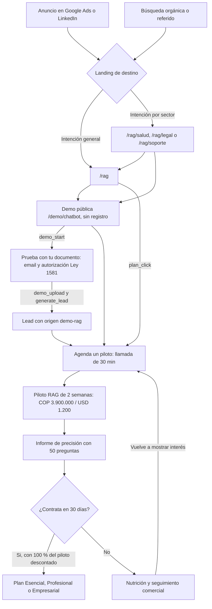
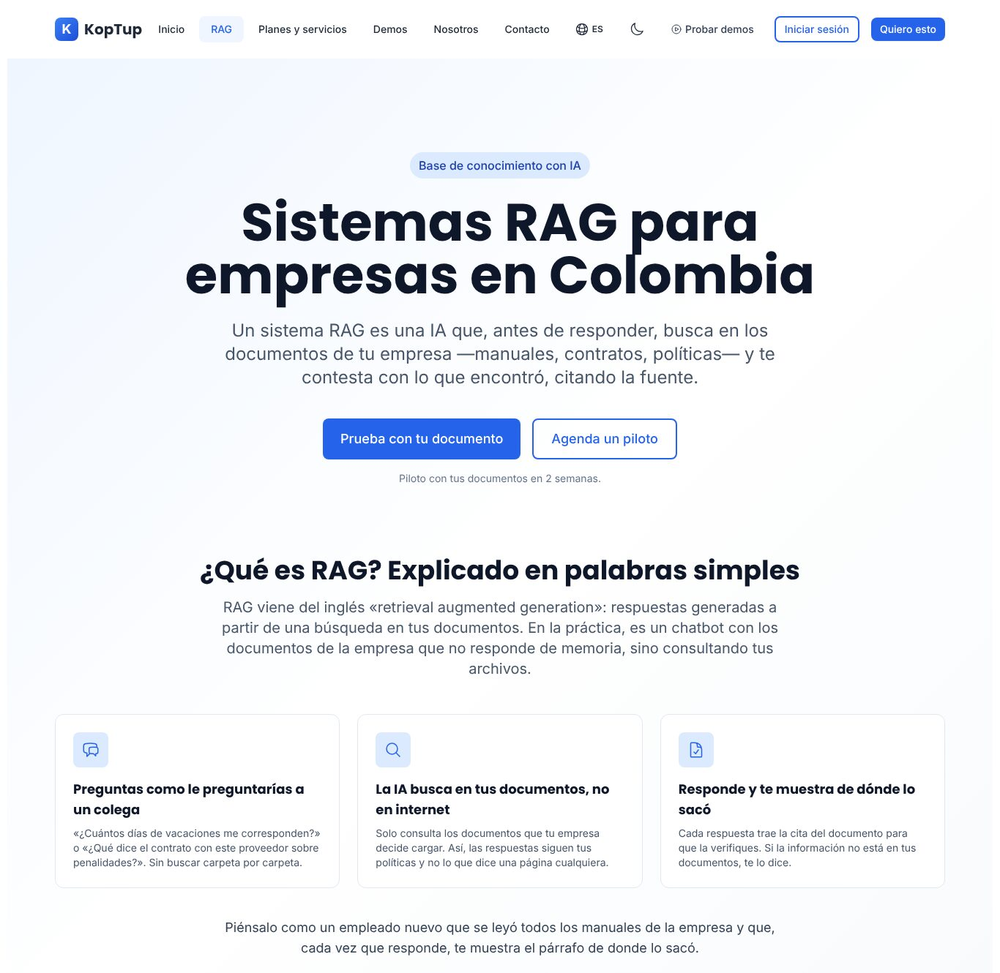
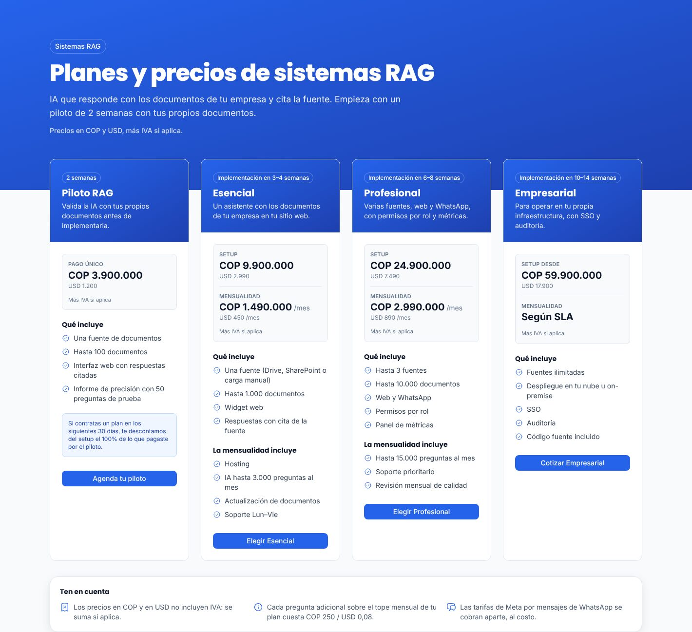
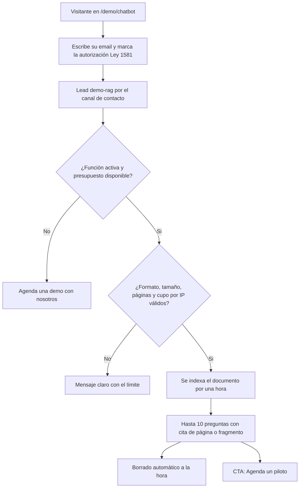

# Reposicionamiento RAG

> Qué se está cambiando en el sitio para que KopTup se presente como lo que vende primero: **sistemas RAG**, una IA que responde con los documentos de cada empresa y cita la fuente. Resume la especificación del dueño, las páginas nuevas y modificadas, los planes, la demo "Prueba con tu documento", la medición para anuncios y el estado de la implementación.
>
> El trabajo está en la rama **`rag-reposicionamiento`**, creada desde `main`. **No está fusionada ni publicada**: producción sigue mostrando el sitio anterior. Estado al **8 de octubre de 2026**.
>
> Páginas relacionadas: [Sistemas RAG](Producto-chatbot-rag-ia.md) (página del producto), [Flujo del cliente](03-Flujo-del-Cliente.md), [Sistema de demos](04-Sistema-de-Demos.md), [Servicios y precios](Seccion-Servicios-y-Precios.md), [Landings SEO](Seccion-Landings-SEO.md), [Comercial, marketing y legal](11-Comercial-Marketing-y-Legal.md) y [Roadmap](12-Roadmap.md).

---

## En una mirada

- **Mensaje nuevo:** "IA que responde con los documentos de tu empresa". El sitio deja de presentarse como agencia genérica de software a medida.
- **Páginas nuevas:** `/rag` y tres landings por sector (`/rag/salud`, `/rag/legal`, `/rag/soporte`), con "RAG" en el menú y en el footer.
- **Precios publicados:** cuatro planes RAG arriba de `/services` (Piloto, Esencial, Profesional y Empresarial) en COP y USD fijos. El resto del catálogo queda debajo como **"Otras soluciones a medida"**.
- **Demo sin fricción que capta leads:** la demo del chatbot RAG sigue sin registro; "Prueba con tu documento" pide solo email y autorización de datos, y ese email entra como lead `demo-rag`.
- **Listo para pauta:** SEO técnico corregido, GA4, Google Ads y LinkedIn Insight con banner de consentimiento, y 5 eventos de conversión.
- **Honestidad:** fuera las cifras sin respaldo ("100+ proyectos", "50+ clientes", "5★", "24/7", "80 %", "3x", "60 %", "desde $499 USD") y las reseñas inventadas del JSON-LD.
- **En el roadmap**, todo esto es parte de la **Fase 1 — Funnel y solicitud de demos**. Depende de la Fase 0 para la persistencia y la seguridad del chatbot, y abre la Fase 2 (widget embebible y conectores) y la Fase 4 (SaaS multi-tenant con cobro).

---

## Por qué se cambia

| Problema hoy (producción) | Consecuencia | Qué hace el reposicionamiento |
|---|---|---|
| La home dice "Transformamos tus ideas en soluciones tecnológicas" y el catálogo muestra 27 productos con el mismo peso | Nadie sale del sitio sabiendo qué vende KopTup primero; un anuncio no tiene una página de destino clara | Home, `/rag` y landings por sector con un solo mensaje |
| El chatbot RAG es el único producto con IA real, pero es una tarjeta más | Lo más convincente del sitio queda escondido | La demo del chatbot es la primera demo destacada y el destino de todos los CTA |
| Precios contradictorios ("desde $499 USD" en `/chatbots-ia`, otros en `/services`) | Desconfianza y llamadas de prospectos fuera de presupuesto | Una sola fuente de precios (`rag-plans.ts`) que usan `/services`, `/rag`, `/chatbots-ia`, la home, `/register` y el JSON-LD |
| Cifras sin respaldo y reseñas inventadas en datos estructurados | Riesgo de reputación y de penalización en buscadores | Se eliminan y se reemplazan por 4 datos verificables |
| Canonical sin `www`, títulos con la marca repetida, meta keywords | SEO técnico débil justo antes de invertir en pauta | Dominio canónico `https://www.koptup.com`, plantilla "<título> \| KopTup" y sin meta keywords |
| Sin analítica ni banner de cookies | Imposible saber qué anuncio trae clientes | GA4, Google Ads y LinkedIn Insight solo con consentimiento, y eventos de conversión |

---

## El nuevo embudo RAG

> [Ver diagrama como imagen](images/diagramas/13-Reposicionamiento-RAG-1.png)

El **sistema de solicitud de demos** ([Sistema de demos](04-Sistema-de-Demos.md)) no es la puerta de este embudo. Se usa para las "Otras soluciones a medida", para las demos privadas de salud y para acompañar la venta RAG (demo guiada, acceso ampliado). Ver [Flujo del cliente](03-Flujo-del-Cliente.md).

---

## Antes: el sitio en producción

Capturas actuales de `www.koptup.com` (rama `main`), tomadas antes del reposicionamiento.

*Home: mensaje genérico de agencia y cuatro cifras sin respaldo. El reposicionamiento cambia el H1 a "IA que responde con los documentos de tu empresa", pone los botones "Probar la demo" y "Ver planes", y reemplaza las cifras por "Demo con IA real, sin registro", "Respuestas con fuente citada", "Piloto en 2 semanas" y "Equipo en Colombia".*

*`/chatbots-ia`: chatbots genéricos "24/7", cifras sin fuente y, más abajo, "desde $499 USD". Se reescribe como "Chatbots RAG para WhatsApp y web".*

*`/services`: el producto principal es una tarjeta entre 27, con voseo ("Elegí cómo querés trabajar…") y conversión con TRM en vivo. Los planes RAG pasan arriba de todo y el resto del catálogo queda como "Otras soluciones a medida".*

*`/demo/chatbot`: la demo con IA real, con textos técnicos, datos de ejemplo en inglés y voseo. El reposicionamiento le agrega el enlace a `/rag` y "Prueba con tu documento"; el rediseño por sector es de la Fase 2 ([Sistemas RAG](Producto-chatbot-rag-ia.md)).*

## Después: vista previa de la rama

Capturas de un build local de la rama `rag-reposicionamiento`. Todavía no están en producción.

---

## Las 7 etapas de la especificación

La especificación del dueño divide el trabajo en 7 fases. En esta wiki se llaman **etapas E1 a E7** para no confundirlas con las fases del roadmap (Fase 0 a Fase 5). Las 7 etapas pertenecen a la **Fase 1** del roadmap.

| Etapa | Qué cambia, en lenguaje claro | Por qué | Estado en la rama |
|---|---|---|---|
| **E1. SEO técnico** | Todas las direcciones oficiales usan `https://www.koptup.com`. `robots.txt` apunta al sitemap con `www`. Los títulos quedan como "<título> \| KopTup", de 60 caracteres como máximo. Se elimina la etiqueta meta keywords. Los botones que iban a `/pricing` van directo a `/services#planes-rag`. El sitemap incluye las páginas nuevas | Que Google indexe una sola versión del sitio y muestre títulos limpios | Hecha |
| **E2. Inicio** | Title "KopTup \| IA que responde con los documentos de tu empresa", H1 y subtítulo nuevos, botones "Probar la demo" y "Ver planes", el chatbot RAG como primera demo destacada y 4 datos verificables en lugar de cifras sin respaldo. El número de demos que se menciona es el real (26) | La home es la primera impresión y debe decir qué vende KopTup | Hecha |
| **E3. Página `/rag` y landings por sector** | Una página completa sobre RAG (qué es, casos por sector, cómo funciona, seguridad según el código actual, cómo se evitan respuestas inventadas, integraciones, planes, FAQ y CTA) y tres landings cortas para salud, legal y soporte. "RAG" en el menú y en el footer | Cada anuncio necesita una página de destino que hable de su problema | Hecha |
| **E4. Precios en `/services`** | Sección "planes-rag" arriba de todo con los 4 planes. Se quita la tarjeta "Chatbot RAG con IA" y la conversión con TRM en vivo. El resto del catálogo queda como "Otras soluciones a medida", con sus mismos precios en COP y el USD calculado con `TRM_REFERENCIA = 3300` | Un precio claro filtra a los prospectos y evita contradicciones | Hecha |
| **E5. Coherencia** | `/chatbots-ia` reescrita como "Chatbots RAG para WhatsApp y web"; `/soluciones-ia` sin cifras sin respaldo y con RAG primero; `/demo/cuentas-medicas` presentada según su código (resultó "Sistema experto para salud"); todo el sitio en español con "tú"; sin botones de demo que llevaban a otros productos | Que ninguna página contradiga a las demás | Hecha |
| **E6. "Prueba con tu documento"** | En `/demo/chatbot` el visitante sube su propio PDF, DOCX o TXT y pregunta sobre él, dando solo su email y la autorización de datos. Con límites, borrado a la hora y tope de gasto | Es el momento que más convence y convierte el interés en un lead con email | **En curso:** API y formulario de subida en desarrollo, sin commit todavía |
| **E7. Medición para anuncios** | GA4, Google Ads y LinkedIn Insight solo con su variable configurada y después de aceptar cookies. Eventos `generate_lead`, `demo_start`, `demo_upload`, `whatsapp_click` y `plan_click`. Variables documentadas en el README | Saber qué anuncio trae leads y pilotos, y optimizar la pauta | **Pendiente:** todavía sin código en la rama |

---

## Páginas nuevas y modificadas

| Ruta o pieza | Tipo | Qué cambia | Etapa | Estado |
|---|---|---|---|---|
| `/rag` | Nueva | Página principal del producto con 9 secciones, JSON-LD `Service` (cada plan como `Offer`) y `FAQPage` con 8 preguntas | E3 | Hecha |
| `/rag/salud`, `/rag/legal`, `/rag/soporte` | Nuevas | H1, 3 casos de uso, enlace a `/rag` y CTA. `/rag/salud` enlaza la demo de cuentas médicas | E3 | Hechas |
| `/services` (sección `#planes-rag`) | Modificada | Planes RAG arriba; catálogo debajo como "Otras soluciones a medida"; sin la tarjeta del chatbot; sin botón de demo en "QA automatizado con IA" y "VPN empresarial" | E4, E5 | Hecha |
| `/` (inicio) | Modificada | Title, description, H1, subtítulo, botones, chatbot RAG y cuentas médicas como demos destacadas, 4 datos verificables, imagen para redes y JSON-LD alineados | E2 | Hecha |
| `/chatbots-ia` | Modificada | Reescrita como "Chatbots RAG para WhatsApp y web", con precio desde el plan Esencial o el Piloto y tiempos de los planes | E5 | Hecha |
| `/soluciones-ia` | Modificada | RAG como primera solución con enlace a `/rag`; sin cifras sin respaldo; FAQ visible igual a su JSON-LD | E5 | Hecha |
| `/demo/cuentas-medicas` | Modificada | Se presenta como "Sistema experto para salud" (su código no usa búsqueda vectorial), sin "Reduce rechazos hasta 80 %", enlazada desde el inicio y `/rag/salud` | E5 | Hecha |
| `/demo/chatbot` | Modificada | Enlace a `/rag` (hecho). "Prueba con tu documento", aviso de información confidencial y eventos | E3, E6, E7 | Parcial |
| `/contact` | Modificada | Opción "Sistema RAG" y plan prellenado desde los CTA de los planes (`?service=sistema-rag&plan=<plan>`) | E4 | Hecha |
| `/register` | Modificada | Muestra la tarjeta del plan RAG elegido en lugar de precios viejos | E4 | Hecha |
| `/pricing` | Modificada | Redirige a `/services#planes-rag` | E1 | Hecha |
| `/about`, `/demo`, `/desarrollo-web-colombia`, `/bienvenido-producthunt` | Modificadas | Número real de demos y sin cifras sin respaldo | E2 | Hecha (quedan restos de "$499" en las dos últimas) |
| Menú y footer | Modificados | "RAG" en el menú principal (escritorio y móvil) y "Sistemas RAG" en el footer | E3 | Hecha |
| `sitemap.xml`, `robots.txt`, `llms.txt`, `manifest.json`, imagen para redes de la home | Modificados | Dominio `www`, páginas nuevas y mensaje RAG | E1–E5 | Hecha |
| Banner de consentimiento de cookies | Nuevo | Aceptar y rechazar; la analítica y las etiquetas de anuncios solo cargan al aceptar | E7 | Pendiente |
| Backend del chatbot (`chatbot.routes.ts`) | Modificado | Reglas fijas para responder solo con los documentos, citar y decir "No encontré esa información" (hecho). Subida de documento propio con límites (en curso, sin commit: `routes/demo-rag.routes.ts` y `services/demo-rag.service.ts`) | E3, E6 | Parcial |
| README | Modificado | Variables de entorno de medición y de la demo | E6, E7 | Pendiente |

**Fuentes únicas en el código de la rama:** `src/lib/site.ts` (dominio y plantilla de títulos), `src/lib/rag-plans.ts` (precios), `src/lib/rag-page.ts` (rutas y sectores de `/rag`), `src/lib/demos.ts` (conteo de demos) y `scripts/check-titles.mjs` (`npm run check-titles` valida formato y longitud de todos los títulos).

---

## Planes y precios

Precios en COP **más IVA si aplica** y USD fijos (no se convierten con TRM).

| Plan | Pago inicial | Mensualidad | Plazo | Qué incluye |
|---|---|---|---|---|
| **Piloto RAG** | COP 3.900.000 / USD 1.200 | — | 2 semanas | Una fuente, hasta 100 documentos, interfaz web con citas e informe de precisión con 50 preguntas de prueba |
| **Esencial** | Setup COP 9.900.000 / USD 2.990 | COP 1.490.000 / USD 450 | 3–4 semanas | Una fuente (Drive, SharePoint o carga manual), hasta 1.000 documentos, widget web y respuestas con cita. La mensualidad incluye hosting, IA hasta 3.000 preguntas al mes, actualización de documentos y soporte Lun–Vie |
| **Profesional** | Setup COP 24.900.000 / USD 7.490 | COP 2.990.000 / USD 890 | 6–8 semanas | Hasta 3 fuentes, hasta 10.000 documentos, web y WhatsApp, permisos por rol y panel de métricas. Incluye hasta 15.000 preguntas al mes, soporte prioritario y revisión mensual de calidad |
| **Empresarial** | Desde COP 59.900.000 / USD 17.900 | Según SLA | 10–14 semanas | Fuentes ilimitadas, despliegue en la nube del cliente u on-premise, SSO, auditoría y código fuente incluido |

- **Pregunta adicional sobre el tope:** COP 250 / USD 0,08.
- **WhatsApp:** las tarifas de Meta por mensajes se cobran aparte, al costo.
- **Descuento del Piloto:** si el cliente contrata un plan en los 30 días siguientes, se le descuenta el 100 % del Piloto del setup.
- **Otras soluciones a medida:** el resto del catálogo conserva sus precios en COP; su valor en USD es una referencia calculada con `TRM_REFERENCIA = 3300`.

Detalle comercial, definiciones pendientes ("pregunta", "fuente", "soporte prioritario") y tareas de entrega en [Sistemas RAG](Producto-chatbot-rag-ia.md).

---

## Demo "Prueba con tu documento"

**Qué ve el visitante en `/demo/chatbot`:** la demo con un documento de ejemplo sigue abierta y sin registro. Junto a ella, la opción **"Prueba con tu documento"**.

| Regla | Valor |
|---|---|
| Formatos | PDF, DOCX o TXT |
| Tamaño máximo | 5 MB y 30 páginas |
| Datos que se piden | Solo el email y una casilla de autorización de tratamiento de datos (Ley 1581 de 2012) con enlace a `/privacy` |
| Lead | El email se envía como lead con origen **`demo-rag`** por el mismo canal del formulario de contacto |
| Preguntas | 10 por documento |
| Documentos | 3 por IP al día |
| Retención | El documento y su índice se borran a la hora (TTL de 1 hora). Nada queda en almacenamiento permanente |
| Tope de gasto | `DEMO_MONTHLY_BUDGET_USD` (por defecto 50). Al alcanzarlo, la subida se desactiva y aparece "Agenda una demo con nosotros" → `/contact` |
| Citas | Cada respuesta cita la página o el fragmento del documento |
| Aviso visible | "No subas información confidencial en la demo" |
| Almacenamiento de límites | El Redis que ya usa el proyecto (`REDIS_URL`). Si no está disponible, la función queda apagada con `DEMO_UPLOAD_ENABLED=false` |

> [Ver diagrama como imagen](images/diagramas/13-Reposicionamiento-RAG-2.png)

**Cumplimiento de la Ley 1581 de 2012** (a validar con el asesor legal; ver [Legal](Seccion-Legal.md)):

- **Autorización previa, expresa e informada:** casilla sin marcar, separada del botón de subir, con el texto de la finalidad (responder sobre el documento y contactar al visitante por su interés en el producto) y enlace a la política en `/privacy`.
- **Política de tratamiento:** debe mencionar esta finalidad, la **transmisión internacional** al proveedor de IA (OpenAI, vía API) y el plazo de borrado del documento.
- **Minimización:** solo email; el documento no se guarda más de una hora; los eventos de analítica no llevan datos personales.
- **Prueba de la autorización:** con el sistema de demos se guarda un `ConsentRecord` (versión de la política, fecha, canal `demo_rag`) asociado al Lead ([Sistema de demos](04-Sistema-de-Demos.md), sección 14).
- **Datos sensibles:** el aviso "No subas información confidencial en la demo" es obligatorio, y más en `/rag/salud`.

El contrato propuesto para el backend está en [Backend y API](09-Backend-y-API.md), sección 3.7. Si la rama define otro al fusionarse, prevalece el de la rama.

---

## Medición para anuncios

### Variables de entorno

Solo nombres; los valores se configuran en el panel de cada plataforma y nunca se escriben en el repositorio ni en esta wiki.

| Variable | Dónde | Para qué | Si no está |
|---|---|---|---|
| `NEXT_PUBLIC_GA_ID` | Web (Vercel) | ID de medición de Google Analytics 4 | No se carga GA4 |
| `NEXT_PUBLIC_GOOGLE_ADS_ID` | Web (Vercel) | ID de la etiqueta de Google Ads para conversiones | No se carga la etiqueta de Google Ads |
| `NEXT_PUBLIC_LINKEDIN_PARTNER_ID` | Web (Vercel) | Partner ID de LinkedIn Insight Tag | No se carga LinkedIn Insight |
| `DEMO_UPLOAD_ENABLED` | Backend (Railway) | Enciende o apaga "Prueba con tu documento" | Queda apagada. Debe estar en `false` hasta que existan Redis y la clave del proveedor de IA |
| `DEMO_MONTHLY_BUDGET_USD` | Backend (Railway) | Tope mensual de gasto de IA de la demo | Usa 50 por defecto |
| `REDIS_URL` | Backend (Railway) | Rate limit por IP y contador de gasto (el proyecto ya lo usa para la autenticación) | La subida se mantiene apagada |
| `OPENAI_API_KEY` | Backend (Railway) | Clave del proveedor de IA. Solo vive en el servidor; nunca en una variable `NEXT_PUBLIC_` | El chatbot responde en modo extractivo y la subida se mantiene apagada |

Los nombres definitivos quedan documentados en el README de la rama (etapa E7). Si cambian, se actualiza esta tabla.

### Consentimiento

- Hoy solo existe la página `/cookies`, que guarda preferencias en el navegador (esenciales, funcionales y analítica) sin banner, y nadie lee esas preferencias. No hay categoría de marketing.
- La rama agrega un **banner simple con "Aceptar" y "Rechazar"** conectado a esas preferencias. GA4, Google Ads y LinkedIn Insight se cargan **solo después de aceptar** y solo si su variable existe.
- La política de seguridad de contenido (`apps/web/next.config.js`) debe permitir los dominios de Google y LinkedIn.

### Eventos

| Evento | Cuándo se dispara | Uso en pauta |
|---|---|---|
| `generate_lead` | Se envía el formulario de contacto | Conversión principal en Google Ads y LinkedIn |
| `demo_start` | Primera pregunta en la demo | Micro-conversión para optimizar audiencias |
| `demo_upload` | Documento subido en "Prueba con tu documento" | Conversión secundaria (lead con email) |
| `whatsapp_click` | Clic en un botón de WhatsApp | Conversión secundaria |
| `plan_click` | Clic en el CTA de un plan, con el nombre del plan | Interés por plan; audiencias de remarketing |

Los eventos nunca llevan datos personales (ni email ni nombre del documento). Los enlaces de los anuncios llevan parámetros UTM.

---

## Estado de implementación

Commits de la rama `rag-reposicionamiento` sobre `main` (`git log --oneline origin/main..HEAD`), del más antiguo al más reciente:

| Commit | Fecha | Etapa | Qué hace |
|---|---|---|---|
| `2df589a` | 2026-10-08 | E1 | `fix(seo)`: dominio canónico `www`, plantilla de títulos y sin meta keywords; `/pricing` → `/services#planes-rag`; sin reseñas inventadas en el JSON-LD |
| `88e9ce9` | 2026-10-08 | E2 | `feat(home)`: reposiciona el inicio en sistemas RAG; 4 datos verificables; conteo real de demos (26) |
| `5828060` | 2026-10-08 | E4 | `feat(precios)`: planes RAG en `/services` y TRM de referencia fija; catálogo como "Otras soluciones a medida" |
| `69795b8` | 2026-10-08 | E3 | `feat(rag)`: página `/rag`, landings por sector y enlaces en menú y footer; reglas de respuesta con fuente en el backend del chatbot |
| `a72235f` | 2026-10-08 | E5 | `fix(services)`: quita los botones de demo que llevaban a otros productos (QA automatizado y VPN) |
| `576d6df` | 2026-10-08 | E5 | `refactor(chatbots-ia)`: reescribe la página como chatbots RAG para WhatsApp y web |
| `c3a34e1` | 2026-10-08 | E5 | `refactor(soluciones-ia)`: quita cifras sin respaldo y pone RAG primero |
| `68c99c2` | 2026-10-08 | E5 | `refactor(cuentas-medicas)`: presenta la demo como "Sistema experto para salud" y la enlaza desde el inicio y `/rag/salud` |
| `d2a4f66` | 2026-10-08 | E5 | `style(i18n)`: reemplaza el voseo por "tú" en todo el sitio (páginas, demos, ofertas y metadata) |
| `3633750` | 2026-10-08 | E5 | `fix(coherencia)`: los chatbots de `/desarrollo-web-colombia` pasan de "desde $499 USD" al precio de los planes RAG ("Desde COP 9.900.000, o piloto de COP 3.900.000") |

| Etapa | Estado |
|---|---|
| E1. SEO técnico | Hecha |
| E2. Inicio | Hecha |
| E3. `/rag` y landings | Hecha |
| E4. Precios | Hecha |
| E5. Coherencia | Hecha |
| E6. "Prueba con tu documento" | **En curso** (cambios sin commit en la rama) |
| E7. Medición | **Pendiente** |
| Fusión en `main` y despliegue | Pendiente: requiere revisión del dueño ([Sistemas RAG](Producto-chatbot-rag-ia.md), tarea 4) |

---

## Decisiones técnicas tomadas en la rama

Resumen de las decisiones más relevantes del registro de la implementación.

| Tema | Decisión | Motivo |
|---|---|---|
| Dominio | Constante única `SITE_URL` en `src/lib/site.ts`, sin variable de entorno | El canonical no debe cambiar por entorno |
| Títulos | Plantilla `'%s \| KopTup'` heredada por todas las rutas y verificación automática con `npm run check-titles` | Evitar títulos sin marca o de más de 60 caracteres |
| Precios | `src/lib/rag-plans.ts` como única fuente; textos en `messages/offerings/_rag-plans.*.json`; JSON-LD generado desde los mismos datos | Que ningún precio se desalinee entre páginas |
| TRM | Se elimina la TRM en vivo (ruta `/api/trm` y sus hooks); queda `TRM_REFERENCIA = 3300` solo para "Otras soluciones a medida" | Lo pide la especificación y da precios estables |
| Tarjeta del chatbot | Se oculta solo en la vista del catálogo; la oferta sigue en los datos (la usan el sitemap y la ruta de la demo) | Cambio mínimo sin romper rutas |
| Respuestas con fuente | Reglas fijas que se agregan siempre al prompt de los bots | Que la demo cumpla lo que promete `/rag` ("No encontré esa información") |
| Seguridad en `/rag` | Solo se describe lo verificable en el código (servidor de KopTup, OpenAI vía API, GPT-4o mini, qué se envía) y la política vigente del proveedor; sin certificaciones | Regla de no inventar |
| Cuentas médicas | "Sistema experto para salud", no "Caso RAG" | Su código usa reglas y búsqueda exacta, no búsqueda vectorial |
| Conteo de demos | 26 (las tarjetas del catálogo de `/demo`), desde `src/lib/demos.ts` | Usar el número real |

---

## Pendientes y riesgos al fusionar

- **Voseo:** resuelto en la rama (commit `d2a4f66`) en todo el texto que sirve el sitio. Quedan con voseo `CONTRIBUTING.md` y las plantillas de issues del repositorio (no las ve el visitante), y las páginas legales siguen en "usted" hasta su reescritura ([Legal](Seccion-Legal.md)).
- **Restos de precios viejos:** el precio general "desde $499 USD" sigue en `/desarrollo-web-colombia` (pregunta frecuente y `priceRange` del JSON-LD) y en `/bienvenido-producthunt`; los chatbots de `/desarrollo-web-colombia` ya usan el precio de los planes RAG (commit `3633750`). También queda la página muerta `pricing/page_new.tsx` ([Servicios y precios](Seccion-Servicios-y-Precios.md)).
- **Metadata de `/demo/chatbot`:** todavía se titula "Chatbot Médico con IA para el Sector Salud".
- **Imagen para redes:** solo la home tiene la imagen nueva; las demás páginas usan la imagen estática anterior.
- **Persistencia y seguridad del chatbot (Fase 0):** antes de enviar tráfico pagado a una demo que recibe documentos, deben estar las tareas de persistencia, autorización en servidor, topes de costo y rate-limit ([Sistemas RAG](Producto-chatbot-rag-ia.md), tareas 1–3). Cuando cambie dónde se guardan los datos, hay que actualizar la sección de seguridad de `/rag`.
- **Promesas de los planes:** `/rag` presenta Drive, SharePoint, WhatsApp y el widget web por plan. Esas piezas se construyen en la Fase 2 y deben existir antes de entregar el primer plan Esencial o Profesional.
- **Área privada:** el panel de cliente de ejemplo aún muestra un plan "Chatbot RAG" con precios simulados que no coinciden con los planes RAG ([Portal del cliente](06-Portal-del-Cliente.md), [Panel de administración](05-Panel-de-Administracion.md)).

---

## Checklist para publicar

1. Revisar la rama con el dueño (textos, precios y capturas) y terminar E6 y E7.
2. Verificar: lint y build de web y backend, `npm run check-titles`, y que las páginas nuevas respondan 200.
3. Configurar en Vercel y Railway las variables de la tabla anterior. Dejar `DEMO_UPLOAD_ENABLED=false` hasta probar la subida en un entorno de prueba.
4. Fusionar en `main` y desplegar.
5. En producción: probar el banner (rechazar no carga scripts; aceptar sí), los 5 eventos en la vista de depuración de GA4, una subida completa con su borrado a la hora y el aviso al alcanzar el tope.
6. Enviar el sitemap en Search Console y revisar la cobertura de `/rag` y sus landings.
7. Crear las conversiones en Google Ads y LinkedIn y lanzar las campañas con UTM hacia `/rag` y las landings por sector ([Comercial, marketing y legal](11-Comercial-Marketing-y-Legal.md)).

---

## Tareas pendientes

Lo que falta para cerrar el reposicionamiento. La numeración es la de la tabla de tareas de [Sistemas RAG](Producto-chatbot-rag-ia.md), donde está el detalle completo.

| # | Tarea | Fase | Prioridad | Esfuerzo | Criterio de aceptación |
|---|---|---|---|---|---|
| 1–3 | Persistencia del chatbot, autorización en servidor con topes de costo y rate-limit, rotación de credenciales y dependencias | Fase 0 — Endurecimiento | P0 | M + M + S | Tras redesplegar, los bots siguen disponibles; superar el cupo devuelve un mensaje claro; sin vulnerabilidades altas ni críticas en `npm audit --omit=dev` |
| 5 | Terminar E6 "Prueba con tu documento" con todos sus límites, lead `demo-rag` y borrado a la hora | Fase 1 — Funnel y solicitud de demos | P0 | M | Un PDF de 30 páginas queda listo en < 20 s y la respuesta cita la página; a la hora el documento ya no existe; con el tope agotado aparece "Agenda una demo con nosotros" |
| 6 | E7 Medición: banner de consentimiento, GA4, Google Ads, LinkedIn Insight y los 5 eventos; variables en el README | Fase 1 — Funnel y solicitud de demos | P0 | S | Sin aceptar no se carga ningún script de terceros; al aceptar, los 5 eventos llegan a la vista de depuración de GA4 |
| 7 | Coherencia pendiente: metadata de `/demo/chatbot` y restos de "$499" en `/desarrollo-web-colombia` y `/bienvenido-producthunt` | Fase 1 — Funnel y solicitud de demos | P1 | S | Una búsqueda de "499" fuera de las demos da 0; el title de `/demo/chatbot` no menciona "médico" |
| 4 | Revisión con el dueño, fusión en `main` y despliegue (checklist de arriba) | Fase 1 — Funnel y solicitud de demos | P0 | M | En producción la home muestra el H1 nuevo; `/rag` y sus 3 landings responden 200 y están en el sitemap; `/services#planes-rag` muestra los montos exactos |

---

## Métricas de éxito

Metas iniciales a validar con 8 semanas de pauta; no son resultados actuales. Las metas comerciales del producto (demo, leads, Pilotos y planes) están en [Sistemas RAG](Producto-chatbot-rag-ia.md).

| Métrica | Fuente | Meta inicial |
|---|---|---|
| Páginas indexables con title "<título> \| KopTup" de 60 caracteres o menos | `npm run check-titles` | 100 % |
| Etiquetas meta keywords en el sitio | Revisión del HTML servido | 0 |
| URLs de `/rag` y sus 3 landings indexadas | Search Console | 4 de 4 en las 4 semanas siguientes a la publicación |
| Cifras del sitio sin respaldo verificable | Revisión de contenido | 0 |
| Visitantes de pauta que hacen una pregunta en la demo (`demo_start`) | GA4 | ≥ 15 % |
| Visitantes de la demo que suben un documento (`demo_upload`) | GA4 | ≥ 8 % |
| Conversiones `generate_lead` atribuidas por campaña | Google Ads y LinkedIn | 100 % de los leads de pauta con fuente y UTM |
| Gasto de IA de la demo | Contador de `DEMO_MONTHLY_BUDGET_USD` | Nunca por encima del tope |

---

## Relación con el roadmap

| Fase del roadmap | Qué aporta al producto RAG |
|---|---|
| Fase 0 — Endurecimiento | Persistencia del chatbot, autorización en servidor, topes de costo de IA y rate-limit, credenciales rotadas |
| **Fase 1 — Funnel y solicitud de demos** | **Este reposicionamiento (E1–E7)**, Lead unificado con origen `demo_rag`, kit del Piloto |
| Fase 2 — Demos vendibles | Núcleo RAG con citas por página, widget embebible real, conectores Drive y SharePoint, canal WhatsApp, demo por sector |
| Fase 3 — Propuestas y conversión | Propuestas de los planes RAG con el crédito del Piloto |
| Fase 4 — Productos SaaS reales | SaaS multi-tenant del RAG con medición de preguntas y cobro recurrente |
| Fase 5 — Escala | Casos de estudio, nuevas landings por sector y contenido en inglés |

Plan detallado y tabla de tareas en [Sistemas RAG](Producto-chatbot-rag-ia.md). Calendario general en [Roadmap](12-Roadmap.md).
