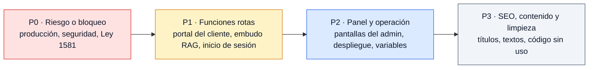

# Correcciones pendientes

> Al documentar todo el sitio contra el código de `main` y al dibujar sus diagramas de flujo aparecieron más de 200 puntos que no funcionan, confunden o no cumplen lo que prometen. Esta página los reúne sin repetir, ordenados por prioridad, para corregirlos desde el martes. Cada punto enlaza la página donde se explica con más detalle.
>
> Las limitaciones propias de cada demo no se repiten aquí: están en la sección **Limitaciones conocidas** de su guía ([Guía de demos](Doc-07-Guia-de-Demos.md)).

**En esta página:** [Resumen](#resumen) · [P0: riesgo o bloqueo](#p0-riesgo-o-bloqueo) · [P1: funciones rotas](#p1-funciones-rotas-que-ve-el-cliente-o-el-equipo) · [P2: panel y operación](#p2-panel-y-operación) · [P3: SEO, contenido y limpieza](#p3-seo-contenido-y-limpieza)

---

## Resumen

| Prioridad | Qué agrupa | Puntos |
|---|---|---|
| **P0** | Lo que impide vender hoy o es un riesgo legal o de seguridad | 10 |
| **P1** | Funciones que el cliente o el equipo usan y no sirven, incluidas las demos | 34 |
| **P2** | Detalles del panel, de la operación y de la configuración | 33 |
| **P3** | SEO, coherencia de textos y código que sobra | 30 |

---

## P0: riesgo o bloqueo

| # | Qué pasa | Qué hacer | Detalle |
|---|---|---|---|
| 0.1 | **El backend de producción no responde** ("Application not found" de Railway). Contacto, inicio de sesión, panel, solicitudes de demo, chatbot con IA y "Prueba con tu documento" fallan en `www.koptup.com`. Las demos "Con solicitud" muestran "No se pudo verificar" | Volver a desplegar el backend en Railway y, si cambia el dominio, actualizar `NEXT_PUBLIC_API_URL` en Vercel | [Estado y próximos pasos](15-Estado-y-Proximos-Pasos.md#acciones-del-dueño) |
| 0.2 | **Credenciales que estuvieron en el historial del repositorio** | Rotar la contraseña de MongoDB y los secretos JWT | [Estado y próximos pasos](15-Estado-y-Proximos-Pasos.md#acciones-del-dueño) |
| 0.3 | **Revisión de seguridad de rutas heredadas:** quedan ajustes de autorización y de tope de gasto en rutas del portal del cliente, de documentos, del chatbot y del inicio de sesión con Google. Por ser una wiki pública, el detalle no se publica aquí | Corregir antes de volver a abrir el registro público | Equipo de desarrollo |
| 0.4 | **No hay forma de suprimir los datos de una persona** (derecho del titular, Ley 1581). Solicitudes, contactos, cuentas, accesos y bitácora no vencen, y ni el panel ni la API permiten borrarlos | Agregar supresión desde el panel y un plazo de conservación | [Flujos técnicos › Hallazgos](Doc-14-3-Flujos-Tecnicos.md#hallazgos) |
| 0.5 | **El formulario de contacto no pide autorización de datos** ni tiene campo trampa contra bots, a diferencia de "Solicitar demo" | Agregar la casilla y guardar la prueba de autorización | [Flujos de negocio › Hallazgos](Doc-14-1-Flujos-de-Negocio.md#hallazgos) |
| 0.6 | **El chatbot guarda en disco las preguntas de "Prueba el asistente"** sin avisarlo y sin vencimiento | Avisar y borrar, o no guardar en la demo pública | [Flujos técnicos › Hallazgos](Doc-14-3-Flujos-Tecnicos.md#hallazgos) |
| 0.7 | **La autorización de "Prueba con tu documento" queda solo como texto** dentro del contacto, sin versión de la política | Guardarla como en las solicitudes de demo | [Flujos técnicos › Hallazgos](Doc-14-3-Flujos-Tecnicos.md#hallazgos) |
| 0.8 | **La política de privacidad promete responder en 30 días hábiles**, y la Ley 1581 fija 10 para consultas y 15 para reclamos. El texto es genérico | Revisión legal del texto | [SEO, analítica y legal](Doc-12-SEO-Analitica-y-Legal.md) |
| 0.9 | **`/activar` envía su token a la analítica:** no está en la lista de rutas sin medición, como sí lo están `/auth` y `/reset-password` | Agregarla a `NO_TRACKING_PATHS` | [Flujos de negocio › Hallazgos](Doc-14-1-Flujos-de-Negocio.md#hallazgos) |
| 0.10 | **Producción no mide nada:** no hay ninguna etiqueta configurada (GA4, Google Ads, LinkedIn), así que no aparece el banner y no se registra ninguna conversión | Crear las variables en Vercel antes de pautar | [SEO, analítica y legal](Doc-12-SEO-Analitica-y-Legal.md) |

---

## P1: funciones rotas que ve el cliente o el equipo

### Portal del cliente

| # | Qué pasa | Detalle |
|---|---|---|
| 1.1 | **No se pueden crear facturas, entregables ni conversaciones:** los cuatro modelos generan su número después de validarlo y todo guardado falla con error 500 | [API › Limitaciones](Doc-08-API.md#11-limitaciones-conocidas), [Modelos de datos](Doc-09-Modelos-de-Datos.md) |
| 1.2 | Aunque se arregle, **las facturas y los entregables quedan a nombre de quien los crea** (el equipo) y no del cliente, así que el cliente no los vería | [API](Doc-08-API.md#11-limitaciones-conocidas) |
| 1.3 | **"Nuevo pedido" llama a una dirección local fija** (`localhost:3001`) en vez de a la API configurada: falla en producción | [Flujos del prospecto y cliente](Doc-05-Flujos-del-Prospecto-y-Cliente.md) |
| 1.4 | **La conversación automática de cada pedido nunca se crea,** y responder desde el detalle de conversación del panel usa una ruta sin el prefijo `/api` | [Manual del administrador](Doc-06-Manual-del-Administrador.md) |
| 1.5 | **"Descargar" factura no hace nada:** la lista usa el número como id y el servicio no genera un PDF | [Manual del administrador](Doc-06-Manual-del-Administrador.md) |
| 1.6 | **Entregables y Facturación muestran datos inventados como si fueran reales** cuando la API falla, y no tienen estado vacío | [Flujos del prospecto y cliente](Doc-05-Flujos-del-Prospecto-y-Cliente.md) |
| 1.7 | **El inicio de `/dashboard` es una maqueta** con datos fijos. La vista "Plan SaaS" además usa voseo | [Flujos del prospecto y cliente](Doc-05-Flujos-del-Prospecto-y-Cliente.md) |
| 1.8 | **Nada en la web crea proyectos, entregables ni notificaciones:** esas secciones del portal siempre están vacías | [Flujos del prospecto y cliente](Doc-05-Flujos-del-Prospecto-y-Cliente.md) |

### Embudo RAG y páginas públicas

| # | Qué pasa | Detalle |
|---|---|---|
| 1.9 | **"Prueba con tu documento"** en `/rag`, las landings por sector y `/chatbots-ia` abre la demo del chatbot en "Prueba el asistente" y no en la pestaña de subida (`?mode=upload`) | [Páginas públicas](Doc-03-Paginas-Publicas.md) |
| 1.10 | **`/rag/salud` enlaza la demo de cuentas médicas,** que es solo por invitación: el visitante termina en "Solicita acceso" | [Flujos de negocio › Hallazgos](Doc-14-1-Flujos-de-Negocio.md#hallazgos) |
| 1.11 | **"Cotizar este tier"** en Otras soluciones envía el nivel y la modalidad, pero `/contact` no los lee: el banner muestra el slug y el lead llega sin ese dato | [Páginas públicas](Doc-03-Paginas-Publicas.md) |
| 1.12 | **Cambiar de idioma borra los parámetros de la URL:** pierde la demo elegida en `/solicitar-demo`, el plan en `/contact` y `?mode=upload` | [Flujos del visitante](Doc-04-Flujos-del-Visitante.md) |
| 1.13 | **El menú se vuelve transparente al hacer scroll** porque sus clases de fondo no existen en Tailwind 3; sobre los encabezados azules, "Solicitar demo" e "Iniciar sesión" pierden contraste | [Páginas públicas](Doc-03-Paginas-Publicas.md) |
| 1.14 | **El campo "Plazo" del contacto se envía y se pierde,** y los errores del formulario muestran siempre el mismo mensaje | [Flujos de negocio › Hallazgos](Doc-14-1-Flujos-de-Negocio.md#hallazgos) |
| 1.15 | **Un documento de 30 páginas o menos con mucho texto se rechaza como "supera 30 páginas"** | [Flujos técnicos › Hallazgos](Doc-14-3-Flujos-Tecnicos.md#hallazgos) |
| 1.16 | **LinkedIn Ads muestra el cupo mensual agotado como un error genérico** del servidor | [Flujos técnicos › Hallazgos](Doc-14-3-Flujos-Tecnicos.md#hallazgos) |

### Cuenta e inicio de sesión

| # | Qué pasa | Detalle |
|---|---|---|
| 1.17 | **El botón de GitHub no hace nada;** el de Google sin configurar deja una respuesta JSON 503; "Recordarme" no tiene efecto; el error 429 sale en inglés | [Flujos del prospecto y cliente](Doc-05-Flujos-del-Prospecto-y-Cliente.md) |
| 1.18 | **Sin correo configurado, "Olvidé mi contraseña" dice que envió un enlace que no llega,** y el panel no permite copiarlo como sí hace con la activación | [Flujos de negocio › Hallazgos](Doc-14-1-Flujos-de-Negocio.md#hallazgos) |
| 1.19 | **Una sola sesión renovable por cuenta:** iniciar sesión en otro navegador cierra la del primero cuando vence su token | [Flujos de negocio › Hallazgos](Doc-14-1-Flujos-de-Negocio.md#hallazgos) |
| 1.20 | **Todas las rutas de cuenta comparten un único cupo** de 5 peticiones por minuto por IP (registro, inicio, recuperación, activación y cambio de contraseña) | [Flujos del prospecto y cliente](Doc-05-Flujos-del-Prospecto-y-Cliente.md) |
| 1.21 | **Con el backend caído, el panel manda al login en vez de avisar** que el servicio no está disponible | [Flujos de administración › Hallazgos](Doc-14-2-Flujos-de-Administracion-y-Operacion.md#hallazgos) |

### Operación que afecta al cliente

| # | Qué pasa | Detalle |
|---|---|---|
| 1.22 | **Los bots de "Configura el tuyo", los adjuntos y los registros se pierden en cada despliegue** de Railway, porque el disco es efímero | [Operación y despliegue](Doc-11-Operacion-y-Despliegue.md) |
| 1.23 | **No hay monitoreo ni alertas:** la caída actual del backend no avisó a nadie | [Operación y despliegue](Doc-11-Operacion-y-Despliegue.md) |
| 1.24 | **`main` no exige CI en verde,** y Vercel y Railway despliegan sin esperarlo | [Flujos de administración › Hallazgos](Doc-14-2-Flujos-de-Administracion-y-Operacion.md#hallazgos) |

### Demos

| # | Qué pasa | Detalle |
|---|---|---|
| 1.25 | **Las tarjetas del catálogo de 20 demos prometen funciones que la demo no tiene** ("ML", "multi-país", integraciones, cumplimiento). Es el repaso de honestidad pendiente | [Guía de demos › Limitaciones comunes](Doc-07-Guia-de-Demos.md#limitaciones-comunes) |
| 1.26 | **7 demos sin revisar** tienen botones que no hacen nada, no dicen que usan datos de ejemplo y mezclan textos en inglés | [Guía de demos](Doc-07-Guia-de-Demos.md) |
| 1.27 | **El gestor documental es una demo abierta cuya API exige sesión:** un visitante ve "Error al cargar documentos" | [Guía: gestor documental](Guia-Demo-gestor-documentos.md) |
| 1.28 | **La verificación del certificado del LMS** (a la que lleva el QR) pide acceso a la demo, así que un tercero no puede verificarlo | [Guía: LMS](Guia-Demo-lms.md) |
| 1.29 | **El chatbot dice "Revisa tu conexión"** cuando lo que pasó es que se superó el límite de bots nuevos por hora y por IP | [Guía: chatbot](Guia-Demo-chatbot.md) |
| 1.30 | **"Solicitar acceso" mal dirigido dentro de las demos de salud:** en cuentas médicas apunta a una ruta que no existe y en el motor de reglas lleva a `/contact` | [Guía: cuentas médicas](Guia-Demo-cuentas-medicas.md), [Guía: motor de reglas](Guia-Demo-sistema-experto.md) |
| 1.31 | **"Ver Planes y Precios"** al final de las demos de otras soluciones lleva a los planes RAG | [Guía de demos › Limitaciones comunes](Doc-07-Guia-de-Demos.md#limitaciones-comunes) |
| 1.32 | **Errores de hidratación de React** con el navegador en español en wms-logistica, automatizacion y moderacion-contenido | [Guía de demos › Limitaciones comunes](Doc-07-Guia-de-Demos.md#limitaciones-comunes) |
| 1.33 | **Telemedicina:** la política de permisos del sitio bloquea la cámara y el micrófono, así que la prueba de cámara de la videoconsulta nunca aparece | [Guía: telemedicina](Guia-Demo-telemedicina.md) |
| 1.34 | **La nota de "Simular ticket entrante" del helpdesk dice que el mensaje no sale del navegador,** pero "Redactar con IA" lo envía al servidor | [Guía: helpdesk](Guia-Demo-helpdesk-ia.md) |

---

## P2: panel y operación

### Panel de administración

| # | Qué pasa | Detalle |
|---|---|---|
| 2.1 | **Admin › Usuarios no permite dar los roles comercial, prospecto ni cliente,** muestra "Usuario" en esas cuentas y al manager le ofrece un selector que la API rechaza | [Roles y permisos](Doc-10-Roles-y-Permisos.md) |
| 2.2 | **Un rol nuevo no se ve en el panel ni en el menú del portal** hasta volver a iniciar sesión | [Flujos de administración › Hallazgos](Doc-14-2-Flujos-de-Administracion-y-Operacion.md#hallazgos) |
| 2.3 | **Accesos a demos a 1440 px:** la primera columna y la de acciones quedan recortadas | [Manual del administrador](Doc-06-Manual-del-Administrador.md) |
| 2.4 | **En el formulario de aprobación,** el botón "Agregar" queda cortado | [Manual del administrador](Doc-06-Manual-del-Administrador.md) |
| 2.5 | **El enlace de activación desde Accesos no ofrece WhatsApp,** aunque la cuenta tenga teléfono | [Manual del administrador](Doc-06-Manual-del-Administrador.md) |
| 2.6 | **Se puede conceder acceso a una demo desactivada:** la persona recibe el correo y ve "En mantenimiento" | [Flujos de administración › Hallazgos](Doc-14-2-Flujos-de-Administracion-y-Operacion.md#hallazgos) |
| 2.7 | **Contadores distintos para lo mismo:** el menú cuenta solo "pendiente", el inicio suma "en revisión" y el menú no se refresca al aprobar | [Manual del administrador](Doc-06-Manual-del-Administrador.md) |
| 2.8 | **Cada solicitud de demo, incluido el spam, crea además un contacto,** así que "Contactos sin leer" sale inflado | [Manual del administrador](Doc-06-Manual-del-Administrador.md) |
| 2.9 | **Contactos:** el detalle no refleja el nuevo estado al marcarlo, no muestra el origen del lead y no tiene buscador ni borrado | [Manual del administrador](Doc-06-Manual-del-Administrador.md) |
| 2.10 | **Pedidos:** la fecha aparece un día antes en Colombia, los estados salen en inglés y se usan `confirm()` y `alert()` del navegador | [Manual del administrador](Doc-06-Manual-del-Administrador.md) |
| 2.11 | **Facturas y Entregables** no tienen estado vacío, tienen filtros en inglés y no hay pantalla para crear registros | [Manual del administrador](Doc-06-Manual-del-Administrador.md) |
| 2.12 | **Configuración del admin y del cliente:** las preferencias solo se guardan en el navegador y no tienen efecto, y "Cancelar" no hace nada | [Manual del administrador](Doc-06-Manual-del-Administrador.md) |
| 2.13 | **La bitácora de auditoría no tiene pantalla** (solo API) | [Flujos de administración › Hallazgos](Doc-14-2-Flujos-de-Administracion-y-Operacion.md#hallazgos) |
| 2.14 | **El panel no permite volver una solicitud a "pendiente",** aunque la API lo acepta | [Flujos de negocio › Hallazgos](Doc-14-1-Flujos-de-Negocio.md#hallazgos) |
| 2.15 | **Una solicitud que se fusiona con otra abierta no avisa a nadie** ni registra lead | [Flujos de negocio › Hallazgos](Doc-14-1-Flujos-de-Negocio.md#hallazgos) |
| 2.16 | **Cambiar el modo de una demo tarda hasta 60 s** en aplicarse, por la caché del filtro de la web | [Manual del administrador](Doc-06-Manual-del-Administrador.md) |
| 2.17 | **Si un acceso vence o se revoca con la demo abierta,** las demos que funcionan solo en el navegador siguen hasta recargar | [Flujos del prospecto y cliente](Doc-05-Flujos-del-Prospecto-y-Cliente.md) |
| 2.18 | **"Pedir más tiempo"** prellena nombre y correo, pero no la empresa | [Flujos del prospecto y cliente](Doc-05-Flujos-del-Prospecto-y-Cliente.md) |
| 2.19 | **`/reset-password` muestra el mismo mensaje** para enlace usado, reemplazado o vencido | [Flujos de negocio › Hallazgos](Doc-14-1-Flujos-de-Negocio.md#hallazgos) |
| 2.20 | **El portal puede perder la ruta de regreso** al mandar al login | [Flujos de negocio › Hallazgos](Doc-14-1-Flujos-de-Negocio.md#hallazgos) |
| 2.21 | **La pantalla de una demo desactivada** muestra dos veces "En mantenimiento" | [SEO, analítica y legal](Doc-12-SEO-Analitica-y-Legal.md) |

### Despliegue y configuración

| # | Qué pasa | Detalle |
|---|---|---|
| 2.22 | **Dos proyectos de Vercel despliegan `main`** (`koptup`, con el dominio, y `koptup-web`): doble build y riesgo de cambiar variables en el equivocado | [Operación y despliegue](Doc-11-Operacion-y-Despliegue.md) |
| 2.23 | **El chequeo de salud de Railway no mira la base de datos** | [Flujos de administración › Hallazgos](Doc-14-2-Flujos-de-Administracion-y-Operacion.md#hallazgos) |
| 2.24 | **El arranque no avisa si faltan** `DEMO_UPLOAD_ENABLED`, `INTERNAL_API_KEY`, `SMTP_USER` o `SMTP_PASS`, y avisa por `SMTP_HOST`, que no decide si sale correo | [Flujos técnicos › Hallazgos](Doc-14-3-Flujos-Tecnicos.md#hallazgos) |
| 2.25 | **README y `.env.example` dicen que sin `JWT_REFRESH_SECRET` el backend no arranca;** en realidad arranca y falla el inicio de sesión | [Operación y despliegue](Doc-11-Operacion-y-Despliegue.md) |
| 2.26 | **Sin `.env.local`, la web en desarrollo llama a la API de producción,** y `.env.example` también apunta a producción | [Operación y despliegue](Doc-11-Operacion-y-Despliegue.md) |
| 2.27 | **Guías y plantillas viejas:** `.env.example` de la raíz habla de PostgreSQL, `SETUP.md` usa `MONGO_URI`, `docker-compose.yml` apunta a un Dockerfile del backend que no existe y el Dockerfile de la web usa Node 18 | [Operación y despliegue](Doc-11-Operacion-y-Despliegue.md) |
| 2.28 | **El script `set-admin` no carga `.env`** | [Operación y despliegue](Doc-11-Operacion-y-Despliegue.md) |
| 2.29 | **`ADMIN_EMAIL` vuelve a dar admin en cada arranque,** y sin ella los avisos al equipo van a una dirección fija del código | [Flujos de administración › Hallazgos](Doc-14-2-Flujos-de-Administracion-y-Operacion.md#hallazgos) |
| 2.30 | **`NEXT_PUBLIC_SITE_URL` no la lee nadie,** y un `JWT_REFRESH_EXPIRES_IN` mayor de 7 días no tiene efecto | [Operación y despliegue](Doc-11-Operacion-y-Despliegue.md) |
| 2.31 | **Estado en memoria por instancia:** documentos de la demo, límites y cachés. Con más de una instancia no se comparten | [Arquitectura](Doc-01-Arquitectura.md) |
| 2.32 | **Cuatro formatos de respuesta de error distintos** en la API, y el límite general responde en inglés | [Flujos técnicos › Hallazgos](Doc-14-3-Flujos-Tecnicos.md#hallazgos) |
| 2.33 | **La wiki también se publica desde la rama de trabajo,** así que puede adelantarse a `main` | [Flujos de administración › Hallazgos](Doc-14-2-Flujos-de-Administracion-y-Operacion.md#hallazgos) |

---

## P3: SEO, contenido y limpieza

### SEO

| # | Qué pasa | Detalle |
|---|---|---|
| 3.1 | `/login`, `/register`, `/forgot-password`, `/reset-password` y `/auth/callback` dicen `index, follow` y tienen como canonical el inicio (robots.txt sí las bloquea) | [SEO, analítica y legal](Doc-12-SEO-Analitica-y-Legal.md) |
| 3.2 | La 404 hereda el título y el canonical del inicio y tiene dos metas robots contradictorias | [SEO, analítica y legal](Doc-12-SEO-Analitica-y-Legal.md) |
| 3.3 | Todas las páginas del panel, del portal y de cuenta usan el título genérico del sitio | [Mapa del sitio](Doc-02-Mapa-del-Sitio.md) |
| 3.4 | `/pricing` redirige con 307 (temporal) en vez de 308 | [Mapa del sitio](Doc-02-Mapa-del-Sitio.md) |
| 3.5 | El sitemap decide qué demos listar con la tabla del código, no con el catálogo que edita el admin | [SEO, analítica y legal](Doc-12-SEO-Analitica-y-Legal.md) |
| 3.6 | `public/IMAGES-NEEDED.md`, una nota interna, se publica en `www.koptup.com/IMAGES-NEEDED.md` | [Mapa del sitio](Doc-02-Mapa-del-Sitio.md) |

### Contenido y coherencia

| # | Qué pasa | Detalle |
|---|---|---|
| 3.7 | **La tabla de `/cookies` lista cookies que no existen** y omite las reales; la cookie de idioma se guarda aunque se rechacen las funcionales | [SEO, analítica y legal](Doc-12-SEO-Analitica-y-Legal.md) |
| 3.8 | **Año de fundación distinto:** 2019 en `llms.txt`, 2026 en `/about` y "metodología probada en 8+ años"; © 2025 en las páginas legales y © 2026 en el sitio | [SEO, analítica y legal](Doc-12-SEO-Analitica-y-Legal.md) |
| 3.9 | `/about` escribe "Koptup" en el título, en vez de "KopTup" | [Páginas públicas](Doc-03-Paginas-Publicas.md) |
| 3.10 | Dos direcciones de LinkedIn distintas: una en el pie y otra en `/contact` | [Páginas públicas](Doc-03-Paginas-Publicas.md) |
| 3.11 | `/desarrollo-web-colombia`: "Solicitar cotización" lleva a los planes RAG | [Páginas públicas](Doc-03-Paginas-Publicas.md) |
| 3.12 | `/contact`: los rangos de presupuesto están en USD sin decirlo, mientras los planes se publican en COP | [Páginas públicas](Doc-03-Paginas-Publicas.md) |
| 3.13 | Las páginas legales tratan de "usted" y el resto del sitio de "tú"; `/cookies` confirma con `alert()` | [Páginas públicas](Doc-03-Paginas-Publicas.md) |
| 3.14 | **Falta el inglés en:** `/about`, `/bienvenido-producthunt`, enlaces del pie, títulos de página, `/forgot-password`, `/reset-password`, "Nuevo pedido" y el campo "Plazo" de contacto | [Páginas públicas](Doc-03-Paginas-Publicas.md) |
| 3.15 | Franjas a los lados de las secciones de borde a borde en navegadores con barra de desplazamiento clásica (`scrollbar-gutter: stable both-edges`) | [Páginas públicas](Doc-03-Paginas-Publicas.md) |
| 3.16 | En el catálogo, "Probar demo" es un botón dentro de un enlace (problema de accesibilidad) | [Páginas públicas](Doc-03-Paginas-Publicas.md) |
| 3.17 | El README no menciona que `whatsapp_click` también se mide en `/solicitar-demo` | [SEO, analítica y legal](Doc-12-SEO-Analitica-y-Legal.md) |

### Código sin uso o que confunde

| # | Qué pasa | Detalle |
|---|---|---|
| 3.18 | `apps/web/middleware.ts` (en la raíz) no se ejecuta: Next usa `apps/web/src/middleware.ts` | [Arquitectura](Doc-01-Arquitectura.md) |
| 3.19 | `src/i18n/useToggleLocale.tsx` no se usa, y nadie fija la cabecera `x-locale` que lee `i18n/request.ts` | [Arquitectura](Doc-01-Arquitectura.md) |
| 3.20 | `apps/backend/src/modules/` (17 módulos de demos) no se monta en la app | [Arquitectura](Doc-01-Arquitectura.md) |
| 3.21 | Los proxies `/api/chatbot/*` de Next y `hooks/useChatbot.ts` solo los usa `/test` | [Arquitectura](Doc-01-Arquitectura.md) |
| 3.22 | `authorize()` del middleware de autenticación no lo usa ninguna ruta | [Flujos técnicos › Hallazgos](Doc-14-3-Flujos-Tecnicos.md#hallazgos) |
| 3.23 | `packages/database/init.sql` y `db/migrations/*.sql` son de una versión con PostgreSQL | [Operación y despliegue](Doc-11-Operacion-y-Despliegue.md) |
| 3.24 | `POST /api/quotes` no lo llama ninguna página | [API](Doc-08-API.md#11-limitaciones-conocidas) |
| 3.25 | Los adjuntos de pedidos se guardan, pero no hay ruta para descargarlos | [API](Doc-08-API.md#11-limitaciones-conocidas) |
| 3.26 | Las anotaciones Swagger de `/api/documents` dicen "Public Demo", pero todas las rutas exigen sesión | [API](Doc-08-API.md#11-limitaciones-conocidas) |
| 3.27 | El comentario del modelo `AuditLog` no incluye la acción `user.change_password` | [Modelos de datos](Doc-09-Modelos-de-Datos.md) |
| 3.28 | La ruta pública `/test` sigue publicada | [Estado y próximos pasos](15-Estado-y-Proximos-Pasos.md) |
| 3.29 | `README.md` con cifras viejas | [Estado y próximos pasos](15-Estado-y-Proximos-Pasos.md) |
| 3.30 | `/api/expert/generar-excel` falla cuando la IA no devuelve procedimientos | [Estado y próximos pasos](15-Estado-y-Proximos-Pasos.md) |

---

## Cómo se encontraron

- **Documentación:** cada página `Doc-*` se escribió leyendo el código de `main` y recorriendo el sitio con el mismo código en un entorno local. Lo que no funcionaba quedó en su sección "Limitaciones conocidas".
- **Diagramas de flujo:** cada nodo y cada decisión de los 64 diagramas se comparó con el código; lo que no cuadraba quedó en la sección "Hallazgos" de cada página ([Diagramas de flujo](Doc-14-Diagramas-de-Flujo.md#hallazgos)).
- **Guías de demos:** cada demo se recorrió completa; sus limitaciones están en su guía ([Guía de demos](Doc-07-Guia-de-Demos.md)).

Cuando se corrija un punto, bórralo de esta página en el mismo commit.
