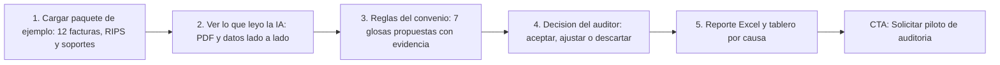
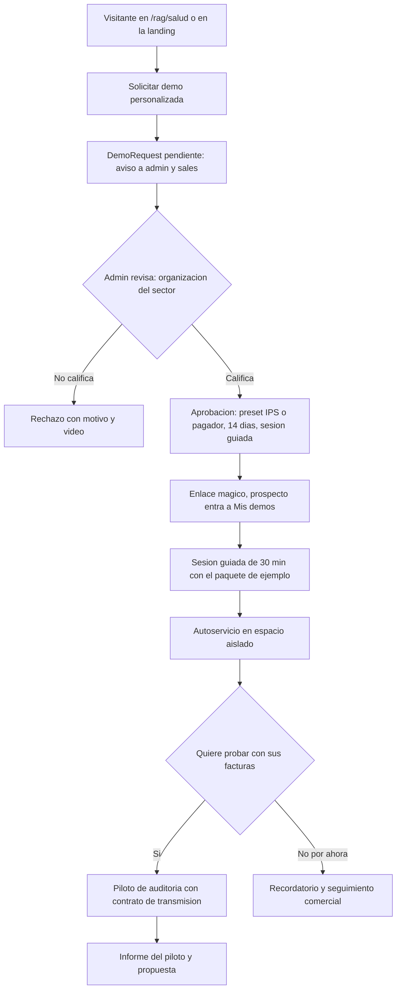
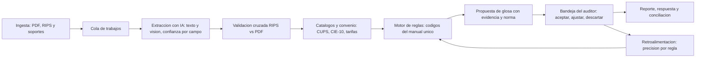

# Auditoría de Cuentas Médicas con IA

> Salud (`healthcare`) · Demo: `/demo/cuentas-medicas` · Modo de acceso recomendado: `privado` (solo por invitación del admin, primera sesión guiada obligatoria) · Prioridad: **P1** · Esfuerzo total: **XL** (≈ 16 semanas de 1 dev senior + un auditor médico por horas para dejar una demo privada vendible y el Piloto de auditoría; el producto completo de cada cliente se estima aparte)

*Captura actual de `/demo/cuentas-medicas` en producción: el tablero abre con el aviso "No se pudieron cargar las estadísticas. Verifique que el servidor esté corriendo." y sin datos. Ver también [Sistema de demos](04-Sistema-de-Demos.md), [Flujo del cliente](03-Flujo-del-Cliente.md), [Catálogo de productos](08-Catalogo-de-Productos.md), [Seguridad y calidad](10-Seguridad-y-Calidad.md) y [Roadmap](12-Roadmap.md). Relacionados: [Motor de reglas del auditor (sistema experto)](Demo-sistema-experto.md), que se integra en este producto; [Chatbot RAG](Producto-chatbot-rag-ia.md) y la landing `/rag/salud`; [Facturación electrónica](Producto-facturacion-electronica.md) (factura en salud y RIPS); [Telemedicina](Producto-telemedicina.md).*

---

## Resumen

**Problema:** en Colombia, cada factura de una IPS a una EPS (o a una aseguradora SOAT, ARL o prepagada) pasa por una auditoría de cuentas que puede terminar en **devolución** o **glosa**. Las IPS pierden flujo de caja por glosas evitables (tarifa distinta a la del convenio, autorización vencida, soporte faltante, códigos mal asignados) y los pagadores y firmas auditoras revisan **muestras** a mano porque no alcanzan a revisar todo. La información llega en PDF (factura, epicrisis, autorizaciones), en RIPS y en contratos con tarifas distintas por pagador ("SOAT −15 %", "ISS 2001 +30 %", paquetes).

**Para quién (cliente ideal en Colombia):**
- **Firmas de auditoría de cuentas médicas** que auditan por encargo de pagadores: compran productividad por auditor y deciden rápido. Primer objetivo comercial.
- **IPS de mediana y alta complejidad** (clínicas, hospitales privados, ESE grandes): **pre-auditoría antes de radicar** para reducir glosas y devoluciones. Compra el área financiera o de cuentas médicas.
- **Pagadores** (EPS, aseguradoras SOAT, ARL, medicina prepagada, regímenes especiales): auditoría del 100 % de lo radicado. Ciclo de compra largo; plan Empresarial.

**Propuesta de valor:** "Revisa el 100 % de las cuentas, no una muestra. La IA lee la factura, los RIPS y los soportes; el motor aplica las reglas de tu convenio y propone cada glosa con su evidencia y su norma; **el auditor decide**. Entrega en Excel con tu plantilla y tablero de valor glosado por causa."

**Qué es según su código (para el reposicionamiento RAG):** no es un RAG. Es un **sistema experto híbrido**: extracción con IA (texto y visión) + motor de reglas + catálogos (CUPS, CIE-10, tarifarios) + una decisión asistida por un modelo de lenguaje. La "Base de conocimiento" de la pantalla Administración es texto fijo dentro del bundle y no alimenta respuestas con cita. El puente con el producto principal es un módulo nuevo **"Consulta normativa y contractual con citas"** (RAG sobre contratos, manuales tarifarios y normas, con el núcleo del [Chatbot RAG](Producto-chatbot-rag-ia.md)). En `/rag/salud` se presenta como **"IA + reglas para cuentas médicas"**, con el botón "Solicitar demo personalizada".

---

## Decisión: entra al catálogo como producto vertical de salud

**Veredicto: sí entra al catálogo**, como producto 28 en la categoría Salud, con estas condiciones:

1. Modo `privado` (DECISIÓN 1): nunca abierto, solo por invitación del admin.
2. Venta consultiva con un **Piloto de auditoría** de precio cerrado, igual que el Piloto RAG.
3. No se publica la landing hasta cerrar las tareas de la Fase 0 de este documento (endurecimiento y datos sintéticos).
4. Planes propios por volumen de facturas, no la fórmula genérica de 4 planes de `services-catalog.ts`.

| A favor | En contra | Cómo se mitiga |
|---|---|---|
| Es el mayor activo técnico de Koptup: ≈ 62 % del backend (sin contar `modules/`) | El código está fragmentado y atado a un pagador concreto | Tareas 7 y 8: consolidar el flujo y volver configurables los convenios |
| Dolor caro y medible (glosas, devoluciones, horas de auditor) y compra recurrente por volumen | Datos sensibles de salud: riesgo legal y de reputación | Demo solo con datos sintéticos; piloto con contrato de transmisión y espacio aislado |
| Es la única experiencia real de Koptup en el sector salud y alimenta `/rag/salud` | Requiere conocimiento del dominio (auditoría médica, manual de glosas) | Auditor médico asesor por horas (tarea 6) |
| Comparte núcleo con el RAG (ingesta de PDF, IA, citas) | Distrae del foco RAG | Se vende como vertical del RAG y reutiliza su núcleo, no como línea aparte |

**Alternativas descartadas:** (a) dejarlo como herramienta interna o caso de estudio: desperdicia la mayor inversión técnica y la única credencial en salud; (b) abrirlo como SaaS de autoservicio: no hay base multi-tenant ni el marco legal para recibir historias clínicas de cualquier visitante (DECISIÓN 7).

**Nombre comercial:** "Auditoría de Cuentas Médicas con IA" (corto: "Auditoría Médica IA"). Slug propuesto del offering: `auditoria-cuentas-medicas`; el `demoSlug` sigue siendo `cuentas-medicas`. En `DemoCatalogItem`, `offeringSlug` pasa de nulo a `auditoria-cuentas-medicas`. Landing: `/productos/auditoria-cuentas-medicas`, enlazada desde `/rag/salud`.

---

## Estado actual

| Aspecto | Estado | Evidencia |
|---|---|---|
| Demo | **Real**: llama al backend y usa IA real. En producción falla al abrir (captura) | `apps/web/src/app/demo/cuentas-medicas/page.tsx`, `api.ts` |
| Pantallas | 6 vistas en un solo componente: **Tablero** (4 KPIs, estado de facturas, glosas por tipo, "Características"), **Nueva cuenta** (modal: nombre + carga de Excel/RIPS/PDF), **Proceso** (auditoría explicada en 7 pasos), **Facturas** (listado con filtros), **Detalle** (atenciones, procedimientos, glosas; "Ver proceso paso a paso", "Ejecutar rápido", Excel), **Administración** ("Base de conocimiento": CUPS, CIE-10, tarifarios con interruptores) | `page.tsx` (vistas `dashboard`, `facturas`, `detalle`, `proceso`, `admin`), `ProcesoAuditoriaVisual.tsx` |
| IA usada | Extracción de PDF con `pdf-parse` + modelo pequeño de OpenAI; extracción "dual" (expresiones regulares + visión); "auditor IA final" con un modelo grande de OpenAI que propone la decisión; servicio de aprendizaje con puntajes de retroalimentación; reglas en lenguaje natural con un modelo de Anthropic de 2024; embeddings para buscar CUPS | `services/extraccion-especializada.service.ts`, `extraccion-dual.service.ts`, `auditor-ia-final.service.ts`, `sistema-aprendizaje.service.ts`, `reglas-ia.service.ts`, `embeddings.service.ts` |
| Backend | 24 modelos Mongoose (Factura, Atencion, Procedimiento, Glosa, CuentaMedica, Radicado, Tarifario, ConvenioTarifa, CUPS, Diagnostico, Medicamento, EPSMaestro, IPSMaestro, ReglaAuditoria, ReglaFacturacion…), 10 controladores, 6 archivos de rutas y 23 servicios | `apps/backend/src/{models,controllers,routes,services}` |
| Flujos de procesamiento | **Al menos seis caminos distintos** para lo mismo (auditoría de facturas, PDF de facturas, modular A–G, cuentas + Ley 100, híbrido, liquidación de radicados) y **4 generadores de Excel** distintos. La demo usa dos | `auditoria.routes.ts`, `cuentas.routes.ts`, `liquidacion.routes.ts`, `excel*.service.ts` |
| Datos | Catálogos de ejemplo escritos en el frontend ("12.457 CUPS", "14.891 CIE-10", "Tarifario SOAT 2024", precios de medicamentos "por EPS"); semillas con 16 CUPS y 9 reglas; nombres y NIT de EPS reales en las semillas; la comparación de tarifas usa una tabla fija de 14 códigos rotulada con el nombre de una EPS real | `contenido-cups-completo.ts`, `contenido-cie10-completo.ts`, `db/seeds/*.seed.ts`, `services/glosa-calculator.service.ts` |
| Procesamiento | Síncrono dentro de la petición HTTP (el servidor amplía los tiempos de espera a 15 min); archivos en el disco local del servidor, que es efímero | `apps/backend/src/index.ts`, `middleware/upload.ts` |
| Páginas huérfanas | `/liquidacion` y `/liquidacion/reglas` (1.236 líneas) no están enlazadas desde ningún menú | `apps/web/src/app/liquidacion/` |
| i18n ES/EN | No. `messages/demos/cuentas-medicas.{es,en}.json` tiene 6 claves que la página no usa; todo el texto está fijo en español | `page.tsx` |
| Tests | Ninguno (ni en la web ni en el backend) | — |
| Tamaño | Frontend 6.174 líneas (página 2.640 + proceso 988 + catálogos 1.437 + código muerto 760 + API 162 + tipos 164 + layout 23). Backend ≈ 21.000 líneas del módulo + 1.800 del sistema experto + 4.300 de semillas y *scrapers* | `wc -l` |
| SEO | Indexable y en el sitemap (`AUX_DEMO_SLUGS`); la metadata promete "Reduce rechazos hasta 80 %" y "Demo gratuito" y nombra EPS reales | `apps/web/src/app/sitemap.ts`, `apps/web/src/lib/seo-config.ts` (`demo-cuentas-medicas`) |
| Acceso | Modal de "código de acceso" fijo en el hub `/demo`, validado en el navegador; no restringe nada (ver [Sistema de demos](04-Sistema-de-Demos.md), sección 10.5) | `apps/web/src/app/demo/page.tsx` |
| Catálogo | No es un offering; `offeringSlug` nulo | `services-catalog.ts` |

**Lo que hace bien:** el flujo central existe de punta a punta: se sube un lote (PDF y Excel/RIPS), la IA extrae factura, paciente, diagnósticos y procedimientos, el sistema compara contra tarifas, autorizaciones y duplicidades, crea glosas y descarga un Excel de varias hojas. La vista **"Proceso paso a paso"** explica cada paso con el dato extraído, el archivo y la ubicación de origen (hoja, columna, fila), algo que un auditor valora mucho porque muestra **por qué** se glosa. Ya hay modelos de datos del dominio colombiano (radicados, convenios, cuotas moderadoras, autorizaciones), un servicio de aprendizaje con retroalimentación humana y conectores configurables a sistemas externos (gestor documental, consulta de autorizaciones).

### Problemas detectados (con ruta)

1. **Falla en producción:** el tablero muestra el error de estadísticas y el sistema experto muestra ceros: los catálogos no están cargados en el entorno o el servicio no responde. Hoy no se puede mostrar a nadie (ver [Landings SEO](Seccion-Landings-SEO.md)).
2. **Atado a un pagador real:** 83 referencias a una EPS real en 12 archivos del backend (tarifario de 14 códigos en `glosa-calculator.service.ts`, paso "Validación de medicamentos SISMED - <EPS>" en `ProcesoAuditoriaVisual.tsx`, Excel `Auditoria_<EPS>_….xlsx` en `api.ts`). Sugiere una relación comercial que no existe y no sirve para otro cliente.
3. **Cifras y fuentes que no se pueden respaldar:** "Base SISPRO actualizada con 12.457 códigos" cuando el contenido son unas 435 líneas; "Tarifario SOAT 2024" y "Manual ISS 2001" con valores en pesos inventados; precios de medicamentos "negociados" por EPS reales (`page.tsx`); "Reduce rechazos hasta 80 %" en la metadata. Algunos códigos de ejemplo no corresponden a la CUPS vigente.
4. **La IA "decide":** `auditor-ia-final.service.ts` se documenta como la "decisión final" sobre la glosa y el "monto exacto a pagar". En auditoría de cuentas la decisión y la firma son del auditor; la IA debe **proponer con evidencia**.
5. **Códigos de glosa propios:** las reglas usan una numeración interna (101, 201, 301, 401) que no sigue el Manual Único de Devoluciones, Glosas y Respuestas vigente. Un auditor lo nota en el primer minuto.
6. **Flujo fragmentado:** seis caminos de procesamiento, cuatro formatos de Excel y tres sistemas de reglas (ver [Motor de reglas](Demo-sistema-experto.md)). Mantener y explicar esto es inviable.
7. **Mezcla de simulado y real sin aviso:** "Ver proceso" desde el tablero muestra una simulación con "FAC-2024-001" y $100 M, al lado de facturas reales; al crear una cuenta con "ver proceso" se espera 13 s fijos (`setTimeout` en `page.tsx`).
8. **Nombres inconsistentes:** "Nueva factura" abre "Nueva cuenta de auditoría"; en otras partes se habla de radicado o cuenta médica.
9. **Administración engañosa:** los interruptores de "documentos de conocimiento" guardan una configuración, pero el contenido que dicen usar es texto fijo del frontend.
10. **Ingeniería:** página de 2.640 líneas en un solo componente cliente; `mockData.ts` y `types.ts` (760 líneas) sin uso; modelos de IA fijados en el código (uno ya retirado por su proveedor) y dos modelos de embeddings distintos para los mismos CUPS; procesamiento síncrono de hasta 15 min; archivos en disco efímero.
11. **Seguridad y privacidad:** antes de recibir cualquier documento de un prospecto, el módulo necesita la auditoría general de autenticación y autorización en servidor, el aislamiento de datos por cliente, los límites de costo de IA y la revisión del manejo de datos personales en registros (logs) descritos en [Seguridad y calidad](10-Seguridad-y-Calidad.md).
12. **Detalles de presentación:** emojis en títulos ("🏥", "🤖", "✨"), "Características del sistema" genérico en el tablero, botones sin estados de carga, "Volver a Demos" a un hub donde la demo no aparece.

---

## Qué falta para que sea vendible

- **Que funcione y sea segura:** Fase 0 completa para este módulo (ver tareas 1 y 2) y la demo estable en producción.
- **Datos 100 % sintéticos y verosímiles**, revisados por un auditor médico: IPS y EPS ficticias, facturas en PDF con marca de agua, RIPS, soportes y convenios de ejemplo, con un error sembrado por cada regla.
- **Un solo flujo explicable:** carga → extracción → validación → reglas → propuesta de glosa con evidencia → decisión del auditor → reporte.
- **Lenguaje del sector:** códigos del manual único de glosas, causales, plazos de respuesta, convenios por pagador.
- **Las tres vistas de quien compra:** IPS (pre-radicación y respuesta a glosas), auditor (bandeja de revisión) y gerencia (valor glosado por causa).
- **Honestidad comercial:** sin cifras de resultado prometidas; las métricas salen del Piloto con datos del cliente.
- **Oferta de entrada de bajo riesgo:** el Piloto de auditoría con informe comparativo frente al auditor humano.
- **Paquete legal:** contrato de transmisión de datos, acuerdo de confidencialidad y política de retención listos antes del primer piloto.

---

## Plan detallado

### Landing `/productos/auditoria-cuentas-medicas`

Estructura común de [Landing de producto](Seccion-Landing-de-Producto.md), enlazada desde la tarjeta "Auditoría de cuentas médicas" de `/rag/salud`:

1. **Hero:** "Audita el 100 % de tus cuentas médicas, con evidencia en cada glosa". Subtítulo: "La IA lee facturas, RIPS y soportes; el motor aplica las reglas de tu convenio; tu auditor decide. Para IPS, firmas auditoras y pagadores en Colombia." CTA principal **"Solicitar demo personalizada"** (modo `privado`), secundario "Agendar llamada".
2. **Dos caminos** (pestañas): "Soy IPS: reduce glosas antes de radicar" y "Audito cuentas: revisa todo, no una muestra".
3. **Cómo funciona** (5 pasos ilustrados con capturas de la demo nueva): carga del lote → lectura con IA → reglas del convenio → propuesta de glosa con evidencia → decisión y reporte.
4. **Qué revisa** (tabla): tarifa frente al convenio, autorización y vigencia, cantidades autorizadas, duplicidades, códigos CUPS y CIE-10 válidos, coherencia diagnóstico–procedimiento (como alerta para el auditor), soportes faltantes, plazos de radicación.
5. **La IA propone, el auditor decide** (bloque destacado): explicabilidad, trazabilidad y retroalimentación.
6. **Datos y seguridad** (bloque sobrio, sin sellos): datos sensibles bajo la Ley 1581, rol de Koptup como encargado, espacio aislado por cliente, cifrado, registro de accesos, retención y borrado, proveedor de IA y dónde se procesan los datos.
7. **Capturas** (6) y **video de 90 s** del recorrido guiado.
8. **Planes:** Piloto, Esencial, Profesional, Empresarial (tabla de esta página).
9. **Preguntas frecuentes:** ¿Reemplaza al auditor? · ¿Qué formatos recibe (PDF, RIPS JSON, Excel)? · ¿Funciona con mis convenios y tarifas? · ¿Usa el manual único de glosas? · ¿Dónde quedan los datos y cuánto tiempo? · ¿Puedo probar con mis facturas? (sí, en el Piloto con contrato) · ¿Se integra con mi gestor documental o plataforma de radicación? · ¿Cuánto cuesta por factura?
10. **CTA final** con el formulario de solicitud (campos extra abajo) y aviso visible: "No adjuntes facturas ni datos de pacientes en este formulario".

`noindex` no aplica a la landing (sí se indexa); la demo sí lleva `noindex` y sale del sitemap.

### Demo interactiva (mejoras por pantalla)

| Pantalla actual | Agregar | Quitar / corregir | Datos de ejemplo |
|---|---|---|---|
| Entrada (nueva) | Selector de vista **IPS · Auditor · Gerencia**; banner fijo "Datos ficticios. No cargues datos reales de pacientes"; botón "Iniciar recorrido"; barra de acceso de `DemoAccessShell` | "Volver a Demos" | "Clínica Demo Los Andes" → "EPS Andina Demo" |
| Tablero | KPIs del espacio del prospecto: facturas, valor radicado, valor glosado propuesto, aceptado por el auditor, tiempo promedio por factura; valor glosado por causa (código del manual único); estado vacío con "Cargar paquete de ejemplo" | Bloque "Características del sistema" (va a la landing); toast de error técnico | Lote de 12 facturas |
| Nueva cuenta (modal) | Renombrar a **"Cargar lote de radicación"**; opción por defecto "Usar paquete de ejemplo"; opción "Subir mis archivos de prueba" con declaración obligatoria de que no contienen datos reales y límites visibles (tamaño, número de archivos); procesamiento en segundo plano con progreso | "Nueva factura"; espera fija de 13 s | Paquete descargable para editar y volver a subir (cambiar un valor y ver aparecer la glosa) |
| Proceso paso a paso (`ProcesoAuditoriaVisual.tsx`) | Siempre con datos reales de la sesión; cada paso muestra campo, archivo, página y regla; etiqueta "Simulación" si alguna vez se usa el modo estático | Paso con nombre de una EPS real; totales de $100 M fijos | 7 pasos → "Medicamentos: precio regulado y convenio" |
| Facturas (listado) | Filtros por estado, pagador, causa de glosa y auditor; acciones por lote; columna "valor en riesgo" | Botón eliminar fuera del espacio del prospecto | — |
| Detalle de factura | **PDF y datos lado a lado** con los campos extraídos resaltados; confianza por campo; cruce RIPS vs PDF; glosas propuestas con regla, código oficial, evidencia, cláusula del convenio y norma; botones **Aceptar / Ajustar / Descartar** + nota; doble revisión para valores altos; vista IPS: "Responder glosa" con plazos | "Ejecutar rápido" vs "Ver proceso" duplicados (un solo botón "Auditar") | Factura con tarifa mayor a la del convenio y autorización vencida |
| Administración → **Catálogos y convenios** | Versiones y conteos reales de CUPS, CIE-10 y medicamentos desde la base; 2 convenios ficticios editables ("SOAT −15 %", "ISS 2001 +25 %", paquete de parto); enlace al [Motor de reglas](Demo-sistema-experto.md) | Contenido fijo "12.457 / 14.891"; tarifas en pesos presentadas como oficiales | Convenios de "EPS Andina Demo" y "Aseguradora Demo SOAT" |
| Motor de reglas (nueva pestaña) | La actual `/demo/sistema-experto` integrada como pestaña (ver [Motor de reglas](Demo-sistema-experto.md)) | — | 12 reglas estándar |
| Consulta normativa (nueva) | Pregunta en lenguaje natural sobre normas y el convenio de ejemplo, con respuesta citada (núcleo RAG) | — | "¿Cuál es el plazo para responder una glosa?" → cita de la norma y del contrato de ejemplo |
| Reporte | Un solo Excel con la plantilla elegida + PDF "Informe de auditoría del lote" | 4 formatos distintos; nombre del archivo con la EPS real | — |
| Global | Partir `page.tsx` en componentes por vista; textos en `messages/demos/cuentas-medicas.{es,en}.json`; badges "Incluido desde plan X"; CTA final "Solicitar piloto de auditoría" | Emojis en títulos; `mockData.ts` y `types.ts` | — |

**Recorrido guiado (5 pasos, menos de 6 minutos):**

1. **Carga:** el prospecto elige "Usar paquete de ejemplo" (lote de "Clínica Demo Los Andes" a "EPS Andina Demo").
2. **Extracción:** abre una factura y ve los campos resaltados en el PDF, la confianza y el cruce con los RIPS.
3. **Reglas:** el motor marca 7 hallazgos (tarifa, autorización vencida, cantidad excedida, duplicidad, CUPS inexistente, soporte faltante, coherencia diagnóstico–procedimiento como alerta), cada uno con su código oficial y la cláusula del convenio.
4. **Decisión:** acepta 5, ajusta 1 y descarta 1 con nota; el tablero se actualiza.
5. **Reporte:** descarga el Excel con la plantilla y ve el valor glosado por causa. Cierre: "Esto con tus facturas, en 4 semanas: Piloto de auditoría".

### Acceso y solicitud de demo

- **Modo `privado`** (DECISIÓN 1 y [Sistema de demos](04-Sistema-de-Demos.md)): no aparece como abierta en `/demo`; la tarjeta dice "Con invitación" y el botón "Solicitar demo personalizada". Solo el rol `admin` aprueba o invita; `sales` prepara la solicitud y agenda la sesión.
- **Se elimina el modal del código de acceso fijo** ("código 2020") del hub `/demo` en la misma entrega que activa el control nuevo (sección 10.5 de [Sistema de demos](04-Sistema-de-Demos.md)). Quienes hoy usan el código reciben una **invitación directa** personal.
- **Puertas de entrada:** tarjeta de `/rag/salud`, landing del producto, invitación directa después de una llamada. Quien abre la demo sin acceso cae en `/demo/acceso?demo=cuentas-medicas&motivo=privado`:

- **Campos extra del formulario:** tipo de organización (IPS, firma auditora, EPS o pagador, aseguradora SOAT/ARL/prepagada, otro), facturas por mes, número de auditores o facturadores, número de convenios activos, herramienta actual (Excel, software, ninguno), dolor principal (glosas recibidas, devoluciones, productividad), interés en piloto (sí/no).
- **Calificación:** organización del sector con NIT; a estudiantes, competidores o perfiles sin relación se les rechaza con motivo y se les envía el video.
- **Duración:** 14 días (valor por defecto), extensible 14 días desde el admin. **Primera sesión guiada obligatoria** (`selfServiceAllowed = false`); después de la sesión el admin habilita el autoservicio. Hasta 3 usuarios por acceso ("Invitar a mi coordinador de cuentas").
- **Espacio aislado por acceso:** cada `DemoGrant` trabaja sobre su propio espacio de datos (identificador de espacio = `grantId`), precargado con el paquete sintético, con botón "Reiniciar datos". Al expirar o revocar el acceso, todo lo cargado se borra en máximo 7 días.
- **Cupos** (`quotas.aiActionsPerDay`): 40 facturas procesadas por día por acceso, archivos de hasta 10 MB y 20 archivos por lote. Las APIs del módulo exigen el acceso en servidor (`requireDemoGrant('cuentas-medicas')`, sección 10.4 de [Sistema de demos](04-Sistema-de-Demos.md)).
- **Qué ve el prospecto aprobado** en **Mis demos** (`/dashboard/demos`, ver [Portal del cliente](06-Portal-del-Cliente.md)): tarjeta "Auditoría de cuentas médicas — preparada para <organización>", días restantes, sesión guiada agendada, botones "Abrir como IPS" y "Abrir como auditor", descarga del paquete de ejemplo y CTA "Solicitar piloto de auditoría" / "Agendar llamada".
- **Eventos `DemoEvent`:** vista elegida, lote cargado, factura abierta, glosa aceptada/ajustada/descartada, Excel descargado, consulta normativa, pasos del recorrido completados, invitados, clic en CTA.

### Datos de ejemplo anonimizados (para la demo)

La demo **nunca** usa datos reales, ni siquiera "anonimizados a mano". Se construye un **paquete sintético** versionado en el repositorio (`apps/backend/src/db/seeds/demo-cuentas-medicas/`), revisado por el auditor médico asesor:

| Elemento | Cómo se genera | Regla |
|---|---|---|
| Pacientes | Nombres combinados al azar de listas de nombres y apellidos frecuentes; documento con prefijo "DEMO" y número fuera de rangos usados; edades y sexo coherentes con el diagnóstico | Ninguno corresponde a una persona real; sin direcciones ni teléfonos |
| Prestadores y pagadores | "Clínica Demo Los Andes", "Hospital Demo San Rafael", "EPS Andina Demo", "Aseguradora Demo SOAT"; NIT con formato válido, verificado contra el RUES y el REPS para que no exista | Ninguna marca real del sector |
| Códigos clínicos | CUPS, CIE-10 y medicamentos tomados de las tablas oficiales vigentes (son catálogos públicos, no datos personales) | Fecha de versión visible en la pantalla Catálogos |
| Facturas y soportes | PDF generados desde plantillas con marca de agua "EJEMPLO — DATOS FICTICIOS — SIN VALOR"; epicrisis cortas sintéticas; autorizaciones ficticias | 12 facturas, de 1 a 6 páginas, con fechas relativas a hoy |
| RIPS | Archivos con la estructura vigente (JSON) y datos sintéticos coherentes con los PDF | Un caso con discrepancia RIPS vs PDF |
| Convenios y tarifas | 2 convenios ficticios con reglas típicas (sobre manual tarifario ± %, paquetes, servicios que requieren autorización) | Rotulados "convenio de ejemplo" |
| Errores sembrados | Al menos un caso por regla y una factura limpia, para mostrar que no todo se glosa | Lista de respuestas esperadas: sirve también como set de evaluación (tarea 15) |

Si el prospecto quiere probar con **sus** facturas, eso es el **Piloto de auditoría**, con contrato y en un espacio aislado propio, no la demo.

### Cumplimiento: Ley 1581 y datos de salud (resumen no jurídico)

Lista orientativa para el dueño y el equipo; **validar vigencia y alcance con un abogado de protección de datos y un asesor del sector salud antes de la primera propuesta**.

| Norma | Qué exige, a alto nivel | Qué implica para la demo y el producto |
|---|---|---|
| Ley 1581 de 2012 (arts. 5 y 6) | Los datos de salud son **datos sensibles**: su tratamiento está prohibido salvo autorización explícita del titular o una excepción legal, con medidas de seguridad reforzadas | La demo no trata datos de pacientes. En el producto, el **responsable** es la IPS o el pagador; Koptup actúa como **encargado** |
| Decreto 1377 de 2013 (compilado en el Decreto 1074 de 2015) | Política de tratamiento, aviso de privacidad y **contrato de transmisión** cuando un encargado trata datos por cuenta del responsable | Contrato de transmisión con cada cliente y con los subencargados (nube, proveedor de IA) |
| Ley 1581, art. 26, y orientaciones de la SIC sobre IA y datos personales (Circular Externa 002 de 2024) | Condiciones para enviar datos fuera del país; evaluación de riesgos al usar sistemas de IA | Minimizar lo que se envía al modelo (seudonimizar nombre y documento antes de la extracción cuando sea posible), proveedor con compromiso de no entrenar con los datos y retención mínima, opción de nube o región elegida por el cliente (Empresarial) |
| Resolución 1995 de 1999 (historia clínica) y Resolución 839 de 2017 (conservación) | La historia clínica es un documento privado y sometido a reserva; solo acceden el paciente, el equipo de salud, las autoridades y los casos previstos en la ley; la custodia y conservación son del prestador | Los soportes clínicos de una cuenta son parte de la historia clínica: acceso solo para auditores autorizados por contrato, registro de cada acceso, **Koptup no es custodio**: borra al terminar según el contrato y entrega acta |
| Ley 23 de 1981 y Ley 2015 de 2020 | Secreto profesional; historia clínica electrónica interoperable | Confidencialidad firmada por todo el equipo con acceso; formatos de intercambio estándar |
| Normas de cuentas y glosas: Ley 1438 de 2011 (art. 57), Decreto 441 de 2022 (acuerdos de voluntades), Resolución 2284 de 2023 (Manual Único de Devoluciones, Glosas y Respuestas), Resolución 2275 de 2023 (RIPS como soporte de la factura electrónica en salud) | Plazos y trámite de glosas, contenido de los acuerdos, codificación oficial de glosas y estructura de los RIPS | Reglas y códigos del motor mapeados al manual vigente; validación de estructura RIPS; plazos en la vista IPS |

**Controles mínimos del producto:** cifrado en tránsito y en reposo, espacio aislado por cliente, roles (facturador, auditor, coordinador, administrador), registro de accesos y cambios, política de retención y borrado por contrato, sin datos personales en registros técnicos, copias de seguridad, gestión de incidentes y evaluación de impacto antes del primer piloto. Ver [Comercial, marketing y legal](11-Comercial-Marketing-y-Legal.md).

### Personalización por cliente

Desde **Admin › Solicitudes de demo › Aprobar** (o Admin › Demos › Personalizar), guardado en el `DemoGrant` (ver [Panel de administración](05-Panel-de-Administracion.md)):

| Campo | Efecto en la demo |
|---|---|
| Logo y nombre de la organización | Cabecera, reporte PDF y Excel |
| Rol del prospecto (IPS o pagador/firma auditora) | Vista inicial y textos ("Responder glosa" vs "Bandeja de auditoría") |
| Preset de servicios | Ambulatorio, hospitalario, urgencias o SOAT: cambia el paquete sintético |
| Convenios ficticios (hasta 3) | Tarifa base (manual ± %), paquetes, servicios con autorización |
| Reglas activas y tolerancias | Se reflejan en el [Motor de reglas](Demo-sistema-experto.md) |
| Plantilla de Excel del cliente | Columnas y orden del reporte (el cliente puede enviar una plantilla vacía, sin datos) |
| Plan cotizado | Muestra solo las funciones del plan; el resto con "Disponible en plan X" |
| Idioma | Español o inglés |

**Implementación:** el paquete sintético se siembra por espacio al crear el grant; la página lee la personalización desde `GET /api/demo-access/cuentas-medicas` (DECISIÓN 3).

### Producto real

**Flujo objetivo (uno solo, reemplaza los seis actuales):**

**Alcance MVP — modalidad compra (plan Profesional, 10–14 semanas reales):**
- **Ingesta** de PDF, RIPS (estructura vigente) y Excel; clasificación automática de documentos; procesamiento en cola (no dentro de la petición) con reintentos; almacenamiento de objetos cifrado, nunca en el disco del servidor.
- **Extracción con IA** con confianza por campo, verificación cruzada RIPS vs PDF y revisión humana de campos de baja confianza.
- **Catálogos versionados:** CUPS, CIE-10 y medicamentos vigentes con su fecha; manuales tarifarios y su actualización anual; importación de las tablas oficiales en lugar de *scrapers*.
- **Convenios** (`ConvenioTarifa`): tarifa por CUPS o por manual ± %, paquetes, exclusiones, servicios con autorización, vigencias.
- **Motor de reglas único** con códigos del manual vigente y reglas propias (ver [Motor de reglas](Demo-sistema-experto.md)).
- **Bandeja de auditoría:** la IA propone, el auditor decide; doble revisión por monto; notas; trazabilidad completa.
- **Vista IPS:** pre-auditoría antes de radicar, respuesta a glosas con plazos, conciliación.
- **Reportes:** Excel con la plantilla del cliente, PDF del informe, tablero por causa, pagador, prestador y auditor.
- **Consulta normativa y contractual con citas** (núcleo RAG) sobre contratos, manuales y normas cargados por el cliente.
- **Integraciones típicas:** gestor documental (p. ej., OnBase, ya hay un conector base en `services/endpoint-externo.service.ts`), plataformas de radicación, validador de factura electrónica y RIPS, consulta de autorizaciones del pagador, SSO.
- **Base técnica:** consolidar en un módulo `apps/backend/src/modules/cuentas-medicas/` (servicio de dominio + rutas + pruebas), retirar los caminos duplicados, configurar los modelos de IA por variable de entorno y un solo modelo de embeddings.

**Modalidad de cobro (DECISIÓN 7):** mientras no exista la base multi-tenant con cobro recurrente, se ofrece **implementación + operación gestionada en una instancia dedicada por cliente** (una instalación aislada por cliente, mensualidad facturada aparte). Es la opción más segura para datos de salud. **SaaS multi-tenant: lista de espera** hasta la Fase 4; para habilitarlo: aislamiento estricto por cliente verificado con pruebas, contrato de transmisión estándar, SLA, medición de facturas contra el plan y cobro recurrente (Wompi/PayU en COP, Stripe en USD).

### Planes y precios

No existen planes en el catálogo. **Propuesta** (COP más IVA si aplica; USD con la TRM de referencia 3.300 de la rama `rag-reposicionamiento`; a validar con el dueño y con 3 conversaciones de descubrimiento):

| Plan | Implementación | Mensualidad (operación gestionada) | Volumen incluido | Alcance | Tiempo |
|---|---|---|---|---|---|
| **Piloto de auditoría** | COP 6.900.000 · USD 2.090 | — | Hasta 300 facturas del cliente | 1 convenio, reglas estándar, espacio aislado que se destruye al final, **informe comparativo IA vs auditor humano** (hallazgos por causa, valor en riesgo, tiempo por factura). Se descuenta 100 % si contratan en 60 días | 4 semanas |
| **Esencial** — pre-auditoría para IPS | COP 14.900.000 · USD 4.490 | COP 2.490.000 · USD 750 | Hasta 1.500 facturas/mes | 1 sede, hasta 3 convenios, 12 reglas estándar, Excel + tablero, hasta 5 usuarios, soporte lunes a viernes, actualización anual de catálogos | 4–6 semanas |
| **Profesional** — firmas auditoras e IPS grandes | COP 34.900.000 · USD 10.490 | COP 4.990.000 · USD 1.490 | Hasta 8.000 facturas/mes | Convenios ilimitados, reglas propias en lenguaje natural, bandeja de auditoría con doble revisión, respuesta a glosas y conciliación, consulta normativa con citas, roles, panel de precisión, hasta 20 usuarios, revisión mensual de calidad | 8–10 semanas |
| **Empresarial** — pagadores y redes | Desde COP 89.900.000 · USD 26.900 | Según volumen y SLA | A medida | Nube del cliente u on-premise, integraciones (gestor documental, radicación, autorizaciones), SSO, auditoría avanzada, código fuente opcional | 12–16 semanas |

Factura adicional sobre el tope: COP 500 · USD 0,15. La mensualidad incluye la instancia dedicada, la IA hasta el tope, actualizaciones normativas y de catálogos, soporte y copias de seguridad.

**Recomendaciones de claridad:**
1. Hablar en **costo por factura auditada** (Esencial lleno ≈ COP 1.660 por factura; Profesional lleno ≈ COP 620), que es como compara un jefe de cuentas médicas.
2. No prometer porcentajes de reducción de glosas: el número sale del informe del Piloto.
3. Ley 1581 y seguridad **en todos los planes**, no como diferencial de un plan.
4. Publicar en la landing qué incluye la mensualidad y qué no (hosting dedicado, IA, soporte; no incluye costos de integraciones de terceros).
5. Política comercial común en [Catálogo de productos](08-Catalogo-de-Productos.md) y [Comercial, marketing y legal](11-Comercial-Marketing-y-Legal.md).

---

## Tareas

| # | Tarea | Fase | Prioridad | Esfuerzo | Criterio de aceptación |
|---|---|---|---|---|---|
| 1 | Endurecer el módulo: auditar y exigir autenticación y autorización en servidor en todas las rutas del módulo (auditoría, cuentas, CUPS, liquidación, reglas, documentos de conocimiento, sistema experto), aislamiento de datos por cliente o acceso, límites de tamaño y tipo de archivo, rate-limit y tope de costo de IA, sin datos personales en registros técnicos, rutas de prueba protegidas en producción | Fase 0 — Endurecimiento | P0 | M | Revisión de rutas firmada; pruebas de integración que confirman 401/403 sin acceso y que un espacio no ve datos de otro |
| 2 | Documentos fuera del disco efímero: almacenamiento de objetos cifrado, borrado programado por vencimiento del acceso o del contrato y registro de accesos | Fase 0 — Endurecimiento | P0 | M | Reiniciar el servidor no pierde documentos; un documento vencido no se puede descargar y queda registro del borrado |
| 3 | Registrar `DemoCatalogItem` `cuentas-medicas` en modo `privado` (14 días, guiado obligatorio, 3 usuarios, cupos), `requireDemoGrant` en las APIs del módulo, `noindex`, fuera del sitemap y retiro del modal de código fijo con invitación directa a los usuarios actuales | Fase 1 — Funnel y solicitud de demos | P0 | S | Sin acceso, `/demo/cuentas-medicas` lleva a `/demo/acceso?motivo=privado`; con invitación abre la demo; el modal de código ya no existe en `/demo` |
| 4 | Demo estable en producción: verificación de salud del servicio, catálogos oficiales cargados con fecha de versión, estados vacíos amables en lugar de errores técnicos, prueba de humo en CI | Fase 1 — Funnel y solicitud de demos | P1 | S | Abrir la demo con un acceso válido no muestra errores; el tablero muestra los datos del paquete de ejemplo |
| 5 | Retirar afirmaciones no respaldadas y marcas reales: "Reduce rechazos hasta 80 %", "Demo gratuito", "Base SISPRO 12.457", "Tarifario SOAT 2024", precios por EPS reales, nombres de EPS en metadata, pasos y archivos | Fase 1 — Funnel y solicitud de demos | P1 | S | Una búsqueda de nombres de EPS reales y de "80%" en la web y en los textos de la demo no devuelve resultados |
| 6 | Paquete de datos sintéticos (12 facturas PDF con marca de agua, RIPS, soportes, 2 convenios, prestadores y pagadores ficticios, un error por regla) revisado por un auditor médico | Fase 2 — Demos vendibles | P1 | L | Acta de revisión archivada; el paquete se siembra por espacio y cada error sembrado produce su glosa esperada |
| 7 | Convenios y tarifarios configurables: reemplazar la tabla fija de 14 códigos y las 83 referencias a un pagador real por `ConvenioTarifa`/`Tarifario` por cliente | Fase 2 — Demos vendibles | P1 | L | Cambiar el convenio de ejemplo cambia las glosas de tarifa; no quedan referencias a pagadores reales en el código |
| 8 | Consolidar un solo flujo (ingesta → cola → extracción → validación → reglas → propuesta → revisión → reporte) en `modules/cuentas-medicas/`, retirar los caminos y generadores de Excel duplicados y las páginas huérfanas de `/liquidacion` | Fase 2 — Demos vendibles | P1 | XL | La demo y la API usan un único flujo; un solo formato de reporte; ningún proceso corre dentro de la petición HTTP |
| 9 | Revisión humana obligatoria: la IA propone con evidencia y el auditor decide (aceptar, ajustar, descartar con nota), con trazabilidad y doble revisión por monto | Fase 2 — Demos vendibles | P1 | M | Ninguna glosa queda "aprobada" sin una acción de un usuario con rol auditor; cada decisión guarda quién, cuándo y por qué |
| 10 | Rediseño de la demo: vistas IPS, Auditor y Gerencia; PDF y datos lado a lado; recorrido guiado de 5 pasos; `page.tsx` partido en componentes; textos en i18n ES/EN; sin código muerto ni emojis en títulos | Fase 2 — Demos vendibles | P2 | L | Recorrido completable en menos de 6 minutos; ninguna cadena visible fuera de `cuentas-medicas.{es,en}.json`; `mockData.ts` y `types.ts` eliminados |
| 11 | Módulo "Consulta normativa y contractual con citas" reutilizando el núcleo del chatbot RAG sobre normas y el convenio de ejemplo | Fase 2 — Demos vendibles | P2 | M | Una pregunta sobre plazos de glosa devuelve respuesta con la norma y la cláusula citadas, o "no encontré esa información" |
| 12 | Landing `/productos/auditoria-cuentas-medicas`, tarjeta en `/rag/salud`, 6 capturas y video de 90 s, entrada `auditoria-cuentas-medicas` en el catálogo con los planes propuestos | Fase 2 — Demos vendibles | P2 | M | Landing publicada; "Solicitar demo personalizada" abre el formulario con el producto preseleccionado y los campos extra |
| 13 | Paquete legal: matriz normativa validada por abogado, contrato de transmisión de datos, acuerdo de confidencialidad, política de retención y borrado, evaluación de impacto; definición cerrada del Piloto de auditoría | Fase 3 — Propuestas y conversión | P1 | M | Documentos aprobados por el dueño y el asesor antes de enviar la primera propuesta; el piloto aparece con alcance y precio en la landing |
| 14 | Personalización desde el `DemoGrant` (logo, rol, preset, convenios, reglas, plantilla de Excel, plan cotizado) | Fase 2 — Demos vendibles | P3 | M | Con un acceso personalizado, el prospecto ve su marca, su preset y solo las funciones de su plan |
| 15 | Pruebas: unitarias por regla y por cálculo de glosa, y set de evaluación con las respuestas esperadas del paquete sintético (precisión y exhaustividad por regla), ejecutándose en CI | Fase 0 — Endurecimiento | P1 | M | CI falla si una regla deja de detectar su caso sembrado; el informe de precisión se publica en cada despliegue |

---

## Métricas de éxito

- **Interés:** ≥ 4 solicitudes calificadas por trimestre (IPS, firmas auditoras o pagadores con NIT) desde `/rag/salud` y la landing.
- **Activación:** ≥ 80 % de los aprobados asiste a la sesión guiada; ≥ 60 % procesa el paquete completo; ≥ 40 % descarga el reporte.
- **Conversión:** 1 Piloto de auditoría en los 6 meses siguientes a la Fase 2; ≥ 50 % de los pilotos termina en contrato.
- **Calidad (medida, no prometida):** en el set sintético, ≥ 95 % de campos clave extraídos correctamente y ≥ 90 % de exhaustividad por regla; en cada piloto, informe de precisión frente al auditor humano.
- **Cumplimiento:** 0 datos reales de pacientes en la demo; 0 incidentes de seguridad; 100 % de pilotos con contrato de transmisión firmado antes de recibir datos.
