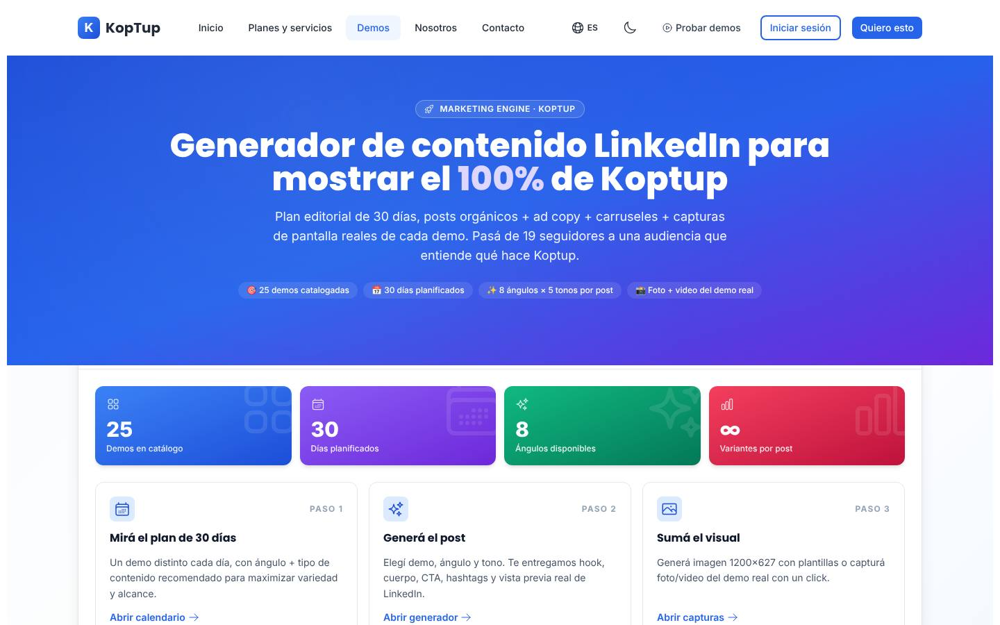
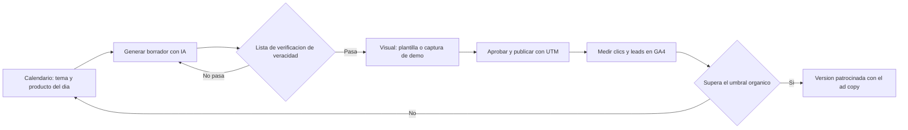

# Motor de contenido para LinkedIn (herramienta interna)

> Marketing interno de Koptup (sin categoría de catálogo) · Demo: `/demo/linkedin-ads` · Modo de acceso recomendado: `solicitud` (vitrina reducida) + herramienta completa en **Admin › Marketing** · Prioridad: **P2** (con 2 tareas P1 de limpieza) · Esfuerzo total: **L** (≈ 2 semanas para lo obligatorio; las tareas P3 de la Fase 5 son opcionales)

*Captura actual de `/demo/linkedin-ads`: "Generador de contenido LinkedIn para mostrar el 100% de Koptup", "Pasá de 19 seguidores…", 25 demos catalogadas y 30 días planificados. Ver también [Sistema de demos](04-Sistema-de-Demos.md), [Comercial, marketing y legal](11-Comercial-Marketing-y-Legal.md), [Panel de administración](05-Panel-de-Administracion.md), [Home](Seccion-Home.md) y [Nosotros](Seccion-Nosotros.md) (tarjeta "Lo que ya construimos · Uso interno"), [Roadmap](12-Roadmap.md).*

---

## Resumen

**Qué es:** una herramienta que Koptup construyó para **su propio marketing en LinkedIn**. Tiene cuatro pestañas:
- **Resumen:** indicadores (25 demos, 30 días, 8 ángulos) y el método de uso semanal ("Lunes 9:00 AM abrís el calendario…") con objetivos internos (500 seguidores, 10 leads, 2 reuniones).
- **Calendario 30 días:** un demo de Koptup por día, con ángulo, tipo de contenido y nota estratégica.
- **Generador de posts:** elige demo, ángulo (8) y tono (5) y produce **post orgánico** (gancho, cuerpo, CTA, hashtags), **ad copy** patrocinado (titular, introducción, descripción, CTA) y **carrusel de 7 diapositivas**, con vista previa estilo LinkedIn. Usa un modelo pequeño de OpenAI con salida en JSON validada por esquema y, si falla, un generador local por plantillas.
- **Capturas y video:** "Auto" (captura real de la demo dentro de un iframe del mismo sitio con `html-to-image`, también en video WebM), "Mockup diseñado" (3 plantillas de imagen 1200×627) y "Grabar pantalla" (`getDisplayMedia`).

**Para quién sería, si se vendiera:** agencias y equipos de marketing B2B que necesitan publicar con constancia. **Para quién sirve hoy:** el equipo de Koptup (dueño y comercial) para promocionar las demos y el producto RAG.

**Propuesta de valor interna:** "De una idea a un post revisado, con visual y enlace medible, en 10 minutos, con el mensaje correcto del producto."

---

## Decisión: herramienta interna y caso de estudio, no producto

**Veredicto:** **no entra al catálogo.** Se queda como herramienta interna en **Admin › Marketing › Contenido** y como **vitrina** en `/demo/linkedin-ads` (modo `solicitud`, coherente con [Sistema de demos](04-Sistema-de-Demos.md) y con la tarjeta "Uso interno · Marketing" de [Home](Seccion-Home.md) y [Nosotros](Seccion-Nosotros.md)). En la Fase 5 se convierte en caso de estudio.

| Criterio | Evaluación |
|---|---|
| Encaje con el reposicionamiento | El producto principal es RAG para empresas con documentos. Un generador de posts atrae freelancers y agencias, no al comprador de RAG |
| Diferenciación | Mercado lleno de herramientas de autoservicio baratas para escribir y programar posts. Koptup no tiene ventaja ahí |
| Estado del código | Todo está atado al catálogo de Koptup (`KOPTUP_DEMOS`, 25 entradas) y la captura "Auto" solo funciona con páginas del mismo sitio. Venderlo exige reescribir la entrada de datos, la marca y la captura |
| Riesgo | Genera texto publicitario público. Hoy produce testimonios inventados y cifras sin fuente (ver problemas 1 y 2): como producto expondría a Koptup y a sus clientes a reclamos por publicidad engañosa (Ley 1480 de 2011, Estatuto del Consumidor, vigilada por la SIC) |
| Valor real | Alto **como herramienta interna**: el funnel RAG necesita contenido constante en LinkedIn (destino de pauta y de la etiqueta LinkedIn Insight) |
| Valor como vitrina | Muestra que Koptup usa IA en su propia operación, y sirve de conversación para proyectos a medida de "motor de contenido" dentro de [Automatización de workflows](Producto-automatizacion-workflows.md) |

**Por qué `solicitud` y no `publico`:** la generación tiene costo de IA por llamada y la página actual muestra información interna. **Por qué no `privado`:** ya se presenta como prueba de capacidad en Home y Nosotros con el botón "Solicitar demo", y no maneja datos sensibles.

---

## Estado actual

| Aspecto | Estado | Evidencia |
|---|---|---|
| Demo | **Real**: llama a OpenAI desde una ruta de Next (`gpt-4o-mini` por defecto, temperatura 0,85, salida con esquema JSON y modo de compatibilidad); generador local de respaldo | `apps/web/src/app/api/linkedin-ads/generate/route.ts` (280 líneas), `components/generador.ts` (301) |
| Pantallas | Resumen, Calendario 30 días, Generador (post, ad copy, carrusel, vista previa), Capturas y video (Auto, Mockup, Grabar pantalla) | `page.tsx` (343), `components/Calendar.tsx` (187), `PostGenerator.tsx` (576), `PostPreview.tsx` (128), `DemoCapture.tsx` (1.037) |
| Datos | Catálogo propio de 25 demos con título, beneficios, público, "métrica impactante" y hashtags; calendario fijo de 30 días; 8 ángulos y 5 tonos | `components/data.ts` (647) |
| Persistencia | Ninguna: lo generado se pierde al recargar; no hay historial, aprobación ni enlaces con UTM | — |
| Backend | Solo la ruta de Next; no usa el backend Express | — |
| i18n ES/EN | No; textos y prompt en español rioplatense ("Sos", "Pasá", "Generá") | `page.tsx`, `route.ts` |
| Tests | Ninguno | — |
| Tamaño | 3.521 líneas (demo 3.241 + ruta de API 280) | `wc -l` |
| SEO | Indexable y en el sitemap; la metadata lo vende "para founders y equipos de marketing… sin contratar una agencia" | `apps/web/src/lib/seo-config.ts` (`demo-linkedin-ads`), `sitemap.ts` |
| Hub `/demo` | Tarjeta "Generador LinkedIn con IA" con insignia "Marketing IA"; en la rama `rag-reposicionamiento` cuenta como una de las 2 demos con IA real (`LIVE_AI_DEMO_SLUGS`) | `apps/web/src/app/demo/page.tsx`, `apps/web/src/lib/demos.ts` (rama) |
| Catálogo | No es un offering; `offeringSlug` nulo | `services-catalog.ts` |

**Lo que hace bien:** la salida de IA está bien estructurada (esquema JSON estricto, límites de caracteres de LinkedIn, una sola llamada para post + anuncio + carrusel + "estrategia"); el prompt prohíbe inventar métricas y casos; el respaldo local hace que la pantalla nunca quede vacía; la vista previa se parece a LinkedIn; la captura automática de la demo real en imagen y video es ingeniosa y ahorra tiempo; el método de "promocionar solo lo que funcionó orgánicamente" es sensato.

### Problemas detectados (con ruta)

1. **Testimonios inventados:** el ángulo "testimonio" del generador local escribe frases como "\"<métrica>\". Eso me dijo un cliente esta semana." (`components/generador.ts`). Koptup no tiene esos clientes. Contradice la regla del dueño (no inventar clientes, testimonios ni cifras).
2. **Cifras sin fuente que alimentan a la IA:** cada demo trae una `metricaImpactante` como "94% faithfulness · <1.5s latencia", "+30% conversión", "0 rechazos DIAN", "99.2% precisión detectando hate speech", "Cierre contable: 5 días → 4 horas" (`components/data.ts`). El prompt dice "NUNCA inventen métricas… que no estén en el input", pero el input ya las trae inventadas; la plantilla "Métrica hero" las pone en grande en la imagen (`DemoCapture.tsx`).
3. **Información interna publicada:** "Pasá de 19 seguidores", los objetivos del mes y el método de trabajo del equipo están en una página pública e indexable (`page.tsx`).
4. **Tono y país:** prompt e interfaz en español rioplatense ("Usen español rioplatense neutro") para una marca colombiana que en el resto del sitio usa "tú".
5. **Catálogo duplicado y desalineado:** `KOPTUP_DEMOS` repite a mano el catálogo (25 entradas) y el calendario reparte el mes por igual entre todas las demos; no refleja el reposicionamiento RAG ni `lib/demos.ts` de la rama.
6. **Costo de IA sin control:** la ruta de generación necesita exigir acceso, validar la entrada y aplicar cupos y tope de gasto (tarea genérica de [Seguridad y calidad](10-Seguridad-y-Calidad.md): límites de costo y rate-limit en endpoints de IA).
7. **Sin medición:** los CTA llevan a `koptup.com/demo/...` sin UTM, así que no se puede saber qué post trajo un lead en GA4.
8. **Consejos sin fuente:** "Costo estimado LinkedIn LATAM: $3–8 USD por click… presupuesto mínimo $10/día" (`PostGenerator.tsx`).
9. **Limitaciones técnicas:** la captura "Auto" solo funciona con páginas del mismo origen; el modelo y la temperatura están fijados en el código; sin pruebas; textos fuera de i18n.

---

## Qué falta

**Para usarla bien internamente (obligatorio):**
- Quitar el contenido engañoso: testimonios inventados y métricas sin fuente.
- Mover la herramienta al panel de administración, con control de acceso y cupos.
- Alinear el contenido con el producto RAG: catálogo leído de la fuente única y calendario con mayoría de contenido RAG.
- Guardar borradores, revisar con una lista de verificación de veracidad y publicar con UTM.

**Para mostrarla como vitrina (deseable):**
- Una versión reducida en `/demo/linkedin-ads` sin datos internos, con 3 ejemplos ya generados y un cupo pequeño de generación.
- Opción de generar un post para el producto del prospecto (texto que él escribe), para mostrar cómo sería un motor de contenido a medida.

---

## Plan detallado

### Landing

**No tiene landing de producto** (no está en el catálogo). Aparece en:
- La sección "Lo que ya construimos" de [Home](Seccion-Home.md) y [Nosotros](Seccion-Nosotros.md), con la etiqueta **"Uso interno · Marketing"** y el botón "Solicitar demo".
- En la Fase 5, como caso de estudio "Cómo usamos IA en nuestro propio marketing B2B", con métricas reales de 90 días (seguidores, CTR, leads atribuidos), nunca estimadas.

### Herramienta interna: Admin › Marketing › Contenido

Ruta propuesta: `/admin/marketing/contenido`, para los roles `admin` y `sales` (autorización en servidor, DECISIÓN 5). Ver [Panel de administración](05-Panel-de-Administracion.md).

| Pantalla | Qué hace | De dónde sale |
|---|---|---|
| **Calendario** | Plan de 4 semanas a 3 publicaciones por semana: ~60 % RAG (casos por sector, cómo evitamos respuestas inventadas, Piloto RAG, "Prueba con tu documento"), ~20 % salud (`/rag/salud`, cuentas médicas sin datos), ~20 % otras soluciones y equipo | `Calendar.tsx` + nueva tabla de planificación |
| **Generador** | Elige producto (leído de `services-catalog.ts` y de los planes RAG), ángulo y tono; genera post, anuncio y carrusel; edición en línea | `PostGenerator.tsx`, `route.ts` |
| **Lista de verificación de veracidad** (obligatoria antes de aprobar) | Cada cifra tiene fuente (enlace o "medido en piloto X con autorización"); no hay clientes ni testimonios inventados; el CTA lleva UTM; no se nombran marcas de terceros como clientes; tono "tú" | Nueva |
| **Visual** | Plantillas 1200×627 y captura de demos de Koptup; la plantilla "Métrica hero" solo acepta cifras con fuente | `DemoCapture.tsx` |
| **Borradores e historial** | Estados `borrador → aprobado → publicado` (o `descartado`), autor, fecha, enlace al post publicado, UTM | Nuevo modelo `ContentPost` |
| **Resultados** | Por publicación: clics y leads atribuidos (GA4 por `utm_content`), impresiones registradas a mano o por importación; "promocionar" solo si supera el umbral | GA4 + registro manual |

**Flujo interno:**

> [Ver diagrama como imagen](images/diagramas/Demo-linkedin-ads-1.png)

**Reglas de contenido** (se aplican en el prompt, en el generador local y en la lista de verificación):
1. Sin testimonios ni clientes salvo los autorizados por escrito (hoy: ninguno publicable sin permiso; ver [Comercial, marketing y legal](11-Comercial-Marketing-y-Legal.md)).
2. Cifras solo con fuente: hechos del producto ("responde con la fuente citada", "piloto de 2 semanas") o resultados medidos con autorización. Las hipótesis se escriben como hipótesis ("Imagina una IPS que…").
3. Precios iguales a los de `/services#planes-rag` y del catálogo, leídos de la misma constante.
4. Español neutro con "tú"; sin anglicismos innecesarios.
5. CTA a `/rag`, a la landing sectorial o a la demo del chatbot, con `utm_source=linkedin&utm_medium=organic|paid&utm_campaign=<mes>&utm_content=<postId>`.

### Demo interactiva: vitrina pública `/demo/linkedin-ads` (modo `solicitud`)

| Elemento | Agregar | Quitar / corregir |
|---|---|---|
| Hero | "Así usamos IA para nuestro marketing en LinkedIn"; aviso "Herramienta interna de Koptup. ¿Quieres algo así para tu empresa? Hablemos" | "100 % de Koptup", "19 seguidores" |
| Resumen | 3 ejemplos ya generados (post, anuncio y carrusel) sobre el producto RAG | Objetivos internos y método semanal |
| Generador | Modo "Tu producto": el prospecto escribe nombre, a quién vende y un beneficio verificable; cupo de 3 generaciones por acceso | Selector de las 25 demos; ángulo "testimonio" |
| Capturas | Solo plantillas de imagen (sin captura de demos internas) | Grabación de pantalla e iframe de otras demos |
| CTA | "Quiero un motor de contenido para mi equipo" → formulario de solicitud con el producto [Automatización de workflows](Producto-automatizacion-workflows.md) preseleccionado | `DemoCTA` genérico |

### Acceso y solicitud de demo

- **Modo `solicitud`** (DECISIÓN 1): visitante sin acceso ve en `/demo/acceso` 3 capturas y un video de 45 s; con acceso aprobado entra a la vitrina. `noindex` y fuera del sitemap.
- **Aprobación:** la puede dar `sales` (no es una demo privada). Duración 14 días, autoservicio, sin sesión guiada obligatoria.
- **Cupos:** `quotas.aiActionsPerDay = 3` en la vitrina; la ruta de generación verifica el pase de la demo o el rol de staff antes de llamar a la IA y aplica tope de gasto mensual.
- **Eventos `DemoEvent`:** generación, copia de texto, descarga de imagen, clic en "Quiero un motor de contenido".
- **Herramienta interna:** sin `DemoGrant`; acceso por rol `admin` o `sales`.

### Personalización por cliente

Solo en la vitrina y opcional: nombre y logo del prospecto en la vista previa del post y en la plantilla de imagen; producto del prospecto escrito por él mismo (sin datos personales). No se guarda después de expirar el acceso.

### Producto real (solo si un cliente lo pide)

No se desarrolla como producto. Si un cliente quiere un **motor de contenido B2B a medida**, se cotiza como proyecto dentro de [Automatización de workflows](Producto-automatizacion-workflows.md) con este alcance mínimo: catálogo y voz de marca del cliente, calendario, generación con IA con las reglas de veracidad de esta página, flujo de aprobación por roles, UTM y tablero de resultados, y, si el cliente tiene acceso aprobado por LinkedIn a su API de publicación, programación de publicaciones.

### Planes y precios

**No se publican planes.** Referencia interna para cotizar a medida (propuesta a validar; COP más IVA, USD con TRM 3.300):

| Concepto | Precio | Incluye |
|---|---|---|
| Motor de contenido B2B a medida (compra) | COP 12.900.000 · USD 3.900 | 3–4 semanas: catálogo y voz de marca, calendario, generador con reglas de veracidad, aprobación, UTM, tablero |
| Operación gestionada (opcional) | COP 690.000 · USD 210 al mes | Hosting, IA hasta 300 generaciones al mes, soporte lunes a viernes |
| Costo interno de IA (referencia) | Menos de USD 0,01 por generación con el modelo por defecto (estimado) | — |

---

## Tareas

| # | Tarea | Fase | Prioridad | Esfuerzo | Criterio de aceptación |
|---|---|---|---|---|---|
| 1 | Control de acceso y costo en la ruta de generación: exigir pase de demo o rol de staff, validar tamaño y forma de la entrada, cupo por acceso, tope de gasto mensual y modelo/temperatura por variable de entorno | Fase 0 — Endurecimiento | P1 | S | Sin acceso, la ruta responde 401/403 sin llamar a la IA; al llegar al cupo responde un mensaje claro; el gasto mensual no supera el tope configurado |
| 2 | Eliminar contenido engañoso: ángulo "testimonio" del generador local, `metricaImpactante` sin fuente (reemplazar por hechos verificables), consejo de costo por clic sin fuente | Fase 1 — Funnel y solicitud de demos | P1 | S | Una búsqueda de "me dijo un cliente", "faithfulness", "0 rechazos" y "99.2%" en la carpeta de la demo no devuelve resultados |
| 3 | Registrar `DemoCatalogItem` `linkedin-ads` en modo `solicitud` (14 días, autoservicio, cupo 3), `noindex`, fuera del sitemap y metadata que la presente como herramienta interna | Fase 1 — Funnel y solicitud de demos | P1 | S | Sin acceso, `/demo/linkedin-ads` lleva a `/demo/acceso`; la metadata ya no dice "sin contratar una agencia" |
| 4 | Vitrina pública sin información interna: hero nuevo, 3 ejemplos pregenerados, modo "Tu producto", solo plantillas de imagen, CTA a motor de contenido a medida | Fase 1 — Funnel y solicitud de demos | P2 | S | La vitrina no muestra seguidores, objetivos ni el método interno; el CTA abre el formulario con el producto preseleccionado |
| 5 | Mover la herramienta completa a `/admin/marketing/contenido` (roles `admin` y `sales`, autorización en servidor) | Fase 1 — Funnel y solicitud de demos | P2 | M | Un usuario sin rol de staff no puede abrir la ruta ni llamar a sus APIs |
| 6 | Español colombiano neutro con "tú" en prompt, interfaz y plantillas; textos en `messages/demos/linkedin-ads.{es,en}.json` | Fase 1 — Funnel y solicitud de demos | P2 | S | No quedan "Sos", "Pasá", "Generá" ni "rioplatense"; ninguna cadena visible fuera de los archivos de mensajes |
| 7 | Catálogo desde la fuente única (`services-catalog.ts`, planes RAG y `lib/demos.ts`) y calendario reorientado a RAG (~60 % RAG, ~20 % salud, ~20 % resto) | Fase 2 — Demos vendibles | P2 | M | `KOPTUP_DEMOS` desaparece; cambiar un precio en la constante de planes cambia el texto generado |
| 8 | Borradores, aprobación, historial y UTM automáticos (modelo `ContentPost`) con la lista de verificación de veracidad obligatoria antes de aprobar | Fase 2 — Demos vendibles | P2 | M | No se puede marcar "aprobado" sin completar la lista; cada CTA copiado lleva UTM con el identificador del post |
| 9 | Pruebas: contrato de la ruta (esquema de respuesta, errores, cupo) y del generador local (no produce testimonios ni cifras), en CI | Fase 0 — Endurecimiento | P2 | S | CI falla si el generador local produce una frase de la lista prohibida |
| 10 | Tablero de resultados por publicación (clics y leads desde GA4 por `utm_content`, impresiones registradas) | Fase 5 — Escala | P3 | M | El tablero muestra los leads atribuidos a cada post del último mes |
| 11 | Caso de estudio "Cómo usamos IA en nuestro marketing B2B" con 90 días de datos reales | Fase 5 — Escala | P3 | S | Página publicada solo con métricas medidas y verificables |

---

## Métricas de éxito

- **Uso interno:** ≥ 3 publicaciones por semana durante 12 semanas, 100 % con la lista de verificación completa y UTM.
- **Aporte al funnel RAG:** leads con `utm_source=linkedin` en GA4 cada mes; meta inicial a definir con la línea base del primer mes (no se fija un número antes de medir).
- **Veracidad:** 0 publicaciones con testimonios o cifras sin fuente.
- **Vitrina:** ≥ 20 % de quienes reciben acceso hacen clic en "Quiero un motor de contenido"; costo de IA de la vitrina dentro del tope mensual.
