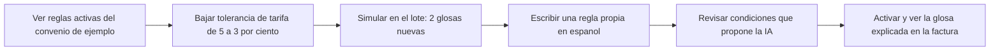
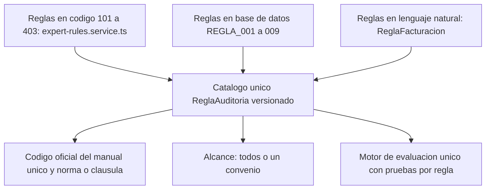
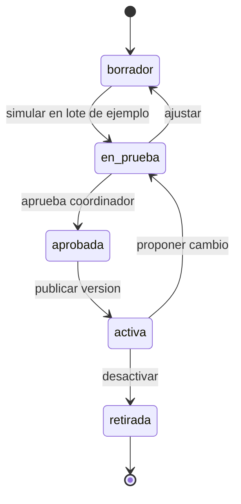

# Motor de reglas del auditor (antes "Sistema experto")

> Salud (`healthcare`) · Módulo de [Auditoría de Cuentas Médicas con IA](Demo-cuentas-medicas.md), **no es un producto independiente** · Demo: `/demo/sistema-experto` (se integra como pestaña de `/demo/cuentas-medicas`) · Modo de acceso recomendado: `privado` · Prioridad: **P2** · Esfuerzo total: **XL** (≈ 7 semanas de 1 dev senior; unas 3 se comparten con la consolidación del flujo de cuentas médicas)

*Captura actual de `/demo/sistema-experto` en producción: todos los indicadores en 0, "Vectorizados % de" sin valor, "CUPS por categoría" vacío y la insignia fija "Sistema Activo". Ver también [Auditoría de cuentas médicas](Demo-cuentas-medicas.md) (producto al que pertenece), [Sistema de demos](04-Sistema-de-Demos.md), [Catálogo de productos](08-Catalogo-de-Productos.md), [Backend y API](09-Backend-y-API.md) y [Roadmap](12-Roadmap.md).*

---

## Resumen

**Qué es en realidad:** la "consola de configuración" del motor que audita cuentas médicas. Tiene cuatro pestañas: **Dashboard** (estadísticas de cuentas procesadas, catálogo CUPS y vectorización), **Búsqueda semántica** (buscar códigos CUPS escribiendo en lenguaje natural, con embeddings), **Configuración** (8 reglas de glosa con interruptor, tolerancia de diferencia de tarifa, manual tarifario por defecto, validación clínica con IA, caché de CUPS) y **Documentación** (lista de endpoints de la API). Su botón de regreso dice "Volver a Cuentas Médicas": nació como parte de ese sistema.

**Problema que resuelve (dentro del producto de cuentas médicas):** cada pagador y cada convenio tiene sus reglas (qué servicios requieren autorización, qué tolerancia de tarifa se acepta, qué manual aplica). Un auditor necesita **ajustar esas reglas sin programador**, probarlas antes de activarlas y saber **por qué** el sistema propuso cada glosa.

**Para quién:** coordinadores de auditoría de firmas auditoras y pagadores, y jefes de cuentas médicas de IPS grandes. Es decir, los mismos compradores de [Auditoría de cuentas médicas](Demo-cuentas-medicas.md), en sus planes Profesional y Empresarial.

**Propuesta de valor (como módulo):** "Tus reglas de auditoría, escritas en español, probadas contra facturas de ejemplo antes de activarlas y explicadas en cada glosa: regla, evidencia, código oficial y norma."

---

## Decisión: no entra al catálogo como producto propio

**Veredicto:** se integra como el módulo **"Motor de reglas"** de [Auditoría de cuentas médicas](Demo-cuentas-medicas.md). La capacidad de fondo (motor de reglas explicable con IA) se cuenta como **caso de estudio** y argumento técnico en "Otras soluciones a medida".

| Argumento | Detalle |
|---|---|
| Todo su contenido es de cuentas médicas | Reglas de glosa, CUPS, manuales tarifarios ISS/SOAT, cuentas procesadas. No hay nada genérico que vender como "sistema experto para toma de decisiones", que es lo que promete su metadata SEO |
| Sin el flujo de facturas no le sirve a nadie | Una consola de reglas sin carga de facturas, extracción y bandeja de auditoría no resuelve un problema completo |
| Categoría genérica con mucha competencia | Los motores de reglas o de decisión genéricos ya existen como productos maduros; Koptup no tiene diferencial ahí, sí lo tiene en el dominio de cuentas médicas |
| Foco del reposicionamiento | El producto principal es RAG; otra línea genérica distrae. Como módulo de un vertical de salud, suma a `/rag/salud` |
| Vale como diferencial de plan | "Reglas propias en lenguaje natural", "simulador" y "aprobación de cambios" justifican el salto de Esencial a Profesional y Empresarial |

**Qué pasa con la ruta:** mientras se integra, `/demo/sistema-experto` queda registrada como `privado` (igual que cuentas médicas). Cuando la pestaña "Motor de reglas" exista dentro de `/demo/cuentas-medicas`, la ruta redirige con 301 a `/demo/cuentas-medicas?vista=reglas` y su `DemoCatalogItem` se desactiva. Los accesos vigentes a `sistema-experto` se migran a `cuentas-medicas`.

**Nombre en la interfaz:** "Motor de reglas". Nombre comercial en los planes: "Motor de reglas del auditor".

---

## Estado actual

| Aspecto | Estado | Evidencia |
|---|---|---|
| Demo | **Parcial.** Dashboard y búsqueda llaman al backend real; Configuración solo cambia el estado local; Documentación es texto fijo | `apps/web/src/app/demo/sistema-experto/page.tsx` (440 líneas), `apps/web/src/components/DashboardAuditoria.tsx` (325), `apps/web/src/components/BusquedaSemanticaCUPS.tsx` (233) |
| En producción | Muestra 0 en todo (sin cuentas, sin CUPS cargados, sin vectorización); "Vectorizados % de" se ve roto | Captura de arriba |
| Backend | Servicio de procesamiento de cuentas con extracción por IA (modelo pequeño de OpenAI), validación contra la base y motor de 8 reglas de glosa; generador de Excel de 5–6 hojas; configuración del motor guardada **en memoria del proceso** (común para todos y se pierde al reiniciar) | `controllers/expert-system.controller.ts` (329), `services/expert-system.service.ts` (596), `services/expert-rules.service.ts` (450), `services/excel-expert.service.ts` (393), `routes/expert-system.routes.ts` |
| Búsqueda semántica | Embeddings por código CUPS guardados en MongoDB; cada consulta carga todos los CUPS con vector y calcula la similitud en memoria. Hay dos servicios de embeddings con modelos distintos | `services/embeddings.service.ts`, `services/embedding.service.ts`, `controllers/cups.controller.ts` |
| Reglas | **Tres sistemas de reglas distintos:** (1) 8 reglas en código con numeración 101–403 (`expert-rules.service.ts`); (2) 9 reglas en base de datos `REGLA_001…009` (`ReglaAuditoria`, usadas por la auditoría de la demo de cuentas médicas, que anuncia "9 reglas"); (3) reglas de facturación escritas en lenguaje natural e interpretadas por un modelo de Anthropic (`ReglaFacturacion`, `reglas-ia.service.ts`, usadas por las páginas huérfanas `/liquidacion/reglas`) | `db/seeds/reglas-auditoria.seed.ts`, `models/ReglaAuditoria.ts`, `models/ReglaFacturacion.ts` |
| Procesamiento de cuentas | Existe en la API, pero **ninguna pantalla lo usa**; solo se consumen las estadísticas | `POST` de procesamiento en `expert-system.routes.ts` |
| i18n ES/EN | No. `messages/demos/sistema-experto.{es,en}.json` (18 líneas) existe pero la página no lo usa | `page.tsx` |
| Tests | Ninguno | — |
| Tamaño | Frontend 1.020 líneas; backend 1.797 propias + CUPS y embeddings compartidos | `wc -l` |
| SEO | Indexable y en el sitemap; metadata genérica "Sistema experto con IA para toma de decisiones" que no corresponde al contenido | `apps/web/src/lib/seo-config.ts` (`demo-sistema-experto`), `apps/web/src/app/sitemap.ts` |
| Enlaces | No está enlazada desde el hub `/demo`; se llega por URL o por el sitemap | `apps/web/src/app/demo/page.tsx` |

**Lo que hace bien:** la idea es la correcta para un comprador de auditoría: reglas con código, nombre y severidad que se pueden activar o desactivar, una **tolerancia de tarifa** explícita ("diferencias menores a este porcentaje no generan glosa") y un **manual tarifario por defecto**. La búsqueda de CUPS en lenguaje natural ahorra tiempo a facturadores y auditores. Y el backend ya tiene una pieza valiosa poco visible: **reglas escritas en español que la IA convierte en condiciones** (`reglas-ia.service.ts`), con previsualización.

### Problemas detectados (con ruta)

1. **"Guardar cambios" no guarda:** la pestaña Configuración muestra "✓ Guardado" sin llamar al backend (`page.tsx`, `ConfiguracionMotorReglas`); y el backend guarda la configuración solo en la memoria del proceso, sin persistencia ni separación por cliente.
2. **Reglas inconsistentes entre capas:** la pantalla lista 8 reglas con severidades distintas a las del backend (por ejemplo, la 101 aparece "alta" en la pantalla y "CRÍTICA" en el servicio); la demo de cuentas médicas dice "9 reglas"; la documentación de `docs/modules/SISTEMA_EXPERTO_README.md` describe 15 códigos. Nadie puede responder "¿cuántas reglas tiene el sistema?".
3. **Códigos propios** (101, 201, 301, 401) en lugar de los códigos del Manual Único de Devoluciones, Glosas y Respuestas vigente.
4. **Indicadores en cero y formato roto** en producción; insignia "Sistema Activo" fija, sin verificación real.
5. **Búsqueda semántica con ejemplos equivocados:** sugiere "dolor de cabeza intenso con náuseas", que es un síntoma (se codifica con CIE-10), no un procedimiento CUPS (`BusquedaSemanticaCUPS.tsx`). Además no muestra por qué sugiere cada código ni la versión del catálogo.
6. **Escalabilidad de la búsqueda:** comparar en memoria contra todo el catálogo en cada consulta, con dos modelos de embeddings distintos en el código; conviene un índice vectorial o reutilizar el núcleo del RAG.
7. **Pestaña "Documentación" orientada a desarrolladores:** lista endpoints y remite a "archivos en la raíz del proyecto". No sirve a un comprador y expone detalles internos que no deben estar en una demo.
8. **Metadata SEO desalineada** y página indexable siendo una demo de un sector sensible.
9. **Sin textos en i18n** (todo fijo en español) y sin pruebas del motor.

---

## Qué falta para que sea vendible (como módulo)

- **Un solo catálogo de reglas** versionado, con los códigos oficiales, la norma o cláusula que la sustenta y su severidad.
- **Configuración persistente por cliente** (y por convenio: tolerancia y manual), con historial de cambios.
- **Simulador:** probar una regla nueva o un cambio contra el paquete de facturas de ejemplo antes de activarla, y ver cuántas glosas y qué valor cambian.
- **Reglas en lenguaje natural** visibles en la demo, con la interpretación de la IA en forma de condiciones que el auditor revisa y aprueba.
- **Explicabilidad en cada glosa** y métricas de precisión por regla a partir de las decisiones del auditor.
- **Integración visual** en la demo de cuentas médicas, con los mismos datos sintéticos.

---

## Plan detallado

### Landing

No tiene landing propia. Aparece como:
- **Sección "Tus reglas, sin programador"** dentro de `/productos/auditoria-cuentas-medicas` ([Auditoría de cuentas médicas](Demo-cuentas-medicas.md)), con una captura del simulador y la frase "La IA propone, el auditor decide".
- **Fila de la tabla de planes** ("Reglas propias en lenguaje natural", "Simulador", "Aprobación de cambios").
- **Caso de estudio** en "Otras soluciones a medida" (Fase 5): "Motor de reglas explicable con IA", útil para conversaciones con aseguradoras (reclamaciones), financieras (políticas de crédito) o áreas de cumplimiento.

### Demo interactiva (pestaña "Motor de reglas" dentro de cuentas médicas)

| Pestaña actual | Agregar | Quitar / corregir | Datos de ejemplo |
|---|---|---|---|
| Dashboard → **Resumen del motor** | Reglas activas por convenio; glosas propuestas por regla en el espacio del prospecto; % aceptadas, ajustadas y descartadas por el auditor; versión de catálogos (CUPS, CIE-10) con fecha; estados vacíos con "Cargar paquete de ejemplo" | Ceros sin explicación; "Vectorizados % de"; insignia fija "Sistema Activo" (reemplazar por estado real del servicio) | Lote sintético de 12 facturas |
| Búsqueda semántica → **Buscar códigos** | Búsqueda en CUPS **y** CIE-10 según lo que se escriba; resultado con código, descripción oficial, capítulo, tarifa según el convenio elegido y "por qué aparece"; aviso "apoyo a la codificación: valida con tu equipo" | Ejemplos que mezclan síntomas con procedimientos | "radiografía de tórax dos proyecciones", "hemograma completo", "consulta de control por medicina general" |
| Configuración → **Reglas** | Catálogo único (12 reglas estándar) agrupado por concepto del manual oficial; por regla: código oficial, descripción, norma o cláusula, severidad, alcance (todos o un convenio), estado; tolerancia y manual **por convenio**; botón "Probar en el lote de ejemplo"; historial de cambios con autor | Guardado simulado; severidades distintas a las del backend | Convenios "EPS Andina Demo" (SOAT −15 %, tolerancia 3 %) y "Aseguradora Demo SOAT" |
| (nueva) **Regla propia** | Campo de texto: "Glosar por tarifa cuando el valor supere en más del 3 % lo pactado, salvo paquetes"; la IA devuelve las condiciones en una tabla editable; el auditor ajusta y guarda como borrador | — | 3 ejemplos de reglas escritas en español |
| (nueva) **Simulador** | Ejecuta la regla (o el cambio de tolerancia) sobre el lote de ejemplo y muestra: glosas nuevas, glosas que desaparecen, valor glosado antes y después, facturas afectadas | — | Lote sintético |
| Documentación → **Cómo decide** | Explicación para el comprador: extracción, validación, reglas, propuesta, decisión humana, retroalimentación; qué hace la IA y qué no | Lista de endpoints y referencias a archivos del proyecto | — |
| Global | Textos en `messages/demos/sistema-experto.{es,en}.json` (o en el archivo de cuentas médicas al integrarse); badges "Incluido desde plan Profesional" en Regla propia y Simulador | Botón "Volver a Cuentas Médicas" (deja de hacer falta al ser pestaña) | — |

**Recorrido guiado del módulo** (se suma como paso opcional al recorrido de cuentas médicas):

> [Ver diagrama como imagen](images/diagramas/Demo-sistema-experto-1.png)

### Catálogo único de reglas

Hoy hay tres sistemas de reglas. El objetivo es uno solo, guardado en base de datos (`ReglaAuditoria` ampliado), que use el motor en código como biblioteca de condiciones:

> [Ver diagrama como imagen](images/diagramas/Demo-sistema-experto-2.png)

**Campos propuestos:** `codigoInterno`, `codigoOficial`, `concepto` (facturación, tarifas, soportes, autorización, cobertura, pertinencia u otro del manual vigente), `nombre`, `descripcion`, `fundamento` (norma o cláusula), `severidad`, `alcance` (`global` o `convenioId`), `condiciones` (estructura que evalúa el motor), `textoOriginal` (si nació en lenguaje natural), `estado`, `version`, `creadaPor`, `aprobadaPor`, `espacioId` (cliente o acceso de demo).

**Ciclo de vida de una regla:**

> [Ver diagrama como imagen](images/diagramas/Demo-sistema-experto-3.png)

En Esencial basta con `borrador → activa`; la aprobación por un segundo usuario es del plan Empresarial.

### Acceso y solicitud de demo

- **Modo `privado`**, igual que [cuentas médicas](Demo-cuentas-medicas.md): solo el `admin` invita o aprueba; no se lista como abierta en `/demo`; `noindex` y fuera del sitemap; las APIs del motor y de búsqueda de CUPS exigen el acceso en servidor (`requireDemoGrant`, sección 10.4 de [Sistema de demos](04-Sistema-de-Demos.md)).
- **No se solicita por separado:** el formulario ofrece "Auditoría de cuentas médicas"; el motor de reglas viene incluido en esa demo. Un `DemoGrant` de `cuentas-medicas` abre también la pestaña Motor de reglas.
- **Qué ve el prospecto:** en la sesión guiada se muestra el motor solo a perfiles de coordinación o pagadores (el admin marca "mostrar motor de reglas" al aprobar). En autoservicio, las pestañas Regla propia y Simulador muestran "Incluido desde plan Profesional" si el plan cotizado es Esencial.
- **Cupos:** las reglas en lenguaje natural usan IA: máximo 10 interpretaciones por día por acceso; el simulador usa solo el lote del espacio.
- **Eventos `DemoEvent`:** regla activada o desactivada, tolerancia cambiada, simulación ejecutada, regla propia creada, búsqueda de códigos.

### Datos de ejemplo y cumplimiento

- Usa el **mismo paquete sintético** de [cuentas médicas](Demo-cuentas-medicas.md) (pacientes, prestadores y pagadores ficticios; facturas con marca de agua; un error sembrado por regla). Ningún dato real de pacientes.
- Los **catálogos** (CUPS, CIE-10) son públicos y se cargan desde las tablas oficiales vigentes con su fecha de versión; no son datos personales.
- Las **reglas** pueden contener información comercial sensible del cliente (tarifas pactadas): en el producto se guardan por espacio, con registro de cambios, y nunca se envían a la IA con datos de pacientes.
- Las condiciones de Ley 1581 de 2012, historia clínica (Resolución 1995 de 1999) y uso de proveedores de IA son las mismas de la sección "Cumplimiento" de [Auditoría de cuentas médicas](Demo-cuentas-medicas.md).

### Personalización por cliente

| Campo (en el `DemoGrant` de cuentas médicas) | Efecto en el motor |
|---|---|
| Convenios ficticios del prospecto | Tolerancia y manual por convenio |
| Reglas activas | Conjunto estándar o perfil "IPS pre-radicación" / "Pagador" |
| 1–3 reglas propias redactadas en la sesión guiada | Aparecen como borradores para que el prospecto las simule |
| Plan cotizado | Habilita o muestra como bloqueadas Regla propia, Simulador y Aprobación |

### Producto real

**Alcance dentro del plan Profesional de Auditoría de cuentas médicas:**
- Catálogo único con 12 reglas estándar mapeadas al manual oficial, pruebas unitarias por regla y fundamento normativo revisado por el auditor asesor.
- Configuración por cliente y por convenio, persistente, con historial.
- Reglas propias en lenguaje natural: la IA traduce a condiciones, el auditor confirma; el modelo se elige por configuración, con tope de costo.
- Simulador sobre un lote histórico o de ejemplo.
- Retroalimentación: cada decisión del auditor (aceptar, ajustar, descartar) alimenta métricas de precisión por regla (el servicio `sistema-aprendizaje.service.ts` ya guarda puntajes y comentarios) y sugiere reglas a revisar.
- Búsqueda de códigos CUPS y CIE-10 con índice vectorial (o el mismo motor de búsqueda del RAG) y catálogos versionados.

**Empresarial:** versionado con aprobación por un segundo usuario, exportación e importación de reglas, API para que el cliente consulte reglas y resultados, reglas por red de prestadores.

**A medida para otros sectores:** el mismo patrón (reglas explicables + IA que interpreta reglas en lenguaje natural + simulador + revisión humana) se puede ofrecer en proyectos de "Otras soluciones a medida". Solo se cotiza con un caso concreto.

**SaaS:** sigue la regla de cuentas médicas (instancia dedicada gestionada; SaaS multi-tenant en lista de espera hasta la Fase 4).

### Planes y precios

No tiene precio propio. **Propuesta de inclusión** en los planes de [Auditoría de cuentas médicas](Demo-cuentas-medicas.md):

| Capacidad | Piloto | Esencial | Profesional | Empresarial |
|---|---|---|---|---|
| 12 reglas estándar con código oficial (activar/desactivar) | Sí | Sí | Sí | Sí |
| Tolerancia y manual tarifario por convenio | 1 convenio | Hasta 3 convenios | Ilimitados | Ilimitados |
| Búsqueda de códigos CUPS y CIE-10 | Sí | Sí | Sí | Sí |
| Reglas propias en lenguaje natural | — | — | Hasta 30 activas | Ilimitadas |
| Simulador de reglas | — | — | Sí | Sí |
| Métricas de precisión por regla | Informe del piloto | — | Sí | Sí |
| Aprobación de cambios por segundo usuario, exportación y API | — | — | — | Sí |

**Referencia para proyectos a medida en otros sectores** (no se publica; a validar): motor de reglas explicable con IA, simulador y bandeja de revisión, **desde COP 24.900.000 · USD 7.490 de implementación (6–8 semanas)**, más operación gestionada desde COP 1.990.000 · USD 600 al mes. Mismo rango que el plan Profesional de RAG, porque comparte la mayor parte del esfuerzo.

**Recomendación de claridad:** en la landing hablar de "reglas de tu convenio" y "reglas propias", no de "sistema experto" ni de "motor de inferencia", términos que no usa el comprador.

---

## Tareas

| # | Tarea | Fase | Prioridad | Esfuerzo | Criterio de aceptación |
|---|---|---|---|---|---|
| 1 | Registrar `DemoCatalogItem` `sistema-experto` en modo `privado`, `requireDemoGrant` en las APIs del motor y de búsqueda de CUPS, `noindex` y fuera del sitemap | Fase 1 — Funnel y solicitud de demos | P0 | S | Sin acceso, `/demo/sistema-experto` lleva a `/demo/acceso?motivo=privado`; la ruta no aparece en `sitemap.xml` |
| 2 | Corregir el estado en producción: catálogos cargados, estados vacíos explicativos, formato del indicador de vectorización y estado real del servicio en lugar de la insignia fija | Fase 1 — Funnel y solicitud de demos | P1 | S | Con un acceso válido, el resumen muestra los datos del lote de ejemplo; sin datos muestra "Cargar paquete de ejemplo", nunca "% de" |
| 3 | Reemplazar la pestaña "Documentación" por "Cómo decide" (explicación para el comprador) y retitular la metadata SEO a "Motor de reglas para auditoría de cuentas médicas" | Fase 1 — Funnel y solicitud de demos | P2 | S | La demo no muestra endpoints ni rutas de archivos; la metadata no promete "toma de decisiones" genérica |
| 4 | Catálogo único de reglas: unificar las reglas en código, `ReglaAuditoria` y `ReglaFacturacion` en un modelo versionado con código oficial del manual vigente, fundamento y alcance por convenio | Fase 2 — Demos vendibles | P1 | L | La demo de cuentas médicas, el motor y el simulador leen el mismo catálogo; el número de reglas mostrado es el mismo en todas las pantallas |
| 5 | Configuración persistente por espacio (cliente o acceso de demo) y por convenio, con historial de cambios; "Guardar" llama al backend | Fase 2 — Demos vendibles | P1 | M | Cambiar la tolerancia en un espacio no afecta a otro y sobrevive a un reinicio del servidor; el historial muestra quién y cuándo |
| 6 | Integrar el módulo como pestaña "Motor de reglas" de `/demo/cuentas-medicas`, migrar los accesos y redirigir con 301 `/demo/sistema-experto` | Fase 2 — Demos vendibles | P2 | M | La ruta antigua redirige; un acceso de cuentas médicas abre la pestaña sin otro grant |
| 7 | Simulador: ejecutar una regla o un cambio de tolerancia sobre el lote del espacio y mostrar glosas nuevas, eliminadas y diferencia de valor | Fase 2 — Demos vendibles | P2 | M | Bajar la tolerancia de 5 % a 3 % en el lote de ejemplo muestra exactamente las glosas esperadas del paquete sintético |
| 8 | Reglas propias en lenguaje natural en la demo: interpretación con IA a condiciones editables, modelo configurable, cupo diario y tope de costo | Fase 2 — Demos vendibles | P2 | M | Las 3 reglas de ejemplo se interpretan a condiciones correctas; al llegar al cupo, la interfaz lo explica sin error técnico |
| 9 | Búsqueda de códigos: CUPS y CIE-10 vigentes con fecha de versión, un solo modelo de embeddings, índice vectorial (o núcleo RAG), explicación del resultado y ejemplos correctos | Fase 2 — Demos vendibles | P2 | M | "radiografía de tórax" devuelve el CUPS correcto en el primer resultado; la búsqueda responde en menos de 1 s con el catálogo completo |
| 10 | Retroalimentación del auditor conectada a métricas de precisión por regla (sobre el servicio de aprendizaje existente) | Fase 3 — Propuestas y conversión | P2 | M | El resumen muestra % de aceptación por regla; el informe del Piloto de auditoría incluye esta tabla |
| 11 | Pruebas unitarias por regla (casos que deben y no deben glosar) e i18n ES/EN de todo el módulo, ejecutándose en CI | Fase 0 — Endurecimiento | P1 | M | Cada regla tiene al menos 2 casos de prueba; ninguna cadena visible queda fuera de los archivos de mensajes |
| 12 | Caso de estudio "Motor de reglas explicable con IA" para "Otras soluciones a medida" | Fase 5 — Escala | P3 | S | Página de caso publicada con capturas del simulador, sin datos de clientes ni cifras no medidas |

---

## Métricas de éxito

Son **metas** iniciales a validar con datos reales; no son resultados actuales.

- **Uso en la demo:** ≥ 50 % de los prospectos de perfil coordinación o pagador ejecuta al menos una simulación; ≥ 30 % escribe una regla propia.
- **Conversión de plan:** ≥ 1 de cada 2 propuestas de Auditoría de cuentas médicas a firmas auditoras o pagadores sale en Profesional o Empresarial gracias a reglas propias y simulador.
- **Calidad:** 100 % de reglas con pruebas y código oficial; en cada piloto, precisión por regla publicada en el informe.
- **Coherencia:** un solo número de reglas en toda la interfaz y la documentación; 0 configuraciones perdidas por reinicios.
