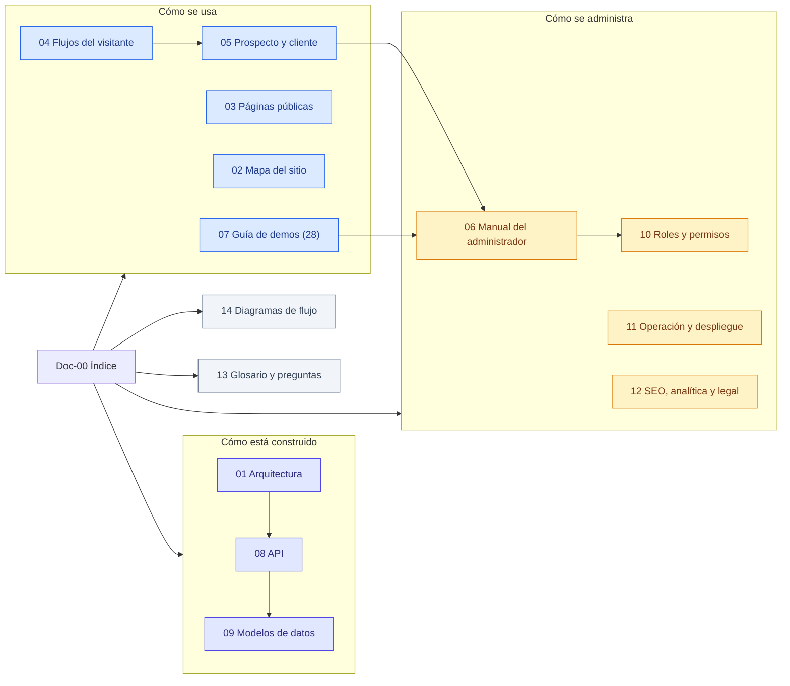

# Documentación de KopTup

> Cómo funciona **hoy** el sitio de KopTup (`www.koptup.com`, rama `main`): qué páginas tiene, qué puede hacer cada tipo de usuario, cómo se piden y se conceden las demos, cómo se administra y cómo está construido por dentro. La documentación es para dos lectores: el dueño, que no es técnico, y un desarrollador.
>
> Las páginas que empiezan por un número (01–15) son el **plan de producto**. Esta sección documenta solo lo que **ya existe y funciona en `main`**.

**En esta página:** [Mapa visual](#mapa-visual) · [Por dónde empezar](#por-dónde-empezar) · [Todas las páginas](#todas-las-páginas) · [Convenciones](#convenciones) · [Sobre las capturas](#sobre-las-capturas)

---

## Mapa visual

*Las páginas en azul explican el sitio desde el lado del usuario, las ámbar desde el lado del equipo de KopTup y las moradas por dentro.*

---

## Por dónde empezar

| Si eres… | Lee primero | Después |
|---|---|---|
| **Dueño** | [Mapa del sitio](Doc-02-Mapa-del-Sitio.md) y [Manual del administrador](Doc-06-Manual-del-Administrador.md) | [Diagramas de flujo de negocio](Doc-14-1-Flujos-de-Negocio.md) y [Guía de demos](Doc-07-Guia-de-Demos.md) |
| **Comercial** | [Guía de demos](Doc-07-Guia-de-Demos.md): un recorrido de 5 minutos por demo | [Flujos del visitante](Doc-04-Flujos-del-Visitante.md) y [Flujos del prospecto y cliente](Doc-05-Flujos-del-Prospecto-y-Cliente.md) |
| **Desarrollador** | [Arquitectura](Doc-01-Arquitectura.md) y [API](Doc-08-API.md) | [Modelos de datos](Doc-09-Modelos-de-Datos.md), [Roles y permisos](Doc-10-Roles-y-Permisos.md), [Flujos técnicos](Doc-14-3-Flujos-Tecnicos.md) y [Operación y despliegue](Doc-11-Operacion-y-Despliegue.md) |
| **Soporte u operación** | [Operación y despliegue](Doc-11-Operacion-y-Despliegue.md) | [Flujos de administración y operación](Doc-14-2-Flujos-de-Administracion-y-Operacion.md) (incluye los procedimientos ante fallas) |

### Las tres preguntas más comunes

| Pregunta | Respuesta corta | Dónde está el detalle |
|---|---|---|
| ¿Cómo pide una demo un cliente? | En `/demo` pulsa **Solicitar acceso** o entra a `/solicitar-demo`, llena el formulario y autoriza el tratamiento de datos | [Flujos del visitante](Doc-04-Flujos-del-Visitante.md) |
| ¿Cómo le doy acceso? | En **Admin › Solicitudes de demo** apruebas la solicitud. El sistema genera un enlace de activación que puedes copiar o enviar por WhatsApp | [Manual del administrador](Doc-06-Manual-del-Administrador.md) |
| ¿Cómo cambio si una demo es abierta o privada? | En **Admin › Catálogo de demos** eliges **Abierta**, **Con solicitud** o **Solo por invitación** | [Manual del administrador](Doc-06-Manual-del-Administrador.md) |

---

## Todas las páginas

| # | Página | Qué encuentras | Para |
|---|---|---|---|
| 01 | [Arquitectura](Doc-01-Arquitectura.md) | Piezas del sistema (web, backend, base de datos, caché, IA, correo), dónde corre cada una y cómo se hablan | Desarrollador |
| 02 | [Mapa del sitio](Doc-02-Mapa-del-Sitio.md) | Todas las rutas del sitio agrupadas por zona, con quién puede entrar a cada una | Todos |
| 03 | [Páginas públicas](Doc-03-Paginas-Publicas.md) | Inicio, `/rag` y landings por sector, servicios y planes, contacto, nosotros y páginas legales, con capturas | Dueño, comercial |
| 04 | [Flujos del visitante](Doc-04-Flujos-del-Visitante.md) | Lo que hace alguien sin cuenta: explorar, probar una demo abierta, "Prueba con tu documento", contactar y solicitar una demo | Dueño, comercial |
| 05 | [Flujos del prospecto y cliente](Doc-05-Flujos-del-Prospecto-y-Cliente.md) | Activar la cuenta, iniciar sesión, **Mis demos**, vencimiento del acceso y recuperación de contraseña | Dueño, comercial |
| 06 | [Manual del administrador](Doc-06-Manual-del-Administrador.md) | Paso a paso del panel: solicitudes, accesos y catálogo de demos, usuarios, contactos y las demás secciones | Dueño |
| 07 | [Guía de demos](Doc-07-Guia-de-Demos.md) | Índice de las 28 demos, con una guía de uso por demo | Comercial |
| 08 | [API](Doc-08-API.md) | Rutas del backend agrupadas por módulo, con quién puede llamarlas | Desarrollador |
| 09 | [Modelos de datos](Doc-09-Modelos-de-Datos.md) | Colecciones de MongoDB, sus campos y relaciones, con diagramas entidad-relación | Desarrollador |
| 10 | [Roles y permisos](Doc-10-Roles-y-Permisos.md) | Qué puede hacer cada rol y cómo se decide el acceso a cada demo | Dueño, desarrollador |
| 11 | [Operación y despliegue](Doc-11-Operacion-y-Despliegue.md) | Vercel, Railway, variables de entorno, CI, pruebas, monitoreo y procedimientos ante fallas | Desarrollador, operación |
| 12 | [SEO, analítica y legal](Doc-12-SEO-Analitica-y-Legal.md) | Metadatos, sitemap, consentimiento de cookies, eventos medidos y tratamiento de datos (Ley 1581) | Dueño, desarrollador |
| 13 | [Glosario y preguntas](Doc-13-Glosario-y-Preguntas.md) | Términos usados en la documentación y preguntas frecuentes | Todos |
| 14 | [Diagramas de flujo](Doc-14-Diagramas-de-Flujo.md) | Índice visual de todos los diagramas: [negocio](Doc-14-1-Flujos-de-Negocio.md), [administración y operación](Doc-14-2-Flujos-de-Administracion-y-Operacion.md) y [técnicos](Doc-14-3-Flujos-Tecnicos.md) | Todos |

---

## Convenciones

| Término | Significado |
|---|---|
| **Visitante** | Alguien que navega sin iniciar sesión |
| **Prospecto** | Rol `prospect`: alguien a quien el equipo le aprobó al menos una demo y activó su cuenta |
| **Cliente** | Rol `client`: alguien con un proyecto contratado |
| **Equipo o staff** | Roles `admin`, `manager` y `sales`: ven todas las demos y entran al panel según su rol (ver [Roles y permisos](Doc-10-Roles-y-Permisos.md)) |
| **Abierta / Con solicitud / Solo por invitación** | Modos de acceso de una demo: `publico`, `solicitud` y `privado` |
| **Datos de ejemplo** | La demo muestra información ficticia preparada para la demostración; se indica en cada guía |
| **En desarrollo** | Existe en el plan pero todavía no está en `main`; ver [Estado y próximos pasos](15-Estado-y-Proximos-Pasos.md) |

Los diagramas usan siempre los mismos colores:

| Color | Significa |
|---|---|
| Azul | Lo que hace el visitante, el prospecto o el cliente |
| Morado | Lo que hace el sistema por su cuenta |
| Ámbar | Lo que hace el administrador o el equipo |
| Rombo | Una decisión |
| Rojo | Un error o un rechazo |
| Gris | Un servicio externo (correo, OpenAI, Vercel, Railway) |

---

## Sobre las capturas

- Las capturas se tomaron con el **mismo código de `main`** en un entorno local, con datos de ejemplo: personas y empresas ficticias y correos `@ejemplo.co`. La IA de ese entorno es simulada, así que el texto de las respuestas en las capturas es ilustrativo.
- Se hicieron en local porque el backend de producción no responde en este momento. Ver **Acciones del dueño** en [Estado y próximos pasos](15-Estado-y-Proximos-Pasos.md).
- Escritorio a 1440 × 900 y móvil a 390 × 844. Los números en círculo (①②③) sobre una captura se explican en el texto que la sigue.
- **Lo que está en desarrollo** (propuestas, anticipo y conversión a cliente) no aparece aquí. Su avance está en [Estado y próximos pasos](15-Estado-y-Proximos-Pasos.md).
