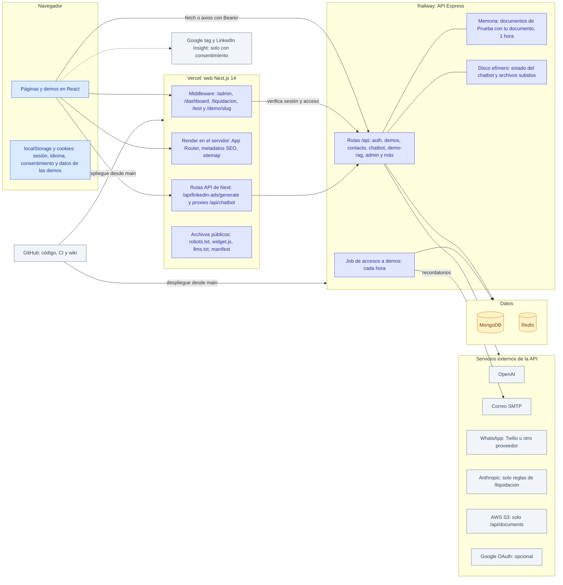
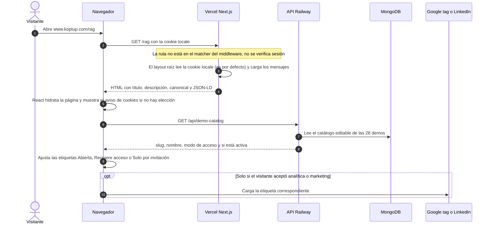
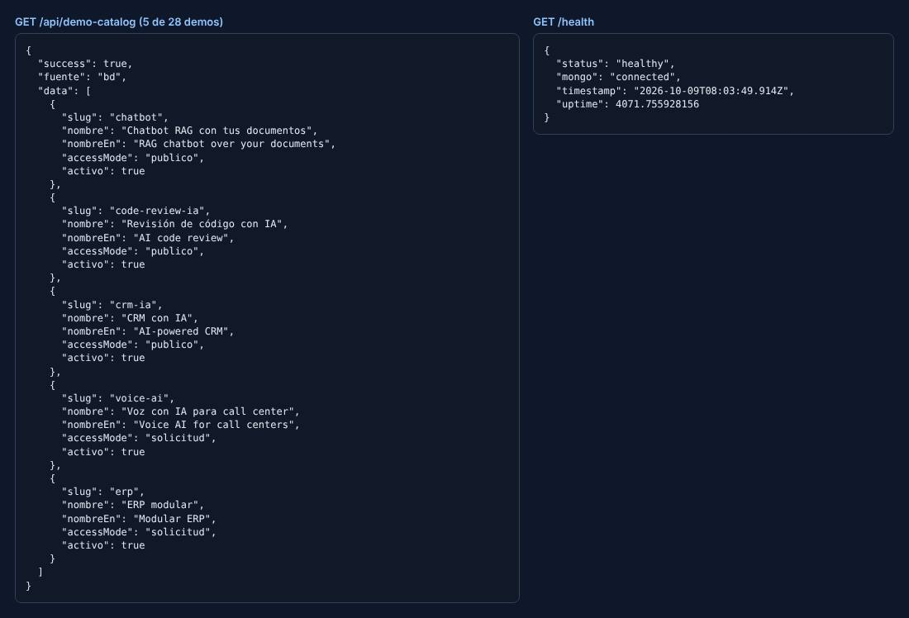
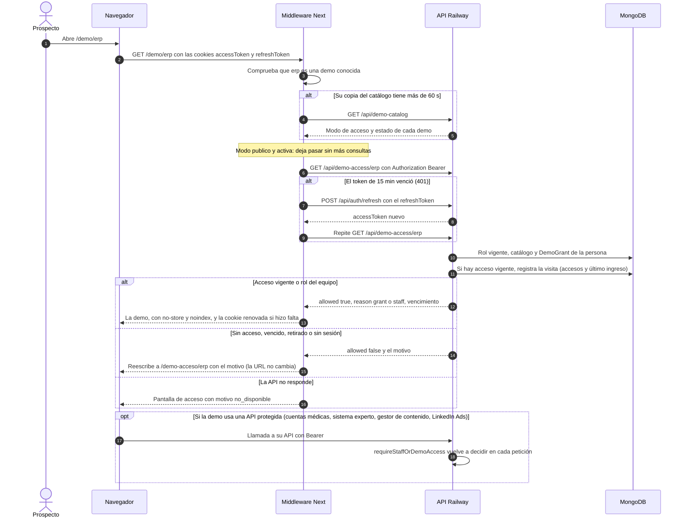
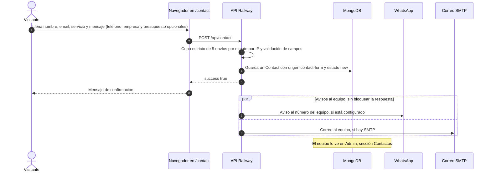
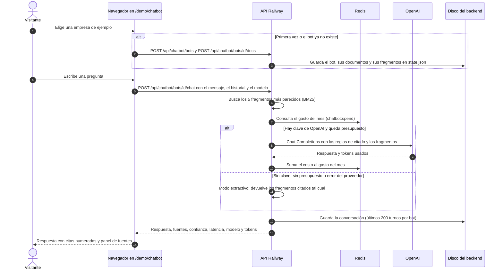
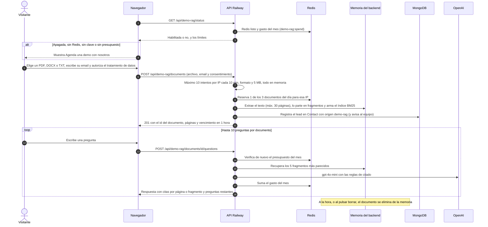
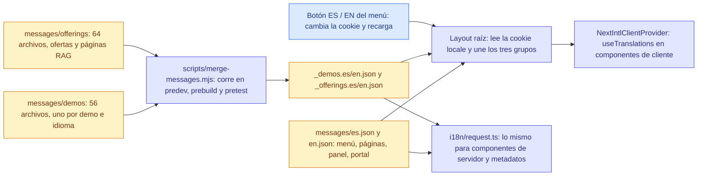
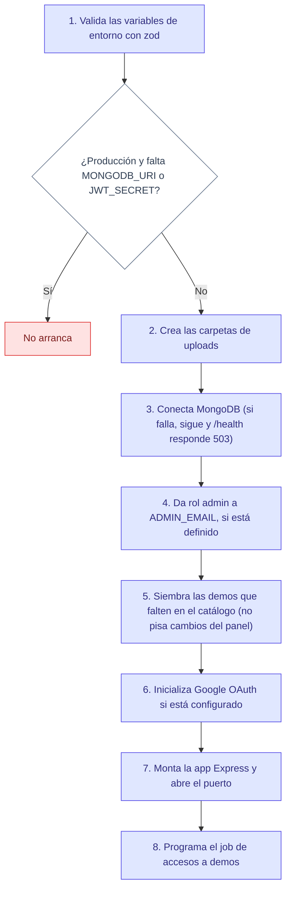

# Arquitectura

> **Resumen.** KopTup es un monorepo con dos aplicaciones: la **web** (Next.js 14, desplegada en **Vercel**) y la **API** (Express, desplegada en **Railway**). La API guarda los datos en **MongoDB**, usa **Redis** para sesiones, cupos y topes de gasto de IA, y habla con **OpenAI**, con un servidor de **correo (SMTP)** y con **WhatsApp**. Un middleware de Next verifica la sesión y el acceso a las demos **antes** de mostrar una página, y la API vuelve a verificar cada petición.
>
> **Para quién:** sobre todo para un desarrollador. El dueño puede quedarse con el [diagrama general](#1-el-sistema-en-una-imagen) y la tabla [qué hace cada pieza](#2-qué-hace-cada-pieza).

## Índice

1. [El sistema en una imagen](#1-el-sistema-en-una-imagen)
2. [Qué hace cada pieza](#2-qué-hace-cada-pieza)
3. [Estructura del monorepo](#3-estructura-del-monorepo)
4. [Cómo viaja una petición (5 recorridos reales)](#4-cómo-viaja-una-petición-5-recorridos-reales)
5. [Sesión e inicio de sesión](#5-sesión-e-inicio-de-sesión)
6. [Dónde vive cada dato](#6-dónde-vive-cada-dato)
7. [Idiomas: cómo se construyen los mensajes](#7-idiomas-cómo-se-construyen-los-mensajes)
8. [Arranque del backend, jobs y tareas programadas](#8-arranque-del-backend-jobs-y-tareas-programadas)
9. [Tecnologías y versiones](#9-tecnologías-y-versiones)
10. [Protecciones generales](#10-protecciones-generales)
11. [Para desarrolladores: archivos clave](#11-para-desarrolladores-archivos-clave)
12. [Limitaciones conocidas](#12-limitaciones-conocidas)
13. [Páginas relacionadas](#13-páginas-relacionadas)

---

## 1. El sistema en una imagen



*Morado: lo que corre en los servidores de KopTup. Ámbar: dónde se guardan los datos. Gris: servicios externos. La línea punteada solo existe si el visitante acepta las cookies de analítica o marketing.*

Puntos clave para el dueño:

- **Dos servidores, un solo dominio para el visitante.** El visitante siempre está en `www.koptup.com` (Vercel). Las acciones que guardan o consultan datos van a la API en Railway.
- **La web no guarda datos de negocio.** Cuentas, solicitudes de demo, accesos, contactos y pedidos viven en MongoDB, detrás de la API.
- **Las demos son, en su mayoría, del lado del navegador.** 20 de las 28 demos funcionan solo en el navegador con datos de ejemplo. Ocho hablan con la API: el chatbot RAG (incluida "Prueba con tu documento"), el gestor de contenido, LinkedIn Ads, cuentas médicas y el sistema experto, más tres que usan el chatbot RAG para su asistente de IA (mesa de ayuda, talento humano y LMS). Detalle en la [Guía de demos](Doc-07-Guia-de-Demos.md).
- **Si la API no responde**, las páginas públicas y las demos abiertas siguen funcionando, pero el panel, el portal y las demos con acceso controlado **no se abren** (falla cerrada, ver [§4.2](#42-abrir-una-demo-con-acceso-controlado)).

---

## 2. Qué hace cada pieza

| Pieza | Dónde corre | Qué hace | Si falla… |
|---|---|---|---|
| **Web Next.js** (`apps/web`) | Vercel, región `iad1` | Renderiza todas las páginas en el servidor (App Router), sirve las demos, el sitemap, el `robots.txt` y la imagen Open Graph. Aplica cabeceras de seguridad (CSP, HSTS). | El sitio no carga. |
| **Middleware de Next** (`apps/web/src/middleware.ts`) | Vercel (Edge) | Antes de servir `/admin`, `/dashboard`, `/liquidacion`, `/test` y `/demo/<slug>`, pregunta a la API por la sesión y el acceso. Renueva el token si venció. | Ver la fila de la API. |
| **API Express** (`apps/backend`) | Railway (Nixpacks, `npm run start`) | Autenticación, sistema de demos (solicitudes, accesos, catálogo), contacto, chatbot RAG, "Prueba con tu documento", panel de administración, portal del cliente y herramientas internas. Cada ruta tiene su política de autorización. | Las páginas protegidas muestran "No pudimos verificar tu sesión" (503) y las demos con acceso muestran "no disponible". Las públicas siguen. |
| **Job de accesos a demos** | Dentro del proceso de la API | Cada hora marca como vencidos los accesos y envía el recordatorio 3 días antes (si hay SMTP). | La vigencia igual se respeta: la API compara la fecha en cada consulta. |
| **MongoDB** | Servicio administrado (fuera de Railway) | Base de datos principal: cuentas, demos, contactos, pedidos, facturas, entregables, mensajes y datos de las herramientas médicas. | `/health` responde 503. Login, panel y demos con acceso no funcionan; las demos `publico` siguen abiertas. |
| **Redis** | Plugin de Railway | Refresh tokens (7 días), cupos por IP o por cuenta, gasto mensual de IA y candado del job. | No se puede iniciar sesión; las funciones de IA públicas se apagan (falla cerrada); el job corre sin candado. |
| **OpenAI** | Externo | Respuestas del chatbot RAG, "Prueba con tu documento", LinkedIn Ads y el asistente del gestor de contenido. Modelo por defecto `gpt-4o-mini`. | El chatbot responde en **modo extractivo** (cita los fragmentos); las otras funciones de IA muestran un aviso honesto. |
| **SMTP** | Externo | Acuse de la solicitud, aprobación con enlace de activación, recordatorios, restablecer contraseña y avisos al equipo. | Nada se rompe: el panel muestra el enlace de activación para copiarlo o enviarlo por WhatsApp. |
| **WhatsApp** | Twilio, WhatsApp Business API o UltraMsg | Aviso al número del equipo por cada contacto, lead de la demo RAG y solicitud de demo. | El lead igual queda guardado en MongoDB. |
| **AWS S3** | Externo | Solo para los archivos de `/api/documents` (API de documentos con sesión). | Solo afecta esa API. |
| **Anthropic** | Externo | Solo en las reglas de facturación de la herramienta interna `/liquidacion`. | Solo afecta esa herramienta. |
| **GitHub** | Externo | Código, CI (`.github/workflows/ci.yml`) y publicación de esta wiki (`wiki-sync.yml`). Vercel y Railway despliegan desde `main` con sus propias integraciones. | No se publica ni se despliega. |

Cuando la API no responde, el middleware contesta `/admin`, `/dashboard` y `/liquidacion` con una página mínima "No pudimos verificar tu sesión" (503, falla cerrada). La captura está en [Manual del administrador §15.4](Doc-06-Manual-del-Administrador.md#154-el-backend-no-responde).

---

## 3. Estructura del monorepo

El repositorio usa **npm workspaces** (`apps/*`, `packages/*`) y **Turborepo** para correr `dev`, `build`, `lint`, `typecheck` y `test` en las dos aplicaciones.

```text
koptup/
├── apps/
│   ├── web/                         ← Web Next.js 14 (Vercel)
│   │   ├── src/
│   │   │   ├── app/                 ← Rutas (App Router): páginas, layouts, rutas API, sitemap, OG
│   │   │   │   ├── demo/<slug>/     ← Las 28 demos (cada una con su layout de SEO)
│   │   │   │   ├── admin/           ← Panel de administración
│   │   │   │   ├── dashboard/       ← Portal del prospecto y del cliente
│   │   │   │   └── api/             ← Rutas API de Next (proxy de LinkedIn Ads y proxies heredados)
│   │   │   ├── middleware.ts        ← Guardia de sesión, rol y acceso a demos (el que se ejecuta)
│   │   │   ├── components/          ← Menú, pie, hub de demos, panel, portal, consentimiento, RAG…
│   │   │   ├── lib/                 ← Cliente de la API, roles, catálogo de demos, SEO, analítica
│   │   │   ├── i18n/                ← Configuración de next-intl (idioma por cookie)
│   │   │   └── __tests__/           ← Pruebas Jest de la web
│   │   ├── messages/                ← Textos es/en (generales, por demo y por oferta)
│   │   ├── e2e/                     ← Suite Playwright (9 especificaciones) y mock de OpenAI
│   │   ├── public/                  ← robots.txt, widget.js, llms.txt, íconos, manifest
│   │   ├── scripts/                 ← merge-messages.mjs, check-titles.mjs
│   │   ├── middleware.ts            ← Archivo heredado: NO se ejecuta (ver Limitaciones)
│   │   ├── next.config.js           ← Cabeceras de seguridad, CSP, imágenes, next-intl
│   │   └── vercel.json
│   └── backend/                     ← API Express (Railway)
│       ├── src/
│       │   ├── index.ts             ← Arranque: entorno, MongoDB, semillas, servidor y job
│       │   ├── app.ts               ← Middleware global y montaje de todas las rutas
│       │   ├── routes/              ← 26 archivos de rutas + POLICIES.md (política de cada ruta)
│       │   ├── middleware/          ← access.ts (roles y acceso a demos), auth.ts, rate limits
│       │   ├── controllers/         ← Lógica de auth, contacto, pedidos, facturas, chatbot…
│       │   ├── services/            ← 53 servicios: demos, RAG, presupuesto de IA, correo, WhatsApp…
│       │   ├── models/              ← 46 modelos de Mongoose
│       │   ├── jobs/                ← demo-grants.job.ts (vencimientos y recordatorios)
│       │   ├── config/              ← env.ts (validación con zod), demos.ts, mongodb, redis, passport
│       │   ├── data/                ← Semilla del catálogo de demos y estado del chatbot
│       │   ├── modules/             ← 17 módulos de demos SIN montar (ver Limitaciones)
│       │   └── __tests__/           ← Pruebas unitarias e integración (supertest)
│       ├── railway.json             ← Build, arranque y healthcheck /health/live
│       └── Procfile
├── packages/database/               ← init.sql de PostgreSQL heredado (no se usa)
├── docs/wiki/                       ← Esta wiki (se publica sola con wiki-sync.yml)
├── .github/workflows/               ← ci.yml (lint, tipos, pruebas, build, e2e) y wiki-sync.yml
├── docker-compose.dev.yml           ← MongoDB 7 y Redis 7 para desarrollo local
├── docker-compose.yml               ← Compose heredado (ver Limitaciones)
└── turbo.json, package.json         ← Workspaces y tareas de Turborepo (Node ≥ 20.9)
```

---

## 4. Cómo viaja una petición (5 recorridos reales)

Cada diagrama sigue el código de `main`. Los nombres de las rutas son los reales.

### 4.1 Carga de una página pública

Ejemplo: alguien abre `www.koptup.com/rag`. Todas las páginas se renderizan en el servidor en cada visita (el layout raíz lee la cookie de idioma), salvo `/icon` y `/sitemap.xml`, que se generan al compilar.



*Las páginas públicas no dependen de la API para mostrarse: si el catálogo no responde, las etiquetas usan la tabla de respaldo de la web.*



*Respuestas reales del entorno de capturas: a la izquierda, 5 de las 28 entradas de `GET /api/demo-catalog` (lo que recibe la web en los pasos 6 a 8; `fuente: "bd"` indica que salió de MongoDB y no de la semilla de respaldo); a la derecha, `GET /health` con MongoDB conectado.*

### 4.2 Abrir una demo con acceso controlado

Ejemplo: un prospecto abre `/demo/erp` (modo **Con solicitud**). Las demos en modo **Abierta** pasan directo tras el paso 3. Las pantallas que ve la persona en cada caso están en [Flujos del prospecto y cliente §6](Doc-05-Flujos-del-Prospecto-y-Cliente.md#6-abrir-una-demo-con-acceso-y-sin-acceso).



*El middleware es una barrera adicional: la API vuelve a autorizar cada endpoint con el rol leído de la base de datos. Reglas completas en [Roles y permisos](Doc-10-Roles-y-Permisos.md#4-cómo-se-decide-el-acceso-a-una-demo).*

### 4.3 Envío del formulario de contacto



*El mismo canal (`services/lead.service.ts`) registra los leads de "Prueba con tu documento" (origen `demo-rag`) y del formulario "Solicitar demo" (origen `demo-request`). Recorrido con capturas en [Flujos del visitante](Doc-04-Flujos-del-Visitante.md).*

### 4.4 Pregunta al chatbot RAG (modo "Prueba el asistente")

En `/demo/chatbot` el visitante elige una de tres empresas ficticias. La primera vez, el navegador crea un bot real en la API y le sube los documentos de esa empresa; el id del bot queda en `localStorage` para las siguientes visitas.



*Si los fragmentos no contienen la respuesta, el bot contesta "No encontré esa información en los documentos cargados." Las demos de mesa de ayuda, talento humano y LMS usan este mismo recorrido para su asistente de IA, cada una con su propio bot. Guía de uso con capturas en [Guía de la demo del chatbot](Guia-Demo-chatbot.md).*

### 4.5 Subida de un documento en "Prueba con tu documento"



*El documento nunca se guarda en disco, MongoDB ni S3. Capturas del recorrido en [Flujos del visitante](Doc-04-Flujos-del-Visitante.md).*

---

## 5. Sesión e inicio de sesión

| Pieza | Detalle |
|---|---|
| **Access token** | JWT de 15 minutos con `id`, `email`, `role` y `name`. La web lo guarda en la cookie `accessToken` y lo envía como `Authorization: Bearer`. |
| **Refresh token** | JWT de 7 días. Cookie `refreshToken` en el navegador y copia en Redis (`refresh_token:<id>`); cerrar sesión o restablecer la contraseña con el enlace la borra. |
| **Renovación** | El cliente HTTP de la web (`lib/api.ts`) y el middleware piden `POST /api/auth/refresh` cuando el access token vence. |
| **Datos del usuario en el navegador** | `localStorage.user` (nombre y rol) para pintar los menús. **No** da permisos: el middleware y la API verifican el rol real. |
| **Google** | Inicio de sesión con Google si el backend tiene `GOOGLE_CLIENT_ID` y `GOOGLE_CLIENT_SECRET`; vuelve por `/auth/callback`. |
| **Cuentas invitadas** | Una cuenta creada al aprobar una demo queda en estado `invitado` hasta que la persona usa el enlace de activación (72 h, un solo uso). |

El detalle de quién entra a dónde está en [Roles y permisos](Doc-10-Roles-y-Permisos.md).

---

## 6. Dónde vive cada dato

| Dato | Dónde | Cuánto dura |
|---|---|---|
| Cuentas, solicitudes y accesos a demos, catálogo editable, bitácora, contactos, pedidos, facturas, entregables, mensajes, notificaciones, proyectos | **MongoDB** (ver [Modelos de datos](Doc-09-Modelos-de-Datos.md)) | Permanente |
| Refresh tokens | **Redis** | 7 días |
| Gasto de IA del mes (`demo-rag`, `chatbot`, `linkedin-ads`, `content`) | **Redis** (`<función>:spend:AAAA-MM`) | Por mes (UTC) |
| Cupos: documentos por IP al día, solicitudes de demo por IP y por email, LinkedIn Ads | **Redis** (las solicitudes tienen respaldo en memoria) | De 10 minutos a 1 día |
| Candado del job de accesos | **Redis** (`jobs:demo-grants:lock`) | 10 minutos |
| Límites generales por IP (100 cada 15 min, 5 por minuto en login, registro y contacto) | **Memoria** de cada instancia | La ventana del límite |
| Documentos de "Prueba con tu documento" | **Memoria** del backend (máx. 200 a la vez) | 1 hora |
| Bots del chatbot, sus documentos y conversaciones | **Disco** del backend (`data/chatbots/state.json`) | Hasta el próximo redespliegue en Railway (disco efímero) |
| Adjuntos de pedidos y archivos de cuentas médicas | **Disco** del backend (`uploads/`) | Hasta el próximo redespliegue |
| Archivos de `/api/documents` | **AWS S3** | Permanente |
| Lo que el visitante crea dentro de las demos (negocios del CRM, ventas del POS…) | **localStorage** del navegador | Hasta que la persona borre los datos del navegador |
| Sesión, idioma y elección de cookies | Cookies `accessToken`, `refreshToken`, `locale` y `localStorage` (`user`, `cookie_preferences`) | 15 min, 7 días, 1 año y sin vencimiento |

---

## 7. Idiomas: cómo se construyen los mensajes

El sitio está en español e inglés **sin rutas separadas** (no hay `/es` ni `/en`): el idioma es la cookie `locale` (español por defecto). Los textos viven en archivos JSON y se agregan antes de compilar.



*Los archivos agregados (`_demos.*`, `_offerings.*`) no se editan a mano: se regeneran con `npm run merge-messages` y el CI verifica que estén al día.*

- La web carga en cada página **todos** los mensajes del idioma elegido (generales, de demos y de ofertas).
- Algunas demos guardan además textos propios en sus componentes; las páginas legales y parte de "Nosotros" no tienen traducción completa (ver [Flujos del visitante](Doc-04-Flujos-del-Visitante.md)).
- La API responde mensajes de error en español; la web traduce los códigos estables (`code`) cuando corresponde.

---

## 8. Arranque del backend, jobs y tareas programadas

### Arranque (`apps/backend/src/index.ts`)



*Railway da por sano el despliegue cuando `GET /health/live` responde 200.*

### Tareas automáticas

| Tarea | Dónde | Cuándo | Qué hace |
|---|---|---|---|
| **Job de accesos a demos** (`jobs/demo-grants.job.ts`) | Proceso del backend | Cada hora (`DEMO_GRANTS_JOB_INTERVAL_MS`), la primera a los ~30 s del arranque | Marca `expirado` los accesos vencidos y envía **un** recordatorio por persona con los accesos que vencen en 3 días (solo con SMTP). Toma un candado en Redis para que con varias instancias corra una sola; `DEMO_GRANTS_JOB_ENABLED=false` lo apaga. |
| **Barrido de documentos de la demo RAG** | Proceso del backend | Cada minuto | Borra de la memoria los documentos de "Prueba con tu documento" con más de 1 hora. |
| **Semilla del catálogo de demos** | Arranque | En cada arranque | Inserta las demos que falten (idempotente). |
| **CI** (`ci.yml`) | GitHub Actions | En cada pull request y cada push a `main` | Mensajes i18n al día, lint, tipos, títulos de página, Jest (web y backend con MongoDB 7 y Redis 7), build y la suite Playwright contra la app compilada con un mock de OpenAI. **No despliega.** |
| **Publicar la wiki** (`wiki-sync.yml`) | GitHub Actions | En cada push que cambie `docs/wiki/` | Copia `docs/wiki/` a la wiki del repositorio y quita la extensión `.md` de los enlaces. |
| **Despliegues** | Integraciones de Vercel y Railway | En cada push a `main` | Vercel compila la web; Railway compila y arranca la API. |

No hay otras tareas programadas (cron) en `main`.

---

## 9. Tecnologías y versiones

Versión declarada en `package.json` y versión instalada según `package-lock.json` de `main`.

| Área | Tecnología | Declarada | Instalada | Para qué |
|---|---|---|---|---|
| Plataforma | Node.js | `>=20.9.0` | 20 en CI | Web y API |
| Monorepo | Turborepo | `^1.10.16` | 1.13.4 | Tareas de `apps/*` |
| Web | Next.js | `14.2.35` | 14.2.35 | App Router, middleware, metadatos, imágenes |
| Web | React | `^18.2.0` | 18.3.1 | Interfaz |
| Web | next-intl | `^3.4.0` | 3.26.5 | Español e inglés |
| Web | Tailwind CSS | `^3.3.5` | 3.4.19 | Estilos |
| Web | TypeScript | `^5.3.2` | 5.9.3 | Tipos (web y API) |
| Web | axios · SWR · framer-motion | `^1.6.2` · `^2.2.4` · `^10.16.5` | 1.20.0 · 2.3.6 · 10.18.0 | Llamadas a la API, caché de datos, animaciones |
| Web | react-hook-form + zod · jsPDF · next-themes | `^7.48.2` · `^4.2.1` · `^0.2.1` | — | Formularios, PDF de las demos, tema claro u oscuro |
| API | Express | `^4.18.2` | 4.22.3 | Servidor HTTP |
| API | Mongoose | `^8.20.0` | 8.24.5 | MongoDB |
| API | redis (node-redis) | `^4.6.11` | 4.7.1 | Redis |
| API | openai | `^4.104.0` | 4.104.0 | Chat Completions |
| API | @anthropic-ai/sdk | `^0.70.0` | 0.70.1 | Reglas de `/liquidacion` |
| API | jsonwebtoken · passport-google-oauth20 | `^9.0.2` · `^2.0.0` | 9.0.2 · 2.0.0 | Sesiones y Google |
| API | helmet · express-rate-limit · zod | `^7.1.0` · `^7.1.5` · `^3.22.4` | 7.2.0 · 7.5.1 · 3.25.76 | Cabeceras, límites por IP, validación |
| API | nodemailer · twilio | `^10.0.6` · `^5.10.7` | 10.0.16 · 5.10.7 | Correo y WhatsApp |
| API | multer · pdf-parse · mammoth · exceljs | `^2.4.0` · `^1.1.1` · `^1.6.0` · `^4.4.0` | multer 2.4.0 | Subidas y lectura de PDF, DOCX y Excel |
| API | @aws-sdk/client-s3 | `^3.461.0` | 3.1147.0 | Archivos de `/api/documents` |
| API | winston · swagger-ui-express | `^3.11.0` · `^5.0.0` | 3.18.3 | Logs y `/api-docs` (solo fuera de producción) |
| Pruebas | Jest · Playwright | `^29.7.0` · `^1.40.1` | 29.7.0 · 1.56.1 | Unitarias, integración y e2e |

---

## 10. Protecciones generales

Sin entrar en detalles que faciliten un ataque, estas son las capas que protegen el sistema:

| Capa | Dónde | Qué hace |
|---|---|---|
| Cabeceras de seguridad | `next.config.js` y `helmet` en la API | HSTS, `nosniff`, `Referrer-Policy`, `Permissions-Policy` y una CSP que solo abre los dominios de Google o LinkedIn si su variable existe al compilar. Todo el sitio, salvo `/embed/*`, solo se puede incrustar en el propio dominio. |
| CORS | `app.ts` | La API solo acepta peticiones del navegador desde `koptup.com` y `www.koptup.com` (más los orígenes de `CORS_ORIGIN`). |
| Límites por IP | `middleware/rateLimiter.ts` y servicios | Por defecto, 100 peticiones cada 15 min en general; 5 por minuto en login, registro, contacto y restablecer contraseña; 60 por minuto en el chatbot; cupos propios en la demo RAG y en LinkedIn Ads. |
| Topes de gasto de IA | `services/ai-budget.service.ts` | Tope mensual en dólares por función (por defecto 50 para la demo RAG y el chatbot, 20 para LinkedIn Ads y el gestor de contenido). Si Redis no responde, no se llama al modelo. |
| Autorización | Middleware de Next, layouts del panel y del portal, y cada ruta de la API | Tres capas; la que manda es la API, que lee el rol de la base de datos en cada petición. Ver [Roles y permisos](Doc-10-Roles-y-Permisos.md). |
| Variables de entorno | `config/env.ts` | En producción la API no arranca sin `MONGODB_URI` y `JWT_SECRET`; los mensajes nombran la variable, nunca su valor. |

---

## 11. Para desarrolladores: archivos clave

| Tema | Archivo |
|---|---|
| Montaje de rutas y middleware global | `apps/backend/src/app.ts` |
| Política de cada ruta | `apps/backend/src/routes/POLICIES.md` |
| Roles, `requireRole`, `requireStaffOrDemoAccess` | `apps/backend/src/middleware/access.ts` |
| Decisión de acceso a una demo | `apps/backend/src/services/demo-access.service.ts` |
| Guardia de la web | `apps/web/src/middleware.ts` y `apps/web/src/lib/auth-roles.ts` |
| URL de la API en la web | `apps/web/src/lib/backend-url.ts` (`NEXT_PUBLIC_API_URL`) |
| Pipeline RAG compartido | `apps/backend/src/services/rag-pipeline.ts` |
| Demo "Prueba con tu documento" | `apps/backend/src/services/demo-rag.service.ts` y `routes/demo-rag.routes.ts` |
| Chatbot (bots, documentos, chat) | `apps/backend/src/routes/chatbot.routes.ts` y `data/chatbot-store.ts` |
| Leads (contacto, demo RAG, solicitud) | `apps/backend/src/services/lead.service.ts` |
| Job de accesos | `apps/backend/src/jobs/demo-grants.job.ts` |
| Mensajes e idioma | `apps/web/src/app/layout.tsx`, `src/i18n/request.ts`, `scripts/merge-messages.mjs` |
| Variables de entorno | `apps/web/.env.example`, `apps/backend/.env.example` y [Operación y despliegue](Doc-11-Operacion-y-Despliegue.md) |

---

## 12. Limitaciones conocidas

- **El backend de producción no responde** en este momento; ver [Estado y próximos pasos](15-Estado-y-Proximos-Pasos.md).
- **Disco efímero en Railway.** Los bots creados en "Configura el tuyo" (`state.json`) y los archivos subidos a `uploads/` se pierden en cada redespliegue. Los bots de las empresas de ejemplo se vuelven a crear solos.
- **Estado por instancia.** Los documentos de "Prueba con tu documento", los límites generales por IP y las cachés del middleware (sesión 30 s, catálogo 60 s) viven en la memoria de cada instancia. Con más de una instancia, un documento solo existe en la que lo recibió, y un cambio de rol puede tardar hasta 30 s en reflejarse en la web (la API lo aplica de inmediato).
- **Código sin uso en `main`:** `apps/web/middleware.ts` (raíz) no se ejecuta porque Next usa `src/middleware.ts`, así que la cabecera `x-locale` que lee `i18n/request.ts` nunca llega (el idioma sale de la cookie y funciona igual); `apps/backend/src/modules/` (17 módulos de demos) no está montado en `app.ts`; las rutas API de Next `/api/chatbot/*` son proxies heredados que solo usa `/test`.
- **Archivos heredados de otra arquitectura:** `packages/database/init.sql` y `apps/backend/src/db/migrations/*.sql` son de PostgreSQL; `docker-compose.yml` apunta a un `apps/backend/Dockerfile` que no existe. Para desarrollo local usa `docker-compose.dev.yml`.
- **En desarrollo:** propuestas, anticipo y conversión a cliente no están en `main`; ver [Estado y próximos pasos](15-Estado-y-Proximos-Pasos.md).

---

## 13. Páginas relacionadas

- [Mapa del sitio](Doc-02-Mapa-del-Sitio.md): todas las rutas de la web.
- [API](Doc-08-API.md): rutas del backend por módulo.
- [Modelos de datos](Doc-09-Modelos-de-Datos.md): colecciones de MongoDB.
- [Roles y permisos](Doc-10-Roles-y-Permisos.md): quién entra a dónde.
- [Operación y despliegue](Doc-11-Operacion-y-Despliegue.md): variables, CI y procedimientos.
- Plan relacionado: [Backend y API](09-Backend-y-API.md) y [Seguridad y calidad](10-Seguridad-y-Calidad.md).
