# Páginas públicas

> **Resumen.** Esta página recorre, una por una, las páginas que cualquier persona ve **sin iniciar sesión**: el inicio, la página de sistemas RAG y sus tres landings por sector, servicios y planes, el hub de demos, los formularios de solicitud y de contacto, Nosotros, las landings de posicionamiento (SEO), la de Product Hunt, las páginas legales y la página de error 404. De cada una verás una captura, para qué sirve, sus bloques en orden, a dónde llevan sus botones y su título SEO real.
>
> **Para quién:** el dueño (qué ve el cliente y qué le ofrece cada página) y un desarrollador (archivos, componentes y metadatos). Lo que la persona **hace** en estas páginas (probar la demo, pedir acceso, contactar, cookies, idioma) está paso a paso en [Flujos del visitante](Doc-04-Flujos-del-Visitante.md).

## Índice

1. [Vista general: todas las páginas públicas y a dónde llevan](#1-vista-general-todas-las-páginas-públicas-y-a-dónde-llevan)
2. [Elementos comunes: menú, pie de página, idioma, tema y cookies](#2-elementos-comunes-menú-pie-de-página-idioma-tema-y-cookies)
3. [Inicio (`/`)](#3-inicio-)
4. [Sistemas RAG (`/rag`)](#4-sistemas-rag-rag)
5. [Landings por sector (`/rag/salud`, `/rag/legal`, `/rag/soporte`)](#5-landings-por-sector-ragsalud-raglegal-ragsoporte)
6. [Servicios y planes (`/services`)](#6-servicios-y-planes-services)
7. [Hub de demos (`/demo`)](#7-hub-de-demos-demo)
8. [Solicitar demo (`/solicitar-demo`)](#8-solicitar-demo-solicitar-demo)
9. [Contacto (`/contact`)](#9-contacto-contact)
10. [Nosotros (`/about`)](#10-nosotros-about)
11. [Landings SEO: `/chatbots-ia`, `/soluciones-ia` y `/desarrollo-web-colombia`](#11-landings-seo-chatbots-ia-soluciones-ia-y-desarrollo-web-colombia)
12. [Bienvenida de Product Hunt (`/bienvenido-producthunt`)](#12-bienvenida-de-product-hunt-bienvenido-producthunt)
13. [Páginas legales (`/privacy`, `/terms`, `/cookies`)](#13-páginas-legales-privacy-terms-cookies)
14. [Página no encontrada (404)](#14-página-no-encontrada-404)
15. [Para desarrolladores](#15-para-desarrolladores)
16. [Limitaciones conocidas](#16-limitaciones-conocidas)
17. [Páginas relacionadas](#17-páginas-relacionadas)

---

## 1. Vista general: todas las páginas públicas y a dónde llevan

Todas las páginas públicas empujan hacia **cuatro destinos**: la **demo RAG** (`/demo/chatbot`), los **planes** (`/services#planes-rag`), el formulario **Solicitar demo** (`/solicitar-demo`) y el formulario de **contacto** (`/contact`). El diagrama muestra los botones principales de cada página.

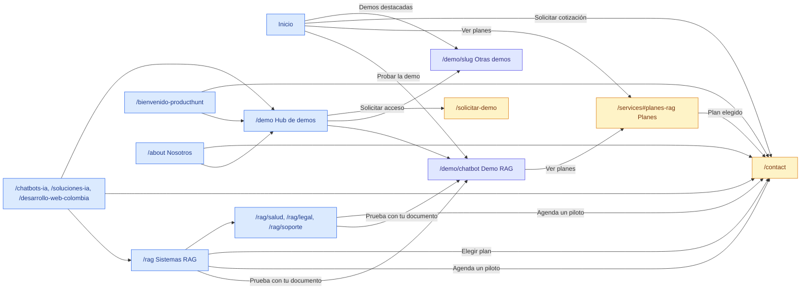

*Mapa de botones principales de las páginas públicas. El menú y el pie de página enlazan además a todas las secciones.*

| Ruta | Para qué sirve | Título SEO real (`<title>`) | ¿Indexable? |
|---|---|---|---|
| `/` | Puerta de entrada con el mensaje RAG | KopTup \| IA que responde con los documentos de tu empresa | Sí |
| `/rag` | Página principal de sistemas RAG | Sistemas RAG para empresas en Colombia \| KopTup | Sí |
| `/rag/salud` | Landing de RAG para salud | RAG para salud: protocolos, normativa y auditoría \| KopTup | Sí |
| `/rag/legal` | Landing de RAG para áreas legales | Buscar en contratos con IA: RAG para áreas legales \| KopTup | Sí |
| `/rag/soporte` | Landing de RAG para soporte y manuales | Asistente IA para manuales internos y soporte \| KopTup | Sí |
| `/services` | Planes RAG y catálogo "Otras soluciones a medida" | Precios de sistemas RAG y software a medida \| KopTup | Sí |
| `/pricing` | Redirección | (redirige a `/services#planes-rag`) | — |
| `/demo` | Hub con las demos y su modo de acceso | Prototipos Interactivos: Prueba Antes de Contratar \| KopTup | Sí |
| `/solicitar-demo` | Formulario para pedir demos | Solicitar una demo guiada \| KopTup | Sí |
| `/contact` | Formulario de contacto y cotización | Contacto: Solicita tu Cotización Gratis \| KopTup | Sí |
| `/about` | Quiénes somos | Sobre Nosotros: Empresa de Software en Bogotá \| KopTup | Sí |
| `/chatbots-ia` | Landing SEO de chatbots RAG | Chatbots RAG para WhatsApp y web \| KopTup | Sí |
| `/soluciones-ia` | Landing SEO de soluciones de IA | Soluciones de Inteligencia Artificial para Empresas \| KopTup | Sí |
| `/desarrollo-web-colombia` | Landing SEO de desarrollo a medida | Desarrollo Web y Software a Medida en Colombia \| KopTup | Sí |
| `/bienvenido-producthunt` | Bienvenida a quien llega desde Product Hunt | Product Hunt: Software a Medida con Demos \| KopTup | **No** (`noindex, follow`) |
| `/privacy` | Política de privacidad | Política de Privacidad \| KopTup | Sí |
| `/terms` | Términos y condiciones | Términos y Condiciones \| KopTup | Sí |
| `/cookies` | Política de cookies y preferencias | Política de Cookies \| KopTup | Sí |
| (cualquier ruta inexistente) | Error 404 | IA que responde con los documentos de tu empresa \| KopTup | No (`noindex`) |

Los títulos se tomaron de la página renderizada. El detalle de descripciones, `canonical`, JSON-LD y sitemap está en [SEO, analítica y legal](Doc-12-SEO-Analitica-y-Legal.md).

---

## 2. Elementos comunes: menú, pie de página, idioma, tema y cookies

Todas las páginas públicas comparten el **menú superior** y el **pie de página** (los pinta `ConditionalLayout`; el portal `/dashboard` y el panel `/admin` usan los suyos).

### 2.1 Menú superior (escritorio)

*Menú de escritorio para un visitante sin sesión.*

1. **Logo KopTup:** vuelve al inicio.
2. **Menú principal:** Inicio, RAG, Planes y servicios (`/services`), Demos (`/demo`), Nosotros (`/about`) y Contacto. La sección actual se resalta en azul.
3. **Idioma (ES/EN):** cambia entre español e inglés. Ver [Flujos del visitante › Idioma y modo oscuro](Doc-04-Flujos-del-Visitante.md#7-flujo-6-idioma-esen-y-modo-oscuro).
4. **Tema:** alterna claro y oscuro (luna/sol).
5. **Solicitar demo:** abre `/solicitar-demo`.
6. **Iniciar sesión:** abre `/login`.
7. **Quiero esto:** lleva a los planes (`/services#planes-rag`).

Con sesión iniciada, los botones 5–7 se reemplazan por el **menú de la cuenta** (avatar con el nombre). Sus opciones dependen del rol y se explican en [Flujos del prospecto y cliente](Doc-05-Flujos-del-Prospecto-y-Cliente.md).

### 2.2 Menú en el celular

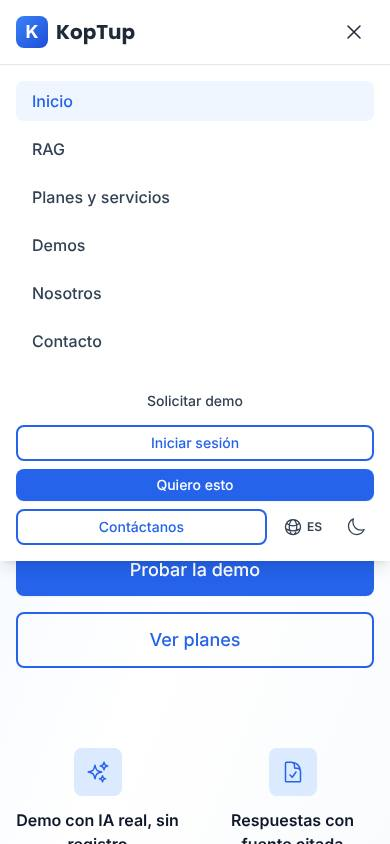

*En el celular el menú se abre con el ícono de tres rayas: enlaces, Solicitar demo, Iniciar sesión, Quiero esto, Contáctanos, idioma y tema.*

### 2.3 Pie de página

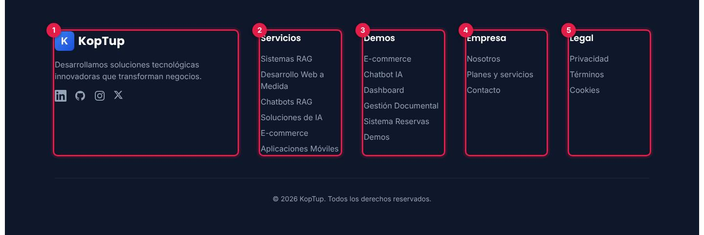

*El pie de página es igual en todas las páginas públicas.*

1. **Marca y redes:** descripción corta y enlaces a LinkedIn, GitHub, Instagram y X.
2. **Servicios:** Sistemas RAG (`/rag`), Desarrollo Web a Medida (`/desarrollo-web-colombia`), Chatbots RAG (`/chatbots-ia`), Soluciones de IA (`/soluciones-ia`), E-commerce y Aplicaciones Móviles (ambos a `/services#otras-soluciones`).
3. **Demos:** E-commerce, Chatbot IA, Dashboard, Gestión Documental, Sistema Reservas y el hub (`/demo`).
4. **Empresa:** Nosotros, Planes y servicios, Contacto.
5. **Legal:** Privacidad, Términos, Cookies.

### 2.4 Selector de idioma y tema

- **Idioma:** el botón ES/EN guarda la cookie `locale` (1 año) y **recarga la página** en el otro idioma. No hay rutas `/es` ni `/en`: la misma URL sirve los dos idiomas.
- **Tema:** el botón de luna/sol cambia a modo oscuro o claro y lo recuerda en el navegador. Por defecto el sitio abre en tema claro.

El paso a paso con capturas en inglés y en modo oscuro está en [Flujos del visitante › Flujo 6](Doc-04-Flujos-del-Visitante.md#7-flujo-6-idioma-esen-y-modo-oscuro).

### 2.5 Banner de cookies

El banner aparece abajo en la primera visita **solo si el sitio tiene configurada al menos una etiqueta de medición** (Google Analytics 4, Google Ads o LinkedIn). Al revisar `www.koptup.com` el 9 de octubre de 2026 el banner **no aparecía**: el sitio publicado no tiene ninguna etiqueta configurada, así que tampoco se está midiendo nada. Cómo se ve cuando sí, y qué hacen "Aceptar", "Rechazar" y `/cookies`, está en [Flujos del visitante › Flujo 5](Doc-04-Flujos-del-Visitante.md#6-flujo-5-cookies-y-analítica).

### 2.6 Cierre común de las demos

Todas las páginas bajo `/demo` (el hub y cada demo) terminan con el mismo bloque:

*"¿Te gustaría algo así para tu negocio?" con tres botones.*

| Botón | Lleva a |
|---|---|
| Solicitar demo guiada | `/solicitar-demo?demos=<demo actual>` (la demo queda elegida) |
| Solicitar Cotización | `/contact` |
| Ver Planes y Precios | `/services#planes-rag` |

---

## 3. Inicio (`/`)

*Primera pantalla del inicio a 1440 × 900.*

**Propósito:** presentar a KopTup como proveedor de **sistemas RAG** (IA que responde con los documentos de la empresa y cita la fuente) y llevar al visitante a probar la demo o a ver los planes. Debajo muestra el resto de lo que KopTup construye.

### Bloques en orden

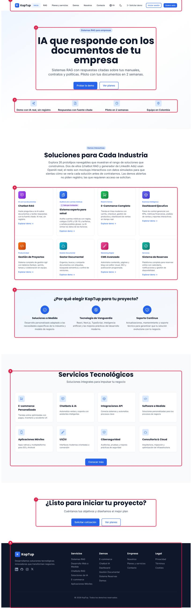

*Página completa del inicio con sus bloques numerados.*

| # | Bloque | Qué muestra y para qué sirve |
|---|---|---|
| 1 | Menú | Ver [§2.1](#21-menú-superior-escritorio). |
| 2 | Hero | Etiqueta "Sistemas RAG para empresas", título **"IA que responde con los documentos de tu empresa"**, subtítulo ("Piloto con tus documentos en 2 semanas") y los dos botones principales. |
| 3 | Datos verificables | Cuatro frases que KopTup puede respaldar: "Demo con IA real, sin registro", "Respuestas con fuente citada", "Piloto en 2 semanas" y "Equipo en Colombia". No hay cifras de clientes ni calificaciones. |
| 4 | Soluciones para Cada Industria | Ocho demos destacadas (Chatbot RAG, Sistema experto para salud, E-Commerce, Dashboard Ejecutivo, Gestión de Proyectos, Gestor Documental, CMS Avanzado y Sistema de Reservas). Cada tarjeta abre su demo; si la demo no es abierta, muestra su etiqueta (por ejemplo, **Solo por invitación** en Sistema experto para salud). |
| 5 | ¿Por qué elegir KopTup? | Tres beneficios: soluciones a medida, tecnología de vanguardia y soporte continuo. Sin enlaces. |
| 6 | Servicios Tecnológicos | Ocho servicios (e-commerce, chatbots e IA, integraciones API, software a medida, apps móviles, UX/UI, ciberseguridad, consultoría y nube) y el botón **Conocer más**. |
| 7 | Cierre | "¿Listo para iniciar tu proyecto?" con dos botones. |
| 8 | Pie de página | Ver [§2.3](#23-pie-de-página). |

### Llamados a la acción

| Botón o enlace | Bloque | Lleva a |
|---|---|---|
| **Probar la demo** | Hero | `/demo/chatbot` (demo RAG, modo "Prueba el asistente") |
| **Ver planes** | Hero y cierre | `/services#planes-rag` |
| Tarjetas de demos | Soluciones para Cada Industria | `/demo/<demo>` |
| Chatbots & IA | Servicios Tecnológicos | `/services#planes-rag` |
| Las otras 7 tarjetas de servicios | Servicios Tecnológicos | `/services#otras-soluciones` |
| Conocer más | Servicios Tecnológicos | `/services` |
| **Solicitar cotización** | Cierre | `/contact` |

**SEO:** título absoluto *KopTup \| IA que responde con los documentos de tu empresa* (la marca va primero solo aquí). Lleva datos estructurados de organización, sitio web, aplicación, negocio local y preguntas frecuentes.

### En el celular

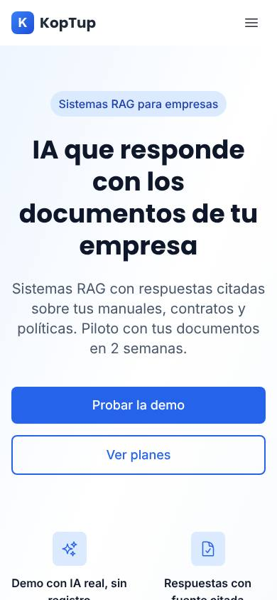

*El hero ocupa la pantalla y los botones se apilan a lo ancho.*

---

## 4. Sistemas RAG (`/rag`)

*Primera pantalla de `/rag`.*

**Propósito:** explicar en lenguaje simple qué es un sistema RAG, cómo funciona, cómo protege los datos y cuánto cuesta, y convertir con dos acciones: **probar la demo** o **agendar un piloto**. Es la página de destino de los anuncios.

### Bloques en orden

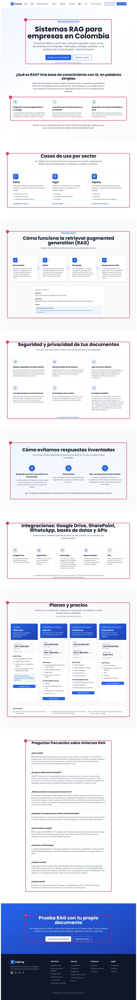

*Página completa de `/rag` con sus diez bloques numerados.*

| # | Bloque (ancla) | Qué muestra |
|---|---|---|
| 1 | Hero (`#que-es-rag`) | Etiqueta "Base de conocimiento con IA", título **"Sistemas RAG para empresas en Colombia"**, definición en una frase, botones y la nota "Piloto con tus documentos en 2 semanas". |
| 2 | ¿Qué es RAG? | Tres tarjetas: preguntas como a un colega, la IA busca en tus documentos (no en internet) y responde citando. Cierra con una analogía. |
| 3 | Casos de uso por sector (`#casos`) | Tarjetas de **Salud**, **Legal** y **Soporte**, cada una con sus casos y un enlace a su landing. |
| 4 | Cómo funciona (`#como-funciona`) | Diagrama de cuatro pasos (documentos → índice → búsqueda → respuesta con cita) y un **ejemplo de respuesta con su fuente**. |
| 5 | Seguridad y privacidad (`#seguridad`) | Seis tarjetas: dónde se guardan los documentos, qué proveedor de IA se usa, qué se envía, que no se entrena con tus datos, control de acceso y qué pasa en la demo. Enlace a `/privacy`. |
| 6 | Cómo evitamos respuestas inventadas (`#sin-respuestas-inventadas`) | Tres reglas (responde solo con tus documentos, cita la fuente, dice "no encontré esa información") y la medición con un informe de 50 preguntas en el piloto. |
| 7 | Integraciones (`#integraciones`) | Google Drive, SharePoint, WhatsApp, bases de datos y APIs, con una nota sobre qué incluye cada plan. |
| 8 | Planes y precios (`#planes-rag`) | La **misma tabla de planes** de `/services` (ver [§6.1](#61-planes-rag-servicesplanes-rag)). |
| 9 | Preguntas frecuentes (`#preguntas-frecuentes`) | Ocho preguntas: qué es RAG, diferencia con ChatGPT, si se entrena con tus datos, qué pasa si no encuentra la respuesta, formatos, WhatsApp, costo y tiempo. Los precios y plazos salen de la misma fuente que la tabla de planes. |
| 10 | Cierre | "Prueba RAG con tu propio documento" con los dos botones. |

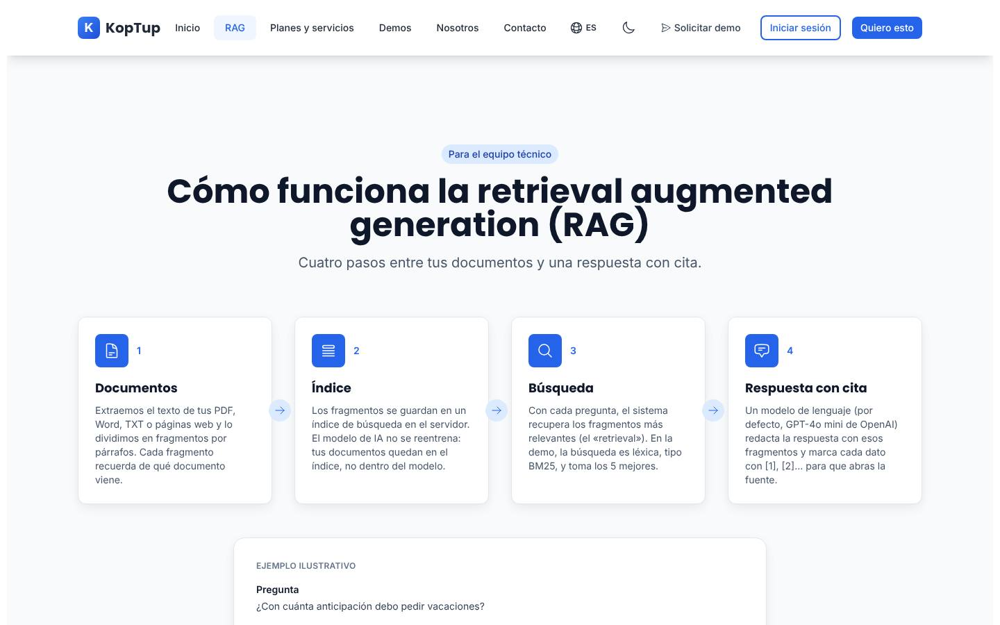

*Bloque 4: el diagrama de los cuatro pasos y el ejemplo de pregunta, respuesta y fuente.*

### Llamados a la acción

| Botón o enlace | Lleva a |
|---|---|
| **Prueba con tu documento** (hero y cierre) | `/demo/chatbot` (abre en el modo "Prueba el asistente"; la pestaña "Prueba con tu documento" está a un clic) |
| **Agenda un piloto** (hero y cierre) | `/contact` |
| Ver RAG para salud / legal / soporte | `/rag/salud`, `/rag/legal`, `/rag/soporte` |
| Lee nuestra política de privacidad | `/privacy` |
| Agenda tu piloto · Elegir Esencial · Elegir Profesional · Cotizar Empresarial | `/contact?service=sistema-rag&plan=<plan>` (con el plan preseleccionado) |

**SEO:** *Sistemas RAG para empresas en Colombia \| KopTup*. Lleva datos estructurados de servicio (cada plan como oferta con su precio), preguntas frecuentes (las mismas 8 de la página) y migas de pan.

### En el celular

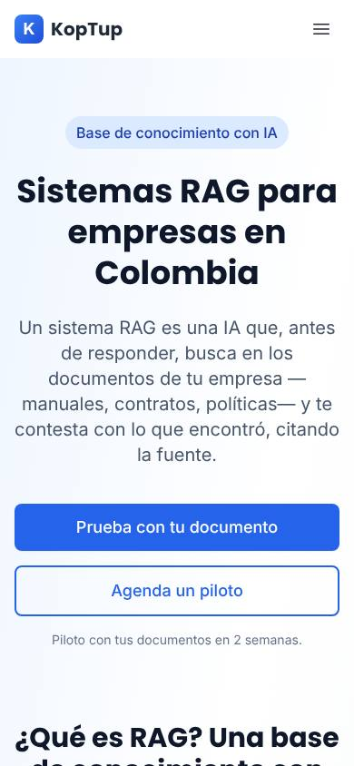

*En el celular los bloques se apilan en una columna.*

---

## 5. Landings por sector (`/rag/salud`, `/rag/legal`, `/rag/soporte`)

Son tres páginas cortas con la misma estructura. Sirven para los anuncios y búsquedas de cada sector y llevan de vuelta a `/rag` para el detalle.

*`/rag/salud` completa: es la única de las tres con enlace a una demo.*

| # | Bloque | Qué muestra |
|---|---|---|
| 1 | Hero | Etiqueta del sector, título y subtítulo. |
| 2 | Casos de uso | Tres casos numerados. En salud y legal termina con una **nota de responsabilidad** ("las decisiones clínicas / la interpretación jurídica siguen en manos de tus profesionales"). |
| 3 | Enlace a una demo (solo salud) | En el caso "Auditoría de cuentas médicas": "Ver la demo «Sistema experto para salud»", con la etiqueta **Solo por invitación** que trae el catálogo. |
| 4 | ¿Cómo funciona un sistema RAG? | Enlace **Ver sistemas RAG para empresas** → `/rag`. |
| 5 | Cierre | "Pruébalo con tus documentos": **Prueba con tu documento** → `/demo/chatbot` y **Agenda un piloto** → `/contact`. |

| Landing | Casos de uso | Título SEO real |
|---|---|---|
| `/rag/salud` | Protocolos clínicos · Normativa del sector · Auditoría de cuentas médicas | RAG para salud: protocolos, normativa y auditoría \| KopTup |
| `/rag/legal` | Contratos · Conceptos jurídicos internos · Normativa | Buscar en contratos con IA: RAG para áreas legales \| KopTup |
| `/rag/soporte` | Manuales · Políticas · Base de conocimiento para agentes | Asistente IA para manuales internos y soporte \| KopTup |

*Primera pantalla de `/rag/legal`.*

*Primera pantalla de `/rag/soporte`.*

---

## 6. Servicios y planes (`/services`)

**Propósito:** mostrar **los precios**. Arriba están los cuatro planes de sistemas RAG (el producto principal) y debajo el catálogo **"Otras soluciones a medida"**, con la opción de comprar el software o pagar una suscripción mensual. La antigua `/pricing` redirige aquí (`/services#planes-rag`).

**SEO:** *Precios de sistemas RAG y software a medida \| KopTup*, con datos estructurados de servicio profesional, de los planes RAG y migas de pan.

### 6.1 Planes RAG (`/services#planes-rag`)

*Encabezado y tarjetas de los cuatro planes.*

1. **Título** "Planes y precios de sistemas RAG" con la nota "Precios en COP y USD, más IVA si aplica".
2. **Encabezado de cada plan:** duración o tiempo de implementación, nombre y frase corta.
3. **Precio:** setup (o pago único en el piloto) y mensualidad, en COP con su equivalente fijo en USD.
4. **Qué incluye** y, en los planes con mensualidad, **La mensualidad incluye**.

| Plan | Tiempo | Pago inicial | Mensualidad | Incluye (resumen) |
|---|---|---|---|---|
| **Piloto RAG** | 2 semanas | COP 3.900.000 (USD 1.200), pago único | — | 1 fuente, hasta 100 documentos, interfaz web con respuestas citadas, informe de precisión con 50 preguntas. Si contratas un plan en los 30 días siguientes, se descuenta el 100 % del piloto del setup. |
| **Esencial** | 3–4 semanas | COP 9.900.000 (USD 2.990) | COP 1.490.000 (USD 450) | 1 fuente (Drive, SharePoint o carga manual), hasta 1.000 documentos, widget web. Mensualidad: hosting, IA hasta 3.000 preguntas al mes, actualización de documentos, soporte lunes a viernes. |
| **Profesional** | 6–8 semanas | COP 24.900.000 (USD 7.490) | COP 2.990.000 (USD 890) | Hasta 3 fuentes y 10.000 documentos, web y WhatsApp, permisos por rol, panel de métricas. Mensualidad: hasta 15.000 preguntas al mes, soporte prioritario, revisión mensual de calidad. |
| **Empresarial** | 10–14 semanas | Desde COP 59.900.000 (USD 17.900) | Según SLA | Fuentes ilimitadas, despliegue en tu nube u on-premise, SSO, auditoría, código fuente incluido. |

*Precios tal como están en el código de `main` (`apps/web/src/lib/rag-plans.ts`); los USD son fijos, no se convierten con la TRM.*

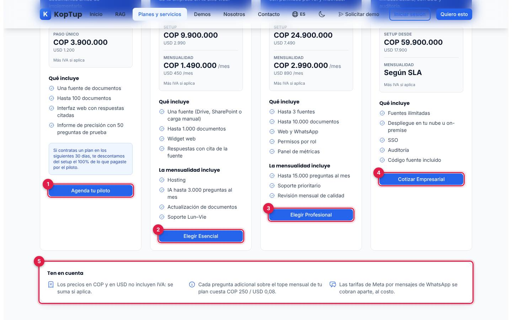

*Parte baja de las tarjetas: botón de cada plan y el recuadro "Ten en cuenta".*

1. **Agenda tu piloto** → `/contact?service=sistema-rag&plan=piloto`
2. **Elegir Esencial** → `/contact?service=sistema-rag&plan=esencial`
3. **Elegir Profesional** → `/contact?service=sistema-rag&plan=profesional`
4. **Cotizar Empresarial** → `/contact?service=sistema-rag&plan=empresarial`
5. **Ten en cuenta:** los precios no incluyen IVA; cada pregunta adicional sobre el tope mensual cuesta COP 250 (USD 0,08); las tarifas de Meta por mensajes de WhatsApp se cobran aparte, al costo.

Cada clic en un botón de plan registra el evento `plan_click` (solo si el visitante aceptó cookies y hay etiqueta configurada). El formulario de contacto llega con el plan preseleccionado: ver [Flujos del visitante › Flujo 1](Doc-04-Flujos-del-Visitante.md#2-flujo-1-embudo-rag-de-la-demo-al-plan).

### 6.2 Otras soluciones a medida (`/services#otras-soluciones`)

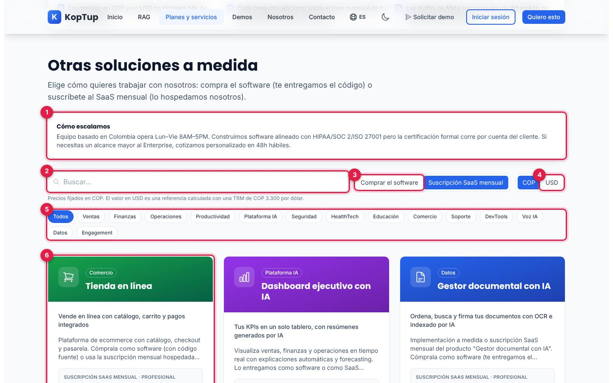

*Encabezado y controles del catálogo.*

1. **Cómo escalamos:** horario del equipo (lunes a viernes), alcance de cumplimiento (alineado con normas, sin certificación propia) y cotización personalizada para alcances mayores.
2. **Buscador** por nombre o categoría.
3. **Modalidad:** "Comprar el software" (setup + mantenimiento opcional; te entregan el código) o "Suscripción SaaS mensual" (lo hospeda KopTup). Viene marcada la suscripción.
4. **Moneda:** COP o USD. Debajo, la nota "Precios fijados en COP. El valor en USD es una referencia calculada con una TRM de COP 3.300 por dólar".
5. **Filtros por categoría:** Todos, Ventas, Finanzas, Operaciones, Productividad, Plataforma IA, Seguridad, HealthTech, Educación, Comercio, Soporte, DevTools, Voz IA, Datos y Engagement.
6. **Tarjeta de solución:** categoría, nombre, frase, descripción y el precio "Desde" del nivel Profesional (setup único y mensualidad). Botones **Ver más detalles** (abre el detalle) y **Probar demo** (con la etiqueta "Requiere acceso" o "Solo por invitación" si aplica).

El catálogo muestra **26 soluciones**. El chatbot RAG no aparece aquí porque lo reemplazan los planes RAG de arriba. Al final hay un bloque "¿No sabes cuál elegir?" con el botón **Hablar con un experto** → `/contact`.

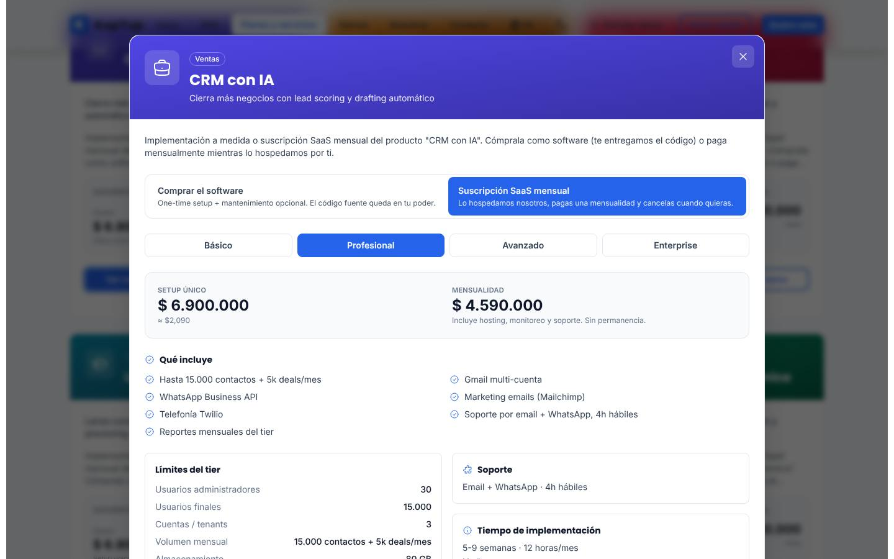

*Detalle de "CRM con IA": modalidad, nivel, precios, qué incluye y límites.*

El detalle permite cambiar la **modalidad** y el **nivel** (Básico, Profesional, Avanzado, Enterprise) y muestra el setup único, la mensualidad o el mantenimiento, qué incluye, los límites del nivel (usuarios, cuentas, volumen, almacenamiento), el soporte, el tiempo de implementación y los **costos que paga el cliente directamente** (nube, APIs). Termina con **Cotizar este tier** → `/contact?service=<solución>&tier=<nivel>&modality=<modalidad>` y **Probar demo** → `/demo/<demo>`.

Así llega hoy a `/contact` quien pulsa **Cotizar este tier** en "CRM con IA", nivel Profesional, modalidad SaaS:

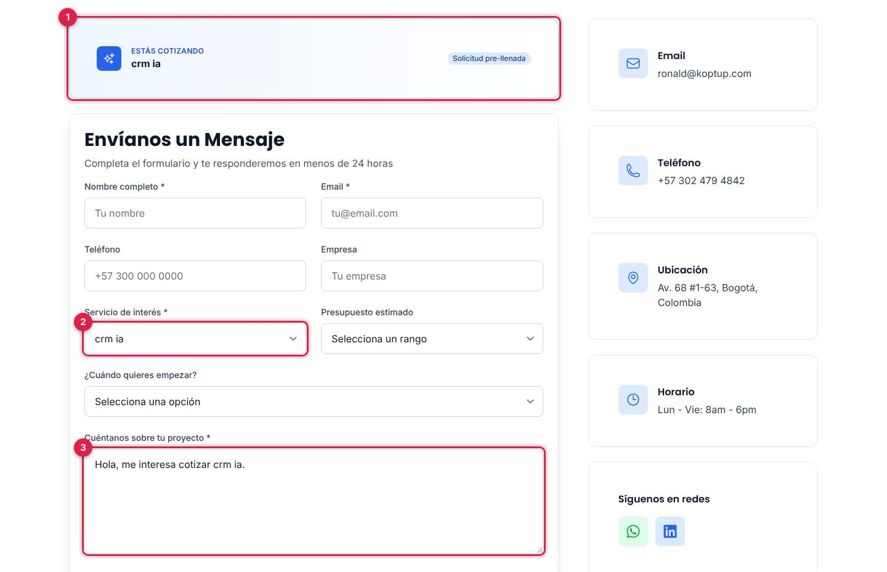

*(1) el banner muestra el identificador "crm ia"; (2) el servicio y (3) el mensaje tampoco mencionan el nivel ni la modalidad (ver [limitación 1](#16-limitaciones-conocidas)).*

> Las cifras de "Otras soluciones" salen de `apps/web/src/lib/services-catalog.ts`. Son precios de referencia del catálogo; el plan comercial de cada solución está en las páginas `Producto-*` de la wiki.

### En el celular

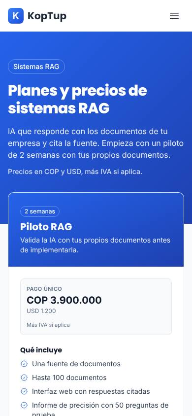

*En el celular las tarjetas de planes se ven una debajo de otra.*

---

## 7. Hub de demos (`/demo`)

*Encabezado del hub.*

**Propósito:** reunir todas las demos y decir, para cada una, **cómo se abre**: abierta, con solicitud o solo por invitación. El modo real lo decide el catálogo del panel (Admin › Catálogo de demos); mientras carga se usa la tabla de respaldo del código.

1. **Título** "Prueba Nuestras Soluciones" y subtítulo (dos demos usan IA real; las demás son prototipos con datos simulados).
2. **Leyenda de etiquetas:** **Abierta** (verde), **Requiere acceso** (ámbar) y **Solo por invitación** (morado).
3. **Solicitar demo** → `/solicitar-demo`.

### Las tarjetas

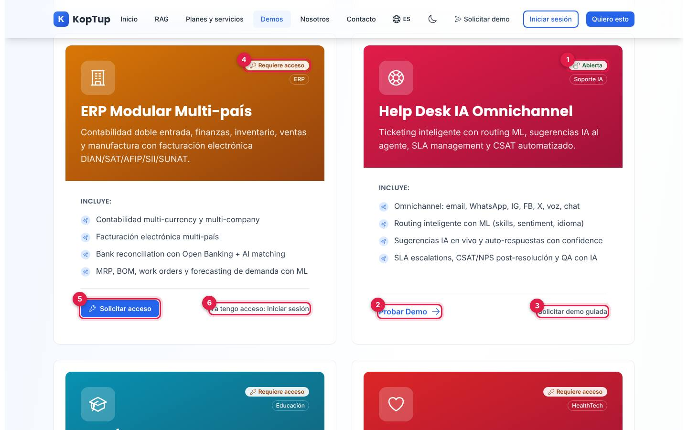

*Una demo con solicitud (ERP, izquierda) junto a una abierta (Help Desk IA, derecha).*

1. Etiqueta **Abierta**.
2. **Probar Demo** → abre la demo sin registro.
3. **Solicitar demo guiada** → `/solicitar-demo?demos=<demo>` (para que el equipo la muestre en vivo).
4. Etiqueta **Requiere acceso**.
5. **Solicitar acceso** → `/solicitar-demo?demos=<demo>` con la demo ya elegida.
6. **Ya tengo acceso: iniciar sesión** → `/login?redirect=/demo/<demo>` (al entrar vuelve a la demo).

Hay **26 tarjetas**. Con la configuración de fábrica, 18 son abiertas y 8 requieren acceso (ERP, LMS, Telemedicina, WMS, HRMS, Voice AI, App de Delivery y Generador LinkedIn); el administrador puede cambiar cualquiera.

| Situación de la demo | Botón principal | Botón o texto secundario |
|---|---|---|
| Abierta | Probar Demo | Solicitar demo guiada |
| Requiere acceso, visitante sin sesión | Solicitar acceso | Ya tengo acceso: iniciar sesión |
| Requiere acceso, con sesión pero sin acceso | Solicitar acceso | Ver detalles |
| Solo por invitación | Solicitar demo personalizada | Ya tengo acceso: iniciar sesión |
| Con acceso vigente (prospecto) | Abrir demo | "Te quedan N días" |
| Desactivada desde el panel | Solicitar demo guiada | "En mantenimiento" |
| Equipo de KopTup (admin, manager, sales) | Abre todas | — |

### Más demos y cierre

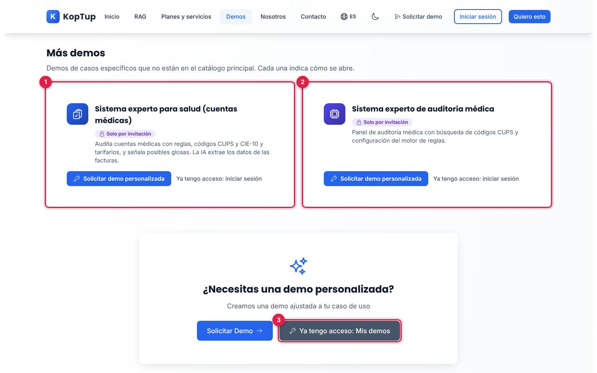

*"Más demos": las dos que solo se abren por invitación.*

1. **Sistema experto para salud (cuentas médicas)** y 2. **Sistema experto de auditoría médica:** demos por invitación, fuera del catálogo principal, con **Solicitar demo personalizada** y **Ya tengo acceso: iniciar sesión**.
3. **Ya tengo acceso: Mis demos** → `/dashboard/demos` (pide iniciar sesión).

Debajo está el cierre común de las demos ([§2.6](#26-cierre-común-de-las-demos)).

**SEO:** *Prototipos Interactivos: Prueba Antes de Contratar \| KopTup*. Las demos con acceso restringido no se listan en el sitemap y su pantalla de acceso es `noindex`.

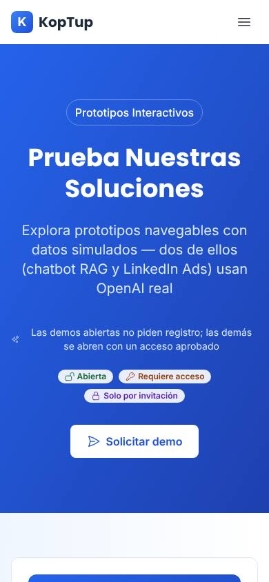

*El hub en el celular, con la leyenda de etiquetas visible.*

Qué ve el visitante al abrir una demo con acceso restringido: [Flujos del visitante › Flujo 4](Doc-04-Flujos-del-Visitante.md#5-flujo-4-demo-bloqueada). Cómo es cada demo por dentro: [Guía de demos](Doc-07-Guia-de-Demos.md).

---

## 8. Solicitar demo (`/solicitar-demo`)

*Formulario "Solicitar demo" con la columna "Qué pasa después".*

**Propósito:** que una persona pida una o varias demos (las que requieren acceso, las abiertas para verlas guiadas, o una por invitación) y deje sus datos con la **autorización de tratamiento de datos (Ley 1581 de 2012)**.

| Bloque | Qué contiene |
|---|---|
| Migas y título | Inicio › Solicitar demo, título y explicación ("si la aprobamos, te enviamos un enlace para entrar"). |
| 1. Demos que te interesan | Botones de selección (máximo 10). Primero las que llegan elegidas por la URL (`?demos=erp`), luego las que requieren acceso y después las abiertas. Las de invitación solo aparecen si llegan elegidas. |
| 2. Tus datos y tu caso | Nombre*, Empresa*, Cargo, Email*, Teléfono o WhatsApp, País*, Tamaño de la empresa* (1-10 a 1000+) y Caso de uso* (10 a 2.000 caracteres, con aviso de no incluir datos de pacientes ni confidenciales). |
| Autorización | Casilla obligatoria con enlace a la política de tratamiento de datos (`/privacy`). |
| Enviar solicitud | Envía a la API; muestra la confirmación con un **código** `DR-AAAA-XXXXXX`. |
| Qué pasa después | Tres pasos (revisión en horario hábil, enlace de acceso, Mis demos) y **Escribir por WhatsApp** con el mensaje ya escrito. |
| Privacidad | "Usamos tus datos solo para gestionar esta solicitud…" |

**SEO:** *Solicitar una demo guiada \| KopTup*. El paso a paso, los errores y la confirmación están en [Flujos del visitante › Flujo 2](Doc-04-Flujos-del-Visitante.md#3-flujo-2-solicitar-acceso-a-una-demo).

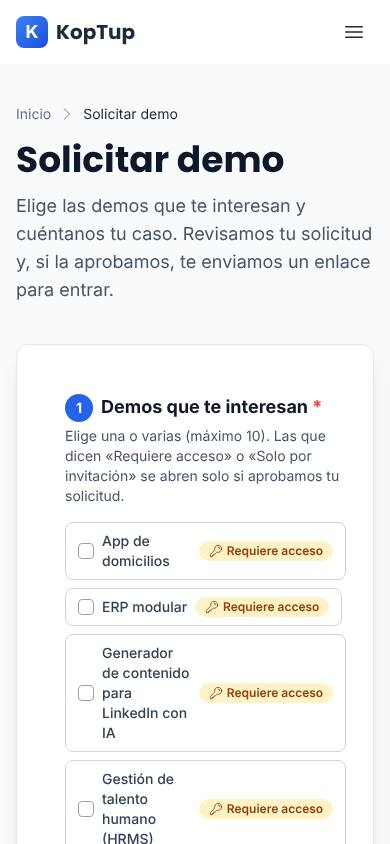

*En el celular la columna "Qué pasa después" queda debajo del formulario.*

---

## 9. Contacto (`/contact`)

*Encabezado de `/contact`: "Hablemos de tu proyecto".*

**Propósito:** recibir cotizaciones y preguntas generales. Es el destino de "Agenda un piloto", de los botones de los planes y de "Solicitar cotización".

| # | Bloque | Qué contiene |
|---|---|---|
| 1 | Hero | "Hablemos de tu proyecto" y "Listos para convertir tu visión en realidad. Agenda una consulta gratuita". |
| 2 | Banner "Estás cotizando" | Solo si se llega con `?service=`: muestra el servicio y el plan (por ejemplo "Sistema RAG — Plan Esencial") y la etiqueta "Solicitud pre-llenada". |
| 3 | Formulario "Envíanos un Mensaje" | Nombre*, Email*, Teléfono, Empresa, Servicio de interés* (Sistema RAG, E-Commerce, Chatbot con IA, Desarrollo Web, Desarrollo Móvil, Integraciones API, Diseño UX/UI, Consultoría, Otro), Presupuesto estimado (5 rangos), ¿Cuándo quieres empezar? (4 opciones), Cuéntanos sobre tu proyecto* y **Enviar mensaje**. |
| 4 | Datos de contacto | Email, teléfono, ubicación en Bogotá (abre Google Maps) y horario (lunes a viernes, 8 a. m. a 6 p. m.). |
| 5 | Síguenos en redes | WhatsApp y LinkedIn. |
| 6 | Agendar Llamada | "Agenda una consulta gratuita de 30 minutos": **Agendar ahora** abre el programa de correo con un mensaje ya escrito. |
| 7 | Preguntas Frecuentes | Tiempo de respuesta, garantía y trabajo con startups. |
| 8 | Mapa | Mapa de Google embebido con la ubicación. |

**A dónde llega el mensaje:** se guarda como contacto (origen `contact-form`), avisa al equipo por correo y WhatsApp si están configurados, y aparece en **Admin › Contactos**. Paso a paso en [Flujos del visitante › Flujo 3](Doc-04-Flujos-del-Visitante.md#4-flujo-3-formulario-de-contacto).

**SEO:** *Contacto: Solicita tu Cotización Gratis \| KopTup*.

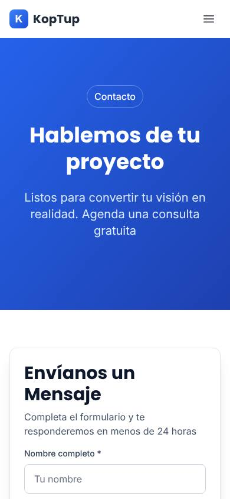

*En el celular el formulario va primero y los datos de contacto debajo.*

---

## 10. Nosotros (`/about`)

*Hero de `/about` con foto de fondo y cuatro cifras.*

**Propósito:** presentar al equipo y su forma de trabajar, con datos verificables (cuántas demos tienen IA real y cuántas son prototipos).

| # | Bloque | Qué muestra |
|---|---|---|
| 1 | Hero | "Estudio de desarrollo a medida en Bogotá", botones **Ver las 26 demos** (`/demo`) y **Hablar con nosotros** (`/contact`), y cuatro cifras (años construyendo software, apps con IA real, prototipos, tecnologías). |
| 2 | Koptup en números | Cinco tarjetas: 2 apps reales con IA, 24 prototipos navegables, ~25 tecnologías core, año de fundación 2026 y base en Bogotá. |
| 3 | ¿Quiénes somos? | "Un equipo técnico, no una agencia". |
| 4 | Equipo | Quién está detrás de la empresa. |
| 5 | Línea de tiempo | "De idea a plataforma". |
| 6 | Tecnologías que dominamos | Tres niveles: stack diario, familiaridad y conceptos sólidos. |
| 7 | Capacidades de IA en producción | Qué IA está funcionando hoy. |
| 8 | Verticales | Sectores con experiencia. |
| 9 | Metodología y herramientas | "Metodología probada en 8+ años" y "Cómo nos coordinamos con el cliente". |
| 10 | Proyectos entregados | Casos reales. |
| 11 | Cierre | "¿Empezamos?" con **Ver las 26 demos** y **Hablar con nosotros**. |

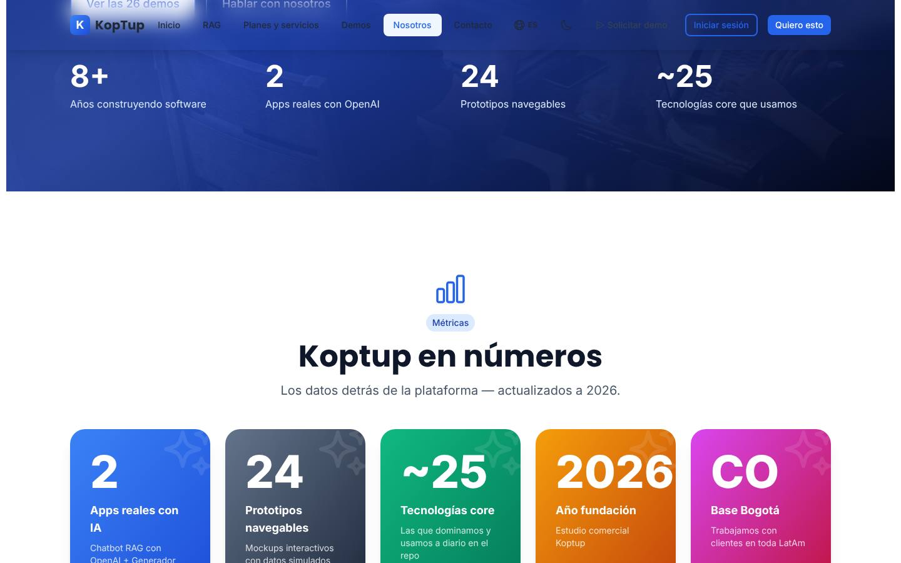

*"Koptup en números": las cifras de demos salen de la misma lista que el hub, así que no se desactualizan.*

**SEO:** *Sobre Nosotros: Empresa de Software en Bogotá \| KopTup*. La página está escrita solo en español (ver [Limitaciones](#16-limitaciones-conocidas)).

---

## 11. Landings SEO: `/chatbots-ia`, `/soluciones-ia` y `/desarrollo-web-colombia`

Tres páginas pensadas para búsquedas en Google. Las tres llevan migas de pan, preguntas frecuentes con datos estructurados y un cierre con botones.

### `/chatbots-ia`

*"Chatbots RAG para WhatsApp y web", con el precio desde el que arranca.*

| Bloque | Contenido |
|---|---|
| Hero | Título, explicación (responde con los documentos de la empresa y cita la fuente, en web y WhatsApp), **Probar la demo** (`/demo/chatbot`), **Agenda un piloto** (`/contact?service=sistema-rag&plan=piloto`), precio "Desde COP 9.900.000, o piloto de COP 3.900.000" y enlace a `/rag`. |
| Datos verificables | Las mismas cuatro frases del inicio. |
| Qué hace un chatbot RAG | "Un chatbot que responde con tus documentos, no de memoria". |
| Canales | Sitio web y WhatsApp. |
| Casos de uso | Soporte, salud y legal, con enlace a cada landing por sector. |
| Proceso | "¿Cómo implementamos tu chatbot?", con plazos alineados con los planes. |
| Preguntas frecuentes | Mismo texto que el JSON-LD. |
| Cierre | Probar la demo, Agenda un piloto y **Ver planes y precios** (`/services#planes-rag`). |

**SEO:** *Chatbots RAG para WhatsApp y web \| KopTup*.

### `/soluciones-ia`

*"Soluciones de IA para Transformar tu Empresa".*

Hero con **Ver Demos de IA** (`/demo`), **Hablar con un Experto** (`/contact`) y el aviso "¿Necesitas una IA que responda con los documentos de tu empresa? Conoce los sistemas RAG" (`/rag`); cuadrícula de soluciones con los **sistemas RAG primero** (enlaces a `/rag` y `/chatbots-ia`); por qué adoptar IA; tecnologías de IA; preguntas frecuentes; cierre con **Agendar Consultoría Gratis** (`/contact`) y **Ver Demos de IA**.

**SEO:** *Soluciones de Inteligencia Artificial para Empresas \| KopTup*.

### `/desarrollo-web-colombia`

*"Empresa de Desarrollo Web y Software a Medida en Colombia".*

Hero con alcance geográfico, **Solicitar Cotización Gratis** (`/contact`) y **Ver Demos** (`/demo`); datos verificables; qué se puede desarrollar; por qué KopTup; cómo trabajan; tecnologías; preguntas frecuentes; cierre con **Solicitar Cotización Gratis** (`/contact`) y un segundo botón **Solicitar cotización** que lleva a `/services#planes-rag`.

**SEO:** *Desarrollo Web y Software a Medida en Colombia \| KopTup*.

---

## 12. Bienvenida de Product Hunt (`/bienvenido-producthunt`)

*Página para quien llega desde Product Hunt, en los colores de esa plataforma.*

**Propósito:** recibir el tráfico de Product Hunt con una **oferta**: mencionar "PRODUCTHUNT" en el mensaje da 15 % de descuento en el primer proyecto ("Válido por 30 días desde el lanzamiento. Solo para nuevos clientes").

Bloques: bienvenida con la oferta y botones **Probar Demos Gratis →** (`/demo`) y **Solicitar Cotización** (`/contact`); "¿Qué es KopTup?"; cuatro demos destacadas (chatbot, e-commerce, dashboard, control de proyectos) y **Ver todas las demos (26 en total)**; datos verificables; cierre con **Hablar con el equipo** (`/contact`) y **Ver precios** (`/services#planes-rag`).

**SEO:** *Product Hunt: Software a Medida con Demos \| KopTup*, con `noindex, follow`: no aparece en Google; solo se llega por el enlace directo. Está escrita solo en español.

---

## 13. Páginas legales (`/privacy`, `/terms`, `/cookies`)

Las tres tienen un encabezado azul con la fecha de actualización, secciones numeradas en tarjetas y una nota final. Su contenido legal (Ley 1581 de 2012, cookies, datos de contacto del responsable) se analiza en [SEO, analítica y legal](Doc-12-SEO-Analitica-y-Legal.md).

*`/privacy`: introducción, 10 secciones numeradas y "Sus Derechos".*

| Página | Secciones | Título SEO real |
|---|---|---|
| `/privacy` | Introducción · Información que recopilamos · Cómo usamos la información · Protección · Compartir información · Retención · Sus derechos · Cookies · Transferencias internacionales · Menores · Cambios · Contacto | Política de Privacidad \| KopTup |
| `/terms` | Bienvenido · Aceptación · Servicios · Precios y pagos · Propiedad intelectual · Confidencialidad · Plazos y entregas · Garantías · Soporte · Terminación · Ley aplicable · Acuerdo completo · Contacto | Términos y Condiciones \| KopTup |
| `/cookies` | Qué son · Tipos de cookies (con interruptores) · Administrar preferencias · Cómo controlarlas · Cookies de terceros · Actualizaciones · Contacto | Política de Cookies \| KopTup |

*`/terms`: términos de servicio en 12 secciones.*

*`/cookies`: además de la política, es el panel de preferencias de cookies (ver [Flujo 5](Doc-04-Flujos-del-Visitante.md#6-flujo-5-cookies-y-analítica)).*

---

## 14. Página no encontrada (404)

*Cualquier ruta que no existe muestra esta tarjeta con el menú y el pie de página.*

Muestra "Página no encontrada", el título **"No encontramos lo que buscas"**, la explicación y dos botones: **Ir al inicio** (`/`) y **Volver** (página anterior). Responde con estado HTTP 404 y `noindex`. Una demo con un nombre inexistente bajo `/demo-acceso/` también termina aquí.

---

## 15. Para desarrolladores

| Página | Archivo de la ruta | Componente principal | Metadatos |
|---|---|---|---|
| `/` | `apps/web/src/app/page.tsx` | `components/home/HomeContent.tsx`, `HomeHighlights.tsx` | `title.absolute = HOME_TITLE` (`lib/site.ts`); description y og en `app/layout.tsx` |
| `/rag` | `app/rag/page.tsx` | `components/rag/RagPageContent.tsx`, `RagPlans.tsx` | `generateMetadata('rag')` + título absoluto; JSON-LD en `lib/rag-plans-jsonld.ts` y `lib/rag-page-jsonld.ts` |
| `/rag/<sector>` | `app/rag/{salud,legal,soporte}/page.tsx` | `components/rag/RagSectorLanding.tsx` | `generateMetadata('rag-<sector>')`; datos en `lib/rag-page.ts` |
| `/services` | `app/services/page.tsx` y `layout.tsx` | `components/offerings/RagPlansSection.tsx`, `OfferingsCatalog.tsx` | `generateMetadata('services')`; precios en `lib/rag-plans.ts` y `lib/services-catalog.ts` |
| `/pricing` | `app/pricing/page.tsx` | Redirección | — |
| `/demo` | `app/demo/page.tsx` y `layout.tsx` | `components/demo/demo-cards.ts`, `DemoAccessBadge.tsx`, `DemoCTA.tsx` | `generateMetadata('demo')`; catálogo vía `GET /api/demo-catalog` (`lib/demo-system.ts`) |
| `/solicitar-demo` | `app/solicitar-demo/page.tsx` | `components/demo-request/DemoRequestForm.tsx` | `generateMetadata('solicitar-demo')` |
| `/contact` | `app/contact/page.tsx` | (la página misma) | `generateMetadata('contact')` en `layout.tsx` |
| `/about` | `app/about/page.tsx` | (la página misma) | `generateMetadata('about')` |
| Landings SEO | `app/{chatbots-ia,soluciones-ia,desarrollo-web-colombia}/` | La página de cada ruta | `generateMetadata(...)` + JSON-LD en `lib/chatbots-page-jsonld.ts`, `lib/ai-solutions-page-jsonld.ts` y el `layout.tsx` de la ruta |
| `/bienvenido-producthunt` | `app/bienvenido-producthunt/` | La página | Metadatos propios con `robots: noindex, follow` |
| Legales | `app/{privacy,terms,cookies}/` | La página de cada ruta | `generateMetadata(...)` |
| 404 | `app/not-found.tsx` | — | Hereda los del layout raíz |
| Menú, pie y banner | `components/layout/{Navbar,Footer,ConditionalLayout}.tsx`, `components/consent/CookieBanner.tsx` | — | — |

- **Textos:** `apps/web/messages/es.json` y `en.json`, más los agregados `_demos.*.json` y `_offerings.*.json` (incluyen `ragPage`, `ragSectors` y `ragPlans`).
- **Títulos:** `lib/seo-config.ts` define el título de cada página; la plantilla es `"%s | KopTup"` y el máximo 60 caracteres (lo revisa `scripts/check-titles.mjs`).
- **Modo de acceso de las demos:** la fuente de verdad es el catálogo del backend; `lib/demo-access-defaults.ts` es la tabla de respaldo y la usa el sitemap para listar solo las abiertas.

---

## 16. Limitaciones conocidas

| # | Dónde | Qué pasa | Efecto |
|---|---|---|---|
| 1 | `/services` › Otras soluciones › **Cotizar este tier** | El enlace envía `?service=<slug>&tier=…&modality=…`, pero `/contact` solo entiende `plan`. El banner muestra el identificador técnico (por ejemplo "crm ia") y el nivel y la modalidad elegidos se pierden. | El lead llega sin el nivel ni la modalidad que el visitante eligió. |
| 2 | `/rag`, landings y `/chatbots-ia` › **Prueba con tu documento** | El botón abre `/demo/chatbot` en el modo "Prueba el asistente" (documentos de ejemplo), no en "Prueba con tu documento" (`?mode=upload`). | Un clic de más para subir el documento propio. |
| 3 | `/desarrollo-web-colombia` › cierre | El botón **Solicitar cotización** lleva a `/services#planes-rag`, no a `/contact`. | El texto no coincide con el destino. |
| 4 | `/about` y `/bienvenido-producthunt` | Están escritas directamente en español, sin traducción. | Con el sitio en inglés siguen en español. |
| 5 | Pie de página | "Desarrollo Web a Medida", "Chatbots RAG", "Soluciones de IA", "Gestión Documental" y otros enlaces están fijos en español. | En inglés el pie mezcla idiomas. |
| 6 | `/contact` | La pregunta "¿Cuándo quieres empezar?" y sus opciones están fijas en español; además, el backend **no guarda** ese campo (`timeline`). | La respuesta del visitante se pierde. |
| 7 | `/contact` | Los rangos de presupuesto están en formato de dólares ("$1,000 - $5,000") sin indicar moneda, mientras los planes se publican en COP. | Puede confundir al visitante colombiano. |
| 8 | Menú superior | Al hacer scroll el menú usa la clase `bg-white/98`, que Tailwind 3 no genera; queda transparente con desenfoque. Sobre los encabezados azules (`/services`, `/contact`, `/demo`) "Solicitar demo" e "Iniciar sesión" pierden contraste. | Botones poco legibles al bajar en esas páginas. |
| 9 | Todo el sitio | `html` tiene `scrollbar-gutter: stable both-edges`: en navegadores con barra de desplazamiento clásica (Windows) queda una franja a cada lado de los bloques de color de borde a borde (encabezados y pie). | Detalle visual. |
| 10 | `/about` | El título dice "Koptup" (con t minúscula) y la marca en el resto del sitio es "KopTup". También conviven "Año fundación 2026" y "Metodología probada en 8+ años". | Inconsistencia de marca y de mensaje. |
| 11 | 404 | La página de error hereda el título del inicio, el `canonical` del inicio y un segundo `robots: index, follow` además del `noindex`. | Sin efecto en Google (responde 404), pero los metadatos se contradicen. |
| 12 | Enlaces sociales | LinkedIn del pie apunta a `linkedin.com/company/koptup` y el de `/contact` a `linkedin.com/company/109543617`. | Conviene unificar. |
| 13 | `/services` | Los botones "Probar demo" del catálogo son un botón dentro de un enlace. | Detalle de accesibilidad (lectores de pantalla). |
| 14 | `/privacy`, `/terms`, `/cookies` | Tratan al lector de "usted" ("Sus Derechos", "Puede cambiar sus preferencias") y el resto del sitio de "tú". La tabla de cookies tampoco coincide con los nombres reales (ver [Flujo 5](Doc-04-Flujos-del-Visitante.md#6-flujo-5-cookies-y-analítica)). | Tono inconsistente; tabla de cookies desactualizada. |

---

## 17. Páginas relacionadas

- [Flujos del visitante](Doc-04-Flujos-del-Visitante.md): qué hace el visitante en estas páginas, paso a paso.
- [Mapa del sitio](Doc-02-Mapa-del-Sitio.md): todas las rutas, incluidas las privadas.
- [Guía de demos](Doc-07-Guia-de-Demos.md) y [Guía de la demo RAG](Guia-Demo-chatbot.md).
- [SEO, analítica y legal](Doc-12-SEO-Analitica-y-Legal.md).
- Plan original de estas secciones: [Home](Seccion-Home.md), [Servicios y precios](Seccion-Servicios-y-Precios.md), [Catálogo de demos](Seccion-Catalogo-de-Demos.md), [Contacto](Seccion-Contacto.md), [Nosotros](Seccion-Nosotros.md), [Landings SEO](Seccion-Landings-SEO.md), [Legal](Seccion-Legal.md) y [Reposicionamiento RAG](13-Reposicionamiento-RAG.md).
