# Flujos del visitante

> **Resumen.** Esta página muestra, con capturas reales, GIF y diagramas, lo que puede **hacer** una persona que llega al sitio **sin cuenta**: probar la demo RAG (con documentos de ejemplo o con su propio PDF) y llegar a un plan, pedir acceso a una demo, escribir por el formulario de contacto, toparse con una demo bloqueada, decidir sobre las cookies y cambiar el idioma o el tema. En cada flujo verás qué pasa por dentro y a dónde llega el lead.
>
> **Para quién:** el dueño (qué vive el visitante y qué recibe el equipo) y un desarrollador (rutas, endpoints y reglas). Cómo es cada página está en [Páginas públicas](Doc-03-Paginas-Publicas.md); lo que pasa después de que el equipo aprueba una demo, en [Flujos del prospecto y cliente](Doc-05-Flujos-del-Prospecto-y-Cliente.md).

**Personas de ejemplo** (ficticias, creadas con el flujo real en el entorno de capturas):

| Persona | Empresa | Flujo |
|---|---|---|
| Laura Martínez | Distribuidora Andina SAS | Flujo 1: sube el manual de políticas de su empresa (un PDF de 2 páginas hecho para esta documentación) |
| Andrés Gómez | Logística del Caribe SAS | Flujo 2: pide acceso a la demo del ERP |
| Carolina Rojas | Ferretería El Tornillo SAS | Flujo 3: escribe por el formulario de contacto |

## Índice

1. [Mapa de experiencia del visitante](#1-mapa-de-experiencia-del-visitante)
2. [Flujo 1: embudo RAG, de la demo al plan](#2-flujo-1-embudo-rag-de-la-demo-al-plan)
3. [Flujo 2: solicitar acceso a una demo](#3-flujo-2-solicitar-acceso-a-una-demo)
4. [Flujo 3: formulario de contacto](#4-flujo-3-formulario-de-contacto)
5. [Flujo 4: demo bloqueada](#5-flujo-4-demo-bloqueada)
6. [Flujo 5: cookies y analítica](#6-flujo-5-cookies-y-analítica)
7. [Flujo 6: idioma ES/EN y modo oscuro](#7-flujo-6-idioma-esen-y-modo-oscuro)
8. [Qué mide cada flujo](#8-qué-mide-cada-flujo)
9. [Para desarrolladores](#9-para-desarrolladores)
10. [Limitaciones conocidas](#10-limitaciones-conocidas)
11. [Páginas relacionadas](#11-páginas-relacionadas)

---

## 1. Mapa de experiencia del visitante

El recorrido típico tiene cinco etapas. La puntuación (1 a 5) indica qué tan fluida es cada tarea hoy: las más bajas son los puntos donde el visitante se frena.

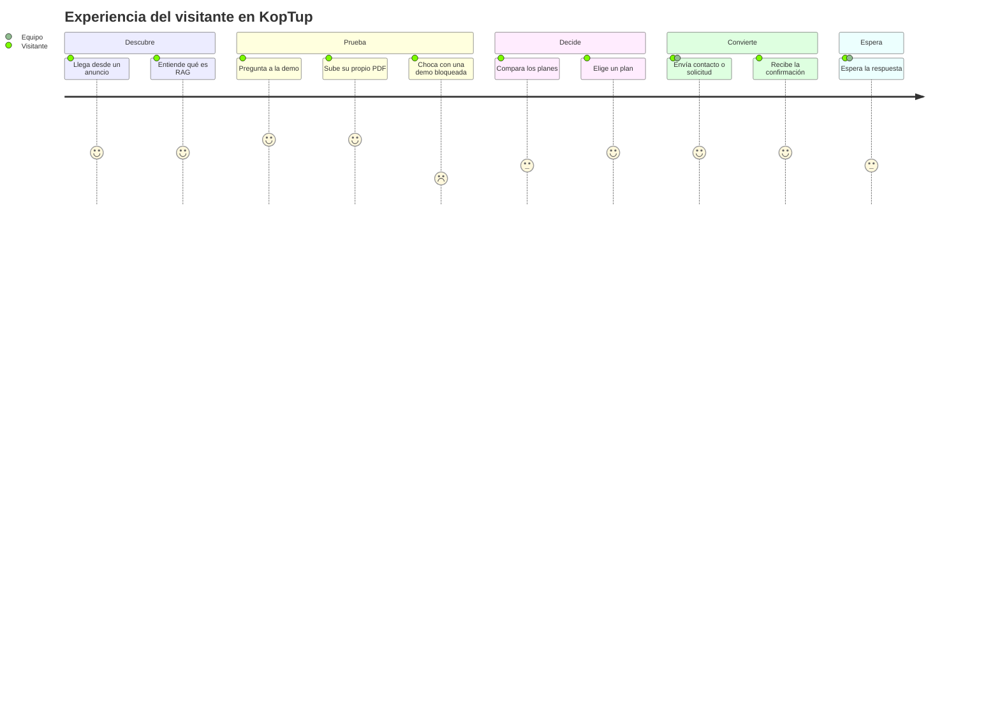
```mermaid
journey
    title Experiencia del visitante en KopTup
    section Descubre
      Llega desde un anuncio: 4: Visitante
      Entiende qué es RAG: 4: Visitante
    section Prueba
      Pregunta a la demo: 5: Visitante
      Sube su propio PDF: 5: Visitante
      Choca con una demo bloqueada: 2: Visitante
    section Decide
      Compara los planes: 3: Visitante
      Elige un plan: 4: Visitante
    section Convierte
      Envía contacto o solicitud: 4: Visitante, Equipo
      Recibe la confirmación: 4: Visitante
    section Espera
      Espera la respuesta: 3: Visitante, Equipo
```

*Mapa de experiencia: la demo es el punto más fuerte; la demo bloqueada y la espera de respuesta, los más débiles.*

Los seis flujos de esta página y cómo se conectan:

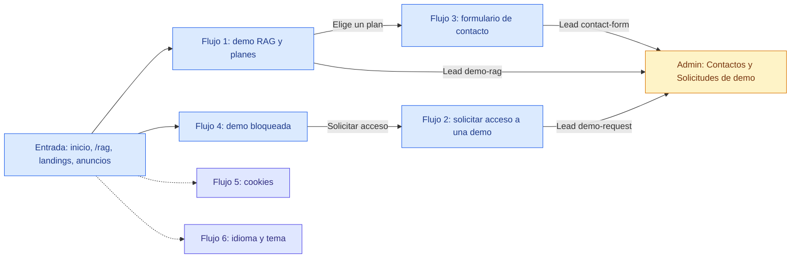
```mermaid
flowchart LR
    classDef visitante fill:#dbeafe,stroke:#2563eb,color:#1e3a8a
    classDef sistema fill:#e0e7ff,stroke:#4f46e5,color:#312e81
    classDef equipo fill:#fef3c7,stroke:#d97706,color:#78350f

    E["Entrada: inicio, /rag, landings, anuncios"]:::visitante
    F1["Flujo 1: demo RAG y planes"]:::visitante
    F2["Flujo 2: solicitar acceso a una demo"]:::visitante
    F3["Flujo 3: formulario de contacto"]:::visitante
    F4["Flujo 4: demo bloqueada"]:::visitante
    F5["Flujo 5: cookies"]:::sistema
    F6["Flujo 6: idioma y tema"]:::sistema
    ADM["Admin: Contactos y Solicitudes de demo"]:::equipo

    E --> F1
    E --> F4
    E -.-> F5
    E -.-> F6
    F1 -->|"Elige un plan"| F3
    F4 -->|"Solicitar acceso"| F2
    F1 -->|"Lead demo-rag"| ADM
    F2 -->|"Lead demo-request"| ADM
    F3 -->|"Lead contact-form"| ADM
```

*Los flujos 1 a 4 terminan en el panel del equipo; los flujos 5 y 6 pueden ocurrir en cualquier momento.*

---

## 2. Flujo 1: embudo RAG, de la demo al plan

El camino principal del sitio: el visitante prueba la IA con documentos de ejemplo, luego con su propio documento, y termina eligiendo un plan.

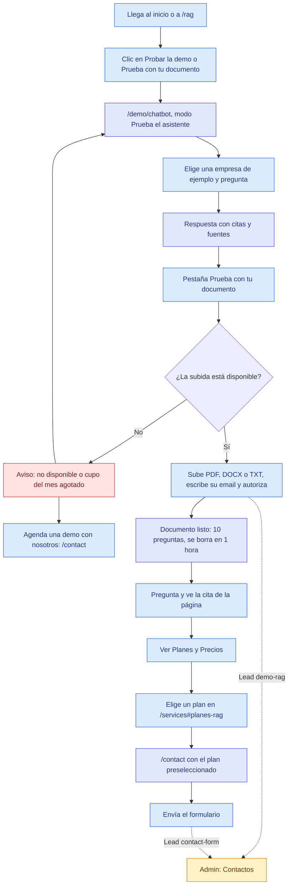
```mermaid
flowchart TD
    classDef visitante fill:#dbeafe,stroke:#2563eb,color:#1e3a8a
    classDef sistema fill:#e0e7ff,stroke:#4f46e5,color:#312e81
    classDef equipo fill:#fef3c7,stroke:#d97706,color:#78350f
    classDef error fill:#fee2e2,stroke:#dc2626,color:#7f1d1d

    A["Llega al inicio o a /rag"]:::visitante --> B["Clic en Probar la demo o Prueba con tu documento"]:::visitante
    B --> C["/demo/chatbot, modo Prueba el asistente"]:::sistema
    C --> D["Elige una empresa de ejemplo y pregunta"]:::visitante
    D --> E["Respuesta con citas y fuentes"]:::sistema
    E --> F["Pestaña Prueba con tu documento"]:::visitante
    F --> G{"¿La subida está disponible?"}
    G -->|"No"| H["Aviso: no disponible o cupo del mes agotado"]:::error
    H --> H1["Agenda una demo con nosotros: /contact"]:::visitante
    H --> C
    G -->|"Sí"| I["Sube PDF, DOCX o TXT, escribe su email y autoriza"]:::visitante
    I --> J["Documento listo: 10 preguntas, se borra en 1 hora"]:::sistema
    I -.->|"Lead demo-rag"| ADM["Admin: Contactos"]:::equipo
    J --> K["Pregunta y ve la cita de la página"]:::visitante
    K --> L["Ver Planes y Precios"]:::visitante
    L --> M["Elige un plan en /services#planes-rag"]:::visitante
    M --> N["/contact con el plan preseleccionado"]:::sistema
    N --> O["Envía el formulario"]:::visitante
    O -.->|"Lead contact-form"| ADM
```

*Embudo RAG completo. Las flechas punteadas son los leads que recibe el equipo.*

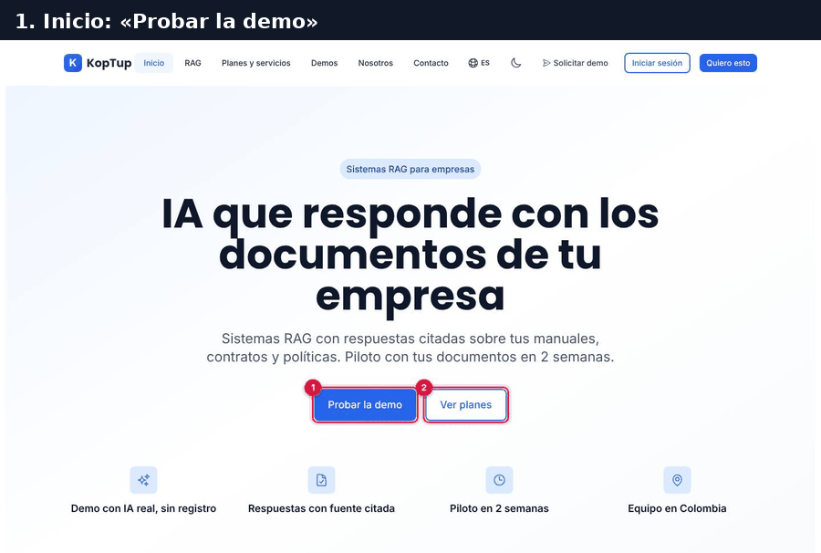

*GIF: del botón "Probar la demo" a la respuesta citada, la subida del PDF de Laura, la elección del plan Esencial y el contacto prellenado.*

> En las capturas, **el texto de las respuestas lo generó un modelo de IA simulado** del entorno local ("Respuesta simulada…"). Las **fuentes, las citas y los fragmentos sí son reales**: salen de la búsqueda sobre los documentos. En producción el texto lo redacta el modelo de OpenAI.

### Paso 1. Llega al inicio y pulsa "Probar la demo"

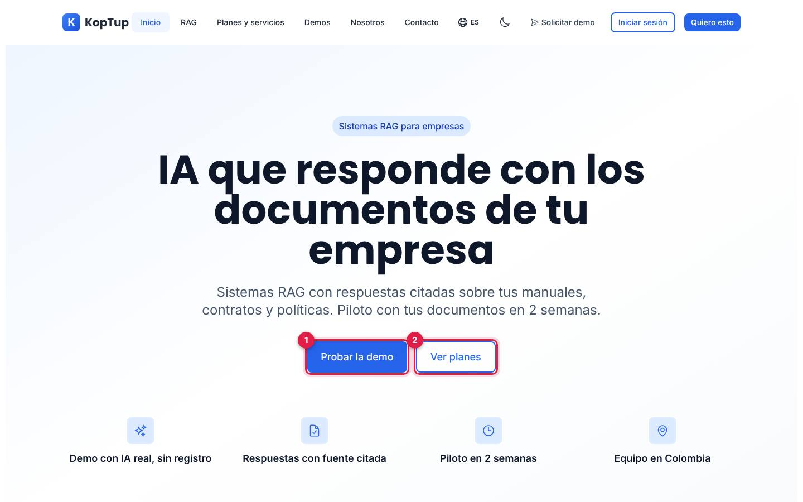

*El hero del inicio con los dos caminos del embudo.*

1. **Probar la demo** → `/demo/chatbot`.
2. **Ver planes** → `/services#planes-rag` (salta directo al paso 9).

Desde `/rag`, las landings por sector o `/chatbots-ia` el botón equivalente se llama **Prueba con tu documento** y lleva al mismo lugar.

### Paso 2. Recorrido de bienvenida (solo la primera vez)

*Primera de cinco tarjetas del recorrido.*

La primera vez que se abre la demo aparece un recorrido de **5 pasos**: elige una empresa de ejemplo, haz una pregunta sugerida, abre la fuente, pregunta algo que no esté, y prueba con tu documento o configura el tuyo. **Saltar recorrido** o **Listo** lo cierran y el navegador recuerda que ya se vio.

### Paso 3. Prueba el asistente con una empresa de ejemplo

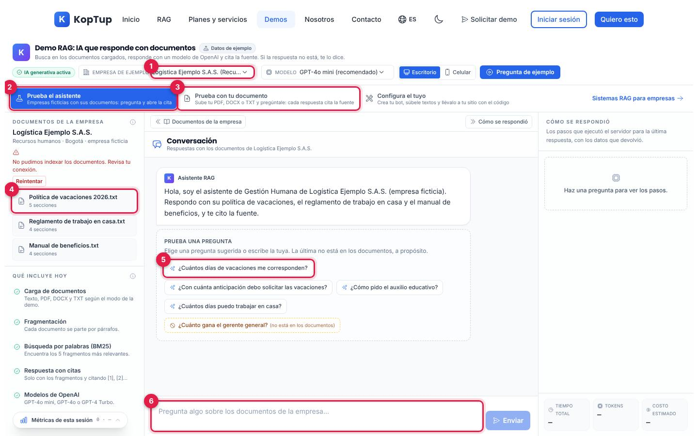

*Modo "Prueba el asistente": tres empresas ficticias con sus documentos.*

1. **Empresa de ejemplo:** Logística Ejemplo S.A.S. (recursos humanos), Hogar Ejemplo Tienda en Línea (servicio al cliente) o IPS Ejemplo Salud (salud), todas ficticias.
2. **Prueba el asistente** (pestaña activa): no pide registro.
3. **Prueba con tu documento:** la pestaña del paso 5.
4. **Documentos de la empresa:** los textos que usa la IA; se pueden abrir.
5. **Preguntas sugeridas:** la última ("¿Cuánto gana el gerente general?") está a propósito fuera de los documentos, para ver que la IA dice "no encontré".
6. **Caja de pregunta** para escribir una propia.

### Paso 4. Ve la respuesta con su cita

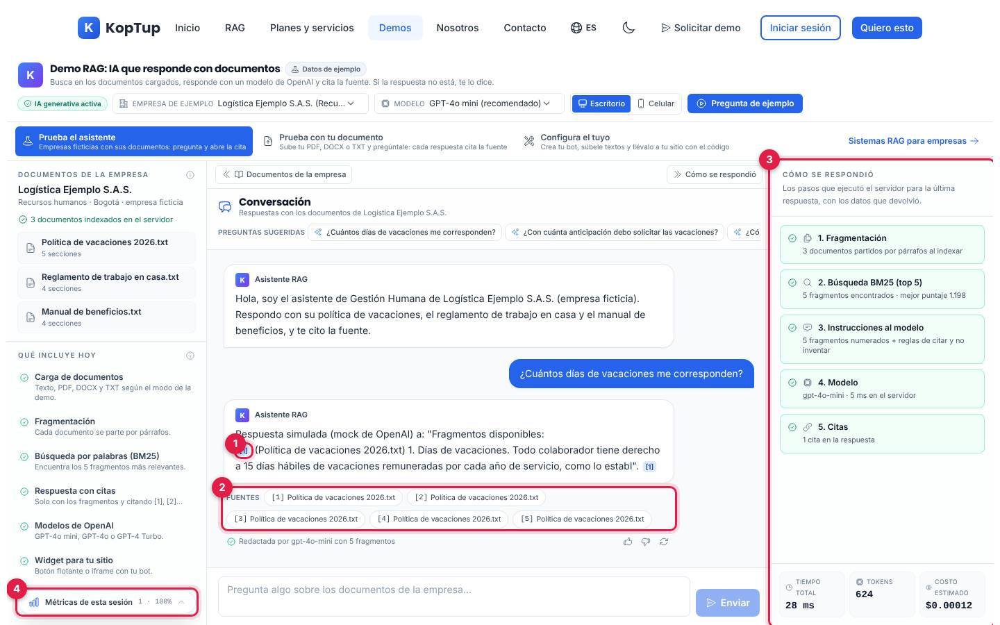

*Respuesta a "¿Cuántos días de vacaciones me corresponden?".*

1. **Cita [1]** dentro de la respuesta: al pulsarla se abre el fragmento exacto.
2. **Fuentes:** los cinco fragmentos que encontró la búsqueda, con su documento.
3. **Cómo se respondió:** los pasos reales del servidor (fragmentación, búsqueda BM25, instrucciones, modelo y citas) con sus datos.
4. **Métricas de esta sesión:** preguntas, respuestas con fuente, tiempos, tokens y costo estimado.

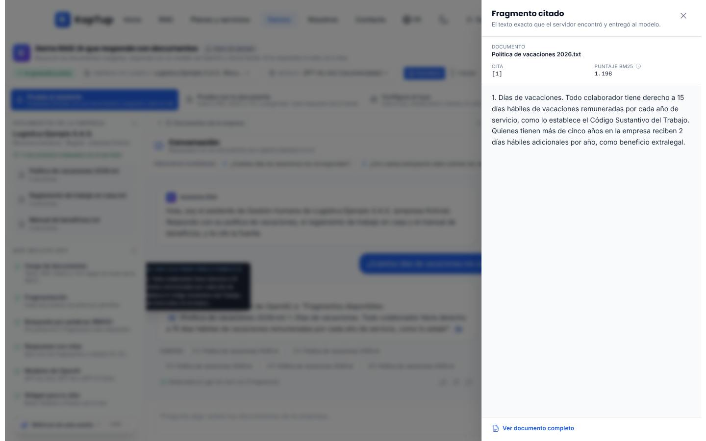

*Al pulsar [1] se abre el fragmento citado con su documento y su puntaje; "Ver documento completo" lo muestra resaltado.*

El detalle de esta demo (las tres empresas, "Configura el tuyo", el modo celular) está en la [Guía de la demo RAG](Guia-Demo-chatbot.md).

### Paso 5. Pasa a "Prueba con tu documento"

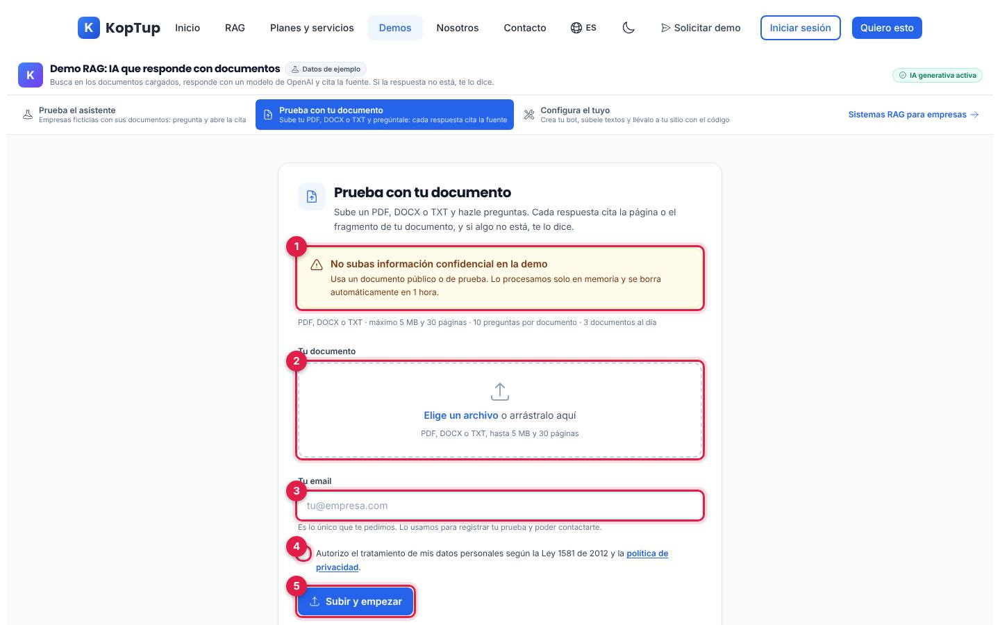

*Lo único que se pide: el archivo, un email y la autorización de datos.*

1. **Aviso:** "No subas información confidencial en la demo". Debajo, los límites: PDF, DOCX o TXT, máximo 5 MB y 30 páginas, 10 preguntas por documento, 3 documentos al día.
2. **Tu documento:** clic para elegir o arrastrar el archivo.
3. **Tu email:** se usa para registrar la prueba y poder contactar a la persona.
4. **Autorización** del tratamiento de datos según la Ley 1581 de 2012, con enlace a la política de privacidad (obligatoria).
5. **Subir y empezar.**

Debajo del botón hay un enlace para volver a la demo con el documento de ejemplo, sin registro.

### Paso 6. Sube su PDF

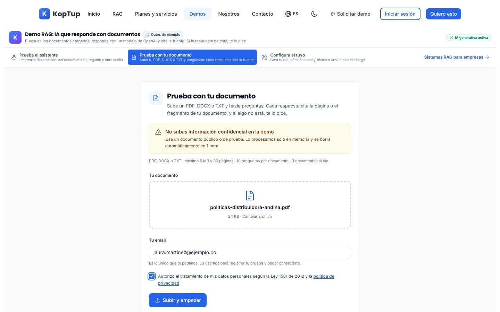

*Laura eligió `politicas-distribuidora-andina.pdf`, escribió su correo `@ejemplo.co` y marcó la autorización.*

Al subirlo, el servidor revisa formato y tamaño, lee el texto **solo en memoria**, lo parte por páginas y registra el lead.

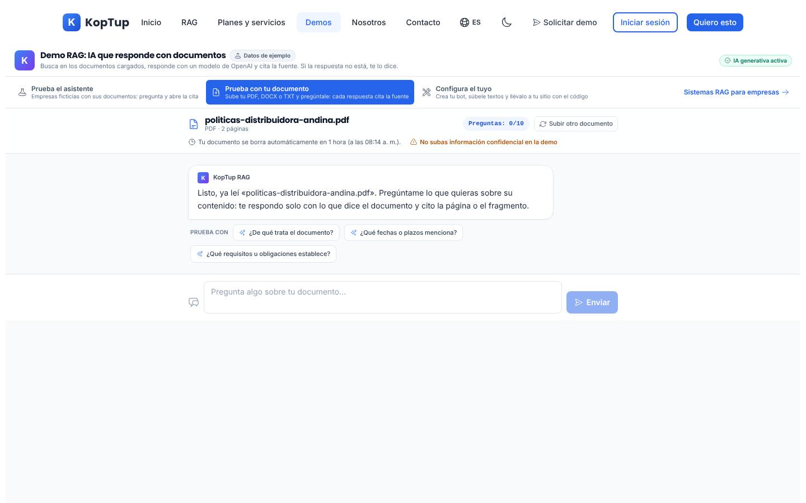

*El documento quedó listo: nombre, tipo, páginas, contador de preguntas y hora a la que se borra.*

### Paso 7. Pregunta y ve la cita de la página

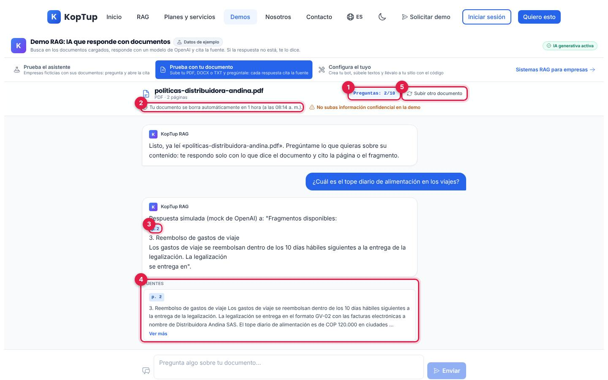

*Pregunta: "¿Cuál es el tope diario de alimentación en los viajes?". La fuente es la página 2 del PDF.*

1. **Contador de preguntas** (aquí 2 de 10).
2. **Vencimiento:** "Tu documento se borra automáticamente en 1 hora (a las …)".
3. **Cita de la página** (`p. 2`) dentro de la respuesta. En DOCX y TXT la cita es un **fragmento** en lugar de una página.
4. **Fuentes:** el fragmento de la página 2 donde está la respuesta ("El tope diario de alimentación es de COP 120.000 en ciudades capitales…"), con **Ver más**.
5. **Subir otro documento:** borra el actual y vuelve al formulario.

Si la respuesta no está en el documento, la IA lo dice ("No está en el documento, así que no inventamos una respuesta"). Al llegar a 10 preguntas aparece "Usaste las 10 preguntas de este documento" con **Agenda una demo con nosotros** y **Subir otro documento**.

### Paso 8. Cuándo aparece "no disponible"

Al abrir la pestaña, la página consulta `GET /api/demo-rag/status`. Si la subida está apagada, en lugar del formulario aparece uno de estos avisos:

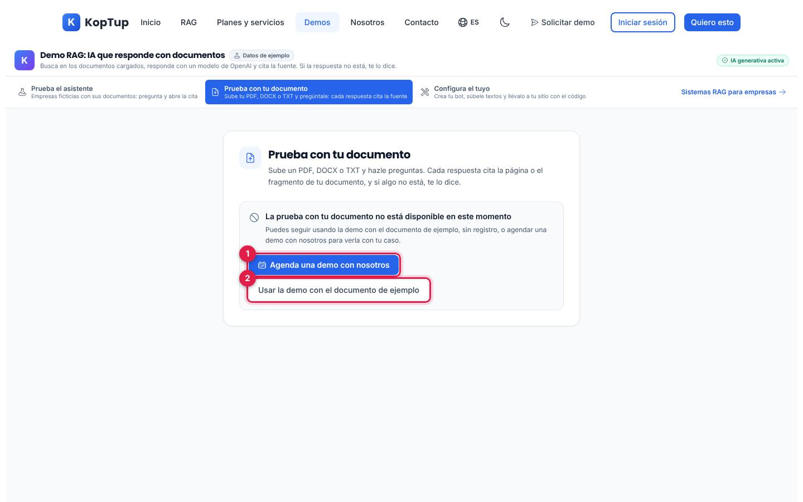

*Aviso general: (1) Agenda una demo con nosotros → `/contact`; (2) Usar la demo con el documento de ejemplo.*

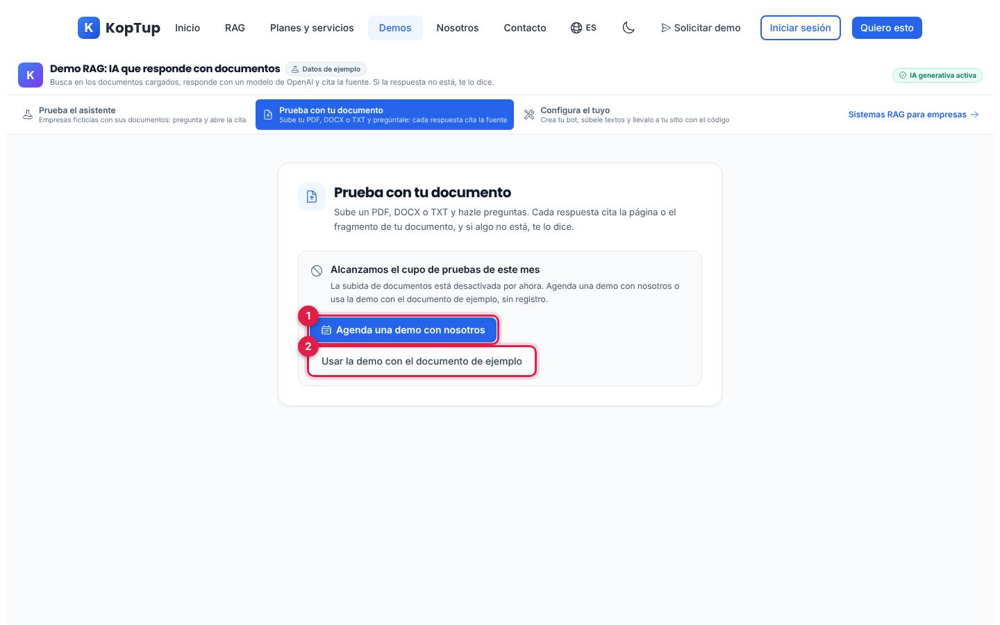

*Aviso de cupo agotado: "Alcanzamos el cupo de pruebas de este mes".*

> Para estas dos capturas se simuló la respuesta del servidor en el navegador; en el entorno local la subida estaba encendida.

| Aviso | Cuándo pasa | Cómo se vuelve a encender |
|---|---|---|
| **No está disponible en este momento** | La variable `DEMO_UPLOAD_ENABLED` no vale `true` en el servidor | Encenderla en el backend |
| **No está disponible en este momento** | Falta la clave de OpenAI, Redis no responde o el servidor no contesta (la demo "falla cerrada": si no puede controlar cupos y gasto, no deja subir) | Restablecer el servicio caído |
| **Alcanzamos el cupo de pruebas de este mes** | El gasto de IA de esta demo llegó al tope mensual `DEMO_MONTHLY_BUDGET_USD` (por defecto USD 50; el mes se cuenta en UTC) | Esperar al mes siguiente o subir el tope |

Otros mensajes que puede ver el visitante al subir o preguntar:

| Situación | Mensaje |
|---|---|
| Formato distinto de PDF, DOCX o TXT | "Formato no permitido. Sube un archivo PDF, DOCX o TXT." |
| Más de 5 MB o más de 30 páginas | "El archivo pesa más de 5 MB…" / "El documento tiene más de 30 páginas…" |
| PDF escaneado (sin texto) | "No pudimos extraer texto del documento. Si es un PDF escaneado, prueba con uno que tenga texto seleccionable." |
| Cuarto documento del día desde la misma conexión | "Llegaste al límite de 3 documentos por día. Vuelve mañana o agenda una demo con nosotros." |
| Pasó la hora | "Tu documento ya no está disponible: se borra 1 hora después de subirlo…" |
| Muchas solicitudes seguidas | "Estás enviando muchas solicitudes. Espera unos minutos…" |
| Falla del modelo | "No pudimos generar la respuesta. Intenta de nuevo; esta pregunta no se descontó." |

### Paso 9. Elige un plan

Desde la demo, el cierre común **Ver Planes y Precios** (o el botón **Quiero esto** del menú) lleva a `/services#planes-rag`.

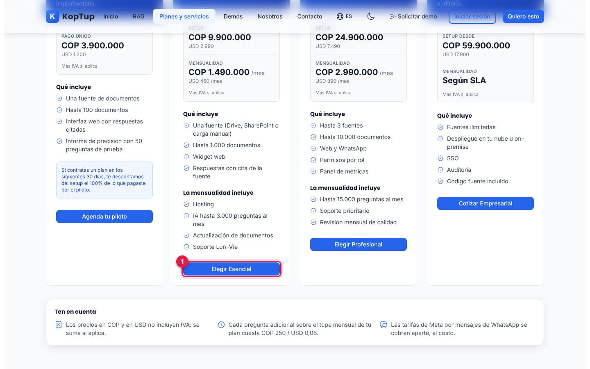

*Laura elige el plan Esencial (1).*

### Paso 10. Contacto con el plan preseleccionado

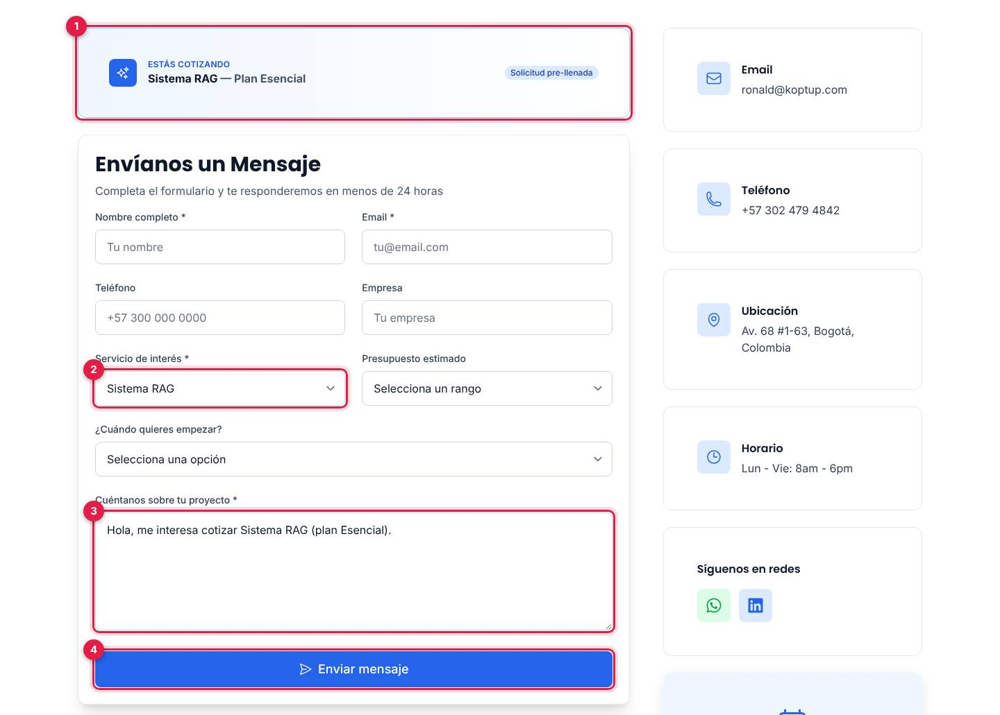

*`/contact?service=sistema-rag&plan=esencial`.*

1. **Estás cotizando: Sistema RAG — Plan Esencial** y la etiqueta "Solicitud pre-llenada".
2. **Servicio de interés** ya elegido: Sistema RAG.
3. **Mensaje** ya escrito: "Hola, me interesa cotizar Sistema RAG (plan Esencial)." La persona puede cambiarlo.
4. **Enviar mensaje.** Si el servicio sigue siendo "Sistema RAG", el lead se guarda con el servicio "Sistema RAG — Plan Esencial" aunque se edite el mensaje.

Lo que sigue (envío y confirmación) es el [Flujo 3](#4-flujo-3-formulario-de-contacto).

### Qué pasa por dentro al subir el documento

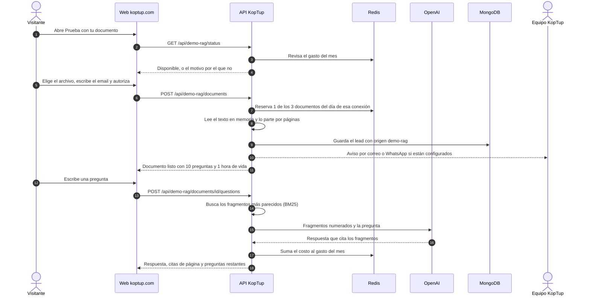
```mermaid
sequenceDiagram
    autonumber
    actor V as Visitante
    participant W as Web koptup.com
    participant A as API KopTup
    participant R as Redis
    participant O as OpenAI
    participant M as MongoDB
    actor E as Equipo KopTup
    V->>W: Abre Prueba con tu documento
    W->>A: GET /api/demo-rag/status
    A->>R: Revisa el gasto del mes
    A-->>W: Disponible, o el motivo por el que no
    V->>W: Elige el archivo, escribe el email y autoriza
    W->>A: POST /api/demo-rag/documents
    A->>R: Reserva 1 de los 3 documentos del día de esa conexión
    A->>A: Lee el texto en memoria y lo parte por páginas
    A->>M: Guarda el lead con origen demo-rag
    A-->>E: Aviso por correo o WhatsApp si están configurados
    A-->>W: Documento listo con 10 preguntas y 1 hora de vida
    V->>W: Escribe una pregunta
    W->>A: POST /api/demo-rag/documents/id/questions
    A->>A: Busca los fragmentos más parecidos (BM25)
    A->>O: Fragmentos numerados y la pregunta
    O-->>A: Respuesta que cita los fragmentos
    A->>R: Suma el costo al gasto del mes
    A-->>W: Respuesta, citas de página y preguntas restantes
```

*El documento nunca va a disco ni a la base de datos: vive en la memoria del servidor y se borra a la hora. Lo único que se guarda es el lead (email y tipo de archivo).*

En **Admin › Contactos** el lead aparece como **"Lead de la demo RAG"**, con el email y el servicio "Demo RAG: prueba con tu documento"; el mensaje dice el tipo de archivo, las páginas y la fecha de la autorización (ver la captura del [Flujo 3](#4-flujo-3-formulario-de-contacto)).

---

## 3. Flujo 2: solicitar acceso a una demo

Para las demos marcadas **Requiere acceso** o **Solo por invitación**, el visitante pide acceso con un formulario. Hay dos puertas de entrada: la tarjeta del hub `/demo` y la pantalla de acceso que aparece al abrir la demo.

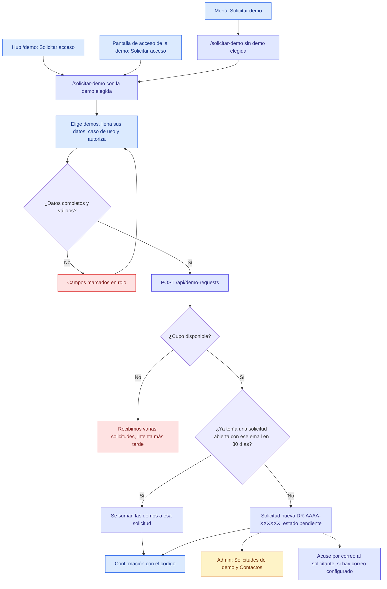
```mermaid
flowchart TD
    classDef visitante fill:#dbeafe,stroke:#2563eb,color:#1e3a8a
    classDef sistema fill:#e0e7ff,stroke:#4f46e5,color:#312e81
    classDef equipo fill:#fef3c7,stroke:#d97706,color:#78350f
    classDef error fill:#fee2e2,stroke:#dc2626,color:#7f1d1d

    H["Hub /demo: Solicitar acceso"]:::visitante --> F["/solicitar-demo con la demo elegida"]:::sistema
    G["Pantalla de acceso de la demo: Solicitar acceso"]:::visitante --> F
    N["Menú: Solicitar demo"]:::visitante --> F0["/solicitar-demo sin demo elegida"]:::sistema
    F0 --> F
    F --> L["Elige demos, llena sus datos, caso de uso y autoriza"]:::visitante
    L --> V{"¿Datos completos y válidos?"}
    V -->|"No"| X["Campos marcados en rojo"]:::error
    X --> L
    V -->|"Sí"| S["POST /api/demo-requests"]:::sistema
    S --> C{"¿Cupo disponible?"}
    C -->|"No"| R["Recibimos varias solicitudes, intenta más tarde"]:::error
    C -->|"Sí"| M{"¿Ya tenía una solicitud abierta con ese email en 30 días?"}
    M -->|"Sí"| U["Se suman las demos a esa solicitud"]:::sistema
    M -->|"No"| Q["Solicitud nueva DR-AAAA-XXXXXX, estado pendiente"]:::sistema
    U --> OK["Confirmación con el código"]:::visitante
    Q --> OK
    Q -.-> ADM["Admin: Solicitudes de demo y Contactos"]:::equipo
    Q -.-> AC["Acuse por correo al solicitante, si hay correo configurado"]:::sistema
```

*De la tarjeta de la demo a la confirmación. La aprobación la hace el equipo después.*

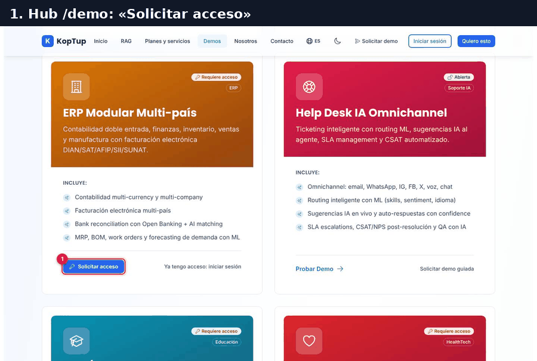

*GIF: Andrés pide acceso al ERP desde el hub (o desde la pantalla de acceso), llena el formulario y recibe su código.*

### Paso 1. Pulsa "Solicitar acceso"

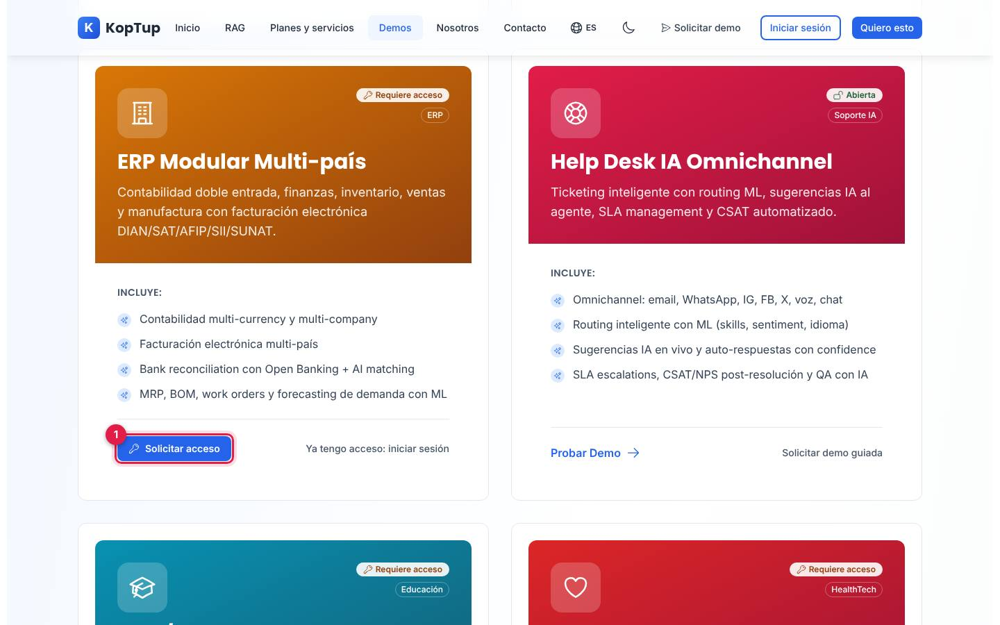

*En el hub, la tarjeta del ERP muestra "Requiere acceso" y el botón Solicitar acceso (1).*

La otra entrada es la pantalla de acceso que aparece al abrir `/demo/erp` sin permiso (ver [Flujo 4](#5-flujo-4-demo-bloqueada)). En los dos casos se abre `/solicitar-demo?demos=erp`.

### Paso 2. El formulario llega con la demo elegida

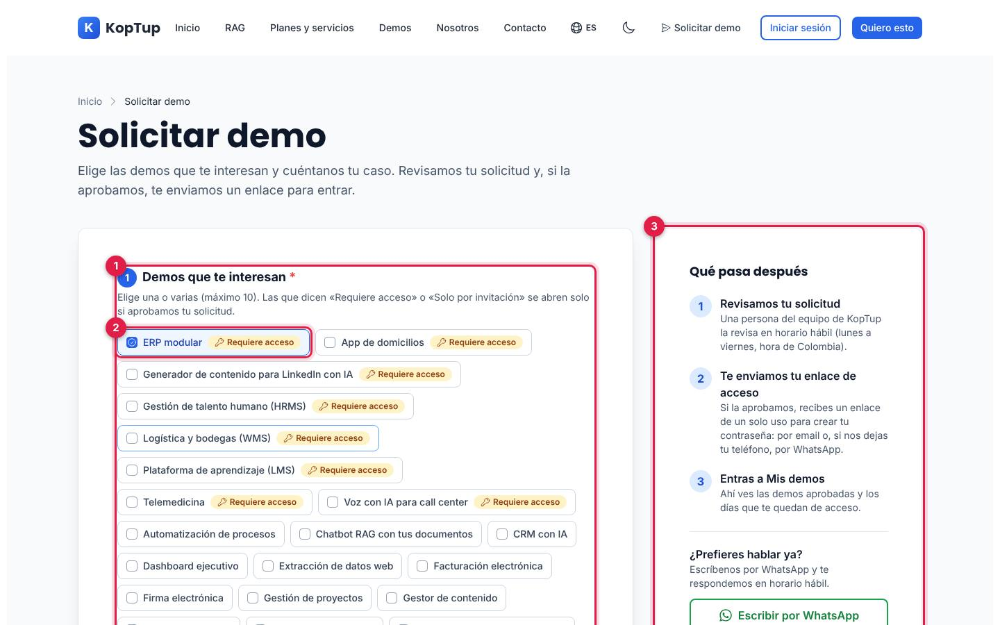

*Sección 1 del formulario y columna "Qué pasa después".*

1. **Demos que te interesan:** se pueden elegir hasta 10. Las que requieren acceso aparecen primero y llevan su etiqueta.
2. **ERP modular** ya marcado porque vino en la URL.
3. **Qué pasa después:** revisamos tu solicitud (lunes a viernes, hora de Colombia) → te enviamos tu enlace de acceso (por email o, si dejas teléfono, por WhatsApp) → entras a **Mis demos**. Abajo, **Escribir por WhatsApp**.

### Paso 3. Si falta algo, el formulario lo marca

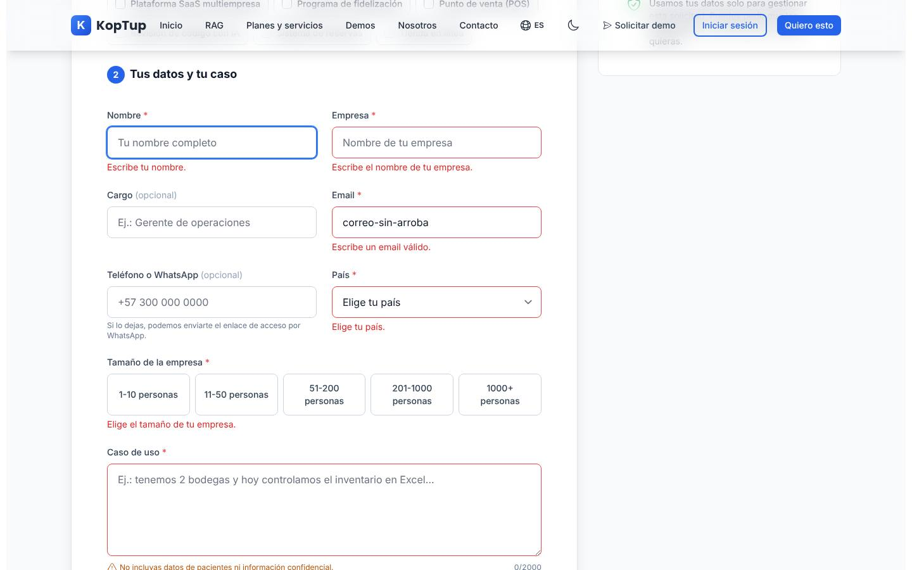

*Al enviar incompleto: aviso "Revisa los campos marcados" arriba y el error debajo de cada campo.*

La validación ocurre en el navegador y el servidor la repite. Campos obligatorios: al menos una demo, nombre (al menos 2 caracteres), empresa, email válido, país, tamaño de la empresa, caso de uso (mínimo 10 caracteres) y la autorización. El teléfono es opcional pero, si se escribe, debe tener formato de teléfono.

### Paso 4. Llena sus datos y autoriza

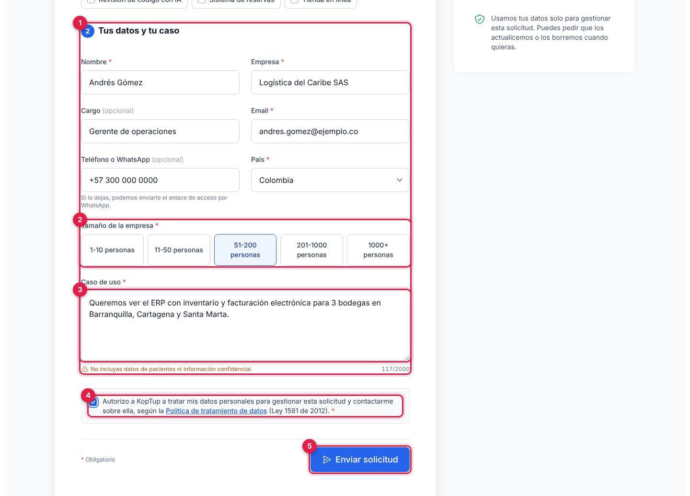

*Sección 2 completa con los datos de Andrés.*

1. **Tus datos y tu caso:** nombre, empresa, cargo (opcional), email, teléfono o WhatsApp (opcional) y país.
2. **Tamaño de la empresa:** 1-10, 11-50, 51-200, 201-1000 o 1000+ personas.
3. **Caso de uso** (hasta 2.000 caracteres), con el aviso "No incluyas datos de pacientes ni información confidencial".
4. **Autorización** del tratamiento de datos (Ley 1581 de 2012) con enlace a la política.
5. **Enviar solicitud.**

El formulario tiene además un campo oculto para frenar robots: si llega lleno, el servidor responde como si todo estuviera bien pero no guarda nada.

### Paso 5. Confirmación

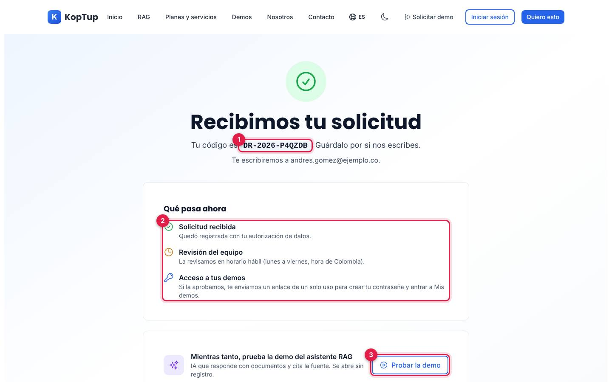

*"Recibimos tu solicitud" con el código `DR-2026-P4QZDB`.*

1. **Código de la solicitud** (formato `DR-AAAA-XXXXXX`): sirve para identificarla si la persona escribe.
2. **Qué pasa ahora:** solicitud recibida → revisión del equipo en horario hábil → si se aprueba, enlace de un solo uso para crear la contraseña y entrar a Mis demos.
3. **Probar la demo** del asistente RAG mientras tanto. Debajo: **Escribir por WhatsApp** y **Volver al inicio**.

Si la persona ya tenía una solicitud abierta con el mismo email en los últimos 30 días, no se crea otra: se suman las demos y la confirmación lo dice ("Ya teníamos una solicitud tuya en revisión: le sumamos las demos que elegiste").

### A dónde llega

- **Admin › Solicitudes de demo:** la solicitud queda **pendiente** para que el equipo la apruebe, la rechace o la marque como spam. Ver [Manual del administrador](Doc-06-Manual-del-Administrador.md).
- **Admin › Contactos:** también se registra como contacto con origen `demo-request` y servicio "Solicitud de demo: ERP modular".
- **Avisos:** correo y WhatsApp al equipo si están configurados, y un acuse por correo al solicitante con su código (si el servidor tiene correo).

**Cupos:** 5 solicitudes válidas por hora desde la misma conexión y 3 por email al día (configurables con `DEMO_REQUEST_LIMIT_PER_HOUR` y `DEMO_REQUEST_LIMIT_PER_EMAIL_DAY`). Si se superan, el formulario muestra "Recibimos varias solicitudes desde tu conexión o con este email. Intenta de nuevo más tarde o escríbenos por WhatsApp".

Lo que pasa después de la aprobación (activar la cuenta, Mis demos) está en [Flujos del prospecto y cliente](Doc-05-Flujos-del-Prospecto-y-Cliente.md).

---

## 4. Flujo 3: formulario de contacto

El formulario de `/contact` es el destino de "Agenda un piloto", de los botones de los planes y de "Solicitar cotización".

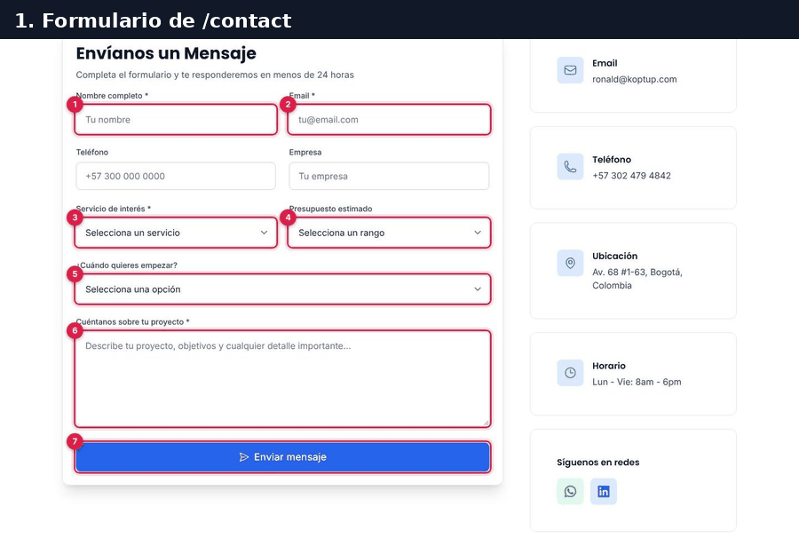

*GIF: Carolina llena el formulario, lo envía y el lead aparece en el panel.*

### Paso 1. El formulario

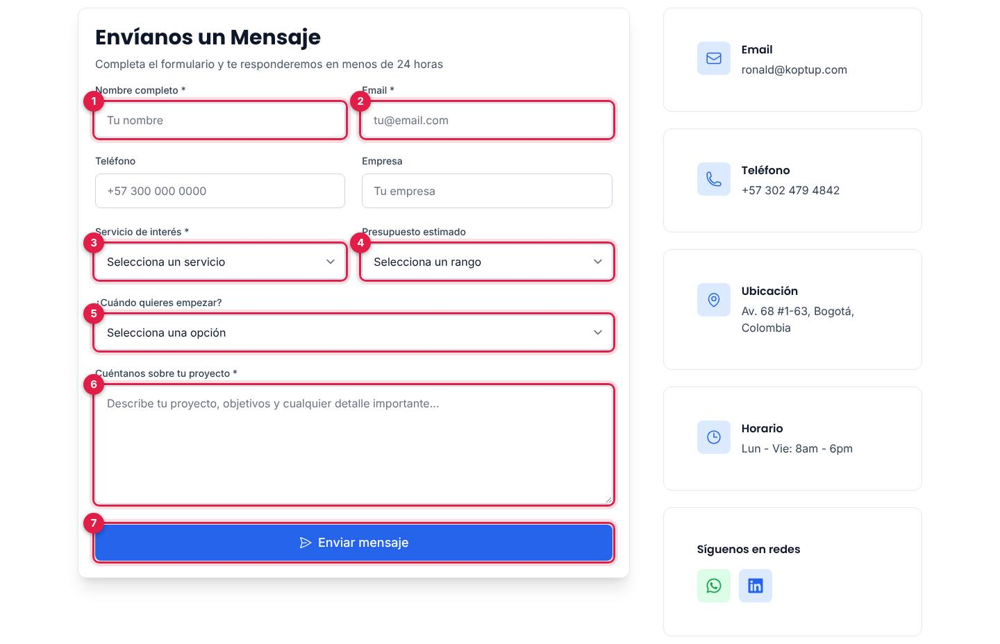

*Formulario "Envíanos un Mensaje" y la columna de datos de contacto.*

1. **Nombre completo** (obligatorio).
2. **Email** (obligatorio).
3. **Servicio de interés** (obligatorio): Sistema RAG, E-Commerce, Chatbot con IA, Desarrollo Web, Desarrollo Móvil, Integraciones API, Diseño UX/UI, Consultoría u Otro.
4. **Presupuesto estimado** (opcional): cinco rangos.
5. **¿Cuándo quieres empezar?** (opcional): ya, el próximo mes, en 2-3 meses o sin definir.
6. **Cuéntanos sobre tu proyecto** (obligatorio).
7. **Enviar mensaje.**

Teléfono y Empresa son opcionales. En la columna derecha, **Agendar ahora** (más abajo) abre el programa de correo del visitante con un mensaje ya escrito para pedir una llamada de 30 minutos; no pasa por el servidor.

### Paso 2. Lo llena

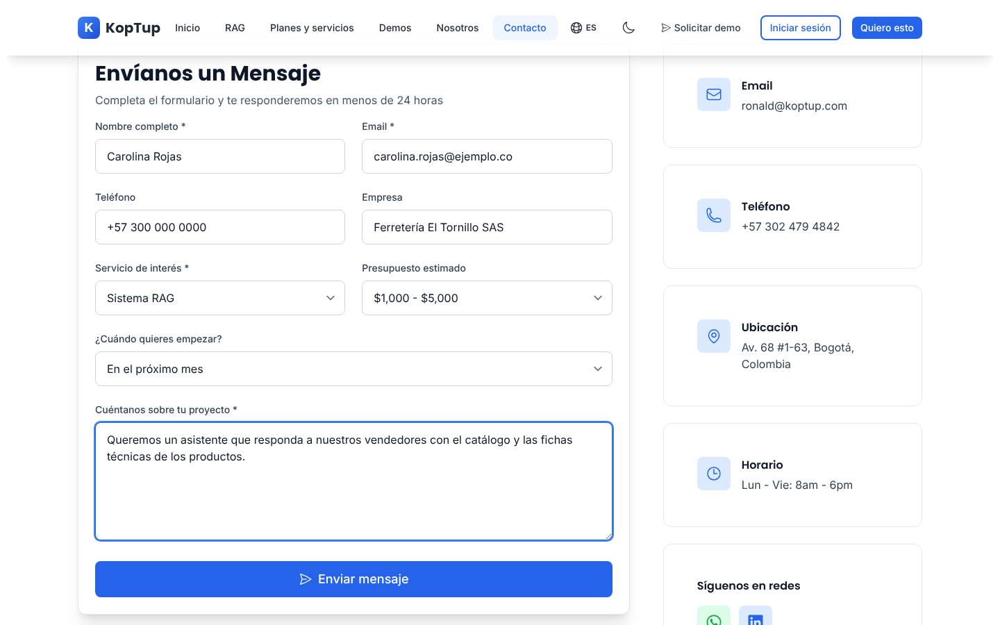

*Carolina pide un asistente para sus vendedores con el catálogo de productos.*

### Paso 3. Confirmación

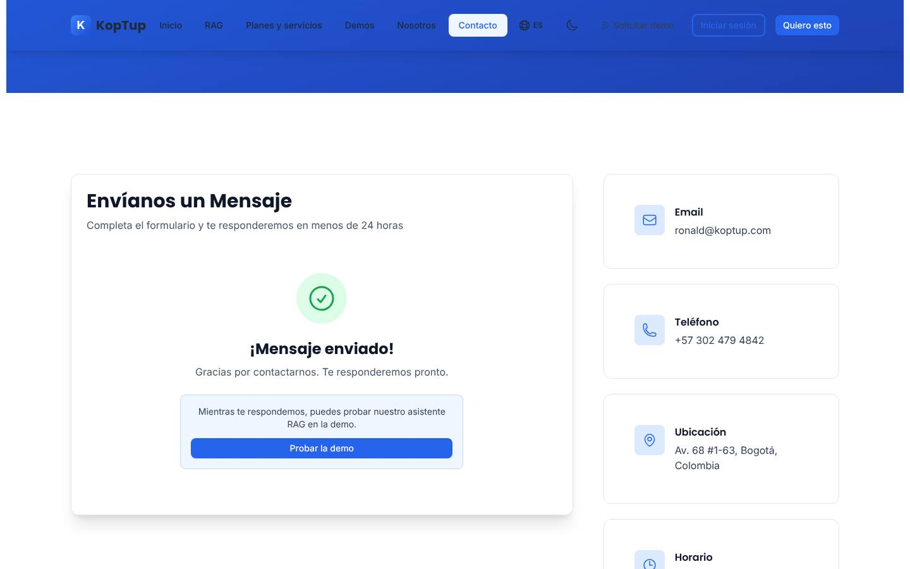

*"¡Mensaje enviado!" con la invitación a probar la demo mientras tanto.*

La confirmación dice "Gracias por contactarnos. Te responderemos pronto" y ofrece **Probar la demo** (`/demo/chatbot`). A los 6 segundos el formulario vuelve a aparecer vacío. Si el envío falla, se muestra un aviso rojo arriba del formulario y los datos se conservan.

### A dónde llega el lead

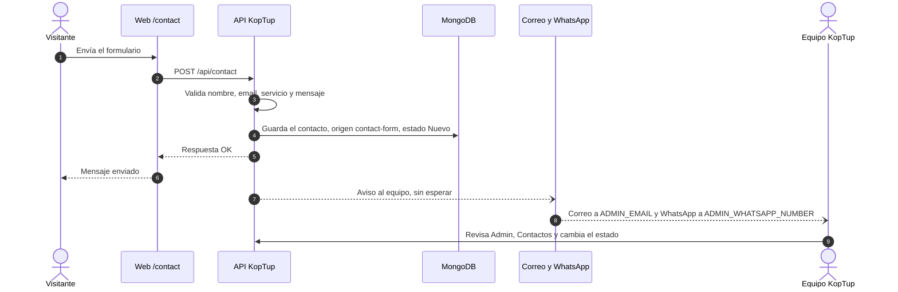
```mermaid
sequenceDiagram
    autonumber
    actor V as Visitante
    participant W as Web /contact
    participant A as API KopTup
    participant M as MongoDB
    participant N as Correo y WhatsApp
    actor E as Equipo KopTup
    V->>W: Envía el formulario
    W->>A: POST /api/contact
    A->>A: Valida nombre, email, servicio y mensaje
    A->>M: Guarda el contacto, origen contact-form, estado Nuevo
    A-->>W: Respuesta OK
    W-->>V: Mensaje enviado
    A--)N: Aviso al equipo, sin esperar
    N--)E: Correo a ADMIN_EMAIL y WhatsApp a ADMIN_WHATSAPP_NUMBER
    E->>A: Revisa Admin, Contactos y cambia el estado
```

*El guardado se espera; los avisos van aparte y nunca hacen fallar el envío.*

1. **Se guarda** en la colección de contactos con estado **Nuevo** y origen `contact-form`. Se guardan nombre, email, teléfono, empresa, servicio (con el plan, si vino de un plan RAG), presupuesto y mensaje.
2. **Avisa al equipo** por correo (a la dirección configurada en `ADMIN_EMAIL`, si el servidor tiene SMTP) y por WhatsApp (al número `ADMIN_WHATSAPP_NUMBER`, si hay proveedor configurado). Si ninguno está configurado, el lead igual queda guardado.
3. **Aparece en Admin › Contactos**, junto con los leads de la demo RAG y de las solicitudes de demo:

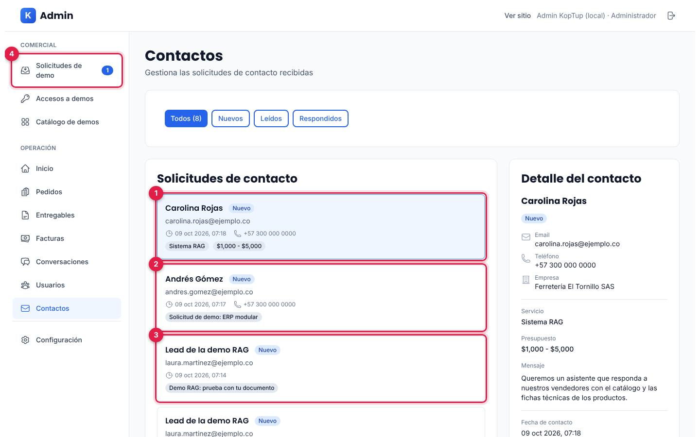

*Los tres orígenes de lead en el mismo listado del panel.*

1. **Formulario de contacto** (Carolina): servicio "Sistema RAG" y presupuesto; a la derecha, el detalle con empresa y mensaje.
2. **Solicitud de demo** (Andrés): servicio "Solicitud de demo: ERP modular".
3. **Demo RAG** (Laura): nombre "Lead de la demo RAG" y servicio "Demo RAG: prueba con tu documento".
4. **Solicitudes de demo**, con el contador de pendientes: ahí se aprueba la de Andrés.

El equipo marca cada contacto como **Nuevo**, **Leído** o **Respondido**. El manejo completo está en el [Manual del administrador](Doc-06-Manual-del-Administrador.md).

**Límite:** 5 envíos por minuto desde la misma conexión.

---

## 5. Flujo 4: demo bloqueada

Qué ve un visitante **sin sesión** al abrir una demo que no es abierta. La URL no cambia (`/demo/erp`): el servidor de la web muestra en su lugar la **pantalla de acceso**.

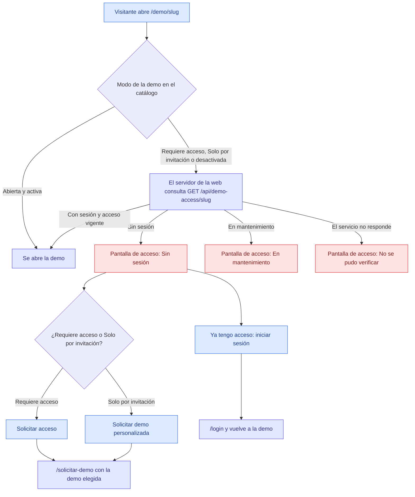
```mermaid
flowchart TD
    classDef visitante fill:#dbeafe,stroke:#2563eb,color:#1e3a8a
    classDef sistema fill:#e0e7ff,stroke:#4f46e5,color:#312e81
    classDef error fill:#fee2e2,stroke:#dc2626,color:#7f1d1d

    A["Visitante abre /demo/slug"]:::visitante --> B{"Modo de la demo en el catálogo"}
    B -->|"Abierta y activa"| OK["Se abre la demo"]:::sistema
    B -->|"Requiere acceso, Solo por invitación o desactivada"| C["El servidor de la web consulta GET /api/demo-access/slug"]:::sistema
    C -->|"Sin sesión"| P["Pantalla de acceso: Sin sesión"]:::error
    C -->|"En mantenimiento"| MT["Pantalla de acceso: En mantenimiento"]:::error
    C -->|"El servicio no responde"| ND["Pantalla de acceso: No se pudo verificar"]:::error
    C -->|"Con sesión y acceso vigente"| OK
    P --> S1{"¿Requiere acceso o Solo por invitación?"}
    S1 -->|"Requiere acceso"| SA["Solicitar acceso"]:::visitante
    S1 -->|"Solo por invitación"| SP["Solicitar demo personalizada"]:::visitante
    P --> LG["Ya tengo acceso: iniciar sesión"]:::visitante
    SA --> F["/solicitar-demo con la demo elegida"]:::sistema
    SP --> F
    LG --> LI["/login y vuelve a la demo"]:::sistema
```

*Decisión de acceso para un visitante. Los casos con sesión (sin acceso, vencido, retirado) están en Flujos del prospecto y cliente.*

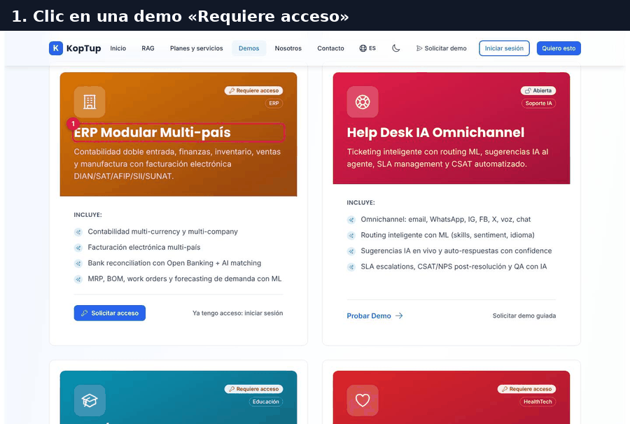

*GIF: del hub a la pantalla de acceso del ERP, luego la de una demo por invitación y su formulario.*

### Demo con solicitud (Requiere acceso), sin sesión

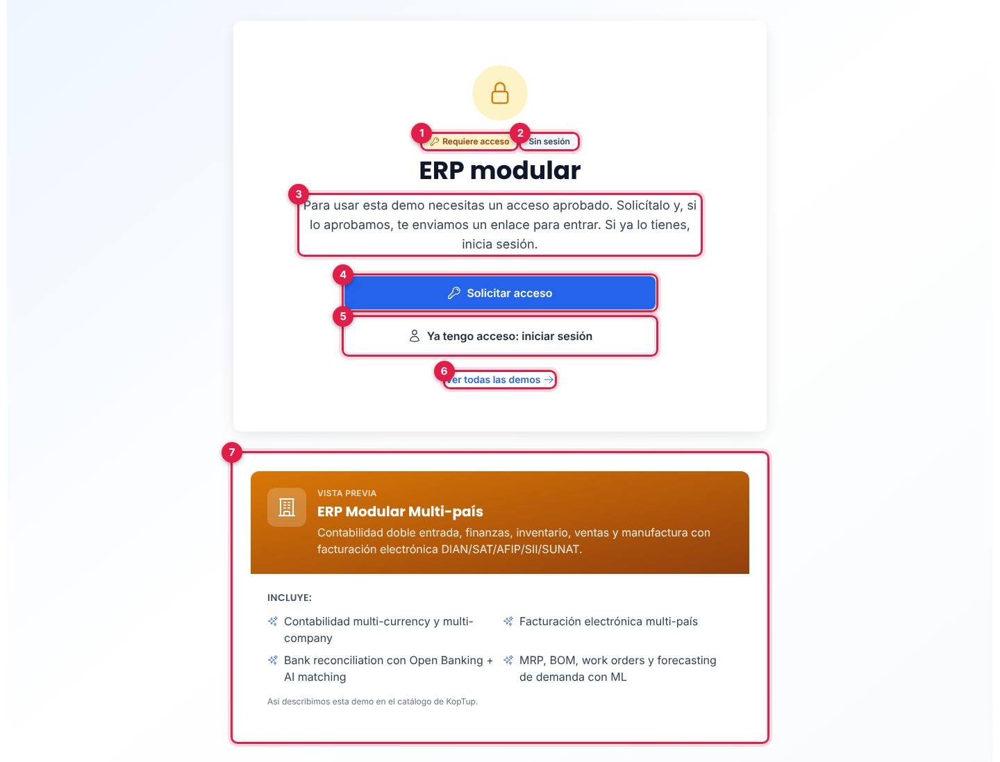

*`/demo/erp` para un visitante sin sesión.*

1. Etiqueta **Requiere acceso**.
2. Estado **Sin sesión**.
3. Mensaje: "Para usar esta demo necesitas un acceso aprobado. Solicítalo y, si lo aprobamos, te enviamos un enlace para entrar. Si ya lo tienes, inicia sesión."
4. **Solicitar acceso** → `/solicitar-demo?demos=erp` ([Flujo 2](#3-flujo-2-solicitar-acceso-a-una-demo)).
5. **Ya tengo acceso: iniciar sesión** → `/login?redirect=/demo/erp`: al entrar vuelve a la demo.
6. **Ver todas las demos** → `/demo`.
7. **Vista previa:** la descripción y lo que incluye la demo, tal como está en el catálogo ("Así describimos esta demo en el catálogo de KopTup").

### Demo solo por invitación, sin sesión

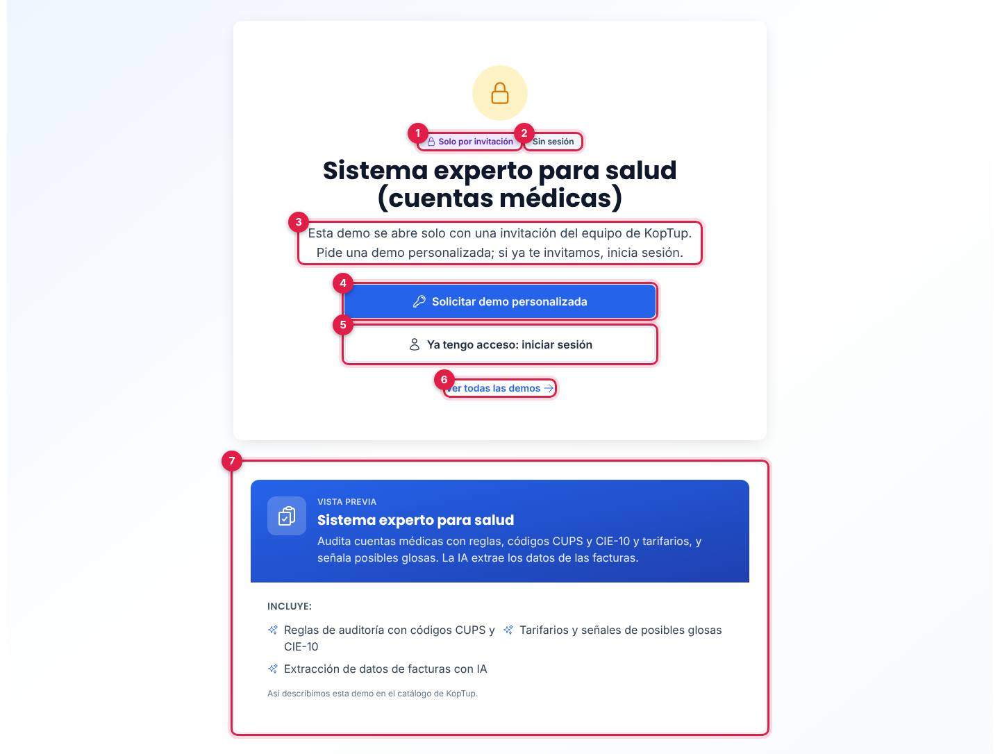

*`/demo/cuentas-medicas` ("Sistema experto para salud").*

Mismos elementos, con dos diferencias: la etiqueta es **Solo por invitación** (1) y el mensaje (3) dice "Esta demo se abre solo con una invitación del equipo de KopTup. Pide una demo personalizada; si ya te invitamos, inicia sesión". El botón principal (4) es **Solicitar demo personalizada**, y el formulario llega con esa demo elegida aunque no figure en la lista de demos que se pueden pedir.

### Otros estados que puede ver un visitante

| Estado (etiqueta) | Cuándo | Botones |
|---|---|---|
| **En mantenimiento** | El equipo desactivó la demo en Admin › Catálogo de demos | Ver otras demos · Solicitar demo guiada |
| **No se pudo verificar** | La API no respondió a tiempo | Intentar de nuevo · Solicitar acceso |

La pantalla de acceso tiene título propio ("ERP modular: acceso | KopTup") y no se indexa en buscadores.

---

## 6. Flujo 5: cookies y analítica

El sitio está preparado para tres etiquetas de medición: **Google Analytics 4** (categoría analítica), **Google Ads** y **LinkedIn Insight Tag** (categoría marketing). Ninguna se carga sin el consentimiento del visitante, y **el banner solo existe si al menos una está configurada** en el build (`NEXT_PUBLIC_GA_ID`, `NEXT_PUBLIC_GOOGLE_ADS_ID` o `NEXT_PUBLIC_LINKEDIN_PARTNER_ID`).

> **Hoy:** el sitio publicado no tiene ninguna etiqueta configurada, así que el banner no aparece y no se mide nada (revisado en `www.koptup.com` el 9 de octubre de 2026). Para las capturas se simuló en el entorno local un build con un ID de Google Analytics ficticio y se bloqueó cualquier envío a Google.

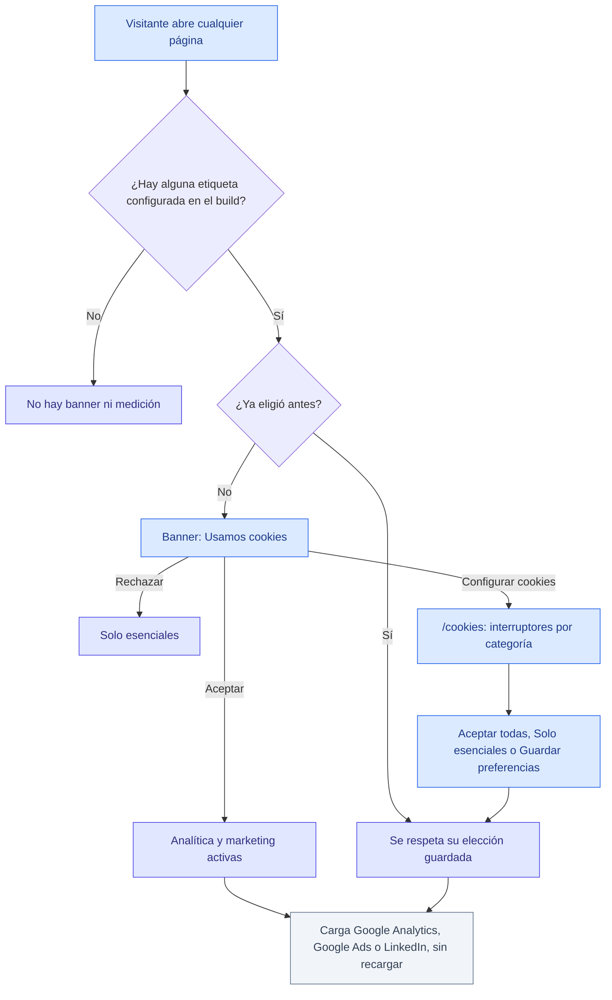
```mermaid
flowchart TD
    classDef visitante fill:#dbeafe,stroke:#2563eb,color:#1e3a8a
    classDef sistema fill:#e0e7ff,stroke:#4f46e5,color:#312e81
    classDef externo fill:#f1f5f9,stroke:#64748b,color:#334155

    A["Visitante abre cualquier página"]:::visitante --> B{"¿Hay alguna etiqueta configurada en el build?"}
    B -->|"No"| N["No hay banner ni medición"]:::sistema
    B -->|"Sí"| C{"¿Ya eligió antes?"}
    C -->|"Sí"| D["Se respeta su elección guardada"]:::sistema
    C -->|"No"| E["Banner: Usamos cookies"]:::visitante
    E -->|"Aceptar"| F["Analítica y marketing activas"]:::sistema
    E -->|"Rechazar"| G["Solo esenciales"]:::sistema
    E -->|"Configurar cookies"| H["/cookies: interruptores por categoría"]:::visitante
    H --> I["Aceptar todas, Solo esenciales o Guardar preferencias"]:::visitante
    I --> D
    F --> T["Carga Google Analytics, Google Ads o LinkedIn, sin recargar"]:::externo
    D --> T
```

*Consentimiento antes de medir: sin elección o con "Rechazar" no se carga ninguna etiqueta.*

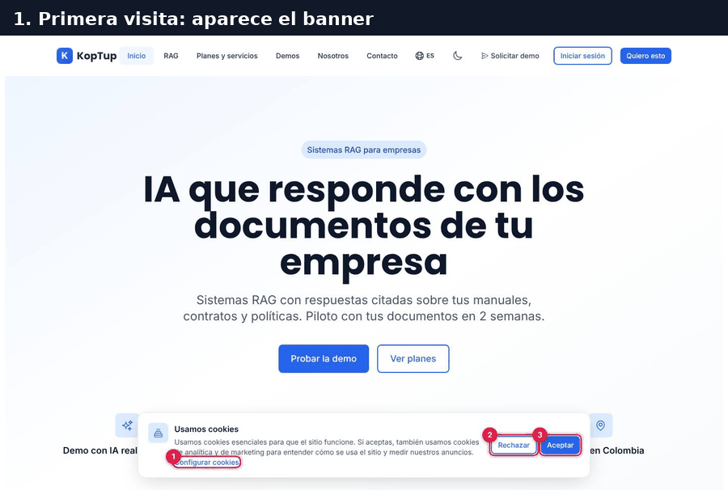

*GIF: banner, "Aceptar" y el panel de preferencias de `/cookies`.*

### El banner

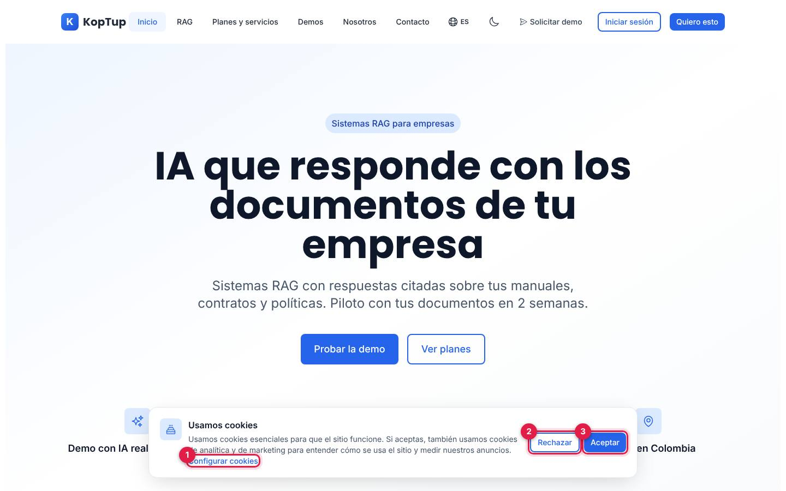

*Banner de la primera visita (entorno local con un ID de prueba).*

Texto: "Usamos cookies esenciales para que el sitio funcione. Si aceptas, también usamos cookies de analítica y de marketing para entender cómo se usa el sitio y medir nuestros anuncios."

1. **Configurar cookies** → `/cookies`.
2. **Rechazar:** guarda "solo esenciales" y cierra el banner.
3. **Aceptar:** activa analítica, marketing y funcionales; las etiquetas se cargan **en ese momento, sin recargar la página**. En la prueba, al aceptar el navegador pidió el script de Google Analytics.

El banner no aparece en `/cookies` (esa página tiene sus propios controles) ni vuelve a aparecer una vez que se elige. La elección se guarda en el navegador (`localStorage`, clave `cookie_preferences`) con la fecha; si el navegador bloquea el almacenamiento, se respeta durante la visita.

### Las preferencias en `/cookies`

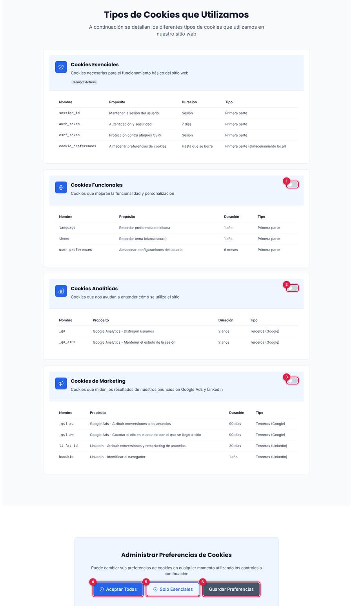

*Tipos de cookies con sus interruptores y los tres botones de preferencias.*

1. **Cookies funcionales** (idioma y tema).
2. **Cookies analíticas** (Google Analytics: `_ga`, `_ga_<ID>`).
3. **Cookies de marketing** (Google Ads y LinkedIn: `_gcl_au`, `_gcl_aw`, `li_fat_id`, `bcookie`).
4. **Aceptar Todas.**
5. **Solo Esenciales.**
6. **Guardar Preferencias:** guarda lo que marcaron los interruptores.

Las esenciales están "Siempre Activas". Cada botón confirma con una ventana del navegador ("Todas las cookies han sido aceptadas", "Solo cookies esenciales están habilitadas" o "Preferencias guardadas correctamente"). Si el visitante **retira** un consentimiento que había dado, la página se recarga para que ninguna etiqueta siga activa.

Los eventos que se miden cuando hay consentimiento están en la [sección 8](#8-qué-mide-cada-flujo). Las rutas con datos sensibles en la URL (`/auth/…`, `/reset-password`) nunca cargan etiquetas.

---

## 7. Flujo 6: idioma ES/EN y modo oscuro

Los dos botones están en el menú superior, a la derecha (en el celular, al final del menú desplegable).

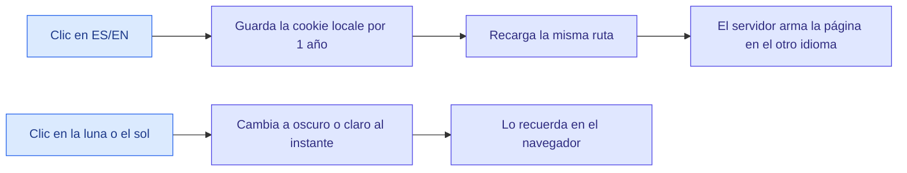
```mermaid
flowchart LR
    classDef visitante fill:#dbeafe,stroke:#2563eb,color:#1e3a8a
    classDef sistema fill:#e0e7ff,stroke:#4f46e5,color:#312e81

    A["Clic en ES/EN"]:::visitante --> B["Guarda la cookie locale por 1 año"]:::sistema
    B --> C["Recarga la misma ruta"]:::sistema
    C --> D["El servidor arma la página en el otro idioma"]:::sistema
    T["Clic en la luna o el sol"]:::visitante --> U["Cambia a oscuro o claro al instante"]:::sistema
    U --> V["Lo recuerda en el navegador"]:::sistema
```

*El idioma lo decide el servidor con una cookie; el tema, el navegador.*

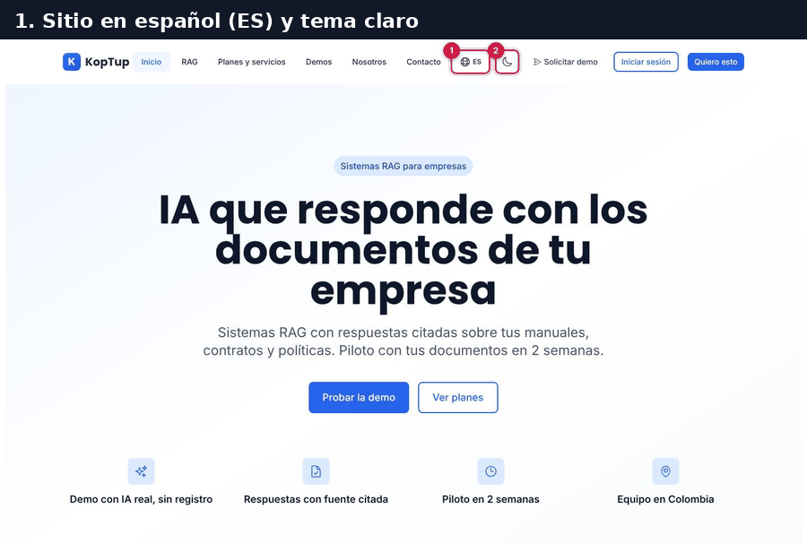

*GIF: el inicio en español, luego en inglés, luego en modo oscuro, y otra página que conserva ambas elecciones.*

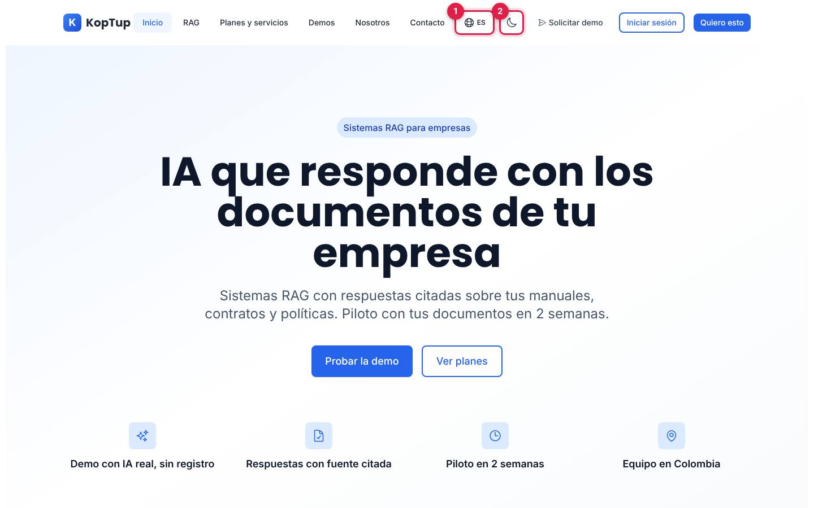

*(1) idioma, que muestra el idioma actual (ES); (2) tema, que muestra una luna en modo claro.*

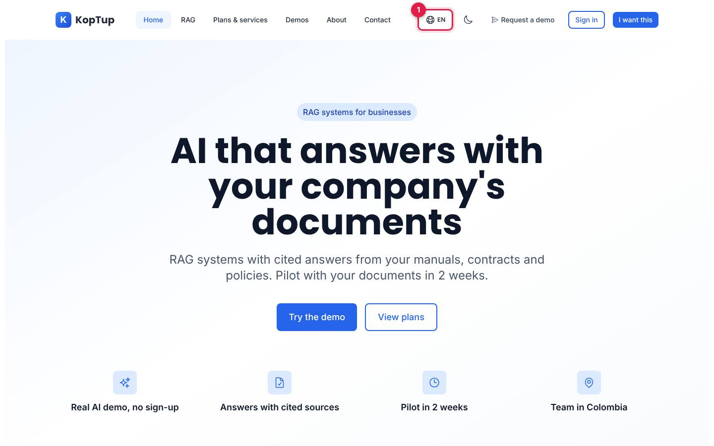

*Tras pulsar ES/EN: la página se recarga en inglés y el botón muestra EN.*

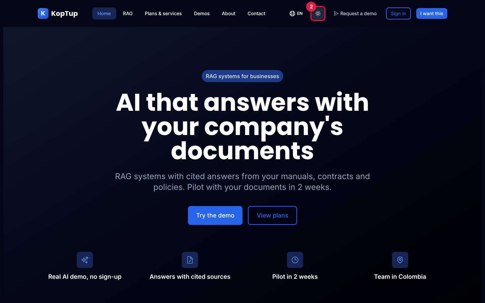

*Tras pulsar la luna: modo oscuro; el botón muestra un sol para volver al claro.*

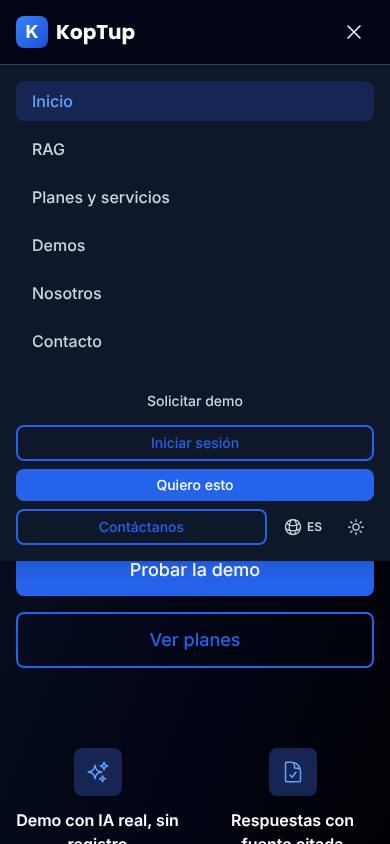

*En el celular, idioma y tema están al final del menú desplegable.*

- **Idioma:** español por defecto. La cookie `locale` dura un año. No cambia la URL (no hay `/en`), así que los buscadores indexan la versión en español.
- **Tema:** claro por defecto. Se guarda en el navegador y se aplica en todas las páginas, incluidas las demos.

Algunas partes no se traducen al inglés:

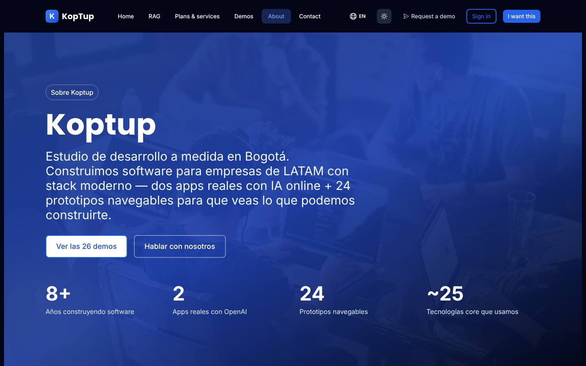

*Con el sitio en inglés, `/about` sigue en español (el menú sí está en inglés).*

---

## 8. Qué mide cada flujo

Solo se envían si el visitante aceptó cookies y hay una etiqueta configurada. Nunca llevan datos personales (ni nombre, ni email, ni el contenido de los documentos).

| Evento | Cuándo se dispara | Flujo | Parámetros |
|---|---|---|---|
| `demo_start` | Primera pregunta en `/demo/chatbot` en esa carga de página | 1 | `demo_mode`: `sample` (ejemplo) o `upload` (documento propio) |
| `demo_upload` | Documento subido con éxito | 1 | `file_type` (pdf, docx, txt) y `pages` |
| `plan_click` | Clic en el botón de un plan RAG o en las tarjetas de "Otras soluciones" | 1 | `plan_name`, `plan_id`, `plan_group`, `cta` |
| `generate_lead` | Envío exitoso del contacto o de la solicitud de demo | 2 y 3 | `lead_source` (`contact_form` o `demo-request`) y, si aplica, servicio, plan o demos |
| `whatsapp_click` | Clic en un enlace de WhatsApp | 2 y 3 | `link_location` |

Las conversiones de Google Ads se importan desde Google Analytics. Detalle en [SEO, analítica y legal](Doc-12-SEO-Analitica-y-Legal.md).

---

## 9. Para desarrolladores

| Flujo | Web (archivos) | API |
|---|---|---|
| 1. Demo RAG | `app/demo/chatbot/page.tsx`; `components/upload/{UploadDemo,UploadForm,DocumentChat,api}.ts(x)`; `components/demoEvents.ts` | `GET /api/chatbot/models`, `POST /api/chatbot/bots/:id/chat` (ejemplo); `GET /api/demo-rag/status`, `POST /api/demo-rag/documents`, `GET`/`DELETE /api/demo-rag/documents/:docId`, `POST /api/demo-rag/documents/:docId/questions` |
| 1. Planes → contacto | `components/rag/RagPlans.tsx`, `lib/rag-plans.ts` (`ragPlanContactHref`), `app/contact/page.tsx` | — |
| 2. Solicitar demo | `components/demo-request/DemoRequestForm.tsx`, `lib/demo-system.ts` | `GET /api/demo-catalog`, `POST /api/demo-requests` (`routes/demo-public.routes.ts`, `services/demo-requests.service.ts`) |
| 3. Contacto | `app/contact/page.tsx`, `lib/api.ts` (`submitContactForm`) | `POST /api/contact` (`controllers/contact.controller.ts` → `services/lead.service.ts`) |
| 4. Demo bloqueada | `middleware.ts`, `app/demo-acceso/[slug]/page.tsx`, `components/demo/DemoAccessGate.tsx`, `lib/demo-access-defaults.ts` | `GET /api/demo-catalog` (caché de 60 s en el middleware), `GET /api/demo-access/:slug` |
| 5. Cookies | `components/consent/CookieBanner.tsx`, `lib/cookie-consent.ts`, `components/analytics/Analytics.tsx`, `lib/analytics.ts`, `app/cookies/page.tsx` | — |
| 6. Idioma y tema | `components/layout/Navbar.tsx` (`toggleLanguage`, `setTheme`), `app/layout.tsx` (lee la cookie `locale`), `components/providers/ThemeProvider.tsx` | — |

Reglas que conviene recordar:

- **Demo RAG con documento propio:** 5 MB, 30 páginas, 10 preguntas por documento, 3 documentos por conexión al día (Redis), preguntas de hasta 500 caracteres, 10 intentos de subida y 30 preguntas por conexión cada 10 minutos, vida de 1 hora en memoria. Se enciende con `DEMO_UPLOAD_ENABLED=true` y necesita Redis y la clave de OpenAI.
- **Leads:** los tres orígenes (`contact-form`, `demo-rag`, `demo-request`) pasan por `registerLeadWithNotifications` y terminan en la colección `Contact`.
- **Contacto:** valida `name`, `email`, `service` y `message`; 5 envíos por minuto por conexión.
- **Solicitud de demo:** validación con zod, honeypot `website`, autorización obligatoria, cupos por conexión y por email, fusión con una solicitud abierta del mismo email en 30 días.

La referencia completa de endpoints está en [API](Doc-08-API.md) y la de colecciones en [Modelos de datos](Doc-09-Modelos-de-Datos.md).

---

## 10. Limitaciones conocidas

| # | Flujo | Qué pasa | Efecto |
|---|---|---|---|
| 1 | 5 | No hay ninguna etiqueta de medición configurada en el sitio publicado. | No aparece el banner y no se mide ningún evento; las campañas no tienen conversiones. |
| 2 | 1 | "Prueba con tu documento" en `/rag` y las landings abre la demo en "Prueba el asistente", no en la pestaña de subida (`?mode=upload`). | Un clic de más para quien quiere subir su documento. |
| 3 | 3 | El campo "¿Cuándo quieres empezar?" se envía, pero el servidor **no lo guarda**; además, su texto no se traduce al inglés. | Se pierde esa respuesta del visitante. |
| 4 | 3 | Al cotizar desde "Otras soluciones" (`?service=<slug>&tier=…&modality=…`), el banner muestra el identificador técnico ("crm ia") y el nivel y la modalidad no se guardan. | El equipo no ve qué nivel eligió el visitante. |
| 5 | 3 | **Admin › Contactos** no muestra el origen del lead (`source`), aunque la API lo devuelve. Hoy se distinguen por el texto del servicio. | Difícil filtrar los leads de la demo o de las solicitudes. |
| 6 | 5 | La tabla de `/cookies` no coincide con lo que usa el sitio: dice `session_id`, `auth_token`, `csrf_token` y `language`, pero las cookies reales son `accessToken`, `refreshToken` y `locale`, y el tema se guarda en el navegador (no en una cookie `theme`). | La política de cookies está desactualizada. |
| 7 | 5 | `/cookies` confirma con ventanas del navegador (`alert`) y trata al lector de "usted". | Experiencia poco pulida. |
| 8 | 6 | Al cambiar de idioma la página se recarga **sin los parámetros de la URL**: se pierde, por ejemplo, el plan preseleccionado en `/contact?service=…&plan=…` o el modo de la demo (`?mode=upload`). | El visitante debe volver a elegir. |
| 9 | 6 | Sin traducción al inglés: `/about`, `/bienvenido-producthunt`, parte del pie de página y los títulos SEO (el `<title>` sigue en español). | Experiencia mixta en inglés. |

---

## 11. Páginas relacionadas

- [Páginas públicas](Doc-03-Paginas-Publicas.md): cómo es cada página que se menciona aquí.
- [Guía de la demo RAG](Guia-Demo-chatbot.md): la demo del chatbot por dentro.
- [Flujos del prospecto y cliente](Doc-05-Flujos-del-Prospecto-y-Cliente.md): qué pasa después de la aprobación.
- [Manual del administrador](Doc-06-Manual-del-Administrador.md): aprobar solicitudes y atender contactos.
- [Roles y permisos](Doc-10-Roles-y-Permisos.md): cómo se decide el acceso a cada demo.
- [SEO, analítica y legal](Doc-12-SEO-Analitica-y-Legal.md): consentimiento, eventos y Ley 1581.
- Plan original: [Flujo del cliente](03-Flujo-del-Cliente.md), [Sistema de demos](04-Sistema-de-Demos.md) y [Comercial, marketing y legal](11-Comercial-Marketing-y-Legal.md).
