# Flujos del prospecto y del cliente

> **Resumen.** Esta página muestra, con capturas reales, todo lo que vive una persona **después** de pedir una demo: cómo activa su cuenta con el enlace de un solo uso, cómo inicia sesión y recupera su contraseña, qué ve en **Mis demos**, qué pasa al abrir una demo con o sin acceso, y qué ocurre cuando el acceso vence o el equipo lo retira. También recorre, sección por sección, el portal del cliente (`/dashboard`) y aclara qué muestra datos reales, qué está vacío y qué es solo de ejemplo.
>
> **Para quién:** el dueño (qué vive el cliente, qué funciona y qué no) y un desarrollador (rutas, endpoints, archivos y reglas). El formulario "Solicitar demo" está en [Flujos del visitante](Doc-04-Flujos-del-Visitante.md) y la parte del equipo (aprobar, extender, revocar) en el [Manual del administrador](Doc-06-Manual-del-Administrador.md).

**Personas de ejemplo** (ficticias, creadas con el flujo real en el entorno de capturas):

| Persona | Empresa | Rol | Para qué la usamos |
|---|---|---|---|
| Camila Restrepo | Ferretería El Roble SAS | Prospecto (`prospect`), cuenta activada | Activación, Mis demos, abrir demos, vencimiento y revocación |
| Julián Ortiz | Transportes Sabana SAS | Prospecto sin activar (cuenta `invitado`) | Errores del enlace de activación y del inicio de sesión |
| Mateo Álvarez | Comercializadora Pacífico SAS | Cliente (`client`) | Recorrido del portal del cliente |

## Índice

1. [El recorrido en una imagen](#1-el-recorrido-en-una-imagen)
2. [Activar la cuenta (`/activar/<token>`)](#2-activar-la-cuenta-activartoken)
3. [Iniciar sesión (`/login`)](#3-iniciar-sesión-login)
4. [Recuperar la contraseña (`/forgot-password` y `/reset-password`)](#4-recuperar-la-contraseña-forgot-password-y-reset-password)
5. [Mis demos (`/dashboard/demos`)](#5-mis-demos-dashboarddemos)
6. [Abrir una demo: con acceso y sin acceso](#6-abrir-una-demo-con-acceso-y-sin-acceso)
7. [Cuando el acceso vence o el equipo lo retira](#7-cuando-el-acceso-vence-o-el-equipo-lo-retira)
8. [El menú del portal: prospecto vs. cliente](#8-el-menú-del-portal-prospecto-vs-cliente)
9. [El portal del cliente, sección por sección](#9-el-portal-del-cliente-sección-por-sección)
10. [¿Qué puedo hacer según mi rol?](#10-qué-puedo-hacer-según-mi-rol)
11. [Para desarrolladores](#11-para-desarrolladores)
12. [Limitaciones conocidas](#12-limitaciones-conocidas)
13. [Páginas relacionadas](#13-páginas-relacionadas)

---

## 1. El recorrido en una imagen

De la solicitud a la demo abierta hay **cuatro momentos**: la persona pide la demo, el equipo la aprueba, la persona activa su cuenta con el enlace y, desde **Mis demos**, abre la demo. El servidor vuelve a comprobar el acceso **cada vez** que se abre una demo.

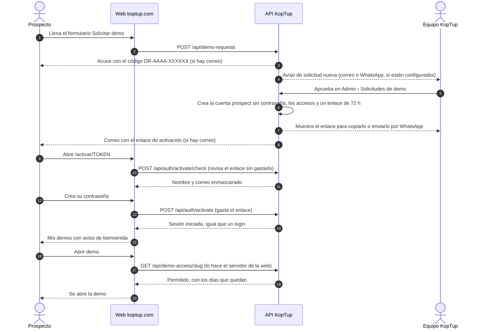
```mermaid
sequenceDiagram
    autonumber
    actor P as Prospecto
    participant W as Web koptup.com
    participant A as API KopTup
    actor E as Equipo KopTup
    P->>W: Llena el formulario Solicitar demo
    W->>A: POST /api/demo-requests
    A-->>P: Acuse con el código DR-AAAA-XXXXXX (si hay correo)
    A-->>E: Aviso de solicitud nueva (correo o WhatsApp, si están configurados)
    E->>A: Aprueba en Admin › Solicitudes de demo
    A->>A: Crea la cuenta prospect sin contraseña, los accesos y un enlace de 72 h
    A-->>E: Muestra el enlace para copiarlo o enviarlo por WhatsApp
    A-->>P: Correo con el enlace de activación (si hay correo)
    P->>W: Abre /activar/TOKEN
    W->>A: POST /api/auth/activate/check (revisa el enlace sin gastarlo)
    A-->>W: Nombre y correo enmascarado
    P->>W: Crea su contraseña
    W->>A: POST /api/auth/activate (gasta el enlace)
    A-->>W: Sesión iniciada, igual que un login
    W-->>P: Mis demos con aviso de bienvenida
    P->>W: Abrir demo
    W->>A: GET /api/demo-access/slug (lo hace el servidor de la web)
    A-->>W: Permitido, con los días que quedan
    W-->>P: Se abre la demo
```

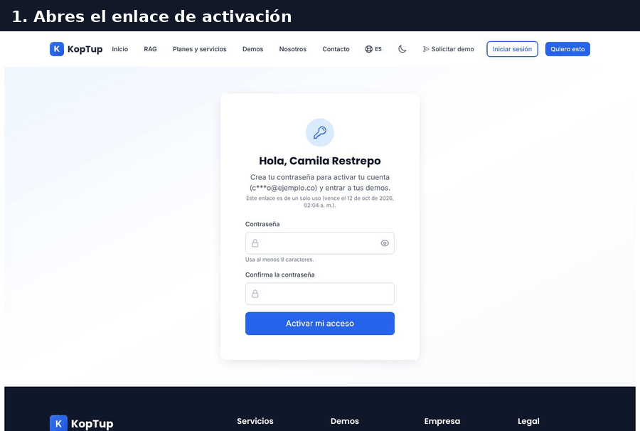

*GIF: Camila abre su enlace, crea la contraseña, llega a Mis demos y abre el ERP.*

---

## 2. Activar la cuenta (`/activar/<token>`)

Cuando el equipo aprueba una solicitud, el sistema crea una **cuenta de prospecto sin contraseña** (estado `invitado`) y un **enlace de un solo uso** que vence a las **72 horas**. El enlace llega por correo (si el servidor tiene correo configurado) y, siempre, el panel se lo muestra al equipo para copiarlo o enviarlo por WhatsApp.

### 2.1 El formulario

Al abrir el enlace, la página **solo revisa** que sirva (no lo gasta: si un filtro de correo abre el enlace antes que la persona, no pasa nada). El enlace se gasta en el momento de crear la contraseña.

*Formulario de activación (ejemplo con el enlace vigente de Julián).*

1. **Saludo con el nombre** de la solicitud. Debajo, el correo de la cuenta **enmascarado** (p. ej. `j***z@ejemplo.co`).
2. **Aviso de un solo uso** con la fecha y hora en que vence el enlace.
3. **Contraseña:** mínimo 8 caracteres, máximo 128. El texto de ayuda se pone verde al llegar a 8.
4. **Ojo** para mostrar u ocultar lo que escribes (aplica a los dos campos).
5. **Confirmación** de la contraseña.
6. **Activar mi acceso:** guarda la contraseña, deja la cuenta activa, **inicia la sesión** y te lleva a Mis demos con el aviso "Tu cuenta quedó activa".

Si las contraseñas no coinciden o son cortas, el error aparece debajo sin enviar nada al servidor:

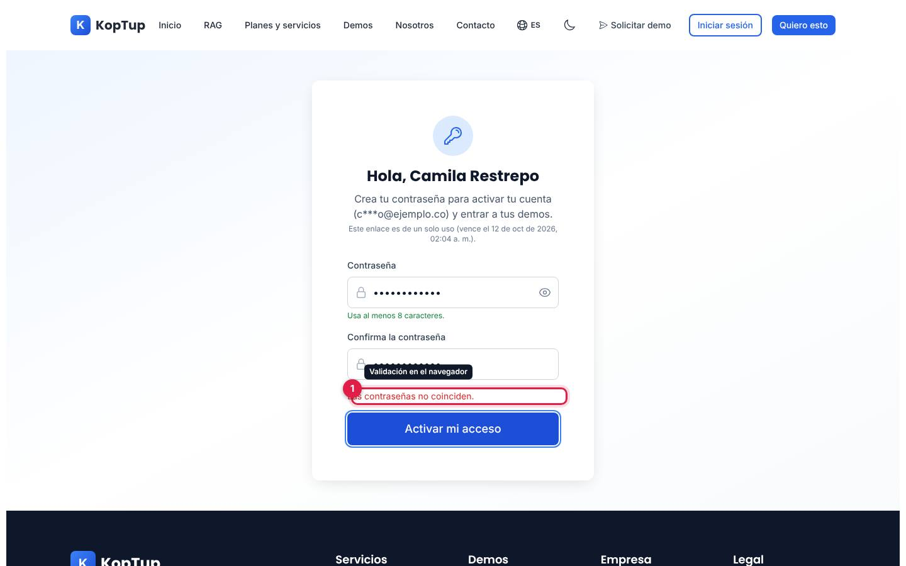

*La validación de la contraseña ocurre en el navegador antes de enviar.*

### 2.2 Cuando el enlace no sirve

Hay cuatro motivos por los que un enlace de activación deja de servir. Todos muestran una tarjeta clara con la salida para la persona:

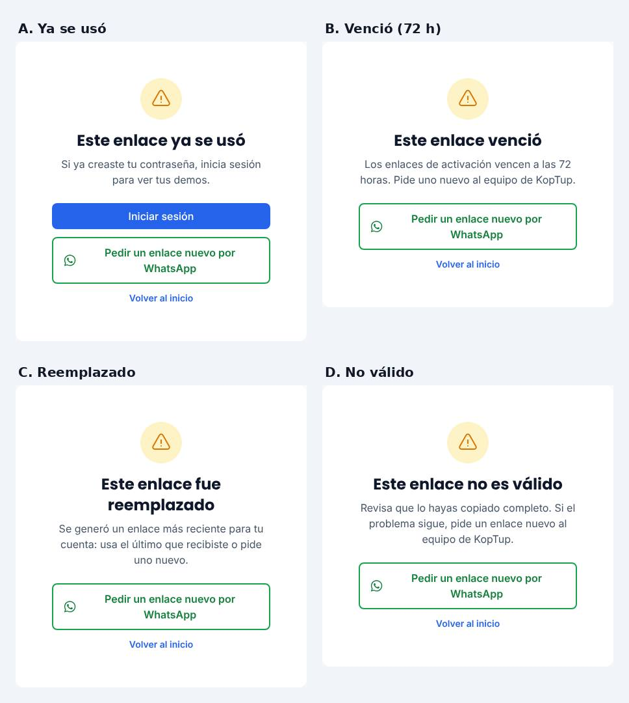

*Errores del enlace: ya usado (A), vencido (B), reemplazado (C) y no válido (D).*

| Motivo (código) | Cuándo pasa | Qué puede hacer la persona |
|---|---|---|
| **Ya se usó** (`token_used`) | La contraseña ya se creó con ese enlace. | Botón **Iniciar sesión** (vuelve a Mis demos) o pedir un enlace nuevo por WhatsApp. |
| **Venció** (`token_expired`) | Pasaron las 72 horas sin usarlo. | Pedir un enlace nuevo por WhatsApp. El equipo lo genera desde el panel. |
| **Fue reemplazado** (`token_replaced`) | El equipo generó un enlace más reciente (el anterior se invalida solo). | Usar el último enlace recibido o pedir uno nuevo. |
| **No es válido** (`token_invalid`) | El enlace está incompleto o mal copiado. | Revisar el enlace o pedir uno nuevo. |
| Demasiados intentos (`rate_limited`) | Demasiadas revisiones o activaciones seguidas desde la misma conexión. | Esperar un minuto; botón **Intentar de nuevo**. |
| Sin conexión / error general | El servidor no respondió. | Botón **Intentar de nuevo**. |

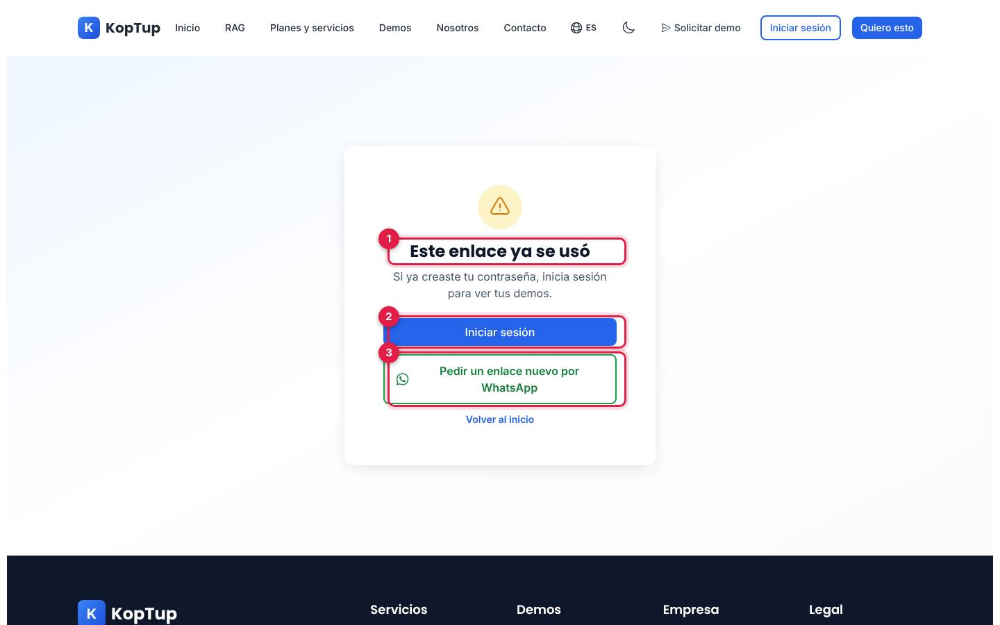

*Enlace ya usado: (1) motivo, (2) ir a iniciar sesión, (3) pedir un enlace nuevo por WhatsApp con el mensaje ya escrito.*

> En el entorno de capturas el estado "vencido" se simuló adelantando la fecha del enlace en la base de datos local; en la vida real ocurre solo a las 72 horas.

### 2.3 Estados de la cuenta y del enlace

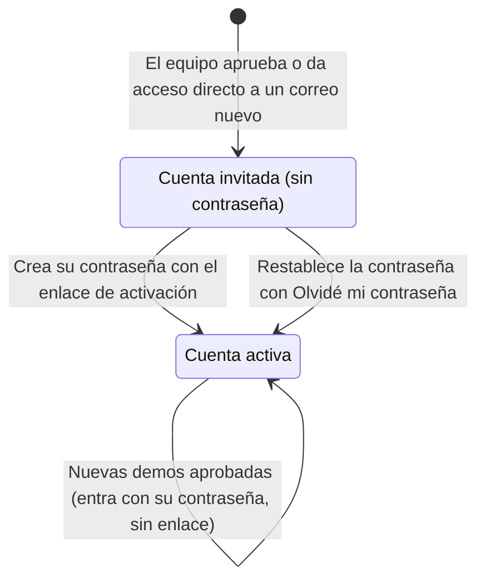
```mermaid
stateDiagram-v2
    state "Cuenta invitada (sin contraseña)" as Invitada
    state "Cuenta activa" as Activa
    [*] --> Invitada: El equipo aprueba o da acceso directo a un correo nuevo
    Invitada --> Activa: Crea su contraseña con el enlace de activación
    Invitada --> Activa: Restablece la contraseña con Olvidé mi contraseña
    Activa --> Activa: Nuevas demos aprobadas (entra con su contraseña, sin enlace)
```

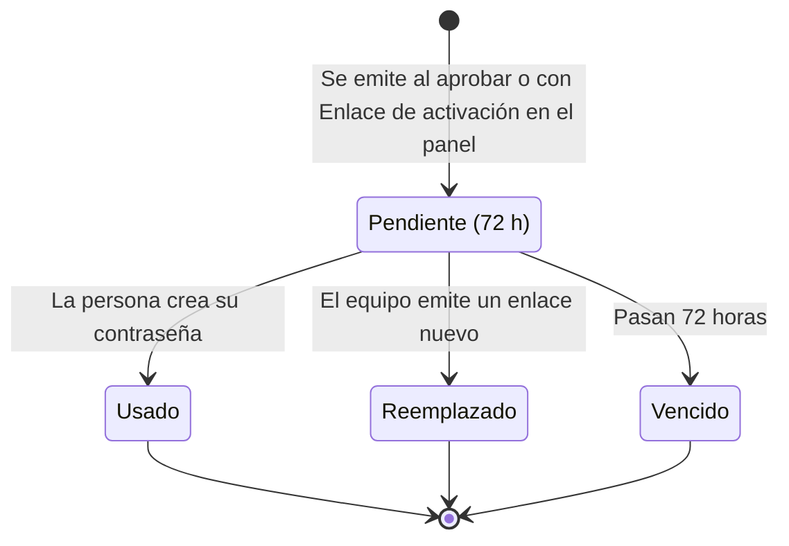
```mermaid
stateDiagram-v2
    state "Pendiente (72 h)" as Pendiente
    state "Usado" as Usado
    state "Reemplazado" as Reemplazado
    state "Vencido" as Vencido
    [*] --> Pendiente: Se emite al aprobar o con Enlace de activación en el panel
    Pendiente --> Usado: La persona crea su contraseña
    Pendiente --> Reemplazado: El equipo emite un enlace nuevo
    Pendiente --> Vencido: Pasan 72 horas
    Usado --> [*]
    Reemplazado --> [*]
    Vencido --> [*]
```

Puntos clave:

- **Una cuenta invitada no puede iniciar sesión** (no tiene contraseña). Si lo intenta, ve el mensaje de la [sección 3](#3-iniciar-sesión-login).
- Si a una persona que **ya tiene cuenta activa** le aprueban otra demo, no recibe enlace de activación: la demo aparece en su Mis demos y el correo (si hay) la invita a iniciar sesión. Si era **cliente**, conserva su rol.
- **Olvidé mi contraseña también activa** una cuenta invitada: si la persona pide restablecer la contraseña y usa ese enlace, la cuenta queda activa y el enlace de activación pendiente deja de servir.

---

## 3. Iniciar sesión (`/login`)

*Inicio de sesión con correo y contraseña.*

1. **Continuar con Google:** funciona solo si el servidor tiene Google configurado; la cuenta que crea es de rol `user` (cliente).
2. **Continuar con GitHub:** hoy no hace nada (ver [Limitaciones](#12-limitaciones-conocidas)).
3. **Correo electrónico.**
4. **Contraseña** (con ojo para mostrarla).
5. **Recordarme:** hoy no cambia nada; la sesión dura lo mismo con o sin marcarlo.
6. **¿Olvidaste tu contraseña?** lleva a la [sección 4](#4-recuperar-la-contraseña-forgot-password-y-reset-password).
7. **Ingresar.**

Más abajo están **Crear cuenta** (`/register`), **Continuar como invitado y ver demos** (`/demo`) y **Volver al inicio**.

**¿Adónde te lleva después de entrar?**

| Rol | Página de inicio |
|---|---|
| Prospecto (`prospect`) | `/dashboard/demos` (Mis demos) |
| Cliente (`user` o `client`) | `/dashboard` (Panel) |
| Equipo: `admin` o `manager` | `/admin` |
| Equipo: `sales` | `/admin/solicitudes` |

Si llegaste al login desde una página protegida (por ejemplo una demo), al entrar **vuelves a esa página** y no a la de inicio. El login solo acepta rutas internas del sitio.

### Volver a una demo con la sesión cerrada

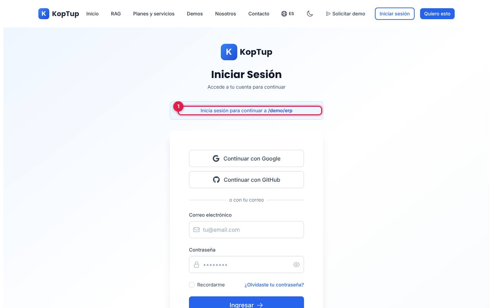

*(1) Aviso "Inicia sesión para continuar a /demo/erp": al entrar, la web te devuelve a la demo.*

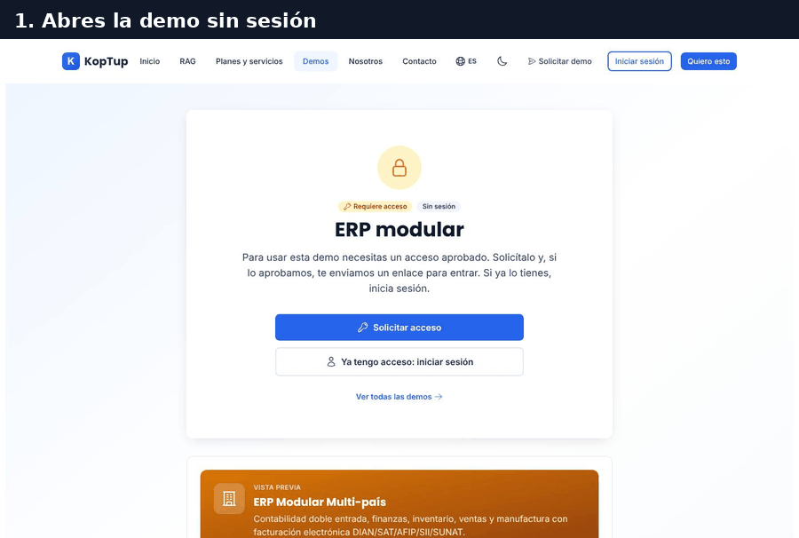

*GIF: sin sesión, la demo pide iniciar sesión; después de entrar, se abre directamente.*

### Errores frecuentes

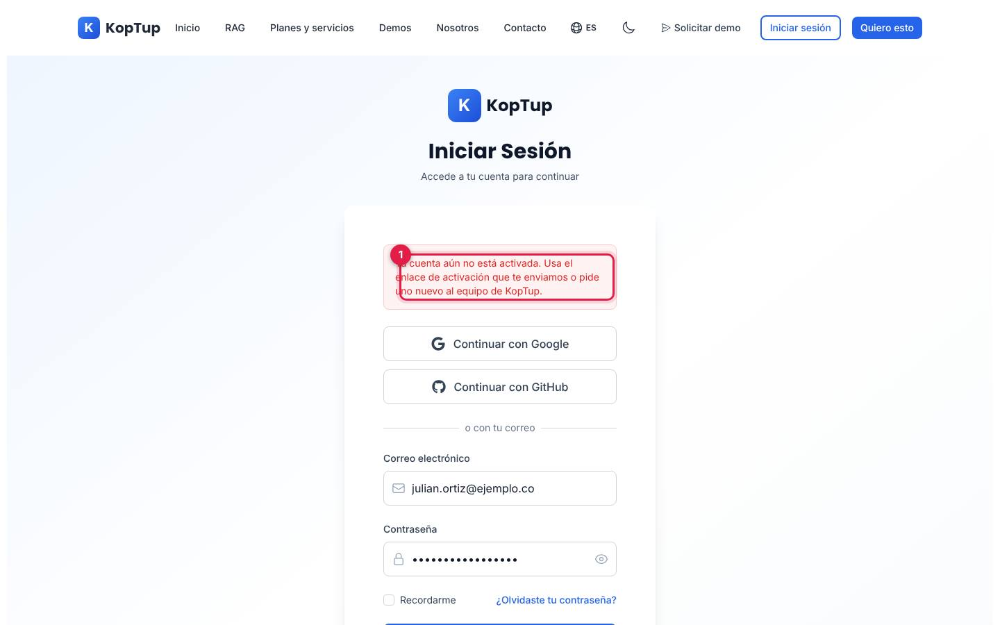

*(1) Una cuenta invitada que intenta entrar sin haber usado su enlace de activación.*

| Mensaje | Causa |
|---|---|
| "Tu cuenta aún no está activada. Usa el enlace de activación que te enviamos o pide uno nuevo al equipo de KopTup." | Cuenta `invitado`: falta crear la contraseña con el enlace. |
| "El correo electrónico o la contraseña son incorrectos. Si no tienes cuenta, regístrate primero." (con enlace **Crear cuenta**) | Correo o contraseña equivocados. |
| "Tu sesión ha expirado. Por favor inicia sesión nuevamente." | La sesión no se pudo renovar (ver abajo). |
| "No se pudo conectar con el servidor…" | El backend no respondió. |

**¿Cuánto dura la sesión?** El acceso se renueva solo cada 15 minutos mientras haya una sesión vigente, hasta **7 días** después de iniciar sesión. Pasado ese plazo, o si la cuenta inicia sesión en **otro navegador** o cambia su contraseña, el navegador anterior tendrá que volver a iniciar sesión. El botón de **salida** (icono de puerta, arriba a la derecha del portal) cierra la sesión y lleva al inicio del sitio.

---

## 4. Recuperar la contraseña (`/forgot-password` y `/reset-password`)

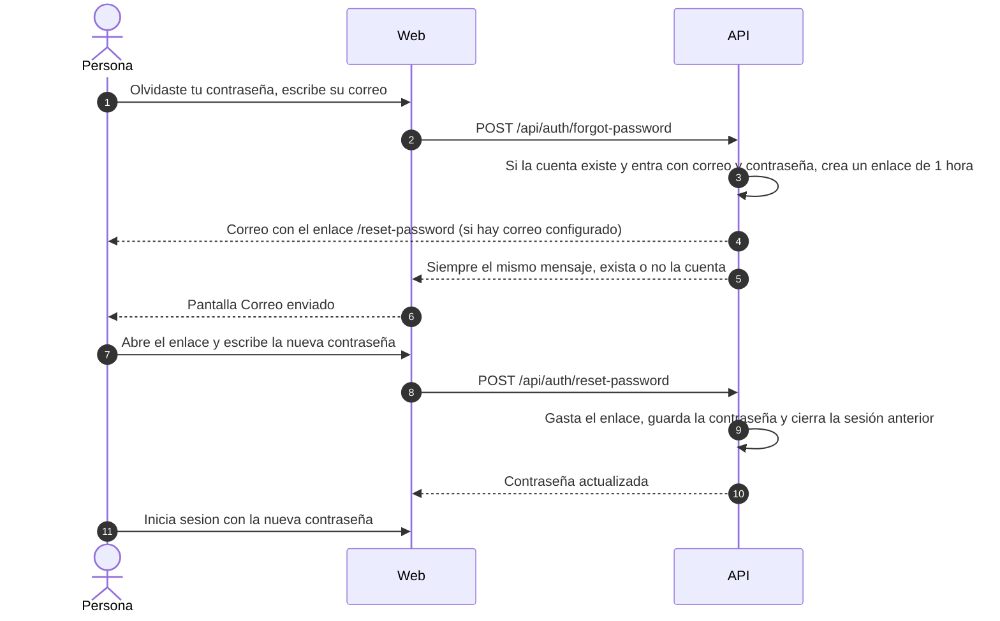
```mermaid
sequenceDiagram
    autonumber
    actor P as Persona
    participant W as Web
    participant A as API
    P->>W: Olvidaste tu contraseña, escribe su correo
    W->>A: POST /api/auth/forgot-password
    A->>A: Si la cuenta existe y entra con correo y contraseña, crea un enlace de 1 hora
    A-->>P: Correo con el enlace /reset-password (si hay correo configurado)
    A-->>W: Siempre el mismo mensaje, exista o no la cuenta
    W-->>P: Pantalla Correo enviado
    P->>W: Abre el enlace y escribe la nueva contraseña
    W->>A: POST /api/auth/reset-password
    A->>A: Gasta el enlace, guarda la contraseña y cierra la sesión anterior
    A-->>W: Contraseña actualizada
    P->>W: Inicia sesion con la nueva contraseña
```

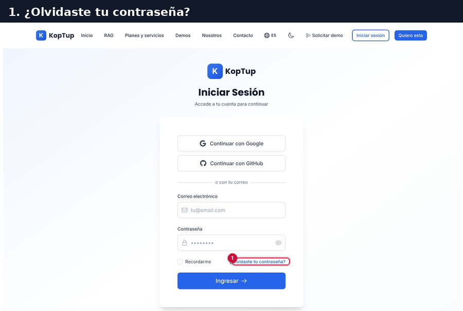

*GIF: de "¿Olvidaste tu contraseña?" a entrar con la contraseña nueva.*

| Paso | Captura |
|---|---|
| 1. Escribes tu correo (1) y pulsas **Enviar enlace de recuperación** (2). |  |
| 2. La página confirma "Correo enviado". **Siempre** dice lo mismo, exista o no la cuenta, para que nadie pueda averiguar qué correos están registrados. | 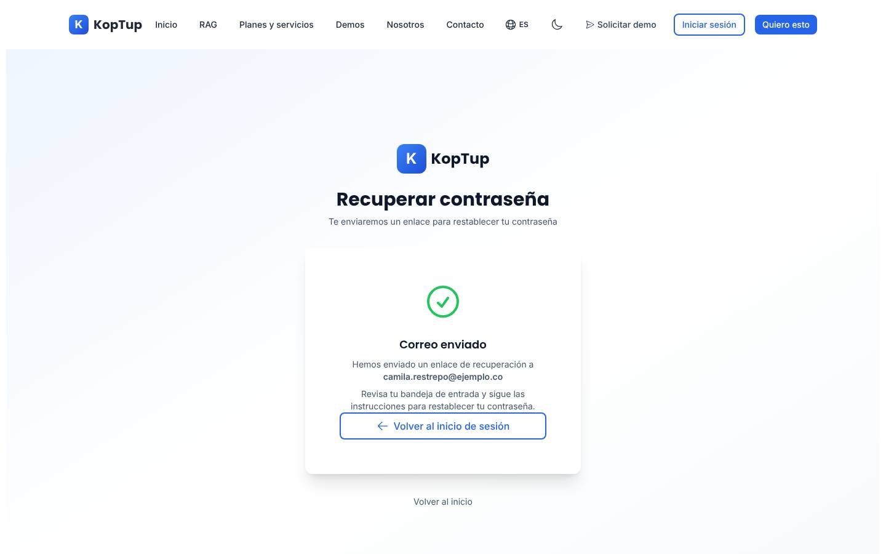 |
| 3. En el enlace del correo escribes la nueva contraseña (1), puedes mostrarla (2), la confirmas (3) y pulsas **Restablecer contraseña** (4). |  |
| 4. Listo: botón **Ir a iniciar sesión**. | 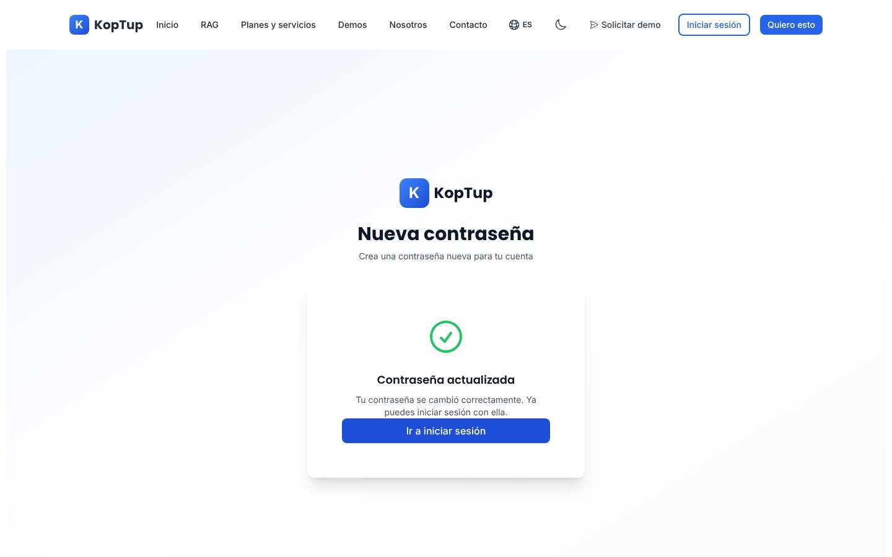 |
| Si el enlace no sirve (vencido, usado o mal copiado) aparece (1) "El enlace de recuperación es inválido o expiró". | 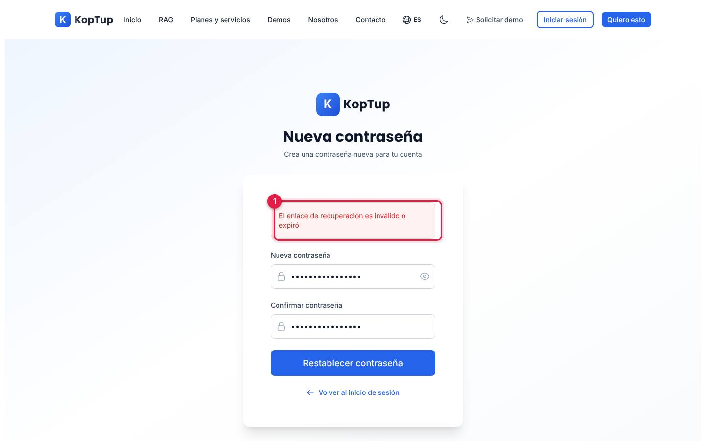 |

*Capturas de `/forgot-password` y `/reset-password` con la cuenta de Camila.*

Reglas:

- El enlace de recuperación **vence en 1 hora** y sirve **una sola vez**; pedir otro invalida el anterior.
- Las cuentas que entran **con Google** no reciben enlace (no tienen contraseña de KopTup).
- Al restablecer, la sesión abierta en otros navegadores deja de renovarse.
- **Sin correo configurado en el servidor no llega ningún enlace**, aunque la pantalla diga "Correo enviado" (en las capturas el enlace se generó directamente en la base de datos local para poder mostrar el paso 3).

---

## 5. Mis demos (`/dashboard/demos`)

Es la página principal del prospecto y también existe para el cliente. Muestra **cada demo aprobada** con su estado, los días que le quedan y el botón para abrirla. Los datos son **reales**: salen de `GET /api/me/demos` (los accesos de tu cuenta).

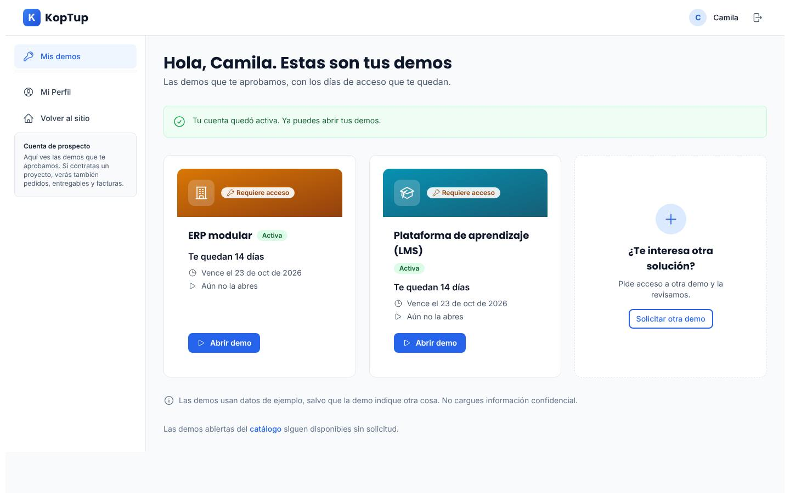

*Primera visita después de activar: aviso verde de bienvenida y las dos demos aprobadas (ERP y LMS, 14 días).*

### Los estados de una tarjeta

*Mis demos de Camila con los cinco tipos de tarjeta.*

1. **Vence pronto** (amarillo): faltan 3 días o menos. Muestra "Te quedan N días" en ámbar.
2. **Pedir más tiempo:** abre el formulario de solicitud con esa demo ya marcada.
3. **Activa** (verde): "Te quedan N días", fecha de vencimiento, último ingreso ("Aún no la abres" si nunca entró) y **Abrir demo**.
4. **Vencida** (gris, imagen en blanco y negro): "Terminó el (fecha)" y botón **Pedir más tiempo**.
5. **Retirada** (rojo): "Este acceso fue retirado." y botón **Solicitar de nuevo**.

| Estado | Cuándo | Botones |
|---|---|---|
| Activa | Acceso vigente con más de 3 días. | Abrir demo |
| Vence pronto | Acceso vigente con 3 días o menos ("Vence hoy" el último día). | Abrir demo · Pedir más tiempo |
| Vencida | Pasó la fecha de vencimiento. | Pedir más tiempo |
| Retirada | El equipo revocó el acceso. | Solicitar de nuevo |
| En mantenimiento | El equipo desactivó la demo en el catálogo; tu acceso sigue vigente. | — (al abrirla dice "En mantenimiento") |

Orden: primero las vigentes (la que vence antes, arriba), luego las vencidas y al final las retiradas. La última tarjeta, **¿Te interesa otra solución?**, lleva al formulario para pedir otra demo. Al pie, dos avisos: las demos usan **datos de ejemplo** (no cargues información confidencial) y las demos abiertas del catálogo siguen disponibles sin solicitud.

> Para mostrar la tarjeta "Vencida" se adelantó la fecha de ese acceso en la base de datos local; el resto de estados se crearon con el flujo real (acceso directo de 2 días para "Vence pronto" y revocación desde el panel para "Retirada").

### Pedir más tiempo

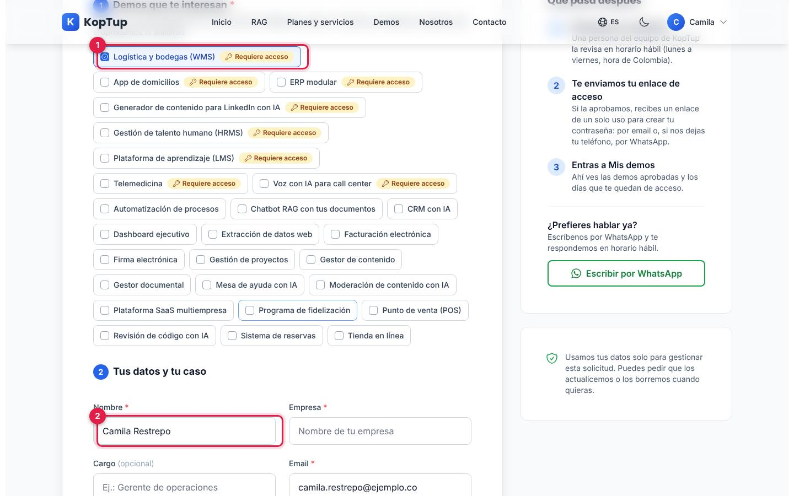

*"Pedir más tiempo" abre `/solicitar-demo?demos=wms-logistica`: (1) la demo ya viene marcada y (2) el nombre y el correo vienen de tu sesión.*

La solicitud llega al equipo como cualquier otra (si ya tienes una abierta de los últimos 30 días, se le suman las demos). Al aprobarla, el acceso vigente se **extiende**; si ya había vencido, se crea uno nuevo.

### Sin demos y en el celular

| Sin demos aprobadas | En el celular (390 px) |
|---|---|
| 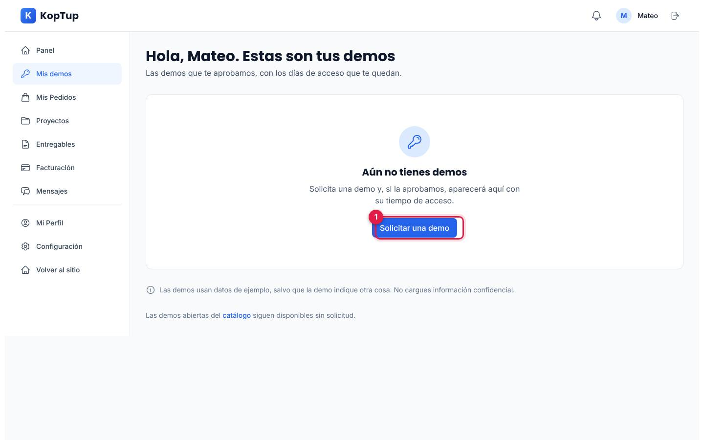 | 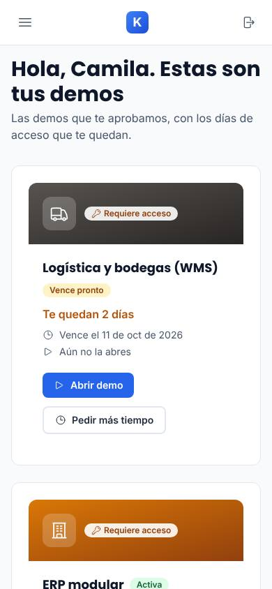 |
| *(1) "Aún no tienes demos" con el botón **Solicitar una demo** (aquí, la cuenta del cliente Mateo).* | *Las tarjetas se apilan; el menú se abre con el botón de tres rayas.* |

---

## 6. Abrir una demo: con acceso y sin acceso

Cada demo del catálogo tiene un **modo de acceso** que el equipo elige en Admin › Catálogo de demos:

- **Abierta** (`publico`): la ve cualquiera, sin cuenta.
- **Requiere acceso** (`solicitud`): solo con un acceso aprobado y vigente.
- **Solo por invitación** (`privado`): igual, pero solo un administrador puede darla.

Cuando abres `/demo/<slug>`, **el servidor de la web decide antes de mostrar nada** (no basta con esconder un botón). Si no tienes acceso, ves una pantalla de acceso en la **misma dirección** `/demo/<slug>`.

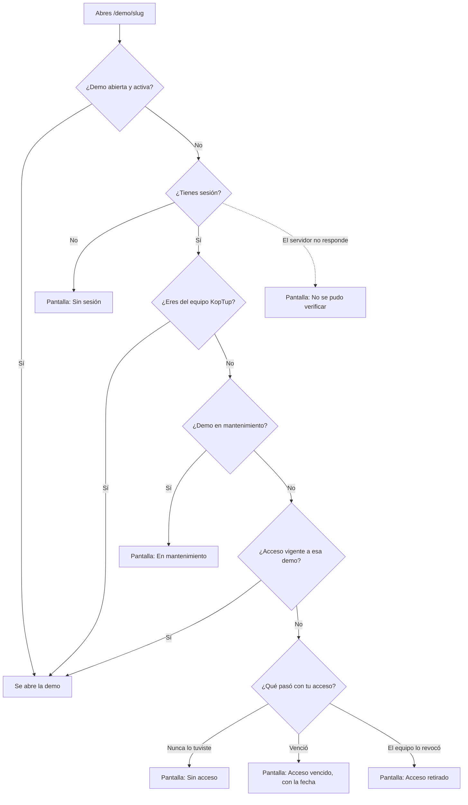
```mermaid
flowchart TD
    A["Abres /demo/slug"] --> B{"¿Demo abierta y activa?"}
    B -- "Sí" --> OK["Se abre la demo"]
    B -- "No" --> C{"¿Tienes sesión?"}
    C -- "No" --> S1["Pantalla: Sin sesión"]
    C -- "Sí" --> D{"¿Eres del equipo KopTup?"}
    D -- "Sí" --> OK
    D -- "No" --> E{"¿Demo en mantenimiento?"}
    E -- "Sí" --> S2["Pantalla: En mantenimiento"]
    E -- "No" --> F{"¿Acceso vigente a esa demo?"}
    F -- "Sí" --> OK
    F -- "No" --> G{"¿Qué pasó con tu acceso?"}
    G -- "Nunca lo tuviste" --> S3["Pantalla: Sin acceso"]
    G -- "Venció" --> S4["Pantalla: Acceso vencido, con la fecha"]
    G -- "El equipo lo revocó" --> S5["Pantalla: Acceso retirado"]
    C -. "El servidor no responde" .-> S6["Pantalla: No se pudo verificar"]
```

### Con acceso

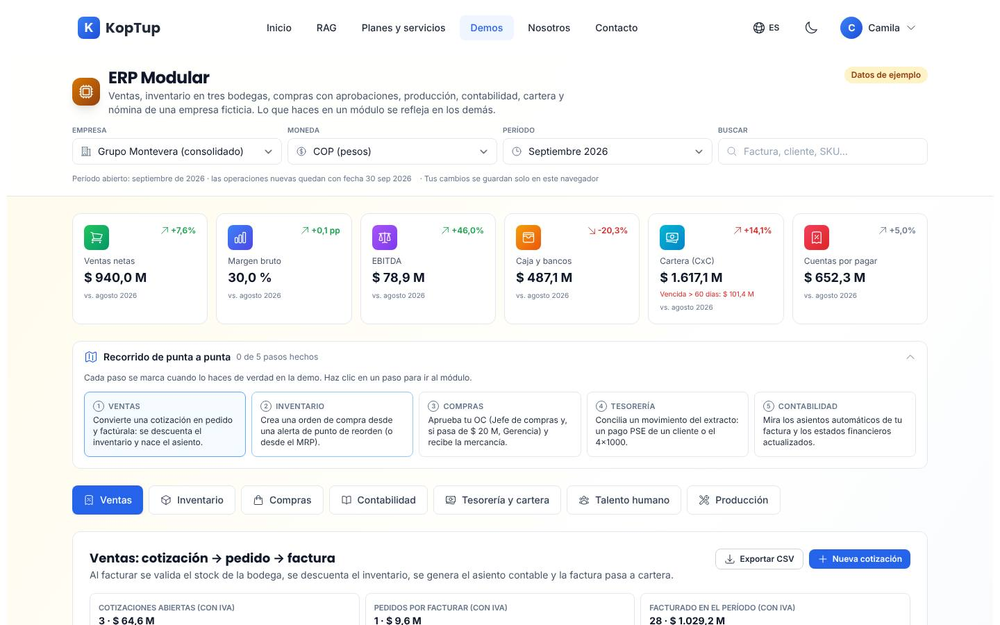

*Con acceso vigente la demo se abre normal (aquí el ERP, con la etiqueta "Datos de ejemplo"). Cada apertura actualiza "Último ingreso" en Mis demos.*

### Sin acceso: las pantallas

| Situación | Captura |
|---|---|
| **Sin sesión** en una demo que requiere acceso: (1) modo "Requiere acceso", (2) motivo "Sin sesión", (3) **Solicitar acceso**, (4) **Ya tengo acceso: iniciar sesión** (vuelve a la demo después del login). Debajo, una **vista previa** de la demo. |  |
| **Sin acceso** (con sesión, pero esa demo no te la aprobaron): (1) motivo, (2) **Solicitar acceso**, (3) **Ver mis demos**. | 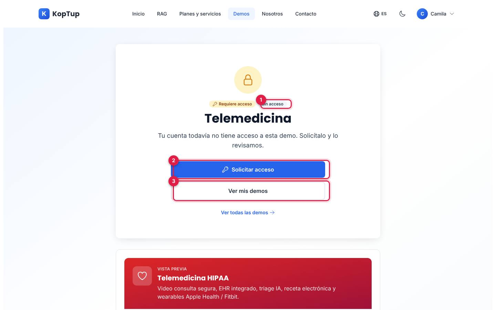 |
| **Solo por invitación** sin invitación: (1) modo, (2) motivo, (3) **Solicitar demo personalizada**. | 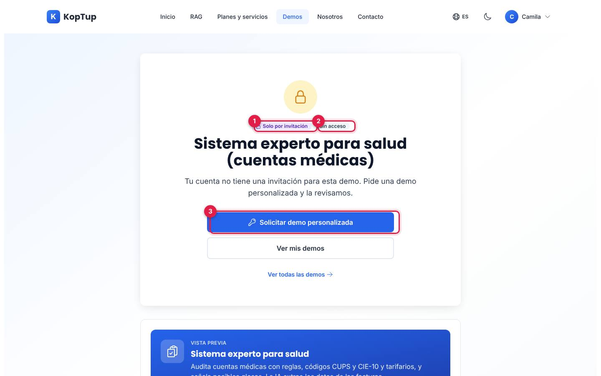 |
| **Acceso vencido:** (1) motivo, (2) fecha en que venció, (3) **Pedir más tiempo**, (4) **Ver mis demos**. | 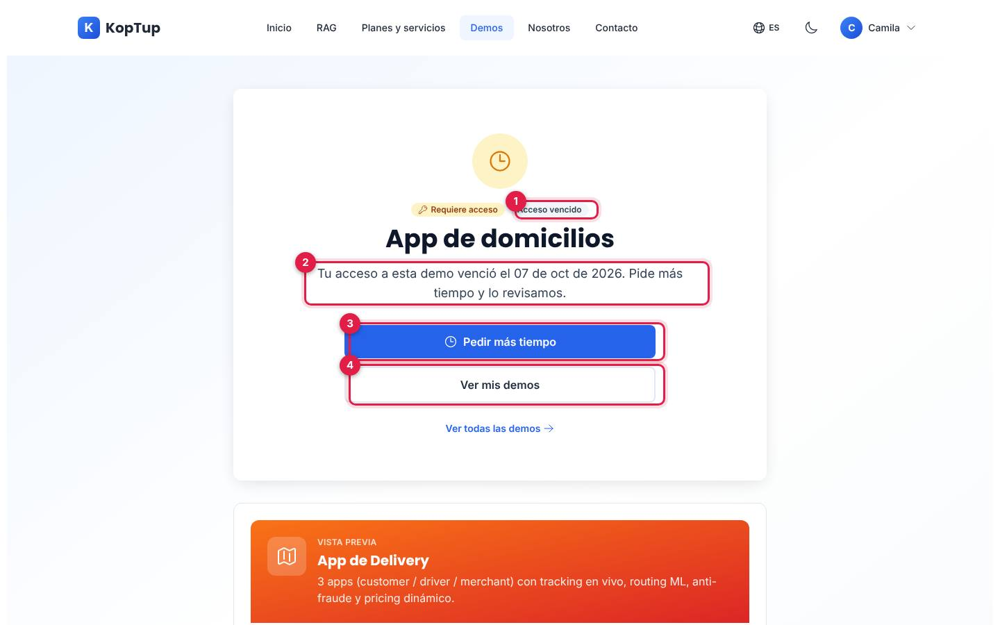 |
| **Acceso retirado:** (1) motivo, (2) **Solicitar de nuevo**, (3) **Escribirnos** (`/contact`). No muestra fechas. | 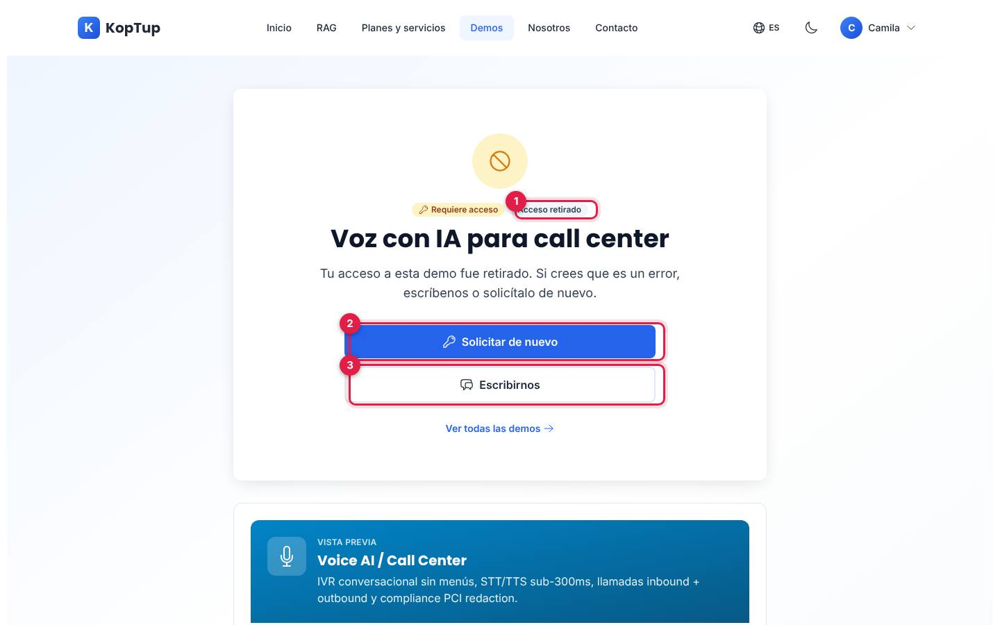 |

*Pantallas de acceso de `/demo/erp`, `/demo/telemedicina`, `/demo/cuentas-medicas`, `/demo/delivery` y `/demo/voice-ai`.*

Otras dos variantes, sin captura: **En mantenimiento** (botones "Ver otras demos" y "Solicitar demo guiada") y **No se pudo verificar** cuando el servidor no responde ("Intentar de nuevo"). En ese último caso las demos abiertas siguen funcionando y las demás quedan cerradas por seguridad.

---

## 7. Cuando el acceso vence o el equipo lo retira

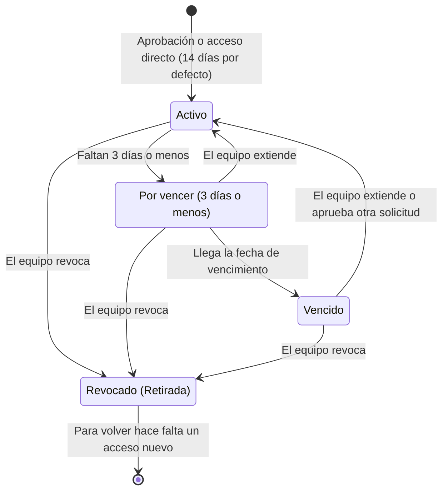
```mermaid
stateDiagram-v2
    state "Activo" as Activo
    state "Por vencer (3 días o menos)" as PorVencer
    state "Vencido" as Vencido
    state "Revocado (Retirada)" as Revocado
    [*] --> Activo: Aprobación o acceso directo (14 días por defecto)
    Activo --> PorVencer: Faltan 3 días o menos
    PorVencer --> Activo: El equipo extiende
    PorVencer --> Vencido: Llega la fecha de vencimiento
    Vencido --> Activo: El equipo extiende o aprueba otra solicitud
    Activo --> Revocado: El equipo revoca
    PorVencer --> Revocado: El equipo revoca
    Vencido --> Revocado: El equipo revoca
    Revocado --> [*]: Para volver hace falta un acceso nuevo
```

*"Por vencer" no es un estado guardado: es como se ve un acceso activo en sus últimos 3 días (y cuando se envía el recordatorio por correo).*

**Qué pasa en cada caso:**

| Evento | Qué ve la persona | Correo (si hay correo configurado) |
|---|---|---|
| Faltan 3 días o menos | Tarjeta "Vence pronto" y botón "Pedir más tiempo". | Un recordatorio con las demos que vencen. |
| Llega la fecha | La demo deja de abrirse **en el mismo momento** (el servidor compara la fecha en cada apertura) y la tarjeta pasa a "Vencida". Una tarea automática, cada hora, además lo marca como vencido. | No hay correo de vencimiento. |
| El equipo **extiende** | La tarjeta vuelve a "Activa" con la nueva fecha. | "Extendimos tu acceso a (nombre de la demo)". |
| El equipo **revoca** | La demo deja de abrirse de inmediato; tarjeta "Retirada". | No hay correo. |

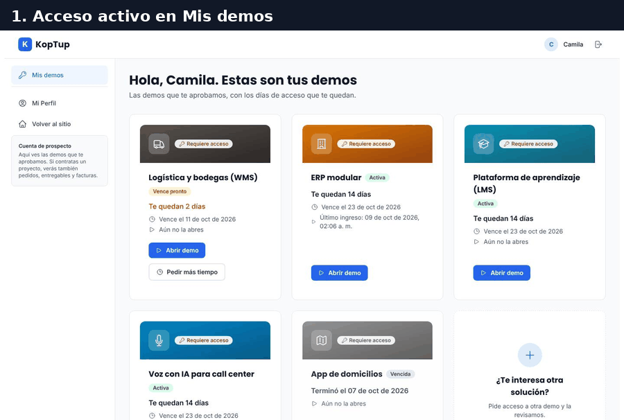

*GIF: el acceso a "Voz con IA" está activo, el equipo lo revoca en Admin › Accesos a demos, la tarjeta pasa a "Retirada" y la demo muestra "Acceso retirado".*

> **Si la demo ya estaba abierta** cuando vence o se revoca el acceso, la página cargada sigue funcionando hasta que la persona recargue o navegue a otra página; ahí el servidor la corta. Las demos con servidor propio (cuentas médicas, sistema experto, LinkedIn Ads) además rechazan la siguiente operación.

Cómo extender, revocar o generar un enlace nuevo desde el panel: [Manual del administrador](Doc-06-Manual-del-Administrador.md).

---

## 8. El menú del portal: prospecto vs. cliente

El portal (`/dashboard`) es el mismo para los dos, pero **el prospecto solo ve Mis demos y Mi perfil**. El servidor de la web también lo impone: si un prospecto escribe a mano `/dashboard/orders` (o cualquier otra sección), lo devuelve a Mis demos.

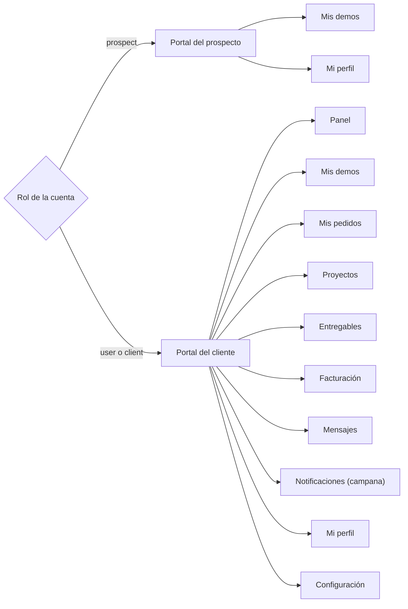
```mermaid
flowchart LR
    R{"Rol de la cuenta"} -- "prospect" --> P["Portal del prospecto"]
    R -- "user o client" --> C["Portal del cliente"]
    P --> P1["Mis demos"]
    P --> P2["Mi perfil"]
    C --> C1["Panel"]
    C --> C2["Mis demos"]
    C --> C3["Mis pedidos"]
    C --> C4["Proyectos"]
    C --> C5["Entregables"]
    C --> C6["Facturación"]
    C --> C7["Mensajes"]
    C --> C8["Notificaciones (campana)"]
    C --> C9["Mi perfil"]
    C --> C10["Configuración"]
```

### Menú del prospecto

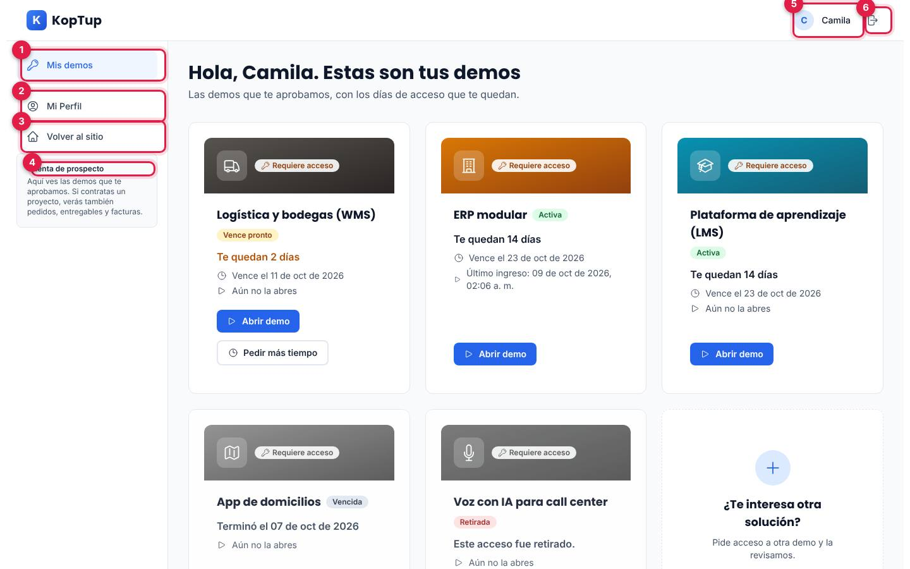

*Portal del prospecto.*

1. **Mis demos** (única sección de trabajo).
2. **Mi perfil.**
3. **Volver al sitio** (inicio de koptup.com).
4. Cuadro **Cuenta de prospecto**: "Aquí ves las demos que te aprobamos. Si contratas un proyecto, verás también pedidos, entregables y facturas."
5. Tu nombre: lleva a Mi perfil.
6. **Cerrar sesión.**

El prospecto **no** ve la campana de notificaciones ni Configuración.

### Menú del cliente

*Portal del cliente (Mateo), sobre el Panel.*

1. **Panel** · 2. **Mis demos** · 3. **Mis pedidos** · 4. **Proyectos** · 5. **Entregables** · 6. **Facturación** · 7. **Mensajes** · 8. **Mi perfil** · 9. **Configuración** · 10. **Volver al sitio** · 11. **Campana de notificaciones** (con contador de no leídas) · 12. **Selector de vista del Panel** ("Sin plan", "Plan SaaS", "Servicio"), explicado en la [sección 9.1](#91-panel-dashboard).

### Menú de la cuenta en el sitio y en el celular

| Menú de la cuenta en la barra del sitio | Portal en el celular |
|---|---|
| 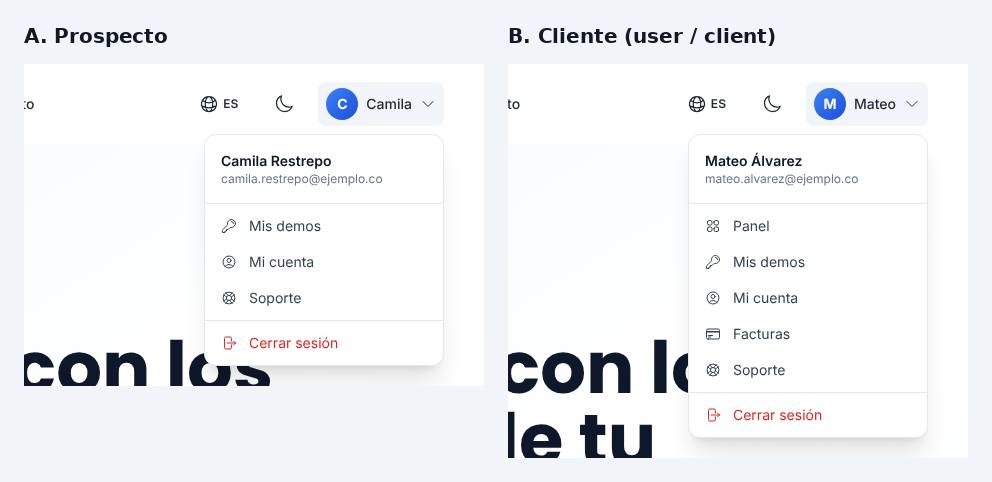 | 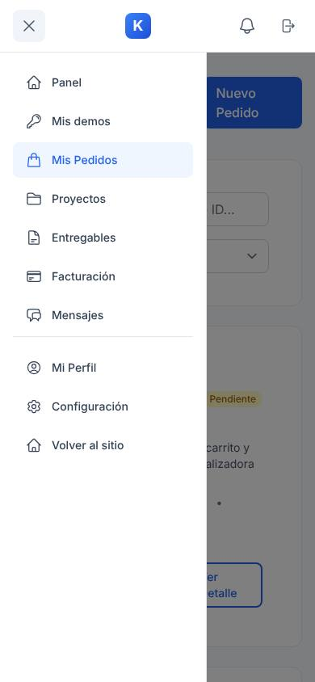 |
| *Con sesión, el nombre en la barra del sitio abre un menú: el prospecto ve Mis demos, Mi cuenta y Soporte; el cliente además Panel y Facturas.* | *En el celular el menú lateral se abre con el botón de tres rayas.* |

**¿Cómo pasa un prospecto a ser cliente?** Cuando el equipo le cambia el rol (Admin › Usuarios). El flujo comercial completo (propuesta, anticipo y conversión automática a cliente) está **en desarrollo**: ver [Estado y próximos pasos](15-Estado-y-Proximos-Pasos.md).

---

## 9. El portal del cliente, sección por sección

Resumen honesto de lo que hace hoy cada sección para una cuenta de cliente (`user` o `client`, que en el código se comportan igual):

| Sección | Ruta | ¿Qué datos muestra? | Estado hoy |
|---|---|---|---|
| Panel | `/dashboard` | **Datos de ejemplo fijos** (no son de tu cuenta). | Maqueta con tres vistas. |
| Mis demos | `/dashboard/demos` | Reales (tus accesos). | Funciona. |
| Mis pedidos | `/dashboard/orders` | Reales (tus pedidos). | Lista y detalle funcionan; **crear pedido falla**. |
| Proyectos | `/dashboard/projects` | Reales. | Siempre vacío: nada en la web crea proyectos. |
| Entregables | `/dashboard/deliverables` | Reales; **de ejemplo si la API falla**. | Vacío en la práctica. |
| Facturación | `/dashboard/billing` | Reales; **de ejemplo si la API falla**. | Vacío en la práctica; sin pagos en línea. |
| Mensajes | `/dashboard/messages` | Reales (conversaciones). | Vacío en la práctica. |
| Notificaciones | `/dashboard/notifications` | Reales. | Vacío: nada genera notificaciones. |
| Mi perfil | `/dashboard/profile` | Reales. | Funciona (datos y contraseña). |
| Configuración | `/dashboard/settings` | Preferencias del navegador. | Idioma y tema funcionan; avisos no se guardan en la cuenta. |

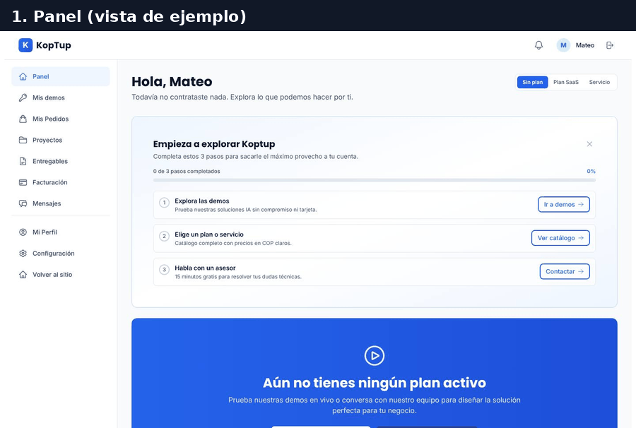

*GIF: Panel, Mis pedidos, detalle, Proyectos, Entregables, Facturación, Mensajes, Notificaciones y Mi perfil del cliente de ejemplo.*

### 9.1 Panel (`/dashboard`)

Es una **maqueta**: los números, planes, hitos y montos están escritos en el código y son iguales para todas las cuentas. Arriba a la derecha, el selector cambia entre tres vistas (la elección se guarda en el navegador):

| Vista | Qué muestra (todo de ejemplo) | Captura |
|---|---|---|
| **Sin plan** (por defecto) | Lista "Empieza a explorar KopTup" (3 pasos), cuadro "Aún no tienes ningún plan activo", planes recomendados con precios y "¿Cómo funciona KopTup?". | Ver la captura del menú del cliente, arriba. |
| **Plan SaaS** | Plan "Growth — Chatbot RAG", conversaciones del mes, satisfacción, disponibilidad, próxima factura y uso del plan. | 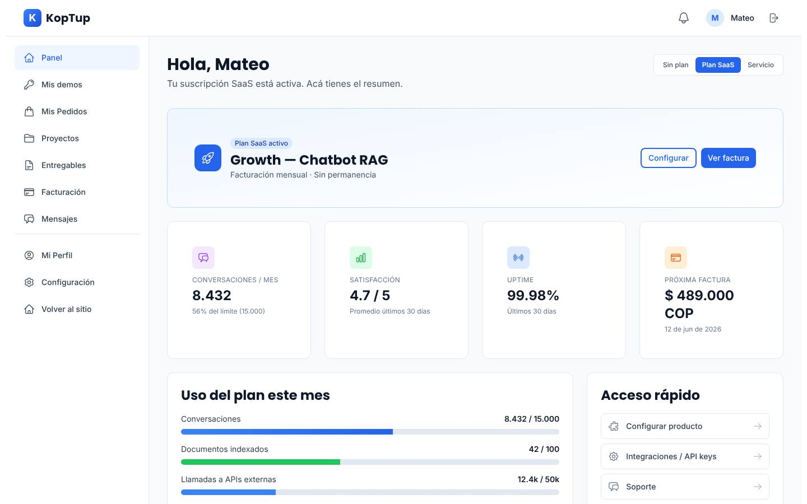 |
| **Servicio** | Proyecto "Chatbot RAG con IA" al 65 %, hitos con fechas, estado de pagos y mensajes del jefe de proyecto. | 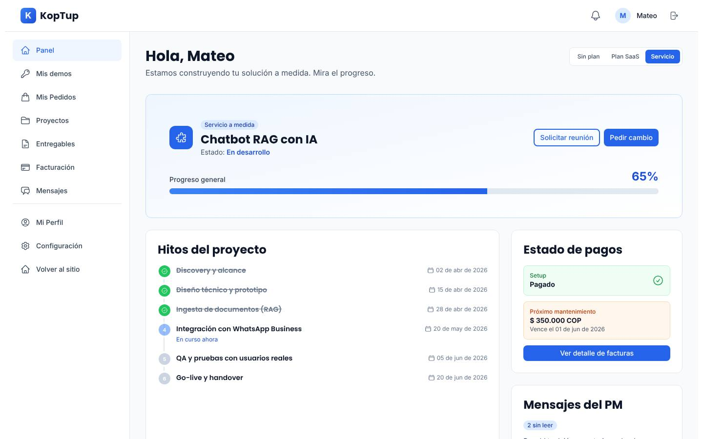 |

*Vistas de ejemplo del Panel; no reflejan datos de la cuenta.*

### 9.2 Mis demos

Igual que para el prospecto ([sección 5](#5-mis-demos-dashboarddemos)). Si el equipo le da una demo a un cliente, aparece aquí y el cliente **conserva su rol**.

### 9.3 Mis pedidos (`/dashboard/orders`)

*Lista de pedidos del cliente (el pedido ORD-0001 se creó por la API para el ejemplo).*

1. **Nuevo pedido** (ver el problema abajo).
2. **Buscar** por nombre o número de pedido.
3. **Filtro por estado:** Todos, Pendiente, En proceso, Enviado, Completado, Cancelado.
4. **Tarjeta del pedido:** nombre, estado, descripción, número, fecha, artículos y monto (en dólares).
5. **Ver detalle.**
6. **Conteo por estado** al pie.

*Detalle de `/dashboard/orders/ORD-0001`.*

1. **Estado** (hoy aparece en inglés: `pending`). 2. **Ítems** con cantidad y valor. 3. **Historial** del pedido. 4. **Ver facturación** (lleva a Facturación). 5. **Cancelar pedido**: lo cancela de inmediato, sin pedir confirmación. Esta página no muestra el menú lateral; se vuelve con "Volver al listado".

*(1) Al crear un pedido desde `/dashboard/orders/new` aparece "Failed to fetch": hoy el formulario no logra enviar el pedido.*

El formulario pide nombre, descripción breve, descripción detallada, archivos adjuntos (hasta 10, de 20 MB) e ítems con cantidad y precio unitario en USD. **Hoy no funciona** (ver [Limitaciones](#12-limitaciones-conocidas)), así que en la práctica un cliente no puede crear pedidos desde la web.

### 9.4 Proyectos (`/dashboard/projects`)

*"No tienes proyectos activos": (1) Nuevo proyecto y (2) Solicitar nuevo proyecto llevan al formulario de contacto.*

Lee los proyectos reales de la cuenta. Cuando hay alguno, muestra progreso, equipo, fechas, presupuesto, fases y entregables, con botones a Entregables y Mensajes. **Hoy ninguna pantalla crea proyectos**, así que para un cliente real está vacío.

### 9.5 Entregables (`/dashboard/deliverables`)

| Con la API respondiendo (real) | Si la API falla (datos de ejemplo) |
|---|---|
|  | 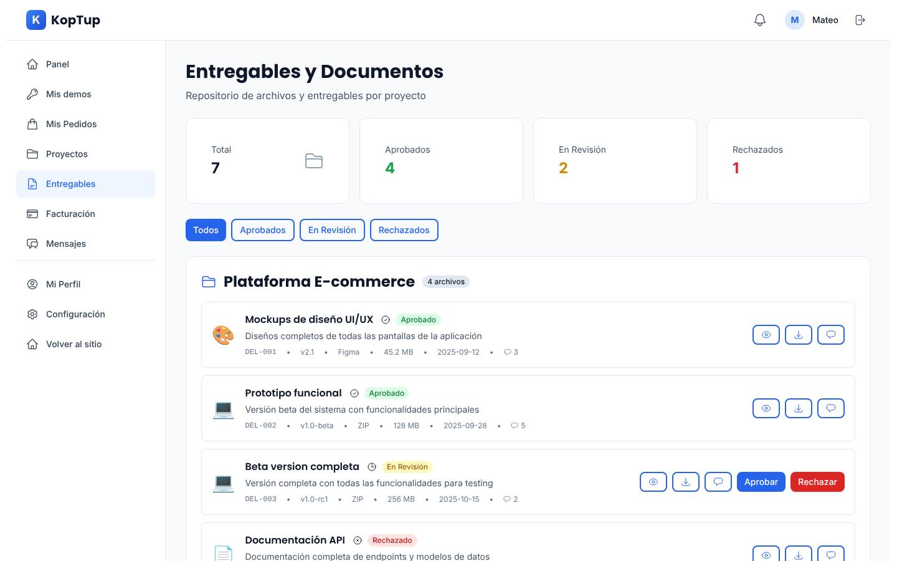 |
| *Contadores en cero y filtros (Todos, Aprobados, En revisión, Rechazados), sin mensaje de "vacío".* | *Si la API falla, la página muestra entregables inventados ("Mockups de diseño UI/UX", "Prototipo funcional"…) como si fueran reales.* |

Cuando hay entregables en revisión, el cliente puede **aprobarlos** o **rechazarlos** (el navegador le pide un comentario), y descargarlos. Solo el equipo puede subirlos (por la API; no hay pantalla para hacerlo).

### 9.6 Facturación (`/dashboard/billing`)

| Con la API respondiendo (real) | Si la API falla (datos de ejemplo) |
|---|---|
|  | 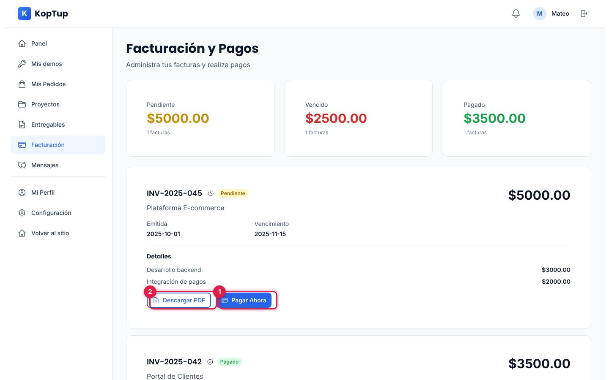 |
| *Totales Pendiente, Vencido y Pagado en $0.00 y sin facturas.* | *Tres facturas inventadas (INV-2025-045…) con (1) **Pagar ahora** y (2) **Descargar PDF**.* |

Hoy no hay facturas reales para mostrar (ver [Limitaciones](#12-limitaciones-conocidas)) y **Pagar ahora no está conectado a ninguna pasarela de pagos**: el cobro en línea está en desarrollo ([Estado y próximos pasos](15-Estado-y-Proximos-Pasos.md)).

### 9.7 Mensajes (`/dashboard/messages`)

*Lista de conversaciones con buscador y panel de chat: "No se encontraron conversaciones".*

Muestra las conversaciones de la cuenta con el equipo y permite responder (Enter envía, Shift + Enter salta de línea). No hay botón para iniciar una conversación: debían crearse solas con cada pedido, y hoy eso no ocurre, así que está vacío.

### 9.8 Notificaciones (`/dashboard/notifications`)

*(1) Preferencias (lleva a Configuración), (2) filtros por tipo, (3) "No hay notificaciones para mostrar".*

Tiene contadores (sin leer, total, proyectos, facturación), filtros (Todas, Pedidos, Proyectos, Facturación, Mensajes), marcar como leída o todas, y borrar. Se llega desde la **campana** del encabezado. Hoy **nada en el sistema genera notificaciones**, así que siempre está vacía.

### 9.9 Mi perfil (`/dashboard/profile`)

Lo usan el prospecto y el cliente. Funciona de punta a punta.

*Mi perfil del cliente de ejemplo.*

1. **Editar:** cambia nombre (mínimo 2 caracteres), teléfono y empresa. El nombre nuevo se ve también en el encabezado.
2. **Correo:** no se puede cambiar aquí ("es tu usuario para iniciar sesión; para cambiarlo, escríbenos").
3. **Tu cuenta:** tipo de cuenta (Prospecto (demos), Cliente o Usuario), forma de inicio de sesión, fecha de creación y último ingreso. "El tipo de cuenta lo asigna el equipo de KopTup".
4. **Cambiar contraseña:** pide la actual y la nueva (mínimo 8, distinta de la actual). Al cambiarla, la sesión de otros navegadores deja de servir. Las cuentas de Google no tienen esta opción.

### 9.10 Configuración (`/dashboard/settings`)

Solo para clientes.

*Configuración del cliente.*

1. **Notificaciones** por correo, push y SMS: las casillas se guardan **solo en este navegador** y hoy no cambian ningún envío.
2. **Idioma** (español o inglés): se aplica al momento y recarga la página.
3. **Tema** claro, oscuro o automático: se aplica al momento.
4. **Guardar cambios:** muestra un aviso del navegador "Configuración guardada exitosamente".

---

## 10. ¿Qué puedo hacer según mi rol?

| Acción | Visitante sin cuenta | Prospecto sin activar (`invitado`) | Prospecto (`prospect`) | Cliente (`user` / `client`) |
|---|---|---|---|---|
| Abrir demos **abiertas** | ✅ | ✅ | ✅ | ✅ |
| Abrir demos **con acceso** o **por invitación** | ❌ Pantalla "Sin sesión" | ❌ Primero debe activar | ✅ Solo las aprobadas y vigentes | ✅ Solo las aprobadas y vigentes |
| Pedir una demo o más tiempo | ✅ | ✅ | ✅ (formulario prellenado) | ✅ (formulario prellenado) |
| Activar la cuenta con el enlace | — | ✅ (72 h, un solo uso) | — (ya activa) | — |
| Iniciar sesión | — | ❌ "Tu cuenta aún no está activada" | ✅ | ✅ |
| Recuperar la contraseña | — | ✅ (y de paso activa la cuenta) | ✅ | ✅ (si no entra con Google) |
| Mis demos | ❌ | ❌ | ✅ | ✅ |
| Mi perfil (datos y contraseña) | ❌ | ❌ | ✅ | ✅ |
| Panel (`/dashboard`) | ❌ | ❌ | ❌ Lo lleva a Mis demos | ✅ (vista de ejemplo) |
| Mis pedidos, Proyectos, Entregables, Facturación, Mensajes | ❌ | ❌ | ❌ Lo lleva a Mis demos | ✅ (ver estado de cada uno en la sección 9) |
| Notificaciones y Configuración | ❌ | ❌ | ❌ | ✅ |
| Aprobar entregables / cancelar sus pedidos | ❌ | ❌ | ❌ | ✅ (solo los suyos) |
| Panel de administración (`/admin`) | ❌ | ❌ | ❌ | ❌ |

Todas las reglas se verifican **en el servidor** (en la web antes de mostrar la página y en la API en cada consulta), no solo escondiendo botones. La matriz completa con los roles del equipo está en [Roles y permisos](Doc-10-Roles-y-Permisos.md).

---

## 11. Para desarrolladores

### Páginas y archivos (en `main`)

| Ruta | Archivo principal | Notas |
|---|---|---|
| `/activar/[token]` | `apps/web/src/app/activar/[token]/page.tsx` → `components/demo-request/ActivateAccount.tsx` | `noindex`. Revisa al cargar y gasta al enviar. Guarda cookies `accessToken` (15 min) y `refreshToken` (7 días) y `localStorage.user`. |
| `/login` | `apps/web/src/app/login/page.tsx` | Usa `homePathForRole` (`lib/auth-roles.ts`) y `?redirect=` (solo rutas internas). |
| `/forgot-password`, `/reset-password?token=` | `apps/web/src/app/forgot-password/page.tsx`, `reset-password/page.tsx` | Textos fijos en español. |
| `/dashboard/*` | `apps/web/src/app/dashboard/**` con `components/dashboard/DashboardLayout.tsx` | El menú se arma con el rol guardado en `localStorage.user`. |
| `/dashboard/demos` | `apps/web/src/app/dashboard/demos/page.tsx` | `?bienvenida=1` muestra el aviso verde. |
| `/demo/<slug>` sin acceso | `src/middleware.ts` reescribe a `/demo-acceso/<slug>?motivo=…&modo=…&vence=…&ruta=…` → `components/demo/DemoAccessGate.tsx` | La URL del navegador no cambia. |
| Protección de `/dashboard` | `apps/web/src/middleware.ts` | Verifica `GET /api/auth/me` (caché 30 s), renueva con `POST /api/auth/refresh` y limita al prospecto a `/dashboard/demos` y `/dashboard/profile`. Backend caído → 503. |

### Endpoints que usa este flujo

| Método y ruta | Quién | Para qué |
|---|---|---|
| `POST /api/auth/activate/check` | Público (20/min por IP) | Revisa el enlace sin gastarlo: nombre, correo enmascarado y vencimiento. |
| `POST /api/auth/activate` | Público (límite estricto) | Gasta el enlace, fija la contraseña, deja la cuenta `activo` y devuelve la sesión. |
| `POST /api/auth/login` · `POST /api/auth/refresh` · `POST /api/auth/logout` | Público / con sesión | Sesión. `login` responde `account_not_activated` a una cuenta invitada. |
| `POST /api/auth/forgot-password` · `POST /api/auth/reset-password` | Público (límite estricto) | Recuperación; respuesta genérica; enlace de 1 h. |
| `GET /api/auth/me` · `PATCH /api/auth/me` · `POST /api/auth/change-password` | Con sesión | Mi perfil. |
| `GET /api/me/demos` | Con sesión | Accesos de la cuenta con días restantes (sin notas internas). |
| `GET /api/demo-access/:slug` | Sesión opcional | Decide si se puede abrir: `{ allowed, reason, expiresAt, diasRestantes }`. `?registrar=0` no cuenta la visita. |
| `GET /api/orders`, `GET /api/orders/:id`, `POST /api/orders/:id/cancel` | Dueño del pedido | Mis pedidos. |
| `GET /api/projects`, `/api/deliverables`, `/api/invoices`, `/api/messages/conversations`, `/api/notifications` | Dueño o participante | Resto del portal. |

Los límites estrictos (5 por minuto y por IP) comparten contador entre registro, login, recuperación, activación y cambio de contraseña. Detalle de cada endpoint en [API](Doc-08-API.md) y de los modelos (`User.accountStatus`, `MagicLinkToken`, `DemoGrant`) en [Modelos de datos](Doc-09-Modelos-de-Datos.md).

### Tiempos y reglas

| Regla | Valor | Dónde |
|---|---|---|
| Vigencia del enlace de activación | 72 horas, un solo uso; emitir otro invalida el anterior | `config/demos.ts`, `services/magic-link.service.ts` |
| Vigencia del enlace de recuperación | 1 hora, un solo uso | Igual |
| Enlaces en la base de datos | Solo el hash SHA-256 del token; se borran 7 días después de vencer | `models/MagicLinkToken.ts` |
| Sesión | Acceso 15 min; renovación 7 días desde el login; una sesión renovable por cuenta | `controllers/auth.controller.ts` |
| Vigencia de un acceso a demo | 14 días por defecto (o la del catálogo); de 1 a 365 al aprobar o extender | `config/demos.ts` |
| "Vence pronto" y recordatorio | 3 días antes | `GRANT_REMINDER_DAYS_BEFORE`, `dashboard/demos/page.tsx` |
| Tarea de vencimientos | Cada hora (primera corrida 30 s después de arrancar), con candado en Redis | `jobs/demo-grants.job.ts` |
| Vigencia real | Se compara la fecha en **cada** consulta; no depende de la tarea | `services/demo-access.service.ts` |
| Conteo de visitas | Una visita nueva tras 30 min sin actividad | `VISIT_GAP_MS` |
| Modo de cada demo en la web | Catálogo del backend con caché de 60 s; si no responde, tabla de respaldo | `src/middleware.ts`, `lib/demo-access-defaults.ts` |

### Correos que recibe la persona (solo si el servidor tiene correo configurado)

| Momento | Correo |
|---|---|
| Envía la solicitud | "Recibimos tu solicitud de demo (DR-AAAA-XXXXXX)". |
| Le aprueban demos | "Tu acceso a las demos de KopTup está listo", con el enlace de activación (cuenta nueva) o con el enlace para entrar a Mis demos (cuenta existente). |
| El equipo genera un enlace nuevo | El mismo correo con el enlace nuevo (si tiene accesos vigentes). |
| Faltan 3 días | "Tu acceso a las demos de KopTup vence pronto" (uno por persona con todas las demos que vencen). |
| El equipo extiende | "Extendimos tu acceso a (nombre de la demo)". |
| El equipo rechaza y elige avisar | "Sobre tu solicitud de demo en KopTup" (sin el motivo interno). |
| Pide recuperar la contraseña | "Recupera tu contraseña - KopTup" con el enlace a `/reset-password`. |

---

## 12. Limitaciones conocidas

Comportamiento actual de `main`, comprobado en el entorno de capturas:

1. **Sin correo configurado no llega nada:** ni acuses, ni enlaces de activación, ni recordatorios, ni enlaces de recuperación. El equipo debe enviar el enlace de activación a mano (el panel siempre lo muestra). `/forgot-password` dice "Correo enviado" aunque no se envíe nada.
2. **Una sesión renovable por cuenta:** iniciar sesión en otro navegador o dispositivo hace que el anterior pida iniciar sesión otra vez en menos de 15 minutos.
3. **Demo abierta cuando vence o se revoca el acceso:** la página ya cargada sigue funcionando hasta recargar o navegar.
4. **Cambio de prospecto a cliente:** el servidor aplica el rol nuevo enseguida, pero el menú lateral del portal se actualiza solo después de cerrar sesión y volver a entrar. El selector de rol de Admin › Usuarios no ofrece "Cliente" ni "Prospecto" (se usa "Usuario", que funciona igual que cliente).
5. **Inicio de sesión:** "Continuar con GitHub" no hace nada; "Recordarme" no cambia la duración de la sesión; "Continuar con Google" depende de que el servidor tenga Google configurado (si no, el navegador muestra un mensaje técnico del servidor). El aviso de demasiados intentos sale en inglés.
6. **Panel del cliente:** todo es de ejemplo y no depende de la cuenta (la vista "Plan SaaS" incluso usa "Acá").
7. **Pedidos:** el formulario "Nuevo pedido" no logra enviar ("Failed to fetch"); el detalle no tiene menú lateral, muestra el estado en inglés y "Cancelar pedido" no pide confirmación.
8. **Proyectos, entregables, facturas, mensajes y notificaciones:** ninguna pantalla los crea hoy; las facturas tampoco se pueden generar desde el panel por un error del servidor, y la conversación automática de cada pedido no se crea. Para un cliente real, esas secciones están vacías.
9. **Datos de ejemplo disfrazados:** Entregables y Facturación muestran registros inventados si la API falla, sin avisar que no son reales; cuando están vacías no muestran un mensaje de "no hay".
10. **Pagos:** "Pagar ahora" no está conectado a ninguna pasarela; el cobro en línea está en desarrollo.
11. **Configuración:** las preferencias de notificaciones solo se guardan en el navegador.
12. **Textos:** `/forgot-password`, `/reset-password`, "Nuevo pedido" y el aviso del login con redirección no se traducen al inglés. "Pedir más tiempo" prellena nombre y correo, pero no la empresa.

---

## 13. Páginas relacionadas

- [Índice de la documentación](Doc-00-Indice.md)
- [Flujos del visitante](Doc-04-Flujos-del-Visitante.md): el formulario "Solicitar demo" y el registro.
- [Manual del administrador](Doc-06-Manual-del-Administrador.md): aprobar, extender, revocar y generar enlaces.
- [Guía de demos](Doc-07-Guia-de-Demos.md): qué hace cada una de las 28 demos.
- [API](Doc-08-API.md) · [Modelos de datos](Doc-09-Modelos-de-Datos.md) · [Roles y permisos](Doc-10-Roles-y-Permisos.md)
- Plan (lo que se quiere construir): [Sistema de demos](04-Sistema-de-Demos.md) · [Portal del cliente](06-Portal-del-Cliente.md) · [Estado y próximos pasos](15-Estado-y-Proximos-Pasos.md)
