# Manual del administrador

> **Resumen.** Este manual explica, paso a paso y con capturas, cómo se usa hoy el panel de administración de KopTup (`/admin`). Cubre el trabajo diario con las demos: revisar y aprobar o rechazar solicitudes, enviar el enlace de activación por WhatsApp, extender o revocar accesos, dar acceso directo a una demo privada y cambiar el modo de una demo. Después recorre las demás secciones del panel (usuarios, contactos, conversaciones, pedidos, facturas, entregables y configuración) y dice con claridad cuáles funcionan, cuáles están vacías y cuáles son solo visuales.
>
> **Para quién:** el dueño, que opera el panel, y un desarrollador, que encontrará al final las rutas, los endpoints y los archivos. Lo que vive el prospecto al otro lado (activar su cuenta, Mis demos) está en [Flujos del prospecto y del cliente](Doc-05-Flujos-del-Prospecto-y-Cliente.md). Los diagramas de operación y los procedimientos ante fallas están en [Flujos de administración y operación](Doc-14-2-Flujos-de-Administracion-y-Operacion.md).

**Personas de ejemplo** (ficticias, creadas con el flujo real en el entorno de capturas):

| Persona | Empresa | Para qué la usamos |
|---|---|---|
| Daniela Quintero | Distribuidora Andina SAS | Solicitud que se aprueba en el recorrido (ERP + talento humano). Antes probó «Prueba con tu documento» en la demo RAG |
| Santiago Herrera | Clínica Santa Lucía IPS | Solicitud pendiente que incluye una demo «Solo por invitación» |
| Valentina Ríos | Café Origen Huila SAS | Solicitud aprobada, cuenta activa y demos ya abiertas; acceso extendido |
| Paula Moreno | Agencia Pixel Caribe SAS | Solicitud «En revisión» con nota interna |
| Diego Castaño | Proyecto de grado | Solicitud rechazada por «Fuera de perfil» |
| Ofertas Digitales | Bases de Datos Express | Solicitud rechazada como spam |
| Natalia Vargas | IPS Salud Integral del Tolima | Acceso directo de 2 días (por vencer), cuenta sin activar |
| Camilo Torres | Seguros Cóndor SAS | Acceso directo que luego se revoca |
| Ricardo Salazar | Grupo Médico del Norte SAS | Acceso directo a una demo privada |
| Mariana López y Jorge Ramírez | Inmobiliaria Los Cerros SAS y Colegio San Gabriel | Mensajes del formulario de contacto |
| Andrea Galeano | Panadería La Espiga SAS | Cliente con un pedido |
| Sofía Mejía | Equipo de KopTup | Cambio de rol a Manager |

En algunas capturas también aparecen personas de ejemplo de otras páginas de la documentación (por ejemplo, Camila Restrepo o Julián Ortiz). El correo de la cuenta de administrador se ocultó en las capturas y los enlaces de activación aparecen recortados (`/activar/••••`).

## Índice

1. [El panel en una imagen](#1-el-panel-en-una-imagen)
2. [Cómo entrar al panel](#2-cómo-entrar-al-panel)
3. [Inicio del panel](#3-inicio-del-panel)
4. [Solicitudes de demo](#4-solicitudes-de-demo)
5. [Accesos a demos](#5-accesos-a-demos)
6. [Catálogo de demos](#6-catálogo-de-demos)
7. [Usuarios y roles](#7-usuarios-y-roles)
8. [Contactos](#8-contactos)
9. [Conversaciones](#9-conversaciones)
10. [Pedidos](#10-pedidos)
11. [Facturas](#11-facturas)
12. [Entregables](#12-entregables)
13. [Configuración](#13-configuración)
14. [Rutina diaria sugerida](#14-rutina-diaria-sugerida)
15. [Si algo no funciona](#15-si-algo-no-funciona)
16. [Para desarrolladores](#16-para-desarrolladores)
17. [Limitaciones conocidas](#17-limitaciones-conocidas)
18. [Páginas relacionadas](#18-páginas-relacionadas)

---

## 1. El panel en una imagen

El panel tiene dos grupos en el menú: **Comercial** (lo que mueve las demos) y **Operación** (lo demás). Qué ves depende de tu rol; el servidor vuelve a comprobar el rol en cada acción.

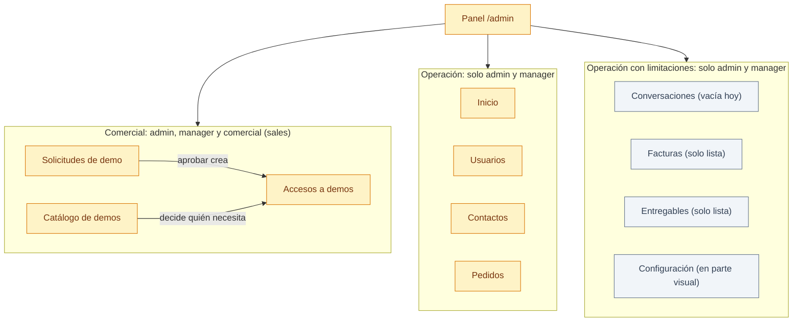
```mermaid
flowchart TB
    classDef admin fill:#fef3c7,stroke:#d97706,color:#78350f
    classDef parcial fill:#f1f5f9,stroke:#64748b,color:#334155

    P["Panel /admin"]:::admin
    subgraph COM["Comercial: admin, manager y comercial (sales)"]
        direction LR
        S["Solicitudes de demo"]:::admin
        A["Accesos a demos"]:::admin
        C["Catálogo de demos"]:::admin
        S -->|"aprobar crea"| A
        C -->|"decide quién necesita"| A
    end
    subgraph OPE["Operación: solo admin y manager"]
        direction LR
        I["Inicio"]:::admin
        U["Usuarios"]:::admin
        CT["Contactos"]:::admin
        PE["Pedidos"]:::admin
    end
    subgraph LIM["Operación con limitaciones: solo admin y manager"]
        direction LR
        CV["Conversaciones (vacía hoy)"]:::parcial
        F["Facturas (solo lista)"]:::parcial
        E["Entregables (solo lista)"]:::parcial
        CF["Configuración (en parte visual)"]:::parcial
    end
    P --> COM
    P --> OPE
    P --> LIM
```

*Ámbar: secciones que funcionan con datos reales. Gris: secciones vacías hoy o que solo muestran información. Cada solicitud de demo también aparece en Contactos.*

El trabajo principal es este: llega una solicitud, la revisas, la apruebas eligiendo demos y días, compartes el enlace de activación y luego sigues el uso desde **Accesos**.

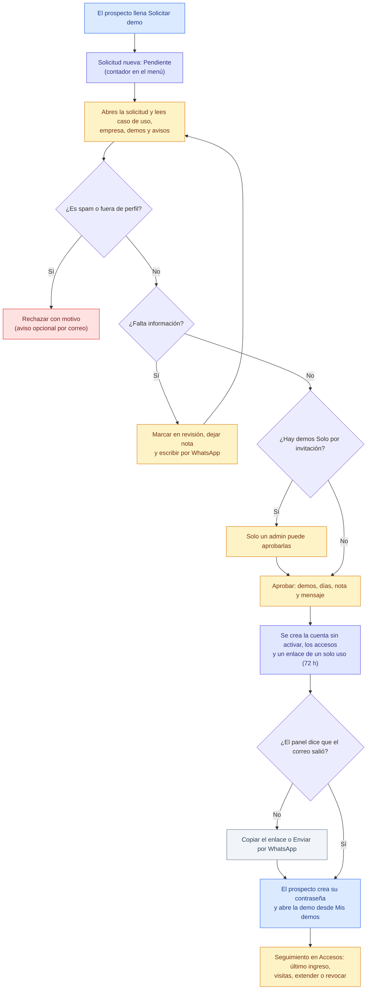
```mermaid
flowchart TD
    classDef usuario fill:#dbeafe,stroke:#2563eb,color:#1e3a8a
    classDef admin fill:#fef3c7,stroke:#d97706,color:#78350f
    classDef sistema fill:#e0e7ff,stroke:#4f46e5,color:#312e81
    classDef error fill:#fee2e2,stroke:#dc2626,color:#7f1d1d
    classDef externo fill:#f1f5f9,stroke:#64748b,color:#334155

    V["El prospecto llena Solicitar demo"]:::usuario
    N["Solicitud nueva: Pendiente<br/>(contador en el menú)"]:::sistema
    R["Abres la solicitud y lees caso de uso,<br/>empresa, demos y avisos"]:::admin
    D1{"¿Es spam o fuera de perfil?"}
    RJ["Rechazar con motivo<br/>(aviso opcional por correo)"]:::error
    D2{"¿Falta información?"}
    RV["Marcar en revisión, dejar nota<br/>y escribir por WhatsApp"]:::admin
    D3{"¿Hay demos Solo por invitación?"}
    AD["Solo un admin puede aprobarlas"]:::admin
    AP["Aprobar: demos, días, nota y mensaje"]:::admin
    SYS["Se crea la cuenta sin activar, los accesos<br/>y un enlace de un solo uso (72 h)"]:::sistema
    D4{"¿El panel dice que el correo salió?"}
    WA["Copiar el enlace o Enviar por WhatsApp"]:::externo
    ACT["El prospecto crea su contraseña<br/>y abre la demo desde Mis demos"]:::usuario
    SEG["Seguimiento en Accesos: último ingreso,<br/>visitas, extender o revocar"]:::admin

    V --> N --> R --> D1
    D1 -->|"Sí"| RJ
    D1 -->|"No"| D2
    D2 -->|"Sí"| RV --> R
    D2 -->|"No"| D3
    D3 -->|"Sí"| AD --> AP
    D3 -->|"No"| AP
    AP --> SYS --> D4
    D4 -->|"No"| WA --> ACT
    D4 -->|"Sí"| ACT
    ACT --> SEG
```

*Flujo de trabajo del administrador con una solicitud. Azul: el prospecto; ámbar: tú; morado: el sistema; gris: WhatsApp; rojo: rechazo.*

---

## 2. Cómo entrar al panel

### 2.1 Iniciar sesión

Entra a `/admin` (o a `/login`) con tu correo y tu contraseña. Si no tienes sesión, el sitio te lleva al inicio de sesión y, al entrar, te devuelve a `/admin`.

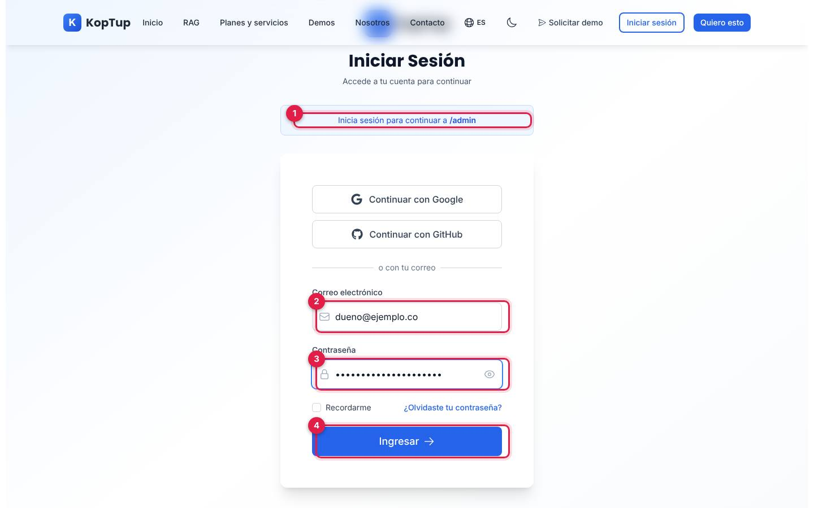

*Inicio de sesión con el aviso de redirección a /admin (datos de ejemplo en los campos).*

1. **Aviso de redirección:** te recuerda a dónde vas a volver después de entrar (`/admin`).
2. **Correo** de tu cuenta.
3. **Contraseña.**
4. **Ingresar:** si tu rol es admin o manager llegas a **Inicio del panel**; si es comercial (`sales`), a **Solicitudes de demo**; cualquier otro rol va a su portal.

Puntos clave:

- La protección es doble: el servidor de la web revisa tu sesión y tu rol antes de mostrar el panel, y el backend vuelve a revisar cada acción.
- Si un prospecto o un cliente escribe `/admin`, el sitio lo manda a su propio portal.
- La sesión se cierra con el ícono de salida, arriba a la derecha. Entrar con la misma cuenta en otro navegador cierra, en pocos minutos, la sesión anterior (ver [Flujos del prospecto y del cliente](Doc-05-Flujos-del-Prospecto-y-Cliente.md#12-limitaciones-conocidas)).

### 2.2 Cómo una cuenta se vuelve admin

Nadie se vuelve admin desde la web pública. Hay tres caminos, y los tres exigen que la cuenta **ya exista** (que la persona se haya registrado antes):

| Camino | Quién lo hace | Cómo | Queda en la bitácora |
|---|---|---|---|
| **Variable `ADMIN_EMAIL`** | Quien administra el servidor | Se define en el backend con el correo de la cuenta. En cada arranque, esa cuenta recibe el rol admin. Sin la variable, el arranque no toca ningún rol | No |
| **Script `set-admin`** | Un desarrollador | Desde `apps/backend`, con la conexión a la base de datos del entorno: `npx ts-node --transpile-only src/scripts/set-admin.ts <correo>` | No |
| **Admin › Usuarios** | Otro admin | Cambia el rol en el selector de la fila (ver [sección 7](#7-usuarios-y-roles)) | Sí (`user.role_change`) |

Detalles que conviene saber:

- `ADMIN_EMAIL` también es el correo que recibe los avisos internos de solicitudes y contactos (si el servidor tiene correo configurado).
- Si a la cuenta de `ADMIN_EMAIL` le quitas el rol desde el panel, lo recupera en el siguiente reinicio o despliegue del backend.
- Un admin no puede quitarse a sí mismo el rol desde el panel (evita quedarse sin administradores).
- Las credenciales nunca se escriben en esta wiki ni en el código. Las variables del servidor se explican en [Operación y despliegue](Doc-11-Operacion-y-Despliegue.md).

### 2.3 Qué ve cada rol

| Sección | Admin | Manager (Gerente) | Comercial (`sales`) |
|---|---|---|---|
| Solicitudes de demo | Ve, aprueba, rechaza y anota | Solo consulta | Ve, aprueba, rechaza y anota (sin demos «Solo por invitación») |
| Accesos a demos | Todo, incluidas demos privadas | Solo consulta | Concede, extiende y revoca (sin demos privadas) |
| Catálogo de demos | Edita | Solo consulta | Solo consulta |
| Inicio, Pedidos, Entregables, Facturas, Conversaciones, Usuarios, Contactos, Configuración | Sí | Sí (no puede cambiar roles) | No aparecen en su menú |

Cuando tu rol solo puede consultar, la pantalla lo dice abajo: «Tu rol solo puede consultar esta sección». El detalle completo de permisos está en [Roles y permisos](Doc-10-Roles-y-Permisos.md).

### 2.4 En el celular

El panel funciona en el celular: el menú se abre con el botón de tres rayas, arriba a la izquierda.

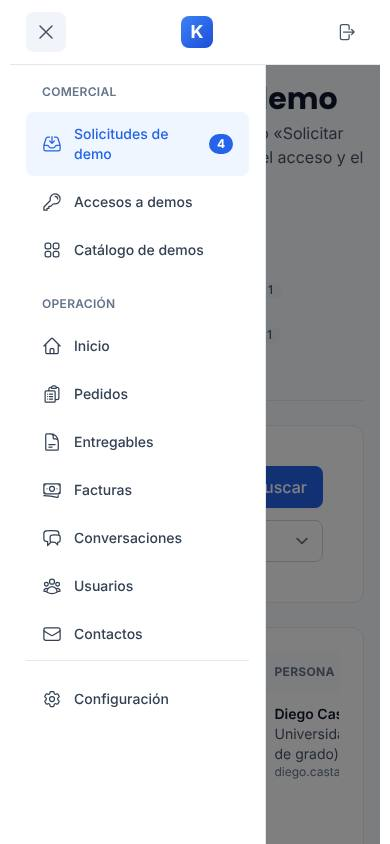

*Panel en un celular (390 × 844) con el menú lateral abierto.*

---

## 3. Inicio del panel

`/admin` es un resumen con **datos reales** del backend. Si un dato no carga, se muestra «—» en lugar de una cifra inventada.

*Inicio del panel con los datos de ejemplo.*

1. **Grupo Comercial** del menú: Solicitudes de demo, Accesos a demos y Catálogo de demos.
2. **Contador del menú:** solicitudes en estado **Pendiente** (no cuenta las que están «En revisión»).
3. **Grupo Operación:** Inicio, Pedidos, Entregables, Facturas, Conversaciones, Usuarios y Contactos. Debajo, Configuración.
4. **Cuatro cifras:** solicitudes por revisar (pendientes más en revisión), accesos activos, accesos que vencen en 3 días o menos y contactos sin leer. Cada tarjeta lleva a su sección.
5. **Accesos rápidos** a las diez secciones del panel.
6. **Últimas solicitudes de demo** (las 5 más recientes, con su estado). «Ver todos» abre la lista con todas las solicitudes.
7. **Últimos contactos recibidos** (los 5 más recientes, de cualquier origen).
8. **Ver sitio** (vuelve a la web pública), tu nombre con tu rol y el botón para salir.

> Cada solicitud de demo también se guarda como contacto, por eso «Contactos sin leer» suele ser mayor que el número de mensajes del formulario de contacto.

---

## 4. Solicitudes de demo

Aquí llega todo lo que la gente envía desde el formulario **Solicitar demo** (`/solicitar-demo` o el botón «Solicitar acceso» de una demo). Cada solicitud tiene un código `DR-AAAA-XXXXXX`.

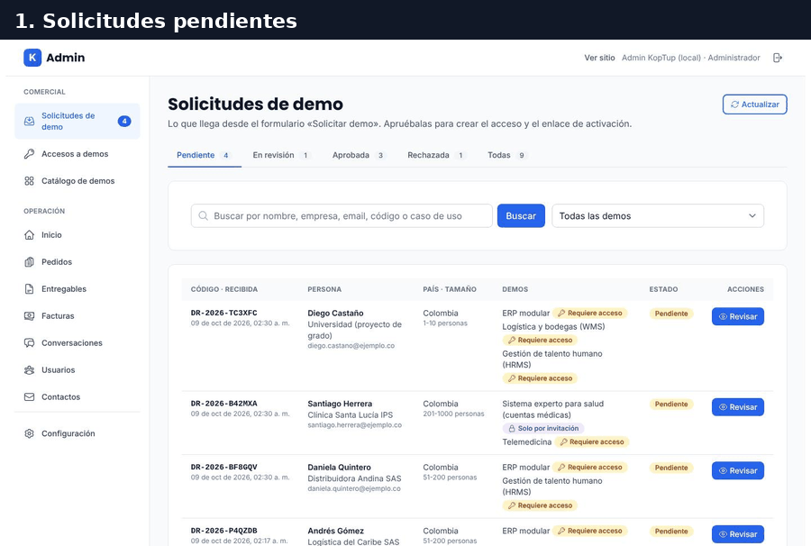

*GIF: de la lista de pendientes a la solicitud aprobada, el enlace copiado y los accesos creados.*

### 4.1 La lista

*Solicitudes de demo en la pestaña «Todas».*

1. **Pestañas por estado** con su número: Pendiente (se abre por defecto), En revisión, Aprobada, Rechazada y Todas.
2. **Buscador:** por nombre, empresa, correo, código o caso de uso. Se aplica con «Buscar».
3. **Filtro por demo:** muestra solo las solicitudes que piden esa demo.
4. **Demos pedidas**, con la etiqueta de su modo cuando no son abiertas («Requiere acceso» o «Solo por invitación»).
5. **Estado** de la solicitud.
6. **Revisar** (en pendientes y en revisión) o **Ver** (en aprobadas y rechazadas): abre el detalle.

Al pie de la lista hay un enlace al formulario público, para que veas lo que ve el prospecto.

Si una persona vuelve a enviar el formulario con el mismo correo mientras su solicitud sigue abierta (hasta 30 días), **no se crea otra**: las demos nuevas se suman a la existente, se agrega una nota automática y el encabezado dice cuántas veces la reenvió.

### 4.2 Revisar una solicitud

*Solicitud pendiente de Daniela Quintero.*

1. **Código y estado** de la solicitud, con la fecha en que llegó.
2. **Marcar en revisión:** úsalo cuando la estás trabajando y aún no decides; deja de contar en el número del menú.
3. **Datos de la persona:** nombre, cargo y empresa, correo, teléfono, país y tamaño de la empresa.
4. **WhatsApp:** abre WhatsApp con un saludo ya escrito que menciona el código de la solicitud. Solo aparece si el teléfono es válido (a un celular colombiano de 10 dígitos se le agrega el 57).
5. **Página de origen:** desde qué página envió el formulario, de qué sitio venía y las etiquetas de campaña (`utm_…`) si las había. Sirve para saber qué anuncio o qué demo la trajo.
6. **Caso de uso y demos pedidas**, con lo que la persona escribió.
7. **Autorización de datos:** fecha y versión de la política que aceptó (Ley 1581 de 2012). Sin esta autorización el formulario no se puede enviar.
8. **Avisos:** si salió el aviso al equipo por correo y por WhatsApp, el acuse a la persona y el correo con la decisión. «No enviado» casi siempre significa que el servidor no tiene ese canal configurado.
9. **Notas internas:** solo las ve el equipo. Escribe y pulsa «Agregar nota»; queda con tu correo y la fecha.
10. **Historial:** las acciones del equipo sobre esta solicitud (en revisión, aprobada, rechazada, enlace nuevo).
11. **Panel de decisión** con dos pestañas: **Aprobar** y **Rechazar**. Solo aparece mientras la solicitud está pendiente o en revisión.

### 4.3 Aprobar: elegir demos, días y nota

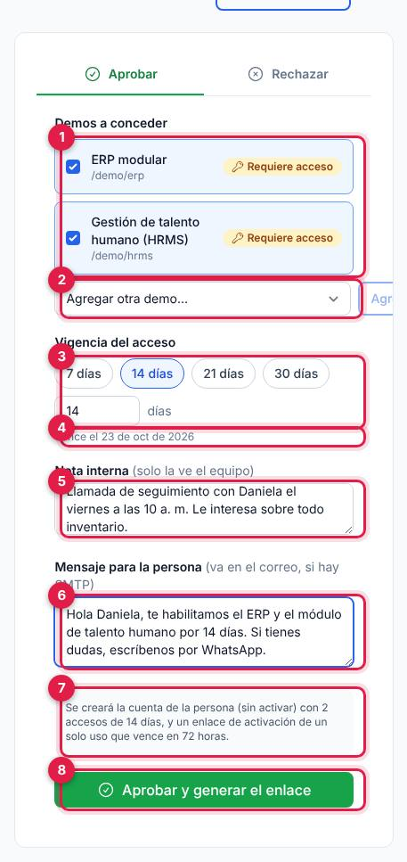

*Pestaña «Aprobar» lista para enviar.*

1. **Demos a conceder:** vienen marcadas las que pidió la persona. Desmarca las que no quieras dar. Cada una muestra su ruta y su modo.
2. **Agregar otra demo:** suma una demo que la persona no pidió (hasta 10 por aprobación).
3. **Vigencia del acceso:** atajos de 7, 14, 21 y 30 días, o escribe otra cantidad (de 1 a 365). Por defecto propone la vigencia más larga de las demos elegidas según el [catálogo](#6-catálogo-de-demos) (hoy 14 días).
4. **Fecha de vencimiento** que resultará.
5. **Nota interna:** queda en las notas de la solicitud y en los accesos creados. La persona no la ve.
6. **Mensaje para la persona:** va dentro del correo de aprobación, solo si el servidor tiene correo configurado.
7. **Resumen** de lo que va a pasar: si la persona no tiene cuenta, se crea una **sin activar** con un **enlace de activación de un solo uso que vence en 72 horas**; si ya tiene cuenta, solo se le agregan los accesos.
8. **Aprobar y generar el enlace.**

Reglas que aplica el servidor al aprobar:

- Si alguna demo elegida es **«Solo por invitación»**, solo un **admin** puede aprobar. Para otros roles el botón queda desactivado y aparece el aviso «Las demos «Solo por invitación» las aprueba un administrador».
- Si la persona ya tenía un acceso vigente a la misma demo, no se duplica: se extiende hasta la fecha más lejana.
- Si el correo es de alguien del equipo de KopTup, la aprobación se rechaza: el equipo ya ve todas las demos.
- Un doble clic no aprueba dos veces: la segunda vez el servidor responde que la solicitud ya fue procesada.

### 4.4 Copiar el enlace y enviarlo por WhatsApp

Al aprobar, la solicitud pasa a **Aprobada** y aparece el panel verde **Enlace de activación**.

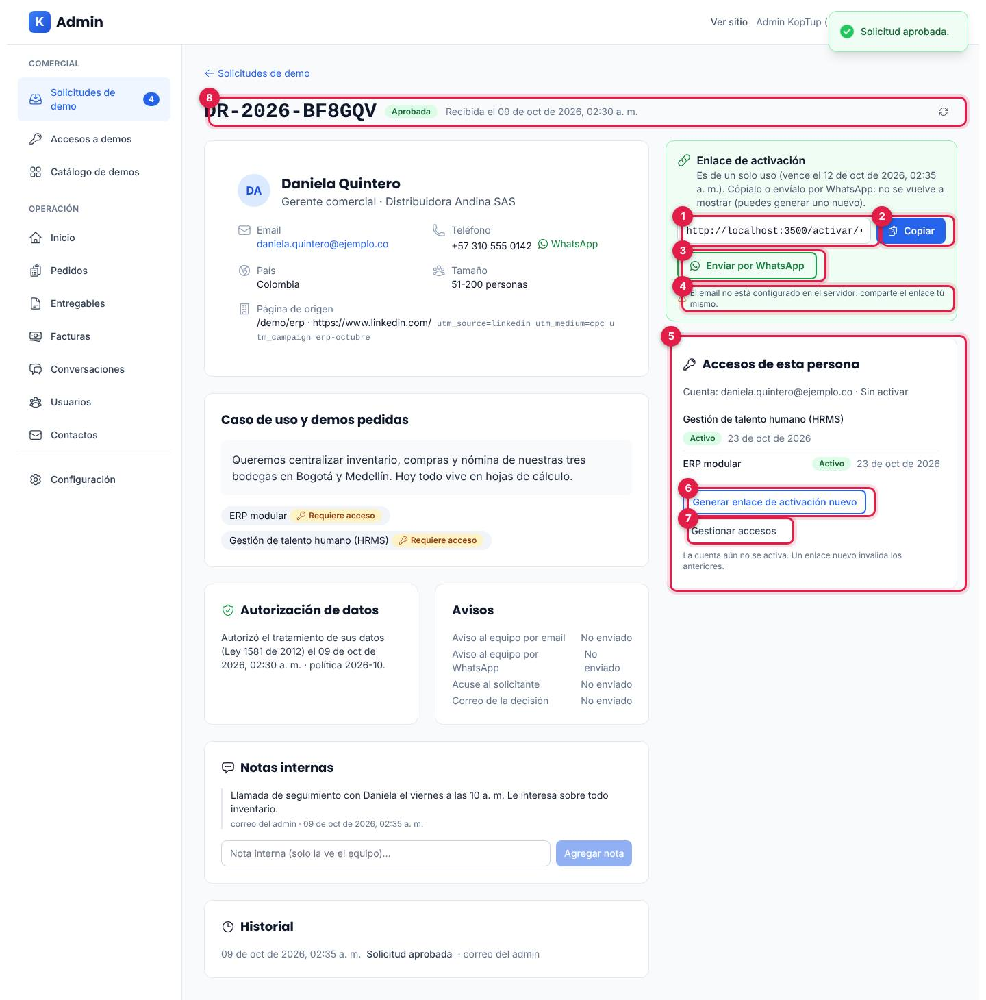

*Solicitud recién aprobada: enlace, botones y accesos creados.*

1. **Enlace de activación.** Es de un solo uso y vence a las 72 horas. **No se vuelve a mostrar** después de salir de la página (si lo pierdes, generas uno nuevo).
2. **Copiar:** lo copia al portapapeles y el botón cambia a «Copiado». Pégalo en el canal que prefieras.
3. **Enviar por WhatsApp:** abre WhatsApp con el número de la persona y este mensaje ya escrito:

   > Hola Daniela, aprobamos tu acceso a ERP modular, Gestión de talento humano (HRMS) en KopTup. Crea tu contraseña y entra con este enlace (es de un solo uso y vence el 12 de oct de 2026, 02:35 a. m.): https://…/activar/…

4. **Estado del correo:** «También se envió por email», «El correo no se pudo enviar» o, como en la captura, «El email no está configurado en el servidor: comparte el enlace tú mismo».
5. **Accesos de esta persona:** la cuenta («Sin activar» o «Activa») y cada demo concedida con su estado y su fecha de vencimiento.
6. **Generar enlace de activación nuevo:** aparece mientras la cuenta no esté activa. Emite otro enlace de 72 horas y **anula los anteriores**.
7. **Gestionar accesos:** abre [Accesos a demos](#5-accesos-a-demos) filtrado por el correo de la persona.
8. El **estado** cambió a «Aprobada» y el panel de decisión desaparece.

Lo que pasa después del lado del prospecto (activar la cuenta, Mis demos) está en [Flujos del prospecto y del cliente](Doc-05-Flujos-del-Prospecto-y-Cliente.md#2-activar-la-cuenta-activartoken).

Cuando la persona **ya tenía cuenta activa**, no hay nada que activar: el panel dice «La persona ya tiene cuenta» y el enlace que puedes compartir lleva a iniciar sesión y a Mis demos (ver la captura de la [sección 5.6](#56-conceder-acceso-directo-por-email)).

Así se ve una solicitud aprobada cuando la persona ya activó su cuenta:

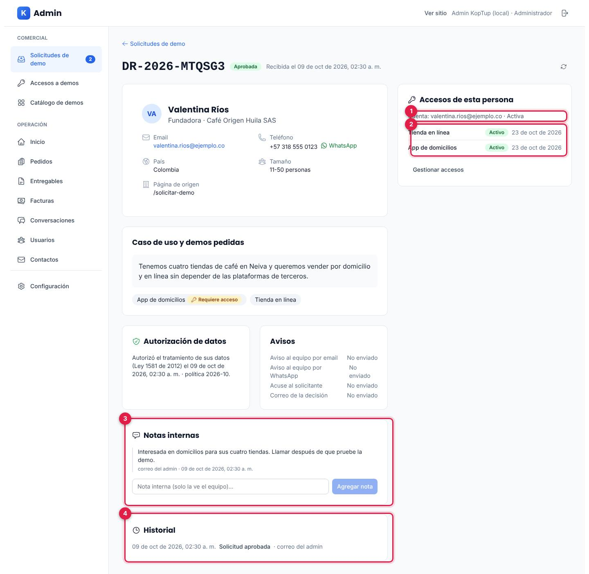

*Solicitud de Valentina Ríos, aprobada y con la cuenta ya activa.*

1. **Cuenta activa:** ya no aparece el botón de enlace nuevo (si la persona olvidó la contraseña, usa «¿Olvidaste tu contraseña?» en el login, que necesita correo configurado).
2. **Accesos** creados por esta aprobación, con estado y vencimiento.
3. **Nota interna** que escribiste al aprobar.
4. **Historial** con la aprobación y quién la hizo.

### 4.5 Rechazar con motivo

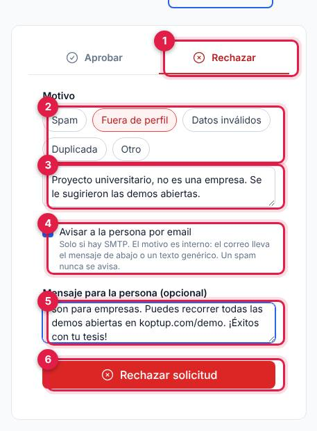

*Pestaña «Rechazar» con el motivo «Fuera de perfil».*

1. **Pestaña Rechazar.**
2. **Motivo:** Spam, Fuera de perfil, Datos inválidos, Duplicada u Otro. Es obligatorio.
3. **Detalle del motivo (interno):** lo ve solo el equipo.
4. **Avisar a la persona por email:** opcional y solo si hay correo configurado. El motivo nunca se le envía: el correo lleva el mensaje del punto 5 o un texto genérico. **Un spam nunca se avisa** (la casilla se desactiva).
5. **Mensaje para la persona (opcional).**
6. **Rechazar solicitud.**

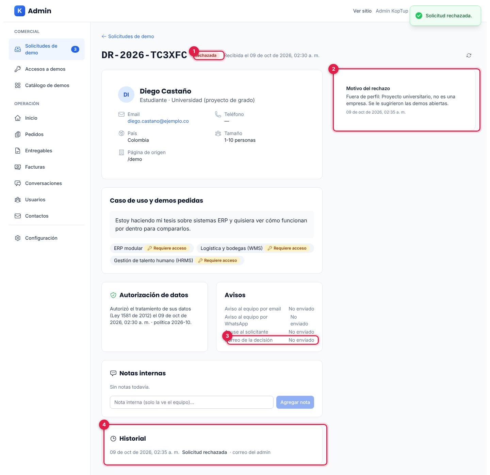

*La misma solicitud después de rechazarla.*

1. Estado **Rechazada**.
2. **Motivo del rechazo** con su detalle y la fecha.
3. **Correo de la decisión:** «No enviado» porque este entorno no tiene correo configurado.
4. **Historial** con el rechazo y quién lo hizo.

Una solicitud aprobada o rechazada ya no se puede reabrir desde el panel. Si la persona vuelve a escribir más adelante, se crea una solicitud nueva.

### 4.6 Estados de una solicitud

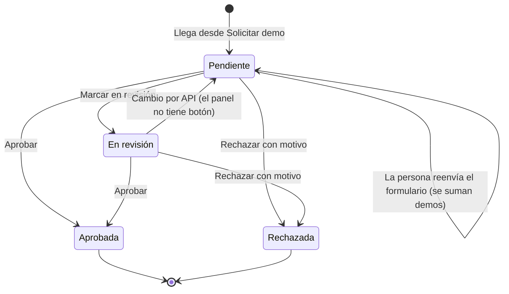
```mermaid
stateDiagram-v2
    state "Pendiente" as Pendiente
    state "En revisión" as Revision
    state "Aprobada" as Aprobada
    state "Rechazada" as Rechazada
    [*] --> Pendiente: Llega desde Solicitar demo
    Pendiente --> Revision: Marcar en revisión
    Pendiente --> Pendiente: La persona reenvía el formulario (se suman demos)
    Revision --> Pendiente: Cambio por API (el panel no tiene botón)
    Pendiente --> Aprobada: Aprobar
    Revision --> Aprobada: Aprobar
    Pendiente --> Rechazada: Rechazar con motivo
    Revision --> Rechazada: Rechazar con motivo
    Aprobada --> [*]
    Rechazada --> [*]
```

*Una solicitud solo se decide una vez; después queda cerrada.*

---

## 5. Accesos a demos

Cada **acceso** es una demo concedida a una persona, con fecha de vencimiento y uso real (último ingreso y número de visitas). Aquí sigues a los prospectos, extiendes, revocas, generas enlaces nuevos y das acceso directo sin solicitud.

### 5.1 La lista

*Accesos a demos en la pestaña «Activos».*

1. **Cuatro cifras:** activos, por vencer (3 días o menos), vencidos y revocados. Cada tarjeta filtra la lista. Si hay una búsqueda, las cifras cuentan solo lo encontrado.
2. **Pestañas** con los mismos estados y «Todas». Se abre en «Activos».
3. **Buscador** por nombre, correo o empresa.
4. **Filtro por demo.**
5. **Conceder acceso:** acceso directo sin solicitud ([sección 5.6](#56-conceder-acceso-directo-por-email)).
6. **Sin activar:** la persona todavía no creó su contraseña; no puede entrar hasta que use su enlace.
7. **Por vencer:** le quedan 3 días o menos. Es el momento de llamar o de extender.
8. **Último ingreso:** la última vez que abrió la demo («Nunca» si no la ha abierto).
9. **Visitas:** cuántas veces la abrió. Las consultas seguidas dentro de 30 minutos cuentan como una sola visita.

> En una pantalla de 1440 px de ancho la columna **Acciones** queda parcialmente oculta a la derecha: desliza la tabla hacia la derecha para ver todos los botones.

### 5.2 Las acciones de una fila

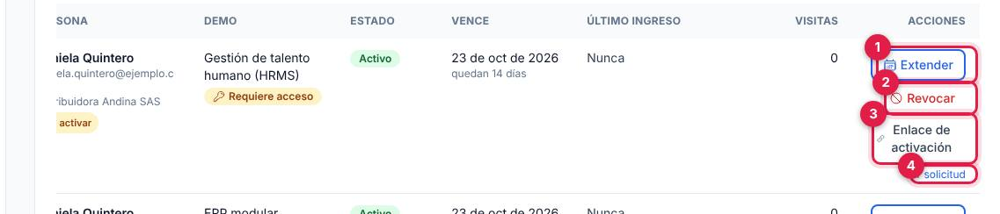

*Acciones disponibles en un acceso activo de una cuenta sin activar.*

1. **Extender:** suma días al vencimiento.
2. **Revocar:** quita el acceso de inmediato.
3. **Enlace de activación:** solo si la cuenta está sin activar y el acceso está vigente.
4. **Ver solicitud:** abre la solicitud que originó el acceso (no aparece en los accesos directos).

En los accesos a demos «Solo por invitación», quien no es admin ve el aviso «Las demos «Solo por invitación» las aprueba un administrador» en lugar de los botones.

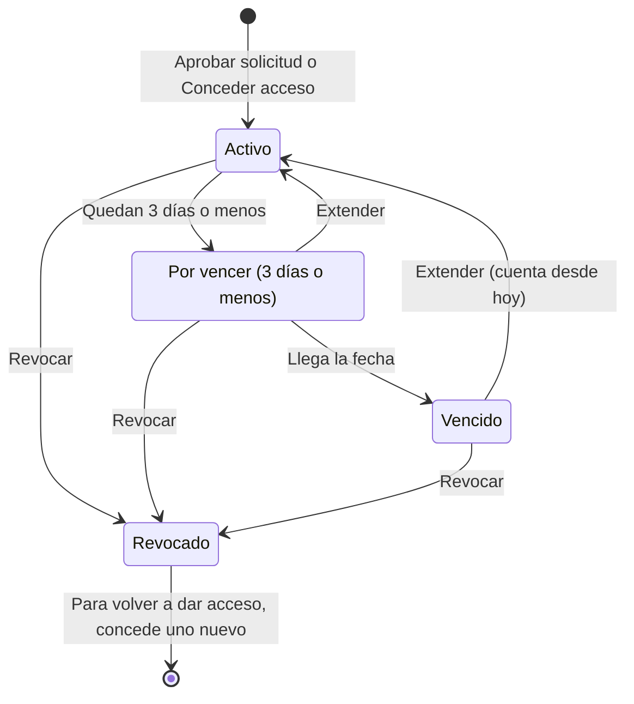
```mermaid
stateDiagram-v2
    state "Activo" as Activo
    state "Por vencer (3 días o menos)" as PorVencer
    state "Vencido" as Vencido
    state "Revocado" as Revocado
    [*] --> Activo: Aprobar solicitud o Conceder acceso
    Activo --> PorVencer: Quedan 3 días o menos
    PorVencer --> Activo: Extender
    PorVencer --> Vencido: Llega la fecha
    Activo --> Revocado: Revocar
    PorVencer --> Revocado: Revocar
    Vencido --> Activo: Extender (cuenta desde hoy)
    Vencido --> Revocado: Revocar
    Revocado --> [*]: Para volver a dar acceso, concede uno nuevo
```

*Estados de un acceso. El vencimiento se comprueba en cada ingreso, no depende de ningún proceso nocturno.*

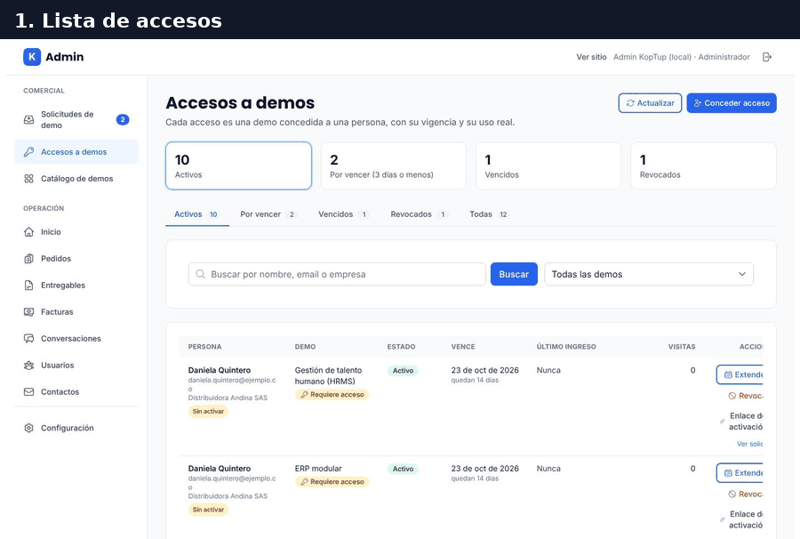

*GIF: extender el acceso de Valentina 7 días y revocar el de Camilo con un motivo.*

### 5.3 Extender

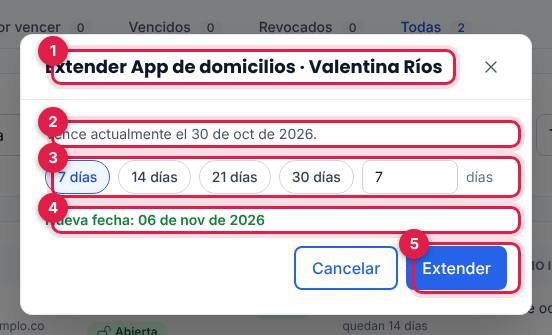

*Extender «App de domicilios» de Valentina Ríos.*

1. **Demo y persona** del acceso.
2. **Vencimiento actual.**
3. **Días a sumar:** 7, 14, 21, 30 u otra cantidad (de 1 a 365).
4. **Nueva fecha** que quedará. Si el acceso ya estaba vencido, los días se cuentan **desde hoy** y el acceso vuelve a estar activo.
5. **Extender.** Si hay correo configurado, la persona recibe un aviso con la nueva fecha.

### 5.4 Revocar

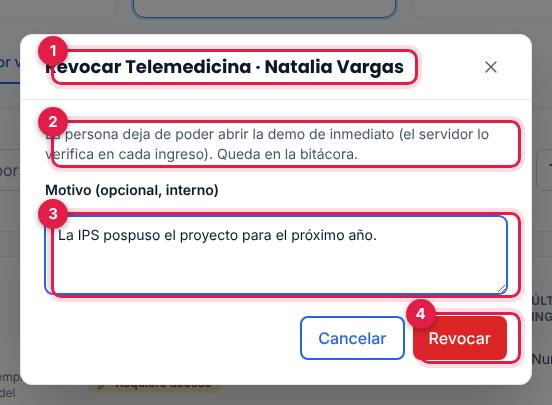

*Diálogo de revocación (en el ejemplo, sobre el acceso de Natalia Vargas; se canceló).*

1. **Demo y persona** del acceso.
2. **Qué pasa:** la persona deja de poder abrir la demo de inmediato, porque el servidor lo verifica en cada ingreso. Queda en la bitácora.
3. **Motivo (opcional, interno):** se muestra en la lista, debajo del estado.
4. **Revocar.** No se envía ningún correo a la persona.

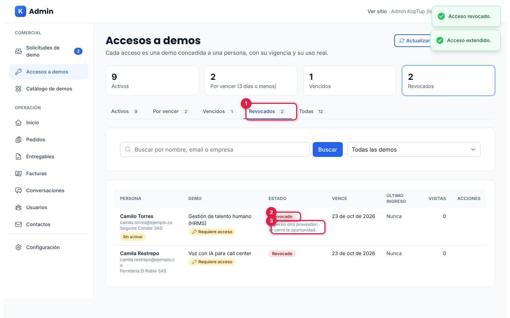

*Pestaña «Revocados» después de revocar el acceso de Camilo Torres.*

1. Pestaña **Revocados**.
2. Estado **Revocado**.
3. **Motivo** que escribiste.

Un acceso revocado no se puede extender ni reactivar: si quieres volver a dar esa demo, usa **Conceder acceso**. Si la persona tenía la demo abierta, la página que ya cargó sigue funcionando hasta que la recarga o navega.

### 5.5 Generar un enlace de activación nuevo

Cuando una persona no alcanzó a usar su enlace (venció a las 72 horas, lo borró o no le llegó), pulsa **Enlace de activación** en su fila.

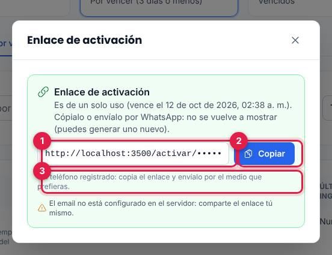

*Enlace nuevo para Natalia Vargas.*

1. **Enlace nuevo**, también de 72 horas. Los enlaces anteriores dejan de servir.
2. **Copiar.**
3. Desde esta pantalla **no aparece el botón de WhatsApp**, aunque la persona tenga teléfono: copia el enlace y envíalo tú. Desde el detalle de la solicitud (botón «Generar enlace de activación nuevo») sí aparece.

Si la cuenta ya está activa, el servidor no emite enlace y responde que la persona ya puede iniciar sesión.

### 5.6 Conceder acceso directo por email

Sirve para dar una demo **sin solicitud previa**: por ejemplo, a un cliente que conociste en una reunión o para una demo «Solo por invitación».

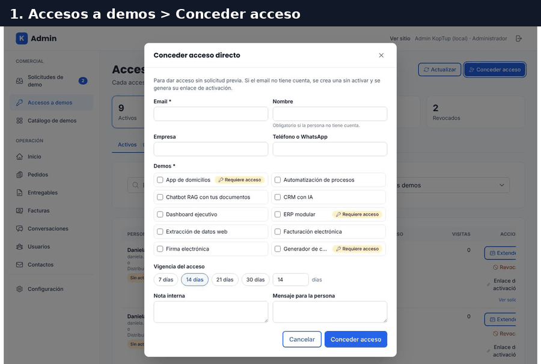

*GIF: conceder a Ricardo Salazar la demo privada de cuentas médicas por 21 días.*

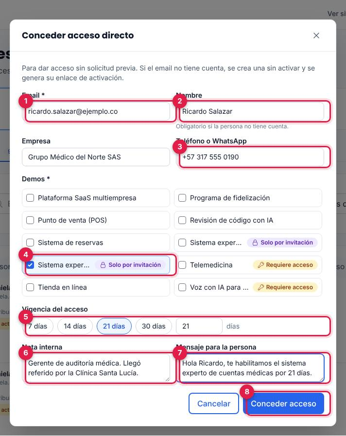

*Formulario «Conceder acceso directo» lleno.*

1. **Email** (obligatorio).
2. **Nombre:** obligatorio si el correo todavía no tiene cuenta, porque con él se crea.
3. **Teléfono o WhatsApp:** si lo escribes, el resultado incluye el botón «Enviar por WhatsApp». La empresa también es opcional.
4. **Demos:** marca hasta 10. Cada una muestra su modo; las «Solo por invitación» solo las puede marcar un admin.
5. **Vigencia** del acceso.
6. **Nota interna.**
7. **Mensaje para la persona** (va en el correo, si hay correo configurado).
8. **Conceder acceso.**

Si el correo no tiene cuenta, se crea una cuenta de prospecto **sin activar** y el resultado muestra el enlace de activación:

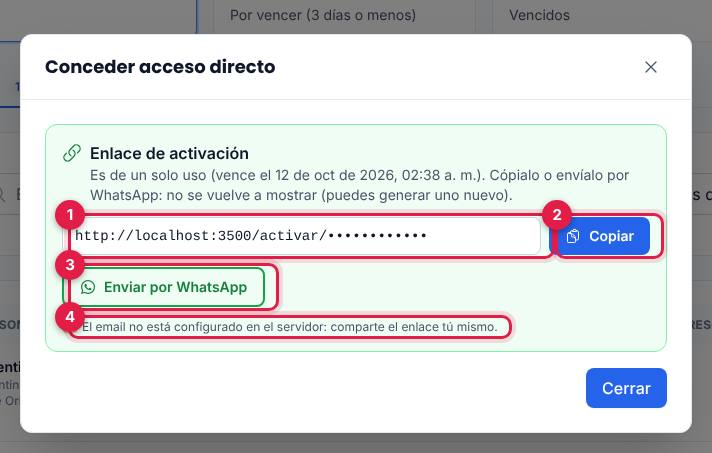

*Acceso concedido a una persona nueva.*

1. **Enlace de activación** (72 horas, un solo uso).
2. **Copiar.**
3. **Enviar por WhatsApp** al teléfono que escribiste.
4. **Estado del correo.**

Si el correo ya tiene una cuenta activa, no hay enlace de activación: compartes un enlace para iniciar sesión.

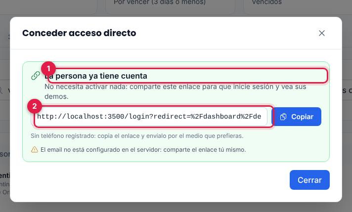

*Acceso concedido a Valentina Ríos, que ya tenía cuenta activa.*

1. **«La persona ya tiene cuenta»:** no necesita activar nada.
2. **Enlace** para iniciar sesión e ir a Mis demos.
3. Como no se escribió teléfono en el formulario, aparece «Sin teléfono registrado» en lugar del botón de WhatsApp.

Si el correo es de alguien del equipo de KopTup, el servidor rechaza el acceso: el equipo ya ve todas las demos. Si la persona es cliente, conserva su rol de cliente.

---

## 6. Catálogo de demos

Aquí decides **quién puede abrir cada una de las 28 demos**. Solo un **admin** puede editar; los demás roles ven la tabla en modo consulta.

*Catálogo de demos con la pestaña «Todas».*

1. **Aviso:** los cambios se aplican en el sitio en **máximo un minuto** y quedan en la bitácora con tu usuario. Debajo, qué significa cada modo.
2. **Filtros** con su número: Todas, Abiertas, Requieren acceso, Por invitación y Desactivadas.
3. **El chatbot RAG está fijo:** siempre abierto y activo, porque es el destino de la pauta. El servidor no deja cambiarlo.
4. **Modo de acceso** de la demo.
5. **Activa:** si la apagas, la demo muestra «En mantenimiento» a todos menos al equipo.
6. **Vigencia por defecto** (días) que se propone al aprobar o conceder esa demo.
7. **Último cambio:** fecha y hora de la última modificación.
8. **Guardar:** se habilita cuando cambias algo en la fila. Cada fila se guarda por separado.
9. **Abrir la demo** en otra pestaña.

### 6.1 Los tres modos

| En el panel | Valor | Quién la abre | Qué ve un visitante sin acceso |
|---|---|---|---|
| **Abierta** | `publico` | Cualquiera, sin cuenta | La demo |
| **Requiere acceso** | `solicitud` | Personas con un acceso vigente, y el equipo | Pantalla con candado: «Solicitar acceso» o «Ya tengo acceso: iniciar sesión» |
| **Solo por invitación** | `privado` | Personas con un acceso que solo un admin puede conceder, y el equipo | Pantalla de demo privada, sin aparecer como abierta en `/demo` |
| **Desactivada** (interruptor apagado) | `activo: false` | Solo el equipo | «En mantenimiento» |

En otras páginas de la documentación «Requiere acceso» también aparece como «Con solicitud».

### 6.2 Cambiar el modo y su efecto

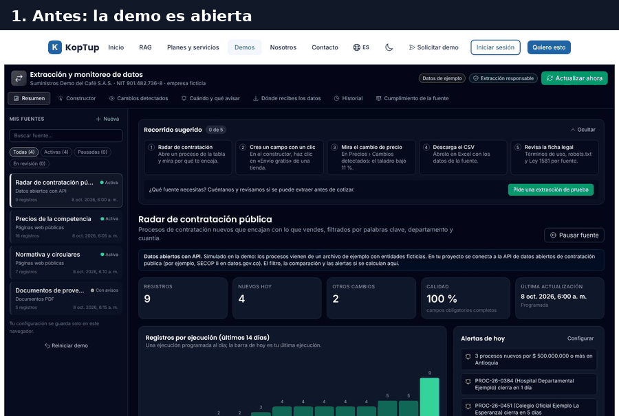

*GIF: «Extracción de datos web» pasa de Abierta a Requiere acceso, el visitante ve el candado y luego se vuelve a abrir.*

1. Busca la demo y cambia el **Modo de acceso**. La fila se pinta de ámbar y se habilita **Guardar**:

   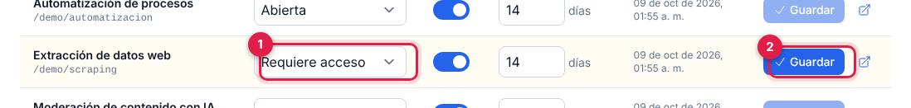

   *(1) Nuevo modo elegido; (2) Guardar habilitado.*

2. Pulsa **Guardar**. Aparece el aviso «Se guardó «Extracción de datos web»».
3. **Efecto en el sitio:** la web guarda el catálogo en memoria hasta 60 segundos, así que el cambio tarda **entre unos segundos y un minuto**. En el entorno de capturas, el visitante vio el candado **7 segundos** después de guardar, y al volver a «Abierta» la demo se abrió de nuevo a los **65 segundos**.

   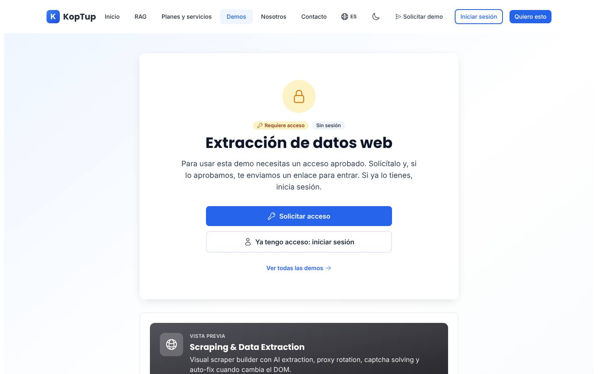

   *Un visitante sin sesión abre /demo/scraping después del cambio: candado, «Solicitar acceso» e «Iniciar sesión».*

4. Los accesos que ya existían no cambian: quien tenía un acceso vigente sigue entrando. Al pasar una demo de «Requiere acceso» a «Abierta», todos pueden abrirla.

Cuidado:

- Si pasas una demo a «Solo por invitación», las solicitudes pendientes que la incluyan ya solo las podrá aprobar un admin.
- El servidor no impide conceder acceso a una demo desactivada: la persona recibe el acceso y ve «En mantenimiento». Revisa el catálogo antes de aprobar.
- El catálogo público que usa la página `/demo` para las etiquetas de cada tarjeta también puede tardar unos segundos en actualizarse.

---

## 7. Usuarios y roles

`/admin/users` lista todas las cuentas del sistema (equipo, prospectos y clientes) y permite cambiar el rol.

*Lista de usuarios con los datos de ejemplo.*

1. **Buscador** por nombre o correo (se aplica con «Buscar»).
2. **Filtros de rol:** Todos, Admin, Manager y Usuario.
3. **Rol** de la cuenta. Los roles «Admin», «Manager», «Developer» y «Usuario» se muestran traducidos; `prospect`, `client` y `sales` aparecen con su nombre técnico.
4. **Selector de rol.** Ofrece solo Usuario, Developer, Manager y Admin. Por eso, en las cuentas `prospect`, `client` o `sales` el selector muestra «Usuario» aunque ese **no** sea su rol (en la fila de Mateo Álvarez, que es cliente, dice «Usuario»).
5. **Cambio aplicado:** Sofía Mejía pasó a **Manager**. Al elegir el rol, el navegador pide confirmación («¿Estás seguro de cambiar el rol…?») y luego avisa «Rol actualizado exitosamente».
6. Tu propia cuenta (el correo está oculto en la captura).

Los roles y para qué sirve cada uno:

| Rol | Para quién | Qué hace |
|---|---|---|
| `admin` | Dueño o responsable del sistema | Todo el panel, incluidos el catálogo, las demos privadas y los cambios de rol |
| `manager` | Gerente | Todo el panel de operación; en las secciones comerciales solo consulta; no cambia roles |
| `sales` | Comercial | Solo Solicitudes, Accesos y Catálogo (este último en consulta). Llega directo a Solicitudes |
| `developer` | Equipo técnico | Abre todas las demos; no entra al panel |
| `prospect` | Persona con acceso a demos | Mis demos y su perfil |
| `client` y `user` | Clientes (y cuentas creadas antes de existir `client`) | Portal del cliente |

Puntos clave:

- **Solo un admin** puede cambiar roles. Un manager ve el selector, pero el servidor rechaza el cambio y aparece «Error al actualizar el rol».
- Desde esta pantalla **no se puede** dar el rol comercial (`sales`), `prospect` ni `client`: no están en el selector. Hoy se hace por API (ver [Para desarrolladores](#16-para-desarrolladores)).
- La persona a la que le cambias el rol debe **cerrar sesión y volver a entrar** para que su menú refleje el rol nuevo (el servidor ya lo aplica).
- Los prospectos se crean solos al aprobar una solicitud o conceder un acceso; no hace falta crearlos aquí. Esta pantalla no permite crear ni borrar cuentas.

---

## 8. Contactos

`/admin/contacts` reúne a todas las personas que dejaron sus datos, de tres orígenes: el formulario de **/contact**, el formulario **Solicitar demo** y la demo **«Prueba con tu documento»** del chatbot RAG.

*Contactos con el mensaje de Mariana López seleccionado.*

1. **Filtros por estado:** Todos (con el número de la lista que estás viendo), Nuevos, Leídos y Respondidos.
2. **Tarjeta del contacto:** nombre, estado, correo, fecha, teléfono, servicio de interés y presupuesto. Pulsa una tarjeta para ver el detalle.
3. **Detalle del contacto:** correo, teléfono, empresa, servicio y presupuesto.
4. **Mensaje** completo.

Debajo del detalle están los botones **Marcar como nuevo**, **Marcar como leído** y **Marcar como respondido**. El estado es solo una marca para el equipo: no envía nada a la persona. Responde por correo o por WhatsApp fuera del panel.

Cómo reconocer el origen de cada contacto (la pantalla no lo muestra como etiqueta):

| Origen | Cómo se ve |
|---|---|
| Formulario de /contact | Servicio elegido (p. ej. «Chatbot con IA») y presupuesto |
| Solicitar demo | Servicio «Solicitud de demo: …» y un mensaje con el código, la empresa, el caso de uso y el enlace al panel |
| Prueba con tu documento (demo RAG) | Nombre «Lead de la demo RAG», solo correo, y un mensaje con el tipo de documento y la autorización de datos |

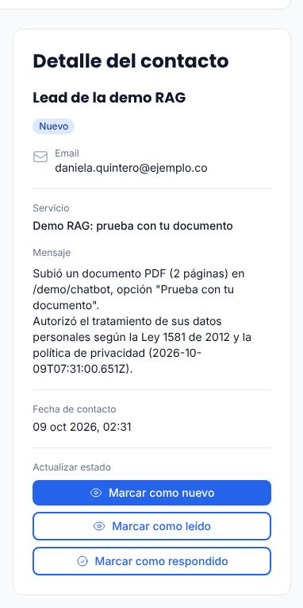

*Lead de Daniela Quintero: subió un PDF de 2 páginas en «Prueba con tu documento» antes de pedir su demo.*

Limitaciones de esta sección: después de cambiar el estado, la lista se actualiza pero la etiqueta del detalle sigue mostrando el estado anterior hasta que vuelves a pulsar la tarjeta; no hay buscador ni forma de borrar un contacto; y el comercial (`sales`) no ve esta sección.

---

## 9. Conversaciones

`/admin/conversations` debería mostrar los chats entre el equipo y cada cliente, con filtros (Todas, Activas, Archivadas, Cerradas) y un detalle con los mensajes.

*Conversaciones: «No hay conversaciones para mostrar».*

**Hoy esta sección siempre está vacía.** Se comprobó en el entorno de capturas: al crear un pedido, la conversación automática con el cliente falla, y crear una conversación a mano por la API también falla por un error del servidor. Por eso no hay ninguna conversación que mostrar. Mientras se corrige, la comunicación con el cliente se hace por correo o WhatsApp. Ver [Limitaciones conocidas](#17-limitaciones-conocidas).

---

## 10. Pedidos

`/admin/orders` muestra los pedidos que crean los clientes desde su portal, para aprobarlos o rechazarlos y llevar su estado.

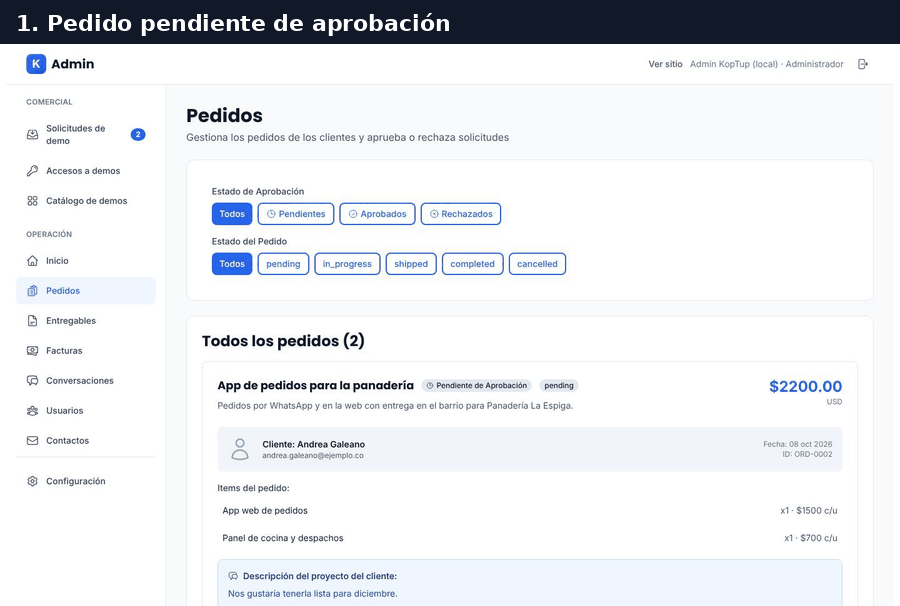

*GIF: el pedido de Andrea Galeano pasa de pendiente a aprobado y a «in_progress».*

*Lista de pedidos con el pedido de Andrea Galeano arriba.*

1. **Estado de aprobación:** Todos, Pendientes, Aprobados y Rechazados.
2. **Estado del pedido:** Todos, `pending`, `in_progress`, `shipped`, `completed` y `cancelled` (estos nombres aparecen en inglés).
3. **Nombre del pedido** con sus dos etiquetas: aprobación y estado.
4. **Monto total** en USD (suma de los ítems).
5. **Cliente**, fecha e identificador del pedido (`ORD-0002`).
6. **Descripción del proyecto** que escribió el cliente. Debajo están los ítems y, si los hay, los archivos adjuntos.

Debajo de cada pedido están los botones **Aprobar Pedido** y **Rechazar Pedido**. Cada acción pide confirmación en una ventana del navegador y luego muestra un aviso.

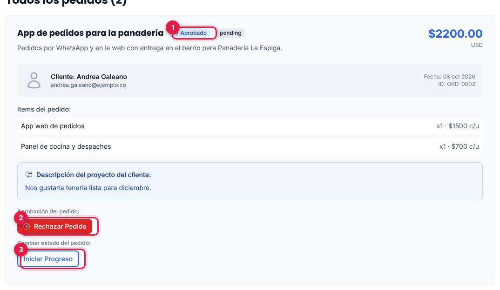

*El mismo pedido después de aprobarlo.*

1. Etiqueta **Aprobado**.
2. **Rechazar Pedido** sigue disponible (un pedido aprobado todavía se puede rechazar; uno rechazado se puede «Re-aprobar»).
3. **Cambiar estado del pedido:** «Iniciar Progreso» (de `pending` a `in_progress`), luego «Marcar como Enviado» y «Completar Pedido».

Al rechazar se abre un recuadro para escribir el motivo (si lo dejas vacío queda «No especificado»); el pedido queda rechazado y en estado `cancelled`. Lo que ve el cliente está en [Flujos del prospecto y del cliente](Doc-05-Flujos-del-Prospecto-y-Cliente.md#93-mis-pedidos-dashboardorders).

Limitaciones: la fecha del pedido se muestra un día antes en Colombia (el pedido de la captura se creó el 9 de octubre y dice «08 oct 2026»); el botón «Ver Conversación con Cliente» nunca aparece porque la conversación no se crea; y desde el panel no se genera la factura del pedido.

---

## 11. Facturas

`/admin/invoices` lista las facturas con filtros por estado (`all`, `draft`, `pending`, `paid`, `overdue`, `cancelled`, en inglés) y un botón **Descargar** por factura.

*Facturas sin registros: la página queda en blanco.*

**Hoy es solo una lista.** Ninguna pantalla del panel crea facturas, así que en la práctica está vacía, y cuando no hay facturas no aparece ningún mensaje. Según el código, el botón **Descargar** tampoco abre un PDF. La facturación electrónica y el cobro en línea están en desarrollo: ver [Estado y próximos pasos](15-Estado-y-Proximos-Pasos.md).

---

## 12. Entregables

`/admin/deliverables` lista los archivos que el equipo entrega a cada cliente, con filtros (`all`, `pending`, `in_review`, `approved`, `rejected`) y los botones **Ver**, **Aprobar** y **Rechazar** (este último pide un comentario).

*Entregables sin registros: la página queda en blanco.*

**Hoy es solo una lista.** El panel no tiene un formulario para subir entregables (solo existe la ruta de la API para el equipo), así que normalmente está vacía y, sin registros, no muestra ningún mensaje.

---

## 13. Configuración

*Configuración del panel.*

1. **Notificaciones** por correo, push y SMS: **solo visuales**. Al guardar, las casillas se recuerdan en tu navegador, pero no cambian ningún envío del servidor.
2. **Idioma:** **funciona**. Cambia entre español e inglés para todo el sitio y recarga la página.
3. **Tema:** **funciona**. Claro, oscuro o automático (según el sistema), al instante.
4. **Información del Administrador:** texto fijo. Dice «acceso completo» aunque tu rol sea manager, y no menciona las secciones comerciales.
5. **Guardar cambios** guarda las casillas de notificaciones en tu navegador y muestra «Configuración guardada exitosamente». **Cancelar** no hace nada.

Los avisos reales al equipo (correo y WhatsApp) se configuran en el servidor, no aquí: ver [Operación y despliegue](Doc-11-Operacion-y-Despliegue.md).

---

## 14. Rutina diaria sugerida

Una lista para revisar cada mañana (unos 10 a 15 minutos). La versión en diagrama está en [Flujos de administración y operación](Doc-14-2-Flujos-de-Administracion-y-Operacion.md#51-rutina-diaria-sugerida-del-admin-o-comercial).

**Solicitudes**

- [ ] Mira el número junto a **Solicitudes de demo** en el menú.
- [ ] Abre cada pendiente: caso de uso, empresa, demos pedidas y página de origen.
- [ ] Spam, duplicada o fuera de perfil: **rechaza** con el motivo correcto.
- [ ] Si te falta información: **Marcar en revisión**, deja una nota y escribe por WhatsApp desde el teléfono de la solicitud.
- [ ] Si está bien: **aprueba** con las demos y los días adecuados.
- [ ] Mira el aviso del correo en el panel verde. Si no dice «También se envió por email», **envía el enlace por WhatsApp** o cópialo.

**Accesos**

- [ ] Abre **Accesos › Por vencer**: llama a quien está usando la demo (último ingreso y visitas) y **extiende** si hace falta.
- [ ] Busca cuentas **Sin activar** con más de 2 días: si el enlace ya venció (72 horas), genera uno nuevo y reenvíalo.
- [ ] Revoca los accesos de oportunidades cerradas, con un motivo.

**Contactos y pedidos** (admin y manager)

- [ ] Abre **Contactos › Nuevos**, responde por correo o WhatsApp y marca **Respondido**.
- [ ] Revisa los **leads de la demo RAG** («Lead de la demo RAG»): ya probaron el producto con su propio documento.
- [ ] Revisa **Pedidos › Pendientes** y apruébalos o recházalos.

**Una vez por semana** (admin)

- [ ] Revisa el **Catálogo**: modo de cada demo, demos desactivadas y vigencias por defecto.
- [ ] Revisa **Usuarios**: que solo el equipo tenga roles de equipo.

---

## 15. Si algo no funciona

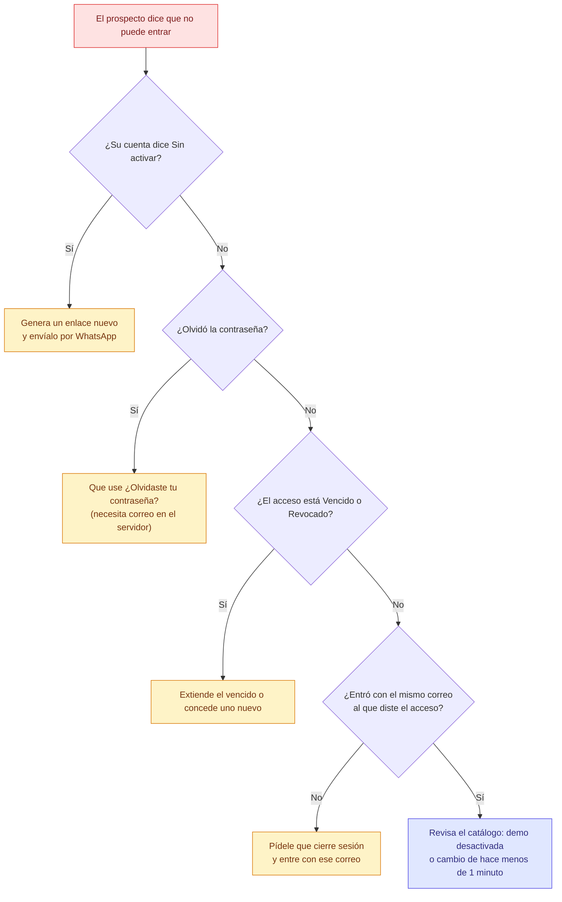
```mermaid
flowchart TD
    classDef admin fill:#fef3c7,stroke:#d97706,color:#78350f
    classDef error fill:#fee2e2,stroke:#dc2626,color:#7f1d1d
    classDef sistema fill:#e0e7ff,stroke:#4f46e5,color:#312e81

    Q["El prospecto dice que no puede entrar"]:::error
    A{"¿Su cuenta dice Sin activar?"}
    B["Genera un enlace nuevo<br/>y envíalo por WhatsApp"]:::admin
    C{"¿Olvidó la contraseña?"}
    D["Que use ¿Olvidaste tu contraseña?<br/>(necesita correo en el servidor)"]:::admin
    E{"¿El acceso está Vencido o Revocado?"}
    F["Extiende el vencido o concede uno nuevo"]:::admin
    G{"¿Entró con el mismo correo<br/>al que diste el acceso?"}
    H["Pídele que cierre sesión<br/>y entre con ese correo"]:::admin
    I["Revisa el catálogo: demo desactivada<br/>o cambio de hace menos de 1 minuto"]:::sistema

    Q --> A
    A -->|"Sí"| B
    A -->|"No"| C
    C -->|"Sí"| D
    C -->|"No"| E
    E -->|"Sí"| F
    E -->|"No"| G
    G -->|"No"| H
    G -->|"Sí"| I
```

*Guía rápida cuando un prospecto no logra abrir su demo.*

### 15.1 El correo no llega

- **Síntoma:** el panel dice «El email no está configurado en el servidor» o «El correo no se pudo enviar», o en **Avisos** aparece «No enviado».
- **Qué hacer ya:** usa **Copiar** o **Enviar por WhatsApp** en el panel verde. El enlace sirve igual, venga por correo o por WhatsApp.
- **Si ya cerraste la página** y no copiaste el enlace: en la solicitud, pulsa **Generar enlace de activación nuevo** (o **Enlace de activación** en Accesos). Los anteriores dejan de servir.
- **Para arreglarlo de fondo:** el servidor necesita las variables de correo (`SMTP_*`). Sin ellas no salen acuses, aprobaciones, recordatorios ni enlaces de recuperación de contraseña. Ver [Operación y despliegue](Doc-11-Operacion-y-Despliegue.md) y el procedimiento [El correo no sale](Doc-14-2-Flujos-de-Administracion-y-Operacion.md#92-el-correo-no-sale).

### 15.2 El prospecto no puede entrar

| Lo que dice el prospecto | Causa probable | Qué haces en el panel |
|---|---|---|
| «Tu cuenta aún no está activada…» al iniciar sesión | Nunca usó el enlace de activación | Genera un enlace nuevo y envíalo |
| «Este enlace ya se usó», «Este enlace venció» o «Este enlace fue reemplazado» | Usó un enlace viejo o pasaron 72 horas | Si la cuenta sigue sin activar, genera uno nuevo; si ya está activa, que inicie sesión |
| Olvidó la contraseña | Cuenta activa | Que use «¿Olvidaste tu contraseña?». Sin correo configurado no le llega nada y el panel no tiene cómo restablecerla: hace falta ayuda técnica |
| «El correo electrónico o la contraseña son incorrectos» | Correo o contraseña equivocados | Confirma en Accesos el correo exacto de su cuenta; si olvidó la contraseña, ver la fila anterior |

Las pantallas que ve el prospecto en cada caso están en [Flujos del prospecto y del cliente](Doc-05-Flujos-del-Prospecto-y-Cliente.md#3-iniciar-sesión-login).

### 15.3 La demo sigue bloqueada

1. En **Accesos**, busca a la persona y confirma que el acceso a **esa demo** está **Activo** (no vencido ni revocado) y que es la cuenta con la que entra.
2. En **Catálogo**, confirma que la demo está **Activa** (si no, verá «En mantenimiento»).
3. Si acabas de aprobar o de cambiar el modo, espera **un minuto** y pide que recargue la página.
4. Si la página dice «Inicia sesión», la persona entró sin sesión o su sesión expiró: que inicie sesión y vuelva a abrir la demo desde **Mis demos**.

Más detalle en [Una demo sigue bloqueada](Doc-14-2-Flujos-de-Administracion-y-Operacion.md#93-una-demo-sigue-bloqueada).

### 15.4 El backend no responde

Si el backend (la API) no responde, el panel no puede comprobar tu sesión y la web muestra esta página en lugar del panel:

*«No pudimos verificar tu sesión» (respuesta 503). Reproducida con el mismo HTML que devuelve la web.*

Otras señales: en el Inicio del panel las cifras aparecen como «—», las listas dicen «No se pudo cargar la información» y nadie puede iniciar sesión. Si el servidor del backend responde «no encontrado» (como pasa hoy con el de producción), la web te manda al **inicio de sesión** en lugar de mostrar esta página, aunque tus credenciales estén bien.

Mientras tanto, las demos **abiertas** siguen cargando para los visitantes (la web usa la última versión conocida del catálogo o una tabla de respaldo), aunque las partes que llaman a la API pueden fallar; las demos que requieren acceso quedan bloqueadas, y no se pueden enviar solicitudes ni mensajes de contacto nuevos.

Qué hacer: revisa el estado del servicio del backend (su ruta `/health` debe responder «healthy») y sigue el procedimiento [El backend está caído](Doc-14-2-Flujos-de-Administracion-y-Operacion.md#91-el-backend-está-caído). La situación actual de producción está en [Estado y próximos pasos](15-Estado-y-Proximos-Pasos.md).

---

## 16. Para desarrolladores

### Páginas y archivos (en `main`)

| Pantalla | Ruta | Archivo |
|---|---|---|
| Marco del panel (menú, contador, roles) | todas | `apps/web/src/components/admin/AdminLayout.tsx` |
| Inicio | `/admin` | `apps/web/src/app/admin/page.tsx` |
| Solicitudes | `/admin/solicitudes` y `/admin/solicitudes/[id]` | `apps/web/src/app/admin/solicitudes/` |
| Accesos | `/admin/accesos` | `apps/web/src/app/admin/accesos/page.tsx` |
| Catálogo | `/admin/catalogo-demos` | `apps/web/src/app/admin/catalogo-demos/page.tsx` |
| Componentes comunes (enlace, días, modal, etiquetas) | — | `apps/web/src/components/admin/demos/shared.tsx` |
| Usuarios, Contactos, Conversaciones, Pedidos, Facturas, Entregables, Configuración | `/admin/users`, `/admin/contacts`, `/admin/conversations`, `/admin/orders`, `/admin/invoices`, `/admin/deliverables`, `/admin/settings` | `apps/web/src/app/admin/<sección>/page.tsx` |
| Reglas de rol de la web | — | `apps/web/src/lib/auth-roles.ts` y `apps/web/src/middleware.ts` |

Backend: `apps/backend/src/routes/admin-demos.routes.ts` (solicitudes, accesos, catálogo y bitácora), `routes/admin.routes.ts` y `controllers/admin.controller.ts` (operación), `services/demo-requests.service.ts`, `services/demo-grants.service.ts`, `services/demo-catalog.service.ts`, `jobs/demo-grants.job.ts`, `config/demos.ts` (permisos y tiempos), `scripts/set-admin.ts` e `index.ts` (`ensureAdminFromEnv`).

### Endpoints que usa el panel

| Sección | Método y ruta | Quién |
|---|---|---|
| Solicitudes | `GET /api/admin/demo-requests` (con `estado`, `demo`, `q`, `page`, `limit`; devuelve `conteos`) y `GET /api/admin/demo-requests/:id` | admin, sales, manager |
| | `PATCH /api/admin/demo-requests/:id` (`estado` o `nota`), `POST …/:id/approve`, `POST …/:id/reject`, `POST …/:id/resend-activation` | admin, sales (privadas: solo admin) |
| Accesos | `GET /api/admin/demo-grants` (con `estado`, `demo`, `q`) | admin, sales, manager |
| | `POST /api/admin/demo-grants` (acceso directo), `POST …/:id/extend`, `POST …/:id/revoke`, `POST …/:id/resend-activation` | admin, sales (privadas: solo admin) |
| Catálogo | `GET /api/admin/demo-catalog` y `PATCH /api/admin/demo-catalog/:slug` | leer: admin, sales, manager; editar: admin |
| Bitácora | `GET /api/admin/audit-log` | admin (sin pantalla) |
| Operación | `GET /api/admin/orders`, `PATCH …/:id/status`, `POST …/:id/approve`, `POST …/:id/reject`; `GET /api/admin/invoices`; `GET /api/admin/deliverables`; `GET /api/admin/conversations` y `…/:id`; `GET /api/admin/users`; `GET /api/admin/contacts` y `PATCH …/:id/status` | admin, manager |
| Roles | `PATCH /api/admin/users/:id/role` (acepta todos los roles del modelo, también `sales`, `prospect` y `client`) | admin |

El detalle de cada ruta está en [API](Doc-08-API.md) y los modelos (`DemoRequest`, `DemoGrant`, `DemoCatalogItem`, `AuditLog`, `Contact`) en [Modelos de datos](Doc-09-Modelos-de-Datos.md).

### Tiempos y reglas

| Regla | Valor |
|---|---|
| Enlace de activación | 72 horas, un solo uso; uno nuevo anula los anteriores |
| Vigencia de un acceso | 1 a 365 días; por defecto la del catálogo (14) |
| «Por vencer» | 3 días o menos |
| Demos por aprobación o acceso directo | Hasta 10 |
| Fusión de solicitudes del mismo correo | Mientras esté abierta, hasta 30 días |
| Cupos del formulario Solicitar demo | 5 por hora por conexión y 3 por día por correo |
| Caché del catálogo en la web | 60 segundos |
| Proceso de vencimientos y recordatorios | Cada hora; recordatorio por correo 3 días antes (solo con correo configurado) |
| Visitas | Una consulta a menos de 30 minutos de la anterior no suma otra visita |

---

## 17. Limitaciones conocidas

Comportamiento actual de `main`, comprobado en el entorno de capturas salvo donde se indica:

1. **Sin correo configurado no sale nada:** ni acuses, ni aprobaciones, ni recordatorios. El panel siempre muestra el enlace para compartirlo a mano. Una cuenta activa que olvidó su contraseña no tiene cómo recuperarla sin correo.
2. **Botón «Agregar» cortado:** en el formulario de aprobación, a 1440 px de ancho, el botón «Agregar» junto a «Agregar otra demo…» queda parcialmente fuera del recuadro.
3. **Columna Acciones oculta en Accesos:** a 1440 px hay que deslizar la tabla a la derecha para ver todos los botones.
4. **Enlace nuevo sin WhatsApp en Accesos:** el diálogo no recibe el teléfono, así que solo permite copiar.
5. **El contador del menú** cuenta solo «Pendiente»; la cifra del Inicio suma también «En revisión». No es un error, pero pueden no coincidir.
6. **Usuarios:** el selector no ofrece `sales`, `prospect` ni `client`, y en esas cuentas muestra «Usuario» aunque no lo sean. Un rol nuevo se ve en el menú de la persona solo después de volver a iniciar sesión.
7. **La bitácora no tiene pantalla:** solo se ve el historial dentro de cada solicitud.
8. **Contactos:** la etiqueta del detalle no se actualiza al cambiar el estado; no hay buscador, ni borrado, ni etiqueta de origen.
9. **Conversaciones siempre vacías:** ni la conversación automática de un pedido ni la creación manual por API funcionan (error del servidor al guardar). Según el código, el botón de enviar del detalle de una conversación también apunta a una ruta equivocada.
10. **Pedidos:** los estados se muestran en inglés, la fecha sale un día antes y las confirmaciones son ventanas del navegador.
11. **Facturas y entregables:** solo listas, sin forma de crearlos desde el panel y sin mensaje cuando están vacías. Según el código, «Descargar» no abre la factura.
12. **Configuración:** las notificaciones son solo visuales (se guardan en el navegador) y la información del administrador es texto fijo.
13. **Se puede conceder acceso a una demo desactivada** (la persona verá «En mantenimiento»).
14. **Propuestas, anticipo y conversión a cliente** están en desarrollo: ver [Estado y próximos pasos](15-Estado-y-Proximos-Pasos.md).

---

## 18. Páginas relacionadas

- [Índice de la documentación](Doc-00-Indice.md)
- [Flujos del visitante](Doc-04-Flujos-del-Visitante.md): el formulario Solicitar demo y «Prueba con tu documento».
- [Flujos del prospecto y del cliente](Doc-05-Flujos-del-Prospecto-y-Cliente.md): activar la cuenta, Mis demos, vencimiento y portal del cliente.
- [Guía de demos](Doc-07-Guia-de-Demos.md): qué hace cada una de las 28 demos.
- [Roles y permisos](Doc-10-Roles-y-Permisos.md): la matriz completa de permisos.
- [Operación y despliegue](Doc-11-Operacion-y-Despliegue.md): variables del servidor, correo y WhatsApp.
- [Flujos de administración y operación](Doc-14-2-Flujos-de-Administracion-y-Operacion.md): diagramas y procedimientos ante fallas.
- [Estado y próximos pasos](15-Estado-y-Proximos-Pasos.md): lo que está en desarrollo.
