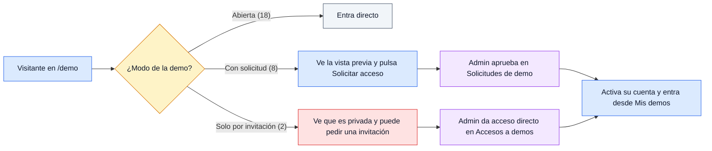
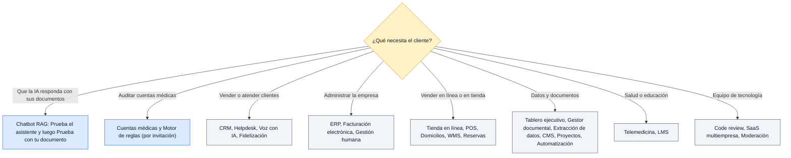
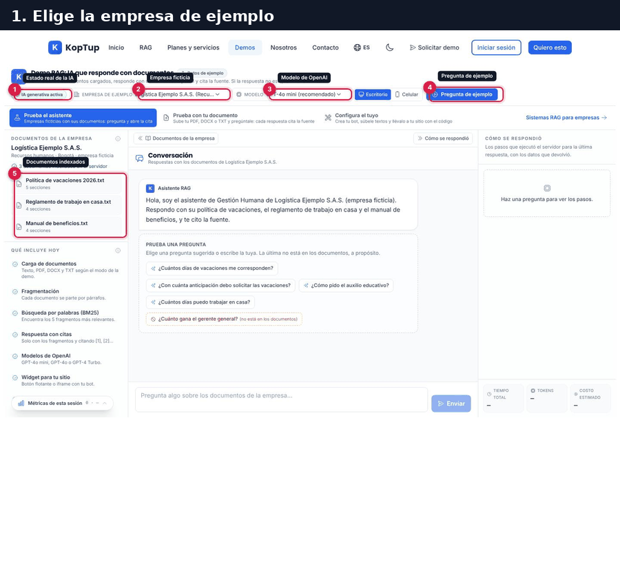

# Guía de demos

> KopTup tiene **28 demos** en `/demo`. Esta página es el índice: para cada demo dice cómo se entra, qué es real y qué está simulado, y si ya pasó la revisión. Cada una tiene su **guía de uso** con un recorrido comercial de 5 minutos, capturas anotadas, un GIF y sus limitaciones conocidas.
>
> **Para el equipo comercial:** antes de mostrar una demo, lee la tabla **"Qué es real y qué es simulado"** de su guía y apóyate en ella, no en la tarjeta del catálogo. Varias tarjetas todavía prometen más de lo que hace la demo (ver [Limitaciones comunes](#limitaciones-comunes)).

**En esta página:** [Resumen](#resumen) · [¿Qué demo muestro?](#qué-demo-muestro) · [Las 28 demos](#las-28-demos) · [Cómo se ve cada guía](#cómo-se-ve-cada-guía) · [Limitaciones comunes](#limitaciones-comunes)

---

## Resumen

| | Cantidad | Demos |
|---|---|---|
| **Abiertas** (cualquiera entra, sin cuenta) | 18 | El chatbot RAG y 17 demos de otras soluciones |
| **Con solicitud** (el visitante ve una vista previa y pide acceso) | 8 | voice-ai, erp, delivery, hrms, lms, telemedicina, wms-logistica, linkedin-ads |
| **Solo por invitación** (solo el admin da acceso) | 2 | cuentas-medicas, sistema-experto |
| **Con IA o backend reales** | 9 | chatbot, cuentas-medicas, linkedin-ads, sistema-experto, gestor-documentos, y una función con IA en helpdesk-ia, hrms, lms y gestor-contenido |
| **Solo con datos de ejemplo** (todo corre en el navegador) | 19 | Las demás: muestran el flujo completo con datos ficticios y lo dicen |
| **Revisadas** (sin botones muertos, con el rótulo "Datos de ejemplo" y con promesas verificables) | 21 | |
| **Por revisar** | 7 | wms-logistica, sistema-reservas, gestor-documentos, automatizacion, moderacion-contenido, saas-boilerplate, firma-electronica ([Estado y próximos pasos](15-Estado-y-Proximos-Pasos.md)) |

El modo de acceso de cada demo lo cambia el admin en **Admin › Catálogo de demos**; la tabla muestra el valor inicial. Cómo funciona cada modo: [Roles y permisos](Doc-10-Roles-y-Permisos.md) y [Flujos de negocio, diagrama 7](Doc-14-1-Flujos-de-Negocio.md).

*Cómo llega una persona a cada tipo de demo. El paso a paso con capturas está en [Flujos del visitante](Doc-04-Flujos-del-Visitante.md) y en el [Manual del administrador](Doc-06-Manual-del-Administrador.md).*

---

## ¿Qué demo muestro?

*El producto principal es el **sistema RAG**: empieza casi siempre por la demo del chatbot. Las demás demos muestran soluciones a medida que se venden como proyecto.*

---

## Las 28 demos

### Producto principal: sistemas RAG

| Vista | Demo y guía | Acceso | Qué es real | Estado |
|---|---|---|---|---|
|  | **[Chatbot RAG con tus documentos](Guia-Demo-chatbot.md)** `/demo/chatbot` | Abierta | IA real | ✅ Revisada |

### Salud y herramientas propias

| Vista | Demo y guía | Acceso | Qué es real | Estado |
|---|---|---|---|---|
|  | **[Sistema experto para salud](Guia-Demo-cuentas-medicas.md)** `/demo/cuentas-medicas` | Solo por invitación | IA real | ✅ Revisada |
|  | **[Motor de reglas del auditor](Guia-Demo-sistema-experto.md)** `/demo/sistema-experto` | Solo por invitación | Backend real y datos de ejemplo | ✅ Revisada |
|  | **[Generador de contenido para LinkedIn con IA](Guia-Demo-linkedin-ads.md)** `/demo/linkedin-ads` | Con solicitud | IA real en "Generar con IA" | ✅ Revisada |

### Ventas y atención

| Vista | Demo y guía | Acceso | Qué es real | Estado |
|---|---|---|---|---|
|  | **[CRM con IA](Guia-Demo-crm-ia.md)** `/demo/crm-ia` | Abierta | Datos de ejemplo | ✅ Revisada |
|  | **[Helpdesk con IA](Guia-Demo-helpdesk-ia.md)** `/demo/helpdesk-ia` | Abierta | Datos de ejemplo e IA real en "Redactar con IA" | ✅ Revisada |
|  | **[Agente de voz con IA para call center](Guia-Demo-voice-ai.md)** `/demo/voice-ai` | Con solicitud | Datos de ejemplo | ✅ Revisada |
|  | **[Programa de fidelización](Guia-Demo-loyalty.md)** `/demo/loyalty` | Abierta | Datos de ejemplo | ✅ Revisada |

### Finanzas y talento

| Vista | Demo y guía | Acceso | Qué es real | Estado |
|---|---|---|---|---|
|  | **[ERP Modular](Guia-Demo-erp.md)** `/demo/erp` | Con solicitud | Datos de ejemplo | ✅ Revisada |
|  | **[Facturación electrónica DIAN (simulador)](Guia-Demo-facturacion-electronica.md)** `/demo/facturacion-electronica` | Abierta | Datos de ejemplo | ✅ Revisada |
|  | **[Gestión Humana y Nómina](Guia-Demo-hrms.md)** `/demo/hrms` | Con solicitud | Datos de ejemplo e IA real en el asistente de políticas | ✅ Revisada |
|  | **[Plataforma de Firma Electrónica](Guia-Demo-firma-electronica.md)** `/demo/firma-electronica` | Abierta | Datos de ejemplo | 🟡 Por revisar |

### Comercio y logística

| Vista | Demo y guía | Acceso | Qué es real | Estado |
|---|---|---|---|---|
|  | **[Tienda en línea](Guia-Demo-ecommerce.md)** `/demo/ecommerce` | Abierta | Datos de ejemplo | ✅ Revisada |
|  | **[POS para retail y restaurantes](Guia-Demo-pos.md)** `/demo/pos` | Abierta | Datos de ejemplo | ✅ Revisada |
|  | **[WMS & Logística inteligente](Guia-Demo-wms-logistica.md)** `/demo/wms-logistica` | Con solicitud | Datos de ejemplo | 🟡 Por revisar |
|  | **[App de domicilios](Guia-Demo-delivery.md)** `/demo/delivery` | Con solicitud | Datos de ejemplo | ✅ Revisada |
|  | **[Sistema de Reservas](Guia-Demo-sistema-reservas.md)** `/demo/sistema-reservas` | Abierta | Datos de ejemplo | 🟡 Por revisar |

### Datos y productividad

| Vista | Demo y guía | Acceso | Qué es real | Estado |
|---|---|---|---|---|
|  | **[Tablero ejecutivo](Guia-Demo-dashboard-ejecutivo.md)** `/demo/dashboard-ejecutivo` | Abierta | Datos de ejemplo | ✅ Revisada |
|  | **[Gestor documental (DocuIA)](Guia-Demo-gestor-documentos.md)** `/demo/gestor-documentos` | Abierta | Backend e IA reales (pide iniciar sesión) | 🟡 Por revisar |
|  | **[Gestor de contenido (CMS headless)](Guia-Demo-gestor-contenido.md)** `/demo/gestor-contenido` | Abierta | Datos de ejemplo e IA real en el asistente de redacción | ✅ Revisada |
|  | **[Plataforma de Automatización](Guia-Demo-automatizacion.md)** `/demo/automatizacion` | Abierta | Datos de ejemplo | 🟡 Por revisar |
|  | **[Extracción y monitoreo de datos](Guia-Demo-scraping.md)** `/demo/scraping` | Abierta | Datos de ejemplo | ✅ Revisada |
|  | **[Gestión de proyectos con portal de cliente](Guia-Demo-control-proyectos.md)** `/demo/control-proyectos` | Abierta | Datos de ejemplo | ✅ Revisada |

### Salud y educación

| Vista | Demo y guía | Acceso | Qué es real | Estado |
|---|---|---|---|---|
|  | **[Telemedicina para IPS](Guia-Demo-telemedicina.md)** `/demo/telemedicina` | Con solicitud | Datos de ejemplo | ✅ Revisada |
|  | **[Plataforma de cursos virtuales (LMS)](Guia-Demo-lms.md)** `/demo/lms` | Con solicitud | Datos de ejemplo e IA real en el tutor | ✅ Revisada |

### Tecnología

| Vista | Demo y guía | Acceso | Qué es real | Estado |
|---|---|---|---|---|
|  | **[Code review con IA](Guia-Demo-code-review-ia.md)** `/demo/code-review-ia` | Abierta | Datos de ejemplo | ✅ Revisada |
|  | **[SaaS Boilerplate Multi-tenant](Guia-Demo-saas-boilerplate.md)** `/demo/saas-boilerplate` | Abierta | Datos de ejemplo | 🟡 Por revisar |
|  | **[Moderación de Contenido con IA](Guia-Demo-moderacion-contenido.md)** `/demo/moderacion-contenido` | Abierta | Datos de ejemplo | 🟡 Por revisar |
---

## Cómo se ve cada guía

Todas las guías tienen la misma estructura. Por ejemplo, la del [ERP](Guia-Demo-erp.md):

| Sección | Qué encuentras |
|---|---|
| **Encabezado** | Ruta, modo de acceso, qué es real y enlace al plan del producto |
| **Recorrido sugerido** | Una demo comercial de 5 minutos, paso a paso, con capturas anotadas (①②③) y un GIF del recorrido |
| **Pantallas y funciones** | Una sección por pestaña o vista: qué puedes hacer y qué pasa al hacerlo, con captura en escritorio y en móvil |
| **Qué es real y qué es simulado** | Tabla para no prometer de más |
| **Acceso** | Cómo la ve un visitante, cómo se pide y cómo la concede el admin |
| **Limitaciones conocidas** | Lo que no funciona o confunde, visto al recorrerla completa |

*GIF del recorrido sugerido de la demo del chatbot: elegir una empresa de ejemplo, preguntar, ver la respuesta con citas y el fragmento citado.*

---

## Limitaciones comunes

Estas se repiten en varias demos; el detalle de cada una está en su guía. También están en [Correcciones pendientes](16-Correcciones-Pendientes.md).

| Qué pasa | Demos |
|---|---|
| **La tarjeta del catálogo promete más que la demo** (por ejemplo "ML", "multi-país", integraciones o cumplimiento que la demo no tiene). La guía de cada una dice qué hace de verdad | crm-ia, helpdesk-ia, voice-ai, loyalty, erp, facturacion-electronica, hrms, lms, pos, delivery, wms-logistica, telemedicina, sistema-reservas, gestor-documentos, automatizacion, scraping, moderacion-contenido, firma-electronica, code-review-ia, linkedin-ads |
| **"Ver Planes y Precios"** del cierre de la demo lleva a los planes RAG, no a los de esa solución | Todas las demos de "Otras soluciones" |
| **Cotizar desde la demo** abre `/contact?service=<slug>` y el formulario muestra el slug en minúsculas ("voice ai callcenter") | voice-ai, telemedicina, code-review-ia y otras |
| **Tres nombres distintos** para la misma demo: tarjeta del catálogo, página y catálogo del admin | helpdesk-ia, telemedicina, voice-ai, moderacion-contenido, saas-boilerplate, sistema-experto |
| **Lo que haces vive solo en tu navegador** (`localStorage`): no se comparte con el vendedor ni entre equipos, y en algunas se pierde al recargar | Casi todas las demos con datos de ejemplo |
| **Errores de hidratación de React** con el navegador en español, por números formateados distinto en el servidor y en el navegador | wms-logistica, automatizacion, moderacion-contenido |
| **Botones que no hacen nada**, sin rótulo "Datos de ejemplo" o con textos en inglés | Las 7 por revisar |
| **Límite de 30 bots nuevos por hora por IP** en el chatbot: si se supera, la demo dice "Revisa tu conexión" aunque la causa sea el límite. También afecta "Redactar con IA" del helpdesk | chatbot, helpdesk-ia |
| **Una demo abierta cuya API exige sesión:** sin iniciar sesión muestra "Error al cargar documentos" | gestor-documentos |
| **Páginas que deberían ser públicas y quedan detrás del acceso:** la verificación del certificado (a la que lleva el QR) pide acceso a la demo | lms |
| **Enlaces de "Solicitar acceso" mal dirigidos** dentro de la demo: a una ruta que no existe o a `/contact` en vez de `/solicitar-demo` | cuentas-medicas, sistema-experto |

Las capturas de las guías se tomaron con el mismo código de `main` en un entorno local con IA simulada: el texto de las respuestas con IA que se ve en ellas es ilustrativo ([Sobre las capturas](Doc-00-Indice.md#sobre-las-capturas)).
