# API del backend

> **Resumen.** El backend de KopTup es una API REST en Express (Node.js) que guarda los datos en MongoDB, usa Redis para sesiones, cupos y topes de gasto, y llama a OpenAI en las demos con IA. Todas las rutas viven bajo `/api/…` (salvo las de salud) y **cada una aplica su política de autorización en el servidor**: pública, con sesión, dueño del recurso, equipo, administrador o "acceso a la demo". Esta página es la referencia completa, módulo por módulo, con los errores, los límites de uso y los flujos clave dibujados.
>
> **Para quién:** un desarrollador que va a usar o cambiar la API, y el dueño que quiere entender qué pasa "por dentro" cuando alguien pide una demo, la aprueba el equipo y la abre el prospecto. Todos los ejemplos son respuestas reales del backend local con datos de ejemplo; los tokens se muestran como `<oculto>`.

**En esta página:**

1. [La API en una imagen](#1-la-api-en-una-imagen)
2. [Convenciones](#2-convenciones)
3. [Quién puede llamar cada ruta](#3-quién-puede-llamar-cada-ruta)
4. [Referencia por módulo](#4-referencia-por-módulo)
5. [Códigos de error comunes](#5-códigos-de-error-comunes)
6. [Límites de uso y topes de gasto](#6-límites-de-uso-y-topes-de-gasto)
7. [Flujos clave paso a paso](#7-flujos-clave-paso-a-paso)
8. [Ejemplos con curl](#8-ejemplos-con-curl)
9. [Salud del servicio y documentación interactiva](#9-salud-del-servicio-y-documentación-interactiva)
10. [Para desarrolladores](#10-para-desarrolladores)
11. [Limitaciones conocidas](#11-limitaciones-conocidas)
12. [Páginas relacionadas](#12-páginas-relacionadas)

---

## 1. La API en una imagen

Cada petición pasa por las mismas capas antes de llegar al código que hace el trabajo. Si una capa la rechaza, la petición no sigue.

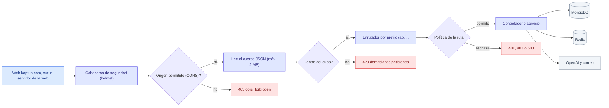

*De izquierda a derecha: seguridad, CORS, tamaño del cuerpo, cupo de peticiones, política de la ruta y, al final, el controlador que lee o escribe en MongoDB, Redis u OpenAI.*

El recorrido más importante de la API es el de una demo: alguien la pide, el equipo la aprueba, la persona activa su cuenta y la abre. El GIF muestra **las peticiones reales** de ese recorrido, una por cuadro:

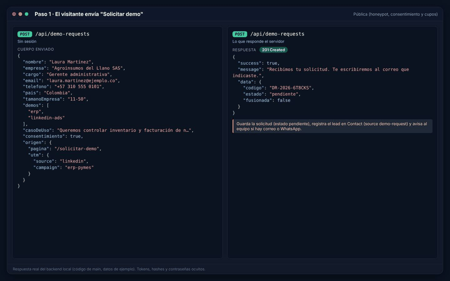

*GIF: ocho peticiones reales (solicitud, panel, aprobación, doble clic, revisión del enlace, activación, acceso a la demo y Mis demos) con las respuestas del backend local.*

| Cuadro | Petición | Quién la hace | Qué demuestra |
|---|---|---|---|
| 1 | `POST /api/demo-requests` | Visitante (sin sesión) | Se guarda la solicitud con código `DR-AAAA-XXXXXX` y estado `pendiente` |
| 2 | `GET /api/admin/demo-requests` | Equipo | El panel lista solicitudes con conteos por estado |
| 3 | `POST /api/admin/demo-requests/:id/approve` | Admin o sales | Crea la cuenta `prospect` (`invitado`), un acceso por demo y el enlace de activación |
| 4 | El mismo `approve` otra vez | Admin o sales | Un doble clic responde `409 already_processed` y no duplica nada |
| 5 | `POST /api/auth/activate/check` y `POST /api/auth/login` | Prospecto | El enlace se revisa sin gastarlo; antes de activar, el login responde `account_not_activated` |
| 6 | `POST /api/auth/activate` | Prospecto | Fija la contraseña y devuelve la sesión; el enlace ya no sirve una segunda vez |
| 7 | `GET /api/demo-access/erp` | Servidor de la web | Sin sesión: `sin_sesion`; con la sesión de Laura: `allowed: true`, motivo `grant` |
| 8 | `GET /api/me/demos` | Prospecto | Sus accesos con días restantes y visitas |

---

## 2. Convenciones

| Tema | Regla |
|---|---|
| **URL base** | La web la toma de su variable `NEXT_PUBLIC_API_URL` (ver [Operación y despliegue](Doc-11-Operacion-y-Despliegue.md)). En desarrollo el backend escucha en `http://localhost:3001` (`PORT`). En esta página usamos `$API` para no repetirla |
| **Formato** | JSON en la petición y en la respuesta (`Content-Type: application/json`), salvo las subidas de archivos (`multipart/form-data`) y las descargas de Excel |
| **Respuesta correcta** | `{ "success": true, "data": …, "message"?: "…" }`. Las listas paginadas traen `data.items`, `data.total`, `data.page`, `data.pages` y, en el panel de demos, `data.conteos` |
| **Respuesta de error** | `{ "success": false, "code": "…", "message": "…" }` y, según el caso, `fields`, `errores`, `motivo` o `retryAfterSec` (ver [sección 5](#5-códigos-de-error-comunes)). Algunas rutas antiguas no traen `code` |
| **Sesión** | Cabecera `Authorization: Bearer <access token>`. El access token es un JWT que dura **15 minutos** (`JWT_EXPIRES_IN`); el refresh token dura **7 días** (`JWT_REFRESH_EXPIRES_IN`) y se guarda en Redis, **uno por cuenta** |
| **Rol** | Va dentro del token, pero las rutas del equipo y las de demos **vuelven a leer el rol en MongoDB en cada petición**: si a alguien le quitan el rol, pierde el acceso de inmediato |
| **Fechas** | ISO 8601 en UTC (`2026-10-23T07:56:09.487Z`). La web las muestra en hora de Colombia |
| **Identificadores** | Casi todo usa el `_id` de MongoDB (24 caracteres hexadecimales). Excepciones: pedidos (`ORD-0001`), entregables (`DEL-0001`), conversaciones (`CONV-0001`), solicitudes de demo (código `DR-2026-XXXXXX`, además del `_id`) y bots del chatbot (`kbot_…`) |
| **Paginación** | `?page=1&limit=20` (máximo 100) en los listados del panel de demos y la bitácora |
| **CORS** | Solo los orígenes `https://koptup.com` y `https://www.koptup.com` (más `localhost:3000` y `3001` fuera de producción y los que agregue `CORS_ORIGIN`). Las peticiones sin cabecera `Origin` (curl, servidor a servidor) no pasan por CORS |
| **Cabeceras propias** | `X-Bot-Owner-Token` (dueño de un bot del chatbot). El servidor de la web usa además una cabecera interna para informar la IP real del visitante |
| **Tamaño del cuerpo** | 2 MB para JSON y formularios; 15 MB solo en `POST /api/chatbot/bots/:botId/docs` (archivos en base64) |

---

## 3. Quién puede llamar cada ruta

Cada ruta declara **una** de estas políticas. El inventario completo vive en el código, en `apps/backend/src/routes/POLICIES.md`; aquí está resumido y en la [sección 4](#4-referencia-por-módulo) aparece ruta por ruta. El detalle de los roles está en [Roles y permisos](Doc-10-Roles-y-Permisos.md).

| Política | Quién pasa | Si no pasa |
|---|---|---|
| **Pública** | Cualquiera (con cupo de peticiones y, si usa IA, tope de gasto) | 429 o 503 |
| **Autenticado** | Un access token válido | 401 `No token provided`, `Invalid token` o `TOKEN_EXPIRED` |
| **Dueño del recurso** | Sesión + el controlador comprueba que el registro es de esa cuenta (o que es del equipo) | 403 o 404 |
| **Equipo** | Roles `admin`, `manager`, `sales` | 403 `Forbidden - Insufficient permissions` |
| **Admin** | Rol `admin` | 403 |
| **Acceso a demo** | Equipo (`admin`, `manager`, `sales`, `developer`) o quien tenga un acceso vigente a esa demo; las demos en modo `publico` quedan abiertas | 401 `login_required`, 403 `demo_access_required` o `demo_disabled`, 503 si MongoDB no responde |
| **Dueño del bot** | Quien presente el token del bot en `X-Bot-Owner-Token` | 401 `owner_token_required` o 403 `forbidden_not_owner` |
| **Solo desarrollo** | Admin, y solo fuera de producción | 404 en producción |

La política **Acceso a demo** es la que conecta la API con el sistema de demos. Así decide el servidor:

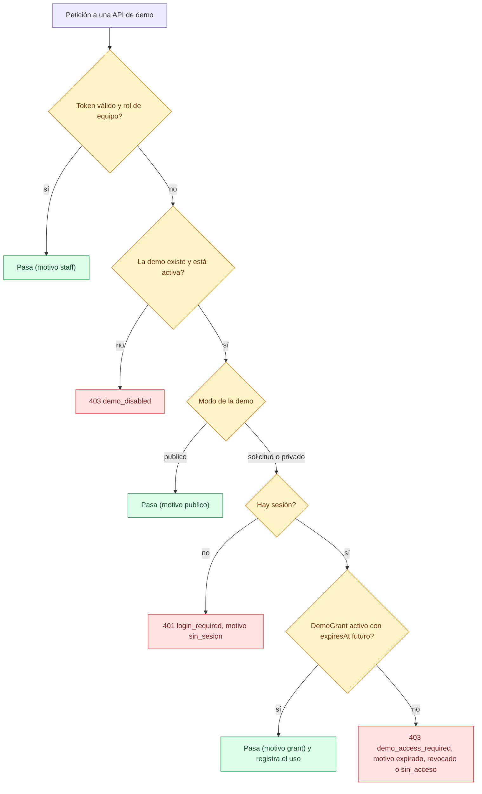

*La vigencia se compara con la hora actual en cada petición: un acceso vencido o revocado se niega al instante, sin esperar el proceso que corre cada hora.*

La ruta pública `GET /api/demo-access/:slug` usa exactamente la misma regla, pero **siempre responde 200** y pone la decisión en `data`. Así la ve la web al abrir `/demo/<slug>`:

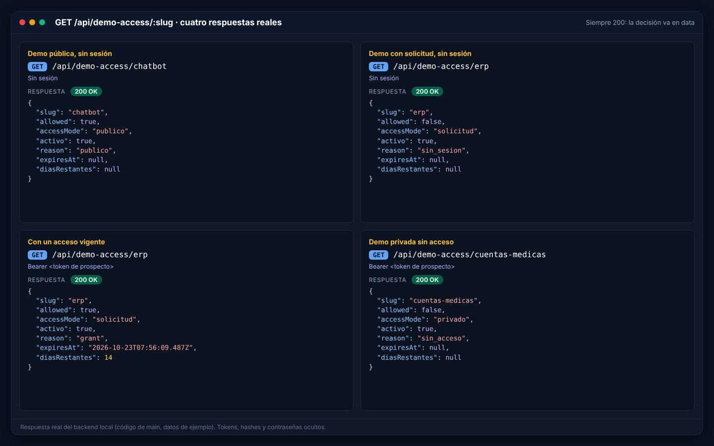

*Demo pública sin sesión (`publico`), demo con solicitud sin sesión (`sin_sesion`), con un acceso vigente (`grant`, con días restantes) y demo privada sin acceso (`sin_acceso`).*

Lo que la web muestra en cada caso está en [Flujos del prospecto y cliente](Doc-05-Flujos-del-Prospecto-y-Cliente.md#6-abrir-una-demo-con-acceso-y-sin-acceso).

---

## 4. Referencia por módulo

Convenciones de las tablas: **Auth** es la política de la sección 3; `:id` es el `_id` de MongoDB salvo que se diga otra cosa; "→" separa lo que se envía de lo que se recibe.

### 4.1 Salud y documentación

| Método | Ruta | Auth | Para qué | Entrada → salida |
|---|---|---|---|---|
| GET | `/health/live` | Pública | El proceso responde (healthcheck de Railway) | → `200 { status: "alive", timestamp }` |
| GET | `/health` | Pública | Listo para atender (MongoDB conectado) | → `200 { status: "healthy", mongo: "connected", timestamp, uptime }` o `503 { status: "unavailable", mongo: "disconnected" }` |
| GET | `/api-docs` | Solo fuera de producción o con `API_DOCS_ENABLED=true` | Swagger UI | Página HTML |

### 4.2 Autenticación (`/api/auth`)

| Método | Ruta | Auth | Para qué | Entrada → salida |
|---|---|---|---|---|
| POST | `/register` | Pública · 5 por minuto | Crear una cuenta local (rol `user`) desde `/register` | `{ email, password (mín. 8), name }` → `201 { id, email, name }`; `400 User already exists` |
| POST | `/login` | Pública · 5 por minuto | Iniciar sesión | `{ email, password }` → `{ accessToken, refreshToken, user: { id, email, name, role } }`; `401 Invalid credentials` o `account_not_activated` |
| POST | `/refresh` | Pública (exige un refresh token válido) | Pedir un access token nuevo | `{ refreshToken }` → `{ accessToken }`; `401 Invalid refresh token` |
| POST | `/logout` | Autenticado | Cerrar sesión (borra el refresh token de Redis) | → mensaje |
| GET | `/me` y `/profile` | Autenticado | Datos vigentes de la cuenta (la web protege `/admin` y `/dashboard` con esta ruta) | → `{ id, email, name, role, phone, company, provider, accountStatus, created_at, last_login }` |
| PATCH | `/me` | Autenticado | Editar nombre, teléfono y empresa propios | `{ name?, phone?, company? }` (otros campos se rechazan) → la cuenta; `400 invalid_profile` |
| POST | `/change-password` | Autenticado · 5 por minuto | Cambiar la contraseña conociendo la actual | `{ currentPassword, newPassword }` → sesión nueva; `400 wrong_password`, `invalid_password` o `no_local_password` |
| POST | `/forgot-password` | Pública · 5 por minuto | Enviar el enlace de recuperación (1 hora) | `{ email }` → siempre el mismo mensaje, exista o no la cuenta |
| POST | `/reset-password` | Pública · 5 por minuto | Fijar una contraseña nueva con el enlace | `{ token, password }` → mensaje; `400 token_invalid`, `token_used`, `token_replaced` o `token_expired` |
| POST | `/activate/check` | Pública · 20 por minuto | Revisar el enlace de activación **sin gastarlo** | `{ token }` → `{ nombre, emailEnmascarado, expiresAt }` |
| POST | `/activate` | Pública · 5 por minuto | Activar la cuenta invitada y fijar la contraseña | `{ token, password }` → misma respuesta que el login; `400 token_*` o `invalid_password` |
| GET | `/google` y `/google/callback` | Pública | Entrar con Google | Redirige a Google y luego a la web con la sesión; `503` si Google no está configurado |

### 4.3 Contacto y leads

| Método | Ruta | Auth | Para qué | Entrada → salida |
|---|---|---|---|---|
| POST | `/api/contact` | Pública · 5 por minuto | Formulario de `/contact`: guarda un `Contact` (origen `contact-form`) y avisa al equipo por correo o WhatsApp si están configurados | `{ name, email, service, message, phone?, company?, budget? }` → mensaje |
| POST | `/api/quotes` | Pública · 5 por minuto | Guarda una cotización (`Quote`). Hoy ninguna página de la web la usa | `{ name, email, service, description }` → mensaje |
| GET | `/api/admin/contacts` | `admin`, `manager` | Bandeja de contactos del panel | `?status=new\|read\|responded` → lista con `source` (`contact-form`, `demo-rag` o `demo-request`) |
| PATCH | `/api/admin/contacts/:id/status` | `admin`, `manager` | Marcar leído o respondido | `{ status }` → `{ id, status }` |
| POST | `/api/contact/test-whatsapp`, `/api/contact/test-email` | Solo desarrollo | Probar los canales de aviso | — |

### 4.4 Demos: lo público y el portal

| Método | Ruta | Auth | Para qué | Entrada → salida |
|---|---|---|---|---|
| POST | `/api/demo-requests` | Pública: campo trampa `website`, autorización de datos obligatoria, 5 envíos válidos por hora por IP y 3 por día por email | Formulario "Solicitar demo". Si el mismo email tiene una solicitud abierta de los últimos 30 días, **le suma las demos** en vez de crear otra | `{ nombre, empresa, cargo?, email, telefono?, pais, tamanoEmpresa, demos[1–10], casoDeUso (10–2000), consentimiento: true, versionPolitica?, origen? }` → `201 { codigo, estado, fusionada }` |
| GET | `/api/demo-catalog` | Pública (caché de 30 s) | Catálogo de las 28 demos | → `[{ slug, nombre, nombreEn, accessMode, activo }]` y `fuente` (`bd` o `respaldo` si MongoDB falla) |
| GET | `/api/demo-access/:slug` | Pública con sesión opcional · 120 por minuto | ¿Esta sesión puede abrir la demo? Con un acceso vigente cuenta una visita (una nueva tras 30 minutos sin actividad) | `?registrar=0` (no cuenta la visita) → `{ slug, allowed, accessMode, activo, reason, expiresAt, diasRestantes }`; `404 not_found`; `401 TOKEN_EXPIRED` |
| GET | `/api/me/demos` | Autenticado | Mis demos: los accesos de la propia cuenta | → `[{ id, demoSlug, demoNombre, accessMode, estado, vigente, expiresAt, diasRestantes, ultimoAcceso, accesos, url }]` |

Los valores de `reason` son: `staff`, `publico`, `grant`, `sin_sesion`, `sin_acceso`, `expirado`, `revocado`, `desactivada`, `no_existe` y `no_disponible`.

### 4.5 Demos: panel del equipo (`/api/admin/demo-…`)

Estas rutas se montan **antes** de `/api/admin` para que el rol `sales` pueda gestionar solicitudes y accesos sin entrar al resto del panel.

| Método | Ruta | Auth | Para qué | Entrada → salida |
|---|---|---|---|---|
| GET | `/api/admin/demo-requests` | `admin`, `sales`, `manager` | Listar solicitudes | `?estado=&demo=&q=&page=&limit=` → `{ items, total, page, pages, conteos }` |
| GET | `/api/admin/demo-requests/:id` | `admin`, `sales`, `manager` | Detalle con la cuenta ligada, los accesos y el historial (bitácora) | → `{ request, demos, cuenta, grants, historial }` |
| PATCH | `/api/admin/demo-requests/:id` | `admin`, `sales` | Pasar a `en_revision` o volver a `pendiente`, o agregar una nota | `{ estado?, nota? }` → la solicitud; `409 invalid_transition` |
| POST | `/api/admin/demo-requests/:id/approve` | `admin`, `sales`; con demos privadas, solo `admin` | Aprobar: crea o vincula la cuenta, un acceso por demo y, si hace falta, el enlace de activación | `{ demos?, dias? (1–365), nota?, mensaje? }` → `{ request, user, grants, activationUrl, activationExpiresAt, loginUrl, email }`; `409 already_processed`; `403 requires_admin`; `422 team_email` |
| POST | `/api/admin/demo-requests/:id/reject` | `admin`, `sales` | Rechazar con motivo interno (y, si se pide, avisar con un mensaje aparte) | `{ motivo (mín. 3), notificar?, mensaje? }` → `{ request, email, notificado }` |
| POST | `/api/admin/demo-requests/:id/resend-activation` | `admin`, `sales` | Emitir un enlace de activación nuevo (invalida el anterior) | → `{ user, activationUrl, activationExpiresAt, email }`; `409 not_approved` o `account_active` |
| GET | `/api/admin/demo-grants` | `admin`, `sales`, `manager` | Listar accesos | `?estado=activo\|por_vencer\|expirado\|revocado&demo=&q=&user=&request=&page=&limit=` → `{ items, total, page, pages, conteos }` |
| POST | `/api/admin/demo-grants` | `admin`, `sales`; con demos privadas, solo `admin` | Invitación directa, sin solicitud previa | `{ email, nombre?, empresa?, telefono?, demos[1–10], dias?, nota?, mensaje? }` → `201`, misma forma que `approve` |
| POST | `/api/admin/demo-grants/:id/extend` | `admin`, `sales` (privadas: `admin`) | Sumar días (también reactiva un acceso vencido) | `{ dias (1–365) }` → `{ grant, email }`; `409 grant_revoked` o `active_grant_exists` |
| POST | `/api/admin/demo-grants/:id/revoke` | `admin`, `sales` (privadas: `admin`) | Cerrar el acceso | `{ motivo? }` → `{ grant }`; `409 grant_revoked` |
| POST | `/api/admin/demo-grants/:id/resend-activation` | `admin`, `sales` | Enlace nuevo para la cuenta del acceso (no da accesos) | → igual que en solicitudes |
| GET | `/api/admin/demo-catalog` | `admin`, `sales`, `manager` | Catálogo con vigencia por defecto y orden | → `[{ slug, nombre, nombreEn, accessMode, activo, duracionDiasPorDefecto, orden, updatedAt }]` |
| PATCH | `/api/admin/demo-catalog/:slug` (o `PATCH /` con `slug`) | `admin` | Cambiar modo, activa, vigencia, orden o nombres | `{ accessMode?, activo?, duracionDiasPorDefecto?, orden?, nombre?, nombreEn? }` → la entrada; `422 fixed_mode` si se intenta cerrar el chatbot RAG |
| GET | `/api/admin/audit-log` | `admin` | Bitácora de acciones del equipo (no tiene pantalla en el panel: se consulta por API o en el historial de cada solicitud) | `?accion=&entidadTipo=&entidadId=&page=&limit=` → `{ items: [{ accion, actorEmail, actorRol, entidad, detalle, fecha }], total, page, pages }` |

Las pantallas que usan estas rutas están en el [Manual del administrador](Doc-06-Manual-del-Administrador.md); por ejemplo, el enlace de activación que devuelve `approve` es el que el panel muestra para copiar o enviar por WhatsApp.

### 4.6 Administración (`/api/admin`)

Todo este router exige `admin` o `manager`, salvo el cambio de rol (solo `admin`).

| Método | Ruta | Para qué | Entrada → salida |
|---|---|---|---|
| GET | `/orders` | Todos los pedidos | `?status=` → lista con cliente, ítems, adjuntos y estado de aprobación |
| PATCH | `/orders/:orderId/status` | Cambiar el estado de un pedido | `{ status: pending\|in_progress\|shipped\|completed\|cancelled }` |
| POST | `/orders/:orderId/approve` | Aprobar un pedido | → `{ id, approvalStatus: "approved" }` |
| POST | `/orders/:orderId/reject` | Rechazar (también lo cancela) | `{ reason? }` |
| POST | `/orders/:orderId/invoice` | Crear la factura de un pedido (ver [Limitaciones](#11-limitaciones-conocidas)) | → `201 { id, invoiceNumber }` |
| GET | `/invoices` | Todas las facturas | `?status=` |
| GET | `/deliverables` | Todos los entregables | `?status=&projectId=` |
| GET | `/conversations` y `/conversations/:id` | Conversaciones y su detalle | `?status=` |
| GET | `/users` | Usuarios | `?role=&search=` → `{ id, name, email, role, provider, lastLogin, createdAt }` |
| PATCH | `/users/:id/role` | Cambiar el rol (**solo admin**; nadie puede quitarse su propio rol de admin) | `{ role }` → `{ id, email, role }`; queda en la bitácora |
| GET | `/contacts` y PATCH `/contacts/:id/status` | Ver [4.3](#43-contacto-y-leads) | |

En estas rutas `:orderId` es el código del pedido (`ORD-0001`), no el `_id`.

### 4.7 Portal del cliente: proyectos, pedidos, facturas, entregables, mensajes y notificaciones

Todas exigen sesión. Cada controlador filtra por la cuenta que llama (o permite al equipo, donde se indica).

| Método | Ruta | Auth | Para qué | Entrada → salida |
|---|---|---|---|---|
| GET | `/api/projects/dashboard/stats` | Autenticado | Resumen del portal | → `{ totalProjects, activeProjects, tasks, recentActivity }` |
| GET | `/api/projects` | Autenticado | Proyectos donde la cuenta es cliente o gerente | → lista |
| POST | `/api/projects` | Autenticado | Crear un proyecto (quien lo crea queda como gerente) | `{ name, description?, client_id?, manager_id?, status?, priority?, budget?, start_date?, end_date?, estimated_hours? }` |
| GET / PUT / DELETE | `/api/projects/:id` | Cliente o gerente (borrar: solo el gerente) | Ver, editar o borrar | PUT acepta `name, description, status, priority, budget, fechas, horas, progress` |
| GET | `/api/projects/:id/members`, `/api/projects/:id/tasks` | Participante | Miembros y tareas | → listas |
| POST | `/api/projects/:id/tasks`, PUT `/api/projects/tasks/:id` | Participante | Crear o editar tareas | `{ title, description?, status?, priority?, assigned_to?, due_date? … }` |
| GET | `/api/orders` | Dueño | Mis pedidos | `?status=` |
| POST | `/api/orders` | Autenticado | Crear un pedido con adjuntos (hasta 10 archivos de 20 MB) | `multipart`: `name`, `description?`, `items` (JSON `[{ name, quantity, price }]`), `projectId?`, `comments?`, `attachments[]` → `201 { id: "ORD-…", amount, status }` |
| GET / PUT | `/api/orders/:orderId` | Dueño | Ver o editar nombre, descripción o estado | — |
| POST | `/api/orders/:orderId/cancel` | Dueño | Cancelar (no si ya está completado o cancelado) | — |
| GET | `/api/invoices` | Dueño | Mis facturas | `?status=&startDate=&endDate=` |
| POST | `/api/invoices` | `admin`, `manager` | Emitir una factura | `{ projectId, clientInfo, items, taxRate?, dueDate?, notes?, terms? }` |
| GET | `/api/invoices/:id` | Dueño o equipo | Detalle | — |
| POST | `/api/invoices/:id/pay` | Dueño o equipo | **Registra** el pago (no hay pasarela: ver [Limitaciones](#11-limitaciones-conocidas)) | `{ paymentMethod, transactionId? }` |
| GET | `/api/invoices/:id/download` | Dueño o equipo | Devuelve datos para descargar | → `{ downloadUrl, fileName, expiresIn }` |
| GET | `/api/deliverables`, `/api/deliverables/:id` | Dueño (detalle: dueño o equipo) | Mis entregables | `?status=&projectId=` |
| POST | `/api/deliverables` | `admin`, `manager`, `developer` | Registrar un entregable | `{ projectId, title, type, fileUrl, fileName, fileSize, description?, fileType?, metadata? }` |
| PUT | `/api/deliverables/:id` | Dueño | Cambiar título o descripción | — |
| POST | `/api/deliverables/:id/approve`, `/reject` | Dueño o equipo | Aprobar o rechazar (rechazar exige `comments`) | `{ comments? }` |
| GET / POST | `/api/messages/conversations` | Participante (crear: admin) | Mis conversaciones o crear una | POST `{ title, clientId, projectId?, orderId? }` |
| GET | `/api/messages/conversations/:id` | Participante | Conversación con sus mensajes | `:id` es `CONV-…` |
| POST | `/api/messages/conversations/:id/read` | Participante | Marcar como leída | — |
| POST | `/api/messages/send` | Participante | Enviar un mensaje | `{ conversationId, content, type?, attachment? }` |
| GET | `/api/notifications`, `/api/notifications/unread-count` | Dueño | Mis notificaciones | `?type=&unreadOnly=&limit=` |
| POST | `/api/notifications` | Autenticado (para otra cuenta: equipo) | Crear una notificación | `{ type, title, message, actionUrl?, metadata?, targetUserId? }` |
| POST | `/api/notifications/:id/read`, `/read-all`; DELETE `/api/notifications/:id` | Dueño | Marcar o borrar | — |

### 4.8 Chatbot RAG (`/api/chatbot`)

Toda la ruta tiene su propio cupo: **60 peticiones por minuto por IP**. Los bots y sus documentos **no** se guardan en MongoDB (ver [Modelos de datos](Doc-09-Modelos-de-Datos.md#7-lo-que-no-está-en-mongodb)).

| Método | Ruta | Auth | Para qué | Entrada → salida |
|---|---|---|---|---|
| GET | `/models` | Pública | Modelos permitidos y si hay IA | → `{ available: [{ id, name, costInputUSDper1M, costOutputUSDper1M, enabled }], activeProvider }` |
| POST | `/bots` | Pública · 30 bots por hora por IP | Crear un bot | `{ name?, color?, position?, avatar?, welcome?, systemPrompt?, tone?, languages? }` → `201` con el bot y `ownerToken` (**solo esta vez**) |
| GET | `/bots` | Pública | Bots del dueño (según `X-Bot-Owner-Token`) y bots de ejemplo | `?limit=&offset=` → lista resumida |
| GET | `/bots/:botId` | Pública | Configuración (completa solo para el dueño; sin prompt ni documentos para el resto) | — |
| PATCH / DELETE | `/bots/:botId` | Dueño del bot | Editar o borrar el bot con sus documentos y conversaciones | — |
| POST | `/bots/:botId/docs` | Dueño del bot | Subir archivos en base64 (máx. 5 por envío, 5 MB c/u, 50 por bot) | `{ files: [{ name, mime, contentBase64 }] }` → `{ docs, added, errors }` |
| DELETE | `/bots/:botId/docs/:docId` | Dueño del bot | Quitar un documento | — |
| POST | `/bots/:botId/urls` | Dueño del bot | Indexar páginas web (máx. 5 por envío, 2 MB c/u) | `{ urls: [...] }` |
| POST | `/bots/:botId/chat` | Pública (bot existente) | Preguntar. Sin IA, sin presupuesto o con error del proveedor responde en **modo extractivo** citando fragmentos | `{ message (≤ 2000), history?, model? }` → `{ reply, sources, confidence, model, tokens?, costUSD?, error? }` |
| GET / DELETE | `/bots/:botId/conversations` | Dueño del bot | Historial (últimos 200 turnos) o borrarlo | `?limit=` |
| POST | `/session`, `/upload`, `/message`; GET `/info/:sessionId`; PUT `/config`; DELETE `/messages/:sessionId`, `/documents/:sessionId` | Pública por `sessionId` | API anterior "por sesión" que aún usa la vista previa del chatbot | Upload: hasta 10 archivos de 10 MB (PDF, TXT, CSV, DOCX), 10 por minuto |

### 4.9 Demo "Prueba con tu documento" (`/api/demo-rag`)

| Método | Ruta | Auth | Para qué | Entrada → salida |
|---|---|---|---|---|
| GET | `/status` | Pública | ¿Está encendida? Nunca muestra montos | → `{ enabled, reason, budgetExhausted, limits }` |
| POST | `/documents` | Pública · 10 intentos cada 10 min y 3 documentos al día por IP | Subir un PDF, DOCX o TXT (5 MB, 30 páginas) con email y autorización de datos; registra un lead (`demo-rag`) | `multipart`: `file`, `email`, `consent=true` → `201 { document, limits }` |
| GET | `/documents/:docId` | Pública | Estado del documento (preguntas usadas, vencimiento) | → `{ document }` |
| POST | `/documents/:docId/questions` | Pública · 30 cada 10 min por IP; 10 por documento | Preguntar | `{ question (≤ 500) }` → respuesta con citas |
| DELETE | `/documents/:docId` | Pública | Borrar el documento antes de la hora | → `{ deleted }` |

Códigos propios: `demo_disabled`, `budget_exhausted`, `capacity` (503); `invalid_format` (415); `file_too_large` (413); `too_many_pages`, `empty_document`, `unreadable_document` (422); `daily_limit`, `question_limit`, `rate_limited` (429); `document_not_found` (404); `llm_error` (502, la pregunta no se descuenta).

### 4.10 Generador para LinkedIn (`/api/linkedin-ads`)

| Método | Ruta | Auth | Para qué | Entrada → salida |
|---|---|---|---|---|
| POST | `/generate` | Acceso a la demo `linkedin-ads` · 5 cada 10 min y 30 al día por cuenta (o por IP sin sesión) | Generar post, anuncio y variantes con IA | `{ demo: { titulo, path, … }, angulo, tono }` → `{ data, model, usage }`; `503 ai_unavailable` o `budget_exhausted` (la web sigue con su generador local); `502` si falla el modelo |

### 4.11 Gestor de contenido (`/api/content`)

Todas exigen acceso a la demo `gestor-contenido` (abierta por defecto), texto de máximo 10.000 caracteres, presupuesto disponible y cupo de **20 cada 10 minutos y 100 al día por IP** (el equipo no tiene cupo).

| Método | Ruta | Para qué | Entrada |
|---|---|---|---|
| POST | `/improve` | Mejorar un texto | `{ content, template? }` |
| POST | `/change-tone` | Cambiar el tono | `{ content, tone, template? }` |
| POST | `/adjust-length` | Ajustar la extensión | `{ content, targetWords, template? }` |
| POST | `/generate-versions` | Varias versiones | `{ content, numVersions, template? }` |
| POST | `/generate` | Generar desde una plantilla | `{ template, userInput }` |

### 4.12 Documentos (`/api/documents`)

Todas exigen sesión y cada consulta se filtra por la cuenta que llama.

| Método | Ruta | Para qué | Entrada |
|---|---|---|---|
| POST | `/upload` | Subir un documento (PDF, DOCX, TXT o CSV de hasta 10 MB; 10 por minuto). Extrae texto y, si hay IA, resumen y búsqueda semántica | `multipart`: `file` |
| GET | `/` | Listar mis documentos | filtros de carpeta, favoritos y papelera |
| POST | `/search/semantic` | Buscar por significado | `{ query }` |
| GET / POST | `/folders` | Carpetas | `{ name }` |
| GET | `/stats` | Estadísticas | — |
| POST | `/:id/explain-similarity`; GET `/:id/explain` | Explicaciones con IA | — |
| PATCH | `/:id` | Renombrar, mover, favorito | — |
| DELETE | `/:id` | Mandar a la papelera o borrar (exige además un PIN de demostración en `?pin=`) | `?permanent=` |
| POST | `/:id/restore` | Sacar de la papelera | — |

### 4.13 Salud: cuentas médicas, sistema experto y herramientas internas

Estas rutas sirven a dos demos **privadas** (solo por invitación: [Cuentas médicas](Guia-Demo-cuentas-medicas.md) y [Sistema experto](Guia-Demo-sistema-experto.md)) y a la herramienta interna `/liquidacion` del equipo.

| Prefijo | Rutas | Auth | Para qué |
|---|---|---|---|
| `/api/auditoria` | POST `/facturas`, `/procesar-archivos`, `/procesar-facturas-pdf`, `/procesar-modular` (hasta 10 archivos de 10 MB); GET `/facturas`, `/facturas/:id`, `/facturas/:id/calificar`, `/facturas/:id/excel`, `/facturas/:id/excel-auditoria-medica`; DELETE `/facturas/:id`; POST `/facturas/:id/auditar`, `/facturas/:id/auditar-paso-a-paso`; POST `/sesion/:sesionId/siguiente`, GET `/sesion/:sesionId`; POST `/soportes`; GET `/tarifarios`; PATCH `/glosas/:id`; GET `/estadisticas`; POST `/aprendizaje/feedback/:decisionId`; GET `/aprendizaje/estadisticas`, `/aprendizaje/reporte` | Acceso a la demo `cuentas-medicas` | Auditoría de facturas médicas: extracción, glosas, auditoría paso a paso, Excel y calibración con retroalimentación humana |
| `/api/documentos-conocimiento` | GET `/config`, POST `/config/inicializar` · PATCH `/config/:documento_id` · POST `/config/resetear` | Acceso a `cuentas-medicas` · Equipo · Admin | Documentos normativos que usa el motor de auditoría |
| `/api/expert` | POST `/procesar`, `/generar-excel`, `/procesar-y-descargar`; GET `/configuracion`, `/estadisticas` · PUT `/configuracion` | Acceso a la demo `sistema-experto` · Equipo | Sistema experto de auditoría y su configuración |
| `/api/cups` | GET `/estadisticas`, `/incompletos`, `/estadisticas-vectorizacion`; POST `/buscar-semantica`, `/buscar-similares` · POST `/importar-csv`, `/importar-excel`, `/vectorizar`, `/revectorizar` | Acceso a `sistema-experto` · Admin | Catálogo de procedimientos CUPS con búsqueda semántica; la importación solo acepta nombres de archivo de la carpeta de importación del servidor |
| `/api` (cuentas) | `/cuentas` (CRUD), `/cuentas/:id/upload` (20 PDF de 50 MB), `/cuentas/:id/files/:filename` (DELETE y `/toggle`), `/cuentas/procesar-hibrido`, `/cuentas/search/cups\|medicamentos\|diagnosticos\|materiales`, `/cuentas/calcular-tarifa`, `/cuentas/calcular-costo-medicamentos`, `/ley100` (subir hasta 10 de 50 MB, listar, borrar, `/toggle`), POST `/process`, GET `/export` | Equipo | Procesamiento de cuentas médicas y documentos de la Ley 100 con salida en Excel |
| `/api/liquidacion` | POST/GET `/radicados`, GET `/radicados/:id`, POST `/radicados/:id/documentos` (20 PDF de 50 MB), POST `/radicados/:id/liquidar`, GET `/radicados/:id/descargar-excel`, DELETE `/radicados/:id`, GET `/estadisticas` | Equipo | Herramienta interna de liquidación de radicados |
| `/api/reglas-facturacion` | POST/GET `/`, GET `/ejemplos`, POST `/previsualizar`, GET/PATCH/DELETE `/:id`, PATCH `/:id/toggle` | Equipo | Reglas globales de facturación que usa `/liquidacion` |

### 4.14 Solo desarrollo

| Prefijo | Auth | Qué es |
|---|---|---|
| `/api/chat` (`/session`, `/message`, `/history/:sessionId`) | Solo desarrollo | Chat de eco antiguo |
| `/api/test` (`/whatsapp`, `/whatsapp/status`) | Solo desarrollo | Diagnóstico de WhatsApp |

En producción responden `404 Endpoint not found`, igual que una ruta que no existe.

---

## 5. Códigos de error comunes

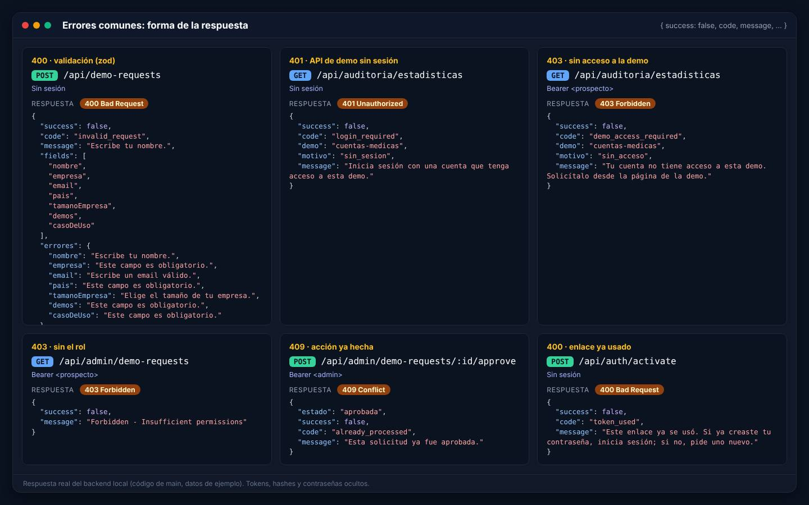

*Validación con mensajes por campo, API de demo sin sesión, sin acceso, sin el rol, acción repetida y enlace ya usado: respuestas reales del backend local.*

| HTTP | `code` | Cuándo pasa | Qué hace la web |
|---|---|---|---|
| 400 | `invalid_request` | Un formulario no pasa la validación. Trae `fields` (lista) y `errores` (`{ campo: mensaje }` en español) | Marca cada campo con su mensaje |
| 400 | `consent_required` | Falta la autorización de datos (Ley 1581) | Resalta la casilla |
| 400 | `invalid_json`, `invalid_data`, `bad_request` | Cuerpo que no es JSON, id mal formado o dato inválido | Mensaje genérico |
| 400 | `token_invalid`, `token_used`, `token_replaced`, `token_expired` | Enlace de activación o de recuperación que no sirve | Pantalla de enlace inválido con la salida que corresponde |
| 400 | `upload_limit_file_size` y similares | El archivo supera el tamaño o hay demasiados | Mensaje en el formulario |
| 401 | (sin código) `No token provided`, `Invalid token` | Ruta con sesión llamada sin token o con uno inválido | Lleva a `/login` |
| 401 | `TOKEN_EXPIRED` | El access token venció | Pide uno nuevo con `/api/auth/refresh` y repite |
| 401 | `account_not_activated` | Login de una cuenta invitada que no ha usado su enlace | Explica que debe activar la cuenta |
| 401 | `login_required` (con `motivo: sin_sesion`) | API de una demo con solicitud o privada, sin sesión | Pide iniciar sesión |
| 403 | `demo_access_required` (con `motivo`) | Hay sesión pero no hay acceso vigente: `sin_acceso`, `expirado` o `revocado` | Pantalla `/demo-acceso/<slug>` |
| 403 | `demo_disabled` | La demo está desactivada en el catálogo | "En mantenimiento" |
| 403 | (sin código) `Forbidden - Insufficient permissions` | Falta el rol | — |
| 403 | `requires_admin` | `sales` intenta dar o cambiar acceso a una demo privada | Avisa que solo un admin puede |
| 403 | `cors_forbidden` | Origen no permitido | — |
| 404 | `not_found` o `Endpoint not found` | Registro o ruta inexistente | — |
| 409 | `already_processed`, `invalid_transition`, `grant_revoked`, `active_grant_exists`, `account_active`, `not_approved` | La acción ya se hizo o el estado no lo permite (por ejemplo, doble clic) | Refresca y muestra el estado real |
| 413 | `payload_too_large` | Cuerpo de más de 2 MB | — |
| 422 | `team_email`, `fixed_mode`, `unknown_demo` (400) | Email de una cuenta del equipo, intento de cerrar el chatbot RAG o demo que no existe | Mensaje en el panel |
| 429 | `rate_limited` (o sin código) | Se agotó un cupo; a veces trae `Retry-After` y `retryAfterSec` | Pide esperar |
| 500 | `internal_error` | Error no previsto. En producción no se muestran detalles internos | Mensaje genérico |
| 503 | `service_unavailable` | MongoDB no responde y la ruta necesita leer el rol o el acceso (falla cerrada) | Página de servicio no disponible |
| 503 | `ai_unavailable`, `budget_exhausted`, `demo_disabled` | Falta la IA, Redis no responde o se agotó el tope del mes | La demo pasa a su modo sin IA o lo explica |

---

## 6. Límites de uso y topes de gasto

### 6.1 Cupos de peticiones

Los cupos marcados "memoria" se cuentan en el proceso del backend; los marcados "Redis" se comparten entre instancias.

| Dónde aplica | Cupo por defecto | Ventana | Se cuenta por | Dónde | Variable |
|---|---|---|---|---|---|
| Todo `/api` salvo los casos de abajo | 100 | 15 min | Usuario (con token válido), sesión de refresco o IP | Memoria | `RATE_LIMIT_MAX_REQUESTS`, `RATE_LIMIT_WINDOW_MS` |
| `GET /api/auth/me` y `GET /api/demo-access/*` | 120 | 1 min | Igual que el anterior | Memoria | `AUTH_ME_RATE_LIMIT_MAX` |
| Todo `/api/chatbot` | 60 | 1 min | IP | Memoria | `CHATBOT_RATE_LIMIT_MAX` |
| Registro, login, recuperar y restablecer contraseña, activar, cambiar contraseña, `POST /api/contact`, `POST /api/quotes` | 5 | 1 min | IP | Memoria | — |
| `POST /api/auth/activate/check` | 20 | 1 min | IP | Memoria | — |
| Subidas de `/api/documents/upload` y `/api/chatbot/upload` | 10 | 1 min | IP | Memoria | — |
| Crear bots (`POST /api/chatbot/bots`) | 30 | 1 hora | IP | Memoria | `CHATBOT_CREATE_LIMIT_PER_HOUR` |
| `POST /api/demo-requests` (solo envíos válidos) | 5 por IP · 3 por email | 1 hora · 24 horas | IP · email normalizado (en hash) | Redis, con respaldo en memoria | `DEMO_REQUEST_LIMIT_PER_HOUR`, `DEMO_REQUEST_LIMIT_PER_EMAIL_DAY` |
| Demo RAG: subir documento | 10 intentos · 3 documentos | 10 min · día de Colombia | IP | Memoria · Redis | — |
| Demo RAG: preguntar | 30 · 10 por documento | 10 min · vida del documento | IP · documento | Memoria | — |
| `POST /api/linkedin-ads/generate` | 5 · 30 | 10 min · 24 horas | Cuenta (o IP sin sesión) | Redis (sin Redis responde 503) | — |
| `/api/content/*` (visitantes) | 20 · 100 | 10 min · 24 horas | IP | Redis (sin Redis responde 503) | — |

Detrás del proxy de Railway el servidor confía en un salto (`TRUST_PROXY_HOPS`, por defecto 1) para leer la IP real del visitante. Los cupos estándar se ven en las cabeceras `RateLimit-*` de cada respuesta:

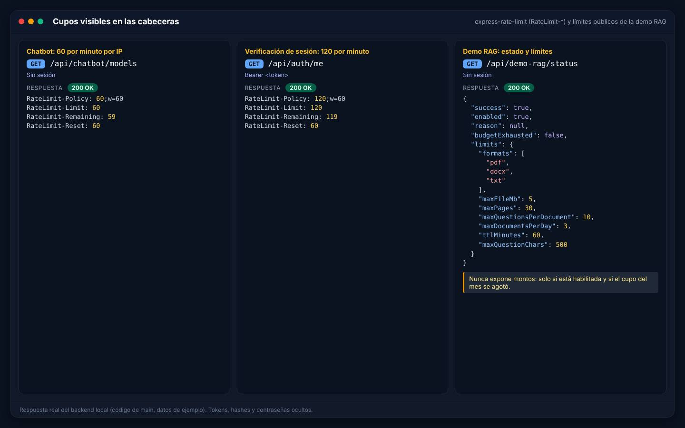

*El chatbot informa 60 por minuto, la verificación de sesión 120 por minuto y la demo RAG publica sus límites en `/status`.*

### 6.2 Tamaños máximos

| Qué | Límite |
|---|---|
| Cuerpo JSON o de formulario | 2 MB (15 MB solo para subir documentos a un bot) |
| Documentos del gestor (`/api/documents/upload`) | 10 MB (`MAX_FILE_SIZE`), 1 archivo; PDF, DOCX, TXT, CSV |
| Adjuntos de un pedido | 20 MB por archivo, 10 por pedido; documentos, imágenes, ZIP y RAR |
| Demo RAG | 5 MB y 30 páginas; PDF, DOCX, TXT |
| Bots del chatbot | 5 archivos de 5 MB por envío, 50 documentos y 5.000 fragmentos por bot, 5 URL por envío (2 MB, 8 s) |
| Auditoría médica | 10 MB por archivo, 10 por envío |
| Cuentas médicas, Ley 100 y liquidación | 50 MB por PDF; 20, 10 y 20 archivos por envío |

### 6.3 Topes de gasto de IA

Cuatro funciones que cualquier visitante puede usar tienen un **tope mensual en dólares**. El gasto se calcula con los tokens que informa el proveedor, se suma en Redis por mes (UTC) y la API **nunca devuelve montos**.

| Función | Variable | Tope por defecto | Clave en Redis | Cuando se agota |
|---|---|---|---|---|
| Demo RAG "Prueba con tu documento" | `DEMO_MONTHLY_BUDGET_USD` | USD 50 | `demo-rag:spend:AAAA-MM` | La demo se apaga: `503 budget_exhausted` |
| Chatbot RAG | `CHATBOT_MONTHLY_BUDGET_USD` | USD 50 | `chatbot:spend:AAAA-MM` | Responde en modo extractivo (cita fragmentos sin IA) |
| Generador para LinkedIn | `LINKEDIN_ADS_MONTHLY_BUDGET_USD` | USD 20 | `linkedin-ads:spend:AAAA-MM` | `503 budget_exhausted`; la web usa su generador local |
| Gestor de contenido | `CONTENT_MONTHLY_BUDGET_USD` | USD 20 | `content:spend:AAAA-MM` | `503 budget_exhausted` |

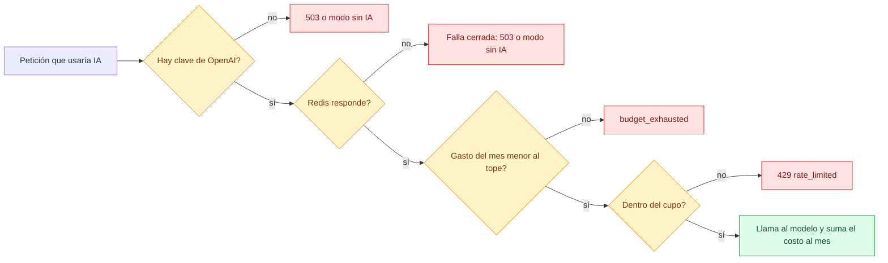

*Si no se puede medir el gasto, no se gasta: sin Redis, las funciones con IA públicas se apagan o pasan a su modo sin IA.*

Un tope con valor inválido o negativo deja la función **sin presupuesto** (cero). Las demás funciones con IA (salud y documentos) no tienen tope propio: dependen de su control de acceso y del cupo general.

---

## 7. Flujos clave paso a paso

Los cuatro diagramas siguientes cubren el recorrido completo **solicitud → aprobación → activación → acceso**. El mismo recorrido, visto por el usuario, está en [Flujos del prospecto y cliente](Doc-05-Flujos-del-Prospecto-y-Cliente.md).

### 7.1 Solicitud pública

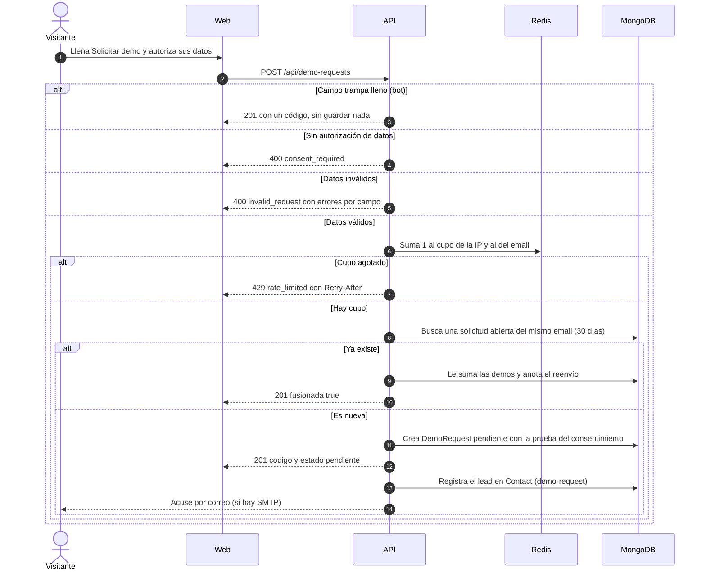

### 7.2 Aprobación por el equipo

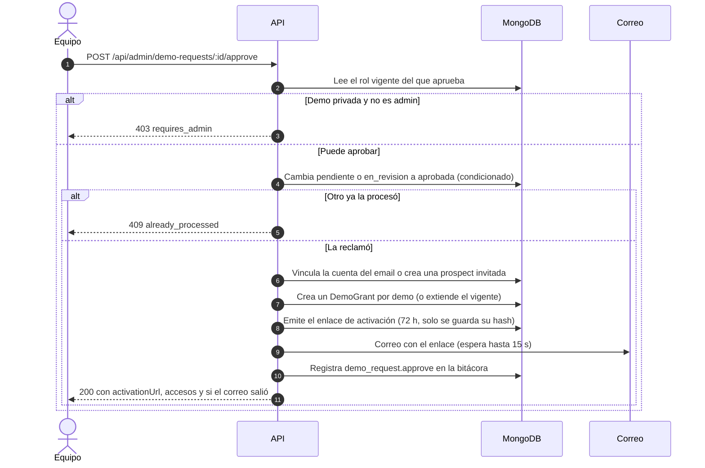

*Si algo falla a mitad de camino, la API deshace lo que creó y devuelve la solicitud a su estado anterior.*

### 7.3 Activación de la cuenta

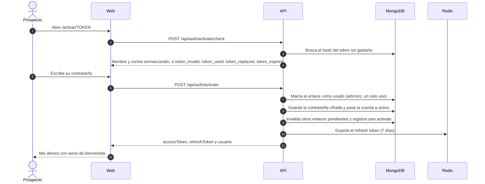

### 7.4 Acceso a una demo

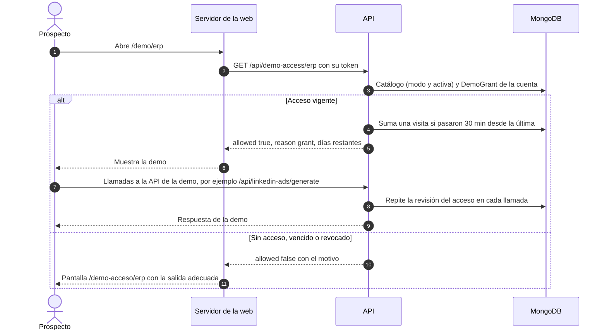

### 7.5 Sesión: login, renovación y cierre

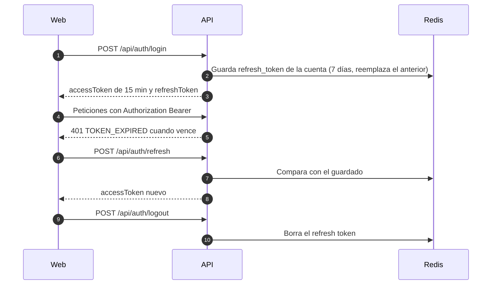

### 7.6 Vencimiento automático de los accesos

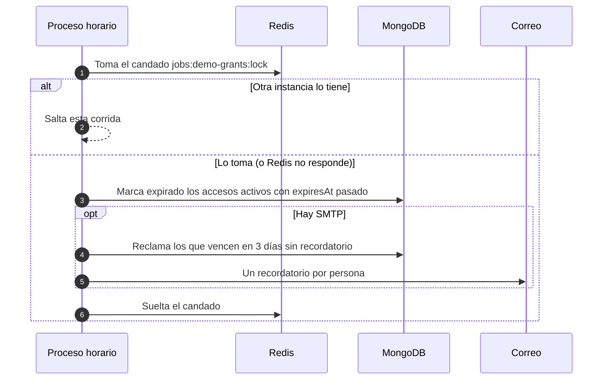

*Corre cada hora (`DEMO_GRANTS_JOB_INTERVAL_MS`), la primera vez unos 30 segundos después de arrancar; `DEMO_GRANTS_JOB_ENABLED=false` lo apaga. La vigencia real no depende de él: la API compara la fecha en cada petición.*

---

## 8. Ejemplos con curl

Usa tu backend local y guarda la URL en una variable. Las respuestas son reales (recortadas donde dice `…`).

```bash
export API=http://localhost:3001
```

### 8.1 Leer el catálogo (pública)

```bash
curl -s "$API/api/demo-catalog"
```

```json
{
  "success": true,
  "fuente": "bd",
  "data": [
    { "slug": "chatbot", "nombre": "Chatbot RAG con tus documentos", "nombreEn": "RAG chatbot over your documents", "accessMode": "publico", "activo": true },
    { "slug": "code-review-ia", "nombre": "Revisión de código con IA", "nombreEn": "AI code review", "accessMode": "publico", "activo": true },
    …
  ]
}
```

### 8.2 Solicitar una demo (pública)

```bash
curl -s -X POST "$API/api/demo-requests" \
  -H 'Content-Type: application/json' \
  -d '{
    "nombre": "Laura Martínez",
    "empresa": "Agroinsumos del Llano SAS",
    "cargo": "Gerente administrativa",
    "email": "laura.martinez@ejemplo.co",
    "telefono": "+57 310 555 0101",
    "pais": "Colombia",
    "tamanoEmpresa": "11-50",
    "demos": ["erp", "linkedin-ads"],
    "casoDeUso": "Queremos controlar inventario y facturación de nuestras tres bodegas en un solo sistema.",
    "consentimiento": true,
    "origen": { "pagina": "/solicitar-demo", "utm": { "source": "linkedin", "campaign": "erp-pymes" } }
  }'
```

```json
{
  "success": true,
  "message": "Recibimos tu solicitud. Te escribiremos al correo que indicaste.",
  "data": { "codigo": "DR-2026-6T8CKS", "estado": "pendiente", "fusionada": false }
}
```

Si falta la autorización de datos la respuesta es `400`:

```json
{
  "fields": ["consentimiento"],
  "success": false,
  "code": "consent_required",
  "message": "Debes autorizar el tratamiento de tus datos personales (Ley 1581 de 2012) para enviar la solicitud."
}
```

### 8.3 Iniciar sesión y ver Mis demos

```bash
# 1. Inicia sesión (la contraseña es la que la persona creó al activar su cuenta)
curl -s -X POST "$API/api/auth/login" \
  -H 'Content-Type: application/json' \
  -d '{ "email": "laura.martinez@ejemplo.co", "password": "<tu contraseña>" }'
```

```json
{
  "success": true,
  "message": "Login successful",
  "data": {
    "accessToken": "<oculto>",
    "refreshToken": "<oculto>",
    "user": { "id": "6ac89e19d28776d0718d6513", "email": "laura.martinez@ejemplo.co", "name": "Laura Martínez", "role": "prospect" }
  }
}
```

```bash
# 2. Copia el accessToken en una variable y pide tus demos
export TOKEN='<accessToken>'
curl -s "$API/api/me/demos" -H "Authorization: Bearer $TOKEN"
```

```json
{
  "success": true,
  "data": [
    {
      "id": "6ac89e19d28776d0718d6516",
      "demoSlug": "erp",
      "demoNombre": "ERP modular",
      "accessMode": "solicitud",
      "demoActiva": true,
      "estado": "activo",
      "vigente": true,
      "expiresAt": "2026-10-23T07:56:09.487Z",
      "diasRestantes": 14,
      "ultimoAcceso": "2026-10-09T07:56:10.018Z",
      "accesos": 1,
      "url": "/demo/erp"
    },
    …
  ]
}
```

Con el mismo token, una API de una demo a la que la cuenta **no** tiene acceso responde `403`:

```bash
curl -s "$API/api/auditoria/estadisticas" -H "Authorization: Bearer $TOKEN"
```

```json
{
  "success": false,
  "code": "demo_access_required",
  "demo": "cuentas-medicas",
  "motivo": "sin_acceso",
  "message": "Tu cuenta no tiene acceso a esta demo. Solicítalo desde la página de la demo."
}
```

---

## 9. Salud del servicio y documentación interactiva

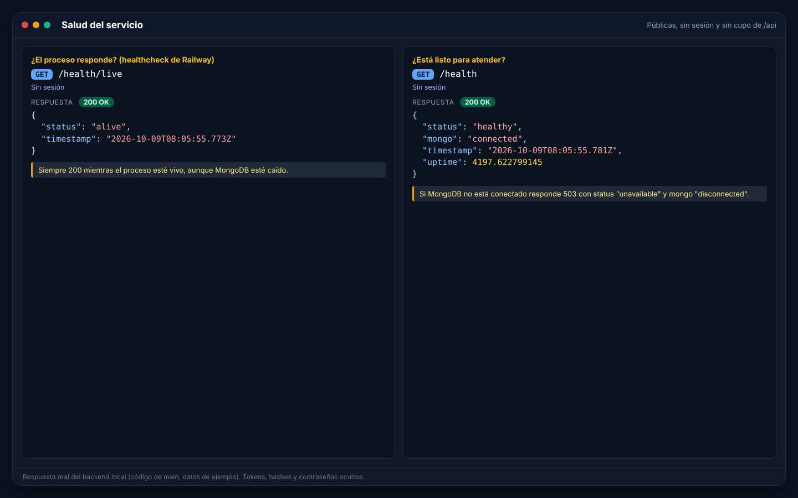

*`/health/live` dice si el proceso está vivo; `/health` dice si puede atender (MongoDB conectado).*

- **`/health/live`** es el healthcheck del despliegue en Railway: responde 200 aunque MongoDB esté caído, para que el servicio no se reinicie en bucle por un problema de la base.
- **`/health`** responde 503 mientras MongoDB no esté conectado. Si el backend arranca sin base de datos, sigue vivo y las rutas que necesitan leer roles o accesos responden `503 service_unavailable` (falla cerrada).
- **Swagger** (`/api-docs`) existe solo fuera de producción o con `API_DOCS_ENABLED=true`. Se genera con los comentarios `@swagger` de `src/routes/*.ts`, que no cubren todas las rutas: esta página es la referencia completa.

Qué hacer cuando el backend no responde está en [Operación y despliegue](Doc-11-Operacion-y-Despliegue.md).

---

## 10. Para desarrolladores

| Qué | Dónde (en `apps/backend/src`) |
|---|---|
| Arranque: variables, carpetas de subida, MongoDB, admin desde `ADMIN_EMAIL`, semilla del catálogo, Passport, job de accesos | `index.ts` |
| Aplicación Express (middleware y montaje de rutas) | `app.ts` |
| Políticas de autorización | `middleware/access.ts` y el inventario `routes/POLICIES.md` |
| Sesión JWT | `middleware/auth.ts`, `controllers/auth.controller.ts` |
| Errores y su traducción a `{ code, message }` | `middleware/errorHandler.ts` |
| Cupos | `middleware/rateLimiter.ts`, `middleware/client-ip.ts`, `services/request-limits.service.ts` |
| Topes de gasto de IA y cupos en Redis | `services/ai-budget.service.ts` |
| Sistema de demos | `routes/demo-public.routes.ts`, `routes/admin-demos.routes.ts`, `services/demo-*.service.ts`, `services/magic-link.service.ts`, `jobs/demo-grants.job.ts`, `config/demos.ts` |
| Pruebas de la API (401/403/200 por política, flujo de demos) | `__tests__/integration/` con supertest |

**Checklist para agregar una ruta:**

1. Elige la política (sección 3) y aplícala en el archivo de rutas con los middleware de `middleware/access.ts`. Si la ruta es del equipo, usa `requireRole` (lee el rol en la base) y no solo el rol del token.
2. Valida la entrada (en el código nuevo se usa `zod` y `zodToAppError` para devolver `fields` y `errores`).
3. Lanza `AppError(mensaje, status, code)` en vez de responder a mano: así la respuesta tiene siempre `success`, `code` y `message`.
4. Envuelve los controladores asíncronos con `asyncHandler`.
5. Si llama a OpenAI desde una ruta pública, pasa por `getBudgetStatus` y `recordSpend` y agrega un cupo en Redis.
6. Si la acción la hace el equipo, regístrala con `recordAudit`.
7. Agrega la ruta a `routes/POLICIES.md` y una prueba de integración.

---

## 11. Limitaciones conocidas

| Tema | Qué pasa hoy |
|---|---|
| **Crear entregables, facturas y conversaciones** | `POST /api/deliverables`, `POST /api/invoices`, `POST /api/admin/orders/:orderId/invoice` y `POST /api/messages/conversations` responden **500** en `main`: los modelos exigen el número consecutivo (`DEL-…`, `FAC-…`, `CONV-…`) antes de que se ejecute el código que lo genera. Por eso hoy no se pueden crear entregables, facturas ni conversaciones por API; el modelo de mensajes tiene el mismo patrón |
| **Conversación automática de un pedido** | Al crear un pedido, la conversación con el equipo no se crea (el error se registra en el log y el pedido sí se guarda) |
| **Pagos** | `POST /api/invoices/:id/pay` solo **registra** el pago con el método que se le indique: no hay pasarela. Los pagos en línea están en desarrollo (ver [Estado y próximos pasos](15-Estado-y-Proximos-Pasos.md)) |
| **Descargar factura** | `GET /api/invoices/:id/download` devuelve un enlace a sí misma; no se genera un PDF |
| **Adjuntos de pedidos** | Se guardan en el disco del servidor (efímero en Railway) y la API no los sirve para descargar |
| **Notificaciones** | Ningún flujo las crea solo; solo existen las que se crean con `POST /api/notifications` |
| **Cupos en memoria** | El cupo general, el de login y el del chatbot se reinician en cada despliegue y no se comparten si hay varias instancias |
| **Una sesión renovable por cuenta** | El refresh token es uno por cuenta: iniciar sesión en otro navegador hace que el primero no pueda renovar y deba volver a entrar a los 15 minutos |
| **Formato de errores** | Las rutas nuevas (demos, auth, errores generales) traen `code`; varias rutas antiguas (portal, admin, chatbot) responden `{ success, message }` o `{ error }` sin código estable |
| **Swagger incompleto** | Los comentarios `@swagger` no cubren todas las rutas |
| **Cotizaciones** | `POST /api/quotes` existe pero ninguna página la usa y no tiene pantalla en el panel |

---

## 12. Páginas relacionadas

- [Modelos de datos](Doc-09-Modelos-de-Datos.md): las colecciones que esta API lee y escribe, con sus estados.
- [Roles y permisos](Doc-10-Roles-y-Permisos.md): qué puede hacer cada rol.
- [Arquitectura](Doc-01-Arquitectura.md): dónde corre el backend y con qué servicios habla.
- [Flujos del prospecto y cliente](Doc-05-Flujos-del-Prospecto-y-Cliente.md) y [Manual del administrador](Doc-06-Manual-del-Administrador.md): las pantallas que usan estas rutas.
- [Operación y despliegue](Doc-11-Operacion-y-Despliegue.md): variables de entorno y procedimientos ante fallas.
- [Backend y API (plan)](09-Backend-y-API.md): el plan original de esta parte.
