# Modelos de datos

> **Resumen.** KopTup guarda sus datos de negocio en **MongoDB** (cuentas, demos, solicitudes, accesos, contactos, proyectos, pedidos, facturas y las demos de salud), usa **Redis** para lo temporal (sesiones de refresco, cupos y gasto de IA del mes) y deja algunas cosas **solo en memoria o en el disco del servidor** (documentos de la demo RAG, bots del chatbot, archivos subidos). Esta página muestra cómo se relacionan las colecciones, qué campos tiene cada modelo principal, por qué estados pasa cada registro y cuánto tiempo se conserva cada dato.
>
> **Para quién:** el dueño (qué se guarda de cada persona y por cuánto tiempo) y un desarrollador (colecciones, campos, índices y reglas). Las rutas que leen y escriben estos datos están en [API](Doc-08-API.md).

**En esta página:**

1. [Los datos en una imagen](#1-los-datos-en-una-imagen)
2. [Colecciones de MongoDB](#2-colecciones-de-mongodb)
3. [Relaciones por dominio](#3-relaciones-por-dominio)
4. [Campos de los modelos principales](#4-campos-de-los-modelos-principales)
5. [Estados](#5-estados)
6. [Índices y reglas de unicidad](#6-índices-y-reglas-de-unicidad)
7. [Lo que no está en MongoDB](#7-lo-que-no-está-en-mongodb)
8. [Cuánto se conserva cada dato](#8-cuánto-se-conserva-cada-dato)
9. [Datos personales](#9-datos-personales)
10. [Para desarrolladores](#10-para-desarrolladores)
11. [Limitaciones conocidas](#11-limitaciones-conocidas)
12. [Páginas relacionadas](#12-páginas-relacionadas)

---

## 1. Los datos en una imagen

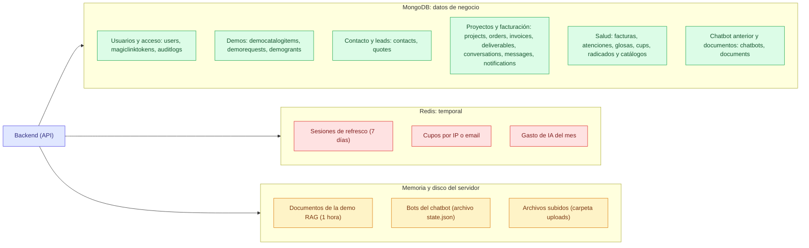
```mermaid
flowchart LR
    classDef mongo fill:#dcfce7,stroke:#16a34a,color:#14532d
    classDef redis fill:#fee2e2,stroke:#dc2626,color:#7f1d1d
    classDef mem fill:#fef3c7,stroke:#d97706,color:#78350f
    classDef api fill:#e0e7ff,stroke:#4f46e5,color:#312e81

    API["Backend (API)"]:::api

    subgraph MONGO["MongoDB: datos de negocio"]
        U["Usuarios y acceso: users, magiclinktokens, auditlogs"]:::mongo
        D["Demos: democatalogitems, demorequests, demogrants"]:::mongo
        L["Contacto y leads: contacts, quotes"]:::mongo
        P["Proyectos y facturación: projects, orders, invoices, deliverables, conversations, messages, notifications"]:::mongo
        S["Salud: facturas, atenciones, glosas, cups, radicados y catálogos"]:::mongo
        C["Chatbot anterior y documentos: chatbots, documents"]:::mongo
    end

    subgraph REDIS["Redis: temporal"]
        R1["Sesiones de refresco (7 días)"]:::redis
        R2["Cupos por IP o email"]:::redis
        R3["Gasto de IA del mes"]:::redis
    end

    subgraph PROC["Memoria y disco del servidor"]
        M1["Documentos de la demo RAG (1 hora)"]:::mem
        M2["Bots del chatbot (archivo state.json)"]:::mem
        M3["Archivos subidos (carpeta uploads)"]:::mem
    end

    API --> MONGO
    API --> REDIS
    API --> PROC
```

*Verde: lo que se conserva (MongoDB). Rojo: lo que vence solo (Redis). Ámbar: lo que vive en el proceso o en el disco del servidor y se pierde al reiniciar o redesplegar.*

El GIF muestra **los documentos reales** que se escriben en MongoDB a lo largo de la vida de una solicitud: la solicitud y el lead, la cuenta invitada con su acceso y su enlace, la activación, el uso, la extensión y la revocación.

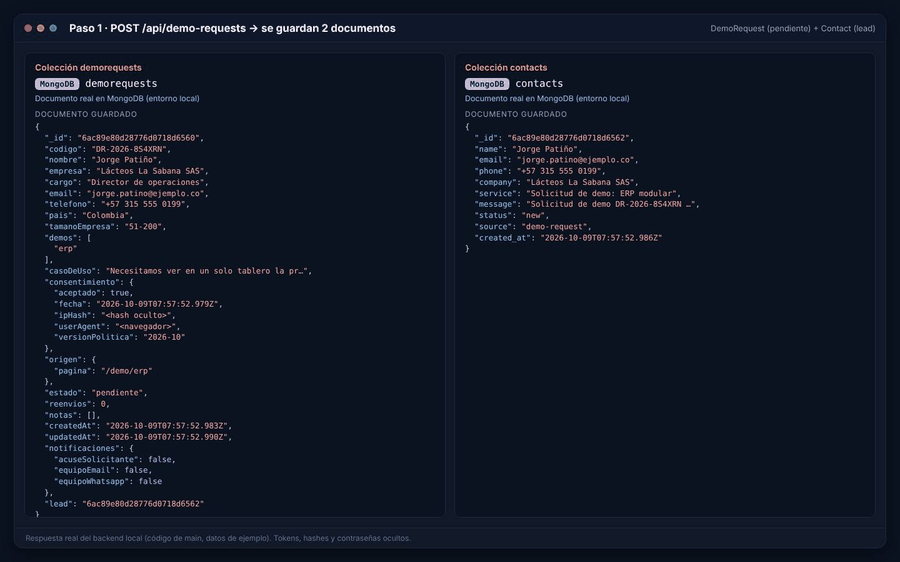

*GIF: Jorge Patiño (Lácteos La Sabana SAS, persona ficticia) pide el ERP; se ven los documentos de `demorequests`, `contacts`, `users`, `demogrants`, `magiclinktokens` y `auditlogs` después de cada paso. Hashes y contraseñas ocultos.*

| Paso | Petición | Qué cambia en MongoDB |
|---|---|---|
| 1. Solicitud | `POST /api/demo-requests` | Nace un `DemoRequest` en `pendiente` y un `Contact` con `source: "demo-request"`; la solicitud guarda el `_id` del contacto en `lead` |
| 2. Aprobación | `POST /api/admin/demo-requests/:id/approve` | La solicitud pasa a `aprobada` con `decision` y `user`; nacen un `User` (`prospect`, `invitado`, sin contraseña), un `DemoGrant` `activo` por demo y un `MagicLinkToken` de activación; se escribe `demo_request.approve` en `auditlogs` |
| 3. Activación | `POST /api/auth/activate` | El usuario pasa a `activo` con contraseña cifrada y `emailVerifiedAt`; el enlace queda con `usedAt`; se escribe `user.activate` |
| 4. Uso | `GET /api/demo-access/erp` | El acceso suma una visita (`accesos`) y guarda `ultimoAcceso` |
| 5. Extensión y revocación | `extend` y `revoke` del panel | El acceso agrega una entrada a `extensiones` y luego queda `revocado` con quién, cuándo y por qué. **No se borra nada** |

---

## 2. Colecciones de MongoDB

Cada modelo de Mongoose se guarda en una colección. Los nombres de la tabla son los reales en la base de datos.

| Dominio | Modelo | Colección | Qué guarda | Lo escribe |
|---|---|---|---|---|
| Usuarios y acceso | `User` | `users` | Cuentas, rol y estado de la cuenta | Registro, login con Google, aprobación de demos, panel |
| | `MagicLinkToken` | `magiclinktokens` | Enlaces de un solo uso (activación y recuperación), solo su hash | Aprobación, invitación, "olvidé mi contraseña" |
| | `AuditLog` | `auditlogs` | Bitácora de acciones del equipo y de la activación | Panel de demos, cambios de rol y de contraseña |
| Demos | `DemoCatalogItem` | `democatalogitems` | Las 28 demos: modo de acceso, activa, vigencia por defecto y orden | Semilla al arrancar y Admin › Catálogo |
| | `DemoRequest` | `demorequests` | Solicitudes "Solicitar demo" | Formulario público y panel |
| | `DemoGrant` | `demogrants` | Accesos de una persona a una demo, con vigencia y uso | Aprobación, invitación, extender, revocar, job horario |
| Contacto y leads | `Contact` | `contacts` | Leads del formulario de contacto, de la demo RAG y de las solicitudes de demo | `lead.service` |
| | `Quote` | `quotes` | Cotizaciones (`POST /api/quotes`, sin uso desde la web) | API |
| Proyectos y facturación | `Project`, `ProjectMember`, `Task`, `ActivityLog` | `projects`, `projectmembers`, `tasks`, `activitylogs` | Proyectos del portal, sus miembros, tareas y actividad | Portal |
| | `Order` | `orders` | Pedidos del cliente con ítems, adjuntos e historial | Portal y panel |
| | `Invoice` | `invoices` | Facturas del portal | Panel (ver [Limitaciones](#11-limitaciones-conocidas)) |
| | `Deliverable` | `deliverables` | Entregables por proyecto | Equipo |
| | `Conversation`, `Message` | `conversations`, `messages` | Mensajería cliente–equipo | Portal y panel |
| | `Notification` | `notifications` | Notificaciones del portal | `POST /api/notifications` |
| Chatbot y documentos | `Chatbot` | `chatbots` | API anterior del chatbot "por sesión": configuración, documentos y mensajes | Vista previa del chatbot |
| | `ChatSession`, `ChatMessage` | `chatsessions`, `chatmessages` | Chat de eco antiguo (solo desarrollo) | `/api/chat` |
| | `Document` | `documents` | Gestor de documentos con IA (texto, resumen, palabras clave, vector) | `/api/documents` |
| Salud: auditoría | `Factura`, `Atencion`, `Procedimiento`, `Glosa`, `SoporteDocumental`, `Tarifario`, `AuditoriaSesion`, `ReglaAuditoria`, `DocumentoConocimientoConfig` | `facturas`, `atenciones`, `procedimientos`, `glosas`, `soportes_documentales`, `tarifarios`, `auditoriasesions`, `reglas_auditoria`, `documentoconocimientoconfigs` | Demo de cuentas médicas: factura, atenciones, procedimientos, glosas, soportes y sesiones de auditoría paso a paso | `/api/auditoria`, `/api/documentos-conocimiento` |
| Salud: catálogos | `CUPS`, `CUPSEquivalencia`, `Medicamento`, `Diagnostico`, `MaterialInsumo`, `EPSMaestro`, `IPSMaestro`, `ConvenioTarifa`, `CuotaModeradora`, `Autorizacion` | `cups`, `cupsequivalencias`, `medicamentos`, `diagnosticos`, `materiales_insumos`, `epsmaestros`, `ipsmaestros`, `conveniotarifas`, `cuotamoderadoras`, `autorizacions` | Catálogos de referencia (procedimientos con vector para búsqueda semántica, medicamentos, CIE-10, EPS, IPS, convenios, cuotas y autorizaciones) | Semillas y scripts de importación |
| Salud: herramientas del equipo | `CuentaMedica`, `DocumentoLey100`, `Radicado`, `ReglaFacturacion`, `ConfiguracionEndpoints` | `cuentamedicas`, `documentoley100`, `radicados`, `reglafacturacions`, `configuracionendpoints` | Cuentas médicas por procesar, documentos de la Ley 100, radicados de liquidación, reglas de facturación y configuración de servicios externos | `/api/cuentas`, `/api/ley100`, `/api/liquidacion`, `/api/reglas-facturacion` |

---

## 3. Relaciones por dominio

Convención de los diagramas: `||--o{` es "uno a muchos", `|o--o|` es "cero o uno a cero o uno". Las relaciones son referencias por `_id` (MongoDB no impone llaves foráneas: las valida el código).

### 3.1 Usuarios y acceso

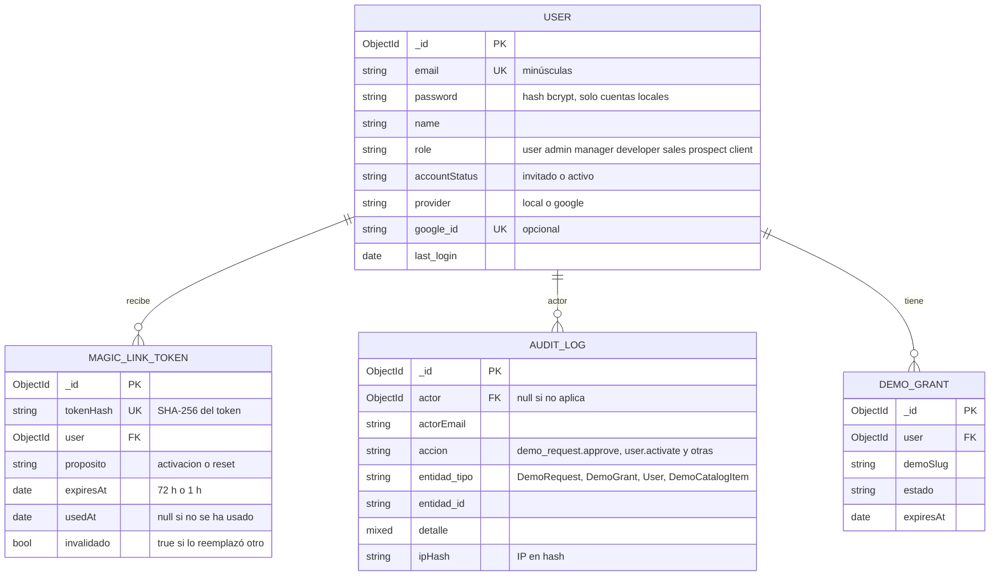
```mermaid
erDiagram
    USER ||--o{ MAGIC_LINK_TOKEN : "recibe"
    USER ||--o{ AUDIT_LOG : "actor"
    USER ||--o{ DEMO_GRANT : "tiene"
    USER {
        ObjectId _id PK
        string email UK "minúsculas"
        string password "hash bcrypt, solo cuentas locales"
        string name
        string role "user admin manager developer sales prospect client"
        string accountStatus "invitado o activo"
        string provider "local o google"
        string google_id UK "opcional"
        date last_login
    }
    MAGIC_LINK_TOKEN {
        ObjectId _id PK
        string tokenHash UK "SHA-256 del token"
        ObjectId user FK
        string proposito "activacion o reset"
        date expiresAt "72 h o 1 h"
        date usedAt "null si no se ha usado"
        bool invalidado "true si lo reemplazó otro"
    }
    AUDIT_LOG {
        ObjectId _id PK
        ObjectId actor FK "null si no aplica"
        string actorEmail
        string accion "demo_request.approve, user.activate y otras"
        string entidad_tipo "DemoRequest, DemoGrant, User, DemoCatalogItem"
        string entidad_id
        mixed detalle
        string ipHash "IP en hash"
    }
    DEMO_GRANT {
        ObjectId _id PK
        ObjectId user FK
        string demoSlug
        string estado
        date expiresAt
    }
```

*Una cuenta puede tener varios enlaces (solo el último pendiente sirve), muchas entradas en la bitácora y muchos accesos a demos.*

### 3.2 Demos

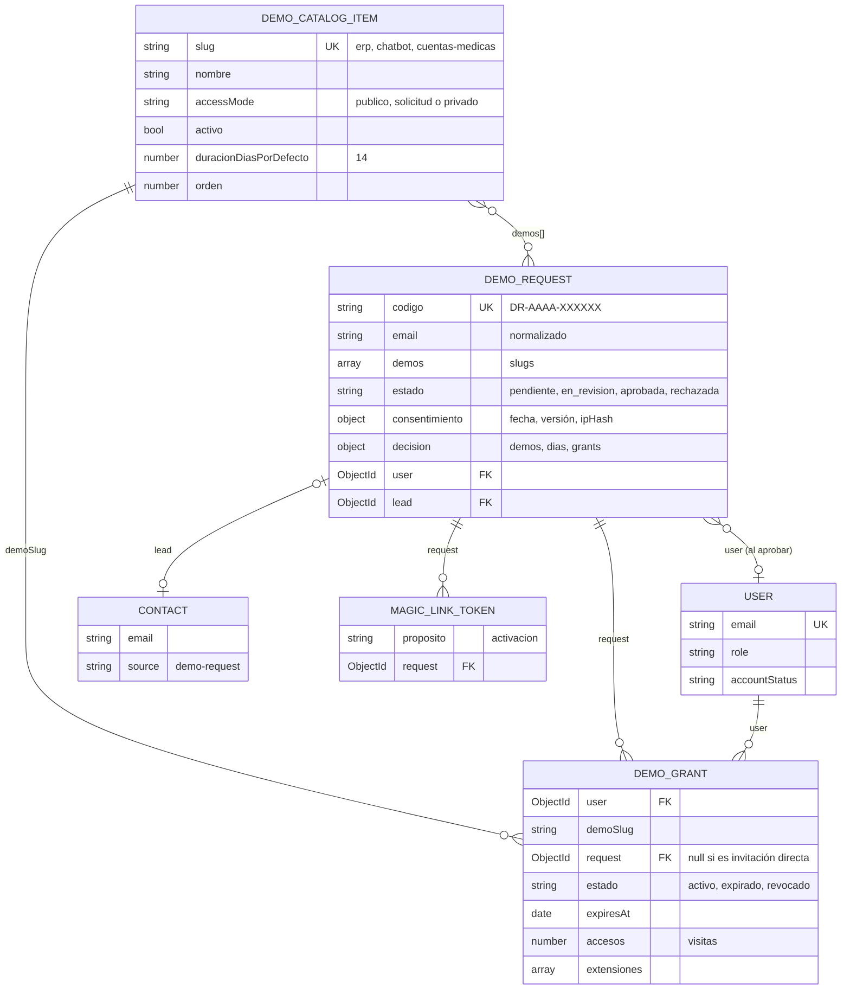
```mermaid
erDiagram
    DEMO_CATALOG_ITEM ||--o{ DEMO_GRANT : "demoSlug"
    DEMO_CATALOG_ITEM }o--o{ DEMO_REQUEST : "demos[]"
    DEMO_REQUEST ||--o{ DEMO_GRANT : "request"
    DEMO_REQUEST }o--o| USER : "user (al aprobar)"
    DEMO_REQUEST |o--o| CONTACT : "lead"
    DEMO_REQUEST ||--o{ MAGIC_LINK_TOKEN : "request"
    USER ||--o{ DEMO_GRANT : "user"
    DEMO_CATALOG_ITEM {
        string slug UK "erp, chatbot, cuentas-medicas"
        string nombre
        string accessMode "publico, solicitud o privado"
        bool activo
        number duracionDiasPorDefecto "14"
        number orden
    }
    DEMO_REQUEST {
        string codigo UK "DR-AAAA-XXXXXX"
        string email "normalizado"
        array demos "slugs"
        string estado "pendiente, en_revision, aprobada, rechazada"
        object consentimiento "fecha, versión, ipHash"
        object decision "demos, dias, grants"
        ObjectId user FK
        ObjectId lead FK
    }
    DEMO_GRANT {
        ObjectId user FK
        string demoSlug
        ObjectId request FK "null si es invitación directa"
        string estado "activo, expirado, revocado"
        date expiresAt
        number accesos "visitas"
        array extensiones
    }
    USER {
        string email UK
        string role
        string accountStatus
    }
    CONTACT {
        string email
        string source "demo-request"
    }
    MAGIC_LINK_TOKEN {
        string proposito "activacion"
        ObjectId request FK
    }
```

*La relación entre solicitud y cuenta es por email: al aprobar, la API busca una cuenta con ese email y, si no existe, la crea como `prospect` invitada. Un acceso puede venir de una solicitud o de una invitación directa (`request: null`).*

### 3.3 Contacto y leads

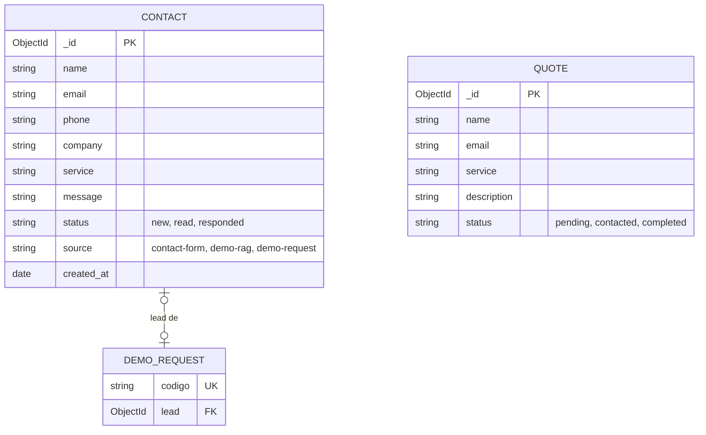
```mermaid
erDiagram
    CONTACT |o--o| DEMO_REQUEST : "lead de"
    CONTACT {
        ObjectId _id PK
        string name
        string email
        string phone
        string company
        string service
        string message
        string status "new, read, responded"
        string source "contact-form, demo-rag, demo-request"
        date created_at
    }
    QUOTE {
        ObjectId _id PK
        string name
        string email
        string service
        string description
        string status "pending, contacted, completed"
    }
    DEMO_REQUEST {
        string codigo UK
        ObjectId lead FK
    }
```

*Los tres canales de leads (formulario de contacto, demo RAG y solicitud de demo) escriben en la misma colección `contacts`; `source` dice de dónde vino. La demo RAG no guarda el documento, solo el email y la autorización.*

### 3.4 Proyectos y facturación

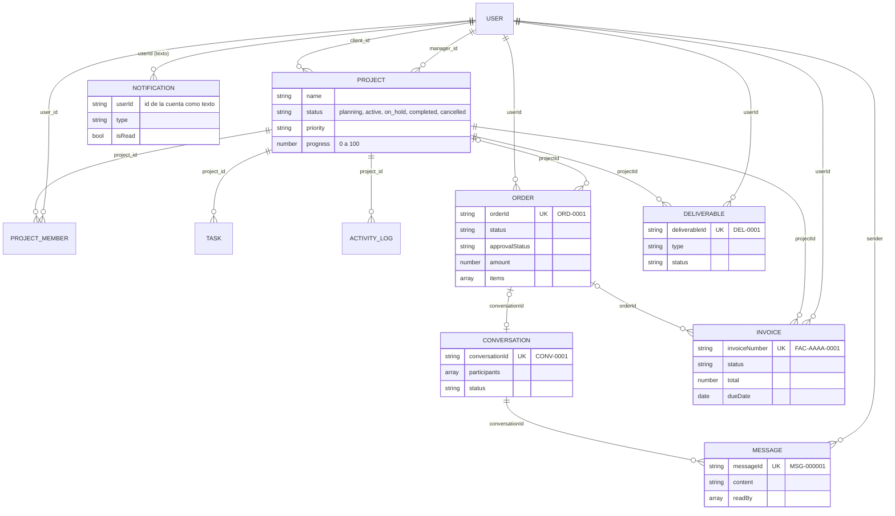
```mermaid
erDiagram
    USER ||--o{ PROJECT : "client_id"
    USER ||--o{ PROJECT : "manager_id"
    PROJECT ||--o{ PROJECT_MEMBER : "project_id"
    USER ||--o{ PROJECT_MEMBER : "user_id"
    PROJECT ||--o{ TASK : "project_id"
    PROJECT ||--o{ ACTIVITY_LOG : "project_id"
    USER ||--o{ ORDER : "userId"
    PROJECT |o--o{ ORDER : "projectId"
    ORDER |o--o| CONVERSATION : "conversationId"
    ORDER |o--o{ INVOICE : "orderId"
    PROJECT ||--o{ INVOICE : "projectId"
    USER ||--o{ INVOICE : "userId"
    PROJECT ||--o{ DELIVERABLE : "projectId"
    USER ||--o{ DELIVERABLE : "userId"
    CONVERSATION ||--o{ MESSAGE : "conversationId"
    USER ||--o{ MESSAGE : "sender"
    USER ||--o{ NOTIFICATION : "userId (texto)"
    PROJECT {
        string name
        string status "planning, active, on_hold, completed, cancelled"
        string priority
        number progress "0 a 100"
    }
    ORDER {
        string orderId UK "ORD-0001"
        string status
        string approvalStatus
        number amount
        array items
    }
    INVOICE {
        string invoiceNumber UK "FAC-AAAA-0001"
        string status
        number total
        date dueDate
    }
    DELIVERABLE {
        string deliverableId UK "DEL-0001"
        string type
        string status
    }
    CONVERSATION {
        string conversationId UK "CONV-0001"
        array participants
        string status
    }
    MESSAGE {
        string messageId UK "MSG-000001"
        string content
        array readBy
    }
    NOTIFICATION {
        string userId "id de la cuenta como texto"
        string type
        bool isRead
    }
```

*Un proyecto tiene un cliente y un gerente; los pedidos, facturas y entregables apuntan a la cuenta del cliente (`userId`). Las notificaciones guardan el id de la cuenta como texto, no como referencia.*

### 3.5 Chatbot y documentos

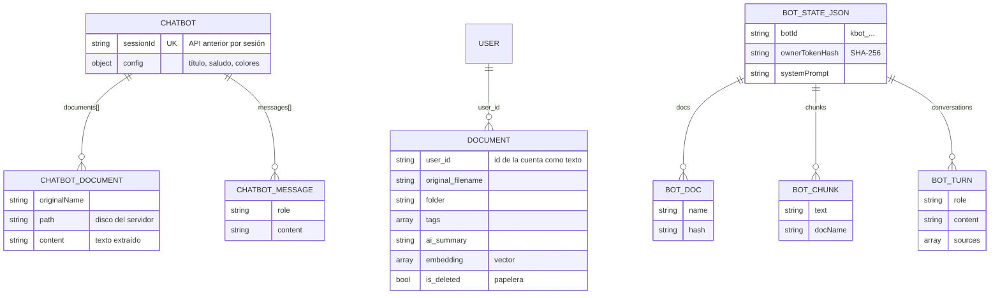
```mermaid
erDiagram
    CHATBOT ||--o{ CHATBOT_DOCUMENT : "documents[]"
    CHATBOT ||--o{ CHATBOT_MESSAGE : "messages[]"
    USER ||--o{ DOCUMENT : "user_id"
    BOT_STATE_JSON ||--o{ BOT_DOC : "docs"
    BOT_STATE_JSON ||--o{ BOT_CHUNK : "chunks"
    BOT_STATE_JSON ||--o{ BOT_TURN : "conversations"
    CHATBOT {
        string sessionId UK "API anterior por sesión"
        object config "título, saludo, colores"
    }
    CHATBOT_DOCUMENT {
        string originalName
        string path "disco del servidor"
        string content "texto extraído"
    }
    CHATBOT_MESSAGE {
        string role
        string content
    }
    DOCUMENT {
        string user_id "id de la cuenta como texto"
        string original_filename
        string folder
        array tags
        string ai_summary
        array embedding "vector"
        bool is_deleted "papelera"
    }
    BOT_STATE_JSON {
        string botId "kbot_..."
        string ownerTokenHash "SHA-256"
        string systemPrompt
    }
    BOT_DOC {
        string name
        string hash
    }
    BOT_CHUNK {
        string text
        string docName
    }
    BOT_TURN {
        string role
        string content
        array sources
    }
```

*`CHATBOT`, `DOCUMENT` y sus subdocumentos están en MongoDB. Los bots del constructor del chatbot (`BOT_STATE_JSON` y lo que cuelga de él) **no**: viven en memoria y se respaldan en un archivo JSON del servidor (ver [sección 7](#7-lo-que-no-está-en-mongodb)).*

### 3.6 Salud (auditoría de cuentas médicas)

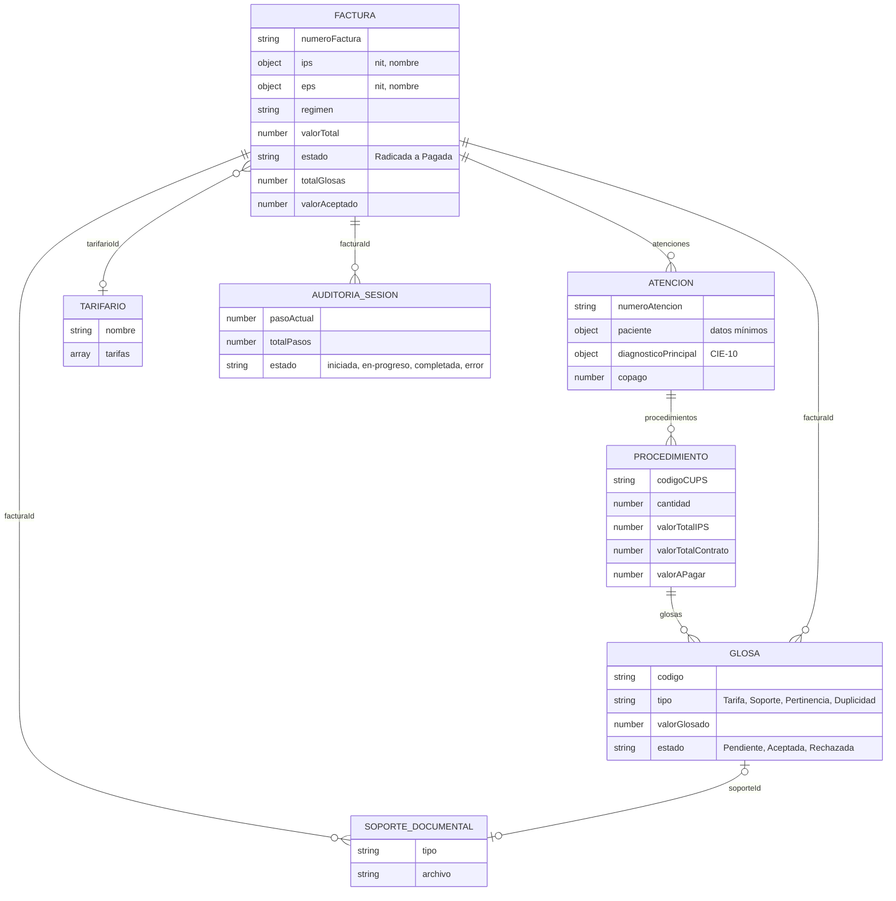
```mermaid
erDiagram
    FACTURA ||--o{ ATENCION : "atenciones"
    ATENCION ||--o{ PROCEDIMIENTO : "procedimientos"
    PROCEDIMIENTO ||--o{ GLOSA : "glosas"
    FACTURA ||--o{ GLOSA : "facturaId"
    FACTURA }o--o| TARIFARIO : "tarifarioId"
    FACTURA ||--o{ SOPORTE_DOCUMENTAL : "facturaId"
    GLOSA |o--o| SOPORTE_DOCUMENTAL : "soporteId"
    FACTURA ||--o{ AUDITORIA_SESION : "facturaId"
    FACTURA {
        string numeroFactura
        object ips "nit, nombre"
        object eps "nit, nombre"
        string regimen
        number valorTotal
        string estado "Radicada a Pagada"
        number totalGlosas
        number valorAceptado
    }
    ATENCION {
        string numeroAtencion
        object paciente "datos mínimos"
        object diagnosticoPrincipal "CIE-10"
        number copago
    }
    PROCEDIMIENTO {
        string codigoCUPS
        number cantidad
        number valorTotalIPS
        number valorTotalContrato
        number valorAPagar
    }
    GLOSA {
        string codigo
        string tipo "Tarifa, Soporte, Pertinencia, Duplicidad"
        number valorGlosado
        string estado "Pendiente, Aceptada, Rechazada"
    }
    SOPORTE_DOCUMENTAL {
        string tipo
        string archivo
    }
    TARIFARIO {
        string nombre
        array tarifas
    }
    AUDITORIA_SESION {
        number pasoActual
        number totalPasos
        string estado "iniciada, en-progreso, completada, error"
    }
```

*Una factura tiene atenciones, cada atención sus procedimientos y cada procedimiento sus glosas. Los catálogos (`cups`, `medicamentos`, `diagnosticos`, EPS, IPS, convenios, cuotas y autorizaciones) y las herramientas del equipo (`radicados`, `cuentamedicas`, `documentoley100`, `reglafacturacions`) no tienen referencias entre sí: se consultan por código.*

La demo de cuentas médicas se explica con capturas en la [guía de la demo](Guia-Demo-cuentas-medicas.md).

---

## 4. Campos de los modelos principales

Tipos: `texto`, `número`, `fecha`, `sí/no`, `id` (referencia a otro documento por `_id`), `lista`, `objeto`. Todos los documentos tienen además `_id`.

### 4.1 User (`users`)

| Campo | Tipo | Reglas | Qué guarda |
|---|---|---|---|
| `email` | texto | Obligatorio, único, en minúsculas | Correo de acceso |
| `password` | texto | Obligatorio en cuentas locales activas; nunca se devuelve | Hash bcrypt (12 rondas) |
| `name` | texto | Obligatorio | Nombre |
| `role` | texto | `user` (por defecto), `admin`, `manager`, `developer`, `sales`, `prospect`, `client` | Rol (ver [Roles y permisos](Doc-10-Roles-y-Permisos.md)) |
| `accountStatus` | texto | `invitado` o `activo` (por defecto) | `invitado`: creada al aprobar una demo, aún sin contraseña |
| `company`, `phone` | texto | Máx. 160 y 40 caracteres | Empresa y teléfono |
| `emailVerifiedAt` | fecha | — | Cuándo probó que controla el correo (activación o recuperación) |
| `google_id` | texto | Único si existe | Id de Google |
| `provider` | texto | `local` (por defecto) o `google` | Cómo entra |
| `avatar` | texto | — | Imagen de perfil |
| `last_login` | fecha | — | Último inicio de sesión |
| `created_at`, `updated_at` | fecha | Automáticas | — |

### 4.2 DemoCatalogItem (`democatalogitems`)

| Campo | Tipo | Reglas | Qué guarda |
|---|---|---|---|
| `slug` | texto | Obligatorio, único, `a-z 0-9 -` (2 a 60) | Ruta `/demo/<slug>` |
| `nombre`, `nombreEn` | texto | Máx. 120 | Nombre en español e inglés |
| `accessMode` | texto | `publico`, `solicitud` o `privado` | Abierta, con solicitud o solo por invitación |
| `activo` | sí/no | Por defecto sí | Apagada se muestra "en mantenimiento" |
| `duracionDiasPorDefecto` | número | 1 a 365, por defecto 14 | Días que dura un acceso nuevo |
| `orden` | número | Por defecto 0 | Orden en los listados |
| `actualizadoPor` | id → User | — | Último que la cambió |
| `createdAt`, `updatedAt` | fecha | Automáticas | — |

Al arrancar, el backend **inserta las demos que falten** (28 en la semilla) y nunca pisa los cambios hechos desde el panel. Si MongoDB no responde, la API usa la semilla como respaldo.

### 4.3 DemoRequest (`demorequests`)

| Campo | Tipo | Reglas | Qué guarda |
|---|---|---|---|
| `codigo` | texto | Único, `DR-AAAA-XXXXXX` | Código que ve el solicitante |
| `nombre`, `empresa`, `cargo` | texto | 120, 160 y 120 caracteres; cargo opcional | Quién pide |
| `email` | texto | Normalizado como en el login (minúsculas; en Gmail sin puntos ni `+alias`) | Correo |
| `telefono`, `pais` | texto | Teléfono opcional | Contacto |
| `tamanoEmpresa` | texto | `1-10`, `11-50`, `51-200`, `201-1000`, `1000+` | Tamaño de la empresa |
| `demos` | lista de texto | 1 a 10 slugs del catálogo | Demos pedidas |
| `casoDeUso` | texto | 10 a 2000 caracteres | Qué quiere resolver |
| `consentimiento` | objeto | `aceptado`, `fecha`, `ipHash`, `userAgent`, `versionPolitica` | Prueba de la autorización (Ley 1581) |
| `origen` | objeto | `pagina`, `referrer`, `utm.{source, medium, campaign, term, content}` | De dónde llegó |
| `estado` | texto | `pendiente` (por defecto), `en_revision`, `aprobada`, `rechazada` | Ver [5.1](#51-solicitud-de-demo-demorequest) |
| `motivoRechazo` | texto | Máx. 1000; interno | Por qué se rechazó |
| `notas` | lista | `{ texto, autor, autorEmail, fecha }` | Notas internas y reenvíos del formulario |
| `revisadoPor`, `revisadoEn` | id → User, fecha | — | Quién y cuándo decidió |
| `decision` | objeto | `{ demos, dias, grants[] }` | Lo que se aprobó |
| `user` | id → User | Al aprobar | Cuenta creada o vinculada |
| `lead` | id → Contact | — | Lead registrado |
| `reenvios` | número | Por defecto 0 | Veces que el mismo email volvió a enviar con la solicitud abierta |
| `notificaciones` | objeto | `equipoEmail`, `equipoWhatsapp`, `acuseSolicitante`, `decisionSolicitante` | Qué avisos salieron de verdad |
| `createdAt`, `updatedAt` | fecha | Automáticas | — |

Así se ven esos campos en el panel:

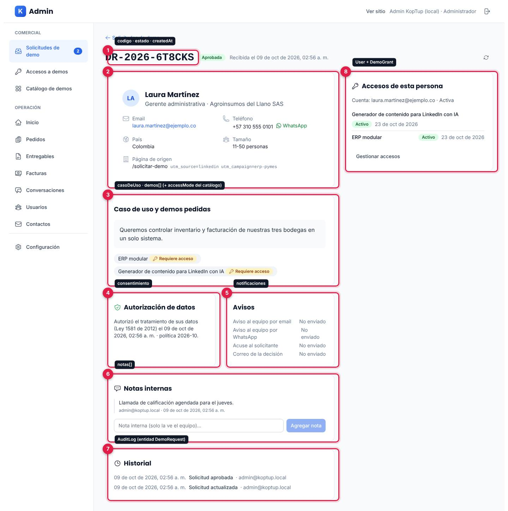

*Detalle de la solicitud de Laura Martínez (Agroinsumos del Llano SAS, ficticia) en Admin › Solicitudes de demo; el correo de la cuenta del equipo está oculto.*

1. `codigo`, `estado` y `createdAt`.
2. Datos de la persona: `nombre`, `cargo`, `empresa`, `email`, `telefono`, `pais`, `tamanoEmpresa` y `origen` (página y UTM).
3. `casoDeUso` y `demos`, con el modo de acceso que viene del catálogo.
4. `consentimiento`: fecha y versión de la política autorizada.
5. `notificaciones`: qué avisos se enviaron (en el entorno de capturas no hay correo ni WhatsApp configurados).
6. `notas`.
7. Historial: no está en la solicitud, sale de `auditlogs` (entidad `DemoRequest`).
8. La cuenta (`User`) y sus accesos (`DemoGrant`).

### 4.4 DemoGrant (`demogrants`)

| Campo | Tipo | Reglas | Qué guarda |
|---|---|---|---|
| `user` | id → User | Obligatorio | A quién se le dio |
| `demoSlug` | texto | Obligatorio | Qué demo |
| `request` | id → DemoRequest | `null` en una invitación directa | De qué solicitud salió |
| `estado` | texto | `activo` (por defecto), `expirado`, `revocado` | Etiqueta guardada (ver [5.2](#52-acceso-a-una-demo-demogrant)) |
| `expiresAt` | fecha | Obligatoria | Vence; **la vigencia real se calcula con esta fecha** |
| `otorgadoPor` | id → User | — | Quién lo dio |
| `nota` | texto | Máx. 2000 | Nota interna |
| `ultimoAcceso` | fecha | — | Última vez que la abrió |
| `accesos` | número | Por defecto 0 | Visitas (una nueva tras 30 minutos sin actividad) |
| `extensiones` | lista | `{ dias, desde, hasta, por, fecha }` | Historial de extensiones |
| `revocadoPor`, `revocadoEn`, `motivoRevocacion` | id, fecha, texto | Motivo máx. 1000 | Cierre del acceso |
| `expiradoEn` | fecha | — | Cuándo lo marcó el job |
| `recordatorioEnviadoEn` | fecha | `null` hasta enviar | Recordatorio de 3 días (uno por vigencia) |
| `createdAt`, `updatedAt` | fecha | Automáticas | — |

Las respuestas de la API agregan campos calculados que **no** se guardan: `estadoEfectivo` (el estado real según la hora), `vigente`, `diasRestantes`, `demoNombre`, `accessMode` y `demoActiva` (del catálogo).

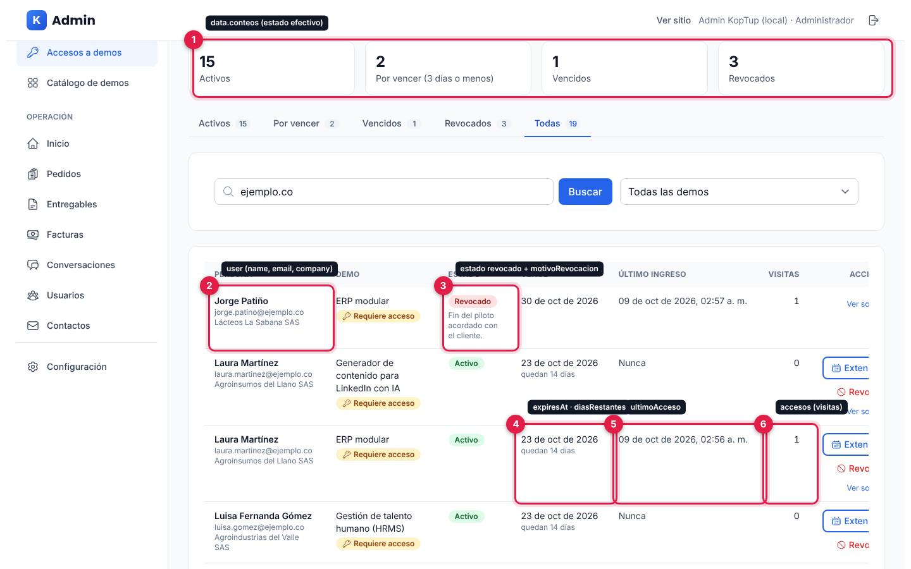

*Admin › Accesos a demos buscando `ejemplo.co`.*

1. `conteos` por estado efectivo (por vencer = activos que vencen en 3 días o menos; es un filtro, no un estado guardado).
2. `user`, completado con nombre, email y empresa de la cuenta.
3. `estado` `revocado` con `motivoRevocacion`.
4. `expiresAt` y `diasRestantes` (calculado).
5. `ultimoAcceso`.
6. `accesos` (visitas).

Y así los ve el prospecto en su portal (`GET /api/me/demos`, solo con los campos que le sirven: sin notas internas ni quién lo otorgó):

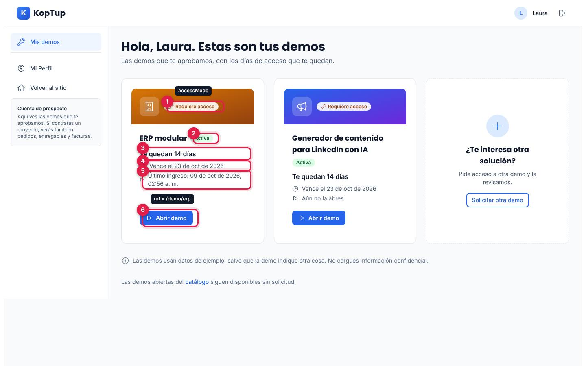

*Portal de Laura Martínez › Mis demos.*

1. `accessMode` de la demo (del catálogo).
2. `estado` efectivo (`activo`) y `vigente`.
3. `diasRestantes`.
4. `expiresAt`.
5. `ultimoAcceso`.
6. `url` (`/demo/erp`).

### 4.5 MagicLinkToken (`magiclinktokens`)

| Campo | Tipo | Reglas | Qué guarda |
|---|---|---|---|
| `tokenHash` | texto | Obligatorio, único | Hash SHA-256 del token. **El token en claro nunca se guarda**: viaja en el correo o el panel lo muestra una vez |
| `user` | id → User | Obligatorio | Cuenta |
| `proposito` | texto | `activacion` (72 h) o `reset` (1 h) | Para qué sirve |
| `expiresAt` | fecha | Obligatoria | Vencimiento |
| `usedAt` | fecha | `null` mientras no se use | Uso (atómico: un solo consumo gana) |
| `invalidado` | sí/no | Por defecto no | Se reemplazó por uno más reciente |
| `creadoPor` | id → User | — | Quién lo emitió |
| `request` | id → DemoRequest | — | Solicitud de origen |
| `createdAt` | fecha | Automática | — |

### 4.6 AuditLog (`auditlogs`)

| Campo | Tipo | Qué guarda |
|---|---|---|
| `actor` | id → User o `null` | Quién hizo la acción |
| `actorEmail`, `actorRol` | texto | Copia del email y el rol en ese momento |
| `accion` | texto | `demo_request.update`, `demo_request.approve`, `demo_request.reject`, `demo_grant.create`, `demo_grant.extend`, `demo_grant.revoke`, `demo_grant.resend_activation`, `demo_catalog.update`, `user.activate`, `user.role_change`, `user.change_password` |
| `entidad` | objeto | `{ tipo, id }`: `DemoRequest`, `DemoGrant`, `DemoCatalogItem` o `User` |
| `detalle` | objeto libre | Lo que cambió (antes y después, demos, días, si el correo salió…) |
| `ipHash` | texto | IP en hash |
| `createdAt` | fecha | Cuándo |

Solo se agregan registros: **no hay ninguna ruta para editar ni borrar** la bitácora.

### 4.7 Contact (`contacts`)

| Campo | Tipo | Reglas | Qué guarda |
|---|---|---|---|
| `name`, `email` | texto | Obligatorios | Quién escribe |
| `phone`, `company`, `budget` | texto | Opcionales | Datos extra del formulario |
| `service` | texto | Obligatorio | Servicio de interés (en solicitudes: "Solicitud de demo: …") |
| `message` | texto | Obligatorio | Mensaje (en solicitudes, un resumen con el código y el enlace al panel) |
| `status` | texto | `new` (por defecto), `read`, `responded` | Seguimiento en Admin › Contactos |
| `source` | texto | `contact-form` (por defecto), `demo-rag`, `demo-request` | Canal de origen |
| `created_at` | fecha | Automática | — |

### 4.8 Project (`projects`)

| Campo | Tipo | Reglas | Qué guarda |
|---|---|---|---|
| `name`, `description` | texto | Nombre obligatorio | — |
| `client_id`, `manager_id` | id → User | Si no se indica gerente, queda quien lo crea | Cliente y gerente |
| `status` | texto | `planning` (por defecto), `active`, `on_hold`, `completed`, `cancelled` | Ver [5.3](#53-proyecto-project) |
| `priority` | texto | `low`, `medium` (por defecto), `high`, `urgent` | — |
| `budget` | número | ≥ 0 | Presupuesto |
| `start_date`, `end_date` | fecha | — | — |
| `estimated_hours`, `actual_hours` | número | ≥ 0 | Horas |
| `progress` | número | 0 a 100 | Avance |
| `created_at`, `updated_at` | fecha | Automáticas | — |

### 4.9 Order (`orders`)

| Campo | Tipo | Reglas | Qué guarda |
|---|---|---|---|
| `orderId` | texto | Único, `ORD-0001` (se calcula al guardar) | Código del pedido |
| `name`, `description` | texto | Nombre obligatorio | — |
| `status` | texto | `pending` (por defecto), `in_progress`, `shipped`, `completed`, `cancelled` | Avance |
| `approvalStatus` | texto | `pending` (por defecto), `approved`, `rejected` | Decisión del equipo |
| `userId` | id → User | Obligatorio | Cliente |
| `projectId`, `conversationId` | id | Opcionales | Proyecto y conversación |
| `amount`, `currency` | número, texto | Suma de cantidad × precio; `USD` | Total |
| `items` | lista | `{ name, description?, quantity ≥ 1, price ≥ 0 }` | Ítems |
| `attachments` | lista | `{ fileName, fileUrl, fileSize, fileType, uploadedAt }` | Adjuntos (en el disco del servidor) |
| `comments` | lista | `{ text, userId, userName, createdAt }` | Comentarios |
| `tracking`, `carrier` | texto | — | Envío |
| `orderDate`, `completedDate`, `approvedDate`, `rejectedDate` | fecha | — | Fechas clave |
| `rejectionReason` | texto | — | Motivo del rechazo |
| `history` | lista | `{ date, status, description, updatedBy }` | Historial |

### 4.10 Invoice (`invoices`)

| Campo | Tipo | Reglas | Qué guarda |
|---|---|---|---|
| `invoiceNumber` | texto | Obligatorio, único, `FAC-AAAA-0001` | Número |
| `projectId` | id → Project | Obligatorio | Proyecto |
| `orderId` | id → Order | Opcional | Pedido de origen |
| `userId` | id → User | Obligatorio | Cliente |
| `status` | texto | `draft`, `pending` (por defecto), `paid`, `overdue`, `cancelled` | Ver [5.4](#54-factura-invoice) |
| `issueDate`, `dueDate`, `paidDate` | fecha | Vence a 15 días si no se indica | Fechas |
| `clientInfo` | objeto | `name`, `email` obligatorios; `address` opcional | Datos del cliente |
| `items` | lista | `{ description, quantity ≥ 1, unitPrice, total }` | Líneas |
| `subtotal`, `taxRate`, `taxAmount`, `total`, `currency` | número, texto | IVA por defecto 0,19; `USD` | Valores |
| `paymentMethod`, `transactionId` | texto | — | Pago registrado |
| `notes`, `terms` | texto | Términos por defecto: pago a 15 días | — |
| `history` | lista | `{ date, action, description, amount, updatedBy }` | Historial |

### 4.11 Deliverable (`deliverables`)

| Campo | Tipo | Reglas | Qué guarda |
|---|---|---|---|
| `deliverableId` | texto | Obligatorio, único, `DEL-0001` | Código |
| `projectId`, `userId` | id | Obligatorios | Proyecto y cuenta dueña |
| `title`, `description` | texto | Título obligatorio | — |
| `type` | texto | `design`, `code`, `documentation`, `prototype`, `other` | Tipo |
| `status` | texto | `pending` (por defecto), `in_review`, `approved`, `rejected` | Revisión del cliente |
| `uploadDate`, `approvedDate`, `rejectedDate` | fecha | — | Fechas |
| `fileUrl`, `fileName`, `fileSize`, `fileType` | texto, número | URL, nombre y tamaño obligatorios | Archivo |
| `version` | número | Por defecto 1 | Versión |
| `uploadedBy`, `reviewedBy` | id → User | Quien sube es obligatorio | — |
| `comments` | texto | — | Comentario de la revisión |
| `metadata` | mapa | — | Datos libres |
| `history` | lista | `{ date, action, user, userName, description }` | Historial |

### 4.12 Message (`messages`) y Conversation (`conversations`)

| Campo | Tipo | Reglas | Qué guarda |
|---|---|---|---|
| `messageId` | texto | Obligatorio, único, `MSG-000001` | Código |
| `conversationId` | id → Conversation | Obligatorio | Conversación |
| `sender`, `senderName` | id → User, texto | Obligatorios | Quién escribe |
| `senderRole` | texto | `admin`, `client`, `support`, `project_manager` | Rol dentro de la conversación |
| `content` | texto | Obligatorio | Texto |
| `type` | texto | `text` (por defecto), `file`, `system`, `notification` | Tipo |
| `attachment` | objeto | `fileName`, `fileSize`, `fileUrl`, `fileType` | Adjunto |
| `readBy` | lista | `{ userId, readAt }` | Quién lo leyó |
| `metadata` | mapa | — | Datos libres |

La conversación guarda `conversationId` (`CONV-0001`), `title`, `projectId`, `orderId`, `participants` (`{ userId, role, name, email }`), `lastMessage`, `unreadCount` (por cuenta), `status` (`active`, `archived`, `closed`) y `createdBy`.

### 4.13 Notification (`notifications`)

| Campo | Tipo | Reglas | Qué guarda |
|---|---|---|---|
| `userId` | texto | Obligatorio | Id de la cuenta destinataria (como texto) |
| `type` | texto | `order`, `project`, `billing`, `message`, `system`, `deliverable`, `task` | Categoría |
| `title`, `message` | texto | Obligatorios | Contenido |
| `isRead`, `readAt` | sí/no, fecha | Por defecto no leída | Lectura |
| `actionUrl` | texto | — | A dónde lleva |
| `metadata` | objeto libre | `orderId`, `projectId`, `invoiceId`… | Datos relacionados |
| `created_at`, `updated_at` | fecha | Automáticas | — |

---

## 5. Estados

### 5.1 Solicitud de demo (`DemoRequest`)

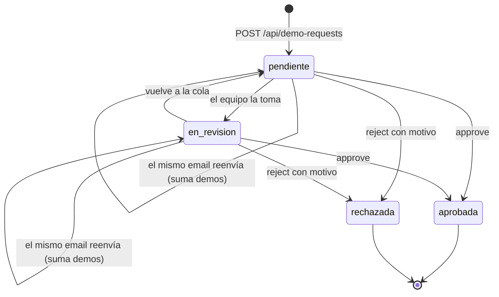
```mermaid
stateDiagram-v2
    [*] --> pendiente: POST /api/demo-requests
    pendiente --> en_revision: el equipo la toma
    en_revision --> pendiente: vuelve a la cola
    pendiente --> pendiente: el mismo email reenvía (suma demos)
    en_revision --> en_revision: el mismo email reenvía (suma demos)
    pendiente --> aprobada: approve
    en_revision --> aprobada: approve
    pendiente --> rechazada: reject con motivo
    en_revision --> rechazada: reject con motivo
    aprobada --> [*]
    rechazada --> [*]
```

*Solo se aprueba o rechaza desde `pendiente` o `en_revision`, con una actualización condicionada: si dos personas lo intentan a la vez, gana una y la otra recibe 409. Un reenvío se suma a la solicitud abierta solo si tiene menos de 30 días.*

### 5.2 Acceso a una demo (`DemoGrant`)

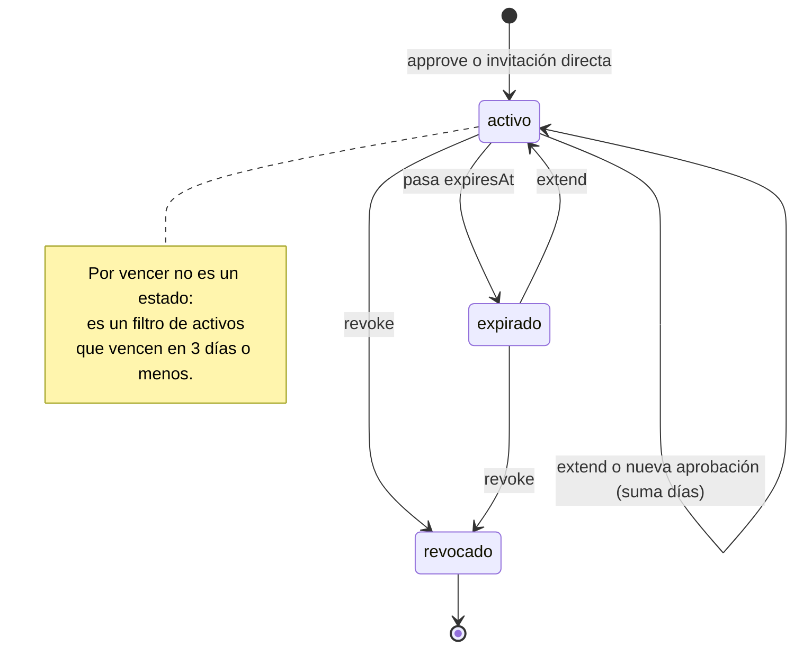
```mermaid
stateDiagram-v2
    [*] --> activo: approve o invitación directa
    activo --> activo: extend o nueva aprobación (suma días)
    activo --> expirado: pasa expiresAt
    expirado --> activo: extend
    activo --> revocado: revoke
    expirado --> revocado: revoke
    revocado --> [*]
    note right of activo
        Por vencer no es un estado:
        es un filtro de activos
        que vencen en 3 días o menos.
    end note
```

*El paso de `activo` a `expirado` ocurre **en el momento** en que pasa `expiresAt`: la API compara la fecha en cada petición. El job horario solo actualiza la etiqueta guardada y envía el recordatorio. Un acceso revocado no se reactiva: para volver a dar acceso se crea uno nuevo. Solo puede haber un acceso `activo` por persona y demo.*

### 5.3 Proyecto (`Project`)

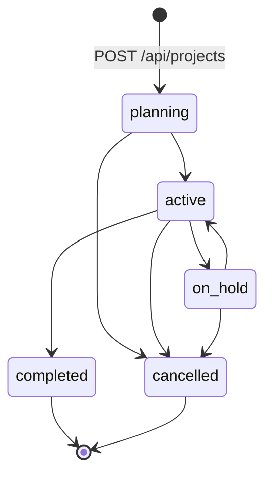
```mermaid
stateDiagram-v2
    [*] --> planning: POST /api/projects
    planning --> active
    active --> on_hold
    on_hold --> active
    active --> completed
    planning --> cancelled
    active --> cancelled
    on_hold --> cancelled
    completed --> [*]
    cancelled --> [*]
```

*Este es el ciclo esperado. La API no impone el orden: el cliente o el gerente pueden fijar cualquier estado con `PUT /api/projects/:id`.*

### 5.4 Factura (`Invoice`)

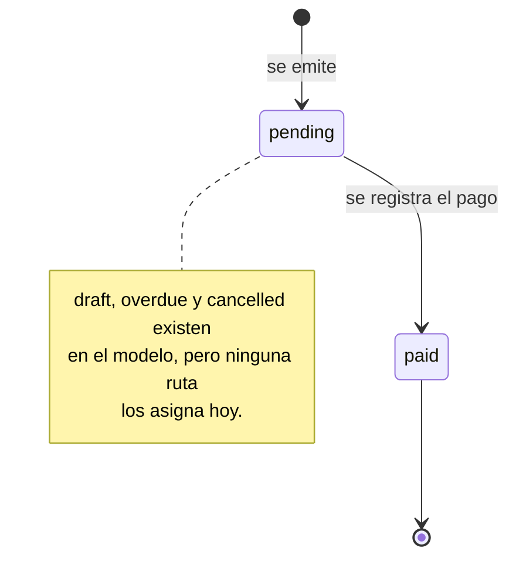
```mermaid
stateDiagram-v2
    [*] --> pending: se emite
    pending --> paid: se registra el pago
    paid --> [*]
    note right of pending
        draft, overdue y cancelled existen
        en el modelo, pero ninguna ruta
        los asigna hoy.
    end note
```

*`POST /api/invoices/:id/pay` registra el pago (método y referencia) sin pasarela. Hoy, además, la emisión de facturas por API falla (ver [Limitaciones](#11-limitaciones-conocidas)).*

### 5.5 Cuenta, enlace, pedido, entregable y contacto

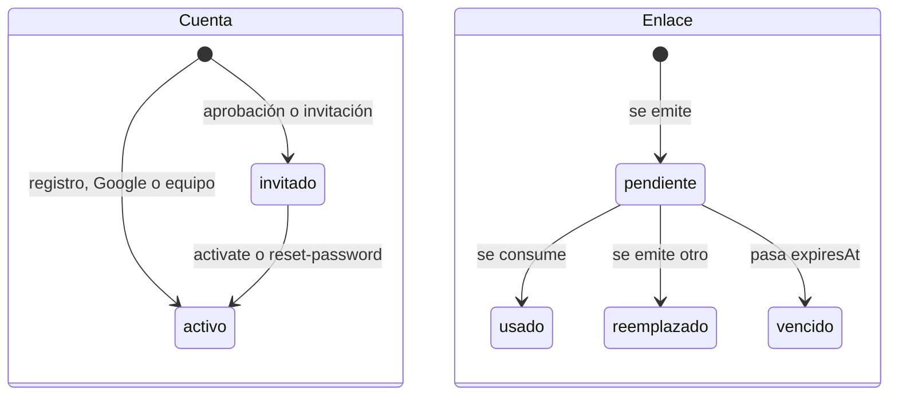
```mermaid
stateDiagram-v2
    state Cuenta {
        [*] --> invitado: aprobación o invitación
        [*] --> activo: registro, Google o equipo
        invitado --> activo: activate o reset-password
    }
    state Enlace {
        state "pendiente" as enlace_pendiente
        [*] --> enlace_pendiente: se emite
        enlace_pendiente --> usado: se consume
        enlace_pendiente --> reemplazado: se emite otro
        enlace_pendiente --> vencido: pasa expiresAt
    }
```

*Cuenta: el campo `User.accountStatus`. Enlace: el enlace mágico. El estado del enlace no es un campo: se deduce de `usedAt`, `invalidado` y `expiresAt`, y corresponde a los errores `token_used`, `token_replaced` y `token_expired`.*

| Modelo | Estados | Quién los cambia |
|---|---|---|
| `Order.status` | `pending` → `in_progress` → `shipped` → `completed`; `cancelled` | El equipo con `PATCH /api/admin/orders/:orderId/status`; el dueño puede cancelar si no está completado ni cancelado; rechazar lo deja `cancelled` |
| `Order.approvalStatus` | `pending` → `approved` o `rejected` | El equipo (`approve`, `reject`) |
| `Deliverable.status` | `pending` → `approved` o `rejected` | El cliente dueño o el equipo; `in_review` existe pero ninguna ruta lo asigna |
| `Contact.status` | `new` → `read` → `responded` | El equipo en Admin › Contactos |
| `Conversation.status` | `active`, `archived`, `closed` | No hay ruta que lo cambie |
| `Factura.estado` (salud) | `Radicada`, `En Auditoría`, `Auditada`, `Glosada`, `Aceptada`, `Pagada`, `Rechazada` | Motor de auditoría de la demo |
| `Radicado.estado` (liquidación) | `pendiente`, `en_proceso`, `validado`, `liquidado`, `con_glosas`, `finalizado`, `rechazado` | Herramienta interna `/liquidacion` |

---

## 6. Índices y reglas de unicidad

Índices reales de la base de datos (además del `_id`):

| Colección | Índice | Para qué |
|---|---|---|
| `users` | `email` único; `google_id` único y disperso | Un correo por cuenta |
| `democatalogitems` | `slug` único; `orden` | Una entrada por demo |
| `demorequests` | `codigo` único; `estado + createdAt`; `email + createdAt`; `demos` | Listados del panel y búsqueda de la solicitud abierta de un email |
| `demogrants` | `user + demoSlug` **único solo para `estado: activo`**; `estado + expiresAt`; `request`; `demoSlug + estado` | Un solo acceso activo por persona y demo; el job busca los vencidos |
| `magiclinktokens` | `tokenHash` único; `user`; `expiresAt` con **TTL de 7 días** | MongoDB borra el enlace 7 días después de vencer |
| `auditlogs` | `accion`; `entidad.tipo + entidad.id + createdAt`; `createdAt` | Historial de cada solicitud o acceso |
| `projects` | `client_id`; `manager_id`; `status`; `updated_at` | Proyectos de cada cuenta |
| `orders` | `orderId` único; `userId` | — |
| `invoices` | `invoiceNumber` único; `projectId`; `userId` | — |
| `deliverables` | `deliverableId` único; `projectId`; `userId` | — |
| `conversations` | `conversationId` único; `projectId`; `participants.userId + status` | — |
| `messages` | `messageId` único; `conversationId`; `conversationId + createdAt` | — |
| `notifications` | `userId`; `isRead`; `userId + isRead`; `userId + created_at` | — |
| `contacts` | Solo `_id` | — |

---

## 7. Lo que no está en MongoDB

### 7.1 Redis

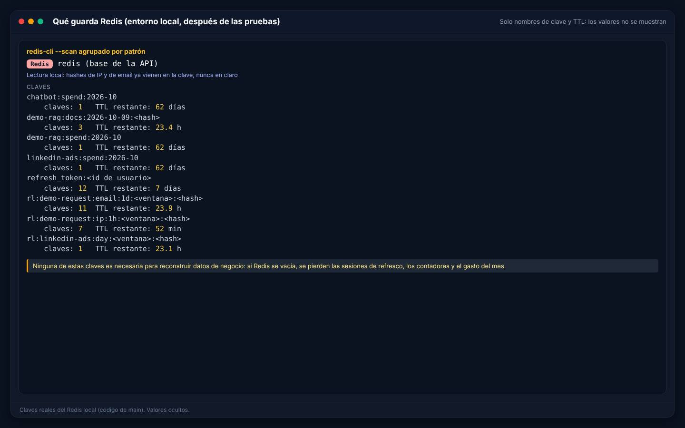

*Las claves del Redis local después de las pruebas: solo nombres y tiempo de vida, sin valores.*

| Clave | Qué guarda | Vida | Si Redis se cae |
|---|---|---|---|
| `refresh_token:<id de cuenta>` | El refresh token vigente de la cuenta (uno por cuenta) | 7 días; se borra al cerrar sesión o restablecer la contraseña | El login funciona pero la sesión no se puede renovar: a los 15 minutos hay que volver a entrar |
| `rl:demo-request:ip:1h:<ventana>:<hash>` y `rl:demo-request:email:1d:…` | Envíos válidos de "Solicitar demo" por IP y por email (en hash) | 1 hora y 24 horas | Se usa un contador en memoria del proceso |
| `rl:linkedin-ads:10m:…`, `rl:linkedin-ads:day:…`, `rl:content:10m:…`, `rl:content:day:…` | Cupos de las demos con IA | 10 minutos y 24 horas | Esas funciones responden 503 |
| `demo-rag:docs:<día de Colombia>:<hash de IP>` | Documentos subidos hoy a la demo RAG | 24 horas | La demo RAG se apaga |
| `demo-rag:spend:AAAA-MM`, `chatbot:spend:…`, `linkedin-ads:spend:…`, `content:spend:…` | Gasto de IA del mes en USD | 62 días | Falla cerrada: no se llama al modelo |
| `jobs:demo-grants:lock` | Candado del job de accesos | Máx. 10 minutos | El job corre igual (sus pasos no se duplican) |

### 7.2 Memoria del proceso

| Qué | Detalle | Vida |
|---|---|---|
| Documentos de la demo RAG | Texto, fragmentos e índice de cada documento subido, con su contador de preguntas. Nunca van a disco ni a MongoDB | 1 hora (barrido cada minuto); máximo 200 documentos a la vez; se pierden al reiniciar |
| Cupos de `express-rate-limit` | General, login, chatbot, subidas, creación de bots, demo RAG | Su ventana; se reinician al desplegar |
| Contador de respaldo de "Solicitar demo" | Solo si Redis no responde | Su ventana; máximo 10.000 claves |
| Bots del chatbot | Ver 7.3 | Mientras viva el proceso |

### 7.3 Disco del servidor

| Carpeta o archivo | Qué guarda | Vida |
|---|---|---|
| `data/chatbots/state.json` (o `CHATBOT_STATE_DIR`) | Bots del constructor del chatbot: configuración, hash del token del dueño, documentos, fragmentos y conversaciones (máx. 200 turnos por bot). Se reescribe después de cada cambio y se carga al arrancar | Hasta que el dueño los borre, **pero el disco de Railway es efímero**: se pierde en cada despliegue |
| `uploads/` (y `uploads/orders`, `uploads/cuentas-medicas`, `uploads/ley100`, `uploads/chatbot`, `uploads/exports`…) | Archivos subidos: documentos del gestor, adjuntos de pedidos, PDF de cuentas médicas y liquidación, Excel generados | Sin borrado automático; efímero en Railway |

---

## 8. Cuánto se conserva cada dato

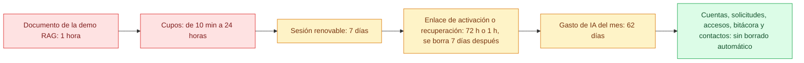
```mermaid
flowchart LR
    classDef corto fill:#fee2e2,stroke:#dc2626,color:#7f1d1d
    classDef medio fill:#fef3c7,stroke:#d97706,color:#78350f
    classDef largo fill:#dcfce7,stroke:#16a34a,color:#14532d

    A["Documento de la demo RAG: 1 hora"]:::corto
    B["Cupos: de 10 min a 24 horas"]:::corto
    C["Sesión renovable: 7 días"]:::medio
    D["Enlace de activación o recuperación: 72 h o 1 h, se borra 7 días después"]:::medio
    E["Gasto de IA del mes: 62 días"]:::medio
    F["Cuentas, solicitudes, accesos, bitácora y contactos: sin borrado automático"]:::largo
    A --> B --> C --> D --> E --> F
```

*De lo más corto a lo más largo. Lo verde no se borra solo: si una persona pide que eliminen sus datos, no hay una ruta para hacerlo y se requiere intervenir directamente la base de datos (ver [SEO, analítica y legal](Doc-12-SEO-Analitica-y-Legal.md)).*

| Dato | Borrado automático | Cómo se elimina hoy |
|---|---|---|
| Documento de la demo RAG | Sí, a la hora | `DELETE /api/demo-rag/documents/:docId` o esperar |
| Enlaces mágicos | Sí (TTL), 7 días después de vencer | Automático |
| Sesión de refresco | Sí, a los 7 días | Cerrar sesión |
| Solicitudes, accesos, cuentas, contactos | No | No hay rutas para borrarlos: un acceso se **revoca**, una solicitud se **rechaza** y quedan como registro |
| Bitácora | No | No se puede editar ni borrar por API |
| Bots del chatbot | No (pero se pierden al redesplegar) | `DELETE /api/chatbot/bots/:botId` |
| Documentos del gestor | No | Papelera y borrado definitivo en `/api/documents` |
| Proyectos | No | `DELETE /api/projects/:id` (gerente) borra también tareas, miembros y actividad |

---

## 9. Datos personales

Lo que se guarda de cada persona y cómo se protege (el marco legal está en [SEO, analítica y legal](Doc-12-SEO-Analitica-y-Legal.md)):

| Dato | Dónde | Protección |
|---|---|---|
| Nombre, empresa, cargo, email, teléfono, país, caso de uso | `demorequests`, `contacts`, `users` | Solo lo ve el equipo en el panel |
| Prueba de la autorización (Ley 1581) | `demorequests.consentimiento` | Fecha, versión de la política y navegador; la IP **solo en hash** |
| Contraseña | `users.password` | Hash bcrypt; nunca se devuelve |
| Enlaces de activación y recuperación | `magiclinktokens` | Solo el hash; el token en claro no se guarda |
| IP de quien hace una acción del equipo | `auditlogs.ipHash` | Solo en hash |
| IP y email en los cupos | Claves `rl:*` y `demo-rag:docs:*` de Redis | Solo en hash y con vencimiento |
| Documento subido a la demo RAG | Memoria del proceso | Se borra a la hora; nunca va a disco |
| Email de la demo RAG | `contacts` (`source: demo-rag`) | Se registra como lead con la fecha de la autorización |

---

## 10. Para desarrolladores

| Qué | Dónde (en `apps/backend/src`) |
|---|---|
| Modelos de Mongoose | `models/*.ts` (un archivo por modelo) |
| Constantes del sistema de demos (estados, vigencias, roles por acción) | `config/demos.ts` |
| Semilla del catálogo de demos | `data/demo-catalog.seed.ts` y `services/demo-catalog.service.ts` (`ensureCatalogSeeded`) |
| Persistencia de los bots del chatbot | `data/chatbot-store.ts` |
| Documentos de la demo RAG en memoria | `services/demo-rag.service.ts` |
| Claves de Redis (gasto y cupos) | `services/ai-budget.service.ts`, `services/request-limits.service.ts`, `services/redis-lock.service.ts` |
| Semillas de salud y de proyectos | `db/seeds/*.ts`, `scripts/seed-*.ts`, `scripts/import-medical-data.ts` |
| Dar el rol admin a una cuenta | Variable `ADMIN_EMAIL` al arrancar, o `scripts/set-admin.ts` |

Recomendaciones al cambiar un modelo:

1. Si un campo cambia de estado, usa actualizaciones **condicionadas** (`findOneAndUpdate({ _id, estado: … })`) como hacen las solicitudes y los accesos: así un doble clic no duplica nada.
2. No generes identificadores consecutivos en un `pre('save')` si el campo es `required`: la validación de Mongoose corre antes (ver [Limitaciones](#11-limitaciones-conocidas)).
3. Si guardas datos personales nuevos, agrégalos a la [sección 9](#9-datos-personales) y a la política de privacidad.

---

## 11. Limitaciones conocidas

| Tema | Qué pasa hoy |
|---|---|
| **Consecutivos que no se generan** | `Deliverable.deliverableId`, `Invoice.invoiceNumber`, `Conversation.conversationId` y `Message.messageId` son obligatorios y se calculan en un `pre('save')`, pero Mongoose valida antes de ese paso: crear entregables, facturas o conversaciones falla. Comprobado en el entorno local (`POST /api/deliverables`, `POST /api/invoices`, `POST /api/messages/conversations` responden 500 con "Path … is required") |
| **Consecutivos por conteo** | `ORD-`, `DEL-`, `FAC-`, `CONV-` y `MSG-` se calculan contando documentos: si se borra uno o se crean dos a la vez, el número puede repetirse y el índice único rechaza el segundo |
| **Notificaciones con id como texto** | `Notification.userId` (y `Document.user_id`) guardan el id de la cuenta como texto, no como referencia |
| **Bots del chatbot fuera de la base** | Viven en memoria y en un archivo del disco del servidor; en Railway se pierden con cada despliegue |
| **Archivos en disco efímero** | Los archivos subidos (`uploads/`) no sobreviven a un redespliegue en Railway |
| **Sin borrado de datos personales por API** | Solicitudes, accesos, cuentas, contactos y bitácora no tienen ruta de borrado |
| **Migraciones antiguas** | `db/migrations/*.sql` son de una versión anterior con base SQL; MongoDB no las usa |
| **Colecciones casi sin uso** | `quotes` (cotizaciones sin pantalla), `chatsessions` y `chatmessages` (chat de eco, solo desarrollo) existen en el código pero no reciben datos desde la web |

---

## 12. Páginas relacionadas

- [API](Doc-08-API.md): las rutas que leen y escriben estos datos.
- [Roles y permisos](Doc-10-Roles-y-Permisos.md): qué rol puede tocar cada cosa.
- [Arquitectura](Doc-01-Arquitectura.md): dónde corren MongoDB y Redis.
- [Manual del administrador](Doc-06-Manual-del-Administrador.md): las pantallas donde el equipo ve y cambia estos datos.
- [SEO, analítica y legal](Doc-12-SEO-Analitica-y-Legal.md): tratamiento de datos personales.
- [Sistema de demos (plan)](04-Sistema-de-Demos.md): el diseño original de solicitudes y accesos.
