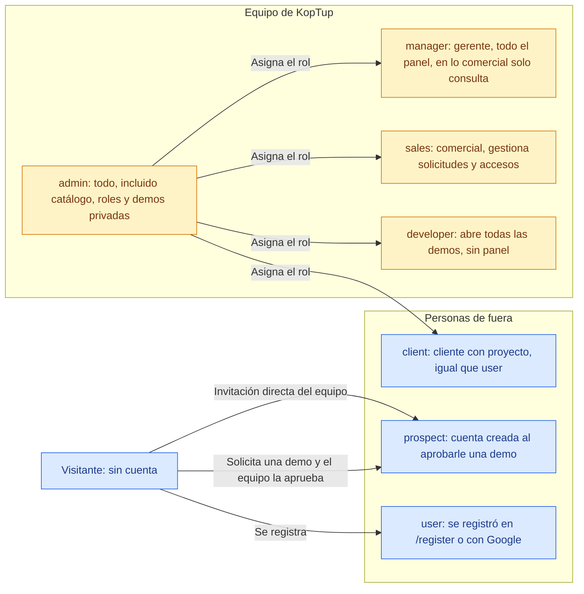
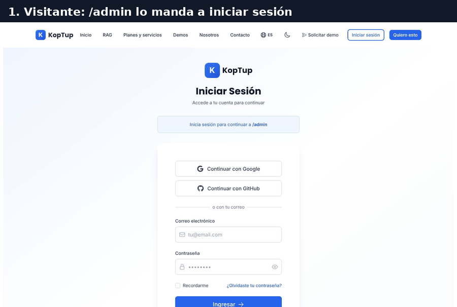
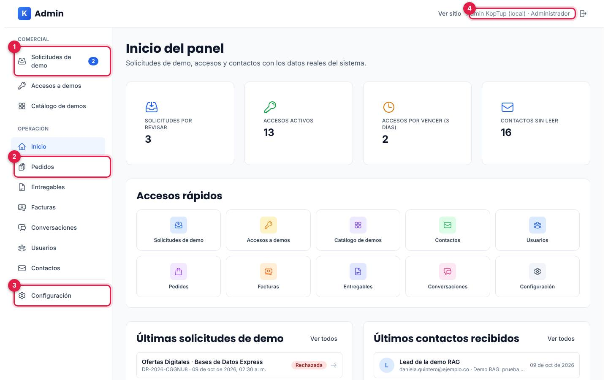
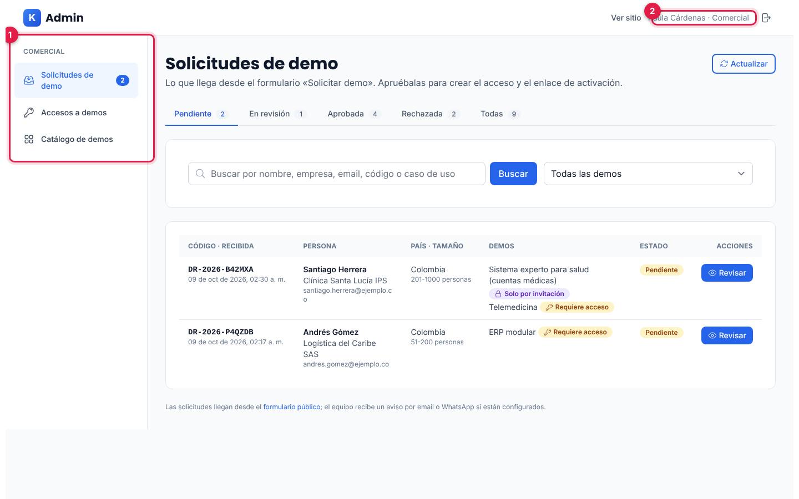
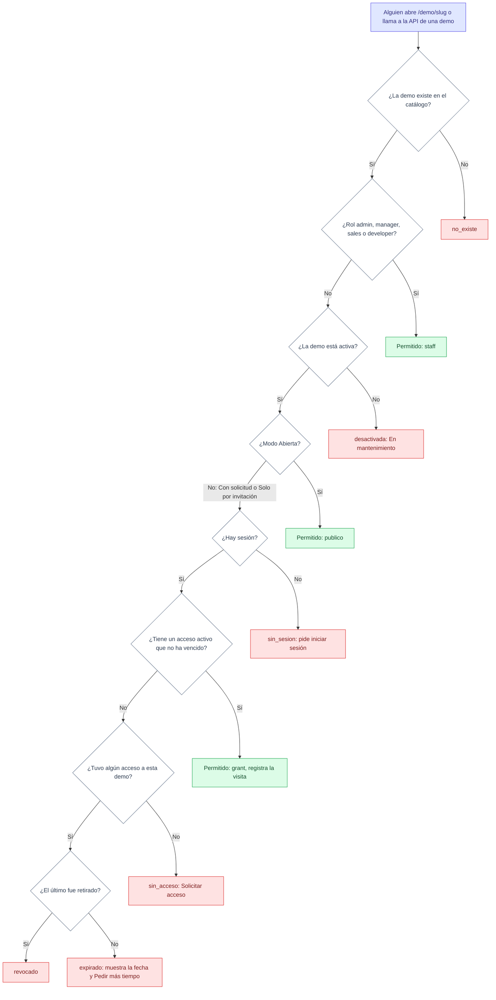
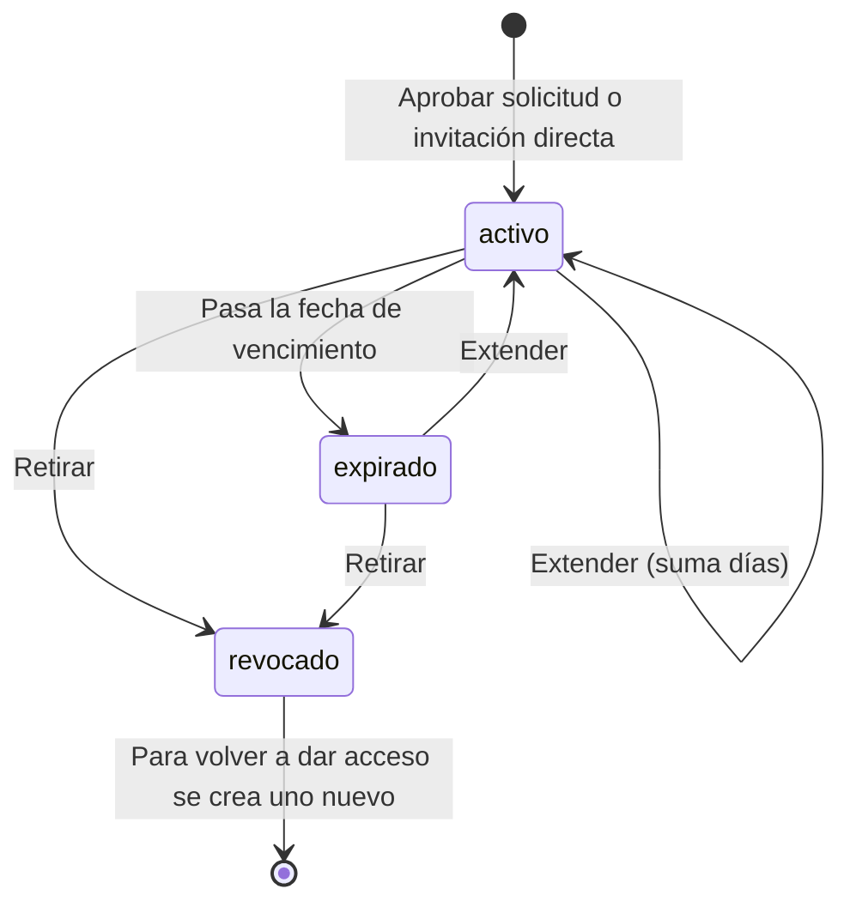
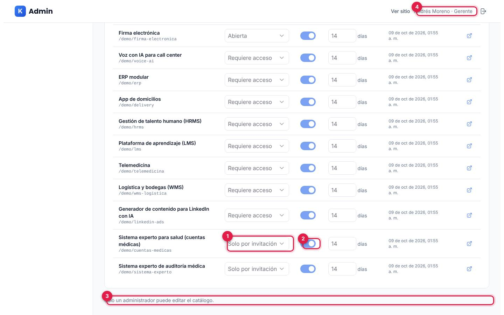
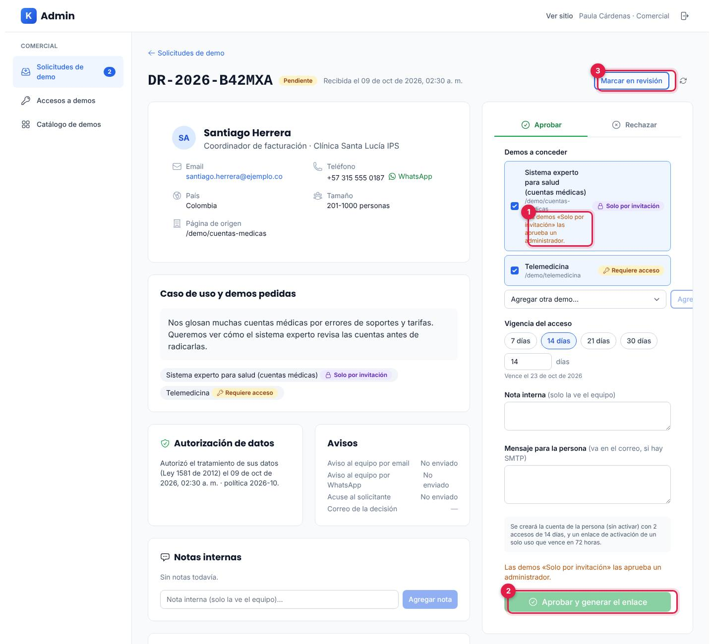
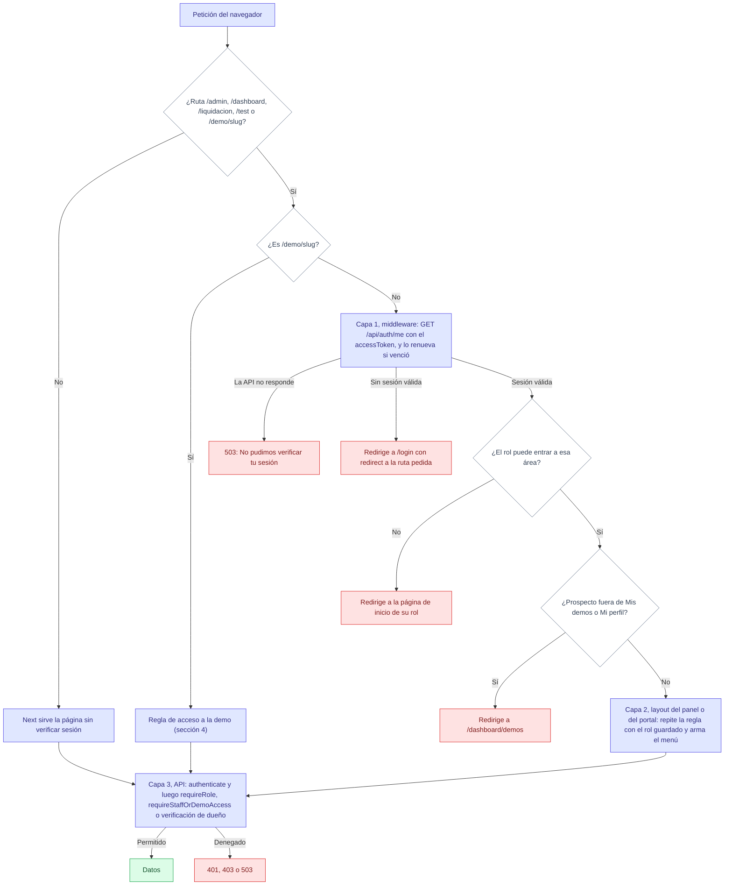

# Roles y permisos

> **Resumen.** Cada cuenta de KopTup tiene **un rol**: tres para personas de fuera (`user`, `client`, `prospect`) y cuatro para el equipo (`developer`, `sales`, `manager`, `admin`). El rol decide a qué páginas entra la persona, qué ve en el panel y qué puede hacer con la API. Las demos tienen además un **modo de acceso** (Abierta, Con solicitud o Solo por invitación) que decide quién puede abrirlas.
>
> Todas las reglas se verifican **en el servidor**, en tres capas: el middleware de la web antes de mostrar la página, el layout del panel o del portal, y la API en cada petición, que lee el rol **vigente** de la base de datos. Esconder un botón nunca es la única protección.

## Índice

1. [Los roles en una imagen](#1-los-roles-en-una-imagen)
2. [Qué ve cada rol al iniciar sesión](#2-qué-ve-cada-rol-al-iniciar-sesión)
3. [Matriz de páginas web](#3-matriz-de-páginas-web)
4. [Cómo se decide el acceso a una demo](#4-cómo-se-decide-el-acceso-a-una-demo)
5. [Modos de acceso de las demos](#5-modos-de-acceso-de-las-demos)
6. [Capacidades del equipo en el panel](#6-capacidades-del-equipo-en-el-panel)
7. [Cómo se decide el acceso: las tres capas](#7-cómo-se-decide-el-acceso-las-tres-capas)
8. [Matriz de la API](#8-matriz-de-la-api)
9. [Qué datos ve cada rol](#9-qué-datos-ve-cada-rol)
10. [Cómo se asigna o cambia un rol](#10-cómo-se-asigna-o-cambia-un-rol)
11. [Para desarrolladores](#11-para-desarrolladores)
12. [Limitaciones conocidas](#12-limitaciones-conocidas)
13. [Páginas relacionadas](#13-páginas-relacionadas)

---

## 1. Los roles en una imagen

*Azul: personas de fuera. Ámbar: equipo de KopTup. Solo un `admin` cambia roles (ver [§10](#10-cómo-se-asigna-o-cambia-un-rol)).*

| Rol | Quién es | Página de inicio al entrar | Etiqueta en el panel |
|---|---|---|---|
| *(sin rol)* **Visitante** | Navega sin iniciar sesión | — | — |
| `user` | Se registró por su cuenta (formulario o Google). Se trata igual que un cliente | `/dashboard` | — |
| `client` | Cliente con proyecto contratado | `/dashboard` | — |
| `prospect` | Persona a la que el equipo le aprobó una demo o la invitó. Su cuenta nace en estado `invitado` y se activa con el enlace | `/dashboard/demos` (Mis demos) | — |
| `developer` | Desarrollador del equipo | `/dashboard` | — |
| `sales` | Comercial del equipo | `/admin/solicitudes` | Comercial |
| `manager` | Gerente del equipo | `/admin` | Gerente |
| `admin` | Administrador | `/admin` | Administrador |

---

## 2. Qué ve cada rol al iniciar sesión

*Siete cuadros, uno por rol: visitante, prospecto, cliente, developer, comercial, gerente y administrador, con cuentas ficticias del entorno de capturas.*

| Panel del administrador | Panel del comercial (`sales`) |
|---|---|
|  |  |
| ① Grupo **Comercial** (Solicitudes, Accesos y Catálogo de demos) · ② Grupo **Operación** (Inicio, Pedidos, Entregables, Facturas, Conversaciones, Usuarios, Contactos) · ③ **Configuración** · ④ Nombre y rol. El gerente ve exactamente el mismo menú. | ① Solo el grupo **Comercial**: no ve Operación ni Configuración, y si escribe `/admin` lo devuelve a Solicitudes · ② Nombre y rol ("Comercial"). |

*Izquierda: el menú completo (admin y manager). Derecha: el menú reducido del rol `sales`.*

Los menús del **prospecto** (solo Mis demos y Mi perfil) y del **cliente** (portal completo) están con capturas en [Flujos del prospecto y cliente §8](Doc-05-Flujos-del-Prospecto-y-Cliente.md#8-el-menú-del-portal-prospecto-vs-cliente).

---

## 3. Matriz de páginas web

✅ entra · 👁 entra solo a consultar · ➜ lo redirige · ❌ no entra.

| Página o área | Visitante | `user` / `client` | `prospect` | `developer` | `sales` | `manager` | `admin` |
|---|---|---|---|---|---|---|---|
| Páginas públicas, landings, `/demo`, `/solicitar-demo`, `/contact`, legales | ✅ | ✅ | ✅ | ✅ | ✅ | ✅ | ✅ |
| `/login`, `/register`, `/forgot-password`, `/reset-password`, `/activar/<token>` | ✅ | ✅ | ✅ | ✅ | ✅ | ✅ | ✅ |
| Demos **Abiertas** (18 por defecto) | ✅ | ✅ | ✅ | ✅ | ✅ | ✅ | ✅ |
| Demos **Con solicitud** (8 por defecto) | ❌ pantalla de acceso | ✅ con acceso vigente | ✅ con acceso vigente | ✅ todas | ✅ todas | ✅ todas | ✅ todas |
| Demos **Solo por invitación** (2 por defecto) | ❌ pantalla de acceso | ✅ con invitación vigente | ✅ con invitación vigente | ✅ todas | ✅ todas | ✅ todas | ✅ todas |
| Demo **desactivada** ("En mantenimiento") | ❌ | ❌ | ❌ | ✅ | ✅ | ✅ | ✅ |
| `/dashboard/demos` (Mis demos) y `/dashboard/profile` | ➜ `/login` | ✅ | ✅ | ✅ | ✅ | ✅ | ✅ |
| Resto del portal: `/dashboard`, pedidos, proyectos, entregables, facturación, mensajes, notificaciones, configuración | ➜ `/login` | ✅ | ➜ Mis demos | ✅ | ✅ | ✅ | ✅ |
| `/admin/solicitudes`, `/admin/accesos` | ➜ `/login` | ➜ `/dashboard` | ➜ Mis demos | ➜ `/dashboard` | ✅ | 👁 | ✅ |
| `/admin/catalogo-demos` | ➜ `/login` | ➜ `/dashboard` | ➜ Mis demos | ➜ `/dashboard` | 👁 | 👁 | ✅ |
| `/admin` (Inicio), Pedidos, Entregables, Facturas, Conversaciones, Contactos, Configuración | ➜ `/login` | ➜ `/dashboard` | ➜ Mis demos | ➜ `/dashboard` | ➜ Solicitudes | ✅ | ✅ |
| `/admin/users` (Usuarios) | ➜ `/login` | ➜ `/dashboard` | ➜ Mis demos | ➜ `/dashboard` | ➜ Solicitudes | 👁 (no puede cambiar roles) | ✅ |
| `/liquidacion` (herramienta interna) | ➜ `/login` | ➜ `/dashboard` | ➜ Mis demos | ➜ `/dashboard` | ✅ | ✅ | ✅ |
| `/test` (pruebas de la API) | ➜ `/login` | ➜ inicio | ➜ inicio | ➜ inicio | ➜ inicio | ➜ inicio | ✅ solo fuera de producción (404 en producción) |

*La columna `user` / `client` también vale para un prospecto que luego pasa a cliente: conserva sus accesos a demos.*

---

## 4. Cómo se decide el acceso a una demo

La misma regla la aplican la web (al abrir `/demo/<slug>`) y la API (en las rutas de las demos que usan backend). Vive en un solo lugar: `evaluateDemoAccess` en `apps/backend/src/services/demo-access.service.ts`.

*Si MongoDB no responde, las demos Abiertas siguen abiertas y el resto queda cerrado con el motivo `no_disponible` (la API responde 503). La fecha de vencimiento se compara en cada consulta: no depende del job horario.*

Qué ve la persona según el motivo (capturas en [Flujos del prospecto y cliente §6](Doc-05-Flujos-del-Prospecto-y-Cliente.md#6-abrir-una-demo-con-acceso-y-sin-acceso)):

| Motivo | Pantalla en `/demo/<slug>` (la URL no cambia) | Respuesta de la API |
|---|---|---|
| `sin_sesion` | "Inicia sesión" o "Solicitar acceso" | 401 `login_required` (o `TOKEN_EXPIRED`) |
| `sin_acceso` | "Solicitar acceso" con el formulario prellenado | 403 `demo_access_required` |
| `expirado` | Fecha en que venció y "Pedir más tiempo" | 403 `demo_access_required` |
| `revocado` | "Tu acceso fue cerrado" | 403 `demo_access_required` |
| `desactivada` | "En mantenimiento" | 403 `demo_disabled` |
| `no_disponible` | "No pudimos verificar el acceso" | 503 |

### Ciclo de vida de un acceso (DemoGrant)

*Cada acceso dura 14 días por defecto (entre 1 y 365). El job horario marca como `expirado` los vencidos y envía un recordatorio 3 días antes si hay correo configurado.*

---

## 5. Modos de acceso de las demos

| Modo (valor) | Etiqueta | Quién la abre | Cómo se consigue acceso | Quién concede el acceso | ¿En el sitemap? | Demos por defecto |
|---|---|---|---|---|---|---|
| **Abierta** (`publico`) | Abierta | Cualquiera, sin cuenta | No hace falta | — | Sí | 18: chatbot, code-review-ia, crm-ia, helpdesk-ia, facturacion-electronica, pos, ecommerce, loyalty, control-proyectos, sistema-reservas, dashboard-ejecutivo, gestor-documentos, gestor-contenido, automatizacion, scraping, moderacion-contenido, saas-boilerplate, firma-electronica |
| **Con solicitud** (`solicitud`) | Requiere acceso | El equipo y quien tenga un acceso vigente | Formulario "Solicitar demo" → el equipo aprueba | `admin` o `sales` | No | 8: voice-ai, erp, delivery, hrms, lms, telemedicina, wms-logistica, linkedin-ads |
| **Solo por invitación** (`privado`) | Solo por invitación | El equipo y quien tenga una invitación vigente | "Solicitar demo personalizada" → solo un admin aprueba | Solo `admin` | No | 2: cuentas-medicas, sistema-experto |
| **Desactivada** (`activo: false`, cualquier modo) | En mantenimiento | Solo el equipo | — | — | Según el modo | Ninguna |

- El **administrador** cambia el modo, activa o desactiva una demo y fija su vigencia por defecto en **Admin › Catálogo de demos**. El cambio se aplica en el sitio en máximo un minuto (caché del middleware) y queda en la bitácora. El **chatbot RAG** queda siempre Abierto: es el destino de la publicidad.
- La tabla de respaldo de la web (`lib/demo-access-defaults.ts`) y la semilla del backend tienen los mismos modos; una prueba automática verifica que coincidan.
- Una demo con acceso controlado se sirve con `Cache-Control: private, no-store` y `X-Robots-Tag: noindex`.

*Catálogo de demos visto por un gerente: ① el modo de acceso y ② el interruptor de activa aparecen deshabilitados, ③ el aviso "Solo un administrador puede editar el catálogo" y ④ el rol en el encabezado.*

---

## 6. Capacidades del equipo en el panel

✅ puede · 👁 solo consulta · ❌ no puede. El developer no entra al panel.

| Acción | `sales` | `manager` | `admin` |
|---|---|---|---|
| Ver solicitudes de demo, su detalle e historial | ✅ | ✅ | ✅ |
| Marcar en revisión, agregar notas internas, rechazar | ✅ | ❌ | ✅ |
| Reenviar el enlace de activación | ✅ | ❌ | ✅ |
| Aprobar, invitar directo, extender o retirar demos **Abiertas** o **Con solicitud** | ✅ | ❌ | ✅ |
| Lo mismo con demos **Solo por invitación** | ❌ (`requires_admin`) | ❌ | ✅ |
| Ver accesos a demos (estado, vencimiento, visitas) | ✅ | ✅ | ✅ |
| Ver el catálogo de demos | 👁 | 👁 | ✅ |
| Editar el catálogo (modo, activa, vigencia, orden, nombre) | ❌ | ❌ | ✅ |
| Inicio del panel, pedidos (aprobar, rechazar, cambiar estado, facturar), facturas, entregables, conversaciones, contactos | ❌ | ✅ | ✅ |
| Ver usuarios | ❌ | ✅ | ✅ |
| Cambiar el rol de un usuario | ❌ | ❌ (la API responde 403) | ✅ (no puede quitarse su propio rol) |
| Bitácora completa del sistema (`GET /api/admin/audit-log`) | ❌ | ❌ | ✅ solo por API |
| Herramienta interna `/liquidacion` | ✅ | ✅ | ✅ |

*Solicitud con una demo Solo por invitación vista por el comercial: ① el aviso "Las demos «Solo por invitación» las aprueba un administrador", ② el botón **Aprobar y generar el enlace** deshabilitado mientras esa demo esté marcada y ③ lo que sí puede hacer, como marcarla en revisión. Si quita la demo privada de la lista, puede aprobar el resto.*

El paso a paso de cada acción está en el [Manual del administrador](Doc-06-Manual-del-Administrador.md).

---

## 7. Cómo se decide el acceso: las tres capas

*La capa que manda es la 3: aunque alguien llegue a una página, la API vuelve a autorizar cada consulta con el rol vigente.*

| Capa | Archivo | Qué verifica | Rol que usa |
|---|---|---|---|
| **1. Middleware de Next** | `apps/web/src/middleware.ts` + `lib/auth-roles.ts` | Sesión y rol por área; acceso a demos | El de `GET /api/auth/me` (base de datos), guardado 30 s por instancia |
| **2. Layout del cliente** | `components/admin/AdminLayout.tsx`, `components/dashboard/DashboardLayout.tsx` | Repite la regla y arma el menú según el rol | El guardado en `localStorage` al iniciar sesión (solo para pintar) |
| **3. API** | `apps/backend/src/middleware/access.ts` y cada archivo de `routes/` | La política de cada ruta (ver [§8](#8-matriz-de-la-api)) | El leído de MongoDB **en cada petición** (`requireRole`, `requireStaffOrDemoAccess`) |

Los guardias de la API:

| Guardia | Quién pasa | Si no |
|---|---|---|
| `authenticate` | Cualquiera con un JWT válido | 401 (`TOKEN_EXPIRED` si venció) |
| `requireRole(...roles)` | Los roles indicados, leídos de la base de datos | 401 sin sesión, 403 sin el rol, 503 si MongoDB no responde |
| `requireStaff` | `admin`, `manager`, `sales` | Igual que `requireRole` |
| `requireAdmin` | `admin` | Igual que `requireRole` |
| `requireStaffOrDemoAccess(slug)` | `admin`, `manager`, `sales` directo; `developer` y el resto según la regla de la [§4](#4-cómo-se-decide-el-acceso-a-una-demo) | 401, 403 o 503 con el `motivo` |
| `devOnlyAdmin` | `admin`, solo fuera de producción | 404 en producción |
| `authorize(...roles)` | Compara el rol del token | Existe en `middleware/auth.ts` pero **ninguna ruta de `main` lo usa**: se reemplazó por `requireRole` |

Los cambios de rol o el retiro de un acceso se aplican **de inmediato** en la API; en la web pueden tardar hasta 30 segundos por la caché del middleware.

---

## 8. Matriz de la API

✅ puede · 🔒 solo lo propio · 🎟 si la demo es Abierta o tiene acceso vigente · ❌ no puede. Detalle de cada ruta en [API](Doc-08-API.md) y en `apps/backend/src/routes/POLICIES.md`.

| Rutas | Visitante | `user` / `client` | `prospect` | `developer` | `sales` | `manager` | `admin` |
|---|---|---|---|---|---|---|---|
| **Públicas:** `/health`, `GET /api/demo-catalog`, `GET /api/demo-access/:slug`, `POST /api/contact`, `POST /api/quotes`, `POST /api/demo-requests`, `/api/demo-rag`, crear bots y chatear en `/api/chatbot` | ✅ | ✅ | ✅ | ✅ | ✅ | ✅ | ✅ |
| **Auth pública:** registro, login, Google, refresh, olvidé y restablecer contraseña, activar cuenta | ✅ | ✅ | ✅ | ✅ | ✅ | ✅ | ✅ |
| **Editar o borrar un bot** del chatbot (`/api/chatbot/bots/:id`, docs, URLs, conversaciones) | Solo quien tenga el token de dueño de ese bot (no depende del rol) | | | | | | |
| **Sesión:** `/api/auth/me`, perfil, cambiar contraseña, logout, `GET /api/me/demos` | ❌ | 🔒 | 🔒 | 🔒 | 🔒 | 🔒 | 🔒 |
| **Portal:** pedidos, proyectos, mensajes, notificaciones, `/api/documents` | ❌ | 🔒 | 🔒 | 🔒 | 🔒 | 🔒 | 🔒 |
| **Entregables y facturas** (`/api/deliverables`, `/api/invoices`): la lista trae solo los propios; abrir, aprobar, rechazar, pagar o descargar uno concreto | ❌ | 🔒 | 🔒 | 🔒 | ✅ cualquiera por su id | ✅ cualquiera por su id | ✅ cualquiera por su id |
| Subir un entregable (`POST /api/deliverables`) | ❌ | ❌ | ❌ | ✅ | ❌ | ✅ | ✅ |
| Crear una factura (`POST /api/invoices`) | ❌ | ❌ | ❌ | ❌ | ❌ | ✅ | ✅ |
| **APIs de demos:** `/api/auditoria` y lectura de `/api/documentos-conocimiento` (cuentas-medicas), `/api/expert` y lecturas de `/api/cups` (sistema-experto), `/api/content` (gestor-contenido), `/api/linkedin-ads/generate` (linkedin-ads) | 🎟 | 🎟 | 🎟 | ✅ | ✅ | ✅ | ✅ |
| **Herramientas internas:** `/api/liquidacion`, `/api/reglas-facturacion`, cuentas médicas internas (`/api/cuentas`, `/api/ley100`, `/api/process`, `/api/export`), configuración del sistema experto y de los documentos de conocimiento | ❌ | ❌ | ❌ | ❌ | ✅ | ✅ | ✅ |
| `GET /api/admin/demo-requests`, `demo-grants` y `demo-catalog` | ❌ | ❌ | ❌ | ❌ | ✅ | ✅ | ✅ |
| Acciones sobre solicitudes y accesos (aprobar, invitar, extender, retirar, notas, rechazar, reenviar enlace) | ❌ | ❌ | ❌ | ❌ | ✅ (privadas: ❌) | ❌ | ✅ |
| `/api/admin/*` de operación: pedidos, facturas, entregables, conversaciones, usuarios, contactos | ❌ | ❌ | ❌ | ❌ | ❌ | ✅ | ✅ |
| Solo admin: cambiar roles, editar el catálogo, bitácora, importar y vectorizar CUPS, reiniciar la configuración de documentos de conocimiento | ❌ | ❌ | ❌ | ❌ | ❌ | ❌ | ✅ |
| Solo desarrollo: `/api/test`, `/api/chat`, pruebas de correo y WhatsApp | ❌ | ❌ | ❌ | ❌ | ❌ | ❌ | ✅ fuera de producción (404 en producción) |

---

## 9. Qué datos ve cada rol

| Rol | Qué datos ve | Qué no ve |
|---|---|---|
| **Visitante** | Páginas públicas; el catálogo público de demos (nombre, modo y si está activa); lo que crea dentro de las demos (se guarda en su navegador); el documento que sube a "Prueba con tu documento" (solo durante 1 hora y con su identificador); los bots que crea en "Configura el tuyo" (con su token de dueño). | Ningún dato de otras personas. |
| **`user` / `client`** | Su perfil; sus accesos a demos; sus pedidos; los proyectos donde es miembro; sus entregables y facturas; las conversaciones donde participa; sus notificaciones. El Panel de inicio muestra una vista de ejemplo (ver [Flujos del prospecto y cliente §9](Doc-05-Flujos-del-Prospecto-y-Cliente.md#9-el-portal-del-cliente-sección-por-sección)). | Datos de otros clientes; notas internas del equipo. |
| **`prospect`** | Su perfil y sus accesos: demo, vencimiento, días restantes y último ingreso. | Notas internas, quién le dio el acceso, el resto del portal. |
| **`developer`** | Lo mismo que un cliente en su portal; todas las demos aunque estén desactivadas; puede subir entregables por la API. | El panel `/admin` y las herramientas internas. |
| **`sales`** | Solicitudes de demo (datos de contacto, caso de uso, autorización de datos, notas internas e historial); accesos de todas las personas (estado, vencimiento, visitas); catálogo en lectura; la herramienta `/liquidacion`. Por la API puede abrir un entregable o una factura concretos de cualquier cuenta. | Pedidos, facturas, entregables, conversaciones, usuarios y contactos en el panel; edición del catálogo; demos privadas. |
| **`manager`** | Todo el panel: inicio con indicadores, pedidos, facturas, entregables, conversaciones, usuarios (nombre, email, rol, proveedor, último acceso) y contactos o leads; solicitudes, accesos y catálogo en lectura; `/liquidacion`. | No cambia roles ni edita el catálogo; no aprueba ni retira demos. |
| **`admin`** | Todo lo anterior, con edición total: catálogo, roles, demos privadas y la bitácora completa por API. | — |

---

## 10. Cómo se asigna o cambia un rol

| Rol | Cómo se obtiene en `main` |
|---|---|
| `user` | Al registrarse en `/register` o entrar por primera vez con Google. |
| `prospect` | Automático al **aprobar una solicitud** o hacer una **invitación directa** a un email sin cuenta. Si el email ya tenía cuenta, **conserva su rol** (no se le baja) y solo recibe los accesos. Un email del equipo no se puede invitar. |
| `admin` | Desde **Admin › Usuarios** (otro admin), con el script `src/scripts/set-admin.ts` del backend o con la variable `ADMIN_EMAIL` al arrancar el backend. |
| `manager`, `developer` | Desde **Admin › Usuarios** (solo un admin). |
| `sales`, `client` | Solo por la API (`PATCH /api/admin/users/:id/role`, solo admin): el selector de la pantalla no ofrece estas opciones (ver Limitaciones). |

La pantalla Admin › Usuarios, con su selector de rol anotado, está en el [Manual del administrador §7](Doc-06-Manual-del-Administrador.md#7-usuarios-y-roles). La persona a la que se le cambia el rol debe cerrar sesión y volver a entrar para que su menú cambie; la API aplica el rol nuevo de inmediato.

Cada cambio de rol queda en la bitácora (`user.role_change`, con el rol anterior y el nuevo). La API valida el rol contra la lista del modelo y no deja que un admin se quite su propio rol.

---

## 11. Para desarrolladores

| Tema | Archivo |
|---|---|
| Lista de roles del modelo | `apps/backend/src/models/User.ts` (`USER_ROLES`) |
| Guardias de la API | `apps/backend/src/middleware/access.ts` |
| Roles del sistema de demos (`DEMO_READ_ROLES`, `DEMO_MANAGE_ROLES`, `DEMO_PRIVATE_ROLES`, `DEMO_STAFF_ROLES`) | `apps/backend/src/config/demos.ts` |
| Regla de acceso a demos | `apps/backend/src/services/demo-access.service.ts` |
| Política de cada ruta | `apps/backend/src/routes/POLICIES.md` |
| Roles por área de la web y página de inicio de cada rol | `apps/web/src/lib/auth-roles.ts` |
| Guardia de la web | `apps/web/src/middleware.ts` |
| Pruebas | `apps/backend/src/__tests__/integration/` (401/403/200 por política y sistema de demos) y `apps/web/e2e/permissions.spec.ts`, `access-mode.spec.ts`, `demo-access.spec.ts` |

Para agregar un rol: súmalo a `USER_ROLES`, decide en qué listas de `config/demos.ts` y `middleware/access.ts` entra, actualiza `lib/auth-roles.ts` en la web (áreas y página de inicio), las etiquetas de `adminLayout.roles` en `messages/` y el selector de Admin › Usuarios, y agrega pruebas de integración.

---

## 12. Limitaciones conocidas

- **Selector de roles incompleto.** Admin › Usuarios solo ofrece Usuario, Developer, Manager y Admin. Para una cuenta `sales`, `prospect` o `client` el selector muestra "Usuario" aunque no lo sea, y esos tres roles solo se pueden asignar por la API.
- **El gerente ve el selector de roles** en Admin › Usuarios, pero la API rechaza el cambio (solo admin) y la pantalla muestra un error genérico.
- **Sin pantalla para la bitácora completa**: solo existe `GET /api/admin/audit-log` (admin). El detalle de cada solicitud sí muestra su historial.
- **El developer no tiene etiqueta propia** en el panel (no entra) y en el portal se ve como un cliente.
- **Caché de 30 s en la web**: un cambio de rol o un acceso retirado puede tardar hasta 30 segundos en reflejarse en las páginas (la API lo aplica de inmediato).
- **En desarrollo:** el paso de prospecto a cliente con propuesta y anticipo no está en `main`; ver [Estado y próximos pasos](15-Estado-y-Proximos-Pasos.md).

---

## 13. Páginas relacionadas

- [Flujos del prospecto y cliente](Doc-05-Flujos-del-Prospecto-y-Cliente.md): activación, Mis demos y pantallas de acceso.
- [Manual del administrador](Doc-06-Manual-del-Administrador.md): cómo aprobar, invitar, extender y retirar.
- [Arquitectura](Doc-01-Arquitectura.md): dónde corre cada capa.
- [API](Doc-08-API.md): todas las rutas.
- [Mapa del sitio](Doc-02-Mapa-del-Sitio.md): todas las páginas con su nivel de acceso.
- Plan relacionado: [Sistema de demos](04-Sistema-de-Demos.md) y [Seguridad y calidad](10-Seguridad-y-Calidad.md).
