# Operación y despliegue

> **Resumen.** El código vive en GitHub. Cada push a `main` lo despliegan **dos plataformas por su cuenta**: **Vercel** construye la web (`www.koptup.com`) y **Railway** construye la API. GitHub Actions **solo verifica** (lint, tipos, pruebas y una suite de punta a punta con Playwright) y publica esta wiki; no despliega nada.
>
> Aquí encuentras todas las variables de entorno reales de cada servicio, cómo levantar el sistema en tu computador, cómo correr las pruebas y nueve **runbooks**: procedimientos paso a paso para cuando algo falla. **Situación actual (9 de octubre de 2026):** la web funciona, pero el backend de Railway responde «Application not found». El runbook [9.1](#91-el-backend-está-caído-situación-actual) explica cómo recuperarlo.

## Índice

1. [El despliegue en una imagen](#1-el-despliegue-en-una-imagen)
2. [Dónde corre cada pieza](#2-dónde-corre-cada-pieza)
3. [Integración continua (CI)](#3-integración-continua-ci)
4. [Variables de entorno](#4-variables-de-entorno)
5. [Levantar todo en local, paso a paso](#5-levantar-todo-en-local-paso-a-paso)
6. [Pruebas: unitarias, de integración y de punta a punta](#6-pruebas-unitarias-de-integración-y-de-punta-a-punta)
7. [Salud del sistema y registros](#7-salud-del-sistema-y-registros)
8. [Cómo se publica esta wiki](#8-cómo-se-publica-esta-wiki)
9. [Runbooks: qué hacer cuando algo falla](#9-runbooks-qué-hacer-cuando-algo-falla)
10. [Limitaciones conocidas](#10-limitaciones-conocidas)
11. [Para desarrolladores: archivos clave](#11-para-desarrolladores-archivos-clave)
12. [Páginas relacionadas](#12-páginas-relacionadas)

---

## 1. El despliegue en una imagen

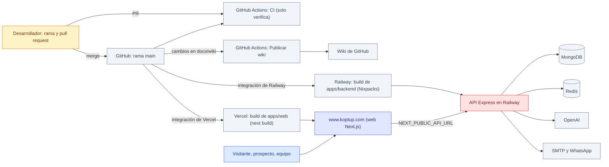

*Un merge a `main` dispara tres cosas en paralelo: CI (verifica), Vercel (web) y Railway (API). La API está en rojo porque hoy no responde.*

Tres ideas para quedarse:

1. **CI no es una puerta.** Vercel y Railway despliegan `main` sin esperar a que CI termine, y `main` no exige CI en verde para fusionar. Una prueba en rojo **no** frena el despliegue (ver [Limitaciones](#10-limitaciones-conocidas)).
2. **La web y la API se despliegan por separado.** Puedes revertir una sin tocar la otra ([runbook 9.9](#99-revertir-un-despliegue)).
3. **Las variables `NEXT_PUBLIC_*` se fijan al compilar la web.** Cambiarlas en Vercel no tiene efecto hasta que vuelvas a desplegar.

---

## 2. Dónde corre cada pieza

| Pieza | Dónde corre | Cómo se despliega | Configuración en el repositorio |
|---|---|---|---|
| **Web** (Next.js 14) | Vercel, proyecto `koptup` (tiene los dominios `www.koptup.com` y `koptup.com`), región `iad1` | Integración de Vercel con GitHub: cada push a `main` va a producción; las demás ramas crean una vista previa | `apps/web/vercel.json` (`npm install`, `next build`) y `apps/web/.env.production` (solo URL públicas) |
| **API** (Express) | Railway, un servicio con `apps/backend` | Integración de Railway con GitHub: build con Nixpacks (`npm install && npm run build`), arranque con `npm run start` (`node dist/index.js`) | `apps/backend/railway.json` (chequeo `GET /health/live`, 120 s, reinicio si falla hasta 10 veces) y `apps/backend/Procfile` |
| **Base de datos** | MongoDB (la cadena de conexión está en Railway, nunca en el repositorio) | Fuera del repositorio | — |
| **Caché, cupos y gasto de IA** | Redis (en Railway) | Fuera del repositorio | — |
| **IA** | OpenAI, modelo `gpt-4o-mini` por defecto | — | — |
| **Correo y WhatsApp** | Servidor SMTP y Twilio, WhatsApp Business o UltraMsg | — | — |
| **CI y wiki** | GitHub Actions | Automático | `.github/workflows/ci.yml` y `.github/workflows/wiki-sync.yml` |

`koptup.com` (sin www) responde con una redirección permanente a `https://www.koptup.com/`. Las vistas previas de Vercel (ramas distintas de `main`) están protegidas con el inicio de sesión de Vercel; los dominios propios no.

La arquitectura completa, con lo que hace cada pieza, está en [Arquitectura](Doc-01-Arquitectura.md).

---

## 3. Integración continua (CI)

El workflow **CI** (`.github/workflows/ci.yml`) corre en cada pull request, en cada push a `main` y a mano (`workflow_dispatch`), con Node 20. Si haces push otra vez a la misma rama, la corrida anterior se cancela (`concurrency`).

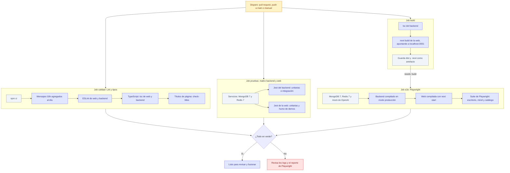

*Cuatro jobs: tres empiezan a la vez y el de punta a punta espera los compilados del build.*

| Job | Qué verifica | Falla si… |
|---|---|---|
| **Lint y tipos** | Que `apps/web/messages/_*.json` estén regenerados, ESLint, `tsc --noEmit` (incluidas las pruebas) y el formato de los títulos | Alguien cambió textos sin correr `node apps/web/scripts/merge-messages.mjs`, hay un error de tipos o un título pasa de 60 caracteres |
| **Pruebas unitarias (backend)** | Jest con MongoDB y Redis reales: corren también las pruebas de integración (permisos por rol, sistema de demos, chatbot, topes de gasto, perfil) | Una regla de negocio o de autorización cambió |
| **Pruebas unitarias (web)** | Jest con jsdom: cada demo se renderiza con los textos reales en español y se prueba el middleware de acceso | Una página lanza un error, no pinta nada o usa una clave de traducción que no existe |
| **Build** | `tsc` del backend y `next build` de la web | El código no compila |
| **E2E (Playwright)** | Solicitud → aprobación → activación → acceso → revocación, permisos, cambio de modo desde el panel, contacto, «Prueba con tu documento» con un PDF, humo de todas las páginas y demos | Un recorrido real se rompió |

Tiempos reales de la última corrida sobre `main` (8 de octubre de 2026, hora UTC; 9 minutos en total):

```mermaid
gantt
    title CI sobre main, 8 de octubre de 2026 (UTC)
    dateFormat HH:mm:ss
    axisFormat %H:%M
    section Calidad
    Lint y tipos           :a1, 22:21:07, 22:24:03
    section Pruebas
    Jest backend           :a2, 22:21:07, 22:23:59
    Jest web               :a3, 22:21:07, 22:23:35
    section Build y e2e
    Build                  :a4, 22:21:09, 22:25:05
    E2E Playwright         :a5, 22:25:07, 22:30:04
```

*La suite de punta a punta es la parte más larga (unos 5 minutos) porque espera al build.*

Los valores de entorno que usa CI (por ejemplo, los dos JWT de prueba) son ficticios y viven en el propio workflow: CI **no usa ningún secreto** de GitHub. El paso a paso con diagrama del ciclo PR → merge está en [Flujos de administración y operación › 7](Doc-14-2-Flujos-de-Administracion-y-Operacion.md#7-despliegue).

---

## 4. Variables de entorno

### 4.1 Cómo se leen

- **Web (Vercel):** *Project › Settings › Environment Variables* del proyecto `koptup`. Las `NEXT_PUBLIC_*` se copian dentro del código al compilar: después de cambiarlas hay que **redesplegar**. Las demás (solo servidor) también se leen en cada despliegue.
- **Backend (Railway):** pestaña *Variables* del servicio. Se leen al arrancar, así que cada cambio se aplica con un despliegue nuevo (Railway te pide confirmarlo).
- **Al arrancar**, el backend revisa sus variables con `apps/backend/src/config/env.ts`: en producción **no abre el puerto** si falta `MONGODB_URI` o `JWT_SECRET` y escribe `Configuración incompleta: …` en el log. Para el resto solo deja un aviso `[env] NOMBRE: …` (nunca el valor) y la función afectada se apaga o usa su valor por defecto. El diagrama de esa revisión está en [Flujos técnicos › 7.1](Doc-14-3-Flujos-Tecnicos.md#71-validación-de-variables-de-entorno).
- **Ningún secreto va en el repositorio.** Las plantillas `apps/backend/.env.example` y `apps/web/.env.example` solo tienen nombres y valores de ejemplo.

Lo que se apaga si falta cada variable importante:

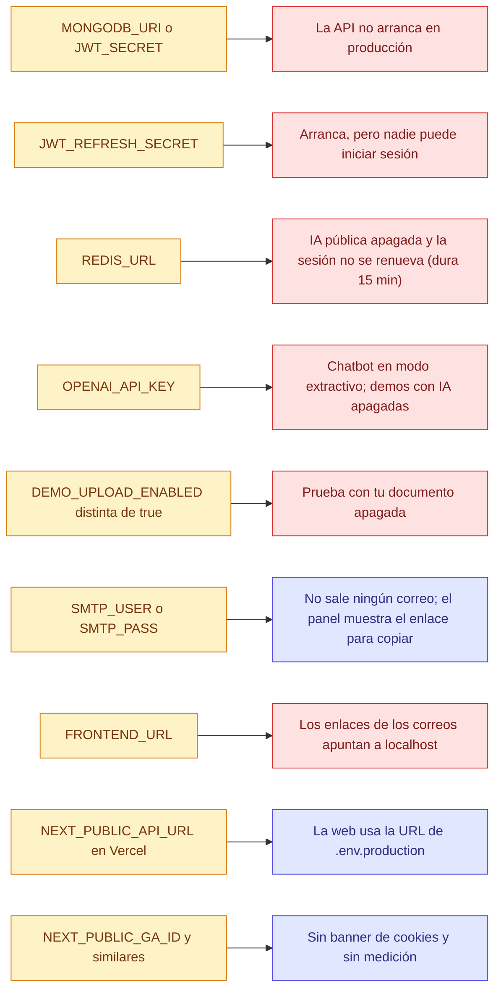

*En rojo, lo que el visitante nota; en morado, lo que tiene una alternativa.*

### 4.2 Web (Vercel)

| Variable | ¿Obligatoria? | Por defecto | Qué hace |
|---|---|---|---|
| `NEXT_PUBLIC_API_URL` | Sí en la práctica | La de `apps/web/.env.production` (la URL pública de la API en Railway); si tampoco existe, la misma URL escrita en `src/lib/backend-url.ts` | URL del backend. La usan el navegador, el middleware que protege `/admin`, `/dashboard` y las demos con acceso, y la CSP (`connect-src`). Cambiarla exige redesplegar |
| `INTERNAL_API_KEY` | Opcional (solo servidor, nunca `NEXT_PUBLIC_`) | — | Clave compartida con el backend: el middleware y el proxy de LinkedIn Ads informan la IP real del visitante. Debe ser **igual** en Vercel y en Railway |
| `NEXT_PUBLIC_GA_ID` | Opcional | — | ID de Google Analytics 4 (`G-…`). Ver [SEO, analítica y legal](Doc-12-SEO-Analitica-y-Legal.md#3-analítica) |
| `NEXT_PUBLIC_GOOGLE_ADS_ID` | Opcional | — | Etiqueta de Google Ads (`AW-…` o solo el número) |
| `NEXT_PUBLIC_LINKEDIN_PARTNER_ID` | Opcional | — | Partner ID numérico de LinkedIn Insight Tag |
| `NEXT_PUBLIC_SITE_URL` | No se usa | `https://www.koptup.com` en `.env.production` | **Sin efecto:** el dominio canónico está fijo en `src/lib/site.ts` |
| `_next_intl_trailing_slash` | Interna | `false` | La define `next.config.js` para `next-intl`. No la toques |

### 4.3 Backend (Railway)

**Imprescindibles**

| Variable | ¿Obligatoria? | Por defecto | Qué hace |
|---|---|---|---|
| `NODE_ENV` | Sí: `production` | `development` | Activa las reglas de producción: revisa las imprescindibles, limita CORS a `koptup.com`, `www.koptup.com` y `CORS_ORIGIN`, esconde `/api-docs` e ignora `DEMO_RAG_TTL_SECONDS` |
| `MONGODB_URI` | Sí (sin ella no arranca) | — | Conexión a MongoDB (`mongodb://` o `mongodb+srv://`). Si la base no responde, la API arranca igual y `GET /health` da 503 |
| `JWT_SECRET` | Sí (sin ella no arranca) | — | Firma los tokens de acceso (15 min). Largo (32 o más caracteres; si es más corto deja un aviso) y aleatorio |
| `JWT_REFRESH_SECRET` | Sí para iniciar sesión | — | Firma los tokens de renovación (7 días). Distinta de `JWT_SECRET`. Si falta, la API arranca con un aviso y el inicio de sesión falla |

**Servidor y red**

| Variable | ¿Obligatoria? | Por defecto | Qué hace |
|---|---|---|---|
| `PORT` | La pone Railway | `3001` | Puerto de la API |
| `FRONTEND_URL` | Recomendada: `https://www.koptup.com` | `http://localhost:3000` | Base de los enlaces que arma el backend: activación (`/activar/<token>`), Mis demos, restablecer contraseña, correos y regreso del login con Google. El generador de LinkedIn usa `https://www.koptup.com` si falta |
| `CORS_ORIGIN` | Opcional | — | Orígenes extra, separados por coma. En producción siempre se aceptan `https://koptup.com` y `https://www.koptup.com` |
| `TRUST_PROXY_HOPS` | Recomendada: `1` | `1` | Proxies delante de la API (Railway = 1). Define la IP real del visitante para los cupos por IP |
| `INTERNAL_API_KEY` | Opcional (igual que en Vercel) | — | Acepta la IP real que informa la web en `X-Client-IP`. Sin ella, esas peticiones cuentan con la IP de salida de Vercel |
| `API_URL` | Opcional | `http://localhost:3001` | URL que muestra `/api-docs` y base del enlace de descarga de facturas |
| `API_DOCS_ENABLED` | Opcional | `false` | `/api-docs` solo existe fuera de producción o con `true`. No la actives en el entorno público |

**Sesión, cupos y Redis**

| Variable | ¿Obligatoria? | Por defecto | Qué hace |
|---|---|---|---|
| `REDIS_URL` | Recomendada | `redis://localhost:6379` | Tokens de renovación, cupos compartidos, gasto mensual de IA y candado del job de vencimiento |
| `JWT_EXPIRES_IN` | Opcional | `15m` | Vida del token de acceso |
| `JWT_REFRESH_EXPIRES_IN` | Opcional | `7d` | Vida del token de renovación (Redis lo guarda 7 días fijos) |
| `RATE_LIMIT_WINDOW_MS` | Opcional | `900000` (15 min) | Ventana del límite general de la API |
| `RATE_LIMIT_MAX_REQUESTS` | Opcional | `100` | Peticiones por ventana, por cuenta (con sesión) o por IP |
| `AUTH_ME_RATE_LIMIT_MAX` | Opcional | `120` por minuto | Cupo de `GET /api/auth/me` y `GET /api/demo-access/<slug>`, que la web consulta en cada navegación protegida |
| `CHATBOT_RATE_LIMIT_MAX` | Opcional | `60` por minuto | Peticiones por IP a `/api/chatbot` |
| `CHATBOT_CREATE_LIMIT_PER_HOUR` | Opcional | `30` | Bots nuevos por IP cada hora en «Configura el tuyo» |

**IA y topes de gasto** (mes UTC, acumulado en Redis con los tokens que informa OpenAI)

| Variable | ¿Obligatoria? | Por defecto | Qué hace |
|---|---|---|---|
| `OPENAI_API_KEY` | Recomendada | — | Clave de OpenAI. Sin ella el chatbot responde en modo extractivo y las demás funciones con IA se apagan |
| `OPENAI_MODEL` | Opcional | `gpt-4o-mini` (gestor de contenido) y `gpt-4o` (módulos de cuentas médicas) | Modelo de esas dos funciones. El chatbot, «Prueba con tu documento» y LinkedIn no la usan |
| `ANTHROPIC_API_KEY` | Opcional | — | Interpretación con IA de reglas de facturación en la demo privada de cuentas médicas |
| `CHATBOT_MONTHLY_BUDGET_USD` | Opcional | `50` | Tope del chatbot (también cubre los asistentes de las demos de mesa de ayuda, HRMS y LMS, que usan `/api/chatbot`). Al llegar, responde en modo extractivo |
| `DEMO_MONTHLY_BUDGET_USD` | Opcional | `50` | Tope de «Prueba con tu documento». Al llegar, se apaga hasta el mes siguiente |
| `LINKEDIN_ADS_MONTHLY_BUDGET_USD` | Opcional | `20` | Tope del generador de LinkedIn Ads |
| `CONTENT_MONTHLY_BUDGET_USD` | Opcional | `20` | Tope del asistente del gestor de contenido |

Un tope con un valor inválido o negativo deja esa función en 0, es decir, apagada.

**«Prueba con tu documento»**

| Variable | ¿Obligatoria? | Por defecto | Qué hace |
|---|---|---|---|
| `DEMO_UPLOAD_ENABLED` | Para encenderla: `true` | `false` | Encendido explícito. Además necesita Redis conectado y `OPENAI_API_KEY` ([runbook 9.3](#93-encender-prueba-con-tu-documento)) |
| `DEMO_RAG_TTL_SECONDS` | **No la definas en Railway** | — | Solo pruebas locales: acorta la hora de vida de los documentos. Se ignora con `NODE_ENV=production` |

**Sistema de demos y datos personales**

| Variable | ¿Obligatoria? | Por defecto | Qué hace |
|---|---|---|---|
| `PRIVACY_POLICY_VERSION` | Opcional | `2026-10` | Versión de la política que se guarda con cada autorización (Ley 1581). Cámbiala cuando publiques una política nueva |
| `DEMO_REQUEST_LIMIT_PER_HOUR` | Opcional | `5` | Solicitudes válidas por IP cada hora en `/solicitar-demo` |
| `DEMO_REQUEST_LIMIT_PER_EMAIL_DAY` | Opcional | `3` | Solicitudes válidas por email al día |
| `DEMO_GRANTS_JOB_ENABLED` | Opcional | `true` | Job que marca los accesos vencidos y envía el recordatorio 3 días antes. `false` lo apaga en esa instancia |
| `DEMO_GRANTS_JOB_INTERVAL_MS` | Opcional | `3600000` (1 hora; mínimo `60000`) | Cada cuánto corre el job |

**Correo y WhatsApp**

| Variable | ¿Obligatoria? | Por defecto | Qué hace |
|---|---|---|---|
| `SMTP_HOST` | Opcional | `smtp.gmail.com` | Servidor de correo |
| `SMTP_PORT` | Opcional | `587` | Puerto |
| `SMTP_SECURE` | Opcional | `false` | `true` para el puerto 465 |
| `SMTP_USER`, `SMTP_PASS` | Necesarias para enviar | — | Sin las dos **no sale ningún correo** (acuse de solicitud, aprobación con enlace, recordatorio, restablecer contraseña, avisos al equipo) |
| `EMAIL_FROM` | Opcional | `KopTup <noreply@koptup.com>` | Remitente |
| `ADMIN_EMAIL` | Recomendada | Una dirección fija del código (avisos) | Destino de los avisos al equipo y cuenta que el arranque asegura como admin (si ya está registrada) |
| `WHATSAPP_PROVIDER` | Opcional | `twilio` | `twilio`, `whatsapp-business` o `ultramsg` |
| `ADMIN_WHATSAPP_NUMBER` | Para avisos por WhatsApp | — | Número que recibe los avisos. Sin él, WhatsApp queda apagado |
| `TWILIO_ACCOUNT_SID`, `TWILIO_AUTH_TOKEN`, `TWILIO_WHATSAPP_NUMBER` | Con `twilio` | — | Credenciales de Twilio |
| `WHATSAPP_API_TOKEN`, `WHATSAPP_PHONE_NUMBER_ID` | Con `whatsapp-business` | — | Credenciales de la API de WhatsApp Business |
| `ULTRAMSG_INSTANCE_ID`, `ULTRAMSG_TOKEN` | Con `ultramsg` | — | Credenciales de UltraMsg |

**Chatbot, archivos e inicio de sesión con Google**

| Variable | ¿Obligatoria? | Por defecto | Qué hace |
|---|---|---|---|
| `CHATBOT_EXAMPLE_BOT_IDS` | Opcional | — | IDs (separados por coma) de los bots que todos ven en «Configura el tuyo» |
| `CHATBOT_STATE_DIR` | Opcional | `./data/chatbots` | Carpeta del estado en disco del chatbot. En Railway el disco se borra en cada despliegue |
| `MAX_FILE_SIZE` | Opcional | `10485760` (10 MB) | Tamaño máximo de archivo en las rutas de carga generales |
| `ALLOWED_FILE_TYPES` | Opcional | `pdf,docx,txt,csv` | Extensiones aceptadas en esas rutas |
| `CUPS_IMPORT_DIR` | Opcional | `./data/imports` | Única carpeta desde la que el admin importa códigos CUPS |
| `AWS_ACCESS_KEY_ID`, `AWS_SECRET_ACCESS_KEY`, `AWS_S3_BUCKET` | Opcionales (las tres juntas) | — | Si existen, los documentos del portal se suben a S3; si no, quedan en el disco del servidor |
| `AWS_REGION` | Opcional | `us-east-1` | Región del bucket |
| `GOOGLE_CLIENT_ID`, `GOOGLE_CLIENT_SECRET` | Opcionales (las dos juntas) | — | Encienden «Continuar con Google» |
| `GOOGLE_CALLBACK_URL` | Con Google | `http://localhost:3001/api/auth/google/callback` | URL de regreso registrada en Google |

### 4.4 Solo para pruebas y desarrollo (nunca en producción)

| Variable | Dónde | Para qué |
|---|---|---|
| `OPENAI_BASE_URL` | Backend | Apunta la API al mock de OpenAI (`http://127.0.0.1:3999/v1`) |
| `SEED_ADMIN_PASSWORD`, `SEED_CLIENT_PASSWORD` | Scripts de semilla del backend | Contraseñas de las cuentas de ejemplo; si faltan, se genera una al azar |
| `MONGODB_URI_TEST`, `REDIS_URL_TEST` | Jest del backend | Base y Redis de pruebas; sin ellas se omiten las pruebas de integración |
| `E2E_BASE_URL`, `E2E_API_URL` | Playwright | Web (por defecto `http://localhost:3300`) y backend contra los que corre la suite |
| `E2E_MONGODB_URI` o `E2E_ADMIN_EMAIL` + `E2E_ADMIN_PASSWORD` | Playwright | Cómo obtener la cuenta admin de pruebas |
| `E2E_ALLOW_REMOTE`, `E2E_INCLUDE_KNOWN_ISSUES` | Playwright | Permitir un entorno no local desechable; exigir cero errores también en demos con problemas conocidos |
| `OPENAI_MOCK_PORT`, `OPENAI_MOCK_HOST`, `OPENAI_MOCK_LOG` | Mock de OpenAI | Puerto (3999), host (127.0.0.1) y archivo de registro |

---

## 5. Levantar todo en local, paso a paso

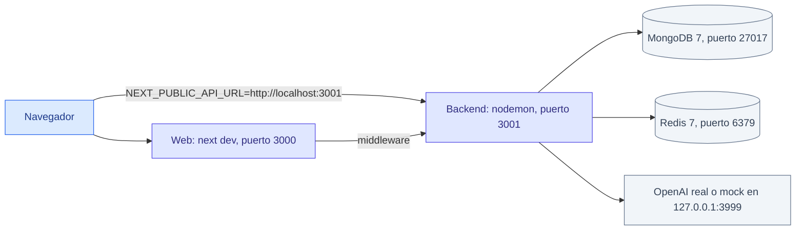

*El navegador habla con la web y también directamente con el backend; por eso la web debe saber la URL local del backend.*

**Requisitos:** Node.js 20.9 o superior, npm 9 o superior y Docker (o MongoDB y Redis instalados).

1. **Clona e instala** (desde la raíz; instala la web y el backend juntos):

   ```bash
   git clone https://github.com/ronalc90/koptup.git
   cd koptup
   NODE_ENV=development npm install
   ```

2. **Arranca MongoDB y Redis:**

   ```bash
   docker run -d --name koptup-mongo -p 27017:27017 mongo:7
   docker run -d --name koptup-redis -p 6379:6379 redis:7
   ```

   Redis es opcional para navegar, pero sin él la sesión no se renueva (dura 15 minutos) y las funciones de IA públicas se apagan. `docker-compose.dev.yml` también levanta los dos, pero crea MongoDB con usuario y contraseña: tendrías que ponerlos en `MONGODB_URI`.

3. **(Opcional) Arranca el mock de OpenAI**, si no quieres gastar en la IA real. Responde «Respuesta simulada (mock de OpenAI)…» y cita el primer fragmento que recibe:

   ```bash
   node apps/web/e2e/support/openai-mock.js        # http://127.0.0.1:3999/v1
   ```

4. **Configura el backend:** copia la plantilla y ajusta lo mínimo.

   ```bash
   cp apps/backend/.env.example apps/backend/.env
   ```

   En `apps/backend/.env`: deja `MONGODB_URI=mongodb://localhost:27017/koptup_db` y `REDIS_URL=redis://localhost:6379`; cambia `JWT_SECRET` y `JWT_REFRESH_SECRET` por dos valores largos y distintos; para la IA, pon tu `OPENAI_API_KEY` o, con el mock, `OPENAI_BASE_URL=http://127.0.0.1:3999/v1` y cualquier clave de prueba; para «Prueba con tu documento», `DEMO_UPLOAD_ENABLED=true`.

5. **Arranca el backend:**

   ```bash
   cd apps/backend && npm run dev                   # http://localhost:3001
   ```

   Comprueba `http://localhost:3001/health` (debe decir `healthy` y `mongo: connected`). En local tienes además la documentación interactiva en `http://localhost:3001/api-docs`.

6. **Configura la web:** crea `apps/web/.env.local` con una sola línea:

   ```bash
   NEXT_PUBLIC_API_URL=http://localhost:3001
   ```

   **Importante:** sin ese archivo la web en desarrollo llama a la **API de producción** (la URL escrita como respaldo en `src/lib/backend-url.ts`). No copies `apps/web/.env.example` tal cual: también apunta a producción.

7. **Arranca la web:**

   ```bash
   cd apps/web && npm run dev                       # http://localhost:3000
   ```

   El script `predev` regenera los mensajes agregados de las demos antes de arrancar.

8. **Crea tu cuenta admin:** regístrate en `http://localhost:3000/register` y dale el rol de una de estas dos formas:
   - agrega `ADMIN_EMAIL=tu-correo@ejemplo.co` en `apps/backend/.env` y reinicia el backend (nodemon no se reinicia solo por cambios en `.env`), o
   - corre el script desde `apps/backend`, pasándole la base (el script no lee `.env`):

     ```bash
     MONGODB_URI=mongodb://localhost:27017/koptup_db npx ts-node --transpile-only src/scripts/set-admin.ts tu-correo@ejemplo.co
     ```

   Cierra sesión y vuelve a entrar: el panel queda en `http://localhost:3000/admin`. El catálogo de 28 demos se siembra solo al arrancar el backend.

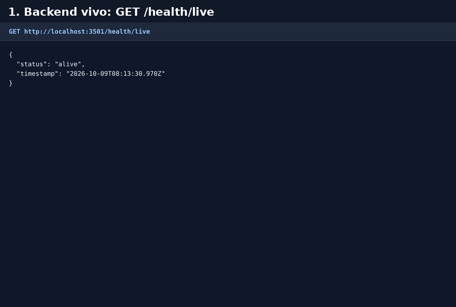

*GIF: el backend responde `/health/live` y `/health`, «Prueba con tu documento» está encendida, la web corre en local y responde con el mock de OpenAI.*

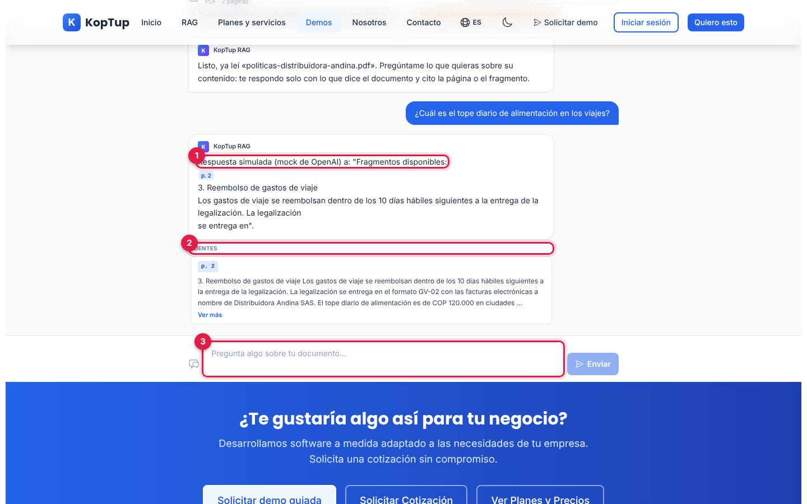

*Con el mock, la IA es simulada pero el recorrido es real: subida, fragmentos, búsqueda y cita.*

1. **Respuesta simulada:** el mock repite los fragmentos que recibió; con una clave real aquí aparece la respuesta del modelo.
2. **Fuentes:** el fragmento citado con su página, igual que en producción.
3. **Siguiente pregunta:** cada documento admite 10.

**Modo producción en local (igual que CI).** Para reproducir exactamente lo que corre en Vercel y Railway, compila y arranca con `NODE_ENV=production`. Los comandos completos, con los valores de prueba, están en el `README.md` (sección «E2E en local, paso a paso»): backend con `npm run build` y `node dist/index.js`, y web con `NEXT_PUBLIC_API_URL=http://localhost:3001 npm run build` y `npx next start -p 3000`. Así se hicieron las capturas de esta documentación (web en el puerto 3500 y backend en el 3501).

---

## 6. Pruebas: unitarias, de integración y de punta a punta

| Tipo | Dónde viven | Cuántas hay | Cómo se corren | Qué necesitan |
|---|---|---|---|---|
| **Unitarias del backend** | `apps/backend/src/__tests__/unit/`, `src/modules/*/__tests__/`, `src/services/__tests__/`, `src/utils/__tests__/` | 23 archivos | `npm test --workspace=apps/backend` | Nada |
| **Integración del backend** | `apps/backend/src/__tests__/integration/` (permisos, demos, chatbot, topes de gasto, perfil) | 5 archivos | `MONGODB_URI_TEST=mongodb://127.0.0.1:27017/koptup_test REDIS_URL_TEST=redis://127.0.0.1:6379/15 npm test --workspace=apps/backend` | MongoDB y Redis **solo de pruebas** (cada archivo crea y borra su base; se borran claves de Redis) |
| **Web** | `apps/web/src/**/*.test.ts(x)` (humo de las demos, middleware de acceso, catálogo) | 38 archivos | `npm test --workspace=apps/web` | Nada (no salen a la red) |
| **Punta a punta** | `apps/web/e2e/*.spec.ts` | 9 archivos, en escritorio, móvil (Pixel 7) y un proyecto «catalogo» | `npm run test:e2e` con la web y el backend ya levantados | MongoDB, Redis, mock de OpenAI, backend y web compilados |

Atajos desde la raíz: `npm test` (Jest de los dos), `npm run lint`, `npm run typecheck` y `npm run test:e2e`.

**Punta a punta en local, en cuatro terminales** (los valores son solo de prueba):

1. MongoDB, Redis y el mock de OpenAI (paso 2 y 3 de la [sección 5](#5-levantar-todo-en-local-paso-a-paso)).
2. Backend compilado: `npm run build --workspace=apps/backend` y luego, en `apps/backend`, `node dist/index.js` con `PORT=3001 NODE_ENV=production`, una base propia (`koptup_e2e`), los dos JWT de prueba, `CORS_ORIGIN` y `FRONTEND_URL` en `http://localhost:3000`, el mock en `OPENAI_BASE_URL`, `DEMO_UPLOAD_ENABLED=true` y `RATE_LIMIT_MAX_REQUESTS=10000` (todo sale de la misma máquina).
3. Web compilada: `NEXT_PUBLIC_API_URL=http://localhost:3001 npm run build --workspace=apps/web` y `npx next start -p 3000` en `apps/web`.
4. `npx playwright install chromium` (la primera vez) y `E2E_BASE_URL=http://localhost:3000 E2E_API_URL=http://localhost:3001 E2E_MONGODB_URI=mongodb://127.0.0.1:27017/koptup_e2e npm run test:e2e`.

La suite siembra sus propios datos por la API con emails en el dominio reservado `.test`, crea una cuenta admin con una contraseña al azar en cada corrida y **se niega a correr** contra una web o un backend que no sean locales (salvo `E2E_ALLOW_REMOTE=1`, solo para un entorno desechable). Nunca la corras contra producción: cambia el catálogo de demos. Para correr un solo archivo: `npm run test:e2e -- e2e/demo-flow.spec.ts --project=escritorio`.

---

## 7. Salud del sistema y registros

No hay monitoreo automático configurado en el repositorio. Estas son las señales disponibles:

| Señal | Dónde | Qué te dice |
|---|---|---|
| `GET /health/live` | Backend | `200 {"status":"alive"}` si el proceso responde. Es el chequeo que usa Railway al desplegar |
| `GET /health` | Backend | `200 healthy` con `mongo: connected`, o `503` si MongoDB no está conectado. Úsalo para saber si la API está **lista** |
| `GET /api/demo-rag/status` | Backend | Si «Prueba con tu documento» está encendida y por qué no (`disabled`, `unavailable`, `budget_exhausted`) |
| `GET /api/demo-catalog` | Backend | El catálogo de demos que ve la web; si falla, la web usa su tabla de respaldo |
| Registros del servicio | Railway | Cada petición (método, ruta, estado, IP y navegador), los avisos `[env]` del arranque y los errores |
| Registros del despliegue | Vercel | Errores de compilación y de las funciones del servidor de la web |

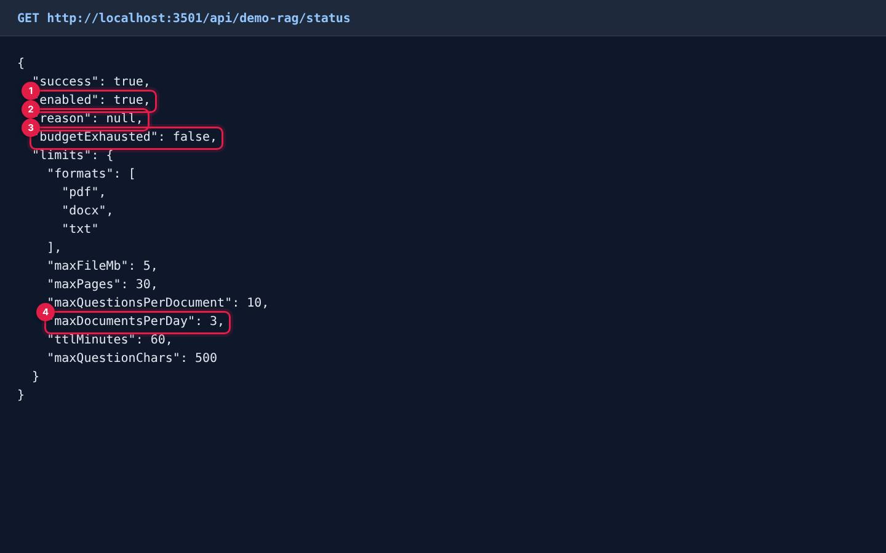

*Respuesta real de `GET /api/demo-rag/status` en el entorno local.*

1. **`enabled`:** si la función está encendida.
2. **`reason`:** por qué no lo está (`disabled`, `unavailable` o `budget_exhausted`); `null` si está encendida.
3. **`budgetExhausted`:** si se alcanzó el tope del mes (nunca muestra montos).
4. **Límites públicos:** 3 documentos por IP al día, 10 preguntas por documento, 60 minutos de vida, 5 MB y 30 páginas.

Las respuestas de `/health` y del catálogo, con capturas, están en [Arquitectura](Doc-01-Arquitectura.md#41-carga-de-una-página-pública). El backend también escribe `logs/error.log` y `logs/combined.log`, pero en Railway el disco se borra con cada despliegue: confía en los registros de la plataforma.

---

## 8. Cómo se publica esta wiki

La fuente de la wiki está versionada en `docs/wiki/` y el workflow **Publicar wiki** (`.github/workflows/wiki-sync.yml`) la copia completa a la wiki de GitHub.

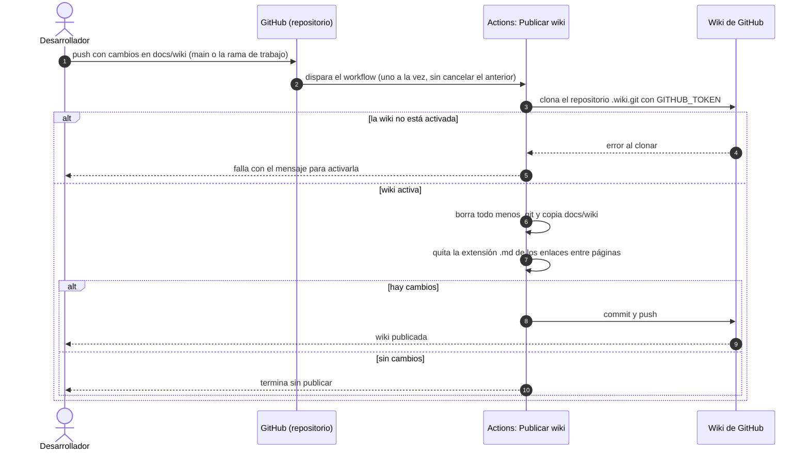

*La publicación tarda unos 15 segundos. También se puede lanzar a mano desde la pestaña Actions.*

Reglas para quien edita:

- **Edita siempre en `docs/wiki/`**, nunca en la web de la wiki: la siguiente publicación borra lo que se haya cambiado allá.
- Enlaza entre páginas con `[Texto](Nombre-Pagina.md)`; el workflow quita el `.md` al publicar. Las imágenes van en `docs/wiki/images/`.
- Valida los diagramas Mermaid antes de subir (la wiki de GitHub los dibuja; un error de sintaxis se ve como texto).
- El workflow se dispara con push a `main` **y** a la rama de trabajo `ccr-55ceecf7-dpc10i`, así que la wiki puede mostrar páginas que todavía no están en `main` (ver [Limitaciones](#10-limitaciones-conocidas)).

---

## 9. Runbooks: qué hacer cuando algo falla

Cada runbook dice el **síntoma**, la **causa probable**, los **pasos** y **cómo verificar**. Los diagramas de decisión de varios de ellos están en [Flujos de administración y operación › 9](Doc-14-2-Flujos-de-Administracion-y-Operacion.md#9-runbooks-procedimientos-ante-fallas); las pantallas del panel, en [Manual del administrador › 15](Doc-06-Manual-del-Administrador.md#15-si-algo-no-funciona).

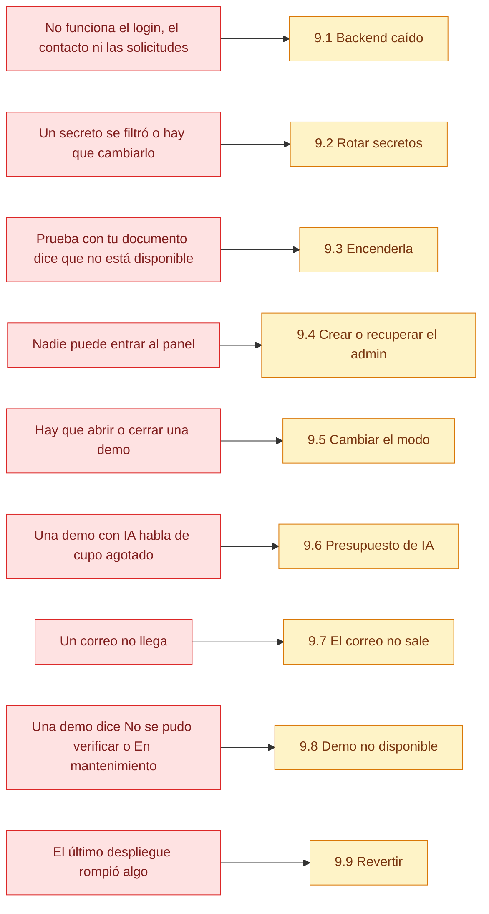

*Busca el síntoma a la izquierda y ve al runbook de la derecha.*

### 9.1 El backend está caído (situación actual)

**Síntoma.** La web pública carga, pero: el inicio de sesión falla y `/admin` devuelve al login; el formulario de contacto y `/solicitar-demo` muestran error; las demos «Con solicitud» dicen **«No se pudo verificar»** a cualquier visitante; «Prueba con tu documento» no está disponible.

**Situación al 9 de octubre de 2026.** La URL de la API configurada en la web responde `404` con este cuerpo, que es la respuesta de Railway cuando **no hay ningún servicio** detrás del dominio:

```json
{"status":"error","code":404,"message":"Application not found"}
```

**Pasos**

1. **Confirma el síntoma.** Abre en el navegador `<URL de la API>/health/live`. La URL es el valor de `NEXT_PUBLIC_API_URL` en Vercel o, si no está, el de `apps/web/.env.production`.
   - `Application not found` → sigue con el paso 2.
   - Error 5xx o no responde → ve al paso 5.
   - `{"status":"alive"}` → la API vive; ve al paso 7.
2. **Revisa el proyecto en Railway.** ¿Existe el servicio del backend? ¿Está pausado, eliminado o con la facturación vencida? ¿Cambió su dominio público (*Settings › Networking*)?
3. **Si el servicio no existe, créalo desde GitHub:**
   1. *New service › GitHub repo* con este repositorio y la rama `main`.
   2. Directorio raíz `apps/backend` (ahí está `railway.json`, que define build, arranque y chequeo de salud).
   3. Agrega un Redis al proyecto y copia su URL en `REDIS_URL`.
   4. Carga las variables de la [sección 4.3](#43-backend-railway). Mínimo: `NODE_ENV=production`, `MONGODB_URI`, `JWT_SECRET`, `JWT_REFRESH_SECRET`, `FRONTEND_URL=https://www.koptup.com`, `TRUST_PROXY_HOPS=1`, `OPENAI_API_KEY` y `ADMIN_EMAIL`. Aprovecha para usar **secretos nuevos** ([9.2](#92-rotar-secretos)).
   5. Genera un dominio público para el servicio.
4. **Si el dominio de la API cambió:** en Vercel (proyecto `koptup`, entorno *Production*) pon la nueva URL en `NEXT_PUBLIC_API_URL` y **redespliega la web** (*Deployments › ⋯ › Redeploy*). La misma variable alimenta la CSP, así que no hay que tocar código. Después actualiza también `apps/web/.env.production` en el repositorio para que no quede desalineado.
5. **Si responde 5xx o se reinicia en bucle:** abre los registros del despliegue en Railway.
   - `Configuración incompleta: MONGODB_URI, JWT_SECRET` → falta esa variable.
   - Avisos `[env] …` → no detienen el arranque, pero dicen qué función quedó apagada.
   - Otro error al arrancar justo después de un despliegue → revierte ([9.9](#99-revertir-un-despliegue)).
6. **Espera el chequeo de Railway:** el despliegue entra en servicio cuando `/health/live` responde antes de 120 segundos.
7. **Verifica de afuera hacia adentro:**
   1. `GET /health` → `200` con `mongo: connected`. Si da `503`, revisa `MONGODB_URI` y que la base acepte conexiones desde Railway.
   2. `GET /api/demo-catalog` → lista de 28 demos.
   3. En `www.koptup.com`: inicia sesión en `/admin`, envía una prueba desde `/contact` y abre `/demo/erp` sin sesión: debe mostrar «Solicitar acceso», no «No se pudo verificar».
   4. Si el navegador muestra errores de CORS, revisa que la web use `https://www.koptup.com` o agrega su dominio en `CORS_ORIGIN`.

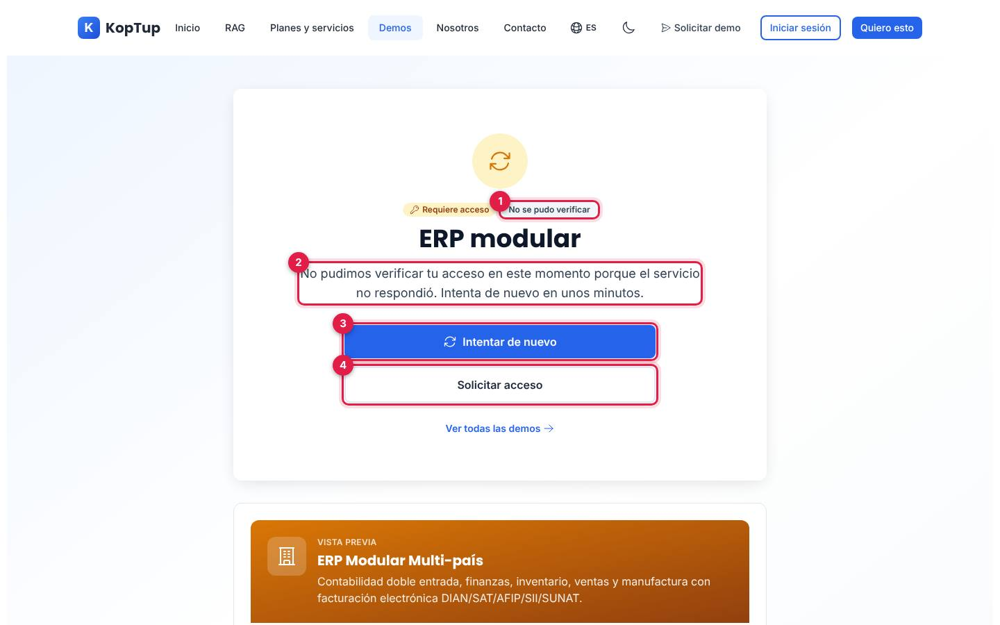

*Lo que ve hoy un visitante en cualquier demo «Con solicitud» de `www.koptup.com` (reproducido en local).*

1. **Estado** de la pantalla de acceso: «No se pudo verificar».
2. **Mensaje:** el servicio no respondió.
3. **Intentar de nuevo:** vuelve a cargar la demo.
4. **Solicitar acceso:** lleva al formulario, que también necesita la API.

### 9.2 Rotar secretos

**Cuándo.** Si un secreto pudo quedar expuesto, si se va alguien con acceso o como rutina. **Hoy es urgente** para la contraseña de MongoDB y los dos JWT, que estuvieron en archivos del repositorio público y siguen en su historial (ver [Estado y próximos pasos](15-Estado-y-Proximos-Pasos.md)).

Genera valores largos y aleatorios en tu computador, por ejemplo:

```bash
node -e "console.log(require('crypto').randomBytes(48).toString('base64url'))"
```

| Secreto | Dónde se cambia | Efecto en los usuarios |
|---|---|---|
| Contraseña de MongoDB | En el proveedor de la base y luego `MONGODB_URI` en Railway | Ninguno, si la API vuelve a arrancar bien |
| `JWT_SECRET` | Railway | Los tokens de acceso dejan de valer; la web los renueva sola con el de renovación. Nadie lo nota |
| `JWT_REFRESH_SECRET` | Railway | Nadie puede renovar: todos vuelven a iniciar sesión en máximo 15 minutos |
| `INTERNAL_API_KEY` | Vercel **y** Railway, mismo valor | Ninguno. Mientras no coincidan, los cupos por IP de esas peticiones cuentan con la IP de Vercel |
| `SMTP_PASS`, `OPENAI_API_KEY`, credenciales de WhatsApp | Revoca la vieja en el proveedor, crea una nueva y cámbiala en Railway | Ninguno |

**Pasos**

1. Cambia primero en el **proveedor** (por ejemplo, la contraseña del usuario de MongoDB o una clave nueva de OpenAI).
2. Actualiza la variable en **Railway** (y en Vercel si es `INTERNAL_API_KEY`). Usa valores distintos para los dos JWT.
3. **Redespliega** (Railway lo propone al guardar; Vercel exige *Redeploy*).
4. **Verifica:** `GET /health` en `200`, inicio de sesión en `/admin`, un correo de prueba (por ejemplo, «¿Olvidaste tu contraseña?» con tu cuenta) y una pregunta en `/demo/chatbot`.
5. **Revoca la credencial vieja** en el proveedor cuando todo funcione.

Los enlaces de activación pendientes **no** se afectan: se guardan como un hash en MongoDB y no dependen de los JWT. GitHub Actions no usa secretos propios (la wiki se publica con el `GITHUB_TOKEN` automático).

### 9.3 Encender «Prueba con tu documento»

**Síntoma.** En `/demo/chatbot`, la pestaña «Prueba con tu documento» muestra «La prueba con tu documento no está disponible en este momento» (la pantalla está en [Flujos del visitante › Paso 8](Doc-04-Flujos-del-Visitante.md#paso-8-cuándo-aparece-no-disponible)).

La función **falla cerrada**: solo se enciende si se cumplen las tres condiciones.

| Condición | Variable | Si falta, `reason` dice |
|---|---|---|
| Encendido explícito | `DEMO_UPLOAD_ENABLED=true` | `disabled` |
| Redis conectado | `REDIS_URL` | `unavailable` |
| Clave de OpenAI | `OPENAI_API_KEY` | `unavailable` |
| Presupuesto disponible este mes | `DEMO_MONTHLY_BUDGET_USD` (50 por defecto) | `budget_exhausted` |

**Pasos**

1. Consulta `GET <URL de la API>/api/demo-rag/status` y lee `reason`.
2. En Railway, define lo que falte: `DEMO_UPLOAD_ENABLED=true`, `REDIS_URL` (Redis del proyecto) y `OPENAI_API_KEY`. Recomendadas: `TRUST_PROXY_HOPS=1` (cupo de 3 documentos por IP al día), `MONGODB_URI` (guarda el email como lead con origen `demo-rag`) y, si quieres, `DEMO_MONTHLY_BUDGET_USD`.
3. Redespliega la API.
4. **Verifica:** `status` debe responder `"enabled": true` y `"reason": null` (captura de la [sección 7](#7-salud-del-sistema-y-registros)). Luego sube un PDF corto en `/demo/chatbot?mode=upload` y haz una pregunta.

**Para apagarla**, pon `DEMO_UPLOAD_ENABLED=false` (o bórrala) y redespliega. La demo con los documentos de ejemplo sigue funcionando.

### 9.4 Crear o recuperar el admin

Hay tres vías para dar el rol `admin` y ninguna se puede hacer desde fuera del sistema: la API no deja que nadie se asigne ese rol.

| Vía | Cuándo usarla | Cómo |
|---|---|---|
| `ADMIN_EMAIL` | Primer admin o recuperar el rol | Variable en Railway; en **cada arranque** la API asegura el rol admin de esa cuenta (si ya está registrada) |
| Script `set-admin` | Dar el rol a otra cuenta sin redesplegar | `railway run npx ts-node --transpile-only src/scripts/set-admin.ts <email>` desde `apps/backend` (Railway inyecta `MONGODB_URI`) |
| Admin › Usuarios | Ya tienes un admin | Cambia el rol en el panel ([Manual del administrador › 7](Doc-06-Manual-del-Administrador.md#7-usuarios-y-roles)) |

`railway run` ejecuta el comando **en tu computador** con las variables del servicio: necesitas la CLI de Railway, haber corrido `npm install` y que la base de datos acepte conexiones desde tu red.

**Crear el primer admin**

1. Registra la cuenta en `https://www.koptup.com/register` (o usa una que ya exista).
2. Pon su email en `ADMIN_EMAIL` en Railway y redespliega. En el registro del arranque debe aparecer «Rol admin asegurado para ADMIN_EMAIL»; si dice «ADMIN_EMAIL no corresponde a ningún usuario registrado», la cuenta no existe todavía.
3. Cierra sesión y vuelve a entrar: el panel decide qué mostrar con el rol guardado al iniciar sesión.

**Olvidaste la contraseña**

1. Usa «¿Olvidaste tu contraseña?» en `/login`. Llega un enlace que vale **1 hora** y sirve una sola vez. Necesita SMTP ([9.7](#97-el-correo-no-sale)).
2. Si el correo no está configurado, el enlace no llega y no hay forma de verlo en el panel: registra otra cuenta y conviértela en admin con `ADMIN_EMAIL` o con el script. Desde ella puedes seguir operando.
3. Las cuentas creadas con Google no tienen contraseña: entra con «Continuar con Google» (requiere `GOOGLE_CLIENT_ID` y `GOOGLE_CLIENT_SECRET`).

**Alguien le quitó el rol a la cuenta de `ADMIN_EMAIL`:** se recupera solo en el siguiente arranque o despliegue de la API.

### 9.5 Cambiar el modo de una demo

**Cuándo.** Quieres que una demo sea abierta, que pida acceso o que sea solo por invitación, o apagarla («En mantenimiento»).

1. Entra con una cuenta **admin** (los demás roles ven el catálogo en modo consulta) a **Admin › Catálogo de demos** (`/admin/catalogo-demos`).
2. En la fila de la demo, elige el modo (**Abierta**, **Requiere acceso** o **Solo por invitación**) o apaga **Activa**.
3. Pulsa **Guardar** en esa fila. El cambio queda en la bitácora con tu usuario.
4. **Espera hasta un minuto:** la web guarda el catálogo en memoria 60 segundos.
5. **Verifica** en una ventana privada: abre `/demo/<slug>`. Debe abrir la demo (Abierta), mostrar el candado (Requiere acceso o Solo por invitación) o «En mantenimiento» (apagada).

No hace falta desplegar: el modo vive en MongoDB. Ten en cuenta que el **chatbot RAG** es fijo (siempre abierto y activo), que los accesos ya concedidos se respetan y que **el sitemap no cambia** (lista las demos abiertas según la semilla del código, no el catálogo; ver [SEO](Doc-12-SEO-Analitica-y-Legal.md#23-sitemap-y-robots)). El paso a paso con capturas y GIF está en [Manual del administrador › 6](Doc-06-Manual-del-Administrador.md#6-catálogo-de-demos).

### 9.6 Se agotó el presupuesto de IA

**Síntoma.** Según la función: el chatbot responde en **modo extractivo** y lo dice; «Prueba con tu documento» muestra «Alcanzamos el cupo de pruebas de este mes»; LinkedIn Ads y el gestor de contenido dicen que la IA no está disponible.

| Función | Variable del tope | Por defecto | Clave en Redis |
|---|---|---|---|
| Chatbot y asistentes de mesa de ayuda, HRMS y LMS | `CHATBOT_MONTHLY_BUDGET_USD` | 50 USD | `chatbot:spend:AAAA-MM` |
| «Prueba con tu documento» | `DEMO_MONTHLY_BUDGET_USD` | 50 USD | `demo-rag:spend:AAAA-MM` |
| Generador de LinkedIn Ads | `LINKEDIN_ADS_MONTHLY_BUDGET_USD` | 20 USD | `linkedin-ads:spend:AAAA-MM` |
| Gestor de contenido | `CONTENT_MONTHLY_BUDGET_USD` | 20 USD | `content:spend:AAAA-MM` |

**Pasos**

1. **Confirma que es el cupo y no otra cosa.** Para la demo con documento, `GET /api/demo-rag/status` dice `budget_exhausted`. Si el mensaje habla de «no disponible», revisa primero `OPENAI_API_KEY` y `REDIS_URL`: sin Redis no se puede medir el gasto y la IA se apaga.
2. **Revisa el gasto real** en la cuenta de OpenAI (el panel de KopTup no lo muestra) y, si quieres el número exacto del sistema, la clave del mes en Redis.
3. **Decide:**
   - **Subir el tope:** cambia la variable en Railway (un número en dólares) y redespliega. Asegúrate de que la cuenta de OpenAI tenga saldo y límites suficientes.
   - **Esperar:** el contador se reinicia el día 1 del mes UTC (7:00 p. m. del último día del mes, hora de Colombia).
4. **Verifica** con una pregunta en la demo afectada.

Un valor inválido o negativo en la variable deja la función en 0, es decir, apagada.

### 9.7 El correo no sale

**Síntoma.** A un prospecto no le llega el acuse, la aprobación con su enlace, el recordatorio de vencimiento o el enlace para restablecer la contraseña; o al equipo no le llegan los avisos de solicitudes y contactos.

**Mientras tanto** el negocio sigue: cada aprobación o acceso concedido muestra el enlace de activación para **copiarlo** o **enviarlo por WhatsApp** ([Manual del administrador › 4.4](Doc-06-Manual-del-Administrador.md#44-copiar-el-enlace-y-enviarlo-por-whatsapp)). Ninguna acción del panel falla por el correo.

**Pasos**

1. **Mira qué dice el panel junto al enlace** (estado del correo en el detalle de la solicitud o del acceso):
   - «No está configurado» → faltan `SMTP_USER` o `SMTP_PASS`.
   - «No se pudo enviar» → busca `Email … error` en los registros de Railway: si es de autenticación, revisa usuario y contraseña de aplicación; si es de conexión, `SMTP_HOST`, `SMTP_PORT` y `SMTP_SECURE` (465 con `true`, 587 con `false`).
   - «Se envió» → el servidor lo entregó: pide revisar spam y que el email esté bien escrito.
2. **Configura el SMTP en Railway:** `SMTP_HOST`, `SMTP_PORT`, `SMTP_SECURE`, `SMTP_USER`, `SMTP_PASS` y `EMAIL_FROM`. Sin `SMTP_HOST` se usa el servidor de Gmail.
3. **Revisa `FRONTEND_URL`:** si un correo llega con un enlace a `localhost`, falta `https://www.koptup.com`.
4. **Avisos al equipo:** van a `ADMIN_EMAIL` y, por WhatsApp, a `ADMIN_WHATSAPP_NUMBER` con las variables del proveedor elegido.
5. **Recordatorios de vencimiento:** además del SMTP, el job debe estar encendido (`DEMO_GRANTS_JOB_ENABLED` distinto de `false`); corre cada hora y avisa 3 días antes.
6. **Redespliega** y prueba con «¿Olvidaste tu contraseña?» usando tu cuenta.

El aviso de arranque `[env] SMTP_HOST: no está definida` puede confundir: lo que decide si sale correo son `SMTP_USER` y `SMTP_PASS`.

### 9.8 Una demo muestra «No se pudo verificar» o «En mantenimiento»

Son dos estados de la pantalla de acceso de las demos (`/demo-acceso`). Los demás estados («Sin sesión», «Sin acceso», «Acceso vencido», «Acceso retirado») los resuelve el equipo desde el panel: ver [Flujos de administración › 9.3](Doc-14-2-Flujos-de-Administracion-y-Operacion.md#93-una-demo-sigue-bloqueada).

| Lo que ve la persona | Causa | Qué hacer |
|---|---|---|
| **«No se pudo verificar»** («No pudimos verificar tu acceso en este momento porque el servicio no respondió») | La web no obtuvo respuesta del backend al consultar el catálogo o el acceso (caído, lento más allá del tiempo de espera o con error) | Es el [runbook 9.1](#91-el-backend-está-caído-situación-actual). Cuando la API vuelve, la web reintenta el catálogo cada 10 segundos: la persona pulsa **Intentar de nuevo** |
| **«En mantenimiento»** | La demo está **desactivada** en el catálogo | Si fue a propósito, nada. Si no, enciende **Activa** en Admin › Catálogo de demos ([9.5](#95-cambiar-el-modo-de-una-demo)) y espera hasta un minuto |
| **«La prueba con tu documento no está disponible en este momento»** | Función apagada, sin Redis u OpenAI, o sin presupuesto | [Runbook 9.3](#93-encender-prueba-con-tu-documento) o [9.6](#96-se-agotó-el-presupuesto-de-ia) |

Mientras el backend no responde, las demos **abiertas** siguen funcionando con sus datos de ejemplo: la web usa una tabla de respaldo con el modo de cada demo. Las que tienen IA real no responden.

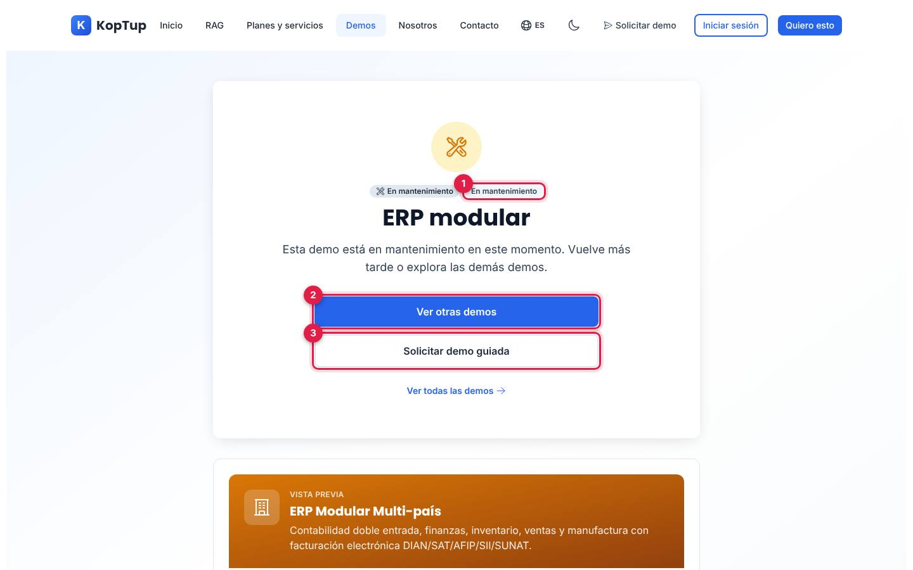

*Una demo desactivada desde el catálogo.*

1. **Estado** «En mantenimiento».
2. **Ver otras demos:** vuelve al catálogo.
3. **Solicitar demo guiada:** abre el formulario con esa demo elegida.

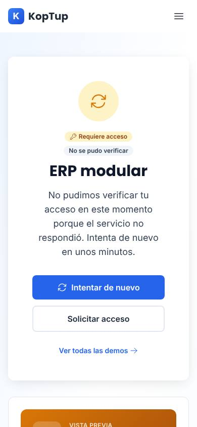

*La misma pantalla en un celular (390 × 844).*

### 9.9 Revertir un despliegue

**Cuándo.** Un despliegue nuevo rompió algo y necesitas volver atrás ya.

**Web (Vercel), en minutos**

1. Abre el proyecto `koptup` en Vercel › **Deployments** y filtra por *Production*.
2. Ubica el último despliegue de producción que funcionaba (cada uno muestra el commit y el mensaje del merge).
3. En su menú elige **Instant Rollback** (o **Promote to Production**). El dominio pasa a ese despliegue sin volver a compilar.
4. **Verifica** `www.koptup.com` y la página que fallaba.
5. **Importante:** el siguiente push a `main` vuelve a desplegar el código con el error. Corrígelo en `main` (siguiente sección) antes de fusionar otra cosa.

Si la causa fue una **variable** y no el código, restáurala en Vercel y redespliega: un rollback no cambia variables, y las `NEXT_PUBLIC_*` quedan fijas en el despliegue al que vuelves.

**API (Railway)**

1. En el servicio del backend › **Deployments**, elige el despliegue anterior y usa **Redeploy** (o *Rollback*).
2. Espera el chequeo `/health/live` y verifica `GET /health`.

**Corregir `main` (definitivo)**

1. Crea una rama y ejecuta `git revert -m 1 <commit del merge>`.
2. Abre un PR, espera CI en verde y fusiona. Vercel y Railway despliegan el código revertido.
3. Si el cambio había escrito datos en MongoDB, revísalos a mano: revertir el código no deshace datos (no hay migraciones automáticas; el catálogo de demos solo agrega lo que falta al arrancar).

El diagrama de este procedimiento está en [Flujos de administración › 9.6](Doc-14-2-Flujos-de-Administracion-y-Operacion.md#96-revertir-un-despliegue).

---

## 10. Limitaciones conocidas

| # | Qué pasa | Efecto |
|---|---|---|
| 1 | **El backend de producción no responde** («Application not found» de Railway) | Todo lo que necesita la API falla en `www.koptup.com` ([9.1](#91-el-backend-está-caído-situación-actual)) |
| 2 | **CI no protege `main`:** GitHub no exige CI en verde y Vercel y Railway no esperan a CI | Un merge con pruebas en rojo llega a producción |
| 3 | **Dos proyectos de Vercel construyen el mismo repositorio:** `koptup` (con los dominios) y `koptup-web` (sin dominio propio). Los dos despliegan cada push a `main` | Doble compilación y riesgo de cambiar una variable en el proyecto equivocado: el que sirve `www.koptup.com` es `koptup` |
| 4 | **La wiki también se publica desde la rama de trabajo** `ccr-55ceecf7-dpc10i` | La wiki puede adelantarse a `main` |
| 5 | **Sin `apps/web/.env.local`, la web en desarrollo usa la API de producción** (respaldo escrito en `src/lib/backend-url.ts`), y `apps/web/.env.example` también apunta a producción | Un desarrollador nuevo puede probar contra producción sin darse cuenta |
| 6 | **Plantillas y guías viejas:** `.env.example` de la raíz habla de PostgreSQL; `SETUP.md` usa `MONGO_URI` (el código lee `MONGODB_URI`); `docker-compose.yml` apunta a un `apps/backend/Dockerfile` que no existe y el `Dockerfile` de la web usa Node 18 | Siguiendo esas guías el sistema no arranca. Usa esta página o el `README.md` |
| 7 | **`.env.example` del backend y el `README.md` dicen que sin `JWT_REFRESH_SECRET` no arranca**; el código arranca con un aviso | Un despliegue sin ella parece sano y nadie puede iniciar sesión |
| 8 | **El arranque no revisa** `DEMO_UPLOAD_ENABLED`, `INTERNAL_API_KEY`, `SMTP_USER` ni `SMTP_PASS`, y avisa por `SMTP_HOST`, que no es la que decide | Funciones apagadas sin aviso, o un aviso que no corresponde |
| 9 | **El chequeo de Railway (`/health/live`) no mira la base** | Un despliegue sin MongoDB queda «sano» mientras `/health` responde 503 |
| 10 | **`NEXT_PUBLIC_SITE_URL` no tiene efecto** y `JWT_REFRESH_EXPIRES_IN` mayor a 7 días tampoco (Redis guarda la renovación 7 días fijos) | Variables que parecen configurar algo y no lo hacen |
| 11 | **Disco efímero en Railway:** el estado del chatbot (`data/chatbots`), los archivos subidos sin S3 y los `logs/` se borran en cada despliegue | Bots creados en «Configura el tuyo» y su historial se pierden al desplegar |
| 12 | **No hay monitoreo ni alertas** configurados | Una caída se descubre a mano, como la actual |
| 13 | **Sin forma de restablecer la contraseña de otra cuenta** desde el panel, y sin SMTP no llega el enlace de recuperación | Recuperar el acceso exige crear otra cuenta y darle el rol ([9.4](#94-crear-o-recuperar-el-admin)) |
| 14 | **En la pantalla de una demo desactivada las dos etiquetas dicen «En mantenimiento»** (la del modo y la del estado) | Detalle visual repetido |

---

## 11. Para desarrolladores: archivos clave

| Tema | Archivo |
|---|---|
| CI | `.github/workflows/ci.yml` |
| Publicación de la wiki | `.github/workflows/wiki-sync.yml` |
| Despliegue de la API | `apps/backend/railway.json`, `apps/backend/Procfile`, `apps/backend/package.json` (`build`, `start`, `engines`) |
| Despliegue de la web | `apps/web/vercel.json`, `apps/web/.env.production`, `apps/web/next.config.js` (CSP y cabeceras) |
| Validación de variables | `apps/backend/src/config/env.ts` |
| Arranque | `apps/backend/src/index.ts` (orden de arranque, `ADMIN_EMAIL`, semilla del catálogo, job) |
| Salud | `apps/backend/src/app.ts` (`/health/live`, `/health`, CORS) |
| URL del backend en la web | `apps/web/src/lib/backend-url.ts` |
| Topes de IA | `apps/backend/src/services/ai-budget.service.ts` |
| «Prueba con tu documento» | `apps/backend/src/services/demo-rag.service.ts`, `apps/backend/src/routes/demo-rag.routes.ts` |
| Correo y WhatsApp | `apps/backend/src/services/email.service.ts`, `apps/backend/src/services/whatsapp.service.ts` |
| Dar el rol admin | `apps/backend/src/scripts/set-admin.ts`, `apps/backend/ADMIN_SETUP.md` |
| Plantillas de variables | `apps/backend/.env.example`, `apps/web/.env.example` |
| Pruebas | `apps/backend/jest.config.js`, `apps/web/jest.config.js`, `apps/web/playwright.config.ts`, `apps/web/e2e/` |
| Mock de OpenAI | `apps/web/e2e/support/openai-mock.js` |

---

## 12. Páginas relacionadas

- [Arquitectura](Doc-01-Arquitectura.md): las piezas y cómo se hablan.
- [Flujos de administración y operación](Doc-14-2-Flujos-de-Administracion-y-Operacion.md): diagramas de despliegue, publicación de la wiki y runbooks.
- [Flujos técnicos](Doc-14-3-Flujos-Tecnicos.md): validación de variables, arranque y salud.
- [Manual del administrador](Doc-06-Manual-del-Administrador.md): las acciones del panel con capturas.
- [SEO, analítica y legal](Doc-12-SEO-Analitica-y-Legal.md): variables de medición y datos personales.
- [API](Doc-08-API.md) · [Roles y permisos](Doc-10-Roles-y-Permisos.md) · [Glosario y preguntas](Doc-13-Glosario-y-Preguntas.md)
- [Estado y próximos pasos](15-Estado-y-Proximos-Pasos.md): acciones pendientes del dueño. Plan original: [Backend y API](09-Backend-y-API.md) y [Seguridad y calidad](10-Seguridad-y-Calidad.md).
