# SEO, analítica y legal

> **Resumen.** El sitio está preparado para buscadores: cada página tiene su título con la plantilla «… | KopTup», una URL canónica en `https://www.koptup.com`, datos estructurados (JSON-LD) y una imagen para redes; `sitemap.xml` y `robots.txt` dicen qué indexar y qué no. La **analítica** (Google Analytics 4, Google Ads y LinkedIn) está programada pero **hoy no está activa en producción**: depende de tres variables de Vercel y del consentimiento del visitante. En lo **legal**, los formularios que piden datos exigen la autorización de la **Ley 1581 de 2012** y la solicitud de demo guarda la prueba con la versión de la política; hay páginas de privacidad, términos y cookies, y un banner de cookies.
>
> Esta página describe lo que hace el código de `main`; no es asesoría legal.

## Índice

1. [Vista general](#1-vista-general)
2. [SEO](#2-seo)
3. [Analítica](#3-analítica)
4. [Legal](#4-legal)
5. [Limitaciones conocidas](#5-limitaciones-conocidas)
6. [Para desarrolladores: archivos clave](#6-para-desarrolladores-archivos-clave)
7. [Páginas relacionadas](#7-páginas-relacionadas)

---

## 1. Vista general

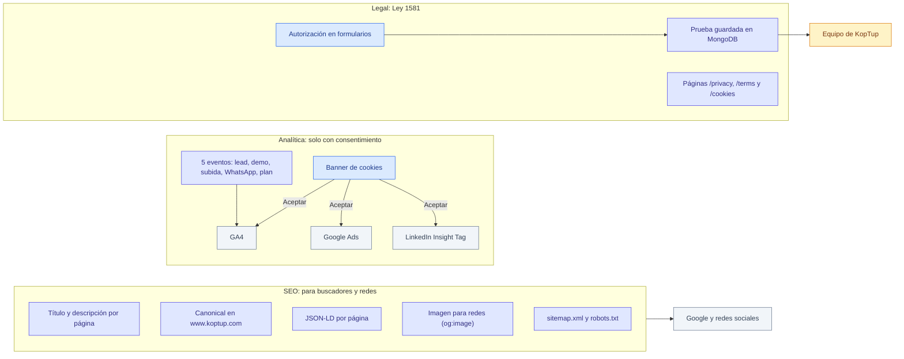

*Tres frentes independientes: lo que ven los buscadores, lo que se mide (si el visitante acepta) y lo que se guarda de cada persona.*

---

## 2. SEO

### 2.1 Títulos y descripciones

- **Plantilla:** `"<título de la página> | KopTup"`, con un máximo de **60 caracteres** contando el sufijo. La única excepción es el inicio, que pone la marca primero: **«KopTup | IA que responde con los documentos de tu empresa»**.
- **Dónde se definen:** `apps/web/src/lib/seo-config.ts` tiene el título, la descripción, la canonical y la imagen de cada página; cada `layout.tsx` o `page.tsx` las aplica con `generateMetadata('<clave>')`.
- **Control automático:** `node apps/web/scripts/check-titles.mjs` simula cómo Next arma cada título y falla si alguno pasa de 60 caracteres o repite la marca. Corre en CI ([Operación y despliegue › 3](Doc-11-Operacion-y-Despliegue.md#3-integración-continua-ci)).
- No se usa la meta `keywords` (Google la ignora).

Títulos reales de las páginas principales (leídos del HTML que entrega el sitio):

| Ruta | `<title>` | Robots |
|---|---|---|
| `/` | KopTup \| IA que responde con los documentos de tu empresa | index, follow |
| `/rag` | Sistemas RAG para empresas en Colombia \| KopTup | index, follow |
| `/rag/salud` | RAG para salud: protocolos, normativa y auditoría \| KopTup | index, follow |
| `/rag/legal` | Buscar en contratos con IA: RAG para áreas legales \| KopTup | index, follow |
| `/rag/soporte` | Asistente IA para manuales internos y soporte \| KopTup | index, follow |
| `/services` | Precios de sistemas RAG y software a medida \| KopTup | index, follow |
| `/chatbots-ia` | Chatbots RAG para WhatsApp y web \| KopTup | index, follow |
| `/soluciones-ia` | Soluciones de Inteligencia Artificial para Empresas \| KopTup | index, follow |
| `/desarrollo-web-colombia` | Desarrollo Web y Software a Medida en Colombia \| KopTup | index, follow |
| `/demo` | Prototipos Interactivos: Prueba Antes de Contratar \| KopTup | index, follow |
| `/demo/chatbot` | Demo RAG: prueba con tu documento \| KopTup | index, follow |
| `/solicitar-demo` | Solicitar una demo guiada \| KopTup | index, follow |
| `/contact` | Contacto: Solicita tu Cotización Gratis \| KopTup | index, follow |
| `/about` | Sobre Nosotros: Empresa de Software en Bogotá \| KopTup | index, follow |
| `/privacy`, `/terms`, `/cookies` | Política de Privacidad / Términos y Condiciones / Política de Cookies \| KopTup | index, follow |
| `/bienvenido-producthunt` | Product Hunt: Software a Medida con Demos \| KopTup | **noindex**, follow |
| `/demo-acceso/<demo>` | «<demo>: acceso \| KopTup» | **noindex**, nofollow |

### 2.2 Dominio canónico

- El dominio canónico es **`https://www.koptup.com`** (con www). Está fijo en `apps/web/src/lib/site.ts` (`SITE_URL`) y de ahí salen la canonical, `og:url`, el JSON-LD, el sitemap y los enlaces que generan las demos.
- `https://koptup.com/` responde con una redirección permanente (308) a `https://www.koptup.com/`.
- Cada página de contenido declara su propia canonical (por ejemplo `https://www.koptup.com/rag/salud`). `/pricing` redirige (307) a `/services#planes-rag` y su canonical es `/services`.
- **Idiomas:** español e inglés comparten la misma URL (el idioma va en la cookie `locale`), así que no hay `hreflang`. Google ve el español, que es el idioma por defecto.

### 2.3 Sitemap y robots

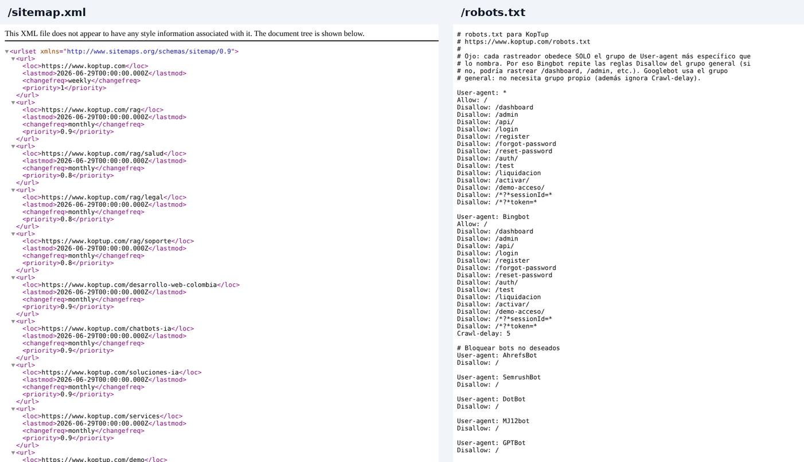

*A la izquierda, el inicio de `/sitemap.xml`; a la derecha, `/robots.txt`.*

**`/sitemap.xml`** lo genera `apps/web/src/app/sitemap.ts` y tiene **34 URL**:

| Grupo | URL | Prioridad |
|---|---|---|
| Inicio | `/` | 1.0 |
| RAG | `/rag` y `/rag/salud`, `/rag/legal`, `/rag/soporte` | 0.9 y 0.8 |
| Landings y servicios | `/desarrollo-web-colombia`, `/chatbots-ia`, `/soluciones-ia`, `/services`, `/demo` | 0.9 |
| Conversión | `/solicitar-demo`, `/contact` | 0.8 |
| Empresa | `/about` | 0.7 |
| Legal | `/privacy`, `/terms` (0.3) y `/cookies` (0.2) | 0.3 y 0.2 |
| Demos | Las **18 demos abiertas** según la semilla: `/demo/chatbot`, `/demo/ecommerce`, `/demo/crm-ia`… | 0.8 |

- La fecha de modificación es fija (`2026-06-29`) para no marcar todo el sitio como «cambiado hoy» en cada despliegue.
- Las demos «Con solicitud» o «Solo por invitación» **no** se listan: a quien no tiene acceso le muestran una pantalla `noindex`. Ojo: la lista sale de la **tabla de respaldo del código**, no del catálogo que edita el admin (ver [Limitaciones](#5-limitaciones-conocidas)).

**`/robots.txt`** (`apps/web/public/robots.txt`) permite todo menos las zonas privadas o con datos de sesión: `/dashboard`, `/admin`, `/api/`, `/login`, `/register`, `/forgot-password`, `/reset-password`, `/auth/`, `/test`, `/liquidacion`, `/activar/`, `/demo-acceso/` y cualquier URL con `token=` o `sessionId=`. Bingbot repite esas reglas con `Crawl-delay: 5`; AhrefsBot, SemrushBot, DotBot, MJ12bot, GPTBot y CCBot están bloqueados por completo. Al final declara el sitemap con www.

### 2.4 Qué no se indexa

Tres mecanismos, del más fuerte al más débil:

| Mecanismo | Dónde | Páginas |
|---|---|---|
| Cabecera `X-Robots-Tag: noindex` (y `no-store`) | Middleware de la web | Todo `/admin` y `/dashboard`, y cada demo con acceso controlado (o su pantalla de acceso) |
| Meta `robots: noindex` | Metadatos de la página | `/activar/<token>`, `/demo-acceso/<demo>`, `/bienvenido-producthunt`, `/demo/cuentas-medicas`, `/demo/sistema-experto`, `/demo/lms/verificar`, `/embed/*`, `/test` y la página 404 |
| `Disallow` en `robots.txt` | `public/robots.txt` | La lista de la sección 2.3 |

### 2.5 Datos estructurados (JSON-LD)

Los buscadores leen estos bloques para entender quién es KopTup, qué vende y cuáles son las preguntas frecuentes. Tipos por página (leídos del HTML del sitio):

| Página | Tipos de schema.org | Dónde se arma |
|---|---|---|
| `/` | `Organization`, `WebSite`, `SoftwareApplication`, `LocalBusiness`, `FAQPage` | `components/seo/StructuredData.tsx` |
| `/rag` | `BreadcrumbList`, `Service` (con los planes como ofertas), `FAQPage` | `lib/rag-plans-jsonld.ts`, `lib/rag-page-jsonld.ts` |
| `/rag/salud`, `/rag/legal`, `/rag/soporte` | `BreadcrumbList` | Página de cada sector |
| `/services` | `BreadcrumbList`, `ProfessionalService`, `Service` | `app/services/layout.tsx` |
| `/chatbots-ia` | `BreadcrumbList`, `Service`, `FAQPage` | `lib/chatbots-page-jsonld.ts` |
| `/soluciones-ia` | `BreadcrumbList`, `Service`, `FAQPage` | `lib/ai-solutions-page-jsonld.ts` |
| `/desarrollo-web-colombia` | `BreadcrumbList`, `ProfessionalService`, `FAQPage` | `app/desarrollo-web-colombia/layout.tsx` |
| Cada demo abierta (`/demo/<demo>`) | `BreadcrumbList` | `layout.tsx` de cada demo |
| `/solicitar-demo`, `/contact`, `/about`, `/privacy`, `/terms`, `/cookies` | `BreadcrumbList` | `layout.tsx` de cada ruta |
| `/demo` y `/bienvenido-producthunt` | Ninguno | — |

Los precios que aparecen en el JSON-LD salen del mismo archivo que los precios visibles (`lib/rag-plans.ts`), así que no se desalinean.

### 2.6 Imágenes para redes (Open Graph)

| Imagen | Qué es | Páginas que la usan |
|---|---|---|
| `/opengraph-image` | Se genera con código (`app/opengraph-image.tsx`), 1200 × 630, con el mensaje RAG | Inicio, `/rag` y sus tres sectores, `/services`, `/chatbots-ia`, `/soluciones-ia` y `/demo/chatbot` (los destinos de los anuncios) |
| `/og-image.png` | Imagen fija en `public/` | Todas las demás páginas con `generateMetadata` |

Twitter usa la tarjeta `summary_large_image` con la misma imagen. La imagen generada se ve en [Mapa del sitio](Doc-02-Mapa-del-Sitio.md).

### 2.7 Otros archivos para buscadores e IA

- **`/llms.txt`**: resumen en texto de quién es KopTup y qué vende, pensado para asistentes de IA. Es un archivo fijo de `public/`: si cambia el dominio o la oferta, hay que editarlo a mano.
- **Verificación de Google Search Console:** dos códigos en los metadatos del layout raíz y un archivo `google….html` en `public/`.
- **`manifest.json`** e íconos para instalar el sitio en el celular.

---

## 3. Analítica

### 3.1 Estado hoy

**En producción no se mide nada.** Al revisar `www.koptup.com` el 9 de octubre de 2026 el HTML no carga ninguna etiqueta de Google ni de LinkedIn, y por eso **tampoco aparece el banner de cookies**: el código solo lo muestra si hay al menos una etiqueta configurada. Para encender la medición, sigue la [sección 3.6](#36-cómo-activarla).

### 3.2 Las tres etiquetas

| Etiqueta | Variable en Vercel | Formato | Categoría de cookies que exige | Qué carga |
|---|---|---|---|---|
| Google Analytics 4 | `NEXT_PUBLIC_GA_ID` | `G-XXXXXXXXXX` | Analítica | `gtag.js` y `config` de GA4 |
| Google Ads | `NEXT_PUBLIC_GOOGLE_ADS_ID` | `AW-XXXXXXXXX` o solo el número | Marketing | `gtag.js` y `config` de Ads (vinculador de conversiones y remarketing) |
| LinkedIn Insight Tag | `NEXT_PUBLIC_LINKEDIN_PARTNER_ID` | Número | Marketing | `insight.min.js` |

Un ID con otro formato se ignora (la etiqueta no se carga). La CSP de `next.config.js` solo abre los dominios de Google o de LinkedIn si su variable existe en ese build.

### 3.3 Cuándo cargan

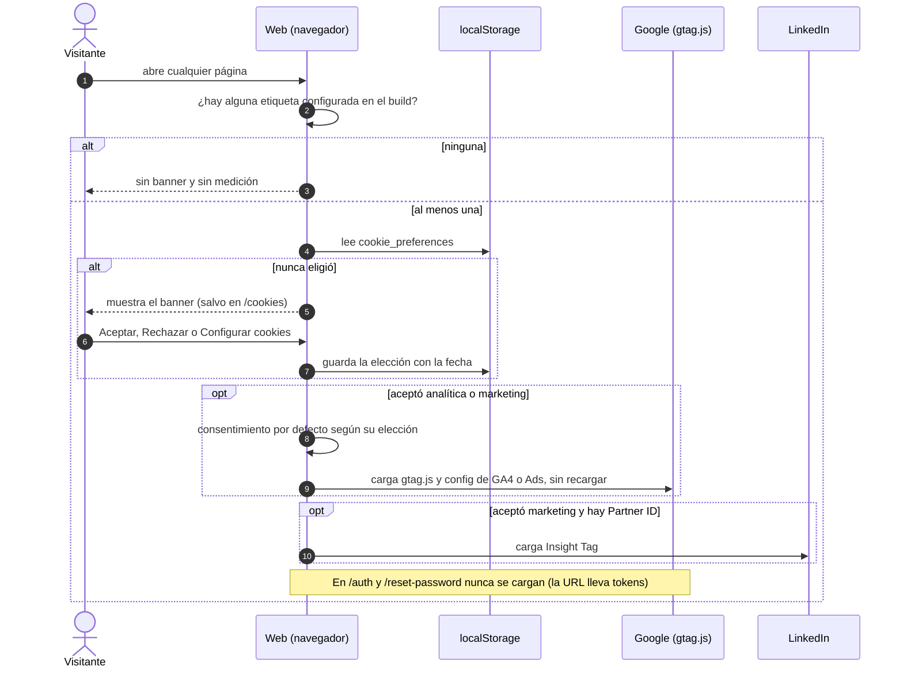

*Nada se carga antes de que la persona elija; «Rechazar» deja solo las cookies esenciales.*

Detalles del consentimiento (`components/analytics/Analytics.tsx` y `lib/cookie-consent.ts`):

- La elección se guarda en `localStorage['cookie_preferences']` como `{ essential, functional, analytics, marketing, timestamp }`. Si el navegador bloquea el almacenamiento, se respeta durante la visita.
- Antes de cargar Google se declara el **modo de consentimiento**: `analytics_storage` según «analítica» y `ad_storage`, `ad_user_data` y `ad_personalization` según «marketing»; con marketing rechazado se activa `ads_data_redaction`.
- Si la persona **retira** el consentimiento en `/cookies`, Google pasa a `denied`, GA4 se desactiva y la página se recarga para que ninguna etiqueta siga activa (LinkedIn no se puede apagar en caliente).
- La elección se sincroniza entre pestañas del mismo sitio.

Cómo se ve el banner y el panel de `/cookies` en escritorio, con un GIF, está en [Flujos del visitante › Flujo 5](Doc-04-Flujos-del-Visitante.md#6-flujo-5-cookies-y-analítica). En el celular:

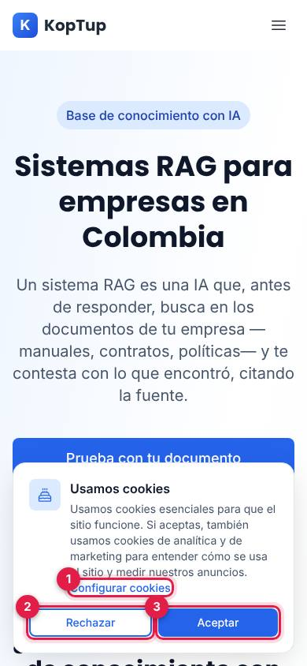

*Banner en `/rag` a 390 × 844 (entorno local con un ID de GA4 ficticio; las peticiones a Google se bloquearon y antes de elegir no hubo ninguna).*

1. **Configurar cookies:** lleva a `/cookies`, con un interruptor por categoría.
2. **Rechazar:** guarda «solo esenciales».
3. **Aceptar:** activa funcionales, analítica y marketing, y carga las etiquetas en ese momento.

### 3.4 Los eventos

Todos pasan por `track()` (`lib/analytics.ts`), que **no hace nada** si no hay consentimiento, si la etiqueta no está cargada o si se llama en el servidor, y nunca envía datos personales (ni nombre, ni email, ni teléfono). Van a GA4 y, si está cargada, a Google Ads.

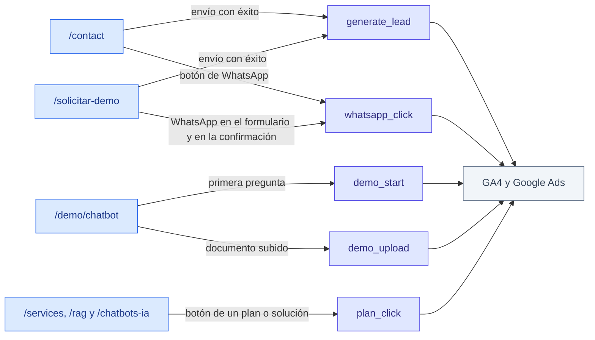

*Cinco eventos en cuatro lugares del sitio.*

| Evento | Cuándo se dispara | Parámetros | Dónde está el código |
|---|---|---|---|
| `generate_lead` | Formulario enviado **con éxito** en `/contact` o en `/solicitar-demo` | `lead_source` (`contact_form` o `demo-request`). En contacto: `service` (solo si es una opción del formulario) y `plan_id` (si viene de un plan RAG). En solicitud: `demos_count` y `demo_slugs` | `app/contact/page.tsx`, `components/demo-request/DemoRequestForm.tsx` |
| `demo_start` | Primera pregunta en `/demo/chatbot`, una vez por carga de la página | `demo_mode` (`sample`: documentos de ejemplo; `upload`: documento propio) | `app/demo/chatbot/page.tsx` y `components/demoEvents.ts` |
| `demo_upload` | Documento subido con éxito en «Prueba con tu documento» | `file_type` (`pdf`, `docx` o `txt`) y `pages`; nunca el nombre ni el contenido | `app/demo/chatbot/components/upload/UploadDemo.tsx` |
| `whatsapp_click` | Clic en un botón de WhatsApp | `link_location`: `contact_page`, `solicitar_demo` o `solicitar_demo_gracias` | `app/contact/page.tsx`, `components/demo-request/DemoRequestForm.tsx` |
| `plan_click` | Clic en el botón de un plan RAG (`/services#planes-rag` y `/rag`), en «Agenda un piloto» de `/chatbots-ia` o en los botones de «Otras soluciones a medida» | `plan_name` (en el idioma del visitante), `plan_id`, `plan_group` (`planes_rag` u `otras_soluciones`), `cta` (`quote`, `details` o `demo`) y, en el detalle de una solución, `plan_tier` y `modality` | `components/rag/RagPlans.tsx`, `app/chatbots-ia/page.tsx`, `components/offerings/OfferingsCatalog.tsx` |

### 3.5 Conversiones

- **Google Ads:** el código no tiene etiquetas de conversión propias. Se vincula GA4 con Google Ads, se marcan en GA4 como **eventos clave** los que interesan (por ejemplo `generate_lead` y `demo_upload`) y se importan en Ads como conversiones de GA4.
- **LinkedIn:** el Insight Tag mide visitas y audiencias; las conversiones se crean en Campaign Manager (por ejemplo, por URL de la página de gracias).
- Para ver `plan_name` y los demás parámetros en los informes, hay que registrarlos en GA4 como **dimensiones personalizadas**.

### 3.6 Cómo activarla

1. Crea la propiedad de GA4 (y, si aplica, la cuenta de Google Ads y el Insight Tag de LinkedIn) y copia sus IDs.
2. En Vercel, proyecto `koptup`, entorno *Production*: agrega `NEXT_PUBLIC_GA_ID`, `NEXT_PUBLIC_GOOGLE_ADS_ID` y/o `NEXT_PUBLIC_LINKEDIN_PARTNER_ID`.
3. **Redespliega la web**: las `NEXT_PUBLIC_*` se fijan al compilar.
4. Abre `www.koptup.com` en una ventana privada: debe aparecer el banner. Pulsa **Aceptar** y comprueba en el «Tiempo real» de GA4 que llega la visita.
5. Envía un formulario de prueba y busca `generate_lead` en GA4; márcalo como evento clave y configura las conversiones (sección 3.5).

---

## 4. Legal

### 4.1 Autorización de datos (Ley 1581 de 2012) en los formularios

| Formulario | ¿Pide autorización? | ¿Es obligatoria? | Qué se guarda como prueba | Dónde |
|---|---|---|---|---|
| **Solicitar demo** (`/solicitar-demo`) | Sí: «Autorizo a KopTup a tratar mis datos personales para gestionar esta solicitud y contactarme sobre ella, según la Política de tratamiento de datos (Ley 1581 de 2012)» | Sí: la web no deja enviar y el backend responde `400 consent_required` sin guardar nada | `aceptado`, `fecha`, **versión de la política** (`PRIVACY_POLICY_VERSION`, hoy `2026-10`), hash de la IP y navegador | MongoDB, colección `DemoRequest` (campo `consentimiento`) |
| **Prueba con tu documento** (`/demo/chatbot`) | Sí: «Autorizo el tratamiento de mis datos personales según la Ley 1581 de 2012 y la política de privacidad» | Sí: sin ella el backend responde `consent_required` | Una línea de texto con la fecha dentro del mensaje del lead (sin versión ni IP) | MongoDB, colección `Contact` con origen `demo-rag` |
| **Contacto** (`/contact`) | **No** | — | Nada | MongoDB, colección `Contact` con origen `contact-form` |
| **Registro** (`/register`) y **activación** (`/activar/<token>`) | No (la activación viene de una solicitud que ya la tiene) | — | — | MongoDB, colección `User` |

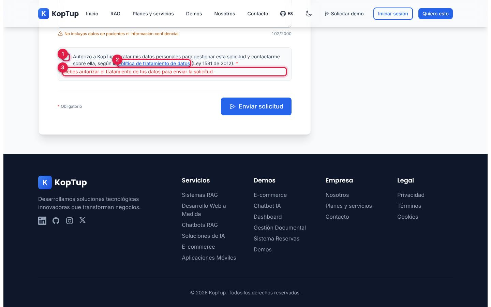

*El formulario con todos los datos llenos menos la autorización, después de pulsar «Enviar solicitud».*

1. **Casilla de autorización**, sin marcar por defecto.
2. **Enlace a la política** (`/privacy`).
3. **Error** si no se marca: «Debes autorizar el tratamiento de tus datos para enviar la solicitud.»

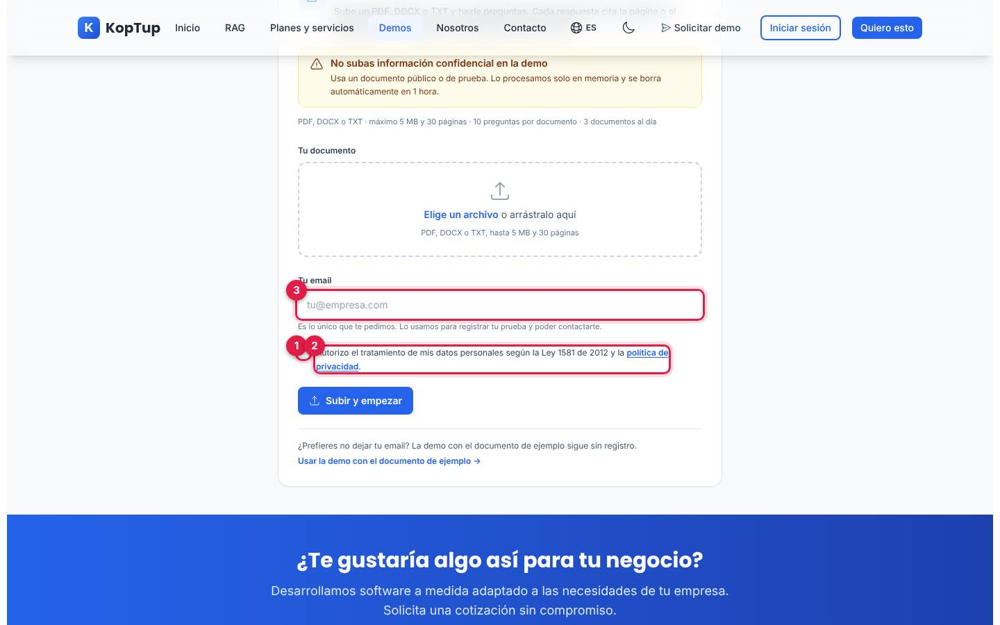

*La única información personal que pide la demo con documento propio es el email.*

1. **Casilla de autorización** (obligatoria).
2. **Enlace a la política de privacidad.**
3. **Email:** «Es lo único que te pedimos».

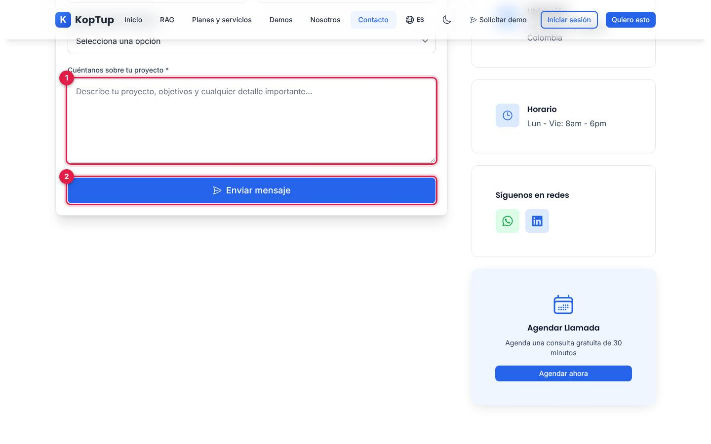

*Final del formulario de `/contact`.*

1. **Mensaje** del proyecto.
2. **Enviar mensaje:** no hay casilla de autorización antes del botón.

**De punta a punta**, la autorización de una solicitud de demo queda a la vista del equipo:

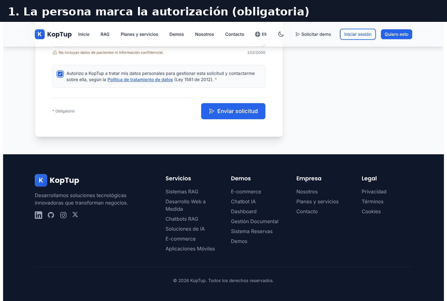

*GIF: la persona autoriza y envía; el equipo ve la solicitud y, en el detalle, la fecha y la versión de la política.*

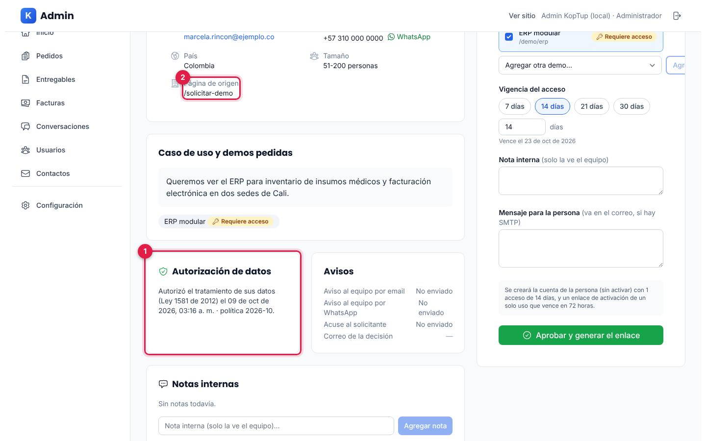

*Admin › Solicitudes de demo › detalle (persona y empresa ficticias).*

1. **Autorización de datos:** «Autorizó el tratamiento de sus datos (Ley 1581 de 2012) el <fecha> · política 2026-10».
2. **Página de origen** desde la que se envió.

Si la misma persona vuelve a enviar el formulario con una solicitud abierta de menos de 30 días, las demos se suman a esa solicitud y la prueba de la autorización se reemplaza por la nueva.

**Cuando publiques una política nueva:** actualiza el texto de `/privacy` (en `apps/web/messages/es.json` y `en.json`, claves `privacyPage`), cambia `PRIVACY_POLICY_VERSION` en Railway (por ejemplo `2027-01`) y redespliega los dos. Las solicitudes nuevas quedarán con la versión nueva y las viejas conservan la suya.

### 4.2 Qué datos se guardan y dónde

| Origen | Datos personales | Dónde quedan | Quién más los recibe |
|---|---|---|---|
| Solicitar demo | Nombre, empresa, cargo, email, teléfono, país, tamaño de empresa, demos, caso de uso, página de origen, referente y UTM | MongoDB: `DemoRequest` y una copia como lead en `Contact` (origen `demo-request`) | Aviso al equipo por email (`ADMIN_EMAIL`) y WhatsApp si están configurados; acuse al solicitante si hay SMTP |
| Contacto | Nombre, email, teléfono, empresa, servicio, presupuesto y mensaje | MongoDB: `Contact` | Aviso al equipo por email y WhatsApp |
| Prueba con tu documento | Email y el documento | Email en `Contact` (origen `demo-rag`); el documento, solo **en memoria** y por máximo 1 hora | OpenAI recibe los fragmentos relevantes y la pregunta, no el documento completo ni el email |
| Cuenta del prospecto | Email, nombre, empresa, teléfono y contraseña cifrada (hash) | MongoDB: `User`, sus accesos en `DemoGrant` y el enlace de activación solo como hash en `MagicLinkToken` | — |
| Acciones del equipo | Quién hizo qué y hash de la IP | MongoDB: `AuditLog` | — |
| Navegación | IP, ruta y navegador de cada petición | Registros del backend en Railway | — |

La IP nunca se guarda en claro en MongoDB: solo su hash. Cuánto tiempo se conserva cada dato y cómo se borra está en [Flujos técnicos › 8.3](Doc-14-3-Flujos-Tecnicos.md#83-qué-se-guarda-dónde-y-cuánto-tiempo); los campos de cada colección, en [Modelos de datos](Doc-09-Modelos-de-Datos.md).

### 4.3 Páginas legales

Las tres comparten diseño (encabezado azul con «Actualizado: Octubre 2026», secciones numeradas y una nota final) y sus textos viven en `apps/web/messages/es.json` y `en.json` (`privacyPage`, `termsPage`, `cookiesPage`). Las capturas de cada una completa están en [Páginas públicas › 13](Doc-03-Paginas-Publicas.md#13-páginas-legales-privacy-terms-cookies).

| Página | Qué dice hoy |
|---|---|
| `/privacy` | Responsable «KopTup - Soluciones Tecnológicas»; datos que recopila (personales, de uso y de proyectos); usos; seguridad; no venta de datos; retención «durante el tiempo necesario»; derechos (acceso, rectificación, eliminación, portabilidad, oposición, limitación) con respuesta en **30 días hábiles**; cookies; transferencias internacionales; menores; contacto (email, teléfono y dirección). Su descripción para buscadores menciona la Ley 1581 y el RGPD |
| `/terms` | Condiciones del servicio de desarrollo a medida: aceptación, servicios, precios y pagos, propiedad intelectual, confidencialidad, plazos, garantías, soporte, terminación y ley aplicable |
| `/cookies` | Qué son, tabla de cookies por categoría con sus interruptores, botones «Aceptar Todas», «Solo Esenciales» y «Guardar Preferencias», cómo bloquearlas en el navegador y cookies de terceros (Google y LinkedIn) |

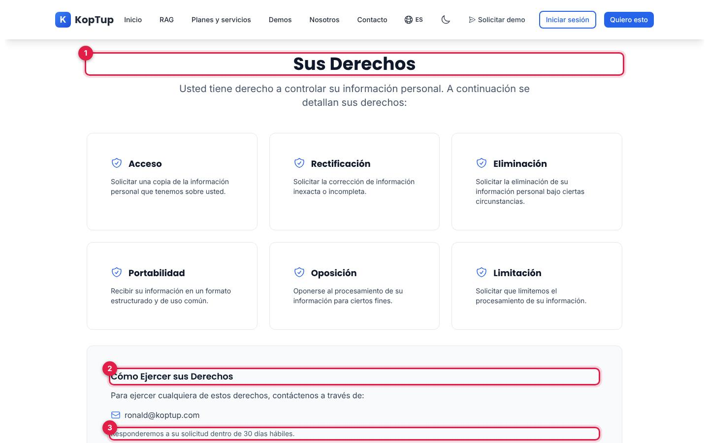

*La sección «Sus Derechos» de la política de privacidad.*

1. **Los seis derechos** que la política reconoce.
2. **Cómo ejercerlos:** escribiendo al email de contacto.
3. **Plazo de respuesta** que promete la política: 30 días hábiles.

Hoy ejercer un derecho (por ejemplo, pedir que se borren los datos) es un proceso **manual**: no hay botón ni API para suprimir los datos de una persona.

### 4.4 Banner y cookies reales

El banner y su panel de preferencias están en la [sección 3.3](#33-cuándo-cargan). La tabla de `/cookies` describe cookies con nombres que el sitio **no usa**:

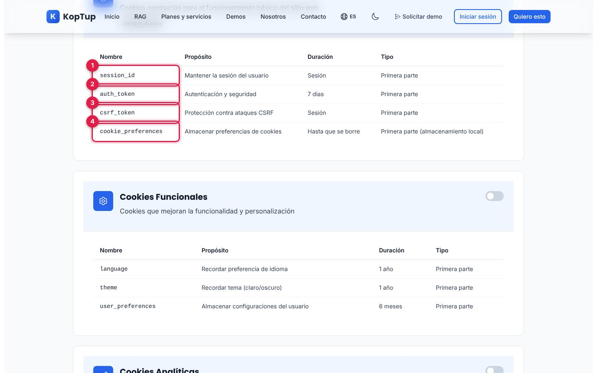

*Las cookies «esenciales» que lista la página.*

1. `session_id`, 2. `auth_token` y 3. `csrf_token`: no existen en el sitio.
4. `cookie_preferences`: sí existe, pero en el almacenamiento local, no como cookie.

Lo que el sitio guarda de verdad en el navegador:

| Nombre | Tipo | Para qué | Duración | Categoría |
|---|---|---|---|---|
| `accessToken` | Cookie propia | Sesión iniciada | 15 minutos | Esencial |
| `refreshToken` | Cookie propia | Renovar la sesión | 7 días | Esencial |
| `locale` | Cookie propia | Idioma ES o EN | 1 año | Funcional (se guarda aunque se rechacen las funcionales) |
| `theme` | Almacenamiento local | Tema claro u oscuro | Hasta que se borre | Funcional |
| `cookie_preferences` | Almacenamiento local | La elección del banner | Hasta que se borre | Esencial |
| Claves de las demos (por ejemplo `koptup.chatbot.myBots`, bots de los asistentes, recorrido de bienvenida) | Almacenamiento local | Recordar el estado de cada demo | Hasta que se borre | Funcional |
| `_ga`, `_ga_<ID>`, `_gcl_au`, `_gcl_aw`, `li_fat_id`, `bcookie` | Cookies de terceros | Analítica y anuncios | Las que defina cada proveedor | Solo con consentimiento y si la etiqueta está configurada (hoy no) |

---

## 5. Limitaciones conocidas

| # | Qué pasa | Efecto |
|---|---|---|
| 1 | **La analítica no está configurada en producción** | No hay datos de tráfico ni de conversiones, y no aparece el banner |
| 2 | **`/contact` no pide autorización de la Ley 1581**, aunque guarda nombre, email, teléfono y mensaje | Esos leads no tienen prueba de autorización |
| 3 | **«Prueba con tu documento» guarda la autorización solo como texto**, sin versión de la política ni hash de la IP; si guardar el lead falla, la prueba queda solo en el registro del servidor | Prueba más débil que la de «Solicitar demo» |
| 4 | **No hay forma de suprimir los datos de una persona** desde el panel ni por la API, ni plazos de retención | Una solicitud de borrado exige editar la base a mano |
| 5 | **La política promete responder en 30 días hábiles**; la Ley 1581 fija 10 días hábiles para consultas y 15 para reclamos (artículos 14 y 15). El texto es una política de privacidad general (incluye derechos del RGPD europeo, como portabilidad) | Conviene que un abogado lo revise frente a la Ley 1581 y su reglamentación |
| 6 | **La tabla de `/cookies` no coincide con las cookies reales** (sección 4.4) y `locale` se guarda aunque se rechacen las funcionales | La política describe algo distinto de lo que pasa |
| 7 | **El sitemap no sigue el catálogo:** lista las demos abiertas según la tabla de respaldo del código (`lib/demo-access-defaults.ts`), no lo que el admin cambió | Una demo que el admin cerró sigue en el sitemap (y muestra una pantalla `noindex`); una que abrió no aparece |
| 8 | **`/login` y `/register` heredan el título y la canonical del inicio** y no tienen `noindex` (están bloqueadas en `robots.txt`) | Metadatos poco precisos; sin efecto práctico mientras `robots.txt` las bloquee |
| 9 | **La página 404 hereda el título y la canonical del inicio** y lleva dos metas `robots` contradictorias | Sin efecto en Google (responde 404), pero confuso |
| 10 | **`llms.txt` dice «Año de fundación: 2019»** y `/about` dice 2026 | Mensajes distintos sobre la empresa |
| 11 | **El pie de las páginas legales dice «© 2025»** y el del sitio «© 2026» | Detalle de consistencia |
| 12 | **Las páginas legales tratan de «usted»** y el resto del sitio de «tú» | Tono inconsistente |

---

## 6. Para desarrolladores: archivos clave

| Tema | Archivo |
|---|---|
| Dominio, marca, plantilla de títulos, imagen RAG | `apps/web/src/lib/site.ts` |
| Títulos, descripciones, canonical e imagen por página | `apps/web/src/lib/seo-config.ts` |
| Metadatos por defecto, verificación de Google | `apps/web/src/app/layout.tsx` |
| Control de títulos | `apps/web/scripts/check-titles.mjs` |
| Sitemap | `apps/web/src/app/sitemap.ts` |
| Robots, `llms.txt`, imagen fija | `apps/web/public/robots.txt`, `public/llms.txt`, `public/og-image.png` |
| Imagen generada | `apps/web/src/app/opengraph-image.tsx` |
| JSON-LD | `components/seo/StructuredData.tsx`, `lib/rag-plans-jsonld.ts`, `lib/rag-page-jsonld.ts`, `lib/chatbots-page-jsonld.ts`, `lib/ai-solutions-page-jsonld.ts` y los `layout.tsx` de cada ruta |
| Etiquetas y eventos | `apps/web/src/lib/analytics.ts`, `components/analytics/Analytics.tsx` |
| Consentimiento | `apps/web/src/lib/cookie-consent.ts`, `components/consent/CookieBanner.tsx`, `app/cookies/page.tsx` |
| CSP de las etiquetas | `apps/web/next.config.js` |
| Autorización en «Solicitar demo» | `components/demo-request/DemoRequestForm.tsx`, `apps/backend/src/routes/demo-public.routes.ts`, `services/demo-requests.service.ts`, `models/DemoRequest.ts` |
| Autorización en «Prueba con tu documento» | `app/demo/chatbot/components/upload/UploadForm.tsx`, `apps/backend/src/routes/demo-rag.routes.ts` |
| Versión de la política | `PRIVACY_POLICY_VERSION` (`apps/backend/src/config/demos.ts`) |
| Textos legales | `apps/web/messages/es.json` y `en.json` (`privacyPage`, `termsPage`, `cookiesPage`, `cookieBanner`) |

---

## 7. Páginas relacionadas

- [Páginas públicas](Doc-03-Paginas-Publicas.md): capturas completas de `/privacy`, `/terms` y `/cookies`.
- [Flujos del visitante](Doc-04-Flujos-del-Visitante.md): banner y preferencias de cookies paso a paso, y qué mide cada flujo.
- [Flujos técnicos › 8](Doc-14-3-Flujos-Tecnicos.md#8-datos-personales-ley-1581-de-2012): recorrido de los datos personales y retención.
- [Operación y despliegue](Doc-11-Operacion-y-Despliegue.md): variables de entorno y cómo redesplegar.
- [Modelos de datos](Doc-09-Modelos-de-Datos.md) · [Glosario y preguntas](Doc-13-Glosario-y-Preguntas.md)
- Plan original: [Comercial, marketing y legal](11-Comercial-Marketing-y-Legal.md), [Legal](Seccion-Legal.md) y [Landings SEO](Seccion-Landings-SEO.md).
