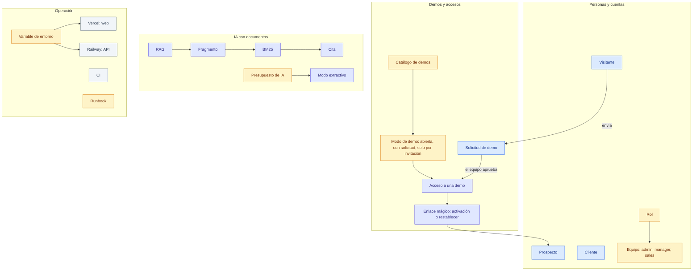
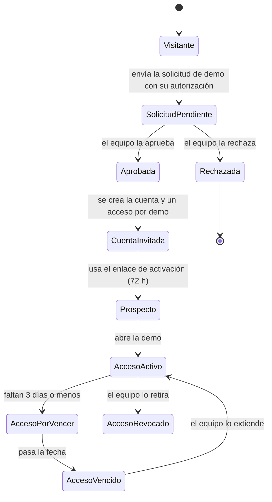
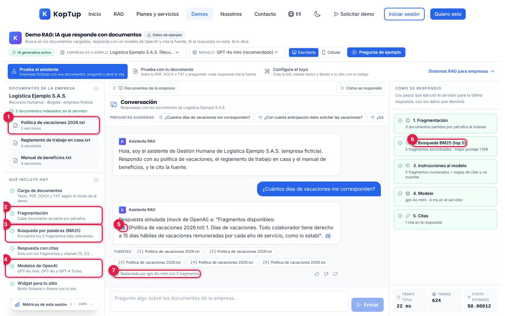
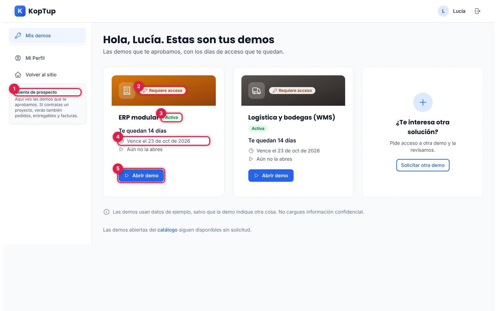

# Glosario y preguntas frecuentes

> **Resumen.** Los términos que usa esta documentación, explicados en una o dos líneas y con enlace a la página donde se ven en detalle. Después, las preguntas más comunes del **dueño** y de un **cliente o prospecto**, con respuestas cortas.
>
> Si un término no está aquí, búscalo en la página del tema: cada una empieza con un resumen.

## Índice

1. [Mapa de términos](#1-mapa-de-términos)
2. [Los términos en pantalla](#2-los-términos-en-pantalla)
3. [Glosario de la A a la Z](#3-glosario-de-la-a-a-la-z)
4. [Preguntas frecuentes del dueño](#4-preguntas-frecuentes-del-dueño)
5. [Preguntas frecuentes de un cliente o prospecto](#5-preguntas-frecuentes-de-un-cliente-o-prospecto)
6. [Páginas relacionadas](#6-páginas-relacionadas)

---

## 1. Mapa de términos

*Cuatro familias de términos. Las flechas muestran cómo se conectan.*

El mismo recorrido, contado con las palabras del glosario:

*Estados por los que pasa una persona desde que pide una demo. El paso a cliente (propuesta y anticipo) está en desarrollo.*

---

## 2. Los términos en pantalla

*Demo RAG, pestaña «Prueba el asistente», después de una pregunta de ejemplo (en el entorno de capturas la IA es simulada).*

1. **Documento** de la base de conocimiento de la empresa de ejemplo.
2. **Fragmentación:** cada documento se parte por párrafos (los **fragmentos**).
3. **BM25:** la búsqueda por palabras que elige los 5 fragmentos más relevantes.
4. **Modelo de OpenAI** que redacta la respuesta.
5. **Cita** `[1]`: al abrirla muestra el fragmento exacto.
6. **Cómo se respondió:** los pasos que ejecutó el servidor, con el puntaje BM25.
7. Con cuántos fragmentos se redactó la respuesta y con qué modelo.

*Portal de una prospecta ficticia con dos accesos concedidos por el equipo.*

1. **Prospecto:** el tipo de cuenta.
2. **Modo de la demo:** «Requiere acceso» (con solicitud).
3. **Estado del acceso:** «Activa».
4. **Vencimiento** del acceso.
5. **Abrir demo.**

---

## 3. Glosario de la A a la Z

| Término | Qué significa | Dónde verlo en detalle |
|---|---|---|
| **Acceso (a una demo)** | Permiso de **una persona** para abrir **una demo** hasta una fecha. Se crea al aprobar una solicitud o al conceder acceso directo; por defecto dura 14 días (entre 1 y 365). Estados: activo, por vencer (3 días o menos), vencido y retirado. En el código se llama `DemoGrant` | [Manual del administrador › 5](Doc-06-Manual-del-Administrador.md#5-accesos-a-demos) |
| **Admin, manager, sales** | Los roles del **equipo**. El admin puede todo; manager y sales tienen permisos parciales. Los tres ven todas las demos | [Roles y permisos](Doc-10-Roles-y-Permisos.md) |
| **API** | Las direcciones `/api/...` del backend que usa la web. Todas exigen la autorización que corresponde | [API](Doc-08-API.md) |
| **Autorización de datos (Ley 1581)** | Casilla obligatoria con la que la persona permite tratar sus datos personales. En «Solicitar demo» se guarda con la fecha y la versión de la política | [SEO, analítica y legal › 4](Doc-12-SEO-Analitica-y-Legal.md#4-legal) |
| **Backend** | El servidor (Express, en Railway) que guarda los datos, decide los permisos y llama a la IA | [Arquitectura](Doc-01-Arquitectura.md) |
| **Banner de cookies** | Aviso de la primera visita para aceptar o rechazar cookies de analítica y marketing. Solo aparece si hay alguna etiqueta de medición configurada | [SEO, analítica y legal › 3](Doc-12-SEO-Analitica-y-Legal.md#3-analítica) |
| **Bitácora** | Registro de las acciones del equipo (aprobar, rechazar, extender, cambiar un rol o el catálogo). Se consulta por la API; no tiene pantalla | [Roles y permisos](Doc-10-Roles-y-Permisos.md) |
| **BM25** | Método de búsqueda **por palabras**: puntúa cada fragmento según cuántas palabras de la pregunta contiene y qué tan poco comunes son, y se quedan los mejores. Es lo que usa el RAG de las demos (no usa embeddings) | [Guía de la demo del chatbot](Guia-Demo-chatbot.md) |
| **Build (compilar)** | Convertir el código en la versión que se publica. La web se compila en Vercel y la API en Railway en cada despliegue | [Operación y despliegue](Doc-11-Operacion-y-Despliegue.md) |
| **Canonical** | La dirección oficial de una página para los buscadores. En KopTup siempre empieza por `https://www.koptup.com` | [SEO, analítica y legal › 2.2](Doc-12-SEO-Analitica-y-Legal.md#22-dominio-canónico) |
| **Catálogo de demos** | La lista de las 28 demos con su modo, si están activas y la vigencia por defecto. Vive en la base de datos y la edita un admin | [Manual del administrador › 6](Doc-06-Manual-del-Administrador.md#6-catálogo-de-demos) |
| **CI (integración continua)** | Las verificaciones automáticas de GitHub Actions en cada cambio: lint, tipos, pruebas y recorridos completos. No despliega | [Operación y despliegue › 3](Doc-11-Operacion-y-Despliegue.md#3-integración-continua-ci) |
| **Cita** | El número `[1]`, `[2]`… que la respuesta del RAG pone junto a cada dato. Al abrirla muestra el fragmento exacto del documento (y la página, en documentos propios) | [Flujos del visitante › Flujo 1](Doc-04-Flujos-del-Visitante.md#2-flujo-1-embudo-rag-de-la-demo-al-plan) |
| **Cliente** | Rol `client`: alguien con un proyecto contratado. Ve el portal completo (pedidos, entregables, facturas) | [Flujos del prospecto y cliente](Doc-05-Flujos-del-Prospecto-y-Cliente.md) |
| **Cupo (límite de peticiones)** | Máximo de veces que alguien puede hacer algo en un tiempo, por cuenta, IP o email. Por ejemplo, 5 solicitudes de demo por hora por IP | [Operación y despliegue › 4.3](Doc-11-Operacion-y-Despliegue.md#43-backend-railway) |
| **Datos de ejemplo** | Información ficticia con la que funciona una demo. Cada guía dice qué es real y qué es simulado | [Guía de demos](Doc-07-Guia-de-Demos.md) |
| **Despliegue** | Publicar una versión nueva. Pasa solo cuando se fusiona un cambio en `main` | [Operación y despliegue › 1](Doc-11-Operacion-y-Despliegue.md#1-el-despliegue-en-una-imagen) |
| **En mantenimiento (demo desactivada)** | Demo apagada desde el catálogo: solo el equipo la abre; los demás ven «En mantenimiento» | [Operación y despliegue › 9.8](Doc-11-Operacion-y-Despliegue.md#98-una-demo-muestra-no-se-pudo-verificar-o-en-mantenimiento) |
| **Embedding** | Representación numérica de un texto para buscar por significado. **No se usa** en las demos de KopTup: buscan por palabras (BM25) | — |
| **Enlace mágico** | Enlace de un solo uso que se envía por correo o WhatsApp. Hay dos: el de **activación** (crear la contraseña, vale 72 horas) y el de **restablecer la contraseña** (vale 1 hora). Solo se guarda una huella (hash) del enlace | [Flujos del prospecto y cliente › 2](Doc-05-Flujos-del-Prospecto-y-Cliente.md#2-activar-la-cuenta-activartoken) |
| **Etiqueta de medición** | Código de Google Analytics 4, Google Ads o LinkedIn que mide visitas y conversiones. Hoy ninguna está configurada en producción | [SEO, analítica y legal › 3](Doc-12-SEO-Analitica-y-Legal.md#3-analítica) |
| **Evento** | Algo que se mide cuando pasa: `generate_lead`, `demo_start`, `demo_upload`, `whatsapp_click` y `plan_click` | [SEO, analítica y legal › 3.4](Doc-12-SEO-Analitica-y-Legal.md#34-los-eventos) |
| **Fragmento** | Pedazo de un documento (normalmente un párrafo) en que se parte al indexarlo. Es lo que se busca, lo que recibe la IA y lo que se cita | [Flujos técnicos › 3](Doc-14-3-Flujos-Tecnicos.md#3-chatbot-rag) |
| **Health check (chequeo de salud)** | Dirección que dice si la API está viva (`/health/live`) y lista con la base conectada (`/health`) | [Operación y despliegue › 7](Doc-11-Operacion-y-Despliegue.md#7-salud-del-sistema-y-registros) |
| **Indexar** | Dos sentidos: en el RAG, preparar un documento (partirlo y armar el índice de búsqueda); en SEO, que Google incluya una página en sus resultados | — |
| **JSON-LD** | Datos estructurados ocultos en la página que le dicen a Google quién es KopTup, qué vende y cuáles son sus preguntas frecuentes | [SEO, analítica y legal › 2.5](Doc-12-SEO-Analitica-y-Legal.md#25-datos-estructurados-json-ld) |
| **Job de vencimiento** | Tarea automática del backend que cada hora marca como vencidos los accesos y envía el recordatorio 3 días antes | [Flujos de administración › 6](Doc-14-2-Flujos-de-Administracion-y-Operacion.md#6-job-de-vencimiento-y-correos) |
| **Lead** | Registro de un posible cliente. Llega del formulario de contacto, de «Solicitar demo» o de «Prueba con tu documento», y se ve en Admin › Contactos | [Manual del administrador › 8](Doc-06-Manual-del-Administrador.md#8-contactos) |
| **Middleware** | Filtro de la web que corre antes de mostrar una página: revisa la sesión, el rol y el acceso a las demos | [Flujos técnicos › 1](Doc-14-3-Flujos-Tecnicos.md#1-filtro-de-la-web-middleware-de-next) |
| **Mock de OpenAI** | Servidor de prueba que imita a OpenAI sin costo. Lo usan CI y el entorno local; responde «Respuesta simulada (mock de OpenAI)…» | [Operación y despliegue › 5](Doc-11-Operacion-y-Despliegue.md#5-levantar-todo-en-local-paso-a-paso) |
| **Modelo (de IA)** | El modelo de OpenAI que redacta las respuestas. Por defecto `gpt-4o-mini` | [Guía de la demo del chatbot](Guia-Demo-chatbot.md) |
| **Modo de demo** | Quién puede abrir una demo: **Abierta** (`publico`, cualquiera), **Con solicitud** o «Requiere acceso» (`solicitud`, con un acceso vigente) y **Solo por invitación** (`privado`, acceso que solo da un admin). El equipo ve todas | [Roles y permisos › 5](Doc-10-Roles-y-Permisos.md#5-modos-de-acceso-de-las-demos) |
| **Modo extractivo** | Cuando no hay IA disponible (sin clave o sin presupuesto), el chatbot responde con los fragmentos encontrados, sin redactar, y lo dice | [Operación y despliegue › 9.6](Doc-11-Operacion-y-Despliegue.md#96-se-agotó-el-presupuesto-de-ia) |
| **MongoDB** | La base de datos donde se guardan cuentas, solicitudes, accesos, leads y el catálogo | [Modelos de datos](Doc-09-Modelos-de-Datos.md) |
| **Presupuesto de IA** | Tope mensual en dólares de lo que puede gastar en OpenAI cada función (chatbot y «Prueba con tu documento» 50; LinkedIn y gestor de contenido 20). Al llegar, la función se apaga o pasa a modo extractivo hasta el mes siguiente | [Operación y despliegue › 9.6](Doc-11-Operacion-y-Despliegue.md#96-se-agotó-el-presupuesto-de-ia) |
| **Prospecto** | Rol `prospect`: persona a la que el equipo le aprobó al menos una demo y activó su cuenta. Solo ve Mis demos y su perfil | [Flujos del prospecto y cliente](Doc-05-Flujos-del-Prospecto-y-Cliente.md) |
| **«Prueba con tu documento»** | Modo de la demo RAG en el que el visitante sube su propio PDF, DOCX o TXT (hasta 5 MB y 30 páginas) y hace hasta 10 preguntas. El documento se borra a la hora | [Flujos del visitante › Flujo 1](Doc-04-Flujos-del-Visitante.md#2-flujo-1-embudo-rag-de-la-demo-al-plan) |
| **RAG** | *Retrieval-Augmented Generation*, generación con recuperación: antes de responder, la IA **busca** en los documentos de la empresa y responde **solo** con lo que encontró, citando la fuente. Si no lo encuentra, lo dice | [Reposicionamiento RAG](13-Reposicionamiento-RAG.md) |
| **Railway** | Plataforma donde corre el backend | [Operación y despliegue › 2](Doc-11-Operacion-y-Despliegue.md#2-dónde-corre-cada-pieza) |
| **Redis** | Almacén rápido que guarda las sesiones de renovación, los cupos y el gasto de IA del mes | [Arquitectura](Doc-01-Arquitectura.md) |
| **Rol** | El tipo de cuenta: `user`, `client`, `prospect`, `developer`, `sales`, `manager` o `admin`. Decide qué páginas y acciones tiene cada persona | [Roles y permisos](Doc-10-Roles-y-Permisos.md) |
| **Runbook** | Procedimiento paso a paso para resolver una falla | [Operación y despliegue › 9](Doc-11-Operacion-y-Despliegue.md#9-runbooks-qué-hacer-cuando-algo-falla) |
| **Semilla** | Datos iniciales que el sistema crea solo; por ejemplo, las 28 demos del catálogo al arrancar (sin pisar lo que cambió el admin) | [Flujos técnicos › 7.2](Doc-14-3-Flujos-Tecnicos.md#72-secuencia-de-arranque) |
| **Sesión** | Estar con la sesión iniciada. Usa dos tokens: uno de acceso (15 minutos) y otro de renovación (7 días) | [Flujos del prospecto y cliente › 3](Doc-05-Flujos-del-Prospecto-y-Cliente.md#3-iniciar-sesión-login) |
| **Sitemap** | Lista de páginas que el sitio le entrega a Google (`/sitemap.xml`, 34 direcciones) | [SEO, analítica y legal › 2.3](Doc-12-SEO-Analitica-y-Legal.md#23-sitemap-y-robots) |
| **SMTP** | El servidor de correo con el que el backend envía los emails. Sin él no sale ningún correo y el panel muestra el enlace para copiarlo | [Operación y despliegue › 9.7](Doc-11-Operacion-y-Despliegue.md#97-el-correo-no-sale) |
| **Solicitud de demo** | Lo que envía alguien desde `/solicitar-demo`: sus datos, las demos que le interesan y su autorización. Tiene un código (por ejemplo `DR-2026-7V6XMN`) y pasa por pendiente, en revisión, aprobada o rechazada | [Manual del administrador › 4](Doc-06-Manual-del-Administrador.md#4-solicitudes-de-demo) |
| **Variable de entorno** | Ajuste que se configura en Vercel o Railway sin tocar el código (claves, URL, topes). Los secretos solo viven ahí | [Operación y despliegue › 4](Doc-11-Operacion-y-Despliegue.md#4-variables-de-entorno) |
| **Vercel** | Plataforma donde corre la web `www.koptup.com` | [Operación y despliegue › 2](Doc-11-Operacion-y-Despliegue.md#2-dónde-corre-cada-pieza) |
| **Visitante** | Cualquier persona que navega sin iniciar sesión | [Flujos del visitante](Doc-04-Flujos-del-Visitante.md) |
| **Widget** | El botón de chat que un cliente puede pegar en su propio sitio con el bot creado en «Configura el tuyo» | [Guía de la demo del chatbot](Guia-Demo-chatbot.md) |

---

## 4. Preguntas frecuentes del dueño

**¿Por qué no funciona el login, el contacto ni las solicitudes de demo en `www.koptup.com`?**
Porque el backend de Railway no responde («Application not found»): la web carga, pero todo lo que guarda o consulta datos falla. Recuperarlo es el [runbook 9.1](Doc-11-Operacion-y-Despliegue.md#91-el-backend-está-caído-situación-actual).

**¿Cómo sé que alguien pidió una demo?**
Aparece en **Admin › Solicitudes de demo**. Si el correo y WhatsApp están configurados, además te llega un aviso. Ver [Manual del administrador › 4](Doc-06-Manual-del-Administrador.md#4-solicitudes-de-demo).

**¿Cómo le doy acceso a alguien?**
Apruebas su solicitud o, sin solicitud, usas **Conceder acceso** en Admin › Accesos a demos. El sistema crea la cuenta y un enlace de activación que puedes copiar o mandar por WhatsApp. Ver [Manual del administrador › 4.3](Doc-06-Manual-del-Administrador.md#43-aprobar-elegir-demos-días-y-nota).

**¿Qué pasa si el correo no llega?**
Nada se bloquea: el panel siempre muestra el enlace para que lo envíes por otro medio. Para arreglar el correo, [runbook 9.7](Doc-11-Operacion-y-Despliegue.md#97-el-correo-no-sale).

**¿Cómo abro o cierro una demo al público?**
En **Admin › Catálogo de demos** eliges Abierta, Requiere acceso o Solo por invitación, o la apagas. Se aplica en máximo un minuto. Ver [runbook 9.5](Doc-11-Operacion-y-Despliegue.md#95-cambiar-el-modo-de-una-demo).

**¿Cuánto me puede costar la IA de las demos?**
Cada función tiene un tope mensual en dólares (50 el chatbot, 50 «Prueba con tu documento», 20 LinkedIn y 20 el gestor de contenido) que se cambia en Railway. El gasto real se ve en la cuenta de OpenAI; el panel no lo muestra. Ver [runbook 9.6](Doc-11-Operacion-y-Despliegue.md#96-se-agotó-el-presupuesto-de-ia).

**¿Por qué «Prueba con tu documento» dice que no está disponible?**
Porque está apagada a propósito hasta que se configuren tres cosas en Railway. Ver [runbook 9.3](Doc-11-Operacion-y-Despliegue.md#93-encender-prueba-con-tu-documento).

**¿Estamos midiendo las visitas y los anuncios?**
Hoy no: faltan los IDs de Google Analytics, Google Ads o LinkedIn en Vercel. Cuando los pongas aparece el banner de cookies y empiezan los eventos. Ver [SEO, analítica y legal › 3.6](Doc-12-SEO-Analitica-y-Legal.md#36-cómo-activarla).

**¿Cumplimos con la Ley 1581?**
«Solicitar demo» y «Prueba con tu documento» exigen la autorización; la solicitud guarda la fecha y la versión de la política. Faltan cosas: el formulario de contacto no la pide, no hay forma de borrar los datos de una persona desde el panel y la política conviene revisarla con un abogado. Ver [SEO, analítica y legal › 4](Doc-12-SEO-Analitica-y-Legal.md#4-legal).

**¿Quién puede entrar al panel?**
Los roles admin, manager y sales, cada uno con lo suyo. El primer admin se crea con la variable `ADMIN_EMAIL` o con un script. Ver [Roles y permisos](Doc-10-Roles-y-Permisos.md) y [runbook 9.4](Doc-11-Operacion-y-Despliegue.md#94-crear-o-recuperar-el-admin).

**Olvidé mi contraseña de admin.**
Usa «¿Olvidaste tu contraseña?» en `/login` (necesita el correo configurado). Si no llega, crea otra cuenta y conviértela en admin. Ver [runbook 9.4](Doc-11-Operacion-y-Despliegue.md#94-crear-o-recuperar-el-admin).

**¿Puedo cambiar los textos del sitio yo mismo?**
No desde el panel: los textos están en archivos del código (`apps/web/messages/es.json` y `en.json`) y cambiarlos requiere un desarrollador y un despliegue. Lo que sí cambias desde el panel es el catálogo de demos (modo, activa, vigencia y nombre).

**Algo se rompió después de un cambio. ¿Cómo vuelvo atrás?**
En Vercel puedes volver al despliegue anterior en minutos; después hay que revertir el cambio en `main`. Ver [runbook 9.9](Doc-11-Operacion-y-Despliegue.md#99-revertir-un-despliegue).

**¿Las demos son productos terminados?**
No todas. Algunas usan IA real a través del backend (el chatbot RAG, el generador de LinkedIn, el asistente del gestor de contenido y los asistentes de las demos de mesa de ayuda, HRMS y LMS); el resto muestran el producto con datos de ejemplo. Cada guía lo aclara. Ver [Guía de demos](Doc-07-Guia-de-Demos.md).

**¿Cuándo estará el paso de prospecto a cliente con propuesta y pago?**
Está **en desarrollo** y no está en `main`. Ver [Estado y próximos pasos](15-Estado-y-Proximos-Pasos.md).

---

## 5. Preguntas frecuentes de un cliente o prospecto

**¿Necesito registrarme para probar las demos?**
Para las demos abiertas, no. Las que dicen «Requiere acceso» o «Solo por invitación» se solicitan en `/solicitar-demo`. Ver [Flujos del visitante](Doc-04-Flujos-del-Visitante.md).

**Pedí una demo. ¿Y ahora?**
El equipo revisa tu solicitud. Si la aprueba, te llega un enlace (por correo o WhatsApp) para crear tu contraseña y entrar a **Mis demos**. Ver [Flujos del prospecto y cliente](Doc-05-Flujos-del-Prospecto-y-Cliente.md).

**No me llegó el correo con el enlace.**
Revisa spam y que el email esté bien escrito. Si no aparece, pide al equipo que te lo envíe por WhatsApp o que genere uno nuevo: el enlace vale 72 horas y sirve una sola vez. Ver [Flujos del prospecto y cliente › 2.2](Doc-05-Flujos-del-Prospecto-y-Cliente.md#22-cuando-el-enlace-no-sirve).

**¿Cuánto tiempo tengo acceso a una demo?**
Lo que defina el equipo al aprobar (por defecto 14 días). Mis demos te muestra los días que te quedan y, si el correo está configurado, te avisamos 3 días antes. Ver [Flujos del prospecto y cliente › 5](Doc-05-Flujos-del-Prospecto-y-Cliente.md#5-mis-demos-dashboarddemos).

**Se venció mi acceso.**
Pulsa **Pedir más tiempo** en la demo o en Mis demos y el equipo lo revisa. Ver [Flujos del prospecto y cliente › 7](Doc-05-Flujos-del-Prospecto-y-Cliente.md#7-cuando-el-acceso-vence-o-el-equipo-lo-retira).

**La demo dice «No se pudo verificar».**
El servicio no respondió en ese momento. Intenta de nuevo en unos minutos; si sigue, escríbenos. Ver [Operación y despliegue › 9.8](Doc-11-Operacion-y-Despliegue.md#98-una-demo-muestra-no-se-pudo-verificar-o-en-mantenimiento).

**Olvidé mi contraseña.**
Usa «¿Olvidaste tu contraseña?» en el inicio de sesión: te llega un enlace que vale 1 hora. Ver [Flujos del prospecto y cliente › 4](Doc-05-Flujos-del-Prospecto-y-Cliente.md#4-recuperar-la-contraseña-forgot-password-y-reset-password).

**¿Por qué me pide iniciar sesión otra vez?**
La sesión se renueva sola hasta por 7 días. Además, cada cuenta mantiene **una** sesión renovable: si entras desde otro equipo, el primero te pedirá iniciar sesión de nuevo en máximo 15 minutos.

**¿Qué pasa con el documento que subo en «Prueba con tu documento»?**
Se procesa en el servidor de KopTup y se borra a la hora (o antes, si pulsas «Subir otro documento»); el archivo original no se guarda. A OpenAI solo se envían la pregunta y los fragmentos relevantes, no el documento completo. Solo te pedimos el email. Ver [Flujos técnicos › 4](Doc-14-3-Flujos-Tecnicos.md#4-prueba-con-tu-documento).

**¿Puedo subir información confidencial a las demos?**
No lo hagas: son demostraciones con datos de ejemplo. Para trabajar con tus documentos reales se arma un piloto. Ver los [planes RAG](Doc-03-Paginas-Publicas.md#61-planes-rag-servicesplanes-rag).

**¿Qué hacen con mis datos personales?**
Se tratan según la política de privacidad (`/privacy`) y la Ley 1581. Para consultarlos, corregirlos o pedir que se borren, escribe al email que aparece en esa página. Ver [SEO, analítica y legal › 4](Doc-12-SEO-Analitica-y-Legal.md#4-legal).

**¿El sitio está en inglés?**
Sí, con el botón ES/EN del menú. Algunas páginas (Nosotros y la bienvenida de Product Hunt) siguen solo en español. Ver [Páginas públicas](Doc-03-Paginas-Publicas.md).

**¿Cuánto cuesta un sistema RAG?**
Los planes, con precios en COP y USD, están en `/services#planes-rag`. Ver [Páginas públicas › 6](Doc-03-Paginas-Publicas.md#6-servicios-y-planes-services).

---

## 6. Páginas relacionadas

- [Índice de la documentación](Doc-00-Indice.md): todas las páginas y por dónde empezar.
- [Operación y despliegue](Doc-11-Operacion-y-Despliegue.md) · [SEO, analítica y legal](Doc-12-SEO-Analitica-y-Legal.md)
- [Roles y permisos](Doc-10-Roles-y-Permisos.md) · [Manual del administrador](Doc-06-Manual-del-Administrador.md)
- [Flujos del visitante](Doc-04-Flujos-del-Visitante.md) · [Flujos del prospecto y cliente](Doc-05-Flujos-del-Prospecto-y-Cliente.md)
- [Diagramas de flujo](Doc-14-Diagramas-de-Flujo.md) · [Estado y próximos pasos](15-Estado-y-Proximos-Pasos.md)
