# Flujos de negocio y del cliente

Esta página dibuja, paso a paso, cómo una persona descubre KopTup, prueba las demos, pide acceso o escribe al equipo, y cómo el equipo la aprueba y le da seguimiento. Cada diagrama sale del código que hoy está en `main`: incluye los caminos de error y de bloqueo, no solo el camino feliz. Si quieres ver las mismas pantallas con capturas, ve a [Flujos del visitante](Doc-04-Flujos-del-Visitante.md) y [Flujos del prospecto y del cliente](Doc-05-Flujos-del-Prospecto-y-Cliente.md).

Forma parte de los [Diagramas de flujo](Doc-14-Diagramas-de-Flujo.md), junto con [Flujos de administración y operación](Doc-14-2-Flujos-de-Administracion-y-Operacion.md) y [Flujos técnicos](Doc-14-3-Flujos-Tecnicos.md).

## Leyenda de colores

| Color | Qué representa | Ejemplos |
|---|---|---|
| Azul | Visitante, prospecto o cliente | Llenar un formulario, abrir una demo |
| Gris | Sistema: web, backend o base de datos | Guardar la solicitud, verificar el acceso |
| Morado | Equipo de KopTup (admin o comercial) | Aprobar, extender, revocar |
| Verde | Avisos: email, WhatsApp, notificación | Acuse, aviso al equipo, recordatorio |
| Amarillo (rombo) | Decisión | ¿El enlace sirve? |
| Rojo | Error o bloqueo | Límite de envíos, enlace vencido |
| Fucsia | Servicio externo (Google, LinkedIn, OpenAI, Railway, Vercel, GitHub) | GA4, Google OAuth |
| Blanco con borde punteado | En desarrollo: no existe en `main` | Propuestas y pagos |

## Índice de diagramas

1. [Mapa general del cliente](#1-mapa-general-del-cliente)
2. [Embudo RAG](#2-embudo-rag)
3. Solicitar una demo: [3a. Entradas y formulario](#3a-solicitar-una-demo-entradas-y-formulario) · [3b. Lo que hace el servidor](#3b-solicitar-una-demo-lo-que-hace-el-servidor)
4. [Formulario de contacto](#4-formulario-de-contacto)
5. [Activación de la cuenta con enlace mágico](#5-activación-de-la-cuenta-con-enlace-mágico)
6. Sesión: [6a. Inicio de sesión](#6a-inicio-de-sesión) · [6b. Renovación de la sesión y cierre](#6b-renovación-de-la-sesión-y-cierre) · [6c. Recuperación de contraseña](#6c-recuperación-de-contraseña)
7. Entrar a una demo: [7a. El filtro de la web](#7a-entrar-a-una-demo-el-filtro-de-la-web) · [7b. La decisión del backend](#7b-entrar-a-una-demo-la-decisión-del-backend) · [7c. La pantalla de acceso](#7c-entrar-a-una-demo-la-pantalla-de-acceso)
8. [Mis demos del prospecto](#8-mis-demos-del-prospecto)
9. [Consentimiento de cookies y analítica](#9-consentimiento-de-cookies-y-analítica)
10. [Cambio de idioma y de tema](#10-cambio-de-idioma-y-de-tema)
11. [Recorrido completo: de la solicitud al acceso](#11-recorrido-completo-de-la-solicitud-al-acceso) (diagrama de secuencia)
12. [Ciclo de vida de una solicitud](#12-ciclo-de-vida-de-una-solicitud) (diagrama de estados)
13. [Ciclo de vida de un acceso](#13-ciclo-de-vida-de-un-acceso) (diagrama de estados)
14. [Hallazgos](#hallazgos)

---

### 1. Mapa general del cliente

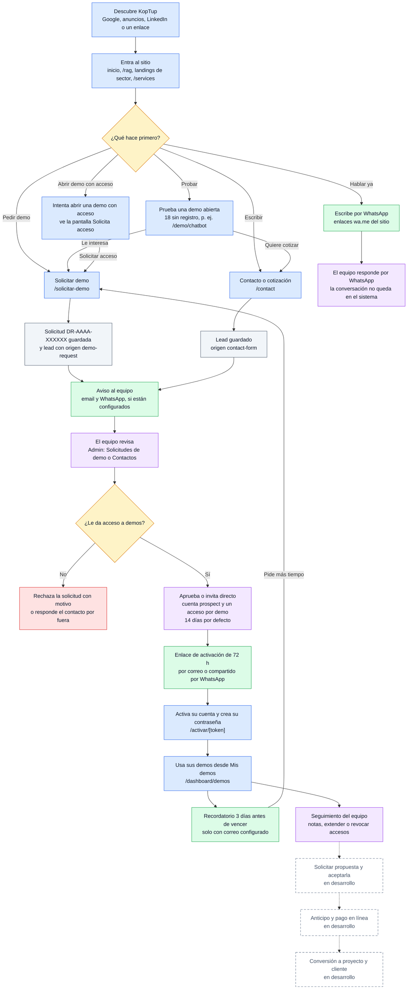
```mermaid
flowchart TD
    classDef visitante fill:#dbeafe,stroke:#2563eb,color:#0f172a
    classDef sistema fill:#f1f5f9,stroke:#475569,color:#0f172a
    classDef admin fill:#f3e8ff,stroke:#9333ea,color:#0f172a
    classDef aviso fill:#dcfce7,stroke:#16a34a,color:#0f172a
    classDef decision fill:#fef3c7,stroke:#d97706,color:#0f172a
    classDef error fill:#fee2e2,stroke:#dc2626,color:#0f172a
    classDef externo fill:#fdf4ff,stroke:#c026d3,color:#0f172a
    classDef desarrollo fill:#ffffff,stroke:#64748b,stroke-dasharray:6 4,color:#475569

    A1["Descubre KopTup<br/>Google, anuncios, LinkedIn o un enlace"]:::visitante
    A2["Entra al sitio<br/>inicio, /rag, landings de sector, /services"]:::visitante
    D1{"¿Qué hace primero?"}:::decision
    B1["Prueba una demo abierta<br/>18 sin registro, p. ej. /demo/chatbot"]:::visitante
    B2["Intenta abrir una demo con acceso<br/>ve la pantalla Solicita acceso"]:::visitante
    C1["Solicitar demo<br/>/solicitar-demo"]:::visitante
    C2["Contacto o cotización<br/>/contact"]:::visitante
    C3["Escribe por WhatsApp<br/>enlaces wa.me del sitio"]:::aviso
    S1["Solicitud DR-AAAA-XXXXXX guardada<br/>y lead con origen demo-request"]:::sistema
    S2["Lead guardado<br/>origen contact-form"]:::sistema
    N1["Aviso al equipo<br/>email y WhatsApp, si están configurados"]:::aviso
    AD0["El equipo revisa<br/>Admin: Solicitudes de demo o Contactos"]:::admin
    AD3["El equipo responde por WhatsApp<br/>la conversación no queda en el sistema"]:::admin
    D2{"¿Le da acceso a demos?"}:::decision
    E1["Rechaza la solicitud con motivo<br/>o responde el contacto por fuera"]:::error
    AD1["Aprueba o invita directo<br/>cuenta prospect y un acceso por demo<br/>14 días por defecto"]:::admin
    N2["Enlace de activación de 72 h<br/>por correo o compartido por WhatsApp"]:::aviso
    V1["Activa su cuenta y crea su contraseña<br/>/activar/[token]"]:::visitante
    V2["Usa sus demos desde Mis demos<br/>/dashboard/demos"]:::visitante
    N3["Recordatorio 3 días antes de vencer<br/>solo con correo configurado"]:::aviso
    AD2["Seguimiento del equipo<br/>notas, extender o revocar accesos"]:::admin
    X1["Solicitar propuesta y aceptarla<br/>en desarrollo"]:::desarrollo
    X2["Anticipo y pago en línea<br/>en desarrollo"]:::desarrollo
    X3["Conversión a proyecto y cliente<br/>en desarrollo"]:::desarrollo

    A1 --> A2 --> D1
    D1 -->|Probar| B1
    D1 -->|Abrir demo con acceso| B2
    D1 -->|Pedir demo| C1
    D1 -->|Escribir| C2
    D1 -->|Hablar ya| C3
    B1 -->|Le interesa| C1
    B1 -->|Quiere cotizar| C2
    B2 -->|Solicitar acceso| C1
    C1 --> S1 --> N1
    C2 --> S2 --> N1
    C3 --> AD3
    N1 --> AD0 --> D2
    D2 -->|No| E1
    D2 -->|Sí| AD1 --> N2 --> V1 --> V2
    V2 --> N3
    N3 -->|Pide más tiempo| C1
    V2 --> AD2
    AD2 -.-> X1 -.-> X2 -.-> X3
```

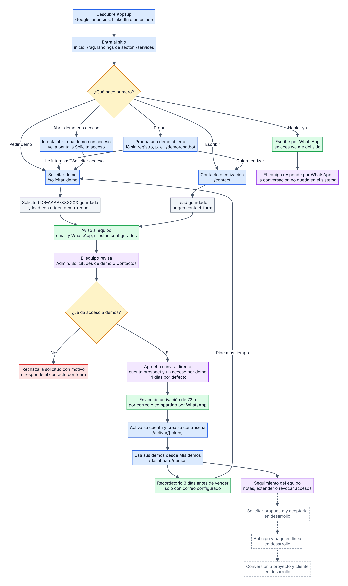

El recorrido completo de una persona, desde que conoce KopTup hasta que usa sus demos con seguimiento del equipo. Lo punteado (propuestas, anticipo, conversión a proyecto y cliente) está en desarrollo y no existe en `main`: ver [Estado y próximos pasos](15-Estado-y-Proximos-Pasos.md). El portal del cliente ya existe, pero hoy nadie pasa a ser cliente de forma automática.

Fuente en el código: `apps/web/src/components/layout/Navbar.tsx`, `apps/web/src/app/demo/page.tsx`, `apps/backend/src/services/demo-requests.service.ts`, `apps/backend/src/services/lead.service.ts`, `apps/backend/src/services/demo-grants.service.ts`, `apps/backend/src/jobs/demo-grants.job.ts`.

---

### 2. Embudo RAG

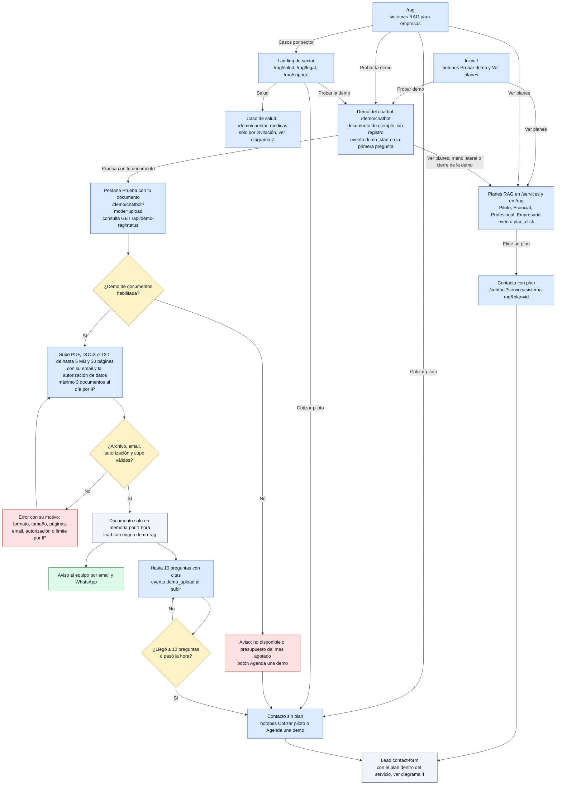
```mermaid
flowchart TD
    classDef visitante fill:#dbeafe,stroke:#2563eb,color:#0f172a
    classDef sistema fill:#f1f5f9,stroke:#475569,color:#0f172a
    classDef admin fill:#f3e8ff,stroke:#9333ea,color:#0f172a
    classDef aviso fill:#dcfce7,stroke:#16a34a,color:#0f172a
    classDef decision fill:#fef3c7,stroke:#d97706,color:#0f172a
    classDef error fill:#fee2e2,stroke:#dc2626,color:#0f172a
    classDef externo fill:#fdf4ff,stroke:#c026d3,color:#0f172a

    E1["Inicio /<br/>botones Probar demo y Ver planes"]:::visitante
    E2["/rag<br/>sistemas RAG para empresas"]:::visitante
    E3["Landing de sector<br/>/rag/salud, /rag/legal, /rag/soporte"]:::visitante
    E4["Caso de salud: /demo/cuentas-medicas<br/>solo por invitación, ver diagrama 7"]:::visitante
    DM["Demo del chatbot /demo/chatbot<br/>documento de ejemplo, sin registro<br/>evento demo_start en la primera pregunta"]:::visitante
    UP["Pestaña Prueba con tu documento<br/>/demo/chatbot?mode=upload<br/>consulta GET /api/demo-rag/status"]:::visitante
    Q1{"¿Demo de documentos<br/>habilitada?"}:::decision
    ER1["Aviso: no disponible o presupuesto del mes agotado<br/>botón Agenda una demo"]:::error
    F1["Sube PDF, DOCX o TXT de hasta 5 MB y 30 páginas<br/>con su email y la autorización de datos<br/>máximo 3 documentos al día por IP"]:::visitante
    Q2{"¿Archivo, email,<br/>autorización y cupo<br/>válidos?"}:::decision
    ER2["Error con su motivo: formato, tamaño, páginas,<br/>email, autorización o límite por IP"]:::error
    S1["Documento solo en memoria por 1 hora<br/>lead con origen demo-rag"]:::sistema
    N1["Aviso al equipo por email y WhatsApp"]:::aviso
    CH["Hasta 10 preguntas con citas<br/>evento demo_upload al subir"]:::visitante
    Q3{"¿Llegó a 10 preguntas<br/>o pasó la hora?"}:::decision
    PL["Planes RAG en /services y en /rag<br/>Piloto, Esencial, Profesional, Empresarial<br/>evento plan_click"]:::visitante
    CT["Contacto con plan<br/>/contact?service=sistema-rag&plan=id"]:::visitante
    CP["Contacto sin plan<br/>botones Cotizar piloto o Agenda una demo"]:::visitante
    LD["Lead contact-form<br/>con el plan dentro del servicio, ver diagrama 4"]:::sistema

    E1 -->|Probar demo| DM
    E1 -->|Ver planes| PL
    E2 -->|Probar la demo| DM
    E2 -->|Ver planes| PL
    E2 -->|Casos por sector| E3
    E2 -->|Cotizar piloto| CP
    E3 -->|Probar la demo| DM
    E3 -->|Salud| E4
    E3 -->|Cotizar piloto| CP
    DM -->|Prueba con tu documento| UP --> Q1
    DM -->|Ver planes: menú lateral o cierre de la demo| PL
    Q1 -->|No| ER1 --> CP
    Q1 -->|Sí| F1 --> Q2
    Q2 -->|No| ER2 --> F1
    Q2 -->|Sí| S1 --> CH
    S1 --> N1
    CH --> Q3
    Q3 -->|No| CH
    Q3 -->|Sí| CP
    PL -->|Elige un plan| CT --> LD
    CP --> LD
```

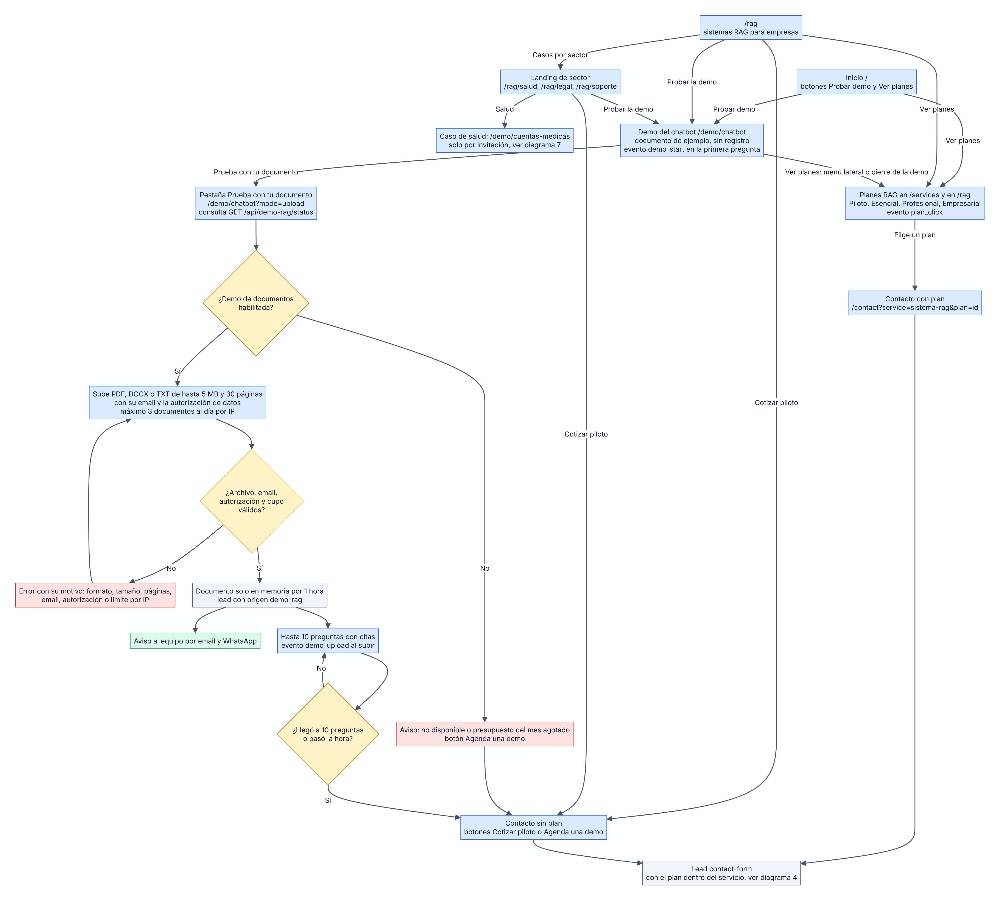

Cómo llega alguien a cotizar un sistema RAG: entra por el inicio, `/rag` o una landing de sector, prueba el chatbot con el documento de ejemplo, opcionalmente con su propio documento, y termina en un plan o en el formulario de contacto. La demo de documentos solo funciona si el servidor la tiene encendida (`DEMO_UPLOAD_ENABLED`, Redis, OpenAI y presupuesto del mes); el archivo nunca se guarda en disco.

Fuente en el código: `apps/web/src/components/home/HomeContent.tsx`, `apps/web/src/components/rag/RagPageContent.tsx`, `apps/web/src/components/rag/RagSectorLanding.tsx`, `apps/web/src/lib/rag-page.ts`, `apps/web/src/lib/rag-plans.ts`, `apps/web/src/components/rag/RagPlans.tsx`, `apps/web/src/app/demo/chatbot/page.tsx`, `apps/web/src/app/demo/chatbot/components/upload/UploadDemo.tsx`, `apps/backend/src/routes/demo-rag.routes.ts`, `apps/backend/src/services/demo-rag.service.ts`.

---

### 3a. Solicitar una demo: entradas y formulario

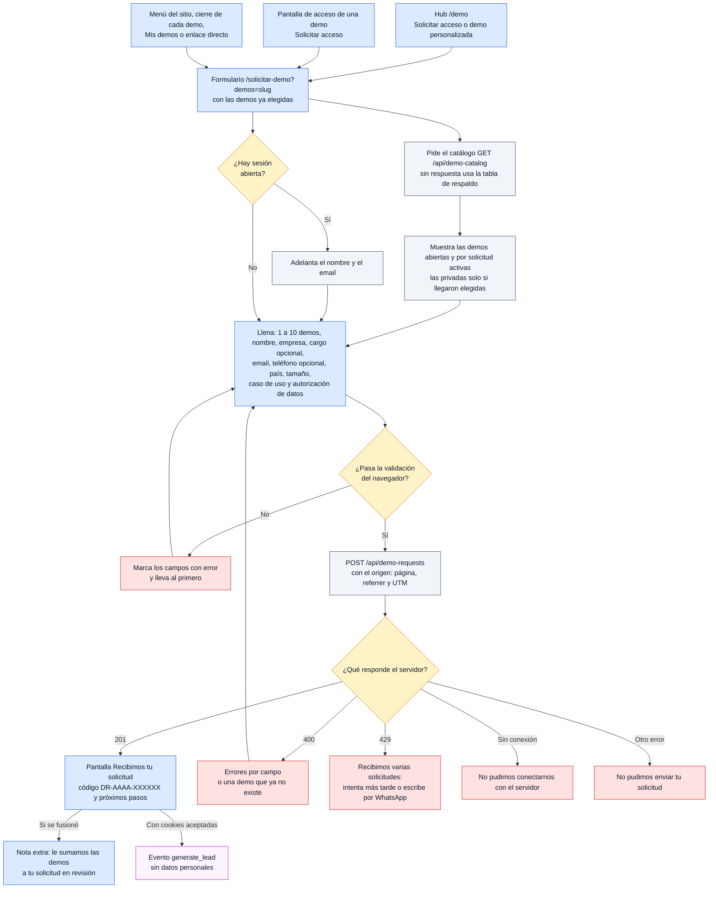
```mermaid
flowchart TD
    classDef visitante fill:#dbeafe,stroke:#2563eb,color:#0f172a
    classDef sistema fill:#f1f5f9,stroke:#475569,color:#0f172a
    classDef admin fill:#f3e8ff,stroke:#9333ea,color:#0f172a
    classDef aviso fill:#dcfce7,stroke:#16a34a,color:#0f172a
    classDef decision fill:#fef3c7,stroke:#d97706,color:#0f172a
    classDef error fill:#fee2e2,stroke:#dc2626,color:#0f172a
    classDef externo fill:#fdf4ff,stroke:#c026d3,color:#0f172a

    IN1["Hub /demo<br/>Solicitar acceso o demo personalizada"]:::visitante
    IN2["Pantalla de acceso de una demo<br/>Solicitar acceso"]:::visitante
    IN3["Menú del sitio, cierre de cada demo,<br/>Mis demos o enlace directo"]:::visitante
    FM["Formulario /solicitar-demo?demos=slug<br/>con las demos ya elegidas"]:::visitante
    CAT["Pide el catálogo GET /api/demo-catalog<br/>sin respuesta usa la tabla de respaldo"]:::sistema
    OPT["Muestra las demos abiertas y por solicitud activas<br/>las privadas solo si llegaron elegidas"]:::sistema
    SES{"¿Hay sesión<br/>abierta?"}:::decision
    PRE["Adelanta el nombre y el email"]:::sistema
    LL["Llena: 1 a 10 demos, nombre, empresa, cargo opcional,<br/>email, teléfono opcional, país, tamaño,<br/>caso de uso y autorización de datos"]:::visitante
    V1{"¿Pasa la validación<br/>del navegador?"}:::decision
    EV["Marca los campos con error<br/>y lleva al primero"]:::error
    POST["POST /api/demo-requests<br/>con el origen: página, referrer y UTM"]:::sistema
    R{"¿Qué responde el servidor?"}:::decision
    OK["Pantalla Recibimos tu solicitud<br/>código DR-AAAA-XXXXXX y próximos pasos"]:::visitante
    FUS["Nota extra: le sumamos las demos<br/>a tu solicitud en revisión"]:::visitante
    GL["Evento generate_lead<br/>sin datos personales"]:::externo
    E400["Errores por campo<br/>o una demo que ya no existe"]:::error
    E429["Recibimos varias solicitudes:<br/>intenta más tarde o escribe por WhatsApp"]:::error
    ENET["No pudimos conectarnos con el servidor"]:::error
    EGEN["No pudimos enviar tu solicitud"]:::error

    IN1 --> FM
    IN2 --> FM
    IN3 --> FM
    FM --> CAT --> OPT --> LL
    FM --> SES
    SES -->|Sí| PRE --> LL
    SES -->|No| LL
    LL --> V1
    V1 -->|No| EV --> LL
    V1 -->|Sí| POST --> R
    R -->|201| OK
    OK -->|Si se fusionó| FUS
    OK -->|Con cookies aceptadas| GL
    R -->|400| E400 --> LL
    R -->|429| E429
    R -->|Sin conexión| ENET
    R -->|Otro error| EGEN
```

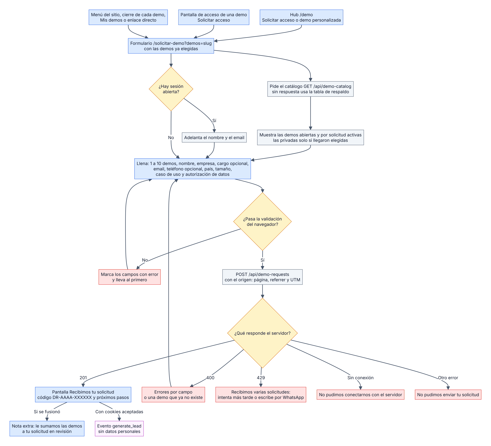

Todas las puertas de entrada al formulario y lo que valida el navegador antes de enviar. El formulario recibe `?demos=a,b` (o `?demo=a`) para dejar elegidas las demos de donde viene la persona; el teléfono es opcional y sirve para que el equipo le comparta el enlace por WhatsApp.

Fuente en el código: `apps/web/src/app/solicitar-demo/page.tsx`, `apps/web/src/components/demo-request/DemoRequestForm.tsx`, `apps/web/src/components/demo/DemoCTA.tsx`, `apps/web/src/components/demo/DemoAccessGate.tsx`, `apps/web/src/app/demo/page.tsx`, `apps/web/src/lib/demo-system.ts`.

---

### 3b. Solicitar una demo: lo que hace el servidor

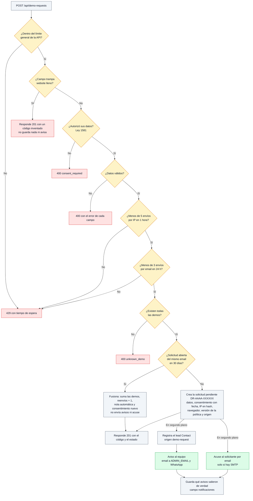
```mermaid
flowchart TD
    classDef visitante fill:#dbeafe,stroke:#2563eb,color:#0f172a
    classDef sistema fill:#f1f5f9,stroke:#475569,color:#0f172a
    classDef admin fill:#f3e8ff,stroke:#9333ea,color:#0f172a
    classDef aviso fill:#dcfce7,stroke:#16a34a,color:#0f172a
    classDef decision fill:#fef3c7,stroke:#d97706,color:#0f172a
    classDef error fill:#fee2e2,stroke:#dc2626,color:#0f172a
    classDef externo fill:#fdf4ff,stroke:#c026d3,color:#0f172a

    P["POST /api/demo-requests"]:::sistema
    G{"¿Dentro del límite<br/>general de la API?"}:::decision
    HP{"¿Campo trampa<br/>website lleno?"}:::decision
    HPB["Responde 201 con un código inventado<br/>no guarda nada ni avisa"]:::error
    CS{"¿Autorizó sus datos?<br/>Ley 1581"}:::decision
    Z{"¿Datos válidos?"}:::decision
    LIP{"¿Menos de 5 envíos<br/>por IP en 1 hora?"}:::decision
    LEM{"¿Menos de 3 envíos<br/>por email en 24 h?"}:::decision
    DE{"¿Existen todas<br/>las demos?"}:::decision
    MG{"¿Solicitud abierta<br/>del mismo email<br/>en 30 días?"}:::decision
    FUS["Fusiona: suma las demos, reenvíos + 1,<br/>nota automática y consentimiento nuevo<br/>no envía avisos ni acuse"]:::sistema
    NEW["Crea la solicitud pendiente DR-AAAA-XXXXXX<br/>datos, consentimiento con fecha, IP en hash,<br/>navegador, versión de la política y origen"]:::sistema
    R201["Responde 201 con el código y el estado"]:::sistema
    LEAD["Registra el lead Contact<br/>origen demo-request"]:::sistema
    AVT["Aviso al equipo<br/>email a ADMIN_EMAIL y WhatsApp"]:::aviso
    ACK["Acuse al solicitante por email<br/>solo si hay SMTP"]:::aviso
    FLAG["Guarda qué avisos salieron de verdad<br/>campo notificaciones"]:::sistema
    E429["429 con tiempo de espera"]:::error
    E400a["400 consent_required"]:::error
    E400b["400 con el error de cada campo"]:::error
    E400c["400 unknown_demo"]:::error

    P --> G
    G -->|No| E429
    G -->|Sí| HP
    HP -->|Sí| HPB
    HP -->|No| CS
    CS -->|No| E400a
    CS -->|Sí| Z
    Z -->|No| E400b
    Z -->|Sí| LIP
    LIP -->|No| E429
    LIP -->|Sí| LEM
    LEM -->|No| E429
    LEM -->|Sí| DE
    DE -->|No| E400c
    DE -->|Sí| MG
    MG -->|Sí| FUS --> R201
    MG -->|No| NEW --> R201
    NEW -->|En segundo plano| LEAD --> AVT --> FLAG
    NEW -->|En segundo plano| ACK --> FLAG
```

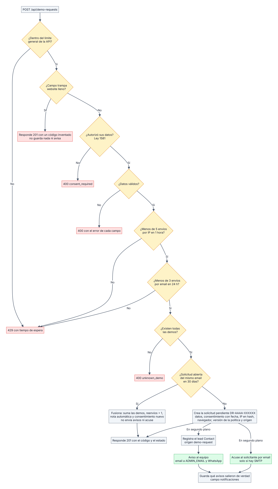

El orden real de las verificaciones del backend. El límite general de la API es de 100 peticiones cada 15 minutos; el campo trampa (honeypot) `website` está oculto, así que solo lo llena un bot. Los cupos por IP y por email se guardan en Redis; si Redis no responde, se cuentan en la memoria del proceso para no dejar el formulario sin límite (variables `DEMO_REQUEST_LIMIT_PER_HOUR` y `DEMO_REQUEST_LIMIT_PER_EMAIL_DAY`). Solo cuentan los envíos válidos: quien corrige errores del formulario no se bloquea. El email se normaliza igual que en el login.

Fuente en el código: `apps/backend/src/routes/demo-public.routes.ts`, `apps/backend/src/services/demo-requests.service.ts`, `apps/backend/src/services/request-limits.service.ts`, `apps/backend/src/services/lead.service.ts`, `apps/backend/src/services/demo-emails.service.ts`, `apps/backend/src/models/DemoRequest.ts`, `apps/backend/src/app.ts`.

---

### 4. Formulario de contacto

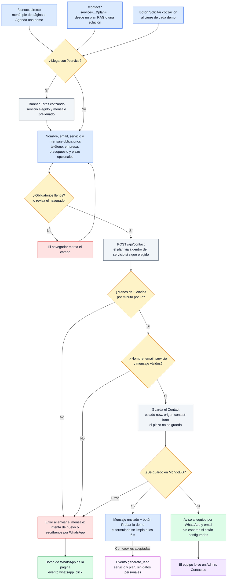
```mermaid
flowchart TD
    classDef visitante fill:#dbeafe,stroke:#2563eb,color:#0f172a
    classDef sistema fill:#f1f5f9,stroke:#475569,color:#0f172a
    classDef admin fill:#f3e8ff,stroke:#9333ea,color:#0f172a
    classDef aviso fill:#dcfce7,stroke:#16a34a,color:#0f172a
    classDef decision fill:#fef3c7,stroke:#d97706,color:#0f172a
    classDef error fill:#fee2e2,stroke:#dc2626,color:#0f172a
    classDef externo fill:#fdf4ff,stroke:#c026d3,color:#0f172a

    IN1["/contact directo<br/>menú, pie de página o Agenda una demo"]:::visitante
    IN2["/contact?service=...&plan=...<br/>desde un plan RAG o una solución"]:::visitante
    IN3["Botón Solicitar cotización<br/>al cierre de cada demo"]:::visitante
    Q0{"¿Llega con ?service?"}:::decision
    PRE["Banner Estás cotizando<br/>servicio elegido y mensaje prellenado"]:::sistema
    FM["Nombre, email, servicio y mensaje obligatorios<br/>teléfono, empresa, presupuesto y plazo opcionales"]:::visitante
    Q1{"¿Obligatorios llenos?<br/>lo revisa el navegador"}:::decision
    E0["El navegador marca el campo"]:::error
    P["POST /api/contact<br/>el plan viaja dentro del servicio si sigue elegido"]:::sistema
    Q2{"¿Menos de 5 envíos<br/>por minuto por IP?"}:::decision
    Q3{"¿Nombre, email, servicio<br/>y mensaje válidos?"}:::decision
    SAVE["Guarda el Contact<br/>estado new, origen contact-form<br/>el plazo no se guarda"]:::sistema
    Q4{"¿Se guardó en MongoDB?"}:::decision
    AV["Aviso al equipo por WhatsApp y email<br/>sin esperar, si están configurados"]:::aviso
    ADM["El equipo lo ve en Admin: Contactos"]:::admin
    OK["Mensaje enviado + botón Probar la demo<br/>el formulario se limpia a los 6 s"]:::visitante
    GL["Evento generate_lead<br/>servicio y plan, sin datos personales"]:::externo
    ERR["Error al enviar el mensaje:<br/>intenta de nuevo o escríbenos por WhatsApp"]:::error
    WA["Botón de WhatsApp de la página<br/>evento whatsapp_click"]:::aviso

    IN1 --> Q0
    IN2 --> Q0
    IN3 --> Q0
    Q0 -->|Sí| PRE --> FM
    Q0 -->|No| FM
    FM --> Q1
    Q1 -->|No| E0 --> FM
    Q1 -->|Sí| P --> Q2
    Q2 -->|No| ERR
    Q2 -->|Sí| Q3
    Q3 -->|No| ERR
    Q3 -->|Sí| SAVE --> Q4
    Q4 -->|Error| ERR
    Q4 -->|Sí| OK
    Q4 -->|Sí| AV --> ADM
    OK -->|Con cookies aceptadas| GL
    ERR --> WA
```

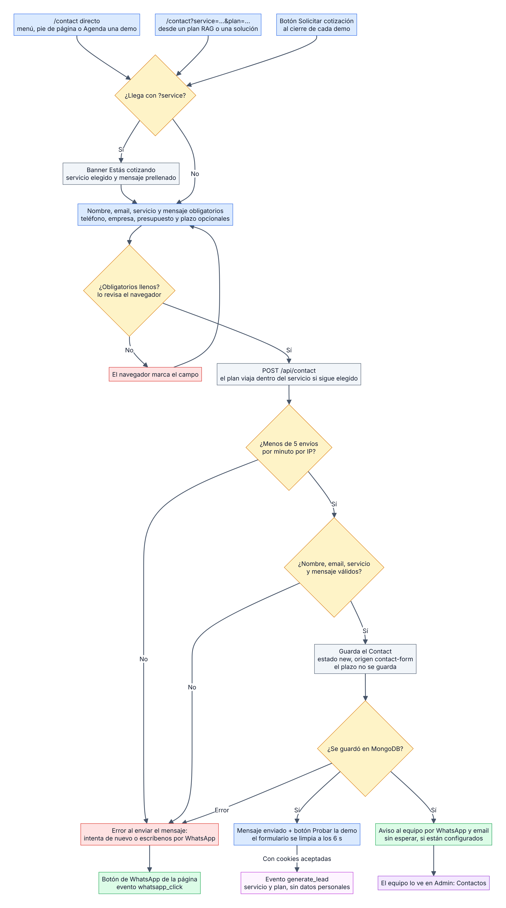

El formulario de `/contact` guarda un lead y avisa al equipo; no crea cuenta ni envía acuse a la persona. Cualquier falla del servidor (límite, validación o base de datos) muestra el mismo mensaje genérico con la salida a WhatsApp.

Fuente en el código: `apps/web/src/app/contact/page.tsx`, `apps/web/src/lib/api.ts`, `apps/backend/src/routes/contact.routes.ts`, `apps/backend/src/controllers/contact.controller.ts`, `apps/backend/src/services/lead.service.ts`, `apps/backend/src/models/Contact.ts`, `apps/backend/src/middleware/rateLimiter.ts`.

---

### 5. Activación de la cuenta con enlace mágico

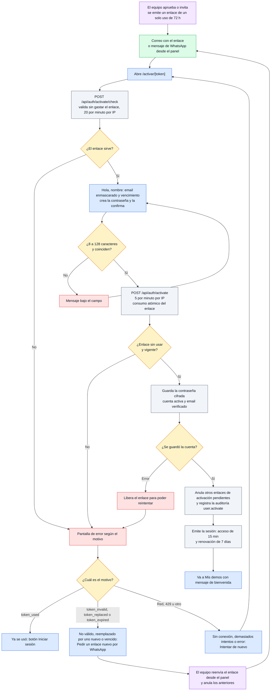
```mermaid
flowchart TD
    classDef visitante fill:#dbeafe,stroke:#2563eb,color:#0f172a
    classDef sistema fill:#f1f5f9,stroke:#475569,color:#0f172a
    classDef admin fill:#f3e8ff,stroke:#9333ea,color:#0f172a
    classDef aviso fill:#dcfce7,stroke:#16a34a,color:#0f172a
    classDef decision fill:#fef3c7,stroke:#d97706,color:#0f172a
    classDef error fill:#fee2e2,stroke:#dc2626,color:#0f172a
    classDef externo fill:#fdf4ff,stroke:#c026d3,color:#0f172a

    A0["El equipo aprueba o invita<br/>se emite un enlace de un solo uso de 72 h"]:::admin
    A1["Correo con el enlace<br/>o mensaje de WhatsApp desde el panel"]:::aviso
    A2["Abre /activar/[token]"]:::visitante
    C1["POST /api/auth/activate/check<br/>valida sin gastar el enlace, 20 por minuto por IP"]:::sistema
    Q1{"¿El enlace sirve?"}:::decision
    ERR["Pantalla de error según el motivo"]:::error
    Q2{"¿Cuál es el motivo?"}:::decision
    U1["Ya se usó: botón Iniciar sesión"]:::visitante
    U2["No válido, reemplazado por uno nuevo o vencido:<br/>Pedir un enlace nuevo por WhatsApp"]:::visitante
    U3["Sin conexión, demasiados intentos o error:<br/>Intentar de nuevo"]:::visitante
    RS["El equipo reenvía el enlace desde el panel<br/>y anula los anteriores"]:::admin
    F1["Hola, nombre: email enmascarado y vencimiento<br/>crea la contraseña y la confirma"]:::visitante
    Q3{"¿8 a 128 caracteres<br/>y coinciden?"}:::decision
    E3["Mensaje bajo el campo"]:::error
    P1["POST /api/auth/activate<br/>5 por minuto por IP<br/>consumo atómico del enlace"]:::sistema
    Q4{"¿Enlace sin usar<br/>y vigente?"}:::decision
    S1["Guarda la contraseña cifrada<br/>cuenta activa y email verificado"]:::sistema
    Q5{"¿Se guardó la cuenta?"}:::decision
    REL["Libera el enlace para poder reintentar"]:::error
    S2["Anula otros enlaces de activación pendientes<br/>y registra la auditoría user.activate"]:::sistema
    S3["Emite la sesión: acceso de 15 min<br/>y renovación de 7 días"]:::sistema
    OK["Va a Mis demos con mensaje de bienvenida"]:::visitante

    A0 --> A1 --> A2 --> C1 --> Q1
    Q1 -->|No| ERR --> Q2
    Q1 -->|Sí| F1 --> Q3
    Q2 -->|token_used| U1
    Q2 -->|token_invalid, token_replaced o token_expired| U2 --> RS --> A1
    Q2 -->|Red, 429 u otro| U3 --> A2
    Q3 -->|No| E3 --> F1
    Q3 -->|Sí| P1 --> Q4
    Q4 -->|No| ERR
    Q4 -->|Sí| S1 --> Q5
    Q5 -->|Error| REL --> ERR
    Q5 -->|Sí| S2 --> S3 --> OK
```

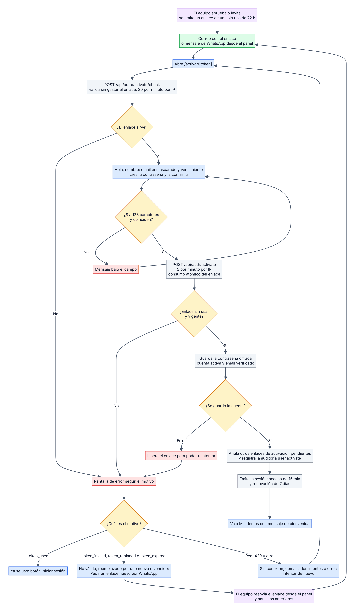

Abrir el enlace no lo gasta (así los filtros de correo que abren enlaces no lo dañan); se gasta solo al crear la contraseña. En la base de datos solo queda el hash del token. Una cuenta invitada también queda activa si la persona restablece la contraseña (diagrama 6c) o entra con Google con el mismo email (diagrama 6a); si intenta iniciar sesión sin activar, el login responde que la cuenta aún no está activada.

Fuente en el código: `apps/web/src/app/activar/[token]/page.tsx`, `apps/web/src/components/demo-request/ActivateAccount.tsx`, `apps/backend/src/controllers/auth.controller.ts`, `apps/backend/src/services/magic-link.service.ts`, `apps/backend/src/models/MagicLinkToken.ts`, `apps/backend/src/config/demos.ts`, `apps/backend/src/services/demo-grants.service.ts`.

---

### 6a. Inicio de sesión

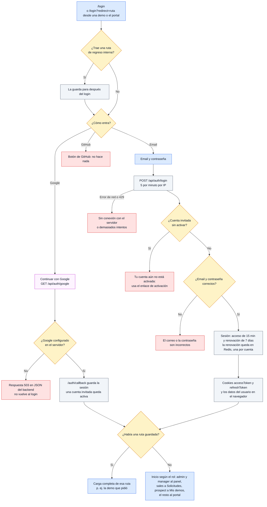
```mermaid
flowchart TD
    classDef visitante fill:#dbeafe,stroke:#2563eb,color:#0f172a
    classDef sistema fill:#f1f5f9,stroke:#475569,color:#0f172a
    classDef admin fill:#f3e8ff,stroke:#9333ea,color:#0f172a
    classDef aviso fill:#dcfce7,stroke:#16a34a,color:#0f172a
    classDef decision fill:#fef3c7,stroke:#d97706,color:#0f172a
    classDef error fill:#fee2e2,stroke:#dc2626,color:#0f172a
    classDef externo fill:#fdf4ff,stroke:#c026d3,color:#0f172a

    L0["/login<br/>o /login?redirect=ruta desde una demo o el portal"]:::visitante
    Q0{"¿Trae una ruta<br/>de regreso interna?"}:::decision
    SV["La guarda para después del login"]:::sistema
    OPT{"¿Cómo entra?"}:::decision
    GG["Continuar con Google<br/>GET /api/auth/google"]:::externo
    QG{"¿Google configurado<br/>en el servidor?"}:::decision
    EG["Respuesta 503 en JSON del backend<br/>no vuelve al login"]:::error
    CB["/auth/callback guarda la sesión<br/>una cuenta invitada queda activa"]:::sistema
    GH["Botón de GitHub: no hace nada"]:::error
    FM["Email y contraseña"]:::visitante
    P["POST /api/auth/login<br/>5 por minuto por IP"]:::sistema
    E3["Sin conexión con el servidor<br/>o demasiados intentos"]:::error
    Q1{"¿Cuenta invitada<br/>sin activar?"}:::decision
    E1["Tu cuenta aún no está activada:<br/>usa el enlace de activación"]:::error
    Q2{"¿Email y contraseña correctos?"}:::decision
    E2["El correo o la contraseña son incorrectos"]:::error
    S1["Sesión: acceso de 15 min y renovación de 7 días<br/>la renovación queda en Redis, una por cuenta"]:::sistema
    S2["Cookies accessToken y refreshToken<br/>y los datos del usuario en el navegador"]:::sistema
    Q3{"¿Había una ruta guardada?"}:::decision
    R1["Carga completa de esa ruta<br/>p. ej. la demo que pidió"]:::visitante
    R2["Inicio según el rol: admin y manager al panel,<br/>sales a Solicitudes, prospect a Mis demos,<br/>el resto al portal"]:::visitante

    L0 --> Q0
    Q0 -->|Sí| SV --> OPT
    Q0 -->|No| OPT
    OPT -->|Google| GG --> QG
    QG -->|No| EG
    QG -->|Sí| CB --> Q3
    OPT -->|GitHub| GH
    OPT -->|Email| FM --> P
    P -->|Error de red o 429| E3
    P --> Q1
    Q1 -->|Sí| E1
    Q1 -->|No| Q2
    Q2 -->|No| E2
    Q2 -->|Sí| S1 --> S2 --> Q3
    Q3 -->|Sí| R1
    Q3 -->|No| R2
```

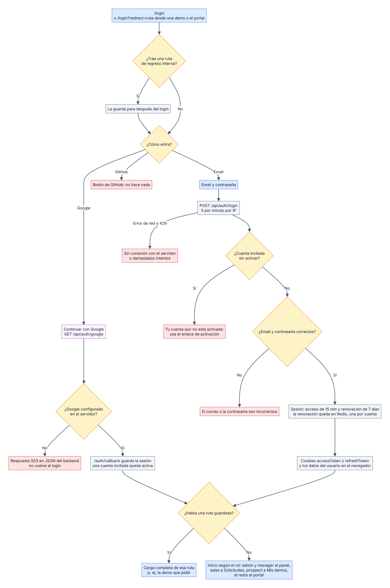

El login acepta una ruta de regreso solo si es interna (empieza por `/` y no por `//`), para evitar redirecciones a otros sitios. Con una ruta guardada hace una carga completa, para que el servidor vuelva a decidir con la sesión nueva (por ejemplo, una demo que antes mostró "Solicita acceso").

Fuente en el código: `apps/web/src/app/login/page.tsx`, `apps/web/src/app/auth/callback/page.tsx`, `apps/web/src/lib/api.ts`, `apps/web/src/lib/auth-roles.ts`, `apps/backend/src/routes/auth.routes.ts`, `apps/backend/src/controllers/auth.controller.ts`, `apps/backend/src/config/passport.ts`.

---

### 6b. Renovación de la sesión y cierre

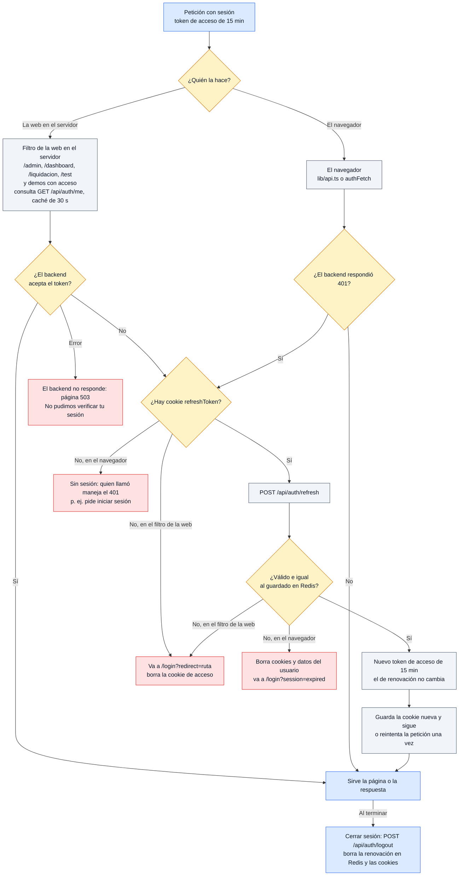
```mermaid
flowchart TD
    classDef visitante fill:#dbeafe,stroke:#2563eb,color:#0f172a
    classDef sistema fill:#f1f5f9,stroke:#475569,color:#0f172a
    classDef admin fill:#f3e8ff,stroke:#9333ea,color:#0f172a
    classDef aviso fill:#dcfce7,stroke:#16a34a,color:#0f172a
    classDef decision fill:#fef3c7,stroke:#d97706,color:#0f172a
    classDef error fill:#fee2e2,stroke:#dc2626,color:#0f172a
    classDef externo fill:#fdf4ff,stroke:#c026d3,color:#0f172a

    R0["Petición con sesión<br/>token de acceso de 15 min"]:::visitante
    W{"¿Quién la hace?"}:::decision
    MW["Filtro de la web en el servidor<br/>/admin, /dashboard, /liquidacion, /test<br/>y demos con acceso<br/>consulta GET /api/auth/me, caché de 30 s"]:::sistema
    ME{"¿El backend<br/>acepta el token?"}:::decision
    BR["El navegador<br/>lib/api.ts o authFetch"]:::sistema
    B401{"¿El backend respondió 401?"}:::decision
    HR{"¿Hay cookie refreshToken?"}:::decision
    RF["POST /api/auth/refresh"]:::sistema
    RQ{"¿Válido e igual<br/>al guardado en Redis?"}:::decision
    NT["Nuevo token de acceso de 15 min<br/>el de renovación no cambia"]:::sistema
    SET["Guarda la cookie nueva y sigue<br/>o reintenta la petición una vez"]:::sistema
    LG["Va a /login?redirect=ruta<br/>borra la cookie de acceso"]:::error
    LS["Borra cookies y datos del usuario<br/>va a /login?session=expired"]:::error
    NS["Sin sesión: quien llamó maneja el 401<br/>p. ej. pide iniciar sesión"]:::error
    DOWN["El backend no responde: página 503<br/>No pudimos verificar tu sesión"]:::error
    OK["Sirve la página o la respuesta"]:::visitante
    OUT["Cerrar sesión: POST /api/auth/logout<br/>borra la renovación en Redis y las cookies"]:::visitante

    R0 --> W
    W -->|La web en el servidor| MW --> ME
    W -->|El navegador| BR --> B401
    ME -->|Sí| OK
    ME -->|Error| DOWN
    ME -->|No| HR
    B401 -->|No| OK
    B401 -->|Sí| HR
    HR -->|Sí| RF --> RQ
    HR -->|No, en el filtro de la web| LG
    HR -->|No, en el navegador| NS
    RQ -->|Sí| NT --> SET --> OK
    RQ -->|No, en el filtro de la web| LG
    RQ -->|No, en el navegador| LS
    OK -->|Al terminar| OUT
```

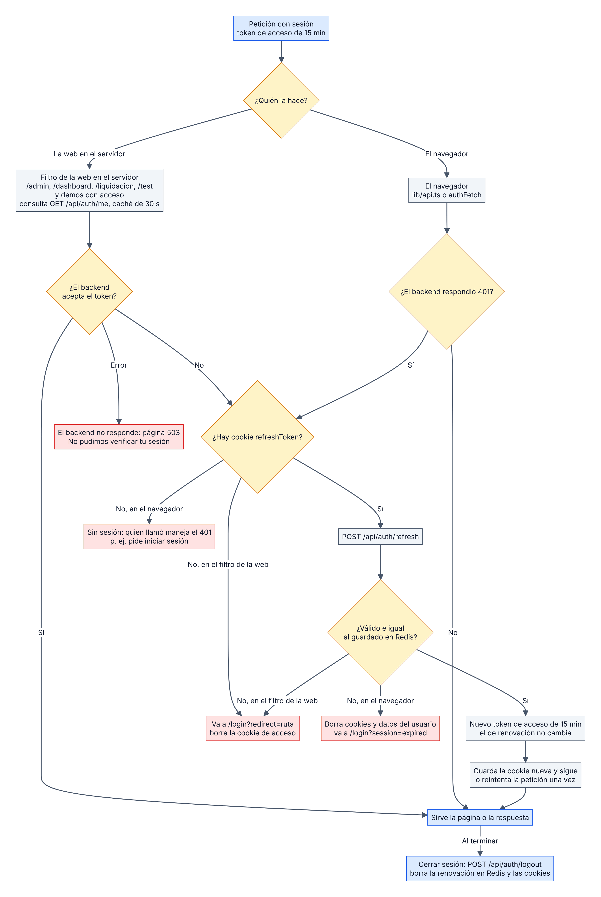

La sesión tiene dos piezas: un token de acceso corto (15 min) y uno de renovación (7 días) guardado en Redis. La renovación ocurre sola, tanto en el servidor de la web como en el navegador. Si el backend no responde, el filtro de la web falla cerrado: no sirve páginas privadas.

Fuente en el código: `apps/web/src/middleware.ts`, `apps/web/src/lib/api.ts`, `apps/web/src/lib/auth-token.ts`, `apps/backend/src/controllers/auth.controller.ts`, `apps/backend/src/middleware/auth.ts`, `apps/backend/src/middleware/rateLimiter.ts`.

---

### 6c. Recuperación de contraseña

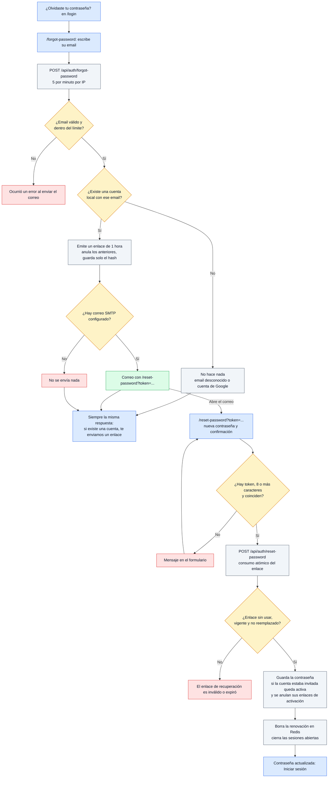
```mermaid
flowchart TD
    classDef visitante fill:#dbeafe,stroke:#2563eb,color:#0f172a
    classDef sistema fill:#f1f5f9,stroke:#475569,color:#0f172a
    classDef admin fill:#f3e8ff,stroke:#9333ea,color:#0f172a
    classDef aviso fill:#dcfce7,stroke:#16a34a,color:#0f172a
    classDef decision fill:#fef3c7,stroke:#d97706,color:#0f172a
    classDef error fill:#fee2e2,stroke:#dc2626,color:#0f172a
    classDef externo fill:#fdf4ff,stroke:#c026d3,color:#0f172a

    F0["¿Olvidaste tu contraseña? en /login"]:::visitante
    F1["/forgot-password: escribe su email"]:::visitante
    P1["POST /api/auth/forgot-password<br/>5 por minuto por IP"]:::sistema
    Q1{"¿Email válido y<br/>dentro del límite?"}:::decision
    E1["Ocurrió un error al enviar el correo"]:::error
    Q2{"¿Existe una cuenta<br/>local con ese email?"}:::decision
    NO["No hace nada<br/>email desconocido o cuenta de Google"]:::sistema
    T1["Emite un enlace de 1 hora<br/>anula los anteriores, guarda solo el hash"]:::sistema
    Q3{"¿Hay correo SMTP configurado?"}:::decision
    M1["Correo con /reset-password?token=..."]:::aviso
    M0["No se envía nada"]:::error
    G1["Siempre la misma respuesta:<br/>si existe una cuenta, te enviamos un enlace"]:::visitante
    R1["/reset-password?token=...<br/>nueva contraseña y confirmación"]:::visitante
    Q4{"¿Hay token, 8 o más caracteres<br/>y coinciden?"}:::decision
    E4["Mensaje en el formulario"]:::error
    P2["POST /api/auth/reset-password<br/>consumo atómico del enlace"]:::sistema
    Q5{"¿Enlace sin usar,<br/>vigente y no reemplazado?"}:::decision
    E5["El enlace de recuperación es inválido o expiró"]:::error
    S1["Guarda la contraseña<br/>si la cuenta estaba invitada queda activa<br/>y se anulan sus enlaces de activación"]:::sistema
    S2["Borra la renovación en Redis<br/>cierra las sesiones abiertas"]:::sistema
    OK["Contraseña actualizada: Iniciar sesión"]:::visitante

    F0 --> F1 --> P1 --> Q1
    Q1 -->|No| E1
    Q1 -->|Sí| Q2
    Q2 -->|No| NO --> G1
    Q2 -->|Sí| T1 --> Q3
    Q3 -->|Sí| M1 --> G1
    Q3 -->|No| M0 --> G1
    M1 -->|Abre el correo| R1 --> Q4
    Q4 -->|No| E4 --> R1
    Q4 -->|Sí| P2 --> Q5
    Q5 -->|No| E5
    Q5 -->|Sí| S1 --> S2 --> OK
```

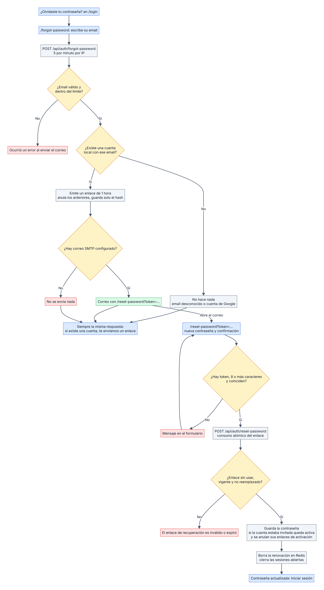

La respuesta es la misma exista o no la cuenta, para no revelar qué emails están registrados. El enlace usa el mismo mecanismo de un solo uso que la activación, con vigencia de 1 hora; si guardar la contraseña falla, el enlace se libera para reintentar.

Fuente en el código: `apps/web/src/app/forgot-password/page.tsx`, `apps/web/src/app/reset-password/page.tsx`, `apps/web/src/lib/api.ts`, `apps/backend/src/routes/auth.routes.ts`, `apps/backend/src/controllers/auth.controller.ts`, `apps/backend/src/services/magic-link.service.ts`, `apps/backend/src/services/email.service.ts`.

---

### 7a. Entrar a una demo: el filtro de la web

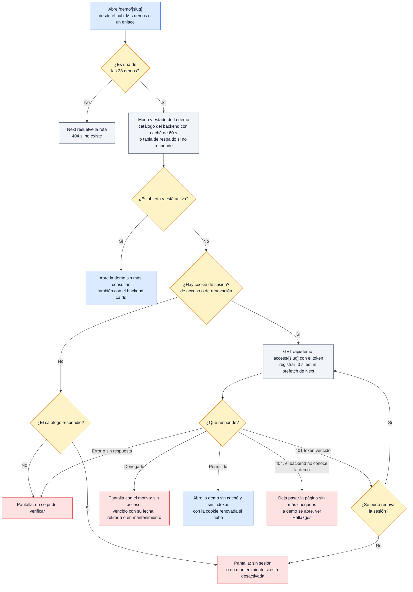
```mermaid
flowchart TD
    classDef visitante fill:#dbeafe,stroke:#2563eb,color:#0f172a
    classDef sistema fill:#f1f5f9,stroke:#475569,color:#0f172a
    classDef admin fill:#f3e8ff,stroke:#9333ea,color:#0f172a
    classDef aviso fill:#dcfce7,stroke:#16a34a,color:#0f172a
    classDef decision fill:#fef3c7,stroke:#d97706,color:#0f172a
    classDef error fill:#fee2e2,stroke:#dc2626,color:#0f172a
    classDef externo fill:#fdf4ff,stroke:#c026d3,color:#0f172a

    S["Abre /demo/[slug]<br/>desde el hub, Mis demos o un enlace"]:::visitante
    Q0{"¿Es una de<br/>las 28 demos?"}:::decision
    NX["Next resuelve la ruta<br/>404 si no existe"]:::sistema
    CAT["Modo y estado de la demo<br/>catálogo del backend con caché de 60 s<br/>o tabla de respaldo si no responde"]:::sistema
    Q1{"¿Es abierta y está activa?"}:::decision
    OPEN1["Abre la demo sin más consultas<br/>también con el backend caído"]:::visitante
    Q2{"¿Hay cookie de sesión?<br/>de acceso o de renovación"}:::decision
    Q3{"¿El catálogo respondió?"}:::decision
    SC1["Pantalla: no se pudo verificar"]:::error
    SC2["Pantalla: sin sesión<br/>o en mantenimiento si está desactivada"]:::error
    ASK["GET /api/demo-access/[slug] con el token<br/>registrar=0 si es un prefetch de Next"]:::sistema
    Q4{"¿Qué responde?"}:::decision
    RF{"¿Se pudo renovar<br/>la sesión?"}:::decision
    SC3["Pantalla con el motivo: sin acceso,<br/>vencido con su fecha, retirado o en mantenimiento"]:::error
    OPEN2["Abre la demo sin caché y sin indexar<br/>con la cookie renovada si hubo"]:::visitante
    NX2["Deja pasar la página sin más chequeos<br/>la demo se abre, ver Hallazgos"]:::error

    S --> Q0
    Q0 -->|No| NX
    Q0 -->|Sí| CAT --> Q1
    Q1 -->|Sí| OPEN1
    Q1 -->|No| Q2
    Q2 -->|No| Q3
    Q3 -->|No| SC1
    Q3 -->|Sí| SC2
    Q2 -->|Sí| ASK --> Q4
    Q4 -->|Permitido| OPEN2
    Q4 -->|Denegado| SC3
    Q4 -->|401 token vencido| RF
    RF -->|Sí| ASK
    RF -->|No| SC2
    Q4 -->|Error o sin respuesta| SC1
    Q4 -->|404, el backend no conoce la demo| NX2
```

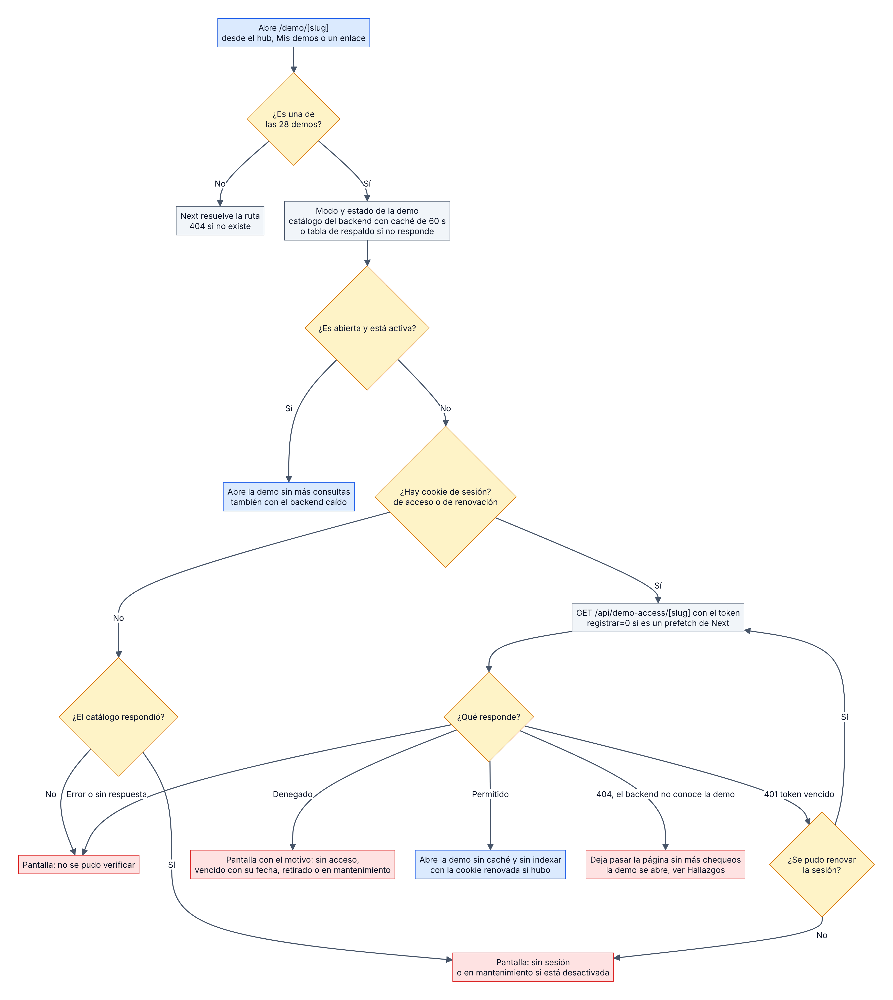

Lo que pasa en el servidor de la web antes de mostrar una demo. Las demos abiertas pasan sin consultar nada más; las de modo "con solicitud" o "solo por invitación" preguntan al backend. Toda "Pantalla" es `/demo-acceso/[slug]?motivo=...&modo=...&ruta=...` mostrada sin cambiar la URL (diagrama 7c); si solo queda la cookie de renovación, se renueva primero. Si el backend responde 404 a una de las 28 demos, la web deja pasar la página tal cual: es un desajuste entre la tabla de la web y la semilla del backend (hallazgo 4 de [Flujos técnicos](Doc-14-3-Flujos-Tecnicos.md#hallazgos)).

Fuente en el código: `apps/web/src/middleware.ts`, `apps/web/src/lib/demo-access-defaults.ts`, `apps/backend/src/routes/demo-public.routes.ts`.

---

### 7b. Entrar a una demo: la decisión del backend

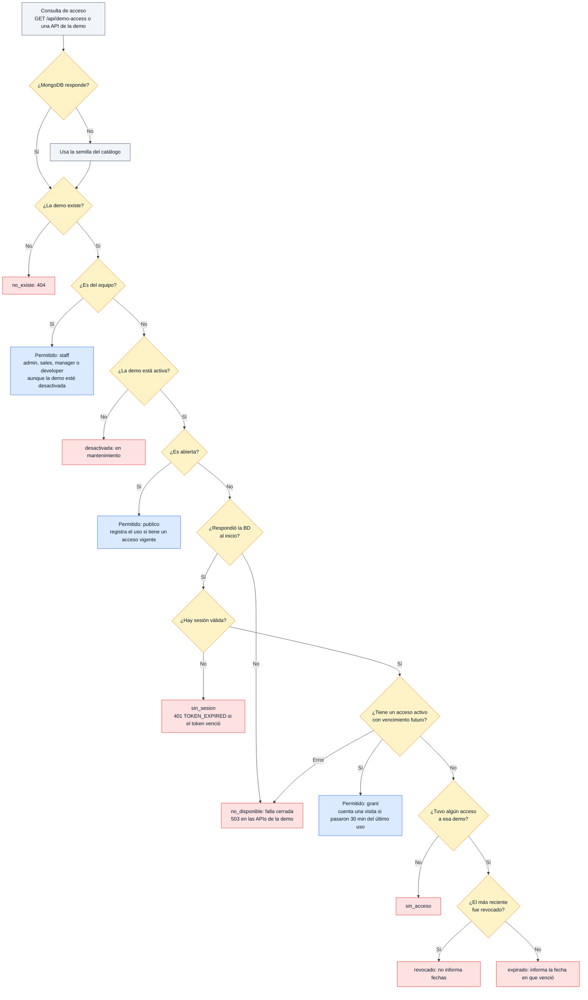
```mermaid
flowchart TD
    classDef visitante fill:#dbeafe,stroke:#2563eb,color:#0f172a
    classDef sistema fill:#f1f5f9,stroke:#475569,color:#0f172a
    classDef admin fill:#f3e8ff,stroke:#9333ea,color:#0f172a
    classDef aviso fill:#dcfce7,stroke:#16a34a,color:#0f172a
    classDef decision fill:#fef3c7,stroke:#d97706,color:#0f172a
    classDef error fill:#fee2e2,stroke:#dc2626,color:#0f172a
    classDef externo fill:#fdf4ff,stroke:#c026d3,color:#0f172a

    IN["Consulta de acceso<br/>GET /api/demo-access o una API de la demo"]:::sistema
    DB{"¿MongoDB responde?"}:::decision
    SEED["Usa la semilla del catálogo"]:::sistema
    Q0{"¿La demo existe?"}:::decision
    R0["no_existe: 404"]:::error
    Q1{"¿Es del equipo?"}:::decision
    OKS["Permitido: staff<br/>admin, sales, manager o developer<br/>aunque la demo esté desactivada"]:::visitante
    Q2{"¿La demo está activa?"}:::decision
    R2["desactivada: en mantenimiento"]:::error
    Q3{"¿Es abierta?"}:::decision
    OKP["Permitido: publico<br/>registra el uso si tiene un acceso vigente"]:::visitante
    Q4{"¿Respondió la BD<br/>al inicio?"}:::decision
    R4["no_disponible: falla cerrada<br/>503 en las APIs de la demo"]:::error
    Q5{"¿Hay sesión válida?"}:::decision
    R5["sin_sesion<br/>401 TOKEN_EXPIRED si el token venció"]:::error
    Q6{"¿Tiene un acceso activo<br/>con vencimiento futuro?"}:::decision
    OKG["Permitido: grant<br/>cuenta una visita si pasaron 30 min del último uso"]:::visitante
    Q7{"¿Tuvo algún acceso<br/>a esa demo?"}:::decision
    R7["sin_acceso"]:::error
    Q8{"¿El más reciente<br/>fue revocado?"}:::decision
    R8a["revocado: no informa fechas"]:::error
    R8b["expirado: informa la fecha en que venció"]:::error

    IN --> DB
    DB -->|Sí| Q0
    DB -->|No| SEED --> Q0
    Q0 -->|No| R0
    Q0 -->|Sí| Q1
    Q1 -->|Sí| OKS
    Q1 -->|No| Q2
    Q2 -->|No| R2
    Q2 -->|Sí| Q3
    Q3 -->|Sí| OKP
    Q3 -->|No| Q4
    Q4 -->|No| R4
    Q4 -->|Sí| Q5
    Q5 -->|No| R5
    Q5 -->|Sí| Q6
    Q6 -->|Sí| OKG
    Q6 -->|Error| R4
    Q6 -->|No| Q7
    Q7 -->|No| R7
    Q7 -->|Sí| Q8
    Q8 -->|Sí| R8a
    Q8 -->|No| R8b
```

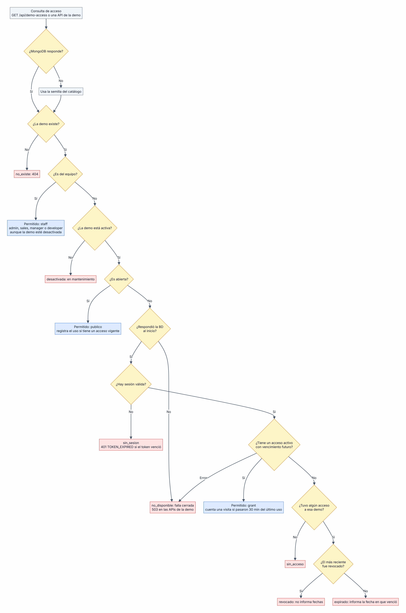

La única fuente de verdad del acceso, en el orden exacto en que se evalúa. La usan la web al abrir `/demo/[slug]` y las APIs de las demos con backend real. La vigencia se compara con la hora en cada consulta: no depende del trabajo horario que marca los accesos vencidos.

Fuente en el código: `apps/backend/src/services/demo-access.service.ts`, `apps/backend/src/middleware/access.ts`, `apps/backend/src/services/demo-catalog.service.ts`, `apps/backend/src/config/demos.ts`.

---

### 7c. Entrar a una demo: la pantalla de acceso

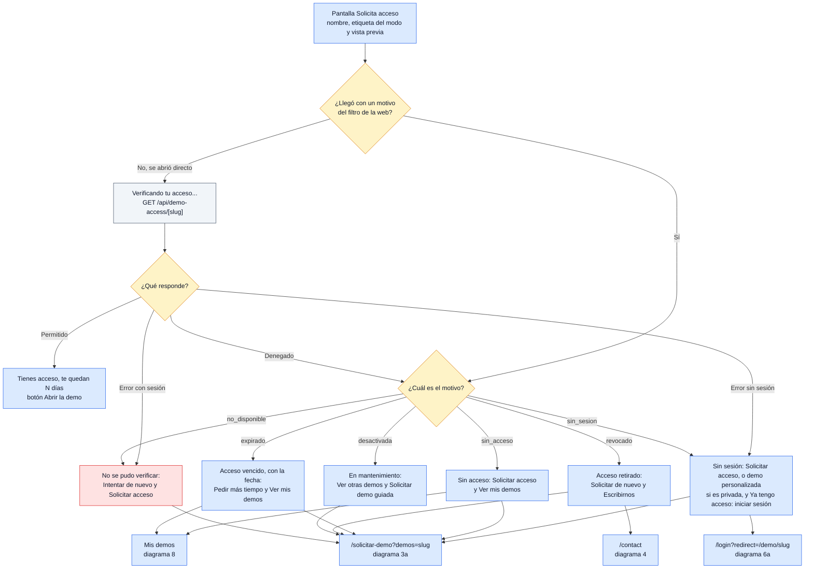
```mermaid
flowchart TD
    classDef visitante fill:#dbeafe,stroke:#2563eb,color:#0f172a
    classDef sistema fill:#f1f5f9,stroke:#475569,color:#0f172a
    classDef admin fill:#f3e8ff,stroke:#9333ea,color:#0f172a
    classDef aviso fill:#dcfce7,stroke:#16a34a,color:#0f172a
    classDef decision fill:#fef3c7,stroke:#d97706,color:#0f172a
    classDef error fill:#fee2e2,stroke:#dc2626,color:#0f172a
    classDef externo fill:#fdf4ff,stroke:#c026d3,color:#0f172a

    P0["Pantalla Solicita acceso<br/>nombre, etiqueta del modo y vista previa"]:::visitante
    Q0{"¿Llegó con un motivo<br/>del filtro de la web?"}:::decision
    CK["Verificando tu acceso...<br/>GET /api/demo-access/[slug]"]:::sistema
    Q1{"¿Qué responde?"}:::decision
    AL["Tienes acceso, te quedan N días<br/>botón Abrir la demo"]:::visitante
    Q2{"¿Cuál es el motivo?"}:::decision
    M1["Sin sesión: Solicitar acceso, o demo personalizada<br/>si es privada, y Ya tengo acceso: iniciar sesión"]:::visitante
    M2["Sin acceso: Solicitar acceso<br/>y Ver mis demos"]:::visitante
    M3["Acceso vencido, con la fecha:<br/>Pedir más tiempo y Ver mis demos"]:::visitante
    M4["Acceso retirado:<br/>Solicitar de nuevo y Escribirnos"]:::visitante
    M5["En mantenimiento:<br/>Ver otras demos y Solicitar demo guiada"]:::visitante
    M6["No se pudo verificar:<br/>Intentar de nuevo y Solicitar acceso"]:::error
    SD["/solicitar-demo?demos=slug<br/>diagrama 3a"]:::visitante
    LG["/login?redirect=/demo/slug<br/>diagrama 6a"]:::visitante
    MD["Mis demos<br/>diagrama 8"]:::visitante
    CT["/contact<br/>diagrama 4"]:::visitante

    P0 --> Q0
    Q0 -->|Sí| Q2
    Q0 -->|No, se abrió directo| CK --> Q1
    Q1 -->|Permitido| AL
    Q1 -->|Denegado| Q2
    Q1 -->|Error con sesión| M6
    Q1 -->|Error sin sesión| M1
    Q2 -->|sin_sesion| M1
    Q2 -->|sin_acceso| M2
    Q2 -->|expirado| M3
    Q2 -->|revocado| M4
    Q2 -->|desactivada| M5
    Q2 -->|no_disponible| M6
    M1 --> SD
    M1 --> LG
    M2 --> SD
    M2 --> MD
    M3 --> SD
    M3 --> MD
    M4 --> SD
    M4 --> CT
    M5 --> SD
    M6 --> SD
```

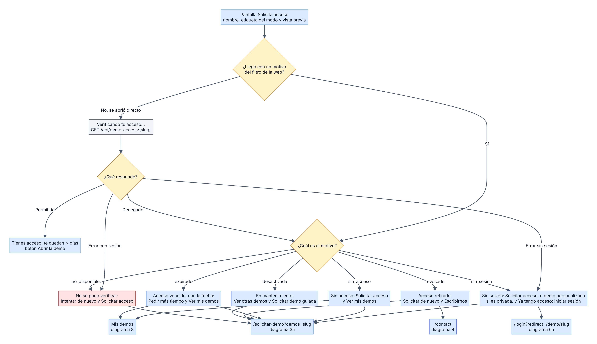

Qué ofrece la pantalla según el motivo. Los botones de solicitud llevan la demo ya elegida, y el de iniciar sesión solo acepta volver a esa misma demo. La pantalla no se indexa en buscadores.

Fuente en el código: `apps/web/src/app/demo-acceso/[slug]/page.tsx`, `apps/web/src/components/demo/DemoAccessGate.tsx`, `apps/web/src/components/demo/DemoAccessBadge.tsx`, `apps/web/messages/es.json` (claves `demoAccess`).

---

### 8. Mis demos del prospecto

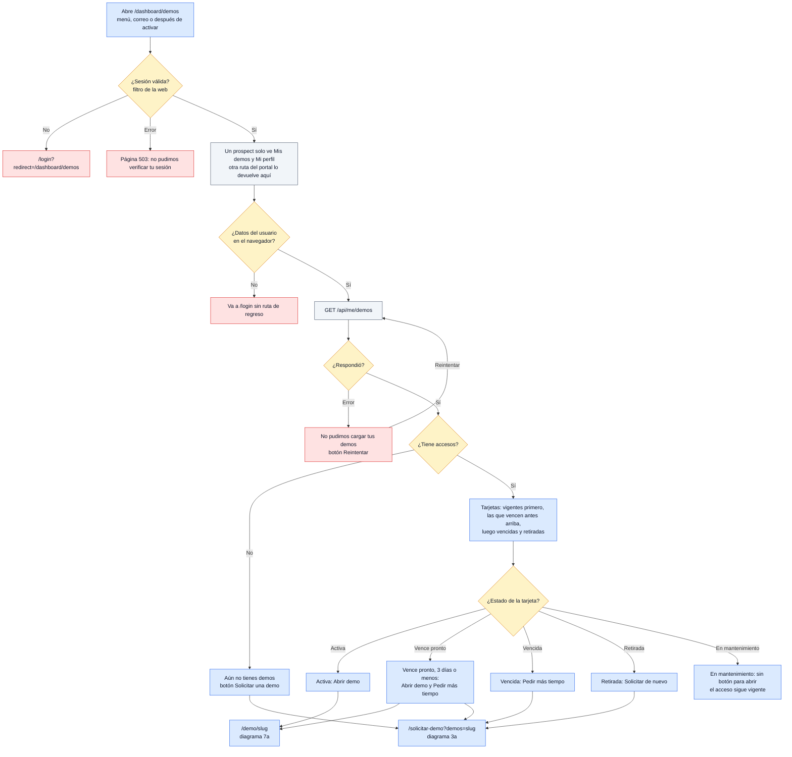
```mermaid
flowchart TD
    classDef visitante fill:#dbeafe,stroke:#2563eb,color:#0f172a
    classDef sistema fill:#f1f5f9,stroke:#475569,color:#0f172a
    classDef admin fill:#f3e8ff,stroke:#9333ea,color:#0f172a
    classDef aviso fill:#dcfce7,stroke:#16a34a,color:#0f172a
    classDef decision fill:#fef3c7,stroke:#d97706,color:#0f172a
    classDef error fill:#fee2e2,stroke:#dc2626,color:#0f172a
    classDef externo fill:#fdf4ff,stroke:#c026d3,color:#0f172a

    IN["Abre /dashboard/demos<br/>menú, correo o después de activar"]:::visitante
    MW{"¿Sesión válida?<br/>filtro de la web"}:::decision
    LG["/login?redirect=/dashboard/demos"]:::error
    DN["Página 503: no pudimos verificar tu sesión"]:::error
    PR["Un prospect solo ve Mis demos y Mi perfil<br/>otra ruta del portal lo devuelve aquí"]:::sistema
    LS{"¿Datos del usuario<br/>en el navegador?"}:::decision
    LG2["Va a /login sin ruta de regreso"]:::error
    API["GET /api/me/demos"]:::sistema
    Q1{"¿Respondió?"}:::decision
    ER["No pudimos cargar tus demos<br/>botón Reintentar"]:::error
    Q2{"¿Tiene accesos?"}:::decision
    EM["Aún no tienes demos<br/>botón Solicitar una demo"]:::visitante
    LST["Tarjetas: vigentes primero, las que vencen antes arriba,<br/>luego vencidas y retiradas"]:::visitante
    Q3{"¿Estado de la tarjeta?"}:::decision
    A1["Activa: Abrir demo"]:::visitante
    A2["Vence pronto, 3 días o menos:<br/>Abrir demo y Pedir más tiempo"]:::visitante
    A3["Vencida: Pedir más tiempo"]:::visitante
    A4["Retirada: Solicitar de nuevo"]:::visitante
    A5["En mantenimiento: sin botón para abrir<br/>el acceso sigue vigente"]:::visitante
    DEMO["/demo/slug<br/>diagrama 7a"]:::visitante
    SOL["/solicitar-demo?demos=slug<br/>diagrama 3a"]:::visitante

    IN --> MW
    MW -->|No| LG
    MW -->|Error| DN
    MW -->|Sí| PR --> LS
    LS -->|No| LG2
    LS -->|Sí| API --> Q1
    Q1 -->|Error| ER
    ER -->|Reintentar| API
    Q1 -->|Sí| Q2
    Q2 -->|No| EM --> SOL
    Q2 -->|Sí| LST --> Q3
    Q3 -->|Activa| A1 --> DEMO
    Q3 -->|Vence pronto| A2
    A2 --> DEMO
    A2 --> SOL
    Q3 -->|Vencida| A3 --> SOL
    Q3 -->|Retirada| A4 --> SOL
    Q3 -->|En mantenimiento| A5
```

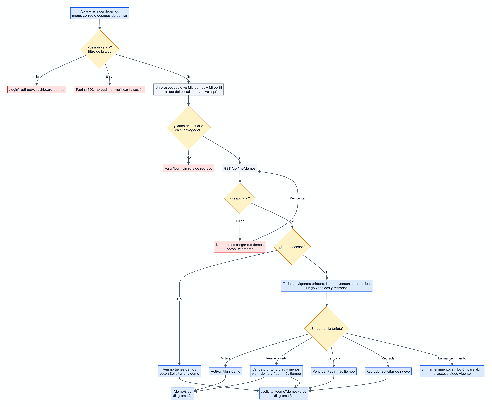

El portal del prospecto: solo lista sus accesos con los días que le quedan y lo que puede hacer con cada uno. Pedir más tiempo no extiende nada por sí solo: abre una solicitud nueva (o se suma a la abierta) para que el equipo decida.

Fuente en el código: `apps/web/src/app/dashboard/demos/page.tsx`, `apps/web/src/components/dashboard/DashboardLayout.tsx`, `apps/web/src/middleware.ts`, `apps/web/src/lib/auth-roles.ts`, `apps/backend/src/routes/demo-public.routes.ts`, `apps/backend/src/services/demo-grants.service.ts`.

---

### 9. Consentimiento de cookies y analítica

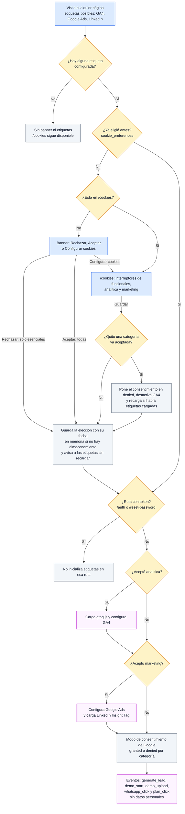
```mermaid
flowchart TD
    classDef visitante fill:#dbeafe,stroke:#2563eb,color:#0f172a
    classDef sistema fill:#f1f5f9,stroke:#475569,color:#0f172a
    classDef admin fill:#f3e8ff,stroke:#9333ea,color:#0f172a
    classDef aviso fill:#dcfce7,stroke:#16a34a,color:#0f172a
    classDef decision fill:#fef3c7,stroke:#d97706,color:#0f172a
    classDef error fill:#fee2e2,stroke:#dc2626,color:#0f172a
    classDef externo fill:#fdf4ff,stroke:#c026d3,color:#0f172a

    P0["Visita cualquier página<br/>etiquetas posibles: GA4, Google Ads, LinkedIn"]:::visitante
    Q0{"¿Hay alguna etiqueta<br/>configurada?"}:::decision
    N0["Sin banner ni etiquetas<br/>/cookies sigue disponible"]:::sistema
    Q1{"¿Ya eligió antes?<br/>cookie_preferences"}:::decision
    Q2{"¿Está en /cookies?"}:::decision
    BN["Banner: Rechazar, Aceptar<br/>o Configurar cookies"]:::visitante
    CF["/cookies: interruptores de funcionales,<br/>analítica y marketing"]:::visitante
    Q6{"¿Quitó una categoría<br/>ya aceptada?"}:::decision
    RV["Pone el consentimiento en denied, desactiva GA4<br/>y recarga si había etiquetas cargadas"]:::sistema
    SV["Guarda la elección con su fecha<br/>en memoria si no hay almacenamiento<br/>y avisa a las etiquetas sin recargar"]:::sistema
    Q3{"¿Ruta con token?<br/>/auth o /reset-password"}:::decision
    NT["No inicializa etiquetas en esa ruta"]:::sistema
    Q4{"¿Aceptó analítica?"}:::decision
    GA["Carga gtag.js y configura GA4"]:::externo
    Q5{"¿Aceptó marketing?"}:::decision
    AD["Configura Google Ads<br/>y carga LinkedIn Insight Tag"]:::externo
    CM["Modo de consentimiento de Google<br/>granted o denied por categoría"]:::sistema
    EV["Eventos: generate_lead, demo_start, demo_upload,<br/>whatsapp_click y plan_click<br/>sin datos personales"]:::externo

    P0 --> Q0
    Q0 -->|No| N0
    Q0 -->|Sí| Q1
    Q1 -->|No| Q2
    Q2 -->|No| BN
    Q2 -->|Sí| CF
    BN -->|Rechazar: solo esenciales| SV
    BN -->|Aceptar: todas| SV
    BN -->|Configurar cookies| CF
    CF -->|Guardar| Q6
    Q6 -->|No| SV
    Q6 -->|Sí| RV --> SV
    Q1 -->|Sí| Q3
    SV --> Q3
    Q3 -->|Sí| NT
    Q3 -->|No| Q4
    Q4 -->|Sí| GA --> Q5
    Q4 -->|No| Q5
    Q5 -->|Sí| AD --> CM
    Q5 -->|No| CM
    CM --> EV
```

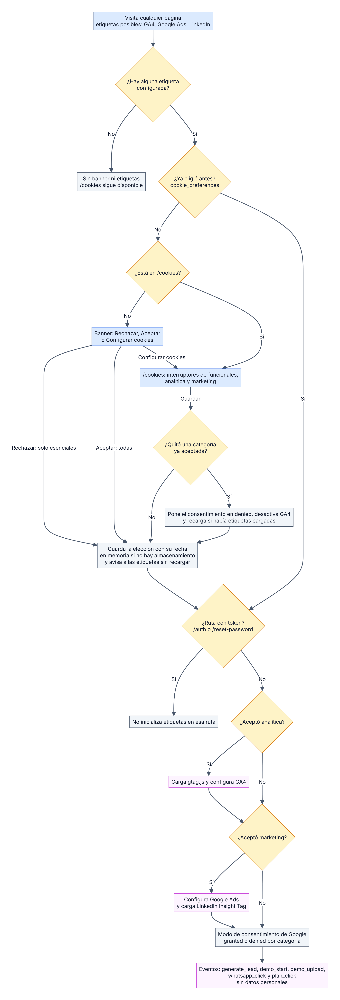

Ninguna etiqueta se carga sin su variable de entorno y sin el consentimiento de su categoría. Los eventos solo se envían si la persona aceptó analítica o marketing y la etiqueta de Google está cargada; nunca llevan email, nombre ni teléfono. Las conversiones de Google Ads se importan desde GA4. Más detalle en [SEO, analítica y legal](Doc-12-SEO-Analitica-y-Legal.md).

Fuente en el código: `apps/web/src/lib/cookie-consent.ts`, `apps/web/src/components/consent/CookieBanner.tsx`, `apps/web/src/app/cookies/page.tsx`, `apps/web/src/components/analytics/Analytics.tsx`, `apps/web/src/lib/analytics.ts`, `apps/web/src/app/demo/chatbot/components/demoEvents.ts`.

---

### 10. Cambio de idioma y de tema

```mermaid
flowchart TD
    classDef visitante fill:#dbeafe,stroke:#2563eb,color:#0f172a
    classDef sistema fill:#f1f5f9,stroke:#475569,color:#0f172a
    classDef admin fill:#f3e8ff,stroke:#9333ea,color:#0f172a
    classDef aviso fill:#dcfce7,stroke:#16a34a,color:#0f172a
    classDef decision fill:#fef3c7,stroke:#d97706,color:#0f172a
    classDef error fill:#fee2e2,stroke:#dc2626,color:#0f172a
    classDef externo fill:#fdf4ff,stroke:#c026d3,color:#0f172a

    subgraph IDI["Idioma"]
        I0["Clic en ES o EN del menú<br/>escritorio o celular"]:::visitante
        I1["Lee la cookie locale<br/>sin cookie cuenta como es"]:::sistema
        I2["Escribe locale=en o es por 1 año"]:::sistema
        I3["Recarga completa de la misma ruta<br/>sin los parámetros de la URL"]:::sistema
        I4["El servidor lee la cookie<br/>layout.tsx e i18n/request.ts"]:::sistema
        Q1{"¿Existen los textos<br/>de ese idioma?"}:::decision
        I5["Carga messages/en.json o es.json<br/>y los textos de demos y ofertas"]:::sistema
        I6["Usa español"]:::error
        I7["Página en el idioma elegido<br/>atributo lang de la página"]:::visitante
    end
    subgraph TEM["Tema"]
        T4["Primera visita: tema claro por defecto"]:::sistema
        T0["Clic en el sol o la luna del menú"]:::visitante
        T1["next-themes cambia entre light y dark"]:::sistema
        T2["Guarda la elección en el navegador<br/>y pone la clase dark en la página"]:::sistema
        T3["Cambian los colores al instante<br/>sin recargar"]:::visitante
    end

    I0 --> I1 --> I2 --> I3 --> I4 --> Q1
    Q1 -->|Sí| I5 --> I7
    Q1 -->|No| I6 --> I7
    T4 --> T0 --> T1 --> T2 --> T3
```

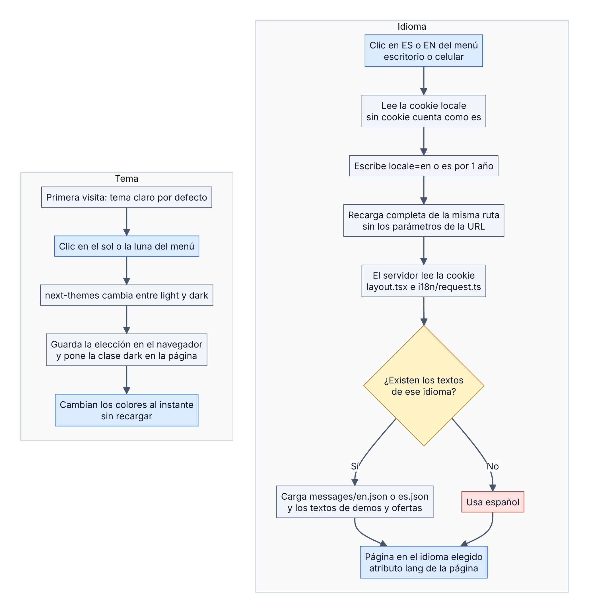

El idioma vive en la cookie `locale` y lo decide el servidor en cada carga; el tema vive en el navegador y cambia sin recargar. Los correos del sistema de demos salen siempre en español.

Fuente en el código: `apps/web/src/components/layout/Navbar.tsx`, `apps/web/src/app/layout.tsx`, `apps/web/src/i18n/request.ts`, `apps/web/src/components/providers/ThemeProvider.tsx`, `apps/backend/src/services/demo-emails.service.ts`.

---

### 11. Recorrido completo: de la solicitud al acceso

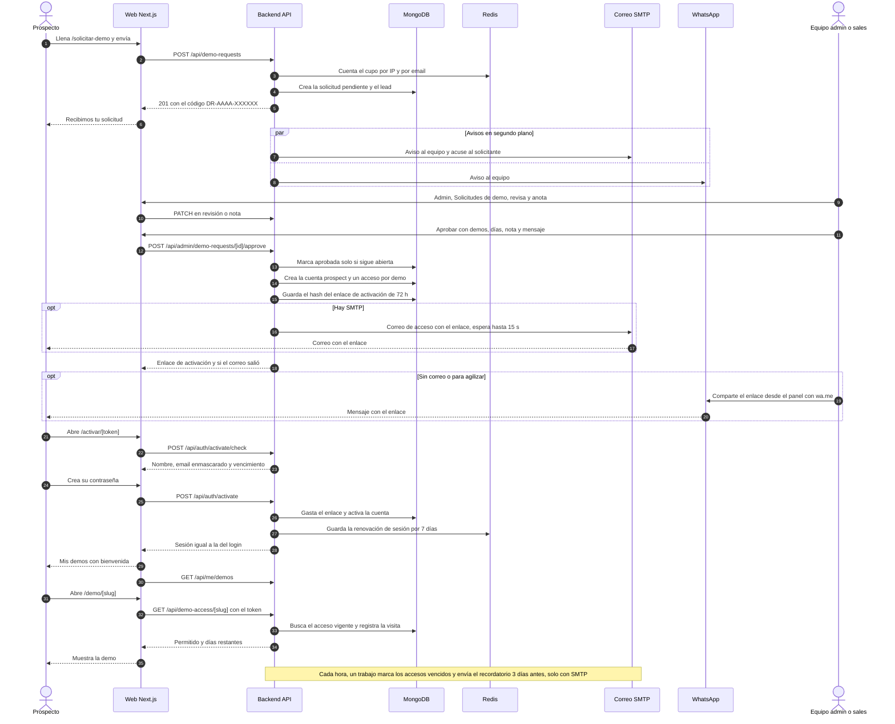
```mermaid
sequenceDiagram
    autonumber
    actor P as Prospecto
    participant W as Web Next.js
    participant B as Backend API
    participant DB as MongoDB
    participant R as Redis
    participant M as Correo SMTP
    participant WA as WhatsApp
    actor E as Equipo admin o sales

    P->>W: Llena /solicitar-demo y envía
    W->>B: POST /api/demo-requests
    B->>R: Cuenta el cupo por IP y por email
    B->>DB: Crea la solicitud pendiente y el lead
    B-->>W: 201 con el código DR-AAAA-XXXXXX
    W-->>P: Recibimos tu solicitud
    par Avisos en segundo plano
        B->>M: Aviso al equipo y acuse al solicitante
    and
        B->>WA: Aviso al equipo
    end
    E->>W: Admin, Solicitudes de demo, revisa y anota
    W->>B: PATCH en revisión o nota
    E->>W: Aprobar con demos, días, nota y mensaje
    W->>B: POST /api/admin/demo-requests/[id]/approve
    B->>DB: Marca aprobada solo si sigue abierta
    B->>DB: Crea la cuenta prospect y un acceso por demo
    B->>DB: Guarda el hash del enlace de activación de 72 h
    opt Hay SMTP
        B->>M: Correo de acceso con el enlace, espera hasta 15 s
        M-->>P: Correo con el enlace
    end
    B-->>W: Enlace de activación y si el correo salió
    opt Sin correo o para agilizar
        E->>WA: Comparte el enlace desde el panel con wa.me
        WA-->>P: Mensaje con el enlace
    end
    P->>W: Abre /activar/[token]
    W->>B: POST /api/auth/activate/check
    B-->>W: Nombre, email enmascarado y vencimiento
    P->>W: Crea su contraseña
    W->>B: POST /api/auth/activate
    B->>DB: Gasta el enlace y activa la cuenta
    B->>R: Guarda la renovación de sesión por 7 días
    B-->>W: Sesión igual a la del login
    W-->>P: Mis demos con bienvenida
    W->>B: GET /api/me/demos
    P->>W: Abre /demo/[slug]
    W->>B: GET /api/demo-access/[slug] con el token
    B->>DB: Busca el acceso vigente y registra la visita
    B-->>W: Permitido y días restantes
    W-->>P: Muestra la demo
    Note over B,M: Cada hora, un trabajo marca los accesos vencidos y envía el recordatorio 3 días antes, solo con SMTP
```

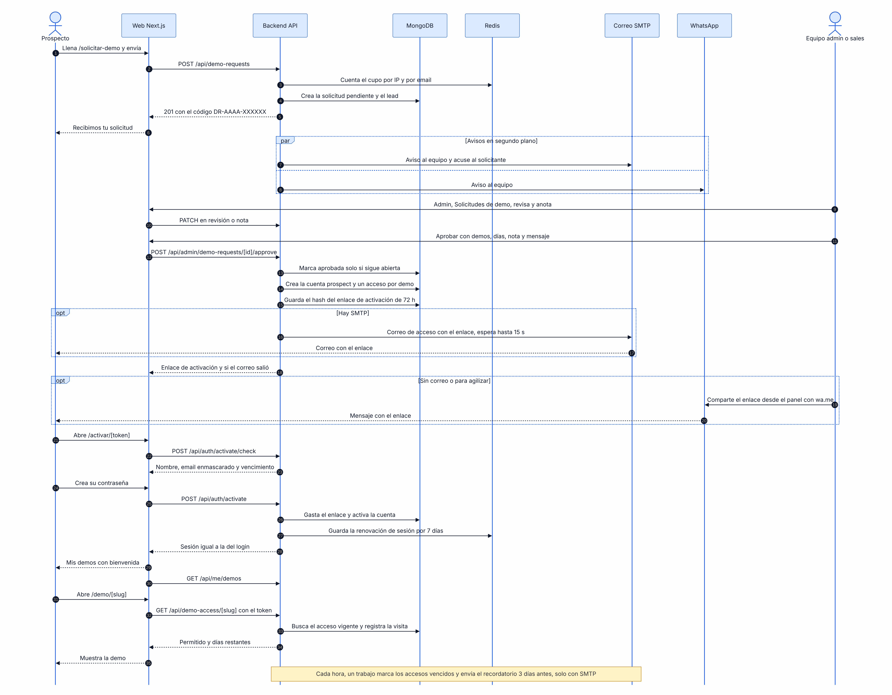

Todos los actores en orden, desde que la persona envía el formulario hasta que abre su primera demo. Si el correo no está configurado, nada se rompe: el panel siempre le muestra al equipo el enlace para copiarlo o enviarlo por WhatsApp. El detalle de la aprobación desde el panel está en [Flujos de administración y operación](Doc-14-2-Flujos-de-Administracion-y-Operacion.md).

Fuente en el código: `apps/web/src/components/demo-request/DemoRequestForm.tsx`, `apps/web/src/app/admin/solicitudes/[id]/page.tsx`, `apps/web/src/components/admin/demos/shared.tsx`, `apps/backend/src/services/demo-requests.service.ts`, `apps/backend/src/services/demo-grants.service.ts`, `apps/backend/src/controllers/auth.controller.ts`, `apps/backend/src/services/demo-access.service.ts`, `apps/backend/src/jobs/demo-grants.job.ts`.

---

### 12. Ciclo de vida de una solicitud

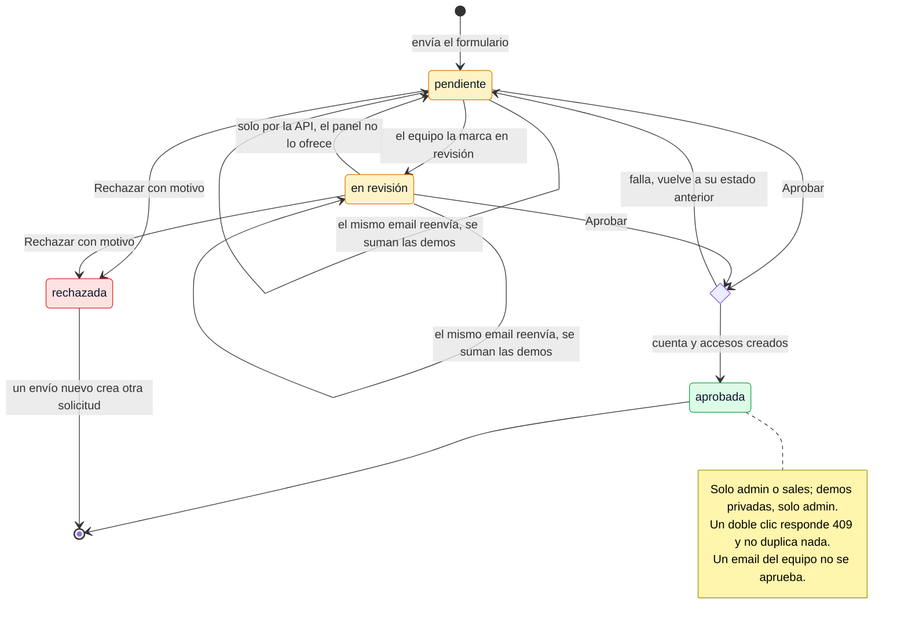
```mermaid
stateDiagram-v2
    direction TB
    classDef abierta fill:#fef3c7,stroke:#d97706,color:#0f172a
    classDef ok fill:#dcfce7,stroke:#16a34a,color:#0f172a
    classDef error fill:#fee2e2,stroke:#dc2626,color:#0f172a

    state "pendiente" as pendiente
    state "en revisión" as en_revision
    state "aprobada" as aprobada
    state "rechazada" as rechazada
    state aprobar <<choice>>

    [*] --> pendiente : envía el formulario
    pendiente --> pendiente : el mismo email reenvía, se suman las demos
    pendiente --> en_revision : el equipo la marca en revisión
    en_revision --> en_revision : el mismo email reenvía, se suman las demos
    en_revision --> pendiente : solo por la API, el panel no lo ofrece
    pendiente --> aprobar : Aprobar
    en_revision --> aprobar : Aprobar
    aprobar --> aprobada : cuenta y accesos creados
    aprobar --> pendiente : falla, vuelve a su estado anterior
    pendiente --> rechazada : Rechazar con motivo
    en_revision --> rechazada : Rechazar con motivo
    aprobada --> [*]
    rechazada --> [*] : un envío nuevo crea otra solicitud

    class pendiente, en_revision abierta
    class aprobada ok
    class rechazada error

    note right of aprobada
        Solo admin o sales; demos privadas, solo admin.
        Un doble clic responde 409 y no duplica nada.
        Un email del equipo no se aprueba.
    end note
```

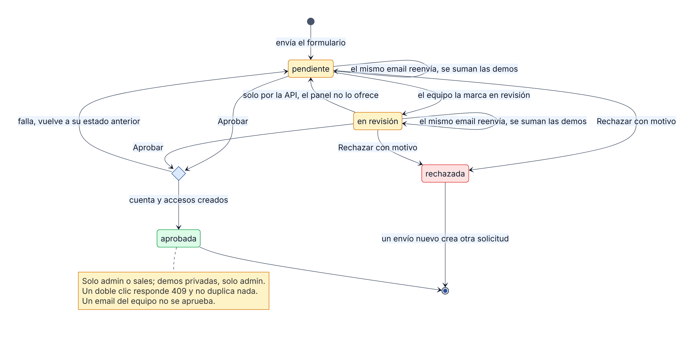

Una solicitud está abierta mientras está pendiente o en revisión; aprobada y rechazada son finales. Si aprobar falla a mitad (por ejemplo, el email es de una cuenta del equipo), la solicitud vuelve al estado que tenía, sea pendiente o en revisión. Un reenvío del mismo email solo se suma si la solicitud abierta tiene menos de 30 días.

Fuente en el código: `apps/backend/src/config/demos.ts`, `apps/backend/src/services/demo-requests.service.ts`, `apps/backend/src/services/demo-grants.service.ts`, `apps/backend/src/routes/admin-demos.routes.ts`, `apps/web/src/app/admin/solicitudes/[id]/page.tsx`.

---

### 13. Ciclo de vida de un acceso

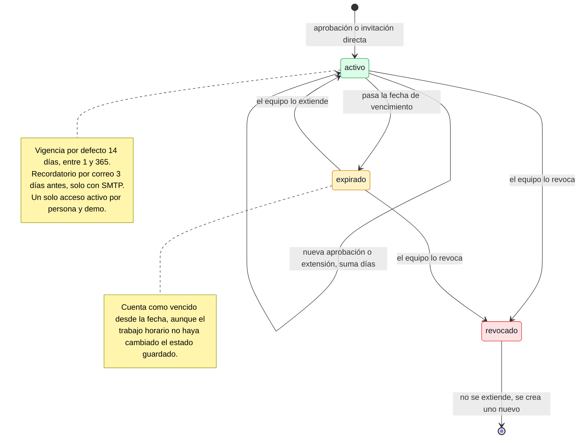
```mermaid
stateDiagram-v2
    direction TB
    classDef ok fill:#dcfce7,stroke:#16a34a,color:#0f172a
    classDef aviso fill:#fef3c7,stroke:#d97706,color:#0f172a
    classDef error fill:#fee2e2,stroke:#dc2626,color:#0f172a

    state "activo" as activo
    state "expirado" as expirado
    state "revocado" as revocado

    [*] --> activo : aprobación o invitación directa
    activo --> activo : nueva aprobación o extensión, suma días
    activo --> expirado : pasa la fecha de vencimiento
    expirado --> activo : el equipo lo extiende
    activo --> revocado : el equipo lo revoca
    expirado --> revocado : el equipo lo revoca
    revocado --> [*] : no se extiende, se crea uno nuevo

    class activo ok
    class expirado aviso
    class revocado error

    note right of activo
        Vigencia por defecto 14 días, entre 1 y 365.
        Recordatorio por correo 3 días antes, solo con SMTP.
        Un solo acceso activo por persona y demo.
    end note
    note right of expirado
        Cuenta como vencido desde la fecha, aunque el
        trabajo horario no haya cambiado el estado guardado.
    end note
```

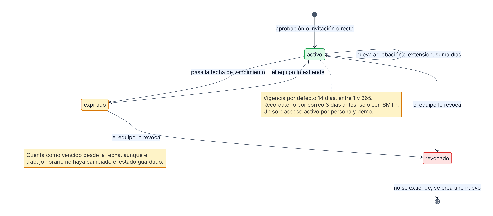

Cada acceso une una cuenta con una demo y tiene fecha de vencimiento. Extender un acceso vencido lo reactiva, salvo que la persona ya tenga otro acceso activo a la misma demo (en ese caso se extiende ese). Un acceso revocado no se puede reactivar.

Fuente en el código: `apps/backend/src/models/DemoGrant.ts`, `apps/backend/src/config/demos.ts`, `apps/backend/src/services/demo-grants.service.ts`, `apps/backend/src/services/demo-access.service.ts`, `apps/backend/src/jobs/demo-grants.job.ts`.

---

## Hallazgos

Cosas que los diagramas muestran tal como están en el código y que conviene revisar:

1. **Una solicitud fusionada no avisa a nadie.** Si el mismo email vuelve a enviar el formulario con una solicitud abierta de menos de 30 días, se suman las demos y se agrega una nota, pero no se registra un lead nuevo, no se avisa al equipo por email ni WhatsApp y no se envía acuse. El equipo solo lo ve si abre la solicitud (`createDemoRequest` en `apps/backend/src/services/demo-requests.service.ts`).
2. **El formulario de contacto no pide autorización de datos.** A diferencia de "Solicitar demo" y "Prueba con tu documento", `/contact` guarda nombre, email y teléfono sin casilla de autorización (Ley 1581) y sin campo trampa contra bots (`apps/web/src/app/contact/page.tsx`, `apps/backend/src/routes/contact.routes.ts`).
3. **El campo "Plazo" del contacto se pierde.** La web lo muestra y lo envía (`timeline`), pero el controlador no lo lee y el modelo `Contact` no lo tiene (`apps/backend/src/controllers/contact.controller.ts`, `apps/backend/src/models/Contact.ts`).
4. **Errores del contacto sin detalle.** Límite de envíos, validación y falla de la base de datos muestran el mismo mensaje genérico; el backend responde solo "Validation error" sin decir qué campo falló.
5. **Botones de inicio de sesión que no llevan a ningún lado.** El botón de GitHub no hace nada; el de Google, si el servidor no tiene Google OAuth configurado, deja a la persona en una respuesta JSON 503 del backend en lugar de volver a `/login` con un mensaje. La casilla "Recordarme" no cambia nada: las cookies duran siempre 15 min y 7 días (`apps/web/src/app/login/page.tsx`, `apps/backend/src/routes/auth.routes.ts`, `apps/web/src/lib/api.ts`).
6. **Cambiar de idioma borra los parámetros de la URL.** El botón ES/EN recarga solo la ruta (`window.location.replace(window.location.pathname)`), así que `/solicitar-demo?demos=erp` pierde la demo elegida y `/contact?service=...&plan=...` pierde el plan. Además, `apps/web/src/i18n/useToggleLocale.tsx` no se usa y nadie envía la cabecera `x-locale` que lee `apps/web/src/i18n/request.ts`.
7. **Una sola sesión renovable por cuenta.** El token de renovación se guarda en Redis con la clave de la cuenta; iniciar sesión en un segundo navegador reemplaza el del primero, que se cierra cuando vence su token de acceso de 15 min (`issueSession` en `apps/backend/src/controllers/auth.controller.ts`).
8. **La página de activación no está en la lista de rutas sin medición.** `NO_TRACKING_PATHS` excluye `/auth` y `/reset-password`, pero no `/activar`, que también lleva el token en la URL. Conviene agregarla (`apps/web/src/components/analytics/Analytics.tsx`).
9. **Recuperar la contraseña sin correo configurado no tiene salida.** Sin SMTP la persona ve "te enviamos un enlace" pero no llega nada, y el panel no ofrece copiar ese enlace como sí hace con el de activación (`forgotPassword` en `apps/backend/src/controllers/auth.controller.ts`).
10. **Mensajes de enlace menos claros al restablecer la contraseña.** El backend devuelve el motivo (usado, reemplazado o vencido), pero `/reset-password` muestra el mismo texto para todos; la activación sí los distingue.
11. **El portal puede perder la ruta de regreso.** Si el navegador no tiene los datos del usuario guardados aunque la sesión siga viva, `DashboardLayout` manda a `/login` sin `redirect`, mientras que el filtro de la web sí lo incluye (`apps/web/src/components/dashboard/DashboardLayout.tsx`).
12. **La landing de salud lleva a una demo solo por invitación.** El caso de cuentas médicas de `/rag/salud` enlaza a `/demo/cuentas-medicas`, que por defecto es privada; el visitante cae en la pantalla "Solicita acceso" (`apps/web/src/lib/rag-page.ts`).
13. **El panel no permite volver una solicitud a pendiente.** La API acepta pasar de "en revisión" a "pendiente", pero el panel solo ofrece "Marcar en revisión" (`apps/web/src/app/admin/solicitudes/[id]/page.tsx`).
