# Flujos de administración y operación

> **Resumen.** Estos son los diagramas de todo lo que hace el **equipo de KopTup** para operar el sitio: procesar solicitudes de demo, gestionar accesos, cambiar el modo de una demo, dar roles, el job que vence los accesos, el camino de un cambio de código hasta producción, la publicación de esta wiki y seis **procedimientos ante fallas** (runbooks). Cada caja corresponde a algo que el código de `main` hace de verdad; los caminos de error y de bloqueo también están dibujados.
>
> **Para quién:** el dueño y el equipo comercial (secciones 1 a 6) y quien opera o despliega el sitio (secciones 7 a 9). Las pantallas, con capturas, están en el [Manual del administrador](Doc-06-Manual-del-Administrador.md); las variables y comandos, en [Operación y despliegue](Doc-11-Operacion-y-Despliegue.md). El índice de todos los diagramas está en [Diagramas de flujo](Doc-14-Diagramas-de-Flujo.md).

## Leyenda de colores

| Color | Qué representa |
|---|---|
| Azul | Visitante, prospecto o cliente |
| Gris | Sistema: web, backend o base de datos |
| Morado | Admin, comercial o equipo técnico de KopTup |
| Verde | Aviso: email, WhatsApp o notificación en pantalla |
| Ámbar (rombo) | Decisión |
| Rojo | Error, bloqueo o camino que no termina bien |
| Fucsia | Servicio externo: GitHub, Vercel, Railway, OpenAI o un proveedor |

## Índice de diagramas

1. **Procesar una solicitud de demo**
   - [1.1 Revisar y aprobar una solicitud](#11-revisar-y-aprobar-una-solicitud)
   - [1.2 Compartir el enlace de activación y hacer seguimiento](#12-compartir-el-enlace-de-activación-y-hacer-seguimiento)
   - [1.3 Rechazar una solicitud](#13-rechazar-una-solicitud)
2. **Gestionar accesos**
   - [2.1 Extender o revocar un acceso](#21-extender-o-revocar-un-acceso)
   - [2.2 Conceder acceso directo por email](#22-conceder-acceso-directo-por-email)
   - [2.3 Efecto inmediato en el sitio](#23-efecto-inmediato-en-el-sitio)
3. **Catálogo de demos**
   - [3.1 Cambiar el modo de una demo](#31-cambiar-el-modo-de-una-demo)
   - [3.2 Cómo se propaga el cambio](#32-cómo-se-propaga-el-cambio)
4. **Roles**
   - [4.1 Cómo una cuenta se vuelve admin](#41-cómo-una-cuenta-se-vuelve-admin)
   - [4.2 Cambiar un rol desde el panel](#42-cambiar-un-rol-desde-el-panel)
   - [4.3 De dónde sale cada rol](#43-de-dónde-sale-cada-rol)
5. [5.1 Rutina diaria sugerida del admin o comercial](#51-rutina-diaria-sugerida-del-admin-o-comercial)
6. **Job de vencimiento y correos**
   - [6.1 Job de vencimiento de accesos y recordatorios](#61-job-de-vencimiento-de-accesos-y-recordatorios)
   - [6.2 Qué correo sale en cada momento](#62-qué-correo-sale-en-cada-momento)
7. **Despliegue**
   - [7.1 Pull request y CI](#71-pull-request-y-ci)
   - [7.2 Merge a main y despliegue a producción](#72-merge-a-main-y-despliegue-a-producción)
8. [8.1 Publicación de la wiki](#81-publicación-de-la-wiki)
9. **Runbooks (procedimientos ante fallas)**
   - [9.1 El backend está caído](#91-el-backend-está-caído)
   - [9.2 El correo no sale](#92-el-correo-no-sale)
   - [9.3 Una demo sigue bloqueada](#93-una-demo-sigue-bloqueada)
   - [9.4 Se agotó el presupuesto de IA](#94-se-agotó-el-presupuesto-de-ia)
   - [9.5 Rotar secretos](#95-rotar-secretos)
   - [9.6 Revertir un despliegue](#96-revertir-un-despliegue)
10. [Hallazgos](#hallazgos)

---

## 1. Procesar una solicitud de demo

Quién puede hacerlo: **admin** y **comercial** (`sales`) aprueban y rechazan; **manager** solo ve. Las demos «Solo por invitación» (`privado`) solo las aprueba un admin.

### 1.1 Revisar y aprobar una solicitud

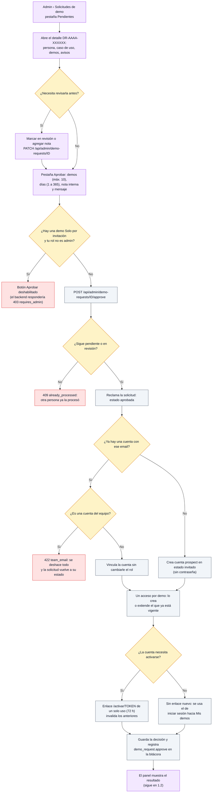
```mermaid
flowchart TD
    classDef visitante fill:#dbeafe,stroke:#2563eb,color:#0f172a
    classDef sistema fill:#f1f5f9,stroke:#475569,color:#0f172a
    classDef admin fill:#f3e8ff,stroke:#9333ea,color:#0f172a
    classDef aviso fill:#dcfce7,stroke:#16a34a,color:#0f172a
    classDef decision fill:#fef3c7,stroke:#d97706,color:#0f172a
    classDef error fill:#fee2e2,stroke:#dc2626,color:#0f172a
    classDef externo fill:#fdf4ff,stroke:#c026d3,color:#0f172a

    A1["Admin › Solicitudes de demo<br/>pestaña Pendientes"]:::admin
    A2["Abre el detalle DR-AAAA-XXXXXX:<br/>persona, caso de uso, demos, avisos"]:::admin
    D1{"¿Necesita revisarla antes?"}:::decision
    A3["Marcar en revisión o agregar nota<br/>PATCH /api/admin/demo-requests/ID"]:::admin
    A4["Pestaña Aprobar: demos (máx. 10),<br/>días (1 a 365), nota interna y mensaje"]:::admin
    D2{"¿Hay una demo Solo por invitación<br/>y tu rol no es admin?"}:::decision
    E1["Botón Aprobar deshabilitado<br/>(el backend respondería 403 requires_admin)"]:::error
    S1["POST /api/admin/demo-requests/ID/approve"]:::sistema
    D3{"¿Sigue pendiente o en revisión?"}:::decision
    E2["409 already_processed:<br/>otra persona ya la procesó"]:::error
    S2["Reclama la solicitud: estado aprobada"]:::sistema
    D4{"¿Ya hay una cuenta con ese email?"}:::decision
    D5{"¿Es una cuenta del equipo?"}:::decision
    E3["422 team_email: se deshace todo<br/>y la solicitud vuelve a su estado"]:::error
    S3["Vincula la cuenta sin cambiarle el rol"]:::sistema
    S4["Crea cuenta prospect en estado invitado<br/>(sin contraseña)"]:::sistema
    S5["Un acceso por demo: lo crea<br/>o extiende el que ya está vigente"]:::sistema
    D6{"¿La cuenta necesita activarse?"}:::decision
    S6["Enlace /activar/TOKEN de un solo uso (72 h)<br/>invalida los anteriores"]:::sistema
    S7["Sin enlace nuevo: se usa el de<br/>iniciar sesión hacia Mis demos"]:::sistema
    S8["Guarda la decisión y registra<br/>demo_request.approve en la bitácora"]:::sistema
    A5["El panel muestra el resultado<br/>(sigue en 1.2)"]:::admin

    A1 --> A2 --> D1
    D1 -->|"Sí"| A3 --> A4
    D1 -->|"No"| A4
    A4 --> D2
    D2 -->|"Sí"| E1
    D2 -->|"No"| S1 --> D3
    D3 -->|"No"| E2
    D3 -->|"Sí"| S2 --> D4
    D4 -->|"Sí"| D5
    D5 -->|"Sí"| E3
    D5 -->|"No"| S3 --> S5
    D4 -->|"No"| S4 --> S5
    S5 --> D6
    D6 -->|"Sí"| S6 --> S8
    D6 -->|"No"| S7 --> S8
    S8 --> A5
```

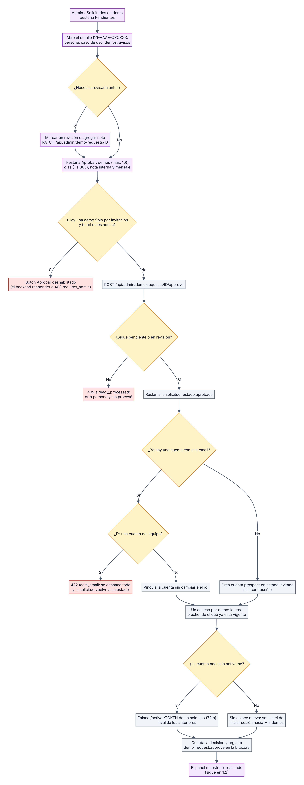

Aprobar crea (o vincula) la cuenta, un acceso por demo y, si la cuenta no tiene contraseña, un enlace de activación. La transición es condicionada al estado: un doble clic recibe 409 sin duplicar nada, y si algo falla a mitad se borran la cuenta y los accesos recién creados. La vigencia propuesta es la mayor «vigencia por defecto» de las demos elegidas.

**Fuente en el código:** `apps/backend/src/services/demo-requests.service.ts` (`approveDemoRequest`), `apps/backend/src/services/demo-grants.service.ts` (`resolveDemosForGrant`, `linkOrCreateProspect`, `upsertGrant`, `grantDemosToPerson`), `apps/backend/src/routes/admin-demos.routes.ts`, `apps/web/src/app/admin/solicitudes/[id]/page.tsx`.

### 1.2 Compartir el enlace de activación y hacer seguimiento

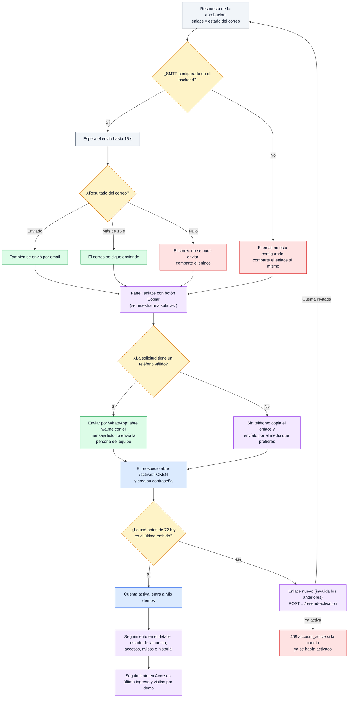
```mermaid
flowchart TD
    classDef visitante fill:#dbeafe,stroke:#2563eb,color:#0f172a
    classDef sistema fill:#f1f5f9,stroke:#475569,color:#0f172a
    classDef admin fill:#f3e8ff,stroke:#9333ea,color:#0f172a
    classDef aviso fill:#dcfce7,stroke:#16a34a,color:#0f172a
    classDef decision fill:#fef3c7,stroke:#d97706,color:#0f172a
    classDef error fill:#fee2e2,stroke:#dc2626,color:#0f172a
    classDef externo fill:#fdf4ff,stroke:#c026d3,color:#0f172a

    B1["Respuesta de la aprobación:<br/>enlace y estado del correo"]:::sistema
    D1{"¿SMTP configurado en el backend?"}:::decision
    B2["Espera el envío hasta 15 s"]:::sistema
    D2{"¿Resultado del correo?"}:::decision
    N1["También se envió por email"]:::aviso
    N2["El correo se sigue enviando"]:::aviso
    E1["El correo no se pudo enviar:<br/>comparte el enlace"]:::error
    E2["El email no está configurado:<br/>comparte el enlace tú mismo"]:::error
    B3["Panel: enlace con botón Copiar<br/>(se muestra una sola vez)"]:::admin
    D3{"¿La solicitud tiene un teléfono válido?"}:::decision
    N3["Enviar por WhatsApp: abre wa.me con el<br/>mensaje listo, lo envía la persona del equipo"]:::aviso
    B4["Sin teléfono: copia el enlace y<br/>envíalo por el medio que prefieras"]:::admin
    P1["El prospecto abre /activar/TOKEN<br/>y crea su contraseña"]:::visitante
    D4{"¿Lo usó antes de 72 h y<br/>es el último emitido?"}:::decision
    P2["Cuenta activa: entra a Mis demos"]:::visitante
    B5["Enlace nuevo (invalida los anteriores)<br/>POST .../resend-activation"]:::admin
    E3["409 account_active si la cuenta<br/>ya se había activado"]:::error
    B6["Seguimiento en el detalle: estado de la cuenta,<br/>accesos, avisos e historial"]:::admin
    B7["Seguimiento en Accesos:<br/>último ingreso y visitas por demo"]:::admin

    B1 --> D1
    D1 -->|"Sí"| B2 --> D2
    D2 -->|"Enviado"| N1
    D2 -->|"Más de 15 s"| N2
    D2 -->|"Falló"| E1
    D1 -->|"No"| E2
    N1 --> B3
    N2 --> B3
    E1 --> B3
    E2 --> B3
    B3 --> D3
    D3 -->|"Sí"| N3 --> P1
    D3 -->|"No"| B4 --> P1
    P1 --> D4
    D4 -->|"Sí"| P2 --> B6 --> B7
    D4 -->|"No"| B5
    B5 -->|"Cuenta invitada"| B1
    B5 -->|"Ya activa"| E3
```

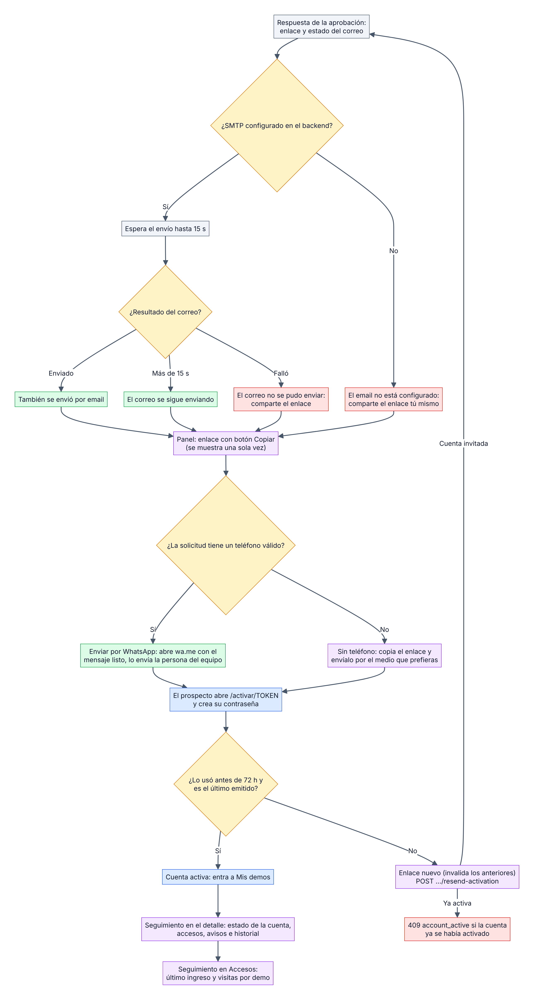

El enlace **siempre** se muestra en el panel, haya o no correo: así la aprobación nunca depende del SMTP. El botón de WhatsApp no envía nada por sí solo: abre WhatsApp con el texto listo (los celulares colombianos de 10 dígitos que empiezan por 3 reciben el prefijo 57). Si la persona ya tenía cuenta activa, el panel muestra el enlace de inicio de sesión en lugar del de activación.

**Fuente en el código:** `apps/web/src/components/admin/demos/shared.tsx` (`ActivationLinkPanel`), `apps/web/src/lib/demo-system.ts` (`whatsappNumber`, `whatsappLink`), `apps/backend/src/services/demo-grants.service.ts` (`awaitEmail`, `resendActivation`), `apps/backend/src/services/magic-link.service.ts`, `apps/backend/src/config/demos.ts`.

### 1.3 Rechazar una solicitud

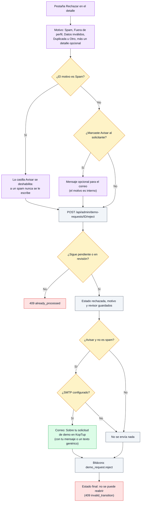
```mermaid
flowchart TD
    classDef visitante fill:#dbeafe,stroke:#2563eb,color:#0f172a
    classDef sistema fill:#f1f5f9,stroke:#475569,color:#0f172a
    classDef admin fill:#f3e8ff,stroke:#9333ea,color:#0f172a
    classDef aviso fill:#dcfce7,stroke:#16a34a,color:#0f172a
    classDef decision fill:#fef3c7,stroke:#d97706,color:#0f172a
    classDef error fill:#fee2e2,stroke:#dc2626,color:#0f172a
    classDef externo fill:#fdf4ff,stroke:#c026d3,color:#0f172a

    R1["Pestaña Rechazar en el detalle"]:::admin
    R2["Motivo: Spam, Fuera de perfil, Datos inválidos,<br/>Duplicada u Otro, más un detalle opcional"]:::admin
    D1{"¿El motivo es Spam?"}:::decision
    R3["La casilla Avisar se deshabilita:<br/>a un spam nunca se le escribe"]:::admin
    D2{"¿Marcaste Avisar al solicitante?"}:::decision
    R4["Mensaje opcional para el correo<br/>(el motivo es interno)"]:::admin
    S1["POST /api/admin/demo-requests/ID/reject"]:::sistema
    D3{"¿Sigue pendiente o en revisión?"}:::decision
    E1["409 already_processed"]:::error
    S2["Estado rechazada, motivo y revisor guardados"]:::sistema
    D4{"¿Avisar y no es spam?"}:::decision
    D5{"¿SMTP configurado?"}:::decision
    N1["Correo: Sobre tu solicitud de demo en KopTup<br/>(con tu mensaje o un texto genérico)"]:::aviso
    S3["No se envía nada"]:::sistema
    S4["Bitácora: demo_request.reject"]:::sistema
    S5["Estado final: no se puede reabrir<br/>(409 invalid_transition)"]:::error

    R1 --> R2 --> D1
    D1 -->|"Sí"| R3 --> S1
    D1 -->|"No"| D2
    D2 -->|"Sí"| R4 --> S1
    D2 -->|"No"| S1
    S1 --> D3
    D3 -->|"No"| E1
    D3 -->|"Sí"| S2 --> D4
    D4 -->|"Sí"| D5
    D4 -->|"No"| S3
    D5 -->|"Sí"| N1 --> S4
    D5 -->|"No"| S3
    S3 --> S4 --> S5
```

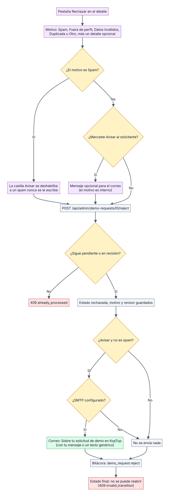

El motivo queda solo para el equipo; al solicitante le llega, si se elige avisar, el mensaje opcional o un texto genérico. Un rechazo es definitivo: si la persona vuelve a llenar el formulario se crea una solicitud nueva (las solicitudes solo se fusionan con una abierta de los últimos 30 días).

**Fuente en el código:** `apps/backend/src/services/demo-requests.service.ts` (`rejectDemoRequest`, `updateDemoRequest`, `createDemoRequest`), `apps/backend/src/services/demo-emails.service.ts` (`sendRequestRejected`), `apps/web/src/app/admin/solicitudes/[id]/page.tsx`.

---

## 2. Gestionar accesos

Un **acceso** es una demo concedida a una persona con fecha de vencimiento. Se gestionan en **Admin › Accesos a demos** (`/admin/accesos`). Admin y comercial actúan; manager solo ve; los accesos a demos «Solo por invitación» solo los toca un admin.

### 2.1 Extender o revocar un acceso

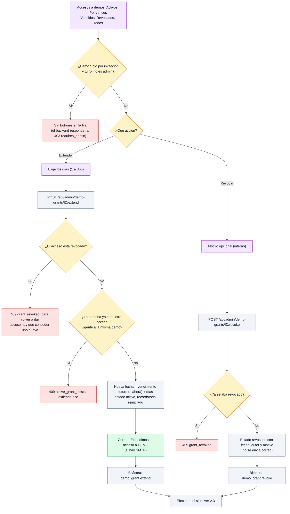
```mermaid
flowchart TD
    classDef visitante fill:#dbeafe,stroke:#2563eb,color:#0f172a
    classDef sistema fill:#f1f5f9,stroke:#475569,color:#0f172a
    classDef admin fill:#f3e8ff,stroke:#9333ea,color:#0f172a
    classDef aviso fill:#dcfce7,stroke:#16a34a,color:#0f172a
    classDef decision fill:#fef3c7,stroke:#d97706,color:#0f172a
    classDef error fill:#fee2e2,stroke:#dc2626,color:#0f172a
    classDef externo fill:#fdf4ff,stroke:#c026d3,color:#0f172a

    G1["Accesos a demos: Activos, Por vencer,<br/>Vencidos, Revocados, Todos"]:::admin
    D0{"¿Demo Solo por invitación<br/>y tu rol no es admin?"}:::decision
    E0["Sin botones en la fila<br/>(el backend respondería 403 requires_admin)"]:::error
    D1{"¿Qué acción?"}:::decision
    X1["Elige los días (1 a 365)"]:::admin
    X2["POST /api/admin/demo-grants/ID/extend"]:::sistema
    D2{"¿El acceso está revocado?"}:::decision
    E1["409 grant_revoked: para volver a dar<br/>acceso hay que conceder uno nuevo"]:::error
    D3{"¿La persona ya tiene otro acceso<br/>vigente a la misma demo?"}:::decision
    E2["409 active_grant_exists: extiende ese"]:::error
    X3["Nueva fecha = vencimiento futuro (o ahora) + días<br/>estado activo, recordatorio reiniciado"]:::sistema
    N1["Correo: Extendimos tu acceso a DEMO<br/>(si hay SMTP)"]:::aviso
    X4["Bitácora: demo_grant.extend"]:::sistema
    V1["Motivo opcional (interno)"]:::admin
    V2["POST /api/admin/demo-grants/ID/revoke"]:::sistema
    D4{"¿Ya estaba revocado?"}:::decision
    E3["409 grant_revoked"]:::error
    V3["Estado revocado con fecha, autor y motivo<br/>(no se envía correo)"]:::sistema
    V4["Bitácora: demo_grant.revoke"]:::sistema
    F1["Efecto en el sitio: ver 2.3"]:::sistema

    G1 --> D0
    D0 -->|"Sí"| E0
    D0 -->|"No"| D1
    D1 -->|"Extender"| X1 --> X2 --> D2
    D2 -->|"Sí"| E1
    D2 -->|"No"| D3
    D3 -->|"Sí"| E2
    D3 -->|"No"| X3 --> N1 --> X4 --> F1
    D1 -->|"Revocar"| V1 --> V2 --> D4
    D4 -->|"Sí"| E3
    D4 -->|"No"| V3 --> V4 --> F1
```

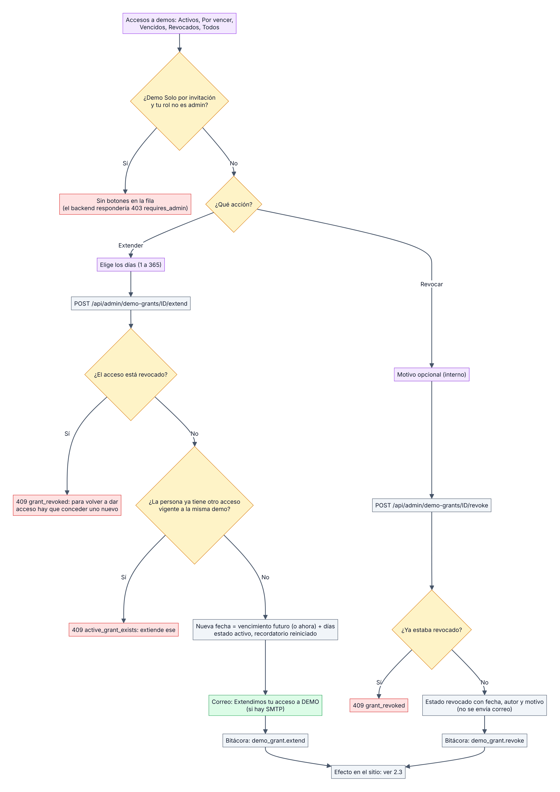

Extender también reactiva un acceso **vencido** (cuenta los días desde hoy). Un acceso **revocado** no se puede extender: es una decisión explícita del equipo y para deshacerla se concede uno nuevo (2.2). Revocar no avisa a la persona.

**Fuente en el código:** `apps/backend/src/services/demo-grants.service.ts` (`loadGrantForAction`, `extendGrant`, `revokeGrant`), `apps/backend/src/routes/admin-demos.routes.ts`, `apps/web/src/app/admin/accesos/page.tsx` (`ExtendDialog`, `RevokeDialog`).

### 2.2 Conceder acceso directo por email

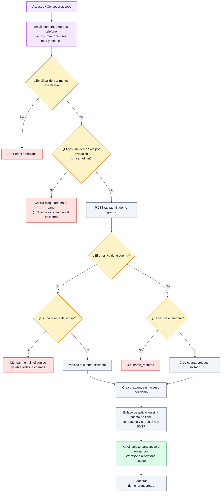
```mermaid
flowchart TD
    classDef visitante fill:#dbeafe,stroke:#2563eb,color:#0f172a
    classDef sistema fill:#f1f5f9,stroke:#475569,color:#0f172a
    classDef admin fill:#f3e8ff,stroke:#9333ea,color:#0f172a
    classDef aviso fill:#dcfce7,stroke:#16a34a,color:#0f172a
    classDef decision fill:#fef3c7,stroke:#d97706,color:#0f172a
    classDef error fill:#fee2e2,stroke:#dc2626,color:#0f172a
    classDef externo fill:#fdf4ff,stroke:#c026d3,color:#0f172a

    C1["Accesos › Conceder acceso"]:::admin
    C2["Email, nombre, empresa, teléfono,<br/>demos (máx. 10), días, nota y mensaje"]:::admin
    D1{"¿Email válido y al menos una demo?"}:::decision
    E1["Error en el formulario"]:::error
    D2{"¿Eliges una demo Solo por invitación<br/>sin ser admin?"}:::decision
    E2["Casilla bloqueada en el panel<br/>(403 requires_admin en el backend)"]:::error
    S1["POST /api/admin/demo-grants"]:::sistema
    D3{"¿El email ya tiene cuenta?"}:::decision
    D4{"¿Es una cuenta del equipo?"}:::decision
    E3["422 team_email: el equipo ya abre todas las demos"]:::error
    D5{"¿Escribiste el nombre?"}:::decision
    E4["400 name_required"]:::error
    S2["Vincula la cuenta existente"]:::sistema
    S3["Crea cuenta prospect invitado"]:::sistema
    S4["Crea o extiende un acceso por demo"]:::sistema
    S5["Enlace de activación si la cuenta no tiene<br/>contraseña y correo si hay SMTP"]:::sistema
    B1["Panel: enlace para copiar o enviar por<br/>WhatsApp al teléfono escrito"]:::aviso
    S6["Bitácora: demo_grant.create"]:::sistema

    C1 --> C2 --> D1
    D1 -->|"No"| E1
    D1 -->|"Sí"| D2
    D2 -->|"Sí"| E2
    D2 -->|"No"| S1 --> D3
    D3 -->|"Sí"| D4
    D4 -->|"Sí"| E3
    D4 -->|"No"| S2 --> S4
    D3 -->|"No"| D5
    D5 -->|"No"| E4
    D5 -->|"Sí"| S3 --> S4
    S4 --> S5 --> B1 --> S6
```

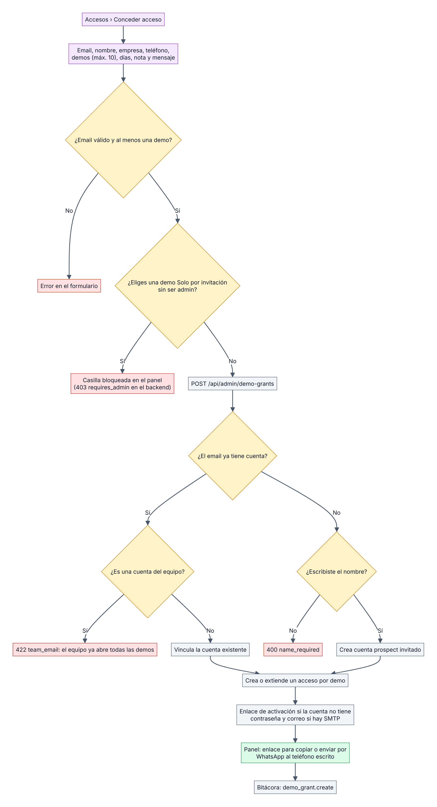

Sirve para dar una demo sin solicitud previa; es **la única vía** para las demos «Solo por invitación» (cuentas médicas y sistema experto en la configuración inicial), y solo la usa un admin. Usa el mismo motor que la aprobación (cuenta, accesos, enlace y correo).

**Fuente en el código:** `apps/backend/src/services/demo-grants.service.ts` (`DirectGrantSchema`, `createDirectGrants`, `grantDemosToPerson`), `apps/web/src/app/admin/accesos/page.tsx` (`InviteDialog`).

### 2.3 Efecto inmediato en el sitio

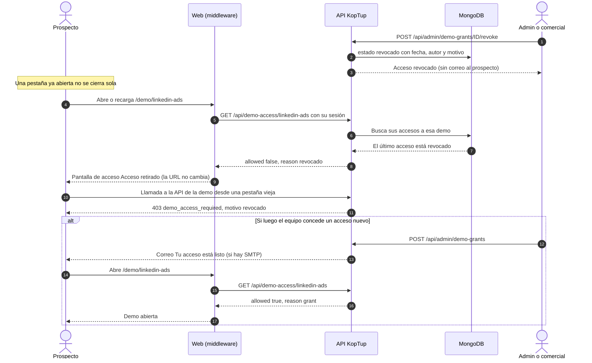
```mermaid
sequenceDiagram
    autonumber
    actor P as Prospecto
    participant MW as Web (middleware)
    participant API as API KopTup
    participant DB as MongoDB
    actor A as Admin o comercial
    A->>API: POST /api/admin/demo-grants/ID/revoke
    API->>DB: estado revocado con fecha, autor y motivo
    API-->>A: Acceso revocado (sin correo al prospecto)
    Note over P: Una pestaña ya abierta no se cierra sola
    P->>MW: Abre o recarga /demo/linkedin-ads
    MW->>API: GET /api/demo-access/linkedin-ads con su sesión
    API->>DB: Busca sus accesos a esa demo
    DB-->>API: El último acceso está revocado
    API-->>MW: allowed false, reason revocado
    MW-->>P: Pantalla de acceso Acceso retirado (la URL no cambia)
    P->>API: Llamada a la API de la demo desde una pestaña vieja
    API-->>P: 403 demo_access_required, motivo revocado
    alt Si luego el equipo concede un acceso nuevo
        A->>API: POST /api/admin/demo-grants
        API-->>P: Correo Tu acceso está listo (si hay SMTP)
        P->>MW: Abre /demo/linkedin-ads
        MW->>API: GET /api/demo-access/linkedin-ads
        API-->>MW: allowed true, reason grant
        MW-->>P: Demo abierta
    end
```

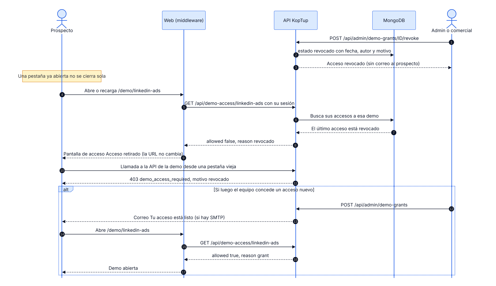

El servidor decide en **cada** apertura de una demo con acceso y en cada llamada a las APIs de las demos con backend propio (cuentas médicas, sistema experto, LinkedIn Ads y gestor de contenido): extender, revocar o conceder se nota en la siguiente navegación, sin esperar al job. Lo único que no se corta es una página que ya estaba cargada en el navegador y no vuelve a llamar al servidor.

**Fuente en el código:** `apps/backend/src/services/demo-access.service.ts` (`evaluateDemoAccess`), `apps/backend/src/middleware/access.ts` (`requireStaffOrDemoAccess`), `apps/web/src/middleware.ts` (`demoGate`, `fetchDemoAccess`), `apps/backend/src/routes/demo-public.routes.ts`.

---

## 3. Catálogo de demos

### 3.1 Cambiar el modo de una demo

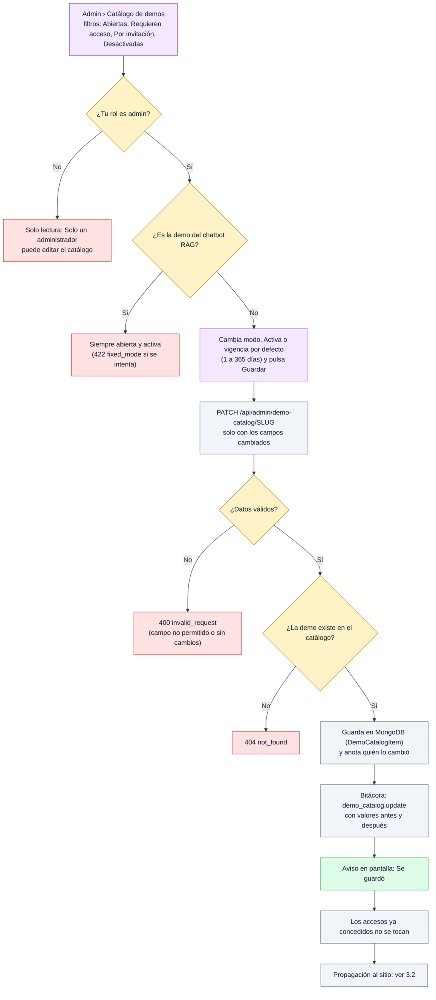
```mermaid
flowchart TD
    classDef visitante fill:#dbeafe,stroke:#2563eb,color:#0f172a
    classDef sistema fill:#f1f5f9,stroke:#475569,color:#0f172a
    classDef admin fill:#f3e8ff,stroke:#9333ea,color:#0f172a
    classDef aviso fill:#dcfce7,stroke:#16a34a,color:#0f172a
    classDef decision fill:#fef3c7,stroke:#d97706,color:#0f172a
    classDef error fill:#fee2e2,stroke:#dc2626,color:#0f172a
    classDef externo fill:#fdf4ff,stroke:#c026d3,color:#0f172a

    K1["Admin › Catálogo de demos<br/>filtros: Abiertas, Requieren acceso, Por invitación, Desactivadas"]:::admin
    D1{"¿Tu rol es admin?"}:::decision
    E1["Solo lectura: Solo un administrador<br/>puede editar el catálogo"]:::error
    D2{"¿Es la demo del chatbot RAG?"}:::decision
    E2["Siempre abierta y activa<br/>(422 fixed_mode si se intenta)"]:::error
    K2["Cambia modo, Activa o vigencia por defecto<br/>(1 a 365 días) y pulsa Guardar"]:::admin
    S1["PATCH /api/admin/demo-catalog/SLUG<br/>solo con los campos cambiados"]:::sistema
    D3{"¿Datos válidos?"}:::decision
    E3["400 invalid_request<br/>(campo no permitido o sin cambios)"]:::error
    D4{"¿La demo existe en el catálogo?"}:::decision
    E4["404 not_found"]:::error
    S2["Guarda en MongoDB (DemoCatalogItem)<br/>y anota quién lo cambió"]:::sistema
    S3["Bitácora: demo_catalog.update<br/>con valores antes y después"]:::sistema
    N1["Aviso en pantalla: Se guardó"]:::aviso
    S4["Los accesos ya concedidos no se tocan"]:::sistema
    F1["Propagación al sitio: ver 3.2"]:::sistema

    K1 --> D1
    D1 -->|"No"| E1
    D1 -->|"Sí"| D2
    D2 -->|"Sí"| E2
    D2 -->|"No"| K2 --> S1 --> D3
    D3 -->|"No"| E3
    D3 -->|"Sí"| D4
    D4 -->|"No"| E4
    D4 -->|"Sí"| S2 --> S3 --> N1 --> S4 --> F1
```

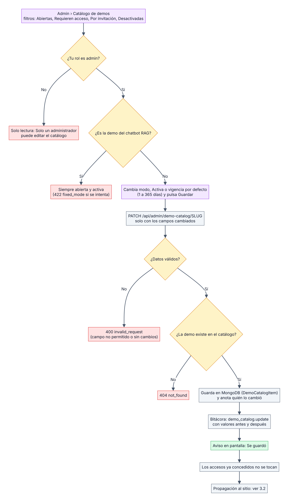

Los tres modos son **Abierta** (`publico`), **Requiere acceso** (`solicitud`) y **Solo por invitación** (`privado`); «Activa» apagada muestra «En mantenimiento» a todos menos al equipo. El catálogo nace de una semilla de 28 demos que se inserta al arrancar sin pisar nunca lo que el admin cambió.

**Fuente en el código:** `apps/backend/src/routes/admin-demos.routes.ts` (`patchCatalog`, `FIXED_PUBLIC_DEMOS`), `apps/backend/src/services/demo-catalog.service.ts`, `apps/backend/src/data/demo-catalog.seed.ts`, `apps/web/src/app/admin/catalogo-demos/page.tsx`.

### 3.2 Cómo se propaga el cambio

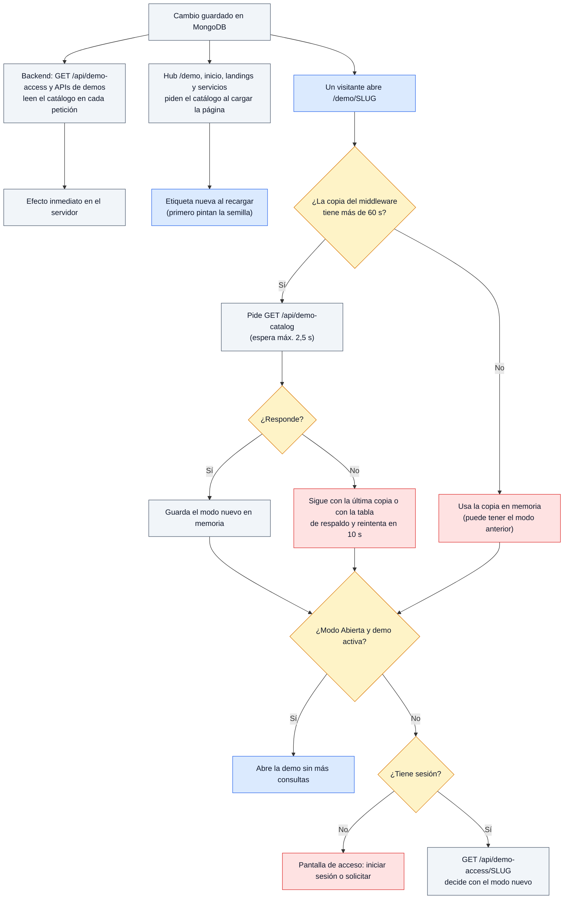
```mermaid
flowchart TD
    classDef visitante fill:#dbeafe,stroke:#2563eb,color:#0f172a
    classDef sistema fill:#f1f5f9,stroke:#475569,color:#0f172a
    classDef admin fill:#f3e8ff,stroke:#9333ea,color:#0f172a
    classDef aviso fill:#dcfce7,stroke:#16a34a,color:#0f172a
    classDef decision fill:#fef3c7,stroke:#d97706,color:#0f172a
    classDef error fill:#fee2e2,stroke:#dc2626,color:#0f172a
    classDef externo fill:#fdf4ff,stroke:#c026d3,color:#0f172a

    C0["Cambio guardado en MongoDB"]:::sistema
    B1["Backend: GET /api/demo-access y APIs de demos<br/>leen el catálogo en cada petición"]:::sistema
    B2["Efecto inmediato en el servidor"]:::sistema
    H1["Hub /demo, inicio, landings y servicios<br/>piden el catálogo al cargar la página"]:::sistema
    H2["Etiqueta nueva al recargar<br/>(primero pintan la semilla)"]:::visitante
    W1["Un visitante abre /demo/SLUG"]:::visitante
    D1{"¿La copia del middleware<br/>tiene más de 60 s?"}:::decision
    W2["Pide GET /api/demo-catalog<br/>(espera máx. 2,5 s)"]:::sistema
    D2{"¿Responde?"}:::decision
    W3["Guarda el modo nuevo en memoria"]:::sistema
    E1["Sigue con la última copia o con la tabla<br/>de respaldo y reintenta en 10 s"]:::error
    W4["Usa la copia en memoria<br/>(puede tener el modo anterior)"]:::error
    D3{"¿Modo Abierta y demo activa?"}:::decision
    W5["Abre la demo sin más consultas"]:::visitante
    D4{"¿Tiene sesión?"}:::decision
    E2["Pantalla de acceso: iniciar sesión o solicitar"]:::error
    W6["GET /api/demo-access/SLUG<br/>decide con el modo nuevo"]:::sistema

    C0 --> B1 --> B2
    C0 --> H1 --> H2
    C0 --> W1 --> D1
    D1 -->|"Sí"| W2 --> D2
    D2 -->|"Sí"| W3 --> D3
    D2 -->|"No"| E1 --> D3
    D1 -->|"No"| W4 --> D3
    D3 -->|"Sí"| W5
    D3 -->|"No"| D4
    D4 -->|"No"| E2
    D4 -->|"Sí"| W6
```

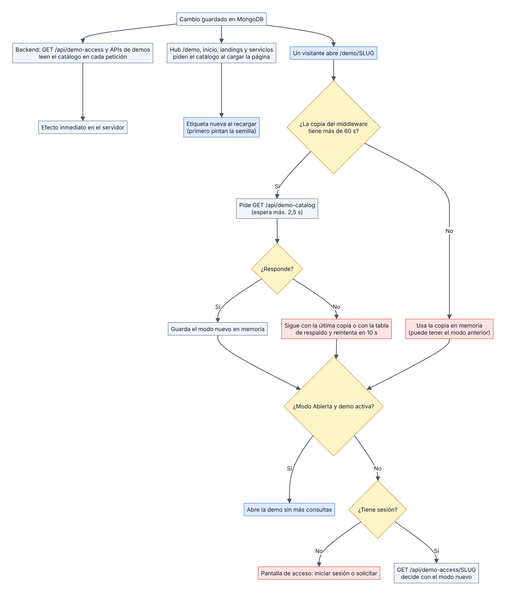

El backend aplica el cambio al instante; la web lo aplica **en máximo un minuto**, porque el middleware de cada instancia guarda el catálogo 60 s en memoria. Ese minuto solo se nota cuando la copia vieja dice «Abierta» (deja pasar sin preguntar) o cuando el visitante no tiene sesión; si hay sesión y la demo no es abierta, pregunta al backend, que ya decide con el modo nuevo.

**Fuente en el código:** `apps/web/src/middleware.ts` (`catalogEntry`, `CATALOG_TTL_MS`, `CATALOG_RETRY_MS`, `demoGate`), `apps/web/src/lib/use-demo-catalog.ts`, `apps/web/src/lib/demo-access-defaults.ts`, `apps/backend/src/routes/demo-public.routes.ts`.

---

## 4. Roles

### 4.1 Cómo una cuenta se vuelve admin

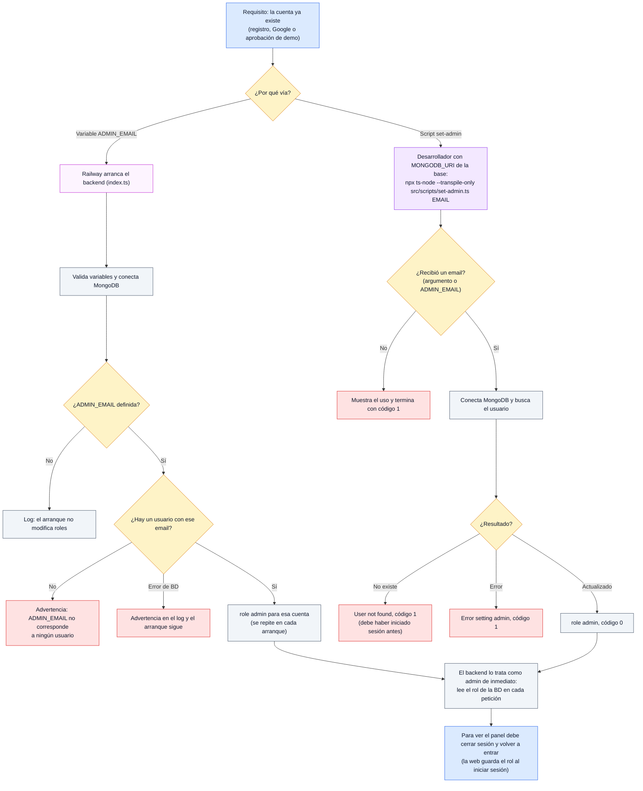
```mermaid
flowchart TD
    classDef visitante fill:#dbeafe,stroke:#2563eb,color:#0f172a
    classDef sistema fill:#f1f5f9,stroke:#475569,color:#0f172a
    classDef admin fill:#f3e8ff,stroke:#9333ea,color:#0f172a
    classDef aviso fill:#dcfce7,stroke:#16a34a,color:#0f172a
    classDef decision fill:#fef3c7,stroke:#d97706,color:#0f172a
    classDef error fill:#fee2e2,stroke:#dc2626,color:#0f172a
    classDef externo fill:#fdf4ff,stroke:#c026d3,color:#0f172a

    P0["Requisito: la cuenta ya existe<br/>(registro, Google o aprobación de demo)"]:::visitante
    D0{"¿Por qué vía?"}:::decision
    A1["Railway arranca el backend (index.ts)"]:::externo
    A2["Valida variables y conecta MongoDB"]:::sistema
    D1{"¿ADMIN_EMAIL definida?"}:::decision
    A3["Log: el arranque no modifica roles"]:::sistema
    D2{"¿Hay un usuario con ese email?"}:::decision
    E1["Advertencia: ADMIN_EMAIL no corresponde<br/>a ningún usuario"]:::error
    E2["Advertencia en el log y el arranque sigue"]:::error
    A4["role admin para esa cuenta<br/>(se repite en cada arranque)"]:::sistema
    S1["Desarrollador con MONGODB_URI de la base:<br/>npx ts-node --transpile-only src/scripts/set-admin.ts EMAIL"]:::admin
    D3{"¿Recibió un email?<br/>(argumento o ADMIN_EMAIL)"}:::decision
    E3["Muestra el uso y termina con código 1"]:::error
    S2["Conecta MongoDB y busca el usuario"]:::sistema
    D4{"¿Resultado?"}:::decision
    E4["User not found, código 1<br/>(debe haber iniciado sesión antes)"]:::error
    E5["Error setting admin, código 1"]:::error
    S3["role admin, código 0"]:::sistema
    R1["El backend lo trata como admin de inmediato:<br/>lee el rol de la BD en cada petición"]:::sistema
    R2["Para ver el panel debe cerrar sesión y volver a entrar<br/>(la web guarda el rol al iniciar sesión)"]:::visitante

    P0 --> D0
    D0 -->|"Variable ADMIN_EMAIL"| A1 --> A2 --> D1
    D1 -->|"No"| A3
    D1 -->|"Sí"| D2
    D2 -->|"No"| E1
    D2 -->|"Error de BD"| E2
    D2 -->|"Sí"| A4 --> R1
    D0 -->|"Script set-admin"| S1 --> D3
    D3 -->|"No"| E3
    D3 -->|"Sí"| S2 --> D4
    D4 -->|"No existe"| E4
    D4 -->|"Error"| E5
    D4 -->|"Actualizado"| S3 --> R1
    R1 --> R2
```

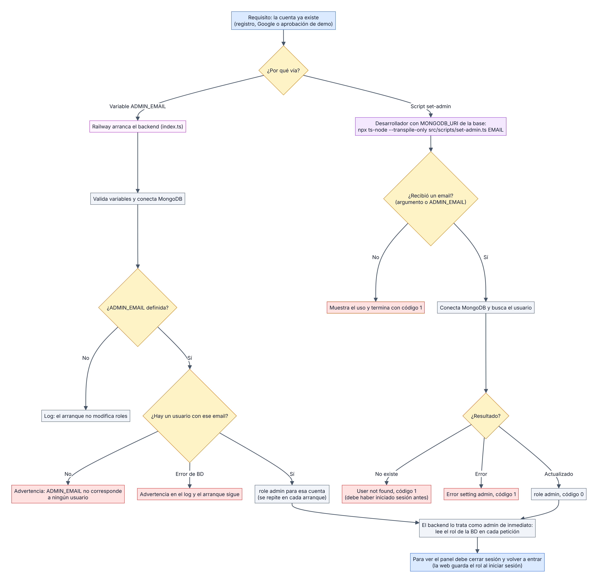

No hay correo de admin por defecto en el código para los roles: sin `ADMIN_EMAIL` el arranque no toca a nadie. Como el arranque **vuelve a aplicar** el rol cada vez, quitarle el admin a la cuenta de `ADMIN_EMAIL` desde el panel dura solo hasta el siguiente despliegue o reinicio. Ninguna de estas dos vías queda en la bitácora.

**Fuente en el código:** `apps/backend/src/index.ts` (`ensureAdminFromEnv`), `apps/backend/src/scripts/set-admin.ts`, `apps/backend/src/middleware/access.ts` (`requireRole`, `loadFreshUser`), `apps/web/src/components/admin/AdminLayout.tsx`, `apps/web/e2e/global-setup.ts`.

### 4.2 Cambiar un rol desde el panel

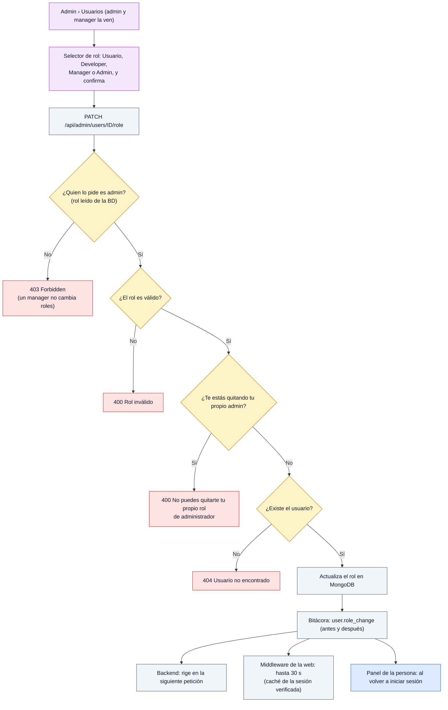
```mermaid
flowchart TD
    classDef visitante fill:#dbeafe,stroke:#2563eb,color:#0f172a
    classDef sistema fill:#f1f5f9,stroke:#475569,color:#0f172a
    classDef admin fill:#f3e8ff,stroke:#9333ea,color:#0f172a
    classDef aviso fill:#dcfce7,stroke:#16a34a,color:#0f172a
    classDef decision fill:#fef3c7,stroke:#d97706,color:#0f172a
    classDef error fill:#fee2e2,stroke:#dc2626,color:#0f172a
    classDef externo fill:#fdf4ff,stroke:#c026d3,color:#0f172a

    U1["Admin › Usuarios (admin y manager la ven)"]:::admin
    U2["Selector de rol: Usuario, Developer,<br/>Manager o Admin, y confirma"]:::admin
    S1["PATCH /api/admin/users/ID/role"]:::sistema
    D1{"¿Quien lo pide es admin?<br/>(rol leído de la BD)"}:::decision
    E1["403 Forbidden<br/>(un manager no cambia roles)"]:::error
    D2{"¿El rol es válido?"}:::decision
    E2["400 Rol inválido"]:::error
    D3{"¿Te estás quitando tu propio admin?"}:::decision
    E3["400 No puedes quitarte tu propio rol<br/>de administrador"]:::error
    D4{"¿Existe el usuario?"}:::decision
    E4["404 Usuario no encontrado"]:::error
    S2["Actualiza el rol en MongoDB"]:::sistema
    S3["Bitácora: user.role_change (antes y después)"]:::sistema
    R1["Backend: rige en la siguiente petición"]:::sistema
    R2["Middleware de la web: hasta 30 s<br/>(caché de la sesión verificada)"]:::sistema
    R3["Panel de la persona: al volver a iniciar sesión"]:::visitante

    U1 --> U2 --> S1 --> D1
    D1 -->|"No"| E1
    D1 -->|"Sí"| D2
    D2 -->|"No"| E2
    D2 -->|"Sí"| D3
    D3 -->|"Sí"| E3
    D3 -->|"No"| D4
    D4 -->|"No"| E4
    D4 -->|"Sí"| S2 --> S3
    S3 --> R1
    S3 --> R2
    S3 --> R3
```

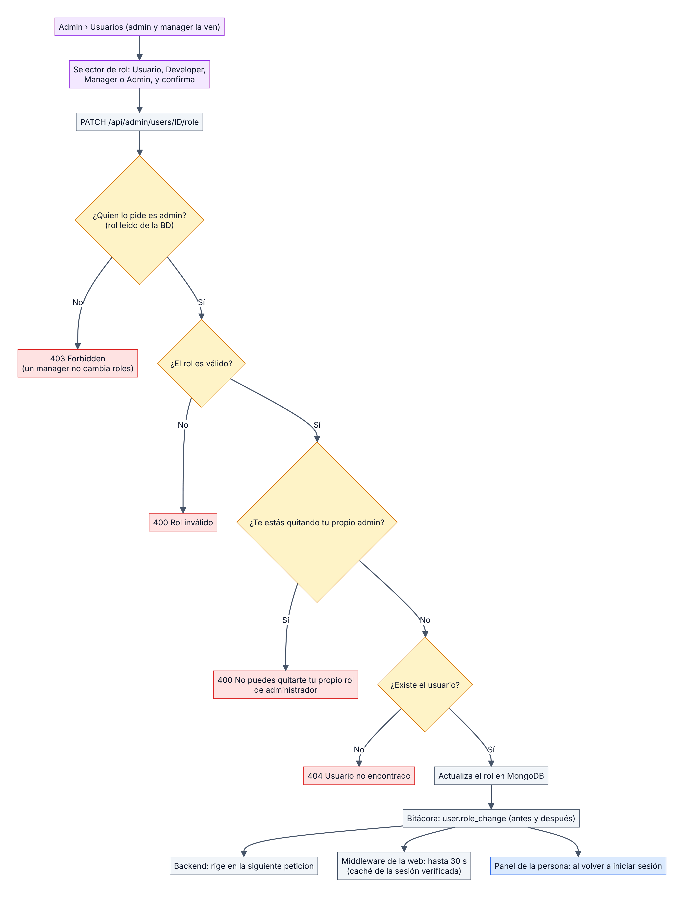

Quitar un rol corta el acceso enseguida en el servidor (aunque el token siga vigente). Dar un rol de equipo también rige enseguida en el servidor, pero la persona debe salir y volver a entrar para que su navegador le muestre el panel. El selector no ofrece «comercial» (`sales`), `prospect` ni `client`: esos se asignan con la API (ver Hallazgos).

**Fuente en el código:** `apps/backend/src/controllers/admin.controller.ts` (`adminUpdateUserRole`), `apps/backend/src/routes/admin.routes.ts`, `apps/web/src/app/admin/users/page.tsx`, `apps/web/src/middleware.ts` (`ME_CACHE_TTL_MS`).

### 4.3 De dónde sale cada rol

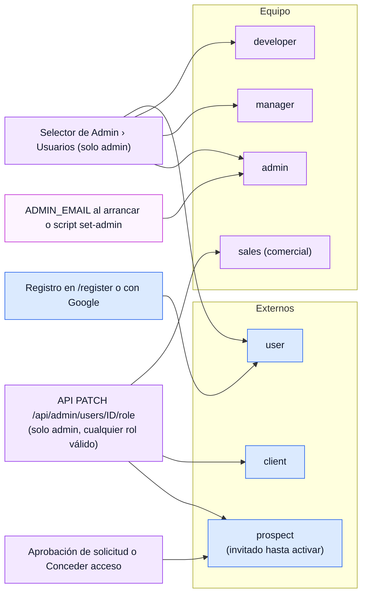
```mermaid
flowchart LR
    classDef visitante fill:#dbeafe,stroke:#2563eb,color:#0f172a
    classDef sistema fill:#f1f5f9,stroke:#475569,color:#0f172a
    classDef admin fill:#f3e8ff,stroke:#9333ea,color:#0f172a
    classDef aviso fill:#dcfce7,stroke:#16a34a,color:#0f172a
    classDef decision fill:#fef3c7,stroke:#d97706,color:#0f172a
    classDef error fill:#fee2e2,stroke:#dc2626,color:#0f172a
    classDef externo fill:#fdf4ff,stroke:#c026d3,color:#0f172a

    V1["Registro en /register o con Google"]:::visitante
    V2["Aprobación de solicitud o Conceder acceso"]:::admin
    V3["Selector de Admin › Usuarios (solo admin)"]:::admin
    V4["API PATCH /api/admin/users/ID/role<br/>(solo admin, cualquier rol válido)"]:::admin
    V5["ADMIN_EMAIL al arrancar o script set-admin"]:::externo

    subgraph Externos
        RU["user"]:::visitante
        RP["prospect<br/>(invitado hasta activar)"]:::visitante
        RC["client"]:::visitante
    end
    subgraph Equipo
        RD["developer"]:::admin
        RM["manager"]:::admin
        RS["sales (comercial)"]:::admin
        RA["admin"]:::admin
    end

    V1 --> RU
    V2 --> RP
    V3 --> RU
    V3 --> RD
    V3 --> RM
    V3 --> RA
    V4 --> RS
    V4 --> RC
    V4 --> RP
    V5 --> RA
```

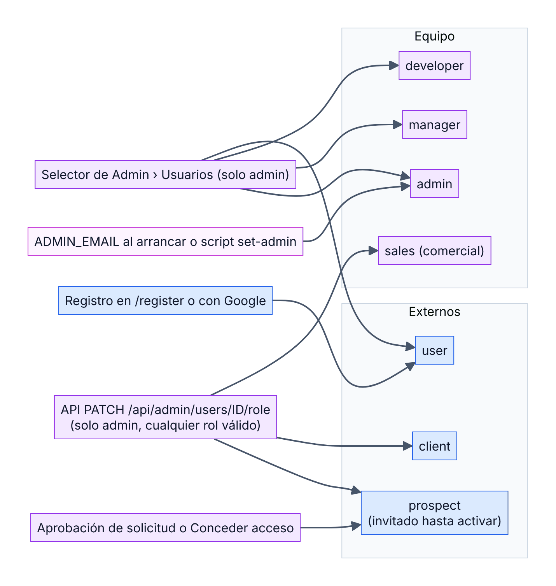

Hay siete roles. Los cuatro del equipo los da un admin; `prospect` lo crea el sistema de demos; `user` es el de cualquier registro; `client` hoy solo se asigna por API (o con los datos de ejemplo de desarrollo).

| Rol | Panel `/admin` | Solicitudes y accesos | Demos «Solo por invitación» | Catálogo | Cambiar roles | Abre todas las demos |
|---|---|---|---|---|---|---|
| `admin` | Todo | Gestiona | Sí | Edita | Sí | Sí |
| `manager` | Operación (pedidos, facturas, usuarios, contactos) | Solo ve | No | Solo ve | No | Sí |
| `sales` (comercial) | Solo las secciones de demos | Gestiona | No | Solo ve | No | Sí |
| `developer` | No | No | No | No | No | Sí |
| `prospect` | No: solo Mis demos y su perfil | No | No | No | No | Solo las de sus accesos |
| `client` y `user` | No: portal `/dashboard` | No | No | No | No | Solo las abiertas o con acceso |

Detalle completo en [Roles y permisos](Doc-10-Roles-y-Permisos.md).

**Fuente en el código:** `apps/backend/src/models/User.ts` (`USER_ROLES`), `apps/backend/src/config/demos.ts` (roles del sistema de demos), `apps/web/src/lib/auth-roles.ts`, `apps/backend/src/services/demo-grants.service.ts`, `apps/backend/src/controllers/auth.controller.ts`, `apps/backend/src/config/passport.ts`.

---

## 5. Rutina diaria

### 5.1 Rutina diaria sugerida del admin o comercial

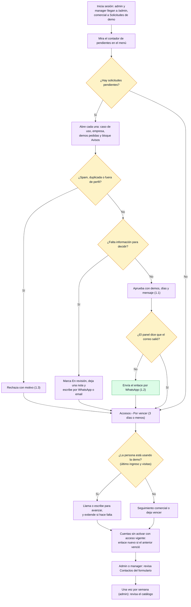
```mermaid
flowchart TD
    classDef visitante fill:#dbeafe,stroke:#2563eb,color:#0f172a
    classDef sistema fill:#f1f5f9,stroke:#475569,color:#0f172a
    classDef admin fill:#f3e8ff,stroke:#9333ea,color:#0f172a
    classDef aviso fill:#dcfce7,stroke:#16a34a,color:#0f172a
    classDef decision fill:#fef3c7,stroke:#d97706,color:#0f172a
    classDef error fill:#fee2e2,stroke:#dc2626,color:#0f172a
    classDef externo fill:#fdf4ff,stroke:#c026d3,color:#0f172a

    T1["Inicia sesión: admin y manager llegan a /admin,<br/>comercial a Solicitudes de demo"]:::admin
    T2["Mira el contador de pendientes en el menú"]:::admin
    D1{"¿Hay solicitudes pendientes?"}:::decision
    T3["Abre cada una: caso de uso, empresa,<br/>demos pedidas y bloque Avisos"]:::admin
    D2{"¿Spam, duplicada o fuera de perfil?"}:::decision
    T4["Rechaza con motivo (1.3)"]:::admin
    D3{"¿Falta información para decidir?"}:::decision
    T5["Marca En revisión, deja una nota y<br/>escribe por WhatsApp o email"]:::admin
    T6["Aprueba con demos, días y mensaje (1.1)"]:::admin
    D4{"¿El panel dice que el correo salió?"}:::decision
    N1["Envía el enlace por WhatsApp (1.2)"]:::aviso
    T7["Accesos › Por vencer (3 días o menos)"]:::admin
    D5{"¿La persona está usando la demo?<br/>(último ingreso y visitas)"}:::decision
    T8["Llama o escribe para avanzar,<br/>y extiende si hace falta"]:::admin
    T9["Seguimiento comercial o deja vencer"]:::admin
    T10["Cuentas sin activar con acceso vigente:<br/>enlace nuevo si el anterior venció"]:::admin
    T11["Admin o manager: revisa Contactos del formulario"]:::admin
    T12["Una vez por semana (admin): revisa el catálogo"]:::admin

    T1 --> T2 --> D1
    D1 -->|"Sí"| T3 --> D2
    D2 -->|"Sí"| T4 --> T7
    D2 -->|"No"| D3
    D3 -->|"Sí"| T5 --> T7
    D3 -->|"No"| T6 --> D4
    D4 -->|"No"| N1 --> T7
    D4 -->|"Sí"| T7
    D1 -->|"No"| T7
    T7 --> D5
    D5 -->|"Sí"| T8 --> T10
    D5 -->|"No"| T9 --> T10
    T10 --> T11 --> T12
```

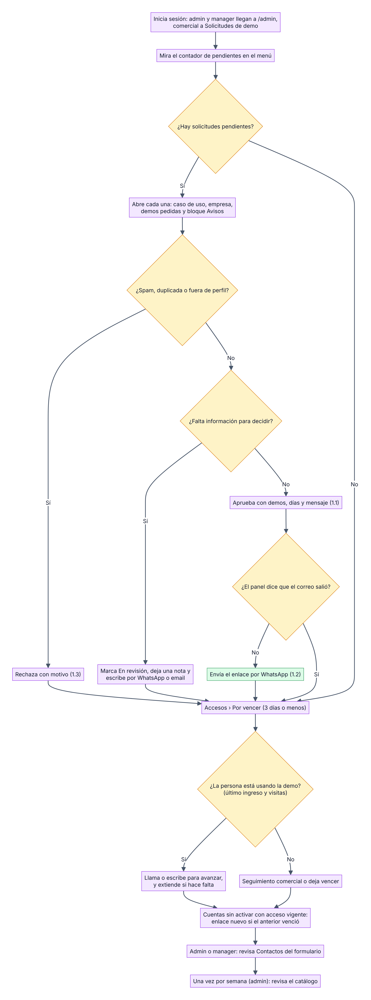

Es una **rutina sugerida**: el código no la impone, pero cada paso usa una función real del panel (contador de pendientes, pestaña «Por vencer», columnas «Último ingreso» y «Visitas», botón «Enlace de activación»). La sección Contactos no la ve el rol comercial.

**Fuente en el código:** `apps/web/src/components/admin/AdminLayout.tsx` (contador y menú por rol), `apps/web/src/app/admin/solicitudes/page.tsx`, `apps/web/src/app/admin/accesos/page.tsx`, `apps/web/src/lib/auth-roles.ts` (`homePathForRole`), `apps/backend/src/services/demo-grants.service.ts` (`GRANT_LIST_STATES`).

---

## 6. Job de vencimiento y correos

### 6.1 Job de vencimiento de accesos y recordatorios

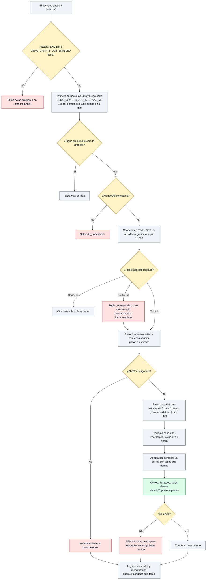
```mermaid
flowchart TD
    classDef visitante fill:#dbeafe,stroke:#2563eb,color:#0f172a
    classDef sistema fill:#f1f5f9,stroke:#475569,color:#0f172a
    classDef admin fill:#f3e8ff,stroke:#9333ea,color:#0f172a
    classDef aviso fill:#dcfce7,stroke:#16a34a,color:#0f172a
    classDef decision fill:#fef3c7,stroke:#d97706,color:#0f172a
    classDef error fill:#fee2e2,stroke:#dc2626,color:#0f172a
    classDef externo fill:#fdf4ff,stroke:#c026d3,color:#0f172a

    J0["El backend arranca (index.ts)"]:::sistema
    D0{"¿NODE_ENV test o<br/>DEMO_GRANTS_JOB_ENABLED false?"}:::decision
    J1["El job no se programa en esta instancia"]:::error
    J2["Primera corrida a los 30 s y luego cada<br/>DEMO_GRANTS_JOB_INTERVAL_MS<br/>1 h por defecto o si vale menos de 1 min"]:::sistema
    D1{"¿Sigue en curso la corrida anterior?"}:::decision
    J3["Salta esta corrida"]:::sistema
    D2{"¿MongoDB conectado?"}:::decision
    J4["Salta: db_unavailable"]:::error
    J5["Candado en Redis: SET NX<br/>jobs:demo-grants:lock por 10 min"]:::sistema
    D3{"¿Resultado del candado?"}:::decision
    J6["Otra instancia lo tiene: salta"]:::sistema
    J7["Redis no responde: corre sin candado<br/>(los pasos son idempotentes)"]:::error
    J8["Paso 1: accesos activos con fecha vencida<br/>pasan a expirado"]:::sistema
    D4{"¿SMTP configurado?"}:::decision
    J9["No envía ni marca recordatorios"]:::error
    J10["Paso 2: activos que vencen en 3 días o menos<br/>y sin recordatorio (máx. 500)"]:::sistema
    J11["Reclama cada uno: recordatorioEnviadoEn = ahora"]:::sistema
    J12["Agrupa por persona: un correo con todas sus demos"]:::sistema
    N1["Correo: Tu acceso a las demos<br/>de KopTup vence pronto"]:::aviso
    D5{"¿Se envió?"}:::decision
    J13["Libera esos accesos para<br/>reintentar en la siguiente corrida"]:::error
    J14["Cuenta el recordatorio"]:::sistema
    J15["Log con expirados y recordatorios,<br/>libera el candado si lo tomó"]:::sistema

    J0 --> D0
    D0 -->|"Sí"| J1
    D0 -->|"No"| J2 --> D1
    D1 -->|"Sí"| J3
    D1 -->|"No"| D2
    D2 -->|"No"| J4
    D2 -->|"Sí"| J5 --> D3
    D3 -->|"Ocupado"| J6
    D3 -->|"Sin Redis"| J7 --> J8
    D3 -->|"Tomado"| J8
    J8 --> D4
    D4 -->|"No"| J9 --> J15
    D4 -->|"Sí"| J10 --> J11 --> J12 --> N1 --> D5
    D5 -->|"No"| J13 --> J15
    D5 -->|"Sí"| J14 --> J15
```

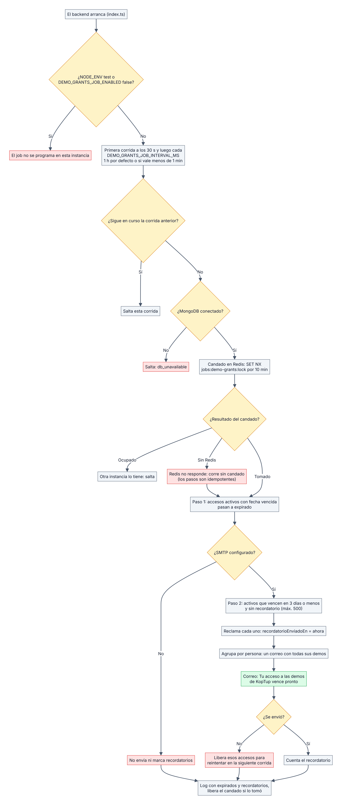

El job solo **ordena** los datos y avisa: la vigencia real no depende de él, porque el servidor compara la fecha de vencimiento en cada apertura. Cada acceso recibe un solo recordatorio (se reinicia al extenderlo); si la cuenta sigue sin activar, el correo le recuerda usar el enlace de activación.

**Fuente en el código:** `apps/backend/src/jobs/demo-grants.job.ts`, `apps/backend/src/services/redis-lock.service.ts`, `apps/backend/src/services/demo-emails.service.ts` (`sendExpiryReminder`), `apps/backend/src/config/demos.ts` (`GRANT_REMINDER_DAYS_BEFORE`), `apps/backend/src/index.ts`.

### 6.2 Qué correo sale en cada momento

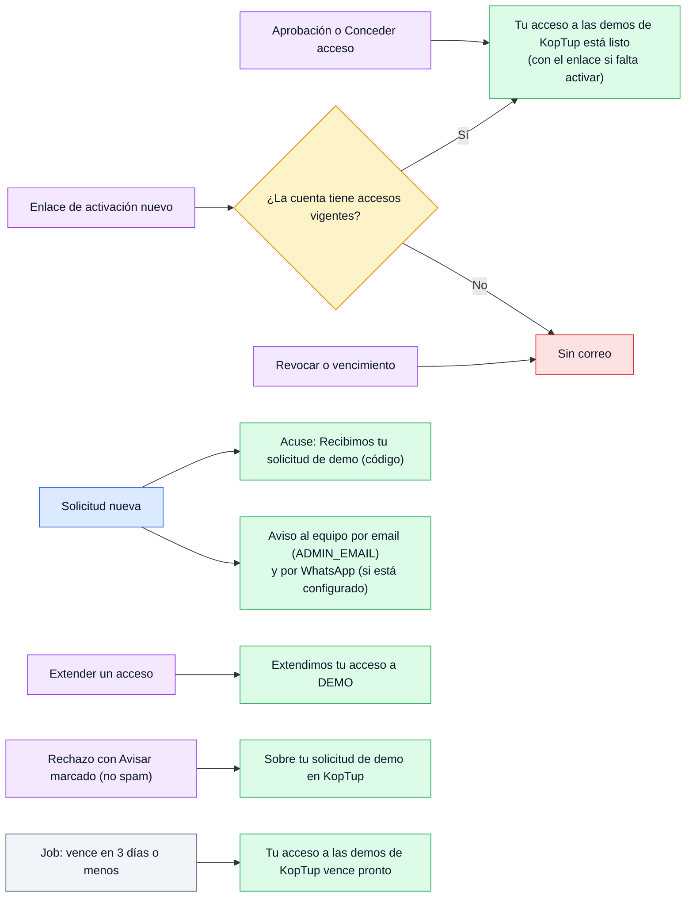
```mermaid
flowchart LR
    classDef visitante fill:#dbeafe,stroke:#2563eb,color:#0f172a
    classDef sistema fill:#f1f5f9,stroke:#475569,color:#0f172a
    classDef admin fill:#f3e8ff,stroke:#9333ea,color:#0f172a
    classDef aviso fill:#dcfce7,stroke:#16a34a,color:#0f172a
    classDef decision fill:#fef3c7,stroke:#d97706,color:#0f172a
    classDef error fill:#fee2e2,stroke:#dc2626,color:#0f172a
    classDef externo fill:#fdf4ff,stroke:#c026d3,color:#0f172a

    M1["Solicitud nueva"]:::visitante
    M2["Aprobación o Conceder acceso"]:::admin
    M3["Enlace de activación nuevo"]:::admin
    M4["Extender un acceso"]:::admin
    M5["Rechazo con Avisar marcado (no spam)"]:::admin
    M6["Job: vence en 3 días o menos"]:::sistema
    M7["Revocar o vencimiento"]:::admin
    D1{"¿La cuenta tiene accesos vigentes?"}:::decision
    C1["Acuse: Recibimos tu solicitud de demo (código)"]:::aviso
    C2["Aviso al equipo por email (ADMIN_EMAIL)<br/>y por WhatsApp (si está configurado)"]:::aviso
    C3["Tu acceso a las demos de KopTup está listo<br/>(con el enlace si falta activar)"]:::aviso
    C4["Extendimos tu acceso a DEMO"]:::aviso
    C5["Sobre tu solicitud de demo en KopTup"]:::aviso
    C6["Tu acceso a las demos de KopTup vence pronto"]:::aviso
    C0["Sin correo"]:::error

    M1 --> C1
    M1 --> C2
    M2 --> C3
    M3 --> D1
    D1 -->|"Sí"| C3
    D1 -->|"No"| C0
    M4 --> C4
    M5 --> C5
    M6 --> C6
    M7 --> C0
```

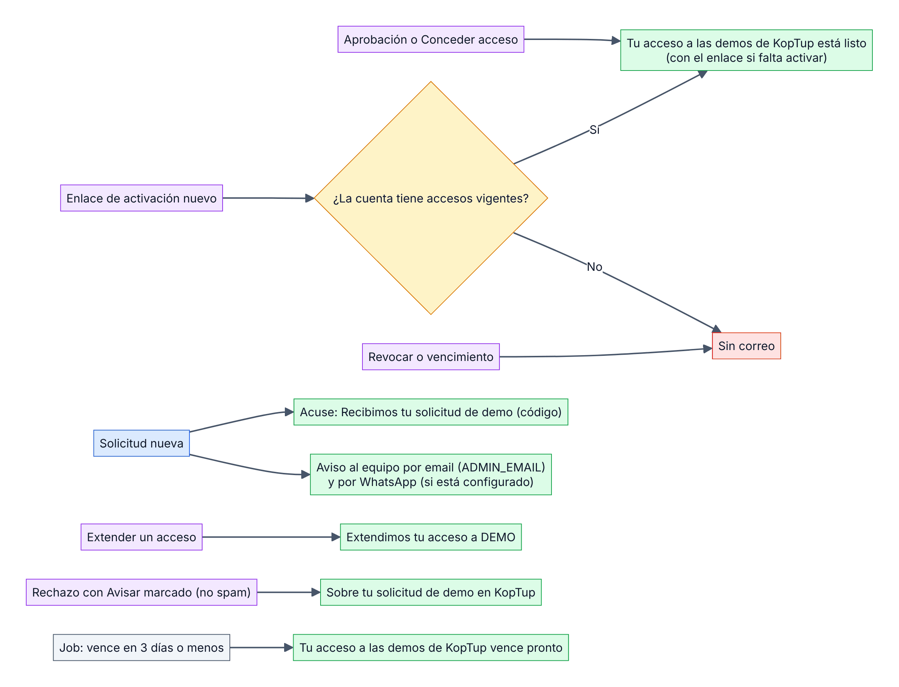

Todos los correos al prospecto salen por el SMTP del backend: sin `SMTP_USER` y `SMTP_PASS` no sale ninguno y el panel lo dice. Los avisos al equipo de una solicitud nueva usan el mismo canal que el formulario de contacto (email y, si hay proveedor configurado, WhatsApp automático).

**Fuente en el código:** `apps/backend/src/services/demo-emails.service.ts`, `apps/backend/src/services/email.service.ts`, `apps/backend/src/services/lead.service.ts`, `apps/backend/src/services/whatsapp.service.ts`, `apps/backend/src/services/demo-requests.service.ts`, `apps/backend/src/services/demo-grants.service.ts`.

---

## 7. Despliegue

### 7.1 Pull request y CI

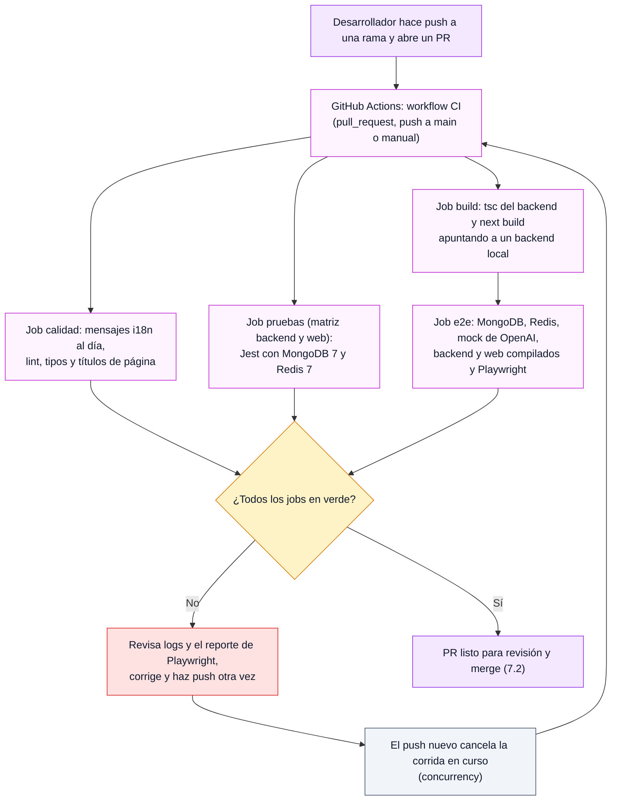
```mermaid
flowchart TD
    classDef visitante fill:#dbeafe,stroke:#2563eb,color:#0f172a
    classDef sistema fill:#f1f5f9,stroke:#475569,color:#0f172a
    classDef admin fill:#f3e8ff,stroke:#9333ea,color:#0f172a
    classDef aviso fill:#dcfce7,stroke:#16a34a,color:#0f172a
    classDef decision fill:#fef3c7,stroke:#d97706,color:#0f172a
    classDef error fill:#fee2e2,stroke:#dc2626,color:#0f172a
    classDef externo fill:#fdf4ff,stroke:#c026d3,color:#0f172a

    P1["Desarrollador hace push a una rama y abre un PR"]:::admin
    P2["GitHub Actions: workflow CI<br/>(pull_request, push a main o manual)"]:::externo
    J1["Job calidad: mensajes i18n al día,<br/>lint, tipos y títulos de página"]:::externo
    J2["Job pruebas (matriz backend y web):<br/>Jest con MongoDB 7 y Redis 7"]:::externo
    J3["Job build: tsc del backend y next build<br/>apuntando a un backend local"]:::externo
    J4["Job e2e: MongoDB, Redis, mock de OpenAI,<br/>backend y web compilados y Playwright"]:::externo
    D1{"¿Todos los jobs en verde?"}:::decision
    E1["Revisa logs y el reporte de Playwright,<br/>corrige y haz push otra vez"]:::error
    E2["El push nuevo cancela la corrida en curso<br/>(concurrency)"]:::sistema
    P3["PR listo para revisión y merge (7.2)"]:::admin

    P1 --> P2
    P2 --> J1
    P2 --> J2
    P2 --> J3 --> J4
    J1 --> D1
    J2 --> D1
    J4 --> D1
    D1 -->|"No"| E1 --> E2 --> P2
    D1 -->|"Sí"| P3
```

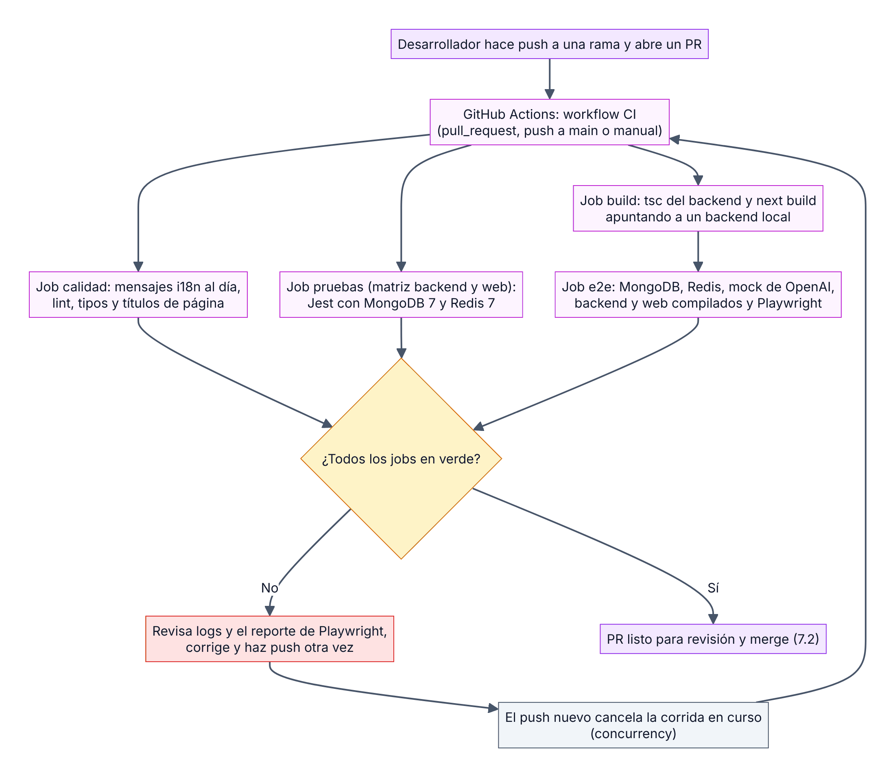

CI **solo verifica, no despliega**. El job e2e espera al de build y usa sus compilados; recorre la plataforma de punta a punta (solicitud, aprobación, activación, acceso, revocación, permisos, modo de acceso, contacto y la demo RAG con un PDF) con datos ficticios de CI.

**Fuente en el código:** `.github/workflows/ci.yml`, `apps/web/e2e/global-setup.ts`, `apps/web/e2e/support/openai-mock.js`, `apps/web/playwright.config.ts`.

### 7.2 Merge a main y despliegue a producción

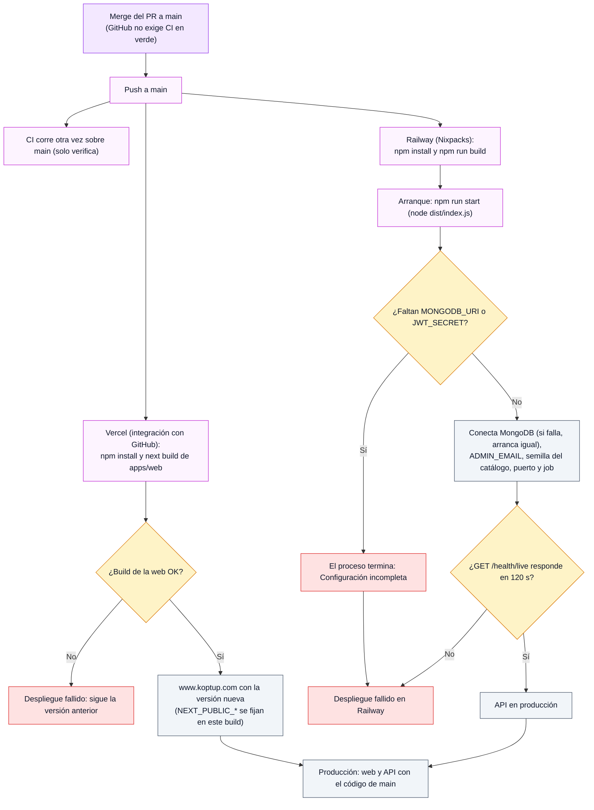
```mermaid
flowchart TD
    classDef visitante fill:#dbeafe,stroke:#2563eb,color:#0f172a
    classDef sistema fill:#f1f5f9,stroke:#475569,color:#0f172a
    classDef admin fill:#f3e8ff,stroke:#9333ea,color:#0f172a
    classDef aviso fill:#dcfce7,stroke:#16a34a,color:#0f172a
    classDef decision fill:#fef3c7,stroke:#d97706,color:#0f172a
    classDef error fill:#fee2e2,stroke:#dc2626,color:#0f172a
    classDef externo fill:#fdf4ff,stroke:#c026d3,color:#0f172a

    M1["Merge del PR a main<br/>(GitHub no exige CI en verde)"]:::admin
    M2["Push a main"]:::externo
    C1["CI corre otra vez sobre main (solo verifica)"]:::externo
    V1["Vercel (integración con GitHub):<br/>npm install y next build de apps/web"]:::externo
    D1{"¿Build de la web OK?"}:::decision
    E1["Despliegue fallido: sigue la versión anterior"]:::error
    V2["www.koptup.com con la versión nueva<br/>(NEXT_PUBLIC_* se fijan en este build)"]:::sistema
    R1["Railway (Nixpacks):<br/>npm install y npm run build"]:::externo
    R2["Arranque: npm run start (node dist/index.js)"]:::externo
    D2{"¿Faltan MONGODB_URI o JWT_SECRET?"}:::decision
    E2["El proceso termina: Configuración incompleta"]:::error
    R3["Conecta MongoDB (si falla, arranca igual),<br/>ADMIN_EMAIL, semilla del catálogo, puerto y job"]:::sistema
    D3{"¿GET /health/live responde en 120 s?"}:::decision
    E3["Despliegue fallido en Railway"]:::error
    R4["API en producción"]:::sistema
    F1["Producción: web y API con el código de main"]:::sistema

    M1 --> M2
    M2 --> C1
    M2 --> V1 --> D1
    D1 -->|"No"| E1
    D1 -->|"Sí"| V2 --> F1
    M2 --> R1 --> R2 --> D2
    D2 -->|"Sí"| E2 --> E3
    D2 -->|"No"| R3 --> D3
    D3 -->|"No"| E3
    D3 -->|"Sí"| R4 --> F1
```

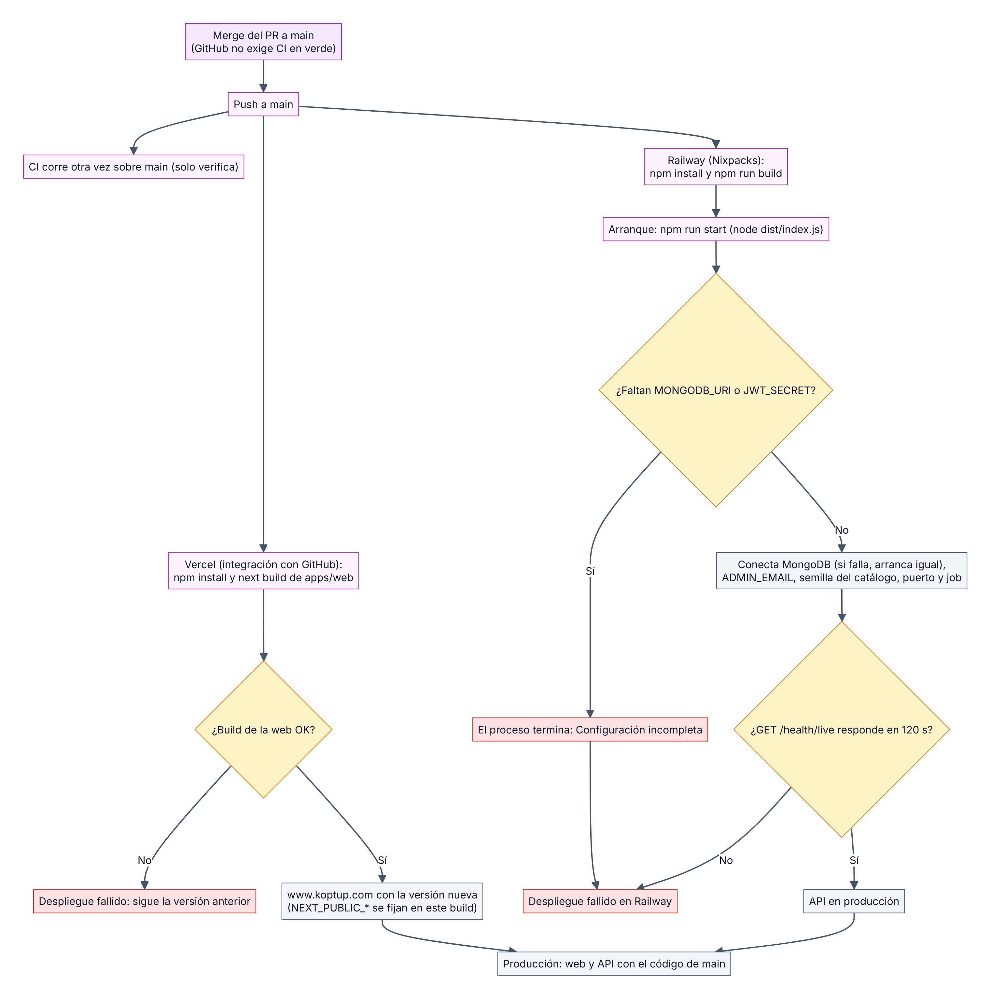

Vercel y Railway despliegan desde `main` por su cuenta, en paralelo y sin esperar a CI. El chequeo de Railway (`/health/live`) solo confirma que el proceso responde: un backend sin MongoDB pasa el chequeo y `/health` responde 503. **Situación actual:** el dominio del backend en Railway no tiene servicio (ver 9.1 y [Estado y próximos pasos](15-Estado-y-Proximos-Pasos.md)).

**Fuente en el código:** `apps/backend/railway.json`, `apps/backend/package.json` (`build`, `start`), `apps/web/vercel.json`, `apps/backend/src/index.ts`, `apps/backend/src/config/env.ts`, `apps/backend/src/app.ts` (`/health/live`, `/health`), `README.md` (sección Despliegue).

---

## 8. Publicación de la wiki

### 8.1 Publicación de la wiki

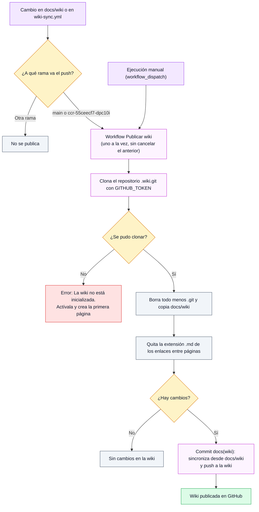
```mermaid
flowchart TD
    classDef visitante fill:#dbeafe,stroke:#2563eb,color:#0f172a
    classDef sistema fill:#f1f5f9,stroke:#475569,color:#0f172a
    classDef admin fill:#f3e8ff,stroke:#9333ea,color:#0f172a
    classDef aviso fill:#dcfce7,stroke:#16a34a,color:#0f172a
    classDef decision fill:#fef3c7,stroke:#d97706,color:#0f172a
    classDef error fill:#fee2e2,stroke:#dc2626,color:#0f172a
    classDef externo fill:#fdf4ff,stroke:#c026d3,color:#0f172a

    W1["Cambio en docs/wiki o en wiki-sync.yml"]:::admin
    D1{"¿A qué rama va el push?"}:::decision
    W2["No se publica"]:::sistema
    W3["Workflow Publicar wiki<br/>(uno a la vez, sin cancelar el anterior)"]:::externo
    W0["Ejecución manual (workflow_dispatch)"]:::admin
    W4["Clona el repositorio .wiki.git con GITHUB_TOKEN"]:::externo
    D2{"¿Se pudo clonar?"}:::decision
    E1["Error: La wiki no está inicializada.<br/>Actívala y crea la primera página"]:::error
    W5["Borra todo menos .git y copia docs/wiki"]:::sistema
    W6["Quita la extensión .md de los enlaces entre páginas"]:::sistema
    D3{"¿Hay cambios?"}:::decision
    W7["Sin cambios en la wiki"]:::sistema
    W8["Commit docs(wiki): sincroniza desde docs/wiki<br/>y push a la wiki"]:::externo
    W9["Wiki publicada en GitHub"]:::aviso

    W1 --> D1
    D1 -->|"Otra rama"| W2
    D1 -->|"main o ccr-55ceecf7-dpc10i"| W3
    W0 --> W3
    W3 --> W4 --> D2
    D2 -->|"No"| E1
    D2 -->|"Sí"| W5 --> W6 --> D3
    D3 -->|"No"| W7
    D3 -->|"Sí"| W8 --> W9
```

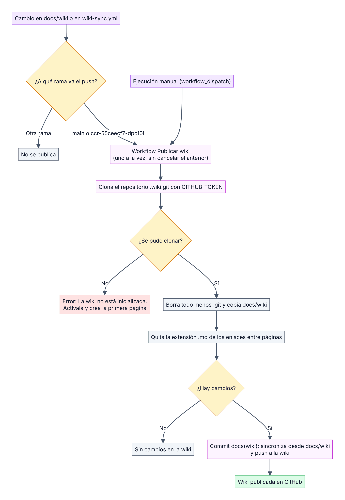

La fuente de la wiki vive versionada en `docs/wiki/` y el workflow la copia **completa** a la wiki de GitHub: lo que se edite directamente en la wiki se pierde en la siguiente publicación. La wiki se activó el 9 de octubre de 2026 y la primera publicación correcta salió de la rama de trabajo, no de `main` (ver Hallazgos).

**Fuente en el código:** `.github/workflows/wiki-sync.yml`.

---

## 9. Runbooks (procedimientos ante fallas)

### 9.1 El backend está caído

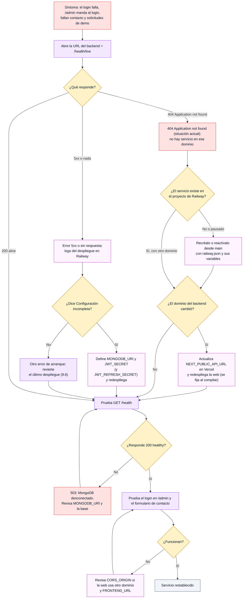
```mermaid
flowchart TD
    classDef visitante fill:#dbeafe,stroke:#2563eb,color:#0f172a
    classDef sistema fill:#f1f5f9,stroke:#475569,color:#0f172a
    classDef admin fill:#f3e8ff,stroke:#9333ea,color:#0f172a
    classDef aviso fill:#dcfce7,stroke:#16a34a,color:#0f172a
    classDef decision fill:#fef3c7,stroke:#d97706,color:#0f172a
    classDef error fill:#fee2e2,stroke:#dc2626,color:#0f172a
    classDef externo fill:#fdf4ff,stroke:#c026d3,color:#0f172a

    S0["Síntoma: el login falla, /admin manda al login,<br/>fallan contacto y solicitudes de demo"]:::error
    S1["Abre la URL del backend + /health/live"]:::admin
    D1{"¿Qué responde?"}:::decision
    A1["404 Application not found (situación actual):<br/>no hay servicio en ese dominio"]:::error
    D2{"¿El servicio existe en<br/>el proyecto de Railway?"}:::decision
    A2["Recréalo o reactívalo desde main<br/>con railway.json y sus variables"]:::externo
    D3{"¿El dominio del backend cambió?"}:::decision
    A3["Actualiza NEXT_PUBLIC_API_URL en Vercel<br/>y redespliega la web (se fija al compilar)"]:::externo
    B1["Error 5xx o sin respuesta:<br/>logs del despliegue en Railway"]:::externo
    D4{"¿Dice Configuración incompleta?"}:::decision
    B2["Define MONGODB_URI y JWT_SECRET<br/>(y JWT_REFRESH_SECRET) y redespliega"]:::externo
    B3["Otro error de arranque: revierte<br/>el último despliegue (9.6)"]:::admin
    H1["Prueba GET /health"]:::admin
    D5{"¿Responde 200 healthy?"}:::decision
    H2["503: MongoDB desconectado.<br/>Revisa MONGODB_URI y la base"]:::error
    H3["Prueba el login en /admin y el formulario de contacto"]:::admin
    D6{"¿Funcionan?"}:::decision
    H4["Revisa CORS_ORIGIN si la web usa otro dominio<br/>y FRONTEND_URL"]:::externo
    H5["Servicio restablecido"]:::sistema

    S0 --> S1 --> D1
    D1 -->|"404 Application not found"| A1 --> D2
    D2 -->|"No o pausado"| A2 --> D3
    D2 -->|"Sí, con otro dominio"| D3
    D3 -->|"Sí"| A3 --> H1
    D3 -->|"No"| H1
    D1 -->|"5xx o nada"| B1 --> D4
    D4 -->|"Sí"| B2 --> H1
    D4 -->|"No"| B3 --> H1
    D1 -->|"200 alive"| H1
    H1 --> D5
    D5 -->|"No"| H2 --> H1
    D5 -->|"Sí"| H3 --> D6
    D6 -->|"No"| H4 --> H3
    D6 -->|"Sí"| H5
```

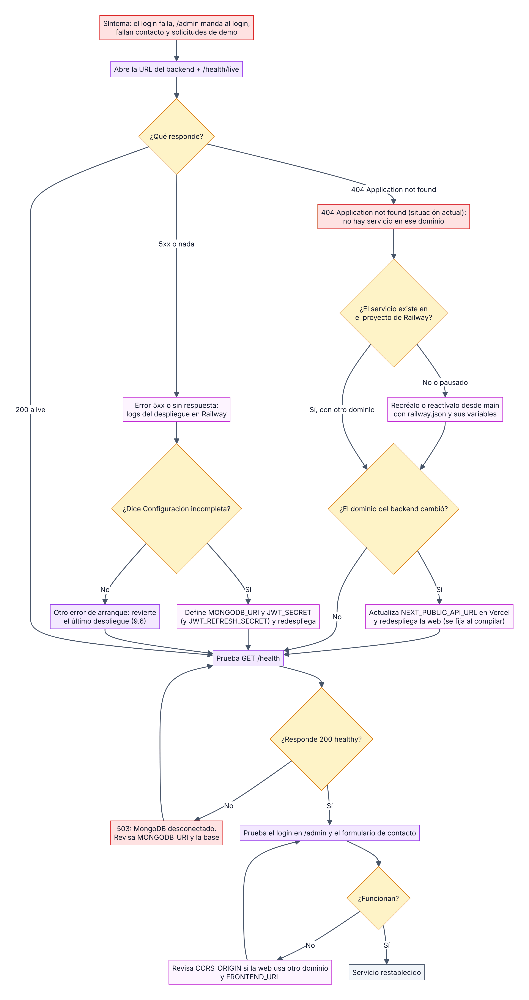

**Situación actual (9 de octubre de 2026):** el dominio configurado en la web responde «Application not found» de Railway. La web pública funciona, pero todo lo que usa el backend falla. Como Railway responde 404, el middleware de la web lo interpreta como «sin sesión» y manda al login en lugar de mostrar la página «No pudimos verificar tu sesión» (ver Hallazgos).

**Fuente en el código:** `apps/backend/src/app.ts` (`/health/live`, `/health`, CORS), `apps/backend/src/config/env.ts`, `apps/backend/railway.json`, `apps/web/src/lib/backend-url.ts`, `apps/web/.env.production`, `apps/web/src/middleware.ts` (`fetchMe`, `unavailable`).

### 9.2 El correo no sale

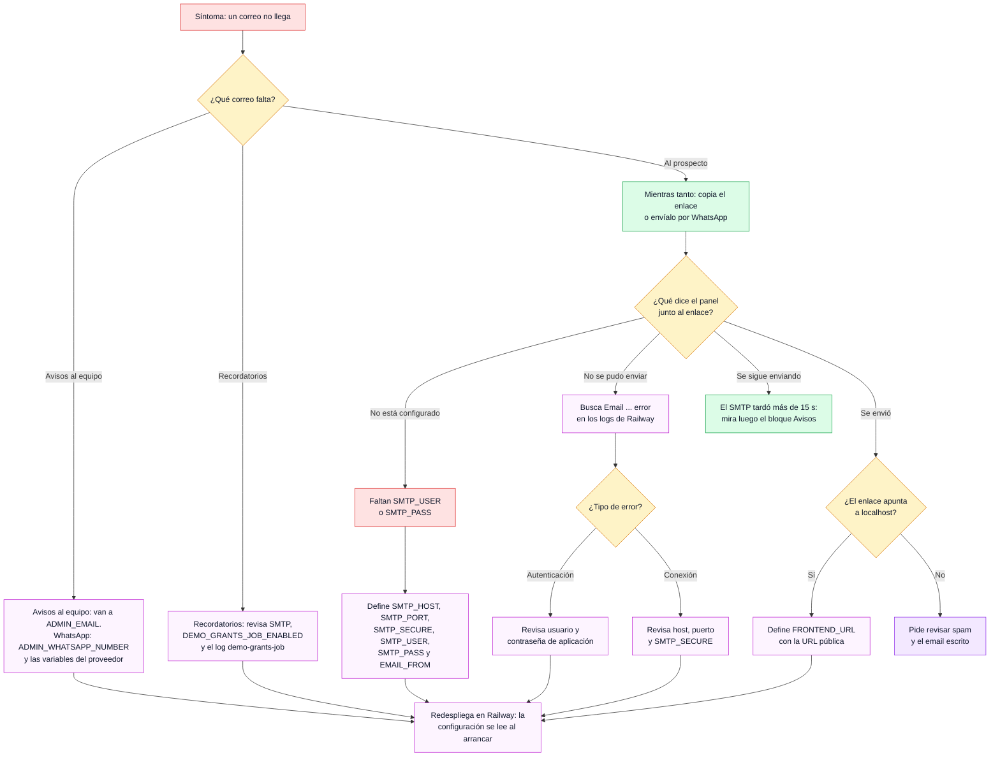
```mermaid
flowchart TD
    classDef visitante fill:#dbeafe,stroke:#2563eb,color:#0f172a
    classDef sistema fill:#f1f5f9,stroke:#475569,color:#0f172a
    classDef admin fill:#f3e8ff,stroke:#9333ea,color:#0f172a
    classDef aviso fill:#dcfce7,stroke:#16a34a,color:#0f172a
    classDef decision fill:#fef3c7,stroke:#d97706,color:#0f172a
    classDef error fill:#fee2e2,stroke:#dc2626,color:#0f172a
    classDef externo fill:#fdf4ff,stroke:#c026d3,color:#0f172a

    Q0["Síntoma: un correo no llega"]:::error
    D0{"¿Qué correo falta?"}:::decision
    F1["Avisos al equipo: van a ADMIN_EMAIL.<br/>WhatsApp: ADMIN_WHATSAPP_NUMBER<br/>y las variables del proveedor"]:::externo
    F2["Recordatorios: revisa SMTP,<br/>DEMO_GRANTS_JOB_ENABLED<br/>y el log demo-grants-job"]:::externo
    Q1["Mientras tanto: copia el enlace<br/>o envíalo por WhatsApp"]:::aviso
    D1{"¿Qué dice el panel<br/>junto al enlace?"}:::decision
    A1["Faltan SMTP_USER<br/>o SMTP_PASS"]:::error
    A2["Define SMTP_HOST, SMTP_PORT,<br/>SMTP_SECURE, SMTP_USER,<br/>SMTP_PASS y EMAIL_FROM"]:::externo
    B1["Busca Email ... error<br/>en los logs de Railway"]:::externo
    D2{"¿Tipo de error?"}:::decision
    B2["Revisa usuario y<br/>contraseña de aplicación"]:::externo
    B3["Revisa host, puerto<br/>y SMTP_SECURE"]:::externo
    C1["El SMTP tardó más de 15 s:<br/>mira luego el bloque Avisos"]:::aviso
    D3{"¿El enlace apunta<br/>a localhost?"}:::decision
    C2["Define FRONTEND_URL<br/>con la URL pública"]:::externo
    C3["Pide revisar spam<br/>y el email escrito"]:::admin
    A3["Redespliega en Railway: la<br/>configuración se lee al arrancar"]:::externo

    Q0 --> D0
    D0 -->|"Avisos al equipo"| F1 --> A3
    D0 -->|"Recordatorios"| F2 --> A3
    D0 -->|"Al prospecto"| Q1 --> D1
    D1 -->|"No está configurado"| A1 --> A2 --> A3
    D1 -->|"No se pudo enviar"| B1 --> D2
    D2 -->|"Autenticación"| B2 --> A3
    D2 -->|"Conexión"| B3 --> A3
    D1 -->|"Se sigue enviando"| C1
    D1 -->|"Se envió"| D3
    D3 -->|"Sí"| C2 --> A3
    D3 -->|"No"| C3
```

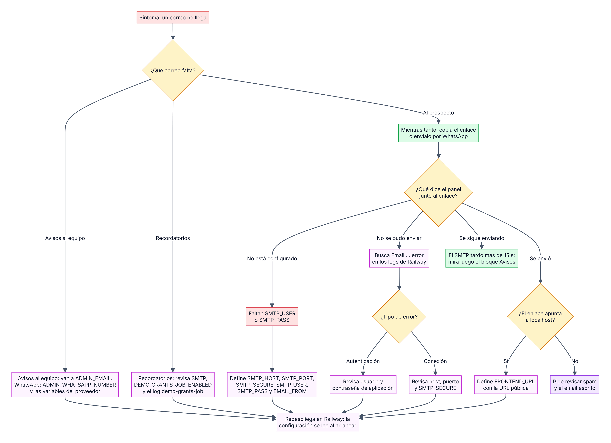

El backend crea el transporte de correo solo si tiene usuario y contraseña SMTP; el servidor por defecto, si falta `SMTP_HOST`, es el de Gmail. Ninguna acción del panel falla por el correo: aprobar, invitar y extender responden igual y muestran el enlace.

**Fuente en el código:** `apps/backend/src/services/email.service.ts` (`isConfigured`, `sendMail`), `apps/backend/src/services/demo-grants.service.ts` (`awaitEmail`, `EMAIL_WAIT_MS`), `apps/backend/src/services/whatsapp.service.ts`, `apps/backend/src/jobs/demo-grants.job.ts`, `apps/backend/src/config/demos.ts` (`frontendUrl`), `apps/web/src/components/admin/demos/shared.tsx`.

### 9.3 Una demo sigue bloqueada

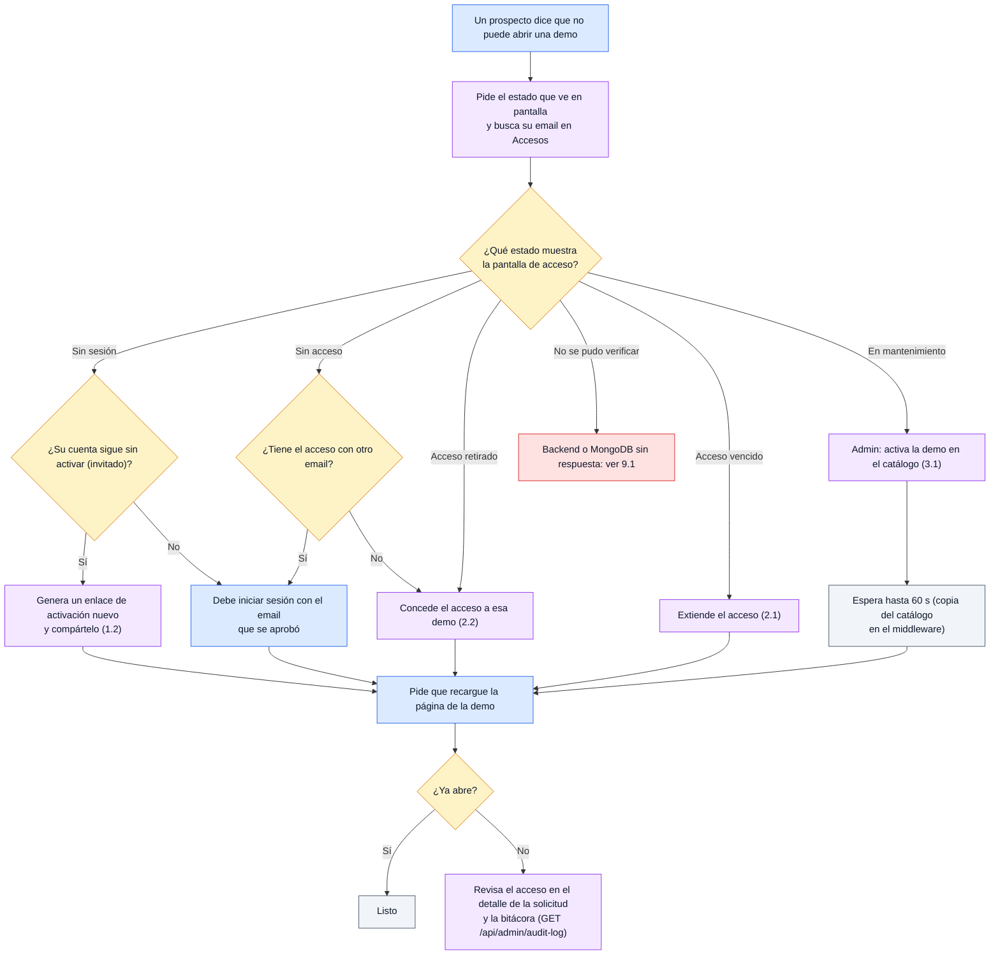
```mermaid
flowchart TD
    classDef visitante fill:#dbeafe,stroke:#2563eb,color:#0f172a
    classDef sistema fill:#f1f5f9,stroke:#475569,color:#0f172a
    classDef admin fill:#f3e8ff,stroke:#9333ea,color:#0f172a
    classDef aviso fill:#dcfce7,stroke:#16a34a,color:#0f172a
    classDef decision fill:#fef3c7,stroke:#d97706,color:#0f172a
    classDef error fill:#fee2e2,stroke:#dc2626,color:#0f172a
    classDef externo fill:#fdf4ff,stroke:#c026d3,color:#0f172a

    B0["Un prospecto dice que no puede abrir una demo"]:::visitante
    B1["Pide el estado que ve en pantalla<br/>y busca su email en Accesos"]:::admin
    D1{"¿Qué estado muestra<br/>la pantalla de acceso?"}:::decision
    D2{"¿Su cuenta sigue sin activar (invitado)?"}:::decision
    A1["Genera un enlace de activación nuevo<br/>y compártelo (1.2)"]:::admin
    A2["Debe iniciar sesión con el email<br/>que se aprobó"]:::visitante
    D3{"¿Tiene el acceso con otro email?"}:::decision
    A3["Concede el acceso a esa demo (2.2)"]:::admin
    A4["Extiende el acceso (2.1)"]:::admin
    A5["Admin: activa la demo en el catálogo (3.1)"]:::admin
    A6["Backend o MongoDB sin respuesta: ver 9.1"]:::error
    W1["Espera hasta 60 s (copia del catálogo<br/>en el middleware)"]:::sistema
    R1["Pide que recargue la página de la demo"]:::visitante
    D4{"¿Ya abre?"}:::decision
    R2["Listo"]:::sistema
    R3["Revisa el acceso en el detalle de la solicitud<br/>y la bitácora (GET /api/admin/audit-log)"]:::admin

    B0 --> B1 --> D1
    D1 -->|"Sin sesión"| D2
    D2 -->|"Sí"| A1 --> R1
    D2 -->|"No"| A2 --> R1
    D1 -->|"Sin acceso"| D3
    D3 -->|"Sí"| A2
    D3 -->|"No"| A3 --> R1
    D1 -->|"Acceso vencido"| A4 --> R1
    D1 -->|"Acceso retirado"| A3
    D1 -->|"En mantenimiento"| A5 --> W1 --> R1
    D1 -->|"No se pudo verificar"| A6
    R1 --> D4
    D4 -->|"Sí"| R2
    D4 -->|"No"| R3
```

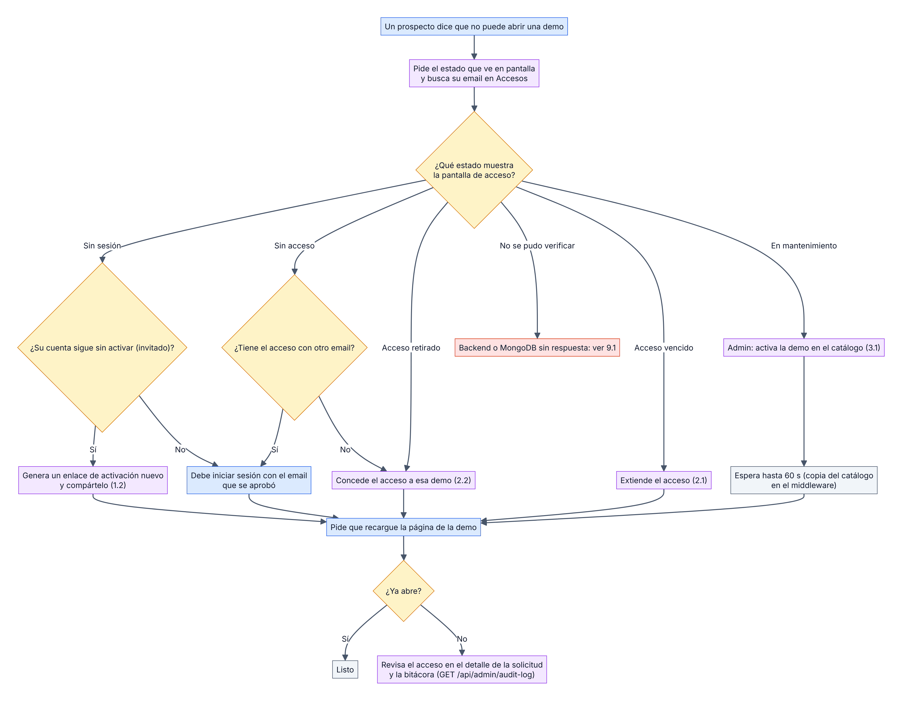

Los estados son los de la pantalla `/demo-acceso`: «Sin sesión», «Sin acceso», «Acceso vencido», «Acceso retirado», «En mantenimiento» y «No se pudo verificar». Un acceso retirado (revocado) no se extiende: se concede uno nuevo. Si la demo es «Solo por invitación», el acceso lo da un admin.

**Fuente en el código:** `apps/backend/src/services/demo-access.service.ts` (motivos, en orden), `apps/web/src/middleware.ts` (`accessScreen`), `apps/web/src/components/demo/DemoAccessGate.tsx`, `apps/web/messages/es.json` (`demoAccess.status`), `apps/backend/src/routes/admin-demos.routes.ts` (bitácora).

### 9.4 Se agotó el presupuesto de IA

```mermaid
flowchart TD
    classDef visitante fill:#dbeafe,stroke:#2563eb,color:#0f172a
    classDef sistema fill:#f1f5f9,stroke:#475569,color:#0f172a
    classDef admin fill:#f3e8ff,stroke:#9333ea,color:#0f172a
    classDef aviso fill:#dcfce7,stroke:#16a34a,color:#0f172a
    classDef decision fill:#fef3c7,stroke:#d97706,color:#0f172a
    classDef error fill:#fee2e2,stroke:#dc2626,color:#0f172a
    classDef externo fill:#fdf4ff,stroke:#c026d3,color:#0f172a

    I0["Síntoma: una demo con IA dice que alcanzó el cupo<br/>o que la IA no está disponible"]:::error
    D1{"¿Qué función?"}:::decision
    I1["Chatbot: responde en modo extractivo<br/>(sin IA) y lo dice"]:::sistema
    I2["Prueba con tu documento: 503<br/>Alcanzamos el cupo de pruebas de este mes"]:::error
    I3["LinkedIn Ads: 503, usa el generador local"]:::error
    I4["Gestor de contenido: 503<br/>Alcanzamos el cupo mensual de IA"]:::error
    D2{"¿El mensaje habla de cupo<br/>o de IA no disponible?"}:::decision
    N1["Revisa OPENAI_API_KEY y REDIS_URL:<br/>sin Redis no se mide el gasto y la IA se apaga"]:::externo
    D3{"¿La variable del tope<br/>es un número válido?"}:::decision
    N2["Corrígela: un valor inválido o negativo<br/>deja la función con tope 0"]:::externo
    D4{"¿Quieres subir el tope<br/>este mes?"}:::decision
    U1["Revisa el saldo y los límites de la cuenta en OpenAI"]:::externo
    U2["Sube en Railway DEMO_, CHATBOT_, LINKEDIN_ADS_<br/>o CONTENT_MONTHLY_BUDGET_USD y redespliega"]:::externo
    U3["Espera al cambio de mes UTC (7 p. m. del último día,<br/>hora de Colombia): el contador arranca en cero"]:::sistema
    U4["La función vuelve a usar IA en la siguiente consulta"]:::sistema

    I0 --> D1
    D1 -->|"Chatbot"| I1 --> D2
    D1 -->|"Documento propio"| I2 --> D2
    D1 -->|"LinkedIn Ads"| I3 --> D2
    D1 -->|"Contenido"| I4 --> D2
    D2 -->|"No disponible"| N1 --> U4
    D2 -->|"Cupo"| D3
    D3 -->|"No"| N2 --> U4
    D3 -->|"Sí"| D4
    D4 -->|"Sí"| U1 --> U2 --> U4
    D4 -->|"No"| U3 --> U4
```

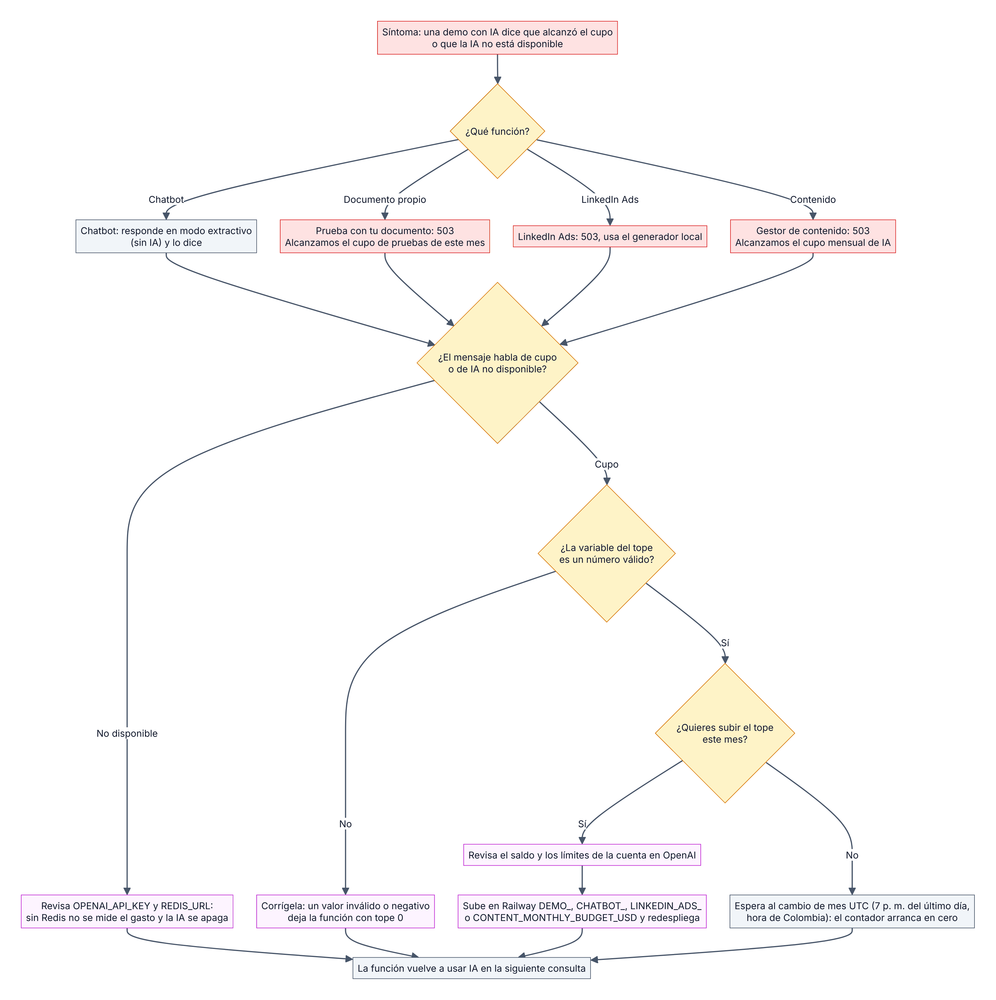

Cada función con IA tiene su tope mensual en dólares (por defecto 50 para el chatbot y para «Prueba con tu documento», 20 para LinkedIn Ads y para el gestor de contenido) y el gasto se acumula en Redis por mes UTC. El panel no muestra el gasto: se ve en Redis (clave `<función>:spend:AAAA-MM`) o en la cuenta de OpenAI.

**Fuente en el código:** `apps/backend/src/services/ai-budget.service.ts`, `apps/backend/src/routes/chatbot.routes.ts`, `apps/backend/src/services/chatbot.service.ts`, `apps/backend/src/services/demo-rag.service.ts`, `apps/backend/src/routes/linkedin-ads.routes.ts`, `apps/backend/src/routes/content-manager.routes.ts`.

### 9.5 Rotar secretos

```mermaid
flowchart TD
    classDef visitante fill:#dbeafe,stroke:#2563eb,color:#0f172a
    classDef sistema fill:#f1f5f9,stroke:#475569,color:#0f172a
    classDef admin fill:#f3e8ff,stroke:#9333ea,color:#0f172a
    classDef aviso fill:#dcfce7,stroke:#16a34a,color:#0f172a
    classDef decision fill:#fef3c7,stroke:#d97706,color:#0f172a
    classDef error fill:#fee2e2,stroke:#dc2626,color:#0f172a
    classDef externo fill:#fdf4ff,stroke:#c026d3,color:#0f172a

    K0["Decides rotar: urgente para MongoDB y JWT,<br/>que quedaron en el historial del repositorio"]:::admin
    D1{"¿Qué secreto?"}:::decision
    M1["Cambia la contraseña en el proveedor de la base"]:::externo
    M2["Actualiza MONGODB_URI en Railway"]:::externo
    J1["JWT_SECRET: valor nuevo, largo (32 o más)<br/>y distinto del de renovación"]:::admin
    J2["Los tokens de acceso actuales dejan de valer:<br/>la web los renueva con el de renovación"]:::sistema
    J3["JWT_REFRESH_SECRET: valor nuevo y distinto"]:::admin
    J4["Las sesiones no se pueden renovar: todos<br/>vuelven a iniciar sesión (máx. 15 min)"]:::visitante
    K1["INTERNAL_API_KEY: el mismo valor nuevo<br/>en Vercel y en Railway"]:::externo
    K2["Redespliega también la web"]:::externo
    P1["SMTP, OpenAI o WhatsApp: revoca la clave<br/>en el proveedor y crea una nueva"]:::externo
    P2["Actualiza la variable en Railway"]:::externo
    R1["Redespliegue del backend en Railway"]:::externo
    D2{"¿GET /health responde 200?"}:::decision
    R2["Revisa el valor nuevo en los logs (ver 9.1)"]:::error
    R3["Prueba el login en /admin y un correo"]:::admin
    R4["Rotación terminada"]:::sistema

    K0 --> D1
    D1 -->|"MongoDB"| M1 --> M2 --> R1
    D1 -->|"JWT_SECRET"| J1 --> J2 --> R1
    D1 -->|"JWT_REFRESH_SECRET"| J3 --> J4 --> R1
    D1 -->|"INTERNAL_API_KEY"| K1 --> K2 --> R1
    D1 -->|"Proveedores"| P1 --> P2 --> R1
    R1 --> D2
    D2 -->|"No"| R2 --> R1
    D2 -->|"Sí"| R3 --> R4
```

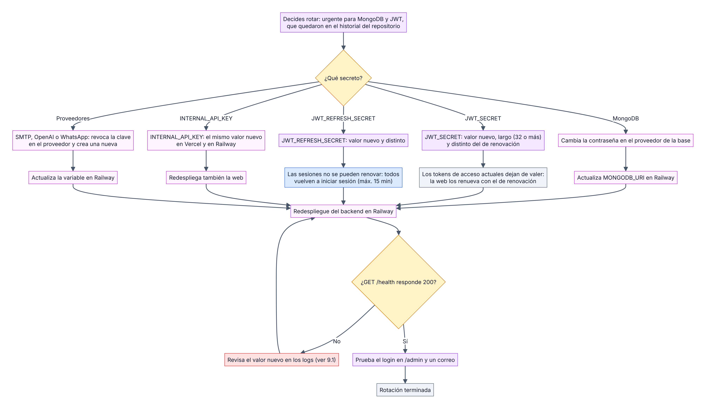

Los secretos viven solo en Vercel y Railway, nunca en el repositorio. Los enlaces de activación pendientes no se afectan: se guardan como un hash en MongoDB y no dependen de los secretos JWT. Si rotas los dos JWT a la vez, todas las sesiones se cierran.

**Fuente en el código:** `apps/backend/src/middleware/auth.ts` (`generateAccessToken`, `generateRefreshToken`, `verifyRefreshToken`), `apps/backend/src/controllers/auth.controller.ts` (`refreshToken`), `apps/backend/src/config/env.ts`, `apps/backend/src/services/magic-link.service.ts`, `apps/web/src/middleware.ts` (`refreshAccessToken`, `forwardHeaders`).

### 9.6 Revertir un despliegue

```mermaid
flowchart TD
    classDef visitante fill:#dbeafe,stroke:#2563eb,color:#0f172a
    classDef sistema fill:#f1f5f9,stroke:#475569,color:#0f172a
    classDef admin fill:#f3e8ff,stroke:#9333ea,color:#0f172a
    classDef aviso fill:#dcfce7,stroke:#16a34a,color:#0f172a
    classDef decision fill:#fef3c7,stroke:#d97706,color:#0f172a
    classDef error fill:#fee2e2,stroke:#dc2626,color:#0f172a
    classDef externo fill:#fdf4ff,stroke:#c026d3,color:#0f172a

    V0["Detectas un error después de un despliegue"]:::error
    D0{"¿La causa fue una variable<br/>y no el código?"}:::decision
    V1["Restaura el valor en Vercel o Railway y redespliega<br/>(NEXT_PUBLIC_* exige reconstruir la web)"]:::externo
    D1{"¿Qué parte falla?"}:::decision
    V2["Vercel: vuelve a poner en producción<br/>el despliegue anterior de la web"]:::externo
    V3["Railway: vuelve a desplegar el despliegue<br/>anterior del backend"]:::externo
    V4["Verifica /health y el flujo afectado"]:::admin
    V5["GitHub: PR con git revert del merge en main"]:::admin
    V6["CI del PR en verde (7.1)"]:::externo
    V7["Merge: Vercel y Railway despliegan<br/>main ya revertido (7.2)"]:::externo
    E1["Si no reviertes main, el siguiente push<br/>vuelve a desplegar el error"]:::error
    D2{"¿El cambio escribió<br/>datos en MongoDB?"}:::decision
    V8["Los datos no se revierten solos:<br/>revísalos a mano (no hay migraciones automáticas)"]:::error
    V9["main y producción vuelven a coincidir"]:::sistema

    V0 --> D0
    D0 -->|"Sí"| V1 --> V4
    D0 -->|"No"| D1
    D1 -->|"Web o ambas"| V2 --> V4
    D1 -->|"API o ambas"| V3 --> V4
    V4 --> V5 --> V6 --> V7 --> D2
    V5 -.->|"Si no lo haces"| E1
    D2 -->|"Sí"| V8 --> V9
    D2 -->|"No"| V9
```

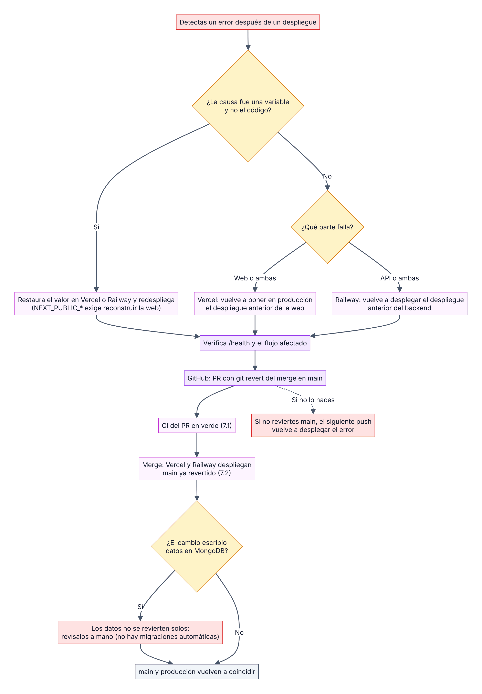

Volver a un despliegue anterior es una función de los paneles de Vercel y Railway (no está en el repositorio) y sirve para salir del paso en minutos; la reversión definitiva es un `git revert` en `main`, porque las dos plataformas despliegan desde ahí. El catálogo de demos y los demás datos viven en MongoDB y no cambian al revertir el código.

**Fuente en el código:** `.github/workflows/ci.yml` (CI no despliega), `apps/backend/railway.json`, `apps/web/vercel.json`, `apps/backend/src/index.ts` (la semilla del catálogo solo inserta lo que falta), `README.md` (sección Despliegue).

---

## Hallazgos

Cosas del código o de la configuración que no tienen sentido o pueden confundir a quien opera el sitio. Están dibujadas tal como son.

1. **Con el backend caído, el panel manda al login en lugar de avisar.** Railway responde 404 («Application not found») a todo, y el middleware de la web trata un 404 de `GET /api/auth/me` igual que una sesión inválida: redirige a `/login` en vez de mostrar la página 503 «No pudimos verificar tu sesión». Quien opera puede creer que el problema son sus credenciales. (`apps/web/src/middleware.ts`, `fetchMe`).
2. **`main` no tiene protección de rama.** GitHub no exige CI en verde para fusionar, y Vercel y Railway despliegan desde `main` sin esperar a CI: un merge con CI en rojo llega igual a producción.
3. **La wiki también se publica desde la rama de trabajo.** `wiki-sync.yml` se dispara con push a `main` **y** a `ccr-55ceecf7-dpc10i`; la wiki puede mostrar páginas que todavía no están en `main` (la primera publicación correcta, el 9 de octubre, salió de esa rama).
4. **El README y el código no dicen lo mismo sobre `JWT_REFRESH_SECRET`.** El README dice que en producción el backend no arranca sin ella; `config/env.ts` solo registra el aviso y arranca (sin ella falla el inicio de sesión).
5. **El aviso de arranque sobre el correo mira la variable equivocada.** `config/env.ts` avisa si falta `SMTP_HOST`, pero el envío depende de `SMTP_USER` y `SMTP_PASS` (sin `SMTP_HOST` usa el servidor de Gmail). Con usuario y contraseña pero sin host, el log dice que el correo está apagado y no lo está; con host pero sin usuario, no avisa y el correo sí está apagado.
6. **Sin `ADMIN_EMAIL`, los avisos al equipo van a una dirección fija escrita en el código** (`services/email.service.ts`), no a «nadie». Para los roles, en cambio, sin `ADMIN_EMAIL` no se toca a nadie.
7. **`ADMIN_EMAIL` vuelve a dar admin en cada arranque.** Quitarle el rol desde el panel a esa cuenta se deshace en el siguiente despliegue o reinicio. Ni esta vía ni el script `set-admin` quedan en la bitácora (solo el cambio desde el panel registra `user.role_change`).
8. **El selector de roles de Admin › Usuarios está incompleto.** Ofrece Usuario, Developer, Manager y Admin: no hay forma de dar el rol comercial (`sales`), `prospect` ni `client` desde la interfaz, solo por API. Si un usuario ya tiene uno de esos roles, el selector no lo puede mostrar. Un manager ve el selector, pero el backend le responde 403.
9. **Un rol nuevo no se ve en el panel hasta volver a iniciar sesión.** El panel decide qué mostrar con el rol guardado en el navegador al iniciar sesión; el servidor ya aplica el rol nuevo, pero la persona es enviada a su página anterior hasta que sale y vuelve a entrar.
10. **La bitácora no tiene pantalla.** `GET /api/admin/audit-log` existe (solo admin), pero no hay una sección del panel para consultarla.
11. **En Accesos, el enlace de activación nuevo no ofrece WhatsApp.** El modal se abre sin teléfono, así que solo permite copiar el enlace, aunque la persona tenga teléfono (en el detalle de la solicitud sí aparece el botón).
12. **Se puede conceder acceso a una demo desactivada.** Ni aprobar ni invitar revisan si la demo está activa: la persona recibe el correo y al abrirla ve «En mantenimiento».
13. **Hay dos archivos de middleware en la web.** Next usa `apps/web/src/middleware.ts` (el de la caché del catálogo); `apps/web/middleware.ts`, en la raíz, no se ejecuta y puede confundir a quien busque dónde se decide el acceso.
14. **El chequeo de salud de Railway no mira la base.** `railway.json` usa `/health/live`, que responde 200 aunque MongoDB no esté conectado; un despliegue sin base queda «sano» para Railway mientras `/health` responde 503.

## Páginas relacionadas

- [Diagramas de flujo](Doc-14-Diagramas-de-Flujo.md) · [Flujos de negocio](Doc-14-1-Flujos-de-Negocio.md) · [Flujos técnicos](Doc-14-3-Flujos-Tecnicos.md)
- [Manual del administrador](Doc-06-Manual-del-Administrador.md) (las mismas acciones con capturas)
- [Roles y permisos](Doc-10-Roles-y-Permisos.md) · [Operación y despliegue](Doc-11-Operacion-y-Despliegue.md)
- [Flujos del prospecto y cliente](Doc-05-Flujos-del-Prospecto-y-Cliente.md) (lo mismo visto desde el otro lado)
- [Estado y próximos pasos](15-Estado-y-Proximos-Pasos.md)
