# Flujos técnicos

> **Resumen.** Estos diagramas muestran las reglas exactas que aplica el código de `main` cada vez que alguien abre una página privada o una demo, llama a la API, le pregunta algo al chatbot, sube un documento o genera contenido de LinkedIn. También muestran cómo el backend responde a los errores, cómo revisa sus variables al arrancar y qué pasa con los datos personales desde que entran hasta que se borran (o no se borran). Cada rombo es un `if` del código y cada caja roja, una respuesta de error o un bloqueo real.
>
> **Para quién:** sobre todo para quien desarrolla u opera el sitio. Si eres el dueño, empieza por los diagramas 1.2 (cómo se protege una demo), 3.2 (cómo responde el chatbot sin inventar), 4.1 (qué pasa con un documento subido) y 8 (datos personales). Los mismos recorridos vistos por el visitante y por el equipo están en [Flujos de negocio](Doc-14-1-Flujos-de-Negocio.md) y [Flujos de administración y operación](Doc-14-2-Flujos-de-Administracion-y-Operacion.md). Todos los diagramas están reunidos en [Diagramas de flujo](Doc-14-Diagramas-de-Flujo.md).

## Leyenda de colores

| Color | Qué representa | Ejemplos en esta página |
|---|---|---|
| Azul | Visitante, prospecto o cliente | Abrir una demo, hacer una pregunta, recibir la respuesta |
| Gris | Sistema: web, backend, base de datos o Redis | Middleware de Next, `requireRole`, guardar en MongoDB |
| Morado | Equipo de KopTup (admin o comercial) | Aprobar una solicitud, revisar `/health` |
| Verde | Aviso: email, WhatsApp o notificación | Aviso al equipo de un lead nuevo |
| Ámbar (rombo) | Decisión del código | ¿El token es válido? |
| Rojo | Error, bloqueo o camino degradado | 401, 403, 429, 503, pantalla de acceso |
| Fucsia | Servicio externo | OpenAI, Railway, Google |

## Índice de diagramas

1. **Filtro de la web (middleware de Next)**
   - [1.1 Áreas privadas: panel, portal y herramientas](#11-áreas-privadas-panel-portal-y-herramientas)
   - [1.2 Demos con acceso controlado](#12-demos-con-acceso-controlado)
   - [1.3 Caché del catálogo y respaldo estático](#13-caché-del-catálogo-y-respaldo-estático)
2. **Autorización en el backend**
   - [2.1 Sesión y rol con authenticate y requireRole](#21-sesión-y-rol-con-authenticate-y-requirerole)
   - [2.2 APIs de una demo con requireStaffOrDemoAccess](#22-apis-de-una-demo-con-requirestaffordemoaccess)
   - [2.3 La decisión con DemoGrant](#23-la-decisión-con-demogrant)
   - [2.4 Propiedad de los bots del chatbot](#24-propiedad-de-los-bots-del-chatbot)
3. **Chatbot RAG**
   - [3.1 Ingesta y fragmentación de documentos](#31-ingesta-y-fragmentación-de-documentos)
   - [3.2 Pipeline de una pregunta](#32-pipeline-de-una-pregunta)
   - [3.3 Secuencia de una pregunta](#33-secuencia-de-una-pregunta) (diagrama de secuencia)
4. **Prueba con tu documento**
   - [4.1 Subida del documento](#41-subida-del-documento)
   - [4.2 Preguntas sobre el documento](#42-preguntas-sobre-el-documento)
   - [4.3 Secuencia completa](#43-secuencia-completa) (diagrama de secuencia)
   - [4.4 Vida del documento en memoria](#44-vida-del-documento-en-memoria) (diagrama de estados)
5. **Generador de LinkedIn Ads**
   - [5.1 Proxy de la web](#51-proxy-de-la-web)
   - [5.2 Lo que decide el backend](#52-lo-que-decide-el-backend)
6. **Errores y salud del backend**
   - [6.1 Recorrido de una petición](#61-recorrido-de-una-petición)
   - [6.2 Manejo de errores](#62-manejo-de-errores)
   - [6.3 Health checks](#63-health-checks)
7. **Arranque del backend**
   - [7.1 Validación de variables de entorno](#71-validación-de-variables-de-entorno)
   - [7.2 Secuencia de arranque](#72-secuencia-de-arranque)
8. **Datos personales (Ley 1581 de 2012)**
   - [8.1 Solicitud de demo y cuenta](#81-solicitud-de-demo-y-cuenta)
   - [8.2 Demos con IA y navegador](#82-demos-con-ia-y-navegador)
   - [8.3 Qué se guarda, dónde y cuánto tiempo](#83-qué-se-guarda-dónde-y-cuánto-tiempo) (tabla)
9. [Hallazgos](#hallazgos)

---

## 1. Filtro de la web (middleware de Next)

El middleware de la web (`apps/web/src/middleware.ts`) corre en el servidor de Vercel antes de mostrar `/admin`, `/dashboard`, `/liquidacion`, `/test` y cualquier `/demo/<slug>`. Es una barrera extra: el backend vuelve a autorizar cada endpoint (sección 2).

### 1.1 Áreas privadas: panel, portal y herramientas

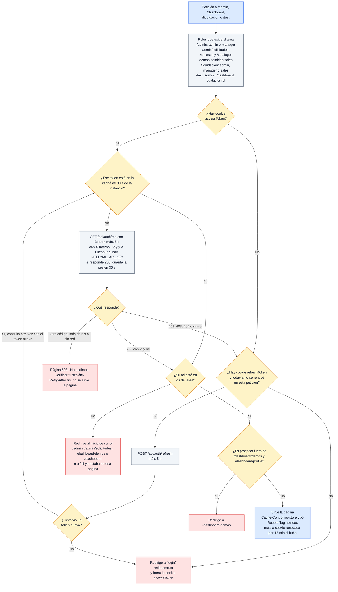


Cada navegación (y cada prefetch de Next) a un área privada pregunta al backend quién es la sesión y con qué rol, salvo que esa misma instancia lo haya verificado hace menos de 30 s. La renovación con `refreshToken` se intenta una sola vez por petición. Un 404 del backend cuenta como «sin sesión»: con Railway caído eso manda al login en vez de mostrar la página 503 (hallazgo 1 de [Flujos de administración](Doc-14-2-Flujos-de-Administracion-y-Operacion.md#hallazgos)). El backend cuenta estas consultas en su propio cupo de 120 por minuto (diagrama 6.1); si lo agota responde 429 y aquí se ve la página 503.

Fuente en el código: `apps/web/src/middleware.ts` (`middleware`, `fetchMe`, `refreshAccessToken`), `apps/web/src/lib/auth-roles.ts`, `apps/backend/src/middleware/rateLimiter.ts` (`authMeRateLimiter`).

---

### 1.2 Demos con acceso controlado

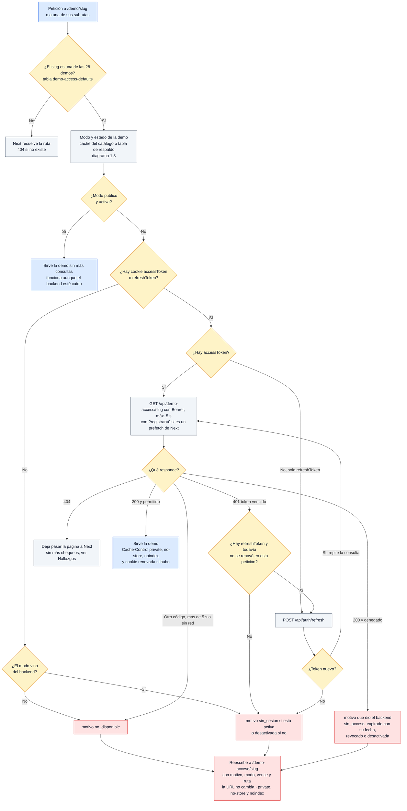


Las demos abiertas pasan sin tocar el backend; las de modo `solicitud` o `privado` (o cualquier demo desactivada) se consultan siempre con la sesión. Un motivo que no esté en la lista conocida (`sin_sesion`, `sin_acceso`, `expirado`, `revocado`, `desactivada`, `no_disponible`) se muestra como `sin_acceso`. La pantalla de acceso, con sus textos, está en el diagrama 7c de [Flujos de negocio](Doc-14-1-Flujos-de-Negocio.md#7c-entrar-a-una-demo-la-pantalla-de-acceso).

Fuente en el código: `apps/web/src/middleware.ts` (`demoGate`, `fetchDemoAccess`, `accessScreen`, `isPrefetch`), `apps/web/src/lib/demo-access-defaults.ts`, `apps/backend/src/routes/demo-public.routes.ts` (`GET /api/demo-access/:slug`).

---

### 1.3 Caché del catálogo y respaldo estático

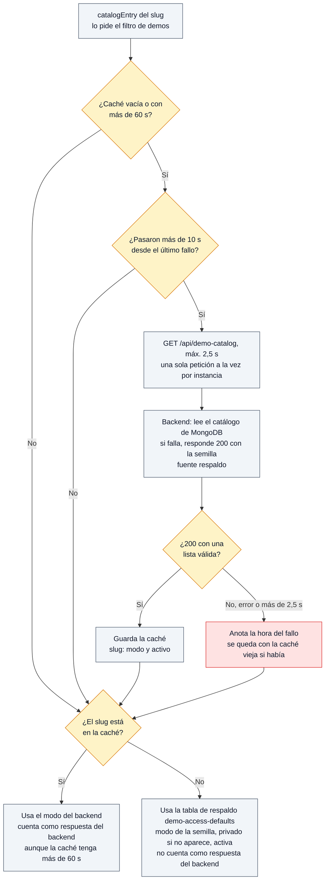


Cada instancia del servidor de la web guarda el catálogo 60 s; si el backend falla, reintenta como mucho cada 10 s y mientras tanto usa la última copia que tenga, que es la última decisión conocida del administrador. Sin ninguna copia usa la tabla fija, igual a la semilla del backend (una prueba lo verifica). Por eso un cambio de modo en el panel tarda hasta un minuto en llegar al filtro ([diagrama 3.2 de administración](Doc-14-2-Flujos-de-Administracion-y-Operacion.md#32-cómo-se-propaga-el-cambio)).

Fuente en el código: `apps/web/src/middleware.ts` (`loadCatalog`, `catalogEntry`), `apps/web/src/lib/demo-access-defaults.ts`, `apps/backend/src/routes/demo-public.routes.ts` (`GET /api/demo-catalog`).

---

## 2. Autorización en el backend

Cada router aplica una política (inventario completo en `apps/backend/src/routes/POLICIES.md` y en [Roles y permisos](Doc-10-Roles-y-Permisos.md)). Los roles de staff y admin se leen de MongoDB en cada petición, no del token.

### 2.1 Sesión y rol con authenticate y requireRole

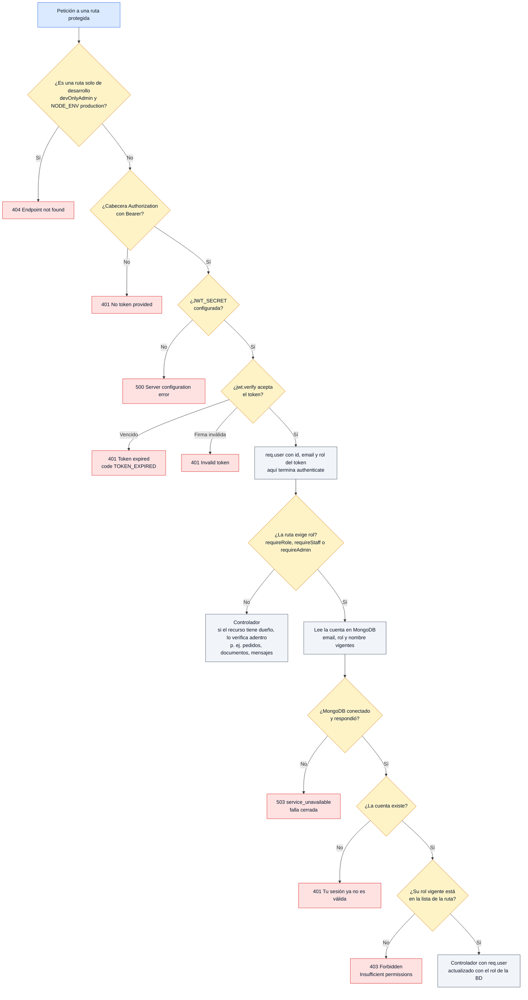


`requireRole(...roles)` siempre corre `authenticate` primero y luego lee la cuenta de la base: si a alguien le quitan el rol o le borran la cuenta, pierde el acceso de inmediato aunque su token siga vigente. `requireStaff` es `admin`, `manager` o `sales`; `requireAdmin`, solo `admin`. Existe además `authorize(...roles)` en `middleware/auth.ts`, que confía en el rol escrito dentro del token, pero ninguna ruta lo usa (ver Hallazgos).

Fuente en el código: `apps/backend/src/middleware/auth.ts` (`authenticate`, `authorize`), `apps/backend/src/middleware/access.ts` (`requireRole`, `loadFreshUser`, `devOnlyAdmin`), `apps/backend/src/routes/POLICIES.md`.

---

### 2.2 APIs de una demo con requireStaffOrDemoAccess

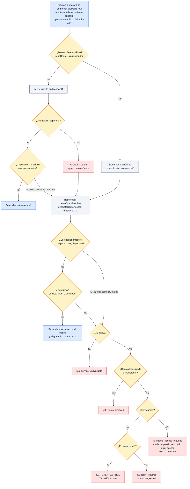


Este middleware protege las APIs de las demos que tienen backend propio. Con la base caída, una demo en modo `publico` sigue abierta (el resolvedor usa la semilla) y las demás fallan cerradas con 503. El rol `developer` no está en la lista de staff de este middleware, pero el resolvedor lo deja pasar como staff.

Fuente en el código: `apps/backend/src/middleware/access.ts` (`requireStaffOrDemoAccess`, `readBearer`), `apps/backend/src/services/demo-access.service.ts` (`demoGrantResolver`), `apps/backend/src/routes/auditoria.routes.ts`, `expert-system.routes.ts`, `cups.routes.ts`, `content-manager.routes.ts`, `documentoConocimientoConfig.routes.ts`, `linkedin-ads.routes.ts`.

---

### 2.3 La decisión con DemoGrant

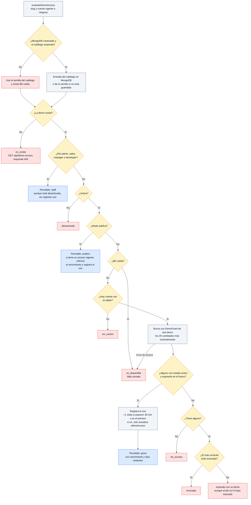


Es la única fuente de verdad del acceso a demos: la usan la web (vía `GET /api/demo-access`) y las APIs (vía el middleware 2.2). La vigencia se compara con la hora en cada consulta, así que un acceso vence a tiempo aunque el job de vencimiento no haya corrido. El registro de uso depende de quién pregunta: la web lo actualiza en cada visita real, un prefetch (`?registrar=0`) no registra nada y las APIs actualizan `ultimoAcceso` como mucho cada 5 min.

Fuente en el código: `apps/backend/src/services/demo-access.service.ts` (`evaluateDemoAccess`, `effectiveGrantState`, `recordUse`), `apps/backend/src/services/demo-catalog.service.ts` (`getCatalogEntry`, `seedEntry`), `apps/backend/src/config/demos.ts` (`DEMO_STAFF_ROLES`), `apps/backend/src/models/DemoGrant.ts`.

---

### 2.4 Propiedad de los bots del chatbot

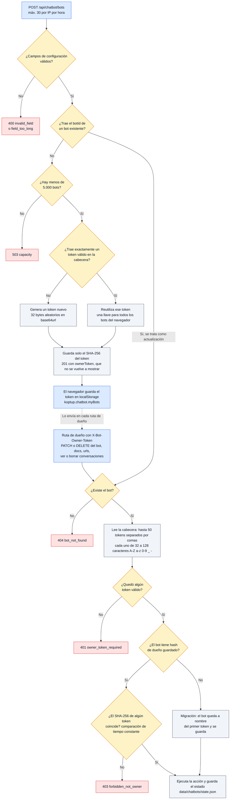


Los bots del chatbot no usan cuentas: la propiedad es un token aleatorio que solo conoce el navegador que creó el bot. Sin ese token, `GET /api/chatbot/bots/:id` da la vista pública (sin el prompt del sistema ni los nombres de los documentos) y `POST /api/chatbot/bots/:id/chat` responde a cualquiera, para que funcione el widget insertado en otro sitio. `GET /api/chatbot/bots` sin token solo lista los bots de ejemplo de `CHATBOT_EXAMPLE_BOT_IDS`.

Fuente en el código: `apps/backend/src/routes/chatbot.routes.ts` (`requireOwner`, `readOwnerTokens`, `isOwner`, `POST /bots`), `apps/backend/src/app.ts` (`BOT_OWNER_TOKEN_HEADER` en CORS), `apps/web/src/app/demo/chatbot/components/builder/api.ts`.

---

## 3. Chatbot RAG

Es la demo `/demo/chatbot` en sus modos «Prueba el asistente» (empresas ficticias con sus documentos) y «Configura el tuyo» (bot propio y widget). Al elegir una empresa de ejemplo, el navegador crea un bot real en el backend y le sube los textos; desde ahí todo es el mismo pipeline. La guía de uso está en [Guía de la demo del chatbot](Guia-Demo-chatbot.md).

### 3.1 Ingesta y fragmentación de documentos

```mermaid
flowchart TD
    classDef visitante fill:#dbeafe,stroke:#2563eb,color:#0f172a
    classDef sistema fill:#f1f5f9,stroke:#475569,color:#0f172a
    classDef admin fill:#f3e8ff,stroke:#9333ea,color:#0f172a
    classDef aviso fill:#dcfce7,stroke:#16a34a,color:#0f172a
    classDef decision fill:#fef3c7,stroke:#d97706,color:#0f172a
    classDef error fill:#fee2e2,stroke:#dc2626,color:#0f172a
    classDef externo fill:#fdf4ff,stroke:#c026d3,color:#0f172a

    IN["Configura el tuyo o empresa de ejemplo<br/>POST /bots/id/docs con archivos en base64<br/>cuerpo JSON de hasta 15 MB"]:::visitante
    OWN["Verifica el dueño, diagrama 2.4"]:::sistema
    Q1{"¿Entre 1 y 5 archivos y el bot<br/>queda con 50 o menos?"}:::decision
    E400["400 no_files, too_many_files<br/>o too_many_docs"]:::error
    Q2{"Por cada archivo: ¿tiene<br/>contenido y pesa 5 MB o menos?"}:::decision
    EX["Extrae el texto<br/>PDF con pdf-parse, DOCX con mammoth o texto plano<br/>máx. 500.000 caracteres"]:::sistema
    Q3{"¿Se pudo leer<br/>y tiene texto?"}:::decision
    ERRF["Error de ese archivo<br/>missing_content, file_too_large, unreadable,<br/>empty_content o bot_capacity"]:::error
    P["Parte en párrafos separados por una línea en blanco<br/>descarta los de 20 caracteres o menos"]:::sistema
    Q4{"¿El párrafo tiene más<br/>de 800 caracteres?"}:::decision
    S1["Un fragmento por párrafo"]:::sistema
    S2["Lo parte por oraciones y las agrupa<br/>en bloques de unos 500 caracteres"]:::sistema
    Q5{"¿Salió algún<br/>fragmento?"}:::decision
    S3["Bloques fijos de 500 caracteres"]:::sistema
    TK["Tokeniza cada fragmento para BM25<br/>minúsculas, palabras de 3 o más letras o dígitos"]:::sistema
    Q6{"¿El bot pasaría de<br/>5.000 fragmentos?"}:::decision
    SAVE["Guarda metadatos y fragmentos<br/>en memoria y en data/chatbots/state.json"]:::sistema
    Q7{"¿Se agregó al menos<br/>un archivo?"}:::decision
    R201["201 con docs, added y errors"]:::visitante
    R422["422 no_valid_files"]:::error
    URL["Variante POST /bots/id/urls<br/>hasta 5 URLs de 2 MB y 8 s cada una<br/>bloquea IP privadas y quita el HTML"]:::sistema

    IN --> OWN --> Q1
    Q1 -->|No| E400
    Q1 -->|Sí| Q2
    Q2 -->|No| ERRF
    Q2 -->|Sí| EX --> Q3
    Q3 -->|No| ERRF
    Q3 -->|Sí| P --> Q4
    URL -.->|Texto de la página| P
    Q4 -->|No| S1 --> Q5
    Q4 -->|Sí| S2 --> Q5
    Q5 -->|No| S3 --> TK
    Q5 -->|Sí| TK
    TK --> Q6
    Q6 -->|Sí| ERRF
    Q6 -->|No| SAVE --> Q7
    ERRF --> Q7
    Q7 -->|Sí| R201
    Q7 -->|No| R422
```


No hay embeddings: el «índice» de cada documento son las palabras normalizadas de sus fragmentos. Un archivo con error no frena a los demás de la misma petición; la respuesta dice cuáles entraron y por qué fallaron los otros. Las URLs responden siempre 200 con su propia lista de errores (`invalid_url`, `empty_content` si la página tiene menos de 40 caracteres de texto, o el motivo del bloqueo de red).

Fuente en el código: `apps/backend/src/routes/chatbot.routes.ts` (`POST /bots/:botId/docs`, `POST /bots/:botId/urls`, `BOT_LIMITS`), `apps/backend/src/services/rag-pipeline.ts` (`chunkText`, `tokenize`), `apps/backend/src/services/document-text.service.ts`, `apps/backend/src/services/safe-fetch.service.ts`, `apps/backend/src/app.ts` (límite de 15 MB).

---

### 3.2 Pipeline de una pregunta

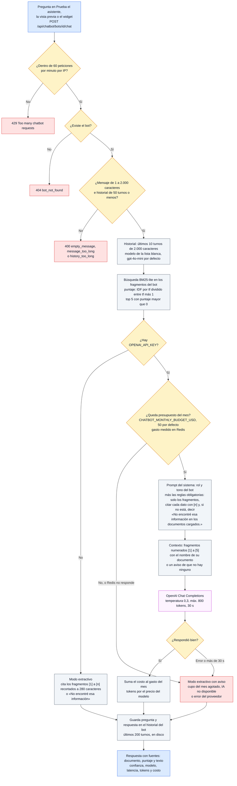


Así el chatbot evita inventar: el modelo solo ve los cinco fragmentos más parecidos a la pregunta y las reglas le obligan a citarlos o a decir que no encontró la información. Sin clave de OpenAI, sin presupuesto o si el proveedor falla, la demo no se cae: responde en modo extractivo con los fragmentos y su cita. La confianza que muestra es fija según el camino (0,85 con modelo y fragmentos, 0,5 con modelo sin fragmentos, 0,3 extractivo con fragmentos y 0 sin ellos), no una medida del modelo.

Fuente en el código: `apps/backend/src/routes/chatbot.routes.ts` (`POST /bots/:botId/chat`, `GROUNDING_RULES`, `composeExtractiveReply`, `sanitizeHistory`), `apps/backend/src/services/rag-pipeline.ts` (`retrieve`, `callOpenAI`, `estimateCostUSD`, `OPENAI_MODELS`), `apps/backend/src/services/ai-budget.service.ts`, `apps/backend/src/middleware/rateLimiter.ts` (`chatbotRateLimiter`).

---

### 3.3 Secuencia de una pregunta

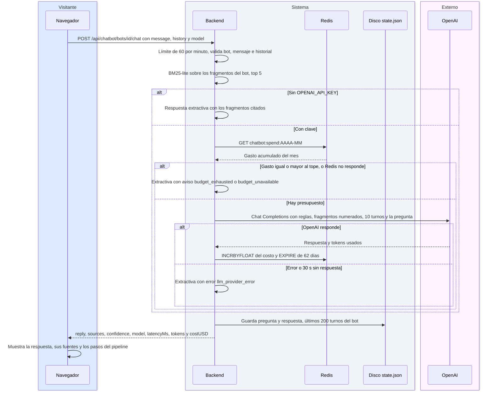


La misma pregunta vista en el tiempo. El navegador llama directo al backend (no pasa por un proxy de Next). El gasto del mes se guarda en Redis con la clave del mes en UTC, igual que factura OpenAI, y nunca se le muestra al visitante.

Fuente en el código: `apps/web/src/app/demo/chatbot/page.tsx`, `apps/web/src/app/demo/chatbot/components/builder/api.ts` (`chatWithBot`), `apps/backend/src/routes/chatbot.routes.ts`, `apps/backend/src/services/ai-budget.service.ts` (`getBudgetStatus`, `recordSpend`), `apps/backend/src/data/chatbot-store.ts`.

---

## 4. Prueba con tu documento

Es la pestaña de `/demo/chatbot` donde el visitante sube su propio PDF, DOCX o TXT. Usa el mismo pipeline del chatbot, pero sin modo extractivo: si falta algo (interruptor, OpenAI, Redis o presupuesto) la función se apaga entera.

### 4.1 Subida del documento

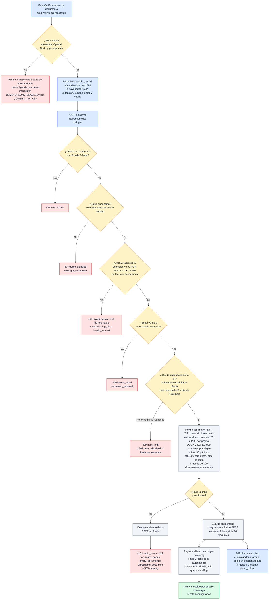


El cupo diario se reserva antes de procesar el archivo y se devuelve si el documento termina rechazado, así que un PDF dañado no le gasta un intento a la persona. El archivo original nunca se escribe en disco: se procesa desde la memoria y solo se conservan el texto partido y sus palabras. Esta ruta también cuenta en el límite general de la API (100 peticiones cada 15 min, diagrama 6.1).

Fuente en el código: `apps/backend/src/routes/demo-rag.routes.ts` (`POST /documents`, `parseMultipart`, `registerDemoLead`), `apps/backend/src/services/demo-rag.service.ts` (`getDemoStatus`, `assertDemoEnabled`, `detectKind`, `hasValidSignature`, `reserveDailyUpload`, `ingestDocument`, `DEMO_LIMITS`), `apps/backend/src/services/lead.service.ts`, `apps/web/src/app/demo/chatbot/components/upload/UploadForm.tsx`, `UploadDemo.tsx`.

---

### 4.2 Preguntas sobre el documento

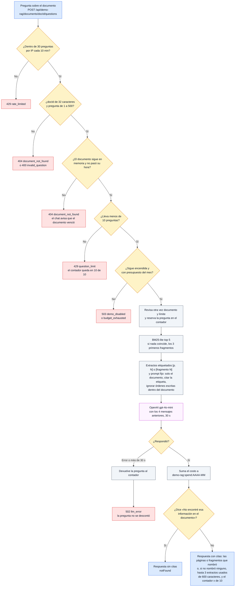


El límite de 10 preguntas se revisa dos veces y la pregunta se reserva en el mismo paso, para que dos preguntas enviadas a la vez no pasen de 10. El prompt de esta demo tiene una regla extra que el chatbot general no tiene: tratar el texto del documento como contenido y no como instrucciones. Las citas se reconstruyen a partir de lo que el modelo escribió (`[p. 3]`, `[fragmento 2]`), no se inventan.

Fuente en el código: `apps/backend/src/routes/demo-rag.routes.ts` (`POST /documents/:docId/questions`, `questionRateLimiter`), `apps/backend/src/services/demo-rag.service.ts` (`askDocument`, `DEMO_SYSTEM_PROMPT`, `buildCitations`, `isNotFoundReply`), `apps/web/src/app/demo/chatbot/components/upload/DocumentChat.tsx`.

---

### 4.3 Secuencia completa

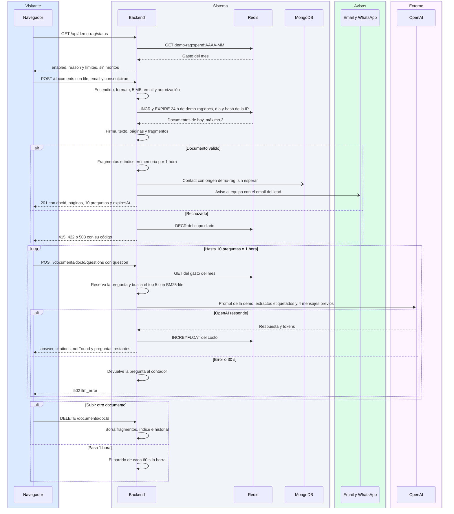


Todo el recorrido en el tiempo, con quién habla con quién. El lead y el aviso al equipo salen en paralelo y no frenan la respuesta. Si la persona recarga la pestaña, el navegador recupera el documento con `GET /documents/docId` usando el `docId` de `sessionStorage`, mientras siga en memoria.

Fuente en el código: `apps/backend/src/routes/demo-rag.routes.ts`, `apps/backend/src/services/demo-rag.service.ts`, `apps/backend/src/services/ai-budget.service.ts`, `apps/backend/src/services/lead.service.ts`, `apps/web/src/app/demo/chatbot/components/upload/api.ts`, `UploadDemo.tsx` (`handleReset`).

---

### 4.4 Vida del documento en memoria

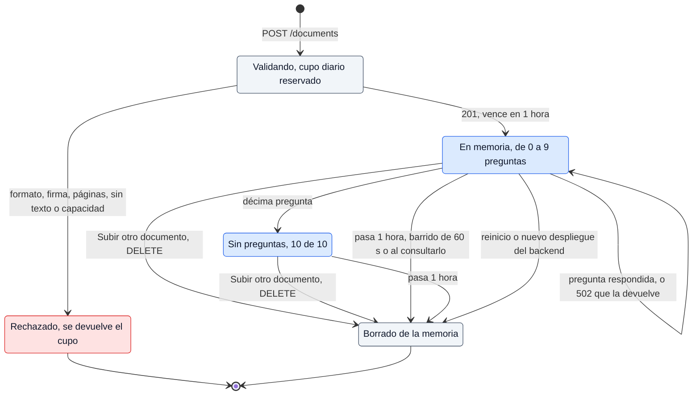


Los estados por los que pasa un documento subido. El documento vive en la memoria de un solo proceso: un reinicio lo borra antes de la hora y, si algún día hubiera varias instancias del backend, una pregunta que llegue a otra instancia respondería «documento no encontrado». Fuera de producción, `DEMO_RAG_TTL_SECONDS` puede acortar la hora para pruebas; nunca alargarla.

Fuente en el código: `apps/backend/src/services/demo-rag.service.ts` (`documents`, `documentTtlMs`, `sweepExpiredDocuments`, `getLiveDocument`, `deleteFromMemory`), `apps/backend/src/routes/demo-rag.routes.ts` (`DELETE /documents/:docId`).

---

## 5. Generador de LinkedIn Ads

La demo `/demo/linkedin-ads` (modo `solicitud`) tiene un generador local con plantillas y un botón «Generar con IA». El botón llama a una ruta de la propia web, que reenvía al backend; el backend es el que habla con OpenAI.

### 5.1 Proxy de la web

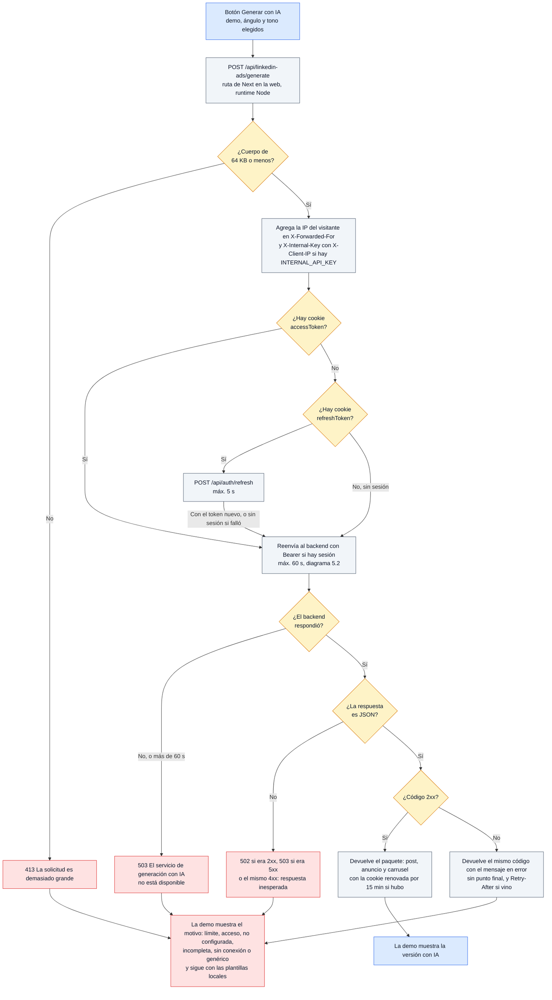


La ruta de Next no llama a OpenAI ni decide permisos: solo pasa la sesión, la IP y el cuerpo. La demo traduce el código HTTP a un motivo: 429 o 402 es «límite», 401 o 403 es «acceso», 503 con la palabra «configur» en el mensaje es «no configurada» y el resto es «genérico». En cualquier caso de error sigue mostrando el texto de las plantillas locales.

Fuente en el código: `apps/web/src/app/api/linkedin-ads/generate/route.ts`, `apps/web/src/app/demo/linkedin-ads/components/PostGenerator.tsx` (`generarConIA`), `apps/web/messages/demos/linkedin-ads.es.json` (`generator.ai.reasons`).

---

### 5.2 Lo que decide el backend

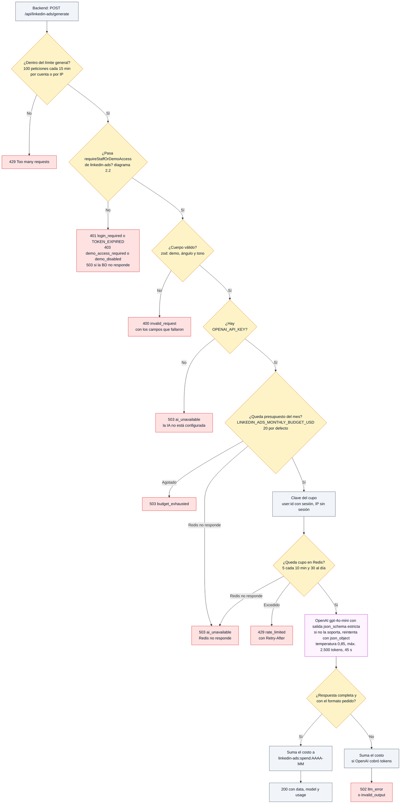


Antes de gastar un centavo se revisan, en este orden, el acceso a la demo, el formato, la clave, el presupuesto y el cupo. Todo falla cerrado: sin Redis no se puede medir el gasto ni el cupo, así que no se llama al modelo. El cupo es por cuenta porque, sin `INTERNAL_API_KEY`, la IP que ve el backend sería la de salida de Vercel, compartida por todos los visitantes.

Fuente en el código: `apps/backend/src/routes/linkedin-ads.routes.ts` (`LINKEDIN_LIMITS`), `apps/backend/src/services/linkedin-ads.service.ts` (`GenerateRequestSchema`, `generateLinkedInPack`), `apps/backend/src/services/ai-budget.service.ts` (`consumeRateLimit`, `getBudgetStatus`, `recordSpend`), `apps/backend/src/middleware/client-ip.ts`.

---

## 6. Errores y salud del backend

### 6.1 Recorrido de una petición

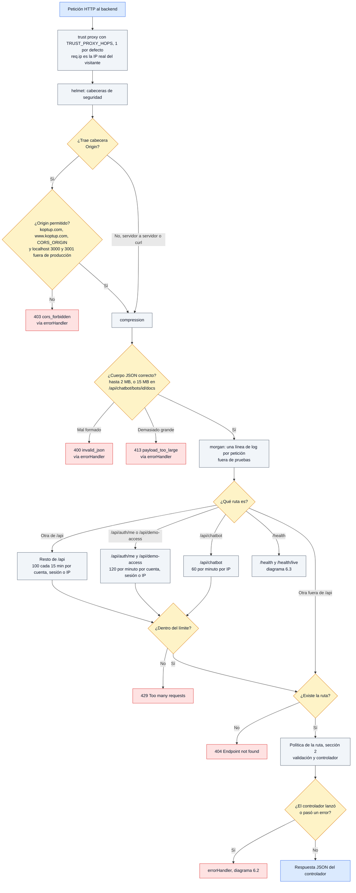


El orden de los middleware en `createApp`. Los límites se cuentan en la memoria de cada proceso (express-rate-limit), además de los cupos en Redis que tienen algunas rutas (solicitar demo, documentos de la demo RAG, LinkedIn). Muchas rutas responden sus propios errores sin pasar por `errorHandler` (`authenticate`, el chatbot, la demo RAG, LinkedIn), cada una con su formato (ver Hallazgos). La documentación Swagger en `/api-docs` solo existe fuera de producción o con `API_DOCS_ENABLED=true`.

Fuente en el código: `apps/backend/src/app.ts` (`createApp`, `getAllowedOrigins`), `apps/backend/src/middleware/rateLimiter.ts`, `apps/backend/src/middleware/client-ip.ts` (`generalRateLimitKey`).

---

### 6.2 Manejo de errores

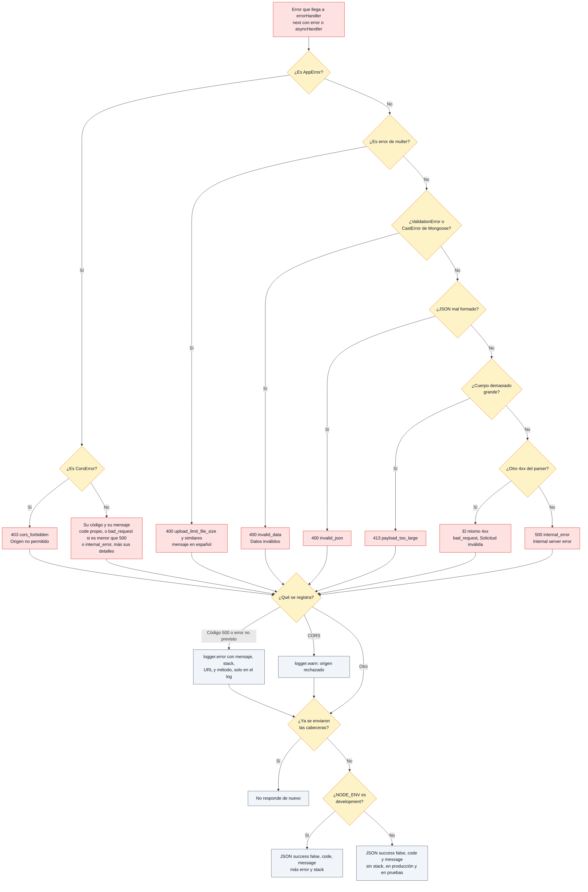


`classifyError` traduce cualquier error a un código HTTP, un `code` estable y un mensaje sin datos internos. El stack solo viaja en la respuesta cuando `NODE_ENV` es exactamente `development`; en producción y en pruebas se queda en el log. Los errores de validación de los formularios del sistema de demos llegan como `AppError` 400 `invalid_request` con `fields` y `errores` por campo (`zodToAppError`).

Fuente en el código: `apps/backend/src/middleware/errorHandler.ts` (`AppError`, `CorsError`, `classifyError`, `errorHandler`, `asyncHandler`), `apps/backend/src/routes/demo-public.routes.ts` (`zodToAppError`).

---

### 6.3 Health checks

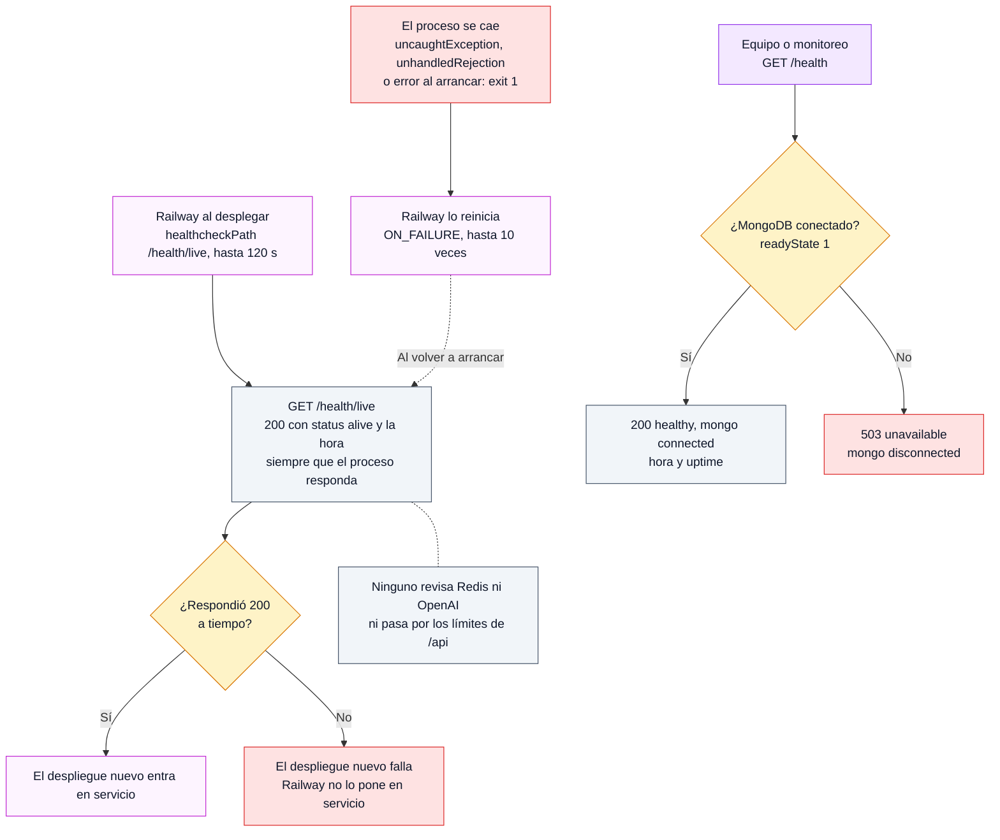


Hay dos chequeos: `/health/live` dice «el proceso está vivo» y `/health` dice «está listo para atender» (base conectada). Railway usa el primero, así que un despliegue sin base queda en servicio (hallazgo 14 de [Flujos de administración](Doc-14-2-Flujos-de-Administracion-y-Operacion.md#hallazgos)). Como pasan por CORS, un navegador desde un origen no permitido recibe 403; Railway y `curl` no envían `Origin` y pasan. El procedimiento ante una caída está en el [runbook 9.1](Doc-14-2-Flujos-de-Administracion-y-Operacion.md#91-el-backend-está-caído).

Fuente en el código: `apps/backend/src/app.ts` (`/health/live`, `/health`), `apps/backend/railway.json`, `apps/backend/src/index.ts` (`uncaughtException`, `unhandledRejection`).

---

## 7. Arranque del backend

### 7.1 Validación de variables de entorno

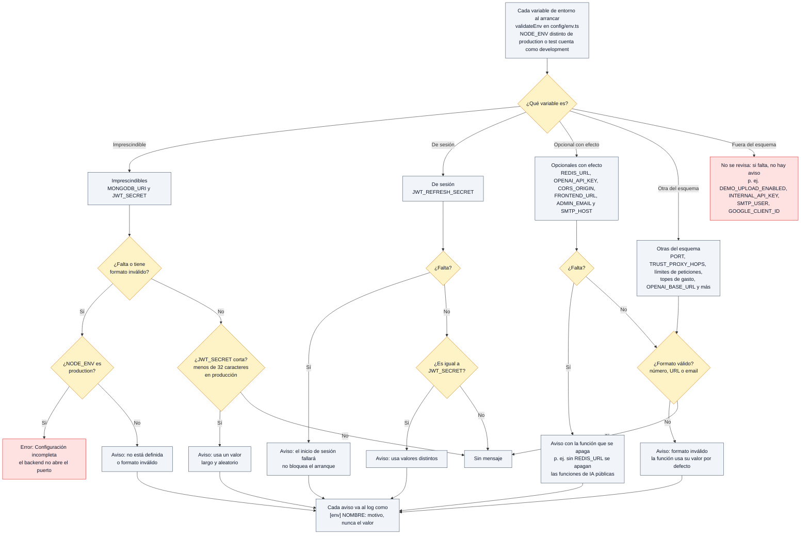


Solo dos variables pueden impedir el arranque, y solo en producción: `MONGODB_URI` y `JWT_SECRET`. Todo lo demás genera un aviso en el log y la función afectada se apaga o usa su valor por defecto. Un tope de gasto inválido o negativo deja esa función sin presupuesto (0), lo que equivale a apagarla. La lista completa de variables está en [Operación y despliegue](Doc-11-Operacion-y-Despliegue.md).

Fuente en el código: `apps/backend/src/config/env.ts` (`EnvSchema`, `REQUIRED_IN_PRODUCTION`, `RECOMMENDED_IN_PRODUCTION`, `OPTIONAL_WITH_EFFECT`, `validateEnv`, `assertValidEnv`), `apps/backend/src/services/ai-budget.service.ts` (`getMonthlyBudgetUSD`).

---

### 7.2 Secuencia de arranque

```mermaid
flowchart TD
    classDef visitante fill:#dbeafe,stroke:#2563eb,color:#0f172a
    classDef sistema fill:#f1f5f9,stroke:#475569,color:#0f172a
    classDef admin fill:#f3e8ff,stroke:#9333ea,color:#0f172a
    classDef aviso fill:#dcfce7,stroke:#16a34a,color:#0f172a
    classDef decision fill:#fef3c7,stroke:#d97706,color:#0f172a
    classDef error fill:#fee2e2,stroke:#dc2626,color:#0f172a
    classDef externo fill:#fdf4ff,stroke:#c026d3,color:#0f172a

    S["Railway: npm run start<br/>node dist/index.js, carga .env"]:::externo
    E["1. Valida las variables, diagrama 7.1"]:::sistema
    Q1{"¿Hay errores?"}:::decision
    X["Log de errores y exit 1<br/>no abre el puerto"]:::error
    RR["Railway reinicia el proceso<br/>ON_FAILURE, hasta 10 veces"]:::externo
    D["2. Crea las carpetas de archivos<br/>uploads y data/imports, en disco efímero"]:::sistema
    M["3. Conecta a MongoDB<br/>espera hasta 30 s para elegir servidor"]:::sistema
    Q2{"¿Conectó?"}:::decision
    MW["Aviso y sigue sin base<br/>/health responde 503 y las rutas<br/>que usan la base fallan o dan 503"]:::error
    A["4. ADMIN_EMAIL: asegura el rol admin<br/>de esa cuenta si existe<br/>si falla, aviso y sigue"]:::sistema
    C["5. Siembra las demos que falten en el catálogo<br/>no pisa los cambios del panel<br/>si falla, aviso y sigue"]:::sistema
    P["6. Passport: Google OAuth solo con<br/>GOOGLE_CLIENT_ID y GOOGLE_CLIENT_SECRET<br/>si falla, aviso y sigue"]:::sistema
    AP["7. createApp: middleware y rutas<br/>diagrama 6.1"]:::sistema
    L["8. Abre el puerto PORT, 3001 por defecto<br/>tiempos de espera de 15 min para PDF grandes"]:::sistema
    J{"¿NODE_ENV test o<br/>DEMO_GRANTS_JOB_ENABLED=false?"}:::decision
    J1["9. Inicia el job de vencimiento<br/>de accesos y recordatorios"]:::sistema
    J0["Sin job en esta instancia"]:::sistema
    RD["Redis no se conecta al arrancar<br/>se conecta en la primera consulta"]:::sistema
    SG["SIGTERM o SIGINT: detiene el job,<br/>cierra el servidor y exit 0"]:::sistema
    CR["uncaughtException o unhandledRejection<br/>log y exit 1"]:::error

    S --> E --> Q1
    Q1 -->|Sí| X --> RR
    RR -.->|Nuevo intento| S
    Q1 -->|No| D --> M --> Q2
    Q2 -->|No| MW --> A
    Q2 -->|Sí| A
    A --> C --> P --> AP --> L --> J
    J -->|Sí| J0
    J -->|No| J1
    L -.- RD
    L -.->|En cualquier momento| SG
    L -.->|En cualquier momento| CR
    CR --> RR
```


El backend prefiere arrancar degradado a no arrancar: sin base de datos abre el puerto igual (y lo dice `/health`), sin Google OAuth solo se apaga ese botón y sin Redis se apagan las funciones de IA públicas. Lo único que lo detiene es una variable imprescindible ausente en producción o un error no controlado.

Fuente en el código: `apps/backend/src/index.ts` (`startServer`, `ensureAdminFromEnv`, `shutdown`), `apps/backend/src/config/mongodb.ts`, `apps/backend/src/config/redis.ts`, `apps/backend/src/config/passport.ts`, `apps/backend/src/services/demo-catalog.service.ts` (`ensureCatalogSeeded`), `apps/backend/src/jobs/demo-grants.job.ts` (`startDemoGrantsJob`), `apps/backend/railway.json`.

---

## 8. Datos personales (Ley 1581 de 2012)

Qué datos personales entran al sistema, con qué autorización, dónde quedan y cuándo se borran. Lo legal (textos de la política y del banner) está en [SEO, analítica y legal](Doc-12-SEO-Analitica-y-Legal.md); aquí solo lo que hace el código.

### 8.1 Solicitud de demo y cuenta

```mermaid
flowchart TD
    classDef visitante fill:#dbeafe,stroke:#2563eb,color:#0f172a
    classDef sistema fill:#f1f5f9,stroke:#475569,color:#0f172a
    classDef admin fill:#f3e8ff,stroke:#9333ea,color:#0f172a
    classDef aviso fill:#dcfce7,stroke:#16a34a,color:#0f172a
    classDef decision fill:#fef3c7,stroke:#d97706,color:#0f172a
    classDef error fill:#fee2e2,stroke:#dc2626,color:#0f172a
    classDef externo fill:#fdf4ff,stroke:#c026d3,color:#0f172a

    F["Formulario Solicitar demo<br/>nombre, empresa, cargo, email, teléfono, país, tamaño,<br/>demos, caso de uso, página de origen y UTM"]:::visitante
    HP{"¿Campo trampa<br/>website lleno?"}:::decision
    BOT["Responde 201 como si nada<br/>no guarda ningún dato"]:::error
    CS{"¿Marcó la autorización Ley 1581<br/>y los datos son válidos?"}:::decision
    NO["400 consent_required o invalid_request<br/>no guarda ningún dato"]:::error
    RL["Cupos en Redis: hash de la IP por 1 h<br/>y hash del email por 24 h, o en memoria"]:::sistema
    DR["MongoDB DemoRequest<br/>datos del formulario y la prueba de autorización:<br/>aceptado, fecha, versión de la política,<br/>hash de la IP y navegador"]:::sistema
    CT["MongoDB Contact con origen demo-request<br/>nombre, email, teléfono, empresa, servicio<br/>y mensaje con la fecha de autorización"]:::sistema
    NT["Email y WhatsApp al equipo con los datos del lead<br/>vía SMTP y Twilio, WhatsApp Business o UltraMsg"]:::aviso
    AK["Acuse al solicitante por email<br/>si hay SMTP"]:::aviso
    AP{"¿El equipo la aprueba?"}:::decision
    US["MongoDB User con rol prospect<br/>email, nombre, empresa y teléfono<br/>contraseña con hash al activar"]:::sistema
    GR["MongoDB DemoGrant por demo<br/>vencimiento, visitas y último acceso"]:::sistema
    ML["MongoDB MagicLinkToken<br/>solo el hash del enlace, vigente 72 h"]:::sistema
    TTL["MongoDB lo borra solo<br/>7 días después de vencer, índice TTL"]:::sistema
    RJ["Rechazada con motivo<br/>la solicitud se conserva"]:::error
    AU["MongoDB AuditLog<br/>acciones del equipo con hash de la IP"]:::sistema
    SES["Sesión: refresh token en Redis por 7 días<br/>cookies accessToken 15 min y refreshToken 7 días"]:::sistema
    RET["Sin plazo de borrado: DemoRequest, Contact,<br/>User, DemoGrant y AuditLog se conservan<br/>no hay botón ni API para suprimirlos"]:::error
    LG["Logs del servidor con morgan<br/>IP, ruta y navegador de cada petición<br/>retención según Railway"]:::externo

    F --> HP
    HP -->|Sí| BOT
    HP -->|No| CS
    CS -->|No| NO
    CS -->|Sí| RL --> DR
    DR --> CT --> NT
    DR --> AK
    DR --> AP
    AP -->|Sí| US --> GR
    US --> ML --> TTL
    AP -->|No| RJ
    RJ -->|Se audita el rechazo| AU
    US -->|Se audita la aprobación| AU
    US -.->|Al iniciar sesión| SES
    DR -.-> RET
    CT -.-> RET
    GR -.-> RET
    AU -.-> RET
    F -.->|Toda petición| LG
```


Este es el recorrido con la prueba de autorización más completa: la solicitud guarda fecha, versión de la política, hash de la IP y navegador. Si el mismo email vuelve a enviar el formulario con una solicitud abierta de menos de 30 días, se suman las demos a esa solicitud y la prueba de autorización se reemplaza por la nueva. La IP nunca se guarda en claro en MongoDB ni en Redis: solo su hash SHA-256 recortado. El formulario de `/contact` guarda un `Contact` parecido pero sin casilla de autorización (hallazgo 2 de [Flujos de negocio](Doc-14-1-Flujos-de-Negocio.md#hallazgos)).

Fuente en el código: `apps/backend/src/routes/demo-public.routes.ts` (`POST /api/demo-requests`), `apps/backend/src/services/demo-requests.service.ts` (`createDemoRequest`), `apps/backend/src/models/DemoRequest.ts`, `Contact.ts`, `User.ts`, `DemoGrant.ts`, `MagicLinkToken.ts`, `AuditLog.ts`, `apps/backend/src/services/audit.service.ts` (`hashIp`), `apps/backend/src/services/lead.service.ts`, `apps/backend/src/controllers/auth.controller.ts` (`issueSession`).

---

### 8.2 Demos con IA y navegador

```mermaid
flowchart TD
    classDef visitante fill:#dbeafe,stroke:#2563eb,color:#0f172a
    classDef sistema fill:#f1f5f9,stroke:#475569,color:#0f172a
    classDef admin fill:#f3e8ff,stroke:#9333ea,color:#0f172a
    classDef aviso fill:#dcfce7,stroke:#16a34a,color:#0f172a
    classDef decision fill:#fef3c7,stroke:#d97706,color:#0f172a
    classDef error fill:#fee2e2,stroke:#dc2626,color:#0f172a
    classDef externo fill:#fdf4ff,stroke:#c026d3,color:#0f172a

    U["Prueba con tu documento<br/>archivo, email y autorización"]:::visitante
    MEM["Memoria del backend: texto en fragmentos,<br/>índice BM25 e historial de 4 mensajes<br/>el archivo original no se guarda"]:::sistema
    B1["Se borra con lo primero que pase:<br/>1 hora, Subir otro documento<br/>o reinicio del backend"]:::sistema
    LD["MongoDB Contact con origen demo-rag<br/>email y una línea con la fecha de autorización<br/>sin versión de la política ni hash de la IP"]:::sistema
    RC["Redis: documentos del día por hash de la IP, 24 h<br/>y contadores de límite con hash de la IP"]:::sistema
    RET["Sin plazo de borrado del lead<br/>igual que en 8.1"]:::error
    CB["Prueba el asistente y Configura el tuyo<br/>documentos del bot y preguntas"]:::visitante
    ST["Disco del backend: data/chatbots/state.json<br/>bots, fragmentos y últimas 200 preguntas<br/>y respuestas por bot, sin vencimiento"]:::sistema
    B2["Se borra cuando el dueño borra el bot o el historial<br/>o con un despliegue nuevo, disco efímero"]:::sistema
    LI["Generador de LinkedIn<br/>datos de la demo elegida, sin datos personales"]:::visitante
    OA["OpenAI recibe extractos, historial reciente<br/>y la pregunta o los datos de la demo"]:::externo
    BR["Navegador: cookie_preferences y koptup.chatbot.myBots<br/>en localStorage, docId en sessionStorage<br/>y cookies de sesión"]:::visitante
    CK{"¿Aceptó analítica o<br/>marketing en el banner?"}:::decision
    GA["GA4 y Google Ads con consentimiento<br/>nunca en /auth ni /reset-password"]:::externo
    NG["No se cargan las etiquetas de Google<br/>modo de consentimiento en denied"]:::sistema

    U --> MEM --> B1
    U --> LD -.-> RET
    U --> RC
    MEM --> OA
    CB --> ST --> B2
    ST --> OA
    LI --> OA
    BR --> CK
    CK -->|Sí| GA
    CK -->|No| NG
```


El documento subido es lo único que tiene un vencimiento corto y garantizado. Las preguntas del chatbot, en cambio, quedan en el disco del backend sin vencimiento hasta que el dueño del bot las borra o hay un despliegue nuevo (ver Hallazgos). OpenAI recibe en cada llamada los extractos, el historial reciente y la pregunta (o los datos de la demo, en LinkedIn); el email y los datos de los formularios no se le envían.

Fuente en el código: `apps/backend/src/services/demo-rag.service.ts`, `apps/backend/src/routes/demo-rag.routes.ts` (`registerDemoLead`), `apps/backend/src/data/chatbot-store.ts`, `apps/backend/src/routes/chatbot.routes.ts` (`appendConversation`), `apps/backend/src/services/linkedin-ads.service.ts`, `apps/web/src/lib/cookie-consent.ts`, `apps/web/src/components/analytics/Analytics.tsx`, `apps/web/src/app/demo/chatbot/components/builder/api.ts`, `apps/web/src/app/demo/chatbot/components/upload/UploadDemo.tsx`.

---

### 8.3 Qué se guarda, dónde y cuánto tiempo

| Dato | Dónde | Cuánto tiempo | Cómo se borra |
|---|---|---|---|
| Solicitud de demo con la prueba de autorización (fecha, versión de la política, hash de la IP, navegador) | MongoDB `DemoRequest` | Sin plazo | No hay función en el panel ni en la API |
| Lead de solicitar demo, contacto y demo RAG (nombre, email, teléfono, empresa, mensaje) | MongoDB `Contact` | Sin plazo | No hay función; solo se cambia su estado |
| Cuenta del prospecto (email, nombre, empresa, teléfono, hash de la contraseña) | MongoDB `User` | Sin plazo | No hay función; solo se borra sola una cuenta invitada recién creada si la aprobación o la invitación fallan a medias |
| Accesos a demos (vencimiento, visitas, último acceso) | MongoDB `DemoGrant` | Sin plazo: al vencer o revocarse cambian de estado | No hay función |
| Enlace de activación o de restablecer contraseña | MongoDB `MagicLinkToken` (solo el hash) | 72 h o 1 h de vigencia | Automático, 7 días después de vencer (índice TTL) |
| Bitácora de acciones del equipo | MongoDB `AuditLog` (hash de la IP) | Sin plazo | No hay función |
| Sesión | Redis `refresh_token:<id>` y cookies | 7 días (Redis y `refreshToken`), 15 min (`accessToken`) | Automático, o al cerrar sesión |
| Cupos por IP o email | Redis (hash) o memoria del proceso | De 10 min a 24 h | Automático |
| Documento de «Prueba con tu documento» | Memoria del backend | 1 hora como máximo | Automático, botón «Subir otro documento» o reinicio |
| Preguntas y respuestas del chatbot, bots y sus documentos | Disco del backend, `data/chatbots/state.json` | Sin vencimiento (últimas 200 por bot) | El dueño borra el bot o el historial, o un despliegue nuevo |
| Avisos al equipo con los datos del lead | Correo (SMTP) y WhatsApp del equipo | Según esos servicios | Fuera del sistema |
| Registros de peticiones (IP, ruta, navegador) | Logs del backend en Railway | Según Railway | Fuera del código |
| Preferencias de cookies, tokens de dueño de los bots, `docId` | Navegador (`localStorage` y `sessionStorage`) | Hasta que la persona los borre; `sessionStorage` hasta cerrar la pestaña | En el navegador |

---

## Hallazgos

Cosas del código que no cuadran, dibujadas tal como son. No repiten las de [Flujos de negocio](Doc-14-1-Flujos-de-Negocio.md#hallazgos) ni las de [Flujos de administración](Doc-14-2-Flujos-de-Administracion-y-Operacion.md#hallazgos).

1. **No hay plazo ni forma de suprimir datos personales.** `DemoRequest`, `Contact`, `User`, `DemoGrant` y `AuditLog` no tienen vencimiento y ni el panel ni la API permiten borrarlos (solo `MagicLinkToken` y los contadores de Redis expiran solos). La política de privacidad dice que los datos se eliminan «cuando ya no necesitemos» la información, sin un plazo. Hoy una solicitud de supresión (derecho del titular en la Ley 1581) exige editar la base a mano. (diagrama 8.1, `apps/backend/src/models/`, `apps/web/messages/es.json` › `privacyPage.s5`).
2. **El chatbot guarda las preguntas en disco sin vencimiento y sin aviso.** Cada pregunta y respuesta de «Prueba el asistente», de la vista previa y del widget insertado queda en `data/chatbots/state.json` (últimas 200 por bot). Solo «Configura el tuyo» explica que hay historial; «Prueba el asistente» no avisa nada. Contrasta con «Prueba con tu documento», que promete y cumple el borrado en 1 hora. (diagramas 3.2 y 8.2, `appendConversation` en `apps/backend/src/routes/chatbot.routes.ts`, `apps/backend/src/data/chatbot-store.ts`).
3. **La autorización de «Prueba con tu documento» queda solo como texto.** La prueba es una línea dentro del mensaje del `Contact` con la fecha; no guarda la versión de la política ni el hash de la IP, como sí hace `DemoRequest`. Además, si guardar el lead falla, el documento se procesa igual y la prueba solo queda en el log. Por otro lado, `POST /api/demo-requests` acepta un `versionPolitica` enviado por el cliente (la web no lo envía, así que hoy se guarda la del servidor). (diagramas 4.1 y 8.2, `registerDemoLead` en `apps/backend/src/routes/demo-rag.routes.ts`, `createDemoRequest` en `apps/backend/src/services/demo-requests.service.ts`).
4. **El filtro de la web deja pasar una demo si el backend dice que no existe.** Si `GET /api/demo-access/<slug>` responde 404, el middleware entrega la página sin cabeceras `no-store` ni `noindex`, al revés que con cualquier otro error, que muestra la pantalla de acceso. Solo pasa si la tabla de 28 demos de la web y la semilla del backend se desalinean (por ejemplo, una demo nueva desplegada en la web antes que en el backend); las APIs de esa demo siguen protegidas por el backend. (diagrama 1.2, `demoGate` en `apps/web/src/middleware.ts`).
5. **`authorize()` existe pero no se usa.** `apps/backend/src/middleware/auth.ts` exporta `authorize(...roles)`, que confía en el rol escrito dentro del token (puede tener hasta 15 min de atraso). Ninguna ruta lo usa: todas usan `requireRole`, que lee el rol de la base. Dejarlo invita a usarlo por error; conviene borrarlo o convertirlo en un alias de `requireRole`. (diagrama 2.1).
6. **Las rutas que solo usan `authenticate` no miran la base.** Documentos, pedidos, mensajes, notificaciones, proyectos, facturas y entregables aceptan el token tal cual, y en facturas, entregables y notificaciones la excepción «dueño o staff» se decide con el rol escrito en el token. Un cambio de rol o una cuenta borrada tarda hasta 15 min (la vida del token de acceso) en aplicarse en esas rutas, mientras que las rutas con `requireRole` lo aplican de inmediato. (diagrama 2.1, `apps/backend/src/routes/POLICIES.md`, `isStaffRole(req.user?.role)` en `controllers/invoices.controller.ts`, `deliverables.controller.ts` y `notifications.controller.ts`).
7. **Cuatro formatos de error distintos.** `errorHandler` y la demo RAG responden `{ success, code, message }`; `authenticate` y `requireRole`, `{ success, message }` casi siempre sin `code`; los bots del chatbot, `{ error, message }`; LinkedIn, `{ success, code, error }`; y el límite general responde en inglés («Too many requests from this IP»). La misma situación da códigos distintos: un archivo demasiado grande es 400 `upload_limit_file_size` en las rutas con `upload.ts`, 413 `file_too_large` en la demo RAG y un error por archivo dentro de un 201 o 422 en el chatbot. Cada pantalla tiene que traducir el suyo. (diagramas 6.1 y 6.2).
8. **LinkedIn muestra el cupo mensual agotado como un error genérico.** El backend responde 503 `budget_exhausted` con un mensaje claro, pero la demo solo distingue un 503 cuando el mensaje contiene «configur»; el visitante lee «el servidor no pudo completar la solicitud». Lo mismo pasa con el 503 por Redis caído. (diagrama 5.1, `generarConIA` en `apps/web/src/app/demo/linkedin-ads/components/PostGenerator.tsx`).
9. **Variables que el arranque no revisa.** `DEMO_UPLOAD_ENABLED` e `INTERNAL_API_KEY` no están en `config/env.ts`: si faltan, el log no dice nada. Sin la primera, «Prueba con tu documento» queda apagada en silencio; sin la segunda (en la web y en el backend), las peticiones que hace el servidor de la web sin sesión, como LinkedIn sin cuenta, se cuentan con la IP de salida de Vercel, compartida por todos. Además, el comentario de `config/env.ts` dice que si falta `JWT_REFRESH_SECRET` en producción se registra un error, pero el código lo registra como aviso. (diagrama 7.1).
10. **Un documento corto pero denso se rechaza como «demasiadas páginas».** «Prueba con tu documento» también corta en 400.000 caracteres de texto, pero ese corte reutiliza el código `too_many_pages`: un PDF de 30 páginas o menos con mucho texto recibe «El documento supera 30 páginas», que la persona no puede entender ni corregir. (diagrama 4.1, `ingestDocument` en `apps/backend/src/services/demo-rag.service.ts`).

## Páginas relacionadas

- [Diagramas de flujo](Doc-14-Diagramas-de-Flujo.md) · [Flujos de negocio](Doc-14-1-Flujos-de-Negocio.md) · [Flujos de administración y operación](Doc-14-2-Flujos-de-Administracion-y-Operacion.md)
- [Arquitectura](Doc-01-Arquitectura.md) · [API](Doc-08-API.md) · [Modelos de datos](Doc-09-Modelos-de-Datos.md)
- [Roles y permisos](Doc-10-Roles-y-Permisos.md) · [Operación y despliegue](Doc-11-Operacion-y-Despliegue.md) · [SEO, analítica y legal](Doc-12-SEO-Analitica-y-Legal.md)
- [Guía de la demo del chatbot](Guia-Demo-chatbot.md) · [Guía de la demo de LinkedIn Ads](Guia-Demo-linkedin-ads.md)
