# Diagramas de flujo

> **Resumen.** Esta página reúne en un solo lugar los **64 diagramas de flujo** de KopTup, repartidos en tres familias: **negocio** (lo que vive el visitante, el prospecto y el cliente), **administración y operación** (lo que hace el equipo y cómo se despliega el sitio) y **técnicos** (las reglas exactas del código). Cada diagrama sale del código que hoy está en `main`, con sus caminos de error y de bloqueo, y todos usan los mismos colores para leerse como un sistema.
>
> **Para quién:** el dueño y el equipo comercial encuentran aquí qué diagrama mirar para cada pregunta; un desarrollador, el mapa de dónde vive cada regla. Haz clic en cualquier miniatura para abrir el diagrama completo con su explicación.

## Índice

1. [Leyenda de colores](#leyenda-de-colores)
2. [Cómo leer los diagramas](#cómo-leer-los-diagramas)
3. [Mapa de mapas](#mapa-de-mapas): cómo se conectan las tres familias
4. [Por dónde empezar según quién eres](#por-dónde-empezar-según-quién-eres)
5. [Flujos de negocio y del cliente](#flujos-de-negocio-y-del-cliente) (18 diagramas)
6. [Flujos de administración y operación](#flujos-de-administración-y-operación) (23 diagramas)
7. [Flujos técnicos](#flujos-técnicos) (23 diagramas)
8. [Verificación contra el código](#verificación-contra-el-código)
9. [Hallazgos](#hallazgos)

## Leyenda de colores

| Color | Qué representa | Ejemplos |
|---|---|---|
| Azul | Visitante, prospecto o cliente | Llenar un formulario, abrir una demo |
| Gris | Sistema: web, backend, base de datos o Redis | Middleware de Next, guardar la solicitud |
| Morado | Equipo de KopTup: admin o comercial | Aprobar, extender, revocar |
| Verde | Aviso: email, WhatsApp o notificación | Acuse, aviso al equipo, recordatorio |
| Ámbar (rombo) | Decisión | ¿El enlace sirve? |
| Rojo | Error, bloqueo o camino degradado | Límite de envíos, enlace vencido, 503 |
| Fucsia | Servicio externo | OpenAI, Railway, Vercel, GitHub, Google |
| Blanco con borde punteado | En desarrollo: no existe en `main` | Propuestas y pagos |

## Cómo leer los diagramas

- **Rombo = pregunta que hace el código.** Todas sus salidas llevan etiqueta (`Sí`, `No`, `Error` o el código HTTP).
- **Caja roja = lo que ve la persona cuando algo falla** o queda bloqueado: un mensaje, una pantalla de acceso, una respuesta 4xx o 5xx.
- **Flecha punteada** = relación que no es el camino principal: algo que se dispara en segundo plano, una consecuencia o un "si no lo haces".
- Debajo de cada diagrama hay una **descripción corta** y una línea **"Fuente en el código"** con los archivos de donde sale. Al final de cada página hay una sección de **Hallazgos**: cosas del código que no tienen sentido o están rotas, dibujadas tal como son.
- Hay tres tipos de diagrama: **flujo** (paso a paso con decisiones), **secuencia** (quién le habla a quién, en el tiempo) y **estados** (cómo cambia una solicitud, un acceso o un documento).

---

## Mapa de mapas

### Cómo se conectan las tres familias de flujos

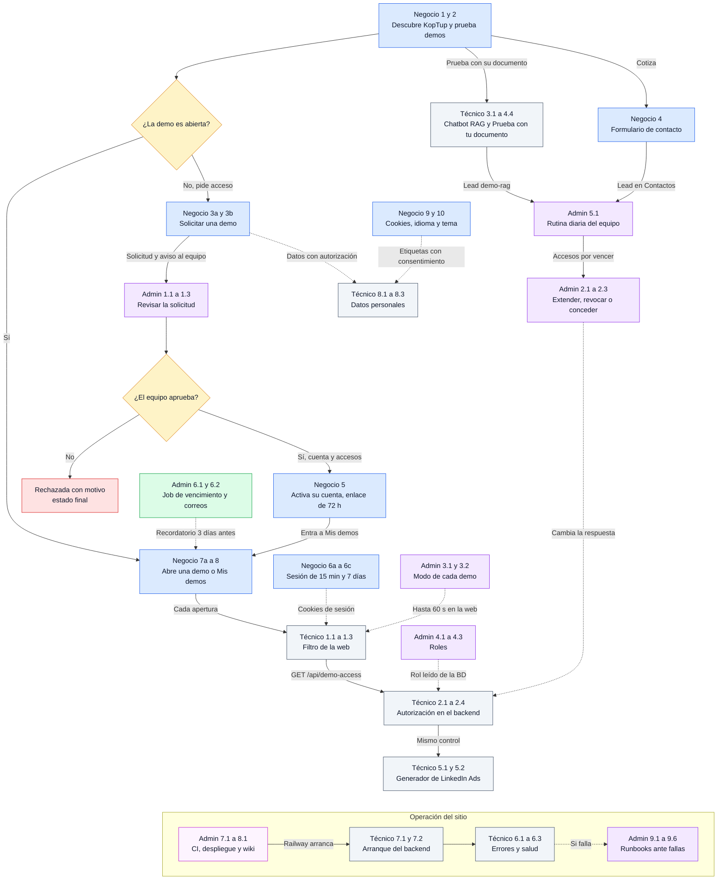
```mermaid
flowchart TD
    classDef visitante fill:#dbeafe,stroke:#2563eb,color:#0f172a
    classDef sistema fill:#f1f5f9,stroke:#475569,color:#0f172a
    classDef admin fill:#f3e8ff,stroke:#9333ea,color:#0f172a
    classDef aviso fill:#dcfce7,stroke:#16a34a,color:#0f172a
    classDef decision fill:#fef3c7,stroke:#d97706,color:#0f172a
    classDef error fill:#fee2e2,stroke:#dc2626,color:#0f172a
    classDef externo fill:#fdf4ff,stroke:#c026d3,color:#0f172a

    N1["Negocio 1 y 2<br/>Descubre KopTup y prueba demos"]:::visitante
    DA{"¿La demo es abierta?"}:::decision
    T3["Técnico 3.1 a 4.4<br/>Chatbot RAG y Prueba con tu documento"]:::sistema
    N4["Negocio 4<br/>Formulario de contacto"]:::visitante
    N3["Negocio 3a y 3b<br/>Solicitar una demo"]:::visitante
    A5["Admin 5.1<br/>Rutina diaria del equipo"]:::admin
    A1["Admin 1.1 a 1.3<br/>Revisar la solicitud"]:::admin
    DP{"¿El equipo aprueba?"}:::decision
    X1["Rechazada con motivo<br/>estado final"]:::error
    N5["Negocio 5<br/>Activa su cuenta, enlace de 72 h"]:::visitante
    N7["Negocio 7a a 8<br/>Abre una demo o Mis demos"]:::visitante
    N6["Negocio 6a a 6c<br/>Sesión de 15 min y 7 días"]:::visitante
    T1["Técnico 1.1 a 1.3<br/>Filtro de la web"]:::sistema
    T2["Técnico 2.1 a 2.4<br/>Autorización en el backend"]:::sistema
    T5["Técnico 5.1 y 5.2<br/>Generador de LinkedIn Ads"]:::sistema
    A2["Admin 2.1 a 2.3<br/>Extender, revocar o conceder"]:::admin
    A3["Admin 3.1 y 3.2<br/>Modo de cada demo"]:::admin
    A4["Admin 4.1 a 4.3<br/>Roles"]:::admin
    A6["Admin 6.1 y 6.2<br/>Job de vencimiento y correos"]:::aviso
    N9["Negocio 9 y 10<br/>Cookies, idioma y tema"]:::visitante
    T8["Técnico 8.1 a 8.3<br/>Datos personales"]:::sistema

    subgraph OPS["Operación del sitio"]
        direction LR
        A7["Admin 7.1 a 8.1<br/>CI, despliegue y wiki"]:::externo
        T7["Técnico 7.1 y 7.2<br/>Arranque del backend"]:::sistema
        T6["Técnico 6.1 a 6.3<br/>Errores y salud"]:::sistema
        A9["Admin 9.1 a 9.6<br/>Runbooks ante fallas"]:::admin
    end

    N1 --> DA
    DA -->|"Sí"| N7
    DA -->|"No, pide acceso"| N3
    N1 -->|"Prueba con su documento"| T3
    N1 -->|"Cotiza"| N4
    T3 -->|"Lead demo-rag"| A5
    N4 -->|"Lead en Contactos"| A5
    N3 -->|"Solicitud y aviso al equipo"| A1
    N3 -.->|"Datos con autorización"| T8
    N9 -.->|"Etiquetas con consentimiento"| T8
    A1 --> DP
    DP -->|"No"| X1
    DP -->|"Sí, cuenta y accesos"| N5
    N5 -->|"Entra a Mis demos"| N7
    N7 -->|"Cada apertura"| T1
    N6 -.->|"Cookies de sesión"| T1
    T1 -->|"GET /api/demo-access"| T2
    T2 -->|"Mismo control"| T5
    A5 -->|"Accesos por vencer"| A2
    A2 -.->|"Cambia la respuesta"| T2
    A3 -.->|"Hasta 60 s en la web"| T1
    A4 -.->|"Rol leído de la BD"| T2
    A6 -.->|"Recordatorio 3 días antes"| N7
    A7 -->|"Railway arranca"| T7
    T7 --> T6
    T6 -.->|"Si falla"| A9
    T5 ~~~ OPS
```

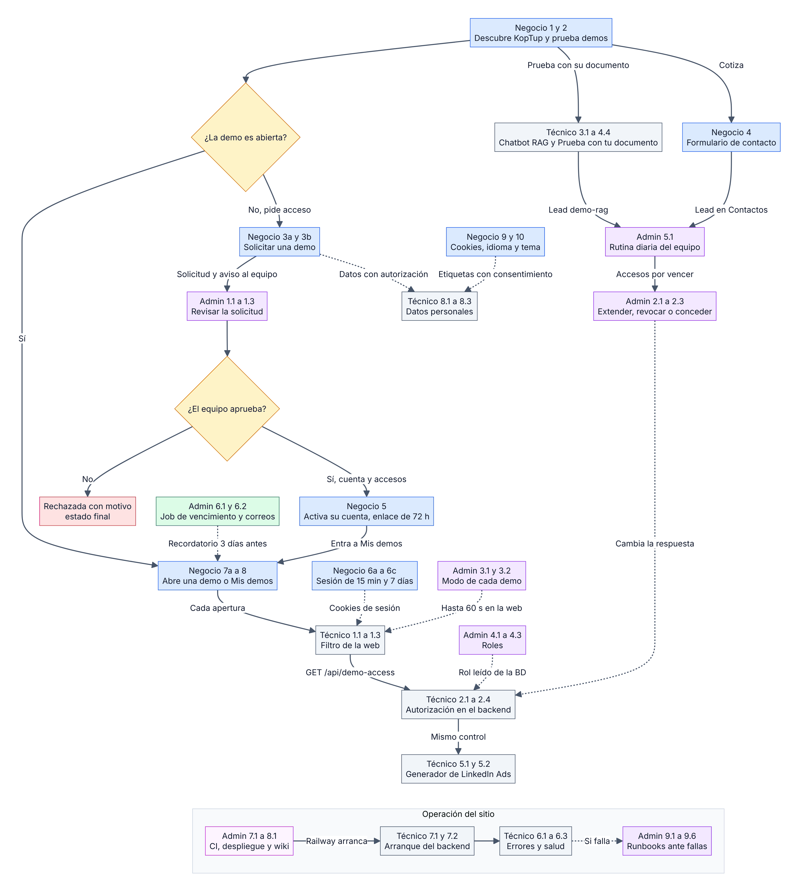

Cada caja es un grupo de diagramas: la primera palabra dice la familia (Negocio, Admin o Técnico) y los números son los de su página; el color sigue la leyenda. Las flechas sólidas siguen el recorrido de una persona y del sistema; las punteadas muestran qué flujo cambia el resultado de otro, por ejemplo cómo revocar un acceso cambia lo que responde el backend la próxima vez que se abre la demo. Abajo, aparte, la cadena de operación: de un merge a producción y de una falla a su procedimiento.

Fuente en el código: `apps/web/src/middleware.ts`, `apps/backend/src/services/demo-access.service.ts`, `apps/backend/src/services/demo-requests.service.ts`, `apps/backend/src/services/demo-grants.service.ts`, `apps/backend/src/jobs/demo-grants.job.ts`, `apps/backend/src/services/demo-rag.service.ts`, `apps/backend/src/index.ts`, `.github/workflows/ci.yml`, `apps/backend/railway.json`.

---

## Por dónde empezar según quién eres

| Si eres... | Empieza por | Para entender |
|---|---|---|
| Dueño | [Mapa general del cliente](Doc-14-1-Flujos-de-Negocio.md#1-mapa-general-del-cliente), [Embudo RAG](Doc-14-1-Flujos-de-Negocio.md#2-embudo-rag) y [Recorrido completo](Doc-14-1-Flujos-de-Negocio.md#11-recorrido-completo-de-la-solicitud-al-acceso) | Cómo llega y avanza un cliente, y qué está en desarrollo |
| Admin o comercial | [Revisar y aprobar](Doc-14-2-Flujos-de-Administracion-y-Operacion.md#11-revisar-y-aprobar-una-solicitud), [Extender o revocar](Doc-14-2-Flujos-de-Administracion-y-Operacion.md#21-extender-o-revocar-un-acceso) y [Rutina diaria](Doc-14-2-Flujos-de-Administracion-y-Operacion.md#51-rutina-diaria-sugerida-del-admin-o-comercial) | Qué hacer cada día en el panel y qué pasa cuando algo falla |
| Cliente o prospecto (o quien le da soporte) | [Activación](Doc-14-1-Flujos-de-Negocio.md#5-activación-de-la-cuenta-con-enlace-mágico), [Pantalla de acceso](Doc-14-1-Flujos-de-Negocio.md#7c-entrar-a-una-demo-la-pantalla-de-acceso) y [Una demo sigue bloqueada](Doc-14-2-Flujos-de-Administracion-y-Operacion.md#93-una-demo-sigue-bloqueada) | Por qué una demo no abre y cómo se resuelve |
| Desarrollador | [Filtro de la web](Doc-14-3-Flujos-Tecnicos.md#12-demos-con-acceso-controlado), [La decisión con DemoGrant](Doc-14-3-Flujos-Tecnicos.md#23-la-decisión-con-demogrant) y [Merge y despliegue](Doc-14-2-Flujos-de-Administracion-y-Operacion.md#72-merge-a-main-y-despliegue-a-producción) | Dónde vive cada regla y cómo llega un cambio a producción |

---

## Flujos de negocio y del cliente

Página completa: [Flujos de negocio y del cliente](Doc-14-1-Flujos-de-Negocio.md). Lo que vive una persona desde que conoce KopTup hasta que usa sus demos, y lo que el sistema decide en cada paso.

| Miniatura | Diagrama | Para qué sirve | Quién lo usa |
|---|---|---|---|
|  | [1. Mapa general del cliente](Doc-14-1-Flujos-de-Negocio.md#1-mapa-general-del-cliente) *Flujo* | El recorrido completo de una persona, desde que conoce KopTup hasta que usa sus demos; muestra qué está en desarrollo. | Dueño o admin, cliente |
|  | [2. Embudo RAG](Doc-14-1-Flujos-de-Negocio.md#2-embudo-rag) *Flujo* | Cómo un visitante llega a cotizar un sistema RAG: landings, demo del chatbot, prueba con su documento y planes. | Dueño o admin, cliente |
|  | [3a. Solicitar una demo: entradas y formulario](Doc-14-1-Flujos-de-Negocio.md#3a-solicitar-una-demo-entradas-y-formulario) *Flujo* | Por dónde se llega a `/solicitar-demo`, qué pide el formulario y qué errores ve la persona. | Cliente, desarrollador |
|  | [3b. Solicitar una demo: lo que hace el servidor](Doc-14-1-Flujos-de-Negocio.md#3b-solicitar-una-demo-lo-que-hace-el-servidor) *Flujo* | El orden real de las verificaciones del servidor: campo trampa, autorización, cupos por IP y email, fusión y avisos. | Desarrollador, dueño o admin |
|  | [4. Formulario de contacto](Doc-14-1-Flujos-de-Negocio.md#4-formulario-de-contacto) *Flujo* | Qué pasa al enviar `/contact`: lead, avisos al equipo y el mensaje de error genérico. | Dueño o admin, cliente |
|  | [5. Activación de la cuenta con enlace mágico](Doc-14-1-Flujos-de-Negocio.md#5-activación-de-la-cuenta-con-enlace-mágico) *Flujo* | Cómo el prospecto crea su contraseña con el enlace de 72 h y qué ve si el enlace ya no sirve. | Cliente, dueño o admin |
|  | [6a. Inicio de sesión](Doc-14-1-Flujos-de-Negocio.md#6a-inicio-de-sesión) *Flujo* | Login con email o Google, ruta de regreso y página de inicio según el rol. | Cliente, desarrollador |
|  | [6b. Renovación de la sesión y cierre](Doc-14-1-Flujos-de-Negocio.md#6b-renovación-de-la-sesión-y-cierre) *Flujo* | Cómo se renueva sola la sesión (15 min y 7 días) en la web y en el navegador, y qué pasa si el backend no responde. | Desarrollador |
|  | [6c. Recuperación de contraseña](Doc-14-1-Flujos-de-Negocio.md#6c-recuperación-de-contraseña) *Flujo* | El enlace de 1 hora para restablecer la contraseña y por qué la respuesta es siempre la misma. | Cliente, dueño o admin |
|  | [7a. Entrar a una demo: el filtro de la web](Doc-14-1-Flujos-de-Negocio.md#7a-entrar-a-una-demo-el-filtro-de-la-web) *Flujo* | Qué decide el servidor de la web antes de mostrar una demo abierta o con acceso. | Cliente, desarrollador |
|  | [7b. Entrar a una demo: la decisión del backend](Doc-14-1-Flujos-de-Negocio.md#7b-entrar-a-una-demo-la-decisión-del-backend) *Flujo* | La regla única de acceso a demos, en el orden en que se evalúa: equipo, demo activa, modo y acceso vigente. | Dueño o admin, desarrollador |
|  | [7c. Entrar a una demo: la pantalla de acceso](Doc-14-1-Flujos-de-Negocio.md#7c-entrar-a-una-demo-la-pantalla-de-acceso) *Flujo* | Qué botones ofrece la pantalla «Solicita acceso» según el motivo del bloqueo. | Cliente, dueño o admin |
|  | [8. Mis demos del prospecto](Doc-14-1-Flujos-de-Negocio.md#8-mis-demos-del-prospecto) *Flujo* | El portal del prospecto: sus accesos, los días que le quedan y cómo pedir más tiempo. | Cliente |
|  | [9. Consentimiento de cookies y analítica](Doc-14-1-Flujos-de-Negocio.md#9-consentimiento-de-cookies-y-analítica) *Flujo* | Cuándo se cargan GA4, Google Ads y LinkedIn y qué eventos se miden, siempre con consentimiento. | Dueño o admin, desarrollador |
|  | [10. Cambio de idioma y de tema](Doc-14-1-Flujos-de-Negocio.md#10-cambio-de-idioma-y-de-tema) *Flujo* | Cómo funcionan el botón ES/EN (cookie y recarga) y el modo claro u oscuro. | Cliente, desarrollador |
|  | [11. Recorrido completo: de la solicitud al acceso](Doc-14-1-Flujos-de-Negocio.md#11-recorrido-completo-de-la-solicitud-al-acceso) *Secuencia* | Todos los actores en orden, del formulario a la primera demo abierta. | Dueño o admin, desarrollador |
|  | [12. Ciclo de vida de una solicitud](Doc-14-1-Flujos-de-Negocio.md#12-ciclo-de-vida-de-una-solicitud) *Estados* | Los estados de una solicitud: pendiente, en revisión, aprobada y rechazada. | Dueño o admin |
|  | [13. Ciclo de vida de un acceso](Doc-14-1-Flujos-de-Negocio.md#13-ciclo-de-vida-de-un-acceso) *Estados* | Los estados de un acceso: activo, expirado y revocado, y qué los cambia. | Dueño o admin |

---

## Flujos de administración y operación

Página completa: [Flujos de administración y operación](Doc-14-2-Flujos-de-Administracion-y-Operacion.md). Lo que hace el equipo en el panel, el job que vence los accesos, el camino de un cambio hasta producción y seis procedimientos ante fallas.

| Miniatura | Diagrama | Para qué sirve | Quién lo usa |
|---|---|---|---|
|  | [1.1 Revisar y aprobar una solicitud](Doc-14-2-Flujos-de-Administracion-y-Operacion.md#11-revisar-y-aprobar-una-solicitud) *Flujo* | Los pasos del panel para aprobar una solicitud, con sus bloqueos: demo privada, doble clic y email del equipo. | Dueño o admin |
|  | [1.2 Compartir el enlace de activación y hacer seguimiento](Doc-14-2-Flujos-de-Administracion-y-Operacion.md#12-compartir-el-enlace-de-activación-y-hacer-seguimiento) *Flujo* | Qué hacer con el enlace de activación según haya salido o no el correo, y cómo reenviarlo. | Dueño o admin |
|  | [1.3 Rechazar una solicitud](Doc-14-2-Flujos-de-Administracion-y-Operacion.md#13-rechazar-una-solicitud) *Flujo* | Motivos de rechazo, aviso opcional al solicitante y por qué el rechazo es definitivo. | Dueño o admin |
|  | [2.1 Extender o revocar un acceso](Doc-14-2-Flujos-de-Administracion-y-Operacion.md#21-extender-o-revocar-un-acceso) *Flujo* | Extender (también un acceso vencido) o revocar desde Accesos a demos, con sus errores. | Dueño o admin |
|  | [2.2 Conceder acceso directo por email](Doc-14-2-Flujos-de-Administracion-y-Operacion.md#22-conceder-acceso-directo-por-email) *Flujo* | Dar una demo sin solicitud previa; es la única vía para las demos «Solo por invitación». | Dueño o admin |
|  | [2.3 Efecto inmediato en el sitio](Doc-14-2-Flujos-de-Administracion-y-Operacion.md#23-efecto-inmediato-en-el-sitio) *Secuencia* | Cómo un acceso revocado o concedido se nota en la siguiente apertura de la demo. | Dueño o admin, desarrollador |
|  | [3.1 Cambiar el modo de una demo](Doc-14-2-Flujos-de-Administracion-y-Operacion.md#31-cambiar-el-modo-de-una-demo) *Flujo* | Cómo el admin pasa una demo a abierta, con solicitud o solo por invitación, o la desactiva. | Dueño o admin |
|  | [3.2 Cómo se propaga el cambio](Doc-14-2-Flujos-de-Administracion-y-Operacion.md#32-cómo-se-propaga-el-cambio) *Flujo* | Por qué un cambio de modo es inmediato en el backend y tarda hasta 60 s en la web. | Desarrollador, dueño o admin |
|  | [4.1 Cómo una cuenta se vuelve admin](Doc-14-2-Flujos-de-Administracion-y-Operacion.md#41-cómo-una-cuenta-se-vuelve-admin) *Flujo* | Las dos vías para dar el rol admin: `ADMIN_EMAIL` al arrancar y el script `set-admin`. | Desarrollador, dueño o admin |
|  | [4.2 Cambiar un rol desde el panel](Doc-14-2-Flujos-de-Administracion-y-Operacion.md#42-cambiar-un-rol-desde-el-panel) *Flujo* | Las validaciones del cambio de rol en Admin › Usuarios y cuándo empieza a regir. | Dueño o admin |
|  | [4.3 De dónde sale cada rol](Doc-14-2-Flujos-de-Administracion-y-Operacion.md#43-de-dónde-sale-cada-rol) *Flujo* | Qué vía asigna cada uno de los siete roles, con la tabla de permisos. | Dueño o admin, desarrollador |
|  | [5.1 Rutina diaria sugerida del admin o comercial](Doc-14-2-Flujos-de-Administracion-y-Operacion.md#51-rutina-diaria-sugerida-del-admin-o-comercial) *Flujo* | Un orden sugerido para revisar cada día solicitudes, accesos por vencer y contactos. | Dueño o admin |
|  | [6.1 Job de vencimiento de accesos y recordatorios](Doc-14-2-Flujos-de-Administracion-y-Operacion.md#61-job-de-vencimiento-de-accesos-y-recordatorios) *Flujo* | Qué hace cada hora el trabajo que marca los accesos vencidos y envía los recordatorios. | Desarrollador, dueño o admin |
|  | [6.2 Qué correo sale en cada momento](Doc-14-2-Flujos-de-Administracion-y-Operacion.md#62-qué-correo-sale-en-cada-momento) *Flujo* | Qué evento dispara cada correo al prospecto y al equipo. | Dueño o admin |
|  | [7.1 Pull request y CI](Doc-14-2-Flujos-de-Administracion-y-Operacion.md#71-pull-request-y-ci) *Flujo* | Los cuatro jobs de CI que verifican un cambio antes del merge. | Desarrollador |
|  | [7.2 Merge a main y despliegue a producción](Doc-14-2-Flujos-de-Administracion-y-Operacion.md#72-merge-a-main-y-despliegue-a-producción) *Flujo* | Cómo Vercel y Railway despliegan `main` en paralelo y qué hace fallar un despliegue. | Desarrollador, dueño o admin |
|  | [8.1 Publicación de la wiki](Doc-14-2-Flujos-de-Administracion-y-Operacion.md#81-publicación-de-la-wiki) *Flujo* | Cómo `docs/wiki` llega a la wiki de GitHub. | Desarrollador |
|  | [9.1 El backend está caído](Doc-14-2-Flujos-de-Administracion-y-Operacion.md#91-el-backend-está-caído) *Runbook* | Procedimiento: diagnosticar con `/health/live` y `/health` y restablecer el servicio. | Desarrollador, dueño o admin |
|  | [9.2 El correo no sale](Doc-14-2-Flujos-de-Administracion-y-Operacion.md#92-el-correo-no-sale) *Runbook* | Procedimiento: revisar SMTP, avisos al equipo, recordatorios y enlaces que apuntan a localhost. | Desarrollador, dueño o admin |
|  | [9.3 Una demo sigue bloqueada](Doc-14-2-Flujos-de-Administracion-y-Operacion.md#93-una-demo-sigue-bloqueada) *Runbook* | Procedimiento: qué hacer según el estado que ve el prospecto en la pantalla de acceso. | Dueño o admin |
|  | [9.4 Se agotó el presupuesto de IA](Doc-14-2-Flujos-de-Administracion-y-Operacion.md#94-se-agotó-el-presupuesto-de-ia) *Runbook* | Procedimiento: el cupo mensual de IA de cada función y cómo subirlo o esperar el cambio de mes. | Dueño o admin, desarrollador |
|  | [9.5 Rotar secretos](Doc-14-2-Flujos-de-Administracion-y-Operacion.md#95-rotar-secretos) *Runbook* | Procedimiento: cambiar las claves de MongoDB, JWT, `INTERNAL_API_KEY` y proveedores sin romper el sitio. | Desarrollador |
|  | [9.6 Revertir un despliegue](Doc-14-2-Flujos-de-Administracion-y-Operacion.md#96-revertir-un-despliegue) *Runbook* | Procedimiento: volver a la versión anterior en Vercel o Railway y revertir `main`. | Desarrollador |

---

## Flujos técnicos

Página completa: [Flujos técnicos](Doc-14-3-Flujos-Tecnicos.md). Las reglas exactas del código: middleware, autorización, chatbot RAG, LinkedIn, errores, arranque y datos personales. La misma página tiene, además, una tabla de qué datos se guardan, dónde y cuánto tiempo (sección 8.3).

| Miniatura | Diagrama | Para qué sirve | Quién lo usa |
|---|---|---|---|
| [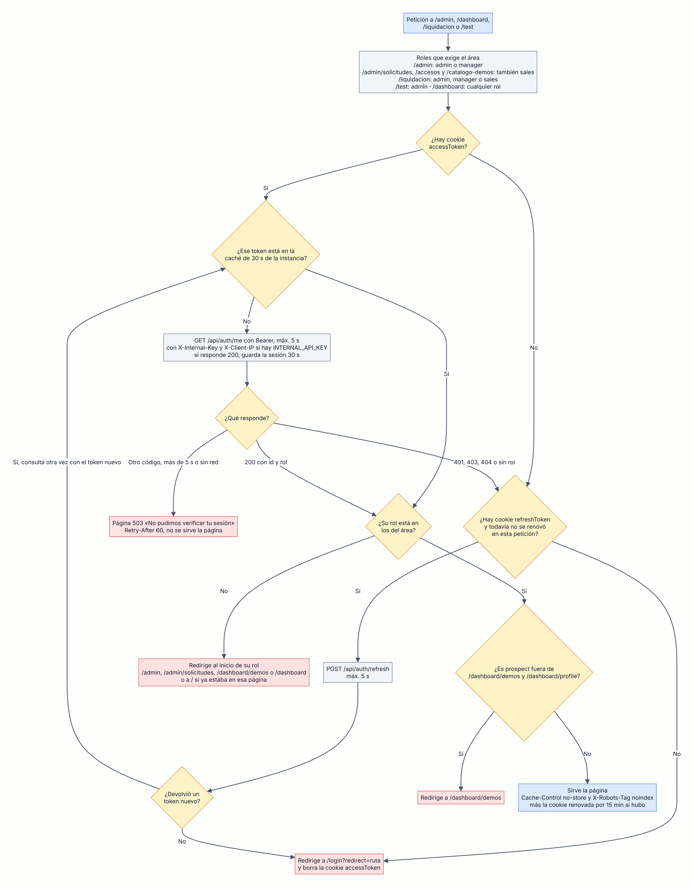](Doc-14-3-Flujos-Tecnicos.md#11-áreas-privadas-panel-portal-y-herramientas) | [1.1 Áreas privadas: panel, portal y herramientas](Doc-14-3-Flujos-Tecnicos.md#11-áreas-privadas-panel-portal-y-herramientas) *Flujo* | Cómo el middleware de Next protege `/admin`, `/dashboard`, `/liquidacion` y `/test`: roles, caché de 30 s y renovación. | Desarrollador |
| [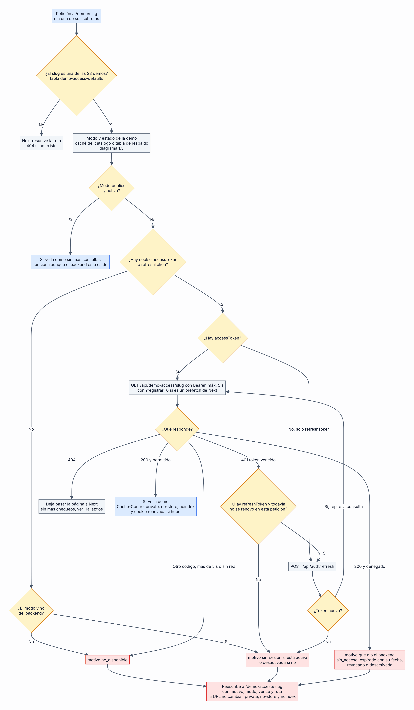](Doc-14-3-Flujos-Tecnicos.md#12-demos-con-acceso-controlado) | [1.2 Demos con acceso controlado](Doc-14-3-Flujos-Tecnicos.md#12-demos-con-acceso-controlado) *Flujo* | El filtro de `/demo/[slug]` con todas sus respuestas, incluida la pantalla de acceso. | Desarrollador, dueño o admin |
| [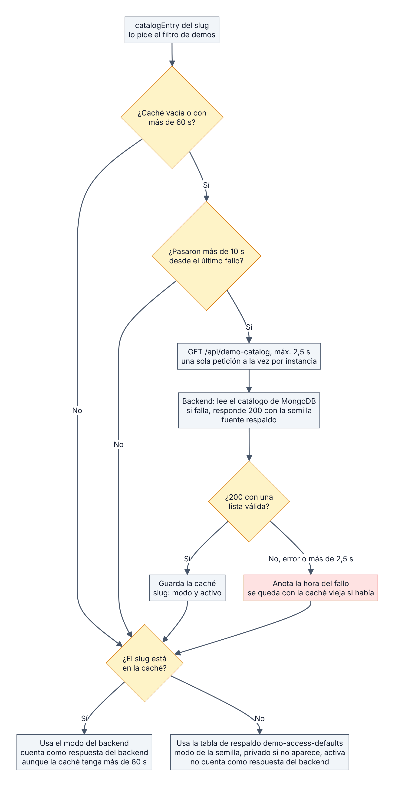](Doc-14-3-Flujos-Tecnicos.md#13-caché-del-catálogo-y-respaldo-estático) | [1.3 Caché del catálogo y respaldo estático](Doc-14-3-Flujos-Tecnicos.md#13-caché-del-catálogo-y-respaldo-estático) *Flujo* | Cómo cada instancia de la web guarda el catálogo 60 s y usa la tabla fija si el backend no responde. | Desarrollador |
| [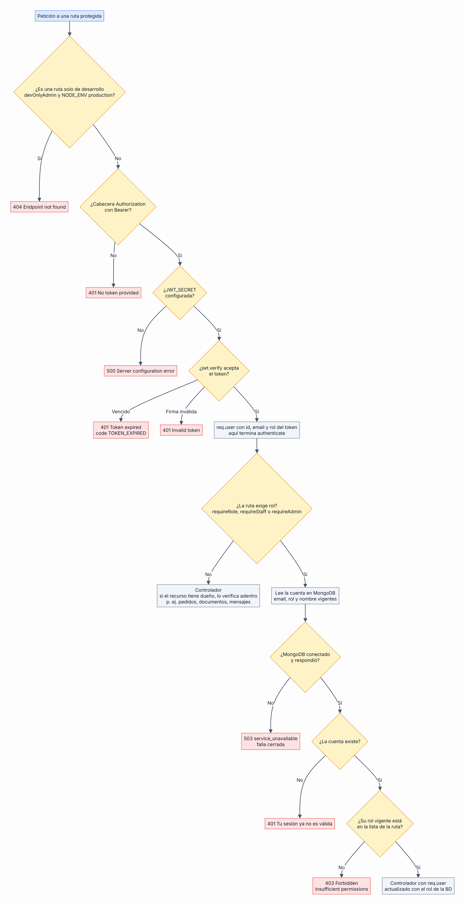](Doc-14-3-Flujos-Tecnicos.md#21-sesión-y-rol-con-authenticate-y-requirerole) | [2.1 Sesión y rol con authenticate y requireRole](Doc-14-3-Flujos-Tecnicos.md#21-sesión-y-rol-con-authenticate-y-requirerole) *Flujo* | Las respuestas 401, 403, 404, 500 y 503 de las rutas protegidas del backend. | Desarrollador |
| [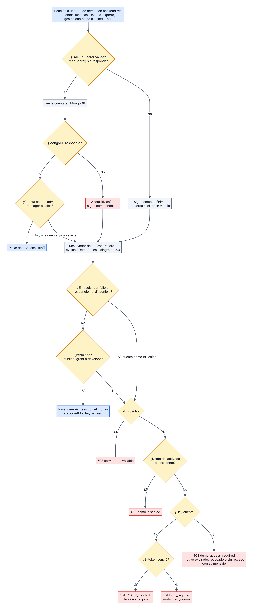](Doc-14-3-Flujos-Tecnicos.md#22-apis-de-una-demo-con-requirestaffordemoaccess) | [2.2 APIs de una demo con requireStaffOrDemoAccess](Doc-14-3-Flujos-Tecnicos.md#22-apis-de-una-demo-con-requirestaffordemoaccess) *Flujo* | Cómo se protegen las APIs de las demos con backend propio (cuentas médicas, sistema experto, contenido y LinkedIn). | Desarrollador |
| [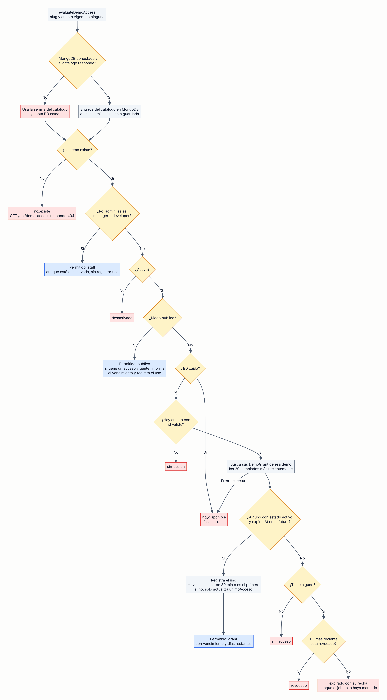](Doc-14-3-Flujos-Tecnicos.md#23-la-decisión-con-demogrant) | [2.3 La decisión con DemoGrant](Doc-14-3-Flujos-Tecnicos.md#23-la-decisión-con-demogrant) *Flujo* | `evaluateDemoAccess` paso a paso: la fuente única de verdad del acceso a demos. | Desarrollador |
| [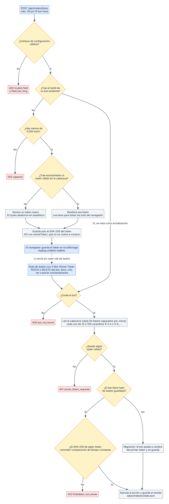](Doc-14-3-Flujos-Tecnicos.md#24-propiedad-de-los-bots-del-chatbot) | [2.4 Propiedad de los bots del chatbot](Doc-14-3-Flujos-Tecnicos.md#24-propiedad-de-los-bots-del-chatbot) *Flujo* | El token de dueño que protege los bots creados en la demo del chatbot. | Desarrollador |
| [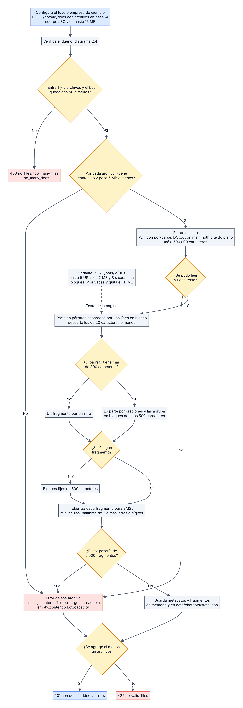](Doc-14-3-Flujos-Tecnicos.md#31-ingesta-y-fragmentación-de-documentos) | [3.1 Ingesta y fragmentación de documentos](Doc-14-3-Flujos-Tecnicos.md#31-ingesta-y-fragmentación-de-documentos) *Flujo* | Cómo el chatbot lee y parte en fragmentos los documentos, sin embeddings. | Desarrollador |
| [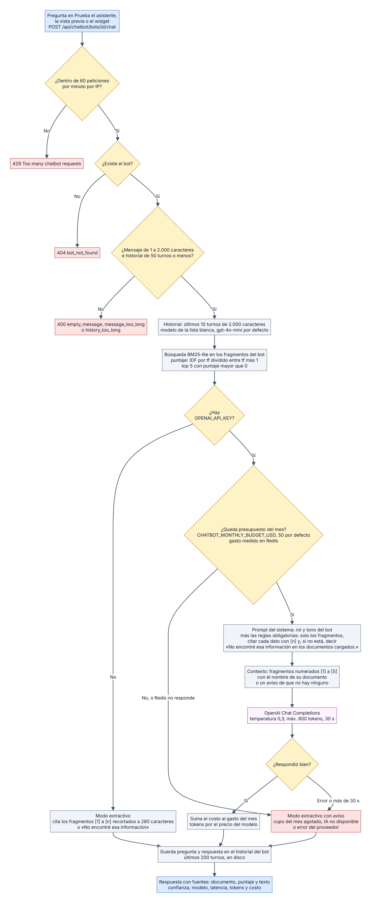](Doc-14-3-Flujos-Tecnicos.md#32-pipeline-de-una-pregunta) | [3.2 Pipeline de una pregunta](Doc-14-3-Flujos-Tecnicos.md#32-pipeline-de-una-pregunta) *Flujo* | Cómo responde el chatbot sin inventar: búsqueda BM25, reglas de cita, presupuesto y modo extractivo. | Dueño o admin, desarrollador |
| [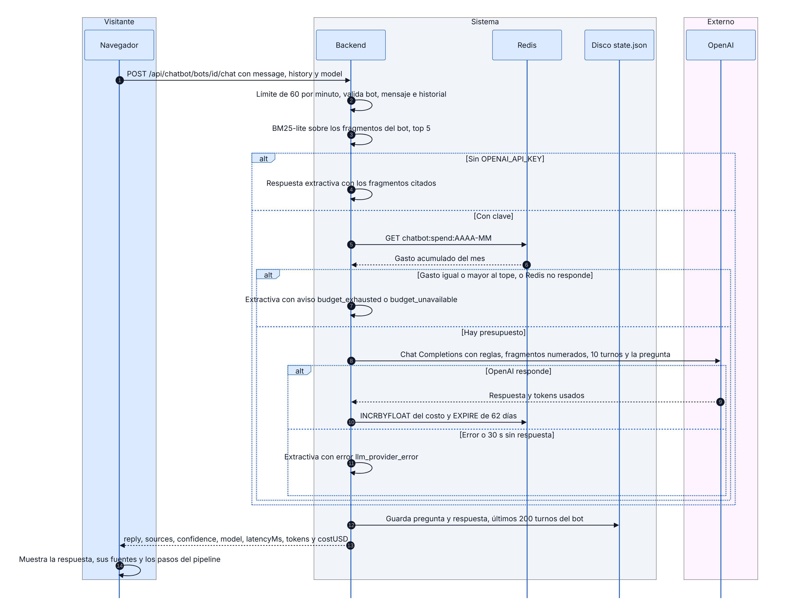](Doc-14-3-Flujos-Tecnicos.md#33-secuencia-de-una-pregunta) | [3.3 Secuencia de una pregunta](Doc-14-3-Flujos-Tecnicos.md#33-secuencia-de-una-pregunta) *Secuencia* | La misma pregunta en el tiempo, entre navegador, backend, Redis, disco y OpenAI. | Desarrollador |
| [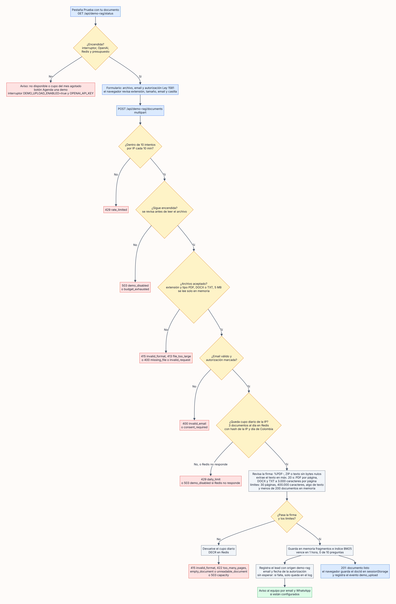](Doc-14-3-Flujos-Tecnicos.md#41-subida-del-documento) | [4.1 Subida del documento](Doc-14-3-Flujos-Tecnicos.md#41-subida-del-documento) *Flujo* | Todos los límites de «Prueba con tu documento»: formato, 5 MB, 30 páginas, 3 al día y registro del lead. | Dueño o admin, desarrollador |
| [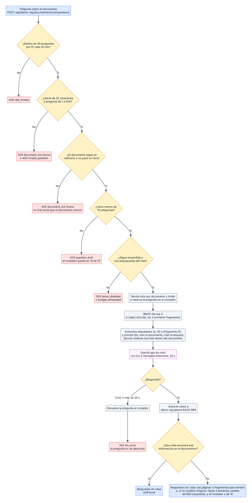](Doc-14-3-Flujos-Tecnicos.md#42-preguntas-sobre-el-documento) | [4.2 Preguntas sobre el documento](Doc-14-3-Flujos-Tecnicos.md#42-preguntas-sobre-el-documento) *Flujo* | El límite de 10 preguntas, las citas por página y qué pasa si OpenAI falla. | Desarrollador |
| [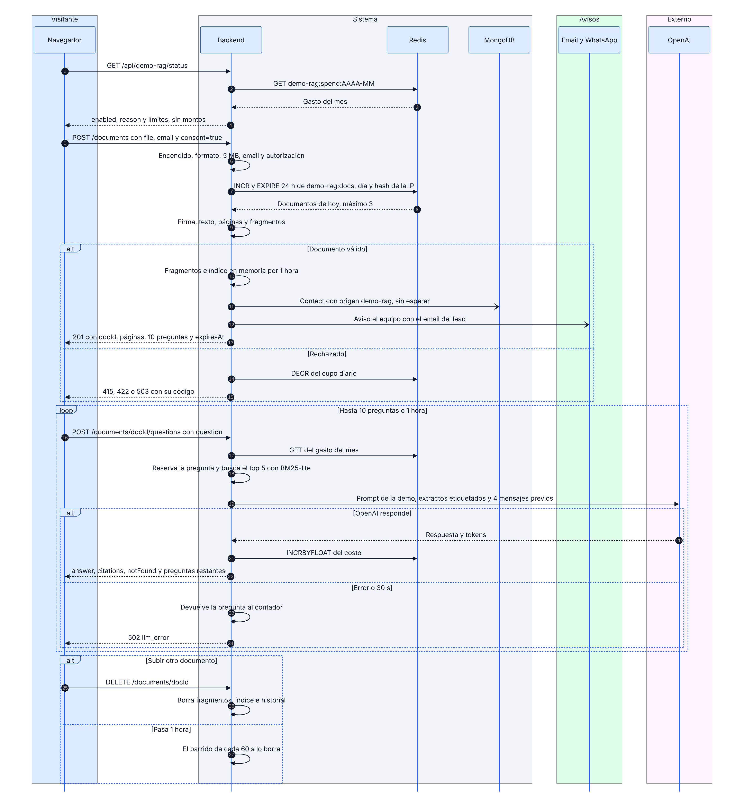](Doc-14-3-Flujos-Tecnicos.md#43-secuencia-completa) | [4.3 Secuencia completa](Doc-14-3-Flujos-Tecnicos.md#43-secuencia-completa) *Secuencia* | Subida, preguntas y borrado del documento en el tiempo. | Desarrollador |
| [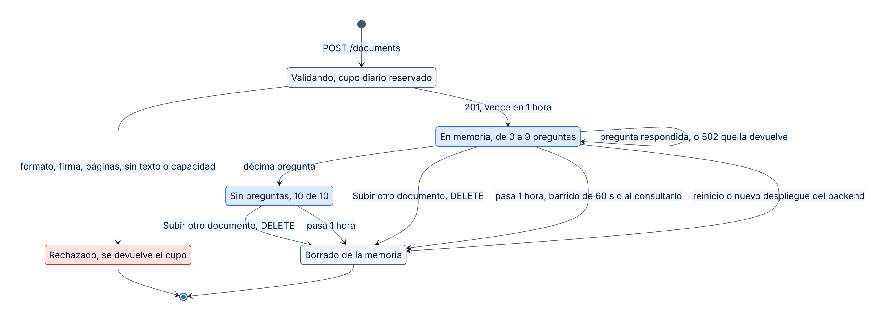](Doc-14-3-Flujos-Tecnicos.md#44-vida-del-documento-en-memoria) | [4.4 Vida del documento en memoria](Doc-14-3-Flujos-Tecnicos.md#44-vida-del-documento-en-memoria) *Estados* | Los estados del documento subido, de la validación al borrado en 1 hora. | Dueño o admin, desarrollador |
| [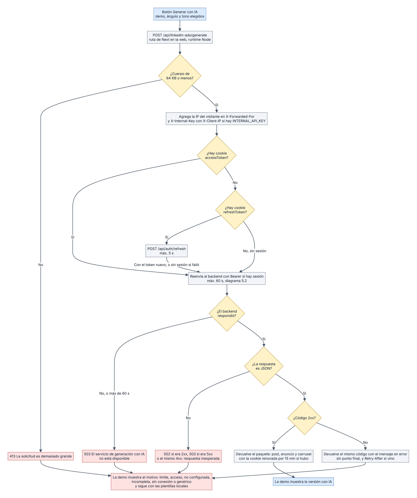](Doc-14-3-Flujos-Tecnicos.md#51-proxy-de-la-web) | [5.1 Proxy de la web](Doc-14-3-Flujos-Tecnicos.md#51-proxy-de-la-web) *Flujo* | La ruta de Next que reenvía la generación con IA de LinkedIn al backend. | Desarrollador |
| [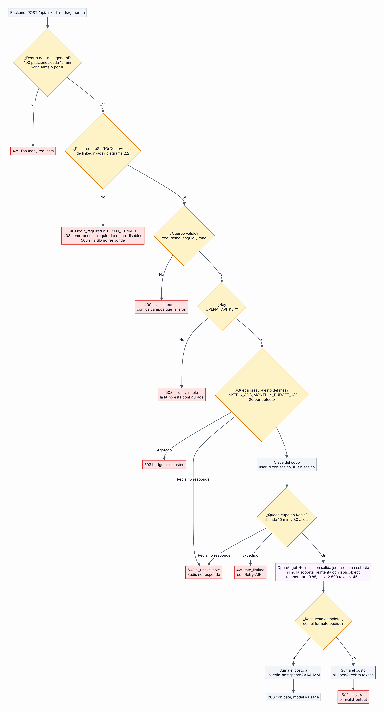](Doc-14-3-Flujos-Tecnicos.md#52-lo-que-decide-el-backend) | [5.2 Lo que decide el backend](Doc-14-3-Flujos-Tecnicos.md#52-lo-que-decide-el-backend) *Flujo* | Acceso, formato, clave, presupuesto y cupo que revisa el backend antes de llamar a OpenAI. | Desarrollador |
| [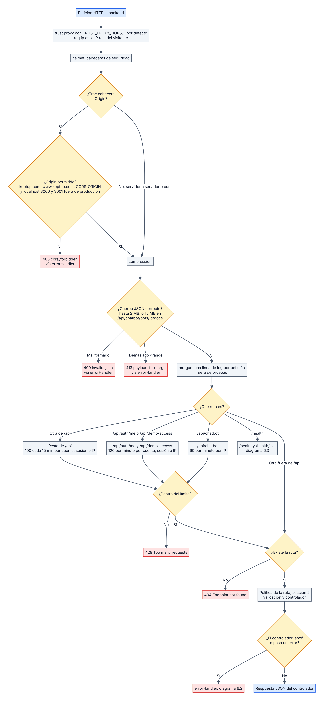](Doc-14-3-Flujos-Tecnicos.md#61-recorrido-de-una-petición) | [6.1 Recorrido de una petición](Doc-14-3-Flujos-Tecnicos.md#61-recorrido-de-una-petición) *Flujo* | El orden de los middleware del backend: CORS, cuerpo JSON, límites de peticiones y rutas. | Desarrollador |
| [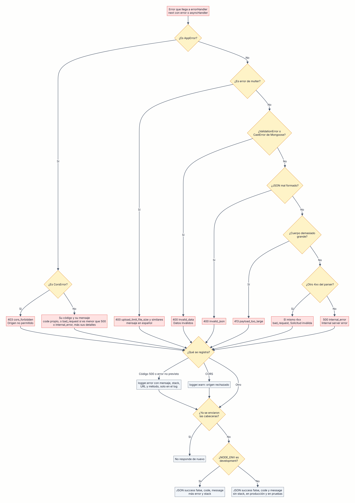](Doc-14-3-Flujos-Tecnicos.md#62-manejo-de-errores) | [6.2 Manejo de errores](Doc-14-3-Flujos-Tecnicos.md#62-manejo-de-errores) *Flujo* | Cómo `errorHandler` traduce cada error a un código y un mensaje. | Desarrollador |
| [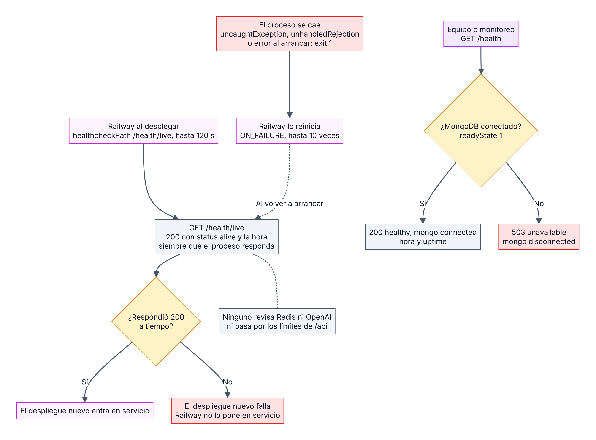](Doc-14-3-Flujos-Tecnicos.md#63-health-checks) | [6.3 Health checks](Doc-14-3-Flujos-Tecnicos.md#63-health-checks) *Flujo* | `/health/live` y `/health`, y cómo los usa Railway. | Desarrollador, dueño o admin |
| [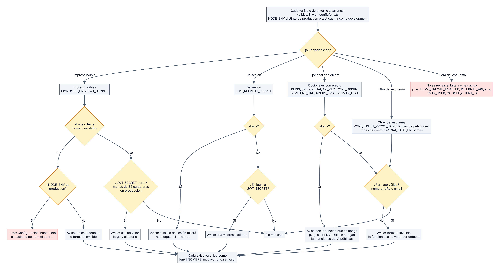](Doc-14-3-Flujos-Tecnicos.md#71-validación-de-variables-de-entorno) | [7.1 Validación de variables de entorno](Doc-14-3-Flujos-Tecnicos.md#71-validación-de-variables-de-entorno) *Flujo* | Qué variables de entorno impiden arrancar y cuáles solo generan un aviso. | Desarrollador |
| [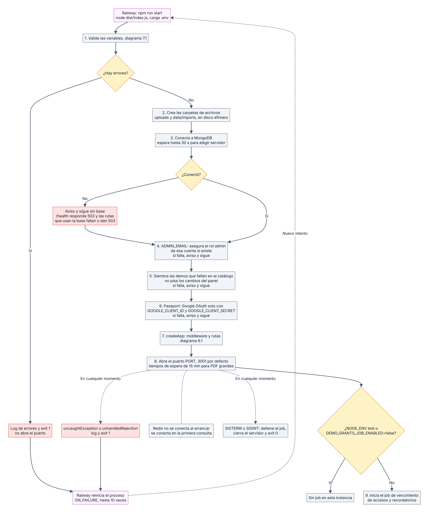](Doc-14-3-Flujos-Tecnicos.md#72-secuencia-de-arranque) | [7.2 Secuencia de arranque](Doc-14-3-Flujos-Tecnicos.md#72-secuencia-de-arranque) *Flujo* | Los pasos del arranque del backend y cómo arranca degradado si algo falta. | Desarrollador |
| [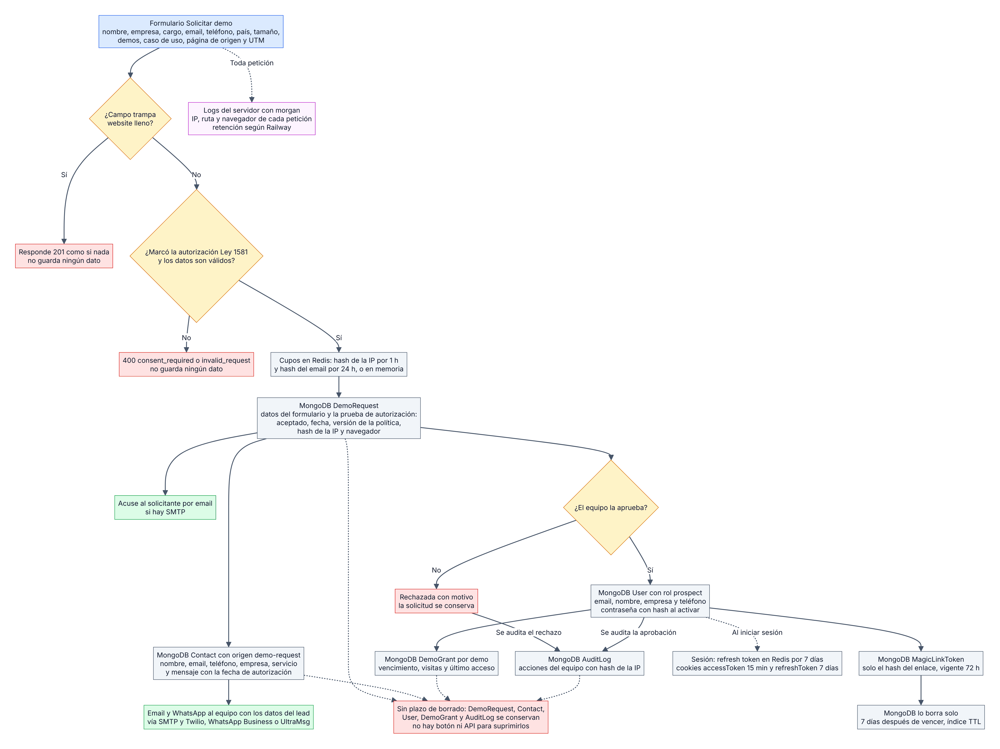](Doc-14-3-Flujos-Tecnicos.md#81-solicitud-de-demo-y-cuenta) | [8.1 Solicitud de demo y cuenta](Doc-14-3-Flujos-Tecnicos.md#81-solicitud-de-demo-y-cuenta) *Flujo* | Qué datos personales se guardan al pedir una demo, con qué autorización y dónde. | Dueño o admin, desarrollador |
| [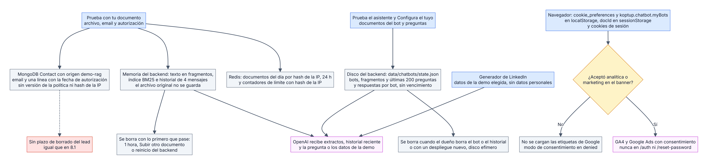](Doc-14-3-Flujos-Tecnicos.md#82-demos-con-ia-y-navegador) | [8.2 Demos con IA y navegador](Doc-14-3-Flujos-Tecnicos.md#82-demos-con-ia-y-navegador) *Flujo* | Qué datos quedan en memoria, disco, navegador y OpenAI al usar las demos con IA. | Dueño o admin, desarrollador |

---

## Verificación contra el código

Antes de publicar este índice se compararon las decisiones más críticas de los diagramas con el código de `main`, una por una. Resultado: 22 verificaciones; 20 coinciden con el código y 2 obligaron a corregir un diagrama (ya corregidos y vueltos a renderizar).

| # | Qué se verificó | Diagrama | Código | Resultado |
|---|---|---|---|---|
| 1 | Roles de cada área privada: `/admin` admin o manager; solicitudes, accesos y catálogo también `sales`; `/liquidacion` el equipo; `/test` solo admin; `/dashboard` cualquier sesión | [Técnicos 1.1](Doc-14-3-Flujos-Tecnicos.md#11-áreas-privadas-panel-portal-y-herramientas) | `apps/web/src/middleware.ts` (`areaFor`), `apps/web/src/lib/auth-roles.ts` | OK |
| 2 | Filtro de la web: 401, 403 o 404 de `/api/auth/me` cuentan como «sin sesión»; otro código, más de 5 s o sin red dan la página 503; renueva una sola vez; caché de 30 s | [Técnicos 1.1](Doc-14-3-Flujos-Tecnicos.md#11-áreas-privadas-panel-portal-y-herramientas), [Negocio 6b](Doc-14-1-Flujos-de-Negocio.md#6b-renovación-de-la-sesión-y-cierre) | `apps/web/src/middleware.ts` (`fetchMe`, `refreshAccessToken`, `middleware`) | OK |
| 3 | Demo abierta y activa pasa sin consultar; sin cookies muestra `sin_sesion` o `desactivada` si el catálogo respondió y `no_disponible` si no | [Técnicos 1.2](Doc-14-3-Flujos-Tecnicos.md#12-demos-con-acceso-controlado), [Negocio 7a](Doc-14-1-Flujos-de-Negocio.md#7a-entrar-a-una-demo-el-filtro-de-la-web) | `apps/web/src/middleware.ts` (`demoGate`) | OK |
| 4 | Qué hace la web si `GET /api/demo-access` responde 404 para una de las 28 demos | [Negocio 7a](Doc-14-1-Flujos-de-Negocio.md#7a-entrar-a-una-demo-el-filtro-de-la-web) | `apps/web/src/middleware.ts` (`demoGate`: `not_found` deja pasar con `NextResponse.next()`) | **Corregido**: decía «Next resuelve la ruta, 404 si no existe»; la página de la demo sí existe y se abre sin más chequeos (1.2 ya lo mostraba bien) |
| 5 | Caché del catálogo en la web: 60 s, reintento tras 10 s, espera máxima de 2,5 s y modo `privado` si la demo no aparece | [Técnicos 1.3](Doc-14-3-Flujos-Tecnicos.md#13-caché-del-catálogo-y-respaldo-estático), [Admin 3.2](Doc-14-2-Flujos-de-Administracion-y-Operacion.md#32-cómo-se-propaga-el-cambio) | `apps/web/src/middleware.ts` (`catalogEntry`, `loadCatalog`) | OK |
| 6 | `requireStaffOrDemoAccess`: admin, manager y sales pasan antes del resolvedor; resolvedor caído o BD caída dan 503; demo desactivada o inexistente, 403 `demo_disabled`; sin cuenta, 401 `TOKEN_EXPIRED` o `login_required`; con cuenta, 403 `demo_access_required` | [Técnicos 2.2](Doc-14-3-Flujos-Tecnicos.md#22-apis-de-una-demo-con-requirestaffordemoaccess) | `apps/backend/src/middleware/access.ts` | OK |
| 7 | Orden de `evaluateDemoAccess`: no existe, equipo (incluye `developer`), desactivada, abierta, BD caída, sin sesión, acceso vigente, y si no `sin_acceso`, `revocado` o `expirado`; lee los 20 accesos más recientes y cuenta una visita cada 30 min | [Técnicos 2.3](Doc-14-3-Flujos-Tecnicos.md#23-la-decisión-con-demogrant), [Negocio 7b](Doc-14-1-Flujos-de-Negocio.md#7b-entrar-a-una-demo-la-decisión-del-backend) | `apps/backend/src/services/demo-access.service.ts`, `apps/backend/src/config/demos.ts` (`DEMO_STAFF_ROLES`) | OK |
| 8 | `GET /api/demo-access`: 404 si la demo no existe, 401 `TOKEN_EXPIRED` si el token venció y no hay acceso, `?registrar=0` no cuenta la visita | [Negocio 7b](Doc-14-1-Flujos-de-Negocio.md#7b-entrar-a-una-demo-la-decisión-del-backend) | `apps/backend/src/routes/demo-public.routes.ts` | OK |
| 9 | Vencimiento en tiempo real: un acceso vence por su fecha en cada consulta, aunque el job no lo haya marcado | [Negocio 13](Doc-14-1-Flujos-de-Negocio.md#13-ciclo-de-vida-de-un-acceso), [Técnicos 2.3](Doc-14-3-Flujos-Tecnicos.md#23-la-decisión-con-demogrant) | `apps/backend/src/services/demo-access.service.ts` (`effectiveGrantState`) | OK |
| 10 | Subida a «Prueba con tu documento», en este orden: 10 intentos por IP cada 10 min, demo encendida, PDF, DOCX o TXT de 5 MB, email y autorización, 3 documentos al día por IP (día de Colombia), firma, 20 s de lectura, 30 páginas, 400.000 caracteres y 200 documentos en memoria; el cupo diario se devuelve si se rechaza | [Técnicos 4.1](Doc-14-3-Flujos-Tecnicos.md#41-subida-del-documento), [Negocio 2](Doc-14-1-Flujos-de-Negocio.md#2-embudo-rag) | `apps/backend/src/routes/demo-rag.routes.ts`, `apps/backend/src/services/demo-rag.service.ts` (`DEMO_LIMITS`, `reserveDailyUpload`, `ingestDocument`) | OK (dejó un hallazgo nuevo, ver abajo) |
| 11 | Preguntas sobre el documento: 30 por IP cada 10 min, de 1 a 500 caracteres, 10 por documento revisadas dos veces con reserva, 3 primeros fragmentos si BM25 no encuentra nada, 502 `llm_error` devuelve la pregunta, 1 hora en memoria | [Técnicos 4.2](Doc-14-3-Flujos-Tecnicos.md#42-preguntas-sobre-el-documento), [Técnicos 4.4](Doc-14-3-Flujos-Tecnicos.md#44-vida-del-documento-en-memoria) | `apps/backend/src/services/demo-rag.service.ts` (`askDocument`, `documentTtlMs`) | OK |
| 12 | Activación: revisar el enlace no lo gasta (20 por minuto); activar, 5 por minuto con consumo atómico; vigencia de 72 h; libera el enlace si falla guardar; anula los otros enlaces, audita `user.activate` y entrega la sesión de 15 min y 7 días | [Negocio 5](Doc-14-1-Flujos-de-Negocio.md#5-activación-de-la-cuenta-con-enlace-mágico) | `apps/backend/src/controllers/auth.controller.ts` (`checkActivation`, `activateAccount`), `apps/backend/src/services/magic-link.service.ts`, `apps/backend/src/middleware/rateLimiter.ts` | OK |
| 13 | Job de vencimiento: apagado en pruebas o con `DEMO_GRANTS_JOB_ENABLED=false`; salta si hay una corrida en curso o no hay MongoDB; candado en Redis de 10 min y sin Redis corre igual; recordatorios solo con SMTP, máximo 500, liberados si el correo falla | [Admin 6.1](Doc-14-2-Flujos-de-Administracion-y-Operacion.md#61-job-de-vencimiento-de-accesos-y-recordatorios) | `apps/backend/src/jobs/demo-grants.job.ts` | OK |
| 14 | Intervalo del job con `DEMO_GRANTS_JOB_INTERVAL_MS` | [Admin 6.1](Doc-14-2-Flujos-de-Administracion-y-Operacion.md#61-job-de-vencimiento-de-accesos-y-recordatorios) | `apps/backend/src/jobs/demo-grants.job.ts` (`startDemoGrantsJob`) | **Corregido**: decía «mín. 1 min»; un valor menor de 1 min no se ajusta a 1 min, se ignora y queda 1 hora |
| 15 | Extender y revocar: revocado da 409 `grant_revoked`; otro acceso activo a la misma demo, 409 `active_grant_exists`; la nueva fecha cuenta desde el vencimiento futuro o desde hoy y reinicia el recordatorio | [Admin 2.1](Doc-14-2-Flujos-de-Administracion-y-Operacion.md#21-extender-o-revocar-un-acceso) | `apps/backend/src/services/demo-grants.service.ts` (`extendGrant`, `revokeGrant`) | OK |
| 16 | Aprobar: cambio de estado condicionado (409 `already_processed`), vuelta al estado anterior si falla, 422 `team_email` y 403 `requires_admin` para demos privadas | [Admin 1.1](Doc-14-2-Flujos-de-Administracion-y-Operacion.md#11-revisar-y-aprobar-una-solicitud), [Negocio 12](Doc-14-1-Flujos-de-Negocio.md#12-ciclo-de-vida-de-una-solicitud) | `apps/backend/src/services/demo-requests.service.ts` (`approveDemoRequest`), `apps/backend/src/services/demo-grants.service.ts` | OK |
| 17 | Solicitar demo en el servidor: límite general, campo trampa, autorización, validación, 5 envíos por IP en 1 hora y 3 por email en 24 horas, en ese orden | [Negocio 3b](Doc-14-1-Flujos-de-Negocio.md#3b-solicitar-una-demo-lo-que-hace-el-servidor) | `apps/backend/src/routes/demo-public.routes.ts` | OK |
| 18 | Despliegue: Railway con Nixpacks (`npm install && npm run build`, `npm run start`), chequeo `/health/live` en 120 s y reinicio ON_FAILURE hasta 10 veces; Vercel con `npm install` y `next build`; CI no despliega; sin `MONGODB_URI` o `JWT_SECRET` en producción el backend no arranca | [Admin 7.2](Doc-14-2-Flujos-de-Administracion-y-Operacion.md#72-merge-a-main-y-despliegue-a-producción), [Técnicos 6.3](Doc-14-3-Flujos-Tecnicos.md#63-health-checks), [Técnicos 7.2](Doc-14-3-Flujos-Tecnicos.md#72-secuencia-de-arranque) | `apps/backend/railway.json`, `apps/web/vercel.json`, `.github/workflows/ci.yml`, `apps/backend/src/config/env.ts`, `apps/backend/src/index.ts` | OK |
| 19 | CI: cuatro jobs (calidad, pruebas, build y e2e, que espera al build), cancela la corrida anterior con cada push | [Admin 7.1](Doc-14-2-Flujos-de-Administracion-y-Operacion.md#71-pull-request-y-ci) | `.github/workflows/ci.yml` | OK |
| 20 | LinkedIn en el backend: acceso a la demo, validación, `OPENAI_API_KEY`, presupuesto y cupo de 5 cada 10 min y 30 al día por cuenta o IP, antes de llamar a OpenAI | [Técnicos 5.2](Doc-14-3-Flujos-Tecnicos.md#52-lo-que-decide-el-backend) | `apps/backend/src/routes/linkedin-ads.routes.ts` | OK |
| 21 | Límites por ruta: `/api/chatbot` 60 por minuto; `/api/auth/me` y `/api/demo-access` 120 por minuto; el resto de `/api` 100 cada 15 min | [Técnicos 6.1](Doc-14-3-Flujos-Tecnicos.md#61-recorrido-de-una-petición) | `apps/backend/src/app.ts`, `apps/backend/src/middleware/rateLimiter.ts` | OK |
| 22 | Publicación de la wiki: push a `main` y a la rama de trabajo, una a la vez sin cancelar la anterior | [Admin 8.1](Doc-14-2-Flujos-de-Administracion-y-Operacion.md#81-publicación-de-la-wiki) | `.github/workflows/wiki-sync.yml` | OK |

---

## Hallazgos

Cada página de diagramas tiene su propia sección con lo que el código hace mal o de forma confusa, dibujado tal como es:

- [Hallazgos de los flujos de negocio](Doc-14-1-Flujos-de-Negocio.md#hallazgos): 13 puntos (por ejemplo, una solicitud fusionada no avisa a nadie y el formulario de contacto no pide autorización de datos).
- [Hallazgos de administración y operación](Doc-14-2-Flujos-de-Administracion-y-Operacion.md#hallazgos): 14 puntos (por ejemplo, con el backend caído el panel manda al login en lugar de avisar, y `main` no exige CI en verde).
- [Hallazgos técnicos](Doc-14-3-Flujos-Tecnicos.md#hallazgos): 10 puntos (por ejemplo, no hay plazo ni forma de suprimir datos personales y el chatbot guarda las preguntas sin vencimiento).

La verificación de esta página corrigió dos diagramas y dejó un hallazgo nuevo:

1. **El diagrama 7a de negocio ocultaba un paso real.** Si el backend responde 404 a una de las 28 demos conocidas, la web no muestra un 404: deja pasar la página sin más chequeos y la demo se abre. El diagrama decía "Next resuelve la ruta, 404 si no existe"; ya está corregido y enlaza al hallazgo 4 de los flujos técnicos, que explica cuándo puede pasar (`demoGate` en `apps/web/src/middleware.ts`).
2. **El diagrama 6.1 de administración describía mal el intervalo del job.** Decía "mínimo 1 min", como si un valor menor se ajustara a 1 minuto; en el código un valor menor de 1 minuto (o inválido) se ignora y el job corre cada hora (`startDemoGrantsJob` en `apps/backend/src/jobs/demo-grants.job.ts`).
3. **Hallazgo nuevo: un documento corto pero con mucho texto se rechaza como «demasiadas páginas».** En «Prueba con tu documento», el corte de 400.000 caracteres usa el mismo código que el de 30 páginas (`too_many_pages`), así que la persona lee «El documento supera 30 páginas» aunque su PDF tenga menos (`ingestDocument` en `apps/backend/src/services/demo-rag.service.ts`). Quedó como hallazgo 10 de los flujos técnicos.

## Páginas relacionadas

- [Flujos de negocio y del cliente](Doc-14-1-Flujos-de-Negocio.md) · [Flujos de administración y operación](Doc-14-2-Flujos-de-Administracion-y-Operacion.md) · [Flujos técnicos](Doc-14-3-Flujos-Tecnicos.md)
- [Índice de la documentación](Doc-00-Indice.md) · [Arquitectura](Doc-01-Arquitectura.md) · [Roles y permisos](Doc-10-Roles-y-Permisos.md)
- [Flujos del visitante](Doc-04-Flujos-del-Visitante.md) y [del prospecto y cliente](Doc-05-Flujos-del-Prospecto-y-Cliente.md) (los mismos recorridos con capturas) · [Manual del administrador](Doc-06-Manual-del-Administrador.md)
