# Guía de la demo: Plataforma de Automatización

> Ruta `/demo/automatizacion` · Modo de acceso: **Abierta** · Tipo: **datos de ejemplo** (prototipo visual: todo corre en el navegador; no llama al servidor, no ejecuta ningún flujo ni usa IA) · Plan del producto: [Automatización de procesos con IA](Producto-automatizacion-workflows.md)

**Resumen.** Es la maqueta de un editor de flujos al estilo n8n o Zapier: un flujo de ejemplo («Onboarding cliente PRO») de siete nodos conectados, una paleta de 27 tipos de nodo, un inspector para configurar cada nodo, el historial de ejecuciones, cuotas del plan, versiones, alertas con cola de mensajes fallidos (DLQ), plantillas, un editor de código y un SDK. Sirve para mostrarle a un equipo de operaciones o de ventas **cómo se vería** automatizar un proceso con pasos de IA. El botón **Ejecutar workflow** anima el flujo y agrega una corrida al historial, pero no ejecuta nada real; muchos botones secundarios no hacen nada y la demo no lleva rótulo de «Datos de ejemplo».

**En esta página:** [Recorrido sugerido](#recorrido-sugerido-demo-comercial-de-5-minutos) · [Pantallas y funciones](#pantallas-y-funciones) · [Qué es real y qué es simulado](#qué-es-real-y-qué-es-simulado) · [Acceso](#acceso) · [Limitaciones conocidas](#limitaciones-conocidas)

*Vista inicial a 1440 px: paleta de nodos a la izquierda, lienzo con el flujo en el centro, inspector del nodo «Resumen IA» a la derecha y, abajo, las tarjetas de uso, versiones y alertas y el historial de ejecuciones.*

---

## Recorrido sugerido (demo comercial de 5 minutos)

La demo no trae guion propio ni insignia de «Datos de ejemplo», así que conviene **decirlo al empezar**: «Es una maqueta navegable; los datos, las corridas y las respuestas son de ejemplo. Lo que ven es el tipo de herramienta que montaríamos con sus sistemas». La historia que se cuenta es la de un cliente que compra el plan PRO: llega un aviso (webhook), se filtra, se enriquece con datos de la empresa, la IA lo resume, se avisa al equipo de ventas por Slack y se asigna un gerente de cuenta.

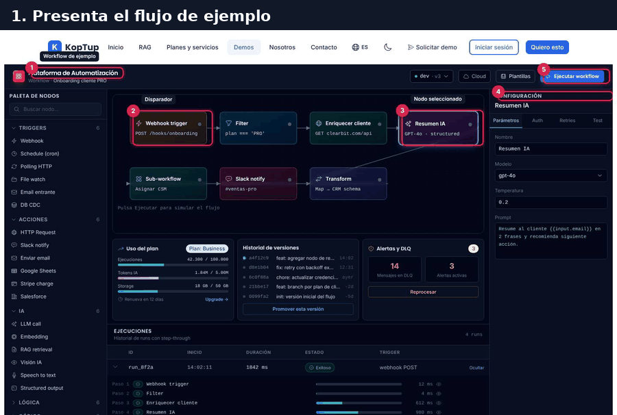

*Recorrido completo en seis cuadros: el flujo, la ejecución animada, el historial, la prueba de un nodo, las plantillas y las alertas.*

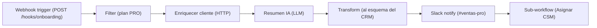

*Orden en que la demo anima los nodos. Ojo: en el lienzo la segunda fila se lee al revés (ver la [limitación 4](#limitaciones-conocidas)).*

### Paso 1. Presenta el flujo de ejemplo

Al abrir la demo ya está seleccionado el nodo **Resumen IA**. Recorre el lienzo de izquierda a derecha en la fila de arriba y de derecha a izquierda en la de abajo.

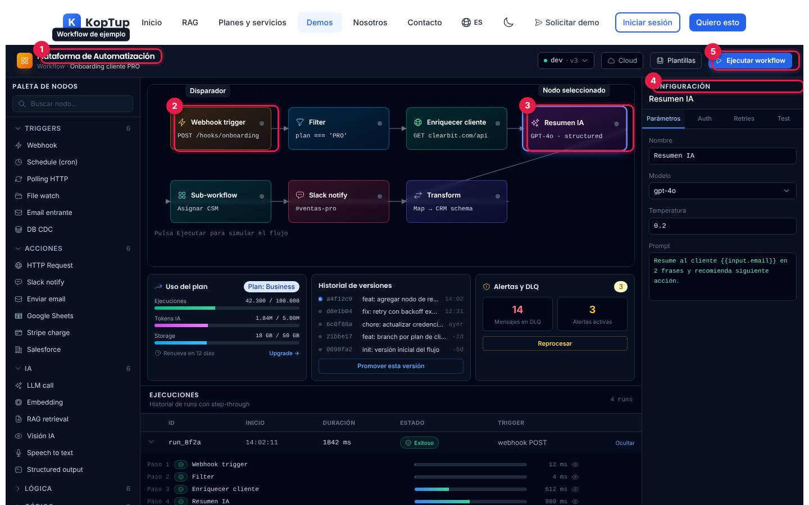

*El flujo «Onboarding cliente PRO» con sus siete nodos y el inspector abierto.*

1. **Nombre del workflow**: «Plataforma de Automatización · Workflow · Onboarding cliente PRO».
2. **Disparador**: «Webhook trigger», que recibe un `POST /hooks/onboarding`.
3. **Nodo seleccionado**: «Resumen IA» (GPT-4o), con borde resaltado. Cada nodo muestra un punto gris mientras no se ha ejecutado.
4. **Inspector** («Configuración»): los parámetros del nodo elegido, en cuatro pestañas.
5. **Ejecutar workflow**: lanza la simulación del paso 2.

Qué decir: «Cada caja es un paso; las líneas son el camino que siguen los datos».

### Paso 2. Ejecuta el workflow

Pulsa **Ejecutar workflow**. Los nodos se encienden uno tras otro (medio segundo cada uno, unos 3,6 segundos en total) y las líneas por las que ya pasaron los datos se pintan de azul con un punto que se mueve.

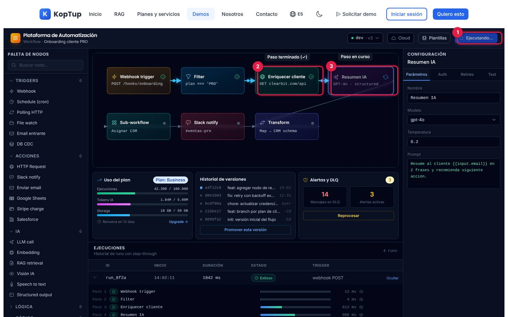

*A mitad de la ejecución: tres nodos terminados y «Resumen IA» en curso.*

1. **Ejecutando...**: el botón queda bloqueado hasta que termina la animación.
2. **Paso terminado**: el punto gris cambia por una marca verde (✓).
3. **Paso en curso**: el nodo parpadea y muestra un ícono que gira.

Qué decir: «Así se ve en vivo por dónde va cada caso». Es una animación: no se llama a ningún servicio.

### Paso 3. Revisa la corrida en Ejecuciones

Al terminar, todos los nodos quedan con ✓ y aparece una fila nueva arriba del historial. Pulsa **Ver detalle** en esa fila.

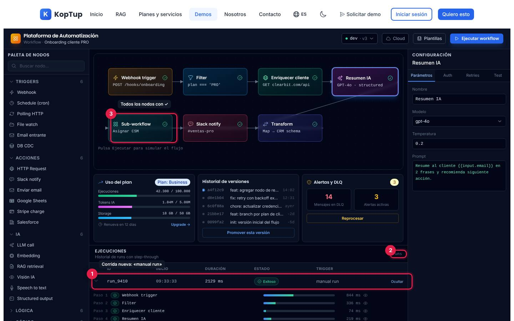

*La corrida nueva («manual run») abierta con sus siete pasos y la duración de cada uno.*

1. **Corrida nueva**: un identificador al azar (`run_` más cuatro caracteres), la hora de tu equipo, una duración de entre 1.600 y 2.299 ms, el estado **Exitoso** y el origen «manual run». Llega cerrada: hay que pulsar **Ver detalle**.
2. **Contador**: pasa de «4 runs» a «5 runs» (suma una por cada ejecución).
3. **Nodos en ✓**: quedan así hasta la siguiente ejecución, que los vuelve a poner en gris.

Debajo de la fila abierta se ve cada paso con su ícono de estado, una barra proporcional a su duración y los milisegundos. Las duraciones de los pasos son al azar y no suman la duración total.

### Paso 4. Prueba un nodo en el inspector

Haz clic en el nodo **Enriquecer cliente**, abre la pestaña **Test** y pulsa **Ejecutar paso**.

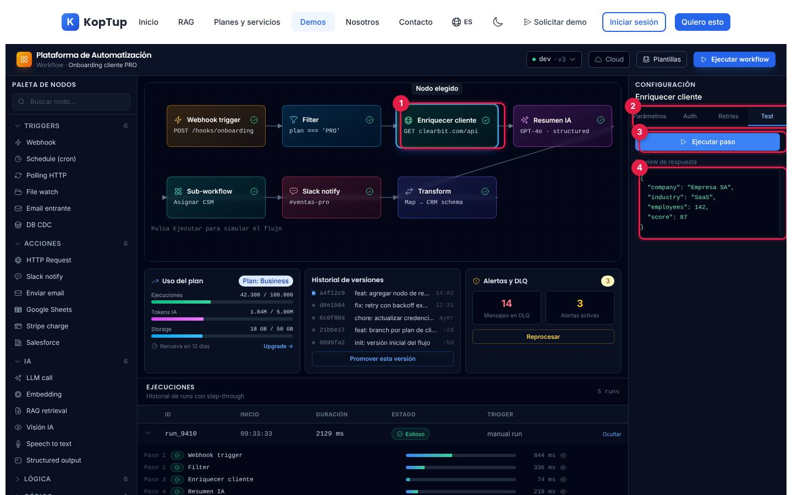

*El nodo «Enriquecer cliente» elegido y su respuesta de ejemplo en la pestaña Test.*

1. **Nodo elegido**: el borde se resalta y el inspector cambia de título.
2. **Pestañas**: Parámetros, Auth, Retries y Test (descritas en [Inspector](#inspector-del-nodo)).
3. **Ejecutar paso**: muestra «⏳ running…» unos 0,7 segundos.
4. **Respuesta de ejemplo**: un JSON fijo para cada tipo de nodo; para este, la empresa «Empresa SA», sector «SaaS», 142 empleados y puntaje 87.

Qué decir: «Cada paso se puede probar solo, sin correr todo el flujo». Si cambias de nodo, la respuesta anterior se queda en pantalla hasta que vuelvas a pulsar **Ejecutar paso** (ver las limitaciones).

### Paso 5. Muestra las plantillas

Pulsa **Plantillas** en la barra superior.

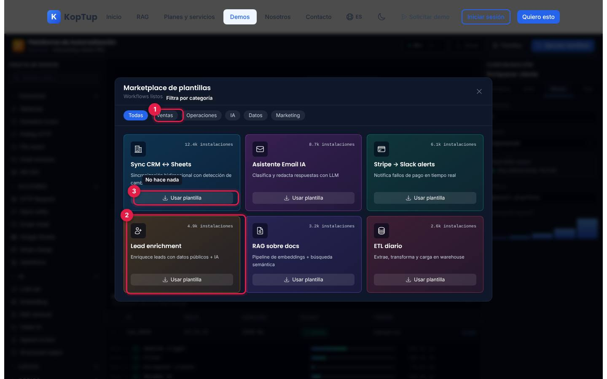

*Marketplace con seis flujos listos y el filtro por categoría.*

1. **Categorías**: Todas, Ventas, Operaciones, IA, Datos y Marketing. Filtran las tarjetas; **Marketing** queda vacía.
2. **Plantilla**: nombre, descripción y número de instalaciones (de ejemplo).
3. **Usar plantilla**: **no hace nada**.

Para cerrar: la X, un clic fuera de la ventana o la tecla Escape.

### Paso 6. Cierra con las alertas y la cola de errores

En la tarjeta **Alertas y DLQ** pulsa **Reprocesar**.

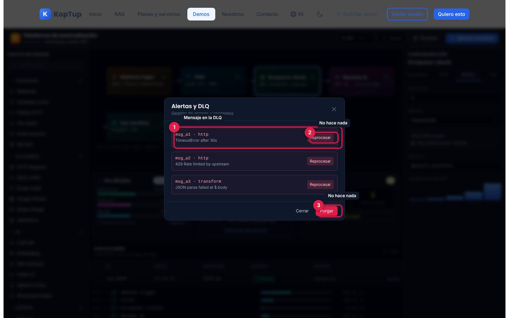

*Ventana «Alertas y DLQ» con tres mensajes fallidos de ejemplo.*

1. **Mensaje en la DLQ**: identificador, nodo donde falló y el error (tiempo de espera agotado, límite de peticiones 429 y JSON inválido).
2. **Reprocesar** de cada mensaje: **no hace nada**.
3. **Purgar**: **no hace nada**.

Qué decir: «Lo que falla no se pierde: queda en una cola para revisarlo y reintentarlo». Se cierra con **Cerrar**, la X o un clic fuera; la tecla Escape no la cierra. Termina mostrando el bloque azul del final de la página (**Solicitar demo guiada**).

---

## Pantallas y funciones

La demo es una sola pantalla de tres columnas, más cuatro ventanas emergentes (plantillas, alertas, editor de código y SDK).

### Barra superior

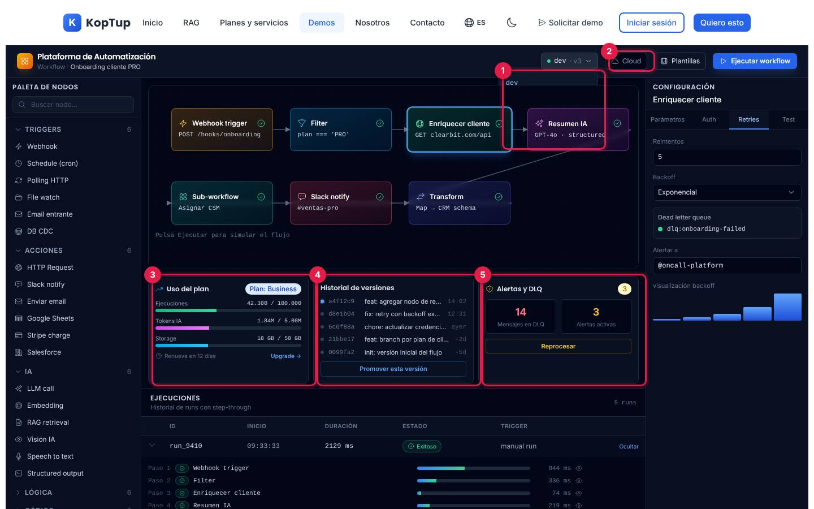

*Con el menú de entorno abierto: solo se alcanza a ver la opción «dev»; el resto queda detrás del lienzo.*

| Número | Elemento | Qué hace |
|---|---|---|
| 1 | **Entorno** (`dev · v3`) | Abre un menú con dev, staging y prod y **Promover a prod**. Cambiar de entorno solo cambia el color del punto (verde, ámbar o rojo) y el texto. En escritorio el menú queda **detrás del lienzo**: solo se ve «dev» y no se puede elegir otra opción con el mouse. **Promover a prod** no hace nada. La versión «v3» es fija. |
| 2 | **Cloud / Self-hosted** | Interruptor que solo cambia su ícono y su texto. No cambia nada más. |
| — | **Plantillas** | Abre el marketplace ([paso 5](#paso-5-muestra-las-plantillas)). |
| — | **Ejecutar workflow** | Anima el flujo y agrega una corrida ([paso 2](#paso-2-ejecuta-el-workflow)). |

### Paleta de nodos

Columna izquierda con buscador y cinco categorías (Lógica y Código empiezan cerradas; un clic en el título las abre o cierra):

| Categoría | Nodos |
|---|---|
| Triggers (6) | Webhook, Schedule (cron), Polling HTTP, File watch, Email entrante, DB CDC |
| Acciones (6) | HTTP Request, Slack notify, Enviar email, Google Sheets, Stripe charge, Salesforce |
| IA (6) | LLM call, Embedding, RAG retrieval, Visión IA, Speech to text, Structured output |
| Lógica (6) | Filter, Switch, Loop, Merge, Wait, Sub-workflow |
| Código (3) | JavaScript, Python, Transform |

- **Buscar nodo...** filtra por nombre y oculta las categorías sin resultados.
- Los nodos de **Código** abren el [editor de código](#editor-de-código). **Los demás no hacen nada** al hacer clic, y aunque el cursor sugiere que se pueden arrastrar, el lienzo no acepta nodos nuevos.

### Lienzo

El flujo fijo de siete nodos (ver el [diagrama](#recorrido-sugerido-demo-comercial-de-5-minutos)). Cada nodo muestra nombre, detalle técnico y un estado (punto gris en espera, ícono que gira en curso, ✓ terminado). Un clic elige el nodo y lo abre en el inspector. No se pueden mover, agregar, borrar ni conectar nodos; tampoco hay zoom. Abajo a la izquierda, el texto «Pulsa Ejecutar para simular el flujo».

### Inspector del nodo

Columna derecha («Configuración») con el nombre del nodo y cuatro pestañas. Los campos se pueden escribir, pero **no se guardan**: no hay botón de guardar y al cambiar de pestaña vuelven a su valor de ejemplo.

| Pestaña | Qué muestra |
|---|---|
| **Parámetros** | Nombre y los campos del tipo de nodo (tabla siguiente). |
| **Auth** | Proveedor (OAuth2, API Key, Basic o Secret manager), credencial `prod_clearbit_v2` y la nota «Credenciales cifradas (KMS). Rotación automática cada 90 días». Es igual para todos los nodos. |
| **Retries** | Reintentos (5), backoff exponencial o lineal, cola `dlq:onboarding-failed`, a quién alertar (`@oncall-platform`) y un dibujo de esperas crecientes (1, 2, 4, 8 y 16 s). Igual para todos los nodos. |
| **Test** | **Ejecutar paso** y la respuesta de ejemplo del nodo ([paso 4](#paso-4-prueba-un-nodo-en-el-inspector)). |

| Nodo | Campos en Parámetros |
|---|---|
| Webhook trigger | path `/hooks/onboarding`, método POST o PUT |
| Filter | condición `$.body.plan === 'PRO'` |
| Enriquecer cliente | método (GET, POST, PUT, DELETE), URL de un servicio de enriquecimiento de empresas, encabezado con un secreto de ejemplo (`{{secrets.CLEARBIT}}`) |
| Resumen IA | modelo (gpt-4o, claude-sonnet-4 o llama-3.1-70b), temperatura 0.2 y el prompt «Resume al cliente … en 2 frases y recomienda siguiente acción» |
| Transform | el mapeo de campos (`name`, `tier`, `owner_id`) |
| Slack notify | canal `#ventas-pro` y mensaje «Nuevo cliente PRO: {{llm.summary}}» |
| Sub-workflow | referencia `wf_assign_csm@v3` |

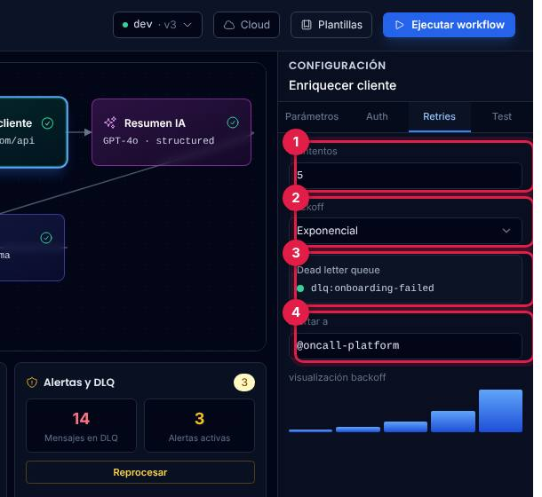

*Pestaña Retries del nodo «Enriquecer cliente».*

1. **Reintentos**: cuántas veces se repite el paso si falla.
2. **Backoff**: exponencial o lineal (cuánto esperar entre intentos).
3. **Dead letter queue**: la cola donde quedan los mensajes que fallan todas las veces.
4. **Alertar a**: el equipo o canal que recibe el aviso.

### Tarjetas de uso, versiones y alertas

En la [captura de la barra superior](#barra-superior):

- **3 · Uso del plan** (plan «Business»): ejecuciones 42.300 de 100.000, tokens de IA 1,84 M de 5 M y almacenamiento 18 de 50 GB, «Renueva en 12 días». Son cifras fijas: no cambian al ejecutar. **Upgrade →** no hace nada.
- **4 · Historial de versiones**: cinco commits de ejemplo (de «init: versión inicial del flujo» hace 5 días a «feat: agregar nodo de resumen IA» a las 14:02), con la versión actual marcada. **Promover esta versión** no hace nada.
- **5 · Alertas y DLQ**: 14 mensajes en la DLQ y 3 alertas activas (fijos). **Reprocesar** abre la ventana del [paso 6](#paso-6-cierra-con-las-alertas-y-la-cola-de-errores).

### Ejecuciones

Tabla con ID, inicio, duración, estado y origen. Trae cuatro corridas de ejemplo; la primera viene abierta:

| Corrida | Inicio | Estado | Origen | Pasos |
|---|---|---|---|---|
| `run_8f2a` | 14:02:11 | Exitoso | webhook POST | los siete |
| `run_8f1b` | 13:58:02 | Reintento | webhook POST | cinco; «Enriquecer cliente» aparece dos veces (reintento y éxito) |
| `run_8f0c` | 13:45:30 | Fallido | schedule cron | tres; falla en «Enriquecer cliente» |
| `run_8eff` | 13:20:08 | Exitoso | webhook POST | cinco |

**Ver detalle** / **Ocultar** (o la flecha) abre y cierra los pasos. El ojo de cada paso **no hace nada**. Cada **Ejecutar workflow** agrega una corrida exitosa arriba ([paso 3](#paso-3-revisa-la-corrida-en-ejecuciones)). El pie de página sigue diciendo «Última ejecución: 14:02:11» aunque ejecutes el flujo.

### Plantillas

Ver el [paso 5](#paso-5-muestra-las-plantillas). Seis plantillas: Sync CRM ↔ Sheets, Asistente Email IA, Stripe → Slack alerts, Lead enrichment, RAG sobre docs y ETL diario, con instalaciones de ejemplo (de 2,6k a 12,4k).

### Editor de código

Se abre con **JavaScript**, **Python** o **Transform** de la paleta (los tres abren la misma ventana, en JavaScript).

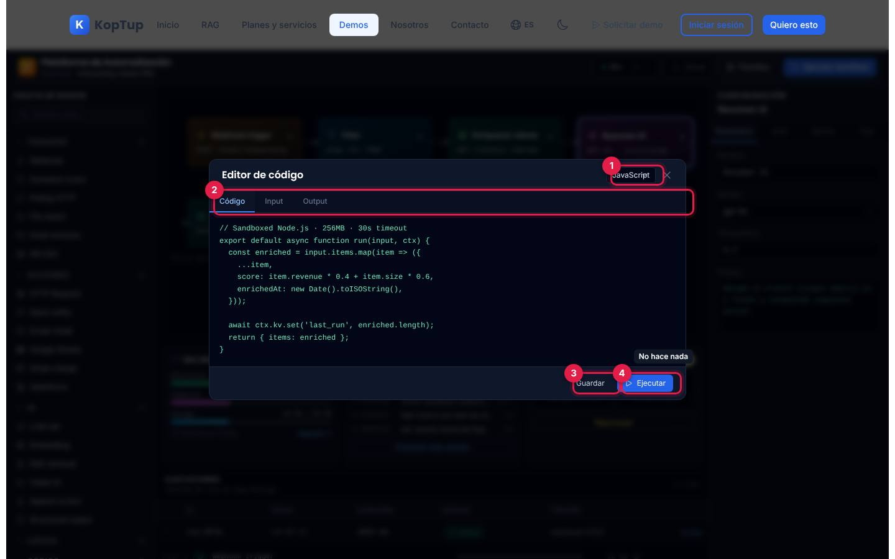

*Editor de código con el ejemplo en JavaScript.*

1. **Lenguaje**: JavaScript o Python; cambia el código de ejemplo (una función que calcula un puntaje por registro).
2. **Pestañas**: Código, Input (dos registros de ejemplo) y Output (los mismos registros con su puntaje). Son textos fijos: no se calcula nada.
3. **Guardar**: no hace nada.
4. **Ejecutar**: no hace nada.

Se cierra con la X, un clic fuera o Escape. El código no se puede editar.

### SDK para nodos propios

**SDK custom nodes**, en el pie de la demo, abre una ventana con el comando de instalación (`npm install @platform/sdk`, un paquete de ejemplo) y un fragmento en TypeScript que define un nodo para crear contactos en un CRM. **Ver docs completas** no hace nada.

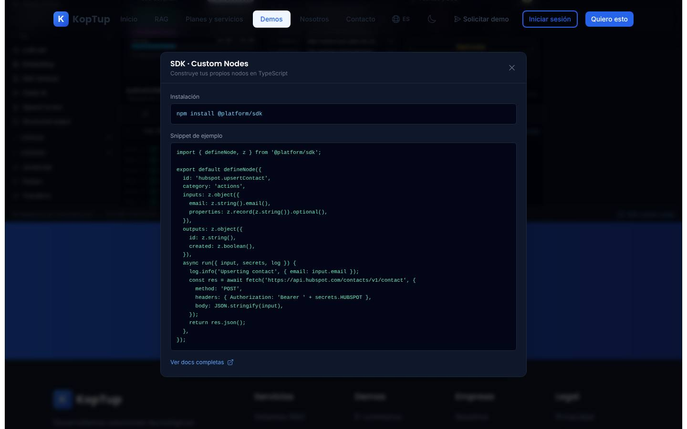

*Ventana «SDK · Custom Nodes».*

### En el celular

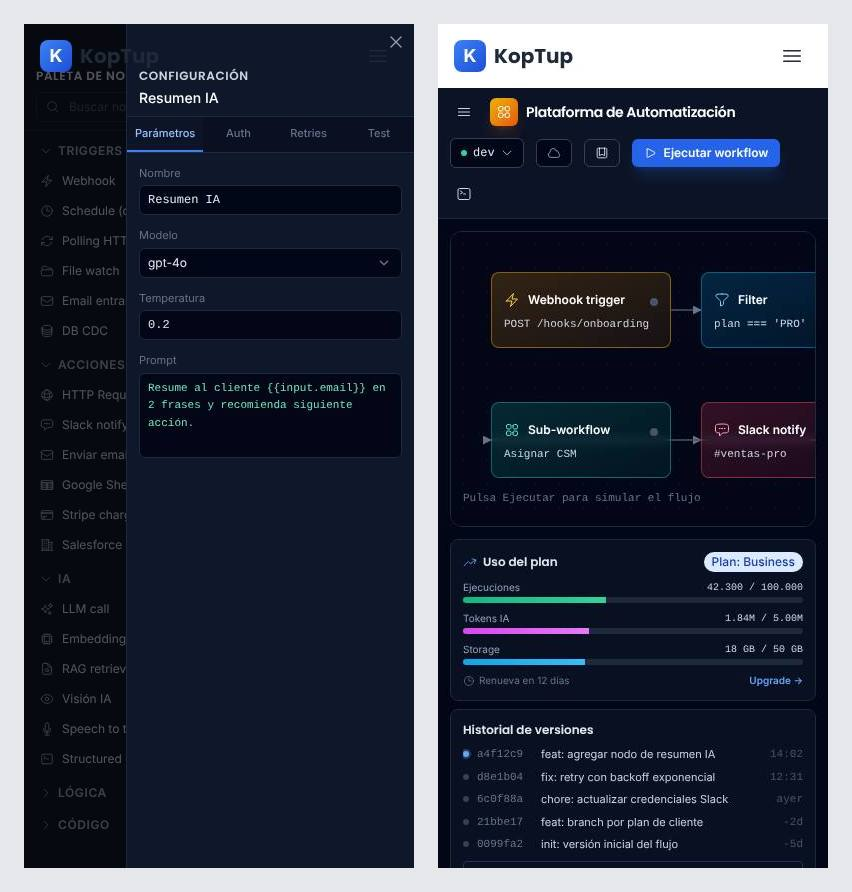

*A 390 px. Izquierda: así abre la demo, con el inspector encima de la paleta. Derecha: después de cerrar los dos paneles.*

- Al cargar, la paleta y el inspector se abren **los dos a la vez**, uno encima del otro. La X de cada panel queda debajo de la barra superior del sitio y no responde; para cerrarlos hay que tocar la franja oscura a un lado del panel (primero la de la izquierda, luego la de la derecha).
- Los botones ☰ (paleta) y el ícono de consola (inspector) de la barra de la demo los vuelven a abrir.
- El lienzo se desplaza de lado dentro de su recuadro; las tarjetas se apilan. La página no se desborda a lo ancho.

---

## Qué es real y qué es simulado

| Parte | Real o simulado | Detalle |
|---|---|---|
| Flujo, nodos, parámetros, credenciales, plantillas, versiones, cuotas y alertas | **Datos de ejemplo** | Escritos en el código de la página; no hay base de datos ni servidor. |
| **Ejecutar workflow** | **Animación** | Enciende los nodos uno por uno y agrega una corrida «Exitoso» con números al azar. No llama a ningún webhook, API, modelo de IA ni a Slack. |
| **Ejecutar paso** (Test) | **Simulado** | Devuelve un JSON fijo por tipo de nodo después de 0,7 s. |
| «Resumen IA», modelos de IA y nodos de IA de la paleta | **Simulado** | No hay IA en la demo. |
| Editor de código y SDK | **Textos de ejemplo** | No se edita ni se ejecuta código; el paquete del SDK es de ejemplo. |
| Entornos, Cloud/Self-hosted y versiones | **Interacción visual** | Cambian un rótulo; no hay despliegues. |
| Buscador de la paleta, pestañas, filtros de plantillas y abrir/cerrar corridas | **Funcionan** | Son interacciones de la interfaz. |
| Dónde quedan tus cambios | **En ningún lado** | Al recargar vuelve todo al inicio; tampoco se guarda nada en el navegador. |
| Marcas mostradas (Slack, Stripe, Salesforce, Google Sheets, Clearbit, HubSpot, GPT-4o, Claude, Llama) | **Solo como ejemplo** | No hay integración con ninguna. |

---

## Acceso

- **Cómo la ve un visitante:** la demo está en modo **Abierta** (`publico`): cualquiera entra a `/demo/automatizacion` sin cuenta y sin pantalla de acceso. En el hub `/demo` aparece así:

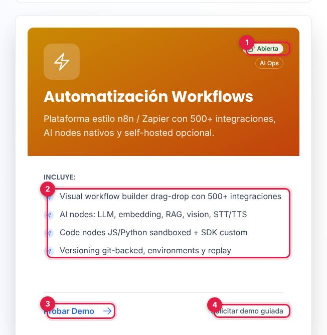

*Tarjeta «Automatización Workflows» en el hub, vista por un visitante sin sesión.*

1. Insignia **Abierta** (junto a «AI Ops»).
2. Lo que **Incluye** según la tarjeta (ver la [limitación 1](#limitaciones-conocidas)).
3. **Probar Demo** abre `/demo/automatizacion`.
4. **Solicitar demo guiada** abre `/solicitar-demo?demos=automatizacion`.

- **Cómo se solicita:** no hace falta solicitarla. Quien quiera verla con su propio proceso usa **Solicitar demo guiada** (en la tarjeta o en el bloque azul al final de la demo, que también ofrece **Solicitar Cotización** y **Ver Planes y Precios**).
- **Cómo la controla el admin:** el modo sale del catálogo del servidor y se cambia en **Admin › Catálogo de demos** (`/admin/catalogo-demos`). Si se pasa a «Con solicitud» o «Solo por invitación», los visitantes verán la pantalla de acceso y los accesos se conceden en **Admin › Solicitudes de demo** y **Admin › Accesos a demos**; si se desactiva, el visitante ve que la demo está «En mantenimiento» y el equipo de KopTup sigue entrando. Si el backend no responde, la demo sigue abierta porque así está en la tabla de respaldo. Detalle en el [Manual del administrador](Doc-06-Manual-del-Administrador.md) y en [Flujos del visitante](Doc-04-Flujos-del-Visitante.md).

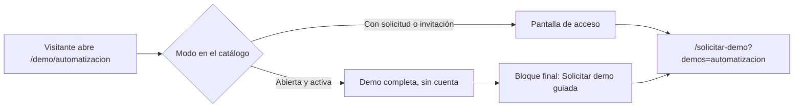

*Hoy la demo toma la rama de arriba; las otras dos aplican solo si el admin cambia el modo.*

---

## Limitaciones conocidas

1. **Promete más de lo que muestra.** La tarjeta del hub habla de «500+ integraciones», editor de arrastrar y soltar, nodos de «STT/TTS», «versioning git-backed» y «replay». La demo tiene 27 tipos de nodo en la paleta, no se puede arrastrar ni agregar nada, no hay TTS ni repetición de corridas, y no ejecuta nada. Conviene aclararlo al presentarla.
2. **Sin rótulo de «Datos de ejemplo»** ni explicación de qué es simulado, a diferencia de las demos ya revisadas. Mezcla textos en inglés («Workflow», «Retries», «Upgrade», «manual run», «Storage», «running…»).
3. **Botones que no hacen nada:** los 24 nodos de la paleta que no son de código, **Promover a prod**, **Upgrade →**, **Promover esta versión**, **Usar plantilla**, **Reprocesar** y **Purgar** dentro de la ventana de alertas, **Guardar** y **Ejecutar** del editor de código, el ojo de cada paso en Ejecuciones y **Ver docs completas** del SDK. Al pasar el mouse cambian de color, así que parecen funcionar.
4. **El lienzo se lee al revés en la segunda fila.** Las flechas de abajo apuntan hacia la derecha (Sub-workflow → Slack notify → Transform), pero la ejecución va al revés (Transform → Slack notify → Sub-workflow); las líneas cruzan por detrás de los nodos.
5. **El menú de entorno no se puede usar en escritorio:** queda detrás del lienzo y solo se ve «dev».
6. **El inspector arrastra datos del nodo anterior.** Si estás en Parámetros y eliges otro nodo, el campo **Nombre** sigue mostrando el nombre del nodo anterior (por ejemplo, «Filter» en «Enriquecer cliente»), aunque el título sí cambia. En Test, la respuesta del nodo anterior queda en pantalla hasta pulsar de nuevo **Ejecutar paso**. Auth y Retries muestran lo mismo para todos los nodos (incluida la credencial del servicio de enriquecimiento en el filtro o en Slack).
7. **Cifras que no cuadran:** la duración total de una corrida nueva no es la suma de sus pasos; la hora de la corrida nueva es la del equipo del visitante mientras las de ejemplo son fijas (14:02, 13:58…); el pie dice «Última ejecución: 14:02:11» aunque ejecutes el flujo; la corrida en «Reintento» muestra un ícono girando para siempre; las cuotas no cambian al ejecutar.
8. **La corrida nueva llega cerrada** y la de ejemplo `run_8f2a` sigue abierta debajo; hay que pulsar **Ver detalle** para verla.
9. **La ventana de alertas no se cierra con Escape** (las demás sí). La categoría **Marketing** de plantillas aparece vacía, sin mensaje.
10. **En el celular** la paleta y el inspector abren a la vez encima de la demo y su X queda debajo de la barra del sitio (hay que tocar la franja oscura para cerrarlos).
11. **No guarda nada:** al recargar se pierden las corridas y lo que hayas escrito.
12. **Error técnico en la consola:** con el navegador en español aparecen errores de hidratación de React (#425, #418 y #423) al cargar. La causa es que el número de ejecuciones de la tarjeta «Uso del plan» se formatea con el idioma del navegador (`42.300`) y no coincide con el del servidor (`42,300`); con el navegador en inglés no aparecen. No se nota a simple vista, pero obliga a React a volver a pintar la página.
