# Guía de la demo: Chatbot RAG con tus documentos

> Ruta `/demo/chatbot` · Modo de acceso: **Abierta** · Tipo: **IA real** (búsqueda y respuesta en el servidor; las empresas y sus documentos son de ejemplo) · Plan del producto: [Sistemas RAG (producto principal)](Producto-chatbot-rag-ia.md)

**Resumen.** Es la demo del producto principal de KopTup: un asistente que responde **solo con los documentos cargados**, cita la fuente de cada dato y dice «no encontré» cuando la respuesta no está. Tiene tres modos: **Prueba el asistente** (tres empresas ficticias, sin registro), **Prueba con tu documento** (tu PDF, DOCX o TXT, con email) y **Configura el tuyo** (tu propio bot con su widget y código para insertar). Sirve para que un gerente vea en 5 minutos qué es un sistema RAG y para que un desarrollador vea el pipeline real paso a paso.

**Contenido:** [Recorrido sugerido](#recorrido-sugerido-demo-comercial-de-5-minutos) · [Pantallas y funciones](#pantallas-y-funciones) · [Qué es real y qué es simulado](#qué-es-real-y-qué-es-simulado) · [Acceso](#acceso) · [Limitaciones conocidas](#limitaciones-conocidas)

*Modo «Prueba el asistente» con una respuesta: documentos a la izquierda, conversación con citas al centro y «Cómo se respondió» a la derecha.*

> **Sobre las capturas:** el texto de las respuestas lo produjo el modelo simulado del entorno de pruebas (por eso empieza con «Respuesta simulada…»). Con la clave real de OpenAI lo redacta el modelo elegido. La búsqueda, las citas, los fragmentos, los pasos y las métricas que ves sí son el comportamiento real del código.

---

## Recorrido sugerido (demo comercial de 5 minutos)

*Los ocho momentos del recorrido, en orden.*

### Paso 1 · Elige la empresa de ejemplo (≈ 30 s)

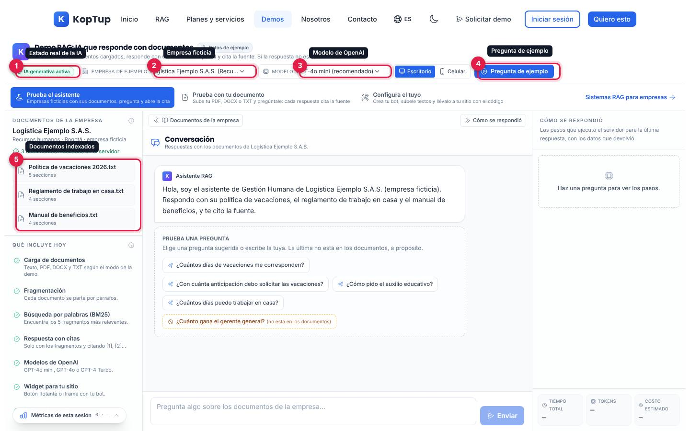

*Barra superior del modo «Prueba el asistente» y documentos indexados de la empresa elegida.*

1. **Estado de la IA**: lo consulta al servidor al abrir la página (`GET /api/chatbot/models`). «IA generativa activa» significa que hay clave de OpenAI; si no, dice «Modo extractivo (sin clave de IA)» o «Servidor no disponible».
2. **Empresa de ejemplo**: tres empresas ficticias, cada una con sus documentos: *Logística Ejemplo S.A.S.* (recursos humanos, Bogotá), *Hogar Ejemplo Tienda en Línea* (servicio al cliente, Medellín) e *IPS Ejemplo Salud* (salud, Cali). Elige la que se parezca al cliente.
3. **Modelo**: GPT-4o mini (recomendado), GPT-4o o GPT-4 Turbo. El servidor solo acepta esos tres.
4. **Pregunta de ejemplo**: envía la siguiente pregunta sugerida que aún no se ha hecho.
5. **Documentos de la empresa**: al elegir la empresa, el navegador crea un bot real en el servidor y le sube esos textos; cuando termina dice «3 documentos indexados en el servidor». Clic en un documento para leerlo completo.

**Qué decir:** «Esto es lo único que consulta el asistente: tres documentos internos. Lo que no esté aquí, no lo va a inventar».

### Paso 2 · Haz una pregunta sugerida (≈ 1 min)

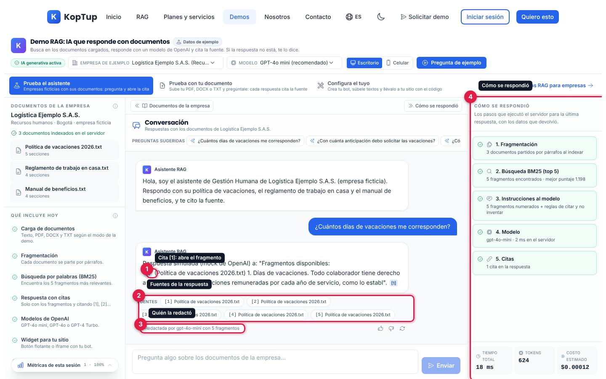

*Respuesta a «¿Cuántos días de vacaciones me corresponden?» con sus citas y los cinco pasos que ejecutó el servidor.*

1. **Cita [1]** dentro del texto: al pasar el mouse muestra el fragmento; al hacer clic lo abre completo.
2. **Fuentes**: los fragmentos que el servidor encontró (hasta 5), con el nombre del documento.
3. **Quién la redactó**: «Redactada por gpt-4o-mini con 5 fragmentos» (o «Modo extractivo…» si no hubo modelo). Debajo están los botones «Respuesta útil» (pulgar arriba), «Respuesta a mejorar» (pulgar abajo) y «Volver a preguntar».
4. **Cómo se respondió**: los pasos reales de la última respuesta: 1) fragmentación, 2) búsqueda BM25 (top 5) con el mejor puntaje, 3) instrucciones al modelo, 4) modelo y milisegundos en el servidor, 5) citas. Abajo: tiempo total medido en tu navegador, tokens y costo estimado en USD.

### Paso 3 · Abre la fuente (≈ 1 min)

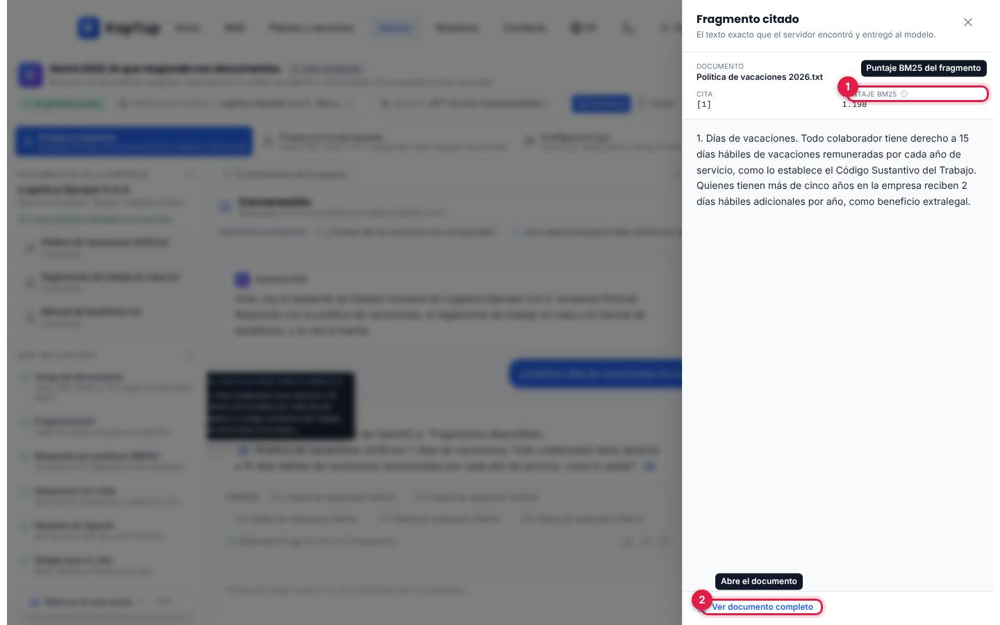

*Panel «Fragmento citado» que se abre al hacer clic en una cita.*

1. **Puntaje BM25**: qué tanto coinciden las palabras de la pregunta con ese fragmento (más alto = más relevante).
2. **Ver documento completo**: abre el documento con el fragmento citado resaltado.

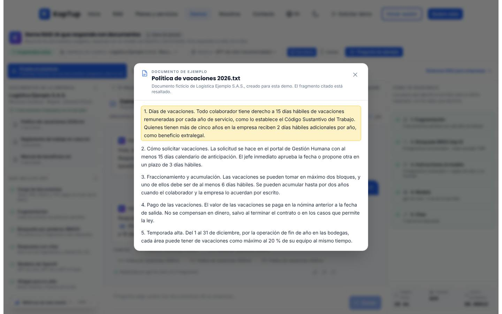

*Visor del documento de ejemplo: el párrafo citado aparece resaltado y se aclara que el documento es ficticio.*

**Qué decir:** «Cada dato se puede auditar: el usuario ve de qué párrafo salió».

### Paso 4 · Pregunta algo que no esté (≈ 1 min)

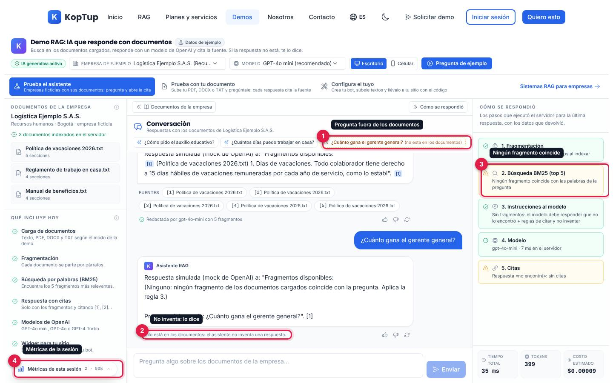

*La última pregunta sugerida está fuera de los documentos a propósito.*

1. **Pregunta fuera de los documentos**: va marcada con borde punteado y la nota «no está en los documentos» (por ejemplo «¿Cuánto gana el gerente general?»).
2. **No inventa**: debajo de la respuesta aparece «No está en los documentos: el asistente no inventa una respuesta».
3. **Paso 2 en ámbar**: «Ningún fragmento coincide con las palabras de la pregunta»; el paso 5 dice «Respuesta «no encontré»: sin citas».
4. **Métricas de esta sesión**: botón flotante con el número de preguntas y el % con fuente. Al abrirlo muestra preguntas, con fuente, «no encontré», tiempo medio, tokens, costo (USD) y valoraciones. Se calculan con las respuestas reales de la pestaña y se reinician al recargar.

### Paso 5 · Llévalo a su caso (≈ 1 min 30 s)

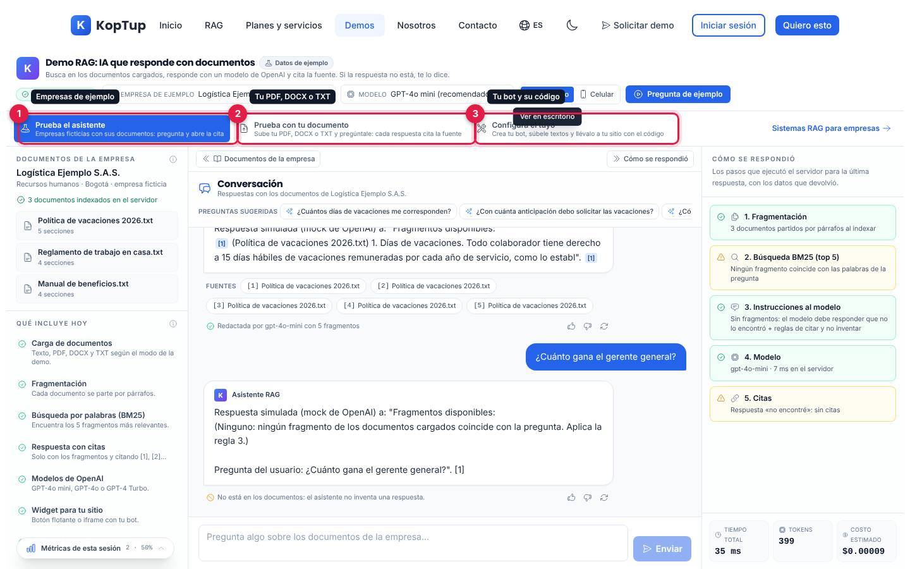

*Pestañas de modo debajo de la barra superior.*

1. **Prueba el asistente**: lo que acabas de mostrar.
2. **Prueba con tu documento**: el prospecto sube su propio PDF, DOCX o TXT (ver [más abajo](#prueba-con-tu-documento)).
3. **Configura el tuyo**: crea su bot, le sube textos, lo prueba en un sitio de ejemplo y copia el código para su web (ver [más abajo](#configura-el-tuyo)).

A la derecha, «Sistemas RAG para empresas» lleva a la landing `/rag`. Para cerrar, invita a «Solicitar demo» (menú superior) o a los [planes RAG](Producto-chatbot-rag-ia.md).

---

## Pantallas y funciones

### Barra superior y recorrido de bienvenida

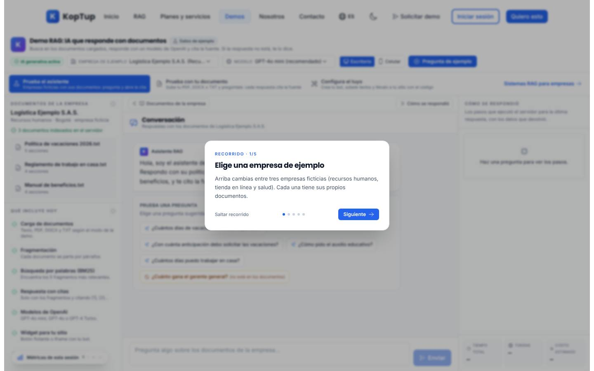

*La primera visita muestra un recorrido de 5 pasos sobre la demo.*

- **Recorrido**: cinco tarjetas («Elige una empresa de ejemplo», «Haz una pregunta sugerida», «Abre la fuente», «Pregunta algo que no esté», «Prueba con tu documento o configura el tuyo»). «Saltar recorrido» o «Empezar» lo cierran y queda guardado en el navegador para no repetirlo.
- **Título y rótulo «Datos de ejemplo»**: el tooltip aclara que las empresas y documentos son ficticios, pero las respuestas las genera el servidor real.
- **Escritorio / Celular**: cambia el marco de la conversación para ver cómo se vería en un teléfono (solo en pantallas medianas o grandes).
- **Enlace de la URL**: el modo queda en la dirección (`?mode=upload` o `?mode=builder`), así puedes compartir el enlace directo a un modo.

### Prueba el asistente

| Zona | Qué puedes hacer | Qué pasa |
|---|---|---|
| Documentos de la empresa | Clic en un documento | Se abre el visor con el texto completo (ficticio). |
| Qué incluye hoy | Clic en una capacidad | Se abre un panel con el detalle de lo que existe en el código (ver captura abajo). |
| Conversación | Escribir y pulsar Enter, o elegir una pregunta sugerida | La pregunta va al servidor; la respuesta trae citas y fuentes. Mientras indexa, dice «Indexando los documentos de la empresa…». |
| Respuesta | «Respuesta útil» / «Respuesta a mejorar» | Marca la respuesta y suma a las métricas de la sesión (no se envía al servidor). |
| Respuesta | «Volver a preguntar» | Reenvía la misma pregunta y reemplaza la respuesta. |
| Cita o fuente | Clic | Abre «Fragmento citado» con documento, posición, puntaje BM25 y texto exacto. |
| Botones «Documentos de la empresa» / «Cómo se respondió» | Clic | Ocultan o muestran las columnas laterales en escritorio. |

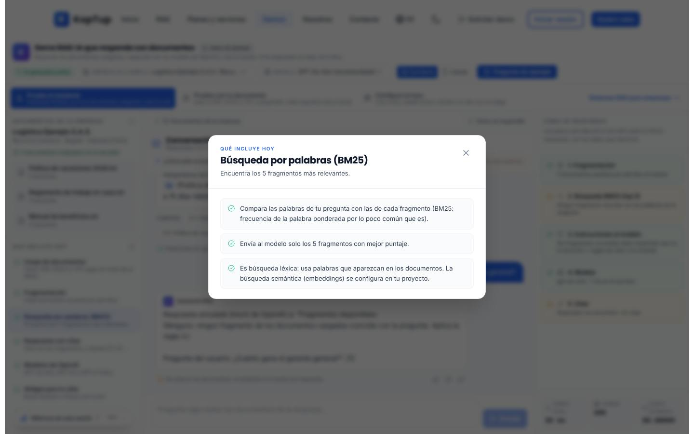

*Detalle de «Búsqueda por palabras (BM25)» en «Qué incluye hoy». Las siete capacidades: carga de documentos, fragmentación, búsqueda BM25, respuesta con citas, modelos de OpenAI, widget para tu sitio e historial de conversaciones.*

Debajo de la lista, la demo aclara que en un proyecto se construyen además conectores (Google Drive, SharePoint), WhatsApp, permisos por rol y panel de métricas, con enlace a «Ver planes RAG» (`/services#planes-rag`). Esas piezas **no** están en la demo.

### Prueba con tu documento

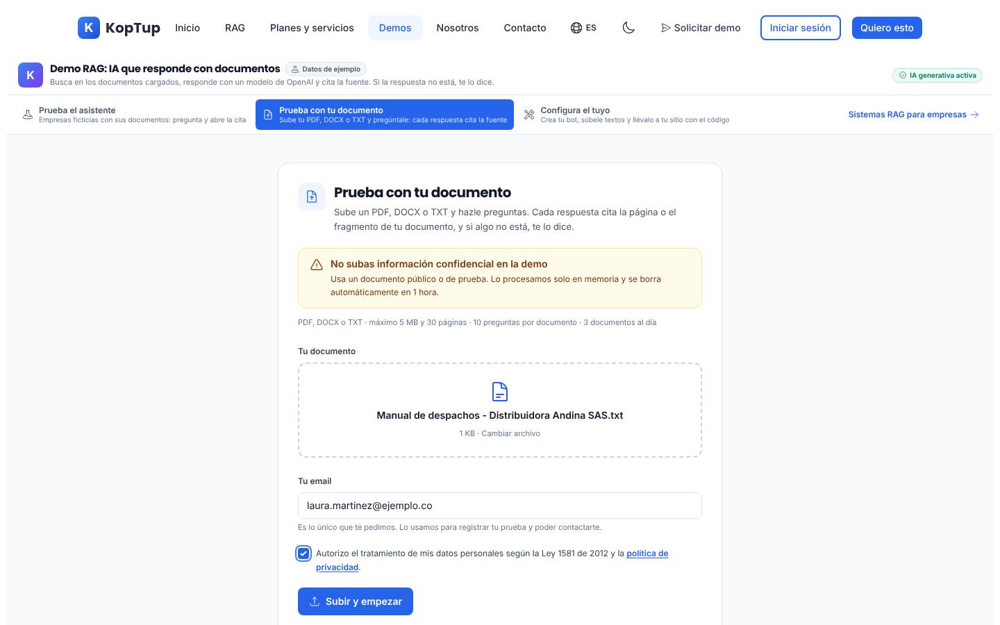

*Formulario con un archivo de prueba de una empresa ficticia, el email y la autorización de datos.*

- Pide **solo** el archivo (PDF, DOCX o TXT, hasta 5 MB y 30 páginas), el **email** y la casilla de **autorización de datos (Ley 1581 de 2012)** con enlace a la política de privacidad.
- Muestra el aviso «No subas información confidencial en la demo» y los límites: 10 preguntas por documento y 3 documentos al día.
- Al subir, el servidor procesa el documento **solo en memoria** y lo borra a la hora. El email queda registrado como contacto con origen `demo-rag` (el mismo canal del formulario de contacto), para que el equipo comercial pueda escribirle.
- Si la función está apagada o se acabó el cupo del mes, muestra «La prueba con tu documento no está disponible en este momento» (o «Alcanzamos el cupo de pruebas de este mes») con «Agenda una demo con nosotros» y «Usar la demo con el documento de ejemplo».

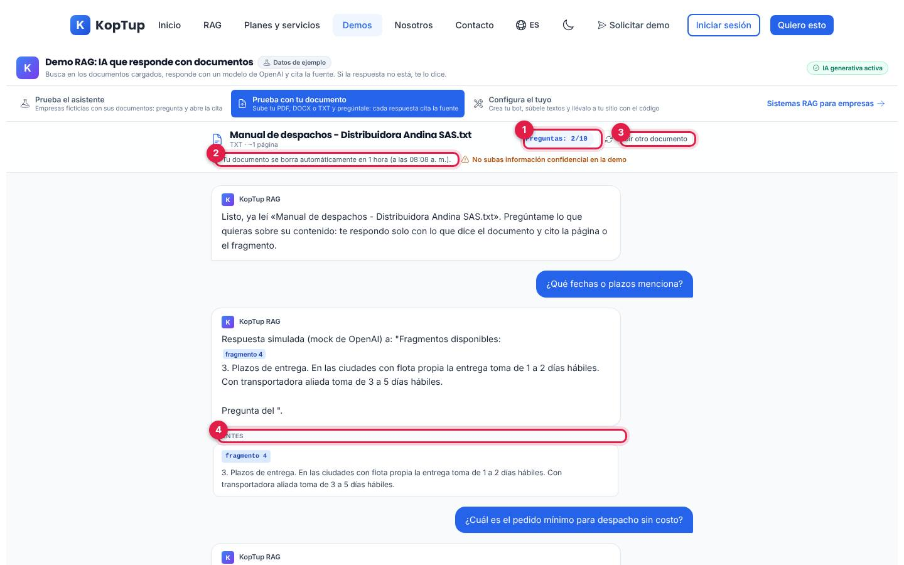

*Chat sobre el documento subido: contador, aviso de borrado, botón para subir otro y fuentes por fragmento.*

1. **Contador** «Preguntas: 2/10».
2. **Aviso de borrado**: «Tu documento se borra automáticamente en 1 hora (a las …)».
3. **Subir otro documento**: borra el actual y vuelve al formulario.
4. **Fuentes**: en PDF cita la página (`p. 3`); en DOCX y TXT, el fragmento (`fragmento 4`), con el extracto.

Trae tres preguntas sugeridas («¿De qué trata el documento?», «¿Qué fechas o plazos menciona?», «¿Qué requisitos u obligaciones establece?»). Al llegar a 10 preguntas invita a agendar una demo.

### Configura el tuyo

*Bot «Asistente de Distribuidora Andina» (empresa ficticia) guardado, con el widget real abierto en el sitio de ejemplo.*

1. **Mis bots**: los bots creados desde este navegador; permite cargar uno, crear uno nuevo o eliminarlo del servidor.
2. **Guardar bot**: crea o actualiza el bot en el servidor. Al lado aparecen el ID, «Copiar enlace del chat» y «Abrir chat» (página pública `/embed/chatbot/<id>`).
3. **Configuración**: nombre, bienvenida, color, posición del botón (4 esquinas), ícono, instrucciones y tono (Profesional, Amigable, Técnico, Cercano).
4. **Vista previa**: el **widget real** (el mismo `widget.js` que se pega en otro sitio) conversando con el servidor. Tiene tres vistas: «Sitio web», «Celular» y «Enlace directo». Sin guardar, solo muestra la apariencia y pide guardar para conversar.
5. **Código para tu sitio**: dos pestañas, «Botón flotante (script)» e «Iframe», con «Copiar» y la nota de CSP.

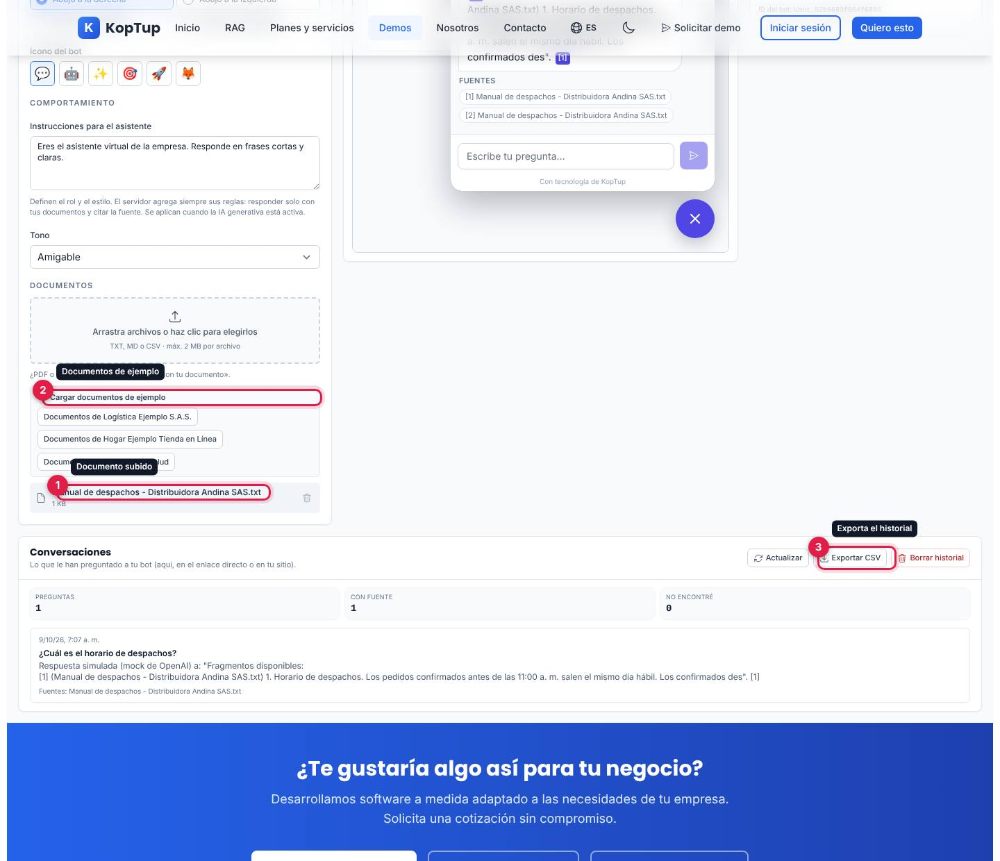

*Parte baja de «Configura el tuyo»: documentos del bot y su historial de conversaciones.*

1. **Documentos subidos**: archivos TXT, MD o CSV de hasta 2 MB (arrastrar o elegir); cada uno se puede quitar. Si el bot aún no existe, subir un archivo lo guarda primero.
2. **Cargar documentos de ejemplo**: sube los documentos de una de las tres empresas ficticias.
3. **Conversaciones**: lo que le han preguntado al bot (aquí, en el enlace directo o en otro sitio), con preguntas, «con fuente» y «no encontré»; «Actualizar», «Exportar CSV» y «Borrar historial» (pide confirmación).

### En el celular

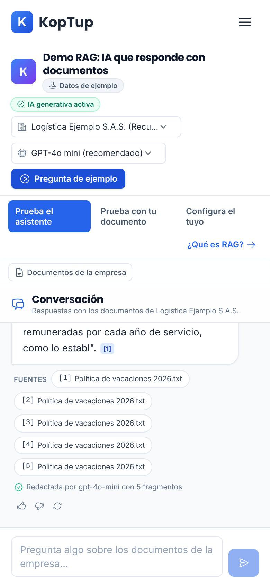

*Vista en un teléfono de 390 px: la barra se apila y los documentos se abren con el botón «Documentos de la empresa».*

En pantallas pequeñas no se muestran la columna «Cómo se respondió» ni el botón de métricas; los documentos se abren en un panel lateral que se cierra con la X o con Escape.

---

## Qué es real y qué es simulado

| Elemento | Real o simulado | Detalle |
|---|---|---|
| Empresas y documentos del modo «Prueba el asistente» | **Datos de ejemplo** | Tres empresas ficticias con textos en español e inglés, definidos en el código de la demo. |
| Indexación | **Real** | El navegador crea un bot en el servidor (`POST /api/chatbot/bots`) y sube los textos (`POST /api/chatbot/bots/:id/docs`). Se reutiliza en visitas siguientes. |
| Búsqueda | **Real** | BM25 en el servidor; se envían los 5 mejores fragmentos. |
| Redacción de la respuesta | **Real** | Modelo de OpenAI (GPT-4o mini, GPT-4o o GPT-4 Turbo) con reglas de citar y no inventar. Sin clave de IA o sin presupuesto del mes, pasa a **modo extractivo** (muestra los fragmentos tal cual). |
| Citas, fuentes y puntajes | **Real** | Salen de la respuesta del servidor. |
| «Cómo se respondió», tokens y costo | **Real** | Datos de la respuesta; el tiempo total se mide en el navegador y el costo es una estimación del servidor. |
| Métricas de esta sesión | **Real, solo local** | Se calculan en la pestaña con las respuestas reales; se borran al recargar. |
| Valoración útil / a mejorar | **Solo local** | Se suman a las métricas de la sesión; no se guardan en el servidor. |
| Vista «Celular» del modo de ejemplo | **Simulado** | Es un marco visual del tamaño de un teléfono. |
| Prueba con tu documento | **Real** | API `/api/demo-rag`: el documento vive en memoria 1 hora; el email se registra como contacto. |
| Configura el tuyo | **Real** | Bot propio en el servidor, widget real (`/widget.js` + `/embed/chatbot/<id>`), historial real y exportación CSV. |

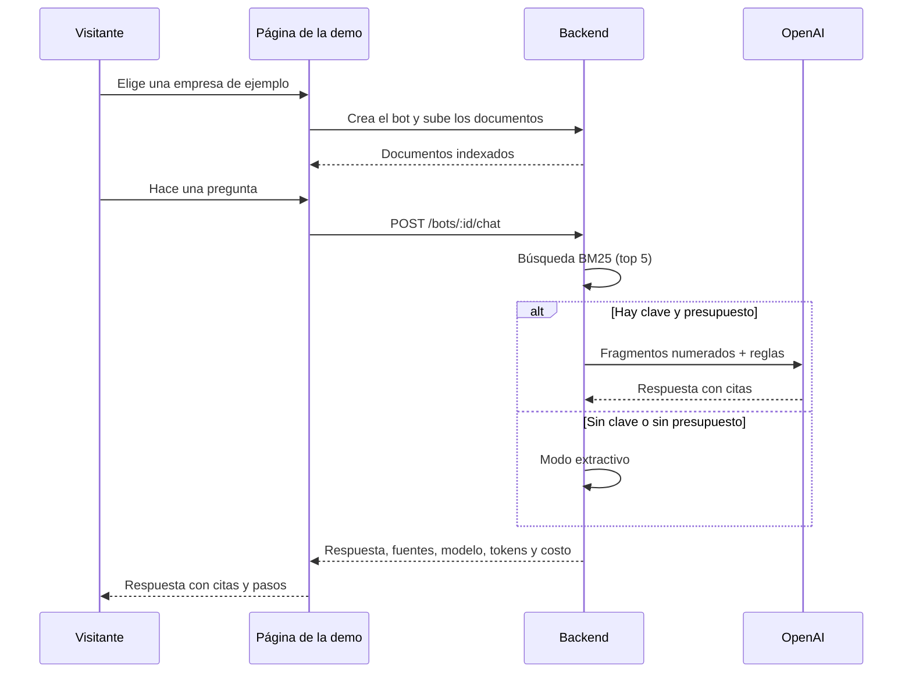

*Cómo viaja una pregunta del modo «Prueba el asistente».*

---

## Acceso

- **Cómo la ve un visitante:** la demo está en modo **Abierta** (`publico`): cualquiera entra a `/demo/chatbot` sin cuenta y sin pasar por la pantalla de acceso. El modo «Prueba con tu documento» es lo único que pide un dato (email + autorización).
- **Cómo se solicita:** no hace falta solicitarla. Si alguien quiere verla con su caso, usa «Agenda una demo con nosotros» (dentro de la demo) o «Solicitar demo» del menú.
- **Cómo la controla el admin:** el modo de acceso sale del catálogo del servidor y se cambia en **Admin › Catálogo de demos** (`/admin/catalogo-demos`). Si un día se pasa a «Con solicitud» o «Solo por invitación», los visitantes verán la pantalla de acceso y los accesos se conceden en **Admin › Solicitudes de demo** y **Admin › Accesos a demos**. Los emails de «Prueba con tu documento» llegan a **Admin › Contactos**. Detalle en el [Manual del administrador](Doc-06-Manual-del-Administrador.md) y en [Flujos del visitante](Doc-04-Flujos-del-Visitante.md).

---

## Limitaciones conocidas

- **La búsqueda es por palabras (BM25), no por significado.** Si la pregunta usa sinónimos que no están en el documento, puede responder «no encontré». La demo lo advierte en «Qué incluye hoy», y las preguntas sugeridas usan palabras de los documentos.
- **Límite de creación de bots: 30 por hora por IP** (configurable). Cada navegador nuevo crea un bot por empresa e idioma. Al pasar el límite, la columna de documentos dice «No pudimos indexar los documentos. **Revisa tu conexión.**» y las preguntas fallan con «Algo salió mal al responder». El mensaje culpa a la conexión aunque la causa sea el límite. Lo vimos al recorrer la demo varias veces seguidas.
- **La valoración útil / a mejorar no se guarda en el servidor.** El aviso «Valoración guardada en las métricas de esta sesión» es literal: se pierde al recargar.
- **Los bots se guardan en un archivo del servidor** (`data/chatbots/state.json`). Si el servidor se reinicia sin conservar ese archivo, se pierden. Los bots de ejemplo se vuelven a crear solos. Un bot de «Configura el tuyo» desaparece de «Mis bots» con el aviso «ya no existe en el servidor».
- **«Mis bots» depende del navegador.** La propiedad del bot va en un token guardado en este navegador; desde otro equipo no se puede editar el bot ni ver sus conversaciones («Solo el dueño del bot puede ver sus conversaciones»).
- **«Configura el tuyo» solo acepta TXT, MD o CSV (máx. 2 MB).** PDF y DOCX solo funcionan en «Prueba con tu documento», que tiene sus propios límites: 3 documentos al día por IP, 10 preguntas por documento, borrado a la hora, y un PDF escaneado sin texto seleccionable no sirve.
- **En el celular no hay «Cómo se respondió» ni métricas.** Esas columnas solo aparecen en pantallas grandes.
- **Depende del servidor.** Si el backend no responde, la barra muestra «Servidor no disponible» y no se puede indexar ni preguntar.
- **Botones:** la sonda automática hizo clic en los 30 elementos visibles del modo «Prueba el asistente» y **ninguno quedó sin efecto**.
