# Guía de la demo: Code review con IA

> Ruta `/demo/code-review-ia` · Modo de acceso: **Abierta** · Tipo: **datos de ejemplo** (seis pull requests de una fintech ficticia con comentarios de IA pregenerados; el analizador de «Prueba con tu diff» es real pero usa reglas que corren en tu navegador, sin IA; no llama al servidor) · Plan del producto: [Code review con IA](Producto-code-review-ia.md)

**Resumen.** Muestra cómo se vería la revisión automática de pull requests (PR) en «Billetera Andina», una fintech ficticia: lista de PR con puntaje y riesgo, comentarios de la IA anclados al diff con sugerencias que se aplican con un clic, hallazgos de seguridad y dependencias vulnerables, pruebas sugeridas, cómo llega el comentario a GitHub, GitLab, Bitbucket o Azure DevOps (simulado) y métricas del equipo. Además puedes pegar tu propio diff y revisarlo con 15 reglas locales. Está pensada para líderes técnicos, CTO y equipos de desarrollo; cualquier visitante la abre sin registrarse.

**En esta página:** [Recorrido sugerido](#recorrido-sugerido-demo-comercial-de-5-minutos) · [Pantallas y funciones](#pantallas-y-funciones) · [Qué es real y qué es simulado](#qué-es-real-y-qué-es-simulado) · [Acceso](#acceso) · [Limitaciones conocidas](#limitaciones-conocidas)

*Vista inicial: encabezado con «Datos de ejemplo», los cuatro indicadores, la lista de PR, el detalle del PR #218 y la pestaña Resumen.*

---

## Recorrido sugerido (demo comercial de 5 minutos)

La pestaña **Resumen** trae su propio bloque **Prueba esto** con cuatro pasos y un botón **Ir** en cada uno; este guion los sigue y agrega aprobar y fusionar. Si alguien ya usó la demo en ese navegador, empieza con **Restablecer** (arriba a la derecha): los PR de ejemplo vuelven a su estado inicial.

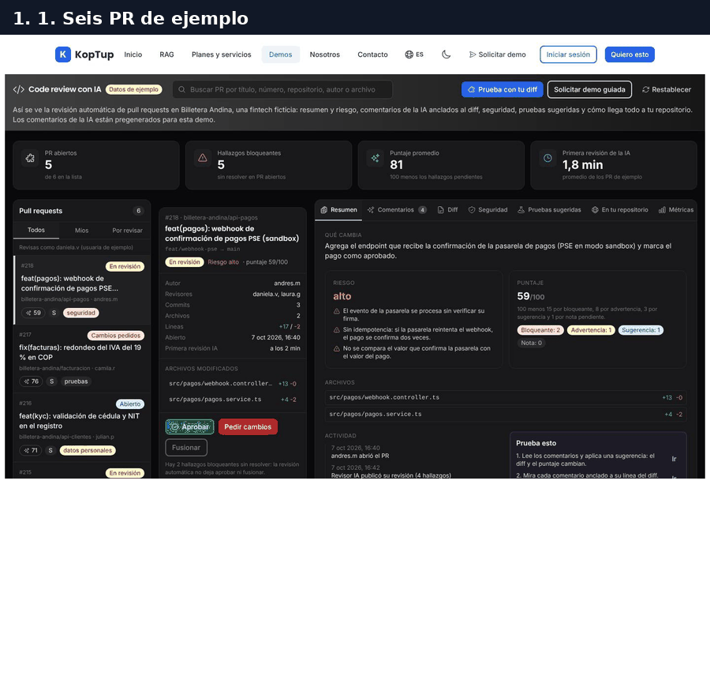

*Recorrido completo sobre el PR #218: comentarios, diff, simulación en GitLab, aprobar, fusionar y revisar un diff propio con las reglas locales.*

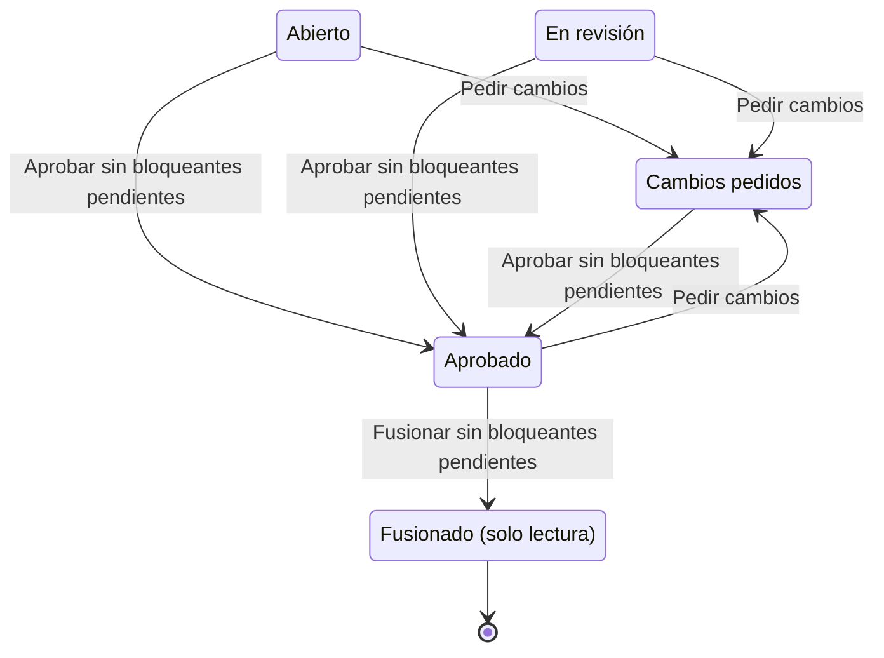

*Estados de un PR de ejemplo. Con un hallazgo bloqueante pendiente, «Aprobar» y «Fusionar» muestran un aviso y no cambian nada.*

### Paso 1. Lee los comentarios de la IA y aplica una sugerencia

Con el PR **#218 · feat(pagos): webhook de confirmación de pagos PSE (sandbox)** elegido (el primero de la lista), abre la pestaña **Comentarios**.

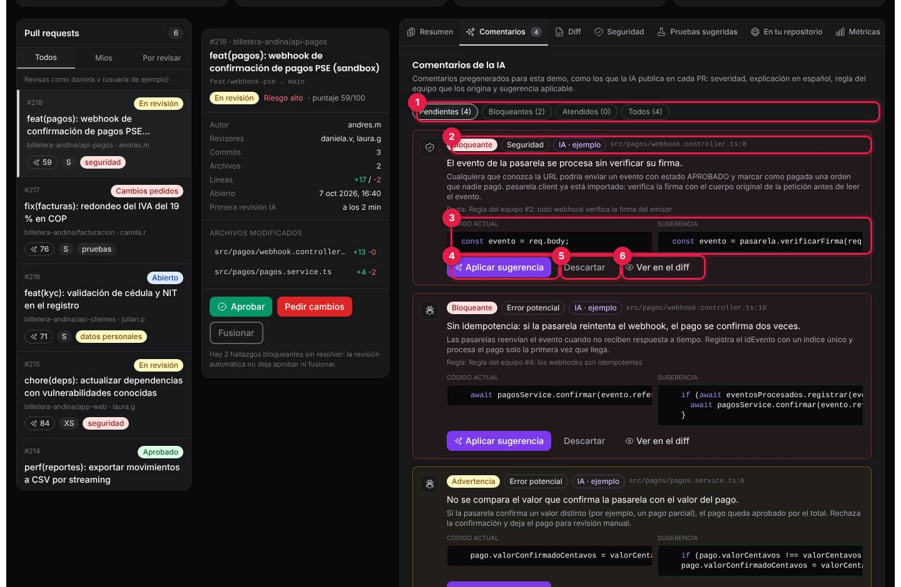

*Los cuatro comentarios pendientes del PR #218, ordenados de bloqueante a nota.*

1. **Filtros**: Pendientes (4), Bloqueantes (2), Atendidos (0) y Todos (4).
2. **Etiquetas del comentario**: severidad (Bloqueante, Advertencia, Sugerencia o Nota), categoría (Seguridad, Datos personales, Error potencial, Rendimiento, Estilo o Pruebas), origen («IA · ejemplo») y archivo con línea. Debajo, el mensaje, la explicación en español y la regla del equipo que lo origina («Regla del equipo #2: todo webhook verifica la firma del emisor»).
3. **Código actual** y **Sugerencia**, uno al lado del otro.
4. **Aplicar sugerencia**: reemplaza el código en el diff. Pulsa este botón: aparece «Sugerencia aplicada: el diff y el puntaje se actualizaron.» y el puntaje del PR sube de 59 a 74. Los comentarios sin sugerencia tienen **Marcar como resuelto**.
5. **Descartar**: lo saca de los pendientes. **Deshacer** lo reabre.
6. **Ver en el diff**: abre la pestaña **Diff** en esa línea.

Qué decir: «La IA explica el problema en español, cita la regla de tu equipo y propone el cambio; el desarrollador lo aplica con un clic».

### Paso 2. Mira cada comentario en su línea del diff

En el segundo comentario («Sin idempotencia…») pulsa **Ver en el diff**.

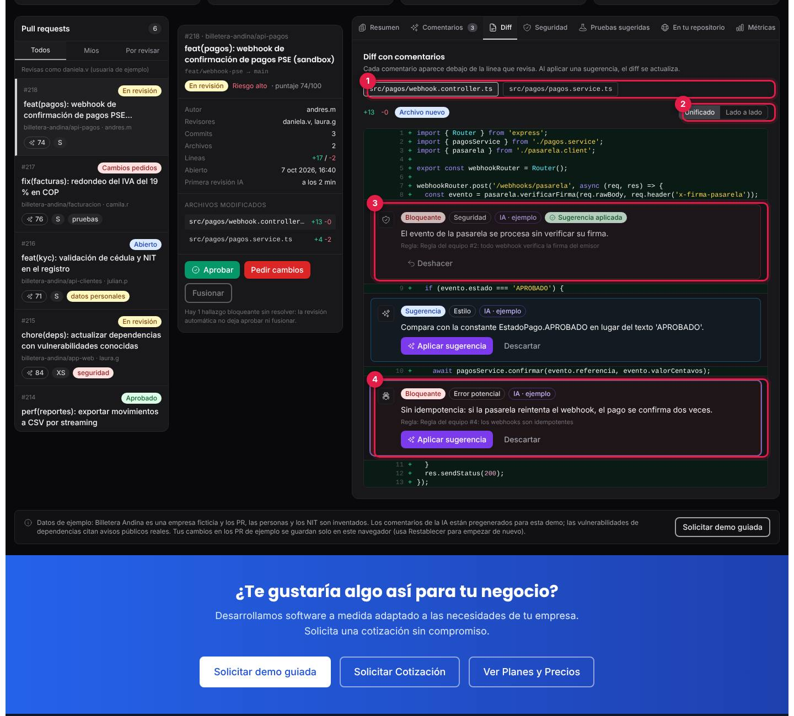

*Diff unificado del controlador del webhook con los comentarios debajo de cada línea.*

1. **Archivos del PR**: un botón por archivo.
2. **Unificado** o **Lado a lado** (ver [Diff](#diff)).
3. **Sugerencia aplicada**: la línea 8 ya muestra el código sugerido (verificación de la firma) y el comentario lleva la etiqueta verde; **Deshacer** lo revierte.
4. **Comentario destacado**: el que pediste ver, con un borde morado. Desde aquí también se aplica o se descarta.

### Paso 3. Muestra cómo llega a tu repositorio

Abre **En tu repositorio** y elige **GitLab**.

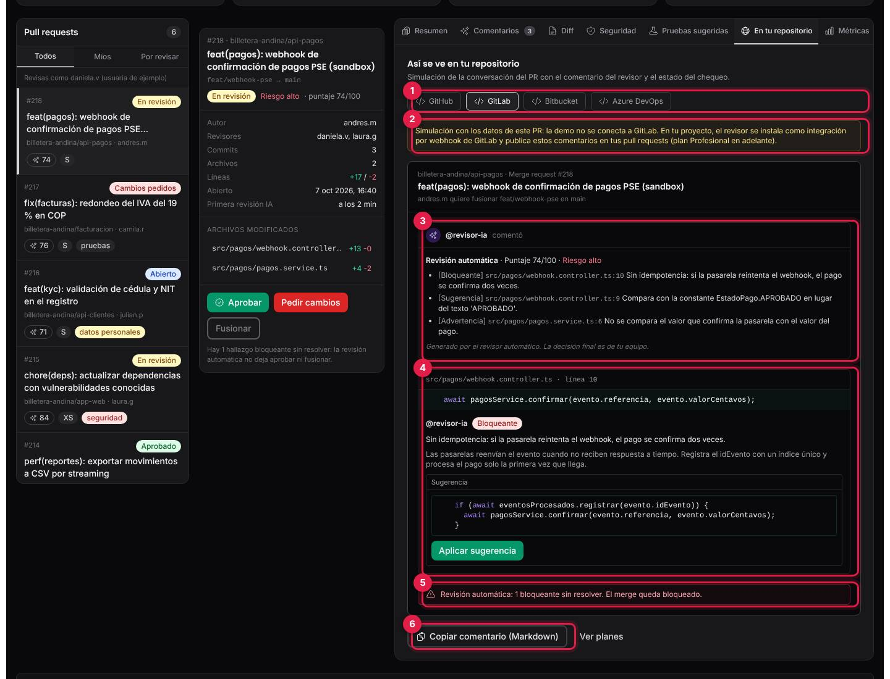

*Conversación simulada del merge request #218 en GitLab.*

1. **Plataforma**: GitHub, GitLab, Bitbucket o Azure DevOps. Cambian el nombre del bot (`revisor-ia[bot]`, `@revisor-ia`…), «Pull request» o «Merge request» y el texto del botón de la sugerencia.
2. **Aviso de simulación**: «la demo no se conecta a GitLab», cómo se instala en un proyecto (aquí, «integración por webhook de GitLab») y desde qué plan (GitHub desde el plan Básico; GitLab y Bitbucket desde el Profesional; Azure DevOps en Enterprise).
3. **Comentario resumen del revisor**: puntaje, riesgo y la lista de hallazgos pendientes.
4. **Comentario en línea** con la sugerencia y su botón (**Aplicar sugerencia** en GitLab, **Confirmar sugerencia** en GitHub, **Aplicar cambio** en Bitbucket y Azure DevOps). Pulsa el botón: aplica la sugerencia de idempotencia.
5. **Estado del chequeo**: «Revisión automática: 1 bloqueante sin resolver. El merge queda bloqueado.» Después de aplicar, cambia a «Revisión automática: sin bloqueantes. El chequeo pasa.» y el puntaje sube a 89.
6. **Copiar comentario (Markdown)**: copia el comentario resumen. Al lado, **Ver planes** lleva a `/services#otras-soluciones`.

Qué decir: «Tu equipo no cambia de herramienta: el comentario aparece en el PR y el chequeo bloquea el merge si hay algo grave».

### Paso 4. Aprueba y fusiona

Sin bloqueantes pendientes, pulsa **Aprobar** en el panel del PR.

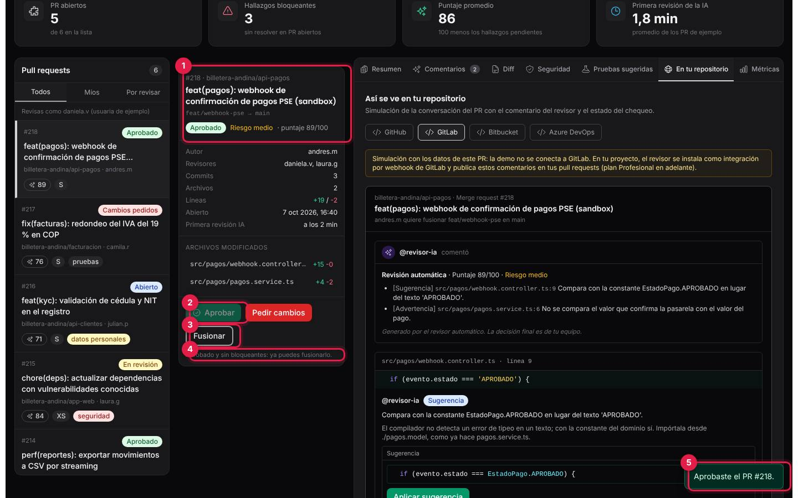

*El PR #218 aprobado: riesgo medio, puntaje 89/100 y «Fusionar» habilitado.*

1. **Encabezado del PR**: estado «Aprobado», riesgo y puntaje.
2. **Aprobar**: queda desactivado una vez aprobado.
3. **Fusionar**: se habilita al aprobar. Púlsalo: aparece «PR #218 fusionado en main.», el estado pasa a **Fusionado** y el PR queda en solo lectura («Este PR ya se fusionó: queda en solo lectura.»).
4. **Nota de estado**: «Aprobado y sin bloqueantes: ya puedes fusionarlo.»
5. **Aviso**: «Aprobaste el PR #218.»

Para mostrar el bloqueo, elige el PR **#216** y pulsa **Aprobar**: sale «No se puede: hay 1 hallazgo bloqueante sin resolver.» Todo queda en la **Actividad** del Resumen («daniela.v aprobó el PR», «daniela.v fusionó el PR en main»).

### Paso 5. Pega tu propio diff

Pulsa **Prueba con tu diff** (arriba) y luego **Cargar ejemplo**.

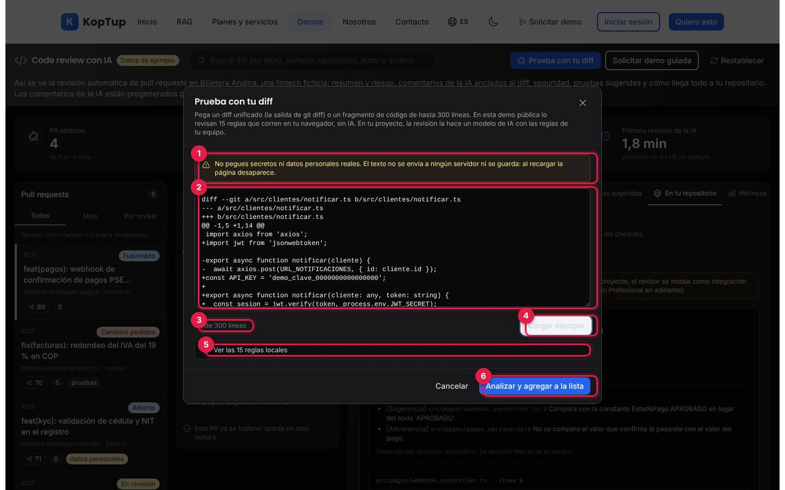

*Ventana «Prueba con tu diff» con el diff de ejemplo cargado.*

1. **Aviso**: «No pegues secretos ni datos personales reales. El texto no se envía a ningún servidor ni se guarda».
2. **Cuadro de texto**: acepta un diff unificado (la salida de `git diff`) o un fragmento de código.
3. **Contador de líneas** («20 de 300 líneas»); se pone en rojo si pasas el máximo.
4. **Cargar ejemplo**: un diff de `src/clientes/notificar.ts` con varios problemas a propósito.
5. **Ver las 15 reglas locales**: despliega la lista con su severidad y cuáles traen corrección automática.
6. **Analizar y agregar a la lista**. **Cancelar**, la **×**, Escape o un clic fuera cierran la ventana.

Si el texto está vacío, pasa de 300 líneas o es demasiado largo, o el diff no tiene líneas agregadas ni eliminadas, la ventana lo dice y no analiza.

### Paso 6. Revisa los hallazgos de las reglas locales

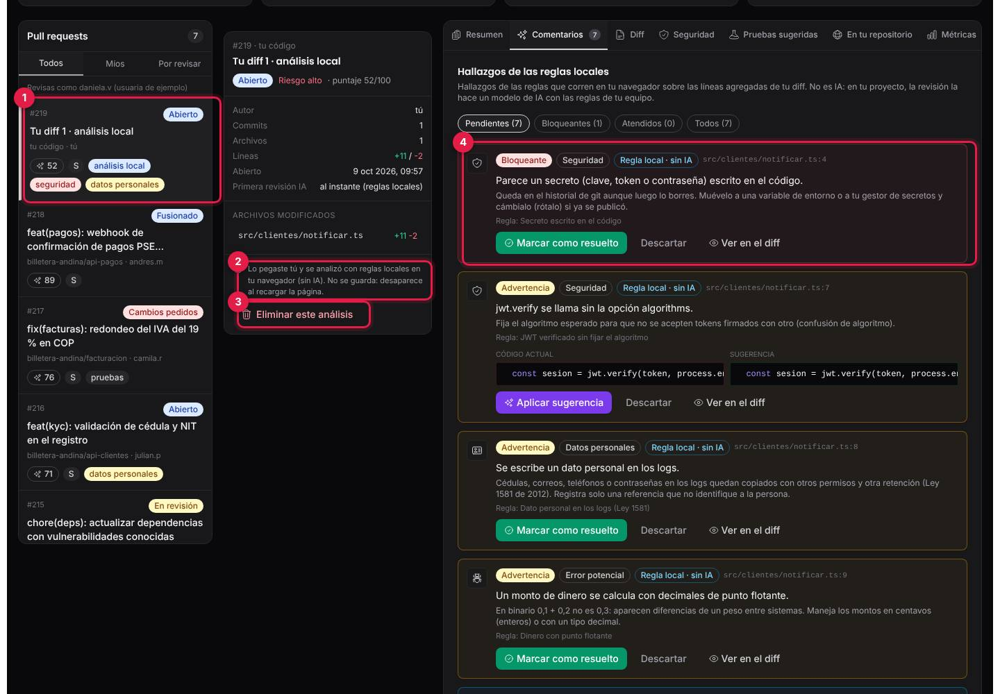

*El diff pegado aparece como PR #219 «Tu diff 1 · análisis local» con 7 hallazgos.*

1. **PR nuevo en la lista** con la etiqueta «análisis local» (el número sigue al mayor de la lista). La demo lo abre en **Comentarios** y avisa «Análisis local listo: 7 hallazgos.»
2. **Nota**: «Lo pegaste tú y se analizó con reglas locales en tu navegador (sin IA). No se guarda: desaparece al recargar la página.»
3. **Eliminar este análisis**: lo quita de la lista.
4. **Hallazgos** con el origen «Regla local · sin IA». Con el ejemplo salen 7: un secreto escrito en el código (bloqueante), `jwt.verify` sin fijar el algoritmo, un dato personal en los logs, un monto con decimales de punto flotante, el tipo `any`, una comparación con `==` y una URL con `http://`.

Los hallazgos se aplican, resuelven o descartan igual que los de la IA, y se ven en **Diff**, **Seguridad** y **En tu repositorio**. Los diff propios no se aprueban ni se fusionan.

Qué decir: «Aquí revisas tu código con reglas simples; en tu proyecto, la revisión la hace un modelo de IA con las reglas de tu equipo». Cierre sugerido: **Métricas** y la calculadora de horas, y luego **Solicitar demo guiada**.

---

## Pantallas y funciones

Una sola página: encabezado, cuatro indicadores, la lista de PR, el panel del PR elegido y siete pestañas (**Resumen**, **Comentarios**, **Diff**, **Seguridad**, **Pruebas sugeridas**, **En tu repositorio** y **Métricas**). Abajo, una nota de datos de ejemplo.

### Encabezado e indicadores

| Elemento | Qué hace |
|---|---|
| **Code review con IA** y **Datos de ejemplo** | Título e insignia fija. |
| **Buscar PR…** | Filtra la lista por título, número, repositorio, autor, rama o archivo. |
| **Prueba con tu diff** | Abre la ventana del [paso 5](#paso-5-pega-tu-propio-diff). |
| **Solicitar demo guiada** | Va al formulario de contacto `/contact?service=code-review-ia` (ver [Acceso](#acceso)). |
| **Restablecer** | Devuelve los PR de ejemplo a su estado inicial, borra los diff propios y avisa «La demo volvió a su estado inicial.» |
| **PR abiertos** | PR no fusionados (5 de 6 al empezar). |
| **Hallazgos bloqueantes** | Bloqueantes pendientes en PR abiertos (5 al empezar). |
| **Puntaje promedio** | Promedio de los puntajes de la lista (81 al empezar). |
| **Primera revisión de la IA** | Promedio de los minutos de ejemplo hasta la primera revisión (1,8 min). |

Los indicadores se recalculan con cada cosa que haces.

### Lista de pull requests y panel del PR

- **Filtros**: **Todos**, **Míos** (los de `daniela.v`, la usuaria con la que «revisas», más tus diff) y **Por revisar** (los que tienen a `daniela.v` como revisora y no están aprobados ni fusionados). Si nada coincide, aparece **Limpiar búsqueda y filtro**.
- Cada PR muestra número, estado, título, repositorio y autor, puntaje, tamaño (XS a XL según las líneas cambiadas) y etiquetas de lo pendiente (seguridad, datos personales, rendimiento, pruebas o «sin pendientes»).
- Los seis PR de ejemplo: **#218** webhook de pagos PSE (En revisión), **#217** redondeo del IVA del 19 % en COP (Cambios pedidos), **#216** validación de cédula y NIT (Abierto), **#215** dependencias con vulnerabilidades (En revisión), **#214** exportar movimientos a CSV por streaming (Aprobado; su autora es `daniela.v`) y **#213** reglas del equipo para el revisor (Fusionado, sin hallazgos).
- **Panel del PR**: repositorio, título, rama → `main`, estado, riesgo y puntaje; autor, revisores, commits, archivos, líneas, fecha y primera revisión. Tocar un archivo abre su diff.
- **Aprobar**, **Pedir cambios** y **Fusionar**, con estas reglas: no se aprueba ni se fusiona con bloqueantes pendientes; primero hay que aprobar para fusionar («Primero hay que aprobar el PR.»); en el PR #214 no puedes aprobar porque eres la autora («lo aprueba otra persona del equipo»), pero sí fusionarlo; un PR fusionado queda en solo lectura.
- **Puntaje**: 100 menos 15 por bloqueante, 8 por advertencia, 3 por sugerencia y 1 por nota pendiente. **Riesgo**: alto si queda un bloqueante, medio si queda una advertencia y bajo en otro caso.

### Resumen

«Qué cambia» (descripción del PR), **Riesgo** con hasta tres motivos, **Puntaje** con la fórmula y el conteo por severidad, **Archivos** (abren el diff), **Actividad** (quién abrió, revisó, aprobó o aplicó cada cosa, con fecha y hora) y **Prueba esto** con los cuatro atajos **Ir** (Comentarios, Diff, En tu repositorio y Prueba con tu diff). Se ve en la [vista general](#guía-de-la-demo-code-review-con-ia).

### Comentarios

Ver el [paso 1](#paso-1-lee-los-comentarios-de-la-ia-y-aplica-una-sugerencia). Los estados de un comentario son Pendiente, Sugerencia aplicada, Descartado y Resuelto. El comentario de categoría Pruebas (por ejemplo, «Faltan pruebas con valores límite» del #217) se marca como resuelto solo cuando agregas una prueba sugerida.

### Diff

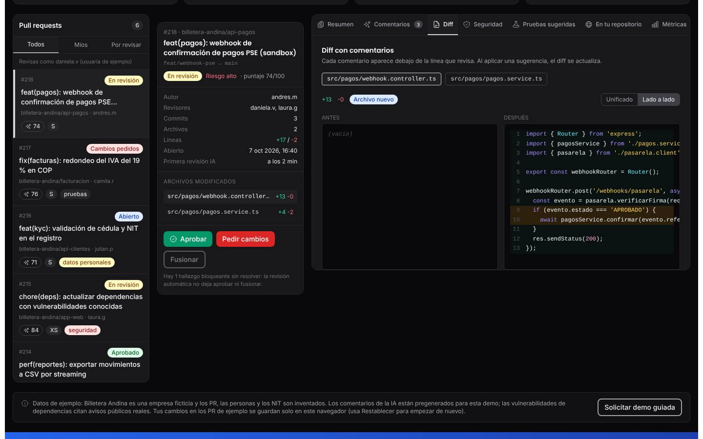

*Vista «Lado a lado» del mismo archivo: antes y después, con las líneas comentadas resaltadas.*

- **Unificado**: líneas agregadas en verde y eliminadas en rojo, con los números de línea viejo y nuevo, y cada comentario debajo de su línea (los descartados no se muestran). Ver el [paso 2](#paso-2-mira-cada-comentario-en-su-línea-del-diff).
- **Lado a lado**: «Antes» y «Después»; las líneas con comentarios pendientes se resaltan en ámbar, pero los comentarios no se muestran en esta vista.
- Insignias **Archivo nuevo** y **Prueba agregada** (cuando agregas una prueba sugerida, aparece como un archivo más del diff).

### Seguridad

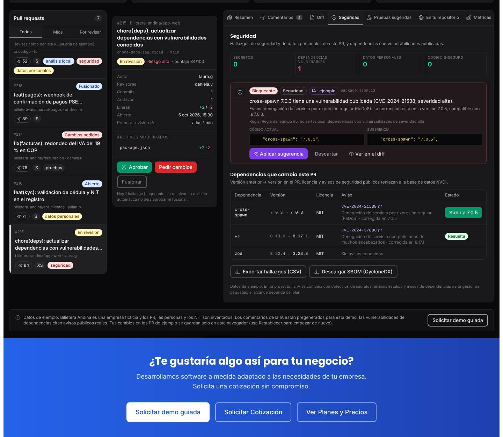

*Pestaña Seguridad del PR #215: un hallazgo bloqueante y la tabla de dependencias con sus avisos.*

- Cuatro contadores: **Secretos**, **Dependencias vulnerables**, **Datos personales** y **Código inseguro**.
- Los comentarios de Seguridad y Datos personales del PR, con las mismas acciones de la pestaña Comentarios.
- **Dependencias que cambia este PR** (solo en #215): versión anterior y nueva, licencia y aviso público con enlace a la base NVD. En el ejemplo, `cross-spawn` 7.0.3 tiene el aviso CVE-2024-21538 y el botón **Subir a 7.0.5** (aplica la sugerencia del comentario); `ws` sube a 8.17.1 y su aviso CVE-2024-37890 queda **Resuelta**; `zod` no tiene avisos.
- **Exportar hallazgos (CSV)** descarga `code-review-pr-<número>-seguridad.csv`; **Descargar SBOM (CycloneDX)** descarga `sbom-pr-<número>.cdx.json` con las dependencias y las vulnerabilidades sin resolver.

### Pruebas sugeridas

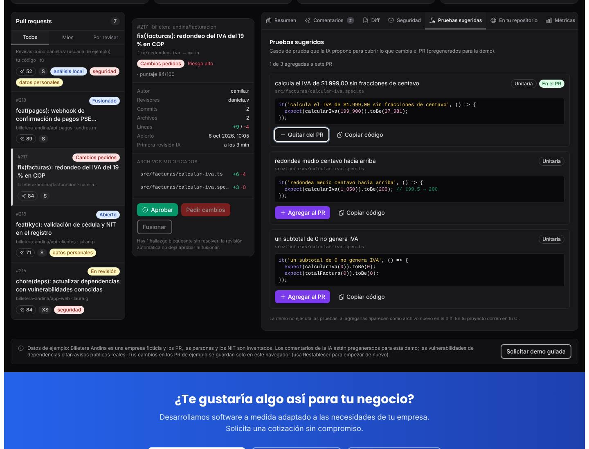

*Tres pruebas sugeridas para el PR #217; la primera ya está agregada al PR.*

Cada prueba tiene nombre, archivo, tipo (Unitaria o Integración) y código. **Agregar al PR** la suma al diff como archivo nuevo («Prueba agregada al PR en src/facturas/calcular-iva.spec.ts.»), **Quitar del PR** la retira y **Copiar código** la copia. La demo no ejecuta las pruebas. Los PR #215 y #213 no tienen pruebas sugeridas, y los diff propios tampoco («Las reglas locales no generan pruebas»).

### En tu repositorio

Ver el [paso 3](#paso-3-muestra-cómo-llega-a-tu-repositorio). El comentario en línea toma el primer hallazgo pendiente que tenga sugerencia (o el primero pendiente); en un PR fusionado el botón de aplicar no aparece.

### Métricas

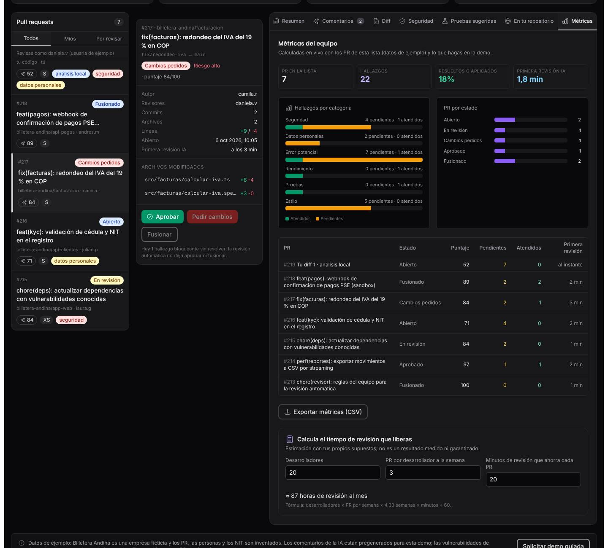

*Métricas calculadas con los PR de la lista, la tabla por PR y la calculadora de horas.*

- **PR en la lista**, **Hallazgos**, **Resueltos o aplicados** (porcentaje) y **Primera revisión IA**.
- **Hallazgos por categoría** (atendidos y pendientes) y **PR por estado**.
- Tabla por PR con estado, puntaje, pendientes, atendidos y primera revisión; **Exportar métricas (CSV)** descarga `code-review-metricas-equipo.csv`.
- **Calcula el tiempo de revisión que liberas**: desarrolladores (20), PR por desarrollador a la semana (3) y minutos que ahorra cada PR (20) dan «≈ 87 horas de revisión al mes» con la fórmula desarrolladores × PR por semana × 4,33 semanas × minutos ÷ 60. La demo aclara que es una estimación con tus supuestos, no un resultado medido.

### En el celular

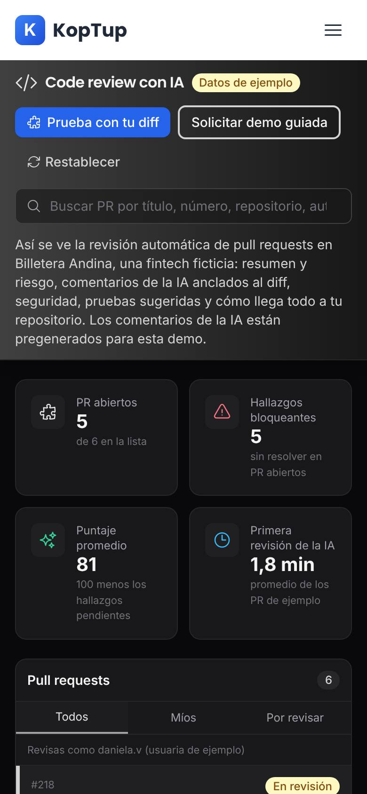

*La demo en un teléfono (390 px): botones del encabezado, buscador, indicadores de a dos y la lista de PR.*

En pantallas pequeñas todo va en una columna: encabezado, indicadores de a dos, lista de PR, panel del PR y pestañas (con desplazamiento lateral). El código del diff y las tablas se desplazan de lado sin cortar los comentarios. La página no se desborda a lo ancho.

---

## Qué es real y qué es simulado

| Parte | Real o simulado | Detalle |
|---|---|---|
| Empresa, PR, personas, código y fechas | **Datos de ejemplo** | «Billetera Andina» es ficticia; los PR son de octubre de 2026. |
| Comentarios de la IA y pruebas sugeridas | **Pregenerados** | Escritos para la demo; no se llama a ningún modelo de IA. |
| Aplicar sugerencias, diff, puntaje, riesgo y estados del PR | **Real (en el navegador)** | El diff se recalcula con el código sugerido y los indicadores cambian. |
| Analizador de «Prueba con tu diff» | **Real, sin IA** | 15 reglas por patrón que revisan solo las líneas agregadas; pueden dar falsos positivos. El texto no sale del navegador. |
| Avisos de dependencias (CVE) | **Reales** | Citan avisos públicos y enlazan a NVD; las dependencias del PR son de ejemplo. |
| CSV y SBOM CycloneDX | **Reales** | Se generan en el navegador con los datos de la demo. |
| GitHub, GitLab, Bitbucket y Azure DevOps | **Simulados** | La demo no se conecta a ninguna plataforma. |
| Ejecución de pruebas | **No existe** | Las pruebas agregadas solo aparecen en el diff. |
| Calculadora de horas | **Estimación** | Fórmula con tus supuestos. |
| Dónde se guardan tus cambios | **Solo en este navegador** | `localStorage`: el estado de los PR de ejemplo y los valores de la calculadora. Los diff propios no se guardan. |
| Backend | **No se usa** | La página no hace llamadas al servidor. |

---

## Acceso

**Cómo lo ve un visitante.** La demo es **Abierta**: en `/demo` su tarjeta («Code Review IA», insignias «Abierta» y «DevTools») tiene **Probar Demo**, que abre `/demo/code-review-ia` directamente, y **Solicitar demo guiada**, que lleva a `/solicitar-demo?demos=code-review-ia`. No hay pantalla de acceso ni hace falta cuenta.

**Cómo se pide una demo guiada.** Hay dos caminos con destinos distintos:

- Los botones **Solicitar demo guiada** del encabezado y de la nota final de la demo abren el formulario de contacto (`/contact?service=code-review-ia`) con el servicio «code review ia» y el mensaje «Hola, me interesa cotizar code review ia.» ya escritos. Ese mensaje llega a **Admin › Contactos**.
- El bloque final del sitio, «¿Te gustaría algo así para tu negocio?», tiene **Solicitar demo guiada** hacia `/solicitar-demo?demos=code-review-ia` (llega a **Admin › Solicitudes de demo**), **Solicitar Cotización** (`/contact`) y **Ver Planes y Precios**.

**Cómo la gestiona el admin.** Como la demo es abierta, no hace falta conceder acceso para usarla; la solicitud o el contacto sirven para agendar la presentación. Un admin puede cambiar el modo en **Admin › Catálogo de demos** (por ejemplo, a «Con solicitud»); desde ese momento el visitante sin acceso verá la pantalla de acceso. Detalle en el [Manual del administrador](Doc-06-Manual-del-Administrador.md) y en [Flujos del visitante](Doc-04-Flujos-del-Visitante.md).

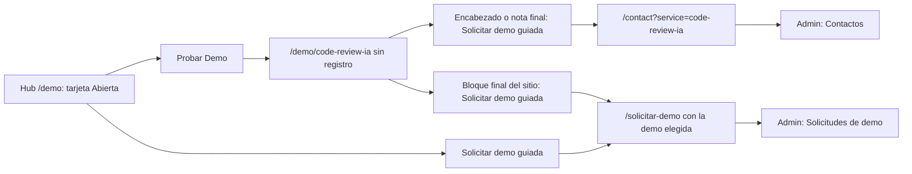

*Desde la demo, el mismo botón lleva a dos formularios distintos según dónde lo pulses.*

---

## Limitaciones conocidas

1. **Dos «Solicitar demo guiada» con destinos distintos**: el del encabezado y el de la nota final abren el formulario de cotización (`/contact`) y el pedido llega a Contactos con el servicio en minúsculas («code review ia»); el del bloque final del sitio abre `/solicitar-demo` y llega a Solicitudes de demo.
2. **La IA no corre en la demo**: los comentarios y las pruebas están escritos de antemano, y el análisis de tu diff usa reglas por patrón (la propia demo lo dice). La tarjeta del hub promete más de lo que se ve: «SAST + DAST + SCA + SBOM + license compliance» y «Test generation auto y refactoring suggestions con LLM»; la demo muestra hallazgos de ejemplo, licencias y SBOM de las dependencias de un PR, pero no DAST, ni generación de pruebas, ni refactorizaciones en vivo.
3. **Tu diff desaparece al recargar** y no recibe pruebas sugeridas ni se puede aprobar o fusionar. Solo se revisan las líneas agregadas.
4. **Fusionar no tiene vuelta atrás** salvo **Restablecer**, que devuelve todos los PR de ejemplo a su estado inicial.
5. **Vista «Lado a lado» sin comentarios**: solo resalta las líneas comentadas; para leer o aplicar comentarios hay que volver a **Unificado**.
6. **Concordancia en Métricas**: «0 pendientes · 1 atendidos».
7. **Fechas mezcladas**: los PR de ejemplo tienen fechas fijas de octubre de 2026, pero lo que haces queda en la Actividad con la fecha y hora reales.
8. **El estado vive en un solo navegador**: otra persona u otro equipo ve los datos de ejemplo; en una ventana privada o con el almacenamiento bloqueado, la demo funciona pero no recuerda los cambios.

Al recorrerla no se encontraron botones sin acción ni errores en la consola.
