# Guía de la demo: Gestión de proyectos con portal de cliente

> Ruta `/demo/control-proyectos` · Modo de acceso: **Abierta** · Tipo: **datos de ejemplo** (todo corre en el navegador; avisos, facturación y pagos simulados; sin backend ni IA) · Plan del producto: [Gestión de proyectos (con portal de cliente)](Producto-gestion-proyectos.md)

**Resumen.** Es una herramienta de proyectos completa para empresas que trabajan por encargo: tablero, lista, calendario, cronograma con dependencias, horas y presupuesto por hito, y un **portal donde el cliente ve el avance y aprueba entregables**. Trae tres sectores de ejemplo (construcción, agencia creativa y software), cada uno con su empresa ficticia, su equipo y tres proyectos. Está pensada para constructoras, agencias, empresas de software y oficinas de proyectos que hoy reportan por correo y Excel. Todo lo que haces funciona de verdad y se guarda solo en tu navegador.

**En esta página:** [Recorrido sugerido](#recorrido-sugerido-demo-comercial-de-5-minutos) · [Pantallas y funciones](#pantallas-y-funciones) · [Qué es real y qué es simulado](#qué-es-real-y-qué-es-simulado) · [Acceso](#acceso) · [Limitaciones conocidas](#limitaciones-conocidas)

*Vista inicial (sector Construcción): franja «Datos de ejemplo» con el selector de sector, barra lateral de proyectos, encabezado del proyecto con su semáforo, franja del hito actual, la guía «Prueba esto en 2 minutos» y el tablero.*

---

## Recorrido sugerido (demo comercial de 5 minutos)

Este guion sigue la guía **Prueba esto en 2 minutos** que trae la propia demo: cada tarjeta «Paso N» lleva directo a la pantalla correspondiente. Empieza con los datos limpios (si alguien ya usó la demo en ese navegador, pulsa **Restablecer datos** arriba a la derecha). Las fechas se calculan desde el día en que abres la demo; las cifras de abajo son de nuestra prueba del 9 de octubre de 2026 en el sector Construcción.

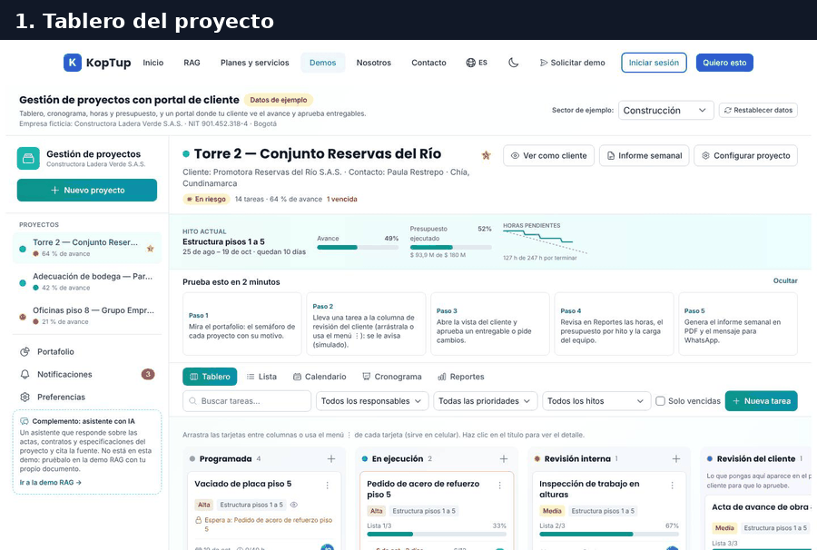

*Recorrido completo: portafolio, mover una tarea a revisión del cliente, aprobarla en el portal, reportes, informe semanal y las notificaciones que quedaron.*

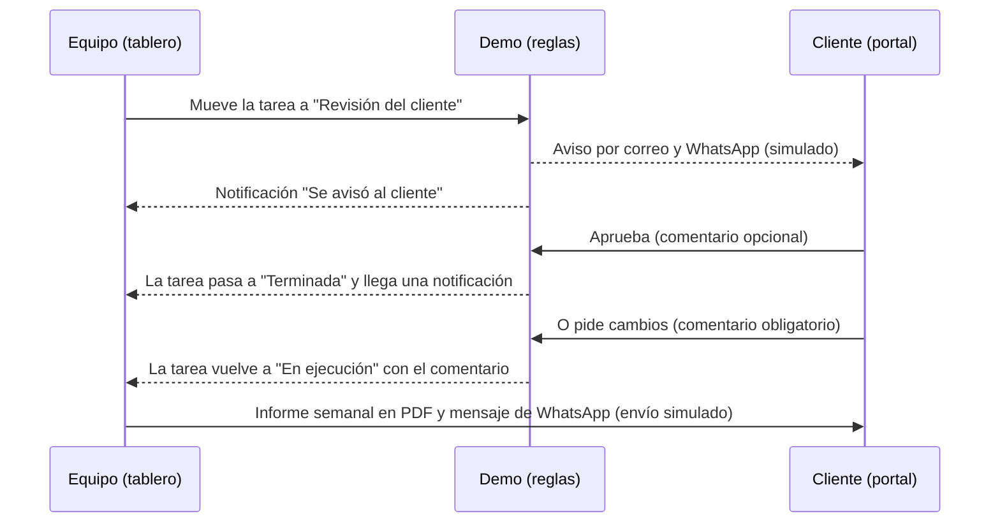

*El ciclo de aprobación que muestra la demo. Las automatizaciones se pueden apagar en Preferencias.*

### Paso 1. Portafolio: el semáforo de cada proyecto con su motivo

Pulsa **Paso 1** en la guía (o **Portafolio** en la barra lateral).

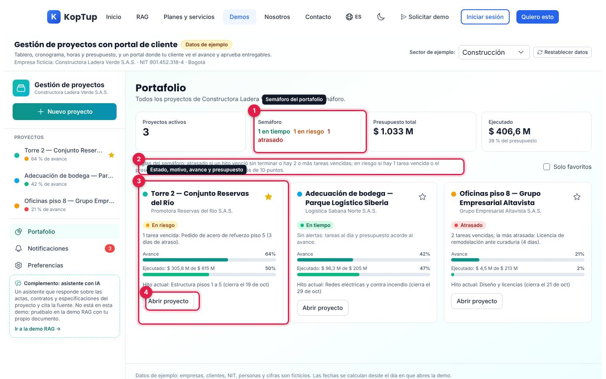

*Los tres proyectos de Constructora Ladera Verde S.A.S.: uno en tiempo, uno en riesgo y uno atrasado.*

1. **Semáforo**: cuántos proyectos están en tiempo, en riesgo y atrasados. Al lado, presupuesto total ($ 1.033 M) y ejecutado ($ 406,6 M, 39 %).
2. **Reglas del semáforo**, escritas en pantalla: atrasado si un hito venció sin terminar o hay 2 o más tareas vencidas; en riesgo si hay 1 tarea vencida o el presupuesto ejecutado supera el avance en más de 10 puntos.
3. **Tarjeta del proyecto**: estado con su motivo («1 tarea vencida: Pedido de acero de refuerzo piso 5 (3 días de atraso)»), avance, presupuesto ejecutado e hito actual. La estrella marca favoritos (y el filtro **Solo favoritos**).
4. **Abrir proyecto**: vuelve al tablero de ese proyecto.

Qué decir: «El gerente ve en un minuto qué proyecto se está atrasando y por qué, sin pedir informes».

### Paso 2. Lleva una tarea a revisión del cliente

Abre **Torre 2 — Conjunto Reservas del Río** y pulsa **Paso 2**: la demo lleva la vista a la columna «Revisión del cliente» y la resalta. Arrastra una tarjeta hasta ella o usa su menú ⋮.

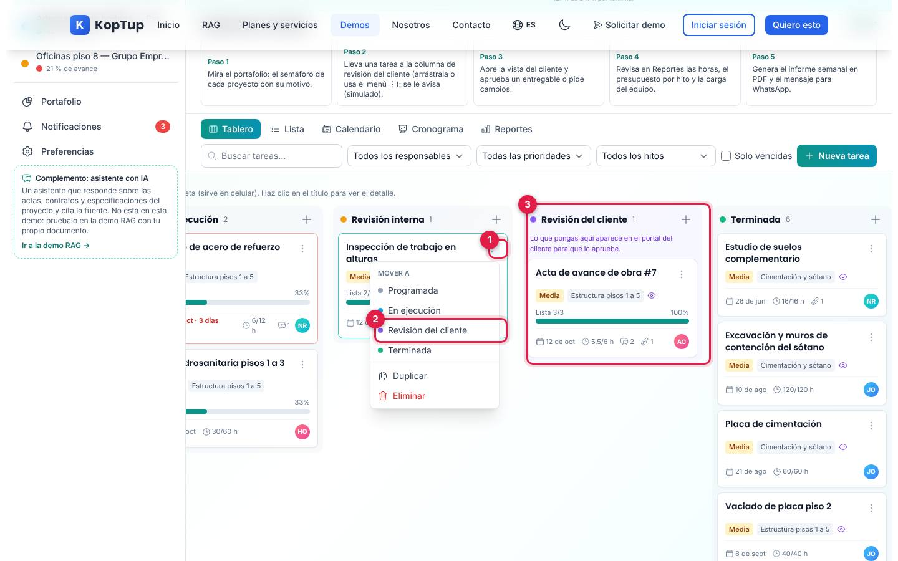

*Menú de la tarjeta «Inspección de trabajo en alturas» con la opción «Revisión del cliente».*

1. **Menú ⋮** de la tarjeta: sirve también en celular, donde no se puede arrastrar.
2. **Mover a › Revisión del cliente** (también trae Duplicar y Eliminar con confirmación).
3. **Columna del cliente**: «Lo que pongas aquí aparece en el portal del cliente para que lo apruebe». Al llegar, la tarea queda visible para el cliente y, con la automatización encendida, se registra un aviso por correo y por WhatsApp al contacto del cliente (Paula Restrepo) y te llega una notificación. Los avisos son simulados.

### Paso 3. Abre la vista del cliente y aprueba un entregable

Pulsa **Ver como cliente** (o **Paso 3**). Es lo que vería el cliente en su portal.

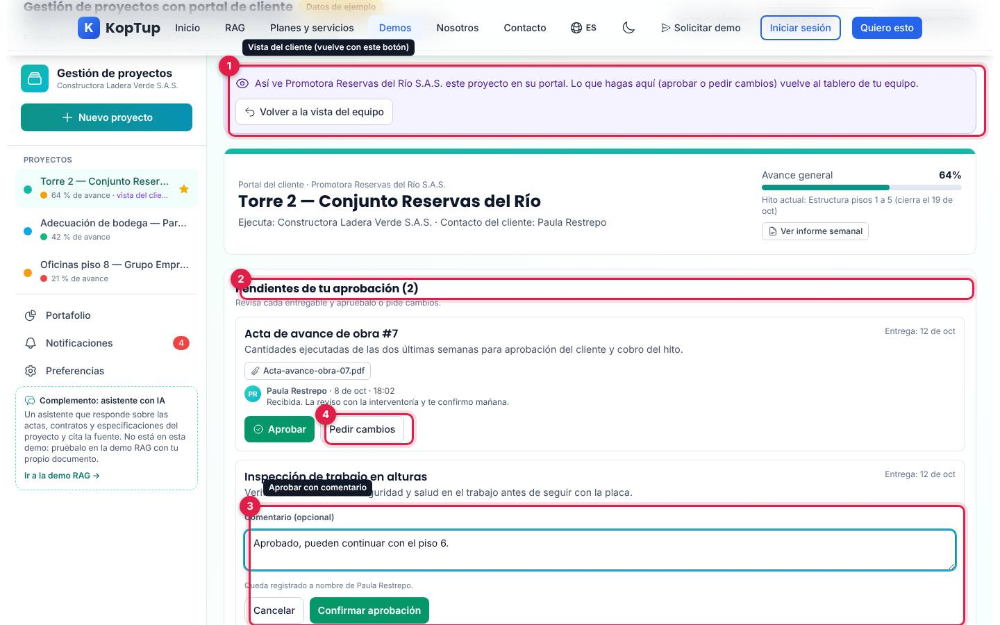

*Portal del cliente de Promotora Reservas del Río S.A.S. con dos entregables pendientes; en el segundo se está escribiendo la aprobación.*

1. **Franja violeta**: recuerda que es la vista del cliente; **Volver a la vista del equipo** regresa al tablero.
2. **Pendientes de tu aprobación (2)**: cada entregable con descripción, fecha de entrega, documentos y los comentarios previos del cliente.
3. **Aprobar**: abre un comentario opcional y **Confirmar aprobación**. «Queda registrado a nombre de Paula Restrepo».
4. **Pedir cambios**: exige escribir qué cambiar; la tarea vuelve a «En ejecución» con ese comentario.

Al confirmar aparece «Entregable aprobado: pasó a terminada en el tablero del equipo», el avance general sube (de 64 % a 65 % en la prueba) y la tarea pasa a **Entregado recientemente** con la marca «Aprobado». Más abajo el portal muestra el avance por hito, próximas entregas (30 días), documentos para descargar, actualizaciones recientes y «Avisos que recibió el cliente» (simulados).

Qué decir: «El cliente aprueba en un clic, queda constancia y su equipo se entera sin una sola llamada».

### Paso 4. Reportes: horas, presupuesto por hito y carga del equipo

Vuelve a la vista del equipo y pulsa **Paso 4** (o la pestaña **Reportes**).

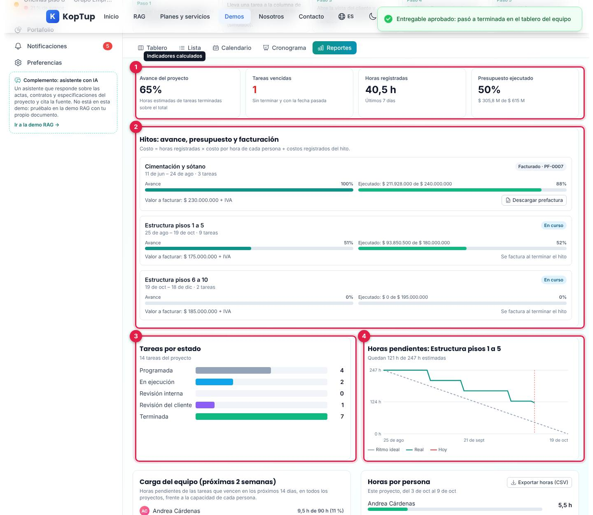

*Reportes de Torre 2 después de la aprobación.*

1. **Indicadores**: avance del proyecto (horas estimadas de tareas terminadas sobre el total), tareas vencidas, horas registradas en los últimos 7 días y presupuesto ejecutado.
2. **Hitos: avance, presupuesto y facturación**: por hito, avance, costo ejecutado frente al presupuesto (costo = horas × costo por hora de cada persona + costos registrados) y valor a facturar. Un hito facturado muestra su prefactura (`PF-0007`) para descargar; uno en curso dice «Se factura al terminar el hito».
3. **Tareas por estado**: barras con el conteo de cada columna.
4. **Horas pendientes** del hito actual: ritmo ideal frente a real, con la línea de hoy.

Más abajo: **Carga del equipo** (horas pendientes de los próximos 14 días frente a la capacidad de cada persona, en todos los proyectos), **Horas por persona** de la semana con **Exportar horas (CSV)** y **Costos registrados** (ver [Reportes](#reportes)).

### Paso 5. Genera el informe semanal

Pulsa **Paso 5** (o **Informe semanal** en el encabezado del proyecto).

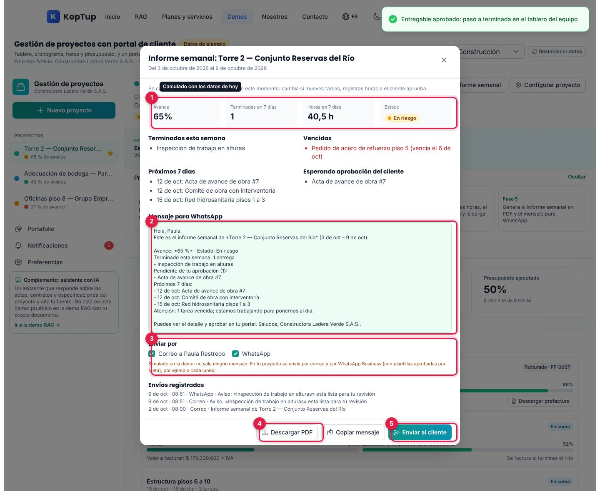

*Informe semanal de Torre 2 del 3 al 9 de octubre de 2026, calculado con los datos del momento.*

1. **Resumen**: avance (65 %), terminadas en 7 días, horas en 7 días y estado. Debajo, terminadas esta semana, vencidas, próximos 7 días y lo que espera aprobación del cliente.
2. **Mensaje para WhatsApp**: el mismo informe en texto, listo para enviar.
3. **Enviar por**: correo al contacto del cliente y WhatsApp, con la nota «Simulado en la demo: no sale ningún mensaje».
4. **Descargar PDF**: genera `informe-semanal-<proyecto>-<fecha>.pdf` en el navegador (con la marca «Documento de ejemplo… No tiene validez»).
5. **Enviar al cliente**: registra el envío («Informe registrado como enviado a Paula Restrepo (simulado)») en «Envíos registrados», en el portal y en las notificaciones.

**Copiar mensaje** copia el texto al portapapeles; si el navegador no lo permite, avisa que lo selecciones y lo copies a mano.

Para cerrar, abre **Notificaciones**: ahí queda todo lo que pasó (el aviso al cliente, su aprobación, el informe enviado, menciones y tareas vencidas que la automatización subió a prioridad alta).

---

## Pantallas y funciones

### Franja superior, barra lateral y encabezado

| Elemento | Qué hace |
|---|---|
| **Datos de ejemplo** | Insignia; al pasar el mouse explica que empresas, NIT, personas y cifras son ficticios y que todo funciona en el navegador. Debajo, la empresa ficticia del sector con su NIT y ciudad. |
| **Sector de ejemplo** | Construcción (Constructora Ladera Verde S.A.S., Bogotá), Agencia creativa (Estudio Ceiba Creativa S.A.S., Medellín) o Software (Nodo Sur Software S.A.S., Cali). Cada sector tiene su equipo, sus proyectos y sus nombres de columnas; los cambios de cada uno se conservan al cambiar de sector. |
| **Restablecer datos** | Pide confirmación y regenera los tres sectores con la fecha de hoy. |
| **Barra lateral** | **Nuevo proyecto**, la lista de proyectos (favoritos primero, con semáforo y avance), **Portafolio**, **Notificaciones** (con el número sin leer) y **Preferencias**. |
| **Complemento: asistente con IA** | Explica que el asistente sobre actas y contratos no está en esta demo y enlaza a la demo RAG (`/demo/chatbot`, ver su [guía](Guia-Demo-chatbot.md)). |
| **Encabezado del proyecto** | Nombre, estrella de favorito, cliente, contacto y ciudad, semáforo, número de tareas, avance y vencidas; botones **Ver como cliente**, **Informe semanal** y **Configurar proyecto**. |
| **Franja del hito actual** | Nombre y fechas del hito o sprint, días que quedan, avance, presupuesto ejecutado y un mini gráfico de horas pendientes. En proyectos por sprints aparece **Cerrar sprint**: las tareas sin terminar pasan al siguiente sprint y el sprint queda cerrado (y facturable). |
| **Guía «Prueba esto en 2 minutos»** | Cinco pasos con atajo; **Ocultar** la esconde y el navegador lo recuerda. |
| **Pie** | Recuerda que los datos son de ejemplo, que los cambios se guardan solo en este navegador por 7 días, que avisos, facturación y pagos son simulados y que la demo no usa IA. |

Los nombres de las columnas cambian por sector:

| Estado | Construcción | Agencia creativa | Software |
|---|---|---|---|
| 1 | Programada | Por hacer | Por hacer |
| 2 | En ejecución | En producción | En desarrollo |
| 3 | Revisión interna | Revisión interna | En pruebas |
| 4 | Revisión del cliente | Aprobación del cliente | Validación del cliente |
| 5 | Terminada | Terminada | Terminada |

### Tablero, filtros y nueva tarea

Ver el [paso 2](#paso-2-lleva-una-tarea-a-revisión-del-cliente).

- **Filtros** (arriba de todas las vistas menos Reportes): buscar por texto, responsable (o sin responsable), prioridad, hito y **Solo vencidas**; **Limpiar** y el aviso «Mostrando N de M tareas». En celular se pliegan en el botón **Filtros**.
- **Tarjeta**: prioridad, hito, ojo si es visible para el cliente, «Aprobada por el cliente», «Espera a: …» si depende de otra tarea sin terminar, lista de chequeo con porcentaje, vencimiento (en rojo con los días de atraso), horas registradas sobre estimadas, comentarios, adjuntos y responsable. Clic en el título abre el [detalle](#detalle-de-una-tarea).
- **Arrastrar y soltar** entre columnas o **⋮ › Mover a**. **+** en cada columna o **Nueva tarea** abren el formulario: título, descripción, responsable, estado, inicio, vencimiento (no puede ser antes del inicio; avisa si ya pasó), prioridad, horas estimadas, hito y visible en el portal.

### Lista

Tabla con tarea, estado, responsable, hito, vencimiento, prioridad y horas; cada encabezado ordena al hacer clic. **Exportar CSV** descarga `tareas-<proyecto>.csv` con lo que se ve (incluye horas estimadas y registradas y si es visible para el cliente). En celular se muestra como tarjetas.

### Calendario

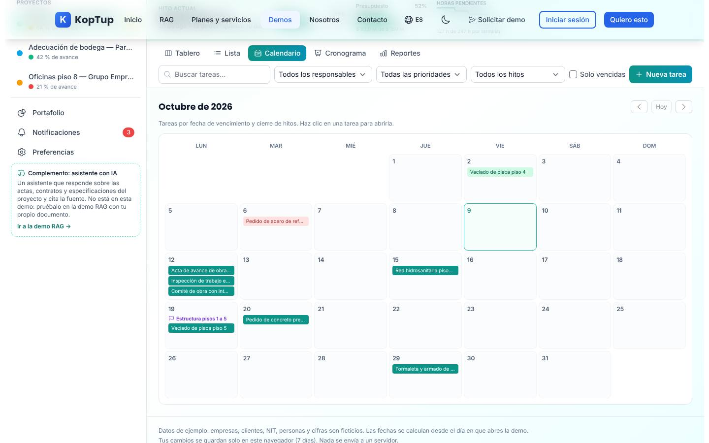

*Octubre de 2026: tareas por fecha de vencimiento (rojas si están vencidas, tachadas si terminaron) y el cierre de hitos con una bandera.*

Mes con semana de lunes a domingo, hasta 3 tareas por día («+N más») y botones mes anterior, **Hoy** y mes siguiente. Clic en una tarea abre su detalle. En celular se convierte en una agenda con solo los días que tienen algo.

### Cronograma

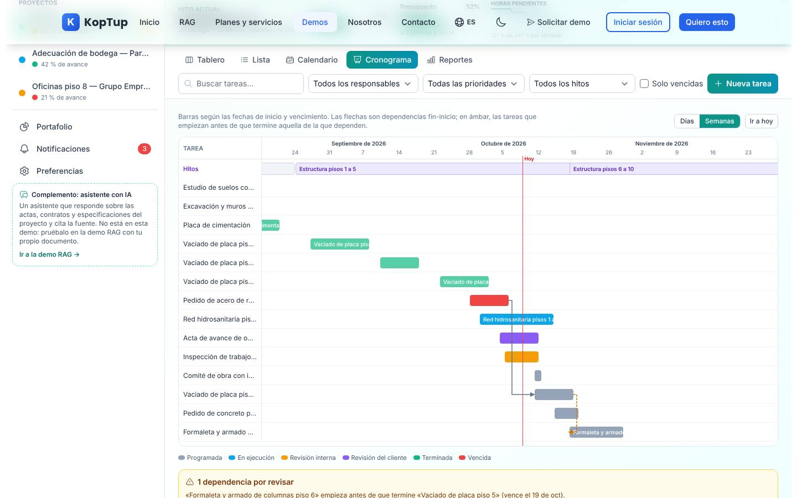

*Diagrama de Gantt de Torre 2 en escala de semanas, con la franja de hitos, la línea de hoy y una dependencia por revisar.*

- Barras por tarea según inicio y vencimiento, coloreadas por estado (rojo si está vencida), y una franja con los hitos.
- **Flechas de dependencia** fin-inicio; en ámbar y punteadas las que empiezan antes de que termine la tarea de la que dependen. Debajo, el recuadro «N dependencias por revisar» con un enlace a cada tarea.
- Escala **Días** o **Semanas** e **Ir a hoy**; al abrir se centra en hoy.

### Detalle de una tarea

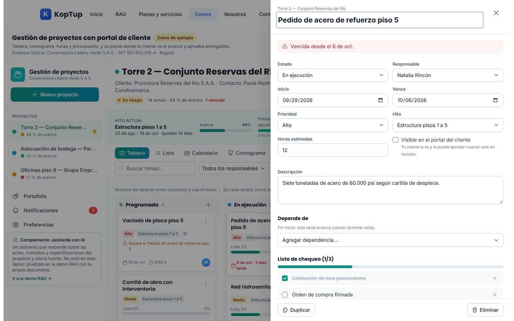

*Panel lateral de «Pedido de acero de refuerzo piso 5», vencida desde el 6 de octubre.*

Todo se edita en el panel y se guarda al instante:

- **Avisos** de tarea vencida o bloqueada por dependencias.
- **Campos**: título, estado, responsable, inicio, vencimiento, prioridad, hito, horas estimadas, visible en el portal del cliente y descripción.
- **Depende de**: agrega o quita dependencias fin-inicio; la lista no ofrece tareas que crearían un ciclo.
- **Lista de chequeo**: marcar, agregar y quitar puntos.
- **Horas**: persona, fecha, horas (más de 0 y hasta 24) y nota; muestra el total frente a lo estimado y el costo (horas × costo por hora). En la prueba, registrar 3 h dejó «9 h de 12 h estimadas (75 %)».
- **Comentarios** con botones para mencionar (@Julián, @Natalia…); al mencionar aparece «Julián Ospina recibirá un aviso (simulado en la demo)». Los comentarios del cliente llevan la etiqueta «Cliente».
- **Adjuntos**: los documentos de ejemplo (actas, informes, presupuestos, briefs, especificaciones, registros fotográficos) se generan en PDF al descargarlos; **Adjuntar archivo** acepta hasta 10 MB y el archivo queda solo en esta sesión del navegador.
- **Historial** de cambios (con un check violeta lo que también ve el cliente), **Duplicar** y **Eliminar** (con confirmación; borra también sus horas).

### Ver como cliente (portal)

Ver el [paso 3](#paso-3-abre-la-vista-del-cliente-y-aprueba-un-entregable). Solo aparecen las tareas marcadas como visibles para el cliente. **Ver informe semanal** abre el mismo informe del [paso 5](#paso-5-genera-el-informe-semanal).

### Reportes

Ver el [paso 4](#paso-4-reportes-horas-presupuesto-por-hito-y-carga-del-equipo).

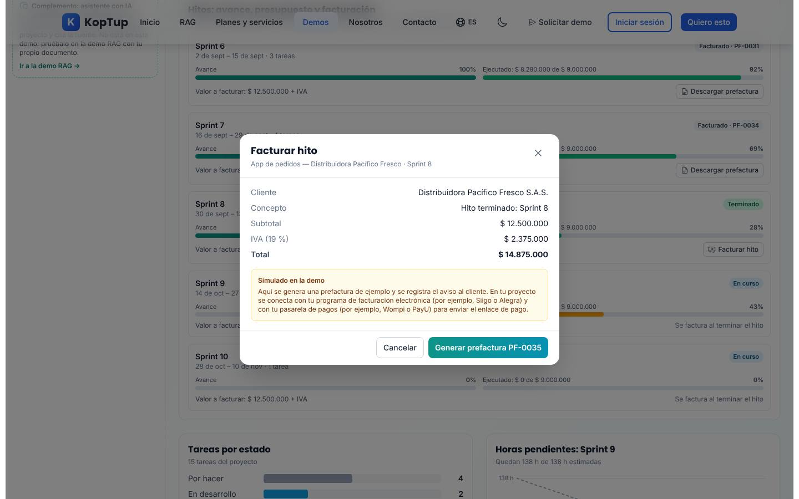

*Sector Software: después de cerrar el Sprint 8, **Facturar hito** muestra la prefactura `PF-0035` con IVA del 19 % y la nota «Simulado en la demo».*

- **Facturar hito** aparece cuando un hito está terminado o un sprint cerrado y aún no se factura. **Generar prefactura PF-NNNN** la numera, registra el aviso al cliente (simulado) y permite **Descargar PDF** (`prefactura-PF-0035.pdf` en la prueba: subtotal $ 12.500.000, IVA $ 2.375.000, total $ 14.875.000, «Documento de ejemplo sin validez fiscal»). En el proyecto real se conectaría con Siigo o Alegra y con una pasarela como Wompi o PayU, según el texto de la propia ventana.
- **Costos registrados**: lista de gastos del proyecto (materiales, subcontratos) y formulario con concepto, valor en pesos y hito; el costo suma al presupuesto ejecutado.
- **Exportar horas (CSV)**: fecha, persona, tarea, hito, horas, costo y nota.

### Nuevo proyecto

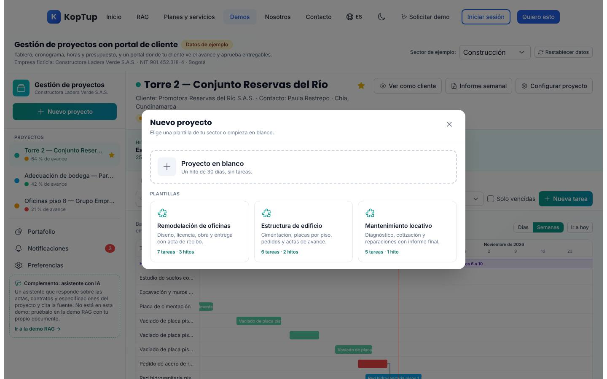

*Plantillas del sector Construcción: Remodelación de oficinas (7 tareas, 3 hitos), Estructura de edificio (6 tareas, 2 hitos) y Mantenimiento locativo (5 tareas, 1 hito).*

Proyecto en blanco (un hito de 30 días, sin tareas) o una de las tres plantillas del sector. El segundo paso pide nombre, cliente, contacto, ciudad, presupuesto total (opcional) y color. Las fechas se calculan desde hoy en días hábiles, con sus dependencias, y el presupuesto se reparte por igual entre los hitos. En la prueba: «Proyecto «Remodelación de oficinas» creado con 7 tareas».

### Configurar proyecto

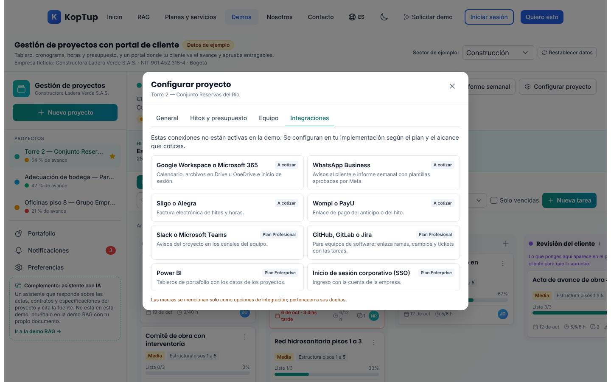

*Pestaña Integraciones: ocho conexiones posibles con el plan en que se ofrecen; ninguna está activa en la demo.*

- **General**: nombre, cliente, contacto, ciudad, color y descripción; **Guardar** y **Eliminar proyecto** (desactivado si es el único).
- **Hitos y presupuesto**: presupuesto (costo previsto) y valor a facturar de cada hito (bloqueado si ya se facturó); **Agregar hito** o, en proyectos por sprints, **Agregar Sprint N** de dos semanas.
- **Equipo**: las personas del sector con su cargo, costo por hora y capacidad semanal (solo lectura).
- **Integraciones**: Google Workspace o Microsoft 365, WhatsApp Business, Siigo o Alegra y Wompi o PayU («A cotizar»); Slack o Teams y GitHub, GitLab o Jira («Plan Profesional»); Power BI y SSO («Plan Enterprise»). «Estas conexiones no están activas en la demo».

### Notificaciones

Lista de avisos con su tipo (Cliente, Vencimiento, Envío al cliente, Mención, Asignación), fecha y proyecto; los nuevos van resaltados. Clic en uno lo marca como leído y abre el proyecto y la tarea. **Marcar todas como leídas**. Al abrir la demo hay 3 sin leer.

### Preferencias

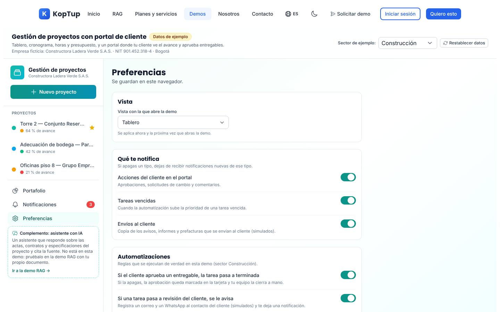

*Vista predeterminada, tipos de notificación y las primeras automatizaciones del sector (la tercera y el bloque «Datos de ejemplo» quedan más abajo).*

- **Vista con la que abre la demo**: Tablero, Lista, Calendario, Cronograma o Reportes.
- **Qué te notifica**: acciones del cliente, tareas vencidas y envíos al cliente.
- **Automatizaciones** (por sector, se ejecutan de verdad): si el cliente aprueba, la tarea pasa a Terminada (si la apagas, queda marcada «Aprobada» y tu equipo la cierra); si una tarea pasa a revisión del cliente, se le avisa (simulado); si una tarea vence sin terminar, sube a prioridad alta y te avisa (se revisa al abrir la demo y con cada cambio).
- **Datos de ejemplo**: **Restablecer <sector>** o **Restablecer todo**.

### En el celular

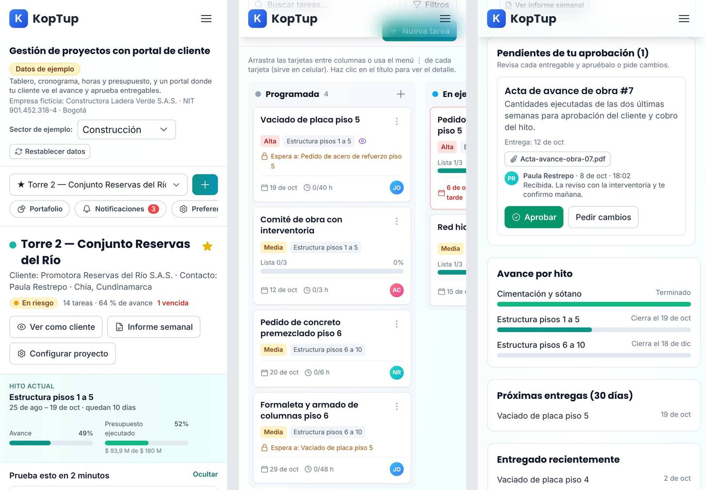

*A 390 px: la barra lateral se vuelve un selector de proyecto con botones de Portafolio, Notificaciones y Preferencias; el tablero se desliza de lado; el portal del cliente se apila.*

Las pestañas de vista se vuelven un selector, los filtros se pliegan, la lista y el calendario pasan a tarjetas y agenda, y para mover tareas se usa el menú ⋮. La página no se desborda a lo ancho.

---

## Qué es real y qué es simulado

| Parte | Real o simulado | Detalle |
|---|---|---|
| Empresas, NIT, clientes, personas, proyectos y cifras | **Datos de ejemplo** | Tres sectores ficticios; las fechas se calculan desde el día en que abres la demo. |
| Tablero, tareas, dependencias, horas, costos, hitos y sprints | **Real (en el navegador)** | Todo lo que cambias se guarda y recalcula avance, semáforo, presupuesto, carga y gráficos. |
| Semáforo, avance e indicadores | **Reglas, no IA** | Reglas escritas en pantalla; el pie lo dice: «Esta demo no usa inteligencia artificial». |
| Automatizaciones | **Reales (en el navegador)** | Aprobación → Terminada, aviso al cliente y subida de prioridad de vencidas. |
| Portal del cliente | **Real en la demo, simulado como acceso** | Es una vista del mismo navegador; el cliente no tiene usuario ni enlace propio. |
| Avisos por correo y WhatsApp, menciones | **Simulados** | Se registran en el historial, las notificaciones y el portal; no sale ningún mensaje. |
| Prefacturas y pagos | **Simulados** | La prefactura es un PDF de ejemplo sin validez fiscal; no hay facturación electrónica ni pasarela. |
| PDF (informe, actas, prefacturas) y CSV | **Real** | Se generan en el navegador con los datos del momento. |
| Archivos que adjuntas | **Solo en esta sesión** | No se suben a ningún servidor; al recargar desaparecen. |
| Integraciones | **No activas** | La pestaña solo describe las opciones y el plan. |
| Dónde se guardan tus cambios | **Solo en este navegador** | `localStorage` durante 7 días; después se regeneran los datos con la fecha nueva. No los ve nadie más. |

---

## Acceso

**Cómo lo ve un visitante.** La demo es **Abierta**: en `/demo` su tarjeta («Gestión de Proyectos», insignias «Abierta» y «Ágil») tiene **Probar Demo** (abre `/demo/control-proyectos` directamente) y **Solicitar demo guiada** (`/solicitar-demo?demos=control-proyectos`). No hay pantalla de acceso ni hace falta cuenta: la [vista general](#guía-de-la-demo-gestión-de-proyectos-con-portal-de-cliente) es exactamente lo que ve un visitante sin sesión. Al final de la página está el bloque «¿Te gustaría algo así para tu negocio?» con **Solicitar demo guiada**, **Solicitar Cotización** (`/contact`) y **Ver Planes y Precios** (`/services#planes-rag`).

**Cómo se solicita una demo guiada y cómo la gestiona el admin.** La solicitud del formulario llega a **Admin › Solicitudes de demo** como cualquier otra. Como la demo es abierta, no hace falta conceder acceso para usarla; la solicitud sirve para agendar la demo guiada. Un admin puede cambiar el modo de acceso en **Admin › Catálogo de demos** (por ejemplo, a «Con solicitud»); entonces empezaría a mostrarse la pantalla de acceso. Detalle en el [Manual del administrador](Doc-06-Manual-del-Administrador.md) y en [Flujos del visitante](Doc-04-Flujos-del-Visitante.md).

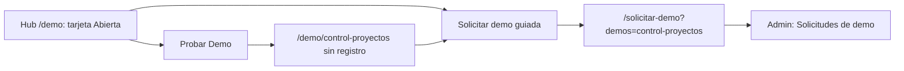

*Dos caminos: probarla de una vez o pedir una demo guiada.*

---

## Limitaciones conocidas

1. **La tarjeta del hub se queda corta y habla de otra cosa.** Dice «Kanban, sprints y tareas colaborativas» y anuncia «Gestión de sprints», pero solo el sector Software trabaja por sprints, y no menciona lo que más vende de la demo: el portal del cliente, las horas y el presupuesto por hito y el informe semanal.
2. **Los cambios viven solo en el navegador** durante 7 días. Si el prospecto cambia de equipo o de navegador, o borra los datos del sitio, vuelve a los datos de ejemplo; no hay espacio compartido con el vendedor ni con su cliente. Los archivos adjuntos se pierden al recargar.
3. **El portal del cliente es una vista simulada**: se abre desde el mismo navegador con **Ver como cliente**; el cliente no tiene usuario, enlace ni correo reales.
4. **Avisos, menciones, prefacturas y pagos son simulados** (no sale ningún correo ni WhatsApp) y las integraciones no están activas.
5. **Las cifras cambian cada día**: como las fechas se calculan desde hoy, los atrasos, vencidas y porcentajes de esta guía pueden variar en otra fecha.
6. **Arrastrar y soltar no funciona con el dedo**: en celular y tablet se usa el menú ⋮ (la propia demo lo indica).
7. **Cerrar un sprint lo deja facturable por su valor completo** aunque sus tareas sin terminar pasen al siguiente sprint; conviene explicarlo si el prospecto factura por avance real.
8. **El equipo no se edita**: personas, costos por hora y capacidad son fijos por sector.
