# Guía de la demo: CRM con IA

> Ruta `/demo/crm-ia` · Modo de acceso: **Abierta** · Tipo: **datos de ejemplo** (todo corre en el navegador; no llama al servidor ni a un modelo de IA) · Plan del producto: [CRM con IA](Producto-crm-ia.md)

**Resumen.** Es el CRM de una empresa de logística ficticia (Logística Quindara S.A.S.) con 20 negocios de ejemplo (13 abiertos, 4 ganados y 3 perdidos) repartidos entre tres vendedores. Muestra un embudo de ventas que se arrastra, un puntaje de cada lead explicado factor por factor, el pronóstico en pesos frente a una meta, borradores de WhatsApp y correo, análisis de llamadas y una secuencia de seguimiento. Está pensada para gerentes comerciales y equipos de venta B2B en Colombia; el puntaje y los borradores salen de reglas y plantillas, y los cambios se guardan solo en el navegador de quien la usa.

**En esta página:** [Recorrido sugerido](#recorrido-sugerido-demo-comercial-de-5-minutos) · [Pantallas y funciones](#pantallas-y-funciones) · [Qué es real y qué es simulado](#qué-es-real-y-qué-es-simulado) · [Acceso](#acceso) · [Limitaciones conocidas](#limitaciones-conocidas)

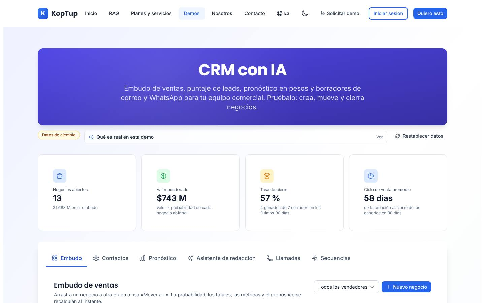

*Encabezado de la demo, insignia «Datos de ejemplo», las cuatro métricas del embudo y las seis pestañas.*

---

## Recorrido sugerido (demo comercial de 5 minutos)

La idea que vende: «a quién llamar hoy, qué decirle y cuánto vas a facturar». Antes de empezar, si la demo ya se usó en ese navegador, pulsa **Restablecer datos** › **Sí, restablecer** para volver a los datos de ejemplo.

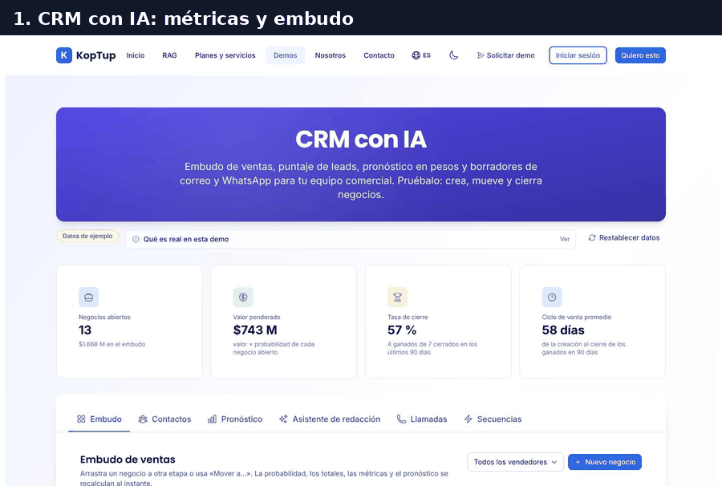

*Recorrido completo en 6 pasos: embudo, ficha del cliente, borrador, negocio ganado, pronóstico y secuencia.*

### Paso 1. El embudo de ventas

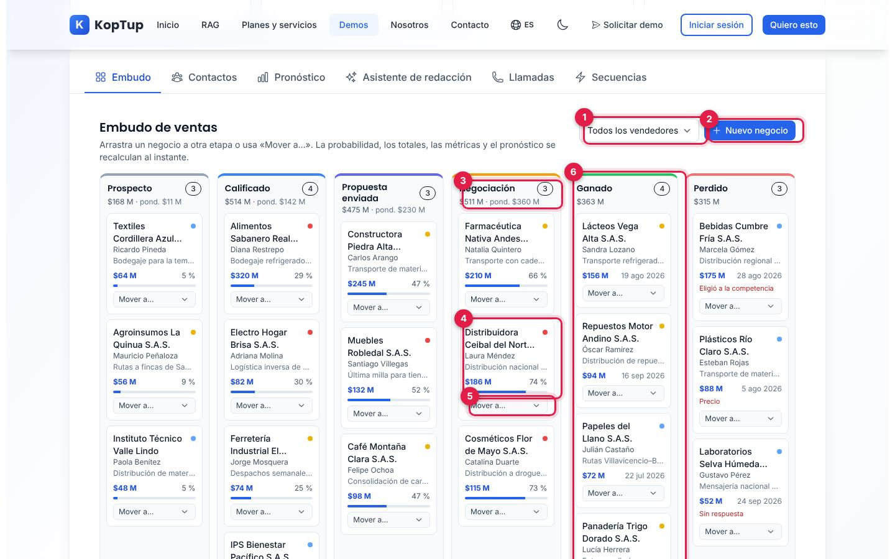

*Pestaña Embudo: seis columnas, de Prospecto a Perdido, con los negocios ordenados por valor.*

1. **Filtrar por vendedor**: todos, Valentina Ríos, Andrés Cárdenas o Juliana Ospina.
2. **Nuevo negocio**: abre el formulario para crear uno (ver [Nuevo negocio](#nuevo-negocio)).
3. **Encabezado de la etapa**: cuántos negocios hay, cuánto suman y su valor ponderado («pond.»).
4. **Tarjeta del negocio**: empresa, contacto, nombre del negocio, valor, probabilidad de cierre y su barra. El punto de color es la temperatura del lead: rojo = caliente (puntaje de 75 o más), amarillo = tibio (50 a 74), azul = frío (menos de 50). Un clic abre la ficha.
5. **Mover a…**: cambia la etapa sin arrastrar (es la forma cómoda en el celular).
6. **Ganado** y **Perdido**: arrastra una tarjeta aquí para cerrar el negocio. En estas columnas la tarjeta muestra la fecha de cierre y, si se perdió, el motivo.

Qué decir: «Cada vez que mueves un negocio, la probabilidad, las métricas y el pronóstico se recalculan al instante».

### Paso 2. La ficha del cliente y su puntaje

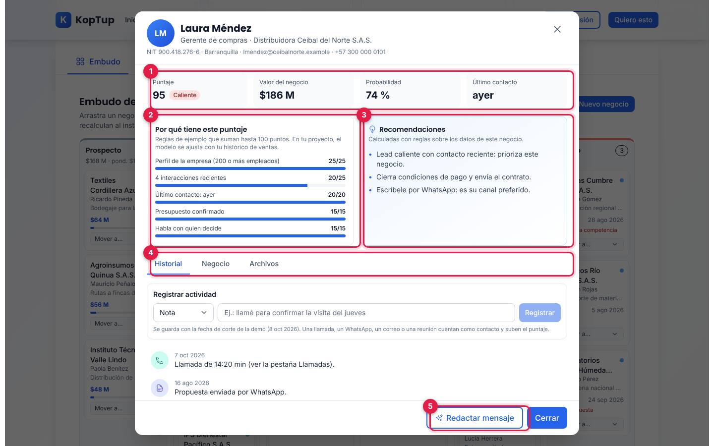

*Ficha de Laura Méndez (Distribuidora Ceibal del Norte S.A.S.), un lead caliente en Negociación.*

1. **Puntaje, valor, probabilidad y último contacto**: 95 (Caliente), $186 M, 74 % y «ayer».
2. **Por qué tiene este puntaje**: cinco factores que suman hasta 100 puntos: perfil de la empresa por tamaño (hasta 25), interacciones de los últimos 30 días (5 puntos cada una, hasta 25), qué tan reciente fue el último contacto (hasta 20), presupuesto confirmado (15) y si habla con quien decide (15).
3. **Recomendaciones**: salen de reglas sobre el negocio (contacto reciente, presupuesto, quién decide, siguiente paso de la etapa y canal preferido).
4. **Historial · Negocio · Archivos**: registrar una actividad y ver la línea de tiempo; ver los datos y cambiar la etapa o la próxima acción; descargar la cotización en PDF.
5. **Redactar mensaje**: cierra la ficha y abre el asistente con este contacto ya elegido.

Qué decir: «El puntaje no es una caja negra: el vendedor ve por qué un cliente está caliente».

### Paso 3. El borrador de WhatsApp

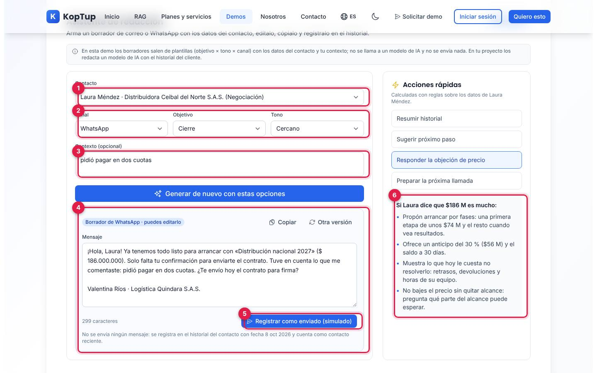

*Asistente de redacción con un borrador de WhatsApp de cierre y la respuesta a la objeción de precio.*

1. **Contacto**: llega elegido desde la ficha; se puede cambiar.
2. **Canal, objetivo y tono**: WhatsApp o Correo; Primer contacto, Seguimiento, Enviar propuesta, Reactivar o Cierre; Profesional, Cercano, Directo o Consultivo. En el ejemplo: WhatsApp, Cierre y Cercano.
3. **Contexto (opcional)**: una frase que el borrador incluye («pidió pagar en dos cuotas»).
4. **Borrador editable**: usa el nombre, el negocio, el valor y el vendedor. Tiene **Copiar**, **Otra versión** y el contador de caracteres; en correo agrega el asunto.
5. **Registrar como enviado (simulado)**: no envía nada; deja el mensaje en el historial con la fecha de la demo y cuenta como contacto reciente (sube el puntaje).
6. **Acciones rápidas**: Resumir historial, Sugerir próximo paso, Responder la objeción de precio (en el ejemplo: fases, anticipo del 30 %, costo de no resolverlo) y Preparar la próxima llamada.

Qué decir, con honestidad: «Aquí el borrador sale de plantillas; en tu proyecto lo redacta un modelo de IA con el historial del cliente». La propia pantalla lo dice en su nota gris.

### Paso 4. Gana el negocio

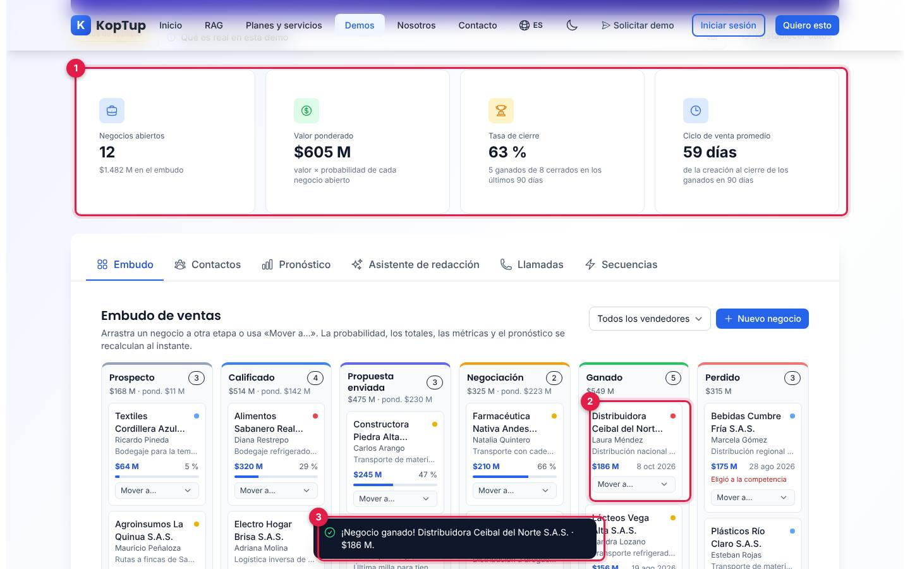

*Después de arrastrar Distribuidora Ceibal del Norte a Ganado.*

1. **Las métricas cambian**: negocios abiertos de 13 a 12, valor ponderado de $745 M (ya había subido de $743 M con el mensaje registrado en el paso 3) a $605 M, tasa de cierre de 57 % a 63 % (5 ganados de 8 cerrados) y ciclo de venta de 58 a 59 días.
2. **La tarjeta pasa a Ganado** con la fecha de cierre de la demo (8 oct 2026).
3. **Aviso**: «¡Negocio ganado! Distribuidora Ceibal del Norte S.A.S. · $186 M.»

Si lo mueves a **Perdido**, primero pregunta el motivo (Precio, Eligió a la competencia, No es el momento o Sin respuesta). Ganar o perder un negocio termina su secuencia de seguimiento, si tenía una.

### Paso 5. El pronóstico frente a la meta

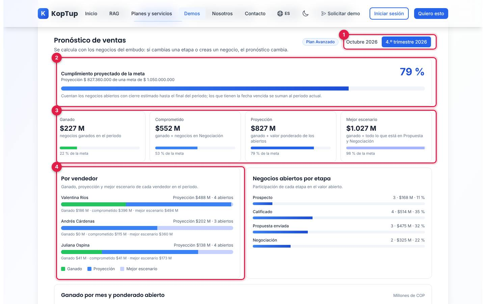

*Pestaña Pronóstico, periodo 4.º trimestre 2026, ya con el negocio ganado del paso 4.*

1. **Periodo**: Octubre 2026 (meta $350 M) o 4.º trimestre 2026 (meta $1.050 M, el predeterminado).
2. **Cumplimiento proyectado**: proyección frente a la meta (79 % en el ejemplo).
3. **Cuatro cifras**: Ganado, Comprometido (ganado + Negociación), Proyección (ganado + valor ponderado de los abiertos) y Mejor escenario (ganado + todo lo que está en Propuesta y Negociación), cada una con su porcentaje de la meta.
4. **Por vendedor**: ganado, proyección y mejor escenario de cada uno. Al lado, la participación de cada etapa en el valor abierto.

Más abajo están el gráfico y las alertas:

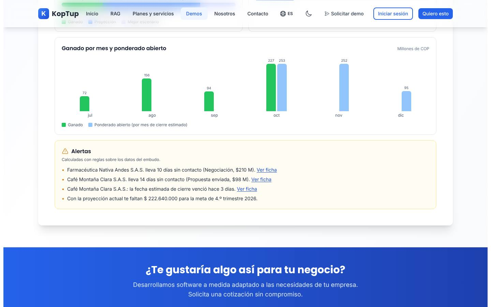

*Ganado por mes (julio a octubre) y ponderado abierto por mes de cierre (octubre a diciembre), y las alertas con su enlace «Ver ficha».*

Las alertas avisan de negocios en Propuesta o Negociación con 7 días o más sin contacto, de fechas de cierre vencidas y de cuánto falta (o sobra) para la meta del periodo.

### Paso 6. La secuencia de seguimiento

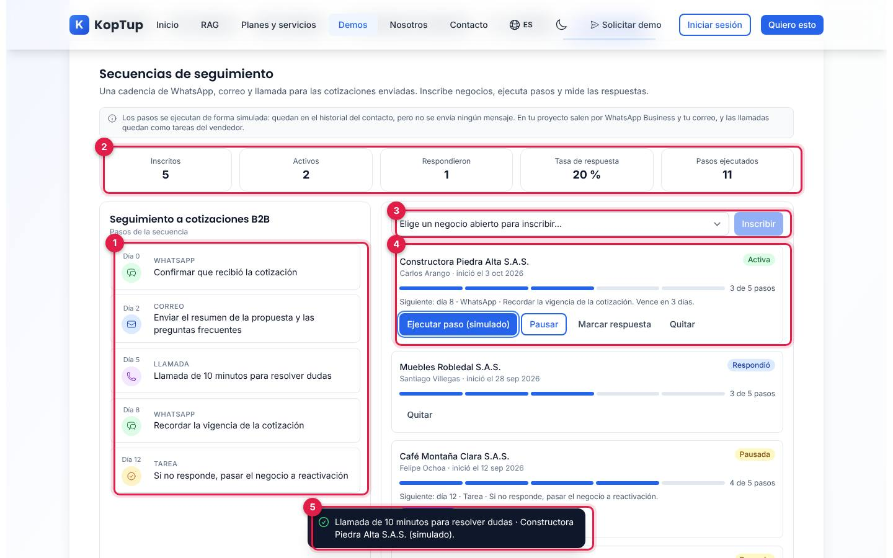

*Pestaña Secuencias después de inscribir Electro Hogar Brisa y ejecutar un paso de Constructora Piedra Alta.*

1. **Cadencia «Seguimiento a cotizaciones B2B»**: día 0 WhatsApp, día 2 correo, día 5 llamada, día 8 WhatsApp y día 12 tarea de reactivación.
2. **Métricas**: inscritos, activos, respondieron, tasa de respuesta y pasos ejecutados.
3. **Inscribir**: lista los negocios abiertos que aún no están en la secuencia.
4. **Cada inscripción**: estado (Activa, Pausada, Respondió, Terminada), avance «3 de 5 pasos», el siguiente paso con su vencimiento y los botones **Ejecutar paso (simulado)**, **Pausar**/**Reanudar**, **Marcar respuesta** (detiene la secuencia) y **Quitar**.
5. **Aviso** del paso ejecutado: «Llamada de 10 minutos para resolver dudas · Constructora Piedra Alta S.A.S. (simulado).»

Qué decir: «El vendedor no tiene que acordarse de cada seguimiento; en tu proyecto los mensajes salen por WhatsApp Business y tu correo».

---

## Pantallas y funciones

Todas las pestañas leen el mismo estado. Cuando cambias algo en una, las demás lo reflejan.

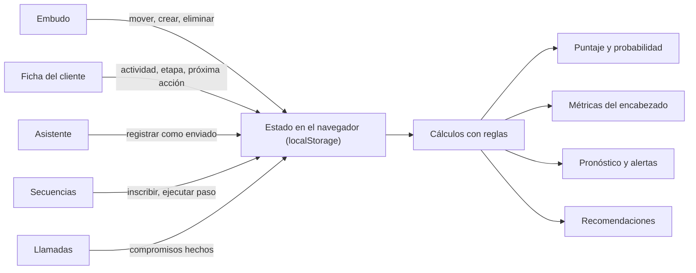

*De dónde sale cada número: no hay servidor; todo se recalcula en el navegador.*

### Encabezado y métricas

Arriba están el título, la insignia **Datos de ejemplo** (al pasar el cursor explica que empresas, personas, NIT, correos, teléfonos y cifras son inventados y que la fecha de corte es el 8 oct 2026), el desplegable **Qué es real en esta demo** y **Restablecer datos** (pide confirmación y borra los cambios de ese navegador).

| Métrica | Cómo se calcula |
|---|---|
| Negocios abiertos | Negocios en Prospecto, Calificado, Propuesta enviada o Negociación, y su valor total |
| Valor ponderado | Suma de valor × probabilidad de cada negocio abierto |
| Tasa de cierre | Ganados sobre cerrados (ganados + perdidos) en los últimos 90 días |
| Ciclo de venta promedio | Días entre la creación y el cierre de los ganados en los últimos 90 días |

La **probabilidad** de un negocio abierto es la base de su etapa (Prospecto 10 %, Calificado 25 %, Propuesta enviada 45 %, Negociación 65 %) ajustada por el puntaje: entre −10 y +12 puntos, y siempre entre 5 % y 95 %.

### Embudo

Ver el [paso 1](#paso-1-el-embudo-de-ventas) y el [paso 4](#paso-4-gana-el-negocio). Al pasar un negocio a una etapa abierta, si estaba cerrado o su cierre estimado ya pasó, la demo le pone como cierre estimado 30 días después del corte (7 nov 2026).

### Contactos

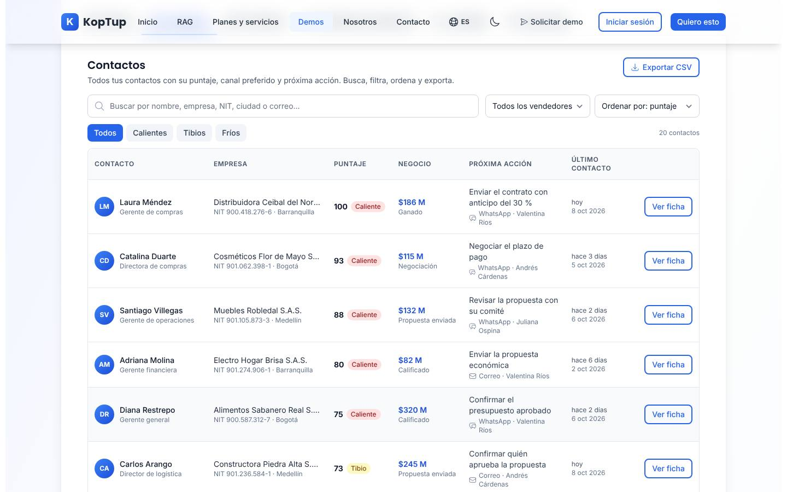

*Lista de contactos ordenada por puntaje, con búsqueda, filtros y exportación.*

- **Buscar** por nombre, empresa, NIT, ciudad o correo; filtrar por vendedor y por temperatura (Todos, Calientes, Tibios, Fríos); ordenar por puntaje, valor, último contacto o nombre.
- Cada fila muestra contacto y cargo, empresa con NIT y ciudad, puntaje, valor y etapa del negocio, próxima acción con canal y vendedor, y último contacto. **Ver ficha** abre la ficha del cliente.
- **Exportar CSV** descarga `contactos-crm-ejemplo.csv` (separado por punto y coma) con las filas visibles: contacto, cargo, empresa, NIT, ciudad, correo, teléfono, canal, vendedor, etapa, valor, probabilidad, puntaje, último contacto y próxima acción.
- La lista incluye los 20 negocios, también los ganados y los perdidos.

### Ficha del cliente

Ver el [paso 2](#paso-2-la-ficha-del-cliente-y-su-puntaje). Sus tres pestañas:

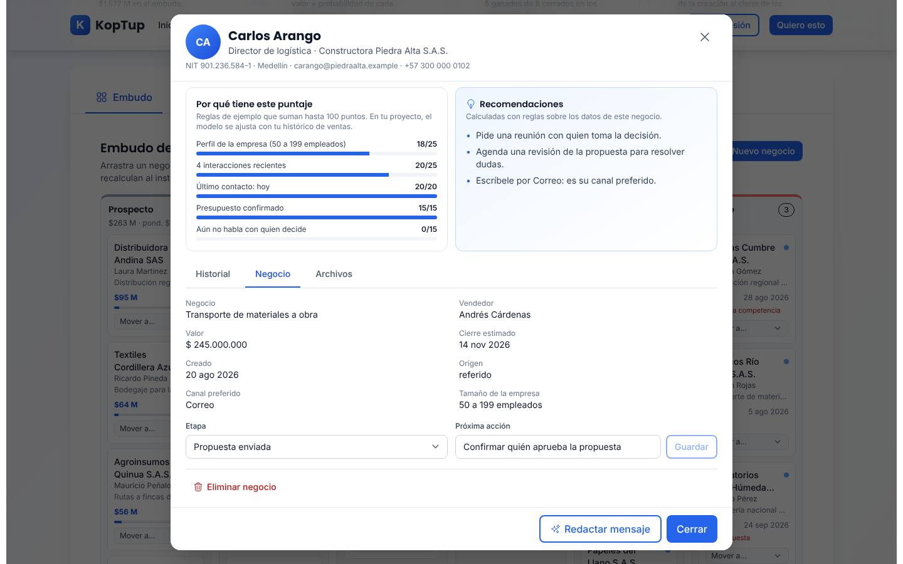

*Ficha de Carlos Arango (Constructora Piedra Alta), pestaña Negocio.*

| Pestaña | Qué puedes hacer | Qué pasa |
|---|---|---|
| Historial | Registrar una actividad (Nota, Llamada, WhatsApp, Correo o Reunión) con un texto | Queda en la línea de tiempo con fecha 8 oct 2026; todo menos la nota cuenta como contacto y sube el puntaje |
| Negocio | Ver negocio, vendedor, valor, fechas, origen, canal y tamaño; cambiar la **Etapa** y la **Próxima acción** (**Guardar**); **Eliminar negocio** (pide confirmación) | Los cambios se reflejan en todas las pestañas; eliminar borra el negocio, su historial y su secuencia de este navegador |
| Archivos | **Descargar PDF** de la cotización `COT-2026-<ID>` | Se genera en el navegador `cotizacion-ejemplo-<ID>.pdf` con la marca «Documento de ejemplo», cliente, alcance, valor antes de impuestos, pago 30 % / 70 % y asesor. Solo existe desde «Propuesta enviada» y no para negocios perdidos |

### Pronóstico

Ver el [paso 5](#paso-5-el-pronóstico-frente-a-la-meta). Lleva la insignia **Plan Avanzado**: el pronóstico está incluido desde ese plan del producto. Los negocios abiertos con fecha de cierre vencida se cuentan en el periodo actual.

### Asistente de redacción

Ver el [paso 3](#paso-3-el-borrador-de-whatsapp). También lleva la insignia **Plan Avanzado**. Al elegir un contacto, la demo propone el canal (su canal preferido; si prefiere llamada, WhatsApp) y un objetivo según la etapa. **Otra versión** alterna entre dos redacciones del mismo objetivo.

### Llamadas

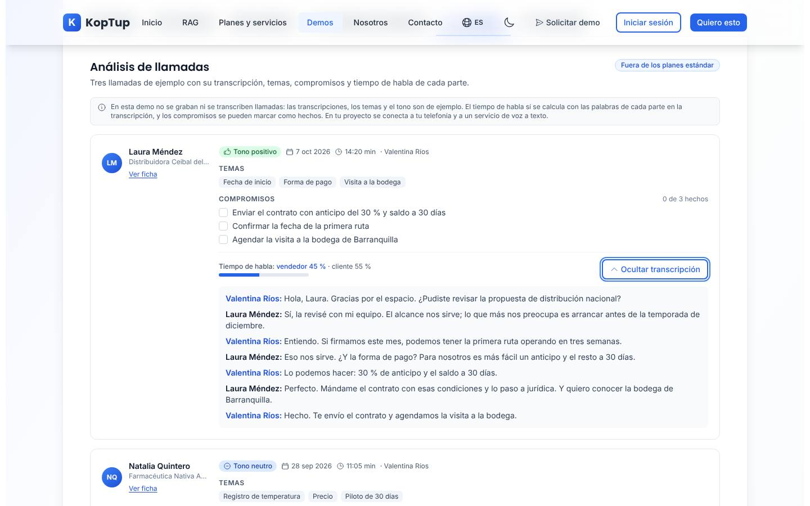

*Llamada de ejemplo con Laura Méndez, con la transcripción abierta.*

Tres llamadas de ejemplo (Laura Méndez con tono positivo, Natalia Quintero neutro y Felipe Ochoa negativo). Cada una muestra fecha, duración y vendedor, **Temas**, **Compromisos** (casillas que puedes marcar como hechos; se guardan), **Tiempo de habla** de vendedor y cliente (calculado con las palabras de cada uno en la transcripción) y **Ver transcripción**. **Ver ficha** abre la ficha del cliente. La insignia **Fuera de los planes estándar** indica que la grabación y el análisis de llamadas se cotizan aparte.

### Secuencias

Ver el [paso 6](#paso-6-la-secuencia-de-seguimiento). Los pasos por WhatsApp, correo o llamada cuentan como contacto en el historial; la tarea del día 12 no.

### Nuevo negocio

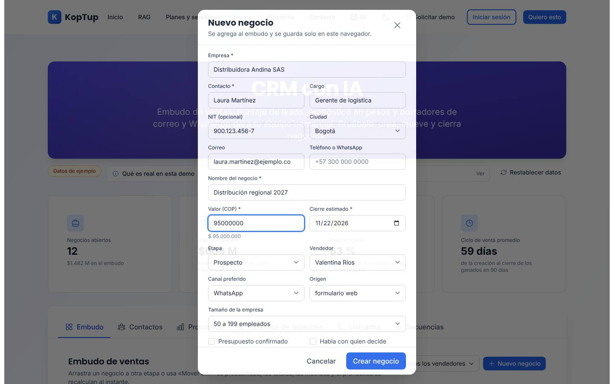

*Formulario para crear un negocio, con datos ficticios.*

Pide empresa, contacto, cargo, NIT (opcional), ciudad, correo, teléfono o WhatsApp, nombre del negocio, valor en pesos, cierre estimado, etapa, vendedor, canal preferido, origen, tamaño de la empresa, **Presupuesto confirmado**, **Habla con quien decide** y próxima acción. Son obligatorios empresa, contacto, nombre del negocio, valor (mayor que cero) y cierre estimado (desde el 8 oct 2026); el correo y el NIT se validan por formato. **Crear negocio** lo agrega a la etapa elegida con el contacto «hoy» y muestra «Distribuidora Andina SAS se agregó a «Prospecto».».

### En el celular

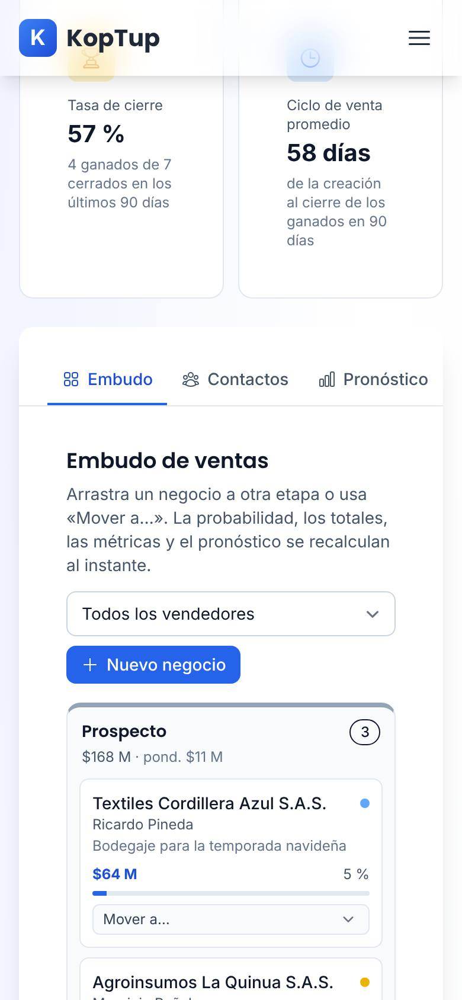

*La demo en un teléfono (390 px), pestaña Embudo.*

Las métricas pasan a dos columnas, las pestañas se desplazan de lado y las etapas del embudo se apilan una debajo de otra. Para mover un negocio usa **Mover a…**.

---

## Qué es real y qué es simulado

| Parte | Real o simulado | Detalle |
|---|---|---|
| Embudo, ficha, contactos, secuencias | **Funciona de verdad, en el navegador** | Crear, mover, editar y eliminar negocios funciona; se guarda en `localStorage` de ese navegador (clave `koptup-demo-crm-ia:v1`). |
| Puntaje, probabilidad, métricas, pronóstico, alertas y recomendaciones | **Reglas de ejemplo** | Cálculos fijos y explicables en el navegador; no hay modelo de IA ni aprendizaje con histórico. |
| Borradores y acciones rápidas | **Plantillas** | Combinan objetivo × tono × canal con los datos del contacto; no se llama a un modelo de IA. |
| Envíos de WhatsApp y correo, pasos de la secuencia | **Simulados** | Solo quedan en el historial; no sale ningún mensaje. |
| Llamadas | **Datos de ejemplo** | Transcripciones, temas y tono escritos a mano; el tiempo de habla sí se calcula con la transcripción. |
| Cotización en PDF y CSV de contactos | **Real, con datos ficticios** | Se generan en el navegador con los datos actuales. |
| Empresas, personas, NIT, correos y teléfonos | **Ficticios** | Correos con dominio `.example` y teléfonos de la serie +57 300 000 0xxx. |
| Servidor | **No se usa** | La demo no hace llamadas a la API; funciona aunque el backend no responda. |

---

## Acceso

- **Cómo la ve un visitante:** la demo está en modo **Abierta** (`publico`): cualquiera entra a `/demo/crm-ia` sin cuenta y sin pantalla de acceso. En el hub `/demo` aparece así:

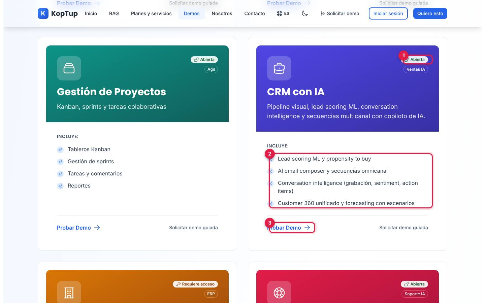

*Tarjeta «CRM con IA» en el hub, vista por un visitante sin sesión.*

1. Insignia **Abierta** (junto a «Ventas IA»).
2. Lo que **Incluye** según la tarjeta (ver la limitación 1).
3. **Probar Demo** abre `/demo/crm-ia`; a la derecha, **Solicitar demo guiada** abre `/solicitar-demo?demos=crm-ia`.

- **Cómo se solicita:** no hace falta solicitarla. Quien quiera verla con su propio proceso usa **Solicitar demo guiada** (en la tarjeta o en el bloque azul al final de la demo, que también ofrece **Solicitar Cotización** y **Ver Planes y Precios**).
- **Cómo la controla el admin:** el modo sale del catálogo del servidor y se cambia en **Admin › Catálogo de demos** (`/admin/catalogo-demos`). Si se pasa a «Con solicitud» o «Solo por invitación», los visitantes verán la pantalla de acceso y los accesos se conceden en **Admin › Solicitudes de demo** y **Admin › Accesos a demos**; si se desactiva, el visitante ve que la demo está en mantenimiento y el equipo sigue entrando. Si el backend no responde, la demo sigue abierta porque así está en la tabla de respaldo. Detalle en el [Manual del administrador](Doc-06-Manual-del-Administrador.md) y en [Flujos del visitante](Doc-04-Flujos-del-Visitante.md).

---

## Limitaciones conocidas

1. **No hay IA en la demo, aunque el nombre y la tarjeta del hub la prometen.** La tarjeta dice «Lead scoring ML y propensity to buy», «AI email composer» y «Conversation intelligence (grabación, sentiment, action items)»; dentro, el puntaje es de reglas, los borradores son plantillas y las llamadas son de ejemplo. La demo sí lo aclara en «Qué es real en esta demo» y en las notas grises de cada pestaña, pero la tarjeta no.
2. **Los cambios viven solo en ese navegador.** Otra persona (o tú en otro equipo o en una ventana privada) ve los datos de ejemplo. No hay forma de compartir el estado del CRM.
3. **La fecha está fija en el 8 oct 2026.** Las actividades, los cierres y el «hoy» o «hace N días» se calculan contra esa fecha de corte, no contra la fecha real.
4. **Al ganar o perder un negocio no cambia su próxima acción.** Por ejemplo, Distribuidora Ceibal del Norte, ya ganada, sigue con «Enviar el contrato con anticipo del 30 %» en Contactos y en el CSV.
5. **En la ficha solo se editan la etapa y la próxima acción.** Valor, cierre estimado y vendedor se muestran pero no se pueden cambiar; tampoco se editan contacto ni empresa después de crear el negocio.
6. **«Otra versión» solo alterna dos textos** por objetivo; no genera redacciones nuevas.
7. **El NIT solo se valida por formato** (por ejemplo 900.123.456-7); no se comprueba el dígito de verificación.
8. **«Ver Planes y Precios»** del bloque final lleva a `/services#planes-rag`, que abre en los planes RAG y no en los planes del CRM (están más abajo en la misma página).
