# Guía de la demo: Sistema experto para salud

> Ruta `/demo/cuentas-medicas` · Modo de acceso: **Solo por invitación** · Tipo: **IA real** (backend real con datos de ejemplo) · Plan del producto: [Auditoría de cuentas médicas con IA](Demo-cuentas-medicas.md)

**Resumen.** Es la demo de auditoría de cuentas médicas: subes una factura de una IPS en PDF (o usas la factura de ejemplo), el servidor lee el texto, un modelo de IA extrae los datos, el motor compara cada código CUPS con un tarifario de ejemplo y propone glosas. Tú, como auditor, confirmas, ajustas o descartas cada glosa y descargas el informe en PDF o CSV. Está pensada para firmas auditoras, IPS y pagadores (EPS, aseguradoras), y solo la abren las personas que invita un administrador.

**En esta página:** [Recorrido sugerido](#recorrido-sugerido-demo-comercial-de-5-minutos) · [Pantallas y funciones](#pantallas-y-funciones) · [Qué es real y qué es simulado](#qué-es-real-y-qué-es-simulado) · [Acceso](#acceso) · [Limitaciones conocidas](#limitaciones-conocidas)

*Tablero de la demo después de auditar la factura de ejemplo: 1 factura, valor facturado, valor glosado y valor a pagar.*

---

## Recorrido sugerido (demo comercial de 5 minutos)

Este guion sirve para mostrarle la demo a un cliente en una llamada. Empieza con el espacio vacío (si hay facturas de otras personas, puedes eliminarlas en **Facturas** o seguir con ellas).

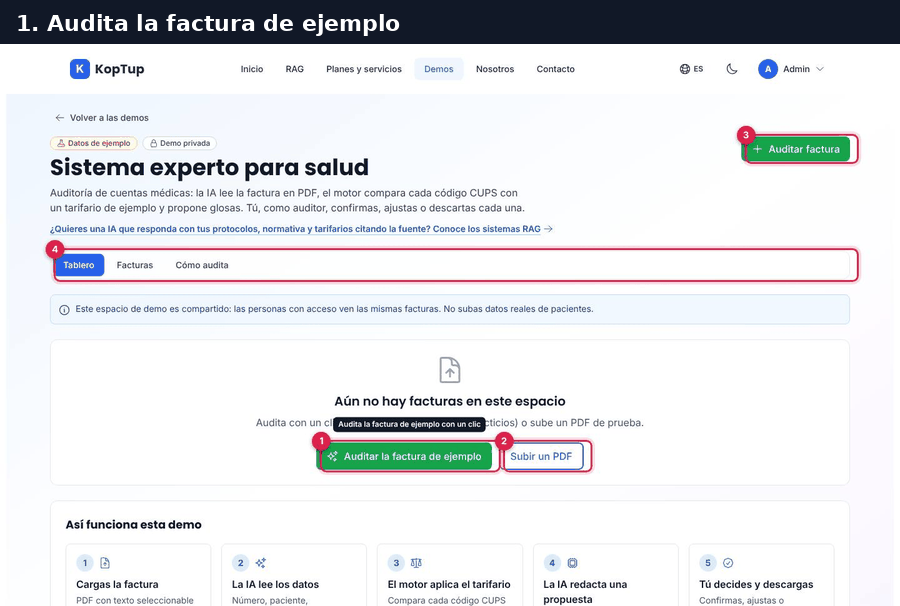

*Recorrido completo en 6 pasos: auditar la factura de ejemplo, revisar el resultado, decidir las glosas y ver el tablero actualizado.*

### Paso 1. Audita la factura de ejemplo

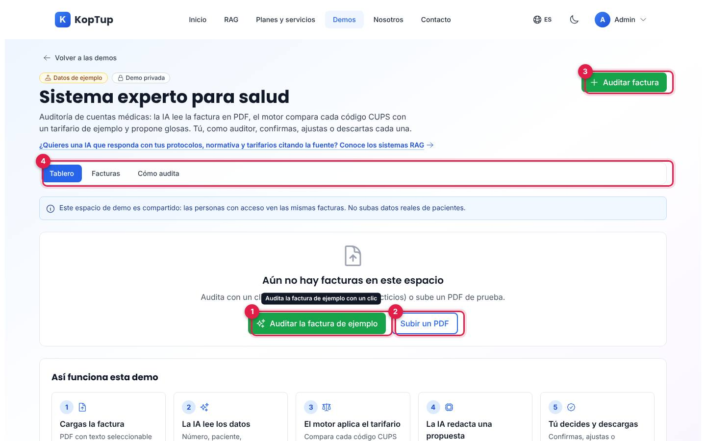

*Tablero sin facturas: la demo ofrece auditar la factura de ejemplo con un clic.*

1. **Auditar la factura de ejemplo**: la demo genera en tu navegador un PDF ficticio («Clínica Demo Los Andes», factura FEDL-10432, 5 procedimientos) y lo envía de una vez al servidor. Es la opción más rápida para una demo en vivo.
2. **Subir un PDF**: abre la ventana para cargar tus propios PDF de prueba.
3. **Auditar factura**: el mismo botón verde está siempre arriba a la derecha, en cualquier pestaña.
4. **Pestañas**: Tablero, Facturas y Cómo audita.

Qué decir: «La IA lee la factura tal como llega en PDF; no hay que digitar nada».

### Paso 2. Mira el resultado de la auditoría

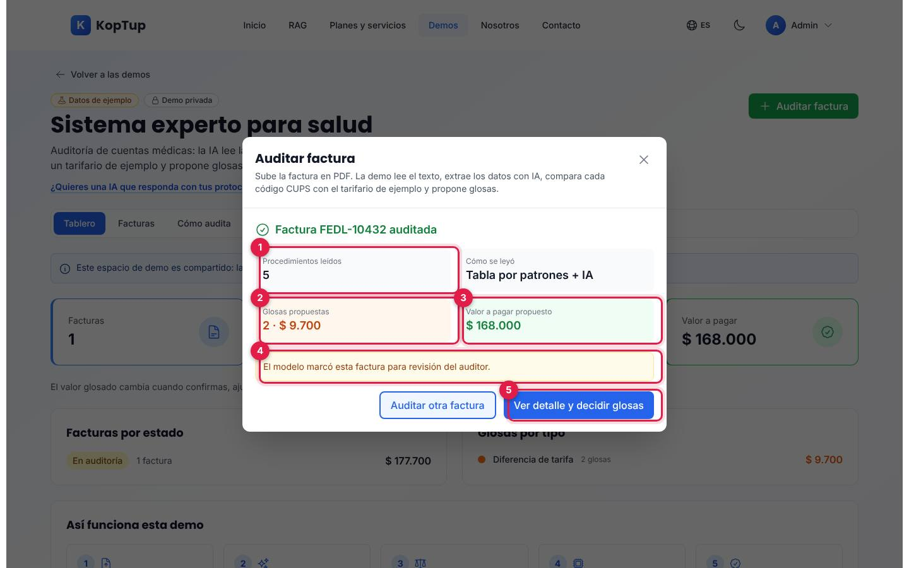

*Ventana de resultado: procedimientos leídos, glosas propuestas y valor a pagar propuesto.*

1. **Procedimientos leídos**: 5. Al lado, **Cómo se leyó** («Tabla por patrones + IA»).
2. **Glosas propuestas**: 2 glosas por $ 9.700 (la consulta de urgencias y el hemograma superan el tarifario de ejemplo).
3. **Valor a pagar propuesto**: $ 168.000.
4. **Aviso** cuando el modelo pide revisión humana.
5. **Ver detalle y decidir glosas**: abre el detalle de la factura. «Auditar otra factura» deja la ventana lista para otra.

### Paso 3. Revisa cada glosa propuesta

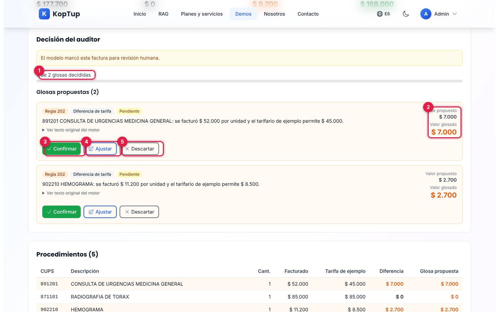

*Detalle de la factura, sección «Decisión del auditor»: cada glosa trae la regla, el motivo y los valores.*

1. **Avance**: «0 de 2 glosas decididas» y una barra de progreso.
2. **Valor propuesto y valor glosado** de la glosa.
3. **Confirmar**: acepta la glosa con el valor propuesto.
4. **Ajustar**: cambia el valor glosado (entre 0 y el valor facturado del procedimiento) con una nota opcional.
5. **Descartar**: anula la glosa; exige escribir una nota.

Qué decir: «La IA propone, el auditor decide. Cada glosa explica por qué: se facturó $ 52.000 y el tarifario permite $ 45.000».

### Paso 4. Confirma una glosa y ajusta la otra

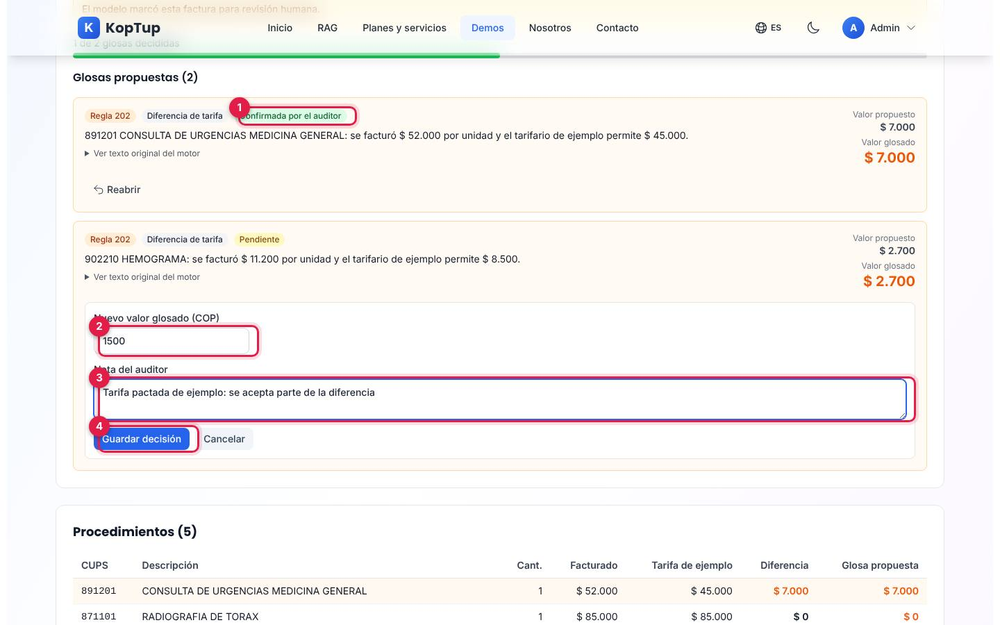

*La primera glosa ya está confirmada; la segunda se está ajustando con un valor nuevo y una nota.*

1. La glosa confirmada cambia a **Confirmada por el auditor** y muestra **Reabrir** para deshacer la decisión.
2. **Nuevo valor glosado (COP)**: en el ejemplo, 1500 en lugar de 2700.
3. **Nota del auditor**: queda guardada y sale en el informe.
4. **Guardar decisión**: el servidor guarda la decisión y recalcula los totales de la factura. Aparece el aviso «Decisión guardada».

### Paso 5. Revisión completa e informes

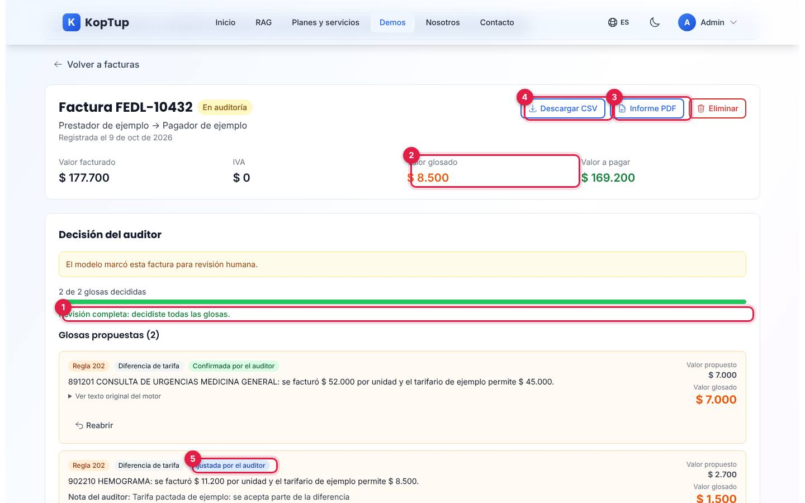

*Con las dos glosas decididas, la factura muestra «Revisión completa» y los valores recalculados.*

1. **Revisión completa: decidiste todas las glosas.**
2. **Valor glosado** recalculado: $ 8.500 (7.000 confirmados + 1.500 ajustados). El valor a pagar sube a $ 169.200.
3. **Informe PDF**: descarga un informe de una página con valores, procedimientos, glosas con la decisión y la propuesta del modelo (ver [Informe PDF y CSV](#informe-pdf-y-csv)).
4. **Descargar CSV**: el mismo detalle en una hoja de cálculo.
5. La segunda glosa queda como **Ajustada por el auditor**, con su nota.

### Paso 6. Vuelve al tablero

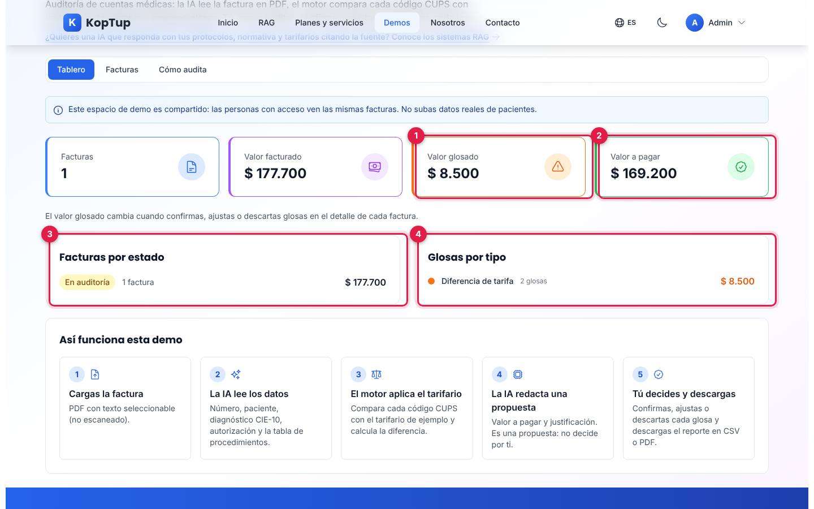

*El tablero refleja las decisiones del auditor.*

1. **Valor glosado**: $ 8.500.
2. **Valor a pagar**: $ 169.200.
3. **Facturas por estado**: cuántas facturas hay en cada estado y su valor.
4. **Glosas por tipo**: en esta demo, solo «Diferencia de tarifa».

Cierre sugerido: abrir **Cómo audita** para mostrar con honestidad qué hace la demo y qué se construye en el proyecto del cliente.

---

## Pantallas y funciones

### Encabezado y pestañas

Siempre visibles: **Volver a las demos** (va a `/demo`), las insignias **Datos de ejemplo** y **Demo privada**, el enlace a los sistemas RAG (`/rag`), el botón verde **Auditar factura** y las pestañas **Tablero**, **Facturas** y **Cómo audita**. Debajo hay un aviso fijo: «Este espacio de demo es compartido: las personas con acceso ven las mismas facturas. No subas datos reales de pacientes».

### Tablero

Ver la [vista general](#guía-de-la-demo-sistema-experto-para-salud) y el [paso 6](#paso-6-vuelve-al-tablero).

| Elemento | Qué muestra | De dónde sale |
|---|---|---|
| Facturas, Valor facturado, Valor glosado, Valor a pagar | Totales de todas las facturas del espacio compartido | `GET /api/auditoria/estadisticas` |
| Facturas por estado | Número y valor de facturas por estado | Mismo endpoint |
| Glosas por tipo | Número y valor de glosas por tipo | Mismo endpoint |
| Así funciona esta demo | Los 5 pasos (cargar, leer con IA, tarifario, propuesta, decisión) | Texto fijo |

Sin facturas, el tablero muestra «Aún no hay facturas en este espacio» con **Auditar la factura de ejemplo** y **Subir un PDF** ([paso 1](#paso-1-audita-la-factura-de-ejemplo)).

### Ventana «Auditar factura»

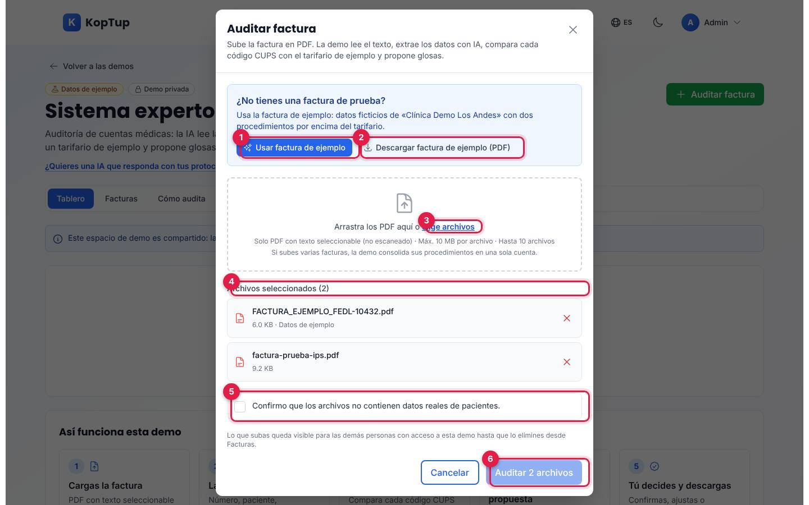

*Ventana para cargar PDF: factura de ejemplo, zona para arrastrar archivos, lista de archivos y casilla de consentimiento.*

1. **Usar factura de ejemplo**: agrega a la lista el PDF ficticio (no audita todavía).
2. **Descargar factura de ejemplo (PDF)**: guarda en tu equipo `FACTURA_EJEMPLO_FEDL-10432.pdf`, útil para mostrar el documento de origen.
3. **Elige archivos** (o arrastra los PDF a la zona punteada). Límites: solo PDF con texto seleccionable, máximo 10 MB por archivo y hasta 10 archivos. Si un archivo no es PDF, avisa «notas.txt no es un PDF».
4. **Archivos seleccionados**: cada uno con su tamaño y una **X** para quitarlo. La factura de ejemplo lleva la marca «Datos de ejemplo».
5. **Consentimiento**: aparece solo si subes un PDF propio. Sin marcarlo no se puede auditar.
6. **Auditar N archivos**: envía todo al servidor. Si subes varias facturas, la demo junta sus procedimientos en una sola cuenta.

Mientras procesa muestra «Leyendo el PDF y consultando el modelo de IA… puede tardar hasta un minuto» y no deja cerrar la ventana. Si el servidor no encuentra una factura legible, muestra «No se pudo auditar» con **Reintentar**. La ventana se cierra con la X, con **Cancelar** o con la tecla Escape.

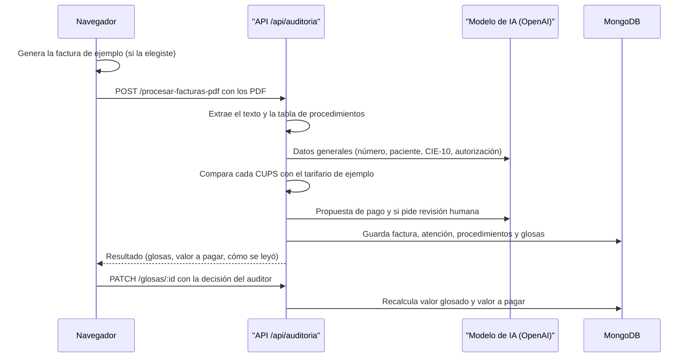

*Qué pasa al auditar una factura y al decidir una glosa.*

### Facturas

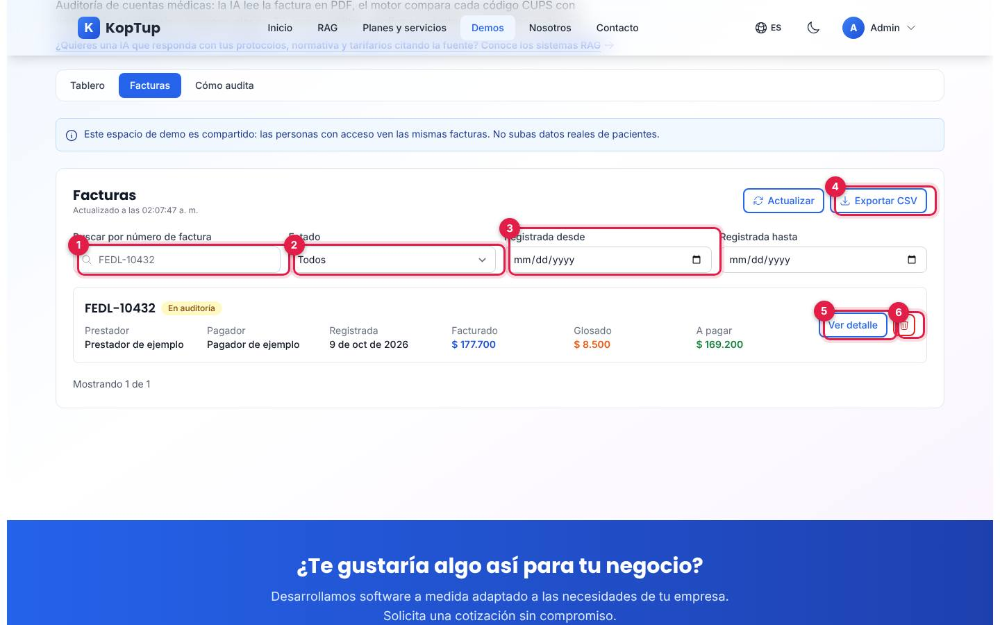

*Lista de facturas del espacio compartido con filtros y exportación.*

1. **Buscar por número de factura**: filtra las facturas ya cargadas en la lista.
2. **Estado**: Radicada, En auditoría, Auditada, Glosada, Aceptada, Pagada o Rechazada (lo filtra el servidor).
3. **Registrada desde / hasta**: rango de fechas (hora de Colombia). Con cualquier filtro activo aparece **Limpiar filtros**.
4. **Exportar CSV**: descarga las facturas visibles (`facturas-auditoria-demo-….csv`). Al lado, **Actualizar** vuelve a pedir la lista y muestra la hora de actualización.
5. **Ver detalle**: abre el detalle de la factura.
6. **Papelera**: pide confirmar («¿Eliminar la factura FEDL-10432 y sus glosas?» con **Sí, eliminar** / **No**) y la borra del servidor para todos.

La lista trae 20 facturas por vez; si hay más aparece **Cargar más**.

### Detalle de la factura

La parte de arriba (valores y decisión del auditor) se ve en los [pasos 3 a 5](#paso-3-revisa-cada-glosa-propuesta). Más abajo:

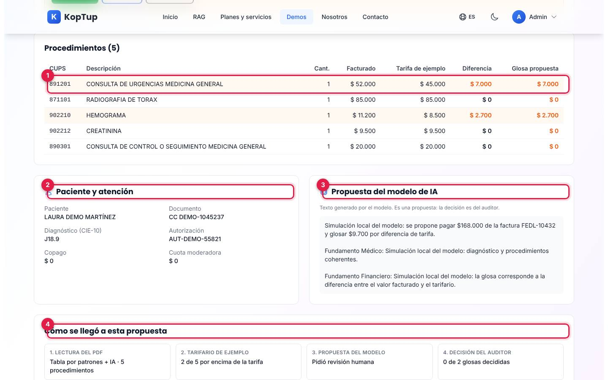

*Resto del detalle: tabla de procedimientos, datos del paciente, propuesta del modelo y cómo se llegó a la propuesta.*

1. **Procedimientos**: código CUPS, descripción, cantidad, valor facturado, tarifa de ejemplo, diferencia y glosa propuesta. Las filas con glosa se resaltan. Si el código no está en el tarifario dice «No está en el tarifario».
2. **Paciente y atención**: nombre, documento, diagnóstico CIE-10, autorización, copago y cuota moderadora, tal como los leyó la IA («No leído» si no los encontró).
3. **Propuesta del modelo de IA**: el texto que redactó el modelo, con la advertencia «Es una propuesta: la decisión es del auditor». *En las capturas el texto empieza por «Simulación local del modelo» porque el entorno de capturas usa un modelo simulado; con el servicio de OpenAI el texto lo redacta el modelo.*
4. **Cómo se llegó a esta propuesta**: lectura del PDF, tarifario de ejemplo (cuántos procedimientos superan la tarifa), propuesta del modelo (pidió o no revisión humana) y decisión del auditor (avance).

Otros detalles: **Ver texto original del motor** (en cada glosa) despliega el texto técnico que guardó el servidor; **Reabrir** devuelve una glosa a «Pendiente»; **Eliminar** (arriba a la derecha) borra la factura con confirmación y vuelve a la lista; **Volver a facturas** regresa a la lista.

### Informe PDF y CSV

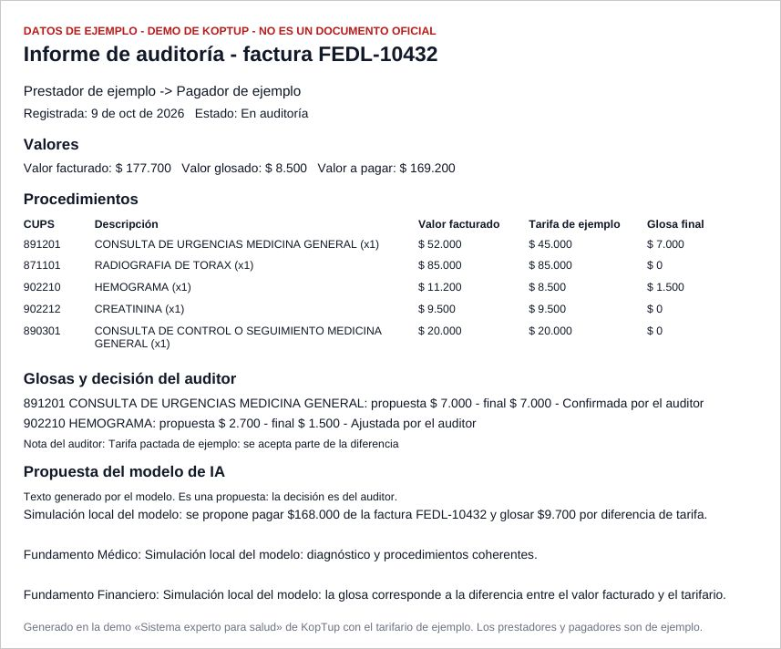

*Informe PDF generado en el navegador para la factura FEDL-10432 después de decidir las glosas.*

- **Informe PDF** (`auditoria-demo-<número>.pdf`): franja «DATOS DE EJEMPLO - DEMO DE KOPTUP - NO ES UN DOCUMENTO OFICIAL», valores, procedimientos con la glosa final, cada glosa con «propuesta» y «final» y la decisión del auditor con su nota, y la propuesta del modelo.
- **Descargar CSV** (`auditoria-demo-<número>.csv`, separado por punto y coma, abre en Excel): una fila por procedimiento con valor facturado, tarifa de ejemplo, diferencia, glosa propuesta, glosa final, decisión y nota, y una fila de totales.
- Ambos archivos se generan en el navegador con los datos que devuelve el servidor.

### Cómo audita

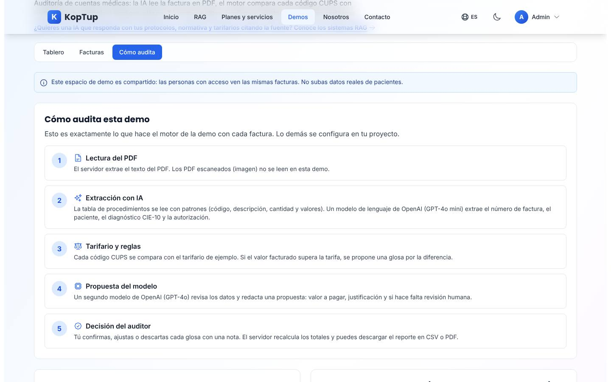

*Pestaña «Cómo audita»: los 5 pasos del motor, las reglas que aplica y lo que no hace la demo.*

- **Cómo audita esta demo**: lectura del PDF, extracción con IA (patrones para la tabla y GPT-4o mini para los datos generales), tarifario y reglas, propuesta del modelo (GPT-4o) y decisión del auditor.
- **Reglas que aplica**: glosa por diferencia de tarifa (regla 202 de la demo) y glosa provisional del 30 % para códigos que no están en el tarifario.
- **Qué no hace esta demo**: RIPS, validar autorizaciones con el pagador, pertinencia clínica, duplicidades, tomar prestador y pagador del PDF, convenios por pagador, PDF escaneados (OCR) y separar datos por cliente.
- **Tarifario de ejemplo**: 14 códigos CUPS con su valor de ejemplo y un buscador por código o nombre.

### En el celular

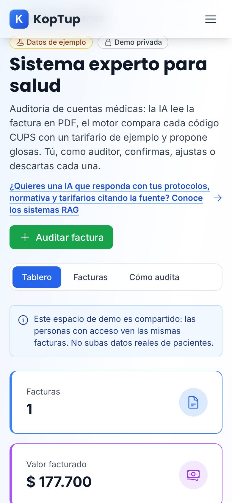

*La demo en un teléfono (390 px): las tarjetas se apilan y las pestañas siguen arriba.*

En pantallas pequeñas las tarjetas del tablero van en una columna, la tabla de procedimientos se desplaza de lado y la ventana de carga ocupa el ancho de la pantalla.

---

## Qué es real y qué es simulado

| Parte | Real o simulado | Detalle |
|---|---|---|
| Lectura del PDF y tabla de procedimientos | **Real** | El servidor extrae el texto del PDF y lee la tabla con patrones. |
| Datos generales y propuesta del modelo | **IA real** | Modelos de OpenAI (GPT-4o mini y GPT-4o) según el texto de la propia demo. En el entorno de capturas se usa un modelo simulado. |
| Tarifario | **Datos de ejemplo** | Tabla fija de 14 códigos en el servidor; no corresponde a ningún contrato ni manual real. |
| Reglas de glosa | **Real, pero limitadas** | Solo diferencia de tarifa y la regla provisional del 30 %. |
| Factura de ejemplo | **Datos ficticios** | Se genera en el navegador (Clínica Demo Los Andes, paciente «Laura Demo Martínez»). |
| Prestador y pagador | **De ejemplo** | El servidor guarda siempre el mismo prestador y pagador; la pantalla y los informes los muestran como «Prestador de ejemplo» y «Pagador de ejemplo». |
| Facturas, glosas y decisiones | **Real (persisten)** | Se guardan en la base de datos y las ven todas las personas con acceso. |
| Totales del tablero | **Real** | Los calcula el servidor con las facturas guardadas. |
| Informe PDF y CSV | **Real** | Se generan en el navegador con los datos guardados. |
| «Cómo se leyó» en el detalle | **Solo en tu navegador** | Se recuerda en el navegador donde auditaste la factura; en otro equipo solo se ve el número de procedimientos. |

---

## Acceso

**Cómo lo ve un visitante.** La demo está en `/demo`, sección **Más demos**, con la insignia «Solo por invitación» (ver la captura en la [guía del Motor de reglas del auditor](Guia-Demo-sistema-experto.md#acceso)). Si alguien abre `/demo/cuentas-medicas` sin sesión o sin invitación, la web muestra en la misma dirección la pantalla de acceso:

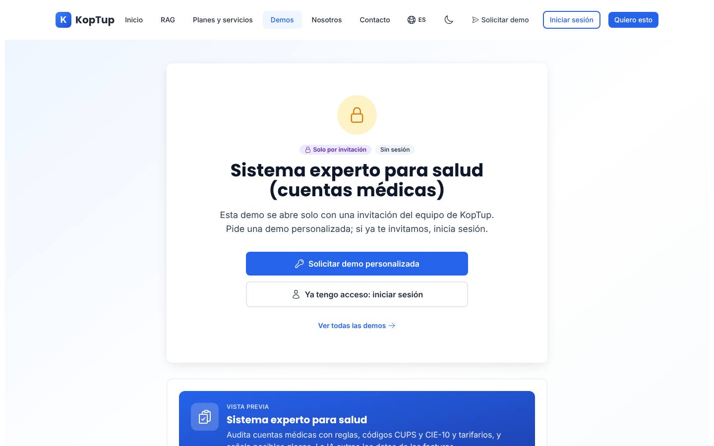

*Lo que ve un visitante sin sesión: «Solo por invitación», «Sin sesión», y los botones para pedir la demo o iniciar sesión.*

- **Solicitar demo personalizada** abre `/solicitar-demo?demos=cuentas-medicas` con la demo ya elegida (las demos por invitación solo aparecen en el formulario cuando llegas desde su botón).
- **Ya tengo acceso: iniciar sesión** lleva a `/login` y, al entrar, vuelve a la demo.
- Debajo hay una vista previa con lo que incluye la demo.

**Cómo se concede.** La solicitud llega a **Admin › Solicitudes de demo**. Solo una persona con rol **admin** puede aprobar el acceso a una demo «Solo por invitación» (el servidor lo rechaza para otros roles). Al aprobar, se crea o se reutiliza la cuenta del prospecto, el acceso dura 14 días por defecto (se puede extender o revocar en **Admin › Accesos a demos**) y la persona recibe un correo con la decisión (con el enlace de activación si su cuenta es nueva). El equipo de KopTup (roles admin, manager, sales y developer) abre la demo sin invitación. El modo de acceso se cambia en **Admin › Catálogo de demos**. Detalle paso a paso en el [Manual del administrador](Doc-06-Manual-del-Administrador.md) y en [Flujos del visitante](Doc-04-Flujos-del-Visitante.md).

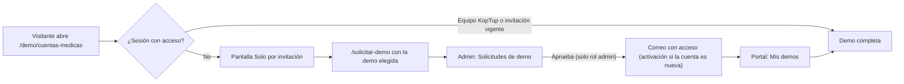

*Camino de un visitante hasta la demo.*

**Si el acceso vence durante el uso.** Si el servidor responde que la sesión venció o que ya no hay acceso, la demo oculta las pestañas y muestra «Tu acceso a esta demo no está activo», con **Iniciar sesión** y **Solicitar acceso** (ver la limitación 1).

---

## Limitaciones conocidas

1. **El botón «Solicitar acceso» de la pantalla «Tu acceso a esta demo no está activo» lleva a una página que no existe** (`/demo/acceso?...`, responde 404). Solo aparece si el acceso o la sesión vencen con la demo abierta; la pantalla de acceso normal (la del visitante) sí funciona.
2. **El estado de la factura no cambia al decidir las glosas.** Aunque la revisión quede completa, la factura sigue «En auditoría», así que «Facturas por estado» siempre muestra ese estado.
3. **Espacio compartido.** Todas las personas con acceso ven las mismas facturas y cualquiera puede eliminarlas. No hay separación por cliente.
4. **Solo una clase de glosa.** La demo propone glosas por diferencia de tarifa (y el 30 % provisional para códigos fuera del tarifario). No revisa RIPS, autorizaciones, pertinencia, duplicidades ni soportes.
5. **Solo PDF con texto.** Un PDF escaneado (imagen) no se lee; la demo responde «La demo no encontró una factura legible…».
6. **Prestador y pagador fijos.** No se toman del PDF; siempre se muestran como «de ejemplo».
7. **Fecha «Registrada».** Es la fecha de la factura si el modelo la lee; si no, la del día en que se auditó (en las capturas aparece la fecha del día).
8. **«Cómo se leyó» depende del navegador.** Se guarda solo en el navegador que auditó la factura (hasta 50 facturas).
9. **La búsqueda por número** filtra solo las facturas ya cargadas en la lista (de 20 en 20).
10. **No enlaza con el Motor de reglas.** Esta demo no tiene acceso directo a [`/demo/sistema-experto`](Guia-Demo-sistema-experto.md), las reglas guardadas allí no cambian esta auditoría, y los códigos no coinciden: aquí la «regla 202» es diferencia de tarifa y en el Motor de reglas 202 es «Autorización incompleta o vencida».
11. **El Excel del servidor no se ofrece.** El servidor genera un Excel por factura, pero la demo no tiene botón para descargarlo; los informes disponibles son el PDF y el CSV.
