# Guía de la demo: Tablero ejecutivo

> Ruta `/demo/dashboard-ejecutivo` · Modo de acceso: **Abierta** · Tipo: **datos de ejemplo** (todo se calcula en el navegador; no llama al servidor ni a un modelo de IA) · Plan del producto: [Dashboard ejecutivo con IA](Producto-bi-dashboard.md)

**Resumen.** Es el tablero de gerencia de una empresa colombiana ficticia (por defecto, la Distribuidora Cumbre Andina S.A.S.; también hay una clínica y una firma de consultoría). Muestra ventas frente a la meta, margen bruto, estado de resultados, cartera por edades, flujo de caja a 13 semanas, ranking de clientes, preguntas guiadas, alertas por reglas, la vista previa de un resumen semanal por WhatsApp o correo y un informe en PDF. Todo sale de las mismas facturas, así que las cifras cuadran entre vistas. El visitante puede cargar su propio CSV de ventas, que no sale del navegador. Está pensada para gerentes generales, directores financieros y dueños de empresa. En el hub `/demo` aparece como «Dashboard Ejecutivo».

**En esta página:** [Recorrido sugerido](#recorrido-sugerido-demo-comercial-de-5-minutos) · [Pantallas y funciones](#pantallas-y-funciones) · [Qué es real y qué es simulado](#qué-es-real-y-qué-es-simulado) · [Acceso](#acceso) · [Limitaciones conocidas](#limitaciones-conocidas)

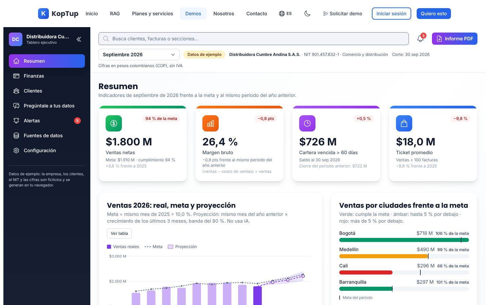

*Vista inicial (Resumen de septiembre de 2026): menú lateral con las siete secciones, buscador, campana con 5 alertas, «Informe PDF», selector de período, insignia «Datos de ejemplo», los cuatro indicadores y el gráfico de ventas.*

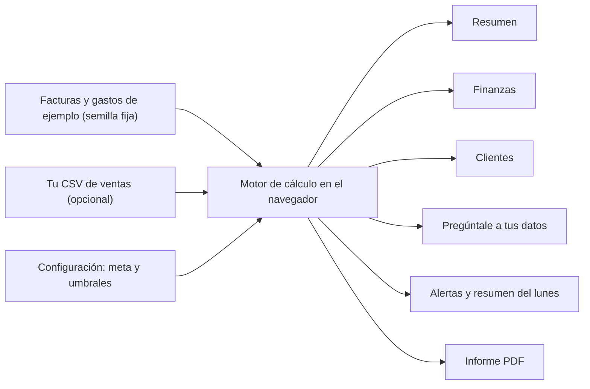

*De dónde salen las cifras: una sola lista de facturas alimenta todas las vistas y el PDF.*

---

## Recorrido sugerido (demo comercial de 5 minutos)

La demo no trae un guion propio. Este recorrido cuenta la historia que traen los datos de ejemplo de septiembre de 2026: las ventas van un 6 % por debajo de la meta, casi todo por Cali; el margen de lácteos cae; la caja se aprieta en noviembre y cuatro clientes compran mucho menos. Empieza con la página recién cargada; si alguien cambió la configuración en ese navegador, ve a **Configuración › Restablecer todo**.

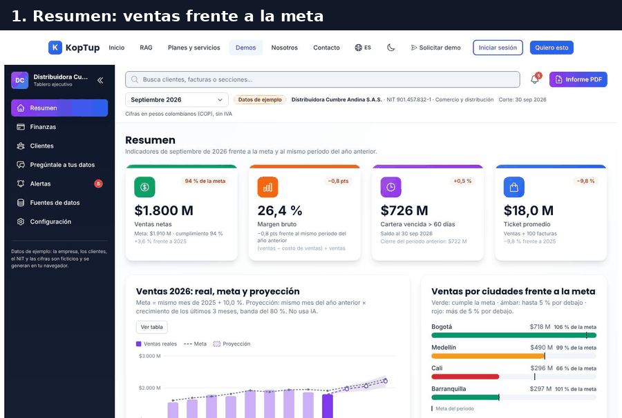

*Recorrido completo: indicadores, ciudades y resumen automático, flujo de caja, clientes en riesgo, detalle de un cliente, preguntas, alertas, resumen del lunes y prueba con un CSV.*

### Paso 1. Cómo va el mes frente a la meta

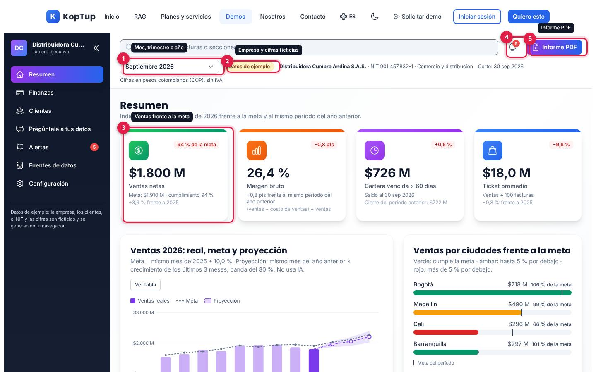

*Resumen de septiembre de 2026 de la Distribuidora Cumbre Andina S.A.S.*

1. **Período**: los meses de enero a septiembre de 2026, los trimestres T1 a T3 de 2026 y «2026 a la fecha». Todas las vistas, las alertas y el PDF cambian con él, y el navegador lo recuerda.
2. **Datos de ejemplo**: al pasar el mouse explica que la empresa y las cifras son ficticias. Al lado, empresa, NIT con dígito de verificación, sector, fecha de corte (30 sep 2026) y «Cifras en pesos colombianos (COP), sin IVA».
3. **Ventas netas**: $1.800 M, el 94 % de la meta ($1.910 M), y +3,6 % frente a septiembre de 2025. La meta es el mismo mes del año anterior más el crecimiento configurado (10 % en comercio).
4. **Campana**: el número de alertas activas (5). Abre la lista; cada alerta lleva a su vista y «Ver todas las alertas» abre Alertas.
5. **Informe PDF**: descarga el informe del período (ver [Informe PDF](#informe-pdf)).

Los otros tres indicadores son **Margen bruto** (26,4 %, −0,8 pts frente al año anterior), **Cartera vencida > 60 días** ($726 M al 30 sep 2026, frente a $722 M al cierre del período anterior) y **Ticket promedio** ($18,0 M, ventas ÷ 100 facturas).

Qué decir: «En una pantalla sabes si vas a cumplir el mes, sin esperar el cierre contable».

### Paso 2. Dónde está el problema y qué dice el resumen automático

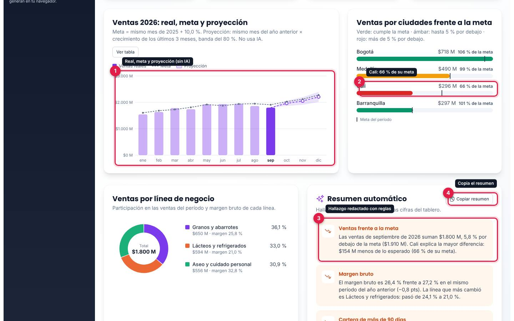

*Gráfico de ventas de 2026, ventas por ciudad frente a la meta y el resumen automático.*

1. **Ventas 2026: real, meta y proyección**: barras con las ventas de cada mes, línea punteada con la meta y, de octubre a diciembre, la proyección con su banda del 80 %. Pasar el mouse por un mes muestra sus cifras; **Ver tabla** muestra lo mismo en una tabla de 12 meses. La proyección es estadística y la página lo dice: «No usa IA».
2. **Ventas por ciudad**: Cali va en el 66 % de su meta (en rojo). Verde cumple la meta, ámbar está hasta 5 % por debajo y rojo más de 5 % por debajo.
3. **Resumen automático**: cuatro hallazgos redactados con reglas a partir de las cifras (ventas frente a la meta, margen, cartera de más de 90 días y proyección). El de cartera tiene **Ver en Finanzas**.
4. **Copiar resumen**: copia los hallazgos al portapapeles, en viñetas, para pegarlos en un correo o un chat.

Debajo del gráfico está **Ventas por línea de negocio** (dona con la participación y el margen de cada línea: granos y abarrotes, lácteos y refrigerados, aseo y cuidado personal).

Qué decir: «El tablero no solo muestra números: te dice qué cambió y dónde mirar».

### Paso 3. La caja de las próximas 13 semanas

Abre **Finanzas** en el menú lateral y baja hasta el flujo de caja.

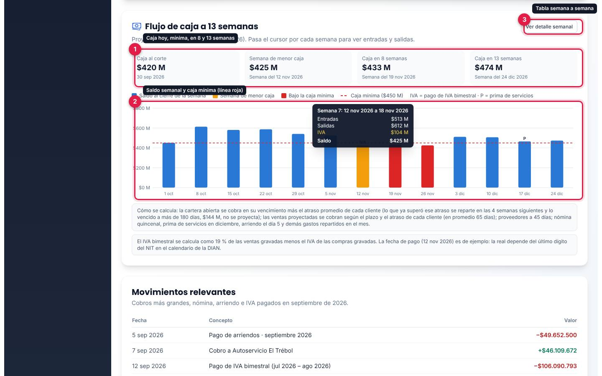

*Flujo de caja proyectado desde el 30 sep 2026, con el detalle de la semana 7 (12 al 18 nov 2026), la de menor caja.*

1. **Cuatro cifras**: caja al corte ($420 M), semana de menor caja ($425 M, semana del 12 nov 2026), caja en 8 semanas y en 13 semanas.
2. **Gráfico semanal**: barras azules con el saldo de cierre de cada semana, ámbar la de menor caja, rojo las que quedan bajo la caja mínima y línea roja punteada en la caja mínima ($450 M). Las marcas «IVA» y «P» señalan el pago de IVA bimestral y la prima de servicios. Al pasar el mouse por una semana aparecen entradas, salidas, IVA y saldo.
3. **Ver detalle semanal**: tabla de las 13 semanas con cobro de cartera, cobro de ventas nuevas, proveedores, nómina, arriendo y otros, IVA y saldo.

Debajo, la nota «Cómo se calcula» explica los supuestos (cobro según el atraso promedio de cada cliente, proveedores a 45 días, nómina quincenal, prima en diciembre, arriendo el día 5, y que lo vencido a más de 180 días no se proyecta).

Qué decir: «Ves hoy que en noviembre la caja queda por debajo de tu mínimo, con tiempo para actuar».

### Paso 4. Qué clientes están comprando menos

Abre **Clientes** y pulsa **En riesgo (4)**.

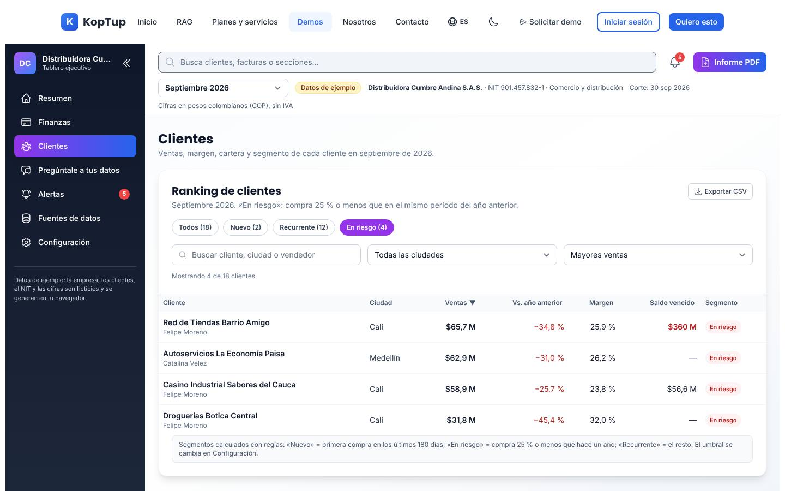

*Los cuatro clientes «En riesgo» de septiembre de 2026: tres de Cali y uno de Medellín.*

La tabla muestra ventas del período, variación frente al año anterior, margen, saldo vencido y segmento. «En riesgo» significa que sus compras cayeron 25 % o más frente al mismo período del año anterior (el porcentaje se cambia en Configuración). Pulsa el nombre de **Red de Tiendas Barrio Amigo** para abrir su ficha:

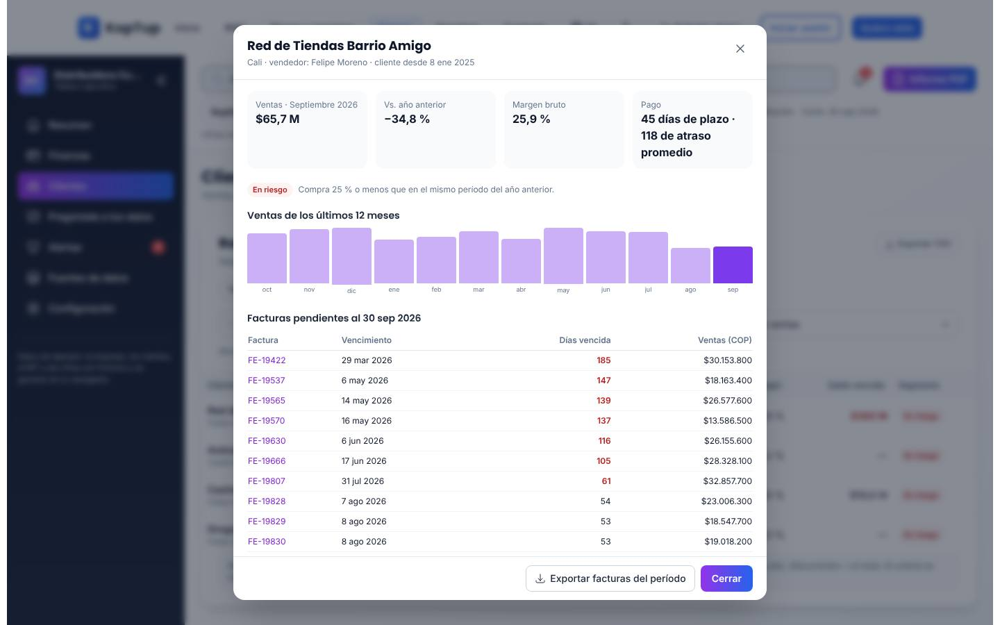

*Ficha de Red de Tiendas Barrio Amigo: −34,8 % frente al año anterior, 45 días de plazo y 118 días de atraso promedio, ventas de 12 meses y facturas pendientes.*

Cada número de factura abre su detalle (fecha, ciudad, línea, vendedor, valor sin IVA, costo, margen, vencimiento y estado al corte), con **Ver cliente** para volver. **Exportar facturas del período** descarga un CSV. Escape cierra la ventana de arriba.

Qué decir: «Antes de perder un cliente, el tablero te avisa que dejó de comprar y que además te debe».

### Paso 5. Pregúntale a tus datos

Abre **Pregúntale a tus datos**.

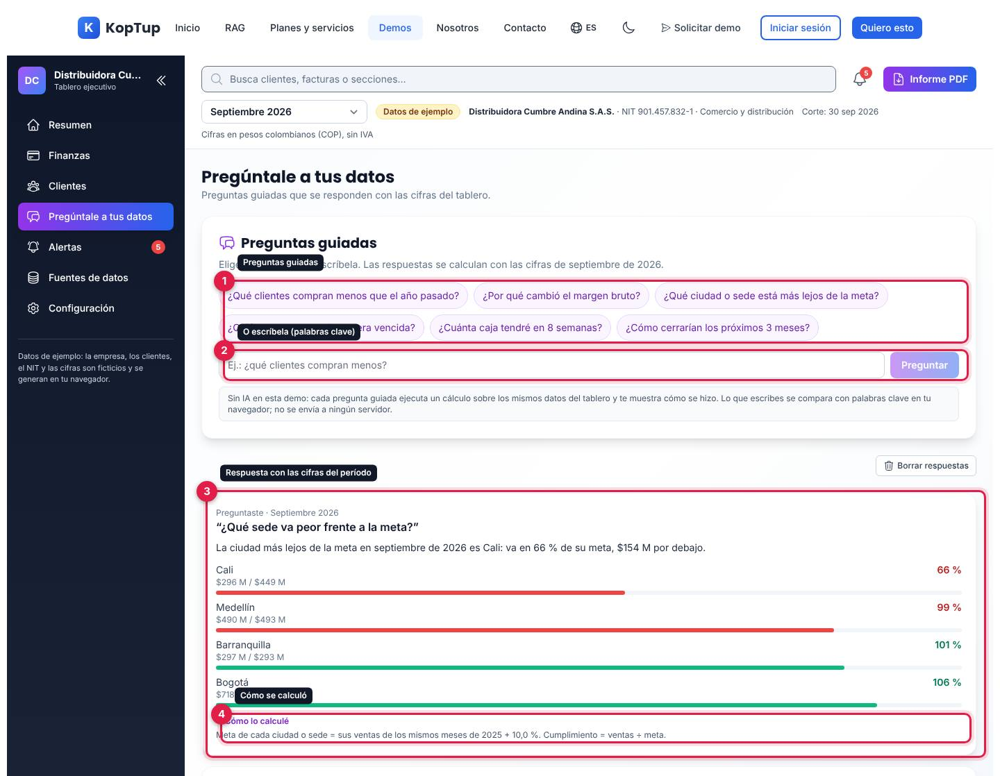

*Pregunta escrita «¿Qué sede va peor frente a la meta?» con su respuesta y el «Cómo lo calculé» abierto.*

1. **Preguntas guiadas**: seis botones (clientes que compran menos, margen, ciudad más lejos de la meta, cartera vencida, caja en 8 semanas y proyección de los próximos 3 meses).
2. **Campo de texto**: también puedes escribir la pregunta. La demo la compara con palabras clave (por ejemplo «sede» y «meta») y responde la pregunta guiada que más se parece. Si no reconoce nada, lo dice: «Esta demo solo responde las preguntas guiadas de arriba…».
3. **Respuesta**: una frase con las cifras del período y una lista con barras (aquí, Cali 66 %, Medellín 99 %, Barranquilla 101 % y Bogotá 106 %).
4. **Cómo lo calculé**: la fórmula usada.

Las respuestas se acumulan (hasta 10, la más reciente arriba) y **Borrar respuestas** las quita. La nota de la página aclara que no hay IA y que lo escrito no sale del navegador.

Qué decir: «Pregunta como le preguntarías a tu financiero; en tu proyecto, las preguntas libres las responde un modelo de IA sobre tus datos».

### Paso 6. Alertas y el resumen del lunes

Abre **Alertas**.

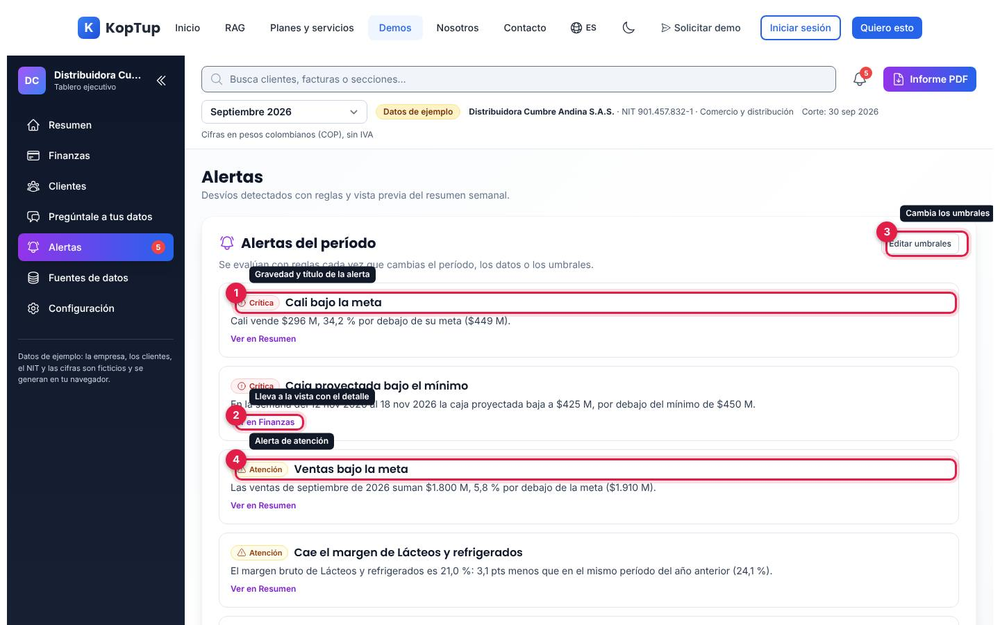

*Las cinco alertas de septiembre de 2026, ordenadas por gravedad.*

1. **Gravedad y título**: Crítica, Atención o Informativa. En el ejemplo: Cali bajo la meta y caja proyectada bajo el mínimo (críticas), ventas bajo la meta y caída del margen de lácteos (atención) y 4 clientes en riesgo (informativa).
2. **Ver en …**: lleva a la vista donde está el detalle.
3. **Editar umbrales**: abre Configuración.
4. Cada alerta trae su cifra y su comparación.

Debajo de la lista, la nota «Reglas» resume cuándo salta cada alerta. Más abajo está la vista previa del resumen semanal:

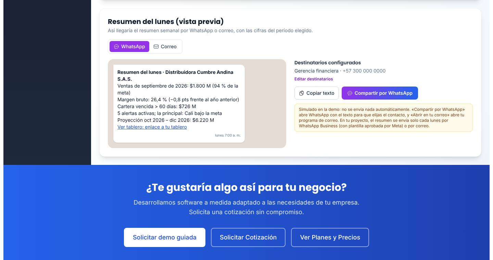

*Vista previa por WhatsApp del «Resumen del lunes» con ventas, margen, cartera, alertas y proyección.*

Las pestañas **WhatsApp** y **Correo** cambian la vista previa. **Copiar texto** copia el mensaje; **Compartir por WhatsApp** abre WhatsApp con el texto para que elijas el contacto; en Correo, **Abrir en tu correo** abre tu programa de correo con los destinatarios de correo, el asunto y el texto. La nota amarilla aclara que en la demo no se envía nada solo.

Qué decir: «Cada lunes a las 7 llega esto a tu WhatsApp, sin abrir el tablero».

### Paso 7. Pruébalo con tus propios números

Abre **Fuentes de datos** y, en **Prueba con tu CSV**, pulsa **Elegir archivo CSV** o arrastra el archivo. En la prueba se usó un CSV ficticio de una ferretería con 333 ventas de enero de 2025 a septiembre de 2026.

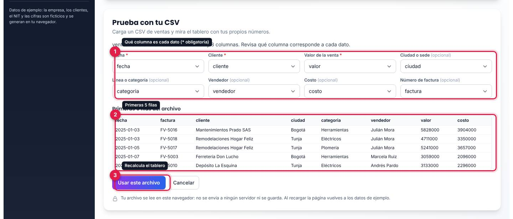

*El archivo leído: 333 filas y 8 columnas, con las columnas reconocidas solas.*

1. **Qué columna es cada dato**: fecha, cliente y valor son obligatorias (con asterisco); ciudad o sede, línea o categoría, vendedor, costo y número de factura son opcionales. La demo adivina la columna por el nombre del encabezado («fecha», «cliente», «valor», «ciudad», «categoria»…), y se puede corregir.
2. **Primeras 5 filas** del archivo.
3. **Usar este archivo**: recalcula el tablero y vuelve al Resumen con el aviso «Tablero recalculado con 333 filas de …».

Con el archivo cargado, la insignia cambia a **Tu archivo**, aparece **Volver a los datos de ejemplo** y el tablero muestra tus ventas, meta, proyección, ciudades, clientes y alertas de ventas. Finanzas solo muestra la utilidad bruta (no hay gastos, cartera ni caja en un CSV de ventas). Al recargar la página vuelves a los datos de ejemplo.

Qué decir: «Esto lo ves hoy con tu Excel; en el proyecto, el tablero se conecta a tu software contable y se actualiza solo».

---

## Pantallas y funciones

### Barra superior y menú lateral

| Elemento | Qué hace |
|---|---|
| **Menú lateral** | Resumen, Finanzas, Clientes, Pregúntale a tus datos, Alertas (con el número de alertas), Fuentes de datos y Configuración. La doble flecha lo contrae a solo íconos. Abajo, una nota recuerda que los datos son ficticios. |
| **Buscador** | Busca secciones, clientes (por nombre, ciudad o vendedor) y, desde 3 caracteres, números de factura (hasta 5). Muestra hasta 10 resultados; se navega con las flechas y Enter. Un cliente abre su ficha; una factura, su detalle. |
| **Campana** | Lista de alertas del período con su gravedad; cada una lleva a su vista. |
| **Informe PDF** | Genera y descarga el PDF del período (ver abajo). Mientras tanto dice «Generando…». |
| **Período** | Mes, trimestre o año a la fecha de 2026. Se recuerda en el navegador. |
| **Insignia** | «Datos de ejemplo» o «Tu archivo». |

### Resumen

Ver los [pasos 1 y 2](#paso-1-cómo-va-el-mes-frente-a-la-meta). Cuatro indicadores (ventas netas, margen bruto, cartera vencida a más de 60 días y ticket promedio; con un CSV sin cartera, la tercera tarjeta pasa a «Clientes con compras»), el gráfico de ventas del año con meta y proyección (o su tabla), ventas por ciudad o sede frente a la meta, ventas por línea de negocio y el resumen automático con **Copiar resumen**.

La proyección usa «mismo mes del año anterior × crecimiento de los últimos 3 meses» cuando hay 15 meses o más de datos, y una tendencia lineal cuando hay entre 4 y 14. La banda del 80 % sale del error que habría tenido el mismo método en los meses ya conocidos.

### Finanzas

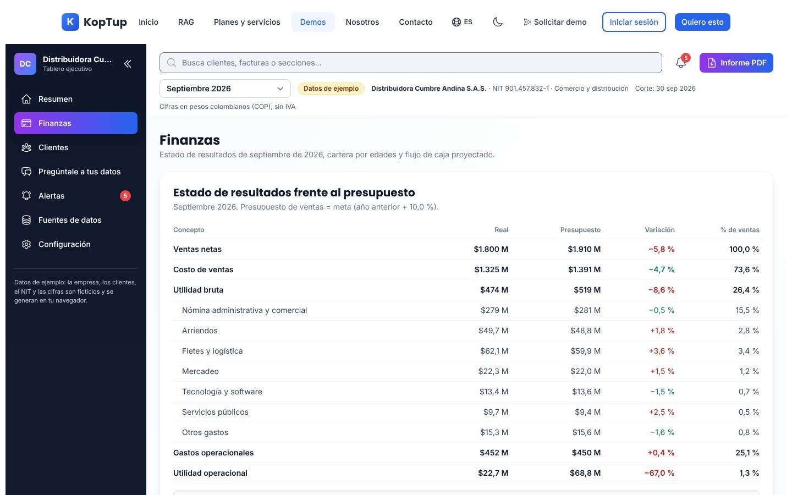

*Estado de resultados de septiembre de 2026 frente al presupuesto.*

- **Estado de resultados frente al presupuesto**: ventas, costo de ventas, utilidad bruta, cada gasto operacional, total de gastos y utilidad operacional, con real, presupuesto, variación (verde si es favorable) y % de ventas. El presupuesto de ventas es la meta; el de costo, la meta por la proporción de costo del año anterior; el de gastos, el mismo período del año anterior + 6 %.
- **Cartera por edades**: barra con Por vencer, 1 a 30, 31 a 60, 61 a 90 y más de 90 días ($3.970 M pendientes al 30 sep 2026), los cinco clientes con más saldo vencido a más de 60 días (cada nombre abre su ficha) y **Exportar cartera (CSV)** (en la prueba, 217 facturas pendientes).
- **Flujo de caja a 13 semanas**: ver el [paso 3](#paso-3-la-caja-de-las-próximas-13-semanas).
- **Movimientos relevantes**: cobros grandes, nómina, arriendo e IVA pagados en el período, con fecha y valor.

Con un CSV propio, Finanzas solo muestra ventas, costo y utilidad bruta (si el archivo trae costo) y el botón para volver a los datos de ejemplo.

### Clientes

Ver el [paso 4](#paso-4-qué-clientes-están-comprando-menos).

- **Segmentos**: Todos (18), Nuevo (2), Recurrente (12) y En riesgo (4) en septiembre de 2026. «Nuevo» es primera compra en los últimos 180 días; «En riesgo», caída de 25 % o más frente al año anterior; «Recurrente», el resto.
- **Buscador** (cliente, ciudad o vendedor), filtro por ciudad y orden (mayores ventas, mayor caída, mayor crecimiento, mayor margen, mayor saldo vencido o nombre). Los encabezados de la tabla también ordenan.
- **Exportar CSV**: descarga la lista filtrada.
- **Ficha del cliente**: ventas del período, variación, margen, plazo y atraso promedio, ventas de los últimos 12 meses, hasta 12 facturas pendientes y las últimas 8 facturas del período, con **Exportar facturas del período**.

### Pregúntale a tus datos

Ver el [paso 5](#paso-5-pregúntale-a-tus-datos). Las preguntas que necesitan cartera o caja no aparecen cuando se usa un CSV propio.

### Alertas

Ver el [paso 6](#paso-6-alertas-y-el-resumen-del-lunes).

| Alerta | Cuándo salta (valores por defecto en comercio) | Gravedad |
|---|---|---|
| Ventas bajo la meta | Ventas más de 5 % por debajo de la meta | Atención; crítica si es más de 10 % |
| Ciudad o sede bajo la meta | Igual, por ciudad o sede | Atención o crítica |
| Cae el margen de una línea | La línea pierde 1,5 pts o más frente al año anterior | Atención |
| Sube la cartera de más de 90 días | Sube 10 % o más frente al cierre del período anterior | Atención |
| Caja proyectada bajo el mínimo | Alguna semana del flujo de caja cierra por debajo de $450 M | Crítica |
| Clientes en riesgo | Hay clientes cuyas compras cayeron 25 % o más frente al mismo período del año anterior | Informativa |
| La proyección queda bajo la meta | El próximo trimestre proyectado queda más de 5 % por debajo de su meta | Informativa |

Las alertas se recalculan al cambiar el período, los datos o los umbrales: en la prueba, con T3 2026 había 4 alertas, con «2026 a la fecha» 3 y con la caja mínima en $300 M, 4.

### Fuentes de datos

- **Fuente de datos activa**: «Datos de ejemplo de Distribuidora Cumbre Andina S.A.S. (Comercio y distribución) · 1.904 facturas · 18 clientes · ene 2025 a sep 2026 · corte 30 sep 2026», con **Descargar CSV de ejemplo** (sirve de plantilla para la prueba con CSV).
- **Prueba con tu CSV**: ver el [paso 7](#paso-7-pruébalo-con-tus-propios-números). Acepta `.csv` o `.txt` de hasta 5 MB y 50.000 filas, separados por punto y coma, coma o tabulador; fechas como 2026-09-30 o 30/09/2026 y valores como 1.250.000, 1250000 o $ 1.250.000. Las filas con fecha, valor o cliente inválidos se ignoran y el aviso dice cuántas.
- **Fuentes que conectamos en tu proyecto**: seis tarjetas informativas (Excel y CSV, Google Sheets, PostgreSQL, Siigo, SAP Business One y HubSpot) con la etiqueta «Se configura en tu proyecto». No son botones: en la demo no hay conexiones.

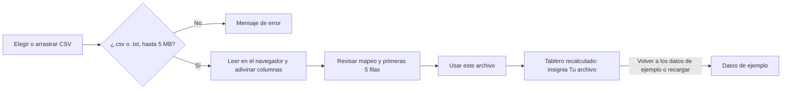

*La prueba con CSV: el archivo nunca sale del navegador.*

### Configuración

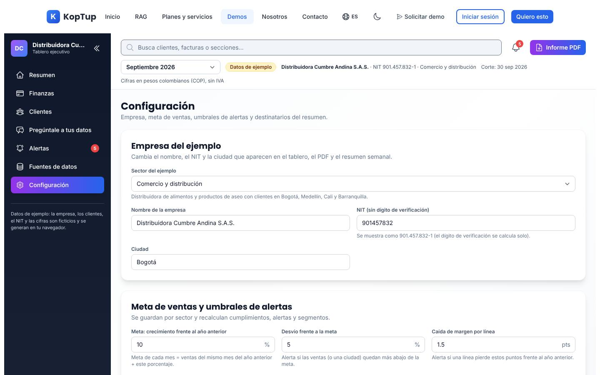

*Empresa del ejemplo y el inicio de «Meta de ventas y umbrales de alertas».*

- **Sector del ejemplo**: Comercio y distribución (Distribuidora Cumbre Andina S.A.S., clientes en Bogotá, Medellín, Cali y Barranquilla), Salud (IPS) (Clínica Ambulatoria Brisas del Río S.A.S., sedes Usaquén, Kennedy, Chía y Soacha) o Servicios profesionales (Meridiano Consultores Asociados S.A.S., oficinas en Bogotá, Medellín, Bucaramanga y Pereira). Cada sector trae sus propias facturas, líneas y gastos.
- **Empresa**: nombre, NIT (el dígito de verificación se calcula solo) y ciudad. Aparecen en el tablero, el PDF y el resumen semanal.
- **Meta y umbrales**: crecimiento de la meta frente al año anterior (10 % en comercio, 12 % en salud y servicios) y cinco umbrales: desvío frente a la meta (5 %), caída de margen por línea (1,5 pts), aumento de cartera a más de 90 días (10 %), caída para «cliente en riesgo» (25 %) y caja mínima (450, 200 o 150 millones según el sector). Se guardan por sector.
- **Destinatarios del resumen del lunes**: nombre o cargo, canal (correo o WhatsApp) y dirección; hasta 10. Por defecto: Gerencia general por correo y Gerencia financiera por WhatsApp, con datos de ejemplo.
- **Guardar cambios** valida los datos (por ejemplo, «El nombre de la empresa no puede quedar vacío.», NIT de 6 a 10 dígitos, meta entre −50 % y 100 %, correo válido, celular de al menos 10 dígitos) y avisa «Configuración guardada en este navegador». **Descartar cambios** vuelve a lo guardado. **Restablecer todo** pide confirmación y vuelve a los datos de ejemplo, la empresa ficticia, las metas y umbrales por defecto y el último mes con datos.

La configuración se guarda solo en este navegador (sobrevive a recargar la página); nadie más la ve.

### Informe PDF

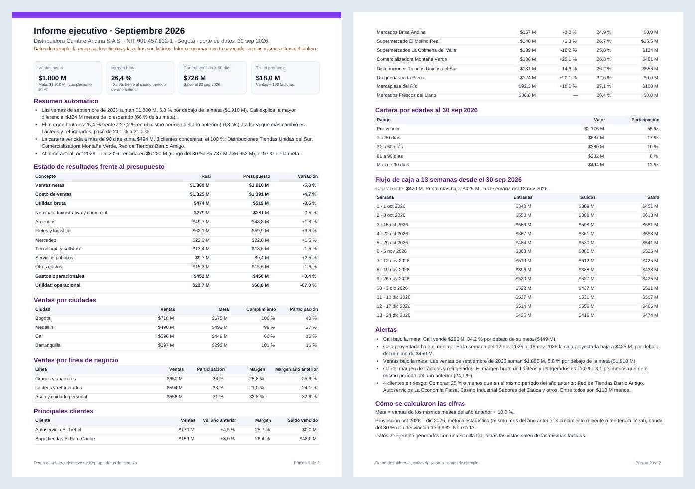

*Las dos páginas A4 del informe de septiembre de 2026.*

El PDF se arma en el navegador con las mismas cifras del tablero: encabezado con la empresa, el NIT, la ciudad y el corte; aviso de datos de ejemplo; los cuatro indicadores; resumen automático; estado de resultados; ventas por ciudad y por línea; principales clientes; cartera por edades; flujo de caja a 13 semanas; alertas y «Cómo se calcularon las cifras». El archivo se llama, por ejemplo, `informe-ejecutivo-distribuidora-cumbre-andina-s-a-s-m-2026-09.pdf`.

### En el celular

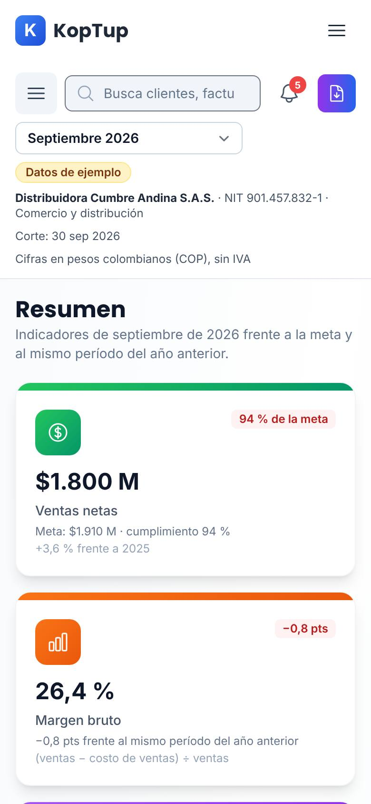

*El Resumen en un teléfono (390 px).*

El menú lateral se oculta y se abre con el botón de tres rayas de la barra del tablero; el botón del PDF queda solo con el ícono; los indicadores se apilan; Clientes pasa de tabla a tarjetas. En la prueba, ninguna sección se desbordó a lo ancho.

---

## Qué es real y qué es simulado

| Parte | Real o simulado | Detalle |
|---|---|---|
| Empresas, NIT, clientes, vendedores, facturas y gastos | **Datos de ejemplo** | Se generan en el navegador con una semilla fija: siempre son los mismos. |
| KPIs, estado de resultados, cartera, flujo de caja, segmentos y ranking | **Real (en el navegador)** | Se calculan con las facturas de ejemplo o con tu CSV, y cuadran entre vistas (hay pruebas automáticas que lo verifican). |
| Proyección | **Real, estadística** | Método estacional o tendencia lineal con banda del 80 %. No usa IA. |
| Resumen automático y alertas | **Real, con reglas** | Textos armados con plantillas a partir de las cifras. No usa IA. |
| Pregúntale a tus datos | **Real, con palabras clave** | Solo responde 6 preguntas guiadas; no entiende preguntas libres. Lo escrito no se envía a ningún servidor. |
| Prueba con tu CSV | **Real (en el navegador)** | El archivo se lee en el navegador; no se sube ni se guarda. |
| Exportaciones CSV e informe PDF | **Real** | Se descargan de verdad, generados en el navegador. |
| Resumen del lunes | **Vista previa** | No se envía nada solo. «Compartir por WhatsApp» y «Abrir en tu correo» abren WhatsApp o tu correo con el texto. |
| Conectores (Siigo, SAP Business One, HubSpot…) | **Informativo** | Solo describen lo que se configura en un proyecto. |
| Dónde se guardan tus cambios | **Solo en este navegador** | Configuración y período en `localStorage`; el CSV cargado se pierde al recargar. La demo no llama al backend. |

---

## Acceso

**Cómo la ve un visitante.** La demo es **Abierta** (`publico`): cualquiera entra a `/demo/dashboard-ejecutivo` sin cuenta y sin pantalla de acceso. En el hub `/demo` su tarjeta se llama «Dashboard Ejecutivo» (insignias «Abierta» y «KPIs», «Panel con KPIs, finanzas y reportes») y tiene **Probar Demo** (abre la demo) y **Solicitar demo guiada** (`/solicitar-demo?demos=dashboard-ejecutivo`). Al final de la demo está el bloque «¿Te gustaría algo así para tu negocio?» con **Solicitar demo guiada**, **Solicitar Cotización** (`/contact`) y **Ver Planes y Precios** (`/services#planes-rag`).

**Cómo se solicita.** No hace falta solicitarla. Quien quiera verla con sus propios datos usa **Solicitar demo guiada**; la solicitud llega a **Admin › Solicitudes de demo** como cualquier otra y sirve para agendar la reunión.

**Cómo la controla el admin.** El modo sale del catálogo del servidor y se cambia en **Admin › Catálogo de demos**. Si se pasa a «Con solicitud» o «Solo por invitación», los visitantes verán la pantalla de acceso y los accesos se conceden en **Admin › Solicitudes de demo** y **Admin › Accesos a demos**; si se desactiva, el visitante ve que la demo está en mantenimiento y el equipo sigue entrando. Si el backend no responde, la demo sigue abierta porque así está en la tabla de respaldo de la web. Detalle en el [Manual del administrador](Doc-06-Manual-del-Administrador.md) y en [Flujos del visitante](Doc-04-Flujos-del-Visitante.md).

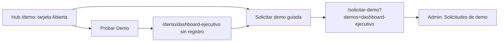

*Dos caminos: probarla de una vez o pedir una demo guiada.*

---

## Limitaciones conocidas

1. **No hay IA.** El plan del producto se llama «Dashboard ejecutivo con IA», pero la demo no usa ningún modelo: el resumen y las alertas salen de reglas, la proyección es estadística y «Pregúntale a tus datos» solo reconoce seis preguntas por palabras clave. La propia página lo dice en varias notas, así que no hay que prometer otra cosa en la presentación.
2. **El selector de período solo ofrece 2026** (meses, trimestres y año a la fecha). Los meses de 2025 existen en los datos, pero solo se usan como comparación.
3. **La caja al corte ya está por debajo del mínimo y no salta alerta por eso.** En el ejemplo, la caja al 30 sep 2026 es $420 M y la caja mínima $450 M; la alerta y la cifra «Semana de menor caja» ($425 M) solo miran el saldo de cierre de cada semana, así que la «menor caja» que muestra es mayor que la caja de hoy.
4. **El texto de «En riesgo» se presta a confusión**: «compra 25 % o menos que en el mismo período del año anterior» quiere decir que sus compras cayeron 25 % o más.
5. **Con tu CSV, parte del tablero no aplica**: Finanzas solo muestra la utilidad bruta, no hay cartera ni flujo de caja, y desaparecen las preguntas y alertas que dependen de ellos. Al recargar, el archivo se descarta (es a propósito y la página lo avisa).
6. **El resumen del lunes no se envía solo.** En la vista previa el enlace dice «enlace a tu tablero», pero el texto que se copia o se comparte lleva la dirección real de la demo.
7. **En el celular hay dos botones de menú**, uno debajo del otro: el del sitio y el del tablero. El del tablero es el de la barra gris con el buscador.
8. **Para desarrolladores:** la página tiene dos elementos `<main>` anidados (el del sitio y el de la demo), un detalle de accesibilidad.
9. **Todo vive en el navegador**: la configuración no viaja a otro equipo y el vendedor no ve lo que hizo el prospecto.
10. **No encontramos botones muertos.** Todos los botones probados hacen lo que dicen (los conectores son tarjetas informativas, no botones).
