# Guía de la demo: App de domicilios

> Ruta `/demo/delivery` · Modo de acceso: **Con solicitud** · Tipo: **datos de ejemplo** (todo corre en el navegador; no llama al servidor ni a un modelo de IA) · Plan del producto: [App de delivery](Producto-app-delivery.md)

**Resumen.** Es el canal propio de domicilios de un restaurante ficticio (Fogón Demo, con 3 sedes en Bogotá) contado en **4 apps conectadas**: el **Cliente** pide y paga, el **Comercio** (la sede) acepta y prepara, **Operaciones** asigna repartidores y vigila tiempos, y el **Repartidor** recoge y entrega con un código. Un pedido que haces en una app aparece al instante en las otras, y un panel de actividad lo va contando. Está pensada para dueños de restaurantes y cadenas que hoy dependen de los agregadores; se abre solo con un acceso aprobado y lo que haces se guarda solo en tu navegador.

**En esta página:** [Recorrido sugerido](#recorrido-sugerido-demo-comercial-de-5-minutos) · [Pantallas y funciones](#pantallas-y-funciones) · [Qué es real y qué es simulado](#qué-es-real-y-qué-es-simulado) · [Acceso](#acceso) · [Limitaciones conocidas](#limitaciones-conocidas)

*Vista inicial: las cuatro apps (con contadores en rojo), «Avance automático», «Reiniciar demo», el recorrido sugerido (0/5), la app del Cliente dentro de un marco de celular y el panel «Actividad entre apps».*

---

## Recorrido sugerido (demo comercial de 5 minutos)

El guion sigue la barra **Recorrido sugerido: un pedido de punta a punta** que trae la propia demo: cada paso se marca en verde solo cuando lo haces de verdad, y al pulsar un paso la demo te lleva a la app que corresponde. Empieza con los datos limpios: si alguien ya usó la demo en ese navegador, pulsa **Reiniciar demo** y confirma.

> **Ojo con el tiempo:** la sede tiene **45 segundos** para aceptar tu pedido. Si te demoras, el pedido no se pierde: queda «Sin respuesta · escalado a Operaciones» y desde Operaciones lo puedes aceptar en nombre de la sede. Si prefieres no correr, activa **Avance automático**: tu pedido avanza solo un paso cada 4 segundos.

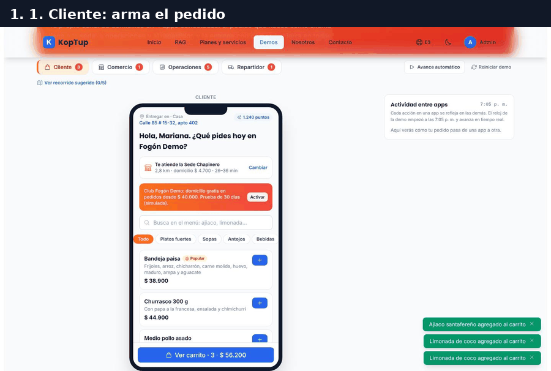

*Recorrido completo: pedido y pago simulado, aceptación en la sede, asignación del repartidor, seguimiento con código, entrega y calificación.*

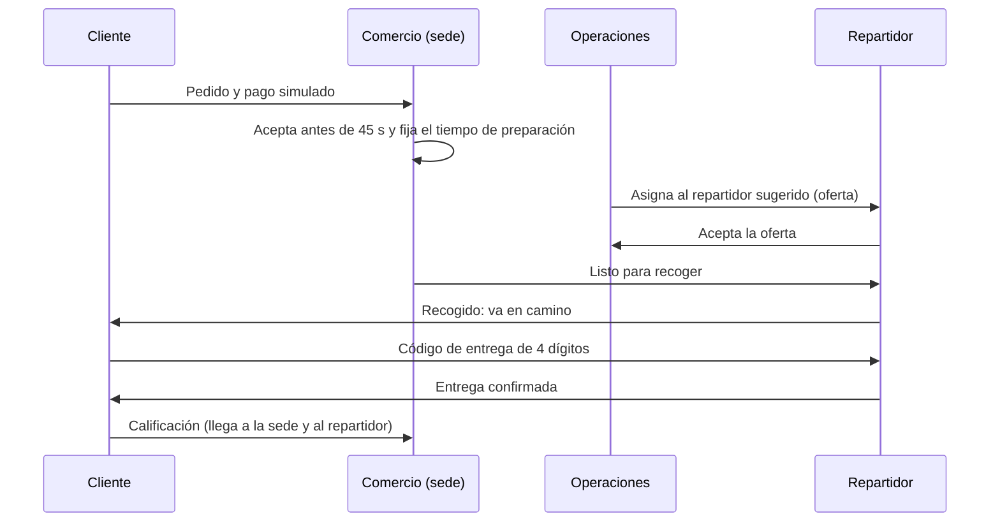

*El mismo pedido pasa por las cuatro apps; cada flecha queda escrita en el panel «Actividad entre apps».*

### Paso 1. Cliente: pide y paga (simulado)

En **Cliente**, busca «ajiaco» y pulsa **+** en Ajiaco santafereño: se abre una ventana para personalizarlo (sin crema, sin alcaparras, con arroz blanco +$3.500). Agrega también dos Limonadas de coco desde la categoría **Bebidas** y pulsa **Ver carrito**. En el carrito elige una propina y el medio de pago.

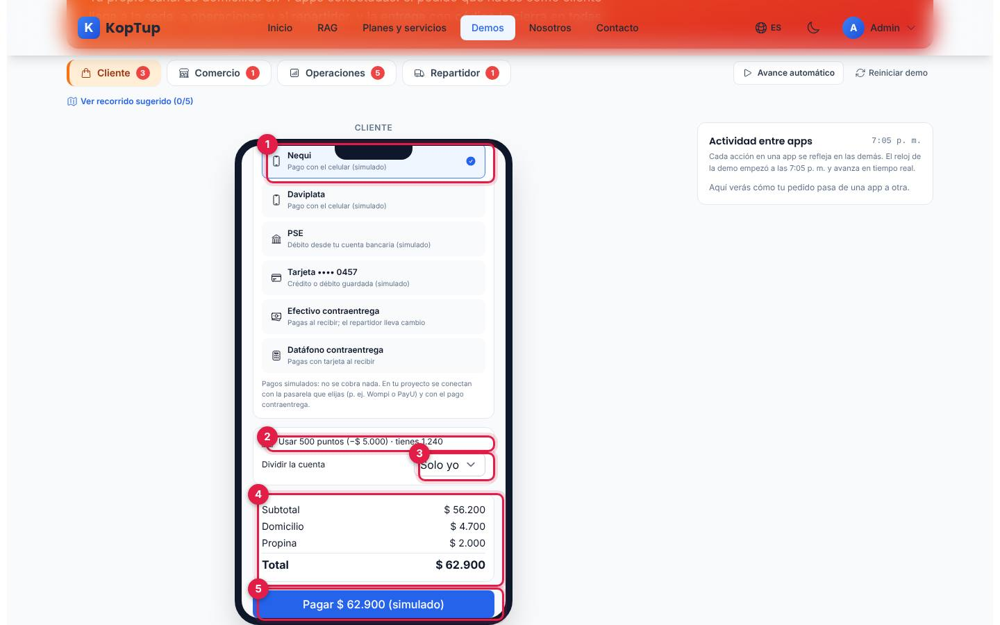

*Carrito con Ajiaco (con arroz blanco) y dos limonadas, propina de $2.000 y pago con Nequi.*

1. **Medio de pago**: Nequi, Daviplata, PSE, tarjeta guardada, efectivo contraentrega (con «¿Con cuánto vas a pagar?» y el cambio que llevará el repartidor) o datáfono contraentrega. Todos los pagos son simulados.
2. **Usar 500 puntos (−$5.000)**: el cliente de ejemplo, Mariana, tiene 1.240 puntos.
3. **Dividir la cuenta**: entre 2, 3 o 4 personas muestra cuánto paga cada una.
4. **Totales**: subtotal $56.200, domicilio $4.700 (según la distancia a la sede), propina $2.000 y total $62.900.
5. **Pagar $62.900 (simulado)**: aparece «Pago aprobado con Nequi (simulado) · pedido P-1036 enviado a la sede». Con pago contraentrega el botón dice «Hacer pedido · pagas $… al recibir».

Más arriba en el carrito quedan la **Nota para la sede** y la **Propina** (sin propina, $2.000, $3.000 o $5.000; «el 100 % es para quien te lleva el pedido»). El seguimiento queda en «Esperando que la sede confirme» con la cuenta regresiva y el botón **Cancelar pedido**.

Qué decir: «El cliente pide en tu propio canal, con tus medios de pago, y la venta es tuya».

### Paso 2. Comercio: acepta antes de 45 segundos

Pulsa **Comercio** (o el paso 2 de la barra). La sede que atiende el pedido ya queda seleccionada.

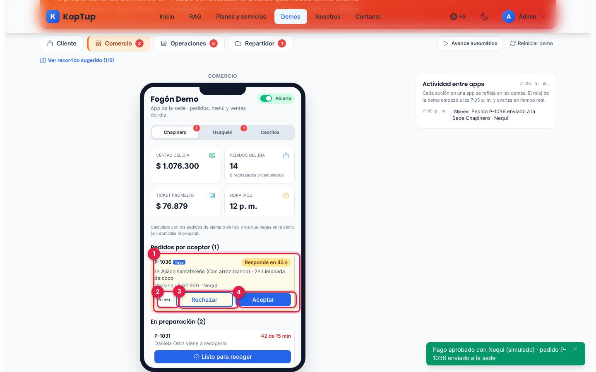

*App de la Sede Chapinero con el pedido P-1036 por aceptar.*

1. **El pedido**: número, la marca «Tuyo», productos con sus opciones, cliente, total y medio de pago, con **Responde en N s**.
2. **Tiempo de preparación**: 15, 20 o 30 minutos.
3. **Rechazar**: pide el motivo (se agotó un producto, la cocina está llena, dirección fuera de cobertura o la sede está por cerrar). El cliente ve el motivo y «No se hizo ningún cobro (simulado)».
4. **Aceptar**: el pedido pasa a **En preparación** con su barra de avance («8 de 20 min»).

Qué decir: «La sede tiene un tiempo límite; si no responde, Operaciones se entera de inmediato».

### Paso 3. Operaciones: asigna al repartidor más cercano

En **Operaciones**, busca tu pedido en la tabla **Despacho** (o en **Alertas**, donde sale como «sin repartidor») y pulsa **Asignar**.

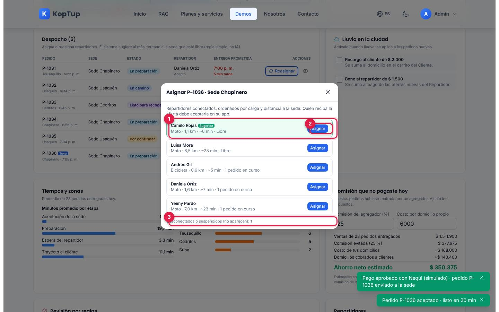

*Ventana «Asignar P-1036 · Sede Chapinero» con los repartidores conectados ordenados por carga y distancia.*

1. **Sugerido**: Camilo Rojas, en moto, a 1,1 km y ~6 minutos de la sede, libre. «El sistema sugiere al más cercano a la sede que esté libre (regla simple, no IA)».
2. **Asignar**: envía la oferta; el aviso dice «Oferta de P-1036 enviada a Camilo Rojas. Mírala en la pestaña Repartidor». En Despacho el pedido queda «Oferta enviada».
3. **Desconectados o suspendidos (no aparecen)**: cuántos repartidores no están disponibles.

### Paso 4. Repartidor: recoge y entrega con el código

En **Repartidor** aparece la oferta (sede de recogida, zona de entrega y lo que gana con el pedido). Pulsa **Aceptar**. Mientras la sede prepara, la tarea dice «La sede aún lo prepara»: vuelve a **Comercio**, pulsa **Listo para recoger**, regresa a **Repartidor** y pulsa **Recogí el pedido**.

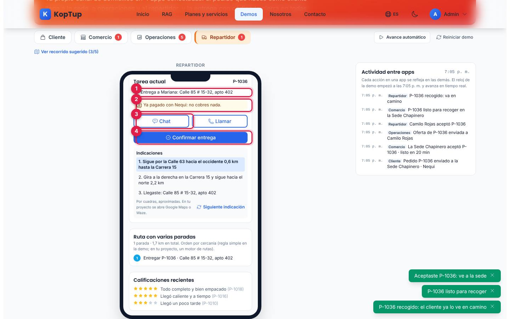

*Tarea actual de Camilo con el pedido en camino, las indicaciones y la ruta.*

1. **Entrega a**: nombre y dirección del cliente.
2. **Cobro**: «Ya pagado con Nequi: no cobres nada» (en contraentrega diría cuánto cobrar en efectivo, con cuánto paga y cuánto cambio llevar, o que se cobra con datáfono).
3. **Chat** con el cliente y **Llamar** (llamada enmascarada simulada: explica el número puente y no llama).
4. **Confirmar entrega**: abre la confirmación con código.

Debajo están las **Indicaciones** por cuadras («Sigue por la Calle 63 hacia el occidente 0,6 km…», con **Siguiente indicación**) y la **Ruta con varias paradas**.

Mientras tanto, el cliente ve su pedido en camino. Ábrelo en **Cliente** para mostrar el código:

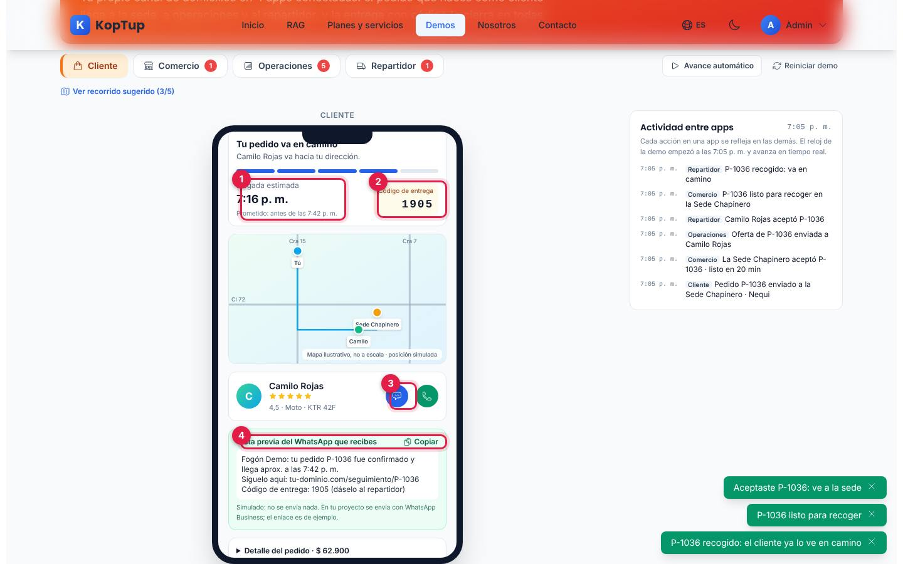

*Seguimiento del cliente: llegada estimada, código de entrega, mapa ilustrativo y la vista previa del WhatsApp.*

1. **Llegada estimada** (7:16 p. m. en la prueba) y la hora prometida.
2. **Código de entrega** (`1905` en la prueba): el cliente se lo da al repartidor.
3. **Chatear con el repartidor** (y el botón verde para llamarlo). El chat se habilita cuando un repartidor acepta y se cierra al entregar.
4. **Vista previa del WhatsApp que recibes**, con el enlace de seguimiento de ejemplo y el código. Es simulado; **Copiar** copia el texto.

Vuelve a **Repartidor**, pulsa **Confirmar entrega** y escribe el código:

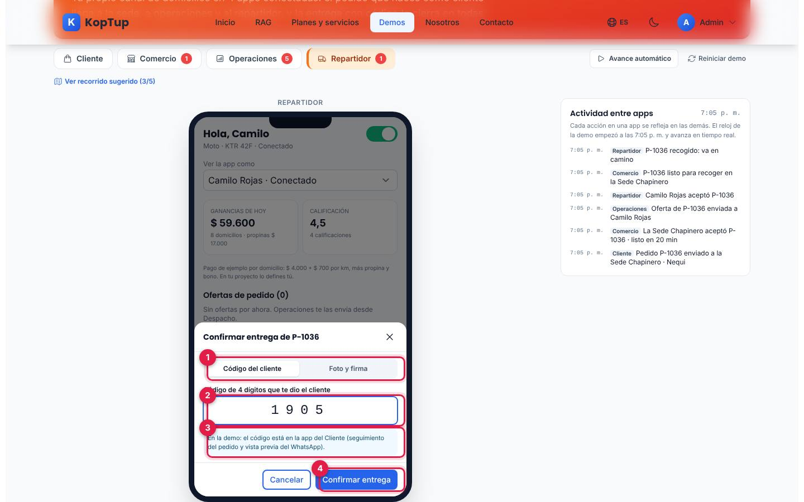

*Ventana «Confirmar entrega de P-1036» con el código que dio el cliente.*

1. **Código del cliente** o **Foto y firma** (la alternativa pide una foto y una firma con el dedo o el mouse; las dos quedan solo en el navegador).
2. **Código de 4 dígitos**: si no coincide, dice «El código no coincide. Pídeselo de nuevo al cliente».
3. **Pista de la demo**: dónde encontrar el código (en los pedidos de ejemplo la pista muestra el código directamente).
4. **Confirmar entrega**: «Pedido P-1036 entregado».

Qué decir: «Sin código no hay entrega: se acaban los "yo no recibí nada"».

### Paso 5. Cliente: califica la entrega

En **Cliente** el pedido dice «¡Pedido entregado!». Elige las estrellas, escribe un comentario opcional y pulsa **Enviar calificación**.

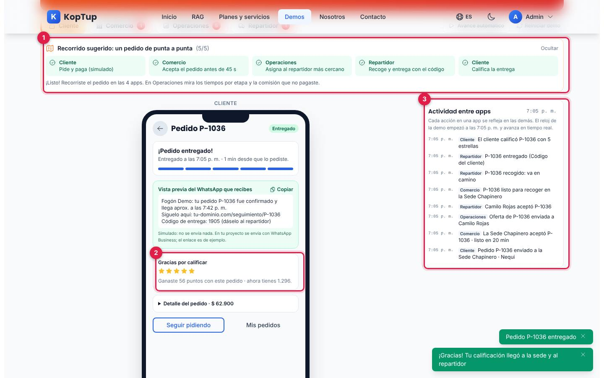

*Recorrido completo (5/5), la calificación enviada y todo lo que pasó, contado en el panel de actividad.*

1. **Recorrido sugerido (5/5)**: «¡Listo! Recorriste el pedido en las 4 apps. En Operaciones mira los tiempos por etapa y la comisión que no pagaste».
2. **Gracias por calificar**: las estrellas y los puntos ganados («Ganaste 56 puntos con este pedido · ahora tienes 1.296»: 1 punto por cada $1.000 del subtotal).
3. **Actividad entre apps**: cada evento con la hora del reloj de la demo y la app que lo hizo (Cliente, Comercio, Operaciones, Repartidor).

Cierra en **Operaciones** con [Tiempos y zonas y la comisión que no pagaste](#operaciones).

---

## Pantallas y funciones

### Controles de la página

| Elemento | Qué hace |
|---|---|
| **Pestañas** Cliente, Comercio, Operaciones y Repartidor | Cambian de app. El número en rojo es lo pendiente en cada una: productos en el carrito, pedidos por aceptar, alertas y ofertas de pedido. |
| **Avance automático** | Simula a la sede, a operaciones y al repartidor: tu pedido más reciente avanza un paso cada 4 segundos (acepta con 15 min, asigna al sugerido, el repartidor acepta, queda listo, se recoge y se entrega con el código). |
| **Reiniciar demo** | Pide confirmación y borra tus pedidos y cambios; vuelve la jornada de ejemplo de las 7:05 p. m. |
| **Recorrido sugerido** | Los 5 pasos, marcados según lo que hiciste; se oculta con **Ocultar** y se vuelve a abrir con **Ver recorrido sugerido (N/5)**. Si tu pedido se rechaza o se cancela, lo dice y te pide hacer otro. |
| **Actividad entre apps** | Lo que va pasando, con el reloj de la demo (empieza a las 7:05 p. m. del jueves 8 de octubre de 2026 y avanza en tiempo real). |
| **Datos de ejemplo** | Insignia; al pasar el mouse dice que la marca, las sedes, los clientes, los repartidores y las cifras son ficticios, y que pagos, WhatsApp, llamadas, GPS y mapa son simulados. |

### Cliente

Ver los pasos [1](#paso-1-cliente-pide-y-paga-simulado), [4](#paso-4-repartidor-recoge-y-entrega-con-el-código) y [5](#paso-5-cliente-califica-la-entrega). Además:

- **Entregar en**: direcciones guardadas (Casa y Oficina) y **Agregar una dirección** con la nomenclatura colombiana (tipo de vía, número, cruce, placa y complemento). La demo calcula qué sede la cubre (cobertura de 8 km) y el valor del domicilio; si ninguna sede abierta la cubre, lo dice y deja guardarla igual.
- **Te atiende la Sede…** con distancia, valor del domicilio y tiempo estimado; **Cambiar** muestra las tres sedes (cerrada, fuera de cobertura, disponible) y **Usar la más cercana**.
- **Club Fogón Demo**: **Activar** una prueba de 30 días (simulada) con domicilio gratis en pedidos desde $40.000; el carrito avisa cuánto falta para lograrlo.
- **Menú** con buscador y categorías (Platos fuertes, Sopas, Antojos, Bebidas, Postres), marcas «Popular» y «Agotado en esta sede».
- **Recargo por lluvia**: si Operaciones lo activa, el carrito suma $2.000 a los pedidos nuevos.
- **Mis pedidos**: los pedidos que hiciste en la demo con su estado.
- Si Operaciones bloquea la cuenta del cliente (revisión por reglas), el cliente no puede pedir hasta que la desbloqueen o se reinicie la demo.

### Comercio

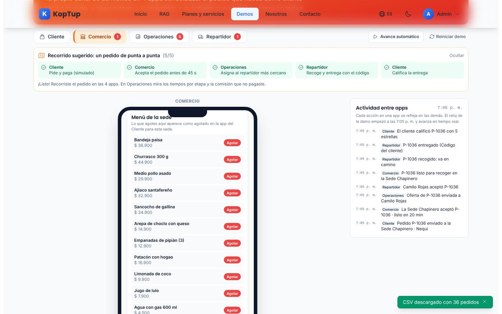

*Menú de la Sede Chapinero: cada plato se puede agotar desde la sede.*

- **Sede**: Chapinero, Usaquén o Cedritos (con el número de pedidos por aceptar), e interruptor **Abierta/Cerrada**. Una sede cerrada no recibe pedidos y al cliente se le ofrece otra.
- **Indicadores del día**: ventas, pedidos (y cuántos rechazados o cancelados), ticket promedio y hora pico, calculados con los pedidos de ejemplo y los tuyos (sin domicilio ni propina).
- **Pedidos por aceptar**, **En preparación** (con el repartidor que viene o «Sin repartidor: lo asigna Operaciones») y **Listos para recoger**.
- **Menú de la sede**: **Agotar** y **Reactivar** cada plato; lo agotado aparece así en la app del Cliente para esa sede.
- **Ventas de hoy**: más vendidos, ventas por hora y calificación promedio con el número de opiniones.

### Operaciones

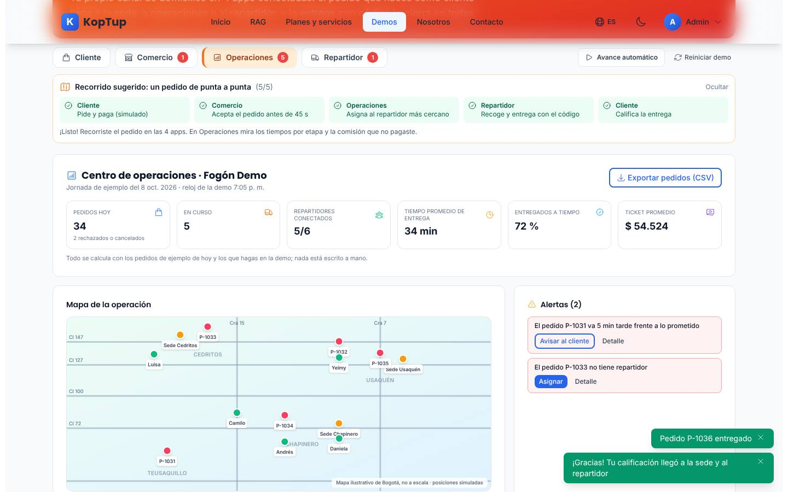

*Centro de operaciones después del recorrido: indicadores, mapa de la operación y alertas.*

- **Indicadores**: pedidos hoy (34 después del recorrido, 2 rechazados o cancelados), en curso, repartidores conectados (5/6), tiempo promedio de entrega, entregados a tiempo y ticket promedio. «Todo se calcula con los pedidos de ejemplo de hoy y los que hagas en la demo».
- **Exportar pedidos (CSV)**: descarga `pedidos-fogon-demo-2026-10-08.csv` con pedido, sede, zona, estado, horas, minutos, a tiempo, valores, medio de pago, repartidor y calificación.
- **Mapa de la operación**: sedes, repartidores conectados y destinos de los pedidos en curso, en un mapa ilustrativo de Bogotá (no a escala; posiciones simuladas).
- **Alertas**: la sede no respondió en 45 s (**Aceptar por la sede** o **Cancelar pedido**), pedido sin repartidor (**Asignar**), pedido tarde frente a lo prometido (**Avisar al cliente**, que escribe en el chat del pedido) y repartidor que rechazó (**Reasignar**). Cada una tiene **Detalle** con la línea de tiempo del pedido.
- **Despacho**: pedidos en curso con sede, estado, repartidor, entrega prometida y minutos de retraso; **Asignar**, **Reasignar** y el ojo para ver el detalle.
- **Lluvia en la ciudad**: **Recargo al cliente de $2.000** y **Bono al repartidor de $1.500**, para pedidos y ofertas nuevos.

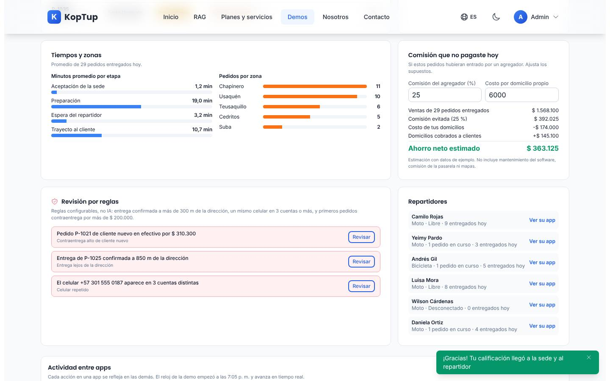

*Tiempos por etapa, pedidos por zona, comisión que no pagaste, revisión por reglas y la lista de repartidores.*

- **Tiempos y zonas**: minutos promedio por etapa (aceptación, preparación, espera del repartidor y trayecto) y pedidos por zona.
- **Comisión que no pagaste hoy**: con una comisión de agregador del 25 % y $6.000 de costo por domicilio propio (los dos se pueden cambiar), compara la comisión evitada con el costo de tus domicilios y lo cobrado a los clientes. En la prueba: ahorro neto estimado de $363.125 sobre 29 pedidos entregados.
- **Revisión por reglas** («reglas configurables, no IA»): entrega confirmada a más de 300 m de la dirección, un mismo celular en 3 cuentas o más, y primer pedido contraentrega por más de $200.000. **Revisar** explica el riesgo y permite **Descartar (falsa alarma)**, **Bloquear cuenta** o, en la de GPS, **Suspender al repartidor**. Las cuentas bloqueadas se listan con **Desbloquear**.
- **Repartidores**: estado (libre, pedidos en curso, desconectado o suspendido) y entregas del día; **Ver su app** abre la app del Repartidor como esa persona.

### Repartidor

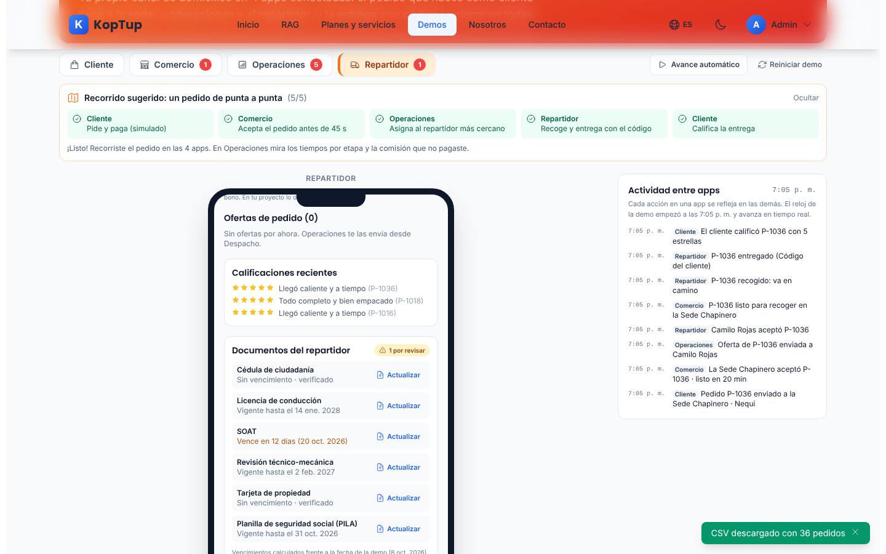

*Calificaciones recientes y documentos de Camilo, con el SOAT por vencer.*

- **Ver la app como**: cualquiera de los seis repartidores de ejemplo; interruptor **Conectado/Desconectado** (no deja desconectarse con pedidos u ofertas pendientes).
- **Ganancias de hoy** y **Calificación**. Pago de ejemplo por domicilio: $4.000 + $700 por km, más propina y bono.
- **Ofertas de pedido**: **Aceptar** o **Rechazar** con motivo (me queda muy lejos, no tengo espacio en el maletín, estoy terminando otro pedido); el rechazo vuelve a Operaciones como alerta.
- **Tarea actual**, **Indicaciones**, **Ruta con varias paradas** (orden por cercanía: «regla simple en la demo») y **Calificaciones recientes**. Ver el [paso 4](#paso-4-repartidor-recoge-y-entrega-con-el-código).
- **Documentos del repartidor**: cédula, licencia, SOAT, técnico-mecánica, tarjeta de propiedad y planilla de seguridad social, con vencimientos frente a la fecha de la demo (avisa con 15 días o menos). **Actualizar** pide el archivo y una nueva fecha; el archivo no sale del navegador (solo se guarda su nombre).

### En el celular

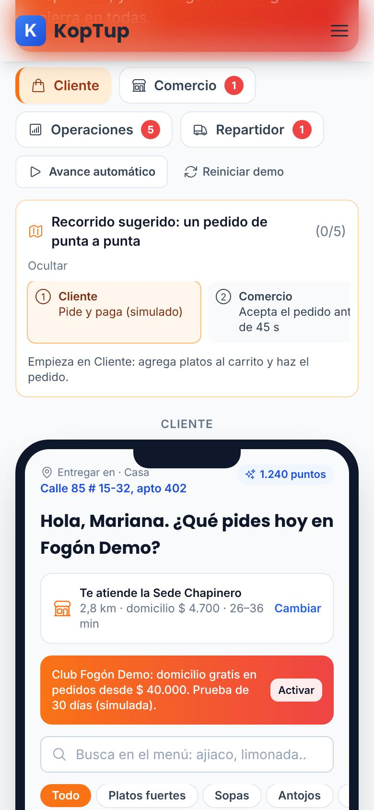

*La demo en un teléfono (390 px): pestañas en dos filas, el recorrido y la app del Cliente.*

En el teléfono las pestañas pasan a dos filas, los pasos del recorrido se desplazan de lado y el panel de actividad queda debajo de la app. La página no se desborda a lo ancho.

---

## Qué es real y qué es simulado

| Parte | Real o simulado | Detalle |
|---|---|---|
| Marca, sedes, menú, clientes, repartidores y la jornada de pedidos | **Datos de ejemplo** | Fogón Demo y su jornada del 8 de octubre de 2026 son ficticios; se generan siempre iguales. |
| Paso del pedido entre las 4 apps, estados, tiempos y código de entrega | **Real (en el navegador)** | Un solo estado compartido; cada acción se registra en «Actividad entre apps». |
| Precios, domicilio por distancia, propina, puntos, división de la cuenta y recargo por lluvia | **Real (cálculo)** | Distancias aproximadas por cuadras con la nomenclatura. |
| Indicadores, tiempos por etapa, pedidos por zona, comisión evitada y CSV | **Real (cálculo)** | Salen de los pedidos de ejemplo más los tuyos. |
| Sugerencia de repartidor, ruta con varias paradas y revisión por reglas | **Reglas, no IA** | Lo dicen las propias pantallas. |
| Pagos (Nequi, Daviplata, PSE, tarjeta) | **Simulado** | Siempre aprobados; no se cobra nada. |
| WhatsApp al cliente y llamada enmascarada | **Simulado** | Vista previa y ventana explicativa; no se envía ni se llama. |
| Mapa, posición del repartidor e indicaciones | **Simulado** | Mapa ilustrativo, no a escala. |
| Foto, firma y documentos del repartidor | **Solo en el navegador** | No se suben a ningún servidor. |
| Dónde se guardan tus cambios | **Solo en este navegador** | `localStorage`; no llegan a un servidor ni los ven otras personas. |

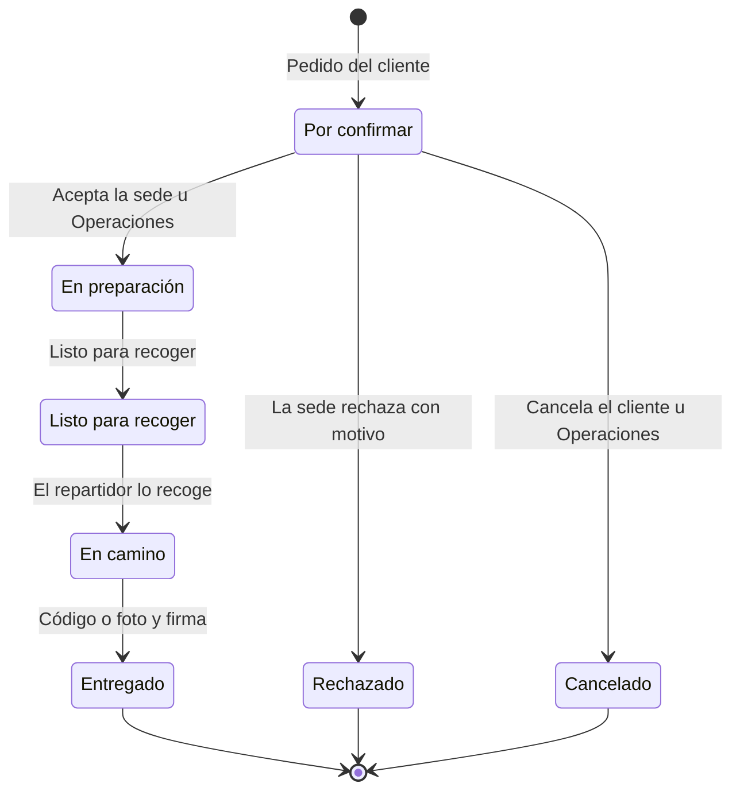

*Estados de un pedido en la demo. La asignación del repartidor (oferta enviada, aceptada o rechazada) corre en paralelo mientras el pedido se prepara.*

---

## Acceso

**Cómo lo ve un visitante.** La demo aparece en `/demo` con la insignia «Requiere acceso» y los botones **Solicitar acceso** y **Ya tengo acceso: iniciar sesión**. Si alguien abre `/demo/delivery` sin sesión, la web muestra en la misma dirección la pantalla de acceso:

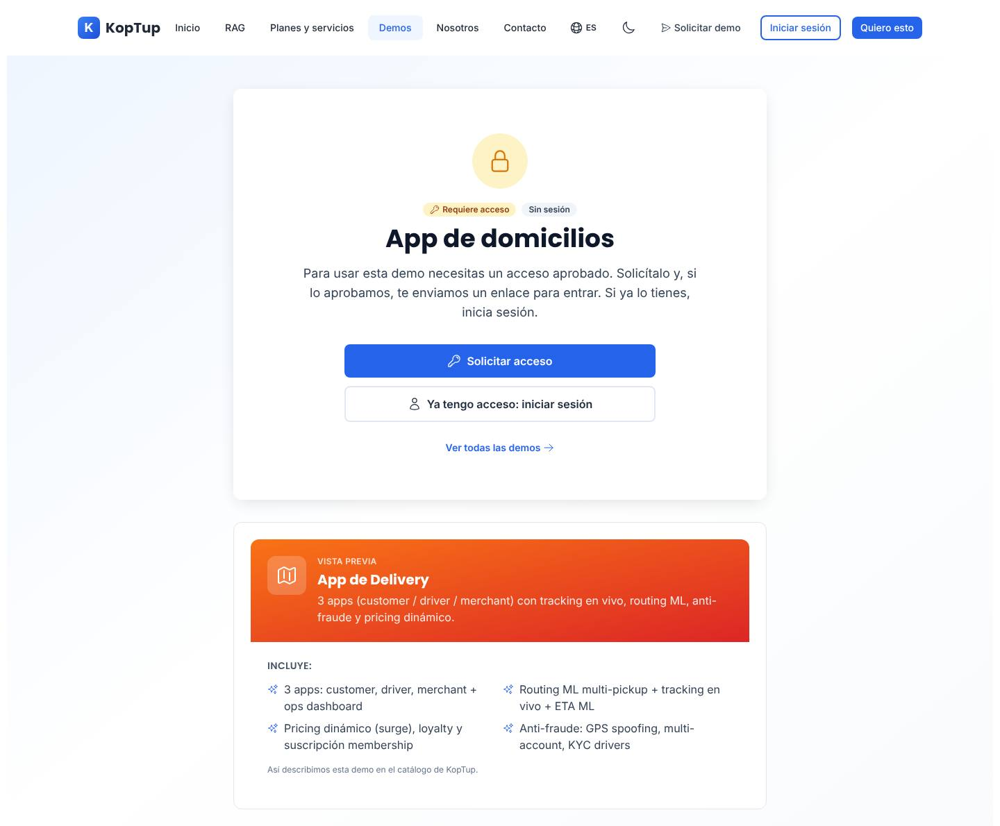

*Lo que ve un visitante sin sesión: «Requiere acceso», «Sin sesión» y los botones para pedir la demo o iniciar sesión. Debajo, una vista previa con el texto del catálogo.*

- **Solicitar acceso** abre `/solicitar-demo?demos=delivery` con la app de domicilios ya elegida.
- **Ya tengo acceso: iniciar sesión** lleva a `/login` y, al entrar, vuelve a la demo.
- **Ver todas las demos** vuelve a `/demo`.
- Con sesión pero sin acceso, la misma pantalla dice que la cuenta todavía no tiene acceso; si el acceso venció o fue retirado, ofrece pedir más tiempo o solicitarlo de nuevo.

**Cómo se concede.** La solicitud llega a **Admin › Solicitudes de demo**. Pueden aprobarla los roles **admin** y **sales**. Al aprobar, se crea o se reutiliza la cuenta del prospecto, el acceso dura 14 días por defecto (se extiende o se revoca en **Admin › Accesos a demos**) y la persona recibe un correo con la decisión (con el enlace de activación si su cuenta es nueva). El equipo de KopTup (admin, manager, sales y developer) abre la demo sin solicitud. Solo el admin cambia el modo de acceso, en **Admin › Catálogo de demos**. Detalle en el [Manual del administrador](Doc-06-Manual-del-Administrador.md) y en [Flujos del visitante](Doc-04-Flujos-del-Visitante.md).

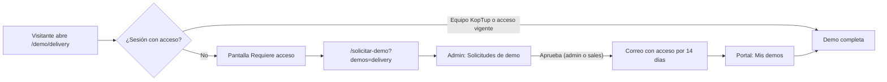

*Camino de un visitante hasta la demo.*

---

## Limitaciones conocidas

1. **La vista previa promete más de lo que hace la demo.** La tarjeta del hub y la pantalla de acceso hablan de «routing ML», «tracking en vivo + ETA ML», «pricing dinámico (surge)», «suscripción membership» y «KYC drivers». La demo sugiere repartidores y ordena paradas con reglas simples, el mapa y la posición son simulados, el único recargo es el fijo por lluvia, el club es una prueba simulada y los documentos del repartidor solo se revisan por fecha de vencimiento.
2. **El reloj corre en tiempo real.** La jornada empieza a las 7:05 p. m. y avanza segundo a segundo, así que un recorrido de dos minutos deja tu pedido «entregado … 1 min desde que lo pediste» y baja los promedios de Operaciones. En el seguimiento, la «Llegada estimada» (7:16 p. m. en la prueba) y la hora del WhatsApp («llega aprox. a las 7:42 p. m.», que es la hora prometida) no coinciden.
3. **45 segundos para aceptar.** Si se pasa el tiempo, el pedido no se cancela solo: queda escalado y hay que aceptarlo o cancelarlo desde Operaciones (o usar el Avance automático).
4. **La sede puede marcar «Listo para recoger» en cualquier momento**, aunque no haya pasado el tiempo de preparación elegido.
5. **Pagos siempre aprobados.** No hay caso de pago rechazado.
6. **Los cambios viven solo en el navegador.** Si el prospecto cambia de equipo o borra los datos del sitio, vuelve a la jornada de ejemplo; no hay espacio compartido con el vendedor.
7. **Marcos de celular con desplazamiento propio.** Cada app vive en un marco de 680 px de alto con su propio scroll; en el teléfono queda un «celular dentro del celular» y hay que desplazarse dentro del marco.
8. **Detalle visual:** en el selector del tiempo de preparación de Comercio, la flecha se monta sobre la palabra «min».
