# Guía de la demo: Tienda en línea

> Ruta `/demo/ecommerce` · Modo de acceso: **Abierta** · Tipo: **datos de ejemplo** (todo corre en el navegador; pagos, factura y guías simulados; sin backend ni IA) · Plan del producto: [Tienda en línea (e-commerce)](Producto-ecommerce.md)

**Resumen.** Es una tienda en línea de ejemplo para Colombia vista de punta a punta: el cliente compra en la tienda (catálogo de 24 productos, carrito con reglas de precio y cupón, pago simulado con tarjeta, PSE, Nequi, Daviplata, contraentrega o Addi) y el mismo pedido aparece en el panel de la tienda, en logística (guía y seguimiento simulados, devoluciones) y en los reportes de ventas exportables a CSV. Está pensada para comercios y marcas que quieren vender directo en internet y ver cómo se conecta la operación. Cualquier visitante la abre sin registrarse.

**En esta página:** [Recorrido sugerido](#recorrido-sugerido-demo-comercial-de-5-minutos) · [Pantallas y funciones](#pantallas-y-funciones) · [Qué es real y qué es simulado](#qué-es-real-y-qué-es-simulado) · [Acceso](#acceso) · [Limitaciones conocidas](#limitaciones-conocidas)

*Vista inicial: barra de vistas (Tienda, Carrito y pago, Panel de la tienda, Logística y Reportes), insignia «Datos de ejemplo», **Restablecer**, el panel «Recorrido sugerido (0/5)» y la portada de la tienda.*

---

## Recorrido sugerido (demo comercial de 5 minutos)

Este guion sigue el panel **Recorrido sugerido** que trae la propia demo: cada paso se marca en verde cuando lo haces de verdad y el contador sube hasta (5/5). Un clic en un paso lleva a su vista (si ya estás en ella, un aviso te dice dónde se hace). Empieza con los datos limpios: si alguien ya usó la demo en ese navegador, pulsa **Restablecer** y confirma.

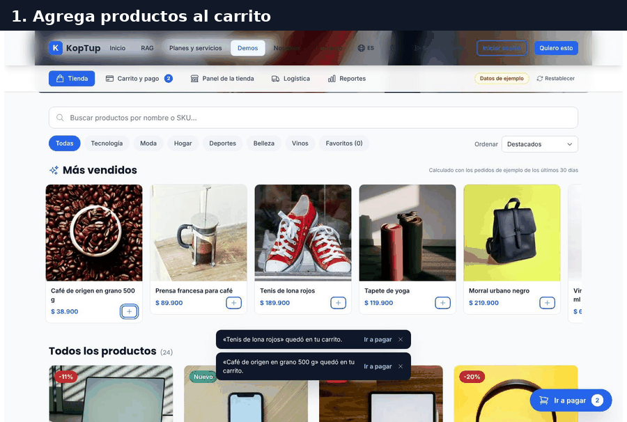

*Recorrido completo: carrito, cupón, datos de envío, pago simulado, confirmación, panel, guía, seguimiento y reportes.*

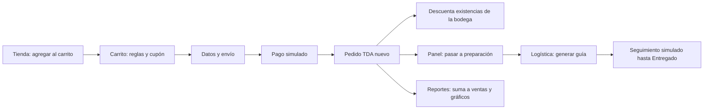

*Cómo viaja un pedido entre las vistas: todas leen y escriben los mismos datos del navegador.*

### Paso 1. Tienda: agrega productos al carrito

En **Tienda**, agrega dos productos (en la prueba, Tenis de lona rojos y Café de origen en grano 500 g, desde la fila «Más vendidos»).

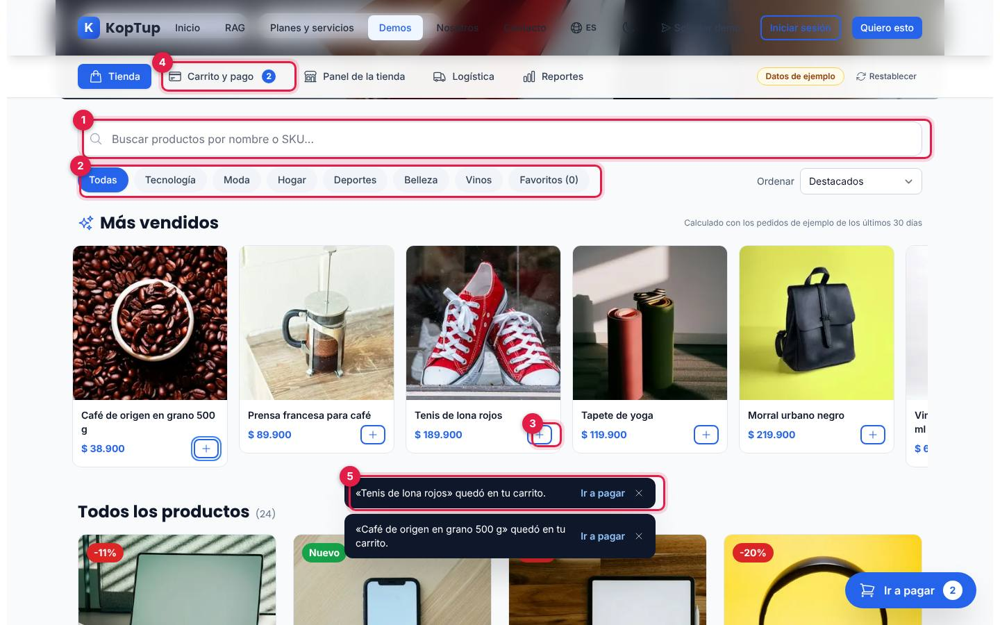

*La tienda después de agregar dos productos: el contador del carrito marca 2 y los avisos ofrecen «Ir a pagar».*

1. **Buscar**: por nombre o SKU, con sugerencias mientras escribes.
2. **Categorías**: Todas, Tecnología, Moda, Hogar, Deportes, Belleza, Vinos y Favoritos (los que marcas con el corazón). A la derecha, **Ordenar**: Destacados, precio menor o mayor y mejor calificados.
3. **+ / Agregar**: suma una unidad al carrito. No deja pasar de las existencias («No hay más unidades disponibles…»).
4. **Carrito y pago**: la pestaña muestra cuántas unidades llevas. Abajo a la derecha aparece además el botón flotante **Ir a pagar**.
5. **Aviso**: «… quedó en tu carrito» con **Ir a pagar**; dura 5 segundos y se cierra con la X.

Qué decir: «El cliente encuentra rápido lo que busca y ve en todo momento cuánto lleva».

### Paso 2. Carrito, datos de envío y pago simulado

Abre **Carrito y pago**. Escribe el cupón `BIENVENIDA10` y pulsa **Aplicar**.

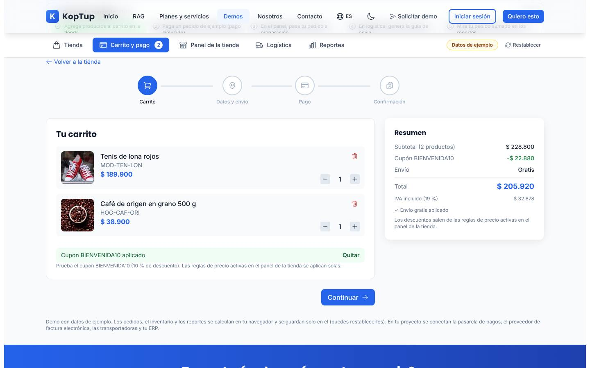

*Carrito con el cupón aplicado: subtotal $228.800, cupón −$22.880, envío gratis y total $205.920 con IVA incluido.*

El resumen se recalcula al instante con las reglas de precio activas en el panel (envío gratis desde $150.000, 10 % si el carrito supera $300.000, etc.). Pulsa **Continuar**, luego **Usar datos de ejemplo** en «Datos y dirección de envío» y otra vez **Continuar**. En el pago, deja **Tarjeta** y pulsa **Usar tarjeta de prueba aprobada**.

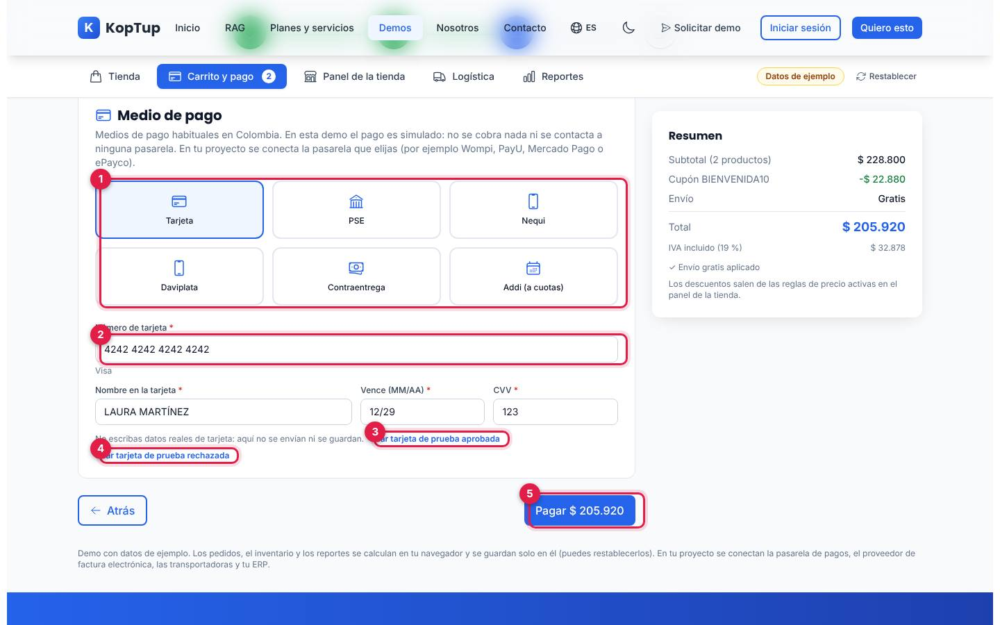

*Paso «Pago» con la tarjeta de prueba aprobada cargada y el resumen a la derecha.*

1. **Medio de pago**: Tarjeta, PSE, Nequi, Daviplata, Contraentrega y Addi (a cuotas). Cada uno explica qué pasaría en una tienda real; Nequi y Daviplata piden el celular; Addi aplica desde $150.000.
2. **Número de tarjeta**: se valida (algoritmo de Luhn) y la demo reconoce la marca (Visa, Mastercard o American Express). También valida nombre, vencimiento y CVV. «No escribas datos reales de tarjeta: aquí no se envían ni se guardan».
3. **Usar tarjeta de prueba aprobada**: `4242 4242 4242 4242`.
4. **Usar tarjeta de prueba rechazada**: `4000 0000 0000 0002`; al pagar muestra «Pago rechazado por la pasarela simulada…» para enseñar el manejo del rechazo.
5. **Pagar $205.920**: «Procesando pago simulado…» durante un segundo y medio y luego la confirmación.

### Paso 2 (cont.). Confirmación y factura de ejemplo

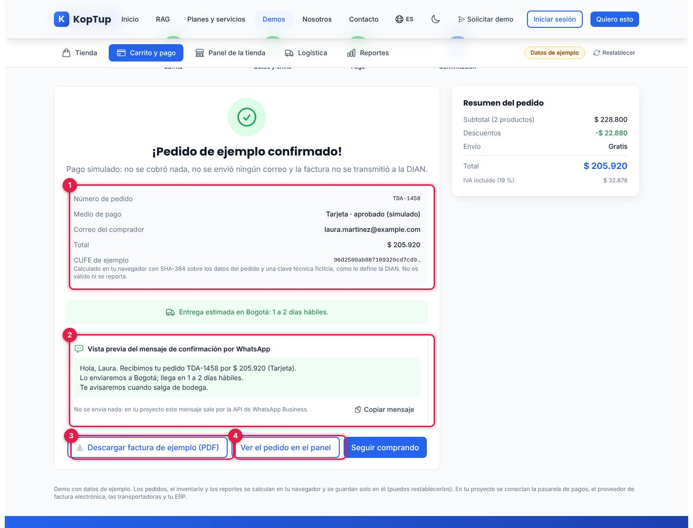

*«¡Pedido de ejemplo confirmado!» con el pedido `TDA-1458`; la confirmación avisa que el pago es simulado y que no se transmitió nada a la DIAN.*

1. **Datos del pedido**: número, medio de pago («aprobado (simulado)»; en contraentrega «pendiente hasta la entrega»), correo, total y **CUFE de ejemplo**, calculado en tu navegador con SHA-384 y una clave técnica ficticia.
2. **Vista previa del mensaje de confirmación por WhatsApp** con **Copiar mensaje**. No se envía nada.
3. **Descargar factura de ejemplo (PDF)**: descarga `factura-ejemplo-TDA-1458.pdf`.
4. **Ver el pedido en el panel**: abre el Panel de la tienda. **Seguir comprando** vuelve a la tienda.

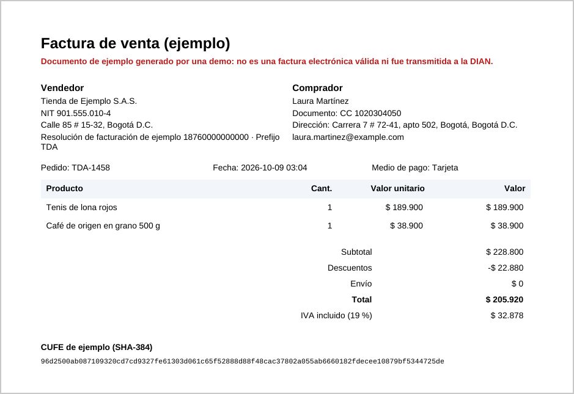

*Primera parte del PDF descargado: vendedor ficticio, comprador, líneas, totales con IVA incluido y el CUFE de ejemplo. Arriba, en rojo, dice que no es una factura electrónica válida.*

Qué decir: «Pago, factura y aviso al cliente en un solo paso; en tu proyecto se conectan tu pasarela, tu proveedor de facturación y WhatsApp».

### Paso 3. Panel de la tienda: pasa tu pedido a preparación

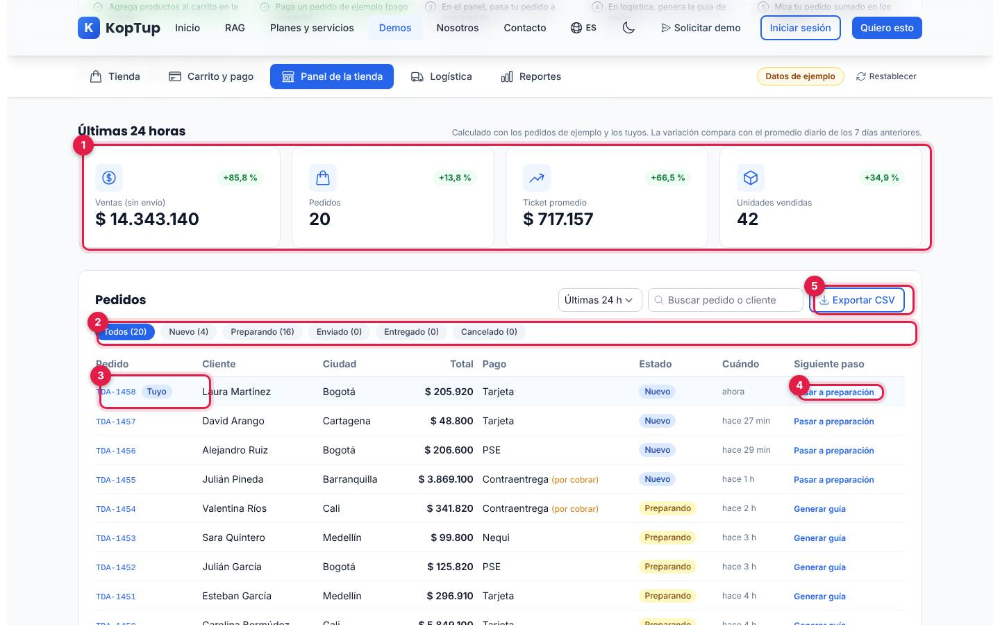

*Panel de la tienda con los indicadores de las últimas 24 horas y la lista de pedidos; tu pedido va primero con la marca «Tuyo».*

1. **Últimas 24 horas**: ventas sin envío, pedidos, ticket promedio y unidades vendidas, con la variación frente al promedio diario de los 7 días anteriores. Incluyen los pedidos de ejemplo y los tuyos.
2. **Filtros por estado**: Todos, Nuevo, Preparando, Enviado, Entregado y Cancelado, con el conteo. A la derecha, el período (24 h, 7 o 30 días) y el buscador por pedido o cliente.
3. **Tu pedido** (`TDA-1458` · **Tuyo**). Un clic en el número abre el detalle (cliente, ciudad, dirección, documento, pago, bodega, guía, líneas y totales).
4. **Siguiente paso**: **Pasar a preparación** en los nuevos, **Generar guía** en los que se están preparando y **Simular siguiente evento** en los enviados.
5. **Exportar CSV**: descarga los pedidos filtrados (`pedidos-tienda-ejemplo-1d.csv` para 24 horas).

Pulsa **Pasar a preparación** en tu pedido: aparece «TDA-1458 pasó a preparación».

### Paso 4. Logística: genera la guía de envío

Abre **Logística**. Tu pedido está en **Por despachar**, al final de la lista (va del más antiguo al más nuevo): pulsa **Ver N más** hasta verlo y luego **Generar guía**. (Atajo: el mismo **Generar guía** está en la fila de tu pedido en el panel).

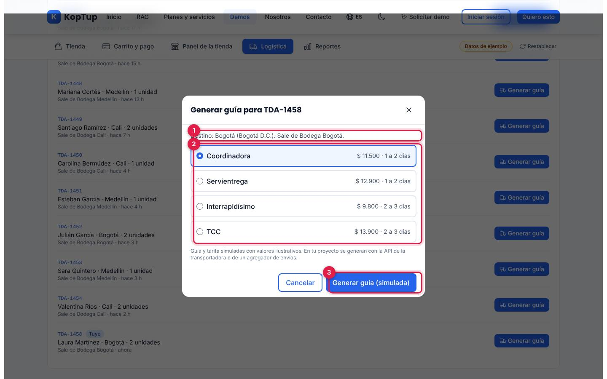

*Ventana «Generar guía para TDA-1458» con las cuatro transportadoras habilitadas.*

1. **Destino** (ciudad y departamento) y **bodega** de salida.
2. **Transportadora**: Coordinadora, Servientrega, Interrapidísimo o TCC, con tarifa y tiempo de ejemplo para ese destino. Solo aparecen las que están habilitadas en la tabla de transportadoras.
3. **Generar guía (simulada)**: el pedido pasa a **Enviado** con una guía tipo `COO-SIM-000001` y aparece en **Envíos en camino** (aviso con **Ver seguimiento**).

En **Envíos en camino**, **Simular siguiente evento** avanza el seguimiento: Guía generada → Recogido en bodega → En tránsito → En reparto → Entregado (al entregarse, un pedido contraentrega queda pagado).

Qué decir: «Despacho sin digitar guías: elige la transportadora con su tarifa y el cliente sigue el envío».

### Paso 5. Reportes: tu pedido sumado

Abre **Reportes**. Con esto el panel del recorrido queda en **(5/5)**.

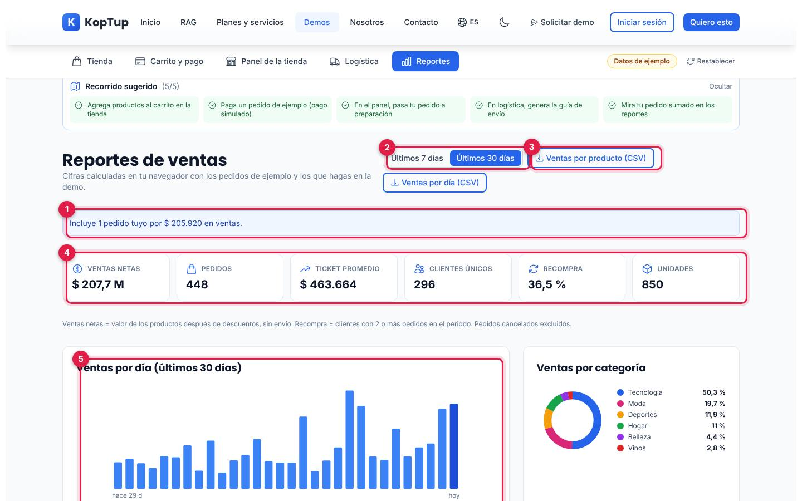

*Reportes de los últimos 30 días con el recorrido completo (5/5) y el aviso «Incluye 1 pedido tuyo por $ 205.920 en ventas».*

1. **Incluye N pedidos tuyos**: confirma que tus compras ya están en las cifras (valor de los productos después de descuentos, sin envío).
2. **Período**: últimos 7 o 30 días.
3. **Exportar**: **Ventas por producto (CSV)** y **Ventas por día (CSV)** (`ventas-por-producto-30d.csv`, `ventas-por-dia-30d.csv`).
4. **Indicadores**: ventas netas, pedidos, ticket promedio, clientes únicos, recompra (clientes con 2 o más pedidos) y unidades. Excluyen los pedidos cancelados.
5. **Ventas por día**: barras con el detalle al pasar el cursor; al lado, ventas por categoría, y más abajo por ciudad, por medio de pago y productos más vendidos.

Qué decir: «Cada venta, de la tienda o del panel, llega sola a los reportes; no hay que consolidar hojas de cálculo».

---

## Pantallas y funciones

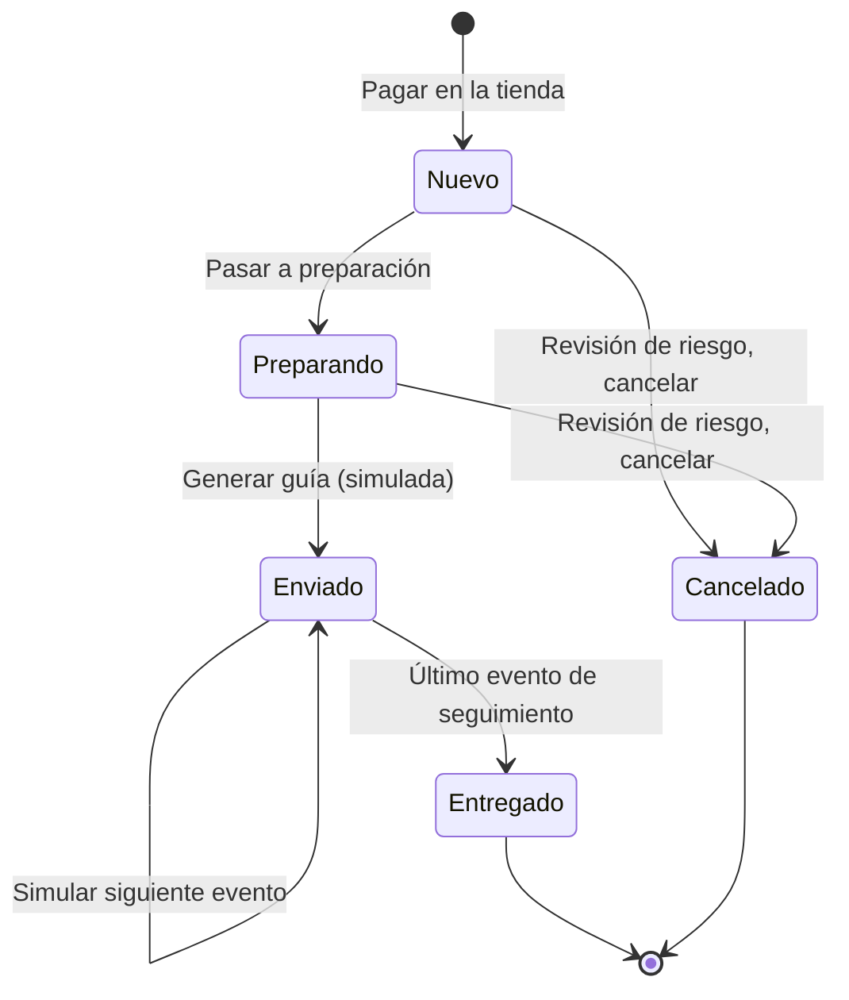

*Estados de un pedido en la demo.*

### Barra de vistas y recorrido

| Elemento | Qué hace |
|---|---|
| **Tienda, Carrito y pago, Panel de la tienda, Logística, Reportes** | Cambian de vista y la guardan en la dirección (`?view=checkout`, `?view=vendor`, `?view=operations`, `?view=admin`). La ruta antigua `/demo/ecommerce/admin` redirige a `?view=admin`. |
| **Datos de ejemplo** | Insignia; al pasar el mouse explica que productos, clientes, pedidos y cifras son ficticios y que pagos, factura y guías son simulados. |
| **Restablecer** | Abre «Restablecer la demo», que dice cuántos pedidos tuyos se borrarán (más productos creados, existencias, reglas y favoritos), y vuelve a la tienda con los datos iniciales. |
| **Recorrido sugerido (N/5)** | Los cinco pasos del guion; se marcan solos. **Ocultar** lo pliega en el enlace «Ver recorrido sugerido (N/5)». |

### Tienda

Ver el [paso 1](#paso-1-tienda-agrega-productos-al-carrito).

- **Portada** con «Envío gratis desde $ 150.000» (o «Envío con tarifa fija» si la regla está apagada) y «Precios en COP con IVA incluido».
- **Más vendidos**: calculados con los pedidos de ejemplo de los últimos 30 días.
- **Todos los productos (24)**: foto, insignias (descuento, Nuevo, Más vendido, Eco, Agotado), calificación, precio con precio anterior tachado, **Agregar**, corazón de favoritos y ojo de vista rápida.
- **Vistos recientemente**: aparece después de abrir productos.

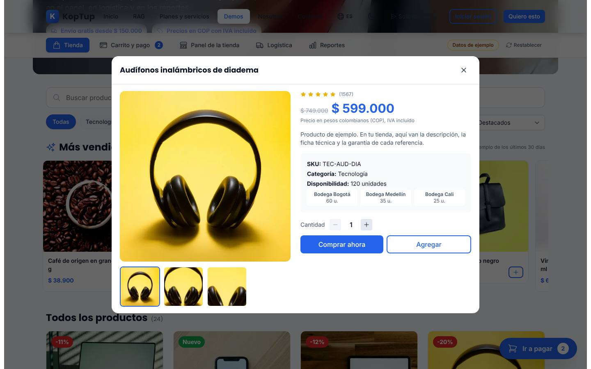

*Vista rápida de «Audífonos inalámbricos de diadema»: galería (foto completa y dos acercamientos), precio, existencias por bodega, cantidad, **Comprar ahora** y **Agregar**.*

### Carrito y pago

Cuatro pasos: Carrito → Datos y envío → Pago → Confirmación (ver el [paso 2](#paso-2-carrito-datos-de-envío-y-pago-simulado)).

- **Carrito**: cantidades con − y + (hasta las existencias), papelera, cupón (`BIENVENIDA10`, 10 %; un código inválido dice «Ese cupón no existe en la tienda de ejemplo») y resumen con «Te faltan $ … para el envío gratis».
- **Datos y envío**: nombre, documento (CC, CE o pasaporte), correo, celular colombiano (10 dígitos que empiezan por 3), ciudad (11 ciudades, cada una con su bodega y días de entrega), dirección y autorización de datos (Ley 1581 de 2012). La opción «Necesito la factura electrónica a nombre de una empresa» pide razón social y NIT de 9 dígitos y calcula el dígito de verificación. Los errores se marcan en rojo con «Revisa los campos marcados en rojo».
- **Pago**: ver el paso 2. Si las existencias cambiaron mientras pagabas, la demo avisa y vuelve al carrito.

### Panel de la tienda

Ver el [paso 3](#paso-3-panel-de-la-tienda-pasa-tu-pedido-a-preparación). Debajo de los pedidos están el catálogo y las reglas de precio:

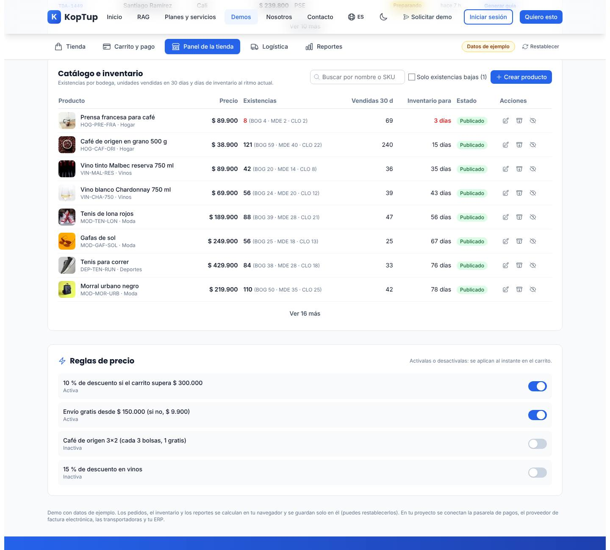

*Catálogo e inventario: primero lo que tiene existencias bajas y luego por días de inventario (la prensa francesa, con 8 unidades, alcanza para 3 días); debajo, las cuatro reglas de precio.*

- **Catálogo e inventario**: precio, existencias por bodega (BOG, MDE, CLO), vendidas en 30 días, días de inventario al ritmo actual y estado (Publicado u Oculto). Buscador, filtro **Solo existencias bajas** y **Ver N más**.
- **Acciones por producto**: **Editar** (en los de ejemplo solo precio y descripción), **Reponer existencias** (unidades y bodega), **Ocultar de la tienda / Publicar en la tienda** y, solo en los productos que tú creaste, **Eliminar**.
- **Crear producto**: nombre, SKU (4 a 20 letras, números o guiones, sin repetir), categoría, precio con IVA ($1.000 a $50.000.000), existencias iniciales en Bogotá (0 a 5.000), descripción y foto opcional (hasta 8 MB; se reduce y se guarda en este navegador). El aviso **Ver en la tienda** lleva a la tienda, donde aparece con la insignia «Nuevo».
- **Reglas de precio** (interruptores que se aplican al instante en el carrito): 10 % si el carrito supera $300.000 (activa), envío gratis desde $150.000 y si no $9.900 (activa), café de origen 3x2 (inactiva) y 15 % en vinos (inactiva).

### Logística

Ver el [paso 4](#paso-4-logística-genera-la-guía-de-envío).

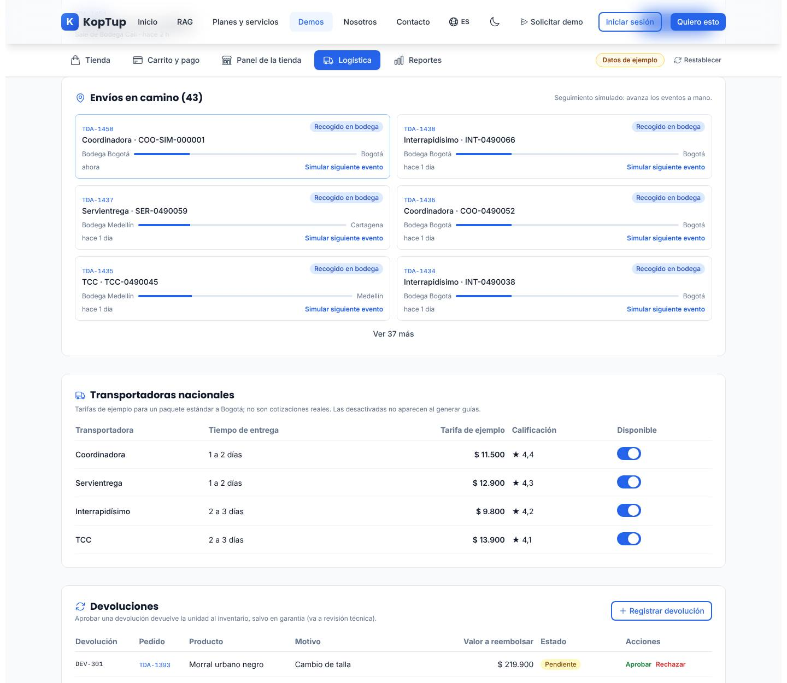

*Envíos en camino con tu pedido primero («Recogido en bodega» después de un evento simulado), la tabla de transportadoras y el inicio de las devoluciones.*

- **Bodegas**: Bogotá (capacidad 1.200 unidades), Medellín (900) y Cali (600), con ocupación, pedidos por despachar y envíos en camino.
- **Por despachar**: pedidos en preparación con **Generar guía**; arriba dice cuántos pedidos nuevos esperan confirmación en el panel.
- **Envíos en camino**: transportadora, guía, barra de avance y **Simular siguiente evento**.
- **Transportadoras nacionales**: tiempo de entrega, tarifa de ejemplo a Bogotá, calificación y el interruptor **Disponible** (siempre queda al menos una).
- **Devoluciones**: lista con motivo, valor a reembolsar y estado; **Aprobar** devuelve la unidad al inventario (salvo garantía, que va a revisión técnica) y **Rechazar**. **Registrar devolución** se hace sobre un pedido entregado: pedido, producto y motivo (derecho de retracto con la explicación de la Ley 1480, garantía, cambio de talla o no corresponde a lo descrito).

### Reportes

Ver el [paso 5](#paso-5-reportes-tu-pedido-sumado). Más abajo:

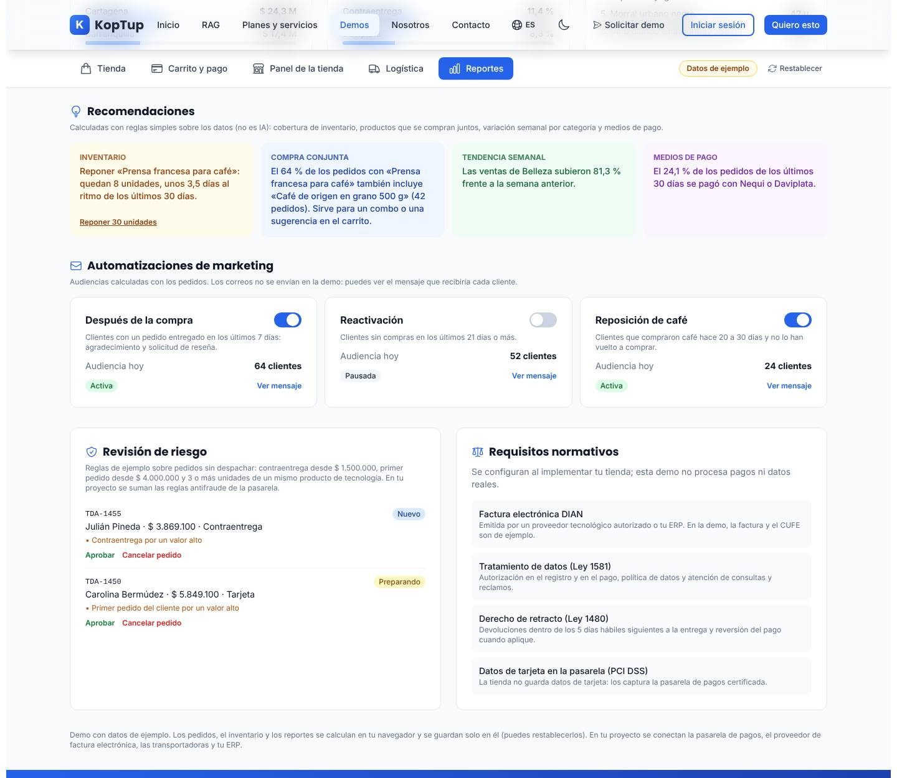

*Recomendaciones calculadas con reglas, automatizaciones de marketing, revisión de riesgo y requisitos normativos.*

- **Recomendaciones** («Calculadas con reglas simples sobre los datos (no es IA)»): inventario (con **Reponer 30 unidades**), compra conjunta, tendencia semanal por categoría y uso de Nequi y Daviplata.
- **Automatizaciones de marketing**: Después de la compra, Reactivación (pausada al inicio) y Reposición de café, cada una con su audiencia de hoy, interruptor y **Ver mensaje** (vista previa del correo; no se envía nada).
- **Revisión de riesgo**: pedidos sin despachar que cumplen reglas de ejemplo (contraentrega desde $1.500.000, primer pedido desde $4.000.000 o 3 o más unidades de un producto de tecnología). **Aprobar** o **Cancelar pedido** (lo cancela y devuelve las unidades al inventario).
- **Requisitos normativos**: tarjetas informativas sobre factura electrónica DIAN, Ley 1581, derecho de retracto (Ley 1480) y PCI DSS.

### En el celular

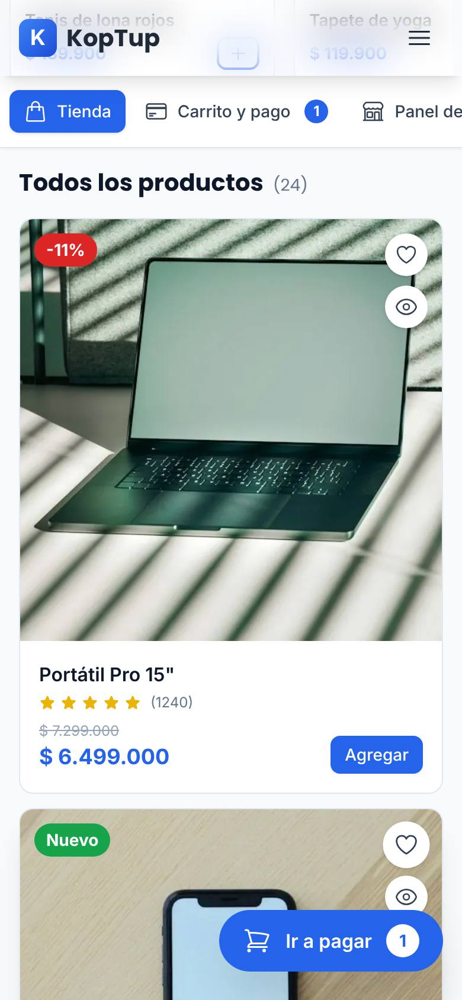

*La tienda en un teléfono (390 px): la barra de vistas se desplaza de lado, los productos van en una columna y el botón flotante «Ir a pagar» muestra el carrito.*

La página no se desborda a lo ancho; las tablas del panel y de logística se desplazan horizontalmente.

---

## Qué es real y qué es simulado

| Parte | Real o simulado | Detalle |
|---|---|---|
| Productos, clientes, pedidos de ejemplo y cifras | **Datos de ejemplo** | Generados siempre iguales; las fechas de los pedidos de ejemplo se cuentan hacia atrás desde el momento en que abres la página. |
| Carrito, reglas de precio, cupón, IVA incluido y envío | **Real (en el navegador)** | Los interruptores del panel cambian de verdad el cálculo del carrito. |
| Existencias por bodega | **Real (en el navegador)** | Bajan al pagar, suben al reponer, al cancelar por riesgo o al aprobar una devolución. |
| Pagos (tarjeta, PSE, Nequi, Daviplata, contraentrega, Addi) | **Simulados** | No se contacta ninguna pasarela; la tarjeta solo se valida en forma. |
| Factura y CUFE | **Simulados** | PDF de ejemplo generado en el navegador; CUFE con SHA-384 y clave ficticia; nada va a la DIAN. |
| Guías, tarifas y seguimiento | **Simulados** | Tarifas ilustrativas; los eventos se avanzan a mano. |
| WhatsApp y correos de marketing | **Simulados** | Solo vista previa y **Copiar mensaje**. |
| Recomendaciones y riesgo | **Reglas, no IA** | Lo dicen las propias pantallas. |
| Exportaciones CSV y PDF | **Real** | Se generan en el navegador con lo que ves. |
| Fotos de productos | **Real (servicio externo)** | Se cargan desde Unsplash a través del optimizador de imágenes del sitio; las fotos que subes al crear un producto se guardan en el navegador. |
| Dónde se guardan tus cambios | **Solo en este navegador** | `localStorage` del equipo; no llegan a un servidor ni los ven otras personas. La demo no llama al backend. |

---

## Acceso

**Cómo lo ve un visitante.** La demo es **Abierta**: en `/demo` su tarjeta («Tienda en Línea», insignias «Abierta» y «Completo») tiene **Probar Demo** (abre `/demo/ecommerce` directamente) y **Solicitar demo guiada** (`/solicitar-demo?demos=ecommerce`). No hay pantalla de acceso ni hace falta cuenta. Al final de la página está el bloque «¿Te gustaría algo así para tu negocio?» con **Solicitar demo guiada** (`/solicitar-demo?demos=ecommerce`), **Solicitar Cotización** (`/contact`) y **Ver Planes y Precios** (`/services#planes-rag`).

**Cómo se solicita una demo guiada y cómo la gestiona el admin.** La solicitud del formulario llega a **Admin › Solicitudes de demo** como cualquier otra. Como la demo es abierta, no hace falta conceder acceso para usarla; la solicitud sirve para agendar la demo guiada. Un admin puede cambiar el modo de acceso en **Admin › Catálogo de demos** (por ejemplo, a «Con solicitud»); entonces empezaría a mostrarse la pantalla de acceso. Detalle en el [Manual del administrador](Doc-06-Manual-del-Administrador.md) y en [Flujos del visitante](Doc-04-Flujos-del-Visitante.md).

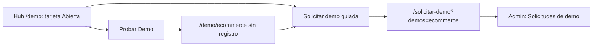

*Dos caminos: probarla de una vez o pedir una demo guiada.*

---

## Limitaciones conocidas

1. **Los cambios viven solo en el navegador.** Otro equipo o navegador ve los datos de ejemplo; el vendedor no ve los pedidos que hizo el prospecto. Si el navegador no deja guardar (modo privado o almacenamiento lleno, por ejemplo con fotos grandes de productos creados), la demo sigue funcionando pero se pierde todo al recargar.
2. **Pagos, factura, guías y mensajes son simulados**, como lo dice la propia demo: no hay pasarela, ni transmisión a la DIAN, ni transportadoras, ni WhatsApp o correo reales.
3. **Tu pedido queda al final de «Por despachar»** (la lista va del más antiguo al más nuevo y muestra 6 por página): en la prueba hubo que pulsar dos veces **Ver N más** para encontrarlo. El atajo es **Generar guía** desde la fila del pedido en el panel.
4. **Fotos externas.** Las fotos del catálogo vienen de Unsplash; si ese servicio no responde, no hay imagen de respaldo para los productos de ejemplo.
5. **Addi bajo el mínimo**: si el total es menor a $150.000, al pagar solo se pone en rojo la nota de Addi (que ya dice «aplica para compras desde $ 150.000»); no aparece un mensaje de error aparte.
6. **El café está en la categoría «Hogar»** (SKU `HOG-CAF-ORI`); no hay categoría de alimentos.
7. **Avisos en la parte inferior**: se apilan hasta tres, duran 5 segundos y pueden tapar contenido; se cierran con la X.
8. **No encontramos botones muertos**; los botones que parecían no hacer nada en la prueba automática eran la vista o la categoría ya activa.
