# Guía de la demo: ERP Modular

> Ruta `/demo/erp` · Modo de acceso: **Con solicitud** · Tipo: **datos de ejemplo** (todo corre en el navegador; sin backend ni IA) · Plan del producto: [ERP modular](Producto-erp-modular.md)

**Resumen.** Es un ERP de punta a punta para un grupo empresarial ficticio colombiano (Surtidora Montevera S.A.S. y Montevera Logística S.A.S., con bodegas en Bogotá, Medellín y Barranquilla): ventas, inventario, compras con aprobaciones, contabilidad PUC, tesorería y cartera, talento humano y producción. Lo que haces en un módulo se refleja en los demás (una factura descuenta inventario, genera su asiento y entra a cartera). Está pensado para gerentes y contadores de pymes que quieren ver cómo se conectan sus procesos; se abre solo con un acceso aprobado.

**En esta página:** [Recorrido sugerido](#recorrido-sugerido-demo-comercial-de-5-minutos) · [Pantallas y funciones](#pantallas-y-funciones) · [Qué es real y qué es simulado](#qué-es-real-y-qué-es-simulado) · [Acceso](#acceso) · [Limitaciones conocidas](#limitaciones-conocidas)

*Vista inicial: encabezado con filtros, seis indicadores del período, el «Recorrido de punta a punta» y las pestañas de los siete módulos.*

---

## Recorrido sugerido (demo comercial de 5 minutos)

Este guion sigue el panel **Recorrido de punta a punta** que trae la propia demo: cada paso se marca en verde solo cuando lo haces de verdad. Empieza con los datos de ejemplo limpios (si alguien ya usó la demo en ese navegador, pulsa **Restablecer datos de ejemplo** debajo de los filtros).

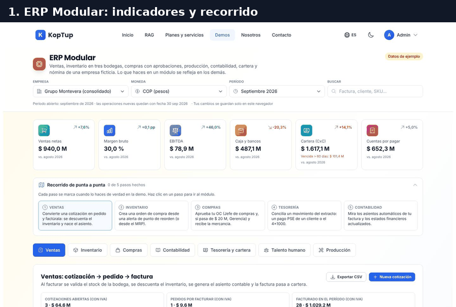

*Recorrido completo: cotización → pedido → factura, orden de compra desde una alerta, aprobación y recepción, conciliación de un pago PSE y el asiento contable.*

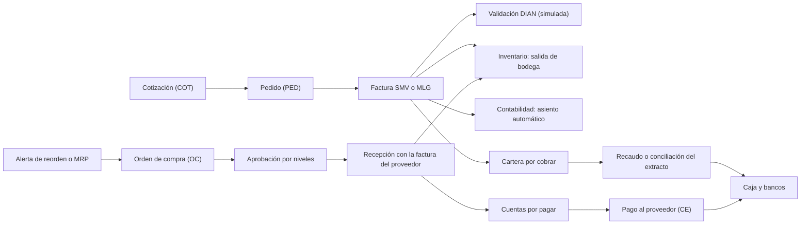
```mermaid
flowchart LR
    COT["Cotización (COT)"] --> PED["Pedido (PED)"]
    PED --> FAC["Factura SMV o MLG"]
    FAC --> DIAN["Validación DIAN (simulada)"]
    FAC --> INV["Inventario: salida de bodega"]
    FAC --> ASI["Contabilidad: asiento automático"]
    FAC --> CXC["Cartera por cobrar"]
    CXC --> REC["Recaudo o conciliación del extracto"]
    REC --> BAN["Caja y bancos"]
    ALE["Alerta de reorden o MRP"] --> OC["Orden de compra (OC)"]
    OC --> APR["Aprobación por niveles"]
    APR --> RCP["Recepción con la factura del proveedor"]
    RCP --> INV
    RCP --> CXP["Cuentas por pagar"]
    CXP --> PAG["Pago al proveedor (CE)"]
    PAG --> BAN
```

*Cómo se conectan los módulos: cada flecha es algo que la demo hace por ti al registrar la operación.*

### Paso 1. Ventas: convierte una cotización en pedido

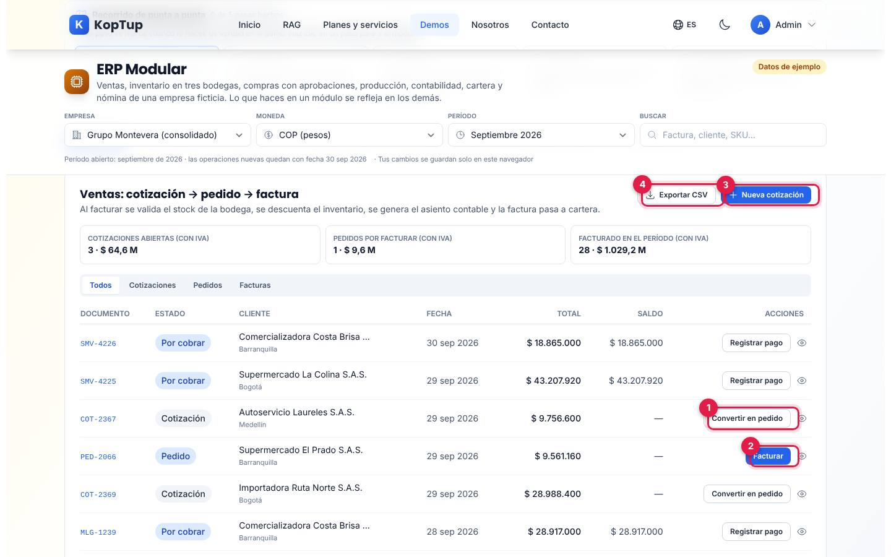

*Módulo Ventas con las cotizaciones, pedidos y facturas de septiembre de 2026.*

1. **Convertir en pedido** en la fila de la cotización `COT-2367` (Autoservicio Laureles S.A.S., Medellín). El documento pasa a `PED-2067` con la marca **TUYA**.
2. **Facturar** aparece en las filas que ya son pedido (por ejemplo `PED-2066`). Abre la ventana del documento.
3. **Nueva cotización**: crea una cotización propia (empresa, cliente, bodega y productos).
4. **Exportar CSV**: descarga los documentos visibles (`ventas-2026-09.csv`).

Qué decir: «Todo arranca en la cotización. Nada se digita dos veces: el pedido y la factura heredan los datos».

### Paso 2. Factura el pedido

En la fila del pedido nuevo pulsa **Facturar** y, en la ventana, otra vez **Facturar**. La demo valida que haya existencias en la bodega, numera la factura (`SMV-4227` en la prueba) y simula la respuesta de la DIAN («Enviando a la DIAN… (simulado)» y, a los 1,6 segundos, «Aceptada»).

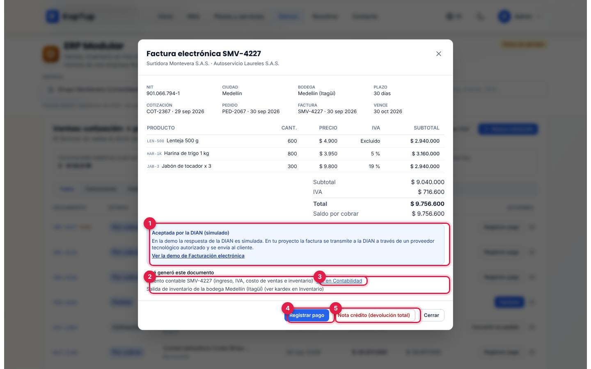

*Ventana de la factura `SMV-4227` recién emitida: datos del cliente, líneas, totales y lo que generó.*

1. **Aceptada por la DIAN (simulado)**, con la explicación de que en el proyecto real la factura se transmite por un proveedor tecnológico autorizado y el enlace **Ver la demo de Facturación electrónica** (ver su [guía](Guia-Demo-facturacion-electronica.md)).
2. **Qué generó este documento**: el asiento contable (ingreso, IVA, costo de ventas e inventario) y la salida de inventario de la bodega de Medellín.
3. **Ver en Contabilidad**: salta al libro diario filtrado por ese comprobante.
4. **Registrar pago**: registra un recaudo (PSE, transferencia o consignación) que debita Bancos y acredita Clientes.
5. **Nota crédito (devolución total)**: anula la factura completa; la mercancía vuelve a la bodega y se reversan ingreso, IVA y costo. Solo aparece si la factura no tiene pagos.

Qué decir: «Un clic y pasan cuatro cosas: factura electrónica, inventario, contabilidad y cartera».

### Paso 3. Inventario: crea la orden de compra desde una alerta

Abre la pestaña **Inventario** (o el paso 2 del recorrido).

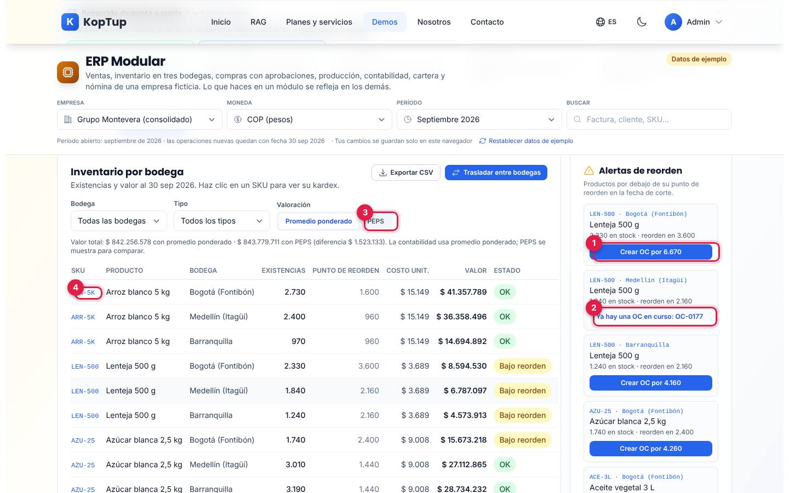

*Inventario por bodega y alertas de reorden. La venta del paso 2 dejó la lenteja de Medellín por debajo de su punto de reorden.*

1. **Crear OC por 6.670**: crea de inmediato una orden de compra al proveedor del producto (Lenteja 500 g, bodega de Bogotá) por la cantidad que falta para llegar al nivel objetivo. Aparece el aviso «Orden de compra OC-0180 creada…».
2. **Ya hay una OC en curso**: si el producto ya tiene una orden abierta, la alerta lo dice y el enlace lleva a esa orden en Compras.
3. **Valoración**: cambia entre promedio ponderado (el que usa la contabilidad) y PEPS, y muestra la diferencia.
4. **SKU**: abre el kardex del producto (ver [Inventario](#inventario)).

Qué decir: «El sistema avisa qué comprar antes de que se acabe, y la compra sale con el costo y el proveedor correctos».

### Paso 4. Compras: aprueba y recibe la mercancía

Pulsa **Ya hay una OC en curso: OC-0180** en la alerta: la demo abre Compras y escribe `OC-0180` en el buscador.

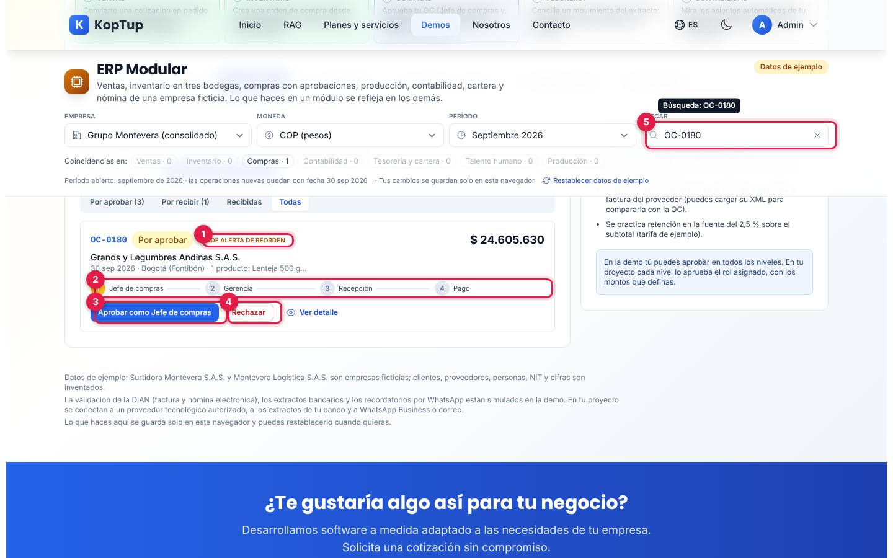

*La orden creada desde la alerta, con su flujo de aprobación de dos niveles.*

1. **DESDE ALERTA DE REORDEN**: el origen de la orden (también puede ser «CREADA POR TI» o «DESDE MRP»).
2. **Flujo**: Jefe de compras → Gerencia → Recepción → Pago. Gerencia solo aparece si el total con IVA es de $ 20.000.000 o más (aquí $ 24.605.630).
3. **Aprobar como Jefe de compras** (y luego **Aprobar como Gerencia**). En la demo tú apruebas todos los niveles.
4. **Rechazar**: pide un motivo obligatorio.
5. **Buscar**: el buscador del encabezado quedó con `OC-0180` y muestra en qué módulos hay coincidencias.

Con la orden aprobada, ve a **Por recibir**, pulsa **Recibir mercancía**, opcionalmente carga el XML de ejemplo para compararlo con la orden (ver la ventana en [Compras](#compras)) y confirma **Recibir y causar factura**: entra la mercancía a la bodega y nace la cuenta por pagar.

### Paso 5. Tesorería: concilia un pago del extracto

Abre **Tesorería y cartera** y baja a **Conciliación bancaria**. En la captura se escribió `SMV-4141` en el buscador para dejar solo ese movimiento.

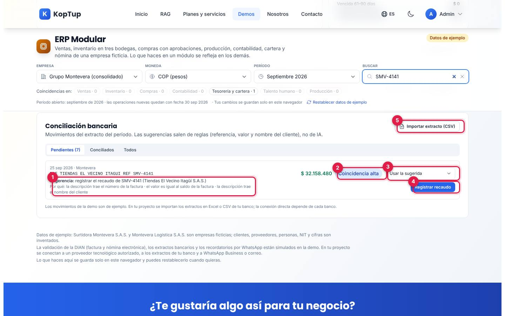

*Un pago PSE del extracto con la factura sugerida y el porqué de la sugerencia.*

1. **Sugerencia y Por qué**: «registrar el recaudo de SMV-4141» porque la descripción trae el número de la factura, el valor es igual al saldo y aparece el nombre del cliente. Son reglas, no IA (lo dice la propia pantalla).
2. **Coincidencia alta** o **Revisar**, según cuántas reglas coinciden.
3. **Usar la sugerida / Aplicar a una factura…**: permite elegir otra factura abierta con saldo suficiente.
4. **Registrar recaudo**: crea el recibo de caja, marca el movimiento como «Conciliado por ti» y la factura baja de la cartera.
5. **Importar extracto (CSV)**: carga movimientos propios (ver [Tesorería y cartera](#tesorería-y-cartera)).

Qué decir: «El extracto se concilia solo con las reglas; el contador revisa lo que queda en "Revisar"».

### Paso 6. Contabilidad: el asiento de tu factura

Pulsa el paso 5 del recorrido (**Contabilidad**) y escribe el número de tu factura en el buscador.

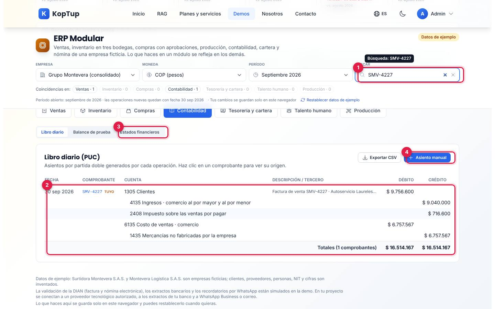

*Libro diario filtrado por `SMV-4227`: el asiento que se generó solo al facturar.*

1. **Buscar** `SMV-4227`: el encabezado muestra «Coincidencias en: Ventas · 1, Contabilidad · 1».
2. **El asiento**: débito a 1305 Clientes por el total; crédito a 4135 Ingresos y 2408 IVA por pagar; débito a 6135 Costo de ventas y crédito a 1435 Mercancías. Débitos = créditos.
3. **Estados financieros**: estado de resultados y estado de situación financiera actualizados al instante.
4. **Asiento manual**: para ajustes del contador.

Con esto el panel muestra **5 de 5 pasos hechos** y «¡Completaste el recorrido!». Cierra mostrando cómo cambiaron los indicadores de arriba. En nuestra prueba, Ventas netas pasó de $ 940,0 M a $ 949,1 M, Caja y bancos de $ 487,1 M a $ 519,2 M, Cartera de $ 1.617,1 M a $ 1.594,7 M (la vencida a más de 60 días bajó de $ 101,4 M a $ 69,3 M) y Cuentas por pagar de $ 652,3 M a $ 676,3 M.

---

## Pantallas y funciones

### Encabezado, filtros e indicadores

Ver la [vista general](#guía-de-la-demo-erp-modular). En escritorio, el encabezado queda fijo arriba mientras bajas por la página.

| Elemento | Qué hace |
|---|---|
| **Datos de ejemplo** | Insignia fija; al pasar el mouse explica que empresa y cifras son ficticias (enero a septiembre de 2026) y que DIAN, bancos y WhatsApp están simulados. |
| **Empresa** | Grupo Montevera (consolidado), Surtidora Montevera S.A.S. o Montevera Logística S.A.S. Logística no tiene inventario, compras ni producción: esos módulos lo dicen y piden elegir otra empresa. |
| **Moneda** | COP o USD. En USD todo se convierte con una TRM fija de ejemplo de $ 4.000 y el encabezado lo avisa. |
| **Período** | Septiembre, agosto o julio de 2026, 3.er trimestre o año 2026 (ene–sep). Los meses anteriores son de consulta: si haces una operación desde julio o agosto, la demo cambia sola a septiembre y lo avisa. |
| **Buscar** | Factura, cliente, SKU, OC, comprobante… Filtra el módulo abierto y muestra «Coincidencias en» con el conteo por módulo; cada etiqueta lleva a ese módulo. |
| **Período abierto** | Recuerda que las operaciones nuevas quedan con fecha 30 sep 2026 y que tus cambios se guardan solo en este navegador. |
| **Restablecer datos de ejemplo** | Aparece cuando cambiaste algo. Pide confirmación y vuelve a los datos originales. |
| **Indicadores** | Ventas netas, Margen bruto, EBITDA, Caja y bancos, Cartera (CxC, con lo vencido a más de 60 días) y Cuentas por pagar, con la variación frente al período anterior. Cada tarjeta lleva a su módulo. |
| **Recorrido de punta a punta** | Los 5 pasos del guion; se marcan solos y cada uno lleva a su módulo. Se puede plegar. |

### Ventas

Ver los [pasos 1 y 2](#paso-1-ventas-convierte-una-cotización-en-pedido).

- **Resumen**: cotizaciones abiertas, pedidos por facturar y facturado en el período (con IVA); cada tarjeta filtra la lista.
- **Pestañas** Todos, Cotizaciones, Pedidos y Facturas. Estados: Cotización, Pedido, Por cobrar, Vencida N d, Pagada y Anulada con NC. La lista muestra 15 documentos y **Ver más**.
- **Nueva cotización**: empresa que vende, cliente, bodega de despacho y líneas (producto y cantidad, con el disponible de la bodega). No deja guardar sin líneas con cantidad ni con productos repetidos. «La cotización no mueve inventario ni contabilidad. El stock se valida al facturar».
- **Facturar sin stock**: si la bodega no alcanza, el botón queda desactivado y la ventana dice qué falta, con **Ir a Inventario para trasladar o comprar**.
- **Registrar pago**: valor (hasta el saldo), medio de pago y fecha 30 sep 2026.

### Inventario

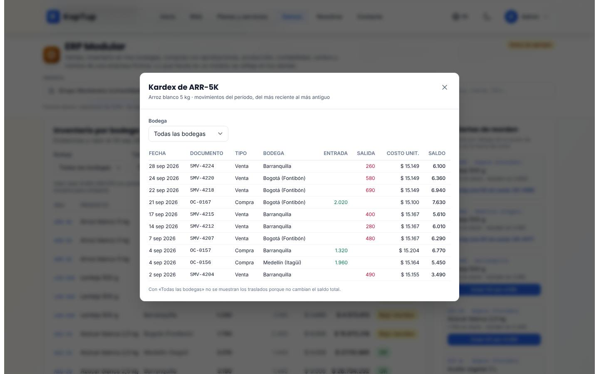

*Kardex de `ARR-5K` con todas las bodegas: ventas, compras, costo unitario y saldo.*

- **Filtros** por bodega y tipo (mercancía, producto terminado, materia prima y empaque) y **Valoración** promedio ponderado o PEPS, con el valor total de ambos métodos.
- **Tabla** por SKU y bodega: existencias, punto de reorden, costo unitario, valor y estado (OK, Bajo reorden, Agotado). 15 filas y **Ver más**.
- **Kardex** (clic en el SKU): movimientos del período, del más reciente al más antiguo, con filtro por bodega. Con «Todas las bodegas» no muestra los traslados.
- **Trasladar entre bodegas**: producto, origen, destino y cantidad (valida el disponible). No genera asiento; sí aparece en el kardex.
- **Alertas de reorden**: **Crear OC por N**, **Ya hay una OC en curso**, **Programar producción** (producto terminado en Bogotá) o **Trasladar desde Bogotá**. En períodos cerrados las acciones se ocultan.
- **Exportar CSV**.

### Compras

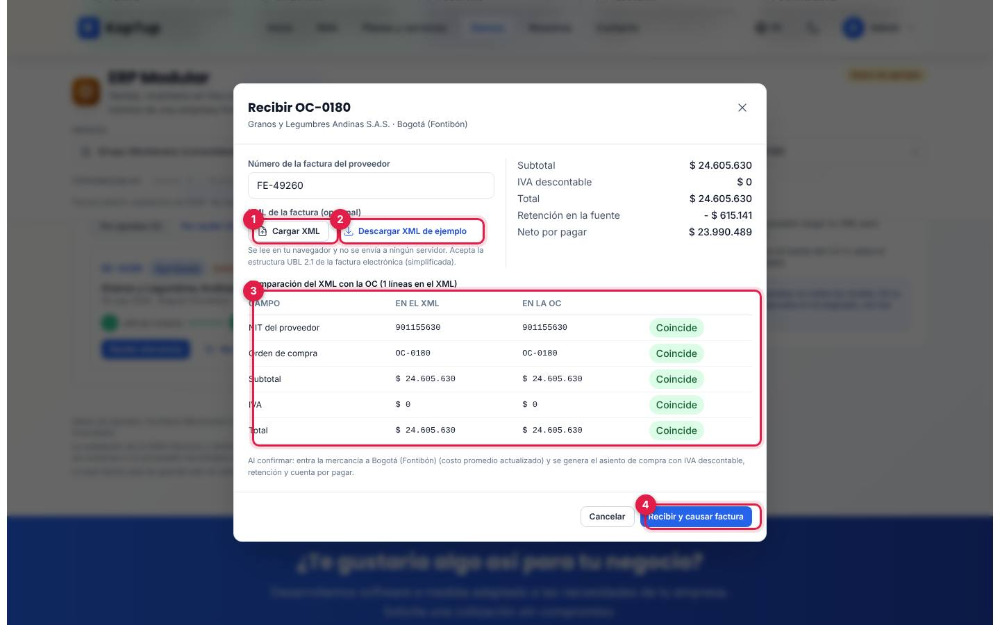

*Ventana «Recibir OC-0180» con el XML de ejemplo cargado: todos los campos coinciden con la orden.*

1. **Cargar XML**: lee en tu navegador la factura del proveedor (estructura UBL 2.1 simplificada, hasta 2 MB) y completa el número de factura.
2. **Descargar XML de ejemplo**: genera un XML que coincide con la orden, útil para la demo en vivo.
3. **Comparación**: NIT del proveedor, orden de compra, subtotal, IVA y total, cada uno con «Coincide» o «Diferente». Si algo no coincide, el botón de recibir se desactiva.
4. **Recibir y causar factura**: entra la mercancía (actualiza el costo promedio) y se genera el asiento de compra con IVA descontable, retención en la fuente del 2,5 % (tarifa de ejemplo) y cuenta por pagar.

Además:

- **Vistas** Por aprobar, Por recibir, Recibidas y Todas, y el panel **Cómo funciona** con las reglas.
- **Nueva orden de compra**: proveedor, bodega de destino y productos de ese proveedor con su costo promedio. Muestra cuántos niveles de aprobación necesitará. Las materias primas y empaques solo se reciben en Bogotá (planta).
- **Pagar $ …**: en las recibidas, registra el comprobante de egreso (CE) por el neto por pagar.
- **Ver detalle**: líneas, totales, historial (creada, aprobada, recibida, pagada) y **Ver asiento**.

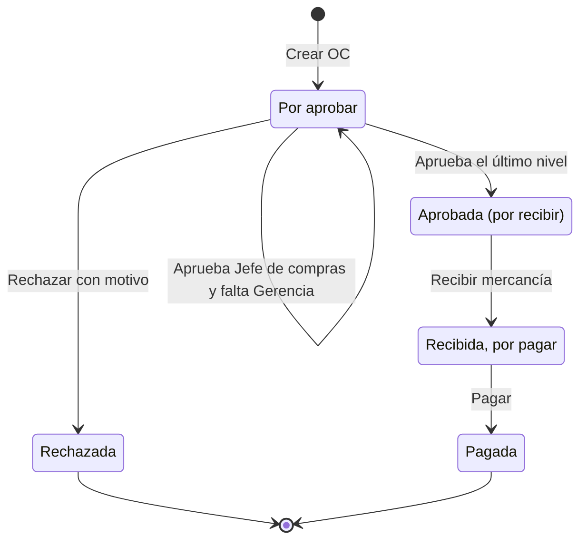
```mermaid
stateDiagram-v2
    state "Por aprobar" as PA
    state "Aprobada (por recibir)" as AP
    state "Rechazada" as RE
    state "Recibida, por pagar" as RC
    state "Pagada" as PG
    [*] --> PA: Crear OC
    PA --> PA: Aprueba Jefe de compras y falta Gerencia
    PA --> AP: Aprueba el último nivel
    PA --> RE: Rechazar con motivo
    AP --> RC: Recibir mercancía
    RC --> PG: Pagar
    RE --> [*]
    PG --> [*]
```

*Estados de una orden de compra en la demo.*

### Contabilidad

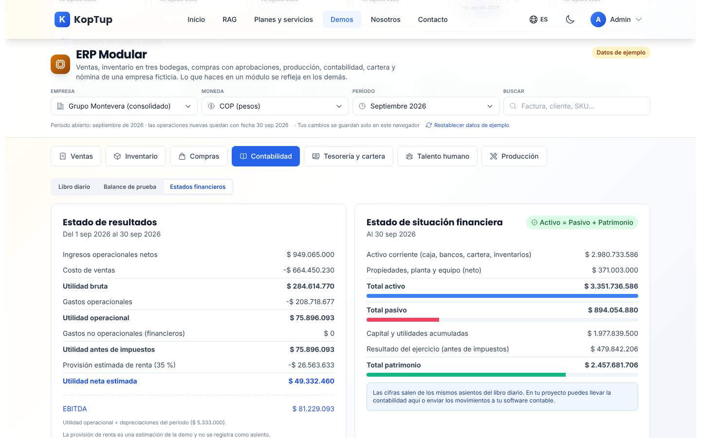

*Estados financieros de septiembre de 2026, calculados con los mismos asientos del libro diario.*

- **Libro diario (PUC)**: asientos por partida doble de cada operación, con totales. Clic en un comprobante abre su detalle (cuentas, tercero, débitos = créditos, origen) y **Ver el documento en <módulo>**. **Exportar CSV**.
- **Asiento manual**: empresa, descripción y de 2 a 8 líneas; cada línea con débito o crédito, no ambos; débitos y créditos deben ser iguales. Queda con fecha 30 sep 2026 y afecta al instante el balance y los estados.
- **Balance de prueba**: saldo inicial, débitos, créditos y saldo final por cuenta, con la marca «Cuadra».
- **Estados financieros**: estado de resultados (con provisión estimada de renta del 35 % y EBITDA) y estado de situación financiera con la marca «Activo = Pasivo + Patrimonio».

### Tesorería y cartera

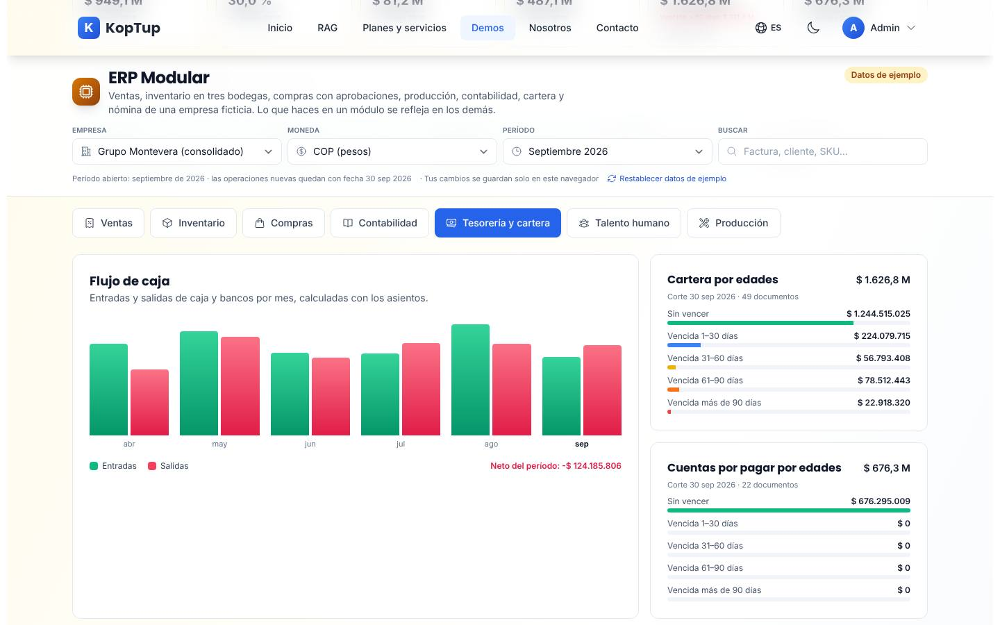

*Flujo de caja de abril a septiembre, cartera por edades y cuentas por pagar por edades.*

- **Flujo de caja**: entradas y salidas de caja y bancos por mes, y neto del período.
- **Cartera por edades** y **Cuentas por pagar por edades**: sin vencer, 1–30, 31–60, 61–90 y más de 90 días.
- **Cartera por cliente**: facturas, saldo, vencido y vencido a más de 60 días; **Ver facturas** despliega el detalle y **Recordatorio** arma un mensaje de cobro con las facturas vencidas para **Copiar mensaje**. No envía nada: «Simulado: la demo no envía nada».
- **Conciliación bancaria**: Pendientes, Conciliados y Todos; sugerencias por reglas para recaudos, comisiones bancarias, 4x1000 y consignaciones por identificar (ver el [paso 5](#paso-5-tesorería-concilia-un-pago-del-extracto)).
- **Importar extracto (CSV)**: columnas fecha, descripción y valor (separador `;` o `,`, hasta 1 MB, fechas del 1 de enero al 30 de septiembre de 2026). Muestra una vista previa y tiene **Descargar CSV de ejemplo**. El archivo se lee en el navegador.

### Talento humano

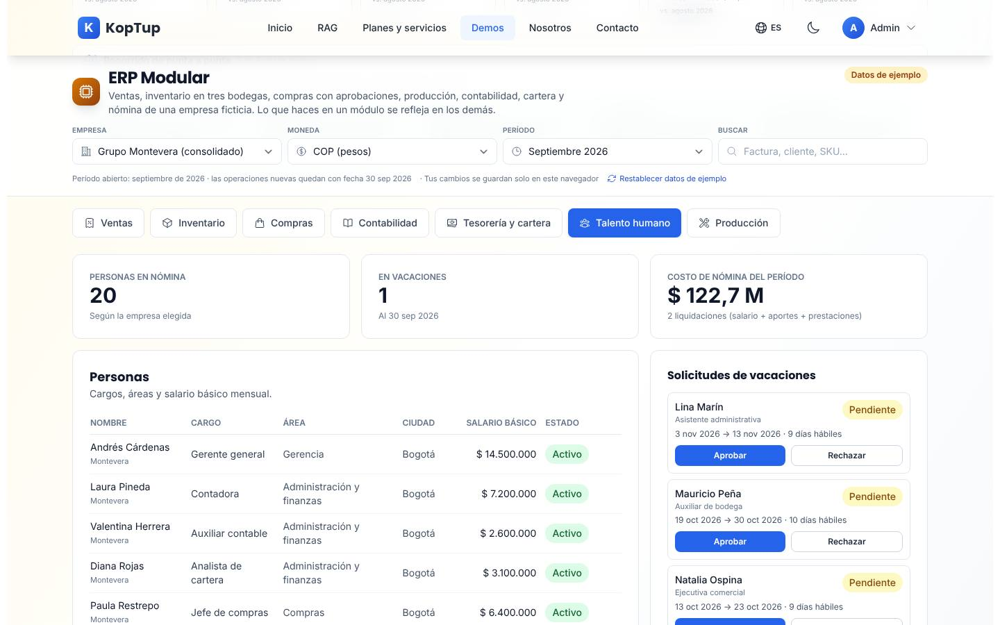

*Personas en nómina, solicitudes de vacaciones y, más abajo, la nómina del período.*

- **Indicadores**: personas en nómina (20 en el consolidado), en vacaciones y costo de nómina del período.
- **Personas**: nombre, cargo, área, ciudad, salario básico y estado (12 y **Ver más**).
- **Solicitudes de vacaciones**: **Aprobar** o **Rechazar** las pendientes.
- **Nómina del período**: una liquidación por empresa con su asiento (**Ver asiento**) y **Transmitir a la DIAN (simulado)**, que pasa a «Aceptada (simulado)». El costo empresa usa un factor de ejemplo (salario × 1,52). El enlace **Ver la demo de HRMS** lleva a `/demo/hrms` (ver su [guía](Guia-Demo-hrms.md)).

### Producción

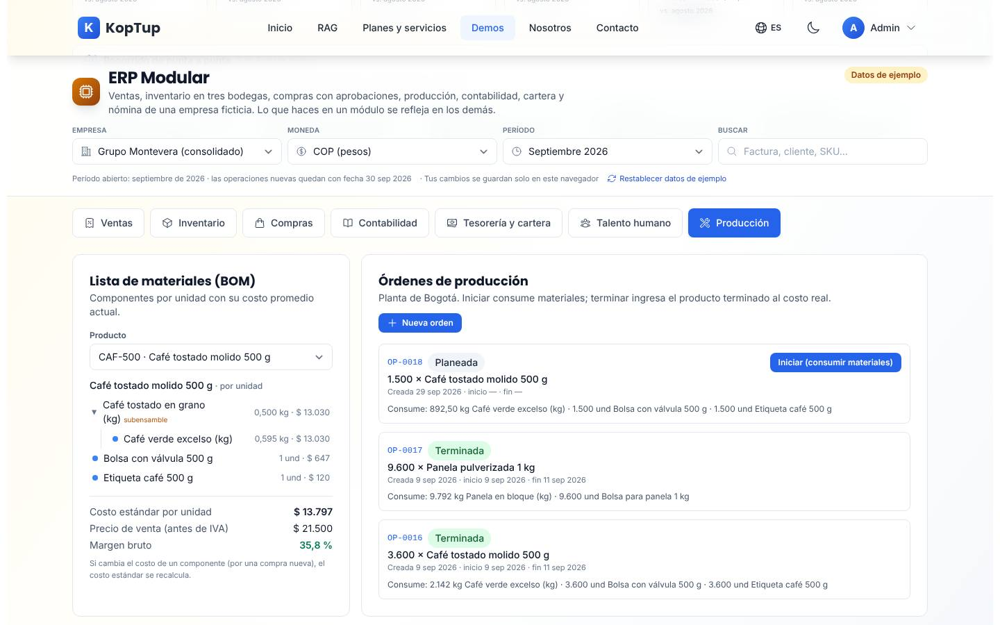

*Lista de materiales del café tostado y órdenes de producción de la planta de Bogotá.*

- **Lista de materiales (BOM)**: café tostado molido 500 g (con el subensamble de café tostado en grano) y panela pulverizada 1 kg, con costo estándar, precio de venta y margen bruto.
- **Órdenes de producción**: Planeada → **Iniciar (consumir materiales)** → En proceso → **Terminar (ingresar a bodega)** → Terminada. Si faltan materiales, **Iniciar** queda desactivado y la orden dice qué falta.
- **Nueva orden**: producto y cantidad (1 a 50.000); queda planeada y el MRP la tiene en cuenta.
- **Planeación de materiales (MRP)**: por materia prima muestra stock, requerido, saldo y reorden, con **Cubierto**, **OC en curso** o **Crear OC por N**; por producto terminado, **Planear N**. «Son reglas de cálculo, no IA».

### En el celular

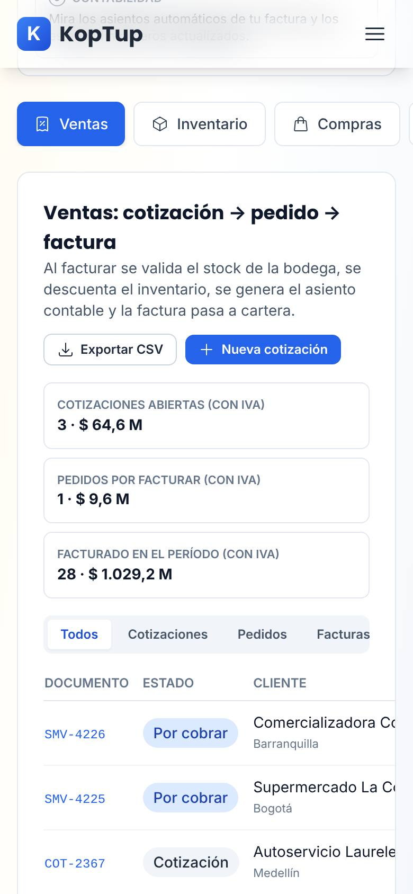

*La demo en un teléfono (390 px): las pestañas de módulos se desplazan de lado y las tablas también.*

En el teléfono los filtros se apilan, los indicadores van de dos en dos, el encabezado deja de ser fijo y las tablas anchas se desplazan horizontalmente. La página no se desborda a lo ancho.

---

## Qué es real y qué es simulado

| Parte | Real o simulado | Detalle |
|---|---|---|
| Empresas, clientes, proveedores, personas, NIT y cifras | **Datos de ejemplo** | Grupo Montevera es ficticio; los datos se generan siempre iguales (enero a septiembre de 2026). |
| Cálculos entre módulos | **Real (en el navegador)** | Inventario, costo promedio y PEPS, asientos por partida doble, balance, estados financieros, cartera por edades y MRP se calculan de verdad con tus operaciones. |
| Validación DIAN de la factura y de la nómina electrónica | **Simulada** | Responde «Aceptada (simulado)» a los 1,6 segundos. No hay firma ni transmisión. |
| Extractos bancarios | **Datos de ejemplo** | El extracto viene en los datos; puedes importar un CSV propio, que se lee en el navegador. |
| Conciliación y MRP | **Reglas, no IA** | Lo dicen las propias pantallas. |
| Recordatorios de cobro por WhatsApp o correo | **Simulado** | Solo arma el texto para copiar. |
| XML del proveedor | **Real (simplificado)** | Se lee y compara en el navegador; estructura UBL 2.1 simplificada. |
| Aprobaciones por rol | **Simuladas** | Tú apruebas todos los niveles. |
| Dónde se guardan tus cambios | **Solo en este navegador** | `localStorage` del equipo; no llegan a un servidor ni los ven otras personas. |
| Exportaciones CSV | **Real** | Se generan en el navegador con lo que ves. |

---

## Acceso

**Cómo lo ve un visitante.** La demo aparece en `/demo` con la insignia «Requiere acceso» y los botones **Solicitar acceso** y **Ya tengo acceso: iniciar sesión**. Si alguien abre `/demo/erp` sin sesión, la web muestra en la misma dirección la pantalla de acceso:

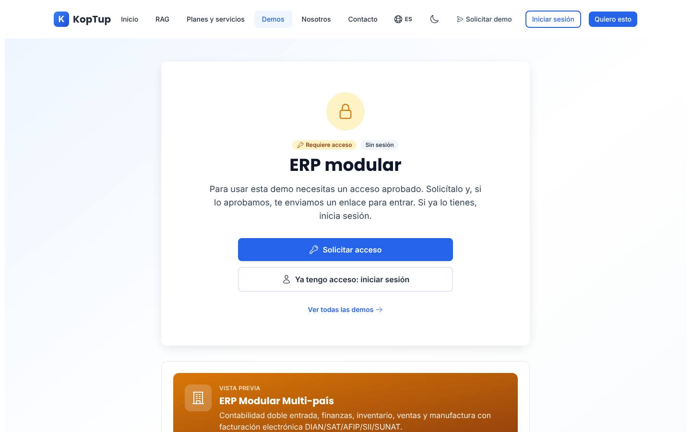

*Lo que ve un visitante sin sesión: «Requiere acceso», «Sin sesión» y los botones para pedir la demo o iniciar sesión. Debajo, una vista previa con el texto del catálogo.*

- **Solicitar acceso** abre `/solicitar-demo?demos=erp` con el ERP ya elegido.
- **Ya tengo acceso: iniciar sesión** lleva a `/login` y, al entrar, vuelve a la demo.
- **Ver todas las demos** vuelve a `/demo`.
- Con sesión pero sin acceso, la misma pantalla dice «Sin acceso»; si el acceso venció o fue retirado, ofrece pedir más tiempo o solicitarlo de nuevo.

**Cómo se concede.** La solicitud llega a **Admin › Solicitudes de demo**. Pueden aprobarla los roles **admin** y **sales**. Al aprobar, se crea o se reutiliza la cuenta del prospecto, el acceso dura 14 días por defecto (se extiende o se revoca en **Admin › Accesos a demos**) y la persona recibe un correo con la decisión (con el enlace de activación si su cuenta es nueva). El equipo de KopTup (admin, manager, sales y developer) abre la demo sin solicitud. El modo de acceso se cambia en **Admin › Catálogo de demos**. Detalle en el [Manual del administrador](Doc-06-Manual-del-Administrador.md) y en [Flujos del visitante](Doc-04-Flujos-del-Visitante.md).

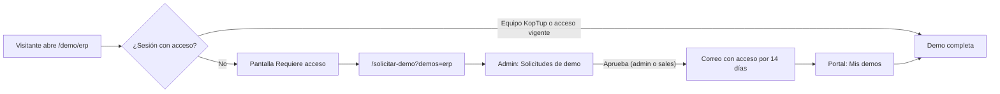
```mermaid
flowchart LR
    V["Visitante abre /demo/erp"] --> S{"¿Sesión con acceso?"}
    S -- "Equipo KopTup o acceso vigente" --> D["Demo completa"]
    S -- "No" --> P["Pantalla Requiere acceso"]
    P --> F["/solicitar-demo?demos=erp"]
    F --> AD["Admin: Solicitudes de demo"]
    AD -- "Aprueba (admin o sales)" --> E["Correo con acceso por 14 días"]
    E --> M["Portal: Mis demos"]
    M --> D
```

*Camino de un visitante hasta la demo.*

---

## Limitaciones conocidas

1. **La vista previa promete más de lo que hace la demo.** La tarjeta del hub y la pantalla de acceso usan el texto del catálogo: «ERP Modular Multi-país», «facturación electrónica DIAN/SAT/AFIP/SII/SUNAT», «Open Banking + AI matching» y «forecasting de demanda con ML». La demo muestra solo Colombia, la DIAN simulada, conciliación por reglas («no de IA») y un MRP por reglas, sin pronóstico.
2. **Los cambios viven solo en el navegador.** Si el prospecto cambia de equipo o de navegador, o borra los datos del sitio, vuelve a los datos de ejemplo. No hay espacio compartido con el vendedor.
3. **Fecha fija.** Todo ocurre el 30 sep 2026; los meses anteriores son de consulta.
4. **DIAN, bancos y WhatsApp simulados**, y las aprobaciones no dependen de roles (tú apruebas todos los niveles).
5. **Nota crédito solo total.** No hay devoluciones parciales, y no se ofrece si la factura ya tiene pagos.
6. **Nómina con factor de ejemplo** (salario × 1,52), sin liquidación por persona; Montevera Logística no tiene inventario, compras ni producción.
7. **Encabezado fijo alto en escritorio.** A 1440 × 900 el menú del sitio y el encabezado de la demo ocupan cerca de un tercio de la pantalla al bajar; en pantallas pequeñas de portátil queda poco espacio para las tablas.
8. **Doble botón para borrar la búsqueda** en Chrome: el campo muestra la X propia del navegador y la X de la demo.
9. **El paso 5 del recorrido** se marca si alguna vez abriste Contabilidad y ya facturaste, aunque no hayas mirado el asiento de esa factura.
