# Guía de la demo: Facturación electrónica DIAN (simulador)

> Ruta `/demo/facturacion-electronica` · Modo de acceso: **Abierta** · Tipo: **datos de ejemplo** (simulador en el navegador; nada se envía a la DIAN ni a un servidor) · Plan del producto: [Facturación electrónica](Producto-facturacion-electronica.md)

**Resumen.** Es un simulador de facturación electrónica para Colombia: emites facturas, notas crédito y débito y documento equivalente POS con un emisor ficticio (Ceibalto Software S.A.S.), la demo valida el NIT con su dígito de verificación, calcula IVA y retenciones, genera un CUFE de ejemplo, el PDF con QR y el XML; además respondes facturas de proveedores con eventos RADIAN y exportas los libros del período. Está pensada para empresas que facturan desde su propio sistema (e-commerce, ERP, POS, software de salud) y para sus equipos contables. Cualquier visitante la abre sin registrarse.

**En esta página:** [Recorrido sugerido](#recorrido-sugerido-demo-comercial-de-5-minutos) · [Pantallas y funciones](#pantallas-y-funciones) · [Qué es real y qué es simulado](#qué-es-real-y-qué-es-simulado) · [Acceso](#acceso) · [Limitaciones conocidas](#limitaciones-conocidas)

*Vista inicial: encabezado con las insignias de simulación, presentación, cuatro indicadores y el recorrido «Prueba el flujo en 3 minutos».*

---

## Recorrido sugerido (demo comercial de 5 minutos)

La demo trae su propio recorrido de 5 pasos (**Prueba el flujo en 3 minutos**): cada paso se marca en verde solo cuando lo haces, y tocar un paso baja hasta su sección. Este guion lo sigue (los pasos 1 y 2 de esta guía son el paso 1 de la demo). Si alguien ya usó la demo en ese navegador, empieza con **Restablecer datos** (arriba a la derecha).

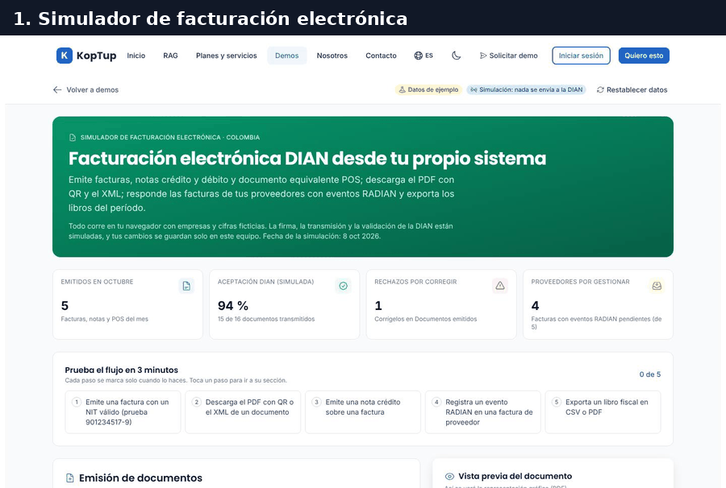

*Recorrido completo: emitir una factura, descargar su PDF, emitir una nota crédito, aceptar la factura de un proveedor y exportar un libro fiscal.*

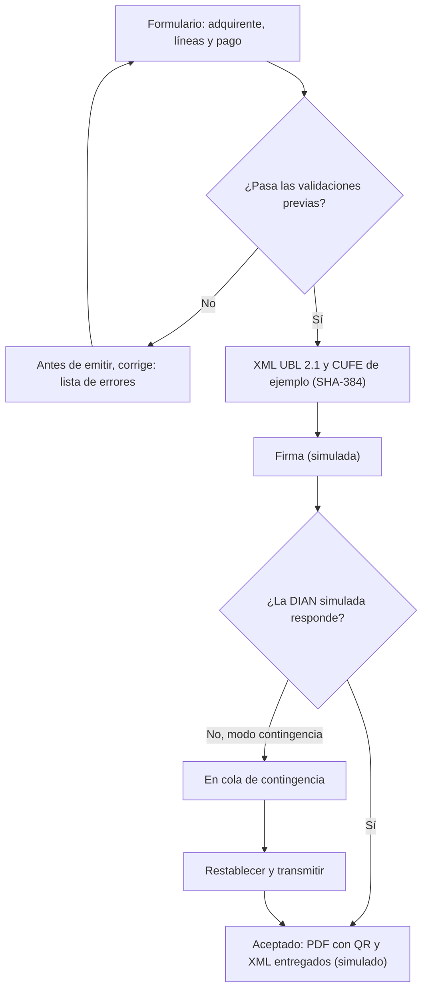

*Qué pasa al pulsar «Emitir»: todo ocurre en el navegador; la firma, la transmisión y la respuesta de la DIAN son simuladas.*

### Paso 1. Arma la factura y valida el NIT

En **Emisión de documentos**, pestaña **Factura de venta**, escribe en el NIT `901234517` (sin el dígito de verificación). El formulario ya trae tres líneas de ejemplo.

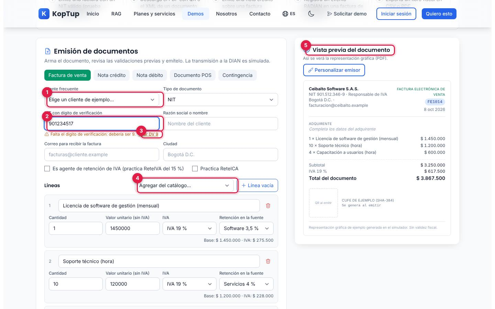

*Formulario de la factura con el NIT incompleto y la vista previa a la derecha.*

1. **Cliente frecuente**: completa todo el adquirente con uno de los 5 clientes de ejemplo.
2. **NIT con dígito de verificación**: el DV se valida con el algoritmo de la DIAN mientras escribes («DV correcto», «Falta el dígito de verificación: debería ser 9», «El DV no corresponde…»).
3. **Usar DV 9**: corrige el NIT con un clic. Como el NIT coincide con un cliente frecuente, la demo completa razón social, correo y ciudad («Cliente frecuente encontrado…»).
4. **Agregar del catálogo…** (6 productos y servicios de ejemplo) o **Línea vacía**. Cada línea tiene cantidad, valor sin IVA, tarifa de IVA y retención en la fuente.
5. **Vista previa del documento**: así se verá el PDF; cambia mientras editas.

Más abajo están la forma y el medio de pago, el resumen (subtotal, base e IVA por tarifa, total), las retenciones informativas, la resolución de numeración de ejemplo con el siguiente número (`FE1014`) y la lista **Antes de emitir, corrige:** con lo que falta. **Emitir factura** queda desactivado hasta que no haya errores.

Qué decir: «El sistema no deja emitir con un NIT mal escrito: el error se corrige antes, no cuando la DIAN rechaza».

### Paso 2. Emite y mira la factura aceptada

Pulsa **Emitir factura**. Las cinco fases se marcan en unos dos segundos.

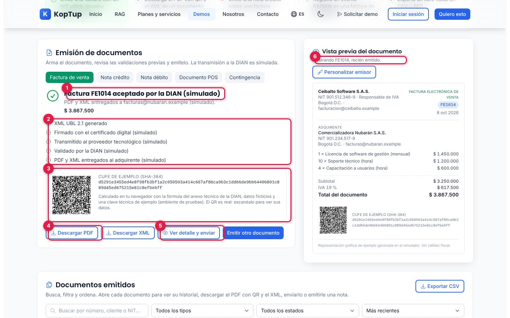

*Resultado de la emisión: la factura FE1014 aceptada (simulado), con su CUFE de ejemplo y su QR.*

1. **Factura FE1014 aceptado por la DIAN (simulado)**, el correo al que se «entregó» y el total ($ 3.867.500).
2. **Fases**: XML UBL 2.1 generado, firmado, transmitido al proveedor tecnológico, validado por la DIAN y entregado al adquirente (todas simuladas salvo el XML).
3. **CUFE de ejemplo (SHA-384) y QR**: el CUFE se calcula en el navegador con la fórmula del anexo técnico, datos ficticios y una clave técnica de ejemplo; el QR es real y se puede escanear.
4. **Descargar PDF** y **Descargar XML**.
5. **Ver detalle y enviar**: abre el detalle del documento (ver [Detalle del documento](#detalle-del-documento)). Al lado, **Emitir otro documento** limpia el formulario.
6. **Vista previa**: ahora muestra «Mostrando FE1014, recién emitido».

### Paso 3. Descarga el PDF con QR o el XML

Baja a **Documentos emitidos** (paso 2 del recorrido). La factura nueva está de primera.

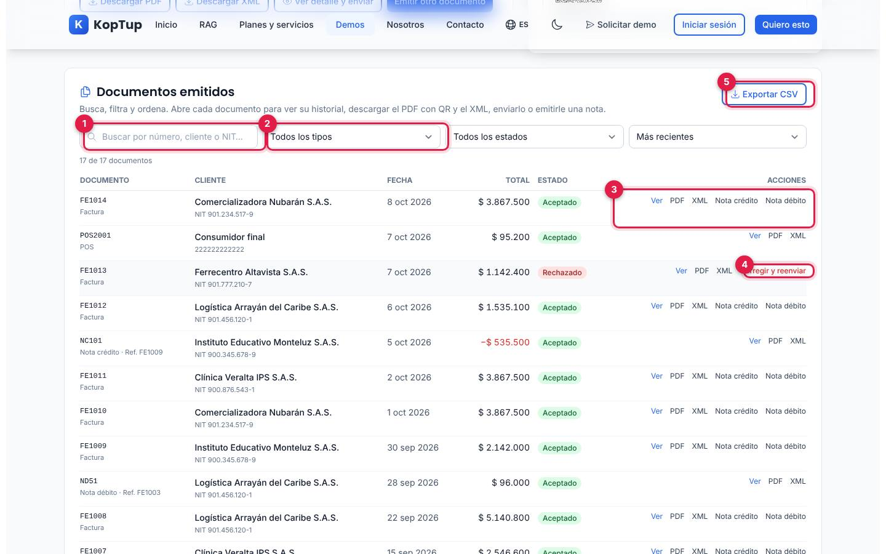

*Lista de documentos con búsqueda, filtros y acciones por fila.*

1. **Buscar** por número, cliente o NIT.
2. **Filtros**: tipo (factura, nota crédito, nota débito, POS), estado (aceptado, rechazado, en contingencia) y orden (más recientes, más antiguos, mayor o menor valor).
3. **Acciones**: **Ver**, **PDF**, **XML** y, en las facturas aceptadas, **Nota crédito** y **Nota débito**. Pulsa **PDF**: se descarga `FE1014.pdf` (ver el [PDF de ejemplo](#pdf-y-xml)).
4. **Corregir y reenviar**: solo en la factura rechazada de los datos de ejemplo (`FE1013`).
5. **Exportar CSV**: descarga los documentos filtrados.

### Paso 4. Emite una nota crédito

En la fila de una factura pulsa **Nota crédito** (en la prueba, `FE1012`). La demo sube al formulario con la pestaña **Nota crédito** y la factura ya elegida.

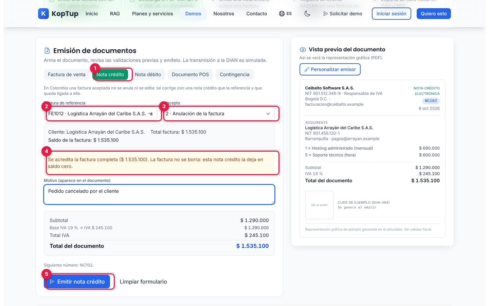

*Nota crédito por anulación de la factura FE1012.*

1. **Nota crédito**: la pestaña explica que en Colombia una factura aceptada no se anula ni se edita; se corrige con una nota crédito ligada a ella.
2. **Factura de referencia**: lista las facturas aceptadas con su saldo.
3. **Concepto**: los 6 conceptos de nota crédito (devolución parcial, anulación, rebaja, ajuste de precio, pronto pago y volumen).
4. Con **2 · Anulación**, la nota acredita la factura completa («La factura no se borra: esta nota crédito la deja en saldo cero»). Con **1 · Devolución** pide las cantidades por línea; con los demás, el valor y el IVA de la nota.
5. **Emitir nota crédito**: sale como `NC102` y queda en el historial de la factura.

Qué decir: «La nota crédito queda amarrada a la factura y el saldo se actualiza solo».

### Paso 5. Responde la factura de un proveedor (RADIAN)

Baja a **Facturas de proveedores (RADIAN)**.

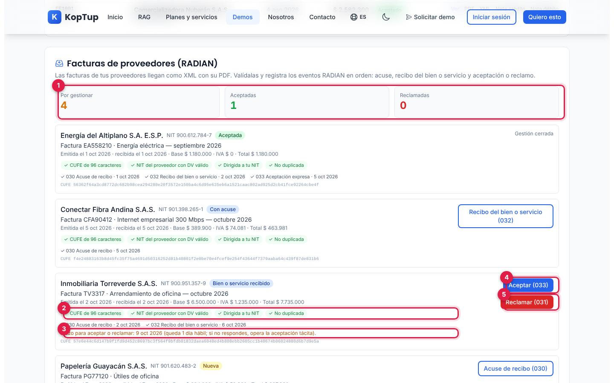

*Facturas recibidas de proveedores, con sus validaciones y los eventos registrados.*

1. **Por gestionar, Aceptadas y Reclamadas**.
2. **Validaciones** de cada factura: CUFE de 96 caracteres, NIT del proveedor con DV válido, dirigida a tu NIT y no duplicada.
3. **Plazo para aceptar o reclamar**: 3 días hábiles después del recibo del bien o servicio (en la factura de Inmobiliaria Torreverde, «9 oct 2026 (queda 1 día hábil…)»).
4. **Aceptar (033)**: registra la aceptación expresa. Pulsa este botón: la factura pasa a **Aceptada** y «Por gestionar» baja de 4 a 3.
5. **Reclamar (031)**: despliega el motivo (01 a 04) y **Registrar reclamo**.

Los eventos van en orden: **Acuse de recibo (030)** → **Recibo del bien o servicio (032)** → aceptar o reclamar.

### Paso 6. Exporta un libro fiscal

Baja a **Libros y reportes**.

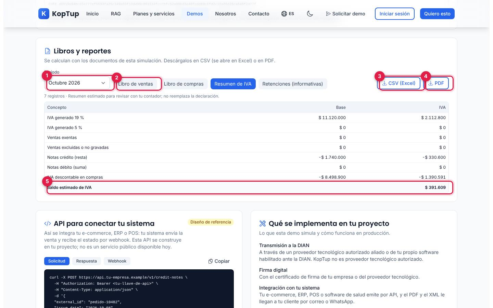

*Resumen de IVA de octubre de 2026 calculado con los documentos de la simulación.*

1. **Período**: agosto, septiembre u octubre de 2026, o los tres meses.
2. **Libros**: Libro de ventas, Libro de compras, Resumen de IVA y Retenciones (informativas).
3. **CSV (Excel)**: descarga el libro (por ejemplo `resumen-iva-2026-10.csv`).
4. **PDF**: el mismo libro en PDF, con la franja «Datos de ejemplo del simulador de KopTup. No es un reporte oficial».
5. **Saldo estimado de IVA**: IVA generado menos notas crédito e IVA descontable en compras («para revisar con tu contador; no reemplaza la declaración»).

Al descargar, el recorrido queda en **5 de 5**. Arriba, «Emitidos en octubre» pasa de 5 a 7 y «Proveedores por gestionar» de 4 a 3. Cierre sugerido: bajar a **API para conectar tu sistema** y **Qué se implementa en tu proyecto** para explicar qué es simulado y qué se construye.

---

## Pantallas y funciones

La demo es una sola página larga, sin pestañas de navegación: encabezado, presentación, indicadores, recorrido, emisión con vista previa, documentos emitidos, facturas de proveedores, libros y reportes, API y «Qué se implementa en tu proyecto».

### Encabezado, indicadores y recorrido

| Elemento | Qué hace |
|---|---|
| **Volver a demos** | Va a `/demo`. |
| **Datos de ejemplo** y **Simulación: nada se envía a la DIAN** | Insignias fijas. |
| **Restablecer datos** | Pregunta «¿Borrar tus cambios y volver a los datos de ejemplo?» con **Sí, restablecer** y **Cancelar**. |
| Presentación | Explica que todo corre en el navegador con empresas ficticias y que la fecha de la simulación es el 8 oct 2026. |
| **Emitidos en octubre** | Facturas, notas y POS del mes (5 al empezar) y cuántos hay en cola de contingencia. |
| **Aceptación DIAN (simulada)** | Porcentaje de aceptados sobre transmitidos (94 %: 15 de 16 al empezar). |
| **Rechazos por corregir** | Documentos rechazados (1 al empezar: `FE1013`). |
| **Proveedores por gestionar** | Facturas de proveedores con eventos RADIAN pendientes (4 de 5 al empezar). |
| **Prueba el flujo en 3 minutos** | Los 5 pasos del recorrido con su avance («0 de 5»). |

### Emisión de documentos

Pestañas **Factura de venta**, **Nota crédito**, **Nota débito**, **Documento POS** y **Contingencia**. La factura se ve en los [pasos 1 y 2](#paso-1-arma-la-factura-y-valida-el-nit) y la nota crédito en el [paso 4](#paso-4-emite-una-nota-crédito).

- **Adquirente**: NIT (8 a 10 dígitos más DV) o cédula (6 a 10 dígitos), razón social, correo y ciudad; casillas «Es agente de retención de IVA (practica ReteIVA del 15 %)» y «Practica ReteICA» (con tarifa por mil de ejemplo).
- **Líneas**: IVA 19 %, 5 %, exento o excluido; retención en la fuente sin retención, servicios 4 %, honorarios 11 %, compras 2,5 % o software 3,5 %.
- **Pago**: contado o crédito (15 a 90 días, con la fecha de vencimiento) y medio de pago (transferencia, efectivo o tarjeta).
- **Retenciones informativas**: ReteFuente, ReteIVA y ReteICA que te practicaría el comprador y el neto estimado a recibir. No restan del total del documento.
- **Nota débito**: factura de referencia, concepto (intereses, gastos por cobrar, cambio del valor u otros), valor e IVA. Sale con prefijo `ND`.
- **Documento POS**: «Consumidor final (222222222222)» o «Con datos del comprador», líneas y medio de pago; sale con prefijo `POS`. Tiene el enlace **Ver la demo de POS** (`/demo/pos`).
- **Validaciones de las notas**: no deja pasar del saldo de la factura, devolver más de lo facturado ni anular una factura que ya tiene notas crédito.
- **Limpiar formulario** vuelve a los valores de ejemplo de la pestaña.

### Contingencia

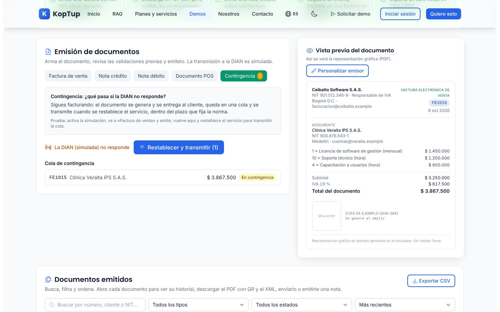

*Modo contingencia activo: la factura FE1015 quedó en cola y espera a que se restablezca el servicio.*

1. Pulsa **Simular que la DIAN no responde**. En las demás pestañas aparece el aviso «Modo contingencia activo…» y el botón de emitir cambia a **Emitir en contingencia**.
2. Emite una factura: queda **En contingencia**, con el mensaje «Ya puedes entregarlo al cliente; se transmitirá cuando restablezcas el servicio». La pestaña muestra cuántos hay en cola.
3. **Restablecer y transmitir (N)** transmite la cola y los documentos pasan a **Aceptado** («N documentos transmitidos y aceptados (simulado)»).

### Vista previa y emisor

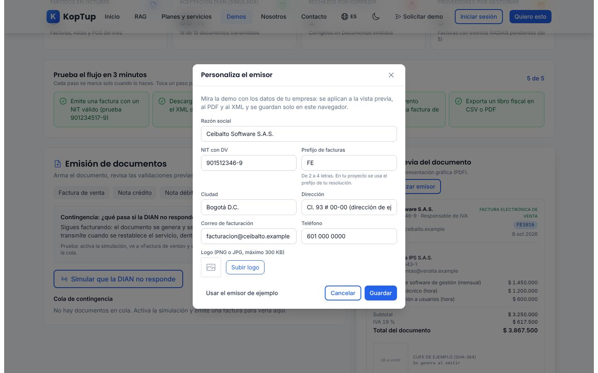

*Ventana «Personaliza el emisor»: los datos se aplican a la vista previa, al PDF y al XML.*

- La **vista previa** muestra emisor, tipo y número, fecha, adquirente, hasta 5 líneas («+ N líneas más»), totales, el QR y el CUFE (antes de emitir dicen «Se genera al emitir»).
- **Personalizar emisor**: razón social, NIT con DV, prefijo de facturas (2 a 4 letras), ciudad, dirección, correo, teléfono y logo PNG o JPG de hasta 300 KB. **Usar el emisor de ejemplo** vuelve a Ceibalto Software S.A.S. Sirve para mostrarle la demo al prospecto con los datos de su empresa; se guarda solo en ese navegador. Si cambias el NIT, la demo recalcula los CUFE de ejemplo.

### Detalle del documento

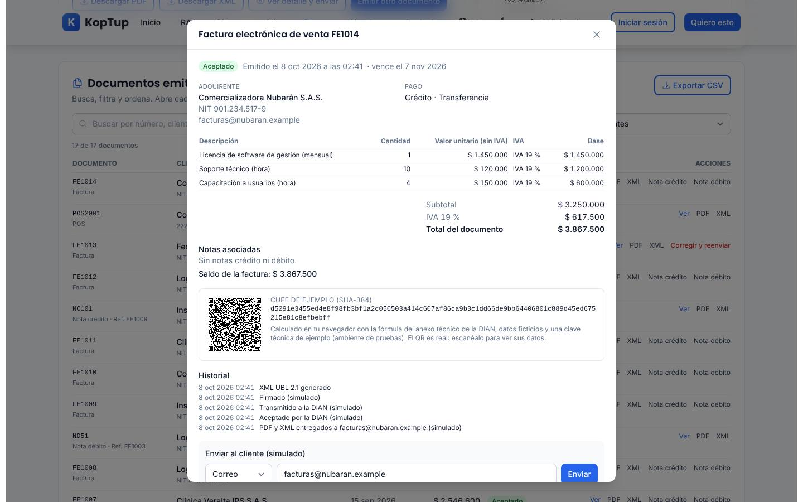

*Detalle de la factura FE1014: adquirente, pago, líneas, notas asociadas, CUFE con QR e historial.*

- Estado, fecha y hora de emisión, vencimiento, adquirente y forma de pago.
- Líneas y totales, **Notas asociadas** y **Saldo de la factura**.
- CUFE (o CUDE en notas y POS) con su QR.
- **Historial**: XML generado, firmado, transmitido, aceptado, entregado, reenvíos, correcciones y notas emitidas.
- **Enviar al cliente (simulado)**: canal correo o WhatsApp y destino (valida el correo o el celular). No sale ningún mensaje: queda registrado en el historial.
- Botones **PDF**, **XML**, **Nota crédito** y **Nota débito**.

### Corregir un rechazo

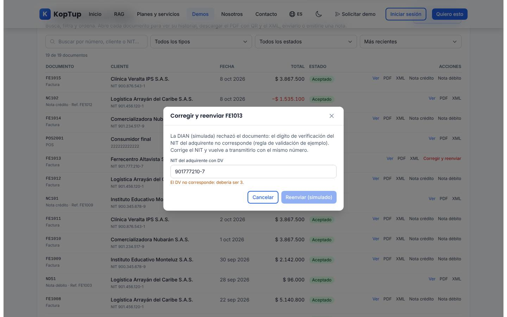

*La factura FE1013 de los datos de ejemplo fue rechazada (simulado) porque el DV del NIT del adquirente no corresponde.*

Escribe el NIT con el DV correcto (la ventana indica cuál debería ser) y pulsa **Reenviar (simulado)**; el botón está desactivado mientras el DV siga mal. La factura se reenvía con el mismo número, pasa a **Aceptado** y el indicador «Rechazos por corregir» baja a 0.

### PDF y XML

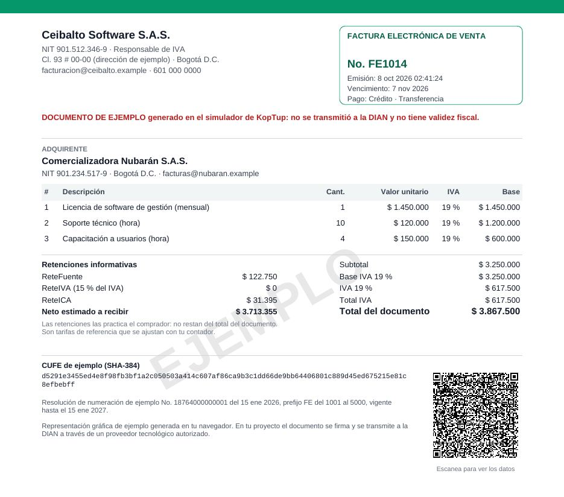

*Página del `FE1014.pdf` generado en el navegador: marca de agua «EJEMPLO», retenciones informativas, CUFE, resolución de ejemplo y QR.*

- **PDF**: representación gráfica con la franja «DOCUMENTO DE EJEMPLO generado en el simulador de KopTup: no se transmitió a la DIAN y no tiene validez fiscal», marca de agua y QR escaneable. Las notas muestran la factura de referencia, el concepto y el motivo.
- **XML**: estructura UBL 2.1 simplificada con un comentario que aclara que no tiene firma digital, extensiones DIAN ni validez fiscal.

### Facturas de proveedores (RADIAN)

Ver el [paso 5](#paso-5-responde-la-factura-de-un-proveedor-radian). Los datos traen 5 facturas: una ya aceptada (Energía del Altiplano), una con acuse, una con recibo del bien o servicio, una nueva y una dirigida a otro NIT (Mensajería Cumbre Express), en la que la demo marca «Dirigida a otro NIT», desactiva **Aceptar (033)** y sugiere reclamarla con el motivo 01.

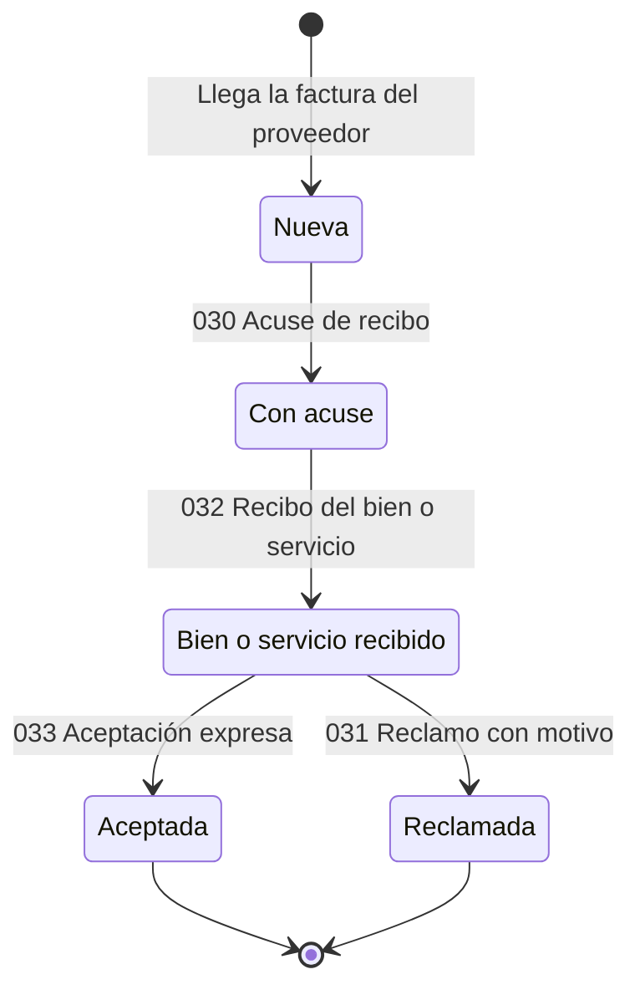

*Estados de una factura de proveedor en la demo y el evento que la mueve.*

### Libros y reportes

Ver el [paso 6](#paso-6-exporta-un-libro-fiscal).

| Libro | Qué incluye |
|---|---|
| Libro de ventas | Facturas, POS y notas débito suman; las notas crédito restan. No incluye rechazados. |
| Libro de compras | Facturas de proveedores del período; no incluye las reclamadas. |
| Resumen de IVA | IVA generado por tarifa, exentas, excluidas, notas, IVA descontable y saldo estimado. |
| Retenciones (informativas) | ReteFuente, ReteIVA y ReteICA que te practicarían tus clientes, por factura. |

Cada libro muestra el número de registros, una fila de total y se descarga en CSV o PDF.

### API y «Qué se implementa en tu proyecto»

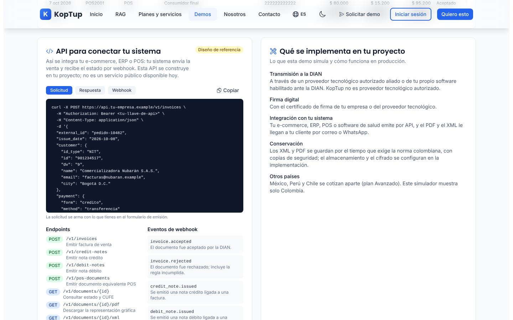

*Panel «API para conectar tu sistema» (diseño de referencia) y lo que se implementa en el proyecto real.*

- **API para conectar tu sistema** lleva la insignia **Diseño de referencia** y dice: «Esta API se construye en tu proyecto; no es un servicio público disponible hoy». Las pestañas **Solicitud**, **Respuesta** y **Webhook** muestran ejemplos; la solicitud (`curl`) se arma con lo que tengas en el formulario de emisión. **Copiar** la copia al portapapeles. Debajo, 10 endpoints y 6 eventos de webhook de ejemplo.
- **Qué se implementa en tu proyecto**: transmisión por un proveedor tecnológico autorizado («KopTup no es proveedor tecnológico autorizado»), firma digital con certificado, integración por API, conservación de XML y PDF, y otros países (México, Perú y Chile se cotizan aparte; el simulador muestra solo Colombia).

### En el celular

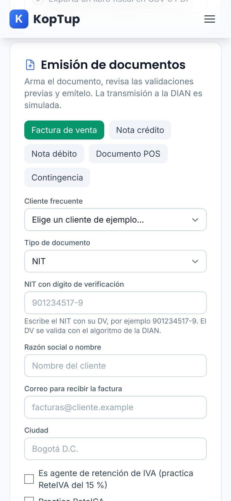

*Formulario de emisión en un teléfono (390 px).*

En pantallas pequeñas las pestañas de emisión pasan a varias filas, los campos van en una columna, la vista previa queda debajo del formulario y las tablas se desplazan de lado. La página no se desborda a lo ancho.

---

## Qué es real y qué es simulado

| Parte | Real o simulado | Detalle |
|---|---|---|
| Emisor, clientes, proveedores, documentos y cifras | **Datos de ejemplo** | Empresas ficticias; los correos usan dominios `.example`. |
| Validación del NIT con su DV | **Real** | Algoritmo de la DIAN, calculado en el navegador. |
| Cálculo de IVA, retenciones, saldos y libros | **Real (en el navegador)** | Con tarifas de referencia que se ajustan con el contador. |
| CUFE / CUDE | **De ejemplo** | SHA-384 con la fórmula del anexo técnico, pero con datos ficticios y una clave técnica de ejemplo. |
| QR | **Real** | Se puede escanear; contiene los datos del documento de ejemplo. |
| PDF y XML | **Reales, sin validez fiscal** | Se generan en el navegador; XML UBL 2.1 simplificado, sin firma. |
| Firma, transmisión y respuesta de la DIAN | **Simuladas** | Siempre aceptan (salvo la contingencia que tú activas). |
| Envío por correo o WhatsApp | **Simulado** | Solo queda en el historial. |
| Eventos RADIAN | **Simulados** | Se registran en la página; no llegan a la DIAN. |
| API y webhooks | **Diseño de referencia** | No existen como servicio; son ejemplos de cómo sería la integración. |
| Dónde se guardan tus cambios | **Solo en este navegador** | `localStorage`; si no hay espacio (por ejemplo, un logo pesado) la demo lo avisa y sigue funcionando sin recordar. |

---

## Acceso

**Cómo lo ve un visitante.** La demo es **Abierta**: en `/demo` su tarjeta lleva la insignia «Abierta» con **Probar Demo** (abre `/demo/facturacion-electronica` directamente) y **Solicitar demo guiada** (`/solicitar-demo?demos=facturacion-electronica`). No hay pantalla de acceso ni hace falta cuenta, y la demo en sí no usa el backend. Al final de la página está el bloque «¿Te gustaría algo así para tu negocio?» con **Solicitar demo guiada**, **Solicitar Cotización** y **Ver Planes y Precios**.

**Cómo se solicita una demo guiada y cómo la gestiona el admin.** La solicitud del formulario llega a **Admin › Solicitudes de demo** como cualquier otra. Como la demo es abierta, no hace falta conceder acceso para usarla; la solicitud sirve para agendar la demo guiada. Un admin puede cambiar el modo de acceso en **Admin › Catálogo de demos** (por ejemplo, a «Con solicitud»); en ese caso empezaría a mostrarse la pantalla de acceso. Detalle en el [Manual del administrador](Doc-06-Manual-del-Administrador.md) y en [Flujos del visitante](Doc-04-Flujos-del-Visitante.md).

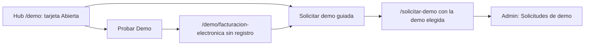

*Dos caminos: probarla de una vez o pedir una demo guiada.*

---

## Limitaciones conocidas

1. **La tarjeta del hub promete más que la demo.** Dice «Facturación Electrónica Multi-país», «8 países LatAm: CO, MX, AR, CL, PE, UY, PY, EC», «Recepción de proveedores con OCR» y «API + SDKs + plugins ERP/POS + modo white-label». La demo muestra solo Colombia (lo dice en «Otros países»), no tiene OCR y la API es un diseño de referencia.
2. **Todo es simulado**: no hay firma, transmisión ni respuesta real de la DIAN; el CUFE usa una clave técnica de ejemplo y los documentos no tienen validez fiscal.
3. **Los cambios viven solo en el navegador.** Otro equipo o navegador ve los datos de ejemplo.
4. **Fecha fija con hora real.** La fecha de la simulación es siempre el 8 oct 2026, pero la hora de emisión es la hora actual de Colombia (por ejemplo, «Emitido el 8 oct 2026 a las 02:38»).
5. **RADIAN: para reclamar hay que registrar antes el recibo del bien o servicio (032)**, incluso en la factura dirigida a otro NIT que la propia demo sugiere reclamar. La aceptación tácita (034) nunca se registra sola: el texto la menciona, pero ninguna factura pasa a «Aceptación tácita» al vencer el plazo.
6. **La solicitud de la API arrastra la referencia de una nota.** Si empiezas una nota crédito o débito y luego cambias a **Factura de venta** sin pulsar **Limpiar formulario** ni **Emitir otro documento**, el ejemplo `POST /v1/invoices` sigue mostrando el bloque `"reference"` de la nota.
7. **Un solo caso de rechazo.** Solo la factura `FE1013` de los datos de ejemplo llega rechazada; los documentos nuevos no pueden rechazarse porque las validaciones impiden emitirlos con errores.
8. **Textos con concordancia incorrecta**: «Factura FE1014 aceptado por la DIAN (simulado)» y «1 documentos transmitidos y aceptados (simulado)».
