# Guía de la demo: Plataforma de Firma Electrónica

> Ruta `/demo/firma-electronica` · Modo de acceso: **Abierta** · Tipo: **datos de ejemplo** (maqueta interactiva en el navegador: no firma, no envía correos, no guarda nada y no llama al servidor ni a IA) · Plan del producto: [Firma electrónica](Producto-firma-electronica.md)

**Resumen.** Es la maqueta de una plataforma de firma electrónica («Koptup Sign»): un tablero con seis sobres de ejemplo, un asistente de 4 pasos para armar un sobre (documento, firmantes, campos y seguridad), la línea de tiempo de auditoría de un sobre, plantillas, un ejemplo de API, la pantalla que vería quien firma e integraciones. Sirve para mostrarle a RRHH, áreas legales, IPS o inmobiliarias cómo sería el flujo de enviar un documento a firmar. Cualquier visitante la abre sin registrarse; todo lo que hagas se pierde al recargar.

**En esta página:** [Recorrido sugerido](#recorrido-sugerido-demo-comercial-de-5-minutos) · [Pantallas y funciones](#pantallas-y-funciones) · [Qué es real y qué es simulado](#qué-es-real-y-qué-es-simulado) · [Acceso](#acceso) · [Limitaciones conocidas](#limitaciones-conocidas)

*Vista inicial: encabezado con las insignias de cumplimiento, presentación, las siete pestañas y los cuatro indicadores del tablero.*

---

## Recorrido sugerido (demo comercial de 5 minutos)

La demo no trae un recorrido guiado propio ni un botón para restablecer: para empezar de cero, recarga la página. Este guion recorre el tablero, la auditoría de un sobre y el asistente **Crear sobre** completo, y cierra con la **Vista firmante**.

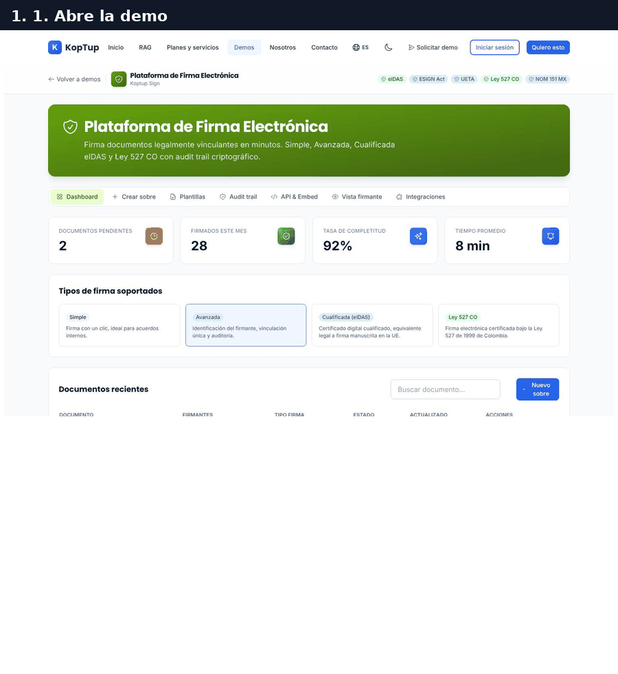

*Recorrido completo: tablero, auditoría del sobre «Acuerdo SaaS — Acme», los cuatro pasos de «Crear sobre» y la pantalla del firmante.*

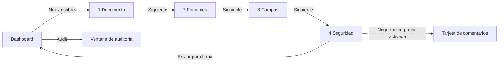

*El asistente vuelve al tablero al pulsar «Enviar para firma»; el sobre no se agrega a la lista ni se envía a nadie.*

### Paso 1. Muestra el tablero y los sobres de ejemplo

La demo abre en la pestaña **Dashboard**.

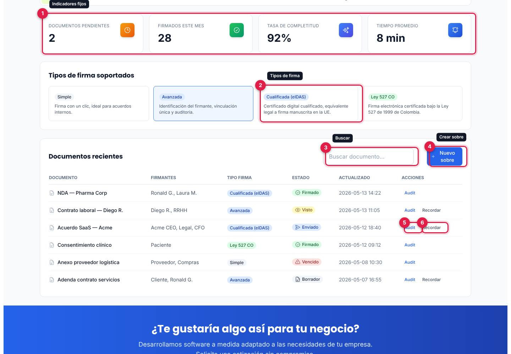

*Indicadores, tipos de firma y la tabla «Documentos recientes» con sus acciones.*

1. **Indicadores**: Documentos pendientes (2), Firmados este mes (28), Tasa de completitud (92 %) y Tiempo promedio (8 min). Son cifras fijas de ejemplo: no cambian con lo que hagas.
2. **Tipos de firma soportados**: Simple, Avanzada, Cualificada (eIDAS) y Ley 527 CO, con una línea de explicación. Al tocar una tarjeta queda marcada, y esa misma elección aparece en el paso 4 del asistente.
3. **Buscar documento...**: filtra la tabla por nombre mientras escribes.
4. **Nuevo sobre**: abre la pestaña **Crear sobre**.
5. **Audit**: abre la auditoría del sobre (paso 2).
6. **Recordar**: aparece en los sobres enviados, vistos o en borrador, pero no hace nada.

La tabla trae seis sobres: NDA — Pharma Corp (Firmado), Contrato laboral — Diego R. (Visto), Acuerdo SaaS — Acme (Enviado), Consentimiento clínico (Firmado), Anexo proveedor logística (Vencido) y Adenda contrato servicios (Borrador), con firmantes, tipo de firma y fecha de actualización (mayo de 2026).

Qué decir: «Desde aquí ves en qué va cada documento y quién falta por firmar».

### Paso 2. Abre la auditoría de un sobre

En la fila **Acuerdo SaaS — Acme** pulsa **Audit**.

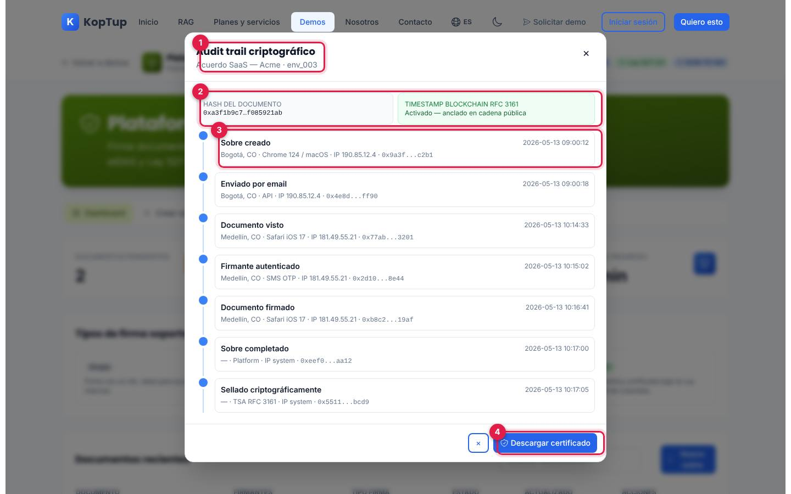

*Ventana «Audit trail criptográfico» del sobre env_003.*

1. **Documento e identificador del sobre** (`env_003`).
2. **Hash del documento** y **Timestamp blockchain RFC 3161** («Activado — anclado en cadena pública»).
3. **Línea de tiempo** con 7 eventos: Sobre creado, Enviado por email, Documento visto, Firmante autenticado, Documento firmado, Sobre completado y Sellado criptográficamente; cada uno con fecha y hora, ciudad, dispositivo, IP y un hash abreviado.
4. **Descargar certificado**: no descarga nada.

La ventana se cierra con la **×** de arriba, con el botón **×** de abajo, con Escape o tocando fuera. Muestra los mismos 7 eventos para cualquier sobre (ver [Limitaciones](#limitaciones-conocidas)).

Qué decir: «Cada paso queda registrado con fecha, lugar y dispositivo: es la evidencia que respalda la firma».

### Paso 3. Crea un sobre: el documento

Cierra la ventana y pulsa **Nuevo sobre**.

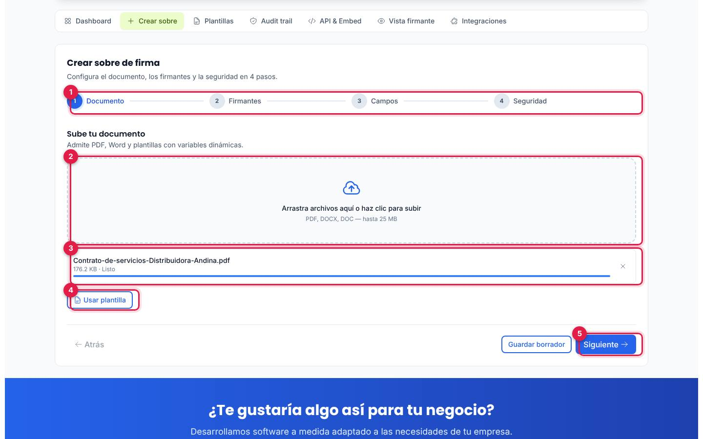

*Paso «Documento» con un PDF de ejemplo cargado.*

1. **Pasos del asistente**: Documento, Firmantes, Campos y Seguridad. El paso hecho se marca en verde.
2. **Zona de carga**: arrastra un archivo o haz clic para elegirlo («PDF, DOCX, DOC — hasta 25 MB»).
3. **Archivo cargado**: muestra nombre, tamaño y una barra de carga que llega a «Listo». La carga es una animación: el archivo no sale del navegador ni se lee. La zona acepta cualquier tipo y tamaño de archivo, aunque diga PDF, DOCX o DOC.
4. **Usar plantilla**: no muestra ningún cambio.
5. **Siguiente**: pasa al paso 2 (no exige haber cargado un documento).

**Guardar borrador**, en todos los pasos, no hace nada.

### Paso 4. Agrega los firmantes y el orden

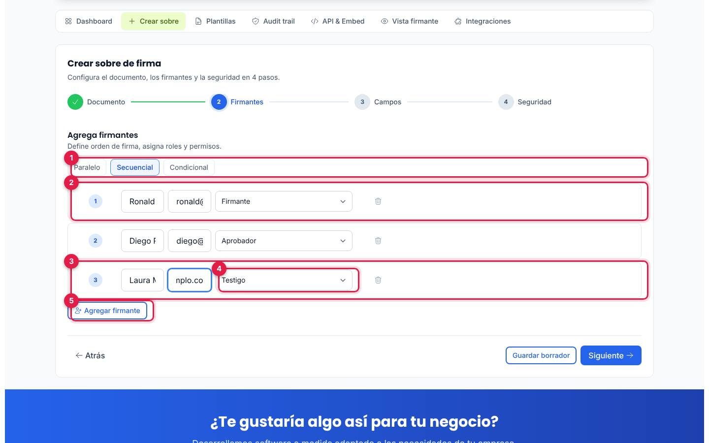

*Paso «Firmantes» con un tercer firmante agregado como testigo.*

1. **Modo de firma**: Paralelo, Secuencial (el marcado al empezar) o Condicional. Solo cambia el botón marcado.
2. **Firmantes de ejemplo**: Ronald G. (Firmante) y Diego R. (Aprobador), numerados en orden.
3. **Firmante agregado**: con **Agregar firmante** aparece una fila vacía; en la prueba se escribió «Laura Martínez» y un correo `@ejemplo.co`.
4. **Rol**: Firmante, Aprobador, Solo lectura o Testigo.
5. **Agregar firmante**. El ícono de la papelera, a la derecha de cada fila, quita al firmante.

Los campos de nombre y correo quedan angostos y el texto se corta (ver [Limitaciones](#limitaciones-conocidas)).

### Paso 5. Ubica los campos en el documento

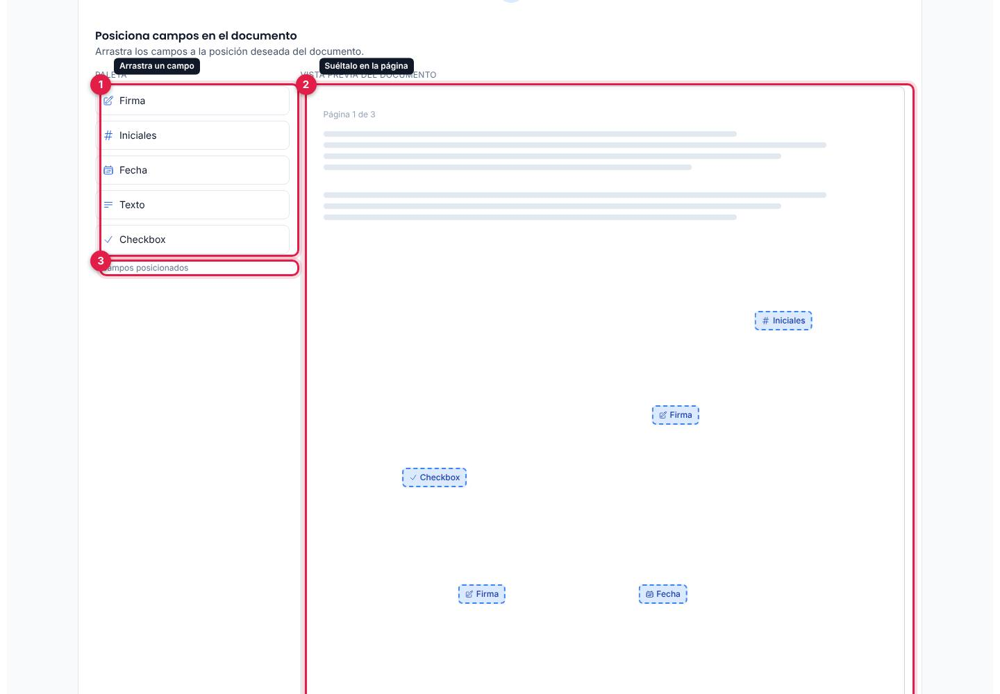

*Paso «Campos»: la paleta a la izquierda y la página con los campos ubicados.*

1. **Paleta**: Firma, Iniciales, Fecha, Texto y Checkbox. Arrastra uno con el mouse; mientras lo arrastras, la página dice «Suelta aquí».
2. **Vista previa del documento** («Página 1 de 3»): trae tres campos de ejemplo (Firma, Fecha e Iniciales) y suma los que sueltes donde los sueltes. En la prueba se agregaron una Firma y un Checkbox.
3. **Contador**: «5 campos posicionados».

Los campos no se pueden mover ni borrar después de soltarlos, y todos quedan asignados al primer firmante sin que la pantalla lo diga.

### Paso 6. Configura la seguridad y la negociación previa

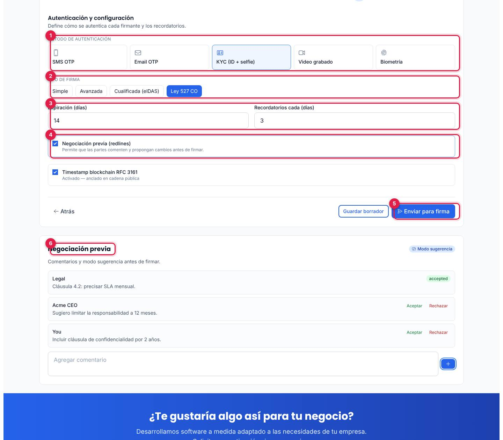

*Paso «Seguridad» con KYC, firma Ley 527 CO y la negociación previa activada.*

1. **Método de autenticación**: SMS OTP, Email OTP, KYC (ID + selfie), Video grabado o Biometría.
2. **Tipo de firma**: Simple, Avanzada, Cualificada (eIDAS) o Ley 527 CO (la misma elección del tablero).
3. **Expiración (días)** (14) y **Recordatorios cada (días)** (3).
4. **Negociación previa (redlines)**: al marcarla aparece debajo la tarjeta **Negociación previa**. La casilla **Timestamp blockchain RFC 3161** cambia el texto de la pestaña **Audit trail** entre «Activado» y «Desactivado».
5. **Enviar para firma**: vuelve al **Dashboard** y deja el asistente en el paso 1. No aparece un sobre nuevo en la tabla.
6. **Negociación previa**: dos comentarios de ejemplo (Legal y Acme CEO) con **Aceptar** y **Rechazar**, y un cuadro para agregar uno nuevo con **+**. Al aceptar o rechazar, el comentario muestra la etiqueta en inglés «accepted» o «rejected»; los comentarios que agregas salen firmados por «You».

Qué decir: «Antes de firmar, las partes pueden proponer cambios; cuando todos están de acuerdo, se envía el sobre con la verificación de identidad que elijas».

### Paso 7. Cierra con la vista del firmante

Abre la pestaña **Vista firmante** (ver [Vista firmante](#vista-firmante)): es la pantalla limpia que recibiría la persona que firma. Cierre sugerido: bajar al bloque «¿Te gustaría algo así para tu negocio?» y pulsar **Solicitar demo guiada**.

---

## Pantallas y funciones

La demo es una sola página con un encabezado, una presentación y siete pestañas: **Dashboard**, **Crear sobre**, **Plantillas**, **Audit trail**, **API & Embed**, **Vista firmante** e **Integraciones**. Lo que cambias en una pestaña se conserva al pasar a otra, pero se pierde al recargar.

### Encabezado y presentación

| Elemento | Qué hace |
|---|---|
| **Volver a demos** | Va a `/demo`. |
| Nombre «Plataforma de Firma Electrónica · Koptup Sign» | Solo en pantallas medianas y grandes. |
| Insignias **eIDAS**, **ESIGN Act**, **UETA**, **Ley 527 CO** y **NOM 151 MX** | Fijas, sin acción. La demo no tiene ninguna insignia de «Datos de ejemplo». |
| Presentación | «Firma documentos legalmente vinculantes en minutos. Simple, Avanzada, Cualificada eIDAS y Ley 527 CO con audit trail criptográfico.» |

### Dashboard

Ver los [pasos 1 y 2](#paso-1-muestra-el-tablero-y-los-sobres-de-ejemplo). Resumen de lo que funciona:

| Elemento | Funciona | Qué pasa |
|---|---|---|
| Indicadores | Solo muestran | Cifras fijas. |
| Tarjetas de tipo de firma | Sí | Marcan el tipo elegido (compartido con el paso 4). |
| Buscar documento... | Sí | Filtra por nombre. |
| Nuevo sobre | Sí | Abre **Crear sobre**. |
| Audit | Sí | Abre la ventana de auditoría. |
| Recordar | No | Sin efecto. |

### Crear sobre

Ver los [pasos 3 a 6](#paso-3-crea-un-sobre-el-documento). **Atrás** vuelve al paso anterior (desactivado en el primero). Los firmantes, los campos y las opciones que cambias se mantienen aunque envíes el sobre o cambies de pestaña; solo se reinician al recargar.

### Plantillas

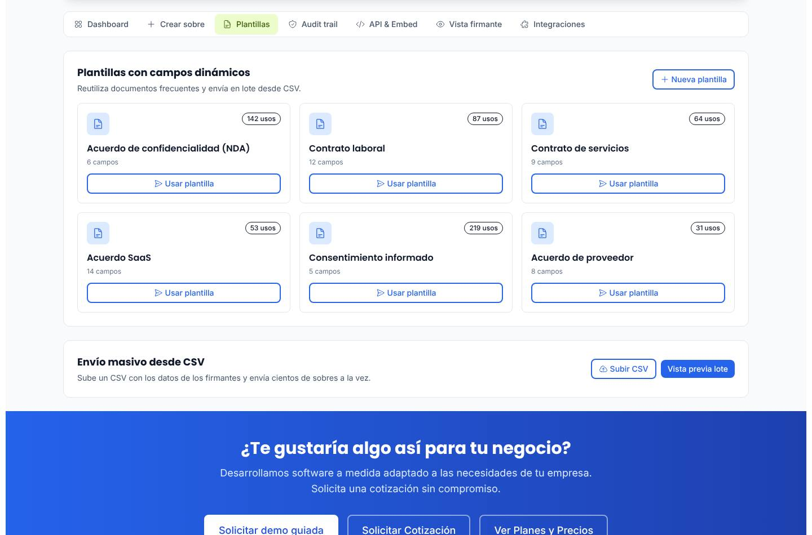

*Seis plantillas con sus campos y usos, y el bloque de envío masivo desde CSV.*

- **Plantillas con campos dinámicos**: Acuerdo de confidencialidad (NDA), Contrato laboral, Contrato de servicios, Acuerdo SaaS, Consentimiento informado y Acuerdo de proveedor, con el número de campos y de usos (cifras de ejemplo).
- **Usar plantilla** abre **Crear sobre** en el paso en que estaba; no carga la plantilla elegida.
- **Nueva plantilla**, **Subir CSV** y **Vista previa lote** (bloque «Envío masivo desde CSV») no hacen nada.

### Audit trail

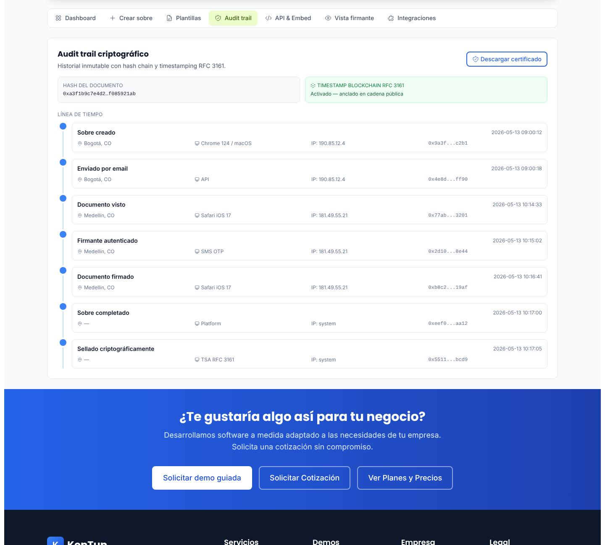

*Auditoría de ejemplo: hash del documento, estado del sello de tiempo y los siete eventos.*

Es la misma información de la ventana del [paso 2](#paso-2-abre-la-auditoría-de-un-sobre), en una pestaña: hash del documento, **Timestamp blockchain RFC 3161** (aquí sí refleja la casilla del paso 4: «Activado — anclado en cadena pública» o «Desactivado») y la línea de tiempo con ciudad, dispositivo, IP y hash de cada evento. **Descargar certificado** no hace nada.

### API & Embed

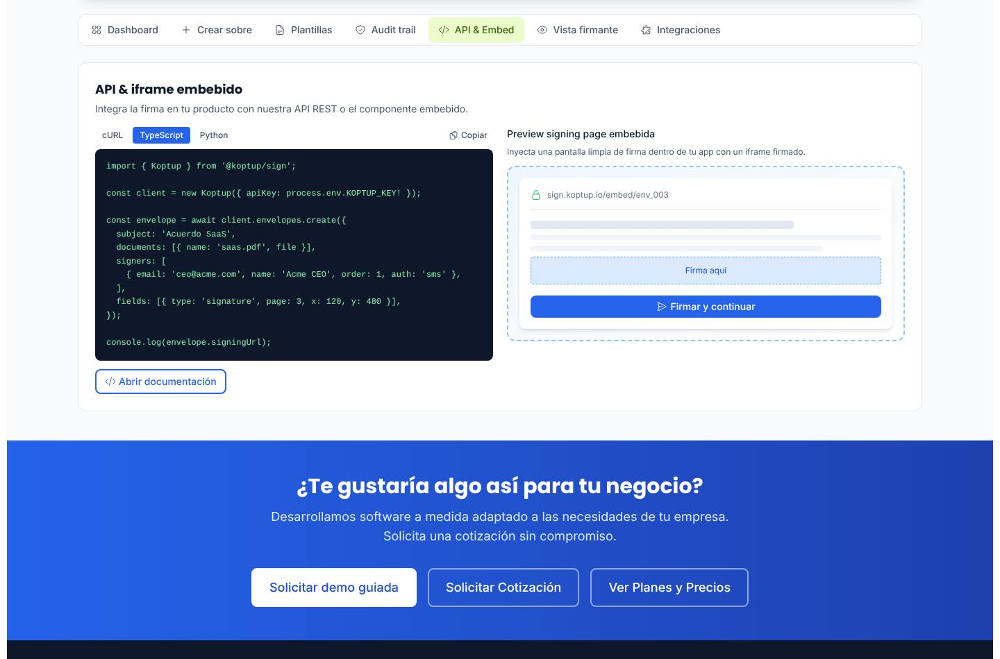

*Ejemplo de código para crear un sobre y la vista previa de la firma embebida.*

- Tres ejemplos de código para crear un sobre: **cURL**, **TypeScript** (el que abre) y **Python**. **Copiar** copia el ejemplo al portapapeles y cambia a «Copiado» por un momento.
- **Preview signing page embebida**: un dibujo de cómo se vería la firma dentro de otra aplicación (`sign.koptup.io/embed/env_003`).
- **Abrir documentación** y **Firmar y continuar** no hacen nada. La API, el paquete `@koptup/sign` y las direcciones de los ejemplos no existen: son ilustrativos.

### Vista firmante

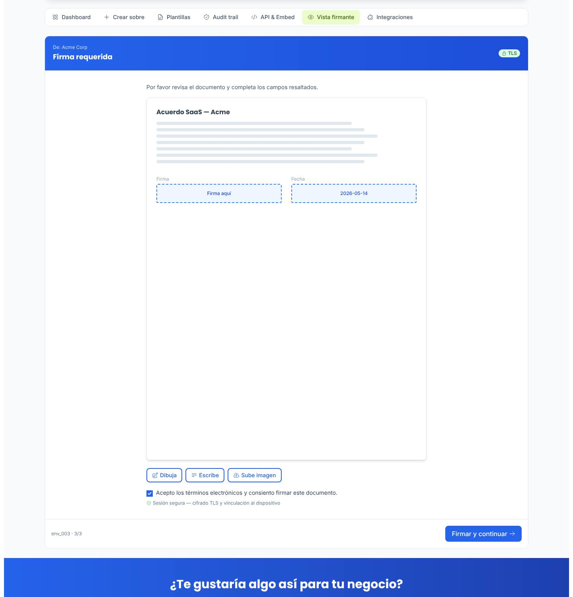

*Pantalla del firmante para el «Acuerdo SaaS — Acme», con los campos «Firma aquí» y la fecha.*

- Encabezado «De: Acme Corp · Firma requerida» con la insignia **TLS**, instrucciones y una página de ejemplo con los campos **Firma aquí** y la fecha `2026-05-14`.
- **Dibuja**, **Escribe** y **Sube imagen** no hacen nada; no hay dónde dibujar ni escribir la firma.
- La casilla «Acepto los términos electrónicos y consiento firmar este documento.» se puede marcar y desmarcar.
- La barra inferior dice «env_003 · 3/3» y tiene **Firmar y continuar**, que no hace nada.

### Integraciones

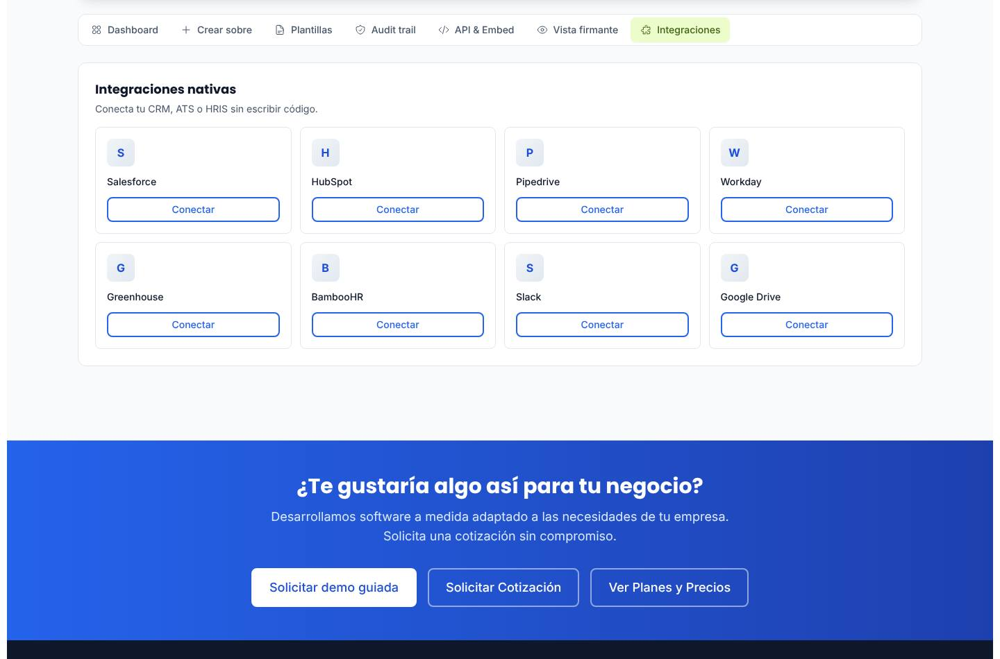

*Ocho integraciones de ejemplo con su botón «Conectar».*

Salesforce, HubSpot, Pipedrive, Workday, Greenhouse, BambooHR, Slack y Google Drive. Los ocho botones **Conectar** no hacen nada.

### En el celular

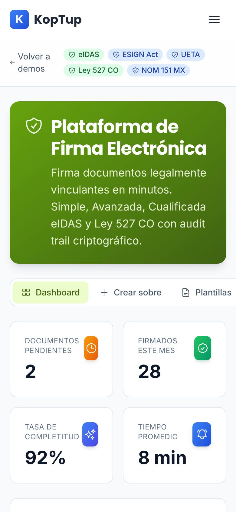

*La demo en un teléfono (390 px): insignias en dos filas, presentación y pestañas con desplazamiento lateral.*

En pantallas pequeñas se oculta el nombre del encabezado, las pestañas se desplazan de lado, los indicadores quedan de a dos y la tabla de documentos se desplaza de lado (sin la columna «Actualizado»). La página no se desborda a lo ancho. Para ubicar campos en el paso 3 hay que arrastrar con el mouse, así que ese paso está pensado para escritorio.

---

## Qué es real y qué es simulado

| Parte | Real o simulado | Detalle |
|---|---|---|
| Sobres, firmantes, cifras, auditoría y plantillas | **Datos de ejemplo** | Fijos en el código de la página; los indicadores no cambian. |
| Carga del documento | **Simulada** | La barra de progreso es una animación; el archivo no se lee ni se envía. |
| Firmantes, campos, opciones de seguridad y comentarios | **Reales en la página** | Se pueden cambiar, pero no se guardan ni se envían; se pierden al recargar. |
| Envío del sobre, correos y recordatorios | **No existen** | «Enviar para firma» solo vuelve al tablero. |
| Autenticación (OTP, KYC, video, biometría) | **No existe** | Son opciones para elegir; no hay verificación. |
| Firma, hash, sello de tiempo y blockchain | **No existen** | Los hash y eventos son textos de ejemplo. |
| Certificado, API, SDK y componente embebido | **No existen** | Botones sin acción y código ilustrativo. |
| Integraciones | **No existen** | «Conectar» no hace nada. |
| Insignias de cumplimiento | **Decorativas** | La demo no firma ni certifica nada. El [plan del producto](Producto-firma-electronica.md) recomienda retirarlas. |
| Backend, IA y almacenamiento | **No se usan** | La página no hace llamadas al servidor ni guarda en el navegador. |

---

## Acceso

**Cómo lo ve un visitante.** La demo es **Abierta**: en `/demo` su tarjeta («Firma Electrónica», insignias «Abierta» y «LegalTech») tiene **Probar Demo**, que abre `/demo/firma-electronica` directamente, y **Solicitar demo guiada**, que lleva a `/solicitar-demo?demos=firma-electronica`. No hay pantalla de acceso ni hace falta cuenta. Al final de la página está el bloque «¿Te gustaría algo así para tu negocio?» con **Solicitar demo guiada** (la misma solicitud, con esta demo ya elegida), **Solicitar Cotización** (`/contact`) y **Ver Planes y Precios**.

**Cómo se solicita una demo guiada y cómo la gestiona el admin.** La solicitud llega a **Admin › Solicitudes de demo** como cualquier otra (y también a Contactos). Como la demo es abierta, no hace falta conceder acceso para usarla: la solicitud sirve para agendar la presentación. Un admin puede cambiar el modo en **Admin › Catálogo de demos** (por ejemplo, a «Con solicitud»); desde ese momento el visitante sin acceso verá la pantalla de acceso en lugar de la demo. Detalle en el [Manual del administrador](Doc-06-Manual-del-Administrador.md) y en [Flujos del visitante](Doc-04-Flujos-del-Visitante.md).

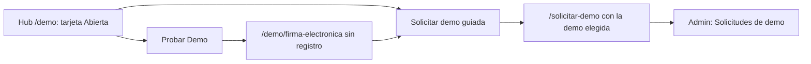

*Dos caminos: probarla de una vez o pedir una demo guiada.*

---

## Limitaciones conocidas

1. **Muchos botones no hacen nada**: Recordar, Guardar borrador, Usar plantilla (dentro del paso 1), Nueva plantilla, Subir CSV, Vista previa lote, Descargar certificado (en la pestaña y en la ventana), Abrir documentación, Firmar y continuar (en la API y en la vista firmante), Dibuja, Escribe, Sube imagen y los ocho Conectar. Antes de una presentación conviene saber cuáles evitar.
2. **No avisa que es una simulación.** No hay insignia de «Datos de ejemplo» ni nota que lo explique, y la página muestra eIDAS, ESIGN Act, UETA, Ley 527 CO, NOM 151 MX, «Cualificada (eIDAS)» y «anclado en cadena pública» como si fueran capacidades reales. El [plan del producto](Producto-firma-electronica.md) considera retirar estas afirmaciones una prioridad.
3. **«Enviar para firma» no crea nada**: el sobre no aparece en la tabla y los indicadores no cambian. Tampoco hay confirmación.
4. **La auditoría es la misma para todos los sobres**: los mismos 7 eventos del 13 de mayo de 2026, incluso en el borrador y en el vencido. La ventana siempre dice «Activado» en el sello de tiempo, aunque desactives la casilla del paso 4 (la pestaña **Audit trail** sí cambia).
5. **Paso Firmantes**: los campos de nombre y correo quedan angostos y el texto se corta («Ronald», «ronald@…»).
6. **Paso Campos**: los campos soltados no se pueden mover ni borrar, quedan todos asignados al primer firmante y el arrastre requiere mouse.
7. **Negociación previa**: los estados aparecen en inglés («accepted», «rejected») y los comentarios nuevos salen como «You»; no se puede deshacer una decisión.
8. **«Usar plantilla» no carga la plantilla**: en la pestaña **Plantillas** solo abre el asistente, y dentro del paso 1 no muestra ningún cambio.
9. **Textos mezclados en inglés**: Dashboard, Audit trail, Audit, API & Embed, Preview signing page embebida, Checkbox, Timestamp blockchain, redlines.
10. **Fechas de mayo de 2026** en una demo que dice «Firmados este mes».
11. **Encabezado que se esconde**: al bajar por la página, la barra de la demo (Volver a demos e insignias) queda detrás del menú del sitio.
12. **Nada se guarda**: al recargar la página vuelve todo al estado inicial; no hay botón para restablecer.
13. **La tarjeta del hub promete más que la demo**: «KYC firmante: SMS OTP, email, ID+selfie, video, biometría», «Audit trail criptográfico con hash chain y RFC 3161» y «Multi-firmante con orden, condicional, paralelo + bulk send» aparecen solo como opciones o textos; nada de eso se ejecuta.
