# Guía de la demo: Gestor de contenido (CMS headless)

> Ruta `/demo/gestor-contenido` · Modo de acceso: **Abierta** · Tipo: **datos de ejemplo** (todo el CMS corre en el navegador) con **IA real** en el asistente de redacción (llama al backend de KopTup) · Plan del producto: [CMS headless](Producto-cms-headless.md)

**Resumen.** Es un CMS headless completo para una empresa ficticia, la **Red de Clínicas Montaña Azul** (seis sedes en Colombia), con 21 entradas de ejemplo en cinco tipos de contenido (páginas, artículos del blog, sedes, servicios y preguntas frecuentes) y 12 imágenes. Muestra el ciclo completo: modelar el contenido, editarlo con vista previa web y app, mejorarlo con IA, enviarlo a revisión, aprobarlo, publicarlo o programarlo, avisar a los canales con webhooks y entregarlo por una API JSON que también alimenta al asistente del sitio. Tres personas de ejemplo con roles distintos (Redacción, Edición y Administración) permiten probar los permisos. Está pensada para equipos de mercadeo y comunicaciones con sitio web, app o asistente; los cambios se guardan solo en el navegador de quien la usa.

**En esta página:** [Recorrido sugerido](#recorrido-sugerido-demo-comercial-de-5-minutos) · [Pantallas y funciones](#pantallas-y-funciones) · [Qué es real y qué es simulado](#qué-es-real-y-qué-es-simulado) · [Acceso](#acceso) · [Limitaciones conocidas](#limitaciones-conocidas)

> **Sobre las capturas.** Los datos de ejemplo se generan con la hora del navegador en el momento en que abres la demo, así que las fechas de las capturas (9 de octubre de 2026) cambian en cada visita. El texto de la propuesta del asistente de IA lo produjo el **modelo simulado** del entorno de pruebas (por eso empieza con «Respuesta simulada (mock de OpenAI)…»); con la clave real del proveedor lo redacta el modelo.

*Inicio de la demo como Valentina Rojas (Redacción): encabezado con «Datos de ejemplo», «Ver como» y «Restablecer datos»; las cinco tarjetas de estado, el «Recorrido en 5 pasos» y «Qué es real en esta demo».*

---

## Recorrido sugerido (demo comercial de 5 minutos)

El guion sigue el **Recorrido en 5 pasos** que trae la propia demo en **Inicio**: cada paso se marca en verde solo cuando lo haces de verdad y el botón **Ir** de cada paso lleva a la pantalla correcta. Empieza con los datos limpios (si alguien ya usó la demo en ese navegador, pulsa **Restablecer datos** y confirma).

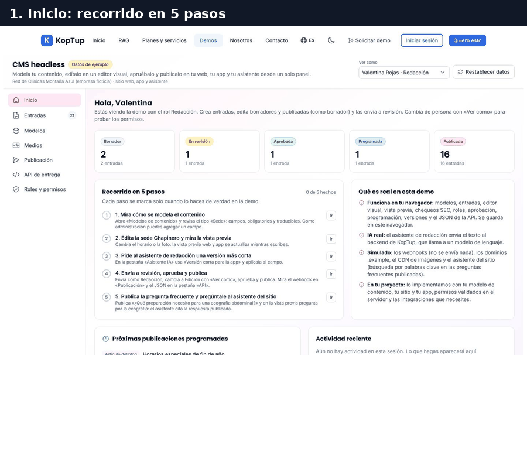

*Recorrido completo: modelo «Sede», edición con vista previa, asistente de IA, aprobación como Edición, webhooks, JSON de la API y el asistente del sitio citando la pregunta frecuente.*

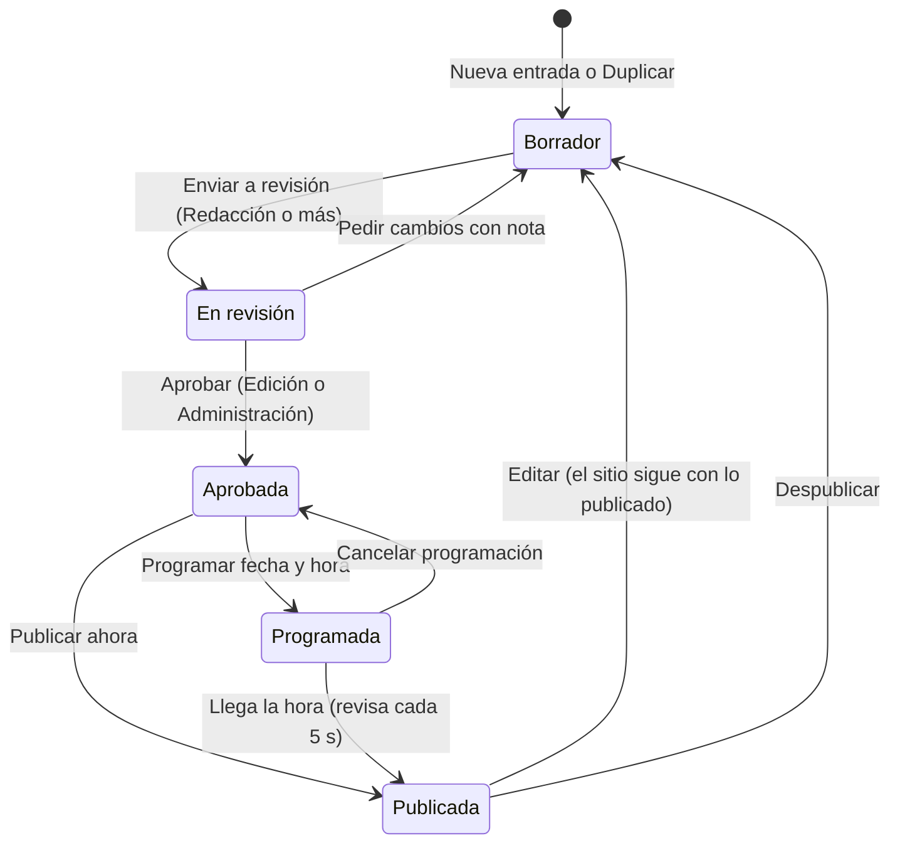
```mermaid
stateDiagram-v2
    state "Borrador" as BO
    state "En revisión" as RE
    state "Aprobada" as AP
    state "Programada" as PR
    state "Publicada" as PU
    [*] --> BO: Nueva entrada o Duplicar
    BO --> RE: Enviar a revisión (Redacción o más)
    RE --> AP: Aprobar (Edición o Administración)
    RE --> BO: Pedir cambios con nota
    AP --> PU: Publicar ahora
    AP --> PR: Programar fecha y hora
    PR --> PU: Llega la hora (revisa cada 5 s)
    PR --> AP: Cancelar programación
    PU --> BO: Editar (el sitio sigue con lo publicado)
    PU --> BO: Despublicar
```

*Estados de una entrada en la demo. Editar algo aprobado, programado o publicado lo devuelve a borrador.*

### Paso 1. Mira cómo se modela el contenido

Cambia **Ver como** a Natalia Ospina · Administración y abre **Modelos**.

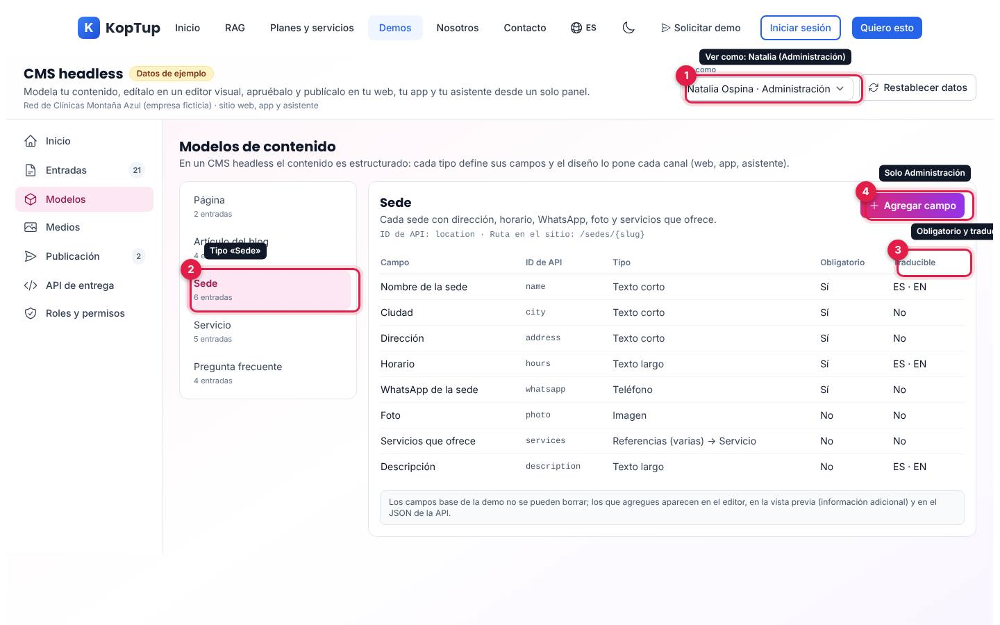

*Modelo «Sede» visto como Administración.*

1. **Ver como**: cambia la persona y su rol; la demo avisa «Ahora ves la demo como…».
2. **Tipos de contenido**: Página (2 entradas), Artículo del blog (4), Sede (6), Servicio (5) y Pregunta frecuente (4). «Sede» tiene ID de API `location` y ruta `/sedes/{slug}`.
3. **Campos**: nombre, ID de API, tipo (texto corto, texto largo, teléfono, imagen, referencias…), si es **Obligatorio** y si es **Traducible** (ES · EN).
4. **Agregar campo**: solo para Administración; con otro rol queda desactivado y la demo dice «Solo Administración puede cambiar los modelos».

Qué decir: «El contenido es estructurado: la sede tiene horario, WhatsApp y servicios como datos, no como texto suelto. Así lo usan igual tu web, tu app y tu asistente».

### Paso 2. Edita la sede Chapinero y mira la vista previa

Vuelve a Valentina (Redacción) y en **Inicio** pulsa **Ir** en el paso 2. Cambia el **Horario** (en la prueba: sábados hasta las 2:00 p. m.).

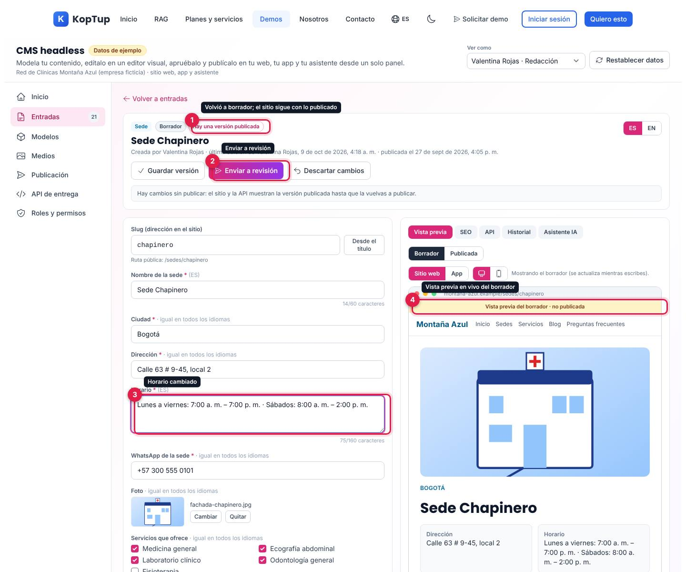

*Editor de «Sede Chapinero» después de cambiar el horario (captura en una pantalla de 1440 × 1200).*

1. **Hay una versión publicada**: la entrada volvió a **Borrador**; el aviso dice que el sitio y la API siguen mostrando la versión publicada hasta que se vuelva a publicar.
2. **Enviar a revisión**: aparece junto a **Guardar versión** y **Descartar cambios**.
3. **Horario**: el campo editado, con su contador de caracteres (75/160).
4. **Vista previa del borrador · no publicada**: el sitio de ejemplo se actualiza mientras escribes; más abajo, la tarjeta «Horario» ya muestra el cambio.

Qué decir: «Quien redacta ve el resultado antes de publicar, en web y en celular, y no rompe lo que ya está en línea».

### Paso 3. Pide al asistente de redacción una versión corta

En el panel derecho abre la pestaña **Asistente IA** y pulsa **Versión corta para la app**.

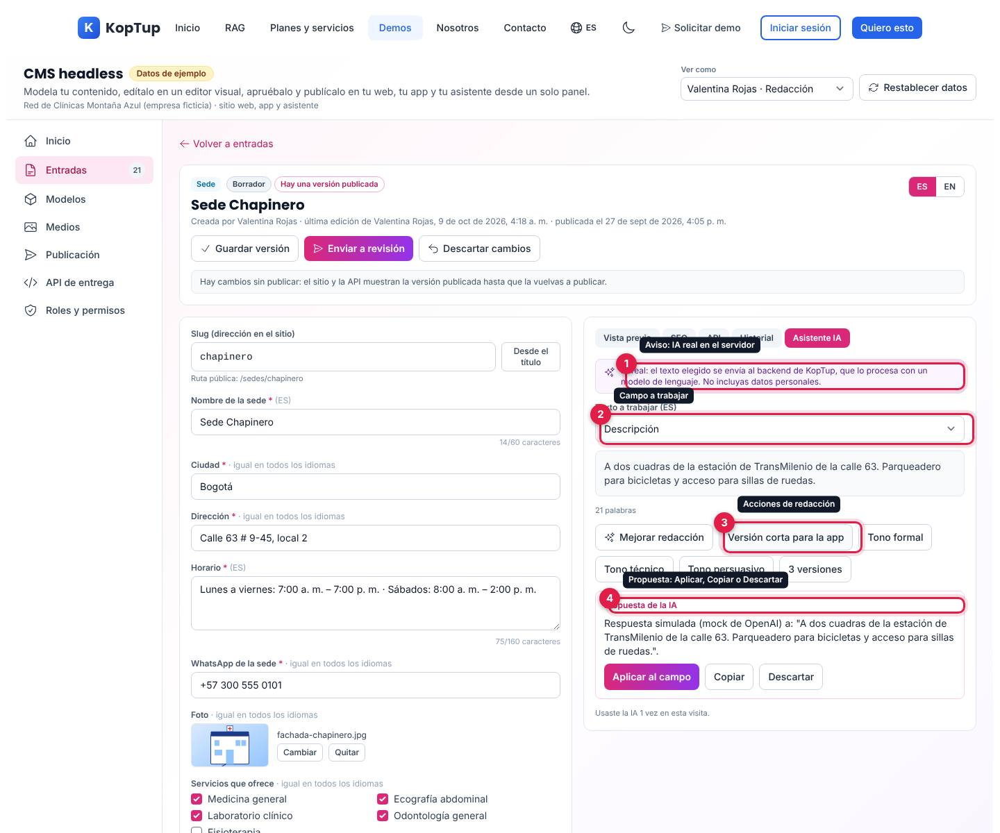

*Pestaña «Asistente IA» con la propuesta lista (texto del modelo simulado del entorno de pruebas).*

1. **IA real**: el texto elegido se envía al backend de KopTup, que lo procesa con un modelo de lenguaje; pide no incluir datos personales.
2. **Texto a trabajar (ES)**: el campo o párrafo a mejorar (aquí, «Descripción»), con su texto y el número de palabras.
3. **Acciones**: Mejorar redacción, Versión corta para la app (pide la mitad de palabras; necesita 12 o más), Tono formal, Tono técnico, Tono persuasivo y 3 versiones.
4. **Propuesta de la IA**: con **Aplicar al campo**, **Copiar** y **Descartar**. Debajo, «Usaste la IA N veces en esta visita».

Pulsa **Aplicar al campo**: la descripción cambia en el formulario y en la vista previa.

### Paso 4. Envía a revisión, aprueba y publica

Pulsa **Enviar a revisión**. Como Redacción la entrada queda en solo lectura y la demo dice «Con el rol Redacción no puedes aprobar. Cambia a Edición con «Ver como»…». Cambia **Ver como** a Andrés Cárdenas · Edición.

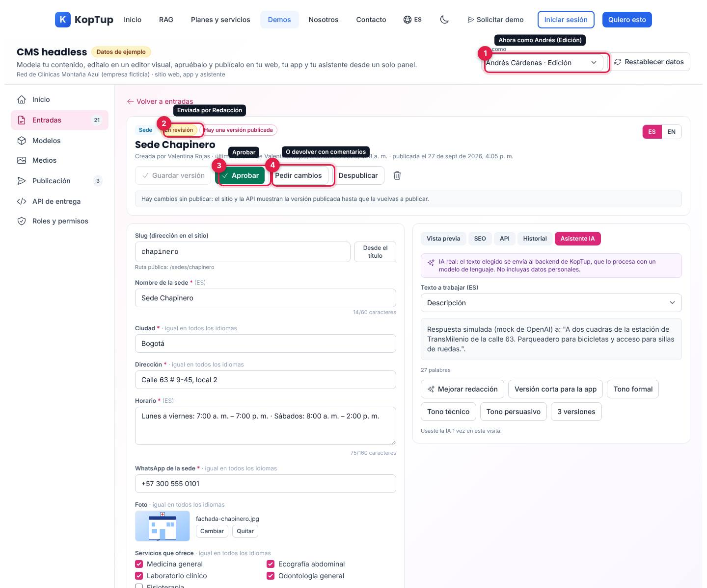

*La misma entrada vista por Edición.*

1. **Ver como** Andrés Cárdenas · Edición.
2. **En revisión**: el estado que dejó Redacción.
3. **Aprobar**: la entrada pasa a «Aprobada» y aparecen **Publicar ahora** y **Programar…**.
4. **Pedir cambios**: pide una nota («¿Qué debe cambiar?») y devuelve la entrada a borrador con el comentario.

Pulsa **Aprobar** y luego **Publicar ahora**: «Publicada: se avisó al sitio, a la app y al asistente (webhooks simulados)». Abre **Publicación** en el menú:

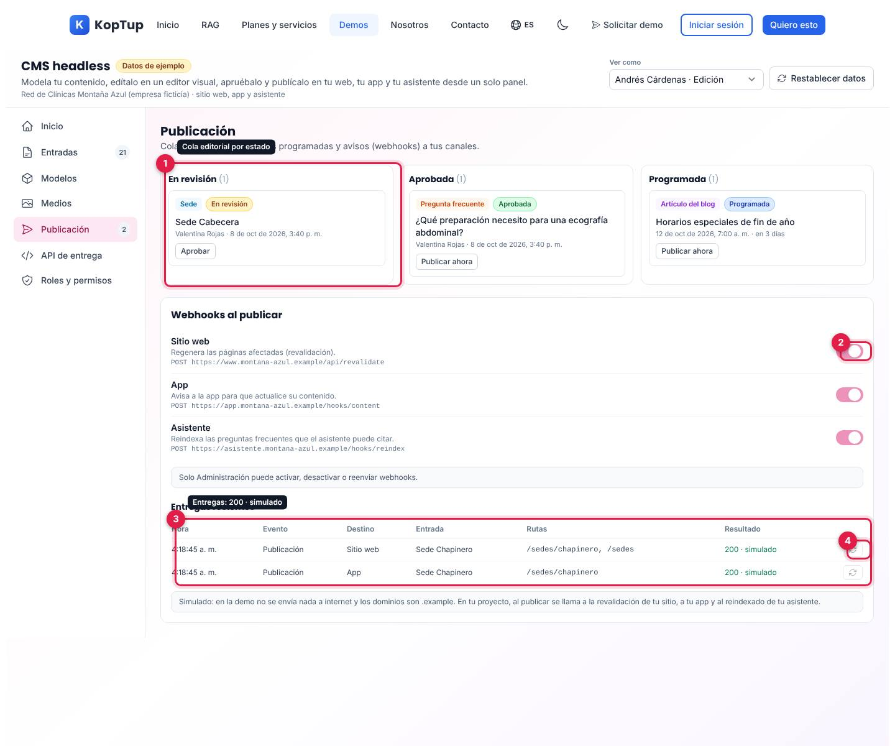

*Vista «Publicación» después de publicar la sede.*

1. **Cola editorial**: columnas En revisión, Aprobada y Programada, con acciones rápidas (**Aprobar**, **Publicar ahora**).
2. **Webhooks al publicar**: Sitio web (revalidación), App y Asistente, cada uno con su dirección `.example`. Solo Administración puede activarlos o desactivarlos.
3. **Entregas recientes**: hora, evento, destino, entrada, rutas revalidadas (`/sedes/chapinero, /sedes`) y resultado «200 · simulado». La sede no avisa al asistente: ese webhook es solo para preguntas frecuentes.
4. **Reenviar**: vuelve a enviar una entrega (simulado); solo Administración.

Para cerrar el paso, vuelve a la entrada y abre la pestaña **API**:

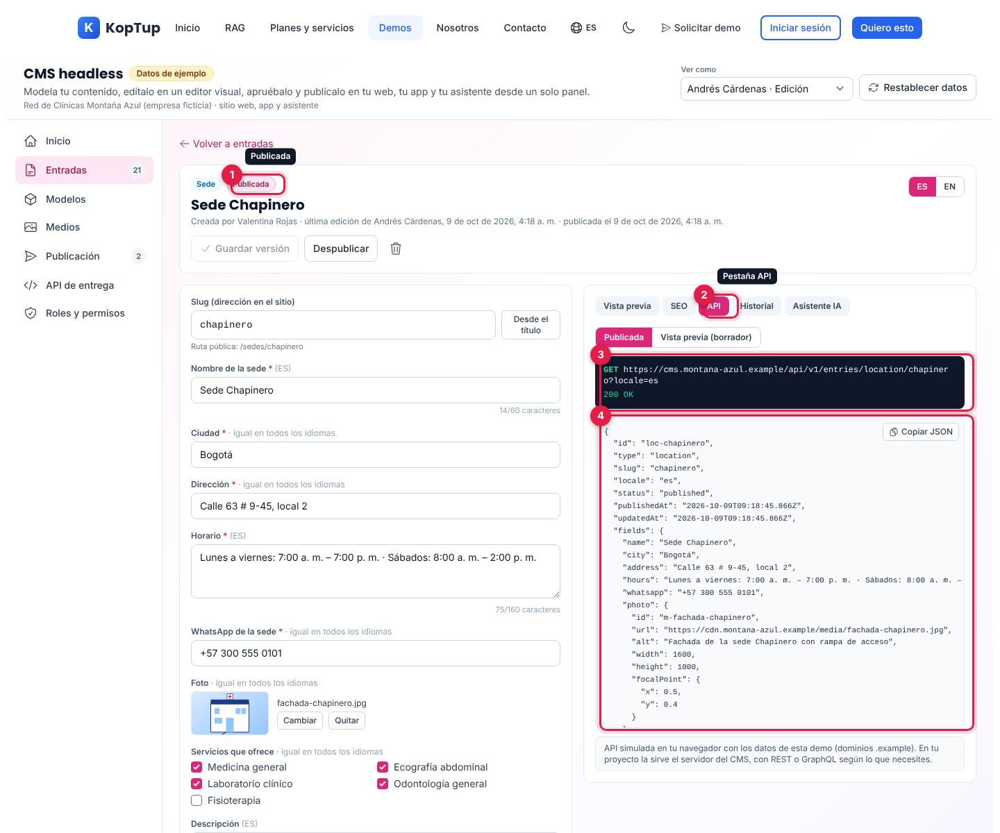

*Pestaña «API» de la sede publicada.*

1. **Publicada**: estado de la entrada.
2. **API**: la pestaña del panel derecho. Arriba se elige **Publicada** o **Vista previa (borrador)**.
3. **La petición**: `GET https://cms.montana-azul.example/api/v1/entries/location/chapinero?locale=es` y la respuesta **200 OK**. Si la entrada no está publicada responde **404 Not Found** y lo explica.
4. **El JSON**: lo que leería el sitio o la app; el campo `hours` ya trae el horario nuevo. **Copiar JSON** lo copia.

Qué decir: «Publicas una vez y el contenido llega a la web, a la app y al asistente por la misma API».

### Paso 5. Publica la pregunta frecuente y pregúntale al asistente del sitio

En **Inicio** pulsa **Ir** en el paso 5 (la pregunta «¿Qué preparación necesito para una ecografía abdominal?», que está **Aprobada**). Como Edición pulsa **Publicar ahora**. En la vista previa pulsa **Pregúntale al asistente** y elige la sugerencia «¿Cómo me preparo para una ecografía?».

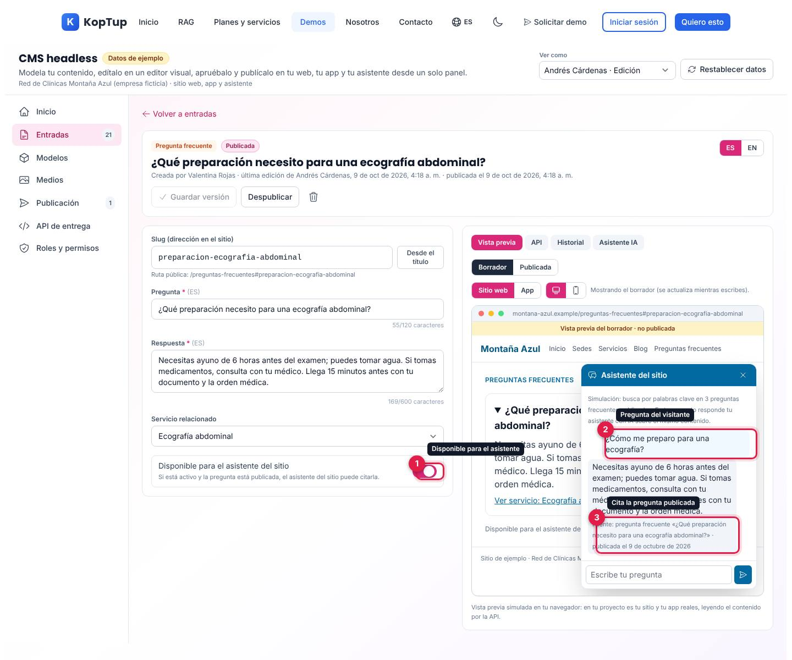

*Asistente del sitio de ejemplo respondiendo con la pregunta frecuente recién publicada (captura de 1440 × 1200).*

1. **Disponible para el asistente del sitio**: interruptor de la pregunta frecuente; si está activo y la pregunta está publicada, el asistente puede citarla.
2. **La pregunta del visitante**.
3. **La respuesta y su fuente**: «Fuente: pregunta frecuente «¿Qué preparación necesito para una ecografía abdominal?» · publicada el 9 de octubre de 2026». Si nada coincide responde «No encontré esa información en el contenido publicado…».

Con esto el panel de **Inicio** muestra **5 de 5 hechos**. Qué decir: «Lo que publicas es lo que el asistente cita; si no está publicado, no lo inventa». Aclara que en la demo el asistente busca por palabras clave (el aviso de la ventana lo dice) y que en el proyecto real responde la IA sobre el mismo contenido, como en la demo [Chatbot RAG](Guia-Demo-chatbot.md).

---

## Pantallas y funciones

### Encabezado e Inicio

Ver la [vista general](#guía-de-la-demo-gestor-de-contenido-cms-headless).

| Elemento | Qué hace |
|---|---|
| **Datos de ejemplo** | Insignia; al pasar el mouse explica que empresa, personas, direcciones, teléfonos y dominios son ficticios y que los cambios se guardan solo en este navegador. |
| **Ver como** | Cambia entre Valentina Rojas (Redacción), Andrés Cárdenas (Edición) y Natalia Ospina (Administración). Los botones y la lógica respetan los permisos de cada rol. |
| **Restablecer datos** | Pide confirmación, borra lo que cambiaste en este navegador y carga de nuevo los datos de ejemplo. |
| **Tarjetas de estado** | Borrador (2), En revisión (1), Aprobada (1), Programada (1) y Publicada (16) al empezar. Cada una abre **Entradas** filtrada por ese estado. |
| **Recorrido en 5 pasos** | El guion de la demo, con «N de 5 hechos» y un botón **Ir** por paso. |
| **Qué es real en esta demo** | Lo que corre en el navegador, lo que usa IA real, lo simulado y lo que se haría en el proyecto. |
| **Próximas publicaciones programadas** | Al empezar, «Horarios especiales de fin de año» programada para dentro de 3 días a las 7:00 a. m. |
| **Actividad reciente** | Las 8 últimas acciones de la sesión (quién y qué hizo). |

El menú de la izquierda tiene **Inicio**, **Entradas** (con el total), **Modelos**, **Medios**, **Publicación** (con lo pendiente de aprobar o publicar, si tu rol puede hacerlo), **API de entrega** y **Roles y permisos**.

### Entradas

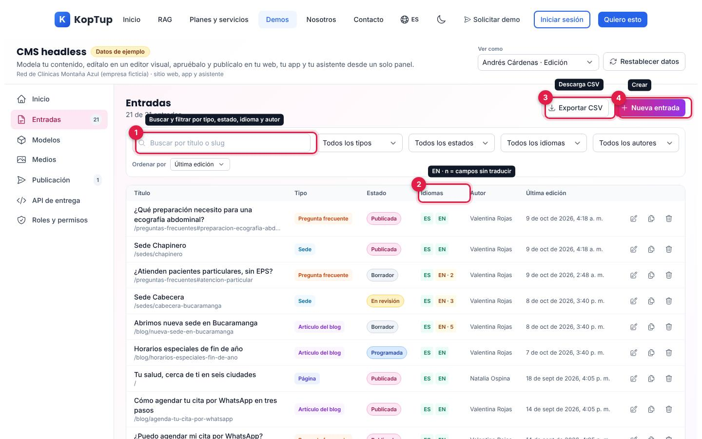

*Lista de las 21 entradas, ordenada por la última edición.*

1. **Buscar por título o slug**, y filtros por tipo, estado, idioma («Traducción al inglés completa» o «Falta traducir al inglés») y autor; **Ordenar por** última edición, título (A–Z) o tipo; **Limpiar filtros**.
2. **Idiomas**: `ES` y `EN`; «EN · 3» significa que faltan 3 campos por traducir al inglés.
3. **Exportar CSV**: descarga `entradas-cms-montana-azul.csv` con título, tipo, estado, ruta, campos sin traducir, autor, última edición y fecha de publicación.
4. **Nueva entrada**: tipo de contenido y título; muestra «Se publicará en /ruta» y **Crear y editar** abre el editor con la entrada en borrador.

En cada fila: **Editar**, **Duplicar** (crea una copia en borrador) y **Eliminar** (pide confirmación; si estaba publicada avisa al sitio con un webhook simulado y quita las referencias desde otras entradas). Redacción solo puede eliminar sus propios borradores que nunca se publicaron.

### Editor de una entrada

Ver los pasos [2](#paso-2-edita-la-sede-chapinero-y-mira-la-vista-previa), [3](#paso-3-pide-al-asistente-de-redacción-una-versión-corta) y [4](#paso-4-envía-a-revisión-aprueba-y-publica).

- **Encabezado**: tipo, estado, «Hay una versión publicada», quién la creó y quién la editó por última vez, y las acciones que permite el rol y el estado: Guardar versión, Enviar a revisión, Descartar cambios, Aprobar, Pedir cambios, Publicar ahora, **Programar…**, Cancelar programación, Despublicar y Eliminar.
- **ES / EN**: cambia el idioma del contenido. En inglés, los campos sin traducir muestran el texto en español como sugerencia y el botón **Copiar el texto en español**; el sitio en inglés muestra el español mientras tanto.
- **Formulario**: slug con **Desde el título** y la ruta pública; los campos del tipo con su contador; imágenes elegidas de la biblioteca (**Cambiar**, **Quitar**); referencias a servicios; y, en páginas y artículos, el **editor por bloques**: Título (H1 a H3), Párrafo con barra de formato (negrita, cursiva, viñetas, lista numerada, enlace y quitar formato), Imagen con pie de foto, Botón con enlace y Pregunta y respuesta, cada bloque con subir, bajar y quitar.
- **Bloqueos**: antes de enviar o publicar, la demo exige los campos obligatorios en español, un slug con minúsculas, números y guiones, y que no se repita en el mismo tipo.
- **Programar…**: fecha y hora de Colombia, con atajos «En ~1 minuto», «Mañana, 7:00 a. m.» y «En una semana, 7:00 a. m.». Mientras la demo está abierta revisa cada 5 segundos; si cierras la pestaña, la entrada se publica la próxima vez que abras la demo, con la fecha programada.
- **Pestañas del panel derecho**: **Vista previa** (Borrador o Publicada; Sitio web o App; Escritorio o Celular; botón **Pregúntale al asistente**), **SEO** (en los tipos con SEO), **API**, **Historial** y **Asistente IA**.
- **Historial**: cada versión guardada, enviada, aprobada, publicada o restaurada, con cuántas partes difieren de la actual y **Restaurar**; debajo, la actividad de la entrada en la sesión.

#### Pestaña SEO

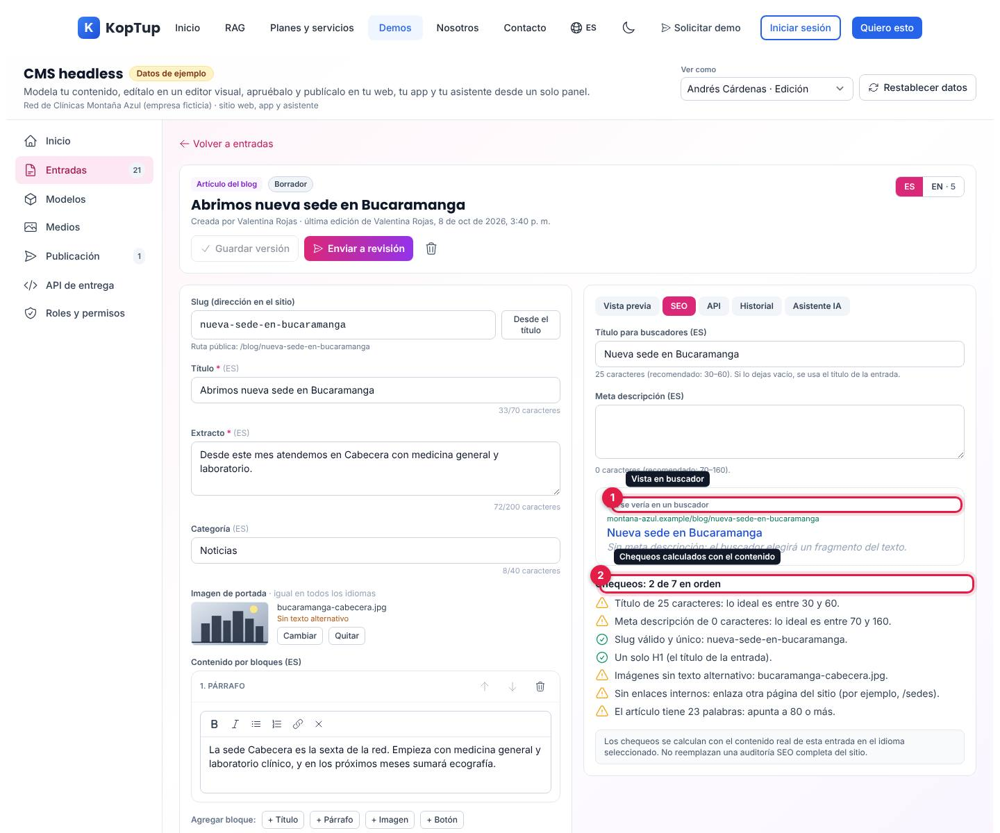

*SEO del artículo «Abrimos nueva sede en Bucaramanga» (borrador): 2 de 7 chequeos en orden.*

1. **Así se vería en un buscador**: dirección, título y meta descripción (o «Sin meta descripción: el buscador elegirá un fragmento del texto»).
2. **Chequeos**: título entre 30 y 60 caracteres, meta descripción entre 70 y 160, slug válido y único, un solo H1, imágenes con texto alternativo, al menos un enlace interno y, en artículos, 80 palabras o más. Se calculan con el contenido real de la entrada en el idioma elegido.

Arriba están los campos **Título para buscadores** y **Meta descripción** con sus contadores.

### Modelos

Ver el [paso 1](#paso-1-mira-cómo-se-modela-el-contenido). Como Administración, **Agregar campo** pide nombre en español (y en inglés, opcional), muestra el ID de API que se generará, y deja elegir tipo (Texto corto, Texto largo, Número, Sí / no o Fecha), **Obligatorio para publicar** y **Traducible**. El campo nuevo aparece en el editor, en la vista previa («información adicional») y en el JSON de la API; si es obligatorio, las entradas existentes de ese tipo no se pueden enviar ni publicar hasta completarlo. Los campos propios se pueden quitar; los de base, no.

### Medios

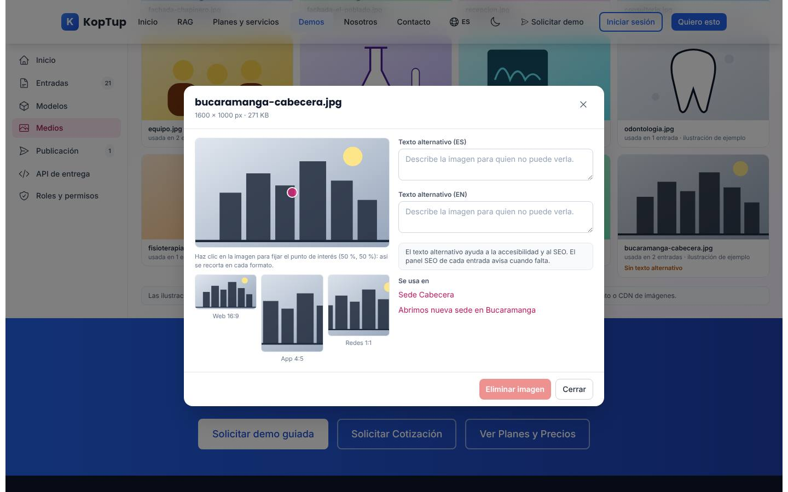

*Detalle de `bucaramanga-cabecera.jpg`, la imagen de ejemplo que no tiene texto alternativo.*

- **Biblioteca**: 12 ilustraciones de ejemplo; cada tarjeta dice en cuántas entradas se usa y marca «Sin texto alternativo». Buscador por nombre y casilla **Solo sin texto alternativo**.
- **Subir imagen**: solo imágenes de hasta 8 MB; se reducen a 1280 px como máximo y se guardan en el navegador.
- **Detalle**: clic en la imagen para fijar el punto de interés y ver los recortes **Web 16:9**, **App 4:5** y **Redes 1:1**; texto alternativo en español e inglés; **Se usa en** con enlaces a las entradas; **Eliminar imagen**, desactivado si la imagen está en uso o si el rol no puede eliminar.

### Publicación

Ver el [paso 4](#paso-4-envía-a-revisión-aprueba-y-publica). Con el rol Redacción la cola se ve, pero aprobar y publicar es de Edición (la demo lo dice). Si se desactiva un webhook, ese canal deja de recibir entregas.

### API de entrega

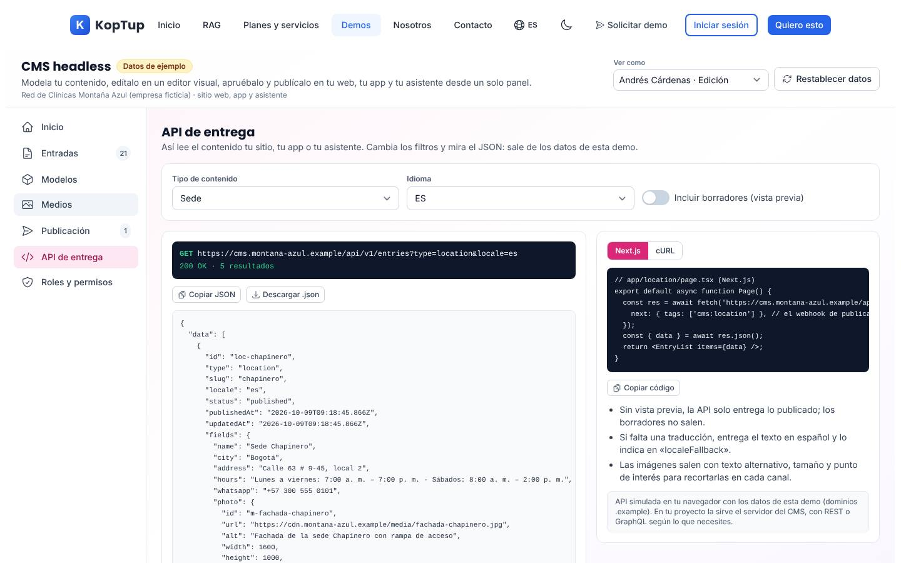

*Vista «API de entrega» con el tipo «Sede» en español.*

- **Filtros**: tipo de contenido (o todos), idioma e **Incluir borradores (vista previa)**, que agrega el encabezado con el token de vista previa.
- **Respuesta**: la petición `GET`, «200 OK · N resultados» y el JSON, con **Copiar JSON** y **Descargar .json**.
- **Cómo consumirla**: fragmentos de código para **Next.js** y **cURL** con **Copiar código**.
- Tres reglas: sin vista previa solo salen las publicadas; si falta una traducción entrega el español y lo marca en `localeFallback`; las imágenes salen con texto alternativo, tamaño y punto de interés.

### Roles y permisos

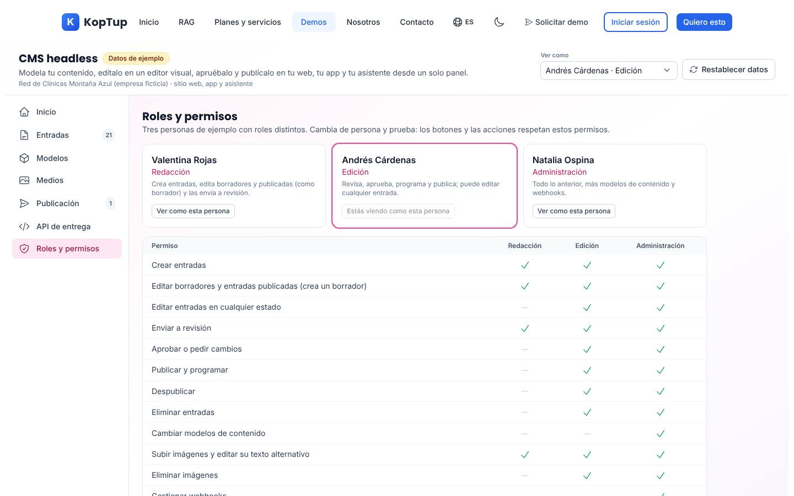

*Las tres personas de ejemplo y la matriz de 12 permisos.*

| Permiso | Redacción | Edición | Administración |
|---|---|---|---|
| Crear entradas, enviar a revisión, subir imágenes y editar su texto alternativo | Sí | Sí | Sí |
| Editar borradores y publicadas (crea un borrador) | Sí | Sí | Sí |
| Editar en cualquier estado, aprobar o pedir cambios, publicar y programar, despublicar, eliminar entradas, eliminar imágenes | No | Sí | Sí |
| Cambiar modelos de contenido y gestionar webhooks | No | No | Sí |

Cada tarjeta tiene **Ver como esta persona**. La lógica de cada acción vuelve a verificar el permiso (no basta con ocultar botones).

### En el celular

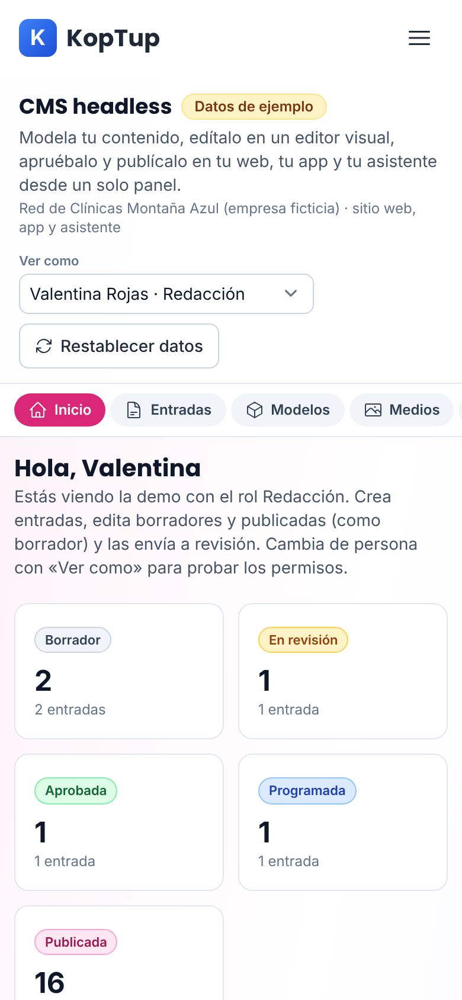

*La demo en un teléfono (390 px): el menú de secciones pasa a una fila de botones que se desplaza de lado y las tarjetas de estado van de dos en dos.*

La página no se desborda a lo ancho. En el editor, el formulario y el panel de vista previa quedan uno debajo del otro.

---

## Qué es real y qué es simulado

| Parte | Real o simulado | Detalle |
|---|---|---|
| Empresa, personas, direcciones, teléfonos y dominios | **Datos de ejemplo** | Red de Clínicas Montaña Azul es ficticia; teléfonos `+57 300 555 01xx` y dominios `.example`. Las fechas se calculan desde el momento en que abres la demo. |
| Modelos, entradas, editor, versiones, programación y roles | **Real (en el navegador)** | La lógica funciona de verdad y verifica permisos; se guarda en `localStorage` (clave `demo:cms:v1`). |
| Vista previa del sitio y de la app | **Simulada** | Se dibuja en el navegador con el contenido de la entrada; WhatsApp y los enlaces no navegan: al hacer clic, un aviso explica a dónde llevarían en el sitio real. |
| Chequeos SEO | **Real** | Calculados con el contenido de la entrada; no reemplazan una auditoría SEO completa. |
| JSON de la API de entrega | **Real (en el navegador)** | Sale de los datos de la demo; no hay un servidor de CMS detrás. |
| Webhooks y CDN de imágenes | **Simulados** | No se envía nada a internet; resultado «200 · simulado». |
| Asistente de redacción (Asistente IA) | **IA real** | Llama a `/api/content/*` del backend, que usa un modelo de OpenAI. |
| Asistente del sitio | **Simulado** | Búsqueda por palabras clave en las preguntas frecuentes publicadas y marcadas para el asistente. |
| Imágenes subidas | **Real (en el navegador)** | Se reducen y se guardan en este navegador; no van a ningún servidor. |
| Exportar CSV y descargar JSON | **Real** | Se generan en el navegador. |

---

## Acceso

- **Cómo la ve un visitante:** la demo está en modo **Abierta** (`publico`): cualquiera entra a `/demo/gestor-contenido` sin cuenta y sin pantalla de acceso, y la usa completa. No necesita iniciar sesión: los «usuarios» son las tres personas de ejemplo de **Ver como**.
- **Cómo se solicita:** no hace falta solicitarla. Quien quiera verla con su propio contenido usa **Solicitar demo guiada** (en el bloque azul al final de la página, que también ofrece **Solicitar Cotización** y **Ver Planes y Precios**) o **Solicitar demo** del menú.
- **Cómo la controla el admin:** el modo sale del catálogo del servidor y se cambia en **Admin › Catálogo de demos**. Si se pasa a «Con solicitud» o «Solo por invitación», los visitantes verán la pantalla de acceso y los accesos se conceden en **Admin › Solicitudes de demo** y **Admin › Accesos a demos** (ver la [limitación 3](#limitaciones-conocidas)). Detalle en el [Manual del administrador](Doc-06-Manual-del-Administrador.md) y en [Flujos del visitante](Doc-04-Flujos-del-Visitante.md).
- **Topes del asistente de IA en el servidor:** el backend solo atiende la demo si su modo lo permite, rechaza textos de más de 10.000 caracteres (la demo envía como máximo 2.000), aplica un cupo por conexión de 20 solicitudes cada 10 minutos y 100 por día, y un tope de gasto mensual. Si se agota o la IA no está configurada, la demo muestra un aviso claro y el resto sigue funcionando.

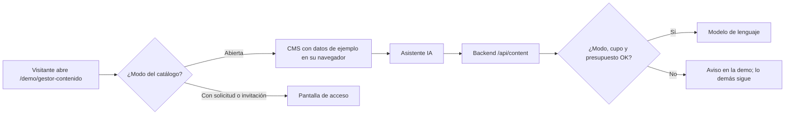
```mermaid
flowchart LR
    V["Visitante abre /demo/gestor-contenido"] --> C{"¿Modo del catálogo?"}
    C -- "Abierta" --> D["CMS con datos de ejemplo en su navegador"]
    C -- "Con solicitud o invitación" --> P["Pantalla de acceso"]
    D --> IA["Asistente IA"]
    IA --> B["Backend /api/content"]
    B --> G{"¿Modo, cupo y presupuesto OK?"}
    G -- "Sí" --> O["Modelo de lenguaje"]
    G -- "No" --> M["Aviso en la demo; lo demás sigue"]
```

*Camino de un visitante y de una solicitud de IA.*

---

## Limitaciones conocidas

1. **Todo vive en un navegador.** Los cambios se guardan solo en el `localStorage` de ese equipo y navegador: no llegan a un servidor ni los ve el vendedor. Las imágenes subidas también se guardan ahí; si el almacenamiento se llena o el navegador no lo permite, la demo avisa «Tu navegador no permite guardar datos: los cambios se perderán al recargar la página».
2. **Roles simulados.** «Ver como» cambia de persona sin iniciar sesión; los permisos los verifica la lógica de la demo en el navegador (en el proyecto los valida el servidor del CMS, como dice la propia demo).
3. **El asistente de IA no envía la sesión.** La demo llama a `/api/content/*` sin el token del usuario. Hoy no importa porque la demo es Abierta, pero si el admin la pasa a «Con solicitud» o «Solo por invitación», el asistente fallaría incluso para quien tenga acceso aprobado (mostraría «El servicio de IA respondió con un error»). Por lo mismo, el equipo de KopTup también queda sujeto al cupo por conexión.
4. **Alcance del asistente de IA.** Trabaja solo con campos de texto traducibles y párrafos; corta el texto a 2.000 caracteres; **Versión corta para la app** exige 12 palabras o más. Usa la plantilla de «texto de producto» del backend para todos los tipos de contenido.
5. **El asistente del sitio no es IA.** Busca palabras clave en las preguntas frecuentes publicadas (con raíces simples para plurales); si la pregunta no comparte palabras con ellas, responde «No encontré…». La ventana lo aclara.
6. **Aviso de borrador engañoso.** Al abrir una entrada publicada y sin cambios, la vista previa arranca en «Borrador» y muestra la franja «Vista previa del borrador · no publicada», aunque el contenido sea el publicado.
7. **El recorrido se marca con cualquier acción equivalente.** El paso 3 se marca en cuanto la IA responde (aunque no apliques el texto), el paso 4 con cualquier publicación manual y el paso 5 con cualquier respuesta del asistente del sitio que encuentre una pregunta frecuente.
8. **Fechas que cambian.** Las fechas de las entradas, versiones y la publicación programada se calculan cada vez desde el momento en que abres la demo; no son fijas como en las capturas.
9. **Webhooks, API y CDN simulados**: los dominios son `.example` y no se envía nada a internet.
