# Guía de la demo: Gestor documental (DocuIA)

> Ruta `/demo/gestor-documentos` · Modo de acceso: **Abierta** (pero hay que iniciar sesión para usarla) · Tipo: **backend real + IA real** en lo básico (subir, ordenar, buscar, resumir y explicar documentos) y **datos de ejemplo** en las «Acciones PRO» · Plan del producto: [Gestor documental con IA](Producto-gestor-documental.md)

**Resumen.** Es un archivo documental en línea llamado **DocuIA**: subes PDF, DOCX, TXT o CSV, el servidor extrae el texto, la IA genera un resumen, etiquetas y palabras clave, y luego puedes buscar por nombre o por significado, marcar favoritos, renombrar, mover a la papelera y pedir «Explicar con IA». Encima de esa base real hay un panel de funciones «PRO» de gestión documental empresarial (OCR, cláusulas de contratos, comparación de versiones, marca de agua, firma, retención, E-discovery y cifrado) que **muestran ejemplos fijos**: sirven para enseñar el alcance del producto, no procesan el documento. Está pensada para gerentes administrativos, jurídicos y de archivo; cada cuenta ve solo sus propios documentos.

**En esta página:** [Recorrido sugerido](#recorrido-sugerido-demo-comercial-de-5-minutos) · [Pantallas y funciones](#pantallas-y-funciones) · [Qué es real y qué es simulado](#qué-es-real-y-qué-es-simulado) · [Acceso](#acceso) · [Limitaciones conocidas](#limitaciones-conocidas)

> **Sobre las capturas.** Se tomaron con una cuenta del equipo y cuatro documentos ficticios de «Distribuidora Andina SAS». El entorno de capturas usa un **modelo de IA simulado**, por eso el resumen dice solo «Documento: nombre del archivo», las tarjetas no tienen etiquetas, la explicación empieza con «Respuesta simulada (mock de OpenAI)…» y la búsqueda semántica no encuentra nada. Con la clave real de OpenAI esos textos los redacta el modelo. Todo lo demás (subida, carpetas, contadores, papelera y las pantallas PRO) es el comportamiento real del código.

*Vista con sesión iniciada: barra lateral con vistas y carpetas, barra de búsqueda, zona para arrastrar archivos y las tarjetas de los documentos (el contrato está marcado como favorito).*

---

## Recorrido sugerido (demo comercial de 5 minutos)

**Antes de empezar:** inicia sesión (cualquier cuenta sirve; ver [Acceso](#acceso)) y ten a mano 3 o 4 documentos cortos en PDF, DOCX o TXT de hasta 10 MB. Nombra uno con la palabra «Contrato»: así aparece el botón **Detectar cláusulas**.

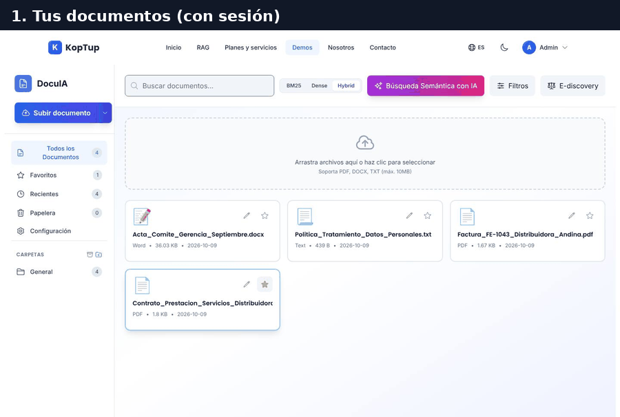

*Recorrido completo: documentos, subida, visor con «Explicar con IA», OCR, cláusulas, comparación de versiones, E-discovery, retención y cifrado.*

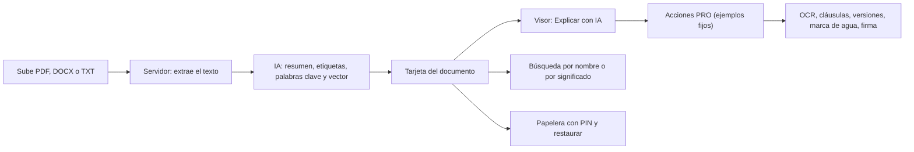

*Qué hace la demo por dentro: lo de la izquierda es real (servidor e IA); las Acciones PRO muestran contenido de ejemplo.*

### Paso 1. Sube los documentos

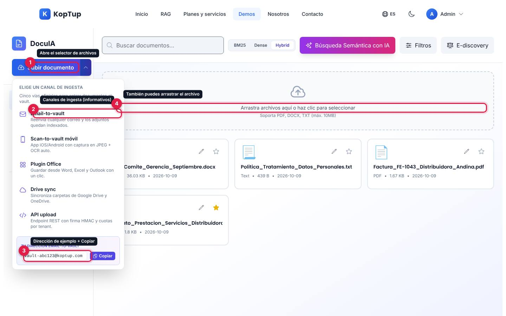

*Botón «Subir documento» con su menú de canales de ingesta abierto.*

1. **Subir documento** abre el selector de archivos del equipo. El archivo va al servidor, que extrae el texto y lo analiza con IA; mientras tanto se ve «Procesando… N %». Al terminar aparece la tarjeta y suben los contadores.
2. **La flecha junto al botón** abre «Elige un canal de ingesta»: Email-to-vault, Scan-to-vault móvil, Plugin Office, Drive sync y API upload. Son **informativos**: al pulsar uno, el menú solo se cierra.
3. **Tu dirección Email-to-vault** y **Copiar**: copia al portapapeles una dirección de ejemplo fija (no recibe correos).
4. **Arrastra archivos aquí o haz clic para seleccionar**: hace lo mismo que el botón 1. Acepta PDF, DOCX, TXT y CSV de hasta 10 MB.

Qué decir: «Subes el archivo y en segundos queda resumido, etiquetado y listo para buscar por significado».

### Paso 2. Abre un documento y pide «Explicar con IA»

Haz clic en la tarjeta del contrato.

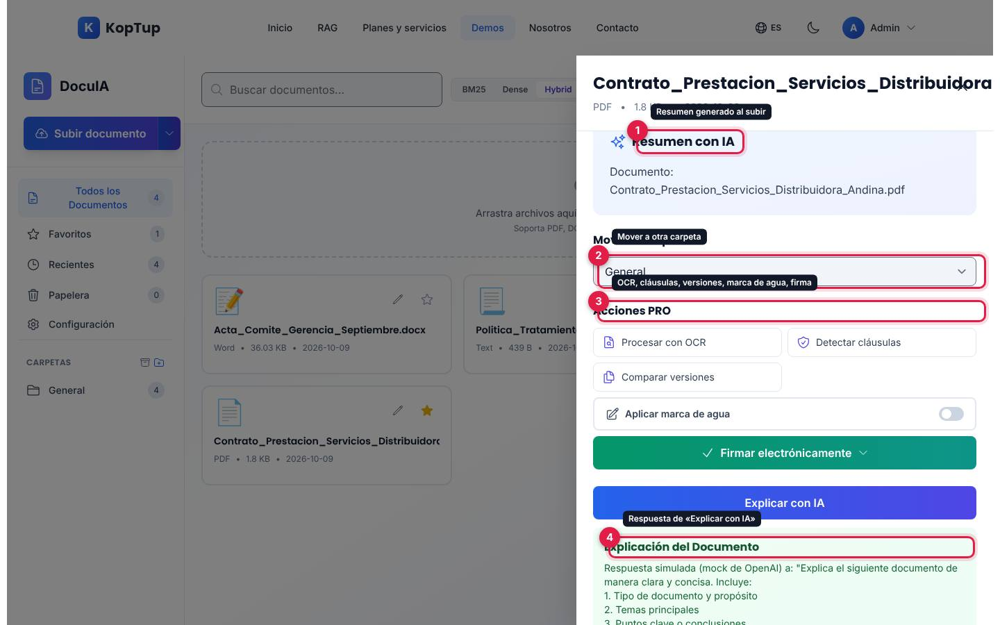

*Panel del documento después de pulsar «Explicar con IA». La explicación de la captura la produjo el modelo simulado del entorno de pruebas.*

1. **Resumen con IA**: el resumen que se generó al subir el archivo. Si la IA devolvió palabras clave y entidades, aparecen debajo («Palabras Clave» y «Entidades Detectadas»).
2. **Mover a Carpeta**: cambia la carpeta del documento (ver la [limitación 3](#limitaciones-conocidas)).
3. **Acciones PRO**: Procesar con OCR, Detectar cláusulas (solo en contratos), Comparar versiones, marca de agua y firma electrónica.
4. **Explicación del Documento**: la respuesta del botón **Explicar con IA**. El servidor le pide al modelo el tipo de documento y su propósito, los temas principales, los puntos clave y a quién va dirigido.

Qué decir: «No tienes que leer las 40 páginas: la IA te dice de qué se trata y qué importa».

### Paso 3. Muestra el OCR y la extracción de datos

En el panel del documento pulsa **Procesar con OCR**. La ventana del OCR se abre **detrás** del panel (ver la [limitación 1](#limitaciones-conocidas)): cierra el panel con la **X** de arriba a la derecha y queda a la vista.

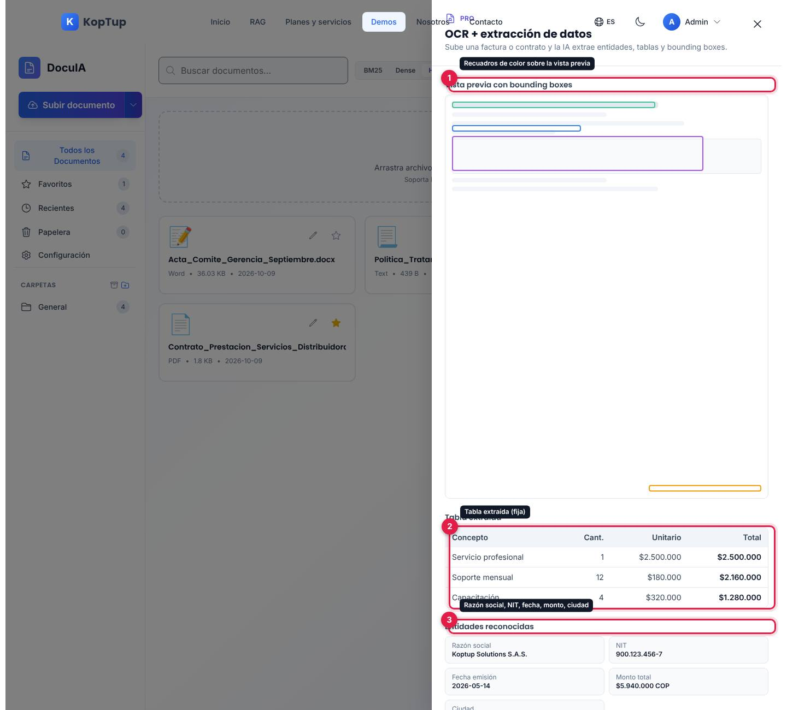

*Ventana «OCR + extracción de datos». Su contenido es el mismo para cualquier documento.*

1. **Vista previa con bounding boxes**: una hoja esquemática con recuadros de colores donde «se detectó» texto.
2. **Tabla extraída**: tres líneas de ejemplo (servicio profesional, soporte mensual y capacitación) con cantidad, valor unitario y total.
3. **Entidades reconocidas**: razón social, NIT, fecha de emisión, monto total y ciudad, todas de ejemplo.

Qué decir: «Así se ve cuando el sistema lee una factura escaneada; en tu proyecto lo conectamos al OCR real». Aclara que en la demo es un ejemplo.

### Paso 4. Detecta las cláusulas de un contrato

Vuelve a abrir el contrato, pulsa **Detectar cláusulas** y cierra el panel con la **X**.

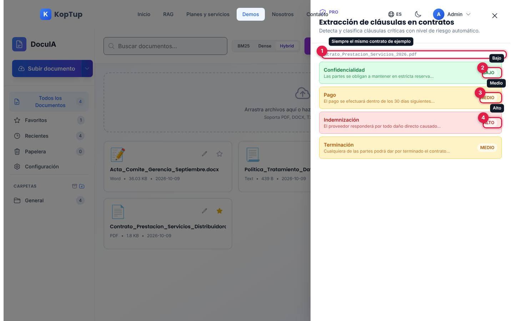

*Ventana «Extracción de cláusulas en contratos».*

1. El nombre del contrato analizado es siempre el mismo ejemplo, `Contrato_Prestacion_Servicios_2026.pdf`, sin importar cuál abriste.
2. **Confidencialidad**, riesgo **Bajo** (verde).
3. **Pago** y **Terminación**, riesgo **Medio** (ámbar).
4. **Indemnización**, riesgo **Alto** (rojo).

Cada cláusula trae un fragmento del texto. Desde el mismo panel, **Comparar versiones** muestra un cambio de ejemplo entre la versión 1.0 y la 1.1 (ver [Comparar versiones](#comparar-versiones)).

### Paso 5. Cierra con cumplimiento: E-discovery y retención

Pulsa **E-discovery** (arriba a la derecha) y luego **Generar bundle**.

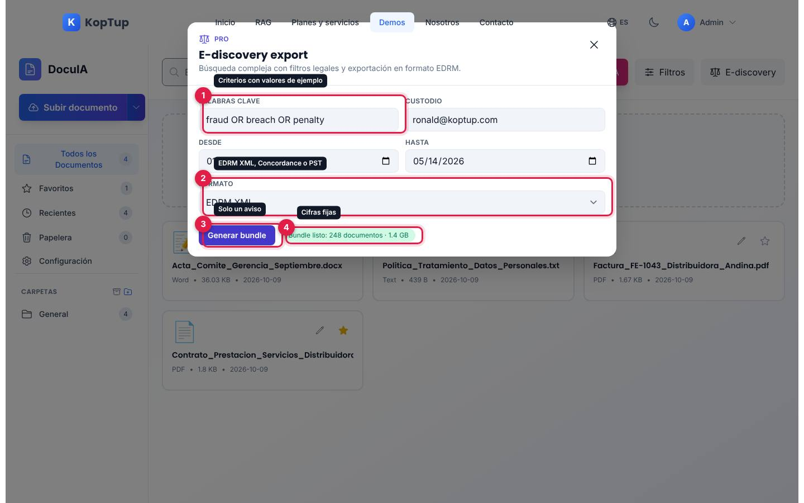

*Ventana «E-discovery export» después de pulsar «Generar bundle».*

1. **Palabras clave**, **Custodio**, **Desde** y **Hasta**: vienen llenos con valores de ejemplo y se pueden cambiar.
2. **Formato**: EDRM XML, Concordance Load File o PST + Metadata.
3. **Generar bundle**: a los 0,4 segundos muestra el aviso 4. No busca ni descarga nada.
4. **Bundle listo: 248 documentos · 1.4 GB**: cifras fijas de ejemplo.

Remata con el icono de archivo junto a **CARPETAS** (barra lateral), que abre la tabla de [Retención y Legal Hold](#retención-y-legal-hold), y con **Configuración › Configuración de cifrado** (ver [Configuración](#configuración)).

Qué decir: «Para auditorías y procesos legales, el archivo se exporta en formatos estándar y cada carpeta tiene su política de retención».

---

## Pantallas y funciones

### Barra lateral

| Elemento | Qué hace |
|---|---|
| **Subir documento** y su flecha | Sube archivos desde el equipo; la flecha abre los canales de ingesta informativos (ver el [paso 1](#paso-1-sube-los-documentos)). |
| **Todos los Documentos** | Todos tus documentos que no están en la papelera, del más nuevo al más viejo. |
| **Favoritos** | Los marcados con la estrella. |
| **Recientes** | Los 10 más recientes. |
| **Papelera** | Los documentos borrados; cada tarjeta tiene el botón verde de restaurar. Muestra el aviso «Los documentos en la papelera se eliminarán permanentemente después de 30 días» (ver la [limitación 6](#limitaciones-conocidas)). |
| **Configuración** | Preferencias y almacenamiento (ver [Configuración](#configuración)). |
| **CARPETAS** | Lista las carpetas que tienen documentos, con su cantidad. El icono de archivo abre la tabla de retención; el icono de carpeta con «+» abre «Nueva Carpeta». |

Los contadores salen del servidor y se actualizan después de cada acción.

### Barra de búsqueda

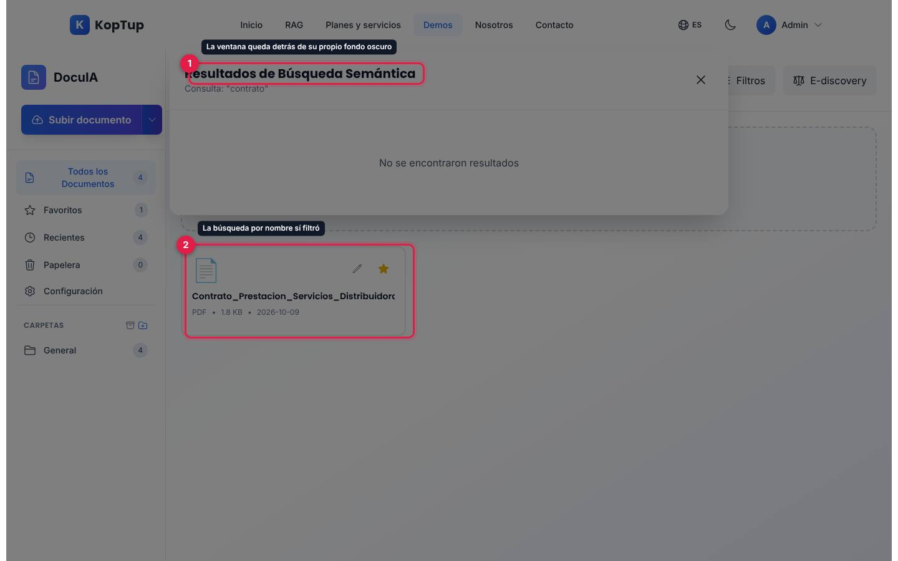

*Se escribió «contrato»: la lista ya filtró por nombre (2) y la ventana de resultados semánticos (1) se ve oscurecida detrás de su propio fondo.*

- **Buscar documentos…**: medio segundo después de dejar de escribir, el servidor filtra por **nombre del archivo, etiquetas y palabras clave** (hasta 100 caracteres, sin distinguir mayúsculas). Busca el texto tal cual: «contrato» encuentra `Contrato_Prestacion…`, pero «contrato de transporte» no, porque el nombre usa guiones bajos.
- **BM25 · Dense · Hybrid**: cambia el botón resaltado. La búsqueda es la misma en los tres modos.
- **Búsqueda Semántica con IA**: convierte tu frase en un vector y la compara con el vector de cada documento; muestra hasta 10 resultados con más de 50 % de similitud, cada uno con **¿Por qué este resultado?**, que pide a la IA explicar la coincidencia. Ver la [limitación 2](#limitaciones-conocidas): la ventana queda detrás de su fondo y al hacer clic en cualquier parte se cierra.
- **Filtros**: muestra dos listas, tipo (PDF, Word, Excel) y fecha (última semana, mes o año). No filtran nada.
- **E-discovery**: ver el [paso 5](#paso-5-cierra-con-cumplimiento-e-discovery-y-retención).

### Tarjetas de documento

Cada tarjeta muestra un icono por tipo, el nombre, tipo, tamaño, fecha de subida y hasta tres etiquetas («+N» si hay más).

- **Lápiz**: abre «Renombrar Documento»; el nombre nuevo se guarda en el servidor.
- **Estrella**: marca o quita el favorito.
- **Clic en la tarjeta**: abre el panel del documento.

### Panel del documento

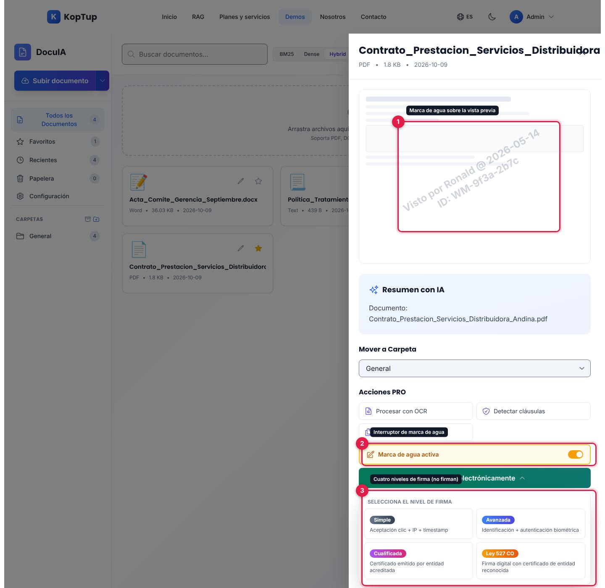

*Panel del contrato con la marca de agua activa y el menú de firma abierto (captura en una pantalla más alta, 1440 × 1400).*

1. **Marca de agua**: con el interruptor encendido aparece, girada sobre la vista previa, «Visto por …» con un nombre, una fecha y un ID fijos de ejemplo.
2. **Aplicar marca de agua / Marca de agua activa**: el interruptor. No cambia el archivo.
3. **Firmar electrónicamente**: menú «Selecciona el nivel de firma» con **Simple** (aceptación con clic, IP y hora), **Avanzada** (identificación y biometría), **Cualificada** (certificado de entidad acreditada) y **Ley 527 CO** (firma digital con certificado). Al elegir uno, el menú solo se cierra; no se firma nada. La firma real es otro producto: ver [Firma electrónica](Producto-firma-electronica.md).

Además, el panel tiene:

- **Vista previa**: una hoja esquemática gris, igual para todos los documentos. No muestra el contenido real del archivo.
- **Resumen con IA**, **Palabras Clave** y **Entidades Detectadas**: lo que guardó el análisis al subir.
- **Mover a Carpeta**, las **Acciones PRO**, **Explicar con IA** (ver el [paso 2](#paso-2-abre-un-documento-y-pide-explicar-con-ia)) y **Mover a Papelera**.

**Mover a Papelera** abre «Eliminar Documento», que pide un PIN de 4 dígitos.

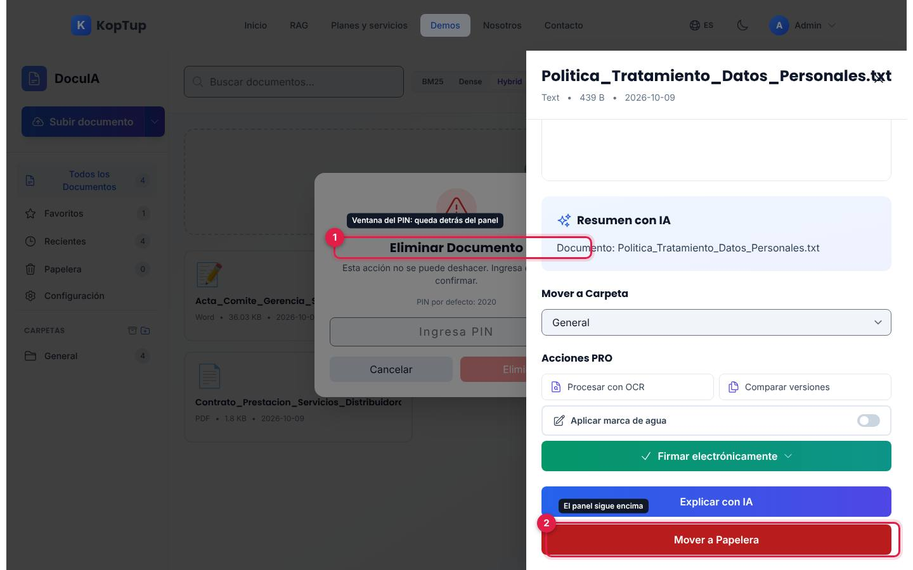

*La ventana del PIN (1) se abre detrás del panel del documento (2) y no se puede usar hasta cerrar el panel.*

Para borrar de verdad: cierra el panel con la **X**, escribe el PIN y pulsa **Eliminar**. El documento pasa a la **Papelera** (se puede restaurar). Ver las limitaciones [1](#limitaciones-conocidas) y [4](#limitaciones-conocidas) sobre el PIN.

### Comparar versiones

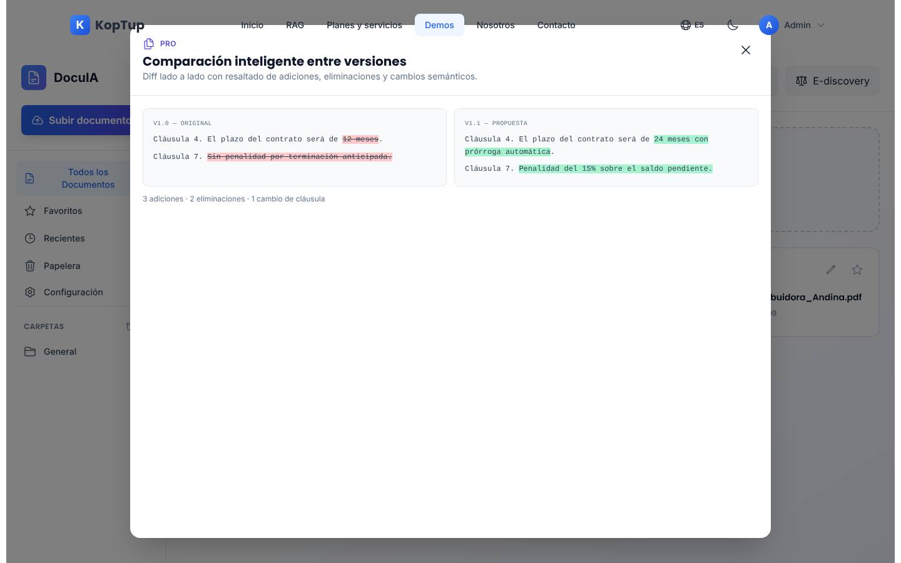

*«Comparación inteligente entre versiones»: el mismo ejemplo para cualquier documento.*

A la izquierda, «v1.0 — original» con el texto eliminado tachado en rojo; a la derecha, «v1.1 — propuesta» con lo agregado en verde: el plazo pasa de 12 meses a «24 meses con prórroga automática» y la cláusula 7 pasa de «Sin penalidad por terminación anticipada» a «Penalidad del 15 % sobre el saldo pendiente». El pie dice «3 adiciones · 2 eliminaciones · 1 cambio de cláusula». La demo no guarda versiones de los documentos.

### Retención y Legal Hold

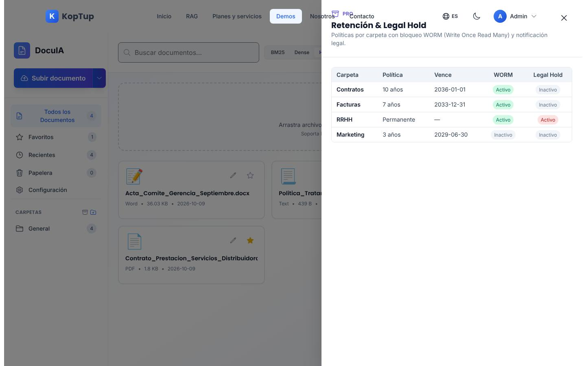

*Tabla de políticas de retención por carpeta (contenido fijo de ejemplo).*

| Carpeta | Política | Vence | WORM | Legal Hold |
|---|---|---|---|---|
| Contratos | 10 años | 2036-01-01 | Activo | Inactivo |
| Facturas | 7 años | 2033-12-31 | Activo | Inactivo |
| RRHH | Permanente | — | Activo | Activo |
| Marketing | 3 años | 2029-06-30 | Inactivo | Inactivo |

WORM significa *Write Once Read Many*: el documento no se puede modificar. El código pone estas mismas insignias en las tarjetas y en las carpetas cuyo nombre contiene «contrato», «factura», «rrhh» o «market», pero desde la pantalla no se puede llegar a tener esas carpetas (ver la [limitación 3](#limitaciones-conocidas)).

### Configuración

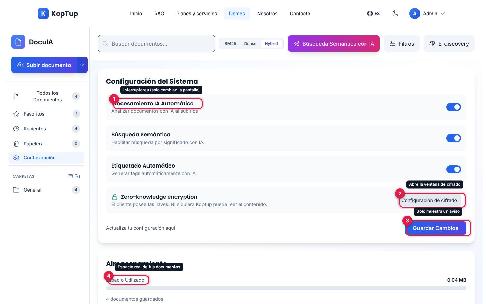

*Vista «Configuración del Sistema».*

1. **Procesamiento IA Automático**, **Búsqueda Semántica** y **Etiquetado Automático**: interruptores que solo cambian la pantalla. El servidor siempre analiza con IA al subir.
2. **Configuración de cifrado**: abre «Zero-knowledge encryption» con el interruptor **Activar cifrado BYO-key** y un flujo de 4 pasos (la llave se genera en el equipo, el documento se cifra en el navegador, solo viaja el texto cifrado, se descifra con tu llave). Al encenderlo aparece la insignia «BYO-key activo» y, en el panel de cada documento, «Cifrado zero-knowledge BYO-key». No se cifra nada.
3. **Guardar Cambios**: muestra «✓ Configuración guardada» durante 3 segundos. No guarda: al recargar la página todo vuelve a «Activado».
4. **Almacenamiento**: espacio real que ocupan tus documentos (la barra se llena contra 100 MB) y cuántos tienes guardados.

Debajo, **Resumen de Configuración** repite el estado de los cuatro interruptores.

### En el celular

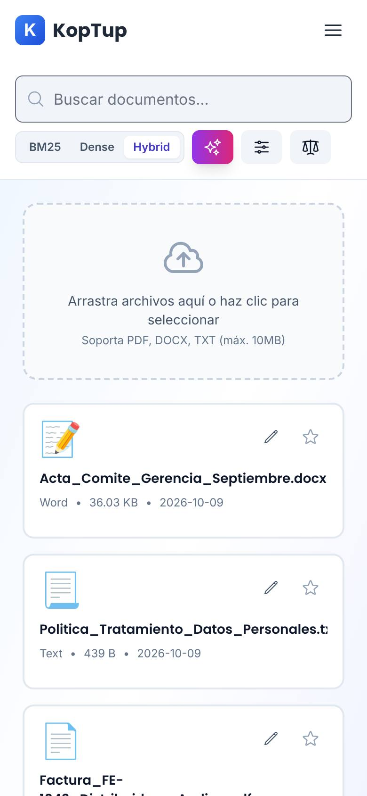

*La demo en un teléfono (390 px): búsqueda, modos, botones con solo el icono, zona de subida y las tarjetas en una columna.*

En el teléfono **la barra lateral se oculta** y no hay otra forma de llegar a Favoritos, Recientes, Papelera, Configuración, las carpetas, la tabla de retención ni el menú de canales. Sí se puede subir (zona de arrastre), buscar, abrir el panel del documento y usar E-discovery. La página no se desborda a lo ancho.

---

## Qué es real y qué es simulado

| Parte | Real o simulado | Detalle |
|---|---|---|
| Subida y almacenamiento | **Real (servidor)** | PDF, DOCX, TXT y CSV de hasta 10 MB; máximo 10 subidas por minuto. Se guarda en el disco del servidor o en S3 si está configurado. |
| Extracción de texto | **Real** | PDF y DOCX se leen en el servidor; TXT y CSV, tal cual. |
| Resumen, etiquetas, palabras clave y entidades | **IA real** | GPT-4o mini con los primeros 4.000 caracteres. Si la IA falla (o el texto tiene menos de 50 caracteres), queda «Documento: nombre del archivo» y una etiqueta básica; si el servidor no tiene clave de OpenAI, el documento se guarda sin resumen ni etiquetas. |
| Búsqueda semántica y «¿Por qué este resultado?» | **IA real** | Vectores de OpenAI (`text-embedding-ada-002`) y similitud de coseno mayor a 50 %. |
| Explicar con IA | **IA real** | GPT-4o mini sobre el texto del documento. |
| Favoritos, renombrar, carpetas, papelera y restaurar | **Real (servidor)** | Cada cuenta ve solo sus documentos. |
| Contadores y almacenamiento | **Real** | Calculados en el servidor. |
| Canales de ingesta y dirección Email-to-vault | **Simulado** | Texto informativo; la dirección es de ejemplo. |
| Modos BM25, Dense e Hybrid; Filtros | **Simulado** | Solo cambian la pantalla. |
| OCR, cláusulas y comparar versiones | **Datos de ejemplo** | Contenido fijo, igual para cualquier documento. |
| Marca de agua y firma electrónica | **Simulado** | La marca se dibuja sobre la vista previa; la firma no firma. |
| Retención, Legal Hold y WORM | **Datos de ejemplo** | Tabla fija de cuatro carpetas. |
| E-discovery | **Simulado** | Aviso con cifras fijas; no exporta. |
| Cifrado zero-knowledge | **Simulado** | Interruptor e insignias; no cifra. |
| Configuración del sistema | **Simulado** | Interruptores locales; no se guardan. |

Para un desarrollador, la demo usa estas rutas de la API (todas exigen sesión y filtran por el usuario; detalle en [API](Doc-08-API.md)):

| Ruta | Para qué |
|---|---|
| `POST /api/documents/upload` | Subir y analizar un archivo (campo `file` y `folder` opcional). |
| `GET /api/documents` | Listar; acepta `folder`, `favorites`, `recent`, `trash` y `search`. |
| `GET /api/documents/folders` · `POST /api/documents/folders` | Carpetas con su cantidad · crear carpeta (no guarda nada, ver la limitación 3). |
| `GET /api/documents/stats` | Contadores y espacio usado. |
| `POST /api/documents/search/semantic` | Búsqueda por significado. |
| `GET /api/documents/:id/explain` · `POST /api/documents/:id/explain-similarity` | Explicar el documento · explicar una coincidencia. |
| `PATCH /api/documents/:id` | Renombrar, mover de carpeta o marcar favorito. |
| `DELETE /api/documents/:id` · `POST /api/documents/:id/restore` | Mover a la papelera (con PIN) · restaurar. |

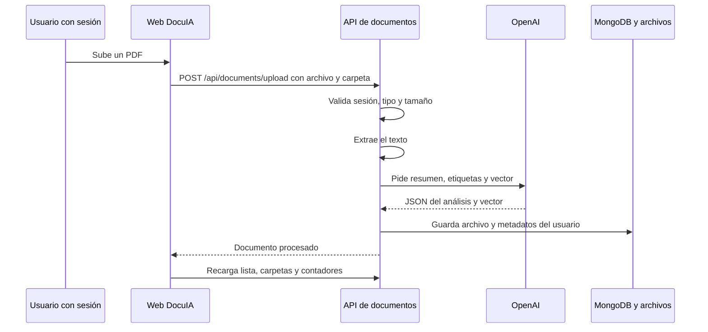

*Qué pasa al subir un documento.*

---

## Acceso

**Cómo lo ve un visitante.** La demo está en modo **Abierta** (`publico`): cualquiera entra a `/demo/gestor-documentos` sin pasar por la pantalla de acceso. Pero los documentos se guardan **por cuenta**, así que el servidor exige sesión. Sin sesión, la página carga y muestra «Error al cargar documentos» con todos los contadores en 0:

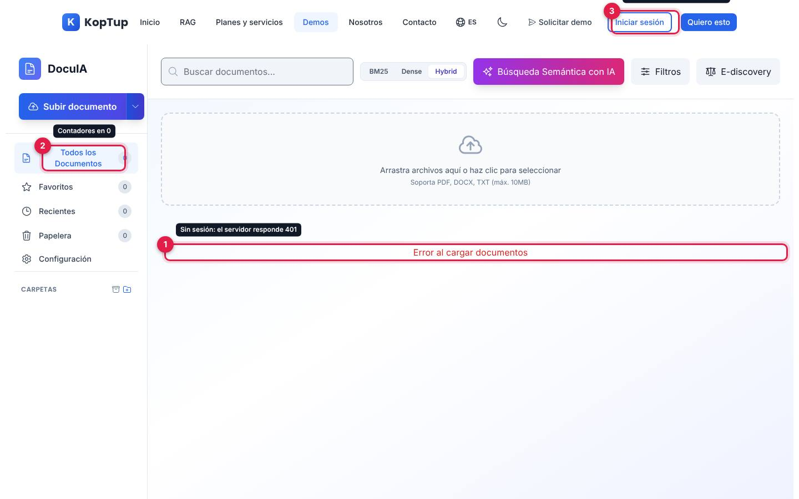

*Lo que ve un visitante sin sesión: (1) el error, (2) los contadores en 0 y (3) el botón «Iniciar sesión» del menú.*

- **Cómo se usa:** basta con **iniciar sesión** (`/login`) o **crear una cuenta** (`/register`) y volver a la demo. No hace falta un acceso aprobado: cualquier cuenta la usa y ve solo sus documentos.
- **Cómo se solicita una demo guiada:** con **Solicitar demo guiada** (en el bloque azul al final de la página, que también ofrece **Solicitar Cotización** y **Ver Planes y Precios**) o con **Solicitar demo** del menú.
- **Cómo la controla el admin:** el modo sale del catálogo del servidor y se cambia en **Admin › Catálogo de demos**. Si se pasa a «Con solicitud» o «Solo por invitación», los visitantes verán la pantalla de acceso y los accesos se conceden en **Admin › Solicitudes de demo** y **Admin › Accesos a demos**. Ojo: la API de documentos solo revisa la sesión, no el acceso a la demo. Detalle en el [Manual del administrador](Doc-06-Manual-del-Administrador.md) y en [Flujos del visitante](Doc-04-Flujos-del-Visitante.md).

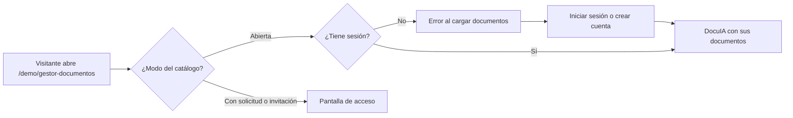

*Camino de un visitante hasta usar la demo.*

---

## Limitaciones conocidas

1. **Ventanas que se abren detrás del panel del documento.** Las ventanas de **Procesar con OCR**, **Detectar cláusulas**, **Comparar versiones**, el PIN de **Mover a Papelera** y la insignia de cifrado se abren por debajo del panel y de su fondo oscuro: el usuario ve que «no pasa nada» o ve la ventana a medias. Hay que cerrar el panel con la **X** para usarlas. Además, el menú del sitio queda encima del encabezado de esas ventanas.
2. **La búsqueda semántica no se puede usar bien.** Su ventana de resultados queda detrás de su propio fondo oscuro: se ve atenuada y cualquier clic la cierra, así que **¿Por qué este resultado?** no se puede pulsar.
3. **No se pueden crear carpetas.** «Nueva Carpeta» responde bien, pero el servidor no guarda nada: una carpeta solo existe si tiene documentos y **Mover a Carpeta** solo ofrece las que ya existen. En la práctica todo queda en «General» (que además aparece dos veces en la lista). Por lo mismo, las insignias de retención de las carpetas nunca aparecen.
4. **El PIN para borrar está mal indicado.** La ventana dice «PIN por defecto» con un número que el servidor rechaza; el aviso de error muestra el PIN correcto. La ventana también dice «Esta acción no se puede deshacer», pero el documento va a la papelera y se puede restaurar.
5. **Sin sesión, el error no explica qué hacer.** El visitante ve «Error al cargar documentos» en vez de «Inicia sesión para ver y subir tus documentos» (el mensaje existe en el código pero la página no lo usa).
6. **Papelera sin borrado definitivo.** No hay botón para eliminar para siempre y nada borra los documentos a los 30 días, aunque el aviso lo diga.
7. **Tipos de archivo.** El selector ofrece también DOC, XLS, XLSX, PPT y PPTX, pero el servidor los rechaza y la página solo muestra «Error al subir el archivo», sin decir por qué.
8. **Funciones que solo cambian la pantalla:** los modos BM25, Dense e Hybrid, los **Filtros**, los canales de ingesta, los niveles de firma, **Generar bundle**, el cifrado y la **Configuración** (que además no se guarda al recargar).
9. **Acciones PRO con contenido fijo.** OCR, cláusulas, versiones, retención y E-discovery muestran siempre lo mismo; el nombre del contrato de las cláusulas no es el del documento abierto. La vista previa no muestra el archivo real.
10. **En el celular** no hay forma de llegar a Favoritos, Recientes, Papelera, Configuración ni carpetas (la barra lateral se oculta).
11. **Texto del catálogo y SEO.** La tarjeta del hub promete «Control de acceso» y «Etiquetas y versiones», que la demo no tiene; el título y la descripción para buscadores hablan de un «Gestor Documental Médico para Archivos Clínicos» (historias clínicas, consentimientos), pero la demo es general.
12. **Nombres largos.** En el panel del documento, un nombre largo se monta sobre la **X** de cerrar.
