# Guía de la demo: Helpdesk con IA

> Ruta `/demo/helpdesk-ia` · Modo de acceso: **Abierta** · Tipo: **IA real** solo en «Redactar con IA» (llama al servidor); todo lo demás son **datos de ejemplo** en el navegador · Plan del producto: [Helpdesk con IA](Producto-helpdesk-ia.md)

**Resumen.** Es la mesa de ayuda de tres marcas ficticias (Moda Andina, Conecta Sabana y Cooperativa Ceiba) con una sola bandeja para correo, chat web, WhatsApp, Messenger, Telegram y llamadas. Muestra cómo llega un ticket, cómo se clasifica y se asigna solo, cómo un modelo de IA redacta la respuesta citando la base de conocimiento, y cómo se miden el SLA, el CSAT/NPS y las PQRS en días hábiles de Colombia. Está pensada para gerentes de servicio al cliente y coordinadores de soporte; la clasificación, las macros y los envíos se simulan con reglas en el navegador.

**En esta página:** [Recorrido sugerido](#recorrido-sugerido-demo-comercial-de-5-minutos) · [Pantallas y funciones](#pantallas-y-funciones) · [Qué es real y qué es simulado](#qué-es-real-y-qué-es-simulado) · [Acceso](#acceso) · [Limitaciones conocidas](#limitaciones-conocidas)

*Encabezado con los filtros de marca y área, el reloj de la demo, las cinco métricas y el inicio de la bandeja.*

---

## Recorrido sugerido (demo comercial de 5 minutos)

La idea que vende: «un mensaje llega por WhatsApp, el sistema lo entiende, lo asigna a la persona correcta y la IA le propone la respuesta». Si la demo ya se usó en ese navegador, empieza con **Restablecer datos** › **Sí, restablecer**.

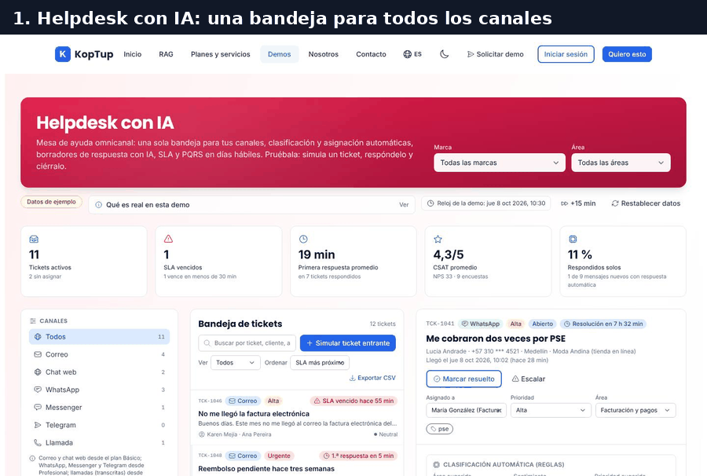

*Recorrido completo en 6 pasos: bandeja, ticket entrante, enrutamiento, borrador con IA, respuesta y encuesta.*

### Paso 1. La bandeja y las métricas

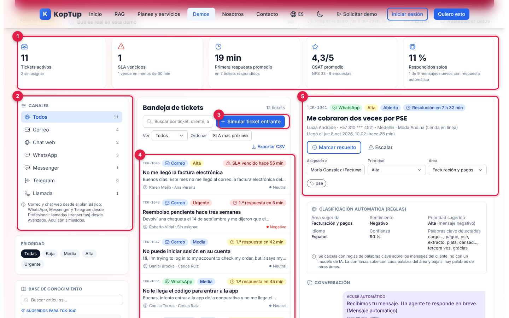

*La demo abre con el ticket TCK-1041 («Me cobraron dos veces por PSE») seleccionado.*

1. **Métricas**: tickets activos (11, 2 sin asignar), SLA vencidos (1), primera respuesta promedio (19 min), CSAT promedio (4,3/5 con NPS 33) y mensajes respondidos solos (11 %). Al pasar el cursor, cada tarjeta explica su cálculo.
2. **Canales**: filtra la bandeja por canal y muestra cuántos tickets activos tiene cada uno. Debajo están los filtros de **Prioridad** y la **Base de conocimiento**.
3. **Simular ticket entrante**: el botón del paso 2.
4. **Bandeja**: cada ticket muestra número, canal, prioridad, estado del SLA («1.ª respuesta en 5 min», «SLA vencido hace 55 min»…), asunto, último mensaje, cliente, agente y sentimiento.
5. **Detalle del ticket**: canal, prioridad, estado, SLA, cliente y marca; **Marcar resuelto**, **Escalar** y los selectores de agente, prioridad y área.

### Paso 2. Llega un ticket nuevo

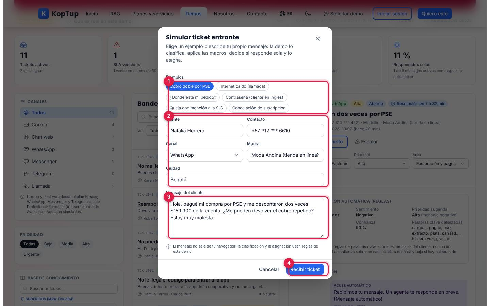

*Ventana «Simular ticket entrante» con el ejemplo «Cobro doble por PSE».*

1. **Ejemplos**: seis mensajes listos (Cobro doble por PSE, Internet caído por llamada, ¿Dónde está mi pedido?, Contraseña de un cliente en inglés, Queja con mención a la SIC y Cancelación de suscripción).
2. **Cliente, contacto, canal, marca y ciudad**: se llenan con el ejemplo y se pueden cambiar.
3. **Mensaje del cliente**: editable; puedes escribir uno propio (mínimo 10 caracteres).
4. **Recibir ticket**: lo procesa (paso 3).

### Paso 3. Clasificación, macros y asignación automática

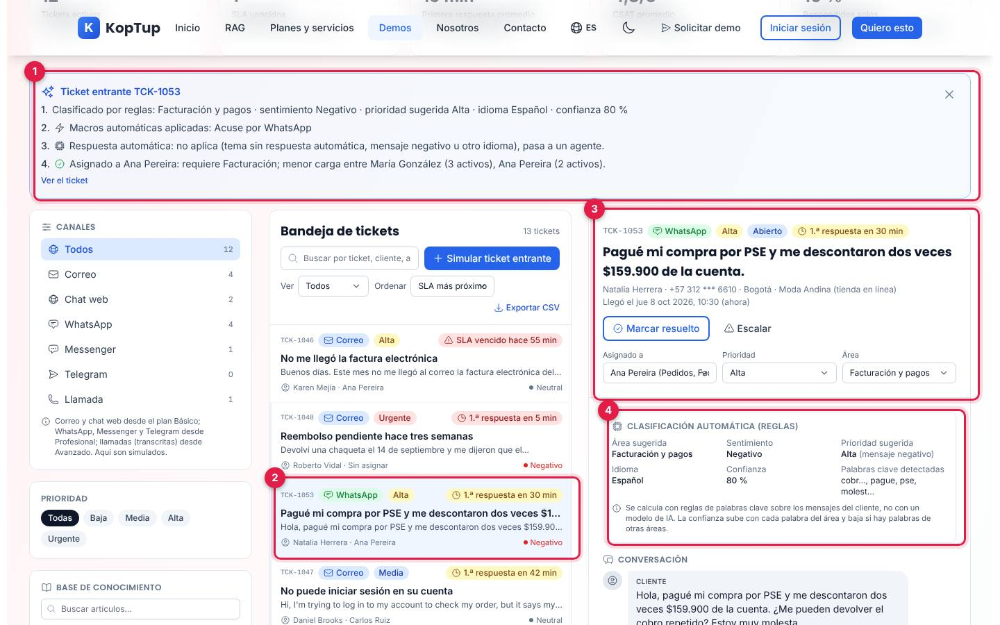

*Resultado del ticket TCK-1053: qué decidió la demo y por qué.*

1. **Aviso del ticket entrante**, en cuatro pasos: clasificado por reglas (Facturación y pagos, sentimiento Negativo, prioridad sugerida Alta, idioma Español, confianza 80 %); macros aplicadas (Acuse por WhatsApp); respuesta automática (no aplica porque el mensaje es negativo); y asignación (Ana Pereira: requiere Facturación y tenía menos carga que María González). **Ver el ticket** lo abre.
2. **El ticket en la bandeja**, seleccionado.
3. **Encabezado del ticket**: WhatsApp, prioridad Alta, Abierto, «1.ª respuesta en 30 min».
4. **Clasificación automática (reglas)**: área, sentimiento, prioridad sugerida y su razón, idioma, confianza y palabras clave detectadas.

Qué decir: «Nadie tuvo que leer el mensaje para saber a quién le toca». Los otros ejemplos muestran otras rutas:

| Ejemplo | Clasificación | Qué pasa |
|---|---|---|
| Cobro doble por PSE (WhatsApp) | Facturación, negativo, Alta, 80 % | Macro «Acuse por WhatsApp»; va a un agente con habilidad de Facturación |
| ¿Dónde está mi pedido? (Messenger) | Pedidos, neutral, Media, 90 % | **Se responde solo** con el artículo «Estado del pedido» y queda Pendiente, sin agente |
| Contraseña, cliente en inglés (correo) | Cuenta y acceso, inglés, 80 % | No aplica respuesta automática (otro idioma); va a Carlos Ruiz (Cuentas + Inglés) |
| Queja con mención a la SIC (correo) | Facturación, negativo, Urgente, 70 % | Macro «Mención a la SIC» (prioridad Urgente y etiqueta «riesgo-legal») |
| Cancelación de suscripción (Telegram) | Cancelaciones, neutral, Media, 70 % | Macro «Riesgo de fuga» la asigna a María González |
| Internet caído, llamada | Soporte técnico, negativo, Urgente, 90 % | Va a quien tenga Soporte técnico y menos carga |

### Paso 4. Redactar con IA

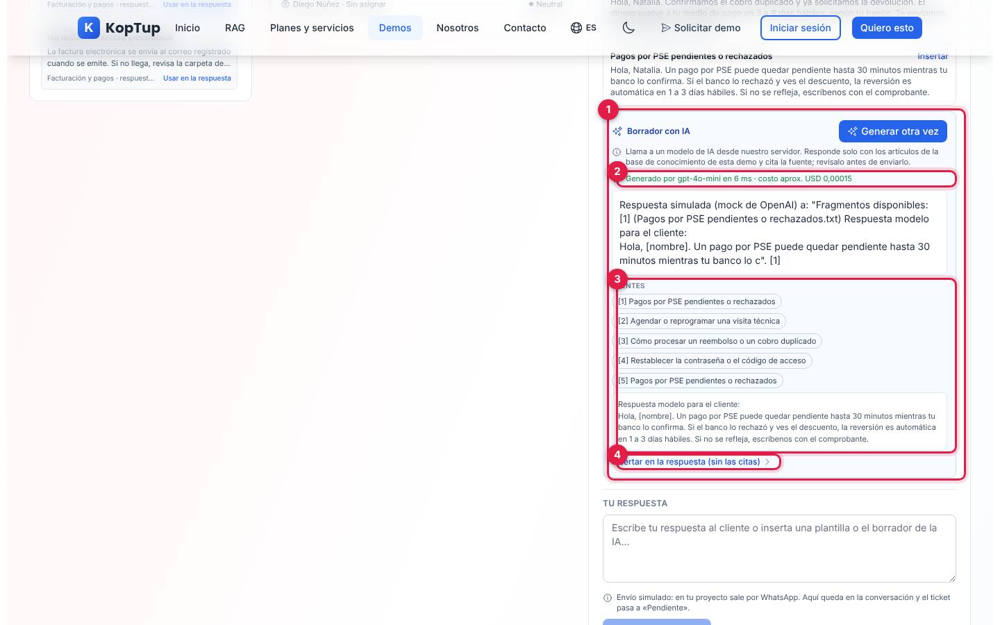

*Panel «Borrador con IA» del ticket TCK-1053 después de pulsar «Redactar con IA», con la primera fuente abierta.*

1. **Borrador con IA**: el botón **Redactar con IA** (luego **Generar otra vez**). Mientras trabaja dice «Cargando la base de conocimiento en el servidor…» (la primera vez en ese navegador crea el bot y sube los 10 artículos; después solo comprueba que siga ahí) y «Consultando el modelo…».
2. **Cómo se generó**: en verde, «Generado por gpt-4o-mini en … ms · costo aprox. USD …» cuando respondió el modelo; en ámbar, «El servidor no tiene una clave de IA configurada: estos son los fragmentos más relevantes…» (modo extractivo) o «El proveedor de IA no respondió…».
3. **Fuentes**: los fragmentos de la base de conocimiento que usó, numerados como las citas [1], [2]…; un clic muestra el texto del fragmento.
4. **Insertar en la respuesta (sin las citas)**: pega el borrador en «Tu respuesta», sin las marcas [1].

Lo que la captura muestra y por qué: en el entorno local donde se tomaron las capturas, el servidor usa un **simulador del modelo** en lugar de OpenAI; por eso el borrador empieza con «Respuesta simulada (mock de OpenAI)…» y tarda 6 ms. Con la clave de OpenAI configurada, ahí aparece el borrador redactado para el cliente (las instrucciones piden 2 a 4 frases, en español de Colombia y tratando al cliente de tú) con las citas de la fuente. Las fuentes y el registro del modelo, el tiempo y el costo sí son los que devuelve el servidor.

Qué decir: «La IA solo responde con tu base de conocimiento y te dice de dónde sacó cada dato; el agente revisa antes de enviar».

### Paso 5. Responder al cliente

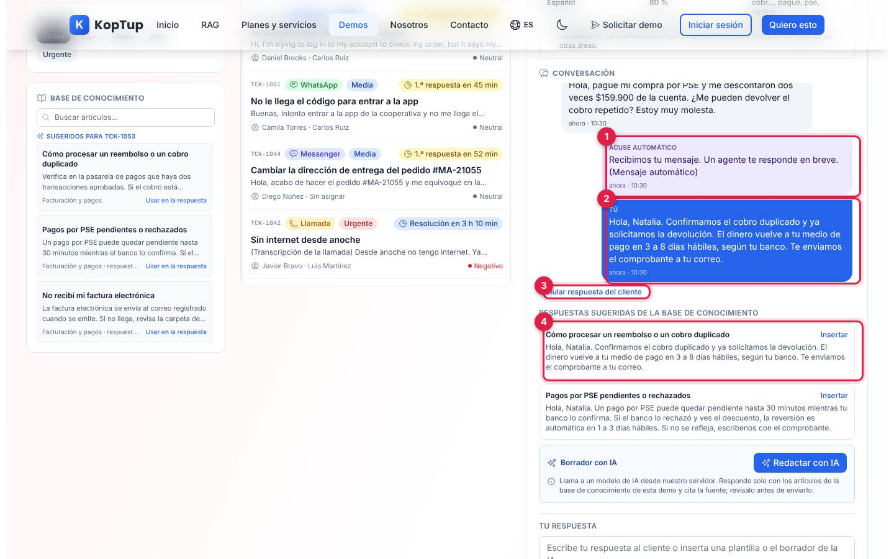

*Conversación de TCK-1053 después de enviar la respuesta.*

1. **Acuse automático**: lo agregó la macro «Acuse por WhatsApp» al llegar el ticket.
2. **Tu respuesta** («Tú»): en la captura se usó **Insertar** en la respuesta sugerida «Cómo procesar un reembolso o un cobro duplicado» (también puedes insertar el borrador de la IA o escribir). **Enviar respuesta** la agrega a la conversación, avisa «Respuesta agregada a la conversación (envío simulado por WhatsApp)» y el ticket pasa a **Pendiente** («Esperando al cliente»), así que su SLA deja de correr.
3. **Simular respuesta del cliente**: agrega «Listo, muchas gracias por la ayuda.» y el ticket vuelve a **Abierto**.
4. **Respuestas sugeridas de la base de conocimiento**: los artículos del área del ticket, con la respuesta modelo ya personalizada con el nombre del cliente.

### Paso 6. Resolver y medir la satisfacción

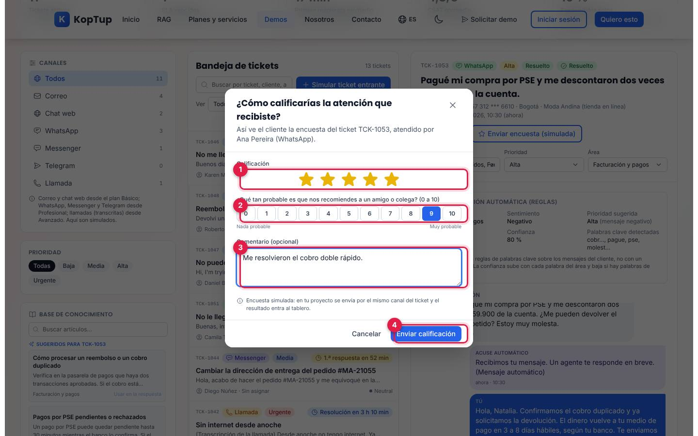

*La encuesta tal como la vería el cliente al cerrar su ticket.*

Pulsa **Marcar resuelto** («Ticket resuelto. Puedes enviar la encuesta (simulada).») y luego **Enviar encuesta (simulada)**:

1. **Calificación** de 1 a 5 estrellas.
2. **¿Qué tan probable es que nos recomiendes…?** de 0 a 10 (para el NPS).
3. **Comentario** opcional.
4. **Enviar calificación**: se activa cuando hay estrellas y NPS. Avisa «Encuesta registrada (simulada: en tu proyecto llega al cliente por WhatsApp).».

Con 5 estrellas y un 9, el CSAT promedio sube de 4,3 a 4,4, el NPS de 33 a 40 y las encuestas de 9 a 10; el promedio de Ana Pereira también cambia en el panel de CSAT.

Qué decir: «Del mensaje a la medición de satisfacción, en un solo lugar».

---

## Pantallas y funciones

Todo está en una sola página: encabezado, métricas, tres columnas (canales y base de conocimiento, bandeja, detalle del ticket), tres paneles (respuesta automática, macros, CSAT) y la tabla de PQRS.

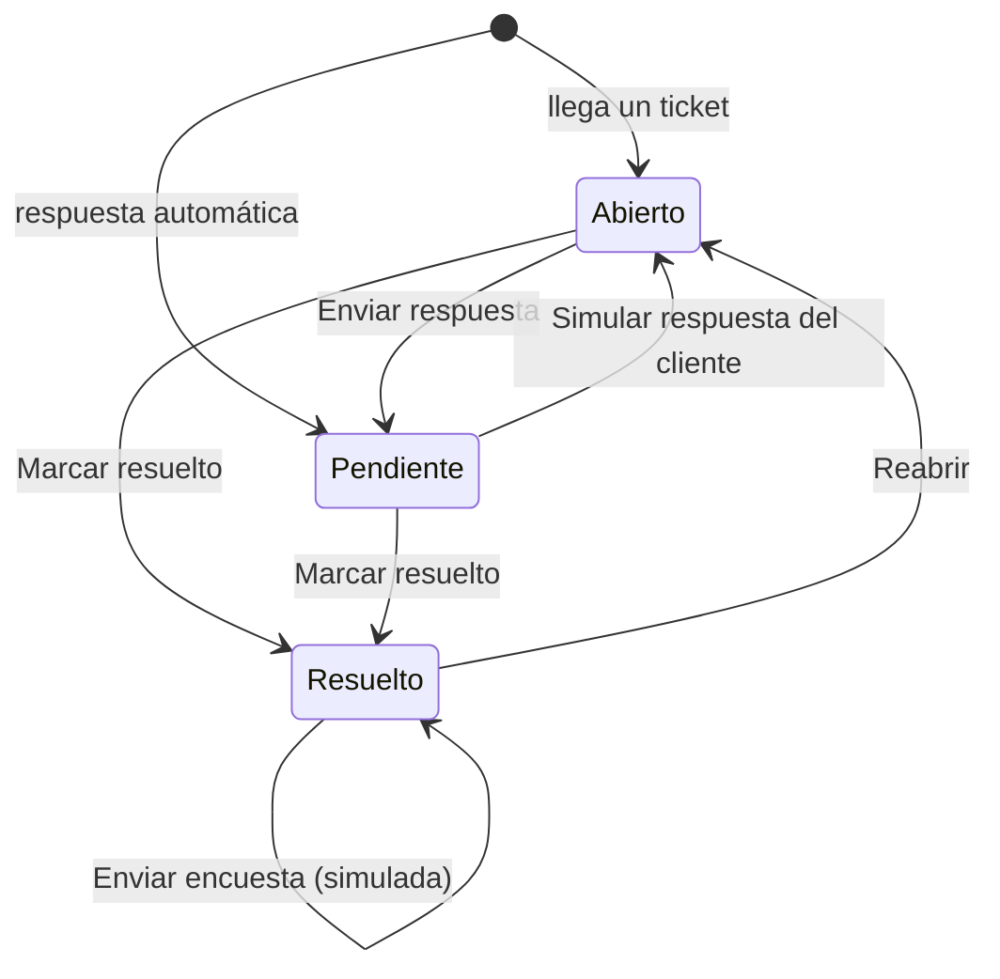

*Estados de un ticket en la demo. El SLA se mide mientras está Abierto; en Pendiente dice «Esperando al cliente».*

### Encabezado

- **Marca** (Todas, Moda Andina, Conecta Sabana, Cooperativa Ceiba) y **Área** (Facturación y pagos, Soporte técnico, Pedidos y envíos, Cuenta y acceso, Cancelaciones y retención, General) filtran la bandeja.
- Insignia **Datos de ejemplo** y desplegable **Qué es real en esta demo**.
- **Reloj de la demo**: arranca el jueves 8 oct 2026 a las 10:30 y avanza un minuto por cada minuto real con la página abierta. **+15 min** lo adelanta para ver vencer el SLA. **Restablecer datos** vuelve todo (tickets, macros, encuestas y reloj) a los datos de ejemplo.

### Métricas

| Métrica | Cómo se calcula |
|---|---|
| Tickets activos | Abiertos o pendientes, y cuántos están sin asignar |
| SLA vencidos | Tickets abiertos que pasaron el tiempo de primera respuesta o de resolución, y cuántos vencen en menos de 30 min |
| Primera respuesta promedio | Tiempo entre la llegada y la primera respuesta de un agente o de la respuesta automática |
| CSAT promedio | Promedio de 1 a 5 de las encuestas; NPS = % de promotores (9–10) − % de detractores (0–6) |
| Respondidos solos | Mensajes nuevos que contestó la respuesta automática, sobre el total del registro |

### Canales, prioridad y base de conocimiento

La columna izquierda filtra por canal y por prioridad (Todas, Baja, Media, Alta, Urgente). Una nota explica en qué plan entra cada canal: correo y chat web desde Básico; WhatsApp, Messenger y Telegram desde Profesional; llamadas transcritas desde Avanzado.

La **Base de conocimiento** tiene 10 artículos (reembolsos, factura electrónica, PSE, contraseña, estado del pedido, cambio de dirección, cambios y devoluciones, internet lento, visita técnica y cancelación de plan). Muestra los **Sugeridos para** el ticket abierto, se puede buscar, y **Usar en la respuesta** pega la respuesta modelo del artículo en el borrador (solo con un ticket abierto o pendiente).

### Bandeja

Además de los filtros de la izquierda y del encabezado: **Buscar** por ticket, cliente, asunto, radicado o texto; **Ver** (Todos, Abiertos, Pendientes, Resueltos, Sin asignar, SLA en riesgo); **Ordenar** (SLA más próximo, Más recientes, Prioridad); y **Exportar CSV** (`koptup-helpdesk-tickets.csv`, separado por punto y coma, con los tickets visibles: ticket, asunto, cliente, ciudad, canal, marca, área, prioridad, estado, asignado, creado, SLA restante y radicado PQRS).

### Detalle del ticket

| Parte | Qué puedes hacer | Qué pasa |
|---|---|---|
| Encabezado | **Marcar resuelto** / **Reabrir**, **Escalar**, **Enviar encuesta (simulada)** si está resuelto | Cambia el estado; reabrir deja una nota |
| Asignado a, Prioridad, Área | Elegir agente (con sus habilidades), prioridad y área; **Asignar automáticamente** | Asignar automáticamente elige al agente con la habilidad del área (e inglés si el cliente escribe en inglés) y menos tickets activos, y deja la explicación en las notas |
| Clasificación automática | Solo lectura | Reglas de palabras clave; la confianza sube con cada palabra del área y baja con palabras de otras áreas |
| Conversación | **Simular respuesta del cliente** (si está Pendiente) | Agrega «Listo, muchas gracias por la ayuda.» y el ticket vuelve a Abierto |
| Respuestas sugeridas de la base de conocimiento | **Insertar** | Pega la respuesta modelo, con el nombre del cliente, en «Tu respuesta» |
| Borrador con IA | **Redactar con IA** / **Generar otra vez**, ver **Fuentes**, **Insertar en la respuesta (sin las citas)** | Ver el [paso 4](#paso-4-redactar-con-ia) |
| Tu respuesta | Escribir y **Enviar respuesta** | Envío simulado: queda en la conversación y el ticket pasa a Pendiente |
| Aplicar macro | Elegir una macro y **Aplicar** | Ejecuta sus acciones y suma una ejecución |
| Marcar como PQRS | Petición, Queja, Reclamo, Sugerencia o Felicitación | Le da un radicado `PQRS-2026-04xx`, lo pasa a la tabla de PQRS y su plazo se mide en días hábiles |
| Notas internas | Escribir y **Guardar nota** | Las notas del sistema (asignación, macros, SLA, escalamiento) también aparecen aquí |

### Escalar

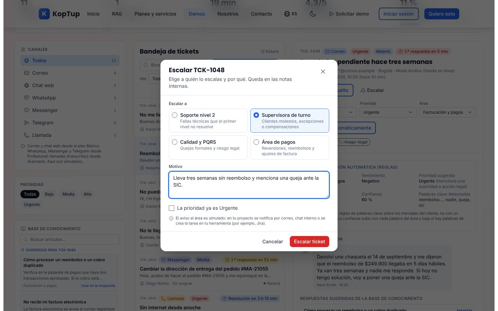

*Escalamiento de TCK-1048 a la supervisora de turno.*

Elige a quién (Soporte nivel 2, Supervisora de turno, Calidad y PQRS o Área de pagos), escribe el motivo (mínimo 5 caracteres) y, si quieres, sube la prioridad un nivel (si ya es Urgente, la casilla lo dice). **Escalar ticket** agrega la etiqueta «escalado», una nota interna y el aviso «Escalado a … ahora — motivo» en el detalle. El aviso al área es simulado.

### SLA y reloj de la demo

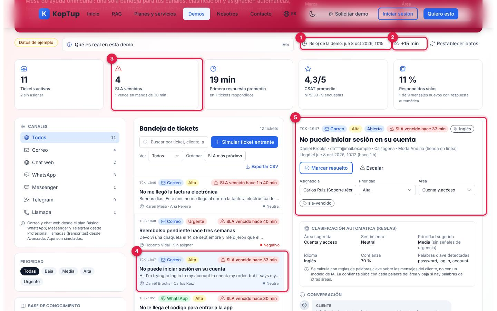

*Después de adelantar el reloj 45 minutos (tres veces «+15 min»).*

1. **Reloj de la demo**, ahora 11:15.
2. **+15 min**.
3. **SLA vencidos** sube de 1 a 4.
4. **TCK-1047** pasó de Media a Alta y muestra «SLA vencido hace 33 min» (venció a las 11:12 con la política de Media; ver la limitación 7).
5. En su detalle aparece la etiqueta «sla-vencido»; en las notas, «SLA vencido: la prioridad subió de Media a Alta y se avisó a la supervisora de turno (aviso simulado)».

| Prioridad | Primera respuesta | Resolución |
|---|---|---|
| Urgente | 15 min | 4 h |
| Alta | 30 min | 8 h |
| Media | 1 h | 24 h |
| Baja | 4 h | 48 h |

*Política de SLA de ejemplo, en minutos corridos desde la llegada del ticket. Si un ticket abierto la pasa, sube un nivel de prioridad (si ya es Urgente, solo se avisa).*

### Respuesta automática, macros y CSAT

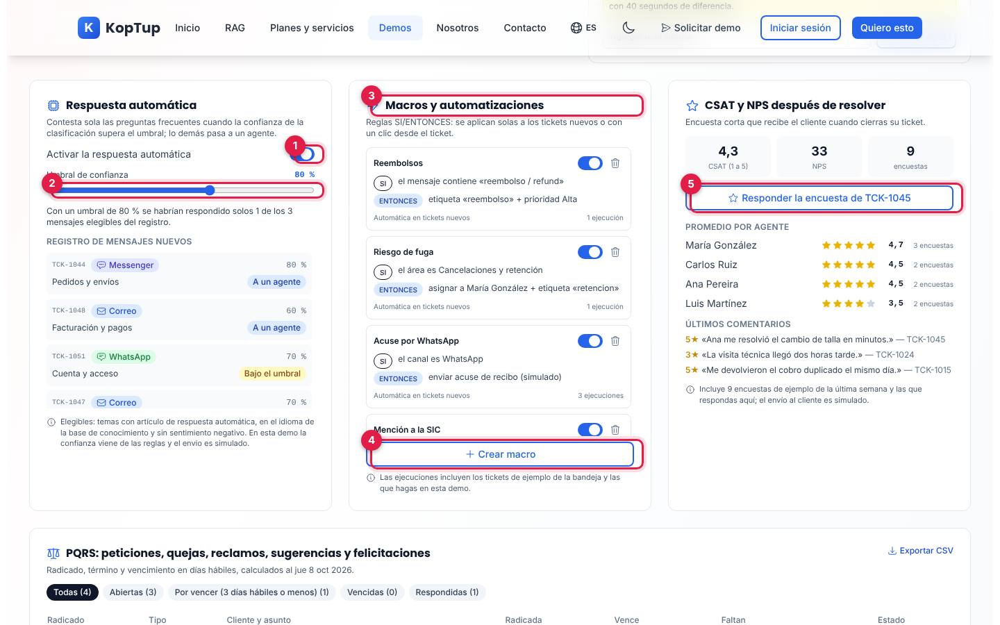

*Los tres paneles debajo de la bandeja.*

1. **Activar la respuesta automática**.
2. **Umbral de confianza** (50 % a 99 %; 80 % por defecto). Debajo dice cuántos mensajes elegibles del registro se habrían respondido solos con ese umbral, y el **Registro de mensajes nuevos** muestra el resultado de cada uno (Respondido solo, Bajo el umbral, A un agente, Apagada); un clic abre el ticket. Son elegibles los temas con artículo de respuesta automática, en el idioma de la base de conocimiento y sin sentimiento negativo.
3. **Macros y automatizaciones**: reglas SI/ENTONCES. Vienen cuatro: Reembolsos, Riesgo de fuga, Acuse por WhatsApp y Mención a la SIC. Cada una se puede pausar o eliminar y muestra sus ejecuciones.
4. **Crear macro** (ver abajo).
5. **CSAT y NPS después de resolver**: promedio, NPS y número de encuestas; **Responder la encuesta de TCK-…** abre la encuesta del último ticket resuelto; promedio por agente y últimos comentarios.

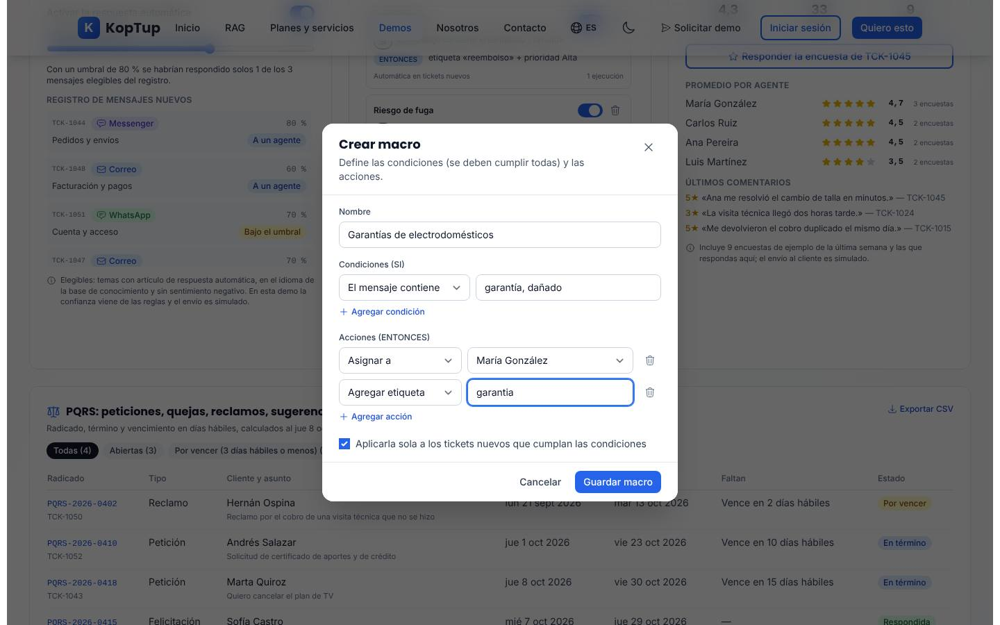

*Nueva macro: si el mensaje contiene «garantía» o «dañado», asignar a María González y etiquetar «garantia».*

Condiciones (todas deben cumplirse): el área es, el canal es, la prioridad es al menos, el sentimiento es, el mensaje contiene. Acciones: asignar a, cambiar prioridad a, agregar etiqueta, enviar acuse de recibo. La casilla final decide si se aplica sola a los tickets nuevos o solo a mano desde el ticket.

### PQRS

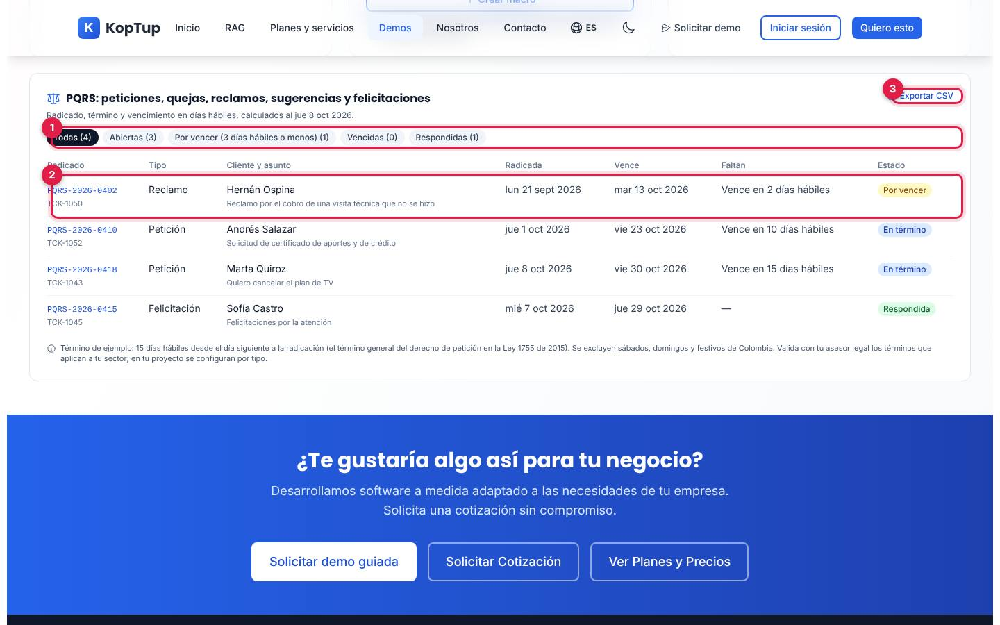

*Tabla de PQRS con sus plazos en días hábiles.*

1. **Filtros**: Todas, Abiertas, Por vencer (3 días hábiles o menos), Vencidas y Respondidas.
2. **Cada PQRS**: radicado y ticket, tipo, cliente y asunto, fecha de radicación, vencimiento, días hábiles que faltan y estado (En término, Por vencer, Vencida, Respondida). Un clic en el radicado abre el ticket.
3. **Exportar CSV** (`koptup-helpdesk-pqrs.csv`).

El término de ejemplo es de 15 días hábiles desde el día siguiente a la radicación (el término general del derecho de petición, Ley 1755 de 2015), sin sábados, domingos ni festivos de Colombia; la propia nota pide validar los términos de cada sector con un asesor legal.

### En el celular

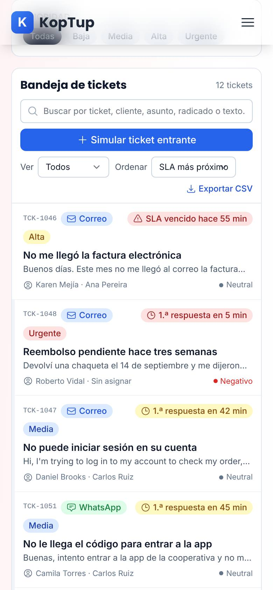

*La bandeja en un teléfono (390 px).*

Las columnas se apilan en este orden: canales y prioridad, bandeja, detalle del ticket y base de conocimiento. Al tocar un ticket, la página baja hasta su detalle.

---

## Qué es real y qué es simulado

| Parte | Real o simulado | Detalle |
|---|---|---|
| «Redactar con IA» | **IA real, en el servidor** | Usa la API del chatbot RAG (`/api/chatbot`): la primera vez crea un bot con los 10 artículos; cada borrador busca los fragmentos relevantes y, si el servidor tiene clave de OpenAI y presupuesto, llama al modelo; si no, responde en modo extractivo y lo dice. |
| Clasificación, sentimiento, prioridad, idioma y confianza | **Reglas de palabras clave** | En el navegador; no hay modelo de IA. |
| Asignación por habilidad y carga, macros, respuesta automática | **Funciona de verdad, en el navegador** | Con 4 agentes de ejemplo (María González, Carlos Ruiz, Ana Pereira y Luis Martínez) y sus habilidades. |
| SLA, escalamiento por SLA y PQRS en días hábiles | **Funciona de verdad, con reloj simulado** | Calcula festivos de Colombia; el reloj es el de la demo. |
| Canales, envíos, acuses, encuestas y avisos a áreas | **Simulados** | No sale ningún mensaje. |
| Tickets, clientes, pedidos, montos y radicados | **Ficticios** | Tres marcas inventadas; contactos enmascarados. |
| CSV de tickets y de PQRS | **Real, con datos ficticios** | Se genera en el navegador. |
| Dónde se guarda | **Navegador** | `localStorage` (`koptup.helpdesk.v1` para los datos y `koptup.helpdesk.kbBot` para el bot de la base de conocimiento). |

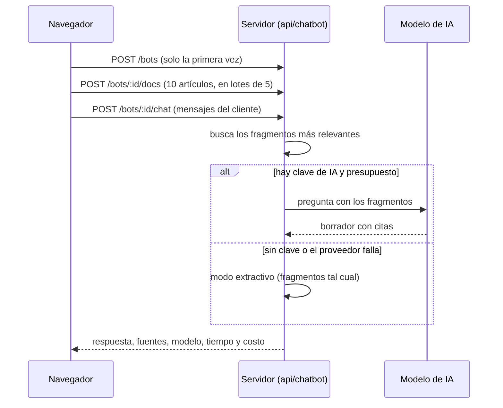

*Qué pasa al pulsar «Redactar con IA». El id del bot queda guardado en el navegador para las siguientes veces.*

---

## Acceso

- **Cómo la ve un visitante:** la demo está en modo **Abierta** (`publico`): cualquiera entra a `/demo/helpdesk-ia` sin cuenta y sin pantalla de acceso; «Redactar con IA» tampoco pide sesión. En el hub `/demo` aparece así:

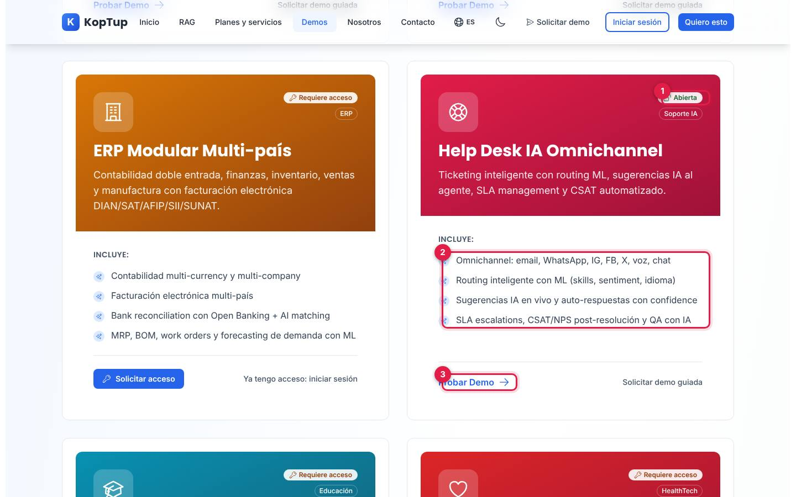

*Tarjeta «Help Desk IA Omnichannel» en el hub, vista por un visitante sin sesión.*

1. Insignia **Abierta** (junto a «Soporte IA»).
2. Lo que **Incluye** según la tarjeta (ver la limitación 3).
3. **Probar Demo** abre `/demo/helpdesk-ia`; a la derecha, **Solicitar demo guiada** abre `/solicitar-demo?demos=helpdesk-ia`.

- **Cómo se solicita:** no hace falta solicitarla. Para verla con sus propios canales y artículos, el visitante usa **Solicitar demo guiada** (en la tarjeta o en el bloque azul al final de la demo).
- **Cómo la controla el admin:** el modo sale del catálogo del servidor (allí se llama «Mesa de ayuda con IA») y se cambia en **Admin › Catálogo de demos** (`/admin/catalogo-demos`). Si se pasa a «Con solicitud» o «Solo por invitación», los visitantes verán la pantalla de acceso y los accesos se conceden en **Admin › Solicitudes de demo** y **Admin › Accesos a demos**; si se desactiva, el visitante ve que está en mantenimiento y el equipo sigue entrando. Si el backend no responde, la demo sigue abierta (así está en la tabla de respaldo), pero «Redactar con IA» muestra un error de conexión. Detalle en el [Manual del administrador](Doc-06-Manual-del-Administrador.md) y en [Flujos del visitante](Doc-04-Flujos-del-Visitante.md).

---

## Limitaciones conocidas

1. **Solo «Redactar con IA» usa un modelo de IA, aunque la tarjeta del hub promete más.** La tarjeta dice «Routing inteligente con ML», «auto-respuestas con confidence», «QA con IA» y canales «IG, FB, X»; en la demo la clasificación, el sentimiento y la confianza son reglas de palabras clave, no hay QA, ni Instagram ni X (sí correo, chat web, WhatsApp, Messenger, Telegram y llamadas). La demo sí lo aclara en «Qué es real en esta demo».
2. **El primer borrador con IA en cada navegador crea un bot en el servidor, y eso tiene límite.** El servidor permite crear, por defecto, 30 bots nuevos por IP cada hora (es la misma API del [chatbot RAG](Guia-Demo-chatbot.md)). Si se pasa, el panel dice «Hay demasiadas solicitudes en este momento. Espera un minuto y vuelve a intentarlo», aunque la espera puede ser de hasta una hora. Nos pasó al tomar estas capturas después de varias pruebas desde la misma IP; una oficina con muchas personas detrás de la misma conexión podría verlo.
3. **«El mensaje no sale de tu navegador» no aplica a la IA.** La nota de «Simular ticket entrante» es cierta para la clasificación y la asignación, pero al pulsar «Redactar con IA» los mensajes del cliente de ese ticket (también los que escribas tú) se envían al servidor, y al proveedor de IA si hay clave; el servidor guarda esa conversación del bot.
4. **Si el servidor no responde, «Redactar con IA» falla** con «No pudimos conectar con el servidor de IA. Usa las plantillas de la base de conocimiento o inténtalo de nuevo.». El resto de la demo sigue funcionando.
5. **Los cambios viven solo en ese navegador.** Otra persona, otro equipo o una ventana privada ven los datos de ejemplo.
6. **El reloj de la demo solo va hacia adelante.** Avanza mientras la página está abierta y con «+15 min»; si dejas la pestaña abierta un buen rato, los SLA vencen y las prioridades suben solas. La única forma de volver atrás es **Restablecer datos**, que también borra tus tickets, macros y encuestas.
7. **El tiempo vencido salta al subir la prioridad.** Cuando el SLA vence y la prioridad sube, el vencimiento se vuelve a calcular con la política de la nueva prioridad. TCK-1047 (Media, llegó a las 10:12) venció a las 11:12, pero a las 11:15 muestra «SLA vencido hace 33 min» porque ya se mide como Alta (30 min).
8. **La clasificación se equivoca con facilidad.** Depende de palabras clave: un mensaje con palabras de varias áreas, con ironía o con otras palabras para lo mismo puede quedar en el área equivocada; la «confianza» es un puntaje de reglas, no una probabilidad.
9. **Conteos que no coinciden a primera vista.** El filtro de canales dice «Todos 11» (tickets activos) y la bandeja «12 tickets» (incluye el resuelto).
10. **Tres nombres para la misma demo:** «Help Desk IA Omnichannel» en el hub, «Helpdesk con IA» en la página y «Mesa de ayuda con IA» en el catálogo del admin y en el formulario de solicitud.
11. **«Ver Planes y Precios»** del bloque final lleva a `/services#planes-rag`, que abre en los planes RAG y no en los de la mesa de ayuda (están más abajo en la misma página).
