# Guía de la demo: Gestión Humana y Nómina

> Ruta `/demo/hrms` · Modo de acceso: **Con solicitud** · Tipo: **datos de ejemplo** en el navegador, con **IA real** solo en el asistente de políticas (llama al servidor) · Plan del producto: [HRMS](Producto-hrms.md)

**Resumen.** Es el sistema de gestión humana de una empresa ficticia de alimentos, Alimentos Valdeora S.A.S. (planta en Funza, oficina en Bogotá y centro de distribución en Medellín, 186 colaboradores). Muestra el expediente digital, las vacaciones en días hábiles con festivos de Colombia, la selección con puntaje por reglas, los ingresos y retiros con lista de chequeo, la evaluación de desempeño, la nómina quincenal colombiana con aportes, provisiones y asiento contable, la formación obligatoria y una app del colaborador con un asistente que responde con IA a partir del reglamento. Está pensada para gerentes de gestión humana, jefes de nómina y dueños de pymes con personal operativo; se abre solo con un acceso aprobado.

**En esta página:** [Recorrido sugerido](#recorrido-sugerido-demo-comercial-de-5-minutos) · [Pantallas y funciones](#pantallas-y-funciones) · [Qué es real y qué es simulado](#qué-es-real-y-qué-es-simulado) · [Acceso](#acceso) · [Limitaciones conocidas](#limitaciones-conocidas)

*Vista inicial: encabezado con la insignia «Datos de ejemplo», los botones «Ver app del colaborador» y «Restablecer datos», las siete pestañas y los seis indicadores de Inicio.*

> **Sobre las cifras y las capturas.** Los datos se generan con la fecha del día en que abres la demo («Datos al 9 de octubre de 2026» en esta guía), así que las fechas, los vencimientos y algunas cifras cambian según el día. El texto de la respuesta del asistente lo produjo el modelo simulado del entorno de pruebas (por eso empieza con «Respuesta simulada (mock de OpenAI)…»); con la clave real del proveedor lo redacta el modelo. La búsqueda en el reglamento y las fuentes citadas sí son el comportamiento real del servidor.

---

## Recorrido sugerido (demo comercial de 5 minutos)

El guion muestra el ciclo completo: el colaborador pide algo desde su celular, Gestión Humana lo aprueba, se contrata a alguien nuevo, se liquida y se paga la quincena y, al final, el colaborador consulta su desprendible y le pregunta al asistente. Empieza con los datos limpios: si alguien ya usó la demo en ese navegador, pulsa **Restablecer datos** (arriba a la derecha) y confirma.

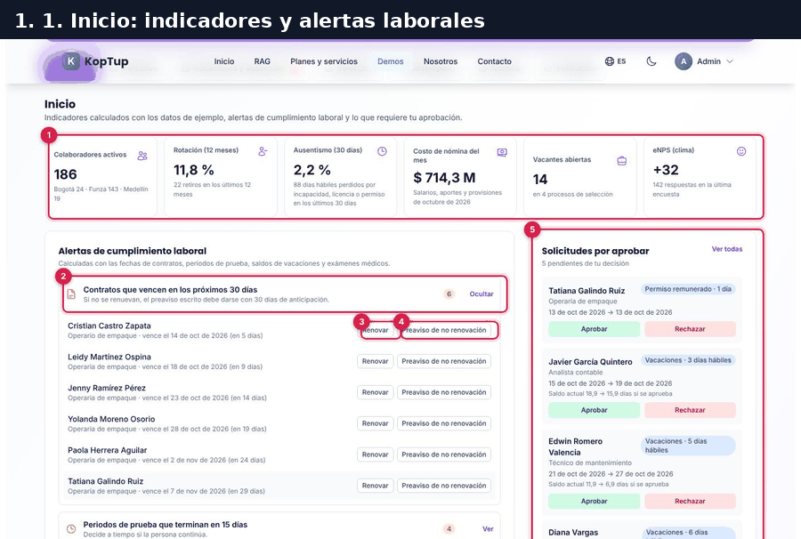

*Recorrido completo en 10 cuadros: indicadores, solicitud desde la app, aprobación, contratación, lista de chequeo del ingreso, nómina, pago, desprendible y asistente.*

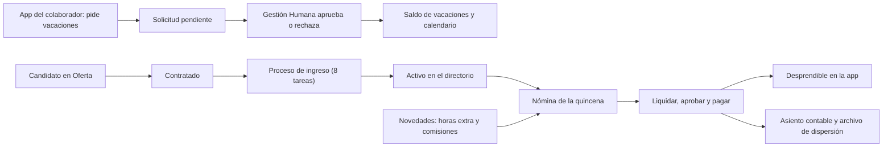

*Cómo se conectan las pestañas: cada flecha es algo que la demo hace por ti al registrar la operación.*

### Paso 1. Inicio: indicadores y alertas de cumplimiento

En la pestaña **Inicio** abre el grupo **Contratos que vencen en los próximos 30 días** (botón **Ver**).

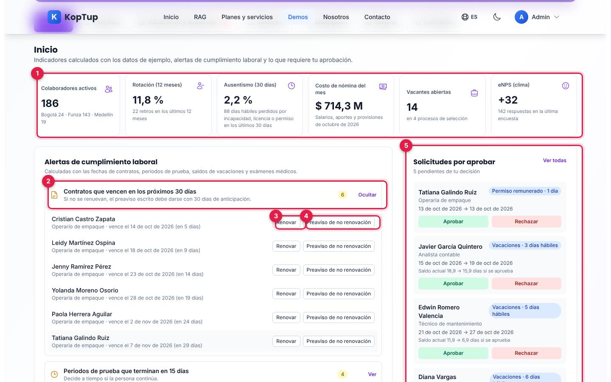

*Indicadores del mes y las seis personas con contrato a término fijo que vence en los próximos 30 días.*

1. **Indicadores**: colaboradores activos (186: Bogotá 24, Funza 143, Medellín 19), rotación de 12 meses (11,8 %, 22 retiros), ausentismo de 30 días (2,2 %), costo de nómina del mes ($ 714,3 M), vacantes abiertas (14 en 4 procesos) y eNPS (+32 con 142 respuestas). Las tarjetas de personas, ausentismo, costo y vacantes llevan a su pestaña.
2. **Alertas de cumplimiento laboral**: contratos por vencer, periodos de prueba que terminan en 15 días, personas con 30 o más días hábiles de vacaciones acumuladas y exámenes médicos ocupacionales vencidos o por vencer. Cada grupo se abre con **Ver** y muestra cuántos casos hay.
3. **Renovar**: extiende el contrato por su mismo plazo y avisa «Contrato de … renovado por N meses más». La persona sale de la alerta.
4. **Preaviso de no renovación**: registra el preaviso (envío simulado) y crea el proceso de retiro en **Selección › Ingresos y retiros**.
5. **Solicitudes por aprobar**: las cuatro más próximas, con **Aprobar** y **Rechazar** ahí mismo, y **Ver todas**.

Más abajo están las **Próximas fechas de pago y reporte** (planilla de aportes, nómina electrónica, prima, dotación, intereses y consignación de cesantías, con «en N días»), los **Próximos cumpleaños** y el **Clima laboral**.

Qué decir: «El sistema le avisa a Gestión Humana lo que vence antes de que sea un problema legal».

### Paso 2. App del colaborador: pedir vacaciones desde el celular

Pulsa **Ver app del colaborador** (arriba). Se abre la app de ejemplo de **Camila Rojas Parra**, operaria de empaque en Funza. Toca **Solicitar vacaciones**.

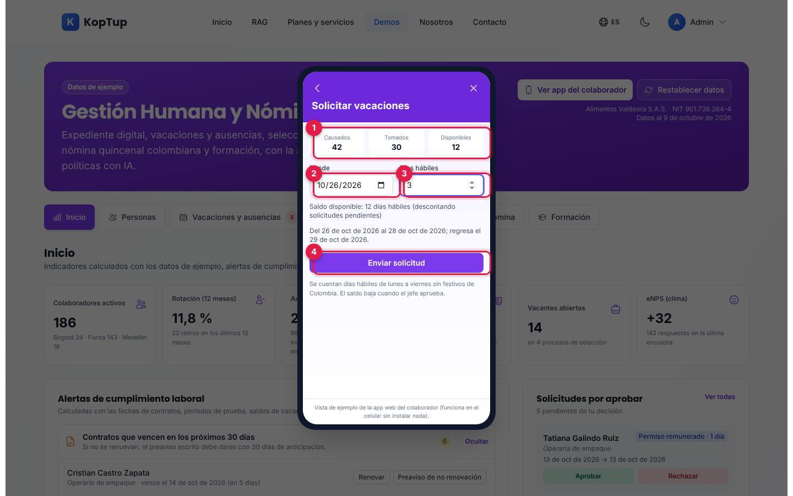

*La app muestra el saldo y calcula la fecha de regreso en días hábiles.*

1. **Saldo**: causados 42, tomados 30, disponibles 12 días hábiles.
2. **Desde**: viene propuesto el primer día hábil después de dos semanas (26 de octubre en la prueba).
3. **Días hábiles**: en la prueba, 3. La app dice «Del 26 de oct de 2026 al 28 de oct de 2026; regresa el 29 de oct de 2026» y recuerda que se cuentan días de lunes a viernes sin festivos de Colombia.
4. **Enviar solicitud**: avisa «Solicitud de Camila Rojas Parra enviada para aprobación» y pasa a **Mis solicitudes**, donde aparece como **Pendiente**.

La app no deja enviar si la fecha es anterior a hoy, si los días no están entre 1 y 30 o si superan el saldo disponible (que ya descuenta las solicitudes pendientes).

### Paso 3. Gestión Humana aprueba la solicitud

Cierra la app y abre **Vacaciones y ausencias**. El contador de la pestaña sube a 6.

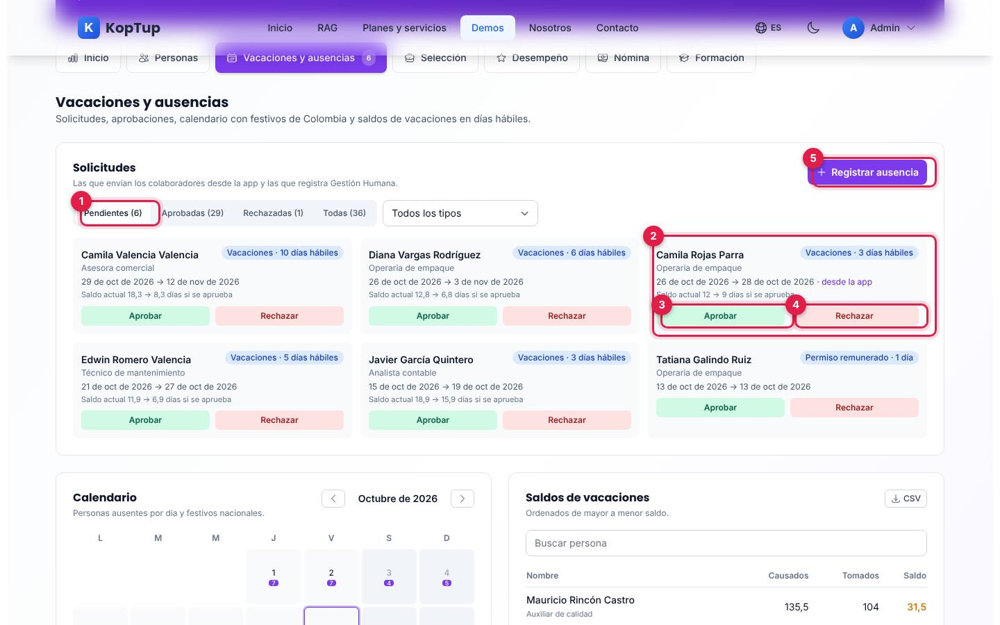

*La solicitud de Camila aparece con la marca «desde la app» y el saldo que le quedará.*

1. **Pendientes (6)**: filtros por estado (pendientes, aprobadas, rechazadas, todas) y por tipo de ausencia.
2. **La solicitud**: tipo y días, fechas, «· desde la app» y «Saldo actual 12 → 9 días si se aprueba».
3. **Aprobar**: avisa «Vacaciones de Camila Rojas Parra aprobadas. Nuevo saldo: 9 días hábiles». El saldo, el calendario y la app de Camila se actualizan.
4. **Rechazar**: pide un motivo (temporada alta de producción, cruce con otras ausencias, saldo insuficiente u otro). «El colaborador verá el motivo en su app y su saldo no cambia».
5. **Registrar ausencia**: Gestión Humana registra vacaciones, permisos, licencias no remuneradas o incapacidades (estas quedan aprobadas de inmediato).

Qué decir: «Nadie llena un formato en papel: el colaborador pide desde el celular y el jefe aprueba con un clic, con el saldo a la vista».

### Paso 4. Selección: contratar desde la oferta

Abre **Selección**. Arriba están las cuatro vacantes con sus cupos; debajo, los candidatos por etapa.

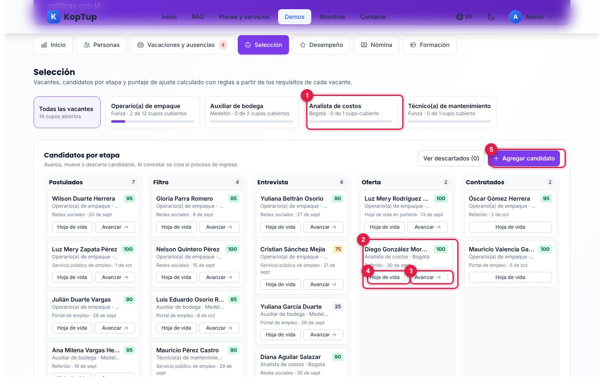

*Vacantes y candidatos en cinco columnas: Postulados, Filtro, Entrevista, Oferta y Contratados.*

1. **Vacante**: «Analista de costos · Bogotá · 0 de 1 cupo cubierto». Un clic filtra los candidatos de esa vacante.
2. **Candidato**: Diego González Moreno, con puntaje de ajuste **100** (verde alto, ámbar medio, gris bajo).
3. **Avanzar**: lo pasa a la siguiente etapa. Desde **Oferta** pasa a **Contratados** y avisa «Diego González Moreno contratado(a): se creó su proceso de ingreso».
4. **Hoja de vida**: muestra cómo se calculó el puntaje (experiencia 40/40 con 6 años frente a un mínimo de 3; formación 25/25; disponibilidad para turnos 20/20, «no se exige»; distancia 15/15 a 8 km), permite **Mover a…** cualquier etapa, **Descartar** y **Descargar hoja de vida (PDF)**.
5. **Agregar candidato**: nombre, vacante, celular, fuente, formación, años de experiencia, distancia y turnos; entra a Postulados con su puntaje.

El puntaje «se calcula con reglas transparentes: experiencia (40), formación (25), disponibilidad para turnos (20) y distancia a la sede (15). No es IA».

Baja a **Ingresos y retiros**: aparece el proceso de ingreso de Diego.

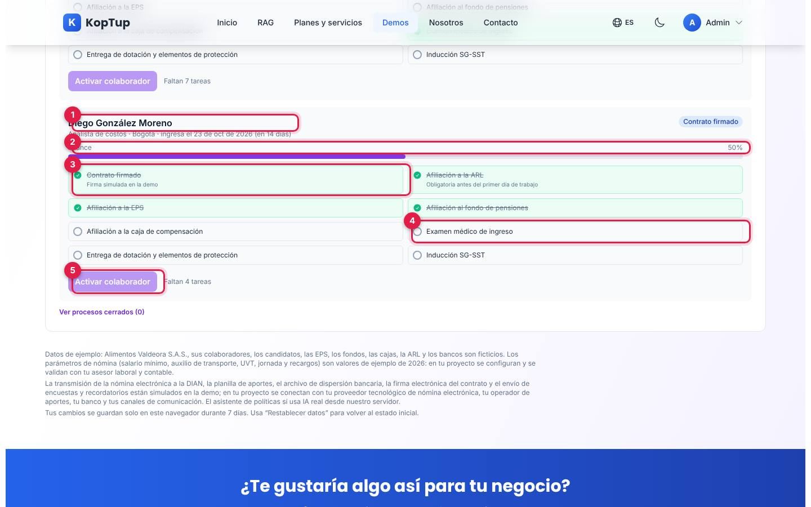

*El proceso de ingreso de Diego con cuatro de ocho tareas hechas.*

1. **Proceso de ingreso**: «Analista de costos · Bogotá · ingresa el 23 de oct de 2026 (en 14 días)».
2. **Avance**: porcentaje de tareas hechas (50 % en la captura).
3. **Contrato firmado**: la primera tarea dice «Enviar contrato a firma electrónica»; al marcarla avisa «Contrato de … firmado electrónicamente (simulado)» y la insignia pasa a «Contrato firmado».
4. **Tareas pendientes**: afiliaciones a ARL («obligatoria antes del primer día de trabajo»), EPS, pensión y caja, examen médico de ingreso, dotación y elementos de protección e inducción SG-SST. Cada clic marca o desmarca.
5. **Activar colaborador**: se habilita con las 8 tareas; avisa «… ya aparece en el directorio y en la nómina». En **Personas** el total pasa a 187.

Qué decir: «Del candidato al primer día sin hojas de cálculo: el puntaje es explicable y el ingreso tiene su lista de chequeo legal».

### Paso 5. Nómina: novedades, liquidación, aprobación y pago

Abre **Nómina**. La quincena en curso es la «1.ª quincena de octubre de 2026 (del 1 al 15)», con pago el 15 de octubre para 186 colaboradores (Diego no entra porque ingresa después del 15). En **Novedades de la quincena** elige a Javier García Quintero, **Hora extra diurna (+25 %)**, 6 horas, y pulsa **Agregar** («Novedad agregada a Javier García Quintero: $ 149.643»).

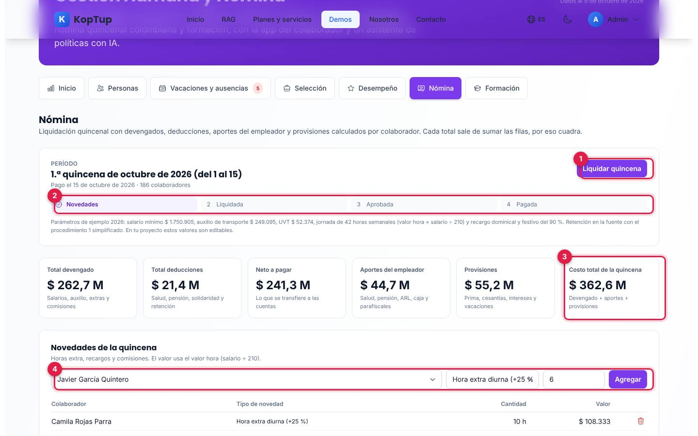

*Encabezado de la quincena, sus cuatro estados, los seis totales y el formulario de novedades.*

1. **Liquidar quincena**: avisa «Quincena liquidada: 186 colaboradores, neto a pagar $ 241.300.662». Luego aparecen **Volver a borrador** y **Aprobar nómina**; después de aprobar, **Pagar: descargar archivo de dispersión**, que descarga `dispersion-2026-10-Q1.csv` y deja la insignia **Pagada**.
2. **Estados**: Novedades → Liquidada → Aprobada → Pagada.
3. **Totales**: devengado ($ 262,7 M), deducciones ($ 21,4 M), neto ($ 241,3 M), aportes del empleador ($ 44,7 M), provisiones ($ 55,2 M) y **costo total de la quincena** ($ 362,6 M).
4. **Novedades**: colaborador, tipo (hora extra diurna o nocturna, recargo nocturno, recargo dominical o festivo, o comisión en pesos) y cantidad. El valor usa el valor hora (salario ÷ 210). Al liquidar, el formulario se bloquea hasta volver a borrador.

Debajo están el **Resumen por concepto** (con la comprobación «devengado − deducciones = neto»), el **Detalle por colaborador** (con buscador, **Desprendible** en PDF cuando la quincena está liquidada y exportación CSV) y el **Asiento contable de la quincena** con cuentas del PUC («Débitos = créditos: el asiento cuadra»; en la prueba, sumas iguales de $ 362.623.904), que se descarga en CSV.

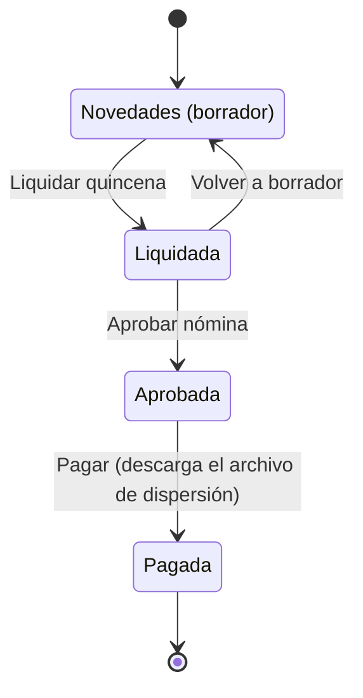

*Estados de la quincena. Solo en borrador se pueden agregar o quitar novedades.*

Qué decir: «La nómina cuadra sola: cada total es la suma de las filas, y el asiento contable sale listo para el software contable».

### Paso 6. El colaborador ve su desprendible y le pregunta al asistente

Vuelve a **Ver app del colaborador**. En **Mi desprendible** ya aparece la quincena actual («Quincena actual, ya pagada.»), con devengado, deducciones, neto y **Descargar PDF**. Antes de pagar, la app muestra la última quincena pagada.

Luego abre **Pregúntale a Gestión Humana** y toca la sugerencia «¿Cuántos días de licencia de luto tengo?».

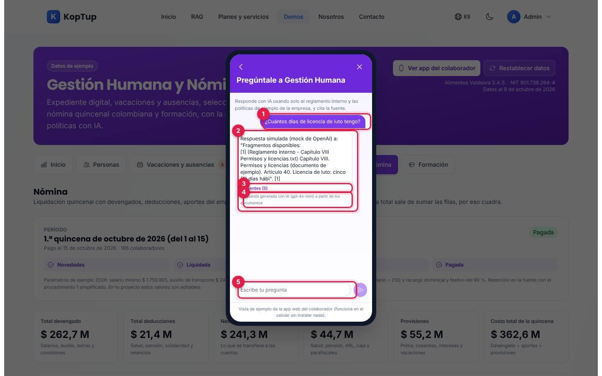

*La pregunta, la respuesta, sus fuentes y el aviso de cómo se generó.*

1. **Tu pregunta**. También hay sugerencias: días de vacaciones, anticipación para pedirlas, licencia de luto y fechas de pago de nómina. Se puede escribir hasta 300 caracteres.
2. **Respuesta**: el servidor busca en los cinco documentos de ejemplo (capítulos de vacaciones, permisos y licencias, y jornada y horas extra del reglamento, y las políticas de certificados y de beneficios) y responde citando la fuente. El artículo encontrado en la prueba fue el 40: «Licencia de luto: cinco (5) días hábiles remunerados… (Ley 1280 de 2009)».
3. **Fuentes (5)**: al abrirlo muestra los fragmentos usados, con el nombre del documento.
4. **Cómo se generó**: «Respuesta generada con IA (modelo) a partir de los documentos»; si el servidor no tiene clave del proveedor, «Modo sin IA… muestra los fragmentos encontrados»; si el proveedor falla, también lo dice.
5. **Escribe tu pregunta**.

Qué decir: «Las preguntas repetidas a Gestión Humana las responde el asistente, con el artículo del reglamento como respaldo».

---

## Pantallas y funciones

### Encabezado

| Elemento | Qué hace |
|---|---|
| **Datos de ejemplo** | Insignia; al pasar el mouse dice que la empresa, las personas, el NIT, las entidades y las cifras son inventados. |
| **Ver app del colaborador** | Abre la app de ejemplo de Camila Rojas Parra en un marco de celular (ver [App del colaborador](#app-del-colaborador)). |
| **Restablecer datos** | Pide confirmación, borra los cambios de este navegador y genera los datos de nuevo con la fecha de hoy. |
| **Empresa y fecha** | «Alimentos Valdeora S.A.S. · NIT 901.738.264-4» y «Datos al …». |
| **Pestañas** | Inicio, Personas, Vacaciones y ausencias (con el número de pendientes), Selección, Desempeño, Nómina y Formación. Se desplazan de lado en el celular. |

### Inicio

Ver el [paso 1](#paso-1-inicio-indicadores-y-alertas-de-cumplimiento). Además:

- **Solicitudes por aprobar**: las cuatro más próximas y «y N más en Vacaciones y ausencias».
- **Programar vacaciones** (en la alerta de vacaciones acumuladas) abre el formulario de ausencia para esa persona; **Programar examen** marca el examen para dentro de 7 días («aviso simulado») y deja la insignia «Programado para el …».
- **Próximos cumpleaños**: hoy y los próximos 14 días; cada nombre abre el perfil.
- **Clima laboral**: resultado de la última encuesta de pulso (en la prueba, eNPS +32 con 142 de 186 respuestas), la barra de promotores, neutros y detractores y la evolución del eNPS. **Lanzar encuesta** elige la pregunta (eNPS, carga de trabajo o seguridad) y el público (toda la empresa o una sede); el envío es simulado y **Simular respuestas** cierra la encuesta con respuestas generadas para ver cómo cambia el indicador.

### Personas

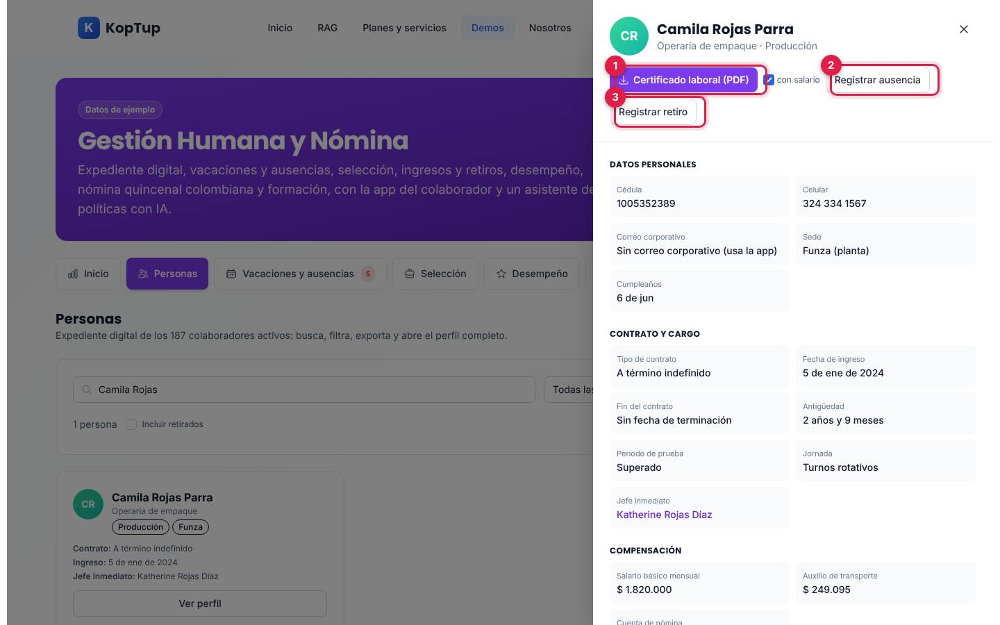

*Directorio filtrado por «Camila Rojas» y su perfil abierto en el panel lateral.*

- **Directorio**: buscador por nombre, cédula o cargo; filtros por área, sede y tipo de contrato; **Incluir retirados**; **Exportar CSV**. Muestra 12 tarjetas por página con cargo, área, sede, contrato, fecha de ingreso, jefe inmediato y la marca «Ausente hoy» cuando aplica.
- **Organigrama**: se arma con el jefe inmediato de cada persona (gerente general y cinco directores o jefes). Cada nivel se despliega y **Equipo (N)** filtra el directorio por ese equipo.
- **Perfil** (panel lateral, numerado en la captura):
  1. **Certificado laboral (PDF)**, con o sin salario (descarga `certificado-laboral-<nombre>.pdf`, marcado como documento de ejemplo).
  2. **Registrar ausencia** para esa persona.
  3. **Registrar retiro**: motivo (renuncia, vencimiento del plazo, despido sin justa causa o mutuo acuerdo) y último día. Crea el proceso de retiro con la liquidación estimada.
  - Además: datos personales, contrato y cargo (antigüedad, periodo de prueba, jornada, jefe inmediato), compensación (salario, auxilio de transporte, cuenta de nómina enmascarada), seguridad social (EPS, fondo, ARL con clase de riesgo, caja), vacaciones (causados, tomados y saldo, con sus solicitudes), documentos del expediente en PDF (resumen del contrato, afiliaciones y concepto del examen médico), desempeño y formación asignada.

### Vacaciones y ausencias

Ver el [paso 3](#paso-3-gestión-humana-aprueba-la-solicitud). Además de las solicitudes:

- **Calendario** mensual con el número de personas ausentes por día y los festivos nacionales en rojo (por ejemplo, el 12 de octubre de 2026). Al elegir un día lista quién está ausente, por qué y hasta cuándo. Se navega mes a mes.
- **Saldos de vacaciones**: causados, tomados y saldo por persona, de mayor a menor, con buscador, paginación y CSV. Regla: «15 días hábiles por año de servicio, proporcionales desde la fecha de ingreso. Saldo = causados − tomados». Los aprendices no acumulan vacaciones en la demo.

### Selección

Ver el [paso 4](#paso-4-selección-contratar-desde-la-oferta). Además:

- **Ver descartados (N)** muestra los candidatos descartados (sin botones para moverlos).
- Si una vacante ya tiene todos sus cupos, no deja contratar más: «Esta vacante ya tiene todos sus cupos cubiertos».
- **Ingresos y retiros** alterna entre **Ingresos** y **Retiros** y tiene **Ver procesos cerrados**. Un retiro trae su lista de chequeo (carta o preaviso, liquidación aprobada, paz y salvo, examen de egreso, **Generar certificado laboral (PDF)** y retiro de seguridad social) y la **Liquidación estimada**: salario y auxilio pendientes, cesantías, intereses, prima proporcional, vacaciones no disfrutadas e indemnización (solo para despido sin justa causa en contrato indefinido), con la nota «Cálculo simplificado de ejemplo». **Finalizar retiro** saca a la persona del directorio y la suma a la rotación.

### Desempeño

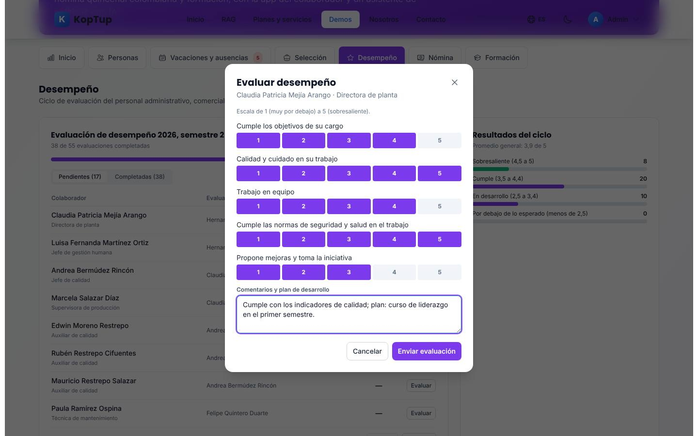

*Formulario de evaluación con cinco competencias en escala de 1 a 5 y el comentario con el plan de desarrollo.*

- **Evaluación de desempeño 2026, semestre 2**: 38 de 55 evaluaciones completadas al inicio. Solo participan los cargos administrativos, comerciales, técnicos y de mando (no los operarios de planta). Filtro **Pendientes / Completadas** y **CSV**.
- **Evaluar**: cinco competencias (cumple objetivos, calidad, trabajo en equipo, seguridad y salud en el trabajo, iniciativa) y comentarios. **Enviar evaluación** se habilita al calificar todo; muestra el promedio y pasa a Completadas. **Ver** abre una completada en modo lectura.
- **Resultados del ciclo**: promedio general (3,9 de 5) y personas por banda (sobresaliente, cumple, en desarrollo, por debajo de lo esperado).
- **Objetivos de la empresa**: rotación y cumplimiento del plan de formación se calculan con los datos de la demo («Calculado»); OEE, mermas y accidentes son «Dato de ejemplo».
- **Plan de sucesión**: cuatro personas con el cargo al que podrían llegar y si están listas ahora, en un año o en dos o más (ejemplo fijo).

### Nómina

Ver el [paso 5](#paso-5-nómina-novedades-liquidación-aprobación-y-pago). Al final de la pestaña están las obligaciones del mes anterior y los beneficios.

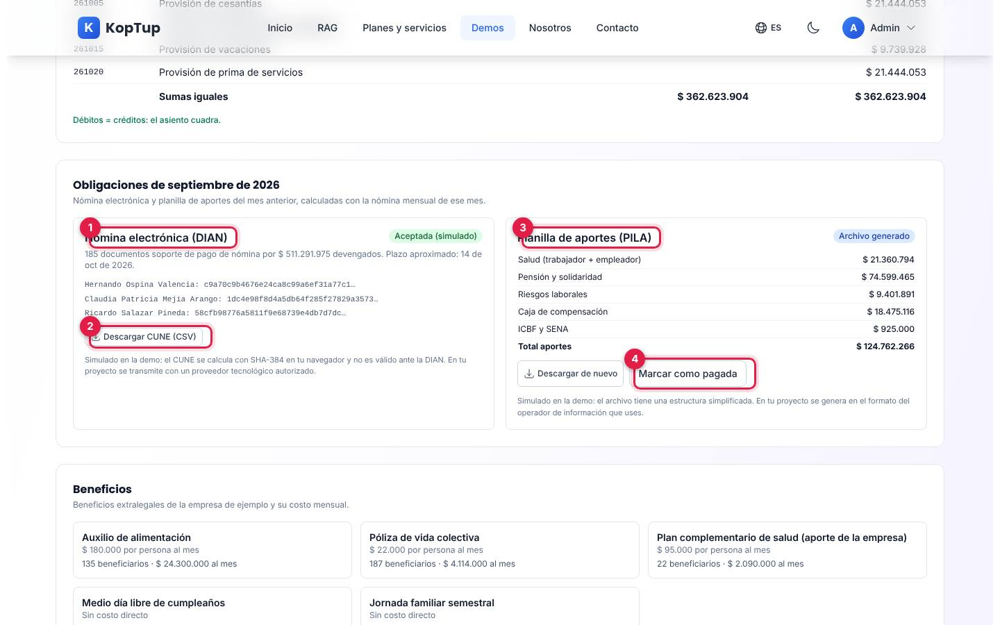

*Obligaciones de septiembre de 2026 después de transmitir la nómina electrónica y generar la planilla.*

1. **Nómina electrónica (DIAN)**: «185 documentos soporte de pago de nómina por $ 511.291.975 devengados» con el plazo aproximado. **Transmitir a la DIAN (simulado)** pasa a «Aceptada (simulado)» y muestra un CUNE por persona.
2. **Descargar CUNE (CSV)**: colaborador, cédula, neto y CUNE. La pantalla aclara que «el CUNE se calcula con SHA-384 en tu navegador y no es válido ante la DIAN».
3. **Planilla de aportes (PILA)**: salud, pensión y solidaridad, riesgos laborales, caja e ICBF y SENA (total $ 124.762.266 en la prueba). **Generar archivo de aportes** descarga `aportes-2026-09.csv`, un archivo «de EJEMPLO con estructura simplificada; no es el formato oficial».
4. **Marcar como pagada**: estado «Pagada (simulado)». **Descargar de nuevo** repite la descarga.

**Beneficios**: auxilio de alimentación, póliza de vida colectiva, plan complementario de salud, medio día libre de cumpleaños y jornada familiar, con su costo por persona, beneficiarios y costo mensual (valores de ejemplo).

### Formación

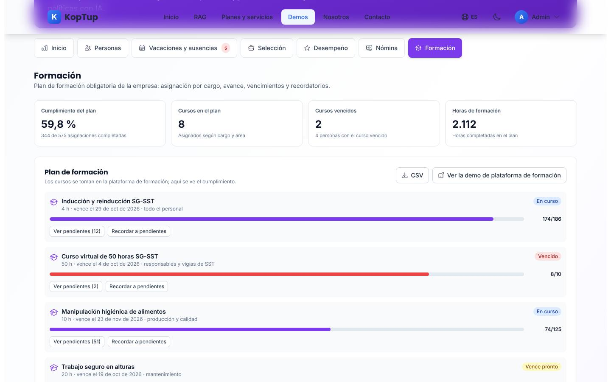

*Cumplimiento del plan y los primeros cursos con su avance y vencimiento.*

- **Indicadores**: cumplimiento del plan (59,8 %, 344 de 575 asignaciones), cursos en el plan (8), cursos vencidos (2) y horas de formación completadas (2.112).
- **Plan de formación**: ocho cursos obligatorios (inducción SG-SST, curso de 50 horas SG-SST, manipulación de alimentos, trabajo en alturas, seguridad vial, SAGRILAFT, protección de datos y prevención del acoso laboral), cada uno con horas, vencimiento, público, avance y estado (En curso, Vence pronto, Vencido, Completo).
- **Ver pendientes (N)** lista quién falta; **Recordar a pendientes** avisa «Recordatorio enviado a N personas (envío simulado)» y deja la marca «Recordatorio enviado hoy (simulado)».
- **CSV** y **Ver la demo de plataforma de formación**, que lleva a `/demo/lms` (ver su [guía](Guia-Demo-lms.md)).

### App del colaborador

Se abre con **Ver app del colaborador** y se cierra con la X o con Escape. Es la vista de Camila Rojas Parra.

| Opción | Qué hace |
|---|---|
| **Solicitar vacaciones** | Saldo (causados, tomados, disponibles) y formulario en días hábiles (ver el [paso 2](#paso-2-app-del-colaborador-pedir-vacaciones-desde-el-celular)). |
| **Mis solicitudes** | Sus solicitudes con estado Pendiente, Aprobada o Rechazada. |
| **Mi desprendible** | Última quincena pagada (o la actual si ya se pagó) y **Descargar PDF**. |
| **Mi certificado laboral** | Con o sin salario, en PDF. |
| **Mis cursos** | Sus cursos con estado y vencimiento; «Se toma en la plataforma de formación». |
| **Pregúntale a Gestión Humana** | Asistente con IA (ver el [paso 6](#paso-6-el-colaborador-ve-su-desprendible-y-le-pregunta-al-asistente)). |
| **Mis datos** | Cédula, cargo, sede, ingreso, EPS, fondo y cuenta de nómina enmascarada. «Los cambios de datos se solicitan a Gestión Humana». |

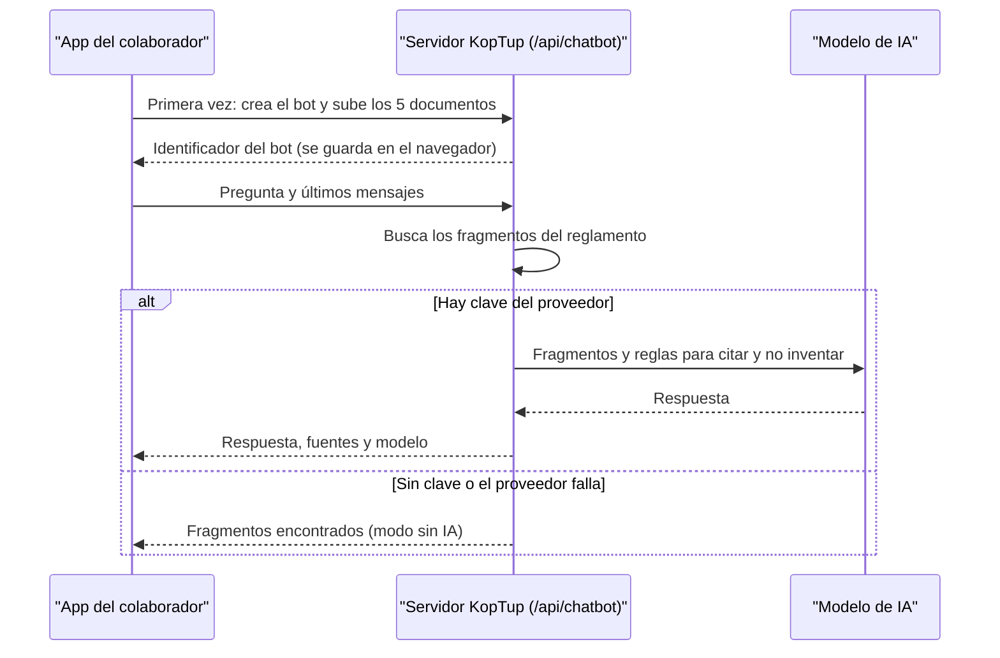

*Cómo responde el asistente: usa las mismas rutas del chatbot RAG del sitio.*

### En el celular

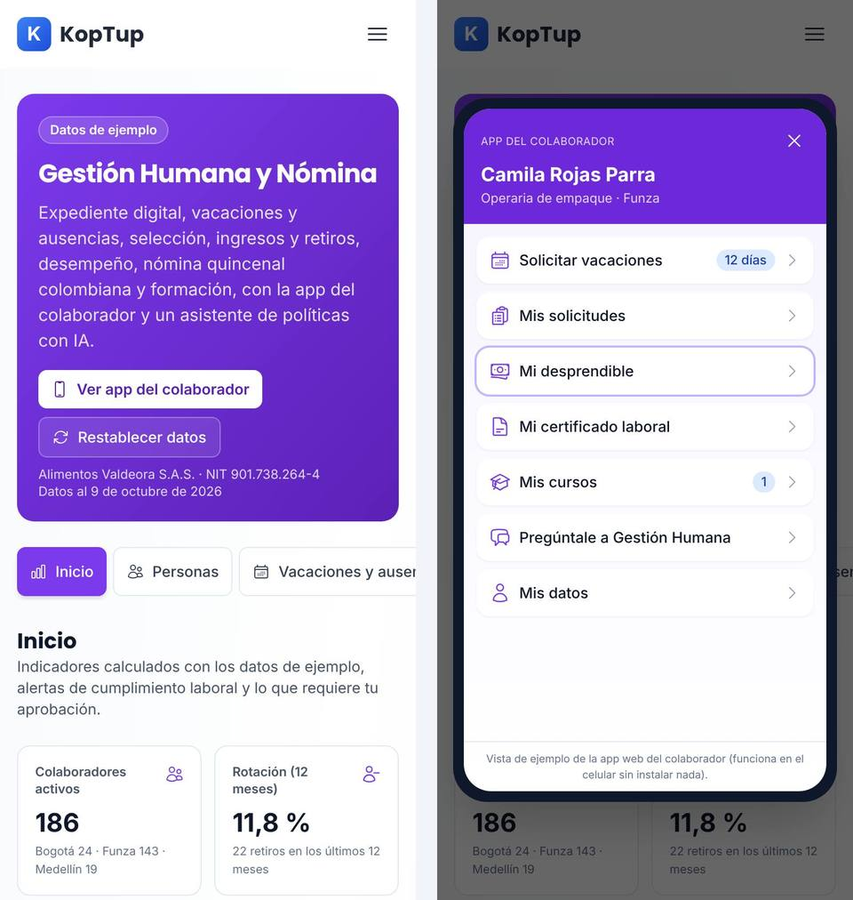

*La demo en un teléfono de 390 px: el encabezado se apila, las pestañas se desplazan de lado y la app del colaborador ocupa casi toda la pantalla.*

En el teléfono los indicadores van de dos en dos, los botones del encabezado se apilan y las tablas anchas (nómina, asiento, saldos) se desplazan horizontalmente. La página no se desborda a lo ancho.

---

## Qué es real y qué es simulado

| Parte | Real o simulado | Detalle |
|---|---|---|
| Empresa, personas, candidatos, EPS, fondos, cajas, ARL y bancos | **Datos de ejemplo** | Alimentos Valdeora S.A.S. es ficticia; los datos se generan con la fecha del día. |
| Saldos de vacaciones, días hábiles y festivos de Colombia | **Real (en el navegador)** | 15 días hábiles por año, proporcionales; el calendario calcula los festivos. |
| Liquidación de la quincena, aportes, provisiones, retención y asiento | **Real (en el navegador), con parámetros de ejemplo 2026** | Salario mínimo, auxilio, UVT, jornada y recargos son valores de ejemplo; retención con un procedimiento 1 simplificado. |
| Puntaje de candidatos y alertas laborales | **Reglas, no IA** | Lo dice la propia pantalla. |
| Asistente «Pregúntale a Gestión Humana» | **IA real** | Llama al servidor de KopTup (`/api/chatbot`); sin clave del proveedor responde con los fragmentos y lo dice. |
| Nómina electrónica, CUNE y planilla de aportes | **Simulados** | El CUNE se calcula en el navegador y no es válido ante la DIAN; el archivo de aportes no es el formato oficial. |
| Archivo de dispersión bancaria | **Ejemplo** | CSV con formato propio de la demo («cada banco define su propio formato»). |
| Firma electrónica del contrato, encuestas, recordatorios y avisos | **Simulados** | No se envía nada. |
| Certificados, desprendibles, hojas de vida y documentos del expediente | **PDF real de ejemplo** | Se generan en el navegador con la marca «DOCUMENTO DE EJEMPLO… Sin validez». |
| Dónde se guardan tus cambios | **Solo en este navegador** | `localStorage` (clave `koptup.hrms.state`) durante 7 días; después se regeneran los datos. |

---

## Acceso

**Cómo lo ve un visitante.** La demo aparece en `/demo` con la insignia «Requiere acceso» y los botones **Solicitar acceso** y **Ya tengo acceso: iniciar sesión**. Si alguien abre `/demo/hrms` sin sesión, la web muestra en la misma dirección la pantalla de acceso:

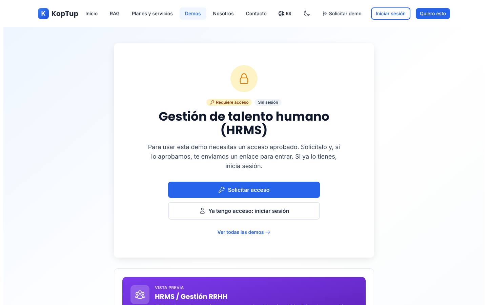

*Lo que ve un visitante sin sesión: «Requiere acceso», «Sin sesión» y los botones para pedir la demo o iniciar sesión. Debajo, la vista previa con el texto del catálogo.*

- **Solicitar acceso** abre `/solicitar-demo?demos=hrms` con la demo ya elegida.
- **Ya tengo acceso: iniciar sesión** lleva a `/login?redirect=%2Fdemo%2Fhrms` y, al entrar, vuelve a la demo.
- **Ver todas las demos** vuelve a `/demo`.
- Con sesión pero sin acceso, la misma pantalla dice «Sin acceso»; si el acceso venció o fue retirado, ofrece pedir más tiempo o solicitarlo de nuevo.

**Cómo se concede.** La solicitud llega a **Admin › Solicitudes de demo** y la aprueban los roles **admin** o **sales**. Al aprobar se crea o se reutiliza la cuenta del prospecto, el acceso dura 14 días por defecto (se extiende o se revoca en **Admin › Accesos a demos**) y la persona recibe un correo con la decisión (con el enlace de activación si su cuenta es nueva). El equipo de KopTup (admin, manager, sales y developer) abre la demo sin solicitud. El modo de acceso se cambia en **Admin › Catálogo de demos**. Detalle en el [Manual del administrador](Doc-06-Manual-del-Administrador.md) y en [Flujos del visitante](Doc-04-Flujos-del-Visitante.md).

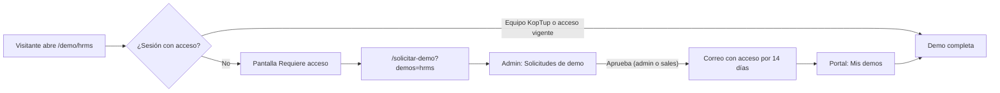

*Camino de un visitante hasta la demo.*

---

## Limitaciones conocidas

En el recorrido no encontramos botones que no hagan nada ni errores en la consola (una prueba automática hizo clic en los 44 controles visibles de la vista inicial). Lo que sí conviene saber:

1. **La vista previa promete más de lo que hace la demo.** La tarjeta del hub y la pantalla de acceso usan el texto del catálogo: «ATS con scoring CV IA y screening calls automáticas», «Payroll multi-país con compliance laboral (CO, MX, AR)» y «AI: retención predicha, eNPS y salary benchmarks». La demo trabaja solo con Colombia, el puntaje de candidatos es por reglas («No es IA»), no hace llamadas de preselección y no predice retención ni compara salarios. La IA está solo en el asistente de políticas.
2. **Los cambios viven solo en el navegador**, por 7 días. Si el prospecto cambia de equipo o de navegador, o borra los datos del sitio, vuelve a los datos de ejemplo. No hay espacio compartido con el vendedor.
3. **Una sola quincena.** La nómina trabaja con la quincena en curso; después de **Pagada** no se puede abrir la siguiente. Para repetir el guion hay que **Restablecer datos**.
4. **DIAN, planilla de aportes, banco, firma electrónica y mensajes simulados**, como lo dicen las pantallas.
5. **Las aprobaciones no dependen de roles**: quien usa la demo aprueba como jefe y como Gestión Humana a la vez. La app del colaborador es siempre la de Camila Rojas Parra.
6. **Las personas contratadas en la demo no reciben cursos.** Al activar a un colaborador nuevo, el total de Personas sube (187), pero el plan de formación sigue contando 186 en la inducción.
7. **Un candidato descartado no se puede recuperar**: en «Ver descartados» se ve, pero sin botones para devolverlo al proceso.
8. **El enlace «Ver la demo de plataforma de formación»** lleva a `/demo/lms`, que tiene su propio acceso: un prospecto con acceso solo a esta demo verá ahí la pantalla «Requiere acceso».
9. **Lista larga de colaboradores** en el formulario de novedades de nómina: es un desplegable con todas las personas (sin buscador).
