# Guía de la demo: Generador de contenido para LinkedIn con IA

> Ruta `/demo/linkedin-ads` · Modo de acceso: **Con solicitud** · Tipo: **IA real** (OpenAI desde el servidor de KopTup, con respaldo de plantillas locales) · Plan del producto: [Motor de contenido para LinkedIn (herramienta interna)](Demo-linkedin-ads.md)

**Resumen.** Es la herramienta interna con la que KopTup prepara su contenido de LinkedIn sobre sus propias demos, mostrada como vitrina («Así usamos IA para nuestro contenido en LinkedIn»). Tiene cuatro pestañas: **Resumen**, **Calendario 30 días**, **Generador de posts** (post, texto de anuncio y carrusel, con IA o con plantillas) y **Capturas y video** (imagen 1200×627, foto o video de una demo). **No publica en LinkedIn**: copias el texto y lo publicas tú. Sirve para mostrarle a una agencia o a un equipo de marketing B2B cómo sería un motor de contenido con IA, y al equipo de KopTup para su propio plan editorial.

**Contenido:** [Recorrido sugerido](#recorrido-sugerido-demo-comercial-de-5-minutos) · [Pantallas y funciones](#pantallas-y-funciones) · [Qué es real y qué es simulado](#qué-es-real-y-qué-es-simulado) · [Acceso](#acceso) · [Limitaciones conocidas](#limitaciones-conocidas)

*Pestaña «Resumen» vista por una cuenta con acceso: portada «Uso interno · Marketing», cifras del catálogo y los tres pasos del flujo.*

---

## Recorrido sugerido (demo comercial de 5 minutos)

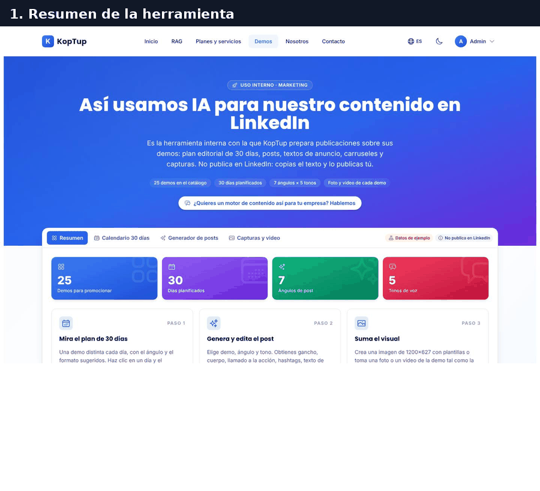

*Del calendario al post con imagen, en siete cuadros.*

### Paso 1 · Presenta la herramienta (≈ 30 s)

Empieza en **Resumen** (captura de arriba). Las tarjetas muestran **25** demos para promocionar, **30** días planificados, **7** ángulos de post y **5** tonos de voz. Debajo están los tres pasos (clic en cada tarjeta abre su pestaña), el «Cómo se usa (flujo sugerido)» en cinco puntos y el cuadro **«Qué hace y qué no hace esta demo»**. Los rótulos «Datos de ejemplo» y «No publica en LinkedIn» quedan fijos junto a las pestañas.

**Qué decir:** «Es la herramienta que usamos nosotros; no publica por ti y no inventa resultados».

### Paso 2 · Elige un día del calendario (≈ 45 s)

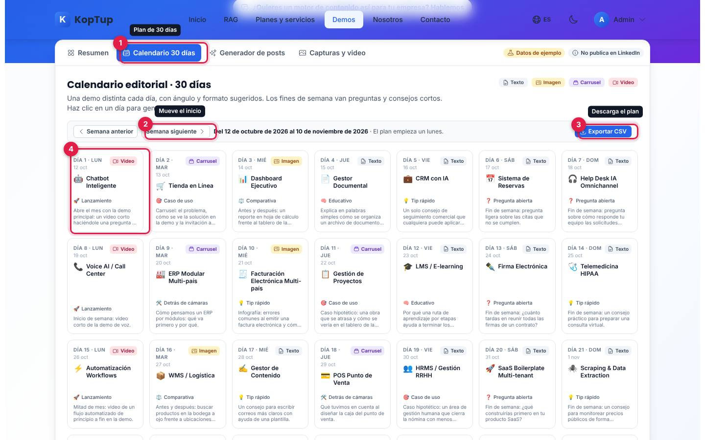

*Calendario editorial: una demo distinta cada día, con formato, ángulo y nota.*

1. **Calendario 30 días**: el plan empieza un lunes; entre semana va contenido más elaborado (video, carrusel, imagen) y los fines de semana, preguntas y consejos cortos en texto.
2. **Semana anterior / Semana siguiente**: mueve la fecha de inicio de a una semana (se recuerda en este navegador).
3. **Exportar CSV**: descarga el plan con día, fecha, demo, ángulo, formato, nota y enlace.
4. **Clic en un día** (aquí, el Día 1): abre el generador con la demo y el ángulo de ese día.

### Paso 3 · Genera el post (≈ 1 min)

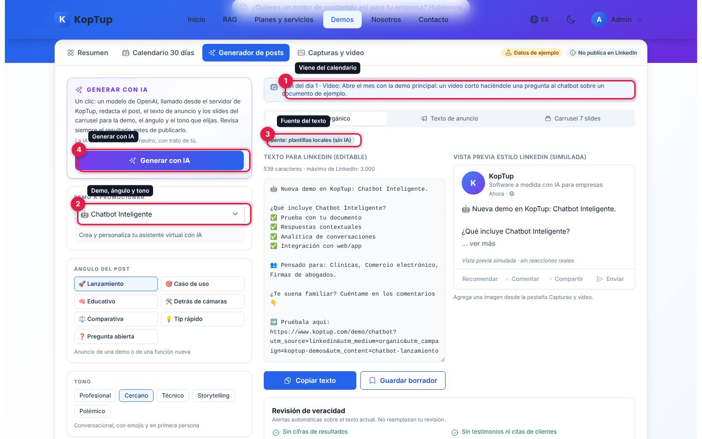

*Generador cargado con el plan del Día 1 (Chatbot, Lanzamiento, video).*

1. **Plan del día**: recuerda el formato y la nota estratégica que trae el calendario.
2. **Demo, ángulo y tono**: 25 demos del catálogo; 7 ángulos (Lanzamiento, Caso de uso, Educativo, Detrás de cámaras, Comparativa, Tip rápido, Pregunta abierta); 5 tonos (Profesional, Cercano, Técnico, Storytelling, Polémico). Más abajo: «Generar otra versión» (cambia el gancho y el cierre) y la casilla «Agregar UTM a los enlaces».
3. **Fuente del texto**: «Fuente: plantillas locales (sin IA)», «Fuente: IA (modelo)» o «Editado por ti».
4. **Generar con IA**: un clic pide al servidor el post, el texto de anuncio y el carrusel juntos (ver [Generar con IA](#generar-con-ia)).

### Paso 4 · Revisa y guarda (≈ 1 min)

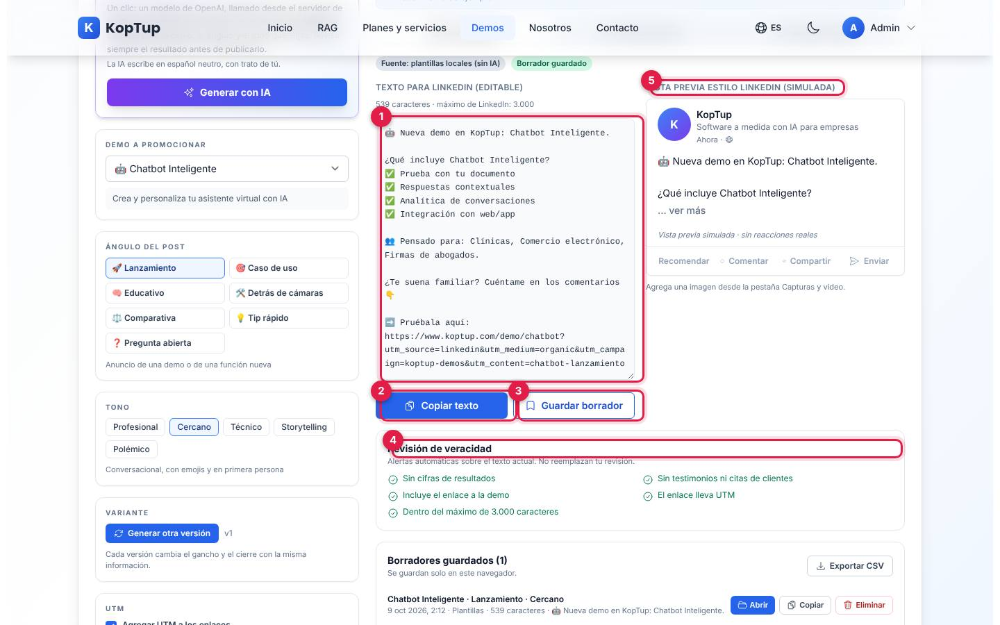

*Post orgánico con su revisión automática y el borrador guardado.*

1. **Texto para LinkedIn (editable)**: con el conteo de caracteres frente al máximo de 3.000. Si lo editas, la fuente pasa a «Editado por ti» y aparece «Restablecer».
2. **Copiar texto**: lo copia al portapapeles para pegarlo en LinkedIn.
3. **Guardar borrador**: lo guarda en este navegador (aparece en «Borradores guardados»).
4. **Revisión de veracidad**: alertas automáticas sobre el texto actual: cifras de resultados, testimonios o citas de clientes, enlace a la demo, UTM y largo. No reemplazan la revisión humana.
5. **Vista previa estilo LinkedIn (simulada)**: así se vería el post; «… ver más» lo despliega. No hay reacciones reales.

### Paso 5 · Suma el visual (≈ 1 min 30 s)

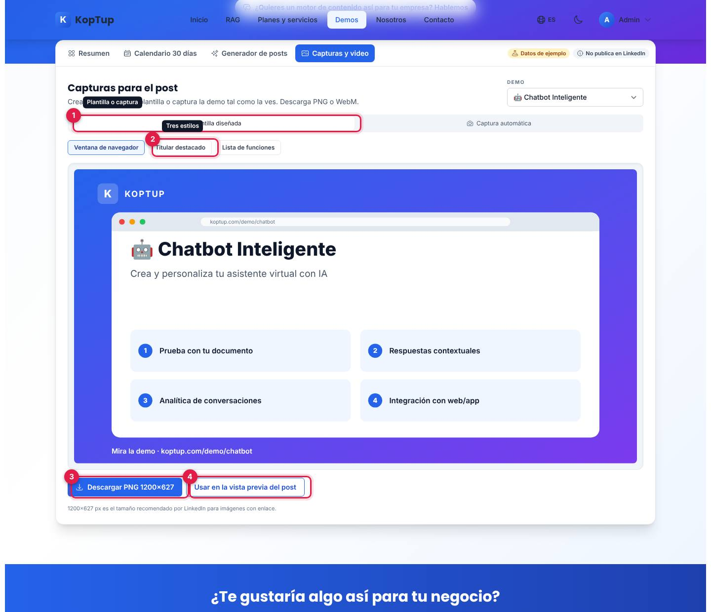

*Pestaña «Capturas y video» en modo «Plantilla diseñada».*

1. **Plantilla diseñada / Captura automática**: dos formas de crear el visual.
2. **Tres estilos**: «Ventana de navegador», «Titular destacado» y «Lista de funciones», con el título, la descripción y las funciones de la demo elegida.
3. **Descargar PNG 1200×627**: el tamaño que recomienda LinkedIn para imágenes con enlace.
4. **Usar en la vista previa del post**: pasa la imagen al generador; aparece «Imagen agregada a la vista previa del post» con el botón «Ir al generador».

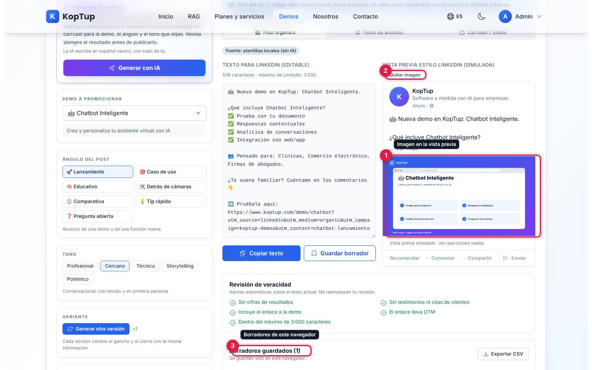

*De vuelta en el generador: el post simulado ya lleva la imagen.*

1. **Imagen en la vista previa**.
2. **Quitar imagen**.
3. **Borradores guardados**: lista con «Abrir», «Copiar», «Eliminar» y «Exportar CSV».

Para cerrar: «¿Quieres un motor de contenido así para tu empresa? Hablemos» (botón de la portada) lleva a `/contact`.

---

## Pantallas y funciones

### Resumen

Ver la [vista general](#guía-de-la-demo-generador-de-contenido-para-linkedin-con-ia). Las tarjetas «Paso 1/2/3» son botones que abren Calendario, Generador y Capturas. El cuadro «Qué hace y qué no hace» lista que genera con IA o plantillas (y dice cuál usó), que guarda borradores y exporta CSV, que crea imágenes, PDF del carrusel y capturas, y que agrega UTM; y que **no** se conecta a tu cuenta de LinkedIn, **no** mide alcance ni clics y **no** inventa resultados.

### Calendario 30 días

Cada tarjeta muestra el día, la fecha (calculada en el navegador a partir del lunes elegido), el formato (Texto, Imagen, Carrusel o Video, con su color), la demo, el ángulo y una nota estratégica. Clic en una tarjeta abre el generador con ese plan (ver [paso 2](#paso-2--elige-un-día-del-calendario--45-s)).

### Generador de posts

Tiene tres vistas: **Post orgánico** (pasos 3 y 4), **Texto de anuncio** y **Carrusel**.

#### Generar con IA

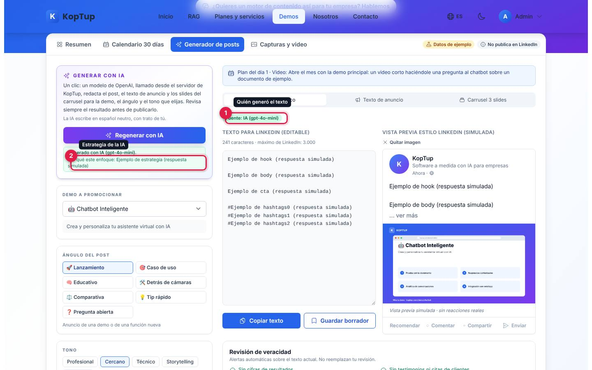

*Después de «Generar con IA»: la fuente cambia a «Fuente: IA (gpt-4o-mini)» y aparece «Por qué este enfoque». En esta captura el texto viene del modelo simulado del entorno de pruebas («Ejemplo de… (respuesta simulada)»); con la clave real lo redacta GPT-4o mini.*

1. **Quién generó el texto**: «Fuente: IA (gpt-4o-mini)».
2. **Estrategia de la IA**: «Generado con IA (modelo). Por qué este enfoque: …». El botón cambia a «Regenerar con IA».

Si la IA no responde, la demo dice por qué («la IA no está disponible ahora mismo: …»: falta la clave, se llegó al límite, no tienes acceso aprobado, la respuesta llegó incompleta, no hubo conexión o error del servidor) y **muestra la versión de plantillas locales** (o mantiene tu texto editado).

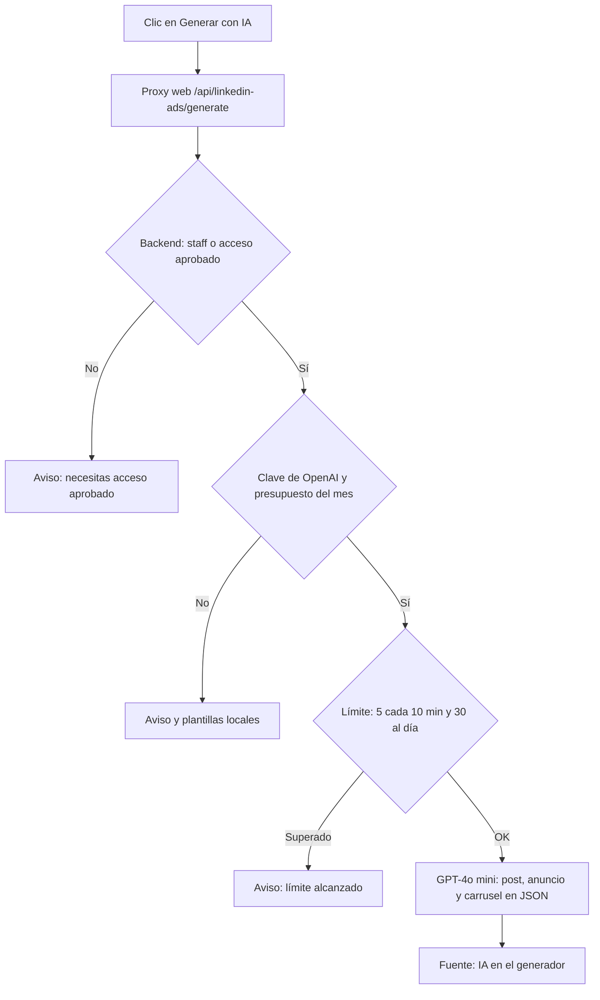

*Qué pasa al pulsar «Generar con IA». En todos los casos de aviso, el generador sigue funcionando con plantillas locales.*

#### Texto de anuncio

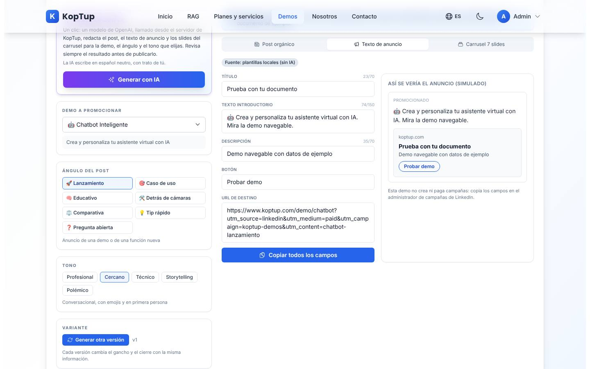

*Campos para el administrador de campañas de LinkedIn y su simulación.*

Muestra **Título** (máx. 70), **Texto introductorio** (máx. 150), **Descripción** (máx. 70), **Botón** y **URL de destino** (con UTM de pauta si está activada), con contador y aviso «Supera el límite». «Copiar todos los campos» los copia juntos. A la derecha, «Así se vería el anuncio (simulado)». La demo aclara que no crea ni paga campañas.

#### Carrusel

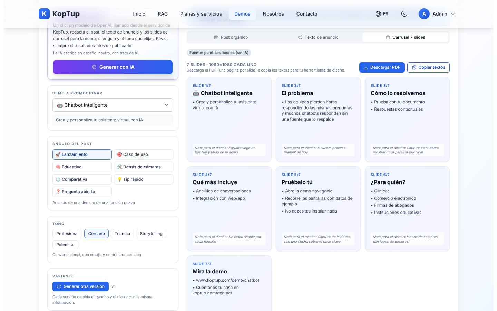

*Siete slides de 1080×1080 con su nota para el diseño.*

Cada slide trae título, viñetas y una «Nota para el diseño». **Descargar PDF** genera en el navegador un PDF con una página por slide (LinkedIn publica carruseles como documento PDF). **Copiar textos** copia todos los slides en texto.

#### Borradores guardados

Se guardan **solo en este navegador** (máximo 50). Cada uno muestra fecha, fuente (IA, Plantillas o Editado) y caracteres, con «Abrir» (lo carga en el editor), «Copiar» y «Eliminar». «Exportar CSV» descarga todos.

### Capturas y video

**Plantilla diseñada:** ver [paso 5](#paso-5--suma-el-visual--1-min-30-s).

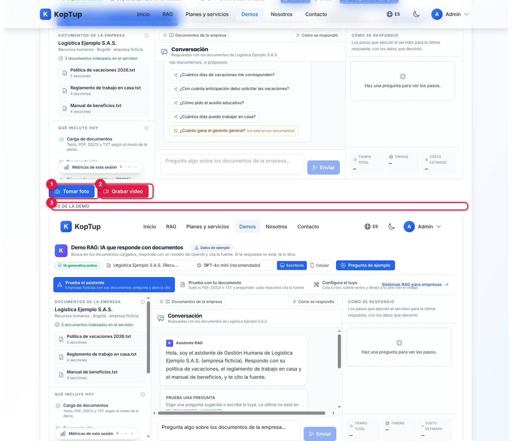

*Modo «Captura automática»: la demo real cargada en un recuadro y la foto tomada debajo.*

1. **Tomar foto**: toma exactamente lo que se ve en el recuadro y lo muestra como «Foto de la demo», con «Descargar PNG» y «Usar en la vista previa del post».
2. **Grabar video**: graba mientras navegas por la demo dentro del recuadro (botón «Detener (n s)»); se descarga en **WebM**. La demo avisa que LinkedIn no acepta WebM y sugiere convertirlo a MP4.
3. **Foto de la demo**: el resultado.

El selector «Demo» (arriba a la derecha) cambia la demo del recuadro; «Abrir en otra pestaña» la abre aparte. No pide permisos porque la demo está en el mismo sitio.

### En el celular

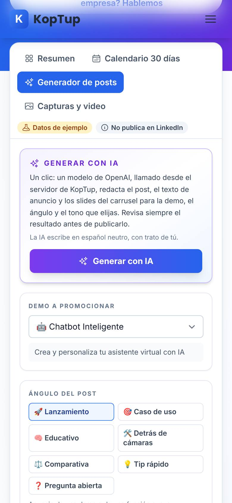

*Pestaña «Generador de posts» en un teléfono de 390 px: las pestañas y los rótulos se acomodan en varias líneas y los bloques se apilan.*

---

## Qué es real y qué es simulado

| Elemento | Real o simulado | Detalle |
|---|---|---|
| Catálogo de 25 demos | **Real** | Título, descripción y funciones salen de las tarjetas del [catálogo de demos](Doc-07-Guia-de-Demos.md); sector, público y problema, de los textos de esta demo. |
| Calendario de 30 días | **Datos de ejemplo** | Plan fijo en el código; las fechas se calculan en el navegador. |
| Texto con plantillas locales | **Real, sin IA** | Se arma en el navegador a partir del catálogo; sin cifras ni testimonios. |
| Generar con IA | **IA real** | El navegador llama a la web (`/api/linkedin-ads/generate`), que reenvía al backend; el backend llama a OpenAI (GPT-4o mini) con salida JSON. Tiene límites y tope de gasto. |
| Revisión de veracidad | **Real** | Reglas en el navegador (no usa IA). |
| Vista previa del post y del anuncio | **Simulado** | Imitan LinkedIn; no hay reacciones ni métricas reales. |
| Publicar o pautar en LinkedIn | **No existe** | No se conecta a LinkedIn. |
| Borradores, preferencia de UTM e inicio del calendario | **Real, solo local** | `localStorage` de este navegador. |
| PDF del carrusel e imagen 1200×627 | **Real** | Se generan en el navegador. |
| Foto y video de una demo | **Real** | Captura del recuadro con la demo real (foto PNG, video WebM). |

---

## Acceso

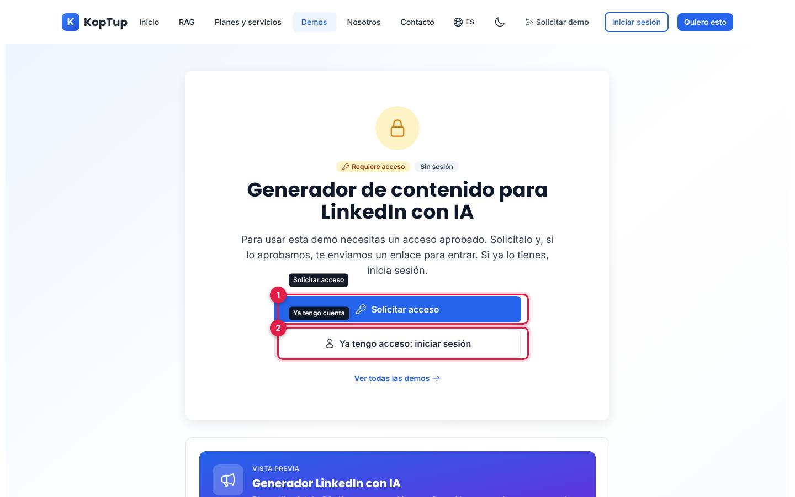

*Lo que ve un visitante sin sesión en `/demo/linkedin-ads` (la URL no cambia).*

- **Cómo la ve un visitante:** la demo está en modo **Con solicitud** (`solicitud`). Sin sesión o sin acceso aprobado, la dirección `/demo/linkedin-ads` muestra la pantalla de acceso: rótulos «Requiere acceso» y «Sin sesión», el texto «Para usar esta demo necesitas un acceso aprobado…», y debajo una **vista previa** con la descripción de la tarjeta del catálogo.
  1. **Solicitar acceso**: abre el formulario `/solicitar-demo` con esta demo ya marcada.
  2. **Ya tengo acceso: iniciar sesión**: va a `/login` y, al entrar, vuelve a la demo.
- **Cómo se concede:** el equipo revisa la solicitud en **Admin › Solicitudes de demo** y, al aprobarla, el visitante recibe un enlace para activar su cuenta; luego ve la demo en **Mis demos** del portal. Los accesos vigentes se gestionan en **Admin › Accesos a demos** y el modo de la demo en **Admin › Catálogo de demos**. El personal de KopTup (staff) la ve siempre, sin solicitud. Si el acceso vence o se revoca, la pantalla lo dice. Detalle en el [Manual del administrador](Doc-06-Manual-del-Administrador.md) y en [Flujos del visitante](Doc-04-Flujos-del-Visitante.md).
- **Doble control:** además de la pantalla de acceso, el servidor vuelve a verificar el acceso en cada «Generar con IA» (staff o acceso aprobado a `linkedin-ads`). Si el admin dejara la demo abierta, el límite de IA se contaría por IP en lugar de por cuenta.

---

## Limitaciones conocidas

- **La tarjeta del catálogo no coincide con la demo.** La vista previa de la pantalla de acceso (y la tarjeta en `/demo`) dice «Vista previa real de LinkedIn + 8 ángulos × 5 tonos», pero la demo tiene **7** ángulos y su vista previa es **simulada** (así lo rotula ella misma).
- **No publica ni mide.** No hay conexión con LinkedIn, ni alcance, ni clics, ni seguidores.
- **Todo lo guardado vive en este navegador.** Borradores (máx. 50), preferencia de UTM e inicio del calendario se pierden si borras los datos del navegador o cambias de equipo.
- **Límites de la IA:** 5 generaciones cada 10 minutos y 30 al día por cuenta, y un tope de gasto mensual (20 USD por defecto, configurable). Al pasarlos, la demo avisa y sigue con plantillas.
- **El resultado de la IA se descarta al cambiar opciones.** Si cambias demo, ángulo, tono o versión después de generar con IA, el texto vuelve a las plantillas locales; hay que generar de nuevo.
- **La UTM solo se agrega si el texto trae el enlace exacto de la demo.** Si la IA o tu edición lo quitan, la revisión marca «No incluye el enlace a la demo» y «El enlace no lleva UTM»; hay que agregarlo a mano. Lo vimos con el texto de la IA en el entorno de pruebas.
- **Video en WebM y a pocos cuadros por segundo.** LinkedIn no acepta WebM; hay que convertirlo a MP4. La cantidad de cuadros depende del equipo.
- **La foto automática redibuja la página.** Puede verse un poco distinta de la pantalla real: por ejemplo, salen barras de desplazamiento y no salen efectos como el desenfoque de fondo.
- **Portapapeles:** si el navegador bloquea la copia, la demo dice «No se pudo copiar automáticamente; selecciona el texto y cópialo».
- **Botones:** la sonda automática probó los elementos de la primera pantalla y ninguno quedó sin efecto (la pestaña «Resumen» ya activa no cambia nada, como es de esperar). El resto de pestañas y botones se probó a mano en este recorrido y funcionaron, incluida la descarga del PDF del carrusel.
